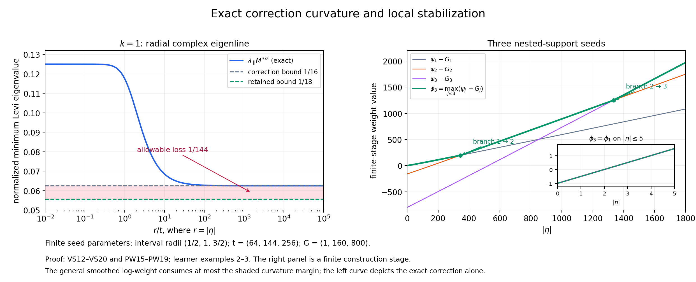
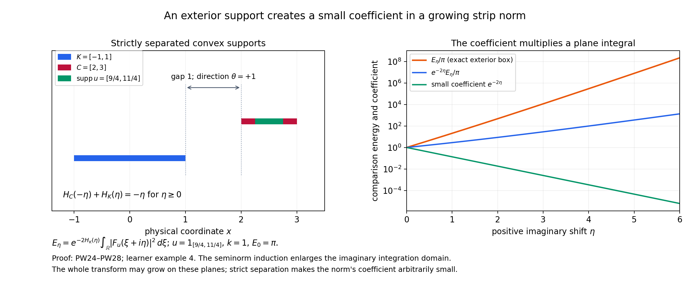

# Building a complex weight from compact Fourier tests

*Original learner material by GPT-6.1 Sol (OpenAI), Ultra reasoning effort, October 2026. Self-checked; CC0.*

The [formal companion](#complete-proof) proves the full variable-scale lemma and four-condition weight theorem. The scale smooths a possibly nonsmooth real frequency weight, a radial correction supplies curvature, and a stabilized maximum joins the supports in a compact exhaustion. A separate exterior-support estimate makes the resulting integral dominate any continuous seminorm of compact weighted tests.

Use the Fourier convention and complex estimates of [L148](../AN02-L148.html). Write \(z=\xi+i\eta\), \(M=(t^2+|\eta|^2)^{1/2}\), and \(\partial_z=(\partial_\xi-i\partial_\eta)/2\). The coefficient one quarter in a one-dimensional Levi derivative matters in these examples.

## Worked example 1. Smooth a weight with a corner

In one dimension let
\[
k(\xi)=(1+\max(\xi,0))^2,\qquad
\ell(\xi)=2\log(1+\max(\xi,0)).
\tag{L149.1}
\]
The inequality
\(1+\max(\xi+h,0)\le(1+|h|)(1+\max(\xi,0))\)
shows that \(C=1,N=2\) are valid. This weight is not even, and its logarithm has a derivative jump at zero.

Choose the symmetric probability bump
\[
\chi(y)=a\exp[-1/(1-y^2)]\quad(|y|<1),\qquad
\chi(y)=0\quad(|y|\ge1),
\tag{L149.2}
\]
where \(a\) is the reciprocal of its positive finite integral. Repeated differentiation produces a rational function of \(1-y^2\) times the exponential; the exponential tends to zero faster than every reciprocal power at the endpoints. Thus the zero extension is smooth. The regularized logarithm is
\[
\ell_t(\xi,\eta)=2\int_{-1}^1
\chi(y)\log(1+\max(\xi+My,0))\,dy.
\tag{L149.3}
\]
At \(\xi=0\) it is \(2\int_0^1\chi(y)\log(1+My)\,dy>0\), so \(k_t(0,\eta)>1=k(0)\). Smoothing is not pointwise equality with the starting weight. VS5–VS6 give instead the exact useful comparison
\(M^{-4}\le k_t(\xi,\eta)/k(\xi)\le M^4\).

The distributional derivatives of the original logarithm are
\[
\ell'(\xi)=\frac{2\,1_{\{\xi>0\}}}{1+\xi},\qquad
\ell''=2\delta_0-\frac{2\,1_{\{\xi>0\}}}{(1+\xi)^2}.
\tag{L149.4}
\]
The jump of \(\ell'\) is two, giving the positive delta term. Convolution at a fixed \(M\) therefore gives
\[
\partial_\xi^2\ell_t
=\frac2M\chi(-\xi/M)
-2\int_{\xi+My>0}\frac{\chi(y)}{(1+\xi+My)^2}\,dy.
\tag{L149.5}
\]
Both terms can be substantial; their cancellation is part of the derivative-scale estimate. The full proof VS7–VS10 does not need to differentiate \(\ell\) at its corner: it differentiates the smooth kernel instead. Formula L149.5 supplies an independent check of that argument.

## Worked example 2. Exact radial curvature

Take \(k=1\). Then \(\ell_t=0\), and the correction itself is
\[
p_t(\eta)=t^{-1/2}M-M^{1/2}.
\tag{L149.6}
\]
Let \(r=|\eta|\). In complex dimension at least two the radial complex line is spanned by the real vector \(\eta\); a tangential complex direction has \(\sum_j\eta_jw_j=0\). The corresponding eigenvalues of the Levi form are
\[
\begin{aligned}
\lambda_\parallel&=
\frac{t^2}{4M^3}\left(t^{-1/2}-\frac1{2\sqrt M}\right)
+\frac{r^2}{16M^{7/2}},\\
\lambda_\perp&=
\frac1{4M}\left(t^{-1/2}-\frac1{2\sqrt M}\right).
\end{aligned}
\tag{L149.7}
\]
To derive them, differentiate \(p_t(r)\). Its first derivative is
\((r/M)(t^{-1/2}-1/(2\sqrt M))\), its second derivative is the first displayed eigenvalue multiplied by four, and its tangential real Hessian eigenvalue is \(p_t'(r)/r\). Divide each real Hessian eigenvalue by four. At \(r=0\) both limiting values are \(1/(8t^{3/2})\). In dimension one only the radial eigenvalue is present.
Formula VS14 gives \(f''(s)<0\) for \(s\ge t^2\), because \(t^{-1/2}s^{1/4}\ge1\). Thus the radial eigenvalue is the minimum; the tangential one is larger when \(r>0\).

The normalized radial eigenvalue has a particularly clear form. Put \(q=r/t\):
\[
\lambda_\parallel M^{3/2}
=\frac1{4(1+q^2)^{3/4}}+\frac{q^2-2}{16(1+q^2)}
\ge\frac1{16},\qquad
\lim_{q\to\infty}\lambda_\parallel M^{3/2}=\frac1{16}.
\tag{L149.8}
\]
The inequality follows from the full two-sign argument VS15–VS17. Equivalently, subtract \(1/16\); the result is
\((1+q^2)^{-1}[\, (1+q^2)^{1/4}/4-3/16\,]\ge(1+q^2)^{-1}/16>0\).
The limit at infinity gives the value shown. The general logarithmic smoothing can consume at most \(1/144\) of this normalized lower bound, leaving \(1/18\).

## Worked example 3. A stabilized finite maximum

Consider the first three centered compact intervals in \(X=(-3,3)\), with radii \(r_1=1/2,r_2=1,r_3=3/2\); take \(r_4=2\) and later radii increasing to three. For \(k=1\), choose
\[
(t_1,t_2,t_3)=(64,144,256),\qquad
(G_1,G_2,G_3)=(1,160,800),\qquad
\phi_3(i\eta)=\max_{j\le3}\{r_j|\eta|+p_{t_j}(\eta)-G_j\}.
\tag{L149.9}
\]
The gap to the next interval is \(1/2\) for these three stages, and
\(2/\sqrt{t_j}<1/2\), so the interior-support condition PW9 holds. Since \(M\ge t\),
\[
0\le p_t(\eta)\le t^{-1/2}(M-t)
=\frac{|\eta|^2}{\sqrt t(M+t)}
\le\frac{|\eta|^2}{2t^{3/2}}.
\tag{L149.10}
\]
The lower bound is \(M/\sqrt t\ge\sqrt M\); the upper bound follows because the derivative in \(M\) is at most \(t^{-1/2}\) and \(p_t=0\) at \(M=t\).

For \(|\eta|\le5\), the second seed minus the first, before vertical shifts, is at most \(5/2+25/(2\cdot144^{3/2})<3\), whereas \(G_2-G_1=159\). The corresponding third difference is at most \(5+25/(2\cdot256^{3/2})<6\), whereas \(G_3-G_1=799\). Hence \(\phi_3=\phi_1\) throughout this strip. This is an exact analytic stabilization statement, not a conclusion from sampled plots.

These constants also illustrate the wider inactivity regions in PW18. The second comparison on \(|\eta|\le161\) is bounded by \(161/2+161^2/(2\cdot144^{3/2})<89<159\). The third comparison on \(|\eta|\le301\) is bounded by \(301+301^2/(2\cdot256^{3/2})<313<799\). Thus \(B_2=160,B_3=300\) are compatible inactivity radii. Each new seed has gradient bound at most \(r_j+t_j^{-1/2}\), so the logarithmic gradient bound is certainly valid beyond those radii.

At larger imaginary frequencies the slopes of the later support functions let new branches become active. The resulting maximum has positive extra distributional curvature at a branch change, rather than a classical second derivative there. This is why PW4 is stated distributionally.

The displayed maximum is the first three branches, with their exact parameters. The final theorem continues the exhaustion and chooses the remaining constants and strip radii using the seminorm induction. The normalized curvature plot is the exact \(k=1\) correction, not a numerically constructed general-weight solution.

## Worked example 4. The exterior-support sign

At one finite construction stage let \(K=[-1,1]\), and let a smooth cutoff \(\chi\) be supported in \(C=[2,3]\). These intervals are separated in the direction \(\theta=1\), with gap one. Their supporting functions give
\[
H_C(-\eta)+H_K(\eta)=
\begin{cases}
-\eta,&\eta\ge0,\\
-4\eta,&\eta<0.
\end{cases}
\tag{L149.11}
\]
The positive imaginary direction gives decay; reversing it gives growth. If the stage weight satisfies \(\phi_{j+1}\le H_K-\log k+D\), PW24 becomes
\[
\|\chi u\|_{2,k}^2\le C_\chi e^{-2\eta}
\int|F_u(\xi+i\eta)|^2e^{-2\phi_{j+1}(\xi+i\eta)}\,d\xi
\quad(\eta\ge0).
\tag{L149.12}
\]
Its plane integral still contains the Fourier transform of the whole test \(u\). It is not the transform of \(\chi u\) on the right.

For a physical model choose \(u=1_{[9/4,11/4]}\), \(k=1\), and a cutoff equal to one near that inner interval, supported in \(C\). Then \(\|\chi u\|_2^2=1/2\), and
\[
\int|F_u(\xi+i\eta)|^2\,d\xi
=\frac{\pi}{\eta}(e^{11\eta/2}-e^{9\eta/2})\quad(\eta\ne0),
\qquad I(0)=\pi.
\tag{L149.13}
\]
This is Plancherel applied to \(e^{\eta x}u\). The comparison energy weighted by \(H_K(\eta)=\eta\) is
\[
E_\eta=e^{-2\eta}I(\eta)
=\pi\frac{e^{7\eta/2}-e^{5\eta/2}}{\eta}\quad(\eta>0),
\qquad E_0=\pi.
\tag{L149.14}
\]
The small factor \(e^{-2\eta}\) in the exterior estimate multiplies a plane energy which can grow. Their product for this model is
\(\pi(e^{3\eta/2}-e^{\eta/2})/\eta\), also growing. The proof does not say that the entire transform decays on these planes. It enlarges the integral's imaginary domain to make that integral control the exterior norm with an arbitrarily small coefficient.

The factor comes from the exact support-function gap in L149.11. The energy curves use the explicit exterior interval in L149.13–L149.14; the finite-stage weight comparison remains the assumption displayed in L149.12.

## Exercises with complete solutions

**Exercise 1 — entry: why only positive derivatives?** For the weight in example 1 and fixed \(\eta,t\), show that a bound \(|\ell_t(\xi,\eta)|\le D\log M\) for all \(\xi\) cannot be correct.

**Solution 1.** If \(\xi>M\), every \(\xi+My\) in the bump support is at least \(\xi-M>0\). Thus the probability integral gives \(\ell_t(\xi,\eta)\ge2\log(1+\xi-M)\), which tends to infinity as \(\xi\to\infty\). Its proposed right side is fixed. The correct zero-order statement controls \(\ell_t-\ell\), as in VS5. The estimate VS10 uses a positive derivative, whose kernel integral is zero and permits that subtraction.

**Exercise 2 — intermediate: a rigorous large parameter.** Suppose the constant \(D\) in VS18 is one. Give an explicit \(t\) satisfying VS19 without relying on a decimal approximation to the logarithm.

**Solution 2.** Take \(t=10^8\). Since \(e^3>1+3+9/2+27/6=13>10\), \(\log10<3\). Hence \((\log t)/\sqrt t<24/10^4<1/144\), the last inequality being \(24\cdot144<10^4\). Also \(t>e^2\), for example from the elementary series bound \(e<3\). The monotonicity of \((\log r)/\sqrt r\) for \(r\ge e^2\) gives the required bound for every \(M\ge t\), not just at the chosen parameter.

**Exercise 3 — intermediate: complex directions.** In \(\mathbb C^2\), let \(\eta=(r,0)\), \(r>0\). Compare the correction's Levi form on \(w=(1,0)\), \(w=(i,0)\), and \(w=(0,1)\). Does a purely imaginary first component make the direction tangential?

**Solution 3.** Each vector has norm one. In VS16 the modulus of \(\sum\eta_jw_j\) is \(r,r,0\), respectively. The first two values are therefore both \(\lambda_\parallel\), and the last is \(\lambda_\perp\). Multiplying a complex direction by \(i\) preserves its Hermitian quadratic value. Tangency here means the complex equation \(\sum\eta_jw_j=0\), not a test of real orthogonality after discarding imaginary components.

**Exercise 4 — intermediate: closed compact-support stages.** Let \(u_m\in E_j\) converge in the global \(B_{2,k}\) norm. Prove that its limit remains in \(E_j\), and explain which support condition is used.

**Solution 4.** The weighted inclusion into \(\mathcal S'\) is continuous by CF1, so \(u_m\) converges to the same limit distribution there. For every smooth compact test supported outside the fixed closed \(K_j\), each \(u_m\) has zero pairing; continuity gives zero for the limit. The definition of distributional support therefore puts it inside \(K_j\). Global membership is already supplied by the weighted norm limit. Hence \(E_j\) is closed in a complete Hilbert space, so it is Banach. The fixed support set is essential; supports escaping to infinity would not prove the same fixed-stage assertion.

**Exercise 5 — intermediate: the partition seminorms.** For the partition \(\chi_j=\theta_j\prod_{l<j}(1-\theta_l)\) in PW1, prove both local finiteness and continuity of \(\sum a_j\|\chi_j u\|_{2,k}\), for arbitrary positive \(a_j\).

**Solution 5.** The finite sum telescopes to \(1-\prod_{l\le J}(1-\theta_l)\). Around any given compact set, some \(\theta_J=1\), so the product is zero there and every later \(\chi_j\) vanishes on a neighborhood. Thus the partition sums to one and only finitely many supports meet that compact set. On \(E_i\) the seminorm sum therefore has finitely many terms. Each term is at most \(a_jA_k(\chi_j)\|u\|_{2,k}\) by CF6. Summing those finite constants proves its norm-continuity on each stage, and PW3 proves continuity in the inductive topology. No boundedness of the sequence \(a_j\) is needed.

**Exercise 6 — advanced: curvature at a maximum.** For \(a>0\) in one complex variable, compute the distributional Levi derivative of \(\max(a\eta,-a\eta)\). Then add \(p_t(\eta)\).

**Solution 6.** The maximum is \(a|\eta|\). The real derivative of \(|\eta|\) is \(\operatorname{sgn}\eta\), whose distributional derivative is \(2\delta_{\eta=0}\). Because the function is independent of \(\xi\), its Levi derivative is one quarter of that second real derivative, hence \((a/2)\delta_{\eta=0}\). This is line measure, integrated in \(\xi\), in the complex plane. It is nonnegative and is not represented by the classical second derivative away from the line, which is zero. Adding \(p_t\) adds its smooth positive radial Levi value. The lower bound is retained, together with this extra positive singular curvature. This concrete case explains the distributional formulation in PW4.

**Exercise 7 — advanced: why fixed-stage integrals are finite.** Let \(u\) be supported in a compact convex \(K\Subset X\). Use PW5 for an enlarged set \(K+\rho\overline B\Subset X\) to prove the full complex norm is bounded by a constant times the real weighted norm.

**Solution 7.** The enlarged supporting function is \(H_K(\eta)+\rho|\eta|\). Squaring PW5 gives \(e^{-2\phi}\le C^2 e^{-2H_K}e^{-2\rho|\eta|}k(\xi)^2\). The supremum of \(e^{-2\rho r}(1+r^2)^{N+2n}\) is finite: continuity handles bounded \(r\), and exponential decay handles infinity. Bound the extra exponential by this supremum times \((1+r^2)^{-N-2n}\), then apply the full complex estimate CF17. Taking square roots gives PW32. The positive enlargement margin supplies the decay which the deduction needs. For a nonconvex compact support, first take its compact convex hull as in CF9.

**Exercise 8 — advanced: outside does not imply separated.** Let \(K=[-1,1]\) and \(S=\{-2,2\}\). Calculate \(H_S(-\theta)+H_K(\theta)\) for the two unit directions in \(\mathbb R\). Explain why exterior cutoffs need smaller separated convex supports.

**Solution 8.** For either \(\theta=1\) or \(\theta=-1\), \(H_S(-\theta)=2\) and \(H_K(\theta)=1\), giving three, not a negative gap. Although each point of \(S\) is outside \(K\), its convex hull contains \(K\). A single strict separating direction therefore does not exist. Splitting the exterior region into sufficiently small balls gives compact convex supports individually separated from \(K\); the ball near two uses direction \(1\), and the ball near minus two uses direction \(-1\). The finite partition PW21 uses exactly this stronger property.

**Exercise 9 — synthesis: turn a plane estimate into a strip estimate.** In example 4 let \(A>2\), and integrate L149.12 over \(A-2<\eta<A\). Find an explicit coefficient multiplying the square-root strip integral.

**Solution 9.** This interval is the real unit ball centered at \(A-1\), and has volume two. Throughout it \(e^{-2\eta}\le e^{-2A+4}\). Integrating the squared-norm inequality gives
\(2\|\chi u\|_{2,k}^2\le C_\chi e^{-2A+4}\int_{A-2<\eta<A}\int|F_u|^2e^{-2\phi_{j+1}}\,d\xi d\eta\).
The interval lies inside \(|\eta|<A\), so taking square roots gives a coefficient \(\sqrt{C_\chi/2}\,e^2 e^{-A}\) multiplying that full strip norm. The coefficient tends to zero with \(A\), independently of \(u\). For finitely many cutoff pieces choose one \(A\) making their coefficient sum at most the prescribed inductive margin.

**Exercise 10 — synthesis: pass to the weight and its weak density.** Explain why PW30 is monotone despite the increasing weights \(\phi_j\). Then, for a continuous linear form dominated by the resulting norm, recover the reflected weak density with its exact data norm.

**Solution 10.** Increasing \(\phi_j\) alone decreases \(e^{-2\phi_j}\), so expanding domains would not by themselves imply monotonicity. The stronger fact is exact stabilization: all future branches leave \(|\eta|<A_j\) unchanged. There \(\phi=\phi_j\), and \(P_j^2\) equals the integral of the single final nonnegative integrand over \(|\eta|<A_j\). These domains increase, so monotone convergence applies. Since \(\alpha_j=j/(j+1)\to1\), the stage inequality passes to the full seminorm bound.

For the density, take the closed image of \(u\mapsto F_u e^{-\phi}\) in \(L^2(\mathbb C^n)\). The dominated form has norm at most one there, so the actual Hilbert representation gives \(g\) of \(L^2\) norm at most one with \(L(u)=\int F_u e^{-\phi}\overline g\). Put
\[
V(z)=e^{-\phi(-z)}\overline{g(-z)}.
\tag{L149.15}
\]
Reflection preserves Lebesgue measure, so \(\int|V(z)|^2e^{2\phi(-z)}\,dV(z)=\|g\|_2^2\le1\), and changing \(z\) to \(-z\) gives \(L(u)=\int V(z)F_u(-z)\,dV(z)\). This is an absolute weak pairing by Cauchy–Schwarz. Its local distribution belongs to the reciprocal reflected space by L148 CF7–CF11. Neither the reflected transform nor the reflected data weight can be silently replaced.

## Reproducibility and source map

The editable figures and calculations accompany the complete formal proof. Independent checks evaluate the actual nonsmooth-weight convolution in two coordinates, kernel and distributional derivative formulas, physical radial Hessians, finite-branch comparisons and the exterior interval's physical Fourier integrals. They supplement the analytic proofs.

The exact source map is in the formal companion: VS1–VS20 reconstruct H-II Lemma 15.2.3, and PW1–PW35 with PW3a reconstruct Theorem 15.2.1 and the partition/duality and subsequent representation passages. The classical source is Lars Hörmander, *The Analysis of Linear Partial Differential Operators II*, §15.2, printed pp. 279–285. This packet contains original exposition, solutions and artwork with ordinary attribution.

## Complete proof

*Original proof by GPT-6.1 Sol (OpenAI), Ultra reasoning effort, October 2026. Self-checked; CC0.*

We prove the complete regularization of Hörmander II, Lemma 15.2.3, and then assemble the full four-condition weight and seminorm domination of Theorem 15.2.1. The exact curvature power is \((1+|\operatorname{Im}z|^2)^{-3/4}\), matching the scale \(M^{-3/2}\) in the regularization lemma.

Let \(k:\mathbb R^n\to(0,\infty)\) satisfy
\[
k(\xi+h)\le(1+C|h|)^N k(\xi),\qquad C,N>0.
\tag{VS1}
\]
Reversing the shift gives the reciprocal bound. Thus \(\ell=\log k\) is continuous and globally Lipschitz, since
\[
|\ell(\xi+h)-\ell(\xi)|\le N\log(1+C|h|)\le NC|h|.
\tag{VS2}
\]
No differentiability of the original weight is assumed.

Fix a nonnegative \(\chi\in C_c^\infty(\mathbb R^n)\), supported in the unit ball, with integral one. For \(t\ge2\), define
\[
M=M(\eta,t)=(t^2+|\eta|^2)^{1/2},\qquad
\ell_t(\xi,\eta)=\int\chi(y)\ell(\xi+My)\,dy,\qquad k_t=e^{\ell_t}.
\tag{VS3}
\]

## VS1. The exact comparisons and all positive-order derivatives

For every real shift \(h\),
\[
(1+C|h|)^{-N}\le
\frac{k_t(\xi+h,\eta)}{k_t(\xi,\eta)}
\le(1+C|h|)^N.
\tag{VS4}
\]
Indeed integrate the two bounds for the difference of logarithms in VS2 against the nonnegative probability kernel. Also
\[
|\ell_t(\xi,\eta)-\ell(\xi)|\le N\log(1+CM)\le N'\log M,
\tag{VS5}
\]
where one may take \(N'=N[1+\log(1+C)/\log2]\). Here \(M\ge2\) and
\(1+CM\le(1+C)M\le M^{1+\log(1+C)/\log2}\). Exponentiating gives
\[
M^{-N'}\le k_t(\xi,\eta)/k(\xi)\le M^{N'}.
\tag{VS6}
\]

The function \(\ell_t\) is smooth in all \(2n\) real variables, even when \(k\) is only continuous. Write its kernel in the unscaled integration variable:
\[
\ell_t(\xi,\eta)=\int R(\xi,\eta;\theta)\ell(\theta)\,d\theta,\qquad
R=M^{-n}\chi((\theta-\xi)/M).
\tag{VS7}
\]
On every compact parameter set the support in \(\theta\) is bounded. The continuous \(\ell\) is bounded there, and every kernel derivative is bounded there; differentiation under the integral is therefore valid to every order.

For a multi-index \(\alpha\) in \((\xi,\eta)\), of total order \(m\), the kernel obeys
\[
|\partial^\alpha R(\xi,\eta;\theta)|
\le A_\alpha M^{-n-m}1_{\{|\theta-\xi|\le M\}}.
\tag{VS8}
\]
Here is the derivative-scale justification. The function \(M\) is the Euclidean norm of \((\eta,t)\), so its \(\eta\)-derivatives of order \(j\) are homogeneous of degree \(1-j\) and are bounded on the unit sphere. Hence \(|\partial_\eta^\beta M|\le A_\beta M^{1-|\beta|}\). A \(\xi\)-derivative of the kernel contributes \(M^{-1}\) and a derivative of \(\chi\). An \(\eta\)-derivative of \(M^{-n}\), or of \((\theta-\xi)/M\), contributes another \(M^{-1}\), multiplied by a bounded function of \(\eta/M,t/M\) and \((\theta-\xi)/M\) on the kernel support. Induction and the finite product rule give VS8 for every \(m\). The constants depend on the derivative order, dimension and fixed kernel, not on \(t,\xi,\eta\).

For \(m\ge1\), \(\int\partial^\alpha R\,d\theta=0\), because \(\int R=1\) for every parameter. Thus, after differentiating VS7, one may subtract the constant \(\ell(\xi)\) from its integrand:
\[
\partial^\alpha\ell_t
=\int\partial^\alpha R(\xi,\eta;\theta)
                      [\ell(\theta)-\ell(\xi)]\,d\theta.
\tag{VS9}
\]
This is an algebraic subtraction after differentiation; no derivative of the nonsmooth \(\ell(\xi)\) is being taken. On the kernel support VS2 bounds the bracket by \(N\log(1+CM)\le N'\log M\). Integrating VS8 over that support therefore proves
\[
|\partial^\alpha\ell_t(\xi,\eta)|
\le D_\alpha M^{-|\alpha|}\log M,\qquad |\alpha|\ge1.
\tag{VS10}
\]
The derivative estimate is for positive order. A zero-order bound independent of \(\xi\) would be false for a nonconstant polynomially growing weight; its correct zero-order comparison is VS5.

## VS2. The radial correction and the factor \(1/18\)

Use \(z=\xi+i\eta\), \(\partial_{z_j}=(\partial_{\xi_j}-i\partial_{\eta_j})/2\). Set
\[
p_t(\eta)=t^{-1/2}M(\eta,t)-M(\eta,t)^{1/2},\qquad
\psi_t(z)=-\ell_t(\xi,\eta)+p_t(\eta).
\tag{VS11}
\]
For all sufficiently large \(t\),
\[
\sum_{j,l}w_j\overline w_l
       \partial_{z_j}\partial_{\overline z_l}\psi_t(z)
\ge\frac1{18}M(\eta,t)^{-3/2}|w|^2
\quad(w\in\mathbb C^n).
\tag{VS12}
\]

To compute the correction exactly, let \(s=t^2+|\eta|^2=M^2\) and
\[
f(s)=t^{-1/2}s^{1/2}-s^{1/4}.
\tag{VS13}
\]
Differentiation gives
\[
f'(s)=\tfrac12t^{-1/2}s^{-1/2}-\tfrac14s^{-3/4},
\qquad
f''(s)=-\tfrac14t^{-1/2}s^{-3/2}+\tfrac3{16}s^{-7/4}.
\tag{VS14}
\]
Consequently
\[
f'(s)+2sf''(s)=\tfrac18s^{-3/4},
\qquad f'(s)\ge\tfrac14s^{-3/4}\quad(s\ge t^2).
\tag{VS15}
\]
The last inequality uses \(t^{-1/2}s^{1/4}\ge1\). Because \(p_t=f(t^2+|\eta|^2)\) is independent of \(\xi\), its complex Levi form is one quarter of its real \(\eta\)-Hessian:
\[
\mathcal L_{p_t}(w)=
\tfrac12 f'(s)|w|^2+f''(s)\left|\sum_j\eta_jw_j\right|^2.
\tag{VS16}
\]
If \(f''\ge0\), VS15 gives a lower bound \(s^{-3/4}|w|^2/8\). If \(f''<0\), Cauchy–Schwarz gives
\[
\mathcal L_{p_t}(w)\ge
[\tfrac12 f'(s)+sf''(s)]|w|^2
=\tfrac1{16}s^{-3/4}|w|^2.
\tag{VS17}
\]
In the negative case replacing \(|\eta|^2\) by \(s\) decreases the lower bound, so the inequality direction is correct. Thus the \(1/16\) lower bound holds in both cases.

Every real second derivative of \(\ell_t\) is bounded by VS10. Expanding each complex second derivative into four real ones and using
\((\sum|w_j|)^2\le n|w|^2\) gives a constant \(D\), independent of \(t\), such that
\[
|\mathcal L_{\ell_t}(w)|
\le D M^{-2}\log M\,|w|^2.
\tag{VS18}
\]
Choose \(t\ge e^2\) large enough that
\[
D\frac{\log t}{\sqrt t}\le\frac1{144}.
\tag{VS19}
\]
The function \((\log r)/\sqrt r\) decreases for \(r\ge e^2\); since \(M\ge t\), the same bound holds with \(M\) in place of \(t\). Therefore VS17–VS18 yield
\[
\mathcal L_{\psi_t}(w)\ge
\left(\frac1{16}-\frac1{144}\right)M^{-3/2}|w|^2
=\frac1{18}M^{-3/2}|w|^2.
\tag{VS20}
\]
This proves VS12 and strict plurisubharmonicity in every complex direction. It proves the factor \(1/18\), not merely an unspecified positive constant. VS4, VS6 and VS10 are the three regularization estimates used in the source lemma. No convolution of \(k\) itself, evenness assumption, or derivative of the unsmoothed logarithm has been substituted.

The left panel shows the exact normalized radial correction and the margin used in VS20. The right panel shows three nested-support seeds with the learner example's parameters and an analytically stabilized strip. The final weight is constructed by continuing the exhaustion below.

## PW1. Compact-support stages and their topology

Use the negative-exponential Fourier transform and bilinear pairing in [the complex-estimate lesson](../AN02-L148.html). Write \(B_{2,k}\) with the squared norm \((2\pi)^{-n}\int k^2|\widehat u|^2\). Let \(X\subset\mathbb R^n\) be nonempty, open and convex.

Choose nonempty compact convex sets \(K_j\Subset X\), with \(K_j\subset\operatorname{int}K_{j+1}\), whose interiors cover \(X\). Such a sequence exists explicitly. Fix \(x_0\in X\). For all sufficiently large integers \(m\), the sets
\[
K(m)=\{x:|x-x_0|\le m,\ 
               \operatorname{dist}(x,\mathbb R^n\setminus X)\ge1/m\}
\tag{PW1}
\]
are nonempty, closed, bounded and convex. The distance condition is convex because it says \(x+B(0,1/m)\subset X\); convex combinations preserve these ball inclusions. The distance function is continuous, proving closedness. If \(X=\mathbb R^n\), interpret the distance as infinite and use the closed balls. Increasing \(m\) strictly increases both margins, so \(K(m)\subset\operatorname{int}K(m+1)\). These sets cover \(X\); reindexing them supplies the sequence.

Set
\[
E_j=\mathcal E'(K_j)\cap B_{2,k},\qquad
E=\bigcup_jE_j=\mathcal B_{2,k}^{\,c}(X).
\tag{PW2}
\]
Each \(E_j\), with the inherited weighted norm, is Banach. A norm limit converges in \(\mathcal S'\) by the weighted inclusion proved in CF1. Testing outside \(K_j\) shows that the limiting support remains in \(K_j\); hence \(E_j\) is a closed subspace of the weighted Hilbert space.

Give \(E\) the finest locally convex topology making all inclusions \(E_j\to E\) continuous. Concretely it is generated by all seminorms whose restrictions to every \(E_j\) are norm-continuous. This description makes the inclusions continuous, and any locally convex topology with that property has only such continuous seminorms, proving the stated maximal property. Consequently a seminorm \(q\) on \(E\) is continuous exactly when
\[
q(u)\le Q_j\|u\|_{2,k}\quad(u\in E_j)
\tag{PW3}
\]
for a finite constant on each stage. Necessity is continuity of the restriction and homogeneity; sufficiency is the displayed description of the topology. Cofinality of the compact exhaustion shows that using all compact support sets instead gives the same topology.

The locally finite partition description of this topology can also be proved explicitly. Choose \(0\le\theta_j\le1\), smooth, supported in \(\operatorname{int}K_{j+1}\), and equal to one near \(K_j\). Put \(\chi_1=\theta_1\) and
\(\chi_j=\theta_j\prod_{l<j}(1-\theta_l)\) for \(j\ge2\). The partial sum is \(1-\prod_{l\le j}(1-\theta_l)\). Every compact subset lies in a region where some \(\theta_J=1\), so all later \(\chi_j\) vanish on a neighborhood of it. Thus this is a locally finite smooth compact-support partition of unity on \(X\).

For any such partition and positive constants \(a_j\), the seminorm
\[
Q_a(u)=\sum_j a_j\|\chi_j u\|_{2,k}
\tag{PW3a}
\]
is finite on every compact test. On \(E_i\) only finitely many supports meet \(K_i\), and the multiplier bound CF6 proves \(Q_a(u)\le D_i\|u\|_{2,k}\), hence continuity by PW3. Conversely, for a continuous \(q\), choose a compact stage containing each \(\operatorname{supp}\chi_j\), and choose \(a_j>0\) at least its PW3 constant. The finite partition identity on the support of \(u\) and the seminorm triangle inequality give \(q(u)\le Q_a(u)\). These partition seminorms therefore generate the same inductive topology. This supplies the full partition argument in the source's introductory passage.

## PW2. The exact four-condition theorem

**Theorem PW2.** For every continuous seminorm \(q\) on \(E\), there is a finite real, locally Lipschitz function \(\phi\) on \(\mathbb C^n\) such that
\[
q(u)\le P_\phi(u):=
\left(\int_{\mathbb C^n}|F_u(z)|^2e^{-2\phi(z)}\,dV(z)\right)^{1/2}
\quad(u\in E),
\tag{PW4}
\]
and all four following conditions hold:

1. For every nonempty compact convex \(K\Subset X\),
\[
e^{-\phi(\xi+i\eta)}\le C_K e^{-H_K(\eta)}k(\xi).
\tag{PW5}
\]
2. For every \(A>0\),
\[
k(\xi)\le C_A e^{-\phi(\xi+i\eta)}\quad(|\eta|<A).
\tag{PW6}
\]
3. For a single constant \(C_0\),
\[
|\nabla\phi(\xi+i\eta)|\le C_0+\log(1+|\eta|)
\quad\text{almost everywhere}.
\tag{PW7}
\]
4. For a single \(c>0\), its complex Hessian satisfies
\[
\mathcal L_\phi(w)\ge c(1+|\eta|^2)^{-3/4}|w|^2
\quad(w\in\mathbb C^n)
\tag{PW8}
\]
in the distribution sense. In particular \(\phi\) is plurisubharmonic.

Moreover \(P_\phi\) is finite and continuous on \(E\). Its restriction to each fixed compact-support stage is equivalent to the weighted real norm. We prove the construction and all of these conclusions.

## PW3. Supporting-function seeds

Choose \(t_j\ge2\) large enough for VS12 and so that
\[
2t_j^{-1/2}<\operatorname{dist}
       (K_j,\mathbb R^n\setminus\operatorname{int}K_{j+1}).
\tag{PW9}
\]
The distance is positive by compactness and strict interior inclusion. We may increase the \(t_j\) so they are nondecreasing. Put
\[
\psi_j(\xi+i\eta)=H_{K_j}(\eta)-\ell_{t_j}(\xi,\eta)
                    +p_{t_j}(\eta).
\tag{PW10}
\]
The supporting function is convex and has Lipschitz constant
\(R_j=\sup_{x\in K_j}|x|\). As a function of \(\eta\) alone it has nonnegative distributional complex Hessian: smooth it by nonnegative real convolutions, which preserve convexity, and use the positive real Hessian of each smooth convex function divided by four. Local uniform convergence passes this positivity to its distributional derivatives. Thus VS12 gives
\[
\mathcal L_{\psi_j}(w)\ge
\tfrac1{18}(t_j^2+|\eta|^2)^{-3/4}|w|^2.
\tag{PW11}
\]
These seeds are locally Lipschitz. VS10 bounds the gradient of their smooth logarithmic part by \(D\log M/M\), uniformly in \(\xi\); differentiating \(p_t\) bounds its gradient by \(t^{-1/2}\). Therefore each seed has a finite global Lipschitz constant \(L_j\).

For every fixed strip, \(\psi_j+\log k\) has uniform upper and lower bounds, independent of \(\xi\), by VS5 and the boundedness of \(H_{K_j}\) and \(p_{t_j}\) on that strip. It also has a global lower bound: the scalar expression
\[
t_j^{-1/2}M-M^{1/2}-N'\log M,\qquad M\ge t_j,
\tag{PW12}
\]
is bounded below, because it is continuous and tends to infinity. Hence
\(\psi_j\ge H_{K_j}-\log k-D_j\).

There is also a useful global upper bound. VS5 gives
\[
\psi_j\le H_{K_j}(\eta)-\log k(\xi)
               +2t_j^{-1/2}|\eta|+D'_j
\le H_{K_{j+1}}(\eta)-\log k(\xi)+D'_j.
\tag{PW13}
\]
For the first inequality use \(M\le t_j+|\eta|\) and the fact that
\(N'\log M-\sqrt M\) is bounded above on \([t_j,\infty)\). This even gives the smaller coefficient \(t_j^{-1/2}\); the written coefficient two is convenient for PW9. The second inequality follows from
\(K_j+2t_j^{-1/2}\overline B\subset K_{j+1}\).

## PW4. A maximum preserves the variable Hessian lower bound

We will use the following local fact. If finite locally Lipschitz functions \(f,g\) both satisfy
\(\mathcal L_f,\mathcal L_g\ge a(z)I\) on an open set, where \(a>0\) is continuous, then their maximum does too.

On a ball \(B\) take \(b=\inf_B a\). The functions
\(f-b|z|^2\) and \(g-b|z|^2\) have nonnegative distributional complex Hessian. Smoothing shows that such a continuous function is plurisubharmonic: the smoothed Hessian is positive on interior balls, giving the line submean inequality, and local uniform convergence passes that inequality to the function. The maximum of two finite plurisubharmonic functions is plurisubharmonic: choose a function attaining the maximum at the center of each line circle, apply its submean, then bound it by the maximum on the circle. This maximum is continuous. Smoothing it now shows its complex Hessian is positive distributionally. Thus
\[
\mathcal L_{\max(f,g)}\ge bI\quad\text{on }B.
\tag{PW14}
\]
To recover the variable \(a\), let a nonnegative smooth test have compact support. Cover that support by finitely many sufficiently small balls on which the oscillation of \(a\) is below \(\varepsilon\), and split the test with a smooth nonnegative partition of unity. Apply PW14 to each summand in any fixed complex direction \(w\). Their sum gives the lower bound \((a-\varepsilon)|w|^2\) against the original test. Let \(\varepsilon\downarrow0\). This proves the claim. Finite maxima also preserve a common local Lipschitz bound, by the elementary inequality
\(|\max f_j(x)-\max f_j(y)|\le\max_j|f_j(x)-f_j(y)|\).
In particular, interpret gradients in the weak sense. If all their almost-everywhere gradient bounds are the same continuous function \(G(z)\), smooth them on an interior ball. Their smooth gradients are bounded by the supremum of \(G\) on a slightly larger ball; passing to the uniform limit gives that common Lipschitz constant there. The maximum has the same bound. A Lipschitz constant \(L\) gives weak directional derivatives bounded by \(L\): bounded difference quotients, tested against a compact smooth function and passed to the distributional limit, give a functional bounded by \(L\) times its \(L^1\) norm. The complete \(L^1\) duality in L043 represents it by an \(L^\infty\) function. Testing a countable dense set of real unit directions shows that the norm of the weak gradient is at most \(L\) almost everywhere. Apply this on shrinking balls from a countable base; continuity of \(G\) gives \(|\nabla\max f_j|\le G\) almost everywhere. Thus the variable gradient bound used below is preserved without assuming pointwise differentiability on a prescribed exceptional set.

## PW5. Vertical constants and local stabilization

Set
\[
\phi_j=\max_{1\le l\le j}(\psi_l-G_l),\qquad
\alpha_j=\frac j{j+1}.
\tag{PW15}
\]
We will choose increasing \(G_j\to\infty\) and increasing \(A_j\to\infty\) so that
\[
\phi_{j+1}=\phi_j\quad(|\eta|<A_j),
\qquad
q(u)\le\alpha_j
\left(\int_{|\eta|<A_j}|F_u(\xi+i\eta)|^2e^{-2\phi_j}\,d\xi d\eta\right)^{1/2}
\quad(u\in E_{j+3}).
\tag{PW16}
\]
Call the square-root integral \(P_j(u)\).

The curvature and gradient choices can be made independently of \(G_j\). The first seed obeys PW7 globally for a finite \(C_0\), and
\(\mathcal L_{\psi_1}\ge c(1+|\eta|^2)^{-3/4}I\) with
\[
c=\tfrac1{18}\min(t_1^{-3/2},2^{-3/4}).
\tag{PW17}
\]
For \(j\ge2\), choose increasing \(B_j\ge\max(t_j,j)\) so large that
\(|\nabla\psi_j|\le\log(1+|\eta|)\) for \(|\eta|>B_j\). This follows already from its finite \(L_j\). On that region PW11 and
\(t_j^2+|\eta|^2\le2|\eta|^2\le2(1+|\eta|^2)\)
give the curvature bound with the same \(c\).

Choose \(G_j\) large enough that
\[
\psi_j-G_j<\psi_1-G_1
\quad\text{for }|\eta|\le B_j+1.
\tag{PW18}
\]
This is possible uniformly in \(\xi\), by the strip comparisons in PW3. When \(G_1,\ldots,G_{j-1},A_{j-1}\) have been chosen, require the same strict inequality also on \(|\eta|\le A_{j-1}\), and require \(G_j\ge G_{j-1}+1\). Thus the new branch is inactive on that strip, proving the first condition of PW16. Where it may be active, \(|\eta|>B_j\), both the preceding maximum and the new branch have the common curvature and gradient bounds. PW4, applied on this open region, preserves curvature; the common Lipschitz bound preserves the gradient inequality. On \(|\eta|<B_j+1\) the maximum is unchanged. The two open regions cover the whole space. Induction proves PW7–PW8 uniformly for every \(\phi_j\).

For any fixed strip, all sufficiently late branches are inactive there because \(B_j\to\infty\). Hence \(\phi_j\) stabilizes there to a finite maximum, uniformly in \(\xi\). Its pointwise increasing limit \(\phi\) is therefore finite and locally Lipschitz, with the same gradient and distributional curvature bounds. After the \(A_j\) are chosen below, the first part of PW16 gives the stronger exact identity
\[
\phi=\phi_j\quad(|\eta|<A_j).
\tag{PW19}
\]

## PW6. The initial seminorm estimate

Take \(A_1=1\). On this strip PW3 gives \(\psi_1+\log k\le D\), so
\[
P_1(u)^2\ge e^{2G_1-2D}
       \int_{|\eta|<1}|F_u(\xi+i\eta)|^2k(\xi)^2\,d\xi d\eta
\ge C_k^{-1}e^{2G_1-2D}\|u\|_{2,k}^2.
\tag{PW20}
\]
The last inequality is exactly CF22, for any compact \(u\). By PW3, \(q(u)\le Q_4\|u\|_{2,k}\) on \(E_4\). Choose \(G_1\) so large that
\(\alpha_1C_k^{-1/2}e^{G_1-D}\ge Q_4\).
Then the second part of PW16 holds for \(j=1\). Increasing \(G_1\) affects none of the derivative bounds.

## PW7. A finite partition with separated exterior supports

Suppose PW16 holds at level \(j\), and choose \(G_{j+1}\) as in PW5. We need a partition equal to one near \(K_{j+4}\) with
\[
\operatorname{supp}\chi_0\subset\operatorname{int}K_{j+3},
\qquad
\operatorname{supp}\chi_\nu\subset C_\nu,\ \nu\ge1,
\tag{PW21}
\]
where each \(C_\nu\) is a compact convex ball strictly separated from \(K_{j+2}\).

Choose a nonnegative central cutoff supported in \(\operatorname{int}K_{j+3}\), equal to one near \(K_{j+2}\). The remaining compact portion of \(K_{j+4}\) is outside a neighborhood of \(K_{j+2}\). Each of its points has a small ball in \(X\) whose closure is strictly separated from \(K_{j+2}\). To see the separation, minimize its distance to the compact convex set. If \(y\) is a nearest point and \(x\) the exterior center, differentiating distance along every segment in \(K_{j+2}\) gives
\((x-y)\cdot(z-y)\le0\) for all \(z\) in that set. Thus the direction \((x-y)/|x-y|\) separates the center with a positive gap; a sufficiently small ball retains the gap.

Take a finite such ball cover and smooth nonnegative cutoffs in those balls. Their sum with the central cutoff is positive on a neighborhood of \(K_{j+4}\). Divide each by that sum and multiply them all by one compact smooth cutoff equal to one near \(K_{j+4}\) and supported where the denominator is positive. This supplies a finite smooth partition with PW21. The central member still has central support, and the other members have their separated convex supports. In particular the convex hulls of the exterior supports remain separated; merely being outside the set would not have sufficed.

For \(u\in E_{j+4}\), \(u=\sum_{\nu=0}^r\chi_\nu u\), and \(\chi_0u\in E_{j+3}\). Apply the preceding seminorm estimate to this central piece and PW3 to all exterior pieces. Since
\(F_{\chi_0u}=F_u-\sum_{\nu\ge1}F_{\chi_\nu u}\),
the triangle inequality for the strip integral gives
\[
q(u)\le\alpha_jP_j(u)+D_j\sum_{\nu=1}^r\|\chi_\nu u\|_{2,k}.
\tag{PW22}
\]
Here \(D_j<\infty\). To justify the extra integral terms explicitly, on \(|\eta|<A_j\) PW3 gives \(e^{-\phi_j}\le D_{j,A_j}k(\xi)\). The plane estimate CF18, applied to each fixed compact \(C_\nu\), bounds the strip integral of \(F_{\chi_\nu u}\) by a finite constant times \(\|\chi_\nu u\|_{2,k}\). These constants and the fixed \(Q_{j+4}\) are absorbed into \(D_j\). There is no bound uniform over all stages being assumed.

## PW8. Exponential control of the exterior pieces

PW13, for the finitely many branches through \(j+1\), gives
\[
\phi_{j+1}(\xi+i\eta)
\le H_{K_{j+2}}(\eta)-\log k(\xi)+D'_{j+1}.
\tag{PW23}
\]
For an exterior cutoff write \(h_\nu=H_{C_\nu}\). CF20, whose cutoff operation is multiplication, and PW23 imply
\[
\|\chi_\nu u\|_{2,k}^2
\le D_\nu e^{2[h_\nu(-\eta)+H_{K_{j+2}}(\eta)]}
\int|F_u(\xi+i\eta)|^2e^{-2\phi_{j+1}(\xi+i\eta)}\,d\xi.
\tag{PW24}
\]
Strict separation provides a unit vector \(\theta_\nu\) and \(d_\nu>0\) with
\[
h_\nu(-\theta_\nu)+H_{K_{j+2}}(\theta_\nu)\le-d_\nu.
\tag{PW25}
\]
Both supporting functions are Lipschitz. For \(|\eta-R\theta_\nu|<1\), homogeneity and those Lipschitz bounds give
\[
h_\nu(-\eta)+H_{K_{j+2}}(\eta)
\le-d_\nu R+D''_\nu.
\tag{PW26}
\]
Choose \(A>1\) and set \(R=A-1\). The real \(n\)-dimensional unit ball about \(R\theta_\nu\) lies inside \(|\eta|<A\). Integrate PW24 over it, using its volume \(b_n\), to obtain
\[
\|\chi_\nu u\|_{2,k}
\le D'''_\nu e^{-d_\nu A}
\left(\int_{|\eta|<A}|F_u(\xi+i\eta)|^2e^{-2\phi_{j+1}}\,d\xi d\eta\right)^{1/2}.
\tag{PW27}
\]

The real intervals give an exact negative support-function gap in the positive imaginary direction. The model energy can grow while the coefficient becomes small; the induction controls its square-root integral over an enlarging strip. The learner companion computes all of the displayed curves.

The constants do not depend on \(A\) or \(u\). Choose \(A_{j+1}>A_j+1\) so large that
\[
D_j\sum_{\nu=1}^rD'''_\nu e^{-d_\nu A_{j+1}}
\le\alpha_{j+1}-\alpha_j=\frac1{(j+1)(j+2)}.
\tag{PW28}
\]
On the old strip \(\phi_{j+1}=\phi_j\), so \(P_j(u)\le P_{j+1}(u)\). PW22, PW27 and PW28 prove the second part of PW16 at level \(j+1\). If there are no exterior pieces, their sum is zero and any sufficiently large increasing \(A_{j+1}\) works. This completes the induction without a circular choice: the new vertical constant and weight are fixed before choosing the new strip radius.

## PW9. All four conditions and the limit inequality

The construction in PW5 already proves PW7–PW8. PW19 and the finite-strip upper comparison of each seed give a bound for \(\phi+\log k\) on every strip, proving PW6. For a compact convex \(K\Subset X\), choose \(j\) with \(K\subset K_j\). The lower comparison in PW3 gives
\[
\phi\ge\psi_j-G_j\ge H_{K_j}(\eta)-\log k(\xi)-D_j-G_j
\ge H_K(\eta)-\log k(\xi)-D_j-G_j.
\tag{PW29}
\]
Exponentiation proves PW5.

For fixed \(u\in E\), it belongs to \(E_{j+3}\) for every sufficiently large \(j\). By PW19,
\[
P_j(u)^2=\int_{|\eta|<A_j}|F_u(\xi+i\eta)|^2e^{-2\phi(\xi+i\eta)}\,d\xi d\eta.
\tag{PW30}
\]
These integrals increase as their domains increase. Monotone convergence, \(A_j\to\infty\) and \(\alpha_j\to1\) pass PW16 to PW4. Stabilization is what permits PW30; one must not incorrectly assert that arbitrary expanding domains with changing decreasing weights have monotone integrals.

## PW10. Finiteness, continuity and equivalence on stages

For any fixed compact support set \(S\Subset X\), its convex hull \(K\) is compact inside \(X\), by the finite-combination proof CF9. Enlarge it to \(L=K+\rho\overline B\Subset X\). PW5 then gives
\[
e^{-2\phi(\xi+i\eta)}
\le C_L^2e^{-2H_K(\eta)}e^{-2\rho|\eta|}k(\xi)^2.
\tag{PW31}
\]
The exponential factor absorbs the polynomial damper in CF17:
\(\sup_{r\ge0}e^{-2\rho r}(1+r^2)^{N+2n}<\infty\).
Consequently
\[
P_\phi(u)\le D_S\|u\|_{2,k}\quad
(\operatorname{supp}u\subset S).
\tag{PW32}
\]
This proves finiteness and continuity on every stage, hence on \(E\) by PW3. Conversely PW6 for \(A=1\) and CF22 give
\[
\|u\|_{2,k}^2
\le C_k C_1^2\int_{|\eta|<1}|F_u|^2e^{-2\phi}\,d\xi d\eta
\le C_k C_1^2P_\phi(u)^2.
\tag{PW33}
\]
Thus the norms are equivalent on each fixed support stage. PW4 and PW5–PW8 prove the entire source theorem. No assertion that a single real-weight norm describes the full inductive topology is made. If \(X\) is empty, its compact-test space is zero. Taking \(\phi=\psi_t\) from VS11 for large \(t\) gives finite-strip comparison, a globally bounded gradient and the curvature lower bound \(c_t(1+|\eta|^2)^{-3/4}\), with \(c_t=t^{-3/2}/18\). The compact growth condition is vacuous, and the zero seminorm inequality is immediate. This includes that endpoint. \(\square\)

## PW11. The consequent weak representation

The construction also proves the ensuing representation statement for continuous complex-linear forms on the \(p=2\) compact-test space. Apply PW2 with \(q(u)=|L(u)|\), and map \(u\) to \(F_u e^{-\phi}\) in \(L^2(\mathbb C^n)\). PW4 makes \(L\) a well-defined bounded linear form of norm at most one on that image: if the image is zero then PW4 makes \(L(u)=0\). Extend it by continuity to the closed image subspace, which is Hilbert. The full Hilbert representation in [L043 Lemma 1.1](../AN02-L043.html) applies to that closed subspace and gives \(g\in L^2(\mathbb C^n)\), with \(\|g\|_2\le1\), such that
\[
L(u)=\int F_u(z)e^{-\phi(z)}\overline{g(z)}\,dV(z).
\tag{PW34}
\]
Define \(V(z)=e^{-\phi(-z)}\overline{g(-z)}\). Reflection preserves complex volume, so
\[
\int|V(z)|^2e^{2\phi(-z)}\,dV(z)\le1,\qquad
L(u)=\int V(z)F_u(-z)\,dV(z).
\tag{PW35}
\]
Cauchy–Schwarz proves absolute convergence. The converse and the unique local distribution represented by this integral are the complete theorem CF7–CF11 in L148, with Lebesgue unit-ball mass \(b_{2n}\).

For precision the local bilinear dual identification also follows directly. A continuous form \(L\) on \(E\) restricts, for any compact smooth \(\chi\), to the bounded form \(h\mapsto L(\chi h)\) on \(B_{2,k}\), using PW3 on its fixed support and the multiplier CF6. Its representing global distribution lies in \(B_{2,1/\check k}\) by CF8. On ordinary compact smooth tests these distributions define a single distribution \(v\) by \(L\); distribution continuity follows from the finite smooth seminorm bound CF41. Their actions are \(\chi v\), proving its local membership. Conversely any such \(v\) acts continuously on each \(E_j\) by its cutoff global dual norm and the canonical compact pairing CF42–CF43, hence on \(E\). Therefore the continuous complex-linear forms are exactly the local reflected weighted distributions. This is the full continuous-dual identification in the source's introductory passage.

## Source scope and remaining course obligations

VS1–VS20 give the complete H-II Lemma 15.2.3 regularization, shift estimates, positive-order derivative bounds and exact \(1/18\) Levi constant. PW1–PW33 give the complete H-II Theorem 15.2.1, including its compact-support topology, all four conditions, uniform distributional curvature, exterior-piece induction and seminorm domination. PW34–PW35 supply the subsequent \(p=2\) weak representation with all reflections visible.

The lemma's \(M^{-3/2}\) has exactly the theorem's \((1+|\eta|^2)^{-3/4}\) scale at large imaginary frequency. This curvature decays more slowly than the second-derivative errors of order \(M^{-2}\log M\), allowing those errors to be absorbed. The following representation and division arguments use this precise comparison.

Source: Lars Hörmander, *The Analysis of Linear Partial Differential Operators II*, §15.2, Theorem 15.2.1 and Lemma 15.2.3, printed pp. 279–285; 1983 edition, second revised printing 1990, reprint 2005. Original arguments with ordinary attribution are given here; no protected page or image belongs to the public packet.
