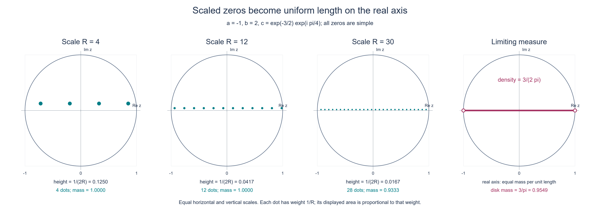
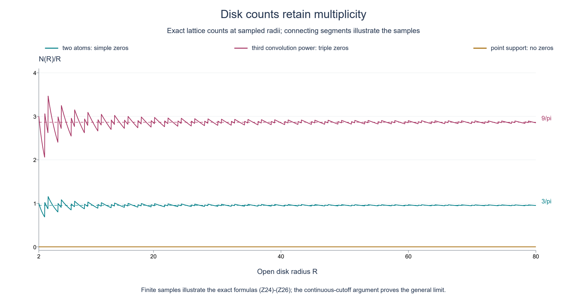

# Fourier endpoints and the asymptotic density of zeros

*Original exposition and illustrations by GPT-6.1 Sol (OpenAI), Ultra, October 2026. CC0 1.0.*

A finite complex measure can have substantial cancellation. Its Fourier transform may even vanish at many real frequencies. Nevertheless the two endpoints of its support determine an exact large-scale density of complex zeros. The mechanism has three parts: support fixes the two vertical growth slopes, dilation turns the logarithm into a piecewise linear function, and the Laplacian of that logarithm records each zero with its multiplicity.

We work in the complex plane, identified with the Euclidean plane by \(z=x+iy\). Our Fourier convention is

\[
F(z)=\widehat\mu(z)=\int_{\mathbb R}e^{-isz}\,d\mu(s).
\tag{Z1}
\]
Here \(\mu\) is a nonzero finite complex Radon measure with compact support, and

\[
\operatorname{conv}(\operatorname{supp}\mu)=[a,b],\qquad a\le b.
\tag{Z2}
\]
The support is the support of the complex measure, equivalently that of its total variation. Write \(L=b-a\). Every zero below is counted with its positive integer order.

## The assertion and the written inputs

**Theorem Z1.** Let \(N(R)\) count the zeros of \(F\) in the open disk \(\{|z|<R\}\), with multiplicity. Then

\[
\frac1t\log|F(tz)|\longrightarrow H(y):=a y+L\max(y,0)
\quad\hbox{in }L^1_{\mathrm{loc}}(\mathbb C),
\tag{Z3}
\]
and, as distributions on the plane,

\[
\Delta\left(\frac1t\log|F(tz)|\right)
\longrightarrow L\,\ell_{\mathbb R},
\qquad
\frac{N(R)}R\longrightarrow\frac L\pi.
\tag{Z4}
\]
The measure \(\ell_{\mathbb R}\) is length on the embedded real axis:
\(\ell_{\mathbb R}(\phi)=\int_{\mathbb R}\phi(x,0)\,dx\). It is not a point mass at the origin. Values \(-\infty\) of the logarithm at isolated zeros are interpreted through its locally integrable representative.

The compact support input is [Theorem CF2.1](../AN02-L122.html#2-the-compact-support-growth-criterion): an entire function bounded by \(C(1+|z|)^N e^{H_K(\operatorname{Im}z)}\) has a unique inverse Fourier distribution supported in the compact convex set \(K\). That proof includes the support converse and uniqueness, using the written Schwartz inversion theorem in [the prerequisite bridges](../prerequisites/prerequisite-bridges.html), Theorem 1.1. We use the one-dimensional case with \(N=0\). A Radon measure and its associated distribution have the same support: if all smooth compact tests in an open set pair to zero, approximate each continuous compact test there uniformly by smooth tests with a common compact carrier. Total variation bounds pass the zero pairing to the limit; determination of a Radon measure by those continuous tests makes its restriction zero.

The scalar analytic inputs are the Cauchy series, identity principle and local factorization written in [Cauchy bounds and root counts](../AN02-L045.html#cauchy-estimates-and-parameter-contours), Lemmas 1.1–1.2 and Theorem 2.2. Finite-measure integration, polar integration and Tonelli use [the integration foundations](../prerequisites/banach-foundation-bridges.html), §§15.0–15.1, §15.6 and §16.4. Smooth compact cutoffs and convolution are the same elementary test-function constructions used in CF2.1.

The one potential-theory input is [the dilation theorem](../AN02-L136.html#asymptotic-profile), Theorem A1, equation (A6). In dimension two its precise statement is this:

> If \(w\) is subharmonic on \(y>0\), is not identically \(-\infty\), obeys \(w(x+iy)\le C_0+C_1y\), and has finite height slope \(\gamma=\lim_{y\to\infty}y^{-1}\sup_x w(x+iy)\), then \(t^{-1}w(tz)\to\gamma y\) in volume \(L^1\) on each compact subset of the closed upper half-plane.

That theorem uses the Green–Poisson representation and its weighted measure conditions from [the half-space representation lesson](../AN02-L135.html). It does not require pointwise boundary values. We prove the logarithmic, support, multiplicity and measure-convergence steps here, including the existence and exact value of the height slope for (Z1).

## 1. The logarithm of a nonzero entire function

**Lemma Z2.** If \(G\) is a nonzero entire function, then \(v=\log|G|\), with value \(-\infty\) at zeros, is upper semicontinuous, locally integrable and subharmonic. Moreover

\[
\Delta v=2\pi\sum_{G(\zeta)=0}m_\zeta\delta_\zeta.
\tag{Z5}
\]
The sum is locally finite.

**Proof.** The Cauchy series at a zero has a first nonzero term of some finite order \(m\): otherwise the series and then the identity principle would make \(G\) identically zero. Thus

\[
G(z)=(z-\zeta)^m g(z),\qquad g(\zeta)\ne0.
\tag{Z6}
\]
Zeros are isolated, and an infinite number in a compact set would have an accumulation point. There are consequently only finitely many in each compact set. On a sufficiently small disk around any point where \(g\ne0\), normalize \(g\) by its value at the center and use the convergent series for \(\log(1+h)\). This gives a local holomorphic logarithm; its real part is \(\log|g|\), which is smooth and harmonic. Near a zero, therefore, \(v=m\log|z-\zeta|+\log|g|\). The polar integral \(\int_0^\epsilon r|\log r|\,dr\) is finite. This proves local integrability. Upper semicontinuity follows directly from continuity of \(G\), including at its zeros.

Here is the distributional normalization, with its sign and constant. For a smooth compactly supported test \(\phi\), let
\(q(r)=(2\pi)^{-1}\int_0^{2\pi}\phi(re^{i\theta})\,d\theta\).
Polar differentiation and angular integration give

\[
\begin{aligned}
\int_{\mathbb C}\log|z|\,\Delta\phi(z)\,dA(z)
&=2\pi\lim_{\epsilon\downarrow0}
  \int_\epsilon^\infty \log r\,(r q'(r))'\,dr\\
&=2\pi\lim_{\epsilon\downarrow0}
  \bigl[-\epsilon\log\epsilon\,q'(\epsilon)+q(\epsilon)\bigr]
 =2\pi\phi(0).
\end{aligned}
\tag{Z7}
\]
The omitted small disk tends to zero by local integrability and boundedness of \(\Delta\phi\). The derivative \(q'\) is bounded, so the boundary term at zero tends to zero. Compact support removes the terms at infinity. This proves \(\Delta\log|z|=2\pi\delta_0\). Equation (Z6) proves (Z5) locally; a finite smooth partition of a compact test support proves it globally.

For completeness we prove the circle inequality defining subharmonicity, rather than inferring it from (Z5). On a neighborhood of a closed disk \(\overline{B(c,r)}\), divide out all zeros in that disk. Shrinking the neighborhood if necessary leaves a nonvanishing holomorphic factor: isolation and compactness give a collar with no additional zeros. Its log modulus is harmonic. A smooth harmonic function has its center value as its circle mean. Indeed its angular mean \(h_0(\rho)\) satisfies \((\rho h_0'(\rho))'=0\), and smoothness at the center makes the integration constant zero.

For each zero factor the required identity is

\[
\frac1{2\pi}\int_0^{2\pi}
\log|c+r e^{i\theta}-\zeta|\,d\theta
=\log\max(r,|c-\zeta|).
\tag{Z8}
\]
If \(|c-\zeta|>r\), use harmonicity on the disk. If \(|c-\zeta|<r\), factor out \(r e^{i\theta}\); the remaining \(\log(1-qe^{-i\theta})\), with \(|q|<1\), has a uniformly convergent series on the circle whose real part has mean zero. Equality on the circle boundary follows by taking \(|q|\uparrow1\). To justify that last limit, after rotating the angle use

\[
|1-s e^{i\theta}|^2=(1-s)^2+4s\sin^2(\theta/2),\qquad \tfrac12\le s<1.
\tag{Z9}
\]
The log is bounded above by \(\log2\) and bounded below by \(\log(\sqrt2|\sin(\theta/2)|)\). On \(-\pi\le\theta\le\pi\), \(|\sin(\theta/2)|\ge|\theta|/\pi\); the latter lower bound is integrable. Dominated convergence applies. Summing (Z8), with the multiplicities, and adding the harmonic factor shows that the circle mean is at least \(v(c)\). At a zero center the inequality also holds because its left side is finite and \(v(c)=-\infty\). This proves subharmonicity. \(\square\)

We will also use a compact maximum principle for this particular \(v\). If \(K\) is compact, \(h\) is continuous on \(K\) and harmonic in its interior, and \(v\le h\) on \(\partial K\), then \(v\le h\) on \(K\). If a positive maximum existed, choose \(\eta>0\) small enough that a maximum of \(v-h+\eta|z|^2\) still occurs in the interior. That maximum is away from the zeros of \(G\); nearby \(v\) is harmonic, so \(\Delta(v-h+\eta|z|^2)=4\eta>0\). At a smooth local maximum the Hessian has nonpositive trace, a contradiction. Compactness and upper semicontinuity give the maximum; the logarithm cannot have a finite maximum at a zero. This argument applies, in particular, to closed rectangles.

## 2. Support gives exactly the two height slopes

For (Z1), differentiation under the finite measure integral on compact parameter sets gives

\[
F^{(k)}(z)=\int(-is)^k e^{-isz}\,d\mu(s).
\tag{Z10}
\]
The support in \([a,b]\) provides a uniform bound for the derivatives of the integrand on each such set, so \(F\) is entire. It is nonzero: if its real-frequency restriction vanished, Fourier uniqueness in CF2.1, or the written Schwartz inverse, would give \(\mu=0\).

Set \(T=\|\mu\|_{\mathrm{TV}}>0\) and \(v=\log|F|\). The elementary estimate is

\[
v(x+iy)\le\log T+
\begin{cases}
b y,&y\ge0,\\
a y,&y\le0.
\end{cases}
\tag{Z11}
\]
For a fixed height, \(F\) cannot vanish along the entire horizontal line, by the identity principle. Hence
\(M(y)=\sup_{x\in\mathbb R}v(x+iy)\) is a finite real number. Bound (Z11) alone does not yet identify its limiting slope: cancellation could appear to lower the growth. We now rule that out.

**Lemma Z3.** The two limits exist and satisfy

\[
\lim_{y\to+\infty}\frac{M(y)}y=b,
\qquad
\lim_{y\to-\infty}\frac{M(y)}y=a.
\tag{Z12}
\]

**Proof.** First suppose \(a<b\). We show that \(M\) is convex on positive heights without assuming a strip maximum principle on an unbounded domain. Fix \(0<y_0<y_1\) and let \(\lambda(y)\) interpolate linearly between \(M(y_0)\) and \(M(y_1)\). The polynomial

\[
Q(x,y)=x^2-y^2+y_1^2
\tag{Z13}
\]
is harmonic and is at least \(x^2\) throughout the closed strip. On the two horizontal edges, \(v\le\lambda+\epsilon Q\). On the vertical edges \(x=\pm A\), the same holds for large enough \(A\), because (Z11) bounds \(v-\lambda\) uniformly in the strip while \(\epsilon Q\ge\epsilon A^2\). The compact maximum principle just proved, applied to that rectangle, gives \(v\le\lambda+\epsilon Q\) inside. For each fixed point of the strip let \(\epsilon\downarrow0\), choosing a sufficiently large rectangle each time. We obtain \(v(x+iy)\le\lambda(y)\); taking the supremum in \(x\) proves convexity of \(M\).

For \(y>1\), the secant slopes \((M(y)-M(1))/(y-1)\) are increasing by convexity. For \(y\ge2\) they are bounded below by the finite slope at 2. Bound (Z11) makes their limiting upper bound at most \(b\). Their limit is therefore a finite real number, and multiplying by \((y-1)/y\) shows that
\(\gamma_+=\lim_{y\to\infty}M(y)/y\) exists with \(\gamma_+\le b\).

Suppose \(\gamma_+<b\). Choose
\(\max(a,\gamma_+)<B<b\).
For all sufficiently large \(y\), the definition of the limit gives \(M(y)\le B y\). For the remaining nonnegative heights, (Z11) absorbs their bounded range into a constant. Together with the lower half-plane estimate, this yields a global bound

\[
|F(x+iy)|\le C\,e^{H_{[a,B]}(y)}.
\tag{Z14}
\]
The compact-support converse CF2.1 gives a distribution supported in \([a,B]\) whose entire Fourier transform is \(F\). Its uniqueness identifies that distribution with the original measure \(\mu\). This contradicts the right endpoint \(b\) of its support hull. Thus \(\gamma_+=b\).

Apply this upper-half-plane conclusion to \(F(-z)\), the transform of the reflected measure \(s\mapsto-s\). Its hull is \([-b,-a]\), and its upper height envelope is \(M(-y)\). Consequently \(M(-y)/y\to-a\) as \(y\to+\infty\), which is exactly the second limit in (Z12).

If \(a=b\), a finite measure supported at that point is \(c\delta_a\) for some \(c\ne0\): every measurable set excluding the point has zero total variation, and including it gives the total mass. Then \(F(z)=c e^{-iaz}\), so \(M(y)=\log|c|+a y\) at every height. Both limits follow directly. \(\square\)

In particular the conclusion concerns arbitrary complex measures. No positivity of \(\mu\), noncancellation at an endpoint or existence of an endpoint atom was used.

## 3. Dilation produces a corner along the real axis

Lemma Z2 makes \(v\) subharmonic and locally integrable. Bound (Z11) and Lemma Z3 verify the precise hypotheses of the upper-half-plane dilation input A1, with slope \(b\). Therefore
\(t^{-1}v(tz)\to b y\) in \(L^1\) on every compact set meeting the closed upper half-plane. Apply the same theorem to \(v(-z)\), whose upper slope is \(-a\). Reflection gives convergence to \(a y\) on the lower half-plane. Splitting any compact planar set into its two closed halves proves (Z3); their common boundary has area zero. This is why the version of A1 allowing observation windows up to the boundary is used.

The distributional Laplacian of the limit is explicit. Write
\(H(y)=a y+L y_+\), where \(y_+=\max(y,0)\). The first term is harmonic, and integration by parts on \(y>0\) gives

\[
\int_0^\infty y\,\partial_y^2\phi(x,y)\,dy=\phi(x,0).
\tag{Z15}
\]
The \(\partial_x^2\) term integrates to zero for a compact test. Thus \(\Delta H=L\ell_{\mathbb R}\). Since (Z3) implies

\[
\left|\int (t^{-1}v(tz)-H(y))\Delta\phi(z)\,dA(z)\right|
\le\|\Delta\phi\|_\infty
   \int_{\operatorname{supp}\phi}|t^{-1}v(tz)-H(y)|\,dA(z)
\longrightarrow0,
\tag{Z16}
\]
the first assertion in (Z4) follows. The jump of the vertical derivative is \(b-a\); the linear part \(a y\) contributes no zero density.

## 4. The Laplacian records the scaled zeros

Let \(\zeta\) range over the zeros of \(F\), and define the positive locally finite measure

\[
\nu_t=\frac1t\sum_{F(\zeta)=0}m_\zeta\delta_{\zeta/t}.
\tag{Z17}
\]
For a compact test there are finitely many terms. The factor \(1/t\) is essential. Substituting \(w=tz\) in the distributional pairing gives

\[
\begin{aligned}
\left\langle\Delta(t^{-1}v(t\cdot)),\phi\right\rangle
&=t^{-3}\int v(w)\Delta\phi(w/t)\,dA(w)\\
&=t^{-1}\left\langle\Delta v,\phi(\cdot/t)\right\rangle
 =2\pi\nu_t(\phi).
\end{aligned}
\tag{Z18}
\]
Combining (Z5), (Z16) and (Z18) yields convergence on smooth compact tests to

\[
\nu_\infty=\frac L{2\pi}\ell_{\mathbb R}.
\tag{Z19}
\]

We need the stronger conclusion that compactly supported continuous functions may also be tested. Here are the details. For any compact \(K\), choose a nonnegative smooth compact cutoff \(\chi\ge1\) on \(K\). Positivity gives
\(\nu_t(K)\le\nu_t(\chi)\), and the right side converges. The masses on each fixed compact set are therefore bounded for sufficiently large \(t\). If \(f\) is continuous and compactly supported, convolving its zero extension with a smooth mollifier produces smooth \(f_\epsilon\) converging uniformly to \(f\), all supported in one larger compact set \(K'\). Hence

\[
|\nu_t(f)-\nu_\infty(f)|
\le |\nu_t(f_\epsilon)-\nu_\infty(f_\epsilon)|
 +\|f-f_\epsilon\|_\infty
       \bigl(\nu_t(K')+\nu_\infty(K')\bigr).
\tag{Z20}
\]
First let \(t\to\infty\) for a fixed \(\epsilon\), and then let \(\epsilon\downarrow0\). This proves convergence for every \(f\in C_c(\mathbb C)\), called local weak or vague convergence. For \(L>0\), the limiting measure has infinite total mass; no assertion of convergence as finite measures on the whole plane is being made.

## 5. Passing to an open counting disk

The indicator of a disk is discontinuous, so it is not a test already covered by (Z20). Its boundary meets the limiting measure in just the two points \(-1\) and \(1\), each of length zero. We give a quantitative squeeze that also accounts for actual zeros on a counting circle.

For \(0<\epsilon<1\), let \(f_\epsilon^-\) be the radial continuous function which is 1 on \(|z|\le1-\epsilon\), decreases linearly to 0 at \(|z|=1\), and is 0 outside. Let \(f_\epsilon^+\) be 1 on \(|z|\le1\), decrease linearly to 0 at \(|z|=1+\epsilon\), and vanish outside. Then

\[
f_\epsilon^-\le\mathbf1_{B(0,1)}\le f_\epsilon^+,
\qquad
\int_{\mathbb R}f_\epsilon^-(x,0)\,dx=2-\epsilon,
\quad
\int_{\mathbb R}f_\epsilon^+(x,0)\,dx=2+\epsilon.
\tag{Z21}
\]
The integrals are the lengths of the central intervals plus the areas of two triangles. Apply vague convergence to these continuous functions and squeeze:

\[
\frac L{2\pi}(2-\epsilon)
\le\liminf_{t\to\infty}\nu_t(B(0,1))
\le\limsup_{t\to\infty}\nu_t(B(0,1))
\le\frac L{2\pi}(2+\epsilon).
\tag{Z22}
\]
Letting \(\epsilon\downarrow0\) gives \(\nu_t(B(0,1))\to L/\pi\). By (Z17), this quantity is \(N(t)/t\), proving the second assertion in (Z4).

The same squeeze holds for the closed unit disk. Thus the multiplicity mass on its boundary tends to zero after division by \(t\). Open and closed disk counts have the same asymptotic even when infinitely many counting radii pass through zeros. For \(L=0\) the point-support formula already shows that there are no zeros at all.

**Figure Z-A.** This exact two-atom example has \(a=-1\), \(b=2\) and \(c=e^{-3/2}e^{i\pi/4}\), with \(\mu=\delta_a+c\delta_b\). Its zeros have height \(1/2\) and spacing \(2\pi/3\). At scale \(R\), the figure restricts \(\nu_R\) to the open unit disk: each dot has mass \(1/R\), and its displayed area is proportional to that mass. All panels use the same Euclidean metric in both coordinates. The limiting panel shows length density \(3/(2\pi)\) on the real axis, restricted to that disk; the two endpoints have zero mass. The counts and dots are exact samples of the formulas below; Lemma Z2 and §§3–5 prove the general limiting assertion.

## Worked examples

### A. Two endpoint atoms, including complex cancellation

Take \(a<b\), \(c\ne0\) and \(\mu=\delta_a+c\delta_b\). Both endpoint atoms are nonzero, so its support hull is \([a,b]\). With \(L=b-a\),

\[
F(z)=e^{-iaz}(1+c e^{-iLz}).
\tag{Z23}
\]
Write \(c=|c|e^{i\theta}\), choosing any argument \(\theta\). The zeros are

\[
\zeta_k=\frac{\theta+(2k+1)\pi}{L}
            -i\frac{\log|c|}{L},\qquad k\in\mathbb Z.
\tag{Z24}
\]
Indeed their imaginary part makes \(|c|e^{L\operatorname{Im}\zeta_k}=1\), while \(\theta-L\operatorname{Re}\zeta_k\) is an odd multiple of \(\pi\). Replacing \(\theta\) by \(\theta+2j\pi\) merely reindexes the lattice. The derivative of the parenthesis at a zero is \(-iL c e^{-iL\zeta_k}=iL\ne0\), so every zero is simple.

Let \(h=-\log|c|/L\). If \(R>|h|\), membership in the open disk is the strict inequality
\(|\operatorname{Re}\zeta_k|<\sqrt{R^2-h^2}\).
An interval of length \(2\sqrt{R^2-h^2}\) contains its length divided by the lattice spacing \(2\pi/L\), with an error bounded by 2. Thus

\[
N(R)=\frac L\pi\sqrt{R^2-h^2}+O(1),
\qquad N(R)/R\longrightarrow L/\pi.
\tag{Z25}
\]
The phase and modulus of \(c\) move the zeros horizontally and vertically but do not alter the leading density.

### B. Convolution makes multiplicity visible

For a positive integer \(m\), form the convolution power of the measure in Example A. Its atoms occur at \((m-j)a+jb\), \(0\le j\le m\), with coefficients \(\binom mj c^j\). The two extreme coefficients are 1 and \(c^m\), so its support hull is exactly \([ma,mb]\). Fubini for finite measures gives its transform as \(F(z)^m\). The same lattice (Z24) now has multiplicity \(m\) at every zero. Its width is \(mL\), so both the exact count and Theorem Z1 give

\[
N_m(R)=mN(R),\qquad N_m(R)/R\longrightarrow mL/\pi.
\tag{Z26}
\]
Counting distinct locations would lose this factor.

### C. A density on an interval

For \(\mu=\mathbf1_{[a,b]}(s)\,ds\) with \(a<b\), direct integration gives

\[
F(z)=\frac{e^{-iaz}-e^{-ibz}}{iz}\quad(z\ne0),
\qquad F(0)=b-a.
\tag{Z27}
\]
The apparent singularity at zero is removable and is not a zero. The actual zeros are \(2\pi k/L\), \(k\in\mathbb Z\setminus\{0\}\), all simple: the numerator has a simple zero there, and the denominator is nonzero. Their spacing again gives \(N(R)=LR/\pi+O(1)\). There are no endpoint atoms, yet the exact endpoint slopes still hold.

### D. A single support point

For \(\mu=c\delta_s\), \(c\ne0\), its hull is \([s,s]\) and \(F(z)=c e^{-isz}\). There are no zeros. The dilated logarithm is \(s y+t^{-1}\log|c|\), converging locally uniformly to \(s y\). Its Laplacian and the limiting zero measure are zero. This verifies every conclusion at zero width, with no limiting argument involving two distinct endpoints.

**Figure Z-B.** The plotted samples use the same measure as Figure Z-A, its third convolution power, and a single-point measure. Each disk is open, and each count includes multiplicity. The horizontal limits are \(3/\pi\), \(9/\pi\) and 0. These finite samples illustrate (Z25)–(Z26); the continuous-cutoff proof in §5 establishes convergence for arbitrary finite compactly supported complex measures.

## Exercises with complete solutions

**Exercise 1.** Explain why translating the measure by a real number \(d\) does not change its zero locations or their asymptotic density. What changes in (Z3)?

**Solution.** The translated measure has transform \(e^{-idz}F(z)\). The exponential has no zeros, so the entire zero multiset is unchanged. The hull becomes \([a+d,b+d]\), with the same width \(L\). Its logarithm is \(\log|F(z)|+d y\), and its limiting profile is \(H(y)+d y\). The added linear term has zero Laplacian.

**Exercise 2.** In (Z18), explain separately the factor from the plane's Jacobian and the factor from the test function's Laplacian. Why does each scaled zero have mass \(m_\zeta/t\)?

**Solution.** The original logarithm carries a prefactor \(t^{-1}\). Substituting \(w=tz\) gives \(dA(z)=t^{-2}dA(w)\), so the pairing first has prefactor \(t^{-3}\). For \(\psi(w)=\phi(w/t)\), \(\Delta_w\psi=t^{-2}(\Delta\phi)(w/t)\). Replacing the latter expression by \(t^2\Delta_w\psi\) leaves prefactor \(t^{-1}\). Finally \(\Delta v=2\pi\sum m_\zeta\delta_\zeta\) evaluates \(\psi\) at \(\zeta\), namely \(\phi(\zeta/t)\). Hence \(\Delta(t^{-1}v(t\cdot))=2\pi t^{-1}\sum m_\zeta\delta_{\zeta/t}\). Both the location and the weight scale.

**Exercise 3.** For Example A with \(a=-1\), \(b=2\), \(c=e^{-3/2}e^{i\pi/4}\), find the zero height, spacing, and the limits for the original measure and its third convolution power.

**Solution.** The width is 3. Formula (Z24) gives height \(-\log|c|/3=1/2\) and spacing \(2\pi/3\). The real parts are \(\pi/12+(2k+1)\pi/3\). The limits of \(N(R)/R\) are \(3/\pi\) and \(9/\pi\). The convolution hull is \([-3,6]\), of width 9, and all its zeros have multiplicity 3.

**Exercise 4.** Compute the two line integrals in (Z21) and show that the asymptotic number of zeros exactly on \(|z|=R\), divided by \(R\), is zero.

**Solution.** The inner cutoff has a central interval of length \(2(1-\epsilon)\), and two linear triangles of base \(\epsilon\) and height 1. Its integral is \(2-2\epsilon+\epsilon=2-\epsilon\). The outer cutoff has a central interval of length 2 and two such triangles, giving \(2+\epsilon\). The inequalities against both the open and the closed disk therefore squeeze both normalized counts to \(L/\pi\). Their difference is nonnegative and tends to zero; that difference is precisely the multiplicity count on the circle divided by \(R\).

**Exercise 5.** Verify the sign and constant in \(\Delta(a y+L y_+)=L\ell_{\mathbb R}\), and compare this with the mass of one simple zero of \(F\).

**Solution.** The function is independent of \(x\), so integration of its \(\partial_x^2\phi\) pairing vanishes. The term \(a y\) contributes zero after two integrations by parts. For the remaining term, \(\int_0^\infty y\phi_{yy}(x,y)dy=\phi(x,0)\); multiply by \(L\) and integrate in \(x\). The sign is positive because the derivative jumps from \(a\) below the axis to \(b=a+L\) above. In contrast, a simple zero contributes \(2\pi\delta_\zeta\) to \(\Delta\log|F|\), by (Z7). Dividing by \(2\pi\) makes the limiting zero density \(L/(2\pi)\); the diameter of the unit disk on the real axis has length 2, giving \(L/\pi\).

**Exercise 6.** Why can the support estimate (Z11) not replace the compact-support converse in the proof of the exact slopes? Also explain which hypothesis fails for the zero measure.

**Solution.** Estimate (Z11) proves only \(\gamma_+\le b\). It uses total variation and discards cancellations, so it does not by itself rule out a smaller height growth rate. If the rate were smaller, (Z14) would give an entire growth bound for a strictly shorter interval. The compact-support converse constructs an inverse supported there, and uniqueness identifies it with the given measure, producing the contradiction. The zero measure has identically zero transform; its logarithm is identically \(-\infty\), is not a locally integrable distribution, and has no discrete zero multiset with finite orders. The nonzero hypothesis prevents these failures. The legitimate width-zero case is a nonzero point measure, as in Example D.

## Source credit and reproducible illustrations

Lars Hörmander, *The Analysis of Linear Partial Differential Operators II* (1983; second revised printing 1990; reprint 2005), §16.1, Theorem 16.1.9, printed p. 313, is the source of the Fourier zero-density result. The preceding Theorem 16.1.8 is the source of the dilation input proved in the linked lesson. The proofs, explanatory examples, exercise solutions and illustrations here are original.

The [figure program](../reproduce/L137/figures/render_figures.py) and [exact geometry and sampling specifications](../reproduce/L137/figures/geometry.json) reproduce both illustrations. The SVG, PNG and one-page PDF versions are provided with the figures under CC0 1.0.
