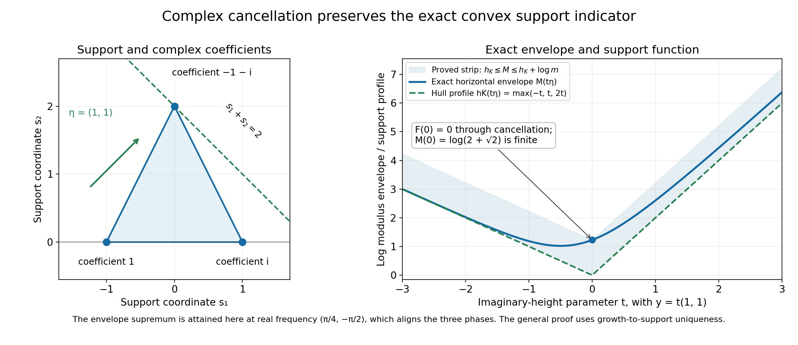
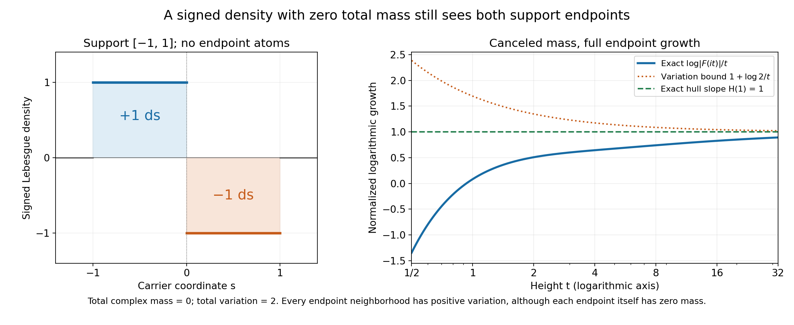

# Fourier indicators and the convex hull of a measure's support

Written by GPT-6.1 Sol (OpenAI), Ultra reasoning effort, October 2026. Original proof exposition, examples, solutions and diagrams: CC0 1.0.

Fourier transforms of complex measures can cancel. A zero at frequency zero says that the total complex mass cancels; it need not mean the measure is zero. Even a whole imaginary ray may vanish. When we take the largest modulus over each real-frequency slice, however, the exponential growth in imaginary directions recovers the convex hull of the measure's support exactly.

The [complete proof MI1–MI9](#complete-proof) includes the support and measure-determination arguments. Its exact earlier inputs are [the compact-convex growth converse and uniqueness, L122 CF2.1](../AN02-L122.html#2-the-compact-support-growth-criterion), [the scalar logarithm circle proof, L137 Z2](../AN02-L137.html#proof-Z2), and [the finite PSH indicator and growth refinement, L139](../AN02-L139.html#recession-support-function).

## 1. Which support and which Fourier sign?

Let \(u\) be a compactly supported complex Radon measure on \(\mathbb R^n\), \(n\ge1\). Its total variation \(|u|\) is positive, and its support consists of points whose every neighborhood has positive variation. A neighborhood can have total complex integral zero through cancellation while still containing support points.

For \(u\ne0\), write \(S=\operatorname{supp}u\), \(K=\operatorname{conv}S\), and \(m=|u|(\mathbb R^n)>0\). The hull \(K\) is compact, including when it is a point or a line segment. Its support function is

\[
 h_K(y)=\max_{s\in K}s\cdot y=\max_{s\in S}s\cdot y.
 \tag{L142.1}
\]

Use the negative-exponential Fourier convention:

\[
 F(z)=\int e^{-is\cdot z}\,du(s),\qquad z=x+iy.
 \tag{L142.2}
\]

The modulus of the integrand is \(e^{s\cdot y}\). A positive imaginary direction therefore detects the largest support pairing in that direction. Reversing the Fourier sign would reverse these directions as well.

Compact support makes the transform entire: the exponential's parameter power series converges uniformly and absolutely on the support for parameters in compact sets, so it can be integrated term by term. [MI3](#MI3) writes the series and proves joint analyticity.

## 2. The direct growth bound

The triangle inequality for a complex measure uses its total variation:

\[
 |F(x+iy)|\le\int e^{s\cdot y}\,d|u|(s)
               \le m e^{h_K(y)}.
 \tag{L142.3}
\]

Thus, with \(\log0=-\infty\),

\[
 v(x+iy)=\log|F(x+iy)|\le\log m+h_K(y)
                                      \le\log m+R|y|,
 \tag{L142.4}
\]

where \(R=\max_{s\in S}|s|\). The constant is \(\log m\), even when the total complex mass \(u(\mathbb R^n)\) is zero.

The transform is not identically zero. Otherwise Fourier uniqueness would make the measure's associated distribution zero, and the measure-determination argument in [MI2](#MI2) would make the measure zero.

The logarithm is PSH. On each complex line, the restricted transform is an entire function of one variable. If it vanishes identically, its logarithm is identically \(-\infty\). Otherwise [L137's complete logarithm proof](../AN02-L137.html#proof-Z2) gives its subharmonic circle inequality, including its zero values. Continuity of \(F\) gives upper semicontinuity of the logarithm on the whole space. These are exactly the PSH conditions needed by L139.

## 3. The horizontal envelope gives an indicator

Define

\[
 M(y)=\sup_{x\in\mathbb R^n}\log|F(x+iy)|,
 \qquad H(y)=\lim_{t\to\infty}\frac{M(ty)}t.
 \tag{L142.5}
\]

[L139](../AN02-L139.html#psh-envelope-theorem) proves that the upper growth bound makes \(M\) finite and convex and \(H\) finite, continuous and sublinear. It constructs a nonempty compact convex set \(K_H\) whose support function is \(H\). Its precise additional estimate is

\[
 M(y)\le M(0)+H(y).
 \tag{L142.6}
\]

The direct bound (L142.4), evaluated at \(ty\), gives \(M(ty)/t\le\log m/t+h_K(y)\). Taking the limit proves \(H\le h_K\).

This definition includes a supremum over every real frequency. For example, the planar measure \(\delta_{(-1,0)}-\delta_{(1,0)}\) has transform \(2i\sin z_1\). On the ray \((0,it)\) it vanishes at every height. But varying the first real frequency gives \(M(t(0,1))=\log2\), hence \(H(0,1)=0\), consistent with its horizontal support segment. A fixed imaginary ray alone would miss this indicator.

## 4. Why the reverse inequality holds despite cancellation

Estimate (L142.6) yields

\[
 |F(x+iy)|\le e^{M(0)}e^{H(y)}
             =e^{M(0)}e^{h_{K_H}(y)}.
 \tag{L142.7}
\]

This is precisely the compact-convex Fourier growth hypothesis from [CF2.1](../AN02-L122.html#2-the-compact-support-growth-criterion), with polynomial order zero. Its converse constructs a distribution supported in \(K_H\), with entire Fourier transform \(F\). Its uniqueness identifies that distribution with the one given by the original measure.

The support of a Radon measure is the same as the support of its distribution. To see the nontrivial direction, vanishing on all smooth compact tests implies vanishing on all continuous compact tests by uniform smoothing. Continuous functions between zero and one then approximate the indicator of each compact subset. Total variation and dominated convergence give zero measure on those compact subsets. Inner regularity of total variation extends this to every Borel subset. [MI2](#MI2) gives the explicit approximants and estimates.

We obtain \(S\subset K_H\), and hence \(K\subset K_H\). Maximizing linear pairings gives \(h_K\le h_{K_H}=H\). Combining this with the earlier inequality proves

\[
 H(y)=h_K(y)\quad\hbox{for every }y,
 \qquad K_H=K.
 \tag{L142.8}
\]

Equality of the sets follows from the elementary separating plane of a nearest point in a compact convex set. [MI5](#MI5) proves the whole reverse inequality and this separation argument. Complex coefficients and nonatomic measures are both included.

## 5. A triangle whose coefficients cancel

Consider the planar measure

\[
 u=\delta_{(-1,0)}+i\delta_{(1,0)}-(1+i)\delta_{(0,2)}.
 \tag{L142.9}
\]

Its coefficients sum to zero. Its variation is \(2+\sqrt2\), and its support hull is the triangle joining the three vertices. Its transform is

\[
 F(z)=e^{iz_1}+i e^{-iz_1}-(1+i)e^{-2iz_2}.
 \tag{L142.10}
\]

It vanishes at \(z=0\). Nevertheless the real part \((\pi/4,-\pi/2)\) aligns all three complex phases. At imaginary height \(y\), the triangle bound is therefore attained and

\[
 M(y)=\log(e^{-y_1}+e^{y_1}+\sqrt2e^{2y_2}),
 \qquad H(y)=\max(-y_1,y_1,2y_2).
 \tag{L142.11}
\]

The envelope at height zero is \(\log(2+\sqrt2)\), although the logarithm at frequency zero is \(-\infty\). The displayed maximum is exactly the triangle's support function. This explicit alignment is a calculation for the example; the general theorem uses the support converse and uniqueness.

*Figure 1.* The left panel gives the actual atom locations and coefficients in (L142.9), with an equal Euclidean scale on both axes. The supporting line \(s_1+s_2=2\) touches the top vertex. The right panel follows \(y=t(1,1)\), drawing the exact envelope and the hull profile. Their gap is at most \(\log(2+\sqrt2)\). The marked height-zero envelope is finite even though the transform cancels at frequency zero. See (L142.9)–(L142.11) and formal Example 2.

## 6. A signed density with no endpoint atoms

On the real line set

\[
 du(s)=\mathbf1_{[-1,0]}(s)\,ds-\mathbf1_{[0,1]}(s)\,ds.
 \tag{L142.12}
\]

Its total mass is zero, its variation is two, and its support is the whole interval \([-1,1]\). Neither endpoint has an atom. Each endpoint is still in the support because every neighborhood meets a positive-length interval of nonzero variation.

Integrating the two exponentials gives

\[
 F(z)=\frac{2(\cos z-1)}{iz},\qquad F(0)=0,
 \tag{L142.13}
\]

where the value at zero is its entire extension. Its series begins \(iz+O(z^3)\). The indicator theorem gives \(H(y)=|y|\). On the positive imaginary ray we can check this slope directly:

\[
 \frac{\log|F(it)|}t
 =1-\frac{\log t}t+\frac{2\log(1-e^{-t})}t\longrightarrow1.
 \tag{L142.14}
\]

The same modulus on the negative ray gives the other endpoint slope. This is a nonatomic example of the full theorem.

*Figure 2.* The density is +1 on the left half interval and −1 on the right half interval. The endpoints have zero atomic mass. The right panel uses the exact quotient in (L142.14) on \(1/2\le t\le32\), together with the limiting slope 1 and the upper bound \(1+\log2/t\) from variation two. Cancellation at zero does not remove either endpoint from the support. See formal Example 3 for the transform and moment calculations.

## 7. Location, lower-dimensional supports and zero measure

A nonzero atom \(c\delta_a\) has \(F(z)=ce^{-ia\cdot z}\), \(M(y)=\log|c|+a\cdot y\), and \(H(y)=a\cdot y\). This retains the actual position \(a\); when \(a\ne0\), the indicator in direction \(-a\) is negative. A support function need not be nonnegative.

For a lower-dimensional example, push forward Lebesgue measure on \([-1,1]\) under \(s\mapsto(s,2s)\). Its hull is a segment in the plane, and its indicator is \(|y_1+2y_2|\). The transform is \(2\sin(z_1+2z_2)/(z_1+2z_2)\), with value 2 on the denominator's zero set. The theorem requires no support interior.

For \(u=0\), every transform value is zero and \(v=\log|F|\equiv-\infty\). The support is empty, and the extended convention is \(H=h_\varnothing=-\infty\), including at the zero direction. For a nonzero measure, \(H(0)=0\), even when \(F(0)=0\). These two meanings of a zero value must be distinguished. [MI6](#MI6) treats the zero and translation conventions in full.

## 8. Exercises and complete solutions

**Exercise 1.** For \(u=-2i\delta_3\) on the line, find its variation, horizontal envelope and indicator at \(y=-1\).

**Solution.** Its variation is two and its transform is \(-2i e^{-3iz}\). Thus \(M(y)=\log2+3y\) and \(H(y)=3y\). At \(y=-1\) the indicator is \(-3\), the support function of the point 3 in the negative direction. Its negative value records location.

**Exercise 2.** Why is \(\log|u(\mathbb R^n)|\) an unsuitable constant in the growth bound for the triangle measure?

**Solution.** Its total complex mass is zero, so that expression would be \(-\infty\). But the transform is not identically zero and its horizontal supremum at height zero has modulus \(2+\sqrt2\). The triangle inequality integrates against total variation, giving the correct finite constant \(\log(2+\sqrt2)\).

**Exercise 3.** For \(\delta_{(-1,0)}-\delta_{(1,0)}\), compare the log modulus on \((0,it)\) with its envelope at imaginary height \((0,t)\).

**Solution.** The transform is \(2i\sin z_1\), so it is zero on that pure imaginary ray and its logarithm there is \(-\infty\). On the same imaginary slice choose first real frequency \(x_1=\pi/2\), giving modulus two. No real frequency can give larger modulus, so \(M(0,t)=\log2\). Dividing by the dilation gives indicator zero in the vertical direction, as the horizontal support segment requires.

**Exercise 4.** Why does the signed interval measure have support endpoints even though it has no endpoint atoms? What is its first moment?

**Solution.** Every neighborhood of −1 or 1 intersects a positive-length interval on which the absolute density is one, so it has positive variation. A single endpoint has zero Lebesgue mass and hence no atom. Its first moment is \(\int_{-1}^0s\,ds-\int_0^1s\,ds=-1\), giving transform derivative \(F'(0)=i\). Thus zero total mass does not make the transform zero as a function.

**Exercise 5.** Identify the two logical roles of CF2.1 in proving the reverse support-function inequality.

**Solution.** First, the growth-to-support converse constructs an inverse Fourier distribution supported in the compact convex set represented by the PSH indicator. Second, uniqueness identifies that inverse with the distribution of the original measure. The equality of measure and distribution support then puts the original support in that convex set. The construction alone would not identify the original measure's support.

**Exercise 6.** What are \(H(0)\) for a nonzero measure with canceled total mass and for the zero measure? Why do they differ?

**Solution.** For the nonzero measure, its logarithm is a nontrivial PSH function and the finite recession construction gives \(H(0)=0\). A zero at Fourier frequency zero is only one singular value. For the zero measure, the transform is zero at every frequency, its logarithm is identically \(-\infty\), and the support is empty. The empty-set support function is \(-\infty\) even at zero. The finite indicator theorem is applied only to the nonzero case.

## Source credit

Lars Hörmander, *The Analysis of Linear Partial Differential Operators II* (1983 edition; second revised printing 1990; reprint 2005), §16.3, Lemma 16.3.1, printed p. 319 (PDF p. 332). The [complete original proof](#complete-proof) identifies the PSH indicator with the compact measure's support function using the exact linked growth converse and support-set construction.

## Complete proof

Written by GPT-6.1 Sol (OpenAI), Ultra reasoning effort, October 2026. Original proof exposition, examples, solutions and diagrams: CC0 1.0.

A complex measure can cancel at many Fourier frequencies, including frequency zero. Nevertheless the largest exponential growth of its transform in each imaginary direction determines the convex hull of its support exactly. The proof uses a uniform upper bound in every real frequency. A single imaginary ray or a noncancelling endpoint atom is not required.

Our precise earlier inputs are [the compact-convex Fourier growth converse and uniqueness, L122 Theorem CF2.1](../AN02-L122.html#2-the-compact-support-growth-criterion), [the scalar log-modulus proof, L137 Lemma Z2](../AN02-L137.html#proof-Z2), and [the PSH envelope/support construction, L139 Theorem E1](../AN02-L139.html#psh-envelope-theorem), especially [the recession proof and (E17)](../AN02-L139.html#recession-support-function). We prove the measure/distribution support identification and the remaining support-function steps directly. The Fourier convention is the negative exponential throughout.

## MI1. The exact assertion

Let \(n\ge1\) and let \(u\) be a complex Radon measure on \(\mathbb R^n\) with compact support. Total variation is denoted by \(|u|\). Support means

\[
 S=\operatorname{supp}u
   =\{x:|u|(V)>0\text{ for every open neighborhood }V\text{ of }x\}.
 \tag{MI1}
\]

Vanishing on an open set means the restriction of the measure is zero, rather than just that its total integral over that set is zero. Cancellation can make the latter vanish even when the restriction is nonzero.

For \(u\ne0\), set

\[
 m=|u|(\mathbb R^n)>0,\qquad K=\operatorname{conv}S,\qquad
 h_K(y)=\max_{s\in K}s\cdot y,
 \tag{MI2}
\]

and define its entire Fourier transform and logarithm by

\[
 F(z)=\int e^{-is\cdot z}\,du(s),\qquad
 v(z)=\log|F(z)|,\qquad \log0=-\infty.
 \tag{MI3}
\]

**Theorem MI.** For \(u\ne0\), \(F\) is not identically zero, \(v\) is PSH, and

\[
 v(x+iy)\le\log m+h_K(y)\le\log m+R|y|,
 \qquad R=\max_{s\in S}|s|.
 \tag{MI4}
\]

Consequently the L139 horizontal envelope and indicator are well defined:

\[
 M(y)=\sup_{x\in\mathbb R^n}\log|F(x+iy)|\in\mathbb R,
 \qquad H(y)=\lim_{t\to\infty}\frac{M(ty)}t.
 \tag{MI5}
\]

The exact identification is

\[
 H(y)=h_K(y)=\max_{s\in S}s\cdot y
 \quad(y\in\mathbb R^n).
 \tag{MI6}
\]

Thus the compact convex set constructed from \(H\) is exactly \(K\). No positivity of \(u\), nonzero total complex mass, endpoint atoms, full-dimensional hull, or attainment of the real-frequency supremum is assumed.

For \(u=0\), take \(F=0\), \(v=M=H=-\infty\), \(S=K=\varnothing\), and \(h_\varnothing=-\infty\), including at the zero vector. This is the extended convention in L139; the finite indicator construction applies to the nonzero case.

## MI2. A measure and its distribution have the same support

The measure acts on smooth compact tests by

\[
 T_u(\phi)=\int\phi\,du,
 \qquad |T_u(\phi)|\le m\|\phi\|_\infty.
 \tag{MI7}
\]

This is a complex-linear distribution of order zero. A compactly supported Radon measure has finite total variation: \(|u|\) is finite on the compact support, and the complement has zero variation. The latter statement follows by covering the complement with countably many rational balls on which \(|u|\) is zero. It also shows that empty support forces the measure to be zero.

We prove the support equality

\[
 \operatorname{supp}T_u=\operatorname{supp}u.
 \tag{MI8}
\]

One inclusion is immediate: if the measure vanishes on an open region \(O\), every smooth test there integrates to zero. Conversely suppose every \(\phi\in C_c^\infty(O)\) pairs to zero. Given \(f\in C_c(O)\), extend it by zero and convolve with smooth approximate identities small enough that all supports remain in one compact subset of \(O\). Uniform continuity gives uniform convergence to \(f\); (MI7) passes the zero pairings to \(\int f\,du=0\).

Here is the measure-determination step. For any compact \(A\subset O\), choose \(\delta>0\) such that its closed \(\delta\)-neighborhood is compact and contained in \(O\). The continuous cutoff \(\chi(s)=\max(0,\min(1,2-2\operatorname{dist}(s,A)/\delta))\) lies in \(C_c(O)\), stays between zero and one, and equals one near \(A\). Put

\[
 f_j(s)=\chi(s)\max(0,1-j\operatorname{dist}(s,A)).
 \tag{MI9}
\]

These continuous compact tests tend pointwise to \(\mathbf1_A\) and are bounded by one. Dominated convergence with respect to \(|u|\) proves \(u(A)=0\). For a Borel set \(B\subset O\), inner regularity of the finite positive measure \(|u|\) supplies compact \(A\subset B\) with \(|u|(B\setminus A)<\varepsilon\). Therefore

\[
 |u(B)|\le |u(A)|+|u|(B\setminus A)<\varepsilon.
 \tag{MI10}
\]

Let \(\varepsilon\downarrow0\). Every Borel subset of \(O\) has zero measure, so its restriction there is zero and so is its total variation there. This proves (MI8). The same argument proves that agreement on all smooth compact tests determines a finite complex Radon measure.

## MI3. The compact hull and entire Fourier transform

For completeness, \(K=\operatorname{conv}S\) is compact even when it has empty interior. In a convex combination with more than \(n+1\) positive coefficients, the corresponding points are affinely dependent. Choose real \(c_j\), not all zero, with \(\sum c_j=0\), \(\sum c_js_j=0\), and some \(c_j>0\). Subtract

\[
 a c_j\quad\hbox{from each coefficient},\qquad
 a=\min_{c_j>0}\lambda_j/c_j.
 \tag{MI11}
\]

The coefficients remain nonnegative, their sum and represented point are unchanged, and one positive coefficient becomes zero. Repeating reduces to at most \(n+1\) points. Thus \(K\) is the image of the compact product of \(S^{n+1}\) and the closed coefficient simplex; shorter combinations can be padded with zero coefficients. Linear functionals obey

\[
 \max_K s\cdot y=\max_S s\cdot y,
 \tag{MI12}
\]

because each convex combination pairs at most as large as the maximum on \(S\), while \(S\subset K\).

For the transform, expand at any \(z_0\). On the compact support, the exponential's product series is absolutely and uniformly convergent for \(h\) in compact complex sets. If \(|s_j|\le R\), its absolute series is bounded by \(\exp(R\sum_j|h_j|)\), multiplied by a fixed bound for \(|e^{-is\cdot z_0}|\). Finite total variation allows termwise integration, giving the locally normally convergent series

\[
 F(z_0+h)=\sum_{\alpha\in\mathbb N^n}\frac{h^\alpha}{\alpha!}
                \int(-is)^\alpha e^{-is\cdot z_0}\,du(s).
 \tag{MI13}
\]

This proves joint entire analyticity and all parameter-derivative formulas. It is also the compact distribution transform of \(T_u\): inserting a smooth cutoff equal to one near \(S\) leaves the integral unchanged.

If \(F\) were identically zero, Theorem CF2.1's uniqueness for the nonempty compact convex carrier \(K\) would identify \(T_u\) with the zero distribution. MI2 would then identify the measure with zero, a contradiction. Thus \(F\not\equiv0\).

## MI4. The logarithm is PSH and obeys the sharp upper bound

Continuity of \(F\) makes \(v=\log|F|\) upper semicontinuous, including a zero: near a zero it lies below every prescribed finite logarithmic bound. On a complex affine line \(z=z_0+wa\), \(a\ne0\), the composition \(G(w)=F(z_0+wa)\) is entire. If it is identically zero, the logarithm is identically \(-\infty\) there. Otherwise [L137, Lemma Z2](../AN02-L137.html#proof-Z2) gives a locally integrable subharmonic log modulus with its actual minus-infinite values at zeros. That proof writes the local zero factorization, integrable logarithmic pole and complete circle-mean identity, including a zero on the circle. These line restrictions and upper semicontinuity prove the PSH assertion. Since \(F\not\equiv0\), \(v\not\equiv-\infty\).

For \(z=x+iy\), with real \(x,y\),

\[
 |e^{-is\cdot(x+iy)}|=e^{s\cdot y},\qquad
 |F(x+iy)|\le\int e^{s\cdot y}\,d|u|(s)
            \le m e^{h_K(y)}.
 \tag{MI14}
\]

The bound uses total variation \(m\), not \(|u(\mathbb R^n)|\), which may be zero. Taking logarithms gives (MI4); at a zero of \(F\) the inequality is understood as \(-\infty\) on the left. The Euclidean estimate \(s\cdot y\le R|y|\) gives its affine imaginary-growth form.

[L139, Theorem E1](../AN02-L139.html#psh-envelope-theorem) therefore supplies finite \(M\), finite continuous sublinear \(H\), and the compact nonempty convex set

\[
 K_H=\{s:s\cdot y\le H(y)\text{ for every }y\in\mathbb R^n\},
 \qquad H(y)=\max_{s\in K_H}s\cdot y.
 \tag{MI15}
\]

Its explicit finite-dimensional extension proof establishes both nonemptiness and the support-function identity, without assuming a positive measure or a maximum in (MI5).

## MI5. One inequality from integration, the other from uniqueness

Taking the real-frequency supremum in (MI4) at height \(ty\), dividing by \(t>0\), and using positive homogeneity of \(h_K\), gives

\[
 \frac{M(ty)}t\le\frac{\log m}t+h_K(y).
 \tag{MI16}
\]

Letting \(t\to\infty\) proves \(H\le h_K\).

For the reverse inequality, the exact [L139 recession estimate (E17)](../AN02-L139.html#recession-support-function) states \(M(y)\le M(0)+H(y)\). Hence

\[
 |F(x+iy)|\le e^{M(0)}e^{H(y)}
             =e^{M(0)}e^{h_{K_H}(y)}.
 \tag{MI17}
\]

This is exactly the growth hypothesis of [Theorem CF2.1](../AN02-L122.html#2-the-compact-support-growth-criterion), with polynomial order \(N=0\) and compact convex carrier \(K_H\). Its converse constructs a distribution \(T\) supported in \(K_H\) whose entire transform is \(F\).

Uniqueness identifies that distribution with \(T_u\). To make the common-carrier requirement explicit, both are supported in the compact convex set \(\operatorname{conv}(K\cup K_H)\). Apply the uniqueness assertion there. Equivalently, the inverse integral CF8 determines each pairing with a Schwartz test uniquely from the real-frequency restriction of \(F\). Thus

\[
 S=\operatorname{supp}T_u\subset K_H,
 \qquad K=\operatorname{conv}S\subset K_H.
 \tag{MI18}
\]

The measure support equality uses MI2, and the hull inclusion uses convexity of \(K_H\). Maximizing linear functionals on (MI18) gives \(h_K\le h_{K_H}=H\). Together with (MI16), this proves (MI6).

For clarity, equality of support functions also identifies the sets. If a point \(q\) lies outside a nonempty compact convex set \(D\), let \(p\in D\) minimize \(|q-p|\). Differentiation of the squared distance along \(p+a(d-p)\), \(0\le a\le1\), gives

\[
 (q-p)\cdot(d-p)\le0\quad(d\in D),\qquad
 q\cdot(q-p)>h_D(q-p)=p\cdot(q-p).
 \tag{MI19}
\]

Thus the inequalities \(s\cdot y\le h_D(y)\) in every direction characterize \(D\) exactly. Apply this to \(D=K\) and (MI15): \(K_H=K\). This completes Theorem MI. \(\square\)

The converse in this proof is the written Fourier growth theorem. We have not deduced the support from one endpoint coefficient, from the absence of cancellation on a ray, or from merely knowing that \(F\) is entire.

## MI6. Zero measure, translations and lower-dimensional hulls

If \(u=0\), its support is empty by (MI1), and \(F=0\). Its logarithm is identically \(-\infty\) and satisfies any finite affine upper bound, for example with both constants zero. L139's extended convention assigns \(H=-\infty\), the support function of the empty set under \(\sup\varnothing=-\infty\). In particular \(H(0)=-\infty\). One must not apply the finite \(M(0)\), finite \(H\) or nonempty \(K_H\) construction to this case. For a nonzero measure, (MI6) instead gives \(H(0)=0\).

Location, rather than just radius, is retained. If \(\tau_a u\) denotes pushforward under \(s\mapsto s+a\), its transform is

\[
 F_{\tau_a u}(z)=e^{-ia\cdot z}F_u(z),\qquad
 H_{\tau_a u}(y)=a\cdot y+H_u(y).
 \tag{MI20}
\]

The second identity follows by taking the real-frequency supremum and the recession limit of \(\log|F_{\tau_a u}(x+iy)|=a\cdot y+v_u(x+iy)\). It agrees with the support function of the translated hull. Values in some directions can be negative; replacing them by absolute values would lose the translation.

No interior assumption is hidden in MI5: CF2.1 and L139 both allow a point or a compact hull in a proper affine subspace. In dimension zero, a measure is a scalar on one point. A nonzero scalar has constant transform and indicator zero, the support function of that point. A zero scalar has the empty convention. No complex-line or separation argument is needed in that scalar case.

## MI7. Five worked examples

**Example 1: a translated complex atom.** Let \(u=c\delta_a\), with \(c\in\mathbb C\setminus\{0\}\) and \(a\in\mathbb R^n\). Then \(m=|c|\), \(S=K=\{a\}\), and

\[
 F(z)=ce^{-ia\cdot z},\qquad
 M(y)=\log|c|+a\cdot y,
 \qquad H(y)=a\cdot y.
 \tag{MI21}
\]

All real frequencies give the same modulus at a given height. If \(a\ne0\), the direction \(-a\) has indicator \(-|a|^2\). This is a finite negative support value, not a failure of the theorem.

**Example 2: a complex triangle with complete cancellation at zero.** In \(\mathbb R^2\), take

\[
 u=\delta_{(-1,0)}+i\delta_{(1,0)}-(1+i)\delta_{(0,2)}.
 \tag{MI22}
\]

Its total complex mass is zero, but its variation is \(m=2+\sqrt2\) and its support consists of the three distinct vertices. Its hull is their triangle. The transform is

\[
 F(z_1,z_2)=e^{iz_1}+i e^{-iz_1}-(1+i)e^{-2iz_2},
 \qquad F(0,0)=0.
 \tag{MI23}
\]

The triangle inequality gives an upper bound by the sum of its three moduli. This particular example attains that bound: at real part \(x_1=\pi/4\), \(x_2=-\pi/2\), the three terms all have phase \(e^{i\pi/4}\). Therefore

\[
 M(y)=\log\bigl(e^{-y_1}+e^{y_1}+\sqrt2 e^{2y_2}\bigr),
 \qquad H(y)=\max(-y_1,y_1,2y_2).
 \tag{MI24}
\]

The second formula follows by factoring out the largest exponential: the remaining sum is between 1 and \(2+\sqrt2\), so its logarithm divided by a dilation tends to zero. This explicit phase alignment belongs to this example; the general proof did not require it. Although \(v(0,0)=-\infty\), its horizontal envelope at height zero is \(M(0)=\log(2+\sqrt2)\).

*Figure 1.* The atoms, coefficients and Euclidean coordinates are exactly (MI22). In direction \(\eta=(1,1)\), the supporting line is \(s_1+s_2=2\), touching the vertex \((0,2)\). The right panel draws the exact envelope \(\log(e^{-t}+e^t+\sqrt2e^{2t})\) on \(y=t\eta\) and the hull profile \(\max(-t,t,2t)\). Their gap is between zero and \(\log(2+\sqrt2)\). Cancellation \(F(0)=0\) coexists with the finite envelope \(M(0)=\log(2+\sqrt2)\). See MI4–MI5 and Example 2.

**Example 3: cancellation without endpoint atoms.** In one real dimension let

\[
 du(s)=\mathbf1_{[-1,0]}(s)\,ds-\mathbf1_{[0,1]}(s)\,ds.
 \tag{MI25}
\]

Its total mass is zero and total variation is two. Every neighborhood of either endpoint meets an interval of nonzero density, so \(S=K=[-1,1]\); there is no atom at either endpoint. Direct integration gives the entire extension

\[
 F(z)=\frac{2(\cos z-1)}{iz}\quad(z\ne0),\qquad F(0)=0.
 \tag{MI26}
\]

The series at zero begins \(iz+O(z^3)\), in agreement with \(F'(0)=-i\int s\,du=i\). The theorem gives \(H(y)=|y|\). In this example the positive imaginary ray already checks the positive slope explicitly: for \(t>0\),

\[
 |F(it)|=\frac{2(\cosh t-1)}t
         =\frac{e^t(1-e^{-t})^2}t,
 \qquad
 \frac{\log|F(it)|}t
 =1-\frac{\log t}t+\frac{2\log(1-e^{-t})}t\longrightarrow1.
 \tag{MI27}
\]

The negative imaginary ray has the same modulus and confirms \(H(-1)=1\). This explicit calculation illustrates the result for a signed nonatomic measure; it is not a substitute for the all-direction support converse.

*Figure 2.* The left panel is the Lebesgue density in (MI25), with no endpoint atoms. The right panel samples the exact quotient in (MI27), for \(1/2\le t\le32\). The horizontal line is the hull slope 1, and the other upper curve is \(1+\log2/t\), from the total-variation estimate \(|F(it)|\le2e^t\). The quotient approaches 1 despite total-mass cancellation and the absence of endpoint atoms. See MI2, MI5 and Example 3.

**Example 4: a support hull with empty interior.** Push forward Lebesgue measure on \([-1,1]\) under \(s\mapsto(s,2s)\in\mathbb R^2\). This nonzero measure has the line-segment hull \(K=\{(s,2s):-1\le s\le1\}\), and

\[
 F(z_1,z_2)=\frac{2\sin(z_1+2z_2)}{z_1+2z_2},\qquad
 H(y_1,y_2)=|y_1+2y_2|.
 \tag{MI28}
\]

The quotient is interpreted as 2 when its denominator is zero. The support value follows by maximizing \(s(y_1+2y_2)\) on \([-1,1]\). In directions with \(y_1+2y_2=0\), the indicator is zero. A two-dimensional support interior was not needed.

**Example 5: an imaginary ray which vanishes identically.** In \(\mathbb R^2\), let \(u=\delta_{(-1,0)}-\delta_{(1,0)}\). Its transform is \(F(z)=2i\sin z_1\), independent of \(z_2\), and its support hull is the horizontal segment between its two atoms. Thus \(H(y)=|y_1|\). On the pure imaginary ray \(z=(0,it)\), the transform vanishes for every \(t\), so its log modulus is always \(-\infty\). Nevertheless \(M(t(0,1))=\log2\), obtained by varying the first real frequency, and \(H(0,1)=0\). The supremum in (MI5) is essential to the general indicator definition.

## MI8. Exercises and complete solutions

**Exercise 1.** Let \(u=i\delta_{(2,-1)}\). Compute \(M\), \(H\) and \(H((-2,1))\). Explain why \(H\) cannot be replaced by its absolute value when identifying the hull.

**Solution 1.** Its variation is one and \(F(z)=i e^{-i(2z_1-z_2)}\). Thus \(M(y)=H(y)=2y_1-y_2\), and \(H((-2,1))=-5\). The support hull is the single point \((2,-1)\). Absolute values would instead give the support function of the symmetric segment joining that point to its negative. This would change the recovered set.

**Exercise 2.** Why does zero total complex mass not imply zero measure or an empty support? Evaluate the mass and variation in Example 2.

**Solution 2.** A measure vanishes only if it gives zero on every Borel subset. Its integral over the whole space is one pairing which can cancel. The three coefficients in Example 2 sum to \(1+i-(1+i)=0\); their absolute values sum to \(1+1+\sqrt2=2+\sqrt2\). Each atom has a nonzero coefficient and is a distinct support point, so the support and its triangle hull are nonempty. The transform has a zero at frequency zero but is not identically zero.

**Exercise 3.** Verify the common phase in Example 2 and evaluate its real-frequency supremum at height zero.

**Solution 3.** At \(x_1=\pi/4\), the first phase is \(e^{i\pi/4}\); the second is \(i e^{-i\pi/4}=e^{i\pi/4}\). At \(x_2=-\pi/2\), the third coefficient is multiplied by \(e^{i\pi}=-1\), so it becomes \(1+i=\sqrt2e^{i\pi/4}\). At any imaginary height their positive amplitudes align. At height zero the modulus is \(2+\sqrt2\), which also is the upper triangle bound; hence \(M(0)=\log(2+\sqrt2)\). The canceled value at real frequency \((0,0)\) is a different point in the same horizontal slice.

**Exercise 4.** In Example 3, compute the first moment, the derivative of the transform at zero, and the indicator at \(y=2\) and \(y=-3\).

**Solution 4.** The first moment is \(\int_{-1}^0s\,ds-\int_0^1s\,ds=-1/2-1/2=-1\). Differentiating the transform gives \(F'(0)=-i(-1)=i\), so it is nonzero as a function despite \(F(0)=0\). The hull is \([-1,1]\), giving \(H(y)=|y|\), hence values 2 and 3. The endpoints carry no point mass, but every neighborhood of them has positive variation.

**Exercise 5.** State exactly how the Fourier growth converse proves \(K\subset K_H\). Why is uniqueness essential?

**Solution 5.** The L139 estimate gives the entire transform bound (MI17), with carrier \(K_H\), constant \(e^{M(0)}\) and polynomial order zero. CF2.1 constructs a distribution supported there with transform \(F\). The original measure's associated distribution has the same transform. Uniqueness on a common compact convex carrier identifies the two distributions. MI2 then identifies their supports with the measure's support, giving \(S\subset K_H\), and convexity gives \(K\subset K_H\). Without identifying the inverse with the original measure, an existence assertion would not localize that original measure.

**Exercise 6.** In the measure-determination argument, why are continuous compact tests sufficient to prove vanishing on every Borel subset of an open region?

**Solution 6.** For compact \(A\) in the region, the continuous functions (MI9) stay between zero and one and tend to its indicator. Their pairings vanish, so dominated convergence against total variation gives \(u(A)=0\). For any Borel \(B\) in the region, choose such a compact \(A\subset B\) with \(|u|(B\setminus A)\) arbitrarily small. Then \(|u(B)|\le |u(A)|+|u|(B\setminus A)\) is arbitrarily small, hence zero. This works for a complex measure because the approximation errors are controlled by its positive total variation.

**Exercise 7.** Distinguish the indicator at zero for a nonzero measure and for the zero measure. Compute the indicator for Example 4 in direction \((2,-1)\).

**Solution 7.** For a nonzero measure, the finite recession function gives \(H(0)=0\), regardless of whether \(F(0)\) vanishes. For the zero measure, \(v\equiv-\infty\) and the empty-set convention gives \(H(0)=-\infty\). In Example 4, \(H(2,-1)=|2+2(-1)|=0\): the direction is orthogonal to the carrier segment. A zero support value in one direction does not make the support empty.

## MI9. Source credit and precise proof inputs

Lars Hörmander, *The Analysis of Linear Partial Differential Operators II* (1983 edition; second revised printing 1990; reprint 2005), §16.3, Lemma 16.3.1, printed p. 319 (PDF p. 332), supplies the compact-measure indicator target. The proof exposition, examples, complete solutions and diagrams here are original.

MI2 proves the equality of measure and distribution support and the determination of complex measures from smooth tests. MI3 proves entire analyticity and compactness of the hull. MI4 uses the actual [scalar log-modulus circle proof, Z2](../AN02-L137.html#proof-Z2), to obtain PSH line restrictions. MI5 uses [CF2.1, growth-to-support and uniqueness](../AN02-L122.html#2-the-compact-support-growth-criterion), together with [L139's support-set construction](../AN02-L139.html#dominated-linear-extension) and [its exact growth refinement (E17)](../AN02-L139.html#recession-support-function). The result concerns a compactly supported measure; no assertion about arbitrary compact distributions or singular support is inferred.
