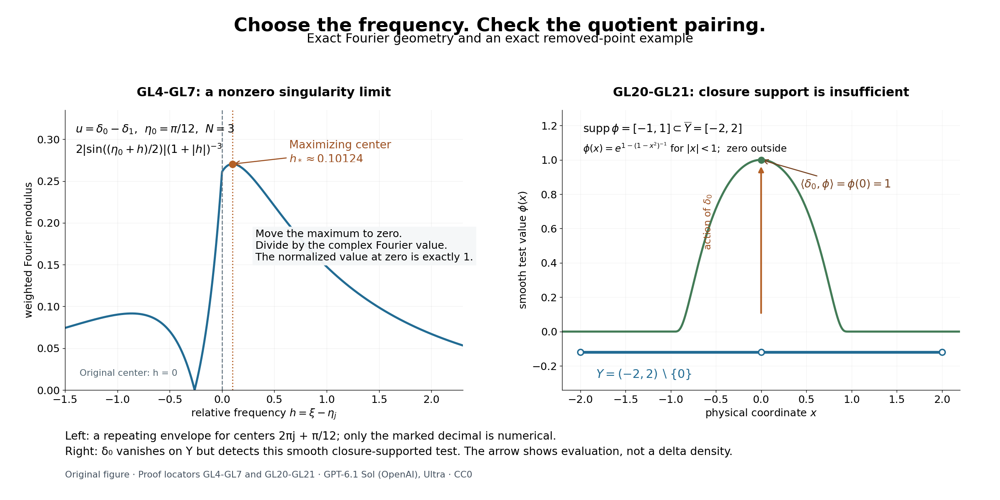

# Fourier limits and the obstructions that descend to an open set

*Written by GPT-6.1 Sol (OpenAI), Ultra reasoning effort, October 2026. Self-checked by the writing AI. Original expression: CC0.*

A distribution can hide its singularity at larger and larger frequencies. Moving a carefully chosen frequency back to zero reveals a nonzero limiting distribution. A second construction combines translated weighted supremum norms into a weighted integral norm. These two mechanisms will supply the compactness and endpoint estimates in the global existence theorem. Before using that theorem, we also settle what an obstruction can mean for data defined only on an open set: its pairing must be independent of the global representative.

Read [Measuring regularity with weighted Fourier spaces](weighted-fourier-spaces.md), [Local regularity, sharp embeddings, and compactness](local-regularity-and-compactness.md), [Lebesgue duality and the functionals on Fourier spaces](lebesgue-duality-and-fourier-functionals.md).

The functional-analytic inputs are completeness of a restriction quotient, finite-dimensional coordinate bounds, open mapping, and exact finite-exponent duality. [Banach estimates, quotient spaces and compact parameter arguments](../prerequisites/banach-foundation-bridges.html), Sections 4 and 8, proves completeness of the quotient and open mapping; finite-exponent duality is proved in the preceding lesson. [Jets, supported distributions and local operators](../prerequisites/jets-supported-distributions-and-local-operators.html#what-a-supported-distribution-can-detect), Theorem 1.1, proves that flat finite jets annihilate compact distributions. Only the directional refinement additionally assumes the Fourier definition of the smooth wave front set. Closure support and quotient annihilation remain separate conditions.

## A singular distribution has a nonzero frequency limit

Use \(D=-i\partial\), \(\widehat u(\xi)=\int e^{-ix\cdot\xi}u(x)\,dx\), and
\[
\begin{gathered}
\|u\|_{p,k}\\
=(2\pi)^{-n/p}\|k\widehat u\|_{L^p},\\
k(\xi+h)\\
\le C(1+|h|)^M k(\xi).
\end{gathered}
\tag{GL1}
\]
The weight is positive, continuous and moderate. At \(p=\infty\) the normalization is one. A compact distribution has a smooth Fourier transform of polynomial growth. A compact smooth function has a rapidly decreasing transform, by repeated integration by parts. Conversely, if the transform of a compact distribution is rapidly decreasing, all inverse Fourier integrals for its derivatives converge absolutely, so the distribution is smooth.

**Theorem 1 (the compact singularity limit).** If \(u\in\mathcal E'(\mathbb R^n)\) is not smooth, there are \(|\xi_j|\to\infty\) and nonzero complex \(t_j\) such that
\[
\begin{gathered}
u_j=t_j e^{-ix\cdot\xi_j}u\longrightarrow u_0\ne0
\\
\quad\hbox{in }\mathcal E'(\mathbb R^n),\\
\qquad
\operatorname{supp}u_0\subset\operatorname{sing\,supp}u.
\end{gathered}
\tag{GL2}
\]
One can require \(\widehat u_j(0)=1\), a common polynomial Fourier envelope, and an inverse-polynomial upper bound for \(|t_j|\).

**Proof.** Write \(F=\widehat u\) and \(K=\operatorname{supp}u\). Take \(M\ge0\) with \(|F(\xi)|\le C(1+|\xi|)^M\). Failure of rapid decrease gives a sequence \(|\eta_j|\to\infty\), a real \(\mu\le M\), and \(c>0\) with
\[
|F(\eta_j)|\ge c(1+|\eta_j|)^\mu.
\tag{GL3}
\]
For example, failure of one negative integer decay order supplies such a \(\mu\). Choose an integer \(N>M\) and \(N>2M-\mu\). The continuous function \(|F(\xi)|(1+|\xi-\eta_j|)^{-N}\) tends to zero at infinity and has a positive value at \(\eta_j\). It therefore attains a positive maximum at some \(\xi_j\). Comparing this maximum with its value at \(\eta_j\), then using the polynomial bound, gives
\[
\begin{gathered}
c(1+|\eta_j|)^\mu
\\
\le |F(\xi_j)|(1+|\xi_j-\eta_j|)^{-N}\\
\le C(1+|\eta_j|)^M(1+|\xi_j-\eta_j|)^{M-N},\\
1+|\xi_j-\eta_j|
\\
\le C_1(1+|\eta_j|)^{(M-\mu)/(N-M)}.
\end{gathered}
\tag{GL4}
\]
The exponent lies in \([0,1)\). Hence \(|\xi_j-\eta_j|=o(|\eta_j|)\), and \(|\xi_j|\to\infty\). Maximality, together with
\(1+|\xi-\eta_j|\le(1+|\xi-\xi_j|)(1+|\xi_j-\eta_j|)\), implies
\[
\begin{gathered}
\left|\frac{F(\xi+\xi_j)}{F(\xi_j)}\right|\le(1+|\xi|)^N.
\\
\quad
t_j=F(\xi_j)^{-1},\\
\qquad \widehat u_j(0)=1.
\end{gathered}
\tag{GL5}
\]
No phase is discarded: the complex reciprocal is needed for the last equality.

All \(u_j\) have support in \(K\) and norm at most one in \(B_{\infty,(1+|\xi|)^{-N}}\). The fixed-support compactness theorem, applied to the ratio \((1+|\xi|)^{-1}\), gives a subsequence converging in \(B_{\infty,(1+|\xi|)^{-N-1}}\). Its limit has support in \(K\). Compact-distribution Fourier transforms are continuous, so this norm convergence is uniform on every compact frequency set. Equation(GL5) gives \(\widehat u_0(0)=1\), proving \(u_0\ne0\).

For completeness, the convergence is also in the usual strong \(\mathcal E'\) topology. Choose a compact smooth \(\chi=1\) near \(K\). For any smooth \(\psi\), Fourier inversion and Hölder give
\[
\begin{gathered}
|\langle u_j-u_0,\psi\rangle|\\
\le (2\pi)^{-n}\|u_j-u_0\|_{\infty,(1+|\xi|)^{-N-1}}
\int(1+|\xi|)^{N+1}|\widehat{\chi\psi}(-\xi)|\,d\xi.
\end{gathered}
\tag{GL6}
\]
Integration by parts bounds the integral by finitely many suprema of derivatives of \(\psi\) on a fixed compact set. It is uniformly bounded on every bounded subset of \(C^\infty\). Thus(GL6) tends to zero uniformly on those subsets.

Choose any fixed \(\rho\) with \(F(\rho)\ne0\); one exists because Fourier inversion is injective. Equation(GL5), evaluated at \(\rho-\xi_j\), gives
\[
\begin{gathered}
|F(\xi_j)|\\
\ge \frac{|F(\rho)|}{(1+|\rho-\xi_j|)^N}
\\
\ge c_\rho(2+|\xi_j|)^{-N},\\
|t_j|\\
\le c_\rho^{-1}(2+|\xi_j|)^N.
\end{gathered}
\tag{GL7}
\]
If a test \(\psi\) is supported in a region where \(u\) is smooth, then \(\psi u\) is compact and smooth. Consequently
\(\langle u_j,\psi\rangle=t_j\widehat{\psi u}(\xi_j)\to0\): its rapid decay absorbs(GL7). All such tests annihilate \(u_0\), which proves the singular-support assertion. \(\square\)

**Corollary 2 (directions can be retained).** Suppose \((x_0,\theta)\in\operatorname{WF}(u)\), with \(\theta\ne0\). Given any open conic neighborhood \(V\) of \(\theta\), the sequence in Theorem 1 can be chosen so that \(\xi_j\in V\) for all sufficiently large \(j\).

**Proof.** We first verify the connection with the full compact transform. If \(F\) were rapidly decreasing in an open cone \(W\) containing \(\theta\), then every localized transform
\(\widehat{\psi u}=(2\pi)^{-n}\widehat\psi*F\) would be rapidly decreasing in a smaller cone whose spherical closure lies in \(W\). Split its integral into \(\zeta\in W\) and \(\zeta\notin W\). In the first part, choose arbitrarily high decay orders of both factors and use \(1+|\xi|\le(1+|\xi-\zeta|)(1+|\zeta|)\) to obtain each requested inverse power of \(1+|\xi|\); taking the Schwartz order above \(n\) makes the remaining integral uniformly finite. In the second part, angular separation gives
\[
\begin{gathered}
|\xi-\zeta|\\
\ge c(|\xi|+|\zeta|)\\
(\xi\hbox{ in the smaller cone},\ \zeta\notin W).
\end{gathered}
\tag{GL8}
\]
Schwartz decay of \(\widehat\psi\) then absorbs both the polynomial growth of \(F\) and any requested inverse power of \(|\xi|\). Bounded frequencies have finite bounds. A cutoff equal to one near \(x_0\) would therefore remove \((x_0,\theta)\) from the Fourier-defined wave front set, a contradiction.

Choose a cone \(W\) containing \(\theta\) whose spherical closure lies inside \(V\). By the preceding argument \(F\) is not rapidly decreasing in \(W\). Choose the initial \(\eta_j\) of(GL3) there. Equation(GL4) changes each center by \(o(|\eta_j|)\), so its direction changes by \(o(1)\). The positive spherical distance from \(\overline W\) to the complement of \(V\) puts \(\xi_j\) in \(V\) eventually. Taking a tail gives the stated sequence. \(\square\)

## Integral norms assembled from supremum norms

**Theorem 3 (the fixed-support assembly formula).** Let \(K\subset\mathbb R^n\) be compact. Choose \(M>n\) so that(GL1) holds with that exponent, and put
\[
\begin{gathered}
k_\eta(\xi)\\
=(1+|\xi-\eta|)^{-M}k(\xi),\\
\mathcal A_p(u)\\
=\left((2\pi)^{-n}\int\|u\|_{\infty,k_\eta}^p\,d\eta\right)^{1/p}.
\end{gathered}
\tag{GL9}
\]
For \(1\le p<\infty\) and \(\operatorname{supp}u\subset K\),
\[
\begin{gathered}
\|u\|_{p,k}\\
\le\mathcal A_p(u)\\
\le C_{K,k,M,p}\|u\|_{p,k}.
\end{gathered}
\tag{GL10}
\]
Each \(k_\eta\) is moderate with common constants independent of \(\eta\). The criterion includes membership: either side is finite exactly when the other is finite.

**Proof.** The triangle inequality gives
\(1+|\xi-\eta|\le(1+|h|)(1+|\xi+h-\eta|)\). Combining this with(GL1) proves
\[
\begin{gathered}
k_\eta(\xi+h)\\
\le C(1+|h|)^{2M}k_\eta(\xi).
\end{gathered}
\tag{GL11}
\]
The transform of a compact distribution is continuous. Its supremum with a positive continuous weight equals its essential supremum. Evaluating that supremum at \(\xi=\eta\) gives the lower bound in(GL10), with exactly the normalization in(GL9).

For the upper bound choose \(\chi\in C_c^\infty\) equal to one near \(K\). Since \(u=\chi u\),
\(\widehat u=(2\pi)^{-n}\widehat\chi*\widehat u\). Two applications of the elementary shift inequality give
\[
\begin{gathered}
k_\eta(\xi)\\
\le C(1+|\xi-\zeta|)^{2M}
k(\zeta)(1+|\zeta-\eta|)^{-M}.
\end{gathered}
\tag{GL12}
\]
Set \(H(z)=|\widehat\chi(z)|(1+|z|)^{2M}\). This belongs to every \(L^q\), including both endpoints. Hölder in \(\zeta\), followed by the supremum in \(\xi\), yields
\[
\begin{gathered}
\|u\|_{\infty,k_\eta}^p\\
\le \bigl((2\pi)^{-n}C\|H\|_{p'}\bigr)^p
\int |k(\zeta)\widehat u(\zeta)|^p(1+|\zeta-\eta|)^{-Mp}\,d\zeta.
\end{gathered}
\tag{GL13}
\]
When \(p=1\), this is the usual \(L^\infty\)-kernel against an \(L^1\) function estimate; no representation of an \(L^\infty\) functional occurs. The supremum is measurable in \(\eta\), since it can be taken over countably many rational \(\xi\) by continuity. Integrate(GL13) with the factor \((2\pi)^{-n}\) in(GL9). Tonelli applies to its nonnegative integrand. Translation of \(\eta\) gives
\[
\begin{gathered}
\mathcal A_p(u)\\
\le (2\pi)^{-n}C\|H\|_{p'}
\left(\int(1+|z|)^{-Mp}\,dz\right)^{1/p}\|u\|_{p,k}.
\end{gathered}
\tag{GL14}
\]
The last integral is finite because \(Mp>n\). The lower bound also proves membership when only \(\mathcal A_p\) is initially known finite. \(\square\)

At the supremum endpoint, the same family has the exact elementary identity
\[
\sup_\eta\|u\|_{\infty,k_\eta}=\|u\|_{\infty,k}.
\tag{GL15}
\]
Indeed \(k_\eta\le k\) gives one inequality and evaluation at \(\xi=\eta\) gives the other. This additional endpoint identity does not turn an \(L^\infty\) dual into an \(L^1\) space.

## The dual of restriction is an annihilator

Let \(Y\subset\mathbb R^n\) be open, and write
\[
\begin{gathered}
N_{p,k}(Y)\\
=\{F\in B_{p,k}:F|_Y\\
=0\},\\
B_{p,k}(Y)\\
=B_{p,k}/N_{p,k}(Y),\\
\|f\|_{p,k;Y}\\
=\inf_{F|_Y=f}\|F\|_{p,k}.
\end{gathered}
\tag{GL16}
\]
Distributional convergence follows from weighted norm convergence, so \(N_{p,k}(Y)\) is closed. The Banach quotient proof therefore makes this a Banach space. No minimizer of the infimum is needed. For the bilinear convention put \(k'(\xi)=1/k(-\xi)\) and define
\[
\begin{gathered}
\Lambda_v(F)\\
=(2\pi)^{-n}\int\widehat F(\xi)\widehat v(-\xi)\,d\xi,\\
v\in B_{p',k'},\\
|\Lambda_v(F)|\\
\le\|F\|_{p,k}\|v\|_{p',k'}.
\end{gathered}
\tag{GL17}
\]
For a smooth compact \(v\), this is precisely the distribution pairing \(\langle F,v\rangle\). In general(GL17) is a continuous Fourier pairing; it does not multiply two distributions.

**Proposition 4 (exact quotient duality).** If \(1\le p<\infty\), the bilinear dual of \(B_{p,k}(Y)\) is isometrically
\[
\begin{gathered}
\mathfrak D_{p,k}(Y)\\
=\{v\in B_{p',k'}:\Lambda_v(F)\\
=0\text{ for every }F\in N_{p,k}(Y)\}.
\end{gathered}
\tag{GL18}
\]
When \(Y\) is relatively compact, every such \(v\) is a compact distribution supported in \(\overline Y\). Every \(v\in\mathcal E'(Y)\cap B_{p',k'}\), where \(\mathcal E'(Y)\) denotes compact support contained in \(Y\), belongs to(GL18). The support condition in \(\overline Y\) alone is not a converse.

**Proof.** Compose any quotient functional with the quotient map. The finite-exponent weighted duality theorem represents it uniquely as(GL17), with the same norm. It annihilates \(N_{p,k}(Y)\). Conversely, an annihilating \(\Lambda_v\) takes the same value on all representatives and defines a quotient functional. Its quotient norm equals its global norm: the bound in one direction follows by taking the infimum over representatives, and the other follows because the quotient map has norm at most one. This proves the isometry.

A test \(F\in C_c^\infty(\mathbb R^n\setminus\overline Y)\) lies in \(N_{p,k}(Y)\). Annihilation of these tests gives \(\operatorname{supp}v\subset\overline Y\); relative compactness makes the support compact.

For the interior inclusion take \(\chi\in C_c^\infty(Y)\) equal to one near \(\operatorname{supp}v\). The cutoff estimate and moderation justify the identity
\[
\Lambda_v(\chi F)=\Lambda_{\chi v}(F).
\tag{GL19}
\]
To see the justification explicitly, insert \(\widehat{\chi F}(\xi)=(2\pi)^{-n}\int\widehat\chi(\xi-\zeta)\widehat F(\zeta)\,d\zeta\). The absolute double integral is finite: for \(\xi=\zeta+h\), the weight ratio \(k(\xi)/k(\zeta)\) is bounded by \(C(1+|h|)^M\), and Hölder in \(\zeta\) bounds the remaining product by \(\|k\widehat F\|_p\|\widehat v(-\cdot)/k\|_{p'}\). The Schwartz integral in \(h\) is finite. Fubini and the substitution \(\xi=-\omega\) identify the result with the transform of \(\chi v\), proving(GL19). Now \(\chi F=0\) for \(F|_Y=0\), while \(\chi v=v\). Thus \(\Lambda_v(F)=0\). This argument also covers \(p=1\), without a false supremum-norm density assertion. \(\square\)

At \(p=\infty\), equation(GL17) still gives the bounded Fourier functionals with \(v\in B_{1,k'}\), and the same annihilator condition decides whether each of them descends. Proposition 4 does not claim that these exhaust the full Banach dual at that endpoint. Smooth compact tests give bounded functionals for every \(p\), because their transforms decrease rapidly and the reciprocal weight has polynomial growth.

## Closure support and the correct compatibility condition

The distinction is visible in one dimension. Set
\[
\begin{gathered}
Y=(-2,2)\setminus\{0\},\\
\quad F=\delta_0,\\
\quad
\phi(x)=\begin{cases}\exp\bigl(1-(1-x^2)^{-1}\bigr),&|x|<1,\\0,&|x|\ge1.\end{cases}
\\
\quad
F|_Y=0,\\
\quad\operatorname{supp}\phi=[-1,1]\subset\overline Y,\\
\quad
\langle F,\phi\rangle=1.
\end{gathered}
\tag{GL20}
\]
The function \(\phi\) is smooth and flat at \(\pm1\): each derivative on the interior is a rational function times the displayed exponential, which tends to zero faster than every power of \(1-x^2\). With \(p=2\) and \(k(\xi)=(1+|\xi|)^{-1}\), the delta belongs to \(B_{p,k}\), since \(\widehat\delta_0=1\) and \(\int(1+|\xi|)^{-2}d\xi=2\). Hence \(\phi\) is not a quotient functional for this concrete weighted quotient. The finite-jet annihilation theorem cannot apply at zero: already \(\phi(0)=1\).

The source defines \(R(\overline Y)\) using distributions supported in the closure and, after showing they are smooth, cites finite-jet annihilation to justify their pairing with arbitrary data on \(Y\). Equation(GL20) disproves that generic justification. It does not itself put \(\phi\) in the homogeneous adjoint kernel of an operator satisfying the source theorem. A full theorem must either establish a further property for those particular kernels or state the quotient compatibility condition. We use the latter below without restricting \(Y\).

**Proposition 5 (compatible extensions and quotient obstructions).** Let \(1\le p\le\infty\), let \(Y\Subset X\), and let \(R\) be any finite-dimensional subspace of global smooth functions supported in \(\overline Y\). Define
\[
\begin{gathered}
R_{p,k}^{\mathrm{quot}}(Y)\\
=\{\phi\in R:\langle F,\phi\rangle\\
=0
\text{ for every }F\in N_{p,k}(Y)\}.
\end{gathered}
\tag{GL21}
\]
For \(f\in B_{p,k}(Y)\), the following are equivalent:

1. \(f\) annihilates every \(\phi\in R_{p,k}^{\mathrm{quot}}(Y)\), using the representative-independent pairing.
2. There exists a global representative \(F\in B_{p,k}\) of \(f\) with \(\langle F,\phi\rangle=0\) for every \(\phi\in R\).

**Proof.** Define the bounded map \(T:B_{p,k}\to R^*\) by \((TF)(\phi)=\langle F,\phi\rangle\). Boundedness of its finitely many coordinates follows from(GL17) for smooth tests. Let \(W=T(N_{p,k}(Y))\), a linear subspace of the finite-dimensional \(R^*\). Its annihilator in \(R\) is exactly(GL21).

Finite-dimensional linear algebra gives \(W=(W^\perp)^\perp\), with the bilinear evaluation between \(R\) and \(R^*\). One direct proof is to extend a basis of \(W\) to a basis of \(R^*\). If \(z\notin W\), a coordinate functional vanishing on the first basis vectors but not on \(z\) is evaluation at some \(\phi\in R\), using the finite-dimensional identification \(R^{**}=R\). Thus \(z\) fails to annihilate \(W^\perp\).

Choose any representative \(F_0\) of \(f\). The first condition says \(TF_0\in(W^\perp)^\perp=W\). Take \(n\in N_{p,k}(Y)\) with \(Tn=TF_0\); then \(F=F_0-n\) is the required representative. Conversely, any such \(F\) pairs to zero with every element of(GL21), and that value is unchanged by replacing the representative. This proves both directions. No closed-range theorem for an infinite-dimensional map, no norm-minimizing extension, and no \(L^\infty\) representation theorem is used. \(\square\)

In particular, a later extension-level existence proof which solves \(Au=F\) on \(Y\) for every \(F\) annihilating the smooth compact adjoint kernel \(R\) automatically solves the full quotient problem for all data satisfying Proposition 5. This is a logical reduction; that differential existence proof remains a separate required result. The obstruction can depend on \(p,k\) for irregular \(Y\).

**Proposition 6 (when closure support does suffice).** If \(Y=\operatorname{int}\overline Y\), every global smooth \(\phi\) supported in \(\overline Y\) annihilates every distribution vanishing on \(Y\). Thus \(R_{p,k}^{\mathrm{quot}}(Y)=R\) in Proposition 5.

**Proof.** Every point outside \(Y\) can be approached from outside \(\overline Y\): this is exactly the assertion that it is not an interior point of \(\overline Y\). All derivatives of \(\phi\) vanish outside \(\overline Y\), so continuity makes them vanish on \(\mathbb R^n\setminus Y\). A distribution \(F\) vanishing on \(Y\) has support in that complement. Localize \(F\) by a compact cutoff equal to one near \(\operatorname{supp}\phi\). The localized distribution has some finite order, and every jet of \(\phi\) through that order vanishes on its support. That finite-jet theorem gives \(\langle F,\phi\rangle=0\). This proves the assertion and its consequence. \(\square\)

This sufficient special case explains the source pairing on regular open sets. The full theorem retains arbitrary relatively compact open sets.

## Why a finite-codimension operator range is closed

**Proposition 7 (the closed range needed before dualizing).** Let \(A:U\to V\) be bounded between Banach spaces, and suppose its algebraic range has finite codimension. Then \(A(U)\) is closed. If a linear subspace \(S\) is dense in \(V\), one can choose a finite-dimensional complement to the range spanned by elements of \(S\).

**Proof.** Choose vectors spanning a finite-dimensional complement \(E\subset V\), and give \(U\oplus E\) its sum norm. The bounded map
\[
\begin{gathered}
\widetilde A(u,e)\\
=Au+e:U\oplus E\\
\longrightarrow V
\end{gathered}
\tag{GL22}
\]
is surjective. Its kernel \(Z\) is closed. Let \(M=U\oplus\{0\}\), and let \(q_E\) be the projection onto \(E\). Since \(q_E(Z)\) is a subspace of finite-dimensional \(E\), it is closed. Also
\[
M+Z=q_E^{-1}\bigl(q_E(Z)\bigr).
\tag{GL23}
\]
Indeed equality of the \(E\) coordinates permits subtraction of a member of \(Z\), leaving a member of \(M\). Hence \(M+Z\) is closed. The quotient \((U\oplus E)/Z\) is Banach, and the induced bounded bijection onto \(V\) is a topological isomorphism by the Banach open mapping theorem. The norm quotient map is open: its image of any open radius-\(r\) ball is exactly the corresponding open radius-\(r\) ball, by the definition of the infimum. Thus a subset of the quotient is closed exactly when its inverse image is closed. The image of \(M\) has inverse image \(M+Z\), so it is closed. Its image in \(V\), namely \(A(U)\), is therefore closed.

Now \(V/A(U)\) is finite-dimensional with its genuine quotient norm. The image of dense \(S\) is dense there by continuity of the quotient map and approximation of representatives. It is also a linear subspace of a finite-dimensional normed space, so it is closed and hence is all of that quotient. Choose finitely many members of \(S\) representing a quotient basis. Their span is the required complement. Codimension zero uses \(E=\{0\}\) and the empty basis. \(\square\)

This proof repairs the possible order of argument: an algebraic finite-codimension quotient is not first assumed to have a Hausdorff quotient norm. Its closedness is established before the normed quotient or a smooth complement is used.

## An exact picture of the two choices

For the left panel's model, write \(a=\pi/12\). Its envelope has a unique global maximizer \(h_*\in(0,1)\). Indeed its value at zero is \(2\sin(a/2)>1/4\), whereas \(|h|\ge1\) gives at most \(1/4\). On \(-a\le h\le0\) the sine modulus is at most its value at zero. On \(h=-r<-a\), the bound \(2|\sin((a-r)/2)|\le r-a\) gives an envelope at most \(4/[27(1+a)^2]<1/4\), by maximizing \((r-a)/(1+r)^3\). On \(0<h<1\), the derivative has the sign of \(g(h)=(1+h)\cot((a+h)/2)-6\). Its derivative is \([\sin(a+h)-(1+h)]/[2\sin^2((a+h)/2)]<0\), while \(g(0)>0\) and \(g(1)<0\). These endpoint inequalities follow from the exact half-angle value at \(\pi/24\) and \(\tan s\ge s\) on this interval. Thus the unique root is the unique maximum. Only its displayed decimal location is numerical.

**Figure 1.** Left: the exact transform of \(u=\delta_0-\delta_1\) has modulus \(2|\sin(\xi/2)|\). The displayed envelope is \(2|\sin((\eta_0+h)/2)|(1+|h|)^{-3}\), with \(\eta_0=\pi/12\). Translating the center to \(\eta_j=2\pi j+\eta_0\) repeats this same envelope. The marked maximizer is a numerical sample of its uniquely determined root on \(0<h<1\); Theorem 1 uses the exact maximizing construction, not this numerical value. Moving the marked point to zero produces a Fourier value exactly one. Right: the exact bump in(GL20) has support \([-1,1]\subset\overline Y=[-2,2]\) and value one at the removed point. The arrow represents the action of \(\delta_0\); its height is not a density or a finite-valued delta graph. The open-set segments omit zero and both endpoints. The panel explains why closure support alone does not give(GL18). Proof locators: (GL4)–(GL7), (GL20)–(GL21). This original coordinate drawing is not a reproduced source figure.

## Exercises with complete solutions

**Exercise 1 (entry).** Let \(u=\delta_a\), with \(a\in\mathbb R^n\). For any escaping sequence \(\xi_j\), compute the normalized limit in Theorem 1. Why would replacing the reciprocal of \(\widehat u(\xi_j)\) by its modulus lose the stated normalization?

**Solution.** Here \(\widehat u(\xi)=e^{-ia\cdot\xi}\), so \(t_j=e^{ia\cdot\xi_j}\). Multiplication of the delta by the exponential evaluates that exponential at \(a\); thus \(t_j e^{-ix\cdot\xi_j}\delta_a=\delta_a\) at every index. Its transform at zero is one. The modulus reciprocal is one and instead gives \(e^{-ia\cdot\xi_j}\delta_a\). These phases need not converge to one; they may even fail to converge without a further subsequence. The complex normalization in(GL5) prevents that loss.

**Exercise 2 (intermediate).** In(GL4), take \(M=3\) and \(\mu=-2\). What is the smallest integer \(N\) satisfying both required strict inequalities, and what exponent controls the displacement of the maximizing center?

**Solution.** The requirements are \(N>3\) and \(N>2(3)-(-2)=8\). The smallest integer is \(N=9\). The exponent is \((M-\mu)/(N-M)=5/6<1\), so \(|\xi_j-\eta_j|\le C(1+|\eta_j|)^{5/6}\), and its quotient by \(|\eta_j|\) tends to zero. Choosing \(N=8\) would only give exponent one and would not prove the directional conclusion.

**Exercise 3 (advanced).** Show that the constant in the upper estimate(GL10) cannot be independent of physical support, even with \(k=1\). Fix \(1\le p<\infty\), choose \(g\in C_c^\infty(\mathbb R^n)\) with \(g(0)=1\), and let \(\widehat u_R(\xi)=g(R\xi)\), \(R\ge1\).

**Solution.** Each \(u_R\) is a Schwartz function, and \(\|u_R\|_{p,1}=(2\pi)^{-n/p}R^{-n/p}\|g\|_p\to0\). For each \(|\eta|\le1\), evaluation at \(\xi=0\) gives \(\|u_R\|_{\infty,k_\eta}\ge(1+|\eta|)^{-M}\ge2^{-M}\). Thus \(\mathcal A_p(u_R)\ge(2\pi)^{-n/p}2^{-M}|B(0,1)|^{1/p}>0\), uniformly in \(R\). These distributions are not supported in one compact set: Fourier scaling gives \(u_R(x)=R^{-n}u_1(x/R)\), and the continuous nonzero \(u_1\) has a nonzero value at some \(x_*\ne0\). Hence \(u_R(Rx_*)\ne0\), with \(|Rx_*|\to\infty\). The family demonstrates failure of the upper estimate when the support hypothesis is removed, without an analytic-continuation argument.

**Exercise 4 (intermediate).** For(GL20), compare \(p=2,k=(1+|\xi|)^{-1}\) with \(p=1,k=1\). In which quotient does the delta give two representatives with different pairings against \(\phi\)?

**Solution.** In the first space \(\|\delta_0\|_{2,k}^2=(2\pi)^{-1}\int(1+|\xi|)^{-2}d\xi=1/\pi\). The representatives zero and \(\delta_0\) give the same zero restriction to \(Y\), and their pairings against \(\phi\) are zero and one. In \(B_{1,1}\), every element is a continuous function, by absolute Fourier inversion. A continuous function vanishing on the dense open set \(Y\) vanishes on \([-2,2]\), so every member of \(N_{1,1}(Y)\) pairs to zero with \(\phi\). The delta is not in \(B_{1,1}\), since its constant transform is not integrable. This shows that descent can depend on the weight and exponent.

**Exercise 5 (advanced).** In Proposition 5 let \(R=\operatorname{span}\{\phi_1,\phi_2\}\), and suppose \(T(N_{p,k}(Y))=\operatorname{span}\{(1,0)\}\) in the dual coordinates \((\langle F,\phi_1\rangle,\langle F,\phi_2\rangle)\). Identify the quotient obstruction and construct a compatible extension of data whose chosen representative has coordinates \((a,0)\).

**Solution.** An element \(b_1\phi_1+b_2\phi_2\) annihilates the image of \(N\) exactly when \(b_1=0\). Hence \(R_{p,k}^{\mathrm{quot}}(Y)=\operatorname{span}\{\phi_2\}\). A representative \(F_0\) with coordinates \((a,0)\) satisfies precisely the required quotient compatibility. Choose \(n_1\in N\) with \(Tn_1=(1,0)\), which exists by the stated image equality. Then \(F_0-a n_1\) represents the same data and has both coordinates zero. Pairing against \(\phi_1\) alone was not well-defined on the quotient; choosing this extension corrects its value without adding a false condition on the data.

**Exercise 6 (advanced).** Let \(u=\delta_0-\delta_1\) and \(\eta_j=2\pi j+\pi/12\). Explain why an exact maximizing shift \(h_*\) for the left panel of Figure 1 yields a constant normalized-modulation sequence, and give its limiting distribution.

**Solution.** Its transform is \(F(\xi)=1-e^{-i\xi}\), which is \(2\pi\)-periodic. Thus maximizing \(|F(\xi)|(1+|\xi-\eta_j|)^{-3}\) is the same as maximizing the displayed envelope in \(h=\xi-\eta_j\). Put \(\xi_* =\pi/12+h_*\) and \(\xi_j=2\pi j+\xi_*\). The maximum is positive, so \(1-e^{-i\xi_*}\ne0\). Since the phase on each atom is also periodic,
\[
\begin{gathered}
\frac{e^{-ix\xi_j}(\delta_0-\delta_1)}{1-e^{-i\xi_j}}
\\
=\frac{\delta_0-e^{-i\xi_*}\delta_1}{1-e^{-i\xi_*}}\\
\hbox{for every }j.
\end{gathered}
\tag{GL24}
\]
This is the nonzero limit. Both atomic coefficients are nonzero, and its support is \(\{0,1\}=\operatorname{sing\,supp}u\). Its transform at zero is exactly one. Numerical root-finding is unnecessary for this exact conclusion.

## References

- Lars Hörmander, *The Analysis of Linear Partial Differential Operators II: Differential Operators with Constant Coefficients*, Springer, sections 13.3–13.5.
- Gerd Grubb, *Distributions and Operators*, lecture notes, University of Copenhagen, 2007–2008, [author's lecture-note index](https://web.math.ku.dk/~grubb/distribution.htm).
