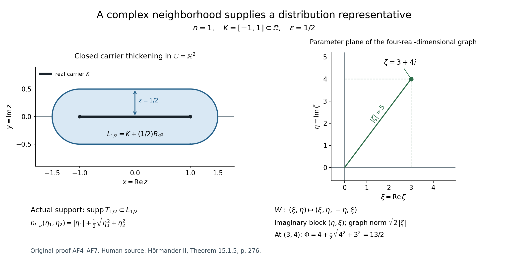
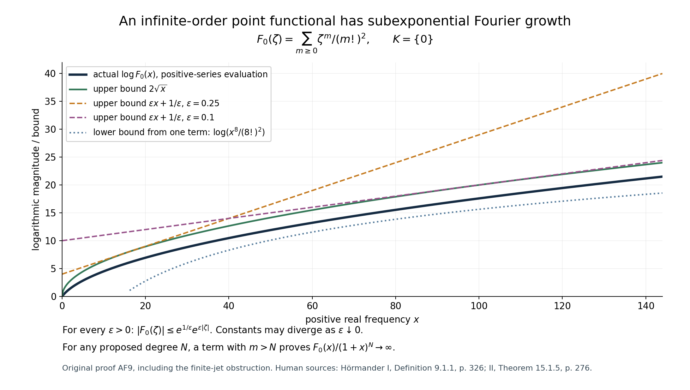

# Analytic functionals: small exponential losses and a diagonal construction

*Original learner exposition, examples and solutions by GPT-6.1 Sol (OpenAI), Ultra, October 2026. CC0 1.0.*

A compact distribution can differentiate a test only a finite number of times. An analytic functional can use infinitely many derivatives, because a holomorphic test has Cauchy bounds on every disk around its carrier. This lesson explains the Fourier growth that permits that extra freedom, and how a function satisfying the growth bounds reconstructs one well-defined analytic functional.

Read the [complete original proof](#complete-proof) alongside this guide. The actual preceding inputs are [L145 E2, holomorphic extension with a growth bound](../AN02-L145.html#extension-growth-corollary), and [L122 CF2.1, the compact-distribution Fourier theorem](../AN02-L122.html#2-the-compact-support-growth-criterion). The extension is used in complex dimension \(2n\); the distribution theorem is used in real dimension \(2n\). These are different roles for the same numeral.

## 1. What the theorem says

Let \(K\) be a nonempty compact convex subset of \(\mathbb R^n\), regarded as a real subset of \(\mathbb C^n\). It can have empty interior. Its support function is

\[
h_K(\eta)=\max_{a\in K}a\cdot\eta.
\tag{L146.1}
\]

An analytic functional carried by \(K\) is initially a complex-linear map on **entire holomorphic tests**, with a separate bound for every complex neighborhood \(\Omega\) of \(K\):

\[
|u(h)|\leq C_\Omega\sup_\Omega|h|.
\tag{L146.2}
\]

Its transform uses the bilinear dot product and no conjugate:

\[
\widehat u(\zeta)=u(e^{-iz\cdot\zeta}).
\tag{L146.3}
\]

[Theorem AF1](#analytic-functional-fourier-theorem) says that these transforms are exactly the entire functions for which

\[
\forall\varepsilon>0\ \exists C_\varepsilon<\infty:
\quad |F(\zeta)|\leq C_\varepsilon
e^{h_K(\operatorname{Im}\zeta)+\varepsilon|\zeta|}.
\tag{L146.4}
\]

The order of the quantifiers matters. The constant may become very large when the allowed loss becomes small. Every positive loss must work. On real frequencies the support term is zero, so the condition allows subexponential growth that exceeds every polynomial.

In contrast, the compact-distribution theorem asks for some fixed polynomial degree:

\[
|F(\zeta)|\leq C(1+|\zeta|)^N
e^{h_K(\operatorname{Im}\zeta)}.
\tag{L146.5}
\]

Any bound (L146.5) implies (L146.4), by absorbing a polynomial into each small exponential with a loss-dependent constant. The converse fails, as Worked example 3 proves.

## 2. The construction, with its coordinates visible

Write \(z=x+iy\), and enlarge the real carrier by a closed Euclidean ball in its complex neighborhood:

\[
L_\varepsilon=(K\times\{0\})+
\varepsilon\overline B_{\mathbb R^{2n}}(0,1).
\tag{L146.6}
\]

Its support function in the two real blocks is

\[
h_{L_\varepsilon}(\eta_1,\eta_2)
=h_K(\eta_1)+\varepsilon\sqrt{|\eta_1|^2+|\eta_2|^2}.
\tag{L146.7}
\]

Make this support function a weight on the imaginary coordinates of \(\mathbb C^{2n}\). Convexity gives the PSH circle inequality, and compactness of \(K\) gives a global Lipschitz bound. The entire function we want to extend is prescribed on the complex graph

\[
\zeta\longmapsto(\zeta,i\zeta),\qquad
\zeta=\xi+i\eta\longmapsto(\xi,\eta,-\eta,\xi).
\tag{L146.8}
\]

The imaginary block of the graph is \((\eta,\xi)\). Therefore the weight on the graph is exactly \(h_K(\eta)+\varepsilon|\zeta|\), the assumed exponent of (L146.4). L145 E2 extends \(F\) to an entire \(G_\varepsilon\) in the bigger complex space with a polynomial times that support-function bound. L122 CF2.1 then returns a distribution \(T_\varepsilon\) supported in the actual real \(2n\)-dimensional set \(L_\varepsilon\).

The transform identity on the graph is

\[
T_\varepsilon(e^{-i(x\cdot\zeta+y\cdot i\zeta)})
=T_\varepsilon(e^{-i(x+iy)\cdot\zeta})=F(\zeta).
\tag{L146.9}
\]

All representatives consequently have the same holomorphic polynomial moments. The global Taylor polynomials of an entire test converge with the finite number of derivatives required by either distribution, so their actions agree on every entire test. This is the compatibility argument that lets us define one functional \(u\), rather than an unrelated functional for each \(\varepsilon\).

For a given neighborhood \(\Omega\) of \(K\), choose a sufficiently small \(L_\varepsilon\) inside it. Insert a cutoff there and bound the finite derivatives of the test by Cauchy's formula on polydiscs still inside \(\Omega\). That gives (L146.2). Every step, including the cutoff estimate and uniqueness, is written in AF2–AF7.

The graph has four real coordinates when \(n=1\). The right panel displays its parameter plane and states all four coordinates; it does not depict an unlabeled spatial projection. The closed thickening on the left is where the auxiliary distribution is supported, not the asserted support of a real one-dimensional distribution.

## 3. Four worked examples

### Worked example 1. A finite jet at a translated real point

Fix \(a\in\mathbb R\) and define

\[
u(h)=\sum_{j=0}^M c_j h^{(j)}(a).
\tag{L146.10}
\]

Choose a closed disk of radius \(r\) centered at \(a\) inside any specified neighborhood. Cauchy's bound gives a valid neighborhood constant \(\sum_j|c_j|j!r^{-j}\), so this functional is carried by \(\{a\}\). Its Fourier transform and support function are

\[
F(\zeta)=e^{-ia\zeta}\sum_{j=0}^M c_j(-i\zeta)^j,
\qquad h_{\{a\}}(\eta)=a\eta.
\tag{L146.11}
\]

For each \(\varepsilon>0\) and \(t\geq0\), the \(j\)-th term of the exponential series proves \(t^j\leq j!\varepsilon^{-j}e^{\varepsilon t}\). Thus (L146.4) holds with \(C_\varepsilon=\sum_j|c_j|j!\varepsilon^{-j}\). This example also satisfies the polynomial criterion (L146.5).

For instance \(u(h)=h'(-2)\) has \(F(\zeta)=-i\zeta e^{2i\zeta}\). Its exponential support term is \(-2\operatorname{Im}\zeta\), which must retain its negative sign when the imaginary part is positive. A distribution representing (L146.10) on real tests is \(\sum_j(-1)^j c_j\partial_x^j\delta_a\), since a distributional derivative contributes the transpose sign.

### Worked example 2. Cancellation of total mass does not give the zero functional

For \(K=[-1,1]\), take \(u(h)=h(1)-h(-1)\). Then

\[
h_K(\eta)=|\eta|,\quad
F(\zeta)=e^{-i\zeta}-e^{i\zeta}=-2i\sin\zeta,
\quad |F(\zeta)|\leq2e^{|\operatorname{Im}\zeta|}.
\tag{L146.12}
\]

The neighborhood bound has constant 2. Its total mass \(u(1)\) and transform \(F(0)\) are zero, but \(u(z)=2\) and \(F'(0)=-2i\). Checking just the value at the origin cannot establish uniqueness. The uniqueness proof uses all derivatives, hence all holomorphic moments, and then the Taylor expansion of every entire test.

### Worked example 3. Infinitely many derivatives at zero

Define

\[
u_0(h)=\sum_{m=0}^\infty\frac{i^m h^{(m)}(0)}{(m!)^2},
\qquad F_0(\zeta)=\sum_{m=0}^\infty\frac{\zeta^m}{(m!)^2}.
\tag{L146.13}
\]

On a closed disk of radius \(r>0\), Cauchy's derivative estimates make the series absolutely convergent and give the explicit constant \(e^{1/r}\) for (L146.2). For each positive loss,

\[
|F_0(\zeta)|\leq e^{2\sqrt{|\zeta|}}
\leq e^{1/\varepsilon}e^{\varepsilon|\zeta|}.
\tag{L146.14}
\]

The first bound follows by taking the diagonal subseries of the positive double series \(e^{\sqrt{|\zeta|}}e^{\sqrt{|\zeta|}}\). The second is the nonnegative-square inequality in AF9. These are actual bounds, not claimed exact values of \(F_0\).

For the test \(z^3\), only one derivative contributes, giving \(u_0(z^3)=-i/6\). Every monomial has a nonzero corresponding moment. AF9 proves that a distribution supported at a point only sees some finite jet, so no point-supported distribution gives this functional. Equally, on the positive real axis, choosing a single term of degree \(m>N\) proves that \(F_0\) eventually exceeds every proposed polynomial bound of degree \(N\).

This is why requiring a compact distribution on the real carrier would wrongly remove an actual part of the theorem. The auxiliary distributions on arbitrarily small complex thickenings provide the correct construction.

### Worked example 4. Check every block of the diagonal

Take \(n=1\), \(K=[-1,1]\) and \(\varepsilon=1/2\). The bigger-space weight is

\[
\Phi(\zeta_1,\zeta_2)
=|\operatorname{Im}\zeta_1|+
\tfrac12\sqrt{(\operatorname{Im}\zeta_1)^2+
                    (\operatorname{Im}\zeta_2)^2}.
\tag{L146.15}
\]

For \(\zeta=3+4i\), its graph point is \((3+4i,-4+3i)\), with real chart \((3,4,-4,3)\). The imaginary block is \((4,3)\), so \(\Phi=4+5/2=13/2\). The graph norm is \(5\sqrt2\), and its chart volume factor is 2. The weight's global Lipschitz bound is \(R_K+\varepsilon=3/2\). The growth extension gives the polynomial exponent \(4n+1=5\).

The value \(13/2\) is the exponent in an upper bound, not the logarithm of a constructed function's modulus. The distribution returned by the compact Fourier theorem is in real dimension 2, supported in the closed stadium of radius \(1/2\) around \([-1,1]\). The entire extension is in complex dimension 2, or real dimension 4. Confusing these spaces loses both the diagonal identity and the support geometry.

## 4. Ten graded exercises

1. **Foundational: signed support functions.** For \(K=\{(2,-1)\}+r\overline B_{\mathbb R^2}(0,1)\), \(r\geq0\), compute \(h_K\). Then give \(h_{L_\varepsilon}\) with its two real frequency blocks.
2. **Foundational: metric and dimension.** In \(n=2\), compute the norm and induced volume factor of the graph chart, its complex codimension, the real dimension of the carrier thickening, and the polynomial exponent furnished by E2.
3. **Foundational: moments and signs.** Derive \(\partial_1\partial_2 F(0)\) in terms of \(u(z_1z_2)\). Compute the transform of \(h\mapsto h'(a)\) and the real distributional derivative representing it.
4. **Intermediate: the quantifier failure.** For \(K=\{0\}\), show that \(F(\zeta)=e^{-2i\zeta}\) satisfies a bound with loss 2 but fails the theorem's condition. Also disprove that evaluation at 2 is carried by zero using only polynomial tests and a neighborhood of zero.
5. **Intermediate: compatibility.** Suppose two compact distributions on \(\mathbb R^{2n}\) have identical holomorphic polynomial moments. Prove that they agree on entire holomorphic tests. State the convergence needed beyond convergence of values.
6. **Intermediate: local holomorphic tests.** Let \(L=[-1,1]\subset\mathbb C\), and let \(V\) be supported in \(L\) with all holomorphic polynomial moments zero. Use the dilation \(h_\lambda(z)=1/(\lambda z-2)\) to prove \(V(1/(z-2))=0\). Describe a parameter domain containing the interval from 0 to 1.
7. **Intermediate: the infinite-order series.** Compute \(u_0(z^m)\), prove (L146.14), and show that the constants in an arbitrarily small exponential bound cannot remain bounded as the loss tends to zero.
8. **Advanced: the point-support obstruction.** Prove that a distribution supported at a point and of order \(M\) sees only the Taylor jet through degree \(M\), using a shrinking cutoff. Apply it to \(u_0\), without citing a point-support classification theorem.
9. **Advanced: why the carrier is real.** Show that evaluation at \(3i/2\) is carried by that complex point, but its transform cannot satisfy the theorem for any compact real carrier.
10. **Advanced: an explicit neighborhood constant.** In AF7 suppose the distribution estimate has constant \(B\) and order \(M\), every cutoff derivative through order \(M\) is bounded by \(A\), and the admissible Cauchy polydisc radius is \(0<r\leq1\). Give a valid explicit \(C_\Omega\) and justify every factor.

## 5. Complete solutions

### Solution 1

Maximization over the translated ball separates the translation and the ball. The latter has support \(r|\eta|\), attained in the direction of \(\eta\) when it is nonzero. Therefore

\[
h_K(\eta)=2\eta_1-\eta_2+r|\eta|.
\tag{L146.16}
\]

For blocks \(\eta^{(1)},\eta^{(2)}\in\mathbb R^2\), adding the closed complex-neighborhood ball gives

\[
h_{L_\varepsilon}(\eta^{(1)},\eta^{(2)})
=2\eta^{(1)}_1-\eta^{(1)}_2+r|\eta^{(1)}|
+\varepsilon\sqrt{|\eta^{(1)}|^2+|\eta^{(2)}|^2}.
\tag{L146.17}
\]

The translation term retains its sign. The real ball radius \(r\) and the complex thickening radius \(\varepsilon\) have different roles.

### Solution 2

For any \(\zeta\in\mathbb C^2\), the graph norm is \(\sqrt2|\zeta|\). The real graph chart has dimension 4 and metric matrix \(2I_4\), so its volume factor is \(\sqrt{\det(2I_4)}=4\). It has complex dimension 2 inside complex dimension 4, hence complex codimension 2. The carrier thickening lies in \(\mathbb R^4\). E2 gives exponent \(4+2\cdot2+1=9\). The extension's ambient space has real dimension 8.

### Solution 3

Differentiation of the negative exponential gives

\[
\partial_1\partial_2F(0)=(-i)^2u(z_1z_2)=-u(z_1z_2).
\tag{L146.18}
\]

In one variable, the derivative test has transform \(-i\zeta e^{-ia\zeta}\). The distribution \(-\partial_x\delta_a\) acts on \(h\) as \(h'(a)\), because \((\partial_x\delta_a)(h)=-h'(a)\). This pairing is complex-linear; inserting a conjugation would change the convention.

### Solution 4

We have \(|F(\zeta)|=e^{2\operatorname{Im}\zeta}\leq e^{2|\zeta|}\), so the single-loss estimate holds with constant 1. Along \(\zeta=it\), \(t>0\), the required estimate with a loss \(\varepsilon<2\) would give \(e^{(2-\varepsilon)t}\leq C_\varepsilon\), impossible as \(t\to\infty\).

For the neighborhood \(\Omega=\{|z|<1\}\), take \(h_N(z)=(z/2)^N\). Evaluation at 2 is 1, while \(\sup_\Omega|h_N|=2^{-N}\). No fixed neighborhood constant can satisfy \(1\leq C_\Omega2^{-N}\) for all \(N\). Thus the original definition fails as well.

### Solution 5

Their difference has compact support and a finite distribution order \(M\) on a compact neighborhood of that support. Expand an entire test in its global Taylor series on a larger polydisc. Cauchy coefficient bounds imply uniform convergence of the polynomials and their holomorphic derivatives through order \(M\) on a smaller polydisc containing the support neighborhood. For a holomorphic function each real derivative is a holomorphic derivative multiplied by a power of \(i\). Insert a fixed cutoff and apply the finite-order estimate to the difference between the test and each Taylor polynomial. The pairing difference tends to zero. Since it is zero on each polynomial, it is zero on the entire test. Uniform convergence of values alone would not justify applying an order-\(M\) distribution.

### Solution 6

For \(z\in[-1,1]\), the denominator can vanish only if \(\lambda\) is real and \(|\lambda|\geq2\). Thus use

\[
\Lambda=\mathbb C\setminus
\bigl(( -\infty,-2]\cup[2,\infty)\bigr).
\tag{L146.19}
\]

It is open and contains \([0,1]\). Near any fixed parameter in it, compactness supplies a common neighborhood of \(L\) with denominator bounded away from zero, so pairing with \(V\) is holomorphic in the parameter by its finite-order estimate. For small \(\lambda\), the series

\[
\frac1{\lambda z-2}
=-\frac12\sum_{m=0}^\infty(\lambda z/2)^m
\tag{L146.20}
\]

converges uniformly with the required derivatives near \(L\). Each term pairs to zero. The parameter identity principle on the component containing \([0,1]\) gives zero at \(\lambda=1\), which is the requested assertion. This is the concrete dilation argument of AF8.

### Solution 7

Only the \(m\)-th derivative of \(z^m\) is nonzero at zero, and it equals \(m!\). Thus \(u_0(z^m)=i^m/m!\). Absolute values of the transform series are bounded by its series in \(|\zeta|\). Put \(s=\sqrt{|\zeta|}\); the diagonal terms of \(e^se^s\) are exactly \(s^{2m}/(m!)^2\). This gives the first bound in (L146.14). Expanding \((\sqrt{\varepsilon|\zeta|}-1/\sqrt\varepsilon)^2\geq0\) gives the second.

If constants stayed bounded by \(C\) along losses tending to zero, the bound at each fixed positive real \(x\) would imply \(F_0(x)\leq C\). But the first two terms give \(F_0(x)\geq1+x\). This contradicts a bound independent of \(x\). The explicit available constant \(e^{1/\varepsilon}\) is allowed to diverge; no optimality for it is asserted.

### Solution 8

Subtract the Taylor polynomial of total degree \(M\) from a smooth test to obtain \(R\). On a ball of radius proportional to \(t\), its derivative of order \(j\leq M\) is bounded by \(C_jt^{M+1-j}\). A cutoff \(\chi(x/t)\) has derivatives of order \(k\) bounded by a constant times \(t^{-k}\). In a Leibniz term of total order \(|\beta|\leq M\), the product is therefore bounded by a constant times \(t^{M+1-|\beta|}\), at most a constant times \(t\) for \(0<t\leq1\). The cutoff equals one near the support point, so the distributional action on \(R\) equals its action on the cutoff remainder. The finite-order estimate makes that action tend to zero. Hence it is zero, and the distribution depends only on the jet through order \(M\). For \(m>M\), the test \(z^m\) has that jet zero; the nonzero value \(i^m/m!\) of \(u_0\) contradicts representation by such a distribution.

### Solution 9

Evaluation at \(3i/2\) is bounded by the supremum on any neighborhood of that point, with constant 1. Its negative-exponential transform is \(e^{3\zeta/2}\). For any compact real \(K\), its support function is zero at imaginary frequency zero. Along \(\zeta=x>0\), a bound (L146.4) with any loss \(\varepsilon<3/2\) would require \(e^{(3/2-\varepsilon)x}\leq C_\varepsilon\), a contradiction. A complex point carrier does not fall under the real-carrier theorem.

### Solution 10

A valid constant is

\[
C_\Omega=B A\,2^M M!\,r^{-M}.
\tag{L146.21}
\]

In the Leibniz rule for a real derivative of total order \(|\beta|\leq M\), the sum of the binomial coefficients is \(2^{|\beta|}\leq2^M\). Each cutoff derivative is at most \(A\). Each real derivative of the holomorphic test reduces, up to a unit complex factor, to a holomorphic multiindex derivative of total order at most \(M\). Its Cauchy factorial is at most \(M!\), and \(r^{-|\alpha|}\leq r^{-M}\) because \(r\leq1\). Multiply these bounds and the distribution constant \(B\). The same argument applies to a test holomorphic only on the chosen neighborhood. A coarse finite constant suffices for the carrier definition; it need not be optimal.

## 6. What is established and what comes later

The full proof establishes the exact every-loss Fourier criterion, uniqueness on entire tests, compatibility of auxiliary distributions, and a uniquely bounded action on holomorphic germs for this convex real carrier. It also gives an explicit infinite-order point functional. It does not assert that all analytic functionals are compact real distributions, nor a theorem for arbitrary complex carriers. The later weighted Fourier estimates and remaining course targets require their own proofs.

Human scholarly sources: Lars Hörmander, *The Analysis of Linear Partial Differential Operators II*, §15.1, Theorem 15.1.5, printed p. 276; and volume I, Definition 9.1.1 and the local-test discussion following Proposition 9.1.2, printed pp. 326–328. Original derivations and scope comparisons are in the formal companion. Native protected pages are excluded from the original distributable packet.

## Complete proof

*Original proof exposition by GPT-6.1 Sol (OpenAI), Ultra, October 2026. CC0 1.0.*

An analytic functional can have infinite differential order at a point. Its Fourier transform therefore need not have polynomial growth on real frequencies. The exact replacement is an arbitrarily small exponential loss, with a different constant allowed for each loss. We prove both directions of this criterion, the uniqueness statement, and the compatibility of the complex-neighborhood distribution representatives used in the construction.

Our convention is a complex-linear pairing and the negative-exponential forward transform. The dot product in a complex exponential is bilinear, without conjugation. Lengths on complex spaces are Euclidean lengths on their underlying real spaces.

The two substantive earlier inputs are [L145, E2, the proved holomorphic extension growth corollary](../AN02-L145.html#extension-growth-corollary), and [L122, Theorem CF2.1, the full compact-distribution Fourier criterion](../AN02-L122.html#2-the-compact-support-growth-criterion). The latter includes both growth-to-support and uniqueness, with the same forward-transform convention. Its use below is in real dimension \(2n\), not \(n\). The product Cauchy formula and uniform joint power series are proved in [L145 E3](../AN02-L145.html#distributional-holomorphic-regularity). Smooth cutoffs and finite-order bounds for compact distributions are the written distribution foundations used in CF2.1. Every new carrier, compatibility and uniqueness step is given here.

## AF1. The definition and the exact theorem

Let \(n\geq1\) and let \(K\subset\mathbb R^n\subset\mathbb C^n\) be a nonempty compact convex set. It may be a point or lie in a proper affine subspace. Define its support function and radius by

\[
h_K(\eta)=\max_{a\in K}a\cdot\eta,
\qquad R_K=\max_{a\in K}|a|.
\tag{AF1}
\]

Write \(\mathcal A(\mathbb C^n)\) for the entire holomorphic functions. An **analytic functional carried by \(K\)** is a complex-linear map \(u:\mathcal A(\mathbb C^n)\to\mathbb C\) such that, for every open complex neighborhood \(\Omega\supset K\), a finite constant \(C_\Omega\) satisfies

\[
|u(h)|\leq C_\Omega\sup_{z\in\Omega}|h(z)|
\quad(h\in\mathcal A(\mathbb C^n)).
\tag{AF2}
\]

This space is denoted \(\mathcal A'(K)\). It suffices to check bounded neighborhoods: each neighborhood of the compact set contains a smaller bounded one. A supremum that is infinite gives no restriction, but all sufficiently small bounded neighborhoods must still have their own finite constants. We initially define \(u\) on entire tests, exactly as in the cited definition. An action on holomorphic germs will be a proved consequence for the convex real carrier, not an additional assumption.

**Theorem AF1.** The map

\[
\widehat u(\zeta)=u\bigl(z\mapsto e^{-iz\cdot\zeta}\bigr)
\tag{AF3}
\]

is a bijection between \(\mathcal A'(K)\) and the entire functions \(F\) satisfying

\[
\text{for every }\varepsilon>0\text{ there is }C_\varepsilon<\infty:
\quad
|F(\zeta)|\leq C_\varepsilon
\exp\bigl(h_K(\operatorname{Im}\zeta)+\varepsilon|\zeta|\bigr)
\quad(\zeta\in\mathbb C^n).
\tag{AF4}
\]

The constant may depend on \(\varepsilon\). In particular, (AF4) asserts neither polynomial growth on the real axis nor one constant uniform as \(\varepsilon\downarrow0\). The support function can be negative; we keep its exact sign.

## AF2. Entire dependence and all holomorphic moments

Fix a bounded neighborhood \(\Omega\) of \(K\). On \(\Omega\), the exponential has, for \(\zeta=\zeta_0+w\), the series

\[
e^{-iz\cdot(\zeta_0+w)}
=e^{-iz\cdot\zeta_0}
\sum_{\alpha\in\mathbb N^n}
\frac{(-iz)^\alpha w^\alpha}{\alpha!}.
\tag{AF5}
\]

It is absolutely and uniformly convergent for \(z\in\Omega\) and \(w\) in any fixed bounded polydisc: bound each coordinate of \(z\) by a fixed number and multiply the ordinary exponential majorants. The same applies to any fixed parameter derivative. The bound (AF2) permits applying \(u\) to the partial sums and passing to the limit, uniformly on the parameter polydisc. Consequently \(\widehat u\) has a convergent joint power series about every \(\zeta_0\), and

\[
\partial_\zeta^\alpha\widehat u(0)
=(-i)^{|\alpha|}u(z^\alpha).
\tag{AF6}
\]

Thus the Fourier transform determines every holomorphic polynomial moment. If \(\widehat u=0\), all these moments vanish. For any entire \(h\), its Taylor polynomials about the origin converge uniformly on the bounded set \(\Omega\), by the product Cauchy expansion on a larger polydisc. Applying (AF2) shows \(u(h)=0\). This proves injectivity on the actual entire-test space.

## AF3. The precise forward growth bound

For \(\varepsilon>0\), take

\[
\Omega_\varepsilon=\{z:\operatorname{dist}(z,K)<\varepsilon\}.
\tag{AF7}
\]

It is a bounded complex neighborhood. Write \(\zeta=\xi+i\eta\). For \(z\in\Omega_\varepsilon\), choose \(a\in K\) and write \(z=a+p+iq\) with \(\sqrt{|p|^2+|q|^2}<\varepsilon\). Direct multiplication gives

\[
\operatorname{Re}(-iz\cdot\zeta)
=a\cdot\eta+p\cdot\eta+q\cdot\xi
\leq h_K(\eta)+\varepsilon\sqrt{|\xi|^2+|\eta|^2}.
\tag{AF8}
\]

Use (AF2) with this neighborhood and the exponential test to obtain (AF4). No derivative bound or distribution order is assumed.

## AF4. A convex complex thickening and its diagonal weight

Now let \(F\) be an entire function satisfying (AF4). Fix \(\varepsilon>0\). Identify \(z=x+iy\in\mathbb C^n\) with \((x,y)\in\mathbb R^{2n}\), and set

\[
L_\varepsilon=(K\times\{0\})+
\varepsilon\overline B_{\mathbb R^{2n}}(0,1).
\tag{AF9}
\]

This is the closed Euclidean \(\varepsilon\)-neighborhood of the real set \(K\) in \(\mathbb C^n\). To verify the equality, minimizing distance to \(K\) is possible by compactness, and the residual vector then has length at most \(\varepsilon\). It is nonempty, compact and convex. Maximizing independently over the two summands gives its exact real support function:

\[
h_{L_\varepsilon}(\eta_1,\eta_2)
=h_K(\eta_1)+\varepsilon\sqrt{|\eta_1|^2+|\eta_2|^2}.
\tag{AF10}
\]

On \(\mathbb C^{2n}\), whose complex coordinate blocks are \(Z=(\zeta_1,\zeta_2)\), define

\[
\Phi_\varepsilon(Z)
=h_{L_\varepsilon}(\operatorname{Im}\zeta_1,
                       \operatorname{Im}\zeta_2).
\tag{AF11}
\]

It is finite and continuous. It is PSH, with a direct circle proof. At the center of any disk in any complex affine line, choose a maximizer \(\ell\in L_\varepsilon\) for the support function. The real linear function \(\ell\cdot\operatorname{Im}Z\) is harmonic along that line, so its circle average equals its value at the center. On the circle it is at most \(\Phi_\varepsilon\). This proves the submean inequality at the center. Continuity supplies upper semicontinuity. Equivalently, the weight is a convex function of the imaginary coordinates.

The inequality \(|h_K(\eta)-h_K(\widetilde\eta)|\leq R_K|\eta-\widetilde\eta|\), proved by taking the maximizing linear functions in turn, and the triangle inequality for the Euclidean norm give

\[
|\Phi_\varepsilon(Z)-\Phi_\varepsilon(\widetilde Z)|
\leq(R_K+\varepsilon)|Z-\widetilde Z|.
\tag{AF12}
\]

Because \(R_K+\varepsilon>0\), this is exactly the strict unit-oscillation hypothesis of L145 E2 when \(|Z-\widetilde Z|<1\).

The complex linear graph

\[
W=\{(\zeta,i\zeta):\zeta\in\mathbb C^n\}
\subset\mathbb C^{2n}
\tag{AF13}
\]

has complex dimension \(n\) and codimension \(n\). For \(\zeta=\xi+i\eta\), its real-coordinate chart is \((\xi,\eta,-\eta,\xi)\). In particular,

\[
\operatorname{Im}(\zeta,i\zeta)=(\eta,\xi),\quad
\Phi_\varepsilon(\zeta,i\zeta)=h_K(\eta)+\varepsilon|\zeta|,
\quad |(\zeta,i\zeta)|=\sqrt2|\zeta|.
\tag{AF14}
\]

The induced real volume in this graph chart is \(2^n\,dV(\zeta)\), since the metric is twice the identity in real dimension \(2n\). The growth corollary does not require an original square integral in this chart; its pointwise hypothesis is precisely (AF4).

## AF5. Extension, then a distribution in real dimension twice as large

Apply L145 E2 to the entire function \((\zeta,i\zeta)\mapsto F(\zeta)\) on \(W\), with ambient complex dimension \(2n\), codimension \(n\), and weight \(\Phi_\varepsilon\). It supplies an entire \(G_\varepsilon\) with

\[
G_\varepsilon(\zeta,i\zeta)=F(\zeta),\qquad
|G_\varepsilon(Z)|\leq A_\varepsilon(1+|Z|)^{4n+1}
e^{h_{L_\varepsilon}(\operatorname{Im}Z)}.
\tag{AF15}
\]

The exponent is the proved choice \(2n+2n+1\); no optimality is claimed. The constant is finite for the fixed \(\varepsilon\).

L122 CF2.1, now in real dimension \(2n\), gives a compact distribution \(T_\varepsilon\) with

\[
\operatorname{supp}T_\varepsilon\subset L_\varepsilon,
\qquad
G_\varepsilon(\zeta_1,\zeta_2)
=T_\varepsilon\bigl(e^{-i(x\cdot\zeta_1+y\cdot\zeta_2)}\bigr).
\tag{AF16}
\]

A compact distribution acts on a smooth function near its support by inserting a smooth cutoff equal to one there. This value does not depend on the cutoff. Restrict (AF16) to the complex graph. The identity

\[
-i\bigl(x\cdot\zeta+y\cdot(i\zeta)\bigr)
=-i(x+iy)\cdot\zeta
\tag{AF17}
\]

proves

\[
T_\varepsilon\bigl((x,y)\mapsto e^{-i(x+iy)\cdot\zeta}\bigr)
=F(\zeta).
\tag{AF18}
\]

There is no assertion that these distributions are carried by \(K\) in real \(n\)-dimensional distribution theory. Their actual supports lie in complex neighborhoods of \(K\), viewed in real dimension \(2n\).

## AF6. All the representatives give one functional on entire tests

Differentiating (AF18) is legitimate in the finite smooth seminorms of a compact distribution, exactly as in CF2.1. Thus for every \(\alpha\),

\[
T_\varepsilon\bigl((x+iy)^\alpha\bigr)
=i^{|\alpha|}\partial^\alpha F(0).
\tag{AF19}
\]

If \(\varepsilon,\delta>0\), the compact distribution \(T_\varepsilon-T_\delta\) has all these holomorphic moments zero. Let \(h\) be entire. Its Taylor polynomials converge to \(h(x+iy)\), together with all real derivatives up to any fixed finite order, uniformly on a fixed compact neighborhood of both supports. Here is the derivative justification: on a slightly larger polydisc, the product Cauchy bounds dominate the series geometrically; differentiating a fixed number of times adds only polynomial factors to the indices, still summable on a smaller polydisc. Moreover \(\partial_{x_j}h=\partial_{z_j}h\) and \(\partial_{y_j}h=i\partial_{z_j}h\). The finite-order distribution estimate therefore permits passage to the limit. Every Taylor polynomial pairs to zero, so

\[
T_\varepsilon\bigl(h(x+iy)\bigr)
=T_\delta\bigl(h(x+iy)\bigr).
\tag{AF20}
\]

This also proves independence of the particular extension \(G_\varepsilon\) selected by E2: any other extension with the same diagonal values has the same holomorphic moments and the same entire-test action. Define

\[
u(h)=T_\varepsilon\bigl(h(x+iy)\bigr),
\qquad h\in\mathcal A(\mathbb C^n),
\tag{AF21}
\]

using any one positive \(\varepsilon\). It is one complex-linear functional, independent of every choice just discussed, and (AF18) gives \(\widehat u=F\).

## AF7. The bound on every neighborhood, with all derivative estimates supplied

Let \(\Omega\) be any open complex neighborhood of \(K\). Compactness gives \(\varepsilon>0\) with \(L_\varepsilon\subset\Omega\) and a positive gap to its complement. Choose a smooth compactly supported cutoff \(\chi\) inside \(\Omega\), equal to one near \(L_\varepsilon\). The finite-order estimate of \(T_\varepsilon\), on the fixed compact support of \(\chi\), gives constants \(B\) and an integer \(M\) with

\[
|u(h)|=|T_\varepsilon(\chi h)|
\leq B\max_{|\beta|\leq M}\sup
|\partial_{x,y}^\beta(\chi h)|.
\tag{AF22}
\]

Choose \(r>0\) such that every closed coordinate polydisc of radius \(r\) centered on \(\operatorname{supp}\chi\) lies inside \(\Omega\). Such an \(r\) exists by compactness, reducing it by \(\sqrt n\) when passing from Euclidean distance to a coordinate polydisc. The product Cauchy formula yields

\[
|\partial_z^\alpha h(z)|
\leq\alpha!\,r^{-|\alpha|}\sup_\Omega|h|
\quad(z\in\operatorname{supp}\chi).
\tag{AF23}
\]

For \(\beta=(\beta_x,\beta_y)\), the real derivative is \(i^{|\beta_y|}\partial_z^{\beta_x+\beta_y}h\). Apply the finite Leibniz rule in (AF22), bound the fixed derivatives of \(\chi\), and use (AF23) for every derivative of \(h\) that occurs. Their orders are at most \(M\). This gives a finite \(C_\Omega\) such that (AF2) holds. If \(\sup_\Omega|h|=\infty\), the inequality is automatic; otherwise the preceding argument applies verbatim. We have proved \(u\in\mathcal A'(K)\), and AF2 already proved its uniqueness. This completes Theorem AF1. \(\square\)

The left diagram is the exact \(n=1\), \(K=[-1,1]\), \(\varepsilon=1/2\) carrier in the complex \(z=x+iy\) plane. The right diagram is the original frequency plane \(\zeta=\xi+i\eta\), with the full four-real-coordinate graph map written explicitly. It is not a spatial projection of that four-dimensional graph. Both panels concern the construction in AF4–AF7.

## AF8. The action on holomorphic germs, proved for this convex carrier

We give the additional compatibility needed when a test is holomorphic only near \(K\). First prove the following elementary convex-carrier fact.

**Lemma AF8.** Let \(L\subset\mathbb C^n\) be nonempty compact and convex as a real set. If a compact distribution \(V\) on \(\mathbb R^{2n}\), supported in \(L\), vanishes on all holomorphic polynomials, then it vanishes on every function holomorphic in a neighborhood \(D\) of \(L\).

Choose \(a\in L\) and set

\[
\Lambda=\{\lambda\in\mathbb C:
a+\lambda(L-a)\subset D\},
\qquad h_\lambda(z)=h(a+\lambda(z-a)).
\tag{AF24}
\]

The set \(\Lambda\) is open: at any of its points, the compact image of \(L\) has a positive gap inside \(D\), and multiplication depends continuously on \(\lambda\). Convexity implies \([0,1]\subset\Lambda\). For \(\lambda\) near a fixed \(\lambda_0\in\Lambda\), the functions \(h_\lambda\) are defined on a common neighborhood of \(L\). Insert one common cutoff there. Their dependence on \(\lambda\) is holomorphic in every finite smooth seminorm: Cauchy expansion in the parameter on a slightly larger parameter disk, and the spatial derivative bounds on a compact neighborhood, give uniform convergence of the series and of its finitely many spatial derivatives. Hence \(\lambda\mapsto V(h_\lambda)\) is holomorphic near \(\lambda_0\).

For \(|\lambda|\) small, the Taylor series of \(h\) about \(a\) converges with the required finite derivatives uniformly near \(L\) after the dilation. Its terms are holomorphic polynomials in \(z\), so \(V(h_\lambda)=0\) near zero. The ordinary one-variable identity principle makes it zero on the connected component of \(\Lambda\) containing \([0,1]\). Explicitly, a nonzero power series about a zero has a first nonzero coefficient and factors as a power of the coordinate times a nonvanishing function on a small disk, so that zero is isolated. A limit point of zeros inside the domain must consequently have the zero power series. The set of points with a zero neighborhood is therefore both open and closed in the connected component and is nonempty here. At \(\lambda=1\), this gives \(V(h)=0\), proving the lemma.

Now let \(h\) be holomorphic in \(D\supset K\). Choose \(\varepsilon\) with \(L_\varepsilon\subset D\) and define \(u_D(h)=T_\varepsilon(h(x+iy))\). For two admissible radii, both supports lie in the larger of their nested convex thickenings, which is still inside \(D\). Their difference has zero polynomial moments by (AF19). Lemma AF8 proves that both choices have the same action. Different representatives give the same result by the same argument. If two holomorphic functions agree on some neighborhood of \(K\), choose a smaller thickening inside that neighborhood; their values agree. We therefore obtain a linear action on holomorphic germs at \(K\). The Cauchy estimate argument of AF7 applies to local holomorphic functions as well, giving (AF2) on every neighborhood where the representative is defined.

For completeness, this continuous germ action is unique. If two such actions agree on entire tests, their difference \(v\) vanishes on polynomials. For a local \(h\), use (AF24) with \(L=K\). Near each parameter value the functions \(h_\lambda\) are holomorphic on a common neighborhood of \(K\). Choose a smaller bounded neighborhood with closure in it; uniform Cauchy expansion in \(\lambda\), together with the neighborhood bound for \(v\), makes \(v(h_\lambda)\) holomorphic. For small \(\lambda\), Taylor polynomials about \(a\) converge uniformly there, so it is zero. The identity principle along \([0,1]\) gives \(v(h)=0\). This proves uniqueness without assuming a general approximation theorem for an arbitrary complex carrier. This argument establishes the local-test conclusion for the convex carrier used here; it is not a proof of the more general nonconvex real-carrier approximation proposition.

## AF9. An actual infinite-order point functional

In one complex variable, define

\[
u_0(h)=\sum_{m=0}^\infty
\frac{i^m}{(m!)^2}h^{(m)}(0).
\tag{AF25}
\]

For any neighborhood \(\Omega\) of zero, choose \(r>0\) whose closed disk lies inside \(\Omega\). Cauchy's estimate gives absolute convergence and

\[
|u_0(h)|\leq\sup_{|z|\leq r}|h(z)|
\sum_{m=0}^\infty\frac{r^{-m}}{m!}
=e^{1/r}\sup_{|z|\leq r}|h(z)|.
\tag{AF26}
\]

Thus \(u_0\in\mathcal A'(\{0\})\). Its Fourier transform is

\[
F_0(\zeta)=\sum_{m=0}^\infty\frac{\zeta^m}{(m!)^2}.
\tag{AF27}
\]

It is entire by the ratio bound on bounded disks. With \(s=\sqrt{|\zeta|}\), the nonnegative double sum \(e^s e^s\) contains its diagonal subseries, so

\[
|F_0(\zeta)|\leq e^{2\sqrt{|\zeta|}}
\leq e^{1/\varepsilon}e^{\varepsilon|\zeta|}
\quad(\varepsilon>0).
\tag{AF28}
\]

The second inequality is \(2\sqrt t\leq\varepsilon t+1/\varepsilon\), obtained by expanding \((\sqrt{\varepsilon t}-1/\sqrt\varepsilon)^2\geq0\).

It is not the action of a distribution supported at zero. Here is the needed finite-jet argument, without citing a point-support structure theorem. Let \(T\) have support \(\{0\}\) and finite order \(M\) on a fixed compact neighborhood. For any smooth test, subtract its Taylor polynomial of total degree \(M\) at zero to get a remainder \(R\). For a fixed cutoff \(\chi\) equal to one near zero, set \(\chi_t(x)=\chi(x/t)\). Taylor's remainder estimate and the Leibniz rule give

\[
\max_{|\beta|\leq M}\sup
|\partial^\beta(\chi_tR)|=O(t)
\quad(t\downarrow0).
\tag{AF29}
\]

Indeed a term with total derivative order \(|\beta|\) is bounded by a constant times \(t^{M+1-|\beta|}\). The support property gives \(T(R)=T(\chi_tR)\), and its finite-order estimate makes this value tend to zero. Hence \(T\) depends only on the jet through order \(M\). This proof works in real dimension one or two. But

\[
u_0(z^m)=\frac{i^m}{m!}\ne0
\quad\text{for every }m,
\tag{AF30}
\]

whereas \(z^m\) has zero real jet through order \(M\) when \(m>M\). No point-supported distribution can represent \(u_0\). Consistently, \(F_0(x)\) is not polynomially bounded for \(x>0\): for any proposed degree \(N\), choose an integer \(m>N\); the single positive term \(x^m/(m!)^2\) exceeds every constant multiple of \((1+x)^N\) eventually.

An independent real-integral expression will check the plotted series numerically. With \(s=\sqrt x\), expand \(e^{s e^{it}}e^{s e^{-it}}\); the double series is absolutely uniform in \(t\). Integrating a term around the circle gives zero unless its two indices agree. Therefore

\[
F_0(x)=\frac1{2\pi}\int_0^{2\pi}e^{2\sqrt x\cos t}\,dt
\quad(x\geq0).
\tag{AF31}
\]

This identity is not needed for existence of the analytic functional. It supplies a genuinely different calculation for the numerical checks.

The plotted function is the actual convergent positive series (AF27) on positive real frequencies. The curves identified as upper bounds are (AF28). A displayed single-term lower bound is one exact term of the positive series, not an asymptotic approximation. The plot is an illustration; the proofs of arbitrarily small exponential type and failure of every polynomial bound are the exact arguments above.

## AF10. Quantifiers, translation and exclusions

If \(a\in\mathbb R\), translating the preceding functional gives

\[
u_a(h)=\sum_{m=0}^\infty\frac{i^m}{(m!)^2}h^{(m)}(a),
\qquad \widehat u_a(\zeta)=e^{-ia\zeta}F_0(\zeta),
\qquad h_{\{a\}}(\eta)=a\eta.
\tag{AF32}
\]

The signed support term is retained, including when it is negative. A single exponential-loss estimate would not suffice: for \(a\ne0\), the function \(e^{-ia\zeta}\) satisfies a bound with \(K=\{0\}\) and loss \(|a|\), but fails (AF4) for \(\varepsilon<|a|\), along \(\zeta=it\operatorname{sgn}(a)\).

The real-carrier hypothesis matters. Evaluation at a nonreal point \(ib\), \(b\ne0\), is an analytic functional with that complex point as a carrier and transform \(e^{b\zeta}\). It cannot satisfy (AF4) for any compact real \(K\): along the real frequency ray of the sign of \(b\), \(h_K(0)=0\) and any \(\varepsilon<|b|\) gives a contradiction. We have not asserted this theorem for arbitrary complex carriers.

If a single constant \(C\) works for all \(\varepsilon>0\) in (AF4), taking \(\varepsilon\downarrow0\) at each fixed \(\zeta\) gives \(|F(\zeta)|\leq C e^{h_K(\operatorname{Im}\zeta)}\). CF2.1 then supplies a distribution supported in \(K\). This is a stronger hypothesis than the theorem; neither a common constant nor a real-carrier distribution representative is supplied in general.

The empty-carrier case is just the zero functional. With the convention that the supremum over the empty neighborhood is zero, its defining bound forces this. The support-function statement above is formulated for nonempty \(K\), so it does not assign a finite support function to the empty set.

## Exact human-source comparison and scope

Theorem AF1 matches Lars Hörmander, *The Analysis of Linear Partial Differential Operators II*, §15.1, Theorem 15.1.5, printed p. 276, 1983 edition, second revised printing 1990, reprint 2005. The initial entire-test definition is Hörmander I, Definition 9.1.1, printed p. 326, 1983 edition, second edition 1990, reprint 2003. The distinction between that definition and subsequent local holomorphic tests is visible in I, Proposition 9.1.2 and its following conclusion, printed pp. 327–328. AF8 gives a separate direct proof for the convex carrier needed here, with its stated scope.

Our proof fills in the joint analyticity, exact graph metric and coordinates, PSH and global oscillation checks, diagonal sign, independence of representatives, every-neighborhood continuity, uniqueness and infinite-order example. It uses actual earlier course proofs of II, Corollary 15.1.4 and I, Theorem 7.3.1 through L145 E2 and L122 CF2.1. Protected native book text and page images are private reading evidence and are absent from the distributable original packet. This proves the stated analytic-functional target, not the remaining Chapter 15 weighted Fourier estimates or the entire course.
