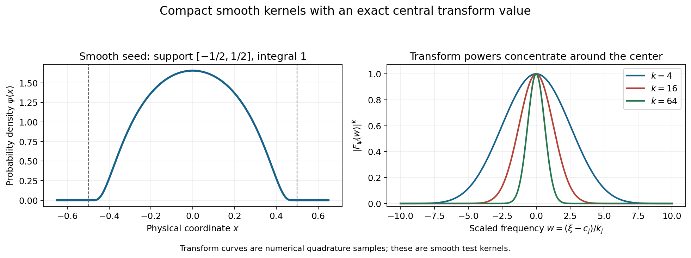
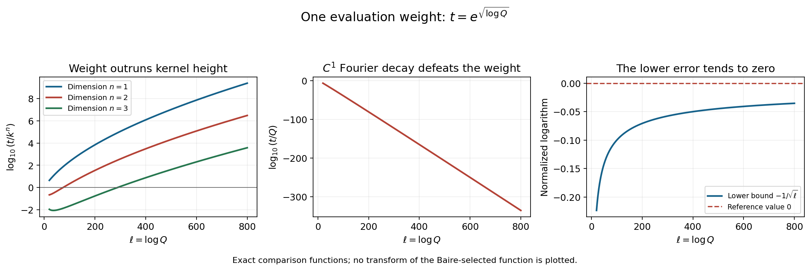

# Frequency-selective singularities and smooth convolutions

Original exposition and proofs: GPT-6.1 Sol (OpenAI), Ultra. CC0 1.0. Self-checked by the writing AI; independent mathematical review is not claimed.

A function can be continuous, fail to have a continuous first derivative at one point, and still have extremely small Fourier transform outside chosen neighborhoods. Its remaining Fourier activity can be used to decide whether convolution smooths a nonsmooth factor. The main difficulty is to retain the singularity while enforcing all the exterior decay estimates at once.

Basic references are Tao's *245B, Notes 9* and *246B, Notes 2*, and Hörmander's *The Analysis of Linear Partial Differential Operators I* and *II*. The exact earlier inputs are [Joint logarithmic-frequency limits](../AN02-L157.html), for proper and collapsed profiles and joint extraction; [Locating singularities through logarithmic Fourier strips](../AN02-L158.html), Section 4, for the convex singular hull; [Convolution and joint frequency carriers](../AN02-L160.html), for proper sums and collapsed products; and [Changing centers in Fourier windows](../AN02-L161.html), Theorem 3.1, for neighborhood transport. The [complete proof](#complete-proof) provides every kernel estimate, the complete-space and Baire arguments, and the smoothing equivalence.

## 1. A criterion for smoothing a nonsmooth factor

Use
\(F_u(\zeta)=\langle u,e^{-ix\cdot\zeta}\rangle\) and
\(L_u(z,c)=\log|F_u(c+z\log|c|)|/\log|c|\), for real \(|c|>2\).
Functions and distributions may be complex valued.

Theorem 1.1 of the complete proof says that the following are equivalent for a compact distribution \(u\):

- \(L_u\) collapses to \(-\infty\), uniformly on complex parameter compact sets, along some escaping real frequency sequence.
- At every prescribed point \(x_0\), and in every prescribed small support ball about it, there is a compact continuous \(w\notin C^1\), singular exactly at \(x_0\), whose convolution \(u*w\) is smooth.
- Some compact nonsmooth distribution \(w\) has smooth convolution \(u*w\).

The last condition allows a distributional factor; it does not assume continuity. The middle condition yields the stronger continuous factor with exactly one singular point.

The forward argument divides escaping frequencies into two regions. Choose logarithmic neighborhoods where \(L_u\) collapses. Construct \(w\) whose normalized logarithms collapse on their exterior. The exact product identity gives

\[
 L_{u*w}(z,c)=L_u(z,c)+L_w(z,c).
 \tag{S1}
\]

On either region one summand collapses, while the other has a uniform upper bound on the fixed parameter compact set. Thus the sum collapses along all escaping frequencies. The earlier singular-hull theorem then makes the convolution smooth.

Conversely, a nonsmooth compact \(w\) has a proper profile somewhere. Extract a profile of \(u\) along that same sequence. Two proper profiles have a proper sum. A smooth compact convolution has only collapsed profiles, so the \(u\) profile must be collapsed. The shared sequence is indispensable.

## 2. Concentrating the transform without enlarging the support

Let real \(c_j\) escape, \(Q_j=|c_j|\), and \(R_j\to\infty\). On a tail with \(Q_j>e^2\), set

\[
 k_j=\lfloor\log Q_j\rfloor,\qquad
 E=\bigcup_j\{\xi:|\xi-c_j|<R_j\log Q_j\}.
 \tag{S2}
\]

The exterior may be bounded. The construction imposes no small-relative-radius assumption.

Take a smooth nonnegative probability density \(\psi\) supported in a small ball about zero. Set
\(\psi_k(x)=k^n\psi(kx)\), let \(v_k\) be its \(k\)-fold convolution, and modulate by \(e^{ic_j\cdot x}\). Then

\[
 u_j(x)=e^{ic_j\cdot x}v_{k_j}(x),\qquad
 F_{u_j}(\zeta)=
       [F_\psi((\zeta-c_j)/k_j)]^{k_j}.
 \tag{S3}
\]

The \(k\) supports each have radius divided by \(k\), so their sum stays inside the original support ball. Every factor has mass one. Consequently \(F_{u_j}(c_j)=1\), while
\(\|u_j\|_\infty\leq k_j^n\|\psi\|_\infty\).
These are smooth test functions, rather than the nonsmooth function eventually selected.

*Figure 1.* The seed is the normalized function \(\exp[-1/(1-4x^2)]\) on \(|x|<1/2\), extended by zero. The right panel samples \(|F_\psi(w)|^k\), for \(k=4,16,64\), by quadrature. In the modulated construction this equals \(|F_{u_j}(c_j+k_jw)|\) when \(k=k_j\). Every peak has exact value one at \(w=0\); physical support remains inside the original small ball. These curves depict smooth test kernels, without an assertion that they are the final nonsmooth function. Proof locators: complete proof, (2.4)–(2.5) and Lemma 2.2. Background: Tao and Hörmander.

To express exterior decay, the proof uses

\[
 P_{N,m}(v)=
 \sup_{\substack{\xi\notin E,\ |\xi|\geq2\\
                 |\zeta-\xi|\leq m\log|\xi|}}
 (1+|\zeta|)^N|F_v(\zeta)|.
 \tag{S4}
\]

For every fixed \(N,m\), these seminorms of \(u_j\) tend to zero. The proof makes the complex estimate explicit. With \(w=(\zeta-c_j)/k_j\), exterior membership forces \(|w|>R_j/2\) eventually; the complex tube also gives
\(e^{|\operatorname{Im}w|}\leq[B_m(1+|w|)]^m\).
Whole-complex smooth decay of \(F_\psi\) therefore dominates both this imaginary growth and the polynomial weight. The resulting bound is

\[
 P_{N,m}(u_j)\leq
 [H_{N,m,\psi}(1+R_j/2)^{-2}]^{k_j}\longrightarrow0.
 \tag{S5}
\]

The constants may depend on \(N,m,\psi\), but not on \(j\) or the exterior frequency point.

## 3. Why a nonsmooth function must exist

Let \(\mathcal F\) be the space of continuous functions in the fixed support ball, smooth away from zero, with every seminorm (S4) finite. Its topology includes the uniform norm, all derivatives on compact annuli away from zero, and all exterior seminorms. Lemma 3.1 of the complete proof shows that this space is complete: uniform limits give continuity, local derivative limits give smoothness away from zero, and weighted transform limits preserve the exterior estimates.

Set

\[
 t_j=e^{\sqrt{\log Q_j}}.
 \tag{S6}
\]

This weight grows faster than every power of \(\log Q_j\), but slower than \(Q_j\). If the quantities \(t_jF_v(c_j)\) were bounded for every \(v\in\mathcal F\), Baire's theorem would bound all these evaluations by one finite seminorm \(p_l(v)\).

Choose the smooth kernels supported so close to zero that all their derivatives vanish on that seminorm's annulus. Their remaining seminorm is at most \(k_j^n\|\psi\|_\infty+o(1)\). Yet their evaluation has size \(t_j\), which grows faster than \(k_j^n\). This is impossible. Thus some \(v\in\mathcal F\) has unbounded \(t_j|F_v(c_j)|\).

Such a \(v\) cannot be \(C^1\): compact \(C^1\) functions have \(|F_v(c)|\leq C/|c|\), making the weighted evaluations tend to zero. Since \(v\) is smooth off zero, its singular support is exactly \(\{0\}\).

Choose centers where \(t_j|F_v(c_j)|\geq1\). There

\[
 -\frac1{\sqrt{\log Q_j}}
 \leq L_v(0,c_j)
 \leq\frac{\log\|v\|_1}{\log Q_j}.
 \tag{S7}
\]

Both endpoints tend to zero. This prevents collapsed extractions, but does not alone identify a whole profile. To finish, cut \(v\) into a continuous part supported arbitrarily close to zero and a smooth remainder. The first contributes at most \(\varepsilon|\operatorname{Im}z|+o(1)\); the second has arbitrary smooth decay. Every proper extracted profile is therefore at most zero. Ball averages recover its value zero at the origin from (S7), and the submean inequality forces it to be the constant-zero function. Compactness then gives local \(L^1\) convergence to zero along the selected centers.

*Figure 2.* With \(\ell=\log Q\) and \(k=\lfloor\ell\rfloor\), left: \(\log_{10}(e^{\sqrt\ell}/k^n)\), for \(n=1,2,3\). Middle: \(\log_{10}(e^{\sqrt\ell}/Q)\). Right: the exact lower-bound function \(-1/\sqrt\ell\) from (S7), approaching the reference value zero. The upper error in (S7) also tends to zero. The plots show these explicit comparison functions; no transform of the Baire-selected function is plotted. Proof locators: complete proof, (4.1)–(4.6). Background: Tao's Baire notes and Hörmander.

## 4. Four worked examples

### Example 1: a one-sided neighborhood union requires complex values

In dimension one take \(c_j=e^{j^2}\), \(R_j=j\), for \(j\geq2\). The neighborhoods have radii \(j^3\). Each lies in positive frequencies because \(e^{j^2}>j^3\): at \(j=2\), \(4>3\log2\), and the derivative of \(s^2-3\log s\) is positive for \(s\geq2\).

Theorem 4.1 constructs a continuous \(v\notin C^1\), singular only at zero, whose normalized transform collapses outside this union and has zero profile along selected positive centers. It cannot be real valued. A real compact function obeys
\(F_v(-c)=\overline{F_v(c)}\).
But all negative selected centers \(-c_j\) are outside \(E\). Their central normalized logarithms would both tend to \(-\infty\), by exterior collapse, and tend to zero, by conjugate symmetry and (S7). This contradiction explains the complex-valued convention.

### Example 2: the smooth test family on an explicit scale

For the same centers, \(k_j=j^2\), so
\[
 F_{u_j}(c_j+j^2w)=F_\psi(w)^{j^2},\qquad
 \|u_j\|_\infty\leq j^{2n}\|\psi\|_\infty,\qquad
 t_j=e^j.
 \tag{S8}
\]
For each exterior seminorm, (S5) becomes
\([H_{N,m,\psi}(1+j/2)^{-2}]^{j^2}\to0\).
Eventually its base is at most \(1/2\), so it is bounded by \(2^{-j^2}\). Meanwhile \(e^j/j^{2n}\to\infty\), since \(j-2n\log j\to\infty\).

The kernels are supported arbitrarily close to zero and individually smooth. Their Fourier value at the chosen center is one. These facts contradict an assumed common evaluation bound and force the existence of a different, nonsmooth function in the complete space. No claim that the displayed kernels themselves converge to that function is needed.

### Example 3: a differentiated point mass cannot smooth a compact singularity

Let \(u=D^2\delta_b\) on \(\mathbb R\). Then
\(F_u(\zeta)=(i\zeta)^2e^{-ib\zeta}\).
On each compact parameter set, factor
\(c+z\log|c|=c[1+z\log|c|/c]\).
The second term in the bracket tends uniformly to zero. Using
\(|\log|1+w||\leq2|w|\) for \(|w|\leq1/2\), one obtains
\[
 L_u(z,c)\longrightarrow2+b\operatorname{Im}z
 \quad\text{uniformly on parameter compact sets}.
 \tag{S9}
\]
Every escaping frequency sequence has this proper profile; none collapses. Theorem 1.1 consequently excludes a compact nonsmooth \(w\) with smooth \(u*w\).

This also follows from the nonzero-polynomial singular-hull theorem in [Locating singularities through logarithmic Fourier strips](../AN02-L158.html), Theorem 5.1: \(u*w=D^2(\tau_bw)\), so a smooth output forces the translated compact factor, hence \(w\), to be smooth. Compact support and the nonzero derivative polynomial are both part of that theorem.

### Example 4: crossed singular factors and the stronger continuous replacement

Let \(f\) be a smooth compact probability density on \(\mathbb R\), and in dimension two put
\[
 p=\delta_0\otimes f,\qquad q=f\otimes\delta_0,\qquad
 p*q=f\otimes f.
 \tag{S10}
\]
Both factors are singular distributions: \(p\) is concentrated on a vertical segment and \(q\) on a horizontal segment. Their convolution is a smooth function, as the product identity or direct distribution pairing shows.

The transform of \(p\) is \(F_f(\zeta_2)\). Along centers \(c_j=(0,Q_j)\), the smooth estimate (2.3) applied to the second coordinate makes \(L_p\) collapse on every complex parameter compact set. Theorem 1.1 therefore supplies more than the displayed distributional factor \(q\): at any chosen point, inside any chosen small support ball, it gives a continuous \(w\notin C^1\), singular only at that point, for which \(p*w\) is smooth.

This conclusion does not assert that \(q\) is continuous or singular at only one point. It is a separate consequence of the full frequency-selective construction. The concrete pairing in (S10) and the existence of the stronger replacement illustrate the two different regularity requirements in Theorem 1.1.

## Exercises with complete solutions

The exercises total 100 points.

### Exercise 1: scaling, support and modulation (8 points)

Starting from a nonnegative smooth probability density supported in \(B_b(0)\), derive (S3), its value at the center, and the support and uniform-norm bounds.

*Solution.* Substitution \(y=kx\) gives
\(F_{\psi_k}(\zeta)=F_\psi(\zeta/k)\) and \(\|\psi_k\|_1=1\).
Convolution multiplies transforms, so \(F_{v_k}(\zeta)=F_\psi(\zeta/k)^k\).
Multiplication by \(e^{ic_j\cdot x}\) replaces \(\zeta\) by \(\zeta-c_j\), yielding (S3) and \(F_{u_j}(c_j)=F_\psi(0)^{k_j}=1\).
The sum of \(k\) vectors in \(B_{b/k}(0)\) has norm less than \(b\), proving the support assertion. Finally, each convolution with a probability density preserves the upper uniform norm; since \(\|\psi_k\|_\infty=k^n\|\psi\|_\infty\), the claimed bound follows. Modulation has modulus one on physical real space and changes neither support nor this norm.

### Exercise 2: an explicit complex-tube constant (8 points)

Take \(m=2\). Derive the bound \(2\log q\leq q/2+C_2\), and give constants controlling \(q\) and \(|\operatorname{Im}w|\) when \(w=(\zeta-c_j)/k_j\).

*Solution.* The function \(2\log q-q/2\) has derivative \(2/q-1/2\) and maximum at \(q=4\), with value \(2\log4-2\). Thus the larger constant \(C_2=2\log4+2\) works for all \(q>0\).
Set \(A_2=2(e+1+C_2)\) and \(B_2=eA_2\).
The triangle inequality gives
\(q\leq Q_j+k_j|w|+2\log q\).
Absorb \(q/2\), use \(Q_j<e^{k_j+1}\) and \(k_j\leq e^{k_j}\), and obtain
\(q\leq A_2e^{k_j}(1+|w|)\).
Then
\[
 |\operatorname{Im}w|\leq2\log q/k_j
 \leq2\log[B_2(1+|w|)].
 \tag{S11}
\]
The last step uses \(k_j\geq1\) and \(\log[A_2(1+|w|)]\geq0\). Exponentiation gives the polynomial bound needed to absorb imaginary growth.

### Exercise 3: a finite exclusion radius (8 points)

For \(m=1\), use the constants in (2.7) of the complete proof. Show that \(R_j=100\) forces \(|w|>50\) at an admissible exterior point.

*Solution.* Here \(C_1=\log2+1<2\), so
\(A_1=2(e+1+C_1)<12\), using \(e<3\), and \(B_1=eA_1<36\).
If \(|w|\leq50\), equation (2.10) would give
\[
 100\leq50+\log(B_1\cdot51)
 <50+\log1836
 <50+\log2048
 =50+11\log2<61.
 \tag{S12}
\]
This contradiction proves the claim. The calculation is a sufficient finite threshold; the general proof only needs such exclusions for all sufficiently large \(R_j\).

### Exercise 4: the smooth-decay order (10 points)

For \(N=3\), \(m=2\), and seed support radius at most one, choose a derivative order proving (S5). Explain why no specified speed of \(R_j\to\infty\) is required.

*Solution.* Choose \(L=N+m+2=7\) in (2.3). On the scaled tube,
\(e^{|\operatorname{Im}w|}\leq[B_2(1+|w|)]^2\).
Hence
\(|F_\psi(w)|\leq C_7B_2^2(1+|w|)^{-5}\).
Multiplication by the weight factor \((eD)^3(1+|w|)^3\) gives
\(H(1+|w|)^{-2}\), with \(H=(eD)^3C_7B_2^2\).
Exterior separation gives \(|w|>R_j/2\), so the weighted power is at most
\([H(1+R_j/2)^{-2}]^{k_j}\).
Since \(R_j\to\infty\), the base is eventually less than \(1/2\), regardless of the rate. The upper bound is then \(2^{-k_j}\to0\). The frequency norm and its logarithmic power can grow independently of the slow radius sequence.

### Exercise 5: preserving an exterior seminorm in a limit (10 points)

Suppose \(v_r\) converges uniformly on the fixed support ball and is Cauchy in \(P_{N,m}\). Prove that the limit has finite \(P_{N,m}\), and that \(P_{N,m}(v_r-v)\to0\). Why does pointwise transform convergence suffice here?

*Solution.* Uniform convergence gives, for each fixed complex \(\zeta\),
\[
 |F_{v_r-v}(\zeta)|
 \leq\operatorname{vol}(B_a)e^{a|\operatorname{Im}\zeta|}
                              \|v_r-v\|_\infty\to0.
 \tag{S13}
\]
For a given \(\varepsilon>0\), Cauchyness gives \(P_{N,m}(v_r-v_s)\leq\varepsilon\) for all \(r,s\geq r_0\).
At every admissible pair \((\xi,\zeta)\), let \(s\to\infty\) in its weighted inequality. The result is
\((1+|\zeta|)^N|F_{v_r-v}(\zeta)|\leq\varepsilon\) for all such pairs. Taking their supremum gives \(P_{N,m}(v_r-v)\leq\varepsilon\). Finally
\(P_{N,m}(v)\leq P_{N,m}(v-v_{r_0})+P_{N,m}(v_{r_0})<\infty\).
The uniform Cauchy bound applies on the entire unbounded tube before passage to the limit; pointwise convergence is used only to identify its limiting values. There is no unproved interchange of an arbitrary limit and supremum.

### Exercise 6: extracting one boundedness seminorm (8 points)

Suppose \(\sup_j|\Lambda_j(v)|<\infty\) for every \(v\in\mathcal F\). If Baire's theorem gives
\(v_0+\{v:p_l(v)<\varepsilon\}\subset\{v:\sup_j|\Lambda_j(v)|\leq s\}\),
derive a bound valid for every \(v\).

*Solution.* The center \(v_0\) belongs to the displayed closed boundedness set. For \(p_l(v)<\varepsilon\), subtracting its values from those at \(v_0+v\) gives
\(\sup_j|\Lambda_j(v)|\leq2s\).
For \(p_l(v)>0\), apply this to \(\varepsilon v/(2p_l(v))\) and use linearity. The resulting bound is
\(\sup_j|\Lambda_j(v)|\leq(4s/\varepsilon)p_l(v)\).
If \(p_l(v)=0\), its uniform-norm term forces \(v=0\), so the same bound holds. This finite-seminorm estimate is precisely what the smooth peaked kernels contradict.

### Exercise 7: the evaluation weight (10 points)

For \(Q_j=e^{j^2}\), compute the weight \(t_j\), its ratio to the test-kernel height, and its ratio to \(Q_j\). Explain why a fixed power of \(\log Q_j\) does not serve every dimension.

*Solution.* We have \(k_j=j^2\), \(t_j=e^j\),
\(t_j/k_j^n=e^j/j^{2n}\to\infty\), and
\(t_j/Q_j=e^{j-j^2}\to0\).
The logarithmic weight also satisfies \(\log t_j/\log Q_j=1/j\to0\). It therefore forces unbounded evaluations against the polynomial-height kernels, excludes \(C^1\) functions, and supplies the vanishing central lower error in (S7).
For a proposed weight \((\log Q_j)^r=j^{2r}\), its ratio to \(k_j^n\) is \(j^{2(r-n)}\). It fails to tend to infinity when \(n\geq r\). The exponential square-root weight dominates all fixed logarithmic powers, so the same choice works in every fixed dimension.

### Exercise 8: a zero local \(L^1\) limit with moving zeros (12 points)

On \(\mathbb C\) consider \(f_j(z)=j^{-1}\log|z-1/j|\). Prove local \(L^1\) convergence to zero and convergence \(f_j(0)\to0\), while uniform convergence on a compact neighborhood of zero fails.

*Solution.* Each \(f_j\) is a proper PSH function. At zero it equals \(-\log j/j\to0\).
On \(|z|\leq R\), translation \(w=z-1/j\) gives
\[
 \int_{|z|\leq R}|f_j(z)|\,dA(z)
 \leq\frac{2\pi}{j}\int_0^{R+1}r|\log r|\,dr.
 \tag{S14}
\]
The integral is finite: near zero, \(r|\log r|\) is integrable, and on every positive compact interval the integrand is continuous. This proves convergence in \(L^1\) on every fixed disk.
For any disk about zero, the point \(z=1/j\) is inside it for large \(j\), and \(f_j(1/j)=-\infty\). Uniform convergence to the finite function zero is impossible.
This is a PSH model illustrating the convergence distinction. It is not asserted to be the Fourier profile sequence of one fixed compact distribution. In the constructed Fourier sequence the full proof likewise claims local \(L^1\) convergence, without claiming uniform convergence to zero.

### Exercise 9: two isolated nonsmooth factors in one dimension (12 points)

Use the positive neighborhood union of Example 1. Show that there exist compact continuous functions \(v,w\), each not \(C^1\), singular respectively at zero and at any chosen \(x_0\), whose convolution is smooth. Their support balls may be prescribed arbitrarily small.

*Solution.* Theorem 4.1 gives \(v\) in the prescribed small ball about zero, singular exactly there and not \(C^1\). Negative frequencies \(-c_j\) lie outside \(E\) and escape. Therefore \(L_v(\cdot,-c_j)\) collapses uniformly locally, so condition 1 of Theorem 1.1 holds for \(v\).
Condition 2 then gives a continuous \(w\notin C^1\), singular exactly at the chosen \(x_0\), supported in its prescribed small ball, with \(v*w\) smooth. Both are compact functions, so their convolution is also compactly supported.
At least \(v\) must have complex values by Example 1. The construction supplies existence with complete regularity and frequency guarantees; it does not supply a closed formula for the Baire-selected functions. There is no contradiction with Example 3: these functions are not differentiated point masses with a fixed nonzero polynomial transform.

### Exercise 10: the converse needs the same sequence (14 points)

Suppose \(w\) is a compact nonsmooth distribution and \(u*w\) is smooth. Prove that \(u\) has a collapsed profile. Address the zero-factor case and explain why separately chosen profiles would not suffice.

*Solution.* If \(u=0\), its normalized logarithms are identically \(-\infty\), so the conclusion is immediate. Otherwise, the earlier singular-hull theorem ensures a proper profile of \(w\) along some escaping real sequence; if all profiles were collapsed, the convex singular hull would be empty and \(w\) would be smooth.
Keep that sequence and extract a proper or collapsed profile of \(u\) on a further subsequence. The already converging \(w\) profile is unchanged. If the \(u\) limit were proper, the two limits would be locally integrable and their sums would converge in local \(L^1\) to their proper PSH sum:
\[
 \|(L_u+L_w)-(V_u+V_w)\|_{L^1(B)}
 \leq\|L_u-V_u\|_{L^1(B)}+\|L_w-V_w\|_{L^1(B)}\to0.
 \tag{S15}
\]
The sum is finite almost everywhere and therefore proper. The exact Fourier product makes it a proper profile of \(u*w\), contradicting the uniform complex-parameter collapse of a smooth compact function. The \(u\) limit must be collapsed.
Profiles chosen separately need not coexist on any common frequency sequence. Their formal sum would then not describe the transform product along a sequence at all. The retained \(w\) sequence and the further extraction are what make the contradiction valid. The case \(w=0\) is excluded by its assumed nonsmoothness.

## References

- Terence Tao, [245B, Notes 9: The Baire category theorem and its Banach space consequences](https://terrytao.wordpress.com/2009/02/01/245b-notes-9-the-baire-category-theorem-and-its-banach-space-consequences/), 2009.
- Terence Tao, [246B, Notes 2: Some connections with the Fourier transform](https://terrytao.wordpress.com/2021/01/23/246b-notes-2-some-connections-with-the-fourier-transform/), 2021. The Fourier normalization differs from this chapter.
- Lars Hörmander, *The Analysis of Linear Partial Differential Operators I*, Springer, 1983.
- Lars Hörmander, *The Analysis of Linear Partial Differential Operators II*, Springer, 1983, Chapter XVI. The full frequency-selective construction and smoothing equivalence are proved in the complete proof above.

## Complete proof

An isolated singularity can be arranged to have very small Fourier transform outside prescribed logarithmic neighborhoods. Inside selected neighborhoods it can retain the zero logarithmic profile. This construction characterizes compact distributions that smooth at least one nonsmooth convolution factor.

Basic references are Tao's *245B, Notes 9* for Baire's theorem and uniform boundedness, Tao's *246B, Notes 2* for entire Fourier transforms, and Hörmander's *The Analysis of Linear Partial Differential Operators I* and *II*. Our complete-space argument, peaked-kernel estimates and selection proof are given here. The earlier mathematical inputs are [Joint logarithmic-frequency limits](../AN02-L157.html), Theorems 2.1 and 4.2; [Local compactness and Hartogs bounds](../AN02-L143.html); [Locating singularities through logarithmic Fourier strips](../AN02-L158.html), Section 4; [Convolution and joint frequency carriers](../AN02-L160.html), Lemmas 2.1–2.3; and [Changing centers in Fourier windows](../AN02-L161.html), Theorem 3.1. They supply compactness, joint subsequence extraction, the singular-hull criterion, and transport of collapsed profiles.

## 1. The smoothing question

Distributions and functions in this chapter may be complex valued. Use

\[
 F_u(\zeta)=\langle u(x),e^{-ix\cdot\zeta}\rangle,\qquad
 L_u(z,c)=\frac{\log|F_u(c+z\log|c|)|}{\log|c|},
 \quad c\in\mathbb R^n,\quad |c|>2.
 \tag{1.1}
\]

A collapsed profile is the limit \(-\infty\), uniformly on every compact subset of \(\mathbb C^n\). A proper profile is a canonical PSH local \(L^1\) limit. The value zero below always means the proper constant-zero PSH function.

**Theorem 1.1 (a nonsmooth factor can be smoothed exactly when a profile collapses).** For a compact distribution \(u\), these conditions are equivalent:

1. There is an escaping real frequency sequence on which \(L_u\) collapses uniformly locally.
2. For every \(x_0\in\mathbb R^n\) and every \(a>0\), there is a compact continuous function \(w\), supported in the closed ball of radius \(a\) about \(x_0\), with
   \(\operatorname{sing\,supp}w=\{x_0\}\), \(w\notin C^1\), and \(u*w\in C^\infty\).
3. There is a compact distribution \(w\notin C^\infty\) for which \(u*w\in C^\infty\).

The proof is in Section 5. The strengthened location and radius requirement in condition 2 comes from a construction whose test kernels can be supported arbitrarily close to the chosen singular point.

The distinction between a smooth factor and a smooth convolution is essential. Both factors can be nonsmooth while their convolution is smooth. The frequency-selective construction below supplies exactly the missing factor.

## 2. Smooth kernels with sharply concentrated transforms

Fix real centers \(c_j\) with \(Q_j=|c_j|\to\infty\), and positive \(R_j\to\infty\). Discard finitely many terms until \(Q_j>e^2\); a finite prefix of bounded frequency neighborhoods has no effect on the conclusions at infinity. Set

\[
 \ell_j=\log Q_j,\quad k_j=\lfloor\ell_j\rfloor,\qquad
 E=\bigcup_j\{\xi\in\mathbb R^n:
                 |\xi-c_j|<R_j\log Q_j\}.
 \tag{2.1}
\]

No assumption that \(R_j\log Q_j/Q_j\) tends to zero is needed here. The complement of \(E\) may even be bounded.

For a compact continuous function \(v\), define the possibly infinite seminorm

\[
 P_{N,m}(v)=
 \sup_{\substack{\xi\notin E,\ |\xi|\geq2\\
                 \zeta\in\mathbb C^n,\ |\zeta-\xi|\leq m\log|\xi|}}
 (1+|\zeta|)^N|F_v(\zeta)|,\qquad N,m\in\mathbb N,\quad N,m\geq1.
 \tag{2.2}
\]

The supremum over an empty set is zero.

**Lemma 2.1 (whole complex decay for a smooth compact function).** If \(\phi\in C^\infty_c(B_b(0))\), then for every integer \(L\geq0\),

\[
 |F_\phi(\zeta)|\leq C_L(1+|\zeta|)^{-L}
                            e^{b|\operatorname{Im}\zeta|}.
 \tag{2.3}
\]

In particular, every such function has finite \(P_{N,m}\).

*Proof.* On the support of \(\phi\), the modulus of the exponential is at most \(e^{b|\operatorname{Im}\zeta|}\). If \(|\zeta|\geq1\), choose a complex coordinate with \(|\zeta_s|\geq|\zeta|/\sqrt n\). Integration by parts \(L\) times gives
\((i\zeta_s)^L F_\phi(\zeta)=F_{\partial_s^L\phi}(\zeta)\).
The \(L^1\) norm of this derivative and the preceding exponential bound prove (2.3) in this region. For \(|\zeta|\leq1\), the \(L^1\) estimate for \(\phi\) absorbs the factor \((1+|\zeta|)^L\) into the constant.

In a tube in (2.2), put \(q=|\xi|\). For large \(q\),
\(|\zeta|\geq q-m\log q\geq q/2\),
\(|\zeta|\leq2q\), and
\(|\operatorname{Im}\zeta|\leq m\log q\).
Thus the weighted expression is at most a constant times \(q^{N+bm-L}\). Choose an integer \(L>N+bm\). The remaining bounded range of \(q\) gives a bounded complex region, where the entire transform is bounded. This proves finiteness, whether or not the tube centers are outside \(E\). \(\square\)

Choose \(0<b\leq1\) and a nonnegative \(\psi\in C^\infty_c(B_b(0))\) with integral one. Such a function is obtained by normalizing
\(\exp[-1/(1-4|x|^2/b^2)]\) inside \(|x|<b/2\), extended by zero outside. Its support is compactly contained in \(B_b(0)\). Each derivative near the boundary is a finite sum of powers of \((1-4|x|^2/b^2)^{-1}\) times that exponential; the exponential dominates every such power. Hence the zero extension is smooth.

Define a scaled probability density, its convolution power, and a modulation:

\[
 \psi_k(x)=k^n\psi(kx),\qquad
 v_k=\underbrace{\psi_k*\cdots*\psi_k}_{k\text{ factors}},\qquad
 u_j(x)=e^{ic_j\cdot x}v_{k_j}(x).
 \tag{2.4}
\]

All these functions are smooth. Minkowski support addition places \(v_k\), hence \(u_j\), in \(B_b(0)\). Their exact transform and basic bounds are

\[
 F_{u_j}(\zeta)=
       \left[F_\psi\!\left(\frac{\zeta-c_j}{k_j}\right)\right]^{k_j},
 \qquad F_{u_j}(c_j)=1,\qquad
 \|u_j\|_\infty\leq k_j^n\|\psi\|_\infty.
 \tag{2.5}
\]

The transform identity follows from scaling, modulation and the convolution product, with no Fourier normalization factor. The last bound follows by convolving one bounded density with \(k_j-1\) probability densities: integrating their nonnegative product preserves the \(L^\infty\) bound.

**Lemma 2.2 (the peaked kernels vanish in every exterior seminorm).** For each fixed \(N,m\),

\[
 P_{N,m}(u_j)\longrightarrow0.
 \tag{2.6}
\]

*Proof.* Work at an admissible pair \(\xi,\zeta\) from (2.2). Put \(q=|\xi|\), \(k=k_j\), \(Q=Q_j\) and
\(w=(\zeta-c_j)/k\), \(t=|w|\).
Choose constants

\[
 C_m=m\log(2m)+m,\quad
 A_m=2(e+1+C_m),\quad B_m=eA_m,\quad D=e+2.
 \tag{2.7}
\]

The function \(m\log q-q/2\), for \(q>0\), has maximum \(m\log(2m)-m\), so
\(m\log q\leq q/2+C_m\).
The triangle inequality and \(Q<e^{k+1}\) give

\[
 q\leq Q+kt+m\log q
 \leq Q+kt+q/2+C_m,\qquad
 q\leq A_m e^k(1+t).
 \tag{2.8}
\]

Here \(k\leq e^k\) and \(k\geq1\). Consequently

\[
 |\operatorname{Im}w|\leq\frac{m\log q}{k}
 \leq m\log[B_m(1+t)],\qquad
 e^{|\operatorname{Im}w|}\leq[B_m(1+t)]^m.
 \tag{2.9}
\]

Since \(\xi\notin E\), it lies outside the particular \(j\)-th neighborhood. Therefore

\[
 R_j k\leq R_j\log Q\leq|\xi-c_j|
 \leq kt+m\log q,\qquad
 R_j\leq t+m\log[B_m(1+t)].
 \tag{2.10}
\]

For all sufficiently large \(j\), this forces \(t>R_j/2\). Indeed, if \(t\leq R_j/2\), the increasing right side in (2.10) is at most
\(R_j/2+m\log[B_m(1+R_j/2)]<R_j\), because \(\log R_j=o(R_j)\). This is a uniform exclusion of a large ball in the scaled complex parameter.

Also \(1+|\zeta|\leq1+Q+kt\leq De^k(1+t)\). Since \(k\geq1\) and \(D(1+t)\geq1\), it follows that

\[
 (1+|\zeta|)^N|F_{u_j}(\zeta)|
 \leq\left[(eD)^N(1+t)^N|F_\psi(w)|\right]^k.
 \tag{2.11}
\]

Apply (2.3) to \(\psi\), with \(L=N+m+2\). Its support radius is at most one. Together with (2.9), this gives

\[
 (eD)^N(1+t)^N|F_\psi(w)|
 \leq H_{N,m,\psi}(1+t)^{-2}.
 \tag{2.12}
\]

The constant is independent of \(j,\xi,\zeta\). The supremum of this last bound on \(t>R_j/2\) tends to zero. Eventually it is below one, and (2.11) therefore proves
\(P_{N,m}(u_j)\leq[H_{N,m,\psi}(1+R_j/2)^{-2}]^{k_j}\to0\).
If the admissible set is empty the assertion holds directly. \(\square\)

## 3. A complete space and a boundedness argument

Fix a support radius \(0<a\leq1\). Let \(\mathcal F\) consist of continuous functions supported in \(\overline B_a(0)\), smooth on \(\mathbb R^n\setminus\{0\}\), and with every seminorm (2.2) finite. Use compact annuli and increasing seminorms

\[
 K_l=\{x:(l+1)^{-1}\leq|x|\leq l+1\},\qquad
 p_l(v)=\|v\|_\infty+
        \max_{|\alpha|\leq l}\sup_{K_l}|D^\alpha v|
        +\max_{1\leq N,m\leq l}P_{N,m}(v).
 \tag{3.1}
\]

They define a translation-invariant metric

\[
 d(v,w)=\sum_{l=1}^\infty 2^{-l}\min\{1,p_l(v-w)\}.
 \tag{3.2}
\]

**Lemma 3.1 (completeness).** This metric makes \(\mathcal F\) a complete locally convex space.

*Proof.* A sequence Cauchy in \(d\) is Cauchy in every \(p_l\), and conversely. For the first direction, make the \(l\)-th summand small enough to force its minimum below any prescribed number less than one. For the converse, first make the tail of the series small, and then control its finitely many initial summands.

Uniform convergence gives a continuous limit \(v\), still supported in \(\overline B_a(0)\). On each annulus the derivatives converge uniformly. On a small closed cube away from zero, the identity
\[
 v_r(x+he_s)-v_r(x)=\int_0^h\partial_s v_r(x+te_s)\,dt
 \tag{3.3}
\]
passes to the uniform limits. It identifies the limiting first derivatives. Repeating this argument for each derivative identifies all limiting derivatives, so \(v\) is smooth away from zero and convergence holds in the derivative parts of every \(p_l\).

Uniform convergence on the fixed support gives \(F_{v_r}(\zeta)\to F_v(\zeta)\) for each complex \(\zeta\), since the integral difference is at most
\(\operatorname{vol}(B_a)e^{a|\operatorname{Im}\zeta|}\|v_r-v\|_\infty\).
For a fixed \(N,m\), Cauchyness of \(P_{N,m}(v_r-v_s)\) bounds the weighted transform difference by an arbitrary \(\varepsilon\) on its whole admissible set, once \(r,s\) are large. Let \(s\to\infty\) at each point, and then take the supremum. This proves
\(P_{N,m}(v_r-v)\leq\varepsilon\).
It also proves \(P_{N,m}(v)<\infty\) by comparison with one \(v_r\). Thus \(v\in\mathcal F\) and the sequence converges in every \(p_l\), hence in \(d\). The seminorm definition gives local convexity and continuity of the vector operations. \(\square\)

**Lemma 3.2 (Baire's boundedness principle in the needed form).** Let \(\Lambda_j\) be continuous linear scalar functionals on \(\mathcal F\). If \(\sup_j|\Lambda_j(v)|<\infty\) for every \(v\in\mathcal F\), then some \(l\) and \(C\) satisfy

\[
 \sup_j|\Lambda_j(v)|\leq C p_l(v)\quad(v\in\mathcal F).
 \tag{3.4}
\]

*Proof.* First recall why a complete metric space cannot be covered by countably many closed sets with empty interiors. If such sets \(A_s\) cover the space, choose a nonempty closed ball disjoint from \(A_1\). Inductively choose a closed ball inside the preceding ball's interior, disjoint from \(A_s\), and with radius less than \(2^{-s}\). Each choice is possible because the complement of a closed set with empty interior is open and dense. The centers are Cauchy. Completeness gives a limit in every chosen closed ball, hence outside every \(A_s\), contradicting the cover. This is Baire's theorem in the form used here.

Now let \(A_s=\{v:\sup_j|\Lambda_j(v)|\leq s\}\), for positive integers \(s\). These sets are closed and cover \(\mathcal F\). One has nonempty interior. Since the \(p_l\) increase, there are \(v_0,l,\varepsilon>0\) with
\(v_0+\{v:p_l(v)<\varepsilon\}\subset A_s\).
In particular \(v_0\in A_s\), so
\(\sup_j|\Lambda_j(v)|\leq2s\) for \(p_l(v)<\varepsilon\), by subtracting the values at \(v_0+v\) and \(v_0\).
For \(p_l(v)>0\), apply this to \(\varepsilon v/(2p_l(v))\); it gives (3.4) with \(C=4s/\varepsilon\). If \(p_l(v)=0\), then \(v=0\) because the seminorm contains the uniform norm. \(\square\)

This proof supplies the precise functional-analytic statement used next. No closed graph theorem is left as an additional hypothesis.

## 4. Selecting an isolated singularity

**Theorem 4.1 (frequency-selective isolated singularity).** For the centers and neighborhoods (2.1), and every \(0<a\leq1\), there is a compact continuous function \(v\) supported in \(\overline B_a(0)\) such that:

- \(v\) is smooth away from zero, \(\operatorname{sing\,supp}v=\{0\}\), and \(v\notin C^1\);
- \(L_v(\cdot,c)\to-\infty\) uniformly on every compact parameter set as \(c\notin E\) escapes;
- along a subsequence of the original centers, \(L_v(\cdot,c_j)\to0\) in local \(L^1\).

*Proof.* Set

\[
 t_j=\exp(\sqrt{\log Q_j}),\qquad
 \frac{\log t_j}{\log Q_j}\to0,\quad
 \frac{t_j}{k_j^n}\to\infty,\quad
 \frac{t_j}{Q_j}\to0.
 \tag{4.1}
\]

These limits follow from \(\sqrt s/s\to0\), \(\sqrt s-n\log s\to\infty\), and \(\sqrt s-s\to-\infty\), with \(s=\log Q_j\) and \(k_j\leq s<k_j+1\).

The functionals \(\Lambda_j(v)=t_j F_v(c_j)\) are continuous on \(\mathcal F\): their absolute values are at most \(t_j\operatorname{vol}(B_a)\|v\|_\infty\). Suppose they were pointwise bounded. Lemma 3.2 would give (3.4) for some \(l,C\).
Choose a probability bump \(\psi\) supported in a ball of radius
\(b<\min\{a,(l+1)^{-1}\}\). The modulated kernels (2.4) belong to \(\mathcal F\), by Lemma 2.1. They and all their derivatives vanish on \(K_l\). Lemma 2.2 and (2.5) give

\[
 p_l(u_j)\leq k_j^n\|\psi\|_\infty+o(1),\qquad
 |\Lambda_j(u_j)|=t_j.
 \tag{4.2}
\]

This contradicts \(t_j/k_j^n\to\infty\) in (3.4). Hence some \(v\in\mathcal F\) has \(\sup_j t_j|F_v(c_j)|=\infty\).

Choose increasing indices \(j_r\) with \(t_{j_r}|F_v(c_{j_r})|\geq r\). This is possible because each finite set of functionals has finite values at \(v\). Since \(v\) is integrable, \(|F_v(c)|\leq\|v\|_1\) on real frequencies. Therefore

\[
 -\frac1{\sqrt{\log Q_{j_r}}}
 \leq L_v(0,c_{j_r})
 \leq\frac{\log\|v\|_1}{\log Q_{j_r}},\qquad
 L_v(0,c_{j_r})\to0.
 \tag{4.3}
\]

The lower bound uses \(r\geq1\). The selected nonzero transform values also show that \(v\neq0\).

If \(v\) were \(C^1\), its compactly supported first derivatives would be integrable. Choose a coordinate with \(|c_s|\geq|c|/\sqrt n\), and integrate by parts once to get
\(|F_v(c)|\leq\sqrt n\max_s\|\partial_s v\|_1/|c|\).
It follows from \(t_j/Q_j\to0\) that \(t_j|F_v(c_j)|\to0\), a contradiction. Thus \(v\notin C^1\). It is smooth off zero by membership in \(\mathcal F\); its singular support is consequently exactly \(\{0\}\). If the continuous representative were distributionally smooth at zero, it would agree everywhere there with its smooth representative, making it \(C^1\), which has just been excluded.

For exterior collapse, let \(|z|\leq m\), and let \(c\notin E\), \(q=|c|\) large. The point \(\zeta=c+z\log q\) lies in (2.2), and \(1+|\zeta|\geq q/2\). Hence, when \(P_{N,m}(v)>0\),

\[
 L_v(z,c)\leq-N+
     \frac{\log P_{N,m}(v)+N\log2}{\log q}.
 \tag{4.4}
\]

If that seminorm is zero, the transform vanishes at every admissible point, and the upper bound is \(-\infty\) directly. Taking \(N\) arbitrarily large proves uniform collapse on this parameter ball. Every compact parameter set is contained in such a ball. The statement remains valid when the exterior has no escaping frequencies.

We finish by proving the zero-profile assertion, rather than inferring it from a value at one point. The family \(L_v(\cdot,c)\) has local uniform upper bounds because
\(|F_v(c+z\log|c|)|\leq\|v\|_1|c|^{a|\operatorname{Im}z|}\).
For each \(\varepsilon>0\), cut off \(v\) smoothly near zero:
\(v=v_\varepsilon+g_\varepsilon\), where \(v_\varepsilon\) is continuous and supported in \(B_\varepsilon(0)\), and \(g_\varepsilon\) is smooth and compactly supported. The first transform is bounded by
\(\|v_\varepsilon\|_1|c|^{\varepsilon|\operatorname{Im}z|}\).
Lemma 2.1 makes the second transform smaller than any negative power of \(|c|\), uniformly on a fixed compact parameter set: choose its derivative order larger than the support radius times the parameter bound plus the desired decay order. The sum estimate thus gives

\[
 L_v(z,c)\leq\varepsilon|\operatorname{Im}z|+o(1)
 \quad\text{uniformly on each fixed parameter compact set}.
 \tag{4.5}
\]

The error may depend on that compact set and on \(\varepsilon\).

Apply PSH compactness along any subsequence of the selected centers. Uniform local collapse is impossible by (4.3). A proper further local \(L^1\) limit \(V\) satisfies \(V\leq0\): pass (4.5) to almost-everywhere limits, then to canonical representatives by ball-average recovery, and let \(\varepsilon\downarrow0\).
For every ball about zero, the submean inequality and \(L^1\) convergence give
\[
 0=\lim_{r\to\infty} L_v(0,c_{j_r})
 \leq \frac1{\operatorname{vol}(B_\rho)}
                   \int_{B_\rho}V\,dV.
 \tag{4.6}
\]
Shrinking \(\rho\) gives \(V(0)\geq0\). Thus \(V(0)=0\), while \(V\leq0\). The submean inequality now forces every such ball average to be zero; since \(V\leq0\), \(V=0\) almost everywhere on every ball. Canonical recovery gives \(V\equiv0\).
Every selected subsequence therefore has a further local \(L^1\) subsequence with this one limit. A subsequence staying a positive distance from zero in some compact \(L^1\) norm would contradict that conclusion. Hence the whole selected sequence converges to zero in local \(L^1\). This proves the last assertion. \(\square\)

**Corollary 4.2 (a prescribed singular point and small support).** For any \(x_0\) and any \(a>0\), the construction can be supported in \(\overline B_a(x_0)\), with singular support \(\{x_0\}\). Exterior collapse persists, and the selected proper profile is \(x_0\cdot\operatorname{Im}z\), with carrier \(\{x_0\}\).

*Proof.* Use radius \(\min\{a,1\}\) in Theorem 4.1, and translate its function by \(x_0\). The transform is multiplied by \(e^{-ix_0\cdot\zeta}\). Its normalized logarithm therefore increases exactly by \(x_0\cdot\operatorname{Im}z\), which is bounded on every compact parameter set. This preserves collapse and gives the asserted proper limit. Translation preserves continuity, failure of \(C^1\), and the singular-support location. \(\square\)

## 5. Completing the smoothing equivalence

*Proof of Theorem 1.1.* Suppose condition 1 holds, along \(c_j\). Theorem 3.1 in [Changing centers in Fourier windows](../AN02-L161.html) supplies radii \(R_j\to\infty\) such that \(L_u\) collapses throughout the union \(E\) in (2.1), uniformly on every parameter compact set as its real center escapes.
Apply Corollary 4.2 to obtain the compact continuous \(w\) at the prescribed point and radius. Its normalized logarithms collapse outside \(E\).

The convolution product identity gives the exact extended equality

\[
 L_{u*w}(z,c)=L_u(z,c)+L_w(z,c).
 \tag{5.1}
\]

Both input families have a uniform local upper bound for all large real centers, from ordinary compact Fourier growth. On \(E\), the first summand collapses and the second is bounded above. On the exterior, the second collapses and the first is bounded above. More explicitly, on a compact parameter set choose an upper bound \(A\) for both families. For any \(K>0\), take common thresholds after which the designated collapsing summand in each region is at most \(-K-A\). Then (5.1) is at most \(-K\) throughout all escaping frequencies. The extended convention handles zeros and the case \(u=0\).

Thus every logarithmic profile of \(u*w\) is collapsed. Section 4 of [Locating singularities through logarithmic Fourier strips](../AN02-L158.html) proves that the convex singular hull is the closed convex hull of the union of the proper profile carriers; it is empty in this situation. A distribution has empty singular support exactly when it is smooth. Hence \(u*w\in C^\infty\), proving condition 2. Condition 2 implies condition 3 because \(w\notin C^1\).

Finally suppose condition 3 holds. The nonsmooth compact \(w\) has a proper profile on some escaping sequence: otherwise the closed convex hull of its proper profile carriers would be empty, and the same singular-hull theorem would make it smooth. Preserve that sequence and extract a profile of \(u\) by compactness, as in Theorem 4.2 of [Joint logarithmic-frequency limits](../AN02-L157.html). If this profile were proper, the sum of the two proper profiles would be proper in local \(L^1\), by Lemma 2.2 of [Convolution and joint frequency carriers](../AN02-L160.html). Equation (5.1) would make it a proper profile of \(u*w\). This contradicts the uniform collapse of a smooth compact function, proved in Lemma 2.1 and also in the earlier joint-profile chapter.
Therefore the profile of \(u\) on this subsequence is collapsed, which is condition 1. This proves all three implications, with the precise regularity, compact support and location requirements. \(\square\)

## References

- Terence Tao, [245B, Notes 9: The Baire category theorem and its Banach space consequences](https://terrytao.wordpress.com/2009/02/01/245b-notes-9-the-baire-category-theorem-and-its-banach-space-consequences/), 2009. Background on complete metric spaces and uniform boundedness.
- Terence Tao, [246B, Notes 2: Some connections with the Fourier transform](https://terrytao.wordpress.com/2021/01/23/246b-notes-2-some-connections-with-the-fourier-transform/), 2021. Background on entire transforms and support; its normalization differs from (1.1).
- Lars Hörmander, *The Analysis of Linear Partial Differential Operators I*, Springer, 1983. Compact Fourier transforms and analytic logarithms.
- Lars Hörmander, *The Analysis of Linear Partial Differential Operators II*, Springer, 1983, Chapter XVI. Frequency-selective singularities and smooth convolutions. The full peaked-kernel bounds, complete-space selection and convolution implications are proved here.
