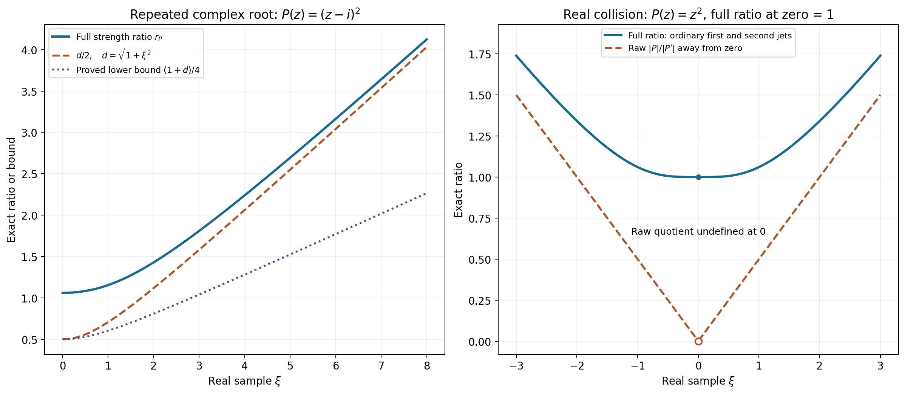
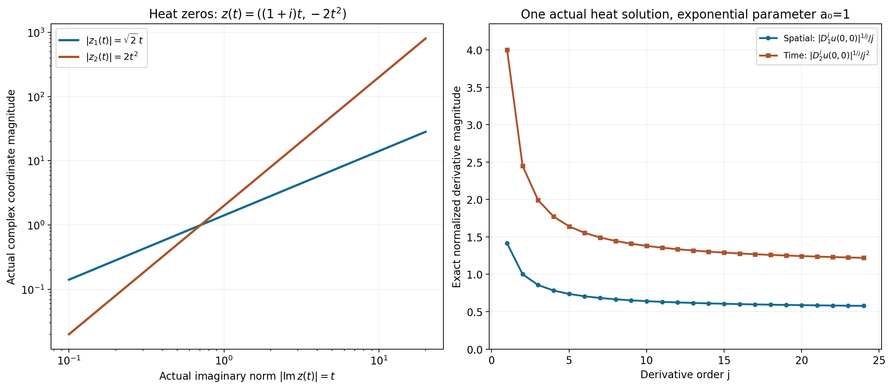

# Learning the real and complex regularity bridges

The two exercises compare exact conditions rather than merely related regularity theorems. The positive-order derivative strength keeps the real ratio finite even at a multiple zero. A nearest complex zero transfers a moderate weight ratio between real space and the characteristic set. The directional derivative estimate then comes from an actual convergent exponential integral and an exponential moment bound.

Read [EB1–EB4, the complete proof](../AN02-L154.html#complete-proof). Our convention is \(D=-i\partial\). The physical solution weights are \(k,k_1\); the tube theorem is applied with their appropriate reflected reciprocal test weights.

## Worked example 1. A repeated complex root and the full strength

Take \(P(z)=(z-i)^2\) and real \(\xi\). Its only distinct zero is \(i\), of multiplicity two, so \(d=\sqrt{1+\xi^2}\). Ordinary derivatives give
\[
|P(\xi)|^2=d^4,\quad |P'(\xi)|^2=4d^2,\quad
|P''(\xi)|^2=4,\qquad
A=d^2+2,\quad B=2\sqrt{d^2+1},\quad
r_P=\frac{d^2+2}{2\sqrt{d^2+1}}.
\tag{L154.1}
\]
The positive-order strength includes both derivatives. Since
\((d^2+2)^2-d^2(d^2+1)=3d^2+4>0\), we have \(r_P\ge d/2\). Also \(d\ge1\), so
\[
\tfrac14(1+d)\le r_P\le(1+d)^2 .
\tag{L154.2}
\]
For the upper bound, \(2\sqrt{d^2+1}\ge2\), hence
\(r_P\le(d^2+2)/2\le(1+d)^2\).
At \(\xi=0\), \(r_P=3/(2\sqrt2)\); at large \(|\xi|\) it is asymptotic to \(d/2\). The proof uses these quantities only up to permitted constants and power changes.

At a real double zero, take instead \(P(z)=z^2\). Then
\[
A(\xi)=\xi^2+2,\quad B(\xi)=2\sqrt{\xi^2+1},\quad
r_P(0)=1.
\tag{L154.3}
\]
The raw quotient \(|P|/|P'|=|\xi|/2\) for \(\xi\ne0\) is undefined at zero and tends to zero there. It cannot replace the always-positive full strength ratio.

**Figure EB-A.** The left curves are the exact complex-root ratio in L154.1 and its stated lower comparisons. The right curves give the exact real-root full ratio and the raw quotient away from zero; the open circle marks the raw quotient's missing value at the collision. These are real samples of the stated complex polynomials, with the exact Euclidean complex distance retained.

## Worked example 2. The equation controls one direction

Let \(P(z_1,z_2)=z_1\). It is not hypoelliptic: any distribution independent of \(x_1\) solves \(D_1u=0\), including nonsmooth ones. Its characteristic set is \(\{z_1=0\}\), and for real \(\xi\),
\[
d_P(\xi)=|\xi_1|,\qquad
A(\xi)=\sqrt{1+\xi_1^2},\quad B=1,\quad
r_P=\sqrt{1+\xi_1^2}.
\tag{L154.4}
\]
With \(k_1=1\), choose \(k(\xi)=1+\xi_1^2=r_P^2\). The real criterion holds exactly. On every complex zero, \(k(\operatorname{Re}z)=1\), so the complex criterion holds with exponent zero, even though the real ratio is unbounded in the first coordinate.

An isotropic choice \(k_{\mathrm{iso}}(\xi)=\sqrt{1+\xi_1^2+\xi_2^2}\) fails both criteria: on the real zeros \((0,T)\), the strength ratio is one but \(k_{\mathrm{iso}}=\sqrt{1+T^2}\to\infty\); the imaginary part of that complex zero is zero.

For a concrete physical solution, \(u(x_1,x_2)=\mathbf1_{\{x_2>0\}}\) is locally \(L^2\) and solves \(D_1u=0\). Each compact cutoff has all its \(x_1\)-derivatives in \(L^2\), so the weight \(1+\xi_1^2\) gives the expected local directional gain. Its \(x_2\)-derivative is a nonzero delta on \(x_2=0\), which is not locally \(L^2\); thus the isotropic first-order gain fails there. This separates the general weight bridge from a hypoellipticity assumption.

## Worked example 3. Complex heat zeros distinguish the derivative orders

For the heat polynomial and operator,
\[
P(z)=z_1^2+iz_2,\qquad
P(D)=\partial_{x_2}-\partial_{x_1}^2,\qquad
z=(a+ib,\,-2ab+i(a^2-b^2))\in\{P=0\}.
\tag{L154.5}
\]
Its imaginary part is \(\eta=(b,a^2-b^2)\). If \(\eta\) stays bounded, both \(b\) and \(a\) stay bounded, hence so does the real part \((a,-2ab)\). This verifies the complete zero-escape criterion for hypoellipticity proved in [L021](../AN02-L021.html#retreat-from-real-space-has-a-polynomial-rate).

The spatial coordinate obeys
\[
|z_1|^2=a^2+b^2\le|\eta_2|+2|\eta_1|^2
\le3(1+|\eta|)^2,\qquad
|z_2|=|z_1|^2\le3(1+|\eta|)^2 .
\tag{L154.6}
\]
Thus the spatial direction has permissible exponent one and the time direction exponent two.
Both are necessary: take \(a=b=t>0\). The exact zeros then satisfy
\[
z(t)=((1+i)t,-2t^2),\qquad
|\operatorname{Im}z(t)|=t,\quad
|z_1(t)|=\sqrt2\,t,\quad |z_2(t)|=2t^2.
\tag{L154.7}
\]
No lower power of \(1+t\) bounds the corresponding coordinate at all large \(t\).

The exponential moment in the proof also has an exact finite formula when \(\rho=1\) or \(2\), \(j\) is an integer, and \(\delta=1\). In two imaginary dimensions, with \(q=2\rho j\),
\[
\int_{\mathbb R^2}(1+|\eta|)^q e^{-2|\eta|}\,d\eta
=2\pi\sum_{l=0}^q
 \binom ql\frac{(l+1)!}{2^{l+2}}.
\tag{L154.8}
\]
Expand the integer power and use polar coordinates. The integral
\(\int_0^\infty r^{l+1}e^{-2r}dr=(l+1)!/2^{l+2}\) follows from scaling and repeated integration by parts. The full proof handles every permitted real \(\rho\), using the calculus supremum rather than requiring an integer expansion.

## Worked example 4. A heat solution attaining both growth orders

Fix \(a_0>0\), and on \(x_1>-a_0\), \(x_2\in\mathbb R\), put
\[
u(x_1,x_2)=\int_0^\infty
 \exp[-a_0s+(i-1)x_1s-2ix_2s^2]\,ds .
\tag{L154.9}
\]
Here \(ds\) is Lebesgue parameter measure on the displayed characteristic curve \(z(s)=((1+i)s,-2s^2)\). On every compact subset of this half-space, \(a_0+x_1\) has a positive lower bound. Every differentiated integrand is a polynomial in \(s\) times this fixed exponential decay, so dominated convergence gives a smooth solution. Each kernel satisfies
\(\partial_{x_2}e^{(i-1)x_1s-2ix_2s^2}=-2is^2e^{\cdots}
=\partial_{x_1}^2e^{\cdots}\).
Thus \(P(D)u=0\).

At the origin, the actual \(D\)-derivatives are
\[
D_1^ju(0,0)=
(1+i)^j\frac{j!}{a_0^{j+1}},\qquad
D_2^ju(0,0)=
(-2)^j\frac{(2j)!}{a_0^{2j+1}} .
\tag{L154.10}
\]
For example \(D_2u(0,0)=-4/a_0^3\); dropping the convention \(D=-i\partial\) would give an incorrect phase. The moments follow from
\(\int_0^\infty s^Ne^{-a_0s}ds=N!/a_0^{N+1}\).

The absolute spatial derivatives have growth \(C^j j^j\), and the absolute time derivatives have growth \(C^j j^{2j}\). Their elementary upper and lower factorial bounds, proved in Solution 10, show that neither power can be reduced for this solution. This makes the geometric distinction in Example 3 visible in one actual smooth solution.

**Figure EB-B.** The left panel plots the exact coordinate magnitudes along the four-real-dimensional complex curve L154.7 against its actual imaginary norm. The right panel uses the exact derivatives L154.10 with \(a_0=1\), taking their \(j\)-th roots and dividing by \(j\) or \(j^2\). Complete curve coordinates, phases, factorial constants and measures are retained in the argument and geometry JSON. The all-order growth and sharpness follow from EB15–EB16 and Solution 10.

## Exercises with complete solutions

**Exercise 1.** At the real double zero of \(P(z)=z^2\), compute \(A,B,r_P\), and explain which denominator prevents a singularity.

**Solution 1.** At zero, \(P=P'=0\), while \(P''=2\). Thus \(A=B=2\) and \(r_P=1\). Away from zero the squares are \(\xi^4+4\xi^2+4\) and \(4\xi^2+4\), giving L154.3. The positive-order strength includes the top derivative; using only the first derivative would give the indeterminate quotient \(0/0\). The formal proof keeps every ordinary derivative up to the degree.

**Exercise 2.** For \(P=z_1\), can \(k/k_1=(1+\xi_2^2)^s\), \(s>0\), satisfy the characteristic condition?

**Solution 2.** At the zero \(z=(0,T)\), \(T\in\mathbb R\), the imaginary norm is zero and the ratio is \((1+T^2)^s\). This is unbounded, whereas the right side of the characteristic condition is one fixed constant. It fails. Equivalently at these real frequencies \(r_P=1\), so no power of \(r_P\) pays for the increasing second-coordinate weight. This detects the unconstrained direction.

**Exercise 3.** Extract the mixed coefficient of \(T_2(\omega)=\omega_1^2+3\omega_1\omega_2+2\omega_2^2\) from the complex unit torus.

**Solution 3.** Put \(\omega_j=2^{-1/2}e^{i\theta_j}\). Its terms are
\(\frac12e^{2i\theta_1}\), \(\frac32e^{i(\theta_1+\theta_2)}\), and \(e^{2i\theta_2}\).
Multiply by \(e^{-i(\theta_1+\theta_2)}\) and average over both angles; only the middle term remains, yielding \(3/2\). For the corresponding Taylor polynomial, recovery of \(\partial_1\partial_2P\) multiplies this by \(\alpha!n^{|\alpha|/2}=1\cdot2\), giving the correct derivative \(3\). This is the coefficient extraction in EB5, rather than an assertion that a real-direction estimate alone recovers all complex coefficients.

**Exercise 4.** Track the exponent changes in the weight-condition equivalence.

**Solution 4.** A real strength bound \(a(\xi)\le Cr_P^N\) and the upper half of EB2 give \(a(\xi)\le C'(1+d)^ {mN}\). At a complex zero, \(d(\operatorname{Re}z)\le|\operatorname{Im}z|\), so the characteristic exponent can be \(mN\). Conversely a characteristic exponent \(N'\), together with a shift exponent \(M_a\) for \(a=k/k_1\), gives EB8 with distance power \(M_a+N'\). The lower half of EB2 bounds this by \(C''r_P^{M_a+N'}\). The conditions ask for some finite powers; they do not require those two powers to be equal.

**Exercise 5.** Explain the zero direction and constant-polynomial endpoints in the derivative estimate.

**Solution 5.** If \(\gamma=0\), every positive iterate of \(\gamma\cdot D\) is zero, independently of \(\rho\). If \(P=c\ne0\), the homogeneous equation says \(cu=0\), so the solution itself is zero. These conclusions do not use a distance to an empty zero set. The strength-ratio comparison is explicitly restricted to nonconstant \(P\), for which its denominator is positive.

**Exercise 6.** Verify the reflected physical weight for the test choice in EB12, and why the smooth solution belongs to it.

**Solution 6.** For \(\kappa(\xi)=\langle\xi\rangle^{-(n+1)}\), reflection leaves it unchanged because it is even, so \(1/\check\kappa=\langle\xi\rangle^{n+1}\). A compact smooth cutoff of the smooth solution has a Fourier transform decreasing faster than every real-frequency power, by real integration by parts. Its squared product with \(\langle\xi\rangle^{n+1}\) is integrable, giving the required local physical membership. The tube theorem is therefore applied legitimately. Evenness of this particular weight does not remove the reflection from the general theorem.

**Exercise 7.** Check the exponential support gap in EB14 for \(K'=[-r,r]\), \(L=[-r-\delta,r+\delta]\).

**Solution 7.** \(H_L(-\eta)=(r+\delta)|\eta|\), and for \(|x|\le r\),
\[
-2H_L(-\eta)-2x\eta
\le-2(r+\delta)|\eta|+2r|\eta|
=-2\delta|\eta|.
\tag{L154.11}
\]
The transformed density is weighted by \(\Phi(-z)\), and the physical exponential has modulus \(e^{-x\eta}\). Both signs combine to give this decay uniformly throughout the smaller compact. It is what keeps every imaginary moment finite.

**Exercise 8.** Locate the maximum of \((1+r)^q e^{-\delta r}\), \(r\ge0\), and recover the order \(j^{\rho j}\).

**Solution 8.** Its logarithmic derivative is \(q/(1+r)-\delta\). If \(q\le\delta\), the maximum is one at zero. If \(q>\delta\), its value at \(r=q/\delta-1\) is
\[
\sup_{r\ge0}(1+r)^q e^{-\delta r}
= (q/\delta)^q e^{-q+\delta}.
\tag{L154.12}
\]
Take \(q=2\rho j\), and leave one factor \(e^{-\delta r}\) for integration. The square root of the resulting bound costs a fixed exponential in \(j\), times \(j^{\rho j}\). The remaining integral in dimension \(n\) is independent of \(j\). This proves the bound without an integer restriction on \(\rho\).

**Exercise 9.** Compute the signs in the actual heat-mode derivatives L154.10.

**Solution 9.** In the spatial coordinate, applying \(D_1=-i\partial_{x_1}\) multiplies the kernel by \(-i(i-1)s=(1+i)s\). In the time coordinate it multiplies by \((-i)(-2i)s^2=-2s^2\). Iteration gives \((1+i)^js^j\) and \((-2)^js^{2j}\). The real positive exponential moment at the origin yields the exact factorials. In particular the time derivative with respect to \(\partial_{x_2}\) has factor \((-2i)^j\), while the \(D_2\)-derivative has factor \((-2)^j\).

**Exercise 10.** Prove that the two attained growth powers in Example 4 cannot be reduced.

**Solution 10.** For integer \(N\ge1\), each factor in \(N!\) is at most \(N\), giving \(N!\le N^N\). Since \(\log x\) is increasing,
\[
\log(N!)=\sum_{k=2}^N\log k
\ge\int_1^N\log x\,dx=N\log N-N+1,
\quad N!\ge e(N/e)^N .
\tag{L154.13}
\]
Use \(N=j\) in the spatial expression and \(N=2j\) in the time expression in L154.10. They lie between positive fixed-exponential multiples of \(j^j\) and \(j^{2j}\), respectively. If a smaller power \(\rho'<1\) bounded all spatial orders, taking \(j\)-th roots would force \(j^{1-\rho'}\) bounded. For time, any \(\rho'<2\) would force \(j^{2-\rho'}\) bounded. Both are impossible. The origin is an interior point of the solution domain, so these are actual failures of a putative smaller local derivative exponent.

The calculations check the actual jet strengths and root distances, complex torus coefficients, heat characteristic coordinates, all relevant operator signs and independently integrated moments. The two arbitrary-distribution representation exercises, chapter notes and other assigned course targets remain active.

## Complete proof

*Original proof exposition by GPT-6.1 Sol (OpenAI), Ultra, October 2026. CC0 1.0.*

We solve the two separate exercise targets on printed page 291 of Hörmander's Chapter 15. The first identifies the exact real polynomial-strength criterion with the complex characteristic growth criterion. The second derives the high directional derivative bound from the tube representation. The arbitrary-distribution representation exercises on printed page 300 remain separate active targets.

Use \(D=-i\partial\) and the bilinear Fourier convention of [L150](../AN02-L150.html#nv1-the-exact-representation-theorem). Physical regularity weights here are denoted \(k,k_1\); the reflected reciprocal required when applying the representation theorem is supplied explicitly below. The actual general weighted theorem being compared is [L022 Theorem1.1](../AN02-L022.html#the-weight-that-pays-for-a-commutator), and the hypoellipticity criterion used in the heat example is [L021 Theorems2.1–3.1](../AN02-L021.html#retreat-from-real-space-has-a-polynomial-rate). Finite complex root factorization and coefficient extraction also use the complete [L045 Cauchy/root-count proofs](../AN02-L045.html#cauchy-estimates-and-parameter-contours).

## EB1. Full polynomial strength versus distance to complex zeros

Let \(P\) be a nonconstant complex polynomial of degree \(m\ge1\) on \(\mathbb C^n\). For real \(\xi\), define
\[
A(\xi)=\left(\sum_\alpha|\partial^\alpha P(\xi)|^2\right)^{1/2},
\quad B(\xi)=\left(\sum_{|\alpha|>0}|\partial^\alpha P(\xi)|^2\right)^{1/2},
\quad r_P(\xi)=A(\xi)/B(\xi),
\quad d_P(\xi)=\operatorname{dist}(\xi,\{P=0\}).
\tag{EB1}
\]
All derivatives are ordinary derivatives, without factorial normalization. A top-order derivative is a nonzero constant, so \(B>0\), \(A>0\), and \(r_P\ge1\). The nonempty zero set is closed; a nearest zero exists by compactness of a closed bounded distance-minimizing sequence.

We prove constants depending only on \(n,m\) such that
\[
c_{n,m}(1+d_P(\xi))\le r_P(\xi)
\le C_{n,m}(1+d_P(\xi))^m.
\tag{EB2}
\]
For the upper bound choose a nearest zero \(z\), \(|z-\xi|=d\), and Taylor-expand:
\[
|P(\xi)|
\le\sum_{1\le|\alpha|\le m}
       \frac{|\partial^\alpha P(\xi)|}{\alpha!}|z-\xi|^{|\alpha|}
\le C_{n,m}B(\xi)(1+d)^m.
\tag{EB3}
\]
Since \(A^2=|P|^2+B^2\), EB3 proves the upper bound.

For the lower bound, first let \(d\ge1\). Then \(P(\xi)\ne0\). For every complex unit vector \(\omega\), the one-variable polynomial \(q_\omega(t)=P(\xi+t\omega)\) has no zero in \(|t|<d\). Factor its at most \(m\) roots:
\[
q_\omega(t)=P(\xi)\prod_{\nu=1}^{l}(1-t/a_\nu),
\quad |a_\nu|\ge d,\quad
\left|[t^a]q_\omega(t)\right|
\le\binom ma d^{-a}|P(\xi)|.
\tag{EB4}
\]
A constant polynomial has \(l=0\), satisfying the same inequalities. The homogeneous Taylor coefficient
\(T_a(\omega)=\sum_{|\alpha|=a}\partial^\alpha P(\xi)\omega^\alpha/\alpha!\)
is therefore bounded on the complex unit sphere by the last expression. Evaluate it on
\(\omega_j=n^{-1/2}e^{i\theta_j}\), which has unit norm. Multiplication by \(e^{-i\alpha\cdot\theta}\) and integration over the \(n\)-torus extracts its coefficient; orthogonality of the integer exponentials gives
\[
|\partial^\alpha P(\xi)|
\le \alpha!n^{|\alpha|/2}\binom m{|\alpha|}
           d^{-|\alpha|}|P(\xi)|.
\tag{EB5}
\]
There are finitely many derivatives, so for \(d\ge1\),
\(B\le C_{n,m}|P(\xi)|/d\). Thus \(r_P\ge |P|/B\ge c_{n,m}d\).
For \(d<1\), \(r_P\ge1\) gives the remaining part of EB2 after decreasing the constant. This proves the full two-sided polynomial comparison, without hypoellipticity.

## EB2. The exact first exercise equivalence

A positive shift weight satisfies \(k(\xi+h)\le(1+C|h|)^N k(\xi)\). Reflection and reciprocal preserve this property by applying it in reverse, and products preserve it by multiplying the inequalities. Thus \(a=k/k_1\) is also a shift weight.

We prove equivalence of the following two conditions, with possibly different constants and nonnegative powers:
\[
\begin{aligned}
k(\xi)&\le C k_1(\xi)r_P(\xi)^N &&(\xi\in\mathbb R^n),\\
k(\operatorname{Re}z)&\le C'k_1(\operatorname{Re}z)
              (1+|\operatorname{Im}z|)^{N'} &&(P(z)=0).
\end{aligned}
\tag{EB6}
\]
The first is exactly source formula 11.1.7, and the second exactly formula 15.3.8.

First EB2 shows that the first line is equivalent, up to changing the exponent, to
\[
a(\xi)\le C(1+d_P(\xi))^L.
\tag{EB7}
\]
For a zero \(z=\xi+i\eta\), \(d_P(\xi)\le|\eta|\), so EB7 immediately gives the second line of EB6.
Conversely suppose that line holds. For any real \(\xi\), choose a nearest zero \(z\). Shift moderation of \(a\) gives
\[
a(\xi)\le (1+C_a|\xi-\operatorname{Re}z|)^{M_a}
                   a(\operatorname{Re}z)
\le C(1+d_P(\xi))^{M_a+N'}.
\tag{EB8}
\]
Here both the real displacement and the imaginary part of \(z\) are at most its distance from \(\xi\). EB2 then bounds this by a power of \(r_P\), proving the first line. All constants are uniform in \(\xi\); exponent changes are allowed by the two source conditions.

For homogeneous solutions the additional datum condition 11.1.8 creates no extra restriction. Choose \(k_2=k/A\); then \(f=0\) belongs to its local weighted space and
\(k\le k_1+A k_2\). The weight \(A\) is itself a shift weight: finite Taylor expansion of each derivative bounds its strength at \(\xi+h\) by \(C_m(1+|h|)^mA(\xi)\). To remove the harmless prefactor near \(h=0\), the vector of all jets has derivative norm at most a fixed multiple of its own norm, giving a bounded gradient of \(\log A\); combine this local Lipschitz estimate with the polynomial estimate at \(|h|\ge1\) to obtain a bound of the required form \((1+C|h|)^{N_A}\). The reciprocal and product rules therefore make \(k/A\) a shift weight too.

Consequently the homogeneous \(p=2\) regularity conclusion of Theorem11.1.7, \(u\in B_{2,k_1}^{\mathrm{loc}}\), \(P(D)u=0\Rightarrow u\in B_{2,k}^{\mathrm{loc}}\), has exactly the same admissible weight criterion as [L150 NV10, Corollary15.3.2](../AN02-L150.html#nv10-transfer-of-weights-on-the-characteristic-set). This solves the first exercise with the positive-order derivative strength retained. A nonzero constant polynomial has no homogeneous solutions except zero, and its \(B\) is zero; the ratio comparison is stated only for nonconstant \(P\). For \(P=0\), the complex condition reduces to a bounded weight ratio on the real plane; the indeterminate strength ratio is not used.

## EB3. The directional geometric bridge needed for the second exercise

Let \(P\) be nonconstant and hypoelliptic, \(\gamma\in\mathbb R^n\), and suppose
\[
|\gamma\cdot\xi|\le C(1+d_P(\xi))^\rho
\quad(\xi\in\mathbb R^n).
\tag{EB9}
\]
If \(\gamma=0\), every positive directional derivative is zero. Otherwise \(\rho\ge1\): choose one zero \(z_0\) and put \(\xi=t\gamma\). Then \(d_P(t\gamma)\le|t\gamma-z_0|\le t|\gamma|+|z_0|\), while the left side is \(t|\gamma|^2\), excluding every \(\rho<1\).

At a zero \(z=\xi+i\eta\), \(d_P(\xi)\le|\eta|\), so
\[
|\gamma\cdot z|
\le|\gamma\cdot\xi|+|\gamma||\eta|
\le C_1(1+|\eta|)^\rho.
\tag{EB10}
\]
Conversely EB10 and a nearest zero give EB9, by the triangle inequality and \(\rho\ge1\). This is the precise prescribed-exponent bridge of Theorem11.4.8, whose full higher-dimensional strip-growth proof is [L030 Theorem1.1](../AN02-L030.html#strip-maxima-and-their-optimal-powers). The elementary bridge just given also works in dimension one for \(\rho\ge1\).

The same inequality holds on the unit tube \(\mathcal N_P(1)\). Choose a zero \(\theta\) within distance one of any tube point \(z\); its imaginary part is at most \(1+|\operatorname{Im}z|\), and \(|\gamma\cdot(z-\theta)|\le|\gamma|\). Thus
\[
|\gamma\cdot z|\le C_2(1+|\operatorname{Im}z|)^\rho
\quad(z\in\mathcal N_P(1)).
\tag{EB11}
\]

## EB4. Full high-derivative estimate from the tube integral

Let \(P(D)u=0\) in a neighborhood of a compact \(K\). Hypoellipticity makes \(u\) smooth there, since its datum is the smooth zero function. On a convex ball compact in that neighborhood, choose the test weight
\[
\kappa(\xi)=\langle\xi\rangle^{-s},\quad
\langle\xi\rangle=(1+|\xi|^2)^{1/2},\quad s=n+1.
\tag{EB12}
\]
Its reflected reciprocal is \(\langle\xi\rangle^s\); compact cutoffs of a smooth \(u\) have rapidly decreasing Fourier transforms and therefore belong to this local physical space. The shift inequality for \(\kappa\) follows from
\(\langle\xi\rangle\le\langle\xi+h\rangle+|h|\le(1+|h|)\langle\xi+h\rangle\).

Apply the complete tube theorem [L150 NV1–NV8](../AN02-L150.html#nv1-the-exact-representation-theorem), with radius one. It gives a measurable \(U\) and four-condition \(\Phi\) for which
\[
u(x)=\int_{\mathcal N_P(1)}U(z)e^{ix\cdot z}\,dV(z)
\quad\hbox{weakly},\qquad
A_U^2:=\int_{\mathcal N_P(1)}|U(z)|^2e^{2\Phi(-z)}dV(z)<\infty.
\tag{EB13}
\]
Take a smaller compact convex \(K'\) in this ball and \(L=K'+\delta\overline B\) still compact inside it, \(\delta>0\). The actual compact growth of \(\Phi\) gives
\[
e^{-2\Phi(-\xi-i\eta)}|e^{ix\cdot(\xi+i\eta)}|^2
\le C_L\langle\xi\rangle^{-2s}e^{-2\delta|\eta|}
\quad(x\in K').
\tag{EB14}
\]
Indeed \(H_L(-\eta)\ge-x\cdot\eta+\delta|\eta|\); the Fourier reflection and the sign of the exponential are both needed for this inequality.

Cauchy–Schwarz, EB11 and EB14 imply
\[
\sup_{x\in K'}\left|
\int_{\mathcal N_P(1)}U(z)(\gamma\cdot z)^j e^{ix\cdot z}dV(z)\right|
\le C A_U C_2^j
\left(\int_{\mathbb R^n}\langle\xi\rangle^{-2s}d\xi
\int_{\mathbb R^n}(1+|\eta|)^{2\rho j}e^{-2\delta|\eta|}d\eta
\right)^{1/2}.
\tag{EB15}
\]
The real-frequency integral is finite because \(2s>n\). Its decay was supplied by the chosen test weight, so no unproved volume bound on the tube is needed.

For \(q=2\rho j\), calculus bounds
\(\sup_{r\ge0}(1+r)^q e^{-\delta r}\le C_\delta^q(1+q)^q\).
One verifies this by differentiating \(q\log(1+r)-\delta r\); its maximum is at \(r=q/\delta-1\) when this is nonnegative, and at zero otherwise. Keep a remaining factor \(e^{-\delta|\eta|}\), whose integral is finite, to obtain from EB15
\[
\sup_{x\in K'}|( \gamma\cdot D)^j u(x)|
\le C_3^{\,j}j^{\rho j},\qquad j\ge1.
\tag{EB16}
\]
The fixed prefactors, \(A_U\), \(2\rho\) and the remaining exponential integral are absorbed in \(C_3^j\); \(C_3\) is independent of \(j\).

Here is the justification for using the integral pointwise and differentiating it. EB15 at \(j=0\) gives absolute convergence uniformly on each smaller compact, so the weak integral represents a continuous function equal to the given smooth solution. For every finite positive \(j\), the same bound, applied on a slightly larger compact inside the ball, dominates the differentiated kernels along real \(\gamma\)-segments. Dominated convergence differentiates them and yields the directional derivative integral. Thus every estimate in EB16 is an estimate of the actual solution derivatives, rather than of formal kernels.

Cover the original \(K\) by finitely many such smaller convex neighborhoods. Take the largest of their constants, enlarged if necessary to absorb each fixed prefactor for \(j\ge1\). This proves EB16 uniformly on all of \(K\), for an arbitrary open solution neighborhood. It is exactly Theorem11.4.1 derived from15.3.1 and the11.4.8 geometric bridge, solving the second page291 exercise. The zero direction and the nonzero constant-polynomial zero-solution case are immediate endpoints.

## Remaining exercise scope

The two page300 exercises require an actual weak integral for every distribution, and an actual surface representation for every distributional homogeneous solution. Their test orders may vary over a compact exhaustion. They are not consequences of choosing one fixed global moderate weight class. Those full targets, their learner materials, all chapter notes and the rest of the assigned course remain active.

The classical human source is Lars Hörmander, *The Analysis of Linear Partial Differential Operators II*, two unnumbered exercises on printed p.291, with exact cross-references Theorems11.1.7,11.4.1,11.4.8 on printed pp.65,85,90. Approved current-edition source statement pixels were read before comparison; the source's older native-page offsets are not used for this edition. This is original proof exposition and includes no protected book body or page image.
