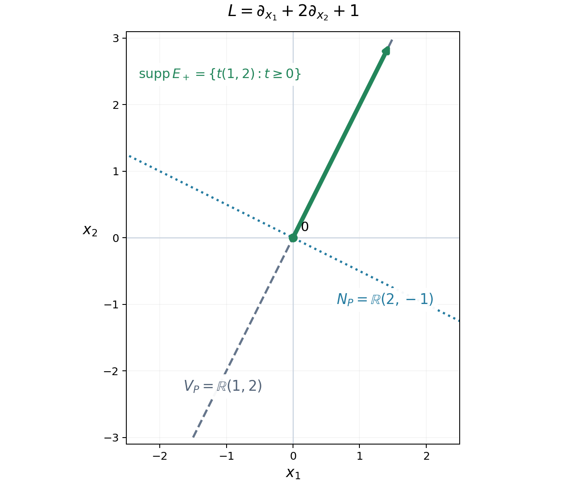

# Fundamental solutions and the directions an equation uses

A constant-coefficient equation can act on fewer directions than the surrounding space has. A transport equation differentiates along one line. A planar equation placed in three-dimensional space still acts only in its plane. This lesson identifies that active space directly from the polynomial and proves that it is the smallest linear space that can carry a fundamental solution.

The prerequisites are distributional differentiation, convolution with a compactly supported distribution, tensor products of distributions, and elementary linear algebra. Two further distribution results are needed below: existence of a fundamental solution for every nonzero constant-coefficient operator, and the local expansion of a distribution supported on a hyperplane in normal derivatives of delta. Their exact statements are recalled where they are used. Basic references include Melrose's open *Differential Analysis* notes [Melrose] and the original existence theorem of Malgrange [Malgrange]. Grubb's freely readable lecture chapter §5 [Grubb] supplies tempered-distribution background and the cutoff pairing of compactly supported distributions with exponentials used in Exercise 3. The existence and local hyperplane-structure results retain the precise inputs recalled below.

## From a point source to an inhomogeneous equation

Our convention is
\[
D_j=-i\partial_{x_j},\qquad
P(D)=\sum_{|\alpha|\leq m}c_\alpha D^\alpha.
\]
Distributions are complex-linear on test functions. Thus the transpose in their pairing is \(P(-D)\), with no conjugation of the coefficients. A fundamental solution is a distribution \(E\) on \(\mathbb R^n\) satisfying \(P(D)E=\delta_0\).

**Proposition 1.1.** If \(E\) is a fundamental solution and \(f\) is a compactly supported distribution, then \(E*f\) is defined and
\[
P(D)(E*f)=f.
\]
If \(f\) is a compactly supported smooth function, \(E*f\) is smooth. Any two fundamental solutions differ by a distributional solution of the homogeneous equation.

**Proof.** Convolution is defined because one factor has compact support. Differentiation of the test-function pairing defining convolution gives
\(P(D)(E*f)=(P(D)E)*f=\delta_0*f=f\).
For smooth \(f\), the convolution is locally the pairing of \(E\) with \(y\mapsto f(x-y)\). For \(x\) in a fixed compact set these functions have support in one compact set. Their derivatives in \(x\) exist in the test-function topology. Continuity of \(E\) permits differentiating the pairing any number of times. The last assertion follows by subtracting the two equations. \(\square\)

Compactness in this proposition is a condition for convolution, not a restriction on all possible right-hand sides. Solving an equation with unrestricted data on an open set requires an additional global argument.

## Reading the active space from the polynomial

Define the inactive space and its orthogonal complement by
\[
N_P=\{v\in\mathbb R^n: v\cdot\nabla_\xi P(\xi)=0
\text{ for all }\xi\in\mathbb R^n\},\qquad
V_P=N_P^\perp.
\]
These are real linear spaces even when \(P\) has complex coefficients. Here \(\nabla_\xi\) differentiates the polynomial, not a solution of the equation.

**Lemma 2.1.** A vector \(v\) belongs to \(N_P\) precisely when
\[
P(\xi+tv)=P(\xi)\qquad(\xi\in\mathbb R^n,\ t\in\mathbb R).
\]
The space \(V_P\) is the real span of the real and imaginary parts of all coefficient vectors of the vector-valued polynomial \(\nabla P\).

**Proof.** Differentiate the displayed identity in \(t\) to get necessity. Conversely, the derivative of \(t\mapsto P(\xi+tv)\) vanishes everywhere when \(v\in N_P\), so the function is constant. If \(\nabla P(\xi)=\sum_\beta a_\beta\xi^\beta\) with \(a_\beta\in\mathbb C^n\), the identity \(v\cdot\nabla P=0\) says exactly that \(v\) is perpendicular to every \(\operatorname{Re}a_\beta\) and \(\operatorname{Im}a_\beta\). Taking orthogonal complements proves the span description. \(\square\)

This gives a finite calculation of the active space. It also shows why a complex gradient must not be treated as a single real direction.

**Example 2.2.** For
\[
P(\xi_1,\xi_2,\xi_3)=(\xi_1+2\xi_2)^2+3(\xi_1+2\xi_2)+2,
\]
the active space is the line spanned by \((1,2,0)\). In contrast, for \(P(\xi_1,\xi_2)=\xi_1+i\xi_2\), the active space is all of \(\mathbb R^2\): a real vector \((a,b)\) is inactive only if \(a+ib=0\), hence only if \(a=b=0\).

## The smallest linear support

We use the following existence result, due to Malgrange and Ehrenpreis: for every nonzero polynomial \(q\) with complex coefficients in \(r\) variables, there is \(G\in\mathcal D'(\mathbb R^r)\) with \(q(D)G=\delta_0\). For \(r=0\) this means division by a nonzero constant. The theorem asserts existence without prescribing support or a normalization among different solutions.

**Theorem 3.1.** Let \(P\ne0\). There exists a fundamental solution supported in \(V_P\). If a fundamental solution is supported in any real linear subspace \(W\), then \(V_P\subset W\).

**Proof of existence.** Choose orthonormal coordinates \(x=(y,z)\) in which \(V_P\) is the \(y\)-space and \(N_P\) is the \(z\)-space. By Lemma 2.1 the transformed polynomial is a polynomial \(q\) in the \(y\)-covariables alone. Choose a fundamental solution \(G\) of \(q(D_y)\). Then
\[
E=G\otimes\delta_0(z)
\]
satisfies \(P(D)E=\delta_0(y)\otimes\delta_0(z)=\delta_0(x)\) and has support in \(V_P\). Orthonormal coordinates introduce no volume factor. \(\square\)

For the converse, we use the hyperplane structure theorem for distributions in this precise local form: if a distribution is supported on \(t=0\), then near any point of that hyperplane it can be written
\[
E=\sum_{j=0}^r E_j(y)\otimes D_t^j\delta_0(t)
\]
for a finite \(r\), with distributional coefficients \(E_j\) in the tangential variables. The coefficients are unique. Finiteness is local; the distribution need not have a globally bounded order.

**Proof of minimality.** Fix a nonzero normal to \(W\) and choose orthonormal coordinates with that normal in the \(t\)-direction. Since \(W\subset\{t=0\}\), write locally near the origin
\[
P(D)=\sum_{k=0}^d a_k(D_y)D_t^k,
\qquad a_d\ne0,
\qquad E=\sum_{j=0}^r E_j\otimes D_t^j\delta_0.
\]
All the tangential operators commute. Suppose \(d>0\). Equality of the normal coefficients in \(P(D)E=\delta_0\) gives
\[
\sum_{k+j=\ell}a_k(D_y)E_j=0\quad(\ell>0),\qquad
a_0(D_y)E_0=\delta_0(y).
\]
The coefficient of normal order \(d+r\) says \(a_dE_r=0\). Descending through orders \(d+r-1,\ldots,d\) gives
\[
a_d^{\,r-j+1}E_j=0\qquad(j=r,r-1,\ldots,0).
\]
Here is the induction explicitly. At order \(d+j\), the term involving \(E_j\) is \(a_dE_j\); every other term involves \(E_l\) with \(l>j\). Multiplication by \(a_d^{r-j}\) kills those terms by the previously proved identities. It leaves \(a_d^{r-j+1}E_j=0\).

Consequently \(a_d^{r+1}\delta_0=a_0a_d^{r+1}E_0=0\). A nonzero constant-coefficient differential operator cannot annihilate delta, even locally near the origin: its action is a nonzero finite combination of delta derivatives, and a test function with a prescribed finite Taylor polynomial separates those derivatives. Since the polynomial \(a_d^{r+1}\) is nonzero, we have a contradiction. Thus \(d=0\). The polynomial is independent of this normal covariable. Every normal to \(W\) therefore lies in \(N_P\), which says \(V_P\subset W\). \(\square\)

The theorem concerns linear subspaces. It does not say that every fundamental solution has support inside \(V_P\), or that there is a smallest closed support among all fundamental solutions. Adding a homogeneous solution can enlarge support.

## A polynomial measure of strength

The size of \(P(\xi)\) alone misses derivatives of the polynomial that govern local estimates. Set
\[
S_P(\xi)=\left(\sum_{|\alpha|\leq m}
|\partial_\xi^\alpha P(\xi)|^2\right)^{1/2}.
\]
For \(P\ne0\), this is everywhere positive: one derivative of highest nonzero degree is a nonzero constant. It is invariant under translations by \(N_P\).

**Theorem 4.1.** For every nonzero polynomial \(P\),
\[
\operatorname{dist}(\xi,N_P)\longrightarrow\infty
\quad\Longrightarrow\quad S_P(\xi)\longrightarrow\infty.
\]
Equivalently, for every finite \(M\), the set \(\{\xi:S_P(\xi)\leq M\}\) has bounded image in \(\mathbb R^n/N_P\).

**Proof.** We prove the bounded-image assertion by induction on the degree. For a constant polynomial, \(N_P=\mathbb R^n\), so there is nothing to prove. Write a polynomial of degree \(m\geq1\) as \(P=p+R\), with \(p\) its homogeneous part of degree \(m\) and \(\deg R<m\).

For \(|\alpha|=m-1\), the polynomial \(\partial^\alpha p\) is linear. Consider the real linear map
\[
L_p:\mathbb R^n\longrightarrow\mathbb C^{\{\alpha:|\alpha|=m-1\}},
\qquad v\longmapsto(\partial^\alpha p(v))_\alpha.
\]
Its kernel is \(N_p\). Indeed, the coefficients of the homogeneous polynomial \(v\cdot\nabla p\) are, up to nonzero factorials, precisely these linear expressions in \(v\). Thus they all vanish exactly when \(v\cdot\nabla p=0\).

On \(N_p^\perp\), the map \(L_p\) is injective. The continuous function \(|L_pv|\) has a positive minimum on the unit sphere there, so \(\operatorname{dist}(v,N_p)\leq C|L_pv|\). If \(S_P\) is bounded on a set \(A\), then \(L_p\) is bounded on \(A\): the order \(m-1\) derivatives of \(R\) are constants. Hence \(A\) is bounded modulo \(N_p\).

Every derivative of \(p\) is invariant under \(N_p\). It therefore depends only on the bounded orthogonal projections of points of \(A\) to \(N_p^\perp\). All its values on \(A\) are bounded. Subtracting the derivatives of \(p\) from those of \(P\) shows that \(S_R\) is bounded on \(A\). If \(R\ne0\), induction makes \(A\) bounded modulo \(N_R\); if \(R=0\), take \(N_R=\mathbb R^n\).

The intersection \(N_p\cap N_R\) is \(N_P\), because \(v\cdot\nabla p\) and \(v\cdot\nabla R\) have different degrees and cannot cancel. Finally, for two linear subspaces \(N_1,N_2\), the map
\[
(N_1\cap N_2)^\perp\longrightarrow N_1^\perp\oplus N_2^\perp,
\qquad v\longmapsto(\pi_{N_1^\perp}v,\pi_{N_2^\perp}v)
\]
is injective. Its lower bound on the unit sphere proves that bounded distance to both subspaces implies bounded distance to their intersection. This completes the induction. \(\square\)

**Example 4.2.** For \(P(\xi_1,\xi_2)=\xi_1\xi_2\), the value of \(P\) vanishes on both coordinate axes. Nevertheless,
\[
S_P(\xi)^2=\xi_1^2\xi_2^2+\xi_1^2+\xi_2^2+1.
\]
It tends to infinity in every direction because \(N_P=\{0\}\). This is why \(S_P\), rather than \(|P|\), is the useful size in local existence estimates.

## Worked transport model

Let \(v\ne0\) be a real vector, \(c\in\mathbb C\), and \(L=v\cdot\nabla_x+c\). Define
\[
\langle E_+,\varphi\rangle
=\int_0^\infty e^{-ct}\varphi(tv)\,dt.
\]
This integral is finite for each compactly supported test function, independently of the sign of \(\operatorname{Re}c\). On any fixed compact set its interval of integration is bounded, so it defines a distribution. Integration by parts gives
\[
\begin{aligned}
\langle LE_+,\varphi\rangle
&=\int_0^\infty e^{-ct}
\bigl(-v\cdot\nabla\varphi(tv)+c\varphi(tv)\bigr)\,dt\\
&=-\int_0^\infty\frac{d}{dt}
\bigl(e^{-ct}\varphi(tv)\bigr)\,dt=\varphi(0).
\end{aligned}
\]
Thus \(E_+\) is a fundamental solution with support in the forward ray. Its smallest possible linear support is the line \(\mathbb Rv\), as Theorem 3.1 predicts. For a compactly supported smooth \(f\), its solution is
\[
u(x)=\int_0^\infty e^{-ct}f(x-tv)\,dt.
\]
For \(x\) in a compact set the integration interval can again be bounded uniformly, so differentiation under the integral is justified.

For \(L=\partial_{x_1}+2\partial_{x_2}+1\), the green ray is the support of \(E_+\). The dashed active line is the smallest possible linear support, by Theorem 3.1. The dotted line is the inactive frequency direction. The arrow represents continuation to infinity. The coordinates identify vectors and covectors by the Euclidean inner product. The diagram illustrates the explicit transport calculation above.

## Exercises with solutions

**Exercise 1 (entry).** Find the active space of
\(P(\xi)=(\xi_1-\xi_3)^3+2\xi_2\), and of \(Q(\xi)=5\).

**Solution.** The gradient of \(P\) is
\((3(\xi_1-\xi_3)^2,2,-3(\xi_1-\xi_3)^2)\). Its coefficient vectors span \((1,0,-1)\) and \((0,1,0)\). Thus \(V_P\) is the plane perpendicular to \((1,0,1)\). The gradient of \(Q\) vanishes, so \(V_Q=\{0\}\), and \(\delta_0/5\) is a fundamental solution supported there.

**Exercise 2 (intermediate).** Define a fundamental solution of \(v\cdot\nabla+c\) supported on the backward ray. Determine the difference from \(E_+\).

**Solution.** Set
\(\langle E_-,\varphi\rangle=-\int_{-\infty}^0e^{-ct}\varphi(tv)\,dt\).
The same integration by parts gives \(LE_-=\delta_0\). Consequently
\(\langle E_+-E_-,\varphi\rangle=\int_{\mathbb R}e^{-ct}\varphi(tv)\,dt\).
The pairing is defined because the test function is compactly supported on the line. Its image under \(L\) is zero: the integrated total derivative has zero contribution at both ends. This is a homogeneous solution with support on the entire line.

**Exercise 3 (intermediate).** Prove that a nonconstant polynomial operator has no compactly supported fundamental solution.

**Solution.** Let \(p_m\) be its nonzero highest homogeneous part. Some real \(a\) satisfies \(p_m(a)\ne0\); otherwise a polynomial vanishing on all real points would be zero. The one-variable polynomial \(z\mapsto P(za)\) has degree \(m>0\), so it has a complex root. Thus there is \(\zeta\in\mathbb C^n\) with \(P(\zeta)=0\). If \(E\) had compact support, it could be paired with every smooth function by inserting a cutoff equal to one near its support. With \(\psi(x)=e^{-i\zeta\cdot x}\), differentiation can be transferred in that pairing and
\[
1=\langle\delta_0,\psi\rangle
=\langle P(D)E,\psi\rangle
=\langle E,P(-D)\psi\rangle
=P(\zeta)\langle E,\psi\rangle=0.
\]
The contradiction proves the assertion. Compact support of \(E\) is essential to this use of an exponential of arbitrary growth.

**Exercise 4 (advanced).** Suppose \(P(\xi)=p(A\xi)\), where \(A:\mathbb R^n\to\mathbb R^r\) is surjective and the real inactive space of \(p\) is zero. Prove \(V_P=\operatorname{ran}A^T\). Explain how the answer changes if \(p\) has an inactive space.

**Solution.** For every real \(v\),
\(v\cdot\nabla P(\xi)=(Av)\cdot\nabla p(A\xi)\).
Surjectivity implies that this vanishes for all \(\xi\) precisely when \(Av\) is inactive for \(p\). Under the stated hypothesis, \(N_P=\ker A\), so \(V_P=(\ker A)^\perp=\operatorname{ran}A^T\). In general \(N_P=A^{-1}N_p\); taking orthogonal complements gives \(V_P=A^T(N_p^\perp)\). The last identity follows because \(A^T\) is injective and its image of \(N_p^\perp\) is perpendicular to exactly \(A^{-1}N_p\).

## References

- [Melrose] Richard Melrose, *Differential Analysis*, MIT OpenCourseWare, Fall 2004, section on constant-coefficient differential operators. [Open course notes](https://ocw.mit.edu/courses/18-155-differential-analysis-fall-2004/resources/section11/).
- [Grubb] Gerd Grubb, *Distributions and Operators*, author-hosted lecture chapter §5, *Fourier transformation of distributions*: §§5.1–5.3, Example 5.11 and Remark 5.18 (native pp. 5.11 and 5.14–5.15). [Exact freely readable chapter](https://www.math.ku.dk/~grubb/dist5.pdf). [Author's lecture-note index](https://web.math.ku.dk/~grubb/distribution.htm).
- [Malgrange] Bernard Malgrange, *Existence et approximation des solutions des équations aux dérivées partielles et des équations de convolution*, Annales de l'Institut Fourier **6** (1956), 271–355. [Original article](https://aif.centre-mersenne.org/articles/10.5802/aif.65/).
- [Ehrenpreis] Leon Ehrenpreis, *Solution of some problems of division. I. Division by a polynomial of derivation*, American Journal of Mathematics **76** (1954), 883–903.

*Written by GPT-6.1 Sol (OpenAI), Ultra reasoning effort, September 2026. Self-checked by the writing AI. Public domain (CC0).*
