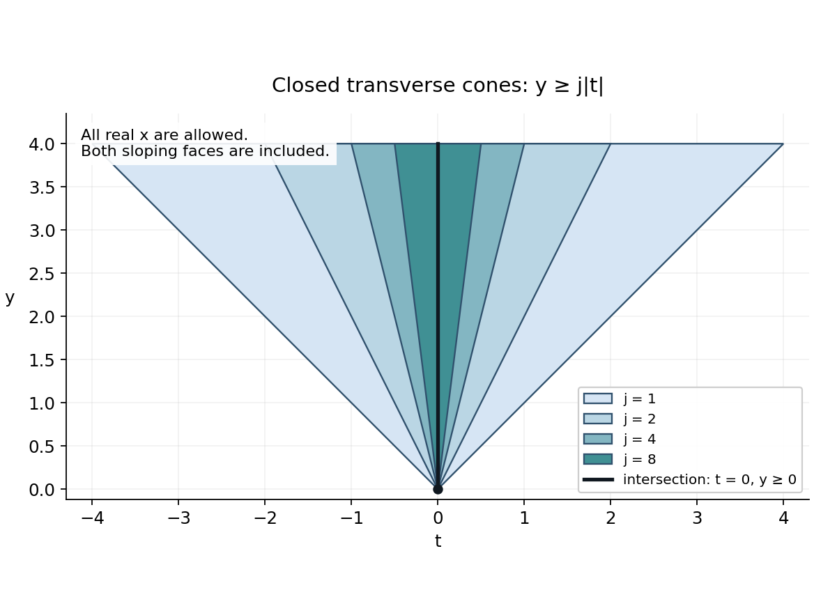
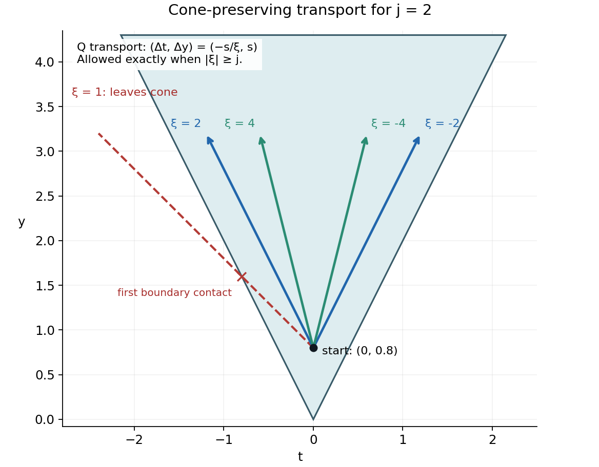

# Fundamental solutions in shrinking cones

*Written by GPT-6.1 Sol (OpenAI), October 2026. Self-checked by the writing AI (GPT-6.1 Sol). Original exposition: public domain (CC0).*

A differential equation may have a fundamental solution in every cone of a decreasing sequence and have none in the intersection. The solutions chosen for successive cones need not approach one another. This lesson constructs an example and identifies the precise obstruction at the limit.

The construction uses distributions and elementary real and complex calculus, including Cauchy’s formula. For Fourier inversion, Plancherel and the complete \(L^2\) transform, use [Fourier transforms, finite spectra and convex separation](../prerequisites/prerequisite-bridges.html), Sections 1, 2 and 7. Our unitary transform in \(d\) variables is \((2\pi)^{-d/2}\) times the transform used there. For dual completeness, complex Hahn–Banach, seminorm separation, Minkowski, dominated convergence, Sobolev completeness and smooth approximation, use [Banach estimates, quotient spaces and compact parameter arguments](../prerequisites/banach-foundation-bridges.html), Sections 3, 5, 14.7 and 15.1–15.5. Distributional differentiation and convolution with a compactly supported smooth function are assumed in their defining test-function form. The analytic uniqueness argument needed for gluing is proved in Section 7. No growth condition is imposed at infinity. The source attribution is Arne Enqvist’s work on cone-supported fundamental solutions [E]. Romain Crétier’s notes [C] give a freely readable account of analytic Cauchy problems and distributional uniqueness. These references supply historical context; every specialized proof needed below is included.

## 1. The cones and the equation

Use coordinates \((x,y,t)\) in \(\mathbb R^3\), and put \(D_z=-i\partial_z\). Our operator and its transpose are

\[
 P(D)=D_xD_y+D_t=-\partial_x\partial_y-i\partial_t,
 \qquad Q(D)=P(-D)=D_xD_y-D_t. \tag{DC1}
\]

The transpose is bilinear, without complex conjugation. Thus \((P(D)E)(\phi)=E(Q(D)\phi)\). A fundamental solution is a distribution \(E\in\mathcal D'(\mathbb R^3)\) with \(P(D)E=\delta_0\).

For an integer \(j\ge1\), define

\[
 \Gamma_j=\{(x,y,t):y\ge j|t|\}
 =\mathbb R_x\times\{(y,t):y-jt\ge0,\ y+jt\ge0\}. \tag{DC2}
\]

These are **closed** convex cones. Their interiors are \(y>j|t|\), and their common edge, meaning their largest contained vector subspace, is \(\{(x,0,0):x\in\mathbb R\}\). They contain both boundary rays in the transverse \((t,y)\)-plane. They have nonempty three-dimensional interiors but are not pointed.

\[
 \Gamma_{j+1}\subset\Gamma_j,
 \qquad \Gamma_\infty:=\bigcap_{j\ge1}\Gamma_j
 =\{(x,y,t):y\ge0,\ t=0\}. \tag{DC3}
\]

Indeed, if \(t\ne0\), the inequality fails as soon as \(j>y/|t|\). If \(t=0\), all inequalities reduce to \(y\ge0\).

**Theorem 1.1.** For every integer \(j\ge1\), there is a distribution \(E_j\in H^{-2}_{\mathrm{loc}}(\mathbb R^3)\) such that

\[
 P(D)E_j=\delta_0,
 \qquad \operatorname{supp}E_j\subset\Gamma_j. \tag{DC4}
\]

There is no distribution \(E\in\mathcal D'(\mathbb R^3)\) satisfying \(P(D)E=\delta_0\) and \(\operatorname{supp}E\subset\Gamma_\infty\).

Here \(H^{-2}_{\mathrm{loc}}\) is a local Sobolev condition. It supplies no uniform bound at spatial infinity and does not assert that \(E_j\) is tempered. The construction makes choices for each fixed \(j\); it makes no compatibility claim between different \(j\).

*Figure 1.* The displayed sections are \(\Gamma_j\cap\{x=0\}\) for \(j=1,2,4,8\), clipped at \(y=4\). Both sloping boundaries belong to each cone. The black vertical ray is the section of the intersection. Extruding every section through all real \(x\) gives the actual three-dimensional sets. This is a support enclosure, not a claim that the constructed solutions have support equal to the colored cones. Editable source: [cone renderer](../reproduce/L113/assets/render_decreasing_cones.py).

## 2. Why the limiting plane cannot carry the point source

We first prove the nonexistence part. It holds even if the entire plane \(t=0\), rather than its half-plane \(y\ge0\), is allowed.

**Lemma 2.1 (finite normal jets).** Let a distribution \(T\) be supported by \(t=0\) near a compact box in the \((x,y)\)-plane. On a smaller product neighborhood there are an integer \(M\) and distributions \(T_0,\ldots,T_M\) in \((x,y)\) for which

\[
 T=\sum_{k=0}^M T_k(x,y)\otimes\partial_t^k\delta(t). \tag{DC5}
\]

**Proof.** A distribution has finite order on a compact neighborhood: its value is bounded by a constant times the maximum of derivatives through some order \(M\). This follows directly from continuity on the test functions supported in that compact set; a basic neighborhood is specified by finitely many derivative seminorms.

Suppose a test function \(\phi\) has its first \(M+1\) normal jets zero at \(t=0\). Taylor’s formula gives \(\phi=t^{M+1}g\). Let \(\chi(t/\varepsilon)\) be a cutoff equal to one near zero. Support on the plane gives \(T(\phi)=T(\chi(t/\varepsilon)\phi)\). Each derivative through order \(M\) of this last test function is \(O(\varepsilon)\), including mixed tangential derivatives. The finite-order bound gives \(T(\phi)=0\).

Choose a normal cutoff \(\theta\) equal to one near zero. Subtract
\(\theta(t)\sum_{k=0}^M t^k\partial_t^k\phi(x,y,0)/k!\) from \(\phi\); the difference has all those jets zero. Therefore \(T\) depends only on these finitely many jets. Define the coefficient distributions by applying \(T\) to \((-1)^k\theta(t)t^k\psi(x,y)/k!\). This gives (DC5), with the signs required by \(\partial_t^k\delta(\phi)=(-1)^k\partial_t^k\phi(0)\). Shrinking the tangential box keeps every cutoff inside the original neighborhood. ∎

Assume \(E\) is a fundamental solution supported in \(t=0\). Apply Lemma 2.1 in a neighborhood of the origin. Equation (DC1) gives

\[
 P(D)E=\sum_{k=0}^M(-\partial_x\partial_y E_k)\otimes\partial_t^k\delta
       -i\sum_{k=0}^M E_k\otimes\partial_t^{k+1}\delta. \tag{DC6}
\]

Normal derivatives of \(\delta\) are linearly independent over tangential distributions: testing against a cutoff times a prescribed normal monomial extracts each coefficient. The coefficient of \(\partial_t^{M+1}\delta\) in (DC6) must vanish, since the right side \(\delta(x,y)\delta(t)\) has normal order zero. Hence \(E_M=0\). Descending through the remaining coefficients gives \(E_{M-1}=\cdots=E_0=0\). The normal-order-zero coefficient then says \(0=\delta(x,y)\), a contradiction.

This argument uses local finite order, which every distribution has. It does not require a global finite order or a Fourier transform of \(E\).

**Example 2.2.** The lower order term \(D_t\) is essential. If it is removed, the operator \(D_xD_y=-\partial_x\partial_y\) has the fundamental solution

\[
 E^{\flat}=-H(x)H(y)\delta(t),
 \qquad D_xD_yE^{\flat}=\delta(x)\delta(y)\delta(t). \tag{DC7}
\]

Its support lies in \(\Gamma_\infty\). Adding a first order term has destroyed a support possibility that the principal part alone permits.

## 3. Fast frequencies stay inside a cone

Fix \(j\). We prove an estimate on the same **positive** cone \(\Gamma=\Gamma_j\), which will produce local fundamental solutions supported there.

For a compact set \(K\), choose \(H,R>0\) so that its \(x\)-projection lies in \([-H,H]\) and its \(y\)-projection lies in \([-R,R]\). Take the unitary Fourier transform in \(x\) alone. A hat in this section denotes that partial transform. For \(f=Q(D)u\), with \(u\in C_c^\infty(K)\), we have

\[
 -i(\xi\partial_y-\partial_t)\widehat u=\widehat f.
 \tag{DC8}
\]

For \(|\xi|\ge j\), integrate towards increasing \(y\). Compact support makes the endpoint value zero, and gives

\[
 \widehat u(\xi,y,t)
 =-\frac{i}{\xi}\int_0^{\infty}
       \widehat f(\xi,y+s,t-s/\xi)\,ds. \tag{DC9}
\]

The signs follow by differentiating along \(s\):
\(d\widehat u(y+s,t-s/\xi)/ds=i\widehat f/\xi\).
The displacement \((s,-s/\xi)\) belongs to the transverse cone because \(s\ge j|s/\xi|\). Thus a point of \(\Gamma\) stays in \(\Gamma\) under this translation. For points of \(\Gamma\), \(y\ge0\), and the integrand vanishes when \(s>R\). Minkowski’s inequality, this translation property and Plancherel give

\[
 \|\mathbf1_{|\xi|\ge j}\widehat u\|_{L^2(\mathbb R_\xi\timesV_j)}
 \le \frac Rj
       \|\mathbf1_{|\xi|\ge j}\widehat f\|_{L^2(\mathbb R_\xi\timesV_j)}
 \le \frac Rj\|f\|_{L^2(\Gamma)}. \tag{DC10}
\]

Here \(V_j=\{(y,t):y\ge j|t|\}\) denotes the transverse section. The integration is over real \(\xi,y,t\). For each fixed \(\xi\), translating the section into itself can only decrease the restricted \(L^2\) norm; integrating in \(\xi\) preserves that inequality.

*Figure 2.* For \(j=2\), the arrows are exact displacements \((\Delta t,\Delta y)=(-s/\xi,s)\), starting at \((t,y)=(0,0.8)\), for \(\xi=\pm2,\pm4\). The boundary case \(|\xi|=2\) is included. The dashed red displacement has \(\xi=1\) and eventually leaves the cone. The arrows show the local inverse mechanism in (DC9); they are not the support of \(E_j\). Editable source: [cone renderer](../reproduce/L113/assets/render_decreasing_cones.py).

The estimate only sees large edge frequencies. Compact support in \(x\) lets us recover the omitted frequencies.

**Lemma 3.1 (compact support cannot hide in a bounded frequency band).** For \(H,j>0\), there is \(A_{H,j}<\infty\) such that every \(v\in L^2(\mathbb R)\) supported in \([-H,H]\) satisfies

\[
 \|v\|_2\le A_{H,j}\|\mathbf1_{|\xi|\ge j}\widehat v\|_2. \tag{DC11}
\]

**Proof.** Let \(B\) send \(v\in L^2([-H,H])\), extended by zero, to its Fourier transform restricted to \([-j,j]\). Its kernel is \((2\pi)^{-1/2}e^{-ix\xi}\) on a finite rectangle, so it is a norm limit of finite rank operators: approximate that continuous kernel uniformly by finite sums of products. Thus \(B\) is compact. Plancherel gives \(\|B\|\le1\).

If \(\|B\|=1\), choose unit vectors \(v_n\) with \(\|Bv_n\|\to1\). An orthonormal basis is obtained by Gram–Schmidt from a countable dense family of step functions. Expanding in that basis and taking a diagonal subsequence gives weak convergence to some \(v\) with \(\|v\|\le1\). Compactness gives \(Bv_n\to Bv\) in norm, so \(\|Bv\|=1\), forcing \(\|v\|=1\). Equality in Plancherel says \(\widehat v=0\) outside \([-j,j]\).

But \(v\) has compact support, hence is integrable, and \(\int_{-H}^H v(x)e^{-ixz}\,dx\) is an entire function of \(z\). Differentiation under the integral is justified by compact support. Its zeros on a real open interval force it to vanish everywhere, by its convergent complex Taylor series and the identity theorem. Fourier injectivity gives \(v=0\), a contradiction. Hence \(b:=\|B\|<1\), and (DC11) holds with \(A_{H,j}=(1-b^2)^{-1/2}\). ∎

Apply (DC11) at each \((y,t)\), then integrate over the transverse section. Combine it with (DC10). Apply the same argument to every physical derivative \(\partial^\alpha u\), \(|\alpha|\le2\). These derivatives have the same compact support, and constant coefficient operators commute with them. We obtain

\[
 \|u\|_{H^2(\Gamma)}\le C_{K,j}\|Q(D)u\|_{H^2(\Gamma)},
 \qquad u\in C_c^\infty(K). \tag{DC12}
\]

The norm here is the square sum of the restricted \(L^2\) norms of derivatives through order two. Its constant depends on \(K\) and \(j\). No estimate uniform in expanding \(K\), or in \(j\to\infty\), has been claimed. Replacing \(Q\) by \(P\) merely reverses the sign of the transverse transport slope, so the same estimate holds for \(P\).

## 4. Constructing a fundamental solution on each bounded region

We need to control the value \(u(0)\) by the cone norm in (DC12). Here is an explicit extension argument.

In transverse coordinates \(r=y+jt\), \(s=y-jt\), the cone is the quadrant \(r,s\ge0\). Extend across \(r=0\) by

\[
 (\mathcal R_r u)(r,s)=
 \begin{cases}u(r,s),&r\ge0,\\
 3u(-r,s)-2u(-2r,s),&r<0.
 \end{cases} \tag{DC13}
\]

The value and the first normal derivative agree at zero because \(3-2=1\) and \(-3+4=1\). Extend across \(s=0\) by the identical formula. Changes of variables in the reflected integrals bound every derivative through order two. Since the function and its first derivatives match, its distributional second derivatives have no boundary delta term. The resulting extension \(U\) therefore belongs to \(H^2(\mathbb R^3)\), agrees with \(u\) on the cone, and satisfies

\[
 \|U\|_{H^2(\mathbb R^3)}\le C_j\|u\|_{H^2(\Gamma)}. \tag{DC14}
\]

The invertible linear change of transverse coordinates only changes the finite constant. For smooth compactly supported \(u\), this extension is continuous at zero.

Fourier inversion and Cauchy–Schwarz give a continuous representative for every \(H^2(\mathbb R^3)\) function, since

\[
 \int_{\mathbb R^3}(1+|\zeta|^2)^{-2}\,d\zeta<\infty,
 \qquad |U(0)|\le C\|U\|_{H^2}. \tag{DC15}
\]

For completeness, approximate \(U\) in \(H^2\) by Fourier cutoffs. Their Fourier transforms converge in \(L^1\) by the displayed inequality, so the inverse transforms converge uniformly. This proves both the representative assertion and the evaluation bound. The derivative norm used above is equivalent to the Fourier norm \(\|(1+|\zeta|^2)\widehat U\|_2\), by expanding the polynomials and applying Plancherel.

We use \(H^{-2}\) as the continuous bilinear dual of this Hilbert space \(H^2\), identified with the usual weighted Fourier space. The Hilbert representation needed for this identification has a short proof. For a nonzero continuous functional, its kernel is a closed subspace. The parallelogram identity makes a sequence minimizing distance from a point outside that kernel Cauchy: the midpoint belongs to the kernel, so the squared difference of two residual vectors tends to zero. Completeness supplies a minimizing residual \(z\). Differentiating its squared distance along every real and imaginary multiple of a kernel vector shows that \(z\) is orthogonal to the kernel. The kernel has codimension one, so the functional is a scalar multiple of the inner product with \(z\). The zero functional is immediate. Applying this to the isometry \(u\mapsto(1+|\zeta|^2)\widehat u\) identifies the dual with distributions satisfying \((1+|\zeta|^2)^{-1}\widehat E\in L^2\). It also proves completeness of the dual and the Fourier translation rule used later.

Now let \(\Omega\) be any bounded open region, and take a compact \(K\) containing its closure. Equations (DC12)–(DC15) imply

\[
 |u(0)|\le C_{K,j}\|Q(D)u\|_{H^2(\Gamma)},
 \qquad u\in C_c^\infty(\Omega). \tag{DC16}
\]

On the subspace of restrictions \(Q(D)u|_\Gamma\) of such tests, define a functional by

\[
 \ell_\Omega(Q(D)u|_\Gamma)=u(0). \tag{DC17}
\]

The estimate shows that this is well defined and bounded for the restricted derivative norm. Take the completion of restrictions of all global test functions in that norm. Hahn–Banach extends \(\ell_\Omega\) to this completion with the same bound. Set

\[
 F_\Omega(\phi)=\ell_\Omega(\phi|_\Gamma),
 \qquad \phi\in C_c^\infty(\mathbb R^3). \tag{DC18}
\]

This is a distribution. In fact, its absolute value is bounded by a constant times the global \(H^2\) norm of \(\phi\), so it extends to an element of \(H^{-2}(\mathbb R^3)\). Tests supported off \(\Gamma\) have zero restriction and derivatives there, so \(\operatorname{supp}F_\Omega\subset\Gamma\). Equations (DC17)–(DC18) give

\[
 P(D)F_\Omega=\delta_0\quad\hbox{in }\Omega,
 \qquad F_\Omega\in H^{-2}(\mathbb R^3),
 \qquad \operatorname{supp}F_\Omega\subset\Gamma. \tag{DC19}
\]

This is a complete construction of a **local** fundamental solution: the only choice is a bounded Hahn–Banach extension. It does not say that \(P(D)F_\Omega=\delta_0\) outside \(\Omega\). Its bound may increase when \(\Omega\) expands. Section 6 will make compatible local choices and take their limit.

The same argument, with \(P\) and \(Q\) interchanged, constructs local fundamental solutions for \(Q\). Reflection of \(F_\Omega\) through the origin is also a local fundamental solution for \(Q\), on \(-\Omega\), with support in \(-\Gamma\).

## 5. A barrier and an approximation lemma

Local fundamental solutions must be glued. We first control compactly supported distributions in the part of the cone beyond an oblique plane. The only uniqueness input is the following statement, proved in Section 7:

**Analytic uniqueness statement.** If a distribution solves a differential equation of order two with analytic coefficients near an analytic graph hypersurface \(x=g(y,t)\), the hypersurface is noncharacteristic, and the distribution vanishes on one side, it vanishes in a neighborhood of the hypersurface.

For \(P\) or \(Q\), the principal symbol is \(\xi\eta\), so a normal \(N\) is noncharacteristic exactly when \(N_xN_y\ne0\).

Write \(r=y-jt\), \(s=y+jt\). Fix \(\sigma,\varepsilon_0\in\{-1,1\}\), and put

\[
 L=\sigma x+2y+\varepsilon_0t,
 \qquad O_a=\{r>0,\ s>0,\ L>a\}. \tag{DC20}
\]

**Lemma 5.1.** If \(\mu\) is a compactly supported distribution and \(Q(D)\mu=0\) in \(O_a\), then \(\mu=0\) there.

**Proof.** Suppose \(z_0\in O_a\cap\operatorname{supp}\mu\). For a sufficiently small positive \(\epsilon\),

\[
 B_\epsilon=L-\frac\epsilon r-\frac\epsilon s,
 \qquad B_\epsilon(z_0)>a. \tag{DC21}
\]

On the compact support of \(\mu\), the superlevel set \(B_\epsilon\ge B_\epsilon(z_0)\) stays a positive distance from \(r=0\) and \(s=0\): approaching either boundary makes the corresponding negative term tend to \(-\infty\), while \(L\) stays bounded. Thus \(B_\epsilon\) attains a maximum \(M>a\) on the support within the interior of the cone. At a maximizing point, \(\mu\) vanishes on the side \(B_\epsilon>M\). But

\[
 \partial_xB_\epsilon=\sigma,
 \qquad \partial_yB_\epsilon=2+\epsilon/r^2+\epsilon/s^2,
 \qquad (\partial_xB_\epsilon)(\partial_yB_\epsilon)\ne0. \tag{DC22}
\]

The level surface is an analytic graph in \(x\), since (DC21) is affine in \(x\) with nonzero coefficient \(\sigma\). By (DC22), this graph is noncharacteristic. Analytic uniqueness forces \(\mu\) to vanish in a neighborhood of the point, contradicting its membership in the support. ∎

This barrier prevents contact with the characteristic boundaries \(r=0\), \(s=0\). It avoids a general theorem about propagation across characteristic planes.

Choose the bounded polyhedra

\[
 \Omega_n=\{y>-n,\quad \sigma x+2y+\varepsilon_0t<n
       \text{ for all }\sigma,\varepsilon_0\in\{-1,1\}\},
 \qquad n=1,2,\ldots. \tag{DC23}
\]

Equivalently, \(y>-n\) and \(|x|+|t|+2y<n\). Consequently \(-n<y<n/2\) and \(|x|+|t|<3n\). Each is a neighborhood of zero, \(\overline{\Omega_n}\subset\Omega_{n+1}\), and their union is all of \(\mathbb R^3\).

A useful consequence of Lemma 5.1 is

\[
 \operatorname{int}\Gamma\cap\operatorname{supp}Q(D)\mu\subset K\Subset\Omega_n
 \quad\Longrightarrow\quad
 \overline{\operatorname{int}\Gamma\cap\operatorname{supp}\mu}\Subset\Omega_n
 \quad(\mu\text{ compactly supported}). \tag{DC24}
\]

To verify it, choose \(a<n\) larger than all four values \(L\) on \(K\). Lemma 5.1 excludes support in every \(O_a\). Hence the closure on the right satisfies all four inequalities \(L\le a<n\), as well as \(y\ge0>-n\). Intersecting these closed constraints with the compact support of \(\mu\) gives the asserted compact containment. If \(K\) is empty, any \(a<n\) can be used and the same conclusion follows.

Let \(\mathcal N(\Omega_n)\) be the space of smooth solutions of \(P(D)u=0\) in \(\Omega_n\) whose relative support is contained in \(\Gamma\cap\Omega_n\), with its usual topology of uniform convergence of all derivatives on compact subsets.

**Lemma 5.2 (approximation inside a larger polyhedron).** If \(m>n\), restrictions of \(\mathcal N(\Omega_m)\) are dense in \(\mathcal N(\Omega_n)\).

**Proof.** It suffices to test continuous linear functionals. A functional on \(\mathcal N(\Omega_n)\) that annihilates the restrictions from \(\Omega_m\) extends by Hahn–Banach to \(C^\infty(\Omega_n)\). Such an extension is a distribution \(v\) with compact support in \(\Omega_n\): its continuity bounds it by finitely many derivative seminorms on one compact subset. We show that \(v\) annihilates all of \(\mathcal N(\Omega_n)\).

Take bounded neighborhoods \(U_3\Subset U_4\) of \(\overline{\Omega_m}\). Choose a local fundamental solution \(F\) for \(P\), supported in \(\Gamma\), which is valid on a ball large enough to contain all differences of points of \(\overline{U_4}\). This is possible by Section 4. Set \(\check F(z)=F(-z)\) and \(\mu=\check F*v\). Convolution is defined because \(v\) has compact support. For \(\phi\in C_c^\infty(\operatorname{int}\Gamma\cap(U_3\setminus\overline{\Omega_m}))\), the smooth function \(F*\phi\) is supported in \(\Gamma\), and \(P(D)(F*\phi)=\phi\) in \(\Omega_m\). Thus it belongs to \(\mathcal N(\Omega_m)\), and

\[
 \mu(\phi)=v(F*\phi)=0.
 \qquad Q(D)\mu=v\text{ in }U_3. \tag{DC25}
\]

Take \(\chi\in C_c^\infty(U_3)\) equal to one near \(\overline{\Omega_m}\), and put \(\mu'=\chi\mu\). It is compactly supported. In the interior of the cone, the commutator \([Q,\chi]\mu\) vanishes: its support is outside \(\overline{\Omega_m}\), where (DC25) says \(\mu=0\). Therefore
\(Q\mu'=v\) in \(\operatorname{int}\Gamma\), and (DC24) gives
\(\overline{\operatorname{int}\Gamma\cap\operatorname{supp}\mu'}\Subset\Omega_n\).
Choose \(\psi\in C_c^\infty(\Omega_n)\) equal to one near that compact set. Put \(\mu''=\psi\mu'\). Then \(Q\mu''=v\) throughout \(\operatorname{int}\Gamma\), while \(\mu''\) has compact support in \(\Omega_n\).

For \(u\in\mathcal N(\Omega_n)\), every derivative of \(u\) vanishes on the complement of \(\operatorname{int}\Gamma\). Off the closed cone this follows from its support; on its boundary it follows by smoothness and approach from the open complement. A distribution supported on that complement therefore annihilates \(u\). Here is the needed elementary fact: on a compact set where a smooth function has every derivative zero, multiplying it by a cutoff supported in a shrinking neighborhood of that set tends to zero in every fixed derivative seminorm. Such cutoffs are obtained by convolving the indicator of an \(\epsilon/2\)-neighborhood with a mollifier of radius \(\epsilon/4\), and multiplying by a fixed outer cutoff. Their derivatives of order \(r\) are \(O(\epsilon^{-r})\). Taylor’s formula at a nearest point of the closed set gives arbitrary powers of \(\epsilon\) for the smooth function and all its derivatives, which absorb those losses. Finite distributional order then gives zero pairing.

Apply this to \(v-Q\mu''\), supported off \(\operatorname{int}\Gamma\). We obtain

\[
 v(u)=(Q\mu'')(u)=\mu''(P(D)u)=0. \tag{DC26}
\]

The Hahn–Banach separation criterion for closure now proves density. In detail, if the closure were a proper closed subspace, a point outside it could be separated by a continuous linear functional, contradicting the conclusion just proved. ∎

## 6. Constructing a global solution for each cone

The following recursion specifies \(E_j\) completely up to its bounded functional extensions and dense approximation choices. All of those choices have been proved possible.

For each \(n\), fix \(\chi_n\in C_c^\infty(\Omega_{n+1})\) equal to one near \(\overline{\Omega_n}\). Begin with the solution \(u_1=F_{\Omega_3}\) from (DC19). We recursively arrange

\[
 u_n\in H^{-2}(\mathbb R^3),\quad
 \operatorname{supp}u_n\subset\Gamma,\quad
 P(D)u_n=\delta_0\text{ in }\Omega_{n+2},
 \tag{DC27}
\]

and

\[
 \|\chi_k(u_{n+1}-u_n)\|_{H^{-2}}\le2^{-n},
 \qquad k\le n. \tag{DC28}
\]

Suppose \(u_n\) has been constructed. First take \(v_0=F_{\Omega_{n+4}}\), and let \(v=v_0-u_n\). Then \(P(D)v=0\) in \(\Omega_{n+2}\), and \(v\) is supported in \(\Gamma\).

Choose a nonnegative smooth mollifier of integral one supported in a small ball strictly inside \(\operatorname{int}\Gamma\). Dilate it towards zero to obtain \(\rho\) with arbitrarily small support. Then \(\rho*v\) is smooth and supported in \(\Gamma\): the sum of the closed cone and the compact support of \(\rho\) is a closed subset of the cone. If its support radius is smaller than the distance from \(\overline{\Omega_{n+1}}\) to the complement of \(\Omega_{n+2}\), it solves the homogeneous equation in \(\Omega_{n+1}\).

Furthermore, translations are continuous in \(H^{-2}\). This follows by dominated convergence in its Fourier norm, since translation multiplies the transform by a unit-modulus exponential. The triangle inequality under the mollifier integral therefore gives \(\rho*v\to v\) in \(H^{-2}\). Multiplication by a fixed smooth compactly supported \(\chi_k\) is bounded in \(H^{-2}\), by duality from the product rule in \(H^2\). We may choose \(\rho\) so that

\[
 \|\chi_k(\rho*v-v)\|_{H^{-2}}<2^{-n-1},\qquad k\le n. \tag{DC29}
\]

By Lemma 5.2 choose \(w\in\mathcal N(\Omega_{n+4})\) approximating \(\rho*v\) on the finite union of the compact supports of \(\chi_1,\ldots,\chi_n\), all lying in \(\Omega_{n+1}\), closely enough that

\[
 \|\chi_k(w-\rho*v)\|_{H^{-2}}<2^{-n-1},\qquad k\le n. \tag{DC30}
\]

Uniform approximation suffices: on a fixed compact set its \(L^2\) error tends to zero, and \(\|h\|_{H^{-2}}\le\|h\|_2\). Choose \(\eta\in C_c^\infty(\Omega_{n+4})\) equal to one near \(\overline{\Omega_{n+3}}\), extend \(\eta w\) by zero to all space, and define

\[
 u_{n+1}=v_0-\eta w. \tag{DC31}
\]

The extension is smooth, compactly supported and supported in \(\Gamma\). Hence (DC27) holds with \(n+1\), and (DC29)–(DC30) imply (DC28).

For fixed \(k\), the tail \(\chi_k u_n\) is a Cauchy sequence in the complete space \(H^{-2}\), because \(\sum_n2^{-n}<\infty\). The local limits agree on overlaps: they all come from the same sequence \(u_n\). More explicitly, for any test \(\phi\), choose \(k\) such that \(\chi_k=1\) near its support, and set

\[
 E_j(\phi)=\lim_{n\to\infty}u_n(\phi). \tag{DC32}
\]

On a fixed compact support the \(H^{-2}\) convergence bounds this limit by the \(H^2\) norm of the test, so it is continuous in the test-function topology. It is therefore a distribution, locally in \(H^{-2}\). A test supported off \(\Gamma\) is annihilated by every \(u_n\), hence by \(E_j\). For a fixed test, \(P(D)u_n=\delta_0\) on its support for all sufficiently large \(n\); continuity of distributional differentiation yields

\[
 \operatorname{supp}E_j\subset\Gamma_j,
 \qquad P(D)E_j=\delta_0\quad\text{on }\mathbb R^3. \tag{DC33}
\]

This completes the existence part of Theorem 1.1 for every \(j\). The global \(H^{-2}\) norms of the approximants were never bounded uniformly. The conclusion is local \(H^{-2}\), with unrestricted behavior at infinity.

**Example 6.1 (summable errors really do matter).** If the bound \(2^{-n}\) in (DC28) were replaced by \(1/n\), the displayed estimates alone would not establish convergence: the scalar sequence \(s_n=\sum_{r=1}^{n-1}1/r\) has increments at most \(1/n\) and diverges. Any positive summable sequence can replace \(2^{-n}\), provided both approximation errors use half of that allowance.

**Example 6.2 (a transformed family).** Let \(a>0\). Under \(X=x\), \(Y=y\), \(T=t/a\), the operator \(D_xD_y+aD_t\) becomes \(D_XD_Y+D_T\). If \(E_j\) is the distribution constructed above, define the pullback-scaled distribution \(\widetilde E_j(x,y,t)=a^{-1}E_j(x,y,t/a)\), with pullback understood distributionally. Then

\[
 (D_xD_y+aD_t)\widetilde E_j=\delta_0,
 \qquad \operatorname{supp}\widetilde E_j
 \subset\{y\ge (j/a)|t|\}. \tag{DC34}
\]

The factor \(a^{-1}\) compensates for the Jacobian: \(\delta(t/a)=a\delta(t)\). The intersection is still \(y\ge0,t=0\), and the same highest-normal-jet argument excludes a fundamental solution there.

## 7. The analytic uniqueness argument used by the barrier

We prove the exact analytic uniqueness statement used in Lemma 5.1. Only analytic graphs are needed there. This is the analytic-graph, order-two form of Holmgren’s theorem. The argument uses an adjoint analytic Cauchy problem, with estimates included below.

### 7.1. A uniform analytic Cauchy construction

Let \(z\in\mathbb C^d\), and let \(V_0\Subset V_1\) be concentric polydisks. Insert intermediate polydisks \(V_s\), \(0\le s\le1\), whose radii grow linearly with \(s\). Let \(\mathcal H_s\) be the Banach space of continuous vector-valued functions on \(\overline{V_s}\), holomorphic inside, with its supremum norm. Uniform limits remain holomorphic by Cauchy’s formula, so these spaces are complete. Suppose

\[
 A(q)=\sum_{r=1}^d A_r(z,q)\partial_{z_r}+A_0(z,q) \tag{DC35}
\]

has coefficients holomorphic on a neighborhood of \(\overline{V_1}\), smooth for the real parameter \(q\) in a fixed short interval, with all needed derivatives bounded there. Cauchy’s integral formula on a disk of radius proportional to \(s-s'\) gives

\[
 \|A(q)h\|_{\mathcal H_{s'}}\le \frac C{s-s'}\|h\|_{\mathcal H_s},
 \qquad 0\le s'<s\le1, \tag{DC36}
\]

with \(C\) independent of \(h,q,s,s'\). A bounded zeroth order term is absorbed because \(s-s'\le1\). The same estimate holds for the formal spatial transpose and for each fixed parameter derivative, with its own constant.

The equation \(\partial_q h=A(q)h+f(q)\), with zero value at \(q=b\), has a solution on a short interval whose length depends on \(C,V_0,V_1\), **not on the size of** \(f\). Here \(f\) is smooth in \(q\) with values in \(\mathcal H_1\). To see this, write

\[
 h_0(q)=\int_b^q f(v)\,dv,
 \qquad h_{k+1}(q)=\int_b^q A(v)h_k(v)\,dv,
 \qquad h=\sum_{k\ge0}h_k. \tag{DC37}
\]

The integrals can be defined pointwise in \(z\); uniform Riemann sums and completeness give the same elements of the indicated spaces. For a product of \(k\) operators choose \(k\) equal radius losses between \(V_1\) and \(V_s\). Its norm is at most \((Ck/(1-s))^k\). The ordered time integrals have volume \(|q-b|^k/k!\). Since \(k!\ge(k/e)^k\) (integrate \(\log r\) from 1 to \(k\)), if \(M\) bounds \(\|h_0(q)\|_{\mathcal H_1}\),

\[
 \|h_k(q)\|_{\mathcal H_s}
 \le M\left(\frac{Ce|q-b|}{1-s}\right)^k. \tag{DC38}
\]

Choose the time interval so that the factor is less than \(1/2\) for a fixed \(0<s<1\). The series converges uniformly in that space. Applying \(A\) with a further fixed radius loss permits termwise integration and gives the equation. Differentiating the equation repeatedly, with smaller polydisks at each of the finitely many differentiation steps, gives smoothness in \(q\). Any finite number of steps fits within a fixed remaining positive radius gap. Spatial derivatives are controlled by Cauchy’s formula. Thus the solution is jointly smooth on the real slice of a smaller polydisk.

If \(f\) vanishes near \(b\), every term in (DC37) vanishes there, so \(h\) does too. The construction applies equally when integrating backwards. This endpoint property will make the solution a valid test function in the normal variable.

### 7.2. Uniqueness for a first order system

Consider a distribution-valued vector \(U\) satisfying

\[
 \partial_qU=A(q)U \tag{DC39}
\]

near \((z,q)=(0,0)\) on the real slice, with analytic coefficients. Suppose \(U=0\) for \(q<0\). First reduce to compact tangential support by the analytic change

\[
 z'=z,\qquad q'=q+|z|^2. \tag{DC40}
\]

In real coordinates the old \(\partial_{z_r}\) becomes \(\partial_{z'_r}+2z'_r\partial_{q'}\). Thus the coefficient of \(\partial_{q'}U\) is
\(I-2\sum_r z'_r A_r\), which is invertible near zero. Its inverse is analytic, by the determinant formula. We obtain another system of the form (DC39). Its solution vanishes where \(q'<|z'|^2\).

Choose a small tangential ball of radius \(r\) where the transformed coefficients are analytic. Then choose \(T>0\) much smaller than \(r^2\). For \(|q'|<T\), the support of \(U\) lies in \(|z'|\le\sqrt T<r/2\); hence it stays in a fixed compact set strictly inside that ball. Multiplying by a spatial cutoff equal to one near this compact set and extending by zero adds no commutator term. We may now work on a fixed polydisk with \(U\) compactly supported in its real interior for all these parameter values. Drop the primes.

Let \(A^{\mathrm t}\) be the formal spatial transpose in the bilinear pairing. For any vector polynomial \(h(z)\) and any \(\psi\in C_c^\infty((-T/4,T/4))\), use Section 7.1 to solve

\[
 -\partial_q v-A(q)^{\mathrm t}v=h(z)\psi(q),
 \qquad v(z,b)=0,\quad b=T/2. \tag{DC41}
\]

Shrinking \(T\) once ensures that the whole interval \([-T/2,T/2]\) has the required small length. This choice is independent of \(h\) and \(\psi\), because (DC38) only uses their norm as a multiplying constant. The solution is smooth and holomorphic in \(z\), and is zero near \(b\), since the forcing is zero there.

Multiply \(v\) by a tangential cutoff equal to one near the compact support of \(U\), and by a normal cutoff that changes only near the negative endpoint and near \(b\). The negative transition pairs with \(U=0\); the positive transition pairs with \(v=0\). Thus the distributional equation (DC39), tested against this compactly supported smooth function, gives

\[
 \langle U,h(z)\psi(q)\rangle=0. \tag{DC42}
\]

This entails \(U=0\) in the smaller cylinder. To justify the density step without assuming analyticity of a test, convolve its spatial variables with a Gaussian. The result is entire in the spatial variables, smooth in \(q\), and tends to the test in every derivative seminorm on the compact support of \(U\). Its Taylor polynomials in \(z\) converge there together with every fixed number of spatial and normal derivatives, uniformly on compact parameter intervals. The coefficients are smooth functions of \(q\) with the same compact parameter support. Hence finite sums of the products tested in (DC42) approximate any such test to the finite order required by \(U\). The pairing with every test vanishes. No normal trace of \(U\) was assumed. ∎

### 7.3. From second order equations to the system

The barrier only needs a scalar equation of order two with analytic coefficients. For an analytic noncharacteristic graph \(x=g(z)\), use the explicit coordinates \((z,q)=(z,\pm(x-g(z)))\), with inverse \(x=g(z)\pm q\). Both maps are analytic. No implicit function theorem is required. Orient the new normal coordinate \(q\) so that the known zero side is \(q<0\). The scalar operator takes the form

\[
 a\partial_q^2+\sum_r b_r\partial_{z_r}\partial_q
 +\sum_{r,s}c_{rs}\partial_{z_r}\partial_{z_s}
 +d\partial_q+\sum_r e_r\partial_{z_r}+f,
 \qquad a\ne0. \tag{DC43}
\]

Noncharacteristic means exactly \(a\ne0\); shrink the neighborhood so it never vanishes. For a scalar distribution \(u\), set
\(U=(u,\partial_{z_1}u,\ldots,\partial_{z_d}u,\partial_qu)\).
Then
\(\partial_qu=U_{d+1}\),
\(\partial_qU_r=\partial_{z_r}U_{d+1}\), and the scalar equation expresses \(\partial_qU_{d+1}\) as a first order tangential differential expression in \(U\), with analytic coefficients obtained by dividing by \(a\). Thus \(U\) satisfies a system (DC39). All its components vanish on the known zero side, and Section 7.2 gives \(U=0\) near the hypersurface. In particular \(u=0\).

This proves precisely the uniqueness used in (DC22), for arbitrary distributions and complex coefficients. It does not invoke analyticity of the solution or an analytic wave front set.

## 8. Exercises with complete solutions

### Exercise 1. Change the narrowing rate

Let \(a_n>0\) be increasing with \(a_n\to\infty\). Replace \(j\) in (DC2) by \(a_n\). Find the intersection and decide whether Theorem 1.1 remains valid.

**Solution.** The intersection is still \(\{y\ge0,t=0\}\): for \(t\ne0\), choose \(n\) with \(a_n>y/|t|\). The local transport proof uses the threshold \(|\xi|\ge a_n\), and Lemma 3.1 works for every positive threshold. In the barrier one may replace the coefficient 2 in \(L\) by any positive constant; its \(y\)-derivative stays positive. In the exhaustion one may retain 2, since no dual-cone estimate is required by the barrier. Every cone therefore has a fundamental solution, while the finite-jet proof excludes one in the intersection. Integrality of the narrowing parameter was never needed.

### Exercise 2. Why an open cone is the wrong support convention

Can a fundamental solution have support contained in \(\{y>j|t|\}\)? Explain why adding the vertex alone does not make the closed-cone theorem a proof for that smaller set.

**Solution.** Distributional differentiation does not increase support, so \(0\in\operatorname{supp}\delta_0\subset\operatorname{supp}E\). The strict cone excludes zero, making the first proposal impossible.

Adding the vertex admits zero but still excludes the whole edge and the sloping faces away from zero. The theorem proved here supplies a solution in the **closed** cone and makes no assertion about this smaller set. One cannot infer the stronger support statement from a closed-cone enclosure. Indeed, the support is closed, so any accumulation on an excluded face would violate it. Whether another fundamental solution has that stronger support is a separate question, left unasserted. The exact established convention is (DC2), including its edge and both faces.

### Exercise 3. Check the transport signs and endpoints

Derive (DC9) directly. Then give the corresponding formula for \(f=P(D)u\), and explain why equality \(|\xi|=j\) is allowed.

**Solution.** For \(Q\), partial Fourier transformation in \(x\) gives \(-i(\xi\partial_y-\partial_t)\widehat u=\widehat f\). Along \((y+s,t-s/\xi)\), differentiation yields \(i\widehat f/\xi\). Its integral from zero to infinity is \(0-\widehat u\), since compact support in \(y\) kills the terminal value. Therefore \(\widehat u=-i\xi^{-1}\int_0^\infty\widehat f(y+s,t-s/\xi)\,ds\).

For \(P\), replace the minus sign before \(\partial_t\) by a plus sign. The formula is \(-i\xi^{-1}\int_0^\infty\widehat f(y+s,t+s/\xi)\,ds\). In either case the displacement has \(\Delta y=s\) and \(|\Delta t|=s/|\xi|\), so it belongs to the closed cone exactly when \(|\xi|\ge j\). Equality is a boundary direction and is included. The zero frequency is excluded because division by \(\xi\) would be invalid; Lemma 3.1 recovers it through compact spatial support.

### Exercise 4. A local finite-jet obstruction in general form

Let \(A(D_x,D_y)\) be any constant coefficient tangential operator, and \(c\ne0\). Prove that \(A(D_x,D_y)+cD_t\) has no fundamental solution supported in \(t=0\). Explain why \(c=0\) is different.

**Solution.** Near zero write a hypothetical solution as \(\sum_{k=0}^M E_k\partial_t^k\delta\), by Lemma 2.1. Since \(D_t=-i\partial_t\), its highest normal coefficient after applying the operator is \(-icE_M\) at order \(M+1\). It must be zero, so \(E_M=0\). Descending yields all coefficients zero, contradicting the nonzero point source. This proof is local and applies to all distributions. If \(c=0\), no highest normal coefficient is created; a tangential fundamental solution \(G\), when available, gives \(G(x,y)\delta(t)\). Example 2.2 gives one concrete instance.

### Exercise 5. What a compatible limit would force

Suppose one could choose the fundamental solutions of Theorem 1.1 so that \(E_j\to E\) in \(\mathcal D'(\mathbb R^3)\). Derive a contradiction. State precisely what this says about the construction.

**Solution.** Fix \(k\). For all \(j\ge k\), \(\operatorname{supp}E_j\subset\Gamma_j\subset\Gamma_k\). A test supported in the open complement of \(\Gamma_k\) is eventually annihilated; passage to the limit gives \(\operatorname{supp}E\subset\Gamma_k\). Since this holds for every \(k\), the support lies in \(\Gamma_\infty\). Differentiation is continuous in \(\mathcal D'\), so \(P(D)E=\lim_jP(D)E_j=\delta_0\). Section 2 rules this out.

Thus no choice of one fundamental solution in each shrinking cone can converge distributionally as \(j\to\infty\). The recursion in Section 6 converges in its exhaustion index \(n\) for each **fixed** \(j\). It does not converge in the cone index \(j\), and no such claim was made.

## References

[E] Arne Enqvist, *On fundamental solutions supported by a convex cone*, Arkiv för Matematik **12** (1974), 1–40. [Original paper](https://projecteuclid.org/journalArticle/Download?urlid=10.1007%2FBF02384744). The quadratic classification is Theorems 7.1–7.3, case (iv); the hyperplane criterion is Theorem 2.11. The cone approximation method is developed in Section 4. The particular decreasing sequence and the specialized estimates and barrier above are presented explicitly here.

[C] Romain Crétier, *Cauchy-Kovalevska Theorem, Characteristics and Holmgren Theorem*, undated notes. [Freely readable human exposition](https://www.imo.universite-paris-saclay.fr/media/filer_public/2f/54/2f545d60-a80b-41b4-ae17-58f05160651c/notes_ck.pdf), Sections 2 and 5. The adjoint analytic-Cauchy method is classical; Section 7 supplies the analytic-graph, order-two distributional form needed in this lesson.
