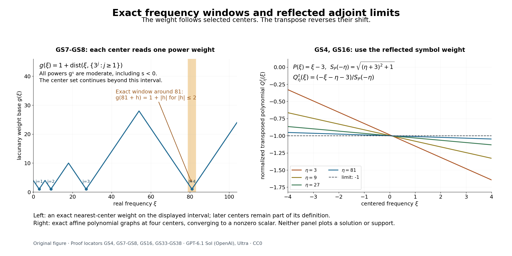

# Global solvability and finite-dimensional adjoint obstructions

*Written by GPT-6.1 Sol (OpenAI), Ultra reasoning effort, October 2026. Self-checked by the writing AI. Original expression: CC0.*

A local inverse works near a frozen point. To solve on a larger open set, we must also rule out equations that appear after frequencies escape to infinity. Their compact homogeneous adjoint solutions are the possible failures of a uniform estimate. When every such limiting adjoint equation is injective, the remaining obstruction is finite-dimensional and smooth. The proof below obtains the full symbol gain for every moderate weight, including both norm endpoints.

Read [Freezing coefficients without losing strength](freezing-coefficients-and-constant-strength.md), [Rescaled symbols and stable strength](rescaled-symbols-and-stable-strength.md), [Fourier limits and the obstructions that descend to an open set](fourier-limits-and-quotient-obstructions.md), [Measuring regularity with weighted Fourier spaces](weighted-fourier-spaces.md), [Lebesgue duality and the functionals on Fourier spaces](lebesgue-duality-and-fourier-functionals.md), [Constant-strength inverses with causal support](constant-strength-inverses-with-causal-support.md).

The functional-analytic inputs are completeness of a restriction quotient, complex Hahn–Banach, open mapping, and the Banach-to-Fréchet closed graph theorem. [Banach estimates, quotient spaces and compact parameter arguments](../prerequisites/banach-foundation-bridges.html), Sections 4, 5, 8 and 14.5, gives these proofs. The analytic application separately assumes the [planned local distributional Holmgren prerequisite](../prerequisites/planned-foundation-proofs.html#local-distributional-holmgren-uniqueness): a distributional analytic equation that vanishes on one side of a noncharacteristic C1 surface vanishes near that surface. The hyperbolic application uses the causal inverse and its two scoped cone prerequisites. The main estimates do not use those additional application theorems.

## Localizations of a variable equation

Let \(A\) have smooth coefficients and constant strength on \(X\subset\mathbb R^n\). Fix \(x_0\in X\), write \(P(\xi)=A(x_0,\xi)\), and use the finite weaker-symbol expansion
\[
\begin{gathered}
A(x,D)=\sum_{\nu=0}^q c_\nu(x)P_\nu(D),\\
\quad
c_0=1,\\
\quad P_0=P,\\
\quad P_\nu\prec P,\\
\quad
S_P(\xi)^2=\sum_\alpha|\partial^\alpha P(\xi)|^2.
\end{gathered}
\tag{GS1}
\]
The nonzero polynomial \(P\) gives a positive lower bound for \(S_P\). The expansion follows by fixed linear coordinates in the finite-dimensional weaker-polynomial space. All coefficients \(c_\nu\) are smooth. Constant strength and the local derivative-vector comparison imply uniform two-sided comparison with \(S_P\) on each compact coefficient set, by a finite cover.

**Lemma 1 (normalized localizations and reflected transposes).** Any escaping sequence \(\eta_j\) has a subsequence for which
\[
\begin{gathered}
Q_j(x,\xi)\\
=\frac{A(x,\xi+\eta_j)}{S_P(\eta_j)}
\\
\longrightarrow Q(x,\xi),\\
S_{Q(x_0,\cdot)}(0)\\
=1.
\end{gathered}
\tag{GS2}
\]
Convergence is in every local smooth coefficient seminorm. The limit is nonzero at every point, has constant strength, and every positive-scalar localization in the source definition is a positive constant multiple of such a normalized limit.

**Proof.** Weak comparison bounds each of the finitely many polynomial coefficient vectors of \(P_\nu(\xi+\eta_j)/S_P(\eta_j)\). Select a simultaneous coefficient limit. Multiplication by the fixed smooth \(c_\nu(x)\) proves local \(C^\infty\) coefficient convergence. The normalized polynomial at \(x_0\) has derivative norm one at zero. On any compact \(L\Subset X\), the exact shifted comparison and coefficient limits give
\[
\begin{gathered}
c_L S_{Q(x_0,\cdot)}(\xi)
\\
\le S_{Q(x,\cdot)}(\xi)
\\
\le C_L S_{Q(x_0,\cdot)}(\xi),\\
x\in L.
\end{gathered}
\tag{GS3}
\]
Thus all frozen limits are nonzero and equally strong. Suppose instead that \(a_jA(x,\xi+\eta_j)\to R(x,\xi)\not\equiv0\), with \(a_j>0\). Then \(a_jS_P(\eta_j)\to S_{R(x_0,\cdot)}(0)\). If this were zero, the compact coefficient comparison would force every frozen limit to vanish. It is therefore a positive constant. A further normalized subsequence in(GS2) gives \(R\) as precisely that constant times \(Q\).

With the bilinear transpose and \(D=-i\partial\), exact operator transposition gives
\[
\begin{gathered}
\left[\frac{A(x,D+\eta)}{S_P(\eta)}\right]^t
\\
=\frac{A^t(x,D-\eta)}{S_P(\eta)},\\
\left[\frac{A(x,D-\eta)}{S_P(-\eta)}\right]^t
\\
=\frac{A^t(x,D+\eta)}{S_P(-\eta)}.
\end{gathered}
\tag{GS4}
\]
For example, \((a_\alpha D^\alpha)^t=(-D)^\alpha a_\alpha\). Moving the constant shift through this expression proves(GS4), including all coefficient derivatives. Formal transposition is continuous for the local coefficient convergence just established. Reflection in both the shift and the symbol weight is essential. \(\square\)

For \(Y\Subset X\), restriction means the Banach quotient defined in the preceding lesson. Smoothly cut off each coefficient to equal the given coefficient near \(\overline Y\); the weaker-symbol and multiplier bounds then give a bounded operator
\[
A:B_{p,kS_P}(Y)\longrightarrow B_{p,k}(Y).
\tag{GS5}
\]
The choice of global coefficient extension does not affect the restriction. No regularity of the boundary is used.

## Finite codimension forces injective limiting adjoints

**Theorem 2 (necessity).** Fix one \(1\le p<\infty\). Suppose(GS5) has finite algebraic codimension for every moderate \(k\) and every \(Y\Subset X\). Then \(Q^t\) is injective on \(\mathcal E'(X)\) for every localization \(Q\) at infinity. If(GS5) is surjective for all these choices, then \(A^t\) itself is injective on \(\mathcal E'(X)\).

**Proof.** Fix \(k,Y\). Proposition 7 of the preceding lesson makes the range closed before a normed quotient is used. Compact smooth functions are dense in the finite-exponent global weighted space, so their restrictions are dense in its quotient. Choose finitely many global smooth \(\phi_1,\ldots,\phi_d\) whose restrictions span a complement of the range. The augmented map \((u,b)\mapsto Au+\sum b_\nu\phi_\nu\) is a bounded Banach surjection. Open mapping bounds a preimage of every target vector by a fixed constant times its norm. Dualizing this bound, using exact quotient duality, gives for \(v\in C_c^\infty(Y)\)
\[
\begin{gathered}
\|v\|_{p',k'}\\
\le C\left(\|A^tv\|_{p',k'/S_P(-\cdot)}
+\sum_{\nu=1}^d|\langle v,\phi_\nu\rangle|\right),\\
k'(\xi)\\
=\frac1{k(-\xi)}.
\end{gathered}
\tag{GS6}
\]
For clarity, the dual bound follows by pairing a target vector with \(v\), writing it as an augmented image with bounded preimage, and taking its unit-ball supremum. Interior-supported \(v\) and \(A^tv\) are members of the appropriate quotient annihilators; the cutoff transfer proof in Proposition 4 applies even when \(p'=\infty\). Thus their global norms are exactly the dual norms in(GS6).

Take a normalized localization(GS2). Thin its centers so that \(|\eta_j-\eta_l|>\max(j,l)\) for distinct indices. This can be achieved inductively by choosing each new escaping center farther than its new index from the finite previous list. For any real \(s\), define
\[
\begin{gathered}
g(\xi)=1+\operatorname{dist}(\xi,\{\eta_j:j\ge1\}),\\
\quad
k_s=g^s,\\
\quad
k_s(\eta_j)=1,\\
\quad
k_s(\eta_j+\xi)=(1+|\xi|)^s\\
\quad(|\xi|<j/2).
\end{gathered}
\tag{GS7}
\]
The escaping center set is closed. The distance is one-Lipschitz and \(g\ge1\), so both shift directions give moderation with power \(|s|\), also for negative \(s\). In the indicated ball every other center is farther than \(j/2\), so the last identity is exact.

Apply(GS6), for this fixed \(k_s\), to \(v_j=e^{-ix\cdot\eta_j}w\), \(w\in C_c^\infty(Y)\). The finitely many extra pairings tend rapidly to zero. The left norm tends to the norm with \(k_0'(\xi)=(1+|\xi|)^{-s}\). On the right,
\(A^tv_j=S_P(\eta_j)e^{-ix\cdot\eta_j}Q_j^tw\). Its transformed weight at \(\xi-\eta_j\) is
\(S_P(\eta_j)/[k_s(\eta_j-\xi)S_P(\eta_j-\xi)]\). The exact identity
\(S_P(\eta_j-\xi)/S_P(\eta_j)=S_{Q_j(x_0,\cdot)}(-\xi)\)
gives, in the limit,
\[
\begin{gathered}
\|w\|_{p',k_0'}\\
\le C_{s,Y}\|Q^tw\|_{p',k_0'/S_{Q(x_0,\cdot)}(-\cdot)}.
\end{gathered}
\tag{GS8}
\]
Here the passage to norms is justified at both endpoints. The translated weight is exact on expanding balls, while its reciprocal and the reciprocal normalized symbol have uniform polynomial bounds from moderation. The compact smooth \(Q_j^tw\) converge in every smooth seminorm with one common support, hence their transforms have uniform decay of any requested order. Split into a ball and its complement to obtain norm convergence, including the supremum norm. The finite-p case also follows by domination.

Let \(w\in\mathcal E'(Y)\) satisfy \(Q^tw=0\). Choose \(s\) sufficiently large that \(w\in B_{p',k_0'}\), with weighted Fourier transform tending to zero at infinity if \(p'=\infty\). A polynomial Fourier bound permits this for every compact distribution. Compact mollification \(w_\epsilon\in C_c^\infty(Y)\) converges in that norm. At \(p'=\infty\), split into a ball and the vanishing weighted tail; at finite \(p'\), use the weighted approximate-identity theorem. On a neighborhood of the common support, a finite weaker-symbol expansion for \(Q\) gives bounded transposition
\[
Q^t:B_{p',k_0'}\longrightarrow
B_{p',k_0'/S_{Q(x_0,\cdot)}(-\cdot)}.
\tag{GS9}
\]
To verify it directly, write \(Q^t\) as a sum \(R_\nu(-D)(c_\nu\cdot)\) with \(R_\nu\prec Q(x_0,\cdot)\), and use compact smooth multipliers followed by polynomial differentiation. A coefficient cutoff equal to one near the common support makes this a global estimate. Thus \(Q^tw_\epsilon\to0\). Equation(GS8) implies \(w_\epsilon\to0\), and hence \(w=0\). Any compact support in \(X\) fits in some such \(Y\), proving limiting adjoint injectivity.

For the additional surjectivity assertion, let \(A^tw=0\) with \(w\in\mathcal E'(X)\). Choose \(Y\) containing its support and a large positive power \(k\) so that \(w\in B_{p',k'}\). Its interior support makes it a target quotient functional. Surjectivity and integration by parts give
\[
\begin{gathered}
\langle w,Au\rangle=\langle A^tw,u\rangle=0
\\
\quad\hbox{for every source vector }u,
\\
\qquad w=0.
\end{gathered}
\tag{GS10}
\]
The identity is justified by the same cutoff/Fourier transpose identity used in(GS6), not a product of distributions. A functional zero on a surjective image is zero on the target and hence has zero representing distribution. \(\square\)

## The compact adjoint kernel is smooth and finite

For the rest of the lesson assume every localization \(Q\) at infinity has injective \(Q^t\) on \(\mathcal E'(X)\). For any compact \(K\Subset X\), set
\[
\begin{gathered}
R_K\\
=\{w\in\mathcal E'(\mathbb R^n):
\operatorname{supp}w\\
\subset K,\ A^tw\\
=0\text{ on }X\},\\
\mathcal D_K\\
=\{v\in C_c^\infty(\mathbb R^n):\operatorname{supp}v\\
\subset K\}.
\end{gathered}
\tag{GS11}
\]
**Lemma 3.** Every element of \(R_K\) is smooth, and \(R_K\subset\mathcal D_K\) is finite-dimensional.

**Proof.** If a compact homogeneous \(w\) were nonsmooth, the preceding lesson's Theorem 1 would give a nonzero strong compact limit \(z\) of \(z_j=t_j e^{-ix\cdot\eta_j}w\), with \(|\eta_j|\to\infty\). Lemma 1 supplies a subsequence and a normalized localization with centers \(-\eta_j\). Equation(GS4) gives
\[
\begin{gathered}
\frac{A^t(x,D+\eta_j)}{S_P(-\eta_j)}z_j=0
\\
\quad\Longrightarrow\\
\quad Q^tz=0.
\end{gathered}
\tag{GS12}
\]
The common polynomial Fourier bound gives a common finite distribution order on compact sets, so varying transposed tests with convergent smooth coefficients can be passed through the limit. Injectivity contradicts \(z\ne0\). Hence every compact homogeneous adjoint solution is smooth.

The space \(R_K\) is closed in the Banach space of continuous functions supported in \(K\), with its supremum norm. A uniform limit is a continuous compact distribution solving the same equation; the result just proved makes it smooth and places it back in \(R_K\). The inclusion \(R_K\to C^\infty(X)\) has closed graph by distributional uniqueness of limits. The Banach-to-Fréchet closed graph theorem therefore gives, on a closed ball \(B\) containing \(K\) in its interior,
\[
\begin{gathered}
\|w\|_{C^1(B)}\le C_K\|w\|_\infty\\
\qquad(w\in R_K).
\end{gathered}
\tag{GS13}
\]
The ball need not lie in \(X\) if \(K\) meets several components: apply the closed graph estimate on finitely many compact coefficient neighborhoods covering \(K\), and use that all derivatives of a smooth function supported in \(K\) vanish off \(K\). This gives the same global gradient bound on \(B\). The unit ball is uniformly bounded and equicontinuous there. Here is the required compactness argument: choose finite \(1/j\)-nets in \(B\), and successively select subsequences whose values converge at every point of the countable union of those nets. Finite-dimensional bounded scalar sequences permit this diagonal selection. Equicontinuity and each finite net make the selected subsequence uniformly Cauchy on \(B\). Its uniform limit remains in the unit ball by the already proved closedness. Sequential compactness equals compactness in this norm metric. Thus the unit ball is compact in the supremum norm.

We include the finite-dimensional conclusion. If a normed space with compact unit ball were infinite-dimensional, inductively choose unit vectors whose distance from the span of previous vectors is greater than \(1/2\). Each finite-dimensional span is closed. For a vector outside it, its distance \(d>0\); subtract a span member within \(2d\), then normalize, to obtain the required unit vector. Distinct chosen vectors have distance greater than \(1/2\), so no subsequence is Cauchy. This contradicts compactness. Thus \(R_K\) is finite-dimensional. \(\square\)

## The adjoint estimate is uniform over a weight family

**Lemma 4.** Fix \(K\Subset X\). For every positive moderate \(h\) and \(1\le q\le\infty\),
\[
\begin{gathered}
\|v\|_{q,h}\le C_{K,h,q}\|A^tv\|_{q,h/S_P(-\cdot)}
\\
\quad(v\in\mathcal D_K,\ v\perp R_K).
\end{gathered}
\tag{GS14}
\]
Orthogonality is in the Hermitian \(L^2\) inner product. At \(q=\infty\) the constant can be chosen uniformly over all \(h\) satisfying \(h(\xi+z)\le C_0(1+|z|)^{M_0}h(\xi)\), for fixed \(C_0,M_0\).

**Proof.** If the uniform supremum assertion failed, there would be weights \(h_j\) in that family and \(v_j\perp R_K\) with \(\|v_j\|_{\infty,h_j}=1\) and \(\|A^tv_j\|_{\infty,h_j/S_P(-\cdot)}\le\epsilon_j\to0\). Choose \(\eta_j\) with \(|\widehat v_j(\eta_j)|h_j(\eta_j)\ge1/2\), and put
\[
\begin{gathered}
z_j=\frac{e^{-ix\cdot\eta_j}v_j}{\widehat v_j(\eta_j)},\\
\qquad
\widehat z_j(0)=1,\\
\qquad
|\widehat z_j(\xi)|\le2C_0(1+|\xi|)^{M_0}.
\end{gathered}
\tag{GS15}
\]
The fixed-support compactness theorem gives a strong compact subsequential limit \(z\), with support in \(K\) and \(\widehat z(0)=1\). As in the preceding Fourier lesson, a slightly more negative norm controls the strong compact distribution topology. With \(m=\deg P\), moderation yields
\[
\begin{gathered}
\left|\mathcal F\left(
\frac{e^{-ix\cdot\eta_j}A^tv_j}{S_P(-\eta_j)\widehat v_j(\eta_j)}
\right)(\xi)\right|
\\
\le C_1\epsilon_j(1+|\xi|)^{M_0+m}.
\end{gathered}
\tag{GS16}
\]
Indeed the quotient of symbol norms is \(S_P(-\eta_j-\xi)/S_P(-\eta_j)\), and the weight ratio is \(h_j(\eta_j)/h_j(\eta_j+\xi)\). Each has its uniform polynomial shift bound. Thus the right side tends to zero in distributions.

If the centers escape, take the normalized localization \(A(x,\xi-\eta_j)/S_P(-\eta_j)\) from Lemma 1. Equations(GS4), (GS15)–(GS16) give \(Q^tz=0\), contradicting injectivity and \(\widehat z(0)=1\). Otherwise take \(\eta_j\to\eta_0\). The limiting conjugated operator gives
\[
\begin{gathered}
v_0\\
=e^{ix\cdot\eta_0}z
\\
=\lim_j\frac{v_j}{\widehat v_j(\eta_j)}\in R_K,\\
v_0\perp R_K.
\end{gathered}
\tag{GS17}
\]
Multiplication by the bounded-center phases converges in the compact distribution topology using the common finite order. Testing against each smooth conjugate basis member preserves orthogonality. Hence \(v_0=0\), again contradicting \(z\ne0\). Every center sequence has either a bounded subsequence or an escaping subsequence, so these cases exhaust the failure. This proves the uniform supremum estimate.

For finite \(q\), choose \(L>n\) larger than moderation exponents of both \(h\) and \(h/S_P(-\cdot)\). The translated family
\[
\begin{gathered}
h_\eta(\xi)\\
=(1+|\xi-\eta|)^{-L}h(\xi),\\
\frac{h_\eta(\xi)}{S_P(-\xi)}
\\
=(1+|\xi-\eta|)^{-L}\frac{h(\xi)}{S_P(-\xi)}
\end{gathered}
\tag{GS18}
\]
has common moderation constants. Apply the uniform supremum estimate to it. Both \(v\) and \(A^tv\) have physical support in \(K\). Theorem 3 of the preceding lesson gives
\[
\begin{gathered}
\|v\|_{q,h}\\
\le\left((2\pi)^{-n}\int\|v\|_{\infty,h_\eta}^{q}d\eta\right)^{1/q}\\
\le C\left((2\pi)^{-n}\int\|A^tv\|_{\infty,h_\eta/S_P(-\cdot)}^{q}d\eta\right)^{1/q}\\
\le C'\|A^tv\|_{q,h/S_P(-\cdot)}.
\end{gathered}
\tag{GS19}
\]
The assembly includes \(q=1\). This proves(GS14) at every exponent. \(\square\)

## Solvability with the full symbol gain

**Theorem 5 (sufficiency, with exact quotient compatibility).** Let \(Y\Subset X\), \(K=\overline Y\), \(1\le p\le\infty\), and let \(k\) be moderate. The kernel \(R_K\) is smooth and finite-dimensional. Put
\(R_{p,k}^{\mathrm{quot}}(Y)=R_K\cap N_{p,k}(Y)^\perp\), where annihilation uses the smooth distribution pairing. Then the equation \(Au=f\) has \(u\in B_{p,kS_P}(Y)\) if and only if \(f\) annihilates \(R_{p,k}^{\mathrm{quot}}(Y)\). Equivalently, \(f\) has some global \(F\in B_{p,k}\) annihilating every element of \(R_K\). The operator range is closed and has codimension exactly \(\dim R_{p,k}^{\mathrm{quot}}(Y)\).

**Proof of existence.** Proposition 5 of the preceding lesson supplies the compatible global representative \(F\). Choose a Hermitian orthonormal smooth basis \(r_1,\ldots,r_d\) of \(R_K\). For \(v\in\mathcal D_K\), write
\[
\begin{gathered}
v\\
=v_1+v_2,\\
v_2\\
=\sum_{\nu=1}^d\left(\int v\overline{r_\nu}\right)r_\nu\in R_K,\\
v_1\perp R_K,\\
\langle F,v\rangle\\
=\langle F,v_1\rangle,\\
A^tv\\
=A^tv_1.
\end{gathered}
\tag{GS20}
\]
Take \(q=p'\), \(h(\xi)=1/k(-\xi)\), and \(G=kS_P\). Hölder and Lemma 4 make the complex-linear assignment
\[
\begin{gathered}
A^tv\longmapsto\langle F,v\rangle\\
\hbox{bounded on }A^t\mathcal D_K\\
\subset B_{q,1/G(-\cdot)},\\
|\langle F,v\rangle|\\
\le C\|F\|_{p,k}\|A^tv\|_{q,1/G(-\cdot)}.
\end{gathered}
\tag{GS21}
\]
It is well-defined because the same estimate annihilates every difference with zero image. The complex Hahn–Banach theorem extends it, with that bound, to a functional \(\Lambda\) on the entire indicated Banach space.

If \(p>1\), then \(q<\infty\). Weighted finite-exponent duality represents \(\Lambda\) by \(u_0\in B_{p,G}\), since the reflected reciprocal of \(1/G(-\xi)\) is \(G(\xi)\). For tests \(v\in C_c^\infty(Y)\subset\mathcal D_K\), (GS21) gives \(\langle Au_0,v\rangle=\langle F,v\rangle\). This includes \(p=\infty\), where \(q=1\). A fixed compact smooth cutoff equal to one near \(K\) may be applied to obtain a compact global representative, preserving the equation and the weighted bound.

If \(p=1\), do not represent an arbitrary \(L^\infty\) functional by an \(L^1\) density. Restrict \(\Lambda\) to Schwartz tests to define a tempered distribution \(u_0\); the weight norm is continuous for Schwartz seminorms. Choose \(\chi\in C_c^\infty(X)\) equal to one near \(K\), and set \(u=\chi u_0\). The cutoff bound gives
\[
\begin{gathered}
|\langle u,\psi\rangle|
\\
=|\Lambda(\chi\psi)|\\
\le C_\chi\|F\|_{1,k}
\sup_\xi\frac{|\widehat\psi(-\xi)|}{G(\xi)}\\
(\psi\in\mathcal S).
\end{gathered}
\tag{GS22}
\]
The compact distribution \(u\) has a smooth Fourier function \(H=\widehat u\). For every \(q_0\in C_c^\infty\), take \(\widehat\psi(-\xi)=q_0(\xi)\) in(GS22), obtaining
\[
\begin{gathered}
\left|\int H(\xi)q_0(\xi)\,d\xi\right|\\
\le(2\pi)^nC_\chi\|F\|_{1,k}\sup_\xi|q_0(\xi)/G(\xi)|.
\end{gathered}
\tag{GS23}
\]
This inequality extends to continuous compact \(q_0\) by uniform smooth approximation on a common compact set. Positivity of \(G\) gives a positive minimum there, so the weighted supremum also converges. Choose a smooth compact \(0\le\theta_R\le1\), equal to one on the radius-\(R\) ball, and put \(q_0=G\theta_R\overline H/\sqrt{|H|^2+\epsilon^2}\). It is continuous, with weighted supremum at most one. Its integral is nonnegative. Let \(\epsilon\downarrow0\) on that compact set and then increase \(R\). Equation(GS23) gives
\[
\begin{gathered}
\int G(\xi)|H(\xi)|\,d\xi\\
\le(2\pi)^nC_\chi\|F\|_{1,k},\\
\|u\|_{1,G}\\
\le C_\chi\|F\|_{1,k}.
\end{gathered}
\tag{GS24}
\]
Each ball's integral is bounded by the same constant; monotone convergence over balls yields the displayed global integral. Thus \(u\in B_{1,G}\). Since \(\chi=1\) near \(K\), (GS21) still gives \(Au=F\) on \(Y\). This proves existence at every endpoint.

**Proof of necessity and codimension.** If a global representative \(U\in B_{p,G}\) solves on \(Y\), extend the coefficients by a smooth cutoff equal to one near \(K\). The resulting \(A_{\rm ext}U\in B_{p,k}\) represents \(f\), by the weak polynomial and multiplier bounds. For \(\phi\in R_{p,k}^{\mathrm{quot}}(Y)\),
\[
\begin{gathered}
\langle f,\phi\rangle
\\
=\langle A_{\rm ext}U,\phi\rangle
\\
=\langle U,A^t\phi\rangle\\
=0.\\
\operatorname{ran}A
\\
=\bigcap_{\phi\in R_{p,k}^{\mathrm{quot}}(Y)}\ker\langle\,\cdot\,,\phi\rangle.
\end{gathered}
\tag{GS25}
\]
The first pairing descends exactly because \(\phi\) annihilates \(N_{p,k}(Y)\). The finite intersection is closed. Its codimension is the dimension of the obstruction space: the evaluation map to that finite-dimensional space's dual is onto. Otherwise a nonzero \(\phi\) would annihilate every quotient datum and therefore every global smooth test, forcing \(\phi=0\) as a distribution. This proves the dimension assertion.

A solution estimate in terms of the quotient norm also follows. Let \(T:B_{p,k}\to R_K^*\) be the finite pairing map and choose a linear right inverse \(J:T(N_{p,k}(Y))\to N_{p,k}(Y)\) by selecting preimages of a finite basis. Its finite-dimensional domain makes \(J\) bounded. A compatible datum and any approximate norm-minimizing representative \(F_0\) give
\[
\begin{gathered}
F=F_0-JTF_0,\\
\qquad \|F\|_{p,k}\le C\|F_0\|_{p,k},\\
\qquad
\|u\|_{p,G;Y}\le C'\|f\|_{p,k;Y}.
\end{gathered}
\tag{GS26}
\]
For nonzero \(f\), choose \(F_0\) with norm at most twice the quotient norm and absorb this factor into \(C'\). For zero data choose the zero solution. This proves the existence of the stated estimate without taking a limit of possibly different solutions or assuming a norm-minimizing representative. \(\square\)

Theorem 5 proves the full symbol gain and finite smooth kernel assertion of Hörmander's Theorem 13.5.2, with the compatibility condition stated explicitly for every relatively compact open set. On regular open sets \(Y=\operatorname{int}\overline Y\), the preceding lesson proves \(R_{p,k}^{\mathrm{quot}}(Y)=R_K\), giving the source's stated pairing. For arbitrary open sets, the exact quotient annihilator and equivalent compatible-extension condition are retained. Neither the domain class nor the endpoint scope is reduced.

## Analytic and hyperbolic applications

**Corollary 6 (analytic coefficients).** If \(A\) is analytic and has constant strength, every localization has injective compact adjoint, and \(R_K=0\). Consequently(GS5) is surjective for every \(p,k,Y\).

**Proof, relative to the declared Holmgren contract.** Let \(B\) be analytic with constant strength and \(B^tw=0\), \(0\ne w\in\mathcal E'(X)\). Degree zero gives a nowhere-zero scalar and immediate injectivity. Otherwise all frozen polynomials have one common positive degree \(m\). For every nonzero real \(N\), choose a support point \(x_N\) maximizing \(N\cdot x\). Holmgren on the supporting hyperplane implies that this plane must be characteristic, since \(w\) vanishes on its upper side but not near that support point. Hence \(B_m(x_N,N)=0\). Equal strength and scaling the full derivative norms at \(rN\), then dividing by \(r^m\), give
\[
\begin{gathered}
|B_m(x,N)|\\
\le C_{x,y}|B_m(y,N)|,\\
B_m(x_*,N)\\
=0\\
\hbox{for every }N\ne0.
\end{gathered}
\tag{GS27}
\]
The sign \((-1)^m\) in the transposed principal symbol does not change its zeros. The last assertion makes the nonzero polynomial \(B_m(x_*,\cdot)\) identically zero, a contradiction. Thus \(B^t\) is compactly injective. Localizations of analytic \(A\) have analytic coefficients, because the fixed finite expansion in(GS1) has analytic coordinate functions and constant polynomial limits. Lemma 1 preserves constant strength. Apply the argument to all of them and to \(A\) itself; then Theorem 5 applies with zero obstruction. \(\square\)

**Lemma 7 (a causal inverse implies compact adjoint injectivity).** If a positive-order smooth constant-strength \(B\) is hyperbolic in direction \(N\), then \(B^t\) is injective on \(\mathcal E'(X)\).

**Proof.** The causal inverse theorem gives, near every point, one right inverse \(E\) for compact data, smooth output for smooth data, and \(\operatorname{supp}E\psi\subset C+\operatorname{supp}\psi\). Its output is compact. The common frozen hyperbolic cone \(C=\Gamma^\circ\) has strict positivity in \(N\): since \(N\) is an interior point of \(\Gamma\), some \(N+\epsilon b\), \(|b|\le1\), all lie in \(\Gamma\). Duality yields
\[
N\cdot z\ge\epsilon|z|\quad(z\in C).
\tag{GS28}
\]
Suppose \(B^tw=0\) and choose \(x_0\in\operatorname{supp}w\) maximizing \(N\cdot x\). Let the inverse's equation neighborhood be \(U\ni x_0\). If \(\psi\) has support within distance \(r\) of \(x_0\), any \(x\in\operatorname{supp}w\cap(C+\operatorname{supp}\psi)\) can be written \(x=y+z\) with \(z\in C\), and
\[
\begin{gathered}
|z|\le\epsilon^{-1}N\cdot z\le\epsilon^{-1}|N|r,
\\
\qquad |x-x_0|\le(1+|N|/\epsilon)r.
\end{gathered}
\tag{GS29}
\]
For small \(r\), this intersection is compactly contained in \(U\). Choose a smooth \(\chi\in C_c^\infty(U)\) equal to one near the entire intersection and near \(\operatorname{supp}w\cap\operatorname{supp}\psi\). The smoothness of \(E\psi\) follows from the same inverse's estimates at every positive polynomial weight, not a separate unproved kernel regularity assertion. Integration by parts against the compact smooth \(\chi E\psi\) gives
\[
\begin{gathered}
0\\
=\langle B^tw,\chi E\psi\rangle
\\
=\langle w,B(\chi E\psi)\rangle
\\
=\langle w,\chi\psi+[B,\chi]E\psi\rangle
\\
=\langle w,\psi\rangle.
\end{gathered}
\tag{GS30}
\]
The commutator vanishes near every support point where \(E\psi\) is supported, and at all other support points \(E\psi\) vanishes on a neighborhood. Also \(\chi\psi=\psi\) near the support intersection. Thus the last equality is an identity of pairings with smooth tests, never a pairing of two distributions. Every small smooth test near \(x_0\) now annihilates \(w\), contradicting that \(x_0\) is in its support. \(\square\)

**Corollary 8.** If every localization of \(A\) at infinity is hyperbolic, allowing nonzero scalar localizations, Theorem 5 applies. Each positive-order localization satisfies Lemma 7, and a scalar localization is a nowhere-zero multiplier by Lemma 1. This application retains the causal inverse theorem's precisely scoped cone prerequisites. It does not import the analytic corollary's general Holmgren entry.

## Real principal type with lower-order variation

**Corollary 9.** Suppose the principal symbol \(P_m\) is constant in \(x\), real-valued, homogeneous of degree \(m\ge1\), and
\[
\begin{gathered}
\nabla P_m(\xi)\ne0\\
(\xi\ne0),\\
A(x,\xi)\\
=P_m(\xi)+\sum_{|\alpha|<m}a_\alpha(x)\xi^\alpha.
\end{gathered}
\tag{GS31}
\]
Equivalently, nonvanishing of the gradient on the real characteristic cone suffices: Euler's identity excludes a zero gradient at a noncharacteristic nonzero vector. The lower-order coefficients may be arbitrary smooth complex functions. Then \(A\) has constant strength, and Theorem 5 applies.

**Proof.** The principal-type domination theorem says every lower-degree polynomial is dominated by \(P_m\). Its stable-strength lemma therefore makes every frozen symbol equally strong to \(P_m\), and hence to every other frozen symbol. The principal gradient has a positive sphere minimum, giving \(S_P(\eta)\ge c(1+|\eta|)^{m-1}\) for any fixed frozen reference \(P\). In any normalized localization, all derivatives of order at least two tend to zero, since their numerator degree is at most \(m-2\). Positive derivatives of each lower-order term tend to zero for the same reason. The only possible linear part is the normalized gradient of \(P_m\), which is real and independent of \(x\). Thus
\[
\begin{gathered}
Q(x,\xi)=\ell\cdot\xi+c(x),\\
\qquad \ell\in\mathbb R^n.
\end{gathered}
\tag{GS32}
\]
If \(\ell=0\), Lemma 1 makes \(c\) nowhere zero. If \(\ell\ne0\), every frozen first-order polynomial is hyperbolic in direction \(N=\ell\): its only root in that direction has fixed bounded imaginary part for that frozen polynomial, and its homogeneous root is real. Its cone and direction are common over the coefficient region. Corollary 8 applies. This proves the claim for the full variable lower-order class, including degree one and elliptic principal symbols. It does not assert that the compact kernel of \(A^t\) must be zero. \(\square\)

Smooth elliptic equations can have a positive-dimensional compact adjoint kernel. [Compact elliptic kernels and adjoint obstructions](compact-elliptic-kernels-and-adjoint-obstructions.md) supplies the explicit witnesses and proves the resulting obstruction to solvability.

## Exercises with complete solutions

**Exercise 1 (entry).** For \(P(\xi)=\xi-3\), compute the two symbol norms at \(\eta=3\) and explain the reflected denominator in(GS16).

**Solution.** The only nonzero derivative beyond \(P\) is \(P'=1\), so
\[
\begin{gathered}
S_P(\xi)^2=(\xi-3)^2+1,\\
\qquad
S_P(3)=1,\\
\qquad S_P(-3)=\sqrt{37}.
\end{gathered}
\tag{GS33}
\]
The exact modulated-equation identity is \(e^{-ix\eta}A^tv=A^t(x,D+\eta)(e^{-ix\eta}v)\). This conjugated adjoint is the transpose of the original operator shifted by \(-\eta\). Acting instead on a modulated input gives the opposite formula \(A^t(e^{-ix\eta}v)=e^{-ix\eta}A^t(x,D-\eta)v\); these two identities must not be interchanged. The localization normalization therefore uses \(S_P(-\eta)\). Replacing it by \(S_P(\eta)\) changes the exact normalized operator; it is not a symmetry allowed by the hypotheses.

**Exercise 2 (intermediate).** Take the one-dimensional centers \(\eta_j=3^j\), \(j\ge1\), and the lacunary weight in(GS7) with \(s=-2\). Compute it on \(81+\xi\), \(|\xi|<2\), and prove its moderation power.

**Solution.** The center81 has index4. The neighboring centers are27 and243, and all other centers are still farther away. For \(|\xi|<2\), its nearest center is therefore81, giving
\[
\begin{gathered}
k_{-2}(81+\xi)\\
=(1+|\xi|)^{-2},\\
k_{-2}(x+h)\\
\le(1+|h|)^2k_{-2}(x).
\end{gathered}
\tag{GS34}
\]
For the second assertion, the one-Lipschitz distance gives \(g(x)\le(1+|h|)g(x+h)\); take its square and invert. The whole sequence has the required separation because \(3^{j+1}-3^j=2\cdot3^j>j+1\), and farther gaps are larger. This verifies the exact local profile and the negative-power endpoint.

**Exercise 3 (advanced).** Why is a bounded sequence of modulation centers in Lemma 4 not a localization at infinity? Explain how its limit nevertheless contradicts the assumed failure of the adjoint estimate.

**Solution.** A subsequence has \(\eta_j\to\eta_0\), so the normalized coefficient limit is the conjugate of \(A\) itself, divided by the positive number \(S_P(-\eta_0)\). It is not covered by the hypothesis about escaping localizations. Instead demodulate the nonzero compact limit: \(v_0=e^{ix\eta_0}z\) solves \(A^tv_0=0\), hence lies in \(R_K\). Distributional convergence of \(v_j/\widehat v_j(\eta_j)\) and smoothness of every kernel basis vector preserve \(L^2\) orthogonality. Therefore \(v_0\perp R_K\) as well, forcing \(v_0=0\). Since multiplication by a nonvanishing phase is invertible and \(\widehat z(0)=1\), this is impossible. The compact kernel handles bounded centers; limiting adjoint injectivity handles escaping centers.

**Exercise 4 (advanced).** In the integrable endpoint, why can the phase test in(GS23) contain the continuous weight \(G\) even if that weight is not differentiable? Give its exact nonnegative integral.

**Solution.** The inequality is first proved for smooth compact frequency functions, then extended by uniform approximation on a common compact set. A positive minimum of \(G\) there ensures convergence in the weighted supremum. Thus the continuous compact \(G\theta_R\overline H/\sqrt{|H|^2+\epsilon^2}\) is permitted. Its integral is
\[
\begin{gathered}
\int\theta_R(\xi)G(\xi)
\frac{|H(\xi)|^2}{\sqrt{|H(\xi)|^2+\epsilon^2}}\,d\xi\\
\ge0.
\end{gathered}
\tag{GS35}
\]
It increases to \(\int\theta_RG|H|\) as \(\epsilon\downarrow0\), including zero values at zeros of \(H\). Uniform bounds over balls then give \(G H\in L^1\). No derivative of \(G\) is taken, and no claim about the full \(L^\infty\) dual is required.

**Exercise 5 (intermediate).** Let \(A=D_t^2-D_z^2+b(z,t)D_z+c(z,t)\), with smooth complex coefficients. Prove that Corollary 9 applies, and describe the form of every localization at infinity.

**Solution.** The real principal part is \(P_2(\xi,\tau)=\tau^2-\xi^2\), with
\[
\begin{gathered}
\nabla P_2=(-2\xi,2\tau),\\
\qquad
|\nabla P_2|^2=4(\xi^2+\tau^2)>0\\
\quad((\xi,\tau)\ne0).
\end{gathered}
\tag{GS36}
\]
The lower-order terms are dominated by that principal polynomial, so all frozen symbols have equal strength. After normalization, every quadratic coefficient vanishes at infinity, because the reference norm is at least a positive multiple of \(1+|\eta|\). The lower-order derivative coefficients also vanish. The remaining linear vector is a real limit of the normalized principal gradient, independent of \((z,t)\). Hence each localization is a nonzero scalar or \(\ell_1\xi+\ell_2\tau+d(z,t)\), with a nonzero real vector \(\ell\). The latter is hyperbolic in direction \(\ell\). Theorem 5 therefore gives all weighted gains with the exact finite-dimensional quotient obstruction, not an unconditional assertion of zero obstruction.

**Exercise 6 (advanced).** For the wave cone \(C=\{(z,t):t\ge|z|\}\), \(N=(0,1)\), find a strict constant in(GS28). Explain why a maximum support point, rather than a minimum, matches the forward causal right inverse in Lemma 7.

**Solution.** Since \(|z|\le t\), \(\sqrt{z^2+t^2}\le\sqrt2\,t\), so(GS28) holds with \(\epsilon=1/\sqrt2\). At a maximum of time, forcing placed within radius \(r\) has \(t_y\ge t_0-r\). A point of the compact adjoint support reached by a forward displacement has \(t_x\le t_0\), so its displacement time is at most \(r\), and its full length at most \(\sqrt2r\). Thus it remains within \((1+\sqrt2)r\) of the chosen point. At a minimum, forward displacements could reach distant later support points, so this particular right-inverse argument would not localize the pairing. The geometry fixes the choice of support extreme.

**Exercise 7 (advanced).** For a punctured open set, suppose a two-dimensional smooth adjoint kernel has one quotient obstruction. Must every global representative of compatible data annihilate the full adjoint kernel? Use the algebraic reduction to construct one that does.

**Solution.** No. In dual coordinates let the image of \(N_{p,k}(Y)\) be the first coordinate line. The quotient obstruction is the second kernel basis vector. A compatible representative can have coordinates \((a,0)\), with arbitrary \(a\). Choose \(n\in N_{p,k}(Y)\) whose coordinates are \((1,0)\). Then
\[
\begin{gathered}
F\\
=F_0-a n\\
\hbox{has the same restriction}\\
\hbox{and both kernel pairings}\\
\hbox{zero.}
\end{gathered}
\tag{GS37}
\]
Theorem 5 uses this compatible extension. It does not impose an ill-defined first-coordinate condition on the quotient datum. The norm of the correction is controlled by the fixed chosen \(n\), and the general finite-basis construction gives(GS26).

**Exercise 8 (intermediate).** For the figure's constant polynomial \(P(\xi)=\xi-3\), compute the transpose of its normalized negative shift and its limit as \(\eta\to+\infty\).

**Solution.** The exact polynomial and transpose are
\[
\begin{gathered}
\frac{P(\xi-\eta)}{S_P(-\eta)}
\\
=\frac{\xi-\eta-3}{\sqrt{(\eta+3)^2+1}},\\
Q_\eta^t(\xi)\\
=\frac{-\xi-\eta-3}{\sqrt{(\eta+3)^2+1}}
\\
\longrightarrow-1.
\end{gathered}
\tag{GS38}
\]
Both coefficient limits are the same nonzero scalar \(-1\). The convergence is uniform on bounded frequency sets and in finite-dimensional polynomial coefficients. The figure's descending lines display the exact transposed polynomials at \(\eta=3,9,27,81\); the limiting horizontal line is the scalar equation whose compact adjoint injectivity is immediate.

## Exact frequency windows and reflected limits

**Figure 1.** Left: \(g(\xi)=1+\operatorname{dist}(\xi,\{3^j:j\ge1\})\) on the displayed real-frequency interval. The highlighted window \(|\xi-81|\le2\) has the exact local profile \(1+|\xi-81|\), which supplies all power weights in(GS7). The plotted interval contains four centers; later centers remain in the definition. Right: the exact affine transposes in(GS38), for the same four positive centers, converge to the nonzero scalar \(-1\). The reflected denominator is \(\sqrt{(\eta+3)^2+1}\). These are polynomial and weight graphs, not solution or support graphs. Proof locators: (GS4), (GS7)–(GS8), (GS16), and (GS33)–(GS38). The editable SVG, coordinate record and reproducible renderer accompany this original drawing.

## References

- Lars Hörmander, *The Analysis of Linear Partial Differential Operators II: Differential Operators with Constant Coefficients*, Springer, sections 13.3–13.5.
- Gerd Grubb, *Distributions and Operators*, lecture notes, University of Copenhagen, 2007–2008, [author's lecture-note index](https://web.math.ku.dk/~grubb/distribution.htm).
