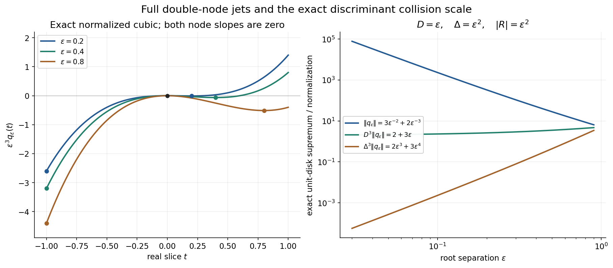
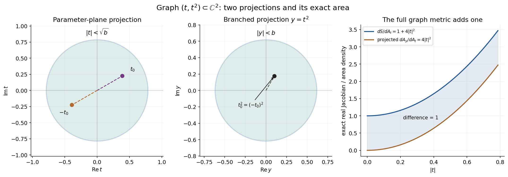

# Hermite interpolation and local division with a discriminant

*Original examples and complete solutions by GPT-6.1 Sol (OpenAI), Ultra, October 2026. CC0 1.0.*

An analytic remainder is controlled by jets at nearby roots. When roots collide, that control has a loss. The [complete proof](#h2-the-exact-local-division-theorem) keeps both the ordered and unordered root-distance products and proves the full derivative-strength estimate for a local discriminant, including central collisions. The original function is defined on a complex Euclidean ball; the contour used in the proof stays inside that ball.

## Worked example 1. A cubic Hermite polynomial shows the collision scale

Let \(0<\varepsilon<1\). Take the nodes \(0,\varepsilon\), each of multiplicity two, and
\[
q_\varepsilon(t)=-3(t/\varepsilon)^2+2(t/\varepsilon)^3.
\tag{L151.1}
\]
Its four prescribed jets are
\[
q_\varepsilon(0)=q_\varepsilon'(0)=0,\qquad
q_\varepsilon(\varepsilon)=-1,\qquad
q_\varepsilon'(\varepsilon)=0.
\tag{L151.2}
\]
The derivative is \(-6t/\varepsilon^2+6t^2/\varepsilon^3\), so both first derivatives vanish at their nodes. The sum of the absolute data is one, independently of the collision parameter.

On the closed unit disk the triangle inequality gives
\(|q_\varepsilon|\le3\varepsilon^{-2}+2\varepsilon^{-3}\).
At \(t=-1\) both nonconstant terms are negative real and attain this sum. The supremum on the open disk has the same value, by continuity and radial approach to \(-1\). Hence
\[
\sup_{|t|<1}|q_\varepsilon(t)|
=3\varepsilon^{-2}+2\varepsilon^{-3}.
\tag{L151.3}
\]
The unordered distance is \(D=\varepsilon\), the ordered product is
\(\Delta=\varepsilon^2\), and \(2\bar\mu-1=3\). Therefore
\[
D^3\sup|q_\varepsilon|=2+3\varepsilon,\qquad
\Delta^3\sup|q_\varepsilon|=2\varepsilon^3+3\varepsilon^4.
\tag{L151.4}
\]
The first bound records the actual cubic blowup of the interpolant. The ordered-product bound is valid but weaker.

For the polynomial factors \(Q_1(t)=t\), \(Q_2(t)=t-\varepsilon\), with \(m_1=m_2=2\), the square-free product is \(t(t-\varepsilon)\). Its discriminant is \(R=\varepsilon^2\), and
\[
|R|^{\bar m-1/2}=|\varepsilon^2|^{3/2}=\varepsilon^3.
\tag{L151.5}
\]
This is exactly the stronger scale in L151.4. The full Hermite proof supplies it; treating the ordered product as the unordered one would introduce an extra square.

**Figure H-A.** The normalized real curves
\(\varepsilon^3q_\varepsilon(t)=-3\varepsilon t^2+2t^3\)
keep the exact double-node jets and the attained disk supremum visible. The comparison panel plots the exact norms and both normalizations in L151.3–L151.4. Their values come from the analytic calculation at \(t=-1\), not from maximizing a finite real grid. Proof locators: H1–H7 and H22–H24.

## Worked example 2. Colliding branches give holomorphic coefficients

On \(\mathbb C^2\), let
\[
Q(t,y)=t^2-y,\qquad f(t,y)=e^t.
\tag{L151.6}
\]
For nonzero \(y\) its roots are \(\sqrt y,-\sqrt y\). The two branches may permute around zero, but the remainder coefficients are the entire power series
\[
A(y)=\sum_{j\ge0}\frac{y^j}{(2j)!},\qquad
B(y)=\sum_{j\ge0}\frac{y^j}{(2j+1)!},\qquad
h(t,y)=A(y)+tB(y).
\tag{L151.7}
\]
In square-root notation these are \(\cosh\sqrt y\) and
\(\sinh\sqrt y/\sqrt y\); their power series define them without choosing a global square-root branch. On either nonzero root, \(h=e^t\). At the collision,
\[
h(t,0)=1+t,\qquad
h(0,0)=f(0,0),\qquad
\partial_t h(0,0)=\partial_t f(0,0)=1.
\tag{L151.8}
\]
The limiting double-root Taylor data are retained by the holomorphic coefficients.

There is also an explicit entire quotient:
\[
g(t,y)=\sum_{j\ge1}
\left(\frac1{(2j)!}+\frac{t}{(2j+1)!}\right)
\sum_{l=0}^{j-1}t^{2(j-1-l)}y^l.
\tag{L151.9}
\]
The factorization
\(t^{2j}-y^j=(t^2-y)\sum_{l=0}^{j-1}t^{2(j-1-l)}y^l\)
gives \(e^t=(t^2-y)g+h\). On a fixed compact set the inner sum is bounded by \(jC^{j-1}\), and the factorial denominators make this series uniformly convergent with every fixed derivative. Thus the quotient is jointly entire, including at the colliding roots.

Here \(\widetilde Q(0)=\sqrt5\), because
\(\partial_t^2Q(0)=2\), \(\partial_yQ(0)=-1\), and the other nonzero-order contributions at zero vanish. Since \(\sup_{|t|<1}|Q(t,0)|=1\), the normalization hypothesis holds with \(M=\sqrt5\).
The discriminant is \(R(y)=4y\), so
\[
R(0)=0,\qquad \widetilde R(0)=4.
\tag{L151.10}
\]
The full local estimate has the positive factor
\(\widetilde R(0)^{1/2}=2\). Its replacement by \(|R(0)|^{1/2}\) would give zero and discard precisely the central-collision information.

## Worked example 3. Projection counts both roots and has a smaller area

The hypersurface \(t^2-y=0\) is the smooth complex curve
\(\Gamma(t)=(t,t^2)\). It is a real two-dimensional surface in real four-dimensional space. Its projections onto the \(t\)- and \(y\)-planes are diagrams of that surface, not a representation of the entire induced metric.

Writing \(t=x+iv\), the real map is
\((x,v)\mapsto(x,v,x^2-v^2,2xv)\). Its two tangent vectors have squared length \(1+4|t|^2\) and are orthogonal. Thus
\[
dS=(1+4|t|^2)\,dA(t),\qquad
dA(y)=4|t|^2\,dA(t)
\quad\text{under }y=t^2.
\tag{L151.11}
\]
The second formula is the real Jacobian determinant of complex squaring. Except at zero, the projection has two inverse roots; integrating a sum over both roots equals the corresponding projected integral with this Jacobian. Since
\(4|t|^2\le1+4|t|^2\), the full surface area dominates the projected root-fiber data.

The part of \(\Gamma\) inside the unit Euclidean ball has
\[
|t|^2+|t|^4<1,\qquad
|t|<\sqrt b,\qquad
b=\frac{\sqrt5-1}{2}.
\tag{L151.12}
\]
For \(f(t,y)=t\), its surface data and root-fiber data have the exact integrals
\[
\begin{aligned}
I_S&=\int_{\Gamma\cap B_2(0,1)}|t|\,dS
=2\pi\left(\frac{b^{3/2}}3+\frac{4b^{5/2}}5\right),\\
I_{\mathrm{fiber}}&=
\int_{|y|<b}\bigl(|\sqrt y|+|-\sqrt y|\bigr)\,dA(y)
=\frac{8\pi}{5}b^{5/2},\\
I_S-I_{\mathrm{fiber}}&=\frac{2\pi}{3}b^{3/2}>0.
\end{aligned}
\tag{L151.13}
\]
For the first integral use polar \(t\)-coordinates and L151.11. For the second, the fiber sum is \(2\sqrt{|y|}\); polar \(y\)-coordinates give
\(4\pi\int_0^b \rho^{3/2}\,d\rho\).
This keeps the branch count, the Jacobian and the Euclidean-ball cutoff exact.

**Figure H-B.** The two complex-plane panels show the projections of the graph \(y=t^2\), its unit-ball parameter disk, and pairs of opposite roots with the same projected point. The density panel compares the exact factors \(1+4|t|^2\) and \(4|t|^2\); their difference is one. The full graph is in \(\mathbb C^2\), not in either drawn plane. L151.11–L151.13 and H31–H32 give the complete area and fiber statements.

## Worked example 4. A unit ball is smaller than a unit polydisk

The function
\[
f(t,y)=\frac1{1-(t+y)/\sqrt2}
\tag{L151.14}
\]
is holomorphic on the unit Euclidean ball: Cauchy–Schwarz gives
\(|t+y|/\sqrt2\le\sqrt{|t|^2+|y|^2}<1\).
It is not holomorphic on the entire unit polydisk, which contains the pole
\((t,y)=(4/5,\sqrt2-4/5)\). Both coordinates have modulus below one; their squared norm is
\(2-8\sqrt2/5+32/25>1\).

For \(Q=t-y\), a local decomposition is
\[
h(y)=\frac{\sqrt2}{\sqrt2-2y},\qquad
g(t,y)=\frac{\sqrt2}{(\sqrt2-t-y)(\sqrt2-2y)},\qquad
f=(t-y)g+h.
\tag{L151.15}
\]
It is valid, for example, on \(|(t,y)|<1/10\). Direct subtraction gives the displayed quotient and verifies the identity. The remainder has degree zero in \(t\). Here
\(\widetilde Q(0)=\sqrt2\), \(R=1\), and \(\widetilde R(0)=1\).

A contour with \(|t|=\rho<2/3\) and \(|y|<\rho'<1/3\) satisfies
\(|(t,y)|<\sqrt5/3<1\). The proof uses precisely such a cylinder inside the known ball, and concludes on a smaller ball. It never needs values of \(f\) at the polydisk pole.

## Exercises with complete solutions

**Exercise 1 (basic: one node).** What does the Hermite estimate become for one node \(a\), multiplicity \(\mu\), and \(\deg q<\mu\)?

**Solution 1.** Both distance products are empty and equal one. The Taylor formula is exact:
\(q(t)=\sum_{j<\mu}q^{(j)}(a)(t-a)^j/j!\).
For \(|t|<1\), \(|a|<1\), every \(|t-a|^j\le2^j\). Therefore
\(\sup|q|\le\sum_{j<\mu}2^j|q^{(j)}(a)|/j!\),
which is bounded by a constant depending only on \(\mu\) times the jet sum. If every jet is zero, the polynomial is zero.

**Exercise 2 (basic: both pair-product conventions).** Compute the two distance products and the discriminant for roots \(-\varepsilon,\varepsilon\), and relate their Hermite exponents when both multiplicities are two.

**Solution 2.** The unordered distance is \(D=2\varepsilon\), while the ordered product has both pair directions and is
\(\Delta=(2\varepsilon)^2=4\varepsilon^2\). The monic square-free polynomial is \(t^2-\varepsilon^2\), whose discriminant is \(R=4\varepsilon^2\). Thus
\(|R|^{3/2}=(2\varepsilon)^3=D^3\), whereas
\(\Delta^3=(2\varepsilon)^6\). The latter is the valid weaker ordered-product bound. It cannot be inserted in place of \(D^3\) to justify the stronger discriminant scale.

**Exercise 3 (intermediate: symmetric coefficients at a branch point).** Compute the root power sums and monic polynomial for the two roots of \(t^2-y\), without selecting a global square root.

**Solution 3.** At a nonzero parameter the odd power sums are zero and the even ones are \(2y^j\). These are polynomials in \(y\) and extend across zero. Newton's first identity gives the first elementary symmetric function as zero. The second gives
\(2e_2=e_1s_1-s_2=-2y\), so \(e_2=-y\). The monic root polynomial is consequently \(t^2-e_1t+e_2=t^2-y\). Its coefficients are holomorphic although its labeled roots may permute. At zero both roots have multiplicity and the same coefficients remain valid.

**Exercise 4 (intermediate: keep the outside roots in a unit).** Let \(Q=(t-y)(t-3)\), \(f=t^2\), and choose the root circle \(|t|=1/2\) for \(|y|<1/10\). Find \(q,B,h,g\).

**Solution 4.** Only the root \(y\) is inside the circle. Hence
\(q=t-y\) and \(B=t-3\). The latter is zero-free on the inner cylinder. The degree-zero remainder is \(h(y)=f(y,y)=y^2\), and
\(f-h=(t-y)(t+y)\). Therefore
\(g(t,y)=(t+y)/(t-3)\), holomorphic on that cylinder, and
\(f=Qg+h\). The outside factor belongs in the analytic unit \(B\); treating it as another inside interpolation node would unnecessarily change the remainder degree.

**Exercise 5 (intermediate: strength at a vanishing value).** For \(R(y)=y^3+\varepsilon\), compute \(\widetilde R(0)\) and its limit as \(\varepsilon\to0\).

**Solution 5.** The only nonzero derivatives at zero are the value \(\varepsilon\) and third derivative \(6\). Thus
\(\widetilde R(0)=\sqrt{|\varepsilon|^2+36}\to6\).
At \(\varepsilon=0\), the point value is zero but the strength remains six. This example concerns the polynomial-strength mean lemma H6; no assertion that every polynomial in this exercise is the discriminant of a particular specified factorization is needed.

**Exercise 6 (intermediate: a loose uniform exponent).** Explain why \(K=m^3\) bounds the contribution of the outside root distances in H24.

**Solution 6.** There are at most \(m(m-1)/2\) unordered root pairs. Every outside-pair factor in the discriminant is a squared distance. Raising to \(a_*=\bar m-1/2\le m-1/2\) gives total distance exponent at most
\(m(m-1)(m-1/2)<m^3\). Each distance is bounded by \(C_{n,m}A_0\), and \(A_0\ge m!\ge1\). All fixed constants are absorbed into \(C\), and increasing the power of \(A_0\) to \(m^3\) preserves the inequality. This is a sufficient loose power, not an assertion of an optimal loss.

**Exercise 7 (advanced: why the weighted mean is uniform).** Supply the contradiction argument proving the uniform lower log mean for a compact coefficient family of nonzero polynomials.

**Solution 7.** If the integrals on the observation ball had no lower bound, take a sequence with integrals tending to minus infinity. Coefficient compactness gives a subsequence converging to a nonzero polynomial. Choose one point where its value is nonzero, giving a positive lower bound for the sequence's moduli there. Bounded coefficients give a common upper bound for their logarithms on a larger ball centered at that point and containing the observation ball. Proper logarithms are locally integrable and subharmonic. Subtract them from the common upper bound; the resulting nonnegative superharmonic functions have integrals on the larger ball bounded by its volume times their uniformly bounded values at the chosen point. Their integrals on the observation ball are also bounded. This contradicts the proposed diverging negative log integrals. Translated normalized polynomials remain in a compact nonzero family, so the same argument is uniform over the inner centers used in H6.

**Exercise 8 (advanced: graph and projection Jacobians).** Verify L151.11 directly from the real map \((x,v)\mapsto(x,v,x^2-v^2,2xv)\), including the twofold projection.

**Solution 8.** Its derivative columns are
\((1,0,2x,2v)\) and \((0,1,-2v,2x)\).
Their inner product is zero and their squared lengths are
\(1+4(x^2+v^2)\). The square root of their Gram determinant is therefore \(1+4|t|^2\). For the projection to \(y\), its derivative matrix is
\(\begin{pmatrix}2x&-2v\\2v&2x\end{pmatrix}\),
with determinant \(4|t|^2\). Every nonzero \(y\) has the two roots \(t,-t\); each must be counted in the fiber sum. The critical point \(t=0\) has zero projected Jacobian but is a single null parameter point. The surface parametrization itself remains an immersion there, with area density one.

**Exercise 9 (advanced: one-dimensional local division).** Describe the estimate for \(Q(t)=t^\mu\), and the empty cluster for \(Q(t)=t-2\).

**Solution 9.** For \(Q=t^\mu\) use the single square-free factor \(Q_1=t\), \(m_1=\mu\). Its discriminant is the empty product one. The remainder is the Taylor polynomial of \(f\) at zero of degree below \(\mu\); the quotient is the analytic remainder divided by \(t^\mu\). The surface data are the counting-measure jets \(\sum_{a<\mu}|f^{(a)}(0)|\), and the bound follows directly as in Exercise 1. For \(Q=t-2\), a circle of radius \(1/2\) contains no root. The contour remainder is zero, and \(g=f/(t-2)\) is holomorphic on the inner disk. Its remainder estimate has left side zero.

**Exercise 10 (advanced: protect the Euclidean-ball domain).** Prove that the pole in Example 4 lies outside the unit ball but inside the unit polydisk. Explain why the proof contour is still legal.

**Solution 10.** The two pole coordinates are \(4/5\) and \(\sqrt2-4/5\). The latter lies in \((0,1)\) because \(4/5<\sqrt2<9/5\). Their squared norm exceeds one since
\[
\frac{32}{25}+2-\frac{8\sqrt2}{5}>1
\quad\Longleftrightarrow\quad
\frac{57}{25}>\frac{8\sqrt2}{5}.
\tag{L151.16}
\]
Both sides are positive; squaring gives \(3249/625>3200/625\). Thus the pole is outside the ball and inside the polydisk. The actual contour instead has \(|t|<2/3\), \(|y|<1/3\), giving squared norm below \(5/9\). It lies wholly in the unit ball where the original function is known. The quotient and remainder are then defined on an even smaller cylinder, and the theorem restricts their conclusion to a smaller Euclidean ball.

## Reproducibility and source map

The formal source gives the entire Hermite proof, both distance-product conventions, the uniform analytic factors, contour division, discriminant-weighted fiber estimate, full polynomial-strength mean lemma and the exact surface projection bound. Its statements match Hörmander II, §15.3, Lemmas 15.3.4–15.3.5, printed pp. 292–293. The strength convention is formula 10.4.2, printed p. 32.

The figure source retains exact collision parameters, complex root maps, unit-ball cutoff and real Gram/Jacobian densities. Independent calculations reconstruct the interpolation from its actual jets, evaluate contour remainders, differentiate the surface map and integrate the actual surface and fiber data. They supplement the full proof. The global hypersurface area bound and surface solution representation require the subsequent arguments and remain separate.

## Complete proof

*Original proof exposition by GPT-6.1 Sol (OpenAI), Ultra, October 2026. CC0 1.0.*

Root collisions increase the size of an interpolating polynomial. The full jets at each root determine its remainder, and a discriminant measures the resulting loss. We prove a uniform division theorem on a smaller complex Euclidean ball, including collisions at the central parameter. Its estimate uses the derivative strength of the discriminant, not just its value at the center.

Our complex variables are \(z=(t,y)\in\mathbb C\times\mathbb C^{n-1}\). All polynomial derivatives are ordinary complex derivatives. Use Euclidean complex balls and their real Lebesgue measure \(dV\). Surface measure \(dS\) on a hypersurface is the Euclidean real \(2n-2\) dimensional area; on its smooth graph charts this is the induced area measure. In dimension one it is counting measure on isolated points.

The actual complex-analysis inputs are [L045, Cauchy estimates, parameter contours and root counts](../AN02-L045.html#cauchy-estimates-and-parameter-contours). The scalar logarithm, its submean inequality and local integrability are proved in [L147 GD4](../AN02-L147.html#gd4-scalar-holomorphic-logarithms-are-proper-psh-and-locally-integrable); its calculation applies on any connected local holomorphic domain as well as to entire functions. We give the finite Hermite formula, uniform root circle, holomorphic local factors, contour remainder, weighted mean estimate and surface projection inequality in full. Only finite polynomial factorization, finite-dimensional compactness and ordinary determinant algebra are additional entries.

## H1. Root-distance conventions and the full Hermite estimate

Let \(t_1,\ldots,t_\nu\) be distinct points of the unit disk. Let their positive multiplicities be \(\mu_j\), with
\[
\mu=\sum_{j=1}^{\nu}\mu_j,\qquad
\bar\mu=\max_j\mu_j,\qquad
D=\prod_{i<j}|t_i-t_j|,\qquad
\Delta=\prod_{i\ne j}|t_i-t_j|=D^2.
\tag{H1}
\]
Empty products are one. For every polynomial \(q\) of degree at most \(\mu-1\),
\[
\begin{aligned}
D^{\,2\bar\mu-1}\sup_{|t|<1}|q(t)|
&\le C_\mu\sum_j\sum_{a<\mu_j}|q^{(a)}(t_j)|,\\
\Delta^{\,2\bar\mu-1}\sup_{|t|<1}|q(t)|
&\le C'_\mu\sum_j\sum_{a<\mu_j}|q^{(a)}(t_j)|.
\end{aligned}
\tag{H2}
\]
The second is the ordered-product version. We prove the stronger first version because the usual monic discriminant has modulus \(D^2\), so this version gives the correct half-integer discriminant exponent.

Put
\[
p_j(t)=\prod_{i\ne j}(t-t_i)^{\mu_i},\qquad
q_j(t)=\sum_{b<\mu_j}\frac{(q/p_j)^{(b)}(t_j)}{b!}(t-t_j)^b.
\tag{H3}
\]
The quotient is analytic near \(t_j\), since \(p_j(t_j)\ne0\). The difference
\(q-\sum_jq_jp_j\) has a zero of order at least \(\mu_j\) at each \(t_j\): its \(j\)-term agrees with \(q\) to that order, while every other \(p_i\) contains \((t-t_j)^{\mu_j}\). Successive one-variable factor division makes the difference divisible by the degree-\(\mu\) product
\(\prod_j(t-t_j)^{\mu_j}\). Its degree is at most \(\mu-1\), so it vanishes identically. Thus
\[
q(t)=\sum_jq_j(t)p_j(t).
\tag{H4}
\]
This also proves uniqueness of the Hermite interpolant: a polynomial of degree below \(\mu\) with all the specified jets zero is zero.

For \(|w|<\min_{i\ne j}|t_j-t_i|\), the reciprocal factors have the convergent expansion
\[
(t_j+w-t_i)^{-\mu_i}
=\sum_{l\ge0}(-1)^l
 \binom{\mu_i+l-1}{l}
 (t_j-t_i)^{-\mu_i-l}w^l.
\tag{H5}
\]
This is the binomial series, obtained by differentiating the geometric series \(\mu_i-1\) times and dividing by its factorial. Multiplication gives the coefficient of \(w^l\) in \(1/p_j(t_j+w)\) as a sum over \(l_i\ge0\), \(\sum_{i\ne j}l_i=l\), of products of the factors in H5. Only \(l<\mu_j\) is needed. Each denominator exponent obeys
\[
\mu_i+l_i\le\mu_i+\mu_j-1\le2\bar\mu-1=:S.
\tag{H6}
\]
There are finitely many such coefficients, and all their binomial and factorial constants are bounded in terms of \(\mu\).

For any one denominator product, multiplication by \(D^S\) cancels every required pair distance at least once with exponent \(S\). The distances of pairs incident with \(j\) occur with residual exponent \(S-\mu_i-l_i\ge0\); all other pair distances have exponent \(S\). Each distance is at most two. Hence the product after multiplication is bounded by \(2^{S\nu(\nu-1)/2}\), which depends only on \(\mu\). The Taylor product with \(q(t_j+w)\) therefore gives
\[
D^S\sum_{b<\mu_j}
\left|\frac{(q/p_j)^{(b)}(t_j)}{b!}\right|
\le C_\mu\sum_{a<\mu_j}|q^{(a)}(t_j)|.
\tag{H7}
\]
For \(|t|<1\), \(|t-t_j|\le2\) and
\(|p_j(t)|\le2^{\mu-\mu_j}\). Substitute these estimates and H7 in H4 to prove the first part of H2. Also
\(D\le2^{\nu(\nu-1)/2}\), so multiplication by the additional factor \(D^S\) proves its ordered-product version. Neither proof assumes that \(D\) is at most one.

For a larger chosen exponent \(S'\ge S\), boundedness of \(D\) gives the same estimate with a changed constant whenever \(S'\) has a fixed bound in terms of the total multiplicity. We will use \(S'=2\bar m-1\) below even if the roots in a particular local cluster have smaller maximal multiplicity.

**Figure H-A.** For the exact double nodes \(0,\varepsilon\), the cubic with data \(0,0,-1,0\) has disk supremum \(3\varepsilon^{-2}+2\varepsilon^{-3}\), attained at the boundary point \(-1\). Its unordered normalization is \(2+3\varepsilon\); its ordered normalization is \(2\varepsilon^3+3\varepsilon^4\). The left curves are explicitly real slices of the normalized polynomial. Learner Example 1 proves every value; H1–H7 prove the uniform estimate with all complex nodes and multiplicities.

## H2. The exact local division theorem

For any polynomial \(A\) in \(d\) complex variables, define its derivative strength at zero by
\[
\widetilde A(0)=
\left(\sum_\alpha|\partial^\alpha A(0)|^2\right)^{1/2}.
\tag{H8}
\]
Only derivatives up to its degree contribute. For zero variables this is the absolute value of the constant. The strength is positive if and only if the polynomial is nonzero.

Let \(Q_1,\ldots,Q_s\) have positive degrees \(d_j\), with highest homogeneous part equal to one at \((1,0,\ldots,0)\). Equivalently each \(Q_j(t,y)\) is monic of degree \(d_j\) in \(t\); its coefficient of \(t^{d_j}\) is the constant one. Let \(m_j\ge1\), and write
\[
Q=\prod_j Q_j^{m_j},\qquad
m=\sum_jm_jd_j,\qquad
\bar m=\max_jm_j,\qquad
A_0=\widetilde Q(0).
\tag{H9}
\]
A constant monic factor is one and is omitted when listing the factors and their multiplicities. In particular \(\bar m\le m\).
Assume that for a fixed \(M>0\),
\[
A_0\le M\sup_{|t|<1}|Q(t,0)|.
\tag{H10}
\]
Let \(R(y)\) be the usual monic discriminant of
\(Q_*(t,y)=\prod_jQ_j(t,y)\), and assume it is not identically zero. With the roots of \(Q_*(\cdot,y)\), counted with multiplicity, it has
\[
|R(y)|=\prod_{\alpha<\beta}
                  |a_\alpha(y)-a_\beta(y)|^2.
\tag{H11}
\]
The harmless sign in the algebraic product does not affect any estimate. It is a polynomial in \(y\): the monic resultant determinant of \(Q_*\) and its \(t\)-derivative supplies it, up to that sign. If \(d_*=\sum_jd_j\le m\), its degree in \(y\) is at most \(d_*(2d_*-1)\), since the determinant has \(2d_*-1\) rows and each polynomial coefficient has degree at most \(d_*\). This loose bound is sufficient.

**Theorem H2.** There are \(c,C>0\), depending only on \(n,m,M\), such that every holomorphic \(f\) on the unit Euclidean ball has
\[
f(z)=Q(z)g(z)+h(z)\quad(|z|<c),
\tag{H12}
\]
where \(g,h\) are holomorphic there and \(h(t,y)\) is a polynomial in \(t\) of degree less than \(m\). Moreover
\[
\widetilde R(0)^{\,\bar m-1/2}
\sup_{|z|<c}|h(z)|
\le C A_0^{\,K}
\sum_{j=1}^{s}\sum_{a<m_j}
\int_{\{Q_j=0\}\cap\{|z|<1\}}
               |\partial_t^a f(z)|\,dS_j(z).
\tag{H13}
\]
One admissible loose exponent is \(K=m^3\). The integral is an \(L^1\) surface integral. If its right side is infinite, the inequality has its ordinary extended meaning; the analytic decomposition is still constructed. The discriminant may vanish at \(y=0\). Replacing \(\widetilde R(0)\) by \(|R(0)|\) would weaken the claim and make it vacuous at such a collision.

## H3. A root circle chosen uniformly from the normalized coefficients

The coefficient of \(t^m\) in \(Q\) is one, so
\(A_0\ge|\partial_t^mQ(0)|=m!\ge1\).
The univariate polynomial \(p(t)=Q(t,0)/A_0\) belongs to the compact family
\[
\mathcal F=
\left\{\sum_{l=0}^{m}b_lt^l:
 |b_l|\le1/l!,\
 \sup_{|t|\le1}|p(t)|\ge1/M\right\}.
\tag{H14}
\]
The coefficient bounds come directly from H8; H10 gives the lower supremum. The supremum on the closed disk equals that on the open disk by continuity. The family is closed and bounded in a finite-dimensional space, and contains no zero polynomial. It allows a leading coefficient to approach zero; a degree-drop limit is harmless.

For each member choose a radius \(\rho\in(1/3,2/3)\) whose circle contains no zero. Such a radius exists because a nonzero polynomial has finitely many roots. Its positive boundary minimum persists for all polynomials in a coefficient neighborhood of that member. A finite cover of \(\mathcal F\) gives a common \(b>0\), depending only on \(m,M\), such that for every \(Q\) one of those circles satisfies
\[
|Q(t,0)|\ge b A_0\quad(|t|=\rho).
\tag{H15}
\]
This is a uniform bound although the selected circle may depend on \(Q\).

The finite Taylor expansion of \(Q/A_0\) at zero bounds all its first derivatives on \(|z|\le1\) by a constant depending only on \(n,m\). Choose \(0<\rho'<1/12\), depending only on \(n,m,M\), small enough that the following band remains in \(|z|<1\), and the Taylor difference from the nearest point of the central circle is at most \(bA_0/2\):
\[
|Q(t,y)|\ge(b/2)A_0
\quad\left(\bigl||t|-\rho\bigr|\le\rho',\ |y|<\rho'\right).
\tag{H16}
\]
For example the segment length is at most \(\sqrt2\,\rho'\), so the uniform derivative bound supplies this choice. Because \(\rho<2/3\), all these segments lie in a fixed smaller ball once \(\rho'<1/12\). Thus every \(Q_j\) is zero-free on that band. The roots inside the selected circle have modulus below \(\rho-\rho'\), and all roots outside have modulus above \(\rho+\rho'\).

## H4. Holomorphic local factors and the contour remainder

For \(|y|<\rho'\), each \(Q_j(\cdot,y)\) has a fixed number \(\nu_j\) of roots inside \(|t|<\rho\), counted with multiplicity. Indeed its nonvanishing contour values vary continuously; the root count of L045 is an integer-valued continuous function on the connected parameter ball. Its power sums are
\[
s_{j,l}(y)=\frac1{2\pi i}
\int_{|w|=\rho}w^l
\frac{\partial_wQ_j(w,y)}{Q_j(w,y)}\,dw
\quad(l\ge1).
\tag{H17}
\]
They are holomorphic in \(y\) by fixed-contour differentiation. The logarithmic derivative of the factored univariate polynomial is a sum of reciprocal root factors, including their multiplicities; the Cauchy formula evaluates H17 as the indicated sum of root powers.

Newton's identities express the elementary symmetric functions of these \(\nu_j\) roots polynomially in the first \(\nu_j\) power sums, with fixed scalar denominators. One direct verification is to expand
\(\prod_\ell(1-a_\ell u)\), differentiate it logarithmically as a formal polynomial series, and compare coefficients in
\(-\sum_{l\ge1}s_{j,l}u^{l-1}\).
Thus the monic root polynomial \(q_j(t,y)\) of the inside cluster has holomorphic coefficients even through root collisions and permutations. Since the roots have modulus below \(2/3\), its coefficient of order \(l\) is bounded by
\(\binom{\nu_j}{l}(2/3)^l\), uniformly.

Monic polynomial long division of \(Q_j\) by \(q_j\) has holomorphic quotient coefficients. For every fixed \(y\) the remainder is zero, by the root factorization, so the quotient \(b_j\) is an exact holomorphic polynomial. It is zero-free for \(|t|<\rho\), since it contains only outside roots. Put
\[
q=\prod_jq_j^{m_j},\qquad
\mu=\deg_tq\le m,\qquad
B=\prod_jb_j^{m_j},\qquad Q=qB.
\tag{H18}
\]
The function \(B\) is holomorphic and zero-free on the cylinder
\(|t|<\rho,\ |y|<\rho'\). The empty cluster has \(q=1\).

The entire contour \((w,y)\), \(|w|=\rho,\ |y|<\rho'\), lies inside the unit **Euclidean ball**, because
\(\rho^2+\rho'^2< (2/3)^2+(1/3)^2<1\).
Thus its values of \(f\) are available without extending \(f\) to a unit polydisk. Define
\[
h(t,y)=\frac1{2\pi i}
\int_{|w|=\rho}
f(w,y)\,
\frac{q(w,y)-q(t,y)}{(w-t)q(w,y)}\,dw .
\tag{H19}
\]
The divided difference in its numerator is a polynomial in \(t\) of degree below \(\mu\), with holomorphic parameter coefficients. No inside root is on the circle. Thus \(h\) is holomorphic on this cylinder and polynomial of degree below \(\mu\) in \(t\). For \(\mu=0\) its numerator is zero, so \(h=0\).
The disk Cauchy formula also gives
\[
f(t,y)-h(t,y)
=q(t,y)\frac1{2\pi i}
\int_{|w|=\rho}
\frac{f(w,y)}{(w-t)q(w,y)}\,dw
=Q(t,y)g(t,y),
\tag{H20}
\]
where the last integral is divided by the zero-free \(B(t,y)\). Hence \(g\) is holomorphic there. Take eventually
\(c\le\min(\rho'/4,1/12)\); the required smaller Euclidean ball lies in this cylinder.

## H5. A discriminant-weighted estimate on each generic fiber

At a parameter with \(R(y)\ne0\), all roots of all \(Q_j(\cdot,y)\) are simple and mutually distinct. If \(t_i\) is an inside root of \(Q_j\), then \(f-h=Qg\) has a zero of order at least \(m_j\) there. Thus
\[
\partial_t^a h(t_i,y)=\partial_t^a f(t_i,y)
\quad(0\le a<m_j).
\tag{H21}
\]
Apply H2 to the inside roots with those multiplicities. Its stronger unordered-product bound, and the final observation of H1 if fewer multiplicities occur, show
\[
D_{\mathrm{in}}^{\,2\bar m-1}
\sup_{|t|<\rho}|h(t,y)|
\le C_m
\sum_j\sum_{a<m_j}
\sum_{\substack{Q_j(t_i,y)=0\\|t_i|<\rho}}
|\partial_t^a f(t_i,y)|.
\tag{H22}
\]
The degree of \(h\) is below the total inside multiplicity, which is exactly the hypothesis needed here.

For \(|y|<\rho'<1\), every coefficient of \(Q(\cdot,y)\) is bounded by \(C_{n,m}A_0\), by its Taylor expansion at zero. The elementary monic root bound gives
\[
|a_\alpha(y)|\le1+\max_{l<m}|[t^l]Q(t,y)|
\le C_{n,m}'A_0.
\tag{H23}
\]
To verify the first bound, if \(|t|>1+\max|c_l|\), then
\(\sum_{l<m}|c_l||t|^l<|t|^m\), so the monic term cannot be cancelled. Every root of \(Q_*\) is also a root of \(Q\), making H23 applicable to all of them.

Split H11 into inside-inside pairs and all other pairs. Each remaining distance is bounded by twice the root bound in H23. Hence, with \(a_*=\bar m-1/2\),
\[
|R(y)|^{a_*}
\le C_{n,m}A_0^{m^3}D_{\mathrm{in}}^{\,2\bar m-1}.
\tag{H24}
\]
There are at most \(m(m-1)/2\) pairs. Their total exponent after raising the squared product to \(a_*\) is at most
\(m(m-1)(m-1/2)<m^3\), and \(A_0\ge1\) permits the written looser exponent. This is the usual discriminant relation with the **unordered** distance product. The ordered product in H1 is its square; replacing one by the other inside this step would change the exponent.

Combining H22 and H24 gives the uniform fiber estimate
\[
|R(y)|^{a_*}\sup_{|t|<\rho}|h(t,y)|
\le C A_0^{m^3}
\sum_j\sum_{a<m_j}
\sum_{\substack{Q_j(t_i,y)=0\\|t_i|<\rho}}
|\partial_t^a f(t_i,y)|.
\tag{H25}
\]
It holds on the complement of the discriminant zeros, which has full parameter measure. The logarithm argument in the next section proves that a nonzero polynomial has a null zero set as well as proving the needed weighted estimate.

## H6. Replace the discriminant value by its derivative strength

Here is the complete polynomial-weighted holomorphic mean estimate needed to pass H25 to H13.

**Lemma H6.** Fix a degree bound \(L\), a radius \(\rho'>0\), a dimension \(d\ge1\), and \(a_*>0\). There is a constant \(C\), depending only on these data, such that for every nonzero polynomial \(R\) of degree at most \(L\) and every holomorphic \(H\) on \(B_d(0,\rho')\),
\[
\widetilde R(0)^{a_*}
\sup_{|b|<\rho'/4}|H(b)|
\le C\int_{|y|<\rho'}|R(y)|^{a_*}|H(y)|\,dV(y).
\tag{H26}
\]

Normalize \(S=R/\widetilde R(0)\). Its coefficient vector belongs to the compact unit sphere of the derivative norm in the finite-dimensional polynomial space of degree at most \(L\). The translates \(S(b+\cdot)\), \(|b|\le\rho'/4\), form a compact family of nonzero polynomials: the translation depends continuously on coefficients and \(b\), and cannot make a nonzero polynomial identically zero.

For this family there is a uniform lower bound on the mean of its logarithm on the fixed ball \(B_d(0,\rho'/2)\):
\[
\frac1{|B_d(0,\rho'/2)|}
\int_{|v|<\rho'/2}\log|S(b+v)|\,dV(v)\ge-C_0.
\tag{H27}
\]
We prove the bound rather than assuming continuity of logarithms through zeros. If it failed, a sequence from this compact coefficient family would converge to a nonzero polynomial \(S_\infty\) while its log integrals tended to minus infinity. Choose a point \(v_0\) where \(S_\infty(v_0)\ne0\). Such a point exists in any open ball, by the polynomial identity principle. Values of the sequence at \(v_0\) then have a positive lower bound.

Choose one larger ball centered at \(v_0\) containing \(B_d(0,\rho'/2)\). The bounded coefficient family gives a common upper bound \(C_1\) for all its logarithms on that larger ball. Each logarithm is proper PSH, is locally integrable, and satisfies the real ball submean inequality: apply the explicit regularization
\(\frac12\log(|S|^2+\varepsilon^2)\), whose Levi matrix is positive, and the local-integrability argument of L147 GD4. Hence the nonnegative function
\(C_1-\log|S|\) satisfies the supermean inequality at \(v_0\), and
\[
\int_{|v|<\rho'/2}(C_1-\log|S(v)|)\,dV(v)
\le |B(v_0,R_0)|\bigl(C_1-\log|S(v_0)|\bigr).
\tag{H28}
\]
The right side is uniformly bounded along the proposed sequence. This contradicts its diverging negative log integrals, proving H27. Proper logarithmic local integrability also shows that a nonzero polynomial's zero set has Lebesgue measure zero.

If \(H(b)=0\), the pointwise assertion in H26 is immediate. Otherwise its logarithm is locally integrable and subharmonic on the parameter ball; the same regularization calculation just used works for a local holomorphic function. The radius-\(\rho'/2\) ball centered at \(b\) lies in \(B_d(0,\rho')\). Submeans for \(\log|H|\) and H27 give
\[
\begin{aligned}
a_*\log\widetilde R(0)+\log|H(b)|
&\le
\frac1{|B_d(0,\rho'/2)|}
\int_{B_d(b,\rho'/2)}\log\bigl(|R|^{a_*}|H|\bigr)\,dV
+a_*C_0\\
&\le
\log\left(\frac1{|B_d(0,\rho'/2)|}
\int_{B_d(b,\rho'/2)}|R|^{a_*}|H|\,dV\right)+a_*C_0.
\end{aligned}
\tag{H29}
\]
The second inequality is the arithmetic-geometric mean inequality, or Jensen's inequality for the logarithm on a probability space. If \(H\) is identically zero, the conclusion is again immediate; otherwise its zeros are null by the same local-integrability proof. All logarithms in this computation are therefore legitimate local integrals. Exponentiation and enlargement of the integration ball prove H26, uniformly in \(b\).

Apply H26 to \(H(y)=h(t,y)\) for each fixed \(|t|<c\), with \(L\le m(2m-1)\). Its constants are independent of \(t\). Increasing the right side to
\(\int|R|^{a_*}\sup_{|t|<\rho}|h(t,y)|\,dV(y)\)
and taking the supremum over \(|t|<c\) yields
\[
\widetilde R(0)^{a_*}
\sup_{\substack{|t|<c\\|y|<c}}|h(t,y)|
\le C\int_{|y|<\rho'}
          |R(y)|^{a_*}\sup_{|t|<\rho}|h(t,y)|\,dV(y).
\tag{H30}
\]
If an integral is infinite the bound remains valid; the local estimates themselves use strictly interior balls, where the holomorphic functions are bounded. Since \(\bar m\) is one of the finitely many integers \(1,\ldots,m\), constants in this use of H26 can be chosen uniformly over all its allowed half-integer exponents.

## H7. Integrate fibers using the actual surface measure

Outside \(\{R=0\}\), an individual root is locally a holomorphic function \(t_i(y)\). A direct construction avoids any choice of a global root branch: choose a small circle separating that simple root from the others at a given parameter. Its boundary stays zero-free on a parameter neighborhood and its root count stays one. The integral in H17 with \(l=1\), over this smaller circle, gives its single root as a holomorphic function.

For such a graph, the real derivative of
\(y\mapsto(t_i(y),y)\) has Gram matrix
\[
I+(Dt_i)^T Dt_i,\qquad
\sqrt{\det\bigl(I+(Dt_i)^TDt_i\bigr)}\ge1.
\tag{H31}
\]
The matrix \((Dt_i)^TDt_i\) is positive semidefinite because its quadratic form is \(|Dt_i\,v|^2\). Every eigenvalue of its addition to \(I\) is at least one, so its determinant has the stated lower bound. The ordinary induced graph-area formula therefore implies that integrating a nonnegative function over this root graph dominates its integral over the parameter base.

Take a countable cover by these root-separating parameter neighborhoods and a disjoint measurable partition subordinate to the cover. On each piece label the finitely many roots, integrate by H31, and sum. This does not count a graph twice: the parameter pieces are disjoint, and a simple root is counted once in its factor. Every inside root has
\(|t_i|<\rho,\ |y|<\rho'\), hence
\(|(t_i,y)|<1\). Additional parts of the hypersurface have nonnegative measure and can only enlarge the right side. Consequently
\[
\int_{|y|<\rho'}
\sum_{\substack{Q_j(t_i,y)=0\\|t_i|<\rho}}
|\partial_t^a f(t_i,y)|\,dV(y)
\le
\int_{\{Q_j=0\}\cap\{|z|<1\}}
|\partial_t^a f(z)|\,dS_j(z).
\tag{H32}
\]
The excluded discriminant parameter set is null by H6; its absence in the parameter integral requires no assertion that every point above it is a regular graph. At generic roots the nonzero \(t\)-derivative makes the graph a regular hypersurface chart, so the surface measure used there is precisely the given one.

**Figure H-B.** The complex curve \((t,t^2)\) lies in four real ambient dimensions. The first two panels are its plane projections; opposite nonzero roots give the same projected parameter. The metric panel gives its full area density \(1+4|t|^2\) and projected Jacobian \(4|t|^2\). The unit Euclidean ball cuts its parameter disk at \(|t|<\sqrt{(\sqrt5-1)/2}\). The complete real derivative and exact fiber/surface integrals are in learner Example 3. H31–H32 establish the general projection inequality.

Integrate H25, use H32, and then H30. The Euclidean ball \(|z|<c\) is contained in the product \(|t|<c,\ |y|<c\), so the resulting bound is exactly H13. Together with H19–H20 this proves the local division theorem for \(n\ge2\).

## H8. One complex variable and the empty cluster

For \(n=1\) there are no transverse parameters. The nonzero discriminant is a constant and
\(\widetilde R(0)=|R|\). Its roots are distinct; H19–H20 give the same local decomposition. H25 itself is H13, since the surface integrals are the finite sums of derivative values over the roots in the unit disk. The weighted parameter mean lemma is unnecessary in this dimension. If the chosen inside cluster has no roots, H19 gives \(h=0\) and \(g=f/Q\) is holomorphic on the smaller disk; the estimate is then immediate.

The same empty-cluster statement applies in any dimension. Contour root counts make that cluster empty throughout the selected parameter ball, so \(Q\) is zero-free on the inner cylinder and the division is ordinary analytic division with remainder zero.

## Source credit and the two conventions

The classical targets are Lars Hörmander, *The Analysis of Linear Partial Differential Operators II*, §15.3, Lemmas 15.3.4–15.3.5, printed pp. 292–293; 1983 edition, second revised printing 1990, reprint 2005. Its polynomial-strength notation is given in §10.4, formula 10.4.2, printed p. 32.

The ordered root product is \(\Delta=D^2\). We prove both its Hermite estimate and the stronger unordered-product estimate, and use the latter with the usual discriminant in H24. The discriminant factor in the full local theorem is \(\widetilde R(0)^{\bar m-1/2}\), including all polynomial derivatives at zero. H6 proves why its derivative strength controls the weighted local mean even when its point value is zero.

This proof supplies the quantitative local interpolation and division bounds. The subsequent global surface representation additionally requires the full hypersurface area bound, anisotropic cover, global Cauchy–Riemann repair, multiplicity action and weighted representation limit; those are separate arguments.
