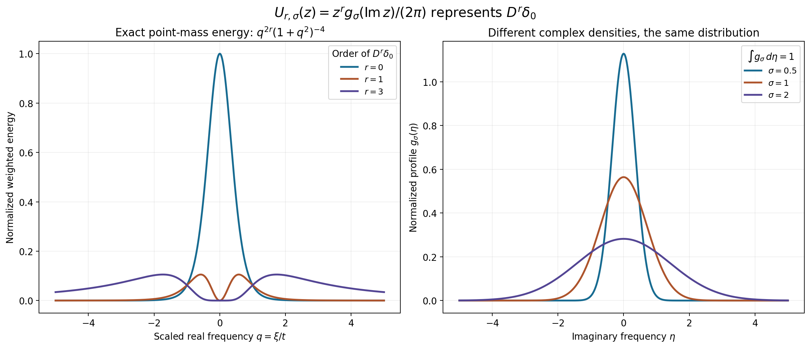
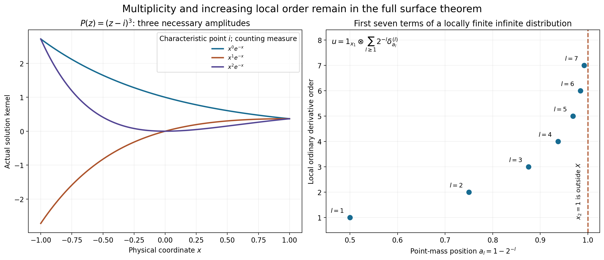

# Integral representations for arbitrary distributions

*Original learner exposition by GPT-6.1 Sol (OpenAI), Ultra, October 2026. CC0 1.0.*

A distribution may require increasingly many derivatives to test it near the edge of its domain. The representation must accommodate those orders. We construct one complex-frequency integral for every distribution and one actual characteristic-surface integral for every homogeneous distributional solution.

The [complete proof](#complete-proof) solves both unnumbered exercises on printed page300 of Hörmander's Chapter15. It includes the finite-envelope smoothing argument needed to test the repaired transforms. The same formulas include all repeated-factor polynomial amplitudes and use the exact Euclidean surface measure.

## The two formulas and their meanings

Let \(X\subset\mathbb R^n\) be open and convex, \(D=-i\partial\), and
\(F_v(z)=\int v(x)e^{-ix\cdot z}\,dx\).
For every \(u\in\mathcal D'(X)\), there are a strict PSH weight \(\phi\) and a measurable whole-space density with
\[
\int_{\mathbb C^n}|U(z)|^2e^{2\phi(-z)}dV(z)<\infty,\qquad
u(v)=\int_{\mathbb C^n}U(z)F_v(-z)dV(z)
\quad(v\in C_c^\infty(X)).
\tag{L155.1}
\]
The tested integral converges absolutely. It describes the distribution even when the untested exponential integral is not an ordinary function.

For a nonconstant polynomial \(P=c\prod P_\ell^{m_\ell}\), a direction \(P_m(\tau)\ne0\), and \(P(D)u=0\), put \(N_\ell=\{P_\ell=0\}\). The second formula is
\[
u(x)=\sum_{\ell}\sum_{a=0}^{m_\ell-1}
 (x\cdot\tau)^a\int_{N_\ell}U_\ell^a(z)e^{ix\cdot z}\,dS_\ell(z)
\quad\text{in }\mathcal D'(X).
\tag{L155.2}
\]
Surface measure is Euclidean real \(2n-2\) area on the regular reduced charts; it is counting measure in dimension one. The norm is the sum of
\(\int|U_\ell^a|^2e^{2\phi(-z)}(1+|z|^2)^{-K}dS_\ell\).
Every compact smooth test yields an absolutely convergent sum of integrals. The polynomial loss \(K\) is the explicit degree-and-dimension quantity [AR24](#eq-AR24).

The weight satisfies three properties: for every compact convex \(K\Subset X\), \(e^{-\phi(z)}\le C_K(1+|z|)^{N_K}e^{-H_K(\operatorname{Im}z)}\); its gradient is bounded by \(C+\log(1+|\operatorname{Im}z|)\); and its Levi matrix is at least \(c(1+|\operatorname{Im}z|^2)^{-3/4}I\). The exponent \(-3/4\) is the exact current-source exponent.

## How the arbitrary-order step works

For a given distribution, [L153](../AN02-L153.html#tp1-the-four-exact-neighborhood-descriptions) describes a small neighborhood using finitely many derivative bounds on each entire exterior \(X\setminus K_j\). The required order changes with \(j\). We enlarge that order to include the next region's needs and leave a factor-eight margin in its threshold.

The successive Fourier-envelope powers incorporate each of these finite requirements. Earlier carrier terms are suppressed by a logarithmic contour with a strict separation gap; later terms receive sufficiently high real-frequency decay. Each finite strict weight has a finite envelope. Its repaired inverse transform is globally continuous and has all the required derivatives on the relevant exterior neighborhoods.

Physical mollifiers therefore converge in the finitely many derivative orders relevant to that compact carrier. The mollified transform lies in the original distribution's small neighborhood. Entire division makes the complementary mollified term a legitimate equation test. This yields a uniform surface-jet bound, and then a Hilbert representing vector supplies the densities. [AR2–AR3](#ar2-finite-envelopes-that-survive-physical-smoothing) prove every step, including identification of higher exterior derivatives by tested contours.

## Worked example 1: orders that grow toward the boundary

On \(X=(-1,1)^2\), let
\[
a_l=1-2^{-l},\qquad
u=1_{x_1}\otimes\sum_{l\ge1}2^{-l}\delta^{(l)}_{a_l}(x_2).
\tag{L155.3}
\]
Here \(1_{x_1}\) is the constant distribution in the first coordinate, and \(\delta^{(l)}\) denotes the ordinary \(\partial_{x_2}\) derivative of a point mass. Thus
\[
u(v)=\sum_{l\ge1}2^{-l}(-1)^l
 \int_{-1}^1\partial_{x_2}^l v(x_1,a_l)\,dx_1.
\tag{L155.4}
\]
Every compact support is separated from the boundary \(x_2=1\), so this sum has only finitely many active terms on each test stage. Their derivative suprema bound the action, proving that this is a distribution. It satisfies \(D_1u=0\), since integration of a compact first-coordinate derivative is zero.

Its local orders are unbounded. Isolate one \(a_l\) by a cutoff equal to one near that point and supported away from the others. A shrinking test with an \(l\)-th derivative of fixed nonzero size, and lower derivatives tending to zero, shows order at least \(l\). The nonzero coefficient \(2^{-l}\) does not change this order.

There is no single global moderate weight placing this \(u\) in a local \(B_{2,w}\) class. Such a weight has a lower polynomial bound \(w(\xi)\ge c\langle\xi\rangle^{-N}\), so that class lies in \(H^{-N}_{\rm loc}\). After the isolating cutoff, the Fourier transform is a nonzero rapidly decreasing first-coordinate factor times \(\xi_2^l e^{-ia_l\xi_2}\). On a bounded \(\xi_1\) interval where the first factor is bounded below, its \(H^{-N}\) integral contains \(\int_1^\infty \xi_2^{2l-2N}\,d\xi_2\), which diverges when \(N\le l+1/2\). Arbitrarily large \(l\) exclude every fixed \(N\). The general surface theorem nevertheless applies to \(P(z)=z_1\).

## Worked example 2: an explicit whole-complex density for a point mass

In dimension one take \(a=2\), \(t=4096\), \(R=t^{-1/2}=1/64\), and \(X=(-R,R)\). Set
\[
p_t(\eta)=\frac{\sqrt{t^2+\eta^2}}{\sqrt t}
 -(t^2+\eta^2)^{1/4},\qquad
\phi(\xi+i\eta)=p_t(\eta)-2\log(t^2+\xi^2+\eta^2).
\tag{L155.5}
\]
The exact seed calculation in [L153 TP6](../AN02-L153.html#tp6-full-seed-bounds-and-their-uniform-active-region) gives its strict Levi bound because \(\sqrt t=32a\). Its gradient is bounded. For a compact \(K\Subset X\), let \(r_K=\max_{x\in K}|x|<R\). The inequality
\(p_t(\eta)\ge R|\eta|-\sqrt{t+|\eta|}\)
shows \(p_t(\eta)\ge r_K|\eta|-C_K\); a positive linear gap absorbs the square root. Hence the growth part of the weight condition holds with polynomial order four.

For \(0\le r\le3\), the explicit density
\[
U_r(z)=\frac{z^r}{2\pi\sqrt\pi}e^{-(\operatorname{Im}z)^2}
\tag{L155.6}
\]
represents \(D^r\delta_0\), where \(D=-i\partial\):
\[
\int_{\mathbb C}U_r(z)F_v(-z)\,d\xi\,d\eta
=(-1)^r(D^rv)(0)=(D^r\delta_0)(v).
\tag{L155.7}
\]
To verify it, fix \(\eta\). Substitute \(w=-z\) in the real-frequency integral and shift its horizontal line to the real axis. The complete fixed-height rectangle argument has vanishing boundary: \(F_v\) has arbitrary real-frequency decay on that bounded imaginary strip. Fourier inversion then gives \(2\pi(-1)^r(D^rv)(0)\). Integration of \(e^{-\eta^2}/\sqrt\pi\) gives one. Fubini is legitimate for these compact tests: their entire decay supplies an integrable real-frequency majorant with only polynomial and \(e^{r_K|\eta|}\) imaginary growth, dominated by the Gaussian.

The weighted norm also converges. Put \(M=\sqrt{t^2+\eta^2}\). Since \(e^{2\phi}=e^{2p_t}(M^2+\xi^2)^{-4}\), the real integral is a finite binomial sum of
\[
\begin{aligned}
\int_{\mathbb R}(M^2+\xi^2)^{-4}d\xi&=5\pi/(16M^7),\\
\int_{\mathbb R}\xi^2(M^2+\xi^2)^{-4}d\xi&=\pi/(16M^5),\\
\int_{\mathbb R}\xi^4(M^2+\xi^2)^{-4}d\xi&=\pi/(16M^3),\\
\int_{\mathbb R}\xi^6(M^2+\xi^2)^{-4}d\xi&=5\pi/(16M).
\end{aligned}
\tag{L155.8}
\]
These identities are proved in solution7 below. The remaining \(\eta\) integrand contains \(e^{-2\eta^2+2p_t(\eta)}\) times a polynomial factor; its Gaussian decay dominates the at-most-linear \(p_t\). Thus the actual finite weight and density satisfy the whole-complex theorem's norm.

The left panel shows the exact \(\eta=0\) energy shapes \(q^{2r}(1+q^2)^{-4}\), \(q=\xi/t\), after removing the stated common positive constants and powers of \(t\). The right shows normalized profiles of widths \(1/2,1,2\). Each profile yields the same point-mass formula. Coordinates, normalization, norm and proof locations are recorded in [geometry.json](../reproduce/L155/figures/geometry.json); the [figure source](../reproduce/L155/make_figures178.py) reproduces both PNG and SVG.

## Worked example 3: a genuinely distributional surface integral

In \(\mathbb R^2\), take \(P(z)=z_1\), \(\tau=(1,0)\), and \(X=B(0,1/64)\). Its characteristic hypersurface is the complex plane \(N=\{z_1=0\}\). The coordinates \(z_2=\xi_2+i\eta_2\) identify its exact Euclidean area with \(d\xi_2\,d\eta_2\), without a metric or Jacobian factor.

On this plane use
\[
U^0(0,z_2)=\frac{z_2^3}{2\pi\sqrt\pi}e^{-\eta_2^2}.
\tag{L155.9}
\]
Then
\[
1_{x_1}\otimes D_2^3\delta_0(x_2)
=\int_N U^0(z)e^{ix\cdot z}\,dS(z)
\quad\text{weakly on }X.
\tag{L155.10}
\]
Indeed \(F_v(0,-z_2)\) is the one-dimensional transform of the compact marginal \(\int v(x_1,x_2)dx_1\); example2 supplies its exact pairing. The result solves \(D_1u=0\) and is not an ordinary continuous function.

The radial two-dimensional version of L155.5 has the same strict Levi seed bound and the same growth condition on this ball. Restricted to \(N\), the norm in AR22 includes the already-integrable example2 norm, multiplied by \(W^{-K}\le1\). All densities and the surface measure are actual ones in the theorem.

## Worked example 4: all jets at a repeated characteristic point

Take \(P(z)=(z-i)^3\) and \(\tau=1\) on any open interval. The characteristic set is the single point \(\{i\}\), with counting measure. The formula must retain three amplitudes:
\[
u(x)=(c_0+c_1x+c_2x^2)e^{-x}.
\tag{L155.11}
\]
These are all distributional solutions. Multiplication by \(e^x\) transforms \((D-i)^3u=0\) into \(D^3(e^xu)=0\). A distribution with zero first derivative is constant: every zero-integral compact test is the derivative of a compact smooth primitive, so it is annihilated; subtract its integral times one fixed unit-integral test to identify the remaining constant action. Apply this result successively to the second derivative, first derivative and function of \(e^xu\), subtracting their polynomial primitives. The result is a polynomial of degree at most two.

Thus \(U^0(i)=c_0\), \(U^1(i)=c_1\), \(U^2(i)=c_2\) give the actual surface densities. Their weighted norm is a finite sum at one point. Omitting the highest jet loses the solution \(x^2e^{-x}\).

The left panel displays the three exact kernels, with their common characteristic frequency \(i\) and counting measure. The right displays the first seven \((a_l,l)\) pairs from example1; the dashed edge \(x_2=1\) lies outside the open domain. The infinite locally finite distribution is defined by L155.3–L155.4, not by the seven plotted samples.

## Exercises with complete solutions

1. **Show why the whole-space formula defines a distribution for any density with the stated norm.** Cauchy–Schwarz bounds its absolute tested integral by \(\|U\|_{e^{2\phi(-z)}}q_\phi(v)\). On a fixed compact support, integration by parts gives whole-complex decay of any desired integer power. Choose that power larger than the growth weight's \(N_K+n\), so the squared complex-volume integral is bounded by a finite derivative seminorm squared. This proves continuity on each support stage, which is the topology of \(\mathcal D(X)\); linearity is the complex-linear integral. No pointwise integral is needed.

2. **Determine the Fourier reflection and the density obtained from a Hilbert vector.** With inner product linear in the first entry, the representing identity is \(\int F_v(s)\overline{g(s)}e^{-2\phi(s)}dV(s)\). Set \(s=-z\), which preserves Euclidean volume. The physical kernel is tested as \(v(e^{ix\cdot z})=F_v(-z)\), so \(U(z)=\overline{g(-z)}e^{-2\phi(-z)}\). Its norm is \(\int|g(-z)|^2e^{-2\phi(-z)}dV(z)=\|g\|^2\). This checks the conjugation, sign and norm.

3. **Explain the extra derivative order in \(A_j=\max_{l\le j+1}L_l\).** To mollify on \(X\setminus K_j\), values in a small surrounding neighborhood also matter. For \(j\ge3\), that neighborhood is separated from \(K_{j-1}\); the finite-envelope proof gives regularity through \(A_{j-1}\ge L_j\) there. Uniform continuity on its compact intersection with the fixed carrier proves derivative convergence through \(L_j\). Orders \(j=0,1,2\) are covered by the global real inversion powers. A carrier in \(\operatorname{int}K_{J+2}\) leaves only finitely many \(j\)'s to check, and the factor-eight margin gives every AR8 bound after a sufficiently small radius is chosen.

4. **Verify the logarithmic contour's exact divergence identity.** Let \(\ell=\log(2+|\xi|^2)\), \(z_s=\xi+isR\eta\ell\), and \(J_s=1+isR\eta\cdot\nabla\ell\). For entire \(H\), direct differentiation gives
\[
\partial_s[H(z_s)J_s]
=\sum_{l=1}^n\partial_{\xi_l}[iR\eta_l\ell H(z_s)].
\tag{L155.12}
\]
The right side expands to \(iR(\eta\cdot\nabla\ell)H+iR\ell(\eta\cdot\partial_zH)J_s\), exactly the left side. For \(H=F F_\chi(-z)\), the test transform supplies arbitrary decay, while the finite carrier supplies only a fixed logarithmic-contour growth power. Choose the test-decay power beyond that growth and the boundary face dimension. Cube boundary flux then tends to zero, proving the tested contour equality.

5. **Give a compact inverse transform for which a high-order real-plane derivative integral is not absolute.** Let \(b(x)=(1-|x|)_+\), and \(f=b*b*b\). Direct integration gives \(F_b(z)=2(1-\cos z)/z^2\), with its removable value at zero; hence
\[
F_f(z)=\left(\frac{2(1-\cos z)}{z^2}\right)^3,\qquad
\xi^6F_f(\xi)=8(1-\cos\xi)^3.
\tag{L155.13}
\]
The latter nonnegative periodic function has a positive integral on every period, so its real absolute integral diverges. Yet \(f\) is supported in \([-3,3]\) and equals zero smoothly outside this carrier. Its sixth derivative is a finite sum of point masses because \(b''\) is such a sum; its fifth derivative has jumps and \(f\) is \(C^4\). The high exterior derivatives are therefore identified by tested contours, not by an unjustified sixth-order real integral.

6. **Show exactly where the homogeneous equation is used after repair.** Entire division gives \(v_{2,J}=cP(-D)a_J\) with a compact carrier. Mollification gives a legitimate smooth compact \(a_J*\rho_\epsilon\). Therefore \(u(v*\rho_\epsilon)=u(v_{1,J}*\rho_\epsilon)+c\,u(P(-D)(a_J*\rho_\epsilon))=u(v_{1,J}*\rho_\epsilon)\). The second term is zero by \(P(D)u=0\). The finite-envelope lemma bounds the remaining term; smooth \(v*\rho_\epsilon\to v\) gives the required limit. It never pairs two rough distributions.

7. **Prove all four real-frequency norm integrals in L155.8.** Let \(I_p(M)=\int(M^2+\xi^2)^{-p}d\xi\). The arctangent primitive gives \(I_1=\pi/M\). Integrate the derivative of \(\xi(M^2+\xi^2)^{-(p-1)}\); its boundary values vanish for \(p\ge2\), giving \(I_p=(2p-3)I_{p-1}/[(2p-2)M^2]\). Thus \(I_2=\pi/(2M^3)\), \(I_3=3\pi/(8M^5)\), \(I_4=5\pi/(16M^7)\). Expanding \(\xi^2=(M^2+\xi^2)-M^2\) gives \(I_3-M^2I_4=\pi/(16M^5)\). Its square gives \(I_2-2M^2I_3+M^4I_4=\pi/(16M^3)\). Its cube gives \(I_1-3M^2I_2+3M^4I_3-M^6I_4=5\pi/(16M)\). This proves the four exact integrals.

8. **Replace the imaginary Gaussian by another width and show that the density is not unique.** For any \(\sigma>0\), set \(g_\sigma(\eta)=e^{-\eta^2/\sigma^2}/(\sqrt\pi\sigma)\) and \(U_{r,\sigma}(z)=z^rg_\sigma(\operatorname{Im}z)/(2\pi)\). The fixed-height real integral remains \(2\pi(-1)^r(D^rv)(0)\), and \(\int g_\sigma=1\). Its squared Gaussian still dominates the at-most-linear weight in the imaginary variable, and L155.8 proves the real-frequency norm. Distinct widths therefore give distinct actual densities for the same distribution.

9. **Why must the repeated-root formula include the highest polynomial amplitude?** If \(x^2e^{-x}=c_0e^{-x}+c_1xe^{-x}\) on an interval, multiplication by \(e^x\) would give the polynomial identity \(x^2=c_0+c_1x\). Twice differentiating contradicts \(2=0\). The characteristic point has multiplicity three, so all amplitudes \(a=0,1,2\) are required. The zero-first-derivative distribution argument in example4 proves that these three already include every distributional solution.

10. **Explain the zero-polynomial and constant-polynomial endpoints.** For a nonzero constant \(P\), \(P(D)u=0\) forces \(u=0\), represented by an empty surface sum. For \(P=0\), every distribution solves the equation, but there is no noncharacteristic highest-degree direction or nonconstant factorization of the prescribed kind. The arbitrary whole-complex formula L155.1 supplies its actual representation. Empty \(X\) has only the zero distribution; choosing zero densities and the strict seed \(p_1\) covers both statements.

## Reproduce and inspect

The [formal source](#complete-proof), [numerical checks](../reproduce/L155/check_examples178.py), [actual check results](../reproduce/L155/independent-example-checks178.json), [figure program](../reproduce/L155/make_figures178.py), [exact figure geometry](../reproduce/L155/figures/geometry.json) and [reproduction guide](../reproduce/L155/README-reproduce.md) are supplied. Numerical checks supplement the proofs. In particular any auxiliary Gaussian test used for sign checks is explicitly outside the compact-test theorem; the complete compact-test convergence and all arbitrary-distribution conclusions are proved above.

The human source is Lars Hörmander, *The Analysis of Linear Partial Differential Operators II*, the two unnumbered representation exercises on printed p.300 after15.4.3. The material here is original exposition; it includes no protected book body or source-page image. The course's Chapter15 notes, remaining passage audit, Chapter16 and all assigned earlier residuals remain active.

## Complete proof

*Original proof exposition by GPT-6.1 Sol (OpenAI), Ultra, October 2026. CC0 1.0.*

We solve both unnumbered exercises on printed page 300 of Hörmander's Chapter 15. The first extends the characteristic-surface formula to every distributional homogeneous solution. The second represents every distribution by an integral over the whole complex frequency space. Orders may increase without bound over a compact exhaustion. No single global moderate Sobolev weight is imposed on the distribution.

Use complex-linear distribution pairings, \(D=-i\partial\), \(F_v(z)=\int v(x)e^{-ix\cdot z}\,dx\), and Euclidean volume \(dV\) on \(\mathbb C^n\). Let \(X\subset\mathbb R^n\) be open and convex. Fix nonempty compact convex sets \(K_j\subset\operatorname{int}K_{j+1}\), exhausting \(X\); write \(K_0=\varnothing\) without using its support function.

Our full lower inputs are [L153 TP1–TP7](../AN02-L153.html#tp1-the-four-exact-neighborhood-descriptions), including the exact logarithmic contour and compatible strict weights; [L152 SR2–SR6](../AN02-L152.html#sr2-an-exact-algebraic-area-bound), including algebraic area, anisotropic cover, all multiplicity jets and the complete weighted local-remainder repair; [L150 NV2 and NV4](../AN02-L150.html#nv4-a-strict-estimate-for-a-nonsmooth-weight), for polynomial strength and the actual nonsmooth weighted solution; [L122 CF2–CF4](../AN02-L122.html#complete-formal-proof-compact-fourier-division-and-multiplicity-sensitive-annihilators), for compact carriers and entire division; and [L043](../AN02-L043.html#a-representing-vector-in-hilbert-space), for the full complex Hilbert representation. The new approximation argument below does not assume weighted-norm density of smooth compact transforms.

## AR1. A whole-space formula for every distribution

**Theorem AR1.** For every \(u\in\mathcal D'(X)\) there are a finite real locally Lipschitz PSH weight \(\phi\) and a measurable \(U\) on \(\mathbb C^n\) such that
\[
\begin{aligned}
e^{-\phi(z)}&\le C_K(1+|z|)^{N_K}e^{-H_K(\operatorname{Im}z)}
&& (K\Subset X\text{ compact convex}),\\
|\nabla\phi(z)|&\le C_0+\log(1+|\operatorname{Im}z|)
&&\text{almost everywhere},\\
\mathcal L_\phi(w)&\ge c(1+|\operatorname{Im}z|^2)^{-3/4}|w|^2
&&\text{distributionally},\quad c>0,
\end{aligned}
\tag{AR1}
\]
and
\[
\int_{\mathbb C^n}|U(z)|^2e^{2\phi(-z)}\,dV(z)<\infty,\qquad
u(v)=\int_{\mathbb C^n}U(z)F_v(-z)\,dV(z)
\quad(v\in\mathcal D(X)).
\tag{AR2}
\]
Every tested integral is absolutely convergent. This is a weak formula for \(u(x)=\int U(z)e^{ix\cdot z}\,dV(z)\), with no pointwise assertion.

The convex balanced set \(V=\{v:|u(v)|<1\}\) is a zero-neighborhood by distributional continuity. L153 TP5 supplies \(\phi\) satisfying AR1 and containing its weighted unit ball in \(V\). Set
\[
q_\phi(v)=\left(\int|F_v(z)|^2e^{-2\phi(z)}\,dV(z)\right)^{1/2}.
\tag{AR3}
\]
This is finite and continuous on each compact smooth support stage: if the support lies in \(K\), the full entire integration-by-parts estimate of TP11 bounds the integrand by a finite derivative seminorm squared times \((1+|z|)^{-2(L-N_K)}\); choose \(L>N_K+n\). Hence it is a continuous inductive-topology seminorm. If \(q_\phi(v)=0\), Fourier inversion gives \(v=0\). For \(q_\phi(v)>0\), apply the unit-ball implication to \(tv/q_\phi(v)\), \(0<t<1\), then let \(t\uparrow1\). This proves
\[
|u(v)|\le q_\phi(v).
\tag{AR4}
\]

Map \(v\) isometrically to \(F_v\) in \(L^2(e^{-2\phi}dV)\). AR4 defines a bounded complex-linear functional on its range, and then on the closure by continuity. The full Hilbert theorem gives a vector \(g\) in that closure, with inner product linear in its first argument, such that
\[
u(v)=\int F_v(s)\overline{g(s)}e^{-2\phi(s)}\,dV(s).
\tag{AR5}
\]
Put \(U(z)=\overline{g(-z)}e^{-2\phi(-z)}\). Reflection preserves real \(2n\)-volume. Substitution in AR5 gives AR2, and its weighted squared norm is exactly \(\|g\|^2\). Cauchy–Schwarz gives the absolute tested integral. Conversely any \(U\) satisfying that norm condition defines a distribution, because its pairing is bounded by its norm times the stage-continuous AR3. Thus the formula has the asserted distributional meaning. It covers the second page-300 exercise.

## AR2. Finite envelopes that survive physical smoothing

The surface proof needs a stronger consequence than AR4. Its repaired entire transforms initially have compact distribution carriers. They need not be smooth compact transforms, so neither a pairing of two distributions nor weighted-norm convergence of a mollifier can be assumed.

**Lemma AR2.** Given \(u\in\mathcal D'(X)\), there are increasing finite strict weights \(\phi_J\), with a common gradient and Levi bound as in AR1, increasing to a weight \(\phi\) satisfying AR1, with this property: whenever an entire \(F\) has
\[
N^2=\int|F(z)|^2e^{-2\phi_J(z)}\,dV(z)<\infty,
\tag{AR6}
\]
it is the transform of a continuous compactly supported function \(f\), with carrier in \(K_{J+1}\). For a fixed normalized smooth mollifier \(\rho_\epsilon\), whose support shrinks to zero, all sufficiently small \(\epsilon>0\) have support in \(X\) and satisfy
\[
|u(f*\rho_\epsilon)|\le N.
\tag{AR7}
\]
The threshold for \(\epsilon\) can depend on \(F,J\). The constant in AR7 is one, uniformly in \(J\). No limit of \(u(f*\rho_\epsilon)\) is claimed for an arbitrary \(F\).

Here is a full construction and proof. From L153 TP1, obtain derivative orders \(L_j\) and thresholds \(\delta_j>0\) such that every smooth compact \(v\) satisfying the entire-exterior conditions
\[
|D^\alpha v(x)|\le\delta_j
\quad(x\in X\setminus K_j,\ |\alpha|\le L_j,\ j\ge0)
\tag{AR8}
\]
belongs to \(V=\{|u(v)|<1\}\). Increase orders to integers
\[
A_j=\max_{0\le l\le j+1}L_l,\qquad \epsilon_j=\delta_j/8.
\tag{AR9}
\]
We construct a Fourier envelope enforcing order \(A_j\) and bound \(\epsilon_j\) on \(X\setminus K_j\), with a margin for small neighborhoods of its points.

For \(j\ge2\), let \(c_j=\operatorname{dist}(K_{j-1},\mathbb R^n\setminus\operatorname{int}K_j)>0\). At any \(x\notin K_j\), the nearest-point separating unit vector \(\eta\) of TP19 satisfies \(x\cdot\eta-H_{K_{j-1}}(\eta)\ge c_j\). On a sufficiently small neighborhood \(O_x\) of \(x\), the gap is at least \(c_j/2\). Use this half-gap in all successive choices below.

At step \(k\), earlier \(d_l,M_l\) are fixed. For \(k\ge2\), choose \(R_k\) large enough that the sum, over \(l<k\), of
\[
C\,d_l(1+R_k)^{p_{kl}+1}
\int_{\mathbb R^n}(1+|\xi|)^{p_{kl}}
 (2+|\xi|^2)^{-R_kc_k/2}\,d\xi
<\epsilon_k/2,\quad p_{kl}=\max(A_k-M_l,0).
\tag{AR10}
\]
Each term tends to zero: split its last negative power in half, use one half for an integrable polynomial bound and the other for \(2^{-R_kc_k/4}\); that exponential beats every fixed power of \(R_k\). This also proves finiteness at the chosen sufficiently large \(R_k\).

For \(2\le j\le k\), define
\[
b_{jk}=\max\left(0,\sup_{|\eta|=1}
 [H_{K_k}(\eta)-H_{K_{j-1}}(\eta)-c_j/2]\right).
\tag{AR11}
\]
Choose increasing positive integers \(M_k\) such that \(M_k\ge A_0+n+2,A_1+n+2\), and
\[
M_k\ge A_j+2R_jb_{jk}+n+2\quad(2\le j\le k).
\tag{AR12}
\]
Choose \(d_k>0\) so small that
\[
C_{jk}d_k\le2^{-k-2}\epsilon_j\quad(0\le j\le k),
\qquad d_k\le2^{-k}e^{-k(1+r_{K_k})}.
\tag{AR13}
\]
Here \(C_{0k}=C_{1k}=(2\pi)^{-n}\int(1+|\xi|)^{-n-1}d\xi\), and for \(j\ge2\) use
\(C_{jk}=(2\pi)^{-n}(1+R_j)2^{R_jb_{jk}}\int(1+|\xi|)^{-n-1}d\xi\).
The extra power in AR12 is harmless. Every step imposes finitely many conditions. The last AR13 bound gives local uniform convergence of
\[
B(z)=\sum_{k\ge1}d_k(1+|z|)^{-M_k}e^{H_{K_k}(\operatorname{Im}z)}.
\tag{AR14}
\]

Apply the actual L153 TP6–TP7 seed construction to these particular \(M_k,d_k\): set \(a_l=(M_{l+1}+1)/2\), enlarge \(t_l\) so that \(\sqrt{t_l}\ge32a_l\), the uniform active-region gradient bound holds and \(t_l^{-1/2}\) fits the \(K_l\)-to-\(K_{l+1}\) support gap. Put
\[
\psi_l=H_{K_l}(\eta)-a_l\log(t_l^2+|z|^2)
+p_{t_l}(\eta),\qquad
p_t(\eta)=\frac{\sqrt{t^2+|\eta|^2}}{\sqrt t}
 -(t^2+|\eta|^2)^{1/4}.
\tag{AR15}
\]
Choose \(G_l\) by TP33–TP34, including inactivity of each later branch on an increasing whole strip \(|\eta|\le B_l\). Thus
\[
\phi_J=\max_{1\le l\le J}(\psi_l-G_l),\qquad
\phi=\lim_J\phi_J,
\tag{AR16}
\]
have the common strict Levi lower bound and gradient bound. Every fixed strip stabilizes; the final weight is finite, locally a finite maximum and satisfies AR1. The exact pointwise TP33 is
\[
C_{\rm mean}e^{C_0}(2+|z|)e^{\psi_l-G_l}
\le d_{l+1}(1+|z|)^{-M_{l+1}}e^{H_{K_{l+1}}(\eta)},
\quad C_{\rm mean}=(n!/\pi^n)^{1/2}.
\tag{AR17}
\]
The unit-ball submean estimate and common gradient bound therefore turn AR6 into the finite envelope
\[
|F(z)|\le N\sum_{k=2}^{J+1}
 d_k(1+|z|)^{-M_k}e^{H_{K_k}(\eta)}.
\tag{AR18}
\]
All constants here are independent of \(J\).

For the following argument normalize \(N=1\); \(N=0\) gives \(F=0\). On the real plane AR12 gives integrability of \(\xi^\alpha F(\xi)\) up to orders \(A_0,A_1\). Define \(f\) by the real inverse Fourier integral. Differentiation under its integrable majorants makes \(f\) globally \(C^{\max(A_0,A_1)}\). AR13 bounds those derivatives by \(\epsilon_0,\epsilon_1\), respectively. Also AR18 implies a polynomial-exponential bound with carrier \(K_{J+1}\), so the full compact Fourier support theorem identifies this function with the inverse compact distribution supported there.

We must justify higher exterior derivatives without assuming that their real Fourier integrals converge. Fix \(j\ge2\), \(x\notin K_j\), its separating \(\eta\), and the neighborhood \(O_x\) with half-gap. On the logarithmic contour
\[
z_s(\xi)=\xi+i sR_j\eta\log(2+|\xi|^2),\qquad
J_s=1+i sR_j\eta\cdot\nabla_\xi\log(2+|\xi|^2),
\tag{AR19}
\]
the finite envelope bounds every derivative kernel \(z_1^\alpha F(z_1)e^{iy\cdot z_1}J_1\), \(|\alpha|\le A_j,\ y\in O_x\), by an integrable majorant. For earlier \(k<j\), nesting and the half-gap give exactly AR10. For later \(k\ge j\), AR11–AR12 give \(C_{jk}d_k(1+|\xi|)^{-n-1}\), up to the displayed fixed normalization. The earlier sum is below \(\epsilon_j/2\); the later sum is at most \(\epsilon_j\sum_{k\ge j}2^{-k-2}<\epsilon_j/2\). Truncating the sum at \(J+1\) only decreases these bounds.

Define on \(O_x\) the contour integral with \(\alpha=0\). Its derivatives through \(A_j\) are legitimate by these common majorants. To identify it with \(f\), first test against \(\chi\in C_c^\infty(O_x)\). The entire product \(F(z)F_\chi(-z)\) has, along every intermediate contour, arbitrary real-frequency decay supplied by \(F_\chi\). In detail AR18 is a finite sum with carrier \(K_{J+1}\), whereas TP11 for \(\chi\) has any desired power \(-L\). Along AR19 its exponential factors are at most \((2+|\xi|^2)^{R_j(r_{K_{J+1}}+r_{\operatorname{supp}\chi})}\). Choose \(L\) larger than this doubled exponent, the finite polynomial order and \(n+2\). The exact TP14 divergence identity, integrated on \([-T,T]^n\), then has boundary bounded by a constant times \(T^{n-1}\log(2+nT^2)\) times a power less than \(-n-1\), tending to zero. Its cube integrals have a uniform integrable majorant in \(s\). Thus the real tested integral equals the tested contour integral. Fubini at the final contour is valid by the majorant already proved on \(\operatorname{supp}\chi\).

It follows that the contour function equals \(f\) as a distribution on \(O_x\), and hence as a continuous function. Therefore \(f\) is \(C^{A_j}\) there and
\[
|D^\alpha f(y)|\le\epsilon_j
\quad(y\in X\setminus K_j,\ |\alpha|\le A_j).
\tag{AR20}
\]
This holds on the entire exterior, including all its boundary-near points by their own separating neighborhoods. It establishes the additional local regularity needed for smoothing; it did not insert a divergent high-order real-plane integral.

For each \(j\ge3\), the points of \(X\setminus K_j\), and their boundary limits inside \(X\), are separated from \(K_{j-1}\). On a neighborhood of them within any fixed bounded region, the preceding result gives \(C^{A_{j-1}}\) regularity, with \(A_{j-1}\ge L_j\). The cases \(j=0,1,2\) follow from the global regularity \(A_0,A_1\). Convolution therefore converges uniformly in all derivatives through \(L_j\) on \(X\setminus K_j\): only a fixed bounded neighborhood of the compact carrier matters, and uniform continuity of these derivatives on that compact neighborhood proves convergence by the usual normalized-mollifier integral.

Choose the mollifier radius small enough that its carrier is compact inside \(K_{J+2}\). For \(j\ge J+2\), all exterior derivatives of the mollified function are zero. For the finitely many smaller \(j\), AR20 and uniform convergence make them at most \(\delta_j/4<\delta_j\), after shrinking the radius further. Hence \(f*\rho_\epsilon\) satisfies AR8 and lies in \(V\), so \(|u(f*\rho_\epsilon)|<1\). Rescaling proves AR7. This completes the lemma. In particular it proves the needed physical smoothing consequence without asserting convergence in the weighted entire-transform norm.

## AR3. The full characteristic-surface formula

**Theorem AR3.** Let \(u\in\mathcal D'(X)\) satisfy \(P(D)u=0\). For nonconstant \(P\), write
\[
P=c_P\prod_{\ell=1}^sP_\ell^{m_\ell},\qquad
m=\deg P,\quad P_m(\tau)\ne0,\quad \tau\in\mathbb C^n,
\qquad N_\ell=\{P_\ell=0\}.
\tag{AR21}
\]
The factors are distinct irreducible nonconstant polynomials. Use the exact Euclidean real \(2n-2\) surface measure on the regular reduced graph loci, extended by zero to the other points; in dimension one it is counting measure. There are a weight satisfying AR1 and measurable densities \(U_\ell^a\), \(0\le a<m_\ell\), for which, with \(W=1+|z|^2\),
\[
\sum_{\ell,a<m_\ell}\int_{N_\ell}
 |U_\ell^a(z)|^2 e^{2\phi(-z)}W(z)^{-K}\,dS_\ell(z)<\infty,
\tag{AR22}
\]
and
\[
u(x)=\sum_{\ell,a<m_\ell}(x\cdot\tau)^a
 \int_{N_\ell}U_\ell^a(z)e^{ix\cdot z}\,dS_\ell(z)
\quad\text{in }\mathcal D'(X).
\tag{AR23}
\]
Every tested integral is absolutely convergent. One admissible exponent is the full L152 exponent
\[
E=m^4+m^2(2m-1)(m-1)+(m-1)(2n-2),\qquad K=E+2m+2.
\tag{AR24}
\]
The assertion is an actual surface formula, with every multiplicity jet retained.

Apply Lemma AR2 to this particular distribution \(u\). Let \(e=\tau/|\tau|\), \(\mathcal Q(z)=cP(-z)\) as normalized by the unitary direction change in L152, and use its actual local division/partition construction for \(F=F_v\), \(v\in\mathcal D(X)\). It produces smooth locally finite \(H,G\) and closed data \(b=-\bar\partial G\), satisfying \(F=H+\mathcal QG\). All geometric estimates SR7–SR25 are independent of the distribution and its weight.

The common three weight conditions suffice for the complete weighted estimates SR28–SR37. To be explicit, the positive polynomial strength
\(\mathcal J^2=\sum_{|\gamma|\le m}|\partial^\gamma\mathcal Q|^2(T_0^2+|\eta|^2)^{|\gamma|}\)
satisfies \(|\mathcal Q|\le\mathcal J\), \(\mathcal J^2\le C W^m\), and a Levi error bounded by \(B/(T_0^2+|\eta|^2)\). Choose \(T_0\) once so that this error is at most half the common \(c(1+|\eta|^2)^{-3/4}\). Then \(2(\phi_J-\log\mathcal J)\) is an actual finite continuous PSH weight with uniform strict curvature.

The local remainder bound contributes \(W^E\), squared cutoffs \(W^{m-1}\), strength \(W^m\), inverse curvature at most \(W\), and a weight comparison over distance two contributes \(W^2\). The uniformly bounded overlap therefore gives exactly
\[
\begin{aligned}
\int |H|^2e^{-2\phi_J}dV
 +\int|b|^2\mathcal J^2e^{-2\phi_J}(1+|\eta|^2)^{3/4}dV
 &\le C\,\mathcal A_J(F),\\
\mathcal A_J(F)&=\sum_{\ell,a<m_\ell}
 \int_{-N_\ell}|\partial_e^aF(z)|^2e^{-2\phi_J(z)}W(z)^K\,dS_\ell(z).
\end{aligned}
\tag{AR25}
\]
The constant is uniform in \(J\). These are the fully proved L152 summation estimates, applied with the weights of AR16; no fixed \(k\) estimate is used.

For all sufficiently large \(J\), \(\mathcal A_J(F_v)<\infty\). Indeed the support of each \((x\cdot e)^av\) lies in a compact \(S\) with \(S+\rho\overline B\subset K_J\). The lower seed bound gives \(e^{-\phi_J}\le C_J(1+|z|)^{M_{J+1}+1}e^{-H_{K_J}(\eta)}\). TP11 gives arbitrary whole-complex polynomial decay for each jet, times \(e^{H_S(\eta)}\); the support gap leaves \(e^{-\rho|\eta|}\). Choose the real-frequency decay power larger than all fixed losses and \(2n+2\). The proved algebraic area bound is uniform on ordinary unit balls. Summing their integrand suprema over lattice cubes therefore proves surface integrability. This verifies the prerequisite of the weighted solution estimate.

L150 NV4 now gives \(\bar\partial w_J=b\) and \(\int|w_J|^2\mathcal J^2e^{-2\phi_J}\le C\mathcal A_J(F)\). Set
\[
V_{1,J}=H-\mathcal Qw_J,\qquad
V_{2,J}=\mathcal Q(G+w_J),\qquad
F=V_{1,J}+V_{2,J},\qquad
\int|V_{1,J}|^2e^{-2\phi_J}\le C\mathcal A_J(F).
\tag{AR26}
\]
The distributional Cauchy–Riemann equations and harmonic smoothing proved in the lower inputs make these actual entire functions, with entire quotient \(G+w_J\).

Lemma AR2 identifies \(V_{1,J}\) with a compact continuous function \(v_{1,J}\), supported in \(K_{J+1}\), and gives the small-radius bound AR7 with \(N_J=\|V_{1,J}\|_{L^2(e^{-2\phi_J})}\). The difference \(v_{2,J}=v-v_{1,J}\) is a compact distribution in the same carrier, whose transform is divisible by \(\mathcal Q=cP(-z)\). The full compact entire-division theorem supplies \(a_J\), also with that convex carrier, such that \(v_{2,J}=cP(-D)a_J\).

For all sufficiently small mollifier radii, every carrier remains compact in \(X\), and
\[
u(v*\rho_\epsilon)
 =u(v_{1,J}*\rho_\epsilon)
   +c\,u(P(-D)(a_J*\rho_\epsilon))
 =u(v_{1,J}*\rho_\epsilon).
\tag{AR27}
\]
The last term vanishes by the distributional equation, tested against the smooth compact function \(a_J*\rho_\epsilon\). Since \(v*\rho_\epsilon\to v\) in its smooth compact support stage, AR7 and AR26 yield
\[
|u(v)|^2\le N_J^2\le C\mathcal A_J(F_v).
\tag{AR28}
\]
This is the needed bound with a constant independent of \(J\). We never tested \(u\) against the rough compact inverse \(a_J\) or assumed the existence of such a pairing. The limiting identity comes from smooth \(v*\rho_\epsilon\) and legitimate smooth equation tests.

The weights \(\phi_J\) increase to \(\phi\). Their surface integrands decrease and have the integrable majorant from one sufficiently large initial stage. Dominated convergence passes AR28 to
\[
|u(v)|^2\le C\sum_{\ell,a<m_\ell}
 \int_{-N_\ell}|\partial_e^aF_v(z)|^2e^{-2\phi(z)}W(z)^K\,dS_\ell(z).
\tag{AR29}
\]
Use the finite Hilbert direct sum of these weighted surface spaces. AR29 makes \(Jv=(\partial_e^aF_v|_{-N_\ell})\mapsto u(v)\) well defined and bounded. Extend to its closure, represent by \(g_\ell^a\), and put
\[
B_\ell^a(s)=\overline{g_\ell^a(s)}e^{-2\phi(s)}W(s)^K,\qquad
U_\ell^a(z)=(-i)^a|\tau|^{-a}B_\ell^a(-z).
\tag{AR30}
\]
The representing-vector norm gives AR22; the finite constants \(|\tau|^{-2a}\) are harmless. Euclidean reflection preserves \(dS\) and \(W\), and
\[
\partial_e^aF_v(-z)=v\bigl((-i\,x\cdot e)^ae^{ix\cdot z}\bigr).
\tag{AR31}
\]
Thus the representing identity is precisely AR23. Cauchy–Schwarz proves absolute convergence after every compact smooth test, including every jet. Each kernel solves the equation: the finite polynomial product rule uses only derivatives of \(P(z+t\tau)\) of order at most \(a<m_\ell\), all zero at \(z\in N_\ell\) because of the \(P_\ell^{m_\ell}\) factor. This remains true at singular characteristic points.

For nonzero constant \(P\), the solution is zero and the sum is empty. The zero polynomial has no noncharacteristic direction; its arbitrary distributions are covered by AR1 rather than an invented characteristic factorization. For empty \(X\), both statements concern only zero; \(\phi=p_1(\eta)\) supplies the vacuous growth condition and actual strict curvature, and \(U=0\). These endpoints finish both page-300 exercises in their full scope.

## Source and course scope

The classical human source is Lars Hörmander, *The Analysis of Linear Partial Differential Operators II*, §15.4, two unnumbered exercises on printed p.300, immediately after Theorem15.4.3. The actual approved edition is native PDF page313. Its protected statement/proof pixels and exercise text were read privately; no protected book body or page image is included here. The underlying surface theorem is15.3.3, and the whole-complex formula is the requested analogue of15.2.18.

All local division, area and weighted existence providers used above have full original proofs in the linked lower lessons. The new finite-envelope smoothing lemma is proved here in full and specifically closes the arbitrary-distribution gap. Completing these exercises does not complete the three Chapter15 notes, its remaining passage audit, all78 Chapter16 targets or any assigned residual in Chapters10–13. The entire course goal remains active.
