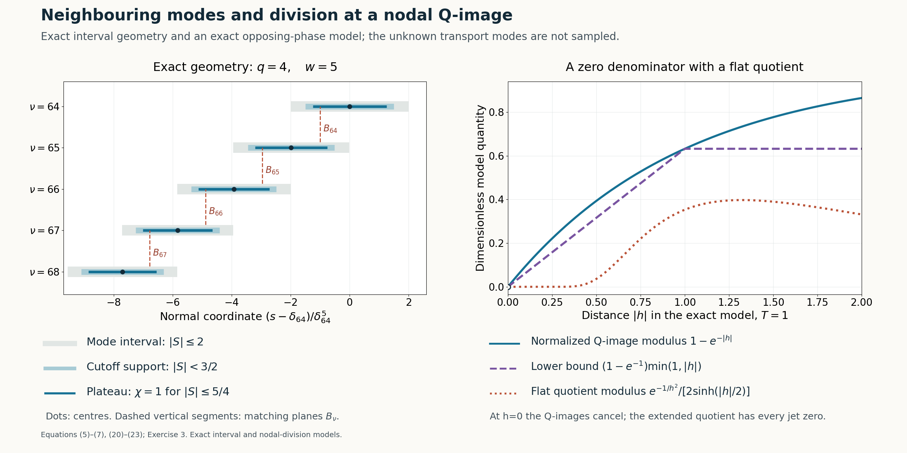

# Joining modes through a vanishing operator image

*Written by GPT-6.1 Sol (OpenAI), Ultra reasoning effort, October 2026. Self-checked by GPT-6.1 Sol (OpenAI). Original expression: CC0.*

The physical transport modes can be joined into a smooth solution supported on a half-space. At each switching plane their Q-images have equal modulus and may cancel. We prove modulus separation away from the plane and use the residual's full flatness to extend the quotient through the plane. We also prove the cutoff estimates, decay of the infinite sum, and a nonzero tail on the whole positive half-space.

Read [Physical transport scales and curved phases](physical-transport-scales-and-curved-phases.md). We use the physical-mode theorem with both switching-curve flatness conditions and its normalized nonzero operator image. The center spacing, infinite sum, cutoff errors and division through a nodal image are proved here.

Basic references are [Grubb] and [Hörmander]. Their bibliographic entries are below; every argument used from a prerequisite is identified above.

## Statement and physical input

Retain the input's rational exponents \(\kappa,\tau,\Lambda\), ratio A with zero order \(j_0\), and negative-imaginary linear coefficient a. Given an integer \(J_*\ge0\), choose p before constructing the modes, large enough for both highest-coefficient conditions and
\[
\begin{gathered}
p j_0\ge J_*,\\
p\ge2,\\
w=\kappa p+1,\\
q=w-1=\kappa p,\\
\gamma=1/q .
\end{gathered}
\tag{1}
\]
Increasing p preserves all positive scale inequalities. With \(s=\langle x,N\rangle\), write
\[
\begin{gathered}
T_\delta=T(\delta^p),\\
\lambda_\delta=\lambda(\delta^p),\\
u_\delta=e^{i\langle x,\zeta(\delta^p)\rangle}
W(S,\delta)e^{i\phi(S,\delta)/\mu_\delta},
\\
S=(s-\delta)/\delta^w .
\end{gathered}
\tag{2}
\]
The input supplies nonzero W and \(M_\delta=m(S,\delta)/b(\delta^p)\), \(m(S,0)=1\), and
\[
\begin{gathered}
Q(D)u_\delta=M_\delta u_\delta,\\
Lu_\delta=r_\delta u_\delta,\\
L=P(D)-A(s^p)Q(D),\\
\partial_S^2\operatorname{Im}\phi\ge b_*>0 .
\end{gathered}
\tag{3}
\]
Here \(\mu_\delta^{-1}=\delta^wT_\delta\). All fixed relative physical derivatives of the modes and M have at most a fixed power growth in \(\delta^{-1}\); the same holds for reciprocals of their nonzero factors. The residual is jointly flat in the parameter and on both curves, in the strong product sense equation (20) of [Physical transport scales and curved phases](physical-transport-scales-and-curved-phases.md). We choose the second curve below.

**Theorem 1 (assembly from the declared physical input).** There are \(u,a\in C^\infty(\mathbb R^n)\) with
\[
\begin{gathered}
(P(D)+a(x)Q(D))u=0,\\
\operatorname{supp}u=\{x:s\ge0\},\\
\partial^\alpha a|_{s=0}=0\\
(|\alpha|<J_*) .
\end{gathered}
\tag{4}
\]
The coefficient equals \(-A(s^p)\) for \(s\le0\). This is the assembly theorem under the stated physical-mode assumptions. Uniform integer periodicity is proved separately in the next lesson.

## Centres and the second switching curve

Choose d by \(d^q=1/(2q)\) and set
\[
\begin{gathered}
\delta_\nu=d\nu^{-\gamma},\\
I_\nu=[\delta_\nu-2\delta_\nu^w,\delta_\nu+2\delta_\nu^w],\\
B_\nu=\delta_\nu-\delta_\nu^w,\\
\nu\ge\nu_0 .
\end{gathered}
\tag{5}
\]
Increase \(\nu_0\) whenever necessary in finitely many uniform estimates. Thus the modes' parameters are small even though d need not be. Since \(1/\nu=2q\delta_\nu^q\), define
\[
\begin{gathered}
f(\delta)\\
=\frac{(1-2q\delta^q)^{-\gamma}-1}{\delta^q}
-(1-2q\delta^q)^{-\gamma w},\\
B_{\nu-1}=\delta_\nu+\delta_\nu^w f(\delta_\nu),\\
f(0)=1 .
\end{gathered}
\tag{6}
\]
The numerator has a convergent power series divisible by \(\delta^q\), with constant quotient \(2q\gamma=2\); the other term tends 1. Thus f is analytic through zero, including signed parameters. Choose the physical transport curves as \(S=-1\) and \(S=f(\delta)\). Each mode's residual is now flat on both planes \(s=B_\nu,B_{\nu-1}\).

Taylor's formula for \(t^{-\gamma}\) gives uniformly
\[
\begin{gathered}
\frac{\delta_\nu-\delta_{\nu+1}}{\delta_\nu^w}\to2,\\
\frac{\delta_{\nu+1}}{\delta_\nu}\to1,\\
S_{\nu+1}(s)-S_\nu(s)\to2
\\
(s\in I_\nu\cap I_{\nu+1}) .
\end{gathered}
\tag{7}
\]
For the last assertion subtract the two rescaled coordinates: their width ratio tends 1, their centre displacement divided by either width tends 2, and their S-coordinates are bounded on the intersection. The same assertions hold for the previous neighbour. In particular B is strictly decreasing eventually and tends 0, its successive distance being asymptotic to \(2\delta_\nu^w\).

Fix \(0\le\chi\le1\) smooth, equal 1 on \([-5/4,5/4]\), supported in \((-3/2,3/2)\). For large indices at most two cutoffs \(\chi(S_\nu)\) are nonzero. Their plateau regions cover the interval from 0 to the upper end of the first mode. On a fixed switching tube \(|s-B_\nu|<h_0\delta_\nu^w\), with sufficiently small \(0<h_0<1/8\), both relevant cutoffs are 1. Where one cutoff changes, its neighbour's cutoff is 1. Indeed adjacent centres are two limiting rescaled units apart, so a changing coordinate \(5/4<|S|<3/2\) corresponds to a neighbour coordinate strictly between -1 and 1. Nonadjacent centres are four units apart, exceeding total cutoff diameter 3. All these comparisons have strict margins and therefore hold uniformly for large \(\nu_0\).

## Matching and the logarithmic-ratio estimate

Choose \(C_{\nu_0}>0\), then determine successive positive constants by
\[
\begin{gathered}
U_\nu=C_\nu u_{\delta_\nu},\\
F_\nu(s)=|M_{\delta_\nu}U_\nu|,\\
F_\nu(B_\nu)=F_{\nu+1}(B_\nu).
\end{gathered}
\tag{8}
\]
Both moduli are positive and depend only on s. The real tangential carrier has modulus 1; the imaginary frequency is \(-\lambda_\delta N\). Apart from an s-independent constant,
\[
\begin{gathered}
\log F_\nu(s)\\
=\log|m(S_\nu,\delta_\nu)W(S_\nu,\delta_\nu)|
+\lambda_{\delta_\nu}s
-\delta_\nu^w T_{\delta_\nu}\operatorname{Im}\phi(S_\nu,\delta_\nu).
\end{gathered}
\tag{9}
\]
Retaining the full carrier, put \(\beta=\operatorname{Im}\partial_S\phi\). Smoothness and the nonzero units give
\[
\begin{gathered}
\partial_s\log F_\nu
\\
=\lambda_{\delta_\nu}
-T_{\delta_\nu}\beta(S_\nu,\delta_\nu)+O(\delta_\nu^{-w}).
\end{gathered}
\tag{10}
\]
The two error ratios tend 0:
\(T_\delta/\lambda_\delta=O(\delta^{p(\Lambda-\tau)})\) and
\(\delta^{-w}/\lambda_\delta=O(\delta^{p(\Lambda-\kappa)-1})\).
Thus, after increasing \(\nu_0\),
\[
\tfrac12\lambda_{\delta_\nu}
\le\partial_s\log F_\nu\le2\lambda_{\delta_\nu}\quad(s\in I_\nu).
\tag{11}
\]

The neighbouring carrier *difference*, however, is smaller than T. The finite-power rational forms imply
\[
\begin{gathered}
T_{\delta_{\nu+1}}/T_{\delta_\nu}=1+O(\nu^{-1}),\\
|\lambda_{\delta_{\nu+1}}-\lambda_{\delta_\nu}|
\le C\lambda_{\delta_\nu}/\nu,\\
\frac{\lambda_{\delta_\nu}/\nu}{T_{\delta_\nu}}
=O(\delta_\nu^{p(\kappa+\tau-\Lambda)})\to0,\\
\frac{\delta_\nu^{-w}}{T_{\delta_\nu}}
=O(\delta_\nu^{p(\tau-\kappa)-1})\to0 .
\end{gathered}
\tag{12}
\]
For the difference bound, write \(\lambda_\delta=\delta^{-p\Lambda}\ell(\delta^p)\) with a smooth positive unit. Its derivative is \(O(\lambda_\delta/\delta)\), while adjacent parameter distance is \(O(\delta_\nu/\nu)\). The mean value estimate proves the bound, using comparability of units on that segment. The T ratio follows in the same manner. Smoothness also gives a uniform \(O(|\delta_{\nu+1}-\delta_\nu|)\) parameter difference for \(\beta\). Subtracting (10) consequently yields
\[
\begin{gathered}
\partial_s\log(F_\nu/F_{\nu+1})\\
=T_{\delta_\nu}
\bigl(\beta(S_{\nu+1},\delta_\nu)-\beta(S_\nu,\delta_\nu)+o(1)\bigr).
\end{gathered}
\tag{13}
\]
By the positive \(\beta\) derivative and the rescaled gap greater than 1, the bracket is between fixed positive constants. Integrate from the exact matching plane:
\[
\begin{gathered}
cT_{\delta_\nu}\le
\frac{\log(F_\nu(s)/F_{\nu+1}(s))}{s-B_\nu}
\le CT_{\delta_\nu}
\\
(s\in I_\nu\cap I_{\nu+1},\ s\ne B_\nu).
\end{gathered}
\tag{14}
\]
Below the plane both integral and denominator reverse sign. The upper mode therefore dominates above B and the lower mode below B.

## Decay of the infinite sum

The core length \(B_{\nu-1}-B_\nu\sim2\delta_\nu^w\). Its carrier growth is
\[
\begin{gathered}
\lambda_{\delta_\nu}\delta_\nu^w
\asymp\delta_\nu^{1-p(\Lambda-\kappa)}
\asymp\nu^\eta,\\
\eta=\frac{p(\Lambda-\kappa)-1}{\kappa p}>0 .
\end{gathered}
\tag{15}
\]
Positivity follows from \(\Lambda-\kappa\ge2\). Let \(A_\nu=F_\nu(B_{\nu-1})\); this positive scalar is distinct from the coefficient function A. Equations (8),(11) imply
\[
\begin{gathered}
A_{\nu+1}=F_\nu(B_\nu)\le A_\nu e^{-c\nu^\eta},\\
A_\nu\le C e^{-c'\nu^{1+\eta}}.
\end{gathered}
\tag{16}
\]
The last assertion follows by summing \(j^\eta\) and comparing with its integral.

On its core a mode's F is at most \(A_\nu\). Past its lower switching plane it is bounded, by (14), by the lower neighbour in that neighbour's core. Past its upper switching plane the upper neighbour provides the same bound. Consequently its full cutoff support satisfies
\[
F_\nu(s)\le C e^{-c\nu^{1+\eta}} .
\tag{17}
\]
A smaller c absorbs adjacent indices. M and its inverse have finite-power bounds. Cutoff differentiation and relative mode differentiation introduce only further finite powers. Since \(\delta_\nu=d\nu^{-\gamma}\), for every fixed physical multiindex and every integer J,
\[
\begin{gathered}
|\partial_x^\alpha(\chi(S_\nu)U_\nu)|
\le C_{\alpha,J}\delta_\nu^J\\
\hbox{on its support}.
\end{gathered}
\tag{18}
\]
Tangential constants are uniform because the carrier is real there. The sum
\[
\begin{gathered}
u=\sum_{\nu\ge\nu_0}\chi(S_\nu)U_\nu\\
(s>0),\\
u=0\\
(s\le0)
\end{gathered}
\tag{19}
\]
is locally finite on the positive side with at most two nonzero terms. On those supports \(s\asymp\delta_\nu\); (18) gives smooth extension with all boundary jets zero. Explicitly, all positive-side derivatives tend uniformly to 0. Their zero extensions are successive normal derivatives by the integral difference formula, using the direction \(N/|N|^2\); induction proves smoothness. Tangential derivatives satisfy the same estimates. We modify the first term's upper end below.

## Smooth division at a nodal Q-image

In a switching tube both cutoffs are 1, so \(u=U_\nu+U_{\nu+1}\). For \(h=s-B_\nu>0\), set
\[
\begin{gathered}
Z=\frac{M_{\delta_{\nu+1}}U_{\nu+1}}{M_{\delta_\nu}U_\nu},\\
|Z|\le e^{-cT_{\delta_\nu}h},\\
|1+Z|\ge c_0\min(1,T_{\delta_\nu}|h|).
\end{gathered}
\tag{20}
\]
The last bound is the reverse triangle inequality and
\(1-e^{-t}\ge(1-e^{-1})\min(1,t)\), from concavity on \([0,1]\) and monotonicity beyond 1. Below B divide by the dominant lower neighbour instead. Hence \(Q(D)u\) is nonzero off the plane; on it cancellation is allowed.

On the upper side the exact quotient is
\[
\begin{gathered}
E:\\
=\frac{Lu}{Q(D)u}
\\
=\frac{r_{\delta_\nu}/M_{\delta_\nu}
+(r_{\delta_{\nu+1}}/M_{\delta_{\nu+1}})Z}{1+Z}.
\end{gathered}
\tag{21}
\]
Both residuals are flat on this same physical plane, one at its left curve and the other at its right curve. For every fixed derivative order and arbitrary integers J,L, joint flatness gives
\[
\begin{gathered}
|\partial_x^\alpha\{\text{numerator in (21)}\}|
\\
\le C_{\alpha,J,L}\delta_\nu^J|h|^L .
\end{gathered}
\tag{22}
\]
To check all losses, derivatives of Z are a fixed-power bound times \(|Z|\le1\), by relative differentiation of the nonzero modes and M factors. M-inverse differentiation also has finite-power bounds. Rescaling graph distance from S to h and taking any fixed physical derivative cost only finite powers. The arbitrary J in equation (20) of [Physical transport scales and curved phases](physical-transport-scales-and-curved-phases.md) absorbs all of these.

Since \(T_{\delta_\nu}\ge1\), \(|h|<1\), (20) implies \(|1+Z|^{-1}\le C|h|^{-1}\). Every fixed derivative of this reciprocal is bounded by \(C\delta_\nu^{-a}|h|^{-b}\) for finite a,b, using the quotient rule and the Z bounds. Leibniz's formula and arbitrary exponents in (22) therefore yield, for arbitrary J,L,
\[
|\partial_x^\alpha E|\le C_{\alpha,J,L}\delta_\nu^J|h|^L
\quad(h\ne0).
\tag{23}
\]
The lower side has the same proof with reversed ratio. Extend E by zero on the entire plane. All derivatives tend to 0 there; the normal integral difference formula proves smooth extension, with every physical jet zero. A possibly nodal Q-image therefore causes no singular coefficient.

## Every cutoff error

In a cutoff transition the neighbouring mode has cutoff 1 and dominates by a fixed rescaled distance from B. Equation (14) gives
\[
\begin{gathered}
F_{\rm small}/F_{\rm dominant}\le e^{-c/\mu_{\delta_\nu}},\\
\mu_{\delta_\nu}^{-1}\asymp\delta_\nu^{-m_0},\\
m_0>0 .
\end{gathered}
\tag{24}
\]
All fixed derivatives add finite powers, from relative differentiation. This exponential beats every power: for any k,
\(e^{c\delta^{-m_0}}\ge(c\delta^{-m_0})^k/k!\).

The commutator \([Q(D),\chi]\) is a finite sum of positive-order cutoff derivatives times lower-order mode derivatives. Also
\([L,\chi]=[P(D),\chi]-A(s^p)[Q(D),\chi]\), with A on the left. A and its fixed derivatives are bounded near the boundary. Divide by the dominant nonzero Q-image. Relative mode estimates, M-inverse bounds and (24) give for every J
\[
\begin{gathered}
Q(D)u\\
=M_{\rm dominant}U_{\rm dominant}(1+\epsilon_Q),
|\partial_x^\alpha\epsilon_Q|\\
\le C_{\alpha,J}\delta_\nu^J,\\
Lu\\
=M_{\rm dominant}U_{\rm dominant}
(r_{\rm dominant}/M_{\rm dominant}+\epsilon_L),
|\partial_x^\alpha\epsilon_L|\\
\le C_{\alpha,J}\delta_\nu^J .
\end{gathered}
\tag{25}
\]
Here \(\epsilon_Q\) includes the small cutoff-weighted Q-image and its commutator; \(\epsilon_L\) includes the small residual and both commutators. The dominant cutoff is constant 1. Thus \(|\epsilon_Q|<1/2\) for large \(\nu_0\), and every derivative of E has arbitrary parameter decay. In a single-mode region E is simply r/M. With both cutoffs 1 outside a fixed switching tube, (20) has a uniform positive denominator bound and gives the same result. These cases cover the whole positive assembled interval. Together with (23), they show E is smooth there and all its derivatives are \(O(s^J)\) for every J at 0. Extend E by zero on \(s\le0\); it is smooth and flat.

## The whole upper half-space

A local assembly does not give support equality on the whole space. Extend the first mode smoothly upward with a nonzero Q-image, as follows. Choose a fixed S-level between 1 and \(5/4\), above all overlaps with its lower neighbour. From there upward replace its cutoff by 1; this agrees with the original cutoff on a neighbourhood of the joining level. Keep the first mode unchanged until a slightly higher fixed level within its physical S-domain.

On a further fixed interval choose a smooth function \(\theta(S)\), equal S initially, eventually constant at a value below 2, taking values in a compact subinterval of \((-2,2)\). For the extended phase prescribe
\(\widetilde\phi'(S,\delta)=\phi'(\theta(S),\delta)\), choosing its primitive to agree initially with the old phase. Set
\(\widetilde W(S,\delta)=W(\theta(S),\delta)\).
This amplitude agrees initially and stays nonzero; it becomes constant while the phase becomes affine. All fixed derivatives of the phase derivative, amplitude and inverse amplitude are uniformly bounded on the whole upper domain for small \(\delta\).

Its ordered normalized Q-image is
\[
\begin{gathered}
\widetilde m(S,\delta)\\
=\frac1{\widetilde W}
\sum_jq_j(\delta^p)(\mu_\delta D_S+\widetilde\phi')^j\widetilde W,\\
\sup_S|\widetilde m(S,\delta)-1|\to0 .
\end{gathered}
\tag{26}
\]
Every finite ordered expression is uniformly bounded: expand it by repeated product differentiation, using the bounded phase-derivative and amplitude derivatives, bounded \(\mu\), and uniformly nonzero amplitude. Since \(q_0\to1\), all \(q_j\to0\) for \(j\ge1\), and the degree is fixed, the displayed uniform limit follows. Taking \(\nu_0\) large gives \(|\widetilde m-1|<1/2\). Hence the first mode extends as a nonzero smooth function for every upper s with nonzero Q-image.

There is only this mode above the overlaps. Define \(E=L\widetilde u/Q(D)\widetilde u\) there. It is smooth and agrees with the previously defined quotient on their common neighbourhood. No smallness far from the boundary is required. Set \(a=-A(s^p)-E\) everywhere. Then \(P+aQ=L-EQ\) annihilates u on every open region by definition. Continuity establishes the identity also on switching planes and the boundary. Both functions are globally smooth. Since A has order \(p j_0\) after composition with \(s^p\), and E is flat at 0, a has the required vanishing order.

Every positive open set below the upper tail meets a region off the discrete switching planes, where \(Q(D)u\) is nonzero. Thus u cannot vanish identically on any such set. Above the overlaps the extended mode itself is nonzero. Boundary points are limits of positive support points; u is zero on the negative half-space. Its support is exactly the closed positive half-space, proving Theorem 1.

**Figure 1.** Left: exact centres, full mode intervals, cutoff supports, plateau regions and switching planes from (5)–(6), for \(q=4,w=5,d=8^{-1/4}\), \(\nu=64,\ldots,68\); the horizontal coordinate is \((s-\delta_{64})/\delta_{64}^5\). Right: the exact opposing-phase model in Exercise 3 with \(T=1\), showing the normalized Q-image modulus \(1-\exp(-|h|)\), its proved lower bound, and the modulus of its flat residual quotient. This model permits cancellation at \(h=0\). It samples neither the physical transport phase nor the assembled solution. Equations: (5)–(7),(20)–(23),Exercise 3;

## Exercises and complete solutions

**Exercise 1 (the matching curve).** Take \(q=2\), so \(\gamma=1/2,w=3,d^2=1/4\). Compute the first nonconstant term of f.

**Solution.** With \(h=4\delta^2\), the first expression in (6) has expansion \(2+6\delta^2+20\delta^4+O(\delta^6)\). The second has expansion \(1+6\delta^2+30\delta^4+O(\delta^6)\). Hence \(f=1-10\delta^4+O(\delta^6)\). The quadratic terms cancel; the proof needs only smoothness and limit 1.

**Exercise 2 (the large carrier and its small difference).** For \((\kappa,\tau,\Lambda,p)=(9,11,16,2)\), compute \(m_0\), the exponent of the neighbouring carrier difference relative to T, and \(\eta\).

**Solution.** Here \(q=18,w=19,m_0=2(11-9)-1=3\). The ratio \((\lambda/\nu)/T\) has exponent \(2(9+11-16)=8\), so is \(O(\delta^8)\). Also \(\eta=(2(16-9)-1)/18=13/18\), giving amplitude bound \(C e^{-c\nu^{31/18}}\). Each carrier is large, but its neighbouring difference is \(o(T)\).

**Exercise 3 (a nodal denominator).** Let \(Z_1=e^{Th/2}\), \(Z_2=-e^{-Th/2}\), \(T>0\). Show that \(e^{-1/h^2}/(Z_1+Z_2)\), extended by zero at \(h=0\), is smooth and flat.

**Solution.** At 0 the two moduli agree and the phases cancel. Their sum is \(2\sinh(Th/2)=h\,g(h)\), where
\(g(h)=T\int_0^1\cosh(Th\theta/2)\,d\theta>0\).
Thus the quotient is \(h^{-1}e^{-1/h^2}/g(h)\). Every derivative of the flat exponential divided by h is a finite Laurent factor times the same exponential and tends to 0. Division by the smooth nonzero g preserves this. Equality of moduli never justified dividing on the plane without the extension argument.

**Exercise 4 (the cutoff commutator).** For \(Q=D_s^2\), compute \([Q,\chi]U\) and explain its small quotient in a cutoff transition.

**Solution.** With \(D_s=-i\partial_s\), the product rule gives
\([D_s^2,\chi]U=-\chi''U-2\chi'U'\).
Cutoff and mode derivatives cost only finite powers. Divide by the dominant M times mode; its inverse M costs another finite power, while the small-to-dominant Q-image ratio is \(e^{-c/\mu}\). This absorbs all powers and gives arbitrary-order parameter decay, also after every fixed derivative.

**Exercise 5 (zeros on switching planes and exact support).** Why can zeros on switching planes not reduce the support?

**Solution.** Every positive open set has an open interval of normal coordinates. The switching values are discrete there, so it meets an off-plane strip where \(Q(D)u\) is nonzero. A function identically zero on that open set would have zero Q-image there, a contradiction. Thus every positive point, including every switching-plane point, lies in the support. The upper mode is nonzero everywhere on its tail. The boundary lies in the closure of positive support points, and the negative half-space has zero u.

**Exercise 6 (the tail needs uniform bounds).** Prove the uniform ordered bound used in (26).

**Solution.** Every iterated \((\mu D+\widetilde\phi')^j\widetilde W\) is a finite sum of products of bounded powers of \(\mu\), derivatives of \(\widetilde\phi'\), and derivatives of \(\widetilde W\). All factors and \(1/\widetilde W\) have uniform bounds on the entire tail. There are finitely many j. Hence a single constant bounds every normalized expression. Multiplication by \(q_j(\delta^p)\to0\) for \(j\ge1\), and \(q_0\to1\), proves uniform convergence to 1. Without these bounds, small coefficients alone would not imply a small Q-image error.

## References

- [Grubb] Gerd Grubb, *Distributions and Operators*, lecture notes, University of Copenhagen, 2007–2008. [Author's lecture notes](https://web.math.ku.dk/~grubb/distribution.htm).
- [Hörmander] Lars Hörmander, *The Analysis of Linear Partial Differential Operators II: Differential Operators with Constant Coefficients*, Springer, 1983.
