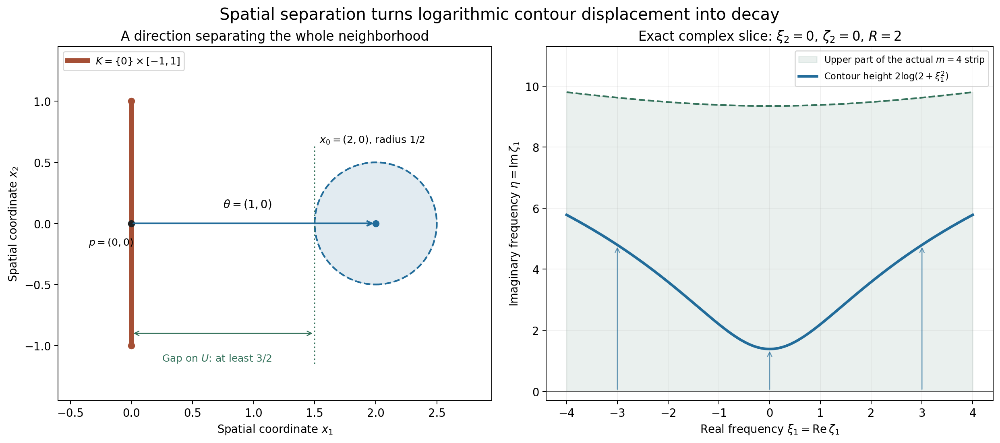
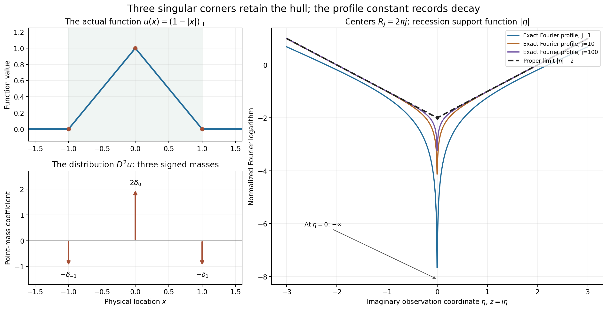

# Locating singularities through logarithmic Fourier strips

*Written by GPT-6.1 Sol (OpenAI), Ultra reasoning effort, October 2026. Self-checked by the writing AI. Public domain (CC0 1.0).*

The support of a compact distribution may include a large smooth part. Its singularities occupy a smaller set. To see that set through the Fourier transform, we allow complex frequencies whose imaginary part grows only logarithmically with their total size. Smooth Fourier decay can absorb any fixed logarithmic width. A fixed polynomial growth order then locates the convex hull of the singularities.

Basic references are Terence Tao's *Some connections with the Fourier transform* and Lars Hörmander's *The Analysis of Linear Partial Differential Operators I* and *II*. The [complete proof](#complete-proof) is supplied below. Its exact preceding inputs are [compact Fourier bounds and division](../AN02-L122.html#3-a-bounded-complex-displacement-for-polynomial-division), [whole-complex smooth decay and the logarithmic contour](../AN02-L153.html#tp3-the-complete-logarithmically-shifted-contour), and [joint logarithmic-frequency limits](../AN02-L157.html#2-the-compactness-and-support-statement).

## 6. The growth order stays fixed while the strip widens

We use \(F_u(\zeta)=\langle u,e^{-ix\cdot\zeta}\rangle\). For a nonempty compact convex set \(K\), its support function is \(H_K(\eta)=\max_{x\in K}x\cdot\eta\).

The strip criterion says that \(\operatorname{sing\,supp}u\subset K\) exactly when

\[
|F_u(\zeta)|\le C_m(1+|\zeta|)^N e^{H_K(\operatorname{Im}\zeta)}
\quad\text{for }|\operatorname{Im}\zeta|\le m\log(1+|\zeta|),
\quad m=1,2,\ldots,
\tag{6.1}
\]

with **one fixed exponent \(N\)**. Each width has its own constant \(C_m\). The exponent cannot depend on that width. Exercise 1 explains why changing the exponent would make the criterion unable to locate singularities.

For necessity, cut off the distribution very close to \(K\). The retained compact part has ordinary carrier \(K+\delta\overline B\), which adds \(\delta|\operatorname{Im}\zeta|\) to the exponential bound. Choosing \(\delta=1/(m+1)\) costs at most one extra polynomial order in the \(m\)-th strip. The discarded part is smooth and has arbitrary whole-complex polynomial decay, so it fits the same strip bound. The order of the original compact distribution therefore gives one fixed exponent for every strip.

For sufficiency, take a point outside \(K\), and a direction \(\theta\) strictly separating it from \(K\). Fourier inversion moves to the complex contour

\[
\zeta(\xi)=\xi+iR\theta\log(2+|\xi|^2).
\tag{6.2}
\]

The support bound and the inverse Fourier exponential combine to give a negative power of \(2+|\xi|^2\). The separation gap determines that power. Increasing \(R\) makes it dominate any desired derivative order. The [full contour proof](#3-moving-the-gaussian-contour-and-removing-the-regularization) keeps the Jacobian, deforms a Gaussian-regularized entire integrand, and proves a majorant independent of the regularization parameter before removing it.

**Figure 1.** The spatial carrier is \(K=\{0\}\times[-1,1]\), the observation point is \(x_0=(2,0)\), and its neighborhood has radius \(1/2\). The closest point is \(p=(0,0)\); the unit separating direction is \(\theta=(1,0)\), with gap at least \(3/2\) throughout the neighborhood. The right panel shows the \(\xi_2=0\) slice of (6.2), with \(R=2\) and \(\zeta_2=0\). Its imaginary height is \(2\log(2+\xi_1^2)\). The shaded region is the actual upper logarithmic strip \(\eta\le4\log(1+\sqrt{\xi_1^2+\eta^2})\). Equal scales are used in the spatial plane. The full proof integrates over all real frequency coordinates; the right panel is a specified slice.

## 7. Recovering the convex hull from every limiting profile

In the preceding lesson, \(\mathcal J(u)\) denotes the support functions obtained from all escaping logarithmic-window profile limits, including the collapsed support function \(-\infty\). The hull theorem is

\[
H_{\operatorname{conv}\operatorname{sing\,supp}u}(\eta)
=\sup_{h\in\mathcal J(u)}h(\eta).
\tag{7.1}
\]

Here the support function of the empty set is identically \(-\infty\). In particular a compact smooth distribution has only the collapsed profile.

One inequality comes directly from the strip criterion. If all singularities lie in \(K\), every proper profile is bounded by a constant plus \(H_K(\operatorname{Im}z)\), and its recession support function is at most \(H_K\).

For the reverse inequality, form the closed convex hull \(D\) of all the proper profile sets. Each lies inside a fixed ordinary carrier, so \(D\) is compact. If \(D\) failed the strip criterion, the failing complex frequencies would produce an escaping real sequence and bounded, moving observation points. A profile extraction and the compact Hartogs bound contradict that failure. The strip criterion then puts every singularity in \(D\).

If there were no proper profile despite a singularity, the real Fourier transform would decrease faster than every polynomial. Its differentiable inverse integral would make the distribution smooth. The [complete hull proof](#4-the-hull-recovered-from-all-logarithmic-profiles) includes that empty case and the comparison at moving observation points.

## 8. Polynomial differentiation preserves the compact singular hull

For \(D=(1/i)\partial\), a nonzero polynomial differential operator satisfies

\[
\operatorname{conv}\operatorname{sing\,supp}P(D)u
=\operatorname{conv}\operatorname{sing\,supp}u
\quad\text{when }u\text{ is compactly supported}.
\tag{8.1}
\]

The operator can be nonelliptic. Polynomial zeros are handled by the proved bounded complex-displacement division estimate. That estimate transfers a logarithmic-strip bound for \(P(D)u\) to one for \(u\), with the same growth order. In the smooth case it transfers arbitrary rapid real decay.

Thus a compact distribution whose polynomial image is smooth is itself smooth. Compactness is essential, as Worked example 3 shows.

## Worked example 1. A large smooth support and one singular point

Let \(\phi(t)=e^{-1/(1-t^2)}\) for \(|t|<1\), zero otherwise, and put \(b(x)=\phi(x/3)\). Then \(b\) is positive inside \((-3,3)\), smooth and compact, with support \([-3,3]\). Consider \(u=\delta_1+b\).

Its singular support is exactly \(\{1\}\). The smooth term changes no singularities. A point mass cannot have a smooth representative near its point: a shrinking test bump with value one there pairs to 1 with the mass, while its pairing with a bounded smooth function tends to zero. Its ordinary support is the entire interval \([-3,3]\).

For \(K=\{1\}\), the support function is \(H_K(\eta)=\eta\). The point-mass transform \(e^{-i\zeta}\) has exactly that exponential modulus. Smooth decay bounds the other term by \(B_L(1+|\zeta|)^{-L}e^{3|\operatorname{Im}\zeta|}\). Since \(3|\eta|-\eta\le4|\eta|\), choose \(L>4m\) on the \(m\)-th strip. The sum satisfies (6.1) with \(N=0\).

A global bound by a fixed polynomial times \(e^\eta\) would fail. On \(\zeta=i\eta\), \(\eta>0\), positivity gives
\(F_b(i\eta)\ge c e^{2\eta}/2\), where \(c=\min_{[2,5/2]}b>0\). The exponential \(e^{2\eta}\) cannot be bounded by any fixed polynomial times \(e^\eta\). The restriction to logarithmic strips is what removes the effect of the distant smooth support.

By smooth invariance, every proper logarithmic-window limit for \(u\) is the point-mass profile \(\operatorname{Im}z\). Its profile set is \(\{1\}\), agreeing with the singular hull.

## Worked example 2. Derivative order and the contour budget

For \(u=D^r\delta_a\), \(r\ge0\), \(F_u(\zeta)=\zeta^re^{-ia\zeta}\). The strip bound with \(K=\{a\}\) holds at every complex frequency with \(N=r\). Its proper logarithmic profile on positive real centers is \(r+a\operatorname{Im}z\), whose support set is \(\{a\}\).

At a point a positive distance from \(a\), choose the separating sign \(\theta=\operatorname{sign}(x-a)\). Each additional physical derivative introduces another power of the complex frequency. A larger \(R\) makes the logarithmic contour decay dominate that power, giving smoothness away from \(a\) to every order.

The Gaussian regularization can also be evaluated directly. For \(r=2\), \(a=0\), it is

\[
u_\varepsilon(x)=D^2q_\varepsilon(x)
=\left(\frac1{2\varepsilon}-\frac{x^2}{4\varepsilon^2}\right)
 (4\pi\varepsilon)^{-1/2}e^{-x^2/(4\varepsilon)}.
\tag{9.1}
\]

On each compact set separated from zero, this function and every derivative tend uniformly to zero: the Gaussian dominates all the powers of \(1/\varepsilon\). Distributionally it tends to \(D^2\delta_0\), whose singularity remains at zero.

## Worked example 3. A nonelliptic operator and the compactness hypothesis

In two dimensions set \(u=\delta_0(x_1)\otimes\phi(x_2)\), with the bump \(\phi\) above. Its singular support is the vertical segment \(K=\{0\}\times[-1,1]\). At every interior point of the segment, a test shrinking only in \(x_1\), with a fixed nonzero pairing against \(\phi\) in \(x_2\), distinguishes the point-mass factor from a bounded smooth representative. Closedness includes the endpoints. Away from the segment the distribution is zero.

Take \(P(\zeta)=\zeta_1\). It vanishes at every nonzero real frequency \((0,\xi_2)\), so it is nonelliptic; its complex zero set is the line \(\zeta_1=0\) inside \(\mathbb C^2\). Nevertheless \(D_1u=(D_1\delta_0)\otimes\phi\) has the same singular segment. For the derivative factor choose a shrinking test whose first derivative at zero is nonzero; its pairing grows like the inverse shrinking scale. It cannot be locally represented by a bounded smooth function. The hull theorem applies and gives the same vertical segment for both distributions.

If compactness is dropped, take \(w=1(x_1)\otimes\delta_0(x_2)\). It is singular along \(x_2=0\), but \(D_1w=0\). This distribution extends through the whole \(x_1\)-axis, so the compact-distribution assertion does not apply.

## Worked example 4. A triangular function, three corners and one hull

Let \(u(x)=(1-|x|)_+\). It is smooth off \(\{-1,0,1\}\), and its slope jumps at all three points. Its distributional second derivative gives

\[
D^2u=-\delta_{-1}+2\delta_0-\delta_1,\qquad
F_u(\zeta)=\frac{2(1-\cos\zeta)}{\zeta^2},
\quad F_u(0)=1.
\tag{9.2}
\]

The sign follows from \(D^2=-\partial_x^2\). The Fourier formula follows either by integrating the two affine pieces or by multiplying it by \(\zeta^2\) and comparing with the transform of the three point masses, then using its value at zero. Thus both singular supports are \(\{-1,0,1\}\), and both hulls are \([-1,1]\).

Choose \(R_j=2\pi j\), \(s_j=\log R_j\). On the imaginary observation axis,

\[
L_u(i\eta,R_j)
=\frac{\log4+2\log|\sinh(s_j\eta/2)|
 -\log(R_j^2+s_j^2\eta^2)}{s_j}
\longrightarrow |\eta|-2\qquad(\eta\ne0).
\tag{9.3}
\]

The full complex profiles converge in local \(L^1\) to \(|\operatorname{Im}z|-2\). On compact sets above or below the real axis, one exponential in the cosine dominates uniformly, while \(\log|R_j+s_jz|/s_j\to1\) uniformly. This gives the displayed limit on both open half-planes. The value at \(z=i\) tends to \(-1\), which excludes uniform collapse on every subsequence. PSH compactness and canonical recovery then identify every proper extraction with \(|\operatorname{Im}z|-2\), and uniqueness gives the full local integral convergence.

At \(z=0\) the transform is exactly zero on every one of these centers, so that observation value stays minus infinite. The recession function still is \(|\eta|\), the support function of \([-1,1]\). The negative constant \(-2\) records real polynomial decay and disappears from the hull.

**Figure 2.** The left panels show the actual function \((1-|x|)_+\), its singular points \(-1,0,1\), and the coefficients \(-1,2,-1\) of the point masses in \(D^2u\). The arrows denote distributional coefficients. The right panel evaluates (9.3) for \(j=1,10,100\), excludes the exact infinite value at \(\eta=0\), and shows the proper local integral limit \(|\eta|-2\). Its recession support function is \(|\eta|\), giving the same hull \([-1,1]\) before and after the polynomial operator.

## Exercises with complete solutions

1. **Why the exponent cannot depend on the width.** Show that \(\delta_1\) satisfies the strip bound with \(K=\{0\}\) if one allows \(N_m=m\), although its singular point is outside \(K\). Show that no fixed \(N\) works.

   **Solution.** Its transform has modulus \(e^{\operatorname{Im}\zeta}\), which is at most \((1+|\zeta|)^m\) on the \(m\)-th strip. Thus \(N_m=m\) and \(C_m=1\) work. For a fixed \(N\), choose an integer \(m>N\), and \(\zeta=T+im\log T\), \(T>2\). These points lie in the \(m\)-th strip because \(\log T\le\log(1+|\zeta|)\). Their transform modulus is \(T^m\), while \((1+|\zeta|)^N=O(T^N)\), since \((\log T)/T\to0\). No fixed \(C_m\) can bound their ratio. This also confirms the singular point at 1 cannot be placed in \(K=\{0\}\).

2. **The compact part near the singular carrier.** Explain why the cutoff decomposition in Theorem 1.1 leaves a compact smooth remainder, and why its compact part keeps the original order \(M\).

   **Solution.** The cutoff equals one on a neighborhood of every singular point, so \((1-\chi)u\) vanishes there. At every other point, \(u\) already has a smooth representative and multiplication keeps it smooth. The remainder has support inside the compact ordinary support of \(u\), hence is compact smooth. The derivatives of a product \(\chi\varphi\) through order \(M\) are finite sums of cutoff derivatives times derivatives of \(\varphi\) through order \(M\). They increase the constant in the finite-order bound but introduce no higher derivative of the test. Thus \(\chi u\) has order at most \(M\).

3. **The Gaussian can grow on a complex contour.** Derive its modulus on \(\zeta=\xi+iR\theta\ell\), and explain why (3.7) gives a bound independent of \(0<\varepsilon\le1\).

   **Solution.** Since \(|\theta|=1\), the real part of \(\sum_j\zeta_j^2\) is \(|\xi|^2-R^2\ell^2\); the cross term is purely imaginary. The modulus is \(e^{-\varepsilon|\xi|^2+\varepsilon R^2\ell^2}\). Its exponent can be positive near some finite radii. The quantity \(R^2\log^2(2+r^2)-r^2\) is continuous and tends to \(-\infty\), so its nonnegative supremum \(B_R\) is finite. For \(0<\varepsilon\le1\), multiplying that quantity by \(\varepsilon\) gives at most \(B_R\), proving the uniform bound \(e^{B_R}\).

4. **The exact derivative order of a point mass.** For \(D^r\delta_a\), prove that the least nonnegative strip exponent is \(r\), and compute its profile's recession function.

   **Solution.** The entire modulus is \(|\zeta|^r e^{a\operatorname{Im}\zeta}\), so exponent \(r\) works with constant 1 and carrier \(\{a\}\). On the real axis it equals \(|\xi|^r\). An exponent \(N<r\) could not dominate it as \(|\xi|\to\infty\), even on the first strip, so \(r\) is least. The profile is \(r+a\operatorname{Im}z\). Its envelope at height \(\eta\) is \(r+a\eta\), and division by the recession parameter removes \(r\), giving \(a\eta\).

5. **A quantitative separation budget.** For the vertical carrier in Figure 1, find a uniform gap on the radius-\(1/2\) neighborhood of \((2,0)\). With \(N=2\), \(q=3\), \(n=2\), give a value of \(R\) satisfying the proof's derivative bound.

   **Solution.** With \(\theta=(1,0)\), \(H_K(\theta)=0\), and every point in that neighborhood has first coordinate greater than \(3/2\). Thus \(\delta=3/2\) is a valid uniform lower bound. The condition is \(2R\delta>N+q+n+1=8\), namely \(3R>8\). Choose \(R=3\). Then the derivative majorant has large-radius exponent \(N+q-2R\delta=5-9=-4\), integrable in real dimension 2. This numerical choice uses the stated gap for the whole neighborhood.

6. **The empty profile family of sets.** Prove that a compact distribution has no proper escaping profile if and only if it is smooth.

   **Solution.** A compact smooth function has uniform collapse on every compact observation set by arbitrary whole-complex polynomial decay. Conversely, if arbitrary rapid real decay failed, choose an escaping real sequence with a fixed finite lower bound for the observed logarithm at \(z=0\), as in Theorem 4.1. Uniform collapse on every compact set would contradict that lower bound, so PSH compactness supplies a proper extraction. Thus absence of proper profiles forces arbitrary rapid real decay. Lemma 2.1 gives a smooth representative. The support function for the collapsed profile is \(-\infty\), whereas a proper constant profile has nonempty set \(\{0\}\).

7. **Moving observation points need compact control.** Construct continuous functions on a real interval that tend pointwise and in \(L^1\) to zero but have supremum 1. Explain the role of the PSH Hartogs bound in (4.5).

   **Solution.** For \(j\ge2\), take \(g_j(t)=\max(1-8j^2|t-1/j|,0)\). Its center is \(1/j\), its half-width is \(1/(8j^2)\), and its supremum is 1. At each fixed nonzero point it eventually vanishes, and at zero it always vanishes. Its integral is the triangle's area \(1/(8j^2)\), so it tends to zero in \(L^1\). The supremum is attained at moving points. These are auxiliary continuous real functions, with no PSH premise. In the hull proof the compact Hartogs comparison supplies the additional PSH control: the supremum of the normalized error on an entire compact ball has upper limit at most \(M\), including its values at the moving \(z_j\). That contradicts their lower bound \(M+1\).

8. **Division keeps the growth order fixed.** Explain why radius-two complex displacement changes the strip width and constant but does not change the polynomial exponent.

   **Solution.** If \(w=\zeta+t\theta\), \(|t|\le2\), and \(|\zeta|\ge4\), then (5.3) puts \(w\) in the strip of width \(2m+3\). The growth factor satisfies \((1+|w|)^N\le3^N(1+|\zeta|)^N\), and support subadditivity bounds its exponential by \(e^{H_K(\operatorname{Im}\zeta)}e^{2r_K}\). The uniform division constant multiplies these fixed factors and \(C_{2m+3}\). None adds a power of \(|\zeta|\). The bounded remaining ball changes only the constant. This supplies the fixed-order premise of the strip criterion for \(u\).

9. **The noncompact counterexample.** Compute \(D_1(1\otimes\delta_0)\), locate its singular support, and explain the hypotheses needed for Theorem 5.1.

   **Solution.** The first factor is constant in \(x_1\), so its distributional derivative is zero; consequently \(D_1(1\otimes\delta_0)=0\). The original distribution is singular on the full line \(x_2=0\), detected by a shrinking test in \(x_2\), and is zero off that line. It is not compactly supported because the first coordinate extends through all of \(\mathbb R\). The theorem requires both compact \(u\) and a nonzero polynomial \(P\). It does not require ellipticity; the compact vertical-segment example shows that this stronger condition is unnecessary.

10. **Three slope jumps and the Fourier sign.** Derive \(D^2(1-|x|)_+\), compute its Fourier transform, and recover its singular hull from the proper profile \(|\operatorname{Im}z|-2\).

    **Solution.** The first derivative has values \(0,1,-1,0\) on the four intervals separated by \(-1,0,1\). Its jumps are \(1,-2,1\), so its second distributional derivative is \(\delta_{-1}-2\delta_0+\delta_1\). Multiplication by \(-1\), since \(D^2=-\partial^2\), gives (9.2). The transform of that signed sum is \(2-e^{i\zeta}-e^{-i\zeta}=2(1-\cos\zeta)\), equal to \(\zeta^2F_u(\zeta)\). The quotient extends at zero with value 1. Each of the three corners is singular, so their convex hull is \([-1,1]\). The profile's horizontal envelope is \(|\eta|-2\); its recession is \(|\eta|\), exactly the support function of that interval.

## References

1. Terence Tao, [*246B, Notes 2: Some connections with the Fourier transform*](https://terrytao.wordpress.com/2021/01/23/246b-notes-2-some-connections-with-the-fourier-transform/), *What's New*, 23 January 2021.
2. Lars Hörmander, *The Analysis of Linear Partial Differential Operators I: Distribution Theory and Fourier Analysis*, Springer, 1983; second edition 1990; reprint 2003.
3. Lars Hörmander, *The Analysis of Linear Partial Differential Operators II: Differential Operators with Constant Coefficients*, Springer, 1983; second revised printing 1990; reprint 2005.

The [figure program](../reproduce/L158/make_figures188.py), [geometry specifications](../reproduce/L158/figures/geometry.json), and [direct contour calculations](../reproduce/L158/check_contours188.py) accompany the proofs and examples.

## Complete proof

*Written by GPT-6.1 Sol (OpenAI), Ultra reasoning effort, October 2026. Self-checked by the writing AI. Public domain (CC0 1.0).*

Ordinary support and singular support answer different questions. A compact smooth function can extend far beyond a small region containing every singularity of a distribution. Its Fourier transform still has exponential growth determined by that larger ordinary support. A logarithmic complex strip makes the smooth part arbitrarily small, and thereby detects the convex region containing the singularities.

Basic references are Terence Tao's *Some connections with the Fourier transform* and Lars Hörmander's *The Analysis of Linear Partial Differential Operators I* and *II*. We supply the strip criterion, its full inversion argument, and its two applications here. The preceding [joint logarithmic-frequency lesson](../AN02-L157.html#2-the-compactness-and-support-statement) supplies the exact compactness and profile conventions. [Compact Fourier division](../AN02-L122.html#3-a-bounded-complex-displacement-for-polynomial-division) supplies the proved uniform radius-two division bound. [Compact smooth Fourier decay](../AN02-L153.html#tp2-exact-entire-decay-on-a-fixed-smooth-support) and [the logarithmic contour identity](../AN02-L153.html#tp3-the-complete-logarithmically-shifted-contour) supply their exact whole-complex estimates and Jacobian. The arguments use finite-order compact-distribution bounds, smooth cutoffs, ordinary Lebesgue integration, and finite-dimensional convex separation.

Our convention is \(F_u(\zeta)=\langle u(x),e^{-ix\cdot\zeta}\rangle\), with inverse factor \((2\pi)^{-n}\), and \(D_j=(1/i)\partial_{x_j}\). The singular support of a distribution is the closed set of points near which it is not represented by a smooth function. For a compact distribution it is compact, possibly empty. The convex hull of the empty set is empty.

## 1. A precise strip criterion

For a nonempty compact convex set \(K\subset\mathbb R^n\), write \(H_K(\eta)=\max_{x\in K}x\cdot\eta\).

**Theorem 1.1.** Let \(u\) be a compact distribution on \(\mathbb R^n\), \(n\ge1\). The inclusion \(\operatorname{sing\,supp}u\subset K\) is equivalent to the existence of a nonnegative integer \(N\), independent of \(m\), and finite constants \(C_m\) such that

\[
|F_u(\zeta)|\le C_m(1+|\zeta|)^N e^{H_K(\operatorname{Im}\zeta)}
\quad\text{whenever}\quad
|\operatorname{Im}\zeta|\le m\log(1+|\zeta|),
\qquad m=1,2,\ldots.
\tag{1.1}
\]

The constants \(C_m\) may grow with the width \(m\). The exponent \(N\) must stay fixed as the width increases.

**Necessity.** Choose a finite-order bound of order \(M\) for \(u\) on a fixed compact neighborhood of its ordinary support. For a chosen \(m\ge1\), take \(\delta=1/(m+1)\), and a compact smooth cutoff \(\chi\) equal to one near \(K\), supported in \(K+\delta\overline B\). Such a cutoff can be made explicitly by convolving the indicator of the \(\delta/2\) neighborhood of \(K\) with a nonnegative radius-\(\delta/4\) smooth kernel of integral one. It equals one on the \(\delta/4\) neighborhood and is supported in the \(3\delta/4\) neighborhood.

The kernel can be the normalized bump \(e^{-1/(1-|x|^2)}\) on \(|x|<1\), zero outside, scaled to the stated radius. Its derivatives are finite sums of a polynomial times inverse powers of \(1-|x|^2\) times the exponential. Since \(t^{-j}e^{-1/t}\to0\) for every \(j\) as \(t\downarrow0\), all derivatives extend by zero. Its positive finite integral gives the normalization.

Set \(u_1=\chi u\) and \(b=(1-\chi)u\). The second term is smooth near every point: near a singular point its multiplier is zero, and away from the singular support \(u\) already is smooth. It is also compactly supported, so \(b\in C_c^\infty\). The distribution \(u_1\) retains order at most \(M\); the cutoff derivatives change its bound's constant. Evaluating the finite-order bound on \(\chi e^{-ix\cdot\zeta}\) gives

\[
|F_{u_1}(\zeta)|\le A_m(1+|\zeta|)^M
 e^{H_K(\operatorname{Im}\zeta)+\delta|\operatorname{Im}\zeta|}
\le A_m(1+|\zeta|)^{M+1}e^{H_K(\operatorname{Im}\zeta)}
\tag{1.2}
\]

on the strip in (1.1), because \(\delta m<1\).

Let \(S_b\) be a compact carrier of \(b\), \(r_b=\max_{x\in S_b}|x|\), and \(r_K=\max_{x\in K}|x|\). If \(b=0\), omit this term. Otherwise whole-complex smooth decay gives, for every integer \(L\ge0\),

\[
|F_b(\zeta)|e^{-H_K(\operatorname{Im}\zeta)}
\le B_L(1+|\zeta|)^{-L}
 e^{(r_b+r_K)|\operatorname{Im}\zeta|}
\le B_L(1+|\zeta|)^{-L+m(r_b+r_K)}.
\tag{1.3}
\]

Choose \(L>m(r_b+r_K)\). This term is bounded by a constant on the strip. Add it to (1.2) and take \(N=M+1\). The order is independent of \(m\), while both cutoff and smooth-decay constants may depend on \(m\). This proves necessity, including a distribution that is smooth everywhere.

We prove sufficiency after establishing the inversion step with its exact normalization.

## 2. Gaussian inversion for a compact distribution

Define

\[
q_\varepsilon(x)=(4\pi\varepsilon)^{-n/2}e^{-|x|^2/(4\varepsilon)},
\qquad
u_\varepsilon(x)=\langle u(y),q_\varepsilon(x-y)\rangle,
\qquad \varepsilon>0.
\tag{2.1}
\]

These pairings use a fixed cutoff equal to one near the compact support of \(u\). Differentiating in \(x\) is legitimate by the finite-order distribution bound on that fixed support, so \(u_\varepsilon\) is smooth.

We recall the Gaussian Fourier pair directly. In one dimension the integral of \(e^{-t^2}\) is \(\sqrt\pi\): square the positive integral, apply Tonelli, and use polar coordinates to obtain \(\int_0^{2\pi}\int_0^\infty e^{-r^2}r\,dr\,d\theta=\pi\). If \(G(\xi)=\int e^{-x^2/(4\varepsilon)}e^{-ix\xi}\,dx\), differentiation and integration by parts give \(G'(\xi)=-2\varepsilon\xi G(\xi)\), with \(G(0)=\sqrt{4\pi\varepsilon}\). Thus \(F_{q_\varepsilon}(\xi)=e^{-\varepsilon\xi^2}\). The same computation with the roles reversed gives its inverse integral. Products give all \(n\) coordinates and yield

\[
u_\varepsilon(x)=(2\pi)^{-n}\int_{\mathbb R^n}
 e^{ix\cdot\xi}F_u(\xi)e^{-\varepsilon|\xi|^2}\,d\xi.
\tag{2.2}
\]

To justify evaluation of \(u\) inside the inverse integral, every \(y\)-derivative through its fixed order contributes a polynomial in \(\xi\); the Gaussian majorizes every such polynomial. The resulting test functions and their derivatives converge uniformly on the fixed compact support. The distribution bound therefore permits the interchange. No pairing with a second nonsmooth distribution is used.

Also \(u_\varepsilon\to u\) in distributions. For a compact smooth test \(\varphi\), its pairing is \(\langle u,q_\varepsilon*\varphi\rangle\). The test function need only be considered on a fixed compact neighborhood of \(\operatorname{supp}u\), using the same cutoff. Each derivative through the finite order of \(u\) converges there uniformly to the corresponding derivative of \(\varphi\). Indeed, split the convolution into a small ball, where uniform continuity controls the difference, and its Gaussian tail, whose mass tends to zero. The finite-order bound proves distributional convergence.

An immediate consequence will be useful:

**Lemma 2.1.** If \(F_u\) decreases faster than every polynomial on \(\mathbb R^n\), then \(u\in C_c^\infty\).

**Proof.** For every derivative order \(q\), the inverse integral \((2\pi)^{-n}\int e^{ix\cdot\xi}F_u(\xi)\,d\xi\) is absolutely convergent after multiplying by each monomial \(\xi^\alpha\), \(|\alpha|\le q\). Dominated convergence differentiates it to order \(q\) and removes the Gaussian in (2.2), uniformly on compact \(x\)-sets. The limit represents \(u\) by its distributional convergence. Since \(q\) was arbitrary it is smooth, and its distributional compact support makes it compactly supported as a smooth function. \(\square\)

## 3. Moving the Gaussian contour and removing the regularization

**Sufficiency in Theorem 1.1.** Fix \(x_0\notin K\). By the closest-point separation argument, there is a real unit vector \(\theta\) and a bounded open neighborhood \(U\) of \(x_0\), with a number \(\delta>0\), such that

\[
x\cdot\theta-H_K(\theta)\ge\delta\qquad(x\in U).
\tag{3.1}
\]

For example choose a closest point \(p\in K\), take \(\theta=(x_0-p)/|x_0-p|\), and shrink \(U\) until half the strictly positive gap remains.

Write \(r=|\xi|\), \(\ell(\xi)=\log(2+r^2)\). For \(R\ge2\) and \(0\le t\le1\), use the complex parametrization

\[
\zeta_t(\xi)=\xi+i tR\theta\,\ell(\xi),\qquad
J_t(\xi)=1+i tR\theta\cdot\nabla\ell(\xi),\qquad
|J_t|\le1+R.
\tag{3.2}
\]

The determinant formula is the rank-one identity
\(\det(I+i tR\theta(\nabla\ell)^{\mathsf T})=1+i tR\theta\cdot\nabla\ell\).
Also \(|\nabla\ell|=2r/(2+r^2)\le1\). For any entire \(A\), the exact homotopy identity proved in the logarithmic-contour lesson is

\[
\frac{\partial}{\partial t}\big[A(\zeta_t)J_t\big]
=\sum_{j=1}^n\frac{\partial}{\partial\xi_j}
 \big[iR\theta_j\ell(\xi)A(\zeta_t)\big].
\tag{3.3}
\]

Take \(A(\zeta)=e^{ix\cdot\zeta}F_u(\zeta)e^{-\varepsilon\sum_j\zeta_j^2}\). Integrate (3.3) over \(t\in[0,1]\) and a real cube \([-T,T]^n\). The boundary terms vanish as \(T\to\infty\). Here is the needed bound: the ordinary compact-support estimate for \(F_u\) is polynomial times \(e^{H_{\operatorname{supp}u}(\operatorname{Im}\zeta_t)}\); both that exponential and the \(x\)-exponential grow at most like a fixed power of \(T\) on the cube faces, since \(\ell=O(\log T)\). The modulus of the Gaussian is

\[
\left|e^{-\varepsilon\sum_j\zeta_{t,j}^2}\right|
=e^{-\varepsilon r^2+\varepsilon t^2R^2\ell(\xi)^2}.
\tag{3.4}
\]

On a face \(r\ge T\), this is bounded by \(e^{-\varepsilon T^2+O(\log^2T)}\), uniformly in \(t\), for fixed \(R,\varepsilon>0\). It dominates the polynomial factors, the face area, and the additional \(\ell\) in the boundary flux. The same bound gives absolute convergence of the interior integrals at each \(t\). Equation (2.2) therefore becomes

\[
u_\varepsilon(x)=(2\pi)^{-n}\int_{\mathbb R^n}
 e^{ix\cdot\zeta_1(\xi)}F_u(\zeta_1(\xi))
 e^{-\varepsilon\sum_j\zeta_{1,j}(\xi)^2}J_1(\xi)\,d\xi.
\tag{3.5}
\]

This was a deformation of an entire integrand with its exact complex Jacobian; it introduced no logarithm of the Fourier transform.

The final contour lies in one of the strips in (1.1). For \(r\ge1\), \(\ell\le2\log(1+r)\), so \(R\ell\le2R\log(1+|\zeta_1|)\). For \(r<1\), \(\ell\le\log3\) and \(|\zeta_1|\ge R\ell\ge2\log2>1\); hence \(R\ell\le R\log3<2R\log(1+|\zeta_1|)\). Thus \(m=\lceil2R\rceil\) suffices for the whole contour.

For \(x\in U\), the Fourier bound and (3.1) now give

\[
\left|e^{ix\cdot\zeta_1}F_u(\zeta_1)\right|
\le C_{\lceil2R\rceil}(1+|\zeta_1|)^N
 e^{-R\delta\ell(\xi)}.
\tag{3.6}
\]

For fixed \(R\), \(1+|\zeta_1|\le c_R(1+r)\), because \(\ell/(1+r)\) is bounded. Multiplication by \(\zeta_1^\alpha\) after an \(x\)-derivative therefore costs at most a factor \(c_{R,\alpha}(1+r)^{|\alpha|}\). The exponential in (3.6) is \((2+r^2)^{-R\delta}\).

The Gaussian has a bound independent of \(0<\varepsilon\le1\):

\[
\left|e^{-\varepsilon\sum_j\zeta_{1,j}^2}\right|
\le e^{B_R},\qquad
B_R=\max\!\left(0,\sup_{r\ge0}
 \{R^2\log^2(2+r^2)-r^2\}\right)<\infty.
\tag{3.7}
\]

Finiteness follows from the subquadratic growth of \(\log^2(2+r^2)\). Choose any integer derivative order \(q\ge0\), then choose \(R\ge2\) such that \(2R\delta>N+q+n+1\). Equations (3.2), (3.6) and (3.7) give an integrable bound for (3.5) and for every derivative through order \(q\), uniformly for \(x\in U\) and \(0<\varepsilon\le1\). Dominated convergence removes the Gaussian and proves convergence in \(C^q\) on every compact subset of \(U\) to

\[
g_R(x)=(2\pi)^{-n}\int_{\mathbb R^n}
 e^{ix\cdot\zeta_1(\xi)}F_u(\zeta_1(\xi))J_1(\xi)\,d\xi.
\tag{3.8}
\]

Uniformity follows by taking the supremum of the absolute difference on each compact \(x\)-set inside the same integrable bound; the Gaussian factor tending to one is independent of \(x\). The derivative integrals also show that \(g_R\) is \(C^q\).

Since \(u_\varepsilon\to u\) in distributions, \(g_R\) represents \(u\) on \(U\). Different choices of \(R\) give the same representative: two continuous functions representing the same distribution agree almost everywhere, then everywhere. For each \(q\) we can choose \(R\) large enough, so this representative is smooth. The point \(x_0\notin K\) was arbitrary. Therefore \(\operatorname{sing\,supp}u\subset K\), completing Theorem 1.1. \(\square\)

## 4. The hull recovered from all logarithmic profiles

Use the family \(\mathcal J(u)\) of support functions defined and proved in the preceding joint-frequency lesson. Each member comes from an escaping real frequency sequence and either a proper PSH profile or the collapsed profile. Let \(S=\operatorname{sing\,supp}u\).

**Theorem 4.1.** With \(H_\varnothing\equiv-\infty\),

\[
H_{\operatorname{conv}S}(\eta)
=\sup_{h\in\mathcal J(u)}h(\eta)
\qquad(\eta\in\mathbb R^n).
\tag{4.1}
\]

Equivalently, when \(S\ne\varnothing\), its convex hull is the closed convex hull of the union of the compact sets associated with the proper profiles.

The convex hull of a nonempty compact set in \(\mathbb R^n\) is compact. To recall why without presupposing a closure, a convex combination with more than \(n+1\) points has a linear dependence among their augmented vectors \((x_j,1)\). The dependence has coefficients of both signs, since their sum is zero. Subtract a multiple of it from the nonnegative combination coefficients, choosing the largest multiple that keeps them nonnegative. At least one coefficient becomes zero, while the sum and the represented point stay unchanged. Repeating gives at most \(n+1\) points. The convex hull is therefore the continuous image of the compact product of \(n+1\) copies of the set and the coefficient simplex, and is compact.

**Proof of the upper inequality.** If \(S\ne\varnothing\), use Theorem 1.1 with \(K=\operatorname{conv}S\). On a compact observation set \(|z|\le A\), the points \(\zeta=\xi+(\log|\xi|)z\) eventually belong to the strip with some fixed integer \(m>A+1\): \(|\zeta|\ge|\xi|-A\log|\xi|\), while \(|\operatorname{Im}\zeta|\le A\log|\xi|\). Dividing the logarithm of (1.1) by \(\log|\xi|\) gives, uniformly on that observation set,

\[
L_u(z,\xi)\le N+H_K(\operatorname{Im}z)+o(1).
\tag{4.2}
\]

Every proper profile limit therefore obeys \(v(z)\le N+H_K(\operatorname{Im}z)\). As in the preceding compactness proof, local \(L^1\) convergence gives this almost everywhere, and positive radial recovery gives it at every point. Taking the horizontal envelope and then its recession proves \(h_v\le H_K\). The collapsed function also satisfies this inequality. Thus the right side of (4.1) is at most its left side.

If \(S=\varnothing\), \(u\) is compact smooth, so the preceding smooth-collapse lemma makes \(\mathcal J(u)=\{-\infty\}\). Both sides of (4.1) are identically \(-\infty\), including at \(\eta=0\). This covers the zero distribution too.

**Proof of the reverse inequality.** Suppose \(S\ne\varnothing\). There must be a proper profile. Otherwise failure of arbitrary rapid real decay would supply an escaping sequence \(\xi_j\) and a finite \(A\) such that \(L_u(0,\xi_j)\ge-A\). To justify that implication precisely, if \(F_u\) were not bounded by every inverse polynomial, for some integer \(p\) the quantity \((1+|\xi|)^p|F_u(\xi)|\) would be unbounded. It is bounded on finite balls, so choose an escaping sequence on which it exceeds 1. Dividing its logarithm gives a fixed finite lower bound for \(L_u(0,\xi_j)\), eventually for example \(-2p\). Such a sequence cannot have a locally uniform collapsed extraction, so PSH compactness supplies a proper profile. If every profile were collapsed, therefore, \(F_u\) would have arbitrary rapid real decay and Lemma 2.1 would make \(S\) empty, a contradiction.

Let \(D\) be the closed convex hull of the union of all proper profile sets. It is nonempty. Every such set lies inside a fixed compact convex carrier \(K_0\) of \(u\), by the preceding compactness theorem. Hence \(D\subset K_0\) and is compact. Set

\[
G(\eta)=H_D(\eta)=\sup_{h\in\mathcal J(u)}h(\eta).
\tag{4.3}
\]

Equality holds because convex combinations and closure do not change a supremum of continuous linear functionals, and the collapsed member contributes nothing to a nonempty finite supremum. In particular \(G\) is finite and continuous.

Choose an ordinary compact-support Fourier bound of polynomial order \(M\) for \(u\). Every proper profile \(v\) satisfies \(v(x)\le M\) on the real plane by the preceding compactness theorem, so its finite horizontal envelope has \(M_v(0)\le M\). The proved envelope increment inequality then gives

\[
v(z)\le M_v(\operatorname{Im}z)
\le M_v(0)+h_v(\operatorname{Im}z)
\le M+G(\operatorname{Im}z).
\tag{4.4}
\]

We show that the strip estimate (1.1) holds with \(K=D\) and exponent \(M+1\). If it failed for a fixed \(m\), the continuous ratio
\(|F_u(\zeta)|(1+|\zeta|)^{-M-1}e^{-G(\operatorname{Im}\zeta)}\)
would be unbounded on that strip. It is bounded on each compact set, so choose \(\zeta_j=\xi_j+i\eta_j\) with \(|\zeta_j|\to\infty\), inside the strip, and ratio greater than \(j\).

The strip condition implies \(|\eta_j|/|\zeta_j|\to0\), because \(\log(1+|\zeta_j|)/|\zeta_j|\to0\). Therefore \(R_j=|\xi_j|\to\infty\), \(R_j/|\zeta_j|\to1\), and
\(z_j=i\eta_j/\log R_j\) eventually lies in the compact ball \(|z|\le m+1\). At these moving observation points the failed bound gives

\[
L_u(z_j,\xi_j)-G(\operatorname{Im}z_j)
>(M+1)\frac{\log(1+|\zeta_j|)}{\log R_j}
 +\frac{\log j}{\log R_j}>M+1.
\tag{4.5}
\]

Extract a profile limit from this real sequence. If it collapses, the left side is eventually arbitrarily negative on that compact ball, since \(G\) is continuous there. If it is proper, (4.4) and the [proved Hartogs compact comparison](../AN02-L143.html#hartogs-compact-comparison), with continuous comparison function \(G(\operatorname{Im}z)\), give
\(\limsup_j\sup_{|z|\le m+1}(L_u(z,\xi_j)-G(\operatorname{Im}z))\le M\).
Both conclusions contradict (4.5).

Thus all strip bounds hold. Theorem 1.1 makes \(S\subset D\), whence \(\operatorname{conv}S\subset D\). The upper inequality already showed every proper profile set contained in \(\operatorname{conv}S\), by support-function separation. Their closed convex hull \(D\) is contained there too. The two compact convex sets are equal, proving (4.1). \(\square\)

The equality identifies a convex hull. It does not prove that every singular point lies in the unconvexified closed union of profile sets. That finer localization assertion requires an additional argument.

## 5. A nonzero polynomial cannot change the compact singular hull

**Theorem 5.1.** For every nonzero complex polynomial \(P\) and compact distribution \(u\),

\[
\operatorname{conv}\operatorname{sing\,supp}u
=\operatorname{conv}\operatorname{sing\,supp}P(D)u.
\tag{5.1}
\]

In particular, if \(P(D)u\) is smooth, then \(u\) is smooth. Compact support and \(P\ne0\) are part of the assertion.

**Proof.** Put \(f=P(D)u\); distributional differentiation gives the entire identity \(F_f(\zeta)=P(\zeta)F_u(\zeta)\). The radius-two division lemma gives a fixed constant \(A_P\) and, for nonconstant \(P\), a real unit vector \(\theta\) such that

\[
|F_u(\zeta)|\le A_P\sup_{|t|\le2}|F_f(\zeta+t\theta)|.
\tag{5.2}
\]

This is exactly the previously proved bound obtained by applying its root-avoiding circle to \(t\mapsto P(\zeta+t\theta)\) and the entire function \(t\mapsto F_u(\zeta+t\theta)\). Its leading coefficient \(P_{\deg P}(\theta)\) is independent of \(\zeta\). A nonzero constant \(P\) uses the immediate scalar bound instead.

If \(f\) is compact smooth, its whole-complex arbitrary polynomial decay bounds \(F_f(\xi+t\theta)\) by \(B_L(1+|\xi|)^{-L}\), uniformly for \(|t|\le2\) and real \(\xi\). The imaginary exponential is bounded on that radius-two displacement. Equation (5.2) makes \(F_u\) arbitrarily rapidly decreasing on the real plane. Lemma 2.1 gives compact smooth \(u\). Both singular supports are empty, proving this case.

Otherwise let \(K=\operatorname{conv}\operatorname{sing\,supp}f\), a nonempty compact convex set. Theorem 1.1 gives its strip estimates for \(F_f\), with one fixed exponent \(N\). These estimates transfer through (5.2).

Indeed, suppose \(|\operatorname{Im}\zeta|\le m\log(1+|\zeta|)\), and put \(w=\zeta+t\theta\), \(|t|\le2\). If \(|\zeta|\ge4\), then \(1+|w|\ge|\zeta|-1\ge(1+|\zeta|)/2\), and \(1+|w|\ge3\). Hence

\[
|\operatorname{Im}w|
\le m\log(1+|w|)+m\log2+2
\le(2m+3)\log(1+|w|).
\tag{5.3}
\]

The last inequality follows from \((m+3)\log3\ge m\log2+2\), for \(m\ge1\). Also

\[
1+|w|\le3(1+|\zeta|),\qquad
H_K(\operatorname{Im}w)
\le H_K(\operatorname{Im}\zeta)+2r_K,\qquad
r_K=\max_{x\in K}|x|.
\tag{5.4}
\]

Apply the \(2m+3\) strip estimate for \(f\) throughout the supremum in (5.2). It gives the \(m\) strip estimate for \(u\) with the same exponent \(N\), and constant at most
\(A_P3^Ne^{2r_K}C_{2m+3}\) on \(|\zeta|\ge4\). The remaining compact ball has a finite bound for the continuous weighted ratio and is absorbed into the constant.

Theorem 1.1 now gives \(\operatorname{sing\,supp}u\subset K\), hence its convex hull is contained in \(K\). Conversely differentiation of a smooth local representative stays smooth, so \(\operatorname{sing\,supp}f\subset\operatorname{sing\,supp}u\). Taking convex hulls proves the opposite inclusion and therefore equality. \(\square\)

The assertion addresses the singular hull of a compact distribution, including complex coefficients and polynomial characteristic zeros. It is separate from ordinary support-hull invariance and from regularity of arbitrary noncompact solutions.

## References

1. Terence Tao, [*246B, Notes 2: Some connections with the Fourier transform*](https://terrytao.wordpress.com/2021/01/23/246b-notes-2-some-connections-with-the-fourier-transform/), *What's New*, 23 January 2021. Background on Fourier transforms, complex contours and Paley–Wiener growth.
2. Lars Hörmander, *The Analysis of Linear Partial Differential Operators I: Distribution Theory and Fourier Analysis*, Springer, 1983; second edition 1990; reprint 2003. The logarithmic-strip singular-support criterion and compact polynomial singular-hull invariance are classical.
3. Lars Hörmander, *The Analysis of Linear Partial Differential Operators II: Differential Operators with Constant Coefficients*, Springer, 1983; second revised printing 1990; reprint 2005. The hull interpretation through logarithmic-frequency profiles is classical.
