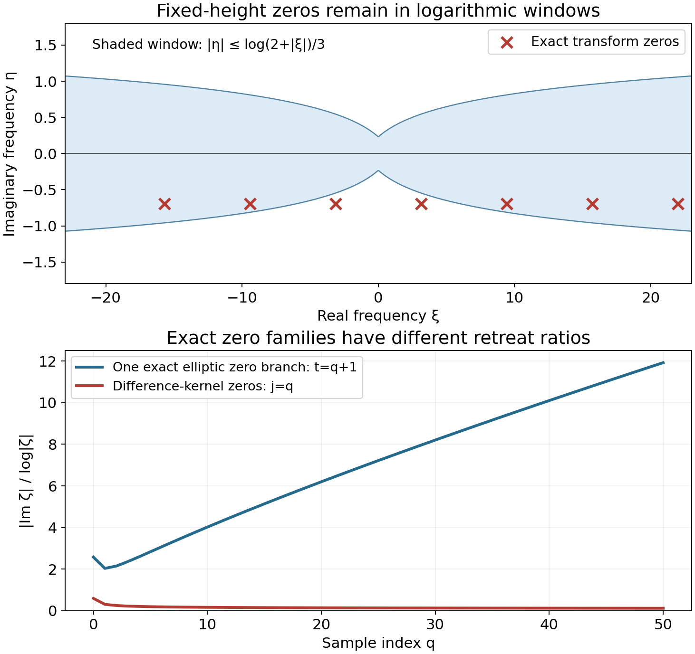
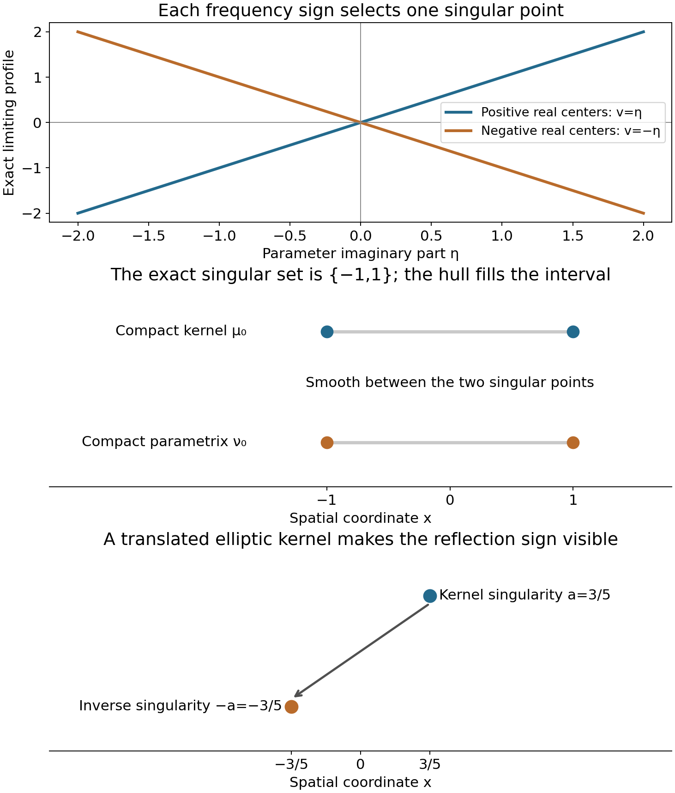

# Logarithmic zero retreat and reflected singularities

*Written by GPT-6.1 Sol (OpenAI), Ultra reasoning effort, October 2026. Self-checked by the writing AI GPT-6.1 Sol (OpenAI). Public domain (CC0 1.0).*

For a differential operator, local regularity concerns the same spatial point on both sides of the equation. A convolution kernel can also translate that point. Its inverse must reverse the translation. More general compact kernels can have several singular points, and an inverse modulo smooth functions reflects their whole singular set.

Basic references are Gerd Grubb's [Fourier transformation of distributions](https://web.math.ku.dk/~grubb/dist5.pdf), Richard Melrose's [Differential Analysis](https://ocw.mit.edu/courses/18-155-differential-analysis-fall-2004/), and Hörmander's *The Analysis of Linear Partial Differential Operators*, volumes I and II. Read [Slow decrease and entire Fourier division](../AN02-L163.html), [Locating singularities through logarithmic Fourier strips](../AN02-L158.html), and [Convolution modulo smooth functions and compact singularity bounds](../AN02-L172.html). The complete proof accompanying this chapter supplies the additional harmonic-profile and contour arguments.

## 1. How zeros can obstruct regularity

Use \(D=-i\partial\) and \(F(\zeta)=\langle\mu,e^{-ix\cdot\zeta}\rangle\). Every transform zero gives an exponential homogeneous solution:
\[
 \mu*e^{ix\cdot\zeta}=F(\zeta)e^{ix\cdot\zeta}=0.
 \tag{E1.1}
\]
The exponential itself is smooth. The obstruction comes from forming a distributional sum of such exponentials at escaping frequencies. When their imaginary parts are bounded by a fixed multiple of the logarithm of frequency, repeated integration by parts makes every compact test pairing bounded. Absolutely summable coefficients therefore give a distribution.

If every such solution were smooth, the closed graph theorem would bound its first derivative at a fixed point by the sum of its coefficient moduli. The one-term sums would then bound every complex frequency. This contradicts escape. That is why regularity requires
\[
 \frac{|\operatorname{Im}\zeta|}{\log|\zeta|}\longrightarrow+\infty
 \quad\text{along escaping zeros}.
 \tag{E1.2}
\]
The conclusion is about every fixed logarithmic width. A bound for only one width is insufficient.

There is a second requirement: the transform must be slowly decreasing. Otherwise the frequency-selective construction gives a compact nonsmooth input with smooth convolution. Combining slow decrease with (E1.2) defines hypoellipticity.

## 2. One exponent controls all widths

Let \(S=\operatorname{sing\,supp}\mu\). The complete proof shows that hypoellipticity is equivalent to
\[
 |F(\zeta)^{-1}|\le|\zeta|^B
       e^{H_S(-\operatorname{Im}\zeta)},\qquad
 |\operatorname{Im}\zeta|<m\log|\zeta|,\quad|\zeta|>C_m.
 \tag{E2.1}
\]
There is **one \(B\)** for every integer \(m\ge1\); the threshold \(C_m\) can change. The minus sign in the support function locates the inverse at the reflected spatial set.

To understand the common exponent, look at
\[
 L_c(z)=\frac{\log|F(c+z\log|c|)|}{\log|c|}.
 \tag{E2.2}
\]
Zero retreat makes this function harmonic on each fixed parameter ball once the center is sufficiently large. Slow decrease supplies a lower value at one nearby point. A positive harmonic comparison transfers that value to the center, with a constant independent of the later observation width.

Every limit becomes affine:
\[
 v(x+iy)=a\cdot y+b,\qquad a\in S,\qquad -A_0\le b\le N.
 \tag{E2.3}
\]
The spatial points \(a\) recovered from all profiles have closed union exactly \(S\). The contour construction uses \(B=A_0+1\).

On a neighborhood separated from \(-\operatorname{conv}S\), move the inverse integral to
\[
 \zeta(\xi)=\xi+it\theta\log(2+|\xi|^2).
 \tag{E2.4}
\]
If the separation gap is \(d>0\), the integrand after \(k\) spatial derivatives is bounded by a constant times
\[
 (1+|\xi|)^{B+k}(2+|\xi|^2)^{-td}.
 \tag{E2.5}
\]
The condition \(2td>B+k+n\) makes it integrable. Increasing \(t\) proves all derivative orders. Only the far-frequency part is moved; compact contour boundaries contribute smooth functions.

This gives a compact parametrix \(\nu\), meaning
\[
 \mu*\nu=\delta_0+r,\qquad r\in C_c^\infty.
 \tag{E2.6}
\]
Every global input satisfies
\[
 u=\nu*(\mu*u)-r*u.
 \tag{E2.7}
\]
The smooth compact factor \(r\) makes its convolution with any distribution smooth. Thus smooth forcing makes the input smooth.

The exact inverse singular set is stronger than its convex-hull bound. At high logarithmic frequencies,
\[
 L_\nu=-L_\mu+o(1).
 \tag{E2.8}
\]
Every singleton profile point \(a\) is replaced by \(-a\). The realization and nonconvex carrier theorems recover those closed unions, yielding
\[
 \operatorname{sing\,supp}\nu=-\operatorname{sing\,supp}\mu.
 \tag{E2.9}
\]
Subtracting a smooth solution for \(r\) produces a fundamental solution with the same exact singular set.

## 3. Four worked examples

### Example 1. A translated elliptic inverse

On the line let \(a=3/5\) and
\[
 \mu=(1-\partial_x^2)\delta_a,\qquad
 F(z)=(1+z^2)e^{-iaz},\qquad
 G_0(x)=\tfrac12e^{-|x|}.
 \tag{E3.1}
\]
The only transform zeros are \(i\) and \(-i\), so there is no escaping zero sequence. For real \(c\), \(|F(c)|=1+c^2\), which gives slow decrease.

The derivative of \(G_0\) jumps from \(1/2\) to \(-1/2\) at zero. Its ordinary second derivative off zero equals \(G_0\), while its distributional second derivative includes the jump:
\[
 G_0''=G_0-\delta_0,\qquad
 (1-\partial_x^2)G_0=\delta_0.
 \tag{E3.2}
\]
Consequently \(E(x)=G_0(x+a)\) satisfies \(\mu*E=\delta_0\). Its singularity is exactly at \(-a\); the derivative jump prevents smoothness there.

Choose a smooth compact cutoff \(\chi\) equal to one for \(|x|\le1\) and zero for \(|x|\ge2\). Then
\[
 \nu(x)=\chi(x+a)G_0(x+a)
 \tag{E3.3}
\]
is a compact parametrix with the same singular point. Direct differentiation gives
\[
 \mu*\nu=\delta_0+r,\qquad
 r(x)=-\chi''(x)G_0(x)-2\chi'(x)G_0'(x).
 \tag{E3.4}
\]
The error is smooth and supported in the two cutoff transition bands. The shifted argument in \(\nu\) becomes \(x\) after convolution with \(\delta_a\), explaining why \(r\) has no remaining \(a\).

### Example 2. Slow decrease with no logarithmic retreat

Take
\[
 \mu=\delta_{-1/2}+2\delta_{1/2},\qquad
 F(z)=e^{-iz/2}(e^{iz}+2).
 \tag{E3.5}
\]
On the real line the reverse triangle inequality gives \(|F(c)|\ge1\). Thus the kernel is slowly decreasing. Its complex zeros are exactly
\[
 z_j=(2j+1)\pi-i\log2,\qquad j\in\mathbb Z.
 \tag{E3.6}
\]
Their imaginary height is fixed, so (E1.2) fails.

There is an explicit nonsmooth homogeneous input:
\[
 u=\sum_{j\in\mathbb Z}(-2)^j\delta_j.
 \tag{E3.7}
\]
It is a distribution because the sum is locally finite. At the output point \(k+1/2\), the two convolution coefficients are
\((-2)^{k+1}+2(-2)^k=0\). Hence \(\mu*u=0\). The input is singular at every integer. Its coefficients grow in the positive direction, which is allowed in \(\mathcal D'(\mathbb R)\).

Its logarithmic profiles converge locally in integral to
\[
 v(x+iy)=\tfrac12|y|.
 \tag{E3.8}
\]
Above and below the real axis, one of the two exponential terms dominates, giving the two affine halves. Real lower and upper bounds exclude collapse; profile compactness identifies the local integral limit across the real axis. The corner at \(y=0\) is not harmonic. Its carrier is the whole interval \([-1/2,1/2]\), whereas the kernel's singular support is only the two endpoints. This is a nonhypoelliptic example where an individual carrier contains smooth points.

**Figure 1.** The upper panel displays the zeros (E3.6) for \(j=-3,\ldots,3\). The shaded comparison window is exactly \(|\eta|\le\log(2+|\xi|)/3\), expressed using the real center rather than the total complex norm. The two zeros closest to the origin are outside this narrow window; the large zeros enter it. The lower panel plots the exact ratios for \(j=q\) and for the elliptic branch \((t,i\sqrt{1+t^2})\), with \(t=q+1\), \(q=0,\ldots,50\). The two curves describe different kernels in dimensions one and two. The elliptic curve is one branch, not a proof for all its zeros. Example 2, Exercise 3 and Theorem 2.1 of the complete proof explain the obstruction and the scope of the comparison.

### Example 3. Local regularity despite a remote smooth tail

Let \(\mu\) be the kernel of Example 1 and let \(b\) be smooth, supported in \([11/4,13/4]\). Set \(\widetilde\mu=\mu+b\). The same compact \(\nu\) satisfies
\[
 \widetilde\mu*\nu=\delta_0+r+b*\nu.
 \tag{E3.9}
\]
The new error is smooth and compact. Thus \(\widetilde\mu\) remains hypoelliptic, and its singular set is still \(\{3/5\}\).

Use
\[
 X_1=X=(-1,1),\qquad X_2=(-2/5,8/5).
 \tag{E3.10}
\]
Both required singular inclusions hold with equality:
\[
 X+\{3/5\}=X_2,\qquad X_2-\{3/5\}=X_1.
 \tag{E3.11}
\]
Therefore a zero convolution class on \(X_2\) forces the input to be smooth on \(X\). At output zero, ordinary convolution with the remote tail would sample near input \(-3\), outside \(X_1\). The quotient operation remains defined because its sampling uses the singular point.

### Example 4. A hypoelliptic kernel with two separated singularities

This example makes the exact, nonconvex conclusion visible. Define the distributions
\[
 \lambda_\mp(x)=\operatorname{pv}\frac1{1-x^2}
                   \ \pm\ \frac{i\pi}{2}(\delta_{-1}+\delta_1).
 \tag{E3.12}
\]
Here \(\lambda_-\) uses the plus sign; it is the boundary value
\((1-x^2-i0)^{-1}\). The identity
\((s-i0)^{-1}=\operatorname{pv}(1/s)+i\pi\delta_0\)
follows by pairing \(s/(s^2+\varepsilon^2)+i\varepsilon/(s^2+\varepsilon^2)\) with a test: subtract its value at zero in the first integral, and rescale \(s=\varepsilon t\) in the second. Applying this at the two simple roots of \(1-x^2\), whose derivative moduli are two, gives (E3.12).

The elementary principal-value transform is
\[
 \mathcal F(\operatorname{pv}(1/x))(\xi)
                         =-i\pi\operatorname{sign}\xi.
 \tag{E3.13}
\]
For completeness, its odd integral is \(-2i\int_0^\infty\sin(\xi x)/x\,dx\). With a damping factor \(e^{-\varepsilon x}\), differentiation in \(\xi\) gives \(\varepsilon/(\varepsilon^2+\xi^2)\); integration from zero gives \(\arctan(\xi/\varepsilon)\). Letting \(\varepsilon\downarrow0\), with the principal value interpreted distributionally, proves (E3.13).

Use
\[
 \operatorname{pv}\frac1{1-x^2}
       =\tfrac12\left(-\operatorname{pv}\frac1{x-1}
                            +\operatorname{pv}\frac1{x+1}\right).
 \tag{E3.14}
\]
Translation and (E3.13) give
\[
 \widehat{\lambda_-}(\xi)=i\pi e^{-i|\xi|},\qquad
 \widehat{\lambda_+}(\xi)=-i\pi e^{i|\xi|}.
 \tag{E3.15}
\]
The imaginary delta terms contribute \(\pm i\pi\cos\xi\); the principal-value part contributes \(\pi\operatorname{sign}\xi\sin\xi\), which verifies both signs.

Choose \(\chi\in C_c^\infty((-2,2))\) equal to one near \([-3/2,3/2]\), and put
\[
 \mu_0=\chi\lambda_-,\qquad
 \nu_0=\pi^{-2}\chi\lambda_+.
 \tag{E3.16}
\]
The removed part \((1-\chi)/(1-x^2)\) is smooth and has every derivative integrable. Repeated integration by parts therefore makes its real Fourier transform \(q(\xi)\) decrease faster than every polynomial. Thus
\[
 \widehat{\mu_0}=i\pi e^{-i|\xi|}-q,\qquad
 \widehat{\nu_0}=\pi^{-2}(-i\pi e^{i|\xi|}-q).
 \tag{E3.17}
\]
Their product is one plus a rapidly decreasing function. Every derivative of its inverse Fourier error is absolutely integrable, so
\(\mu_0*\nu_0=\delta_0+r\), with \(r\) smooth. The error is compact because both kernels are compact. This proves hypoellipticity through the compact-parametrix equivalence.

Both singular sets are exactly \(\{-1,1\}\). The imaginary point masses ensure singularity at each endpoint, and the kernels are smooth elsewhere. Hence the parametrix is smooth at zero, although zero lies in the convex hull of its singular set.

The profiles also show the separation exactly. Fourier multiplication by \(\chi\) gives the entire formula
\[
 \widehat{\mu_0}(z)=\frac i2
           \int_{\mathbb R}\widehat\chi(z-s)e^{-i|s|}\,ds.
 \tag{E3.18}
\]
The integral converges locally uniformly in complex \(z\), by whole-complex smooth decay. If \(c=\operatorname{Re}z>1\), extend its positive-\(s\) contribution to all real \(s\). Fourier inversion, first on real \(z\) and then by the entire identity principle, identifies that contribution as \(i\pi e^{-iz}\chi(1)=i\pi e^{-iz}\). The changed negative-\(s\) tails obey
\[
 |\widehat{\mu_0}(z)-i\pi e^{-iz}|
             \le C_N(1+c)^{-N}e^{2|\operatorname{Im}z|}
 \quad(c>1)
 \tag{E3.19}
\]
for every \(N\): integrate the decay bound for \(\widehat\chi(z-s)\) over \(s<0\), where \(|c-s|\ge c+|s|\). On a fixed logarithmic strip that error is smaller than the leading term by every required power, after choosing \(N\) sufficiently large. Therefore the positive-center profile is \(y\). The negative-center calculation gives \(-y\). These are the only two profiles, with carriers \(\{1\}\) and \(\{-1\}\). Their closed union is the actual two-point singular set.

No ordinary convolution of the two noncompact boundary values was used. All products in this construction involve their compact representatives.

**Figure 2.** The first panel shows the exact profiles \(\eta\) and \(-\eta\) of the compact boundary-value kernel on the positive and negative real-center sequences. Its parametrix takes their negatives on those same sequences. The next panel marks the two actual singular sets \(\{-1,1\}\); the gray segments indicate their convex hulls, whose interiors are smooth. Vertical placement separates the two distributions schematically. The final panel marks the exact points \(3/5\) and \(-3/5\) from Example 1. Only horizontal coordinates carry spatial meaning. Examples 1 and 4 and Theorem 5.1 of the complete proof establish these sets and signs. These are original diagrams of the proved models.

## 4. Exercises and full solutions

Each exercise is worth 10 points, for a total of 100.

**Exercise 1.** Let \(W\ne\varnothing\). Explain why the exponential-series obstruction can use a first derivative at a point of \(W\), even when the zeros have nonzero imaginary parts and the observation point is not zero.

*Solution.* Choose \(x_0\in W\) and normalize each exponential as \(e_j(x)=e^{i(x-x_0)\cdot\zeta_j}\). Its compact test pairings have the additional factor \(e^{|x_0||\operatorname{Im}\zeta_j|}\), which is bounded by a fixed power of \(|\zeta_j|\). Increase the integration-by-parts order in (2.2) by that amount. This still makes the map \(\ell^1\to\mathcal D'\) continuous. Closed graph into \(C^\infty(W)\) bounds each first derivative at \(x_0\) by a constant times the coefficient norm. At a unit vector that derivative is \(i\zeta_{j,k}\), with no exponential modulus factor because the exponent vanishes at \(x_0\). Bounding all coordinates bounds \(|\zeta_j|\), giving the contradiction.

**Exercise 2.** Verify every zero in (E3.6), and verify the homogeneous equation for the full distribution (E3.7), including negative indices.

*Solution.* The nonzero factor \(e^{-iz/2}\) leaves the equation \(e^{iz}=-2\). Writing \(z=x+iy\) gives \(e^{-y}=2\) and \(e^{ix}=-1\), so \(y=-\log2\) and \(x=(2j+1)\pi\), with all \(j\in\mathbb Z\). For the distribution, translating by \(-1/2\) gives coefficient \((-2)^{k+1}\) at \(k+1/2\), while twice translating by \(1/2\) gives \(2(-2)^k\). Their sum vanishes for every integer \(k\), including negative \(k\), since the same integer-power identity holds there. Each compact test sees only finitely many output points, so coefficient cancellation proves the full distributional identity.

**Exercise 3.** In two dimensions consider \(P(\zeta)=1+\zeta_1^2+\zeta_2^2\). For \(t\ge1\), compute the zero-retreat ratio on the exact branch \(\zeta(t)=(t,i\sqrt{1+t^2})\). Compare it with the zeros of Exercise 2.

*Solution.* Substitution gives \(1+t^2-(1+t^2)=0\). Its imaginary modulus is \(\sqrt{1+t^2}\), and its complex Euclidean modulus is \(\sqrt{1+2t^2}\). Thus the ratio is \(\sqrt{1+t^2}/\log\sqrt{1+2t^2}\), which tends to infinity because its numerator grows linearly and its denominator logarithmically. For Exercise 2 the ratio is \((\log2)/\log\sqrt{((2j+1)\pi)^2+(\log2)^2}\), tending to zero. The first calculation checks one branch; the general elliptic criterion in the preceding polynomial lesson, rather than a single branch, proves retreat for every escaping polynomial zero.

**Exercise 4.** Derive the cutoff error in (E3.4) and locate its support and all singularities of the compact parametrix.

*Solution.* Product differentiation gives \((\chi G_0)''=\chi''G_0+2\chi'G_0'+\chi(G_0-\delta_0)\). Since \(\chi=1\) at zero, \((1-\partial^2)(\chi G_0)=\delta_0-\chi''G_0-2\chi'G_0'\). Convolution by the shifted differential kernel evaluates the parametrix at \(x-a\), turning \(\chi(x-a+a)G_0(x-a+a)\) into \(\chi(x)G_0(x)\); this proves (E3.4). Both cutoff derivatives vanish on \([-1,1]\) and outside \([-2,2]\). In their transition bands \(G_0\) is smooth, so the error is smooth there and everywhere. The parametrix has precisely the derivative jump at \(x=-a\), with no additional singularities from its smooth cutoff.

**Exercise 5.** Compute the real Fourier product of the two compact boundary-value representatives in (E3.17), using the same removed-tail transform \(q\). Explain why this produces a smooth compact error without assuming that the noncompact boundary values can be convolved.

*Solution.* Put \(r=|\xi|\). Then
\[
 \widehat{\mu_0}\widehat{\nu_0}
 =1+\pi^{-2}\bigl(q^2-2\pi q\sin r\bigr).
 \tag{E4.1}
\]
Indeed \((i\pi e^{-ir})(-i\pi e^{ir})=\pi^2\), and the sum of the two leading factors is \(i\pi(e^{-ir}-e^{ir})=2\pi\sin r\). The error has arbitrary polynomial decay because \(q\) does and the trigonometric factor is bounded. Multiplying it by any \(\xi^k\) remains integrable; Fourier inversion gives a smooth error. The compact convolution \(\mu_0*\nu_0\) exists and has compact support, so its difference from \(\delta_0\) is compact. The argument never forms \(\lambda_-*\lambda_+\).

**Exercise 6.** Suppose a proper profile has the form \(v=a\cdot\operatorname{Im}z+b\). Prove that \(a\) is a singular point, using the realization theorem. State why a general convex carrier cannot be treated the same way.

*Solution.* The indicator is \(a\cdot\eta\), whose carrier is \(\{a\}\). Realization gives a compact factor \(w\) singular only at zero for which the output singular hull is \(\{a\}\). That hull is nonempty, so the output singular set is itself exactly \(\{a\}\). Compact singular-support inclusion puts it inside \(\operatorname{sing\,supp}\mu+\{0\}\), proving \(a\in\operatorname{sing\,supp}\mu\). If the output hull is an interval or another larger convex set, its interior can consist of smooth points. Example 2 has an interval carrier with only its endpoints singular; the singleton step is essential.

**Exercise 7.** Let \(n=3\), \(B=4\), and suppose a separating neighborhood has gap \(d=2/5\). Find a \(t\) that makes the inverse contour integral and all its spatial derivatives through order five absolutely integrable. Explain the strict inequality.

*Solution.* The needed condition is \(2td>B+5+n=12\). Since \(2d=4/5\), take \(t=16\), giving \(2td=64/5>12\). The order-five tail is then bounded by a constant times \(|\xi|^{4+5-64/5}=|\xi|^{-19/5}\). In three dimensions its radial integral has exponent \(2-19/5=-9/5<-1\), so it converges. At equality \(2td=12\), the radial exponent is \(-1\), whose logarithmic integral diverges; a strict margin is needed.

**Exercise 8.** For \(\mu=\delta_2\), show why letting the reciprocal exponent depend on strip width would falsely permit the support function zero in place of the correct reflected support function.

*Solution.* The transform is \(e^{-2iz}\), and the reciprocal modulus is \(e^{-2\operatorname{Im}z}\). On \(|\operatorname{Im}z|<m\log|z|\), it is at most \(|z|^{2m}\). Thus using \(B_m=2m\) would permit the incorrect ceiling with \(H=0\). No single \(B\) works: choose an integer \(m>B+1\), put \(z=c-i(m/2)\log c\), and let \(c\to\infty\). This lies in that strip eventually, its reciprocal modulus is \(c^m\), and \(|z|\sim c\), exceeding \(|z|^B\). The correct singular set is \(\{2\}\); its contribution \(H_{\{2\}}(-\operatorname{Im}z)=-2\operatorname{Im}z\) gives exact equality with \(B=0\) in every strip.

**Exercise 9.** Replace the kernel of Example 1 by \(i\mu\). Find a fundamental solution, its singular point and the reflected kernel for the bilinear pairing.

*Solution.* Multiply the old inverse by \(1/i=-i\): \(\widetilde E(x)=-iG_0(x+a)\). Then \((i\mu)*\widetilde E=\mu*E=\delta_0\), and its singular point remains \(-a\). Reflection gives \(i(1-\partial_x^2)\delta_{-a}\), because the second derivative has even reflection parity and reflection does not conjugate the scalar coefficient. Replacing \(i\) by \(-i\) in that reflected kernel would be a sesquilinear convention and would reverse the sign of this inverse calculation.

**Exercise 10.** Give compatible domains showing that the sufficient local theorem needs \(X+S\subset X_2\), even though the necessary theorem does not assume it.

*Solution.* Take \(\mu=\delta_{3/5}\), \(X_1=(-2,2)\), \(X_2=(0,1)\), and \(X=(-3/2,-1)\). Its singular set is \(S=\{3/5\}\), and \(X_2-S=(-3/5,2/5)\subset X_1\). But \(X+S=(-9/10,-2/5)\) is disjoint from \(X_2\). The input \(u=\delta_{-5/4}\) is singular in \(X\); its output is \(\delta_{-13/20}\), whose restriction to \(X_2\) is zero. Thus a zero output class does not make this input smooth on \(X\). The missing inclusion is exactly the one that would permit the inverse to sample that point from the equation domain.

## References

- Gerd Grubb, *Fourier transformation of distributions*, University of Copenhagen, [freely accessible lecture notes](https://web.math.ku.dk/~grubb/dist5.pdf).
- Richard Melrose, *Differential Analysis*, MIT OpenCourseWare, Fall 2004, [course and lecture notes](https://ocw.mit.edu/courses/18-155-differential-analysis-fall-2004/).
- Lars Hörmander, *The Analysis of Linear Partial Differential Operators I* and *II*, Springer. The full convolution regularity and boundary-value theories are credited to these works. This chapter supplies the required proofs and links its exact preceding arguments.

## Complete proof

A compact convolution kernel can move singularities as well as differentiate them. Its regularity criterion therefore needs both the complex zeros of its Fourier transform and the positions of its singularities. We prove that logarithmic retreat of those zeros, together with slow decrease, gives a compact inverse modulo smooth functions. The inverse has precisely the reflected singular set of the kernel.

Basic references are Gerd Grubb's [Fourier transformation of distributions](https://web.math.ku.dk/~grubb/dist5.pdf), Richard Melrose's [Differential Analysis](https://ocw.mit.edu/courses/18-155-differential-analysis-fall-2004/), and Lars Hörmander's *The Analysis of Linear Partial Differential Operators*, volumes I and II. Every required proof is given here or in the following preceding lessons:

- [Slow decrease and entire Fourier division](../AN02-L163.html), Theorem 1.1: slow decrease is equivalent to the absence of collapsed logarithmic profiles.
- [Frequency-selective singularities and smooth convolutions](../AN02-L162.html), Theorem 1.1: a collapsed profile produces an arbitrarily small compact factor singular at any prescribed point, with smooth convolution.
- [Joint logarithmic-frequency limits](../AN02-L157.html), Theorem 2.1: profile compactness and canonical representatives.
- [Locating singularities through logarithmic Fourier strips](../AN02-L158.html), Theorem 1.1: one polynomial order works in every logarithmic strip.
- [Singularities and nonconvex logarithmic carriers](../AN02-L159.html), Theorem 1.1: singular support lies in the closed union of the individual profile carriers.
- [Recovering singularities from convolution profiles](../AN02-L164.html), Theorem 2.1: an individual carrier is realized as the singular hull of a convolution with a factor singular only at zero.
- [Convolution modulo smooth functions and compact singularity bounds](../AN02-L172.html), Lemma 1.1, Theorem 1.2 and Lemma 1.3: singular-support inclusion, the local quotient operation and its composition.
- [Fréchet duality and smooth convolution solvability](../AN02-L171.html), Theorem 8.1: slow decrease and support convexity give a smooth solution for every smooth datum.
- [Banach estimates, quotient spaces and compact parameter arguments](../prerequisites/banach-foundation-bridges.html), Section 14.5: the Fréchet closed graph theorem.

## 1. The spectral condition and its quantifiers

Let \(n\ge1\), let \(\mu\in\mathcal E'(\mathbb R^n)\), and put
\[
 F(\zeta)=\langle\mu(x),e^{-ix\cdot\zeta}\rangle,\qquad
 S=\operatorname{sing\,supp}\mu,\qquad
 H_S(\eta)=\max_{a\in S}a\cdot\eta
 \quad(S\ne\varnothing).
 \tag{1.1}
\]
The pairing is complex bilinear. Compact convolution with any global distribution is defined. Slow decrease, also called invertibility of \(\mu\), has the meaning of the first preceding theorem; it does not mean that \(F\) has no zeros.

We say that the zeros have **logarithmic retreat** when, for every \(m>0\), there is \(R_m>e\) such that
\[
 F(\zeta)\ne0
 \quad\hbox{if}\quad
 |\zeta|>R_m,\qquad
 |\operatorname{Im}\zeta|\le m\log|\zeta|.
 \tag{1.2}
\]
Equivalently, along every escaping sequence of zeros,
\[
 \frac{|\operatorname{Im}\zeta|}{\log|\zeta|}\longrightarrow+\infty.
 \tag{1.3}
\]
Indeed, failure of either formulation supplies an escaping zero sequence with a bounded quotient; that sequence fails the other formulation. If there is no escaping zero sequence, the assertion is vacuous.

A compact kernel is called **hypoelliptic** when it is slowly decreasing and has logarithmic retreat. Section 6 proves that this is exactly the expected regularity property on all distributional inputs.

For real \(|c|>2\), write
\[
 \ell_c=\log|c|,\qquad
 L_c(z)=\frac{\log|F(c+\ell_c z)|}{\ell_c}.
 \tag{1.4}
\]
At a zero the logarithm is minus infinity. A proper profile is a canonical local \(L^1(\mathbb C^n)\) limit of these functions along an escaping sequence. A collapsed profile tends uniformly to minus infinity on every compact parameter set.

## 2. A nonsmooth exponential family detects zeros

**Theorem 2.1 (necessity of logarithmic retreat).** If every global distribution \(u\) with \(\mu*u=0\) is smooth on some fixed nonempty open set \(W\), then (1.2) holds.

*Proof.* Otherwise choose zeros \(\zeta_j\), with \(|\zeta_j|\to\infty\), and a finite \(M\) such that
\[
 |\operatorname{Im}\zeta_j|\le M\log|\zeta_j|.
 \tag{2.1}
\]
Choose \(x_0\in W\) and set \(e_j(x)=e^{i(x-x_0)\cdot\zeta_j}\). For every compactly supported smooth test \(\phi\), repeated integration by parts in a complex coordinate of largest modulus gives
\[
 |\langle e_j,\phi\rangle|
 \le C_{K,N}(1+|\zeta_j|)^{-N}
       e^{(\sup_{x\in K}|x|+|x_0|)|\operatorname{Im}\zeta_j|}
       p_N(\phi),
 \quad \operatorname{supp}\phi\subset K.
 \tag{2.2}
\]
For the finitely many small \(\zeta_j\) enlarge the constant. The integration by parts divides by \(\zeta_{j,k}^N\), with
\(|\zeta_{j,k}|\ge|\zeta_j|/\sqrt n\); it differentiates the test, so it is valid for complex \(\zeta_j\). Choose \(N>M(\sup_K|x|+|x_0|)+1\). Thus the distributions \(e_j\) form a bounded family on each test space.

Consequently
\[
 u_a=\sum_{j\ge1}a_j e_j,\qquad a\in\ell^1,
 \tag{2.3}
\]
is a distribution: every test pairing converges absolutely, with the compact finite-order estimate (2.2). The map \(a\mapsto u_a\) is continuous into distributions with their weak topology. Compact convolution is weakly continuous, and
\(\mu*e_j=F(\zeta_j)e_j=0\), so \(\mu*u_a=0\).

By hypothesis \(u_a|_W\) is smooth. The map from \(\ell^1\) to \(C^\infty(W)\) has closed graph. If \(a^{(r)}\to a\) and \(u_{a^{(r)}}|_W\to v\) smoothly, the weak distributional limit also is \(u_a|_W\), so \(v=u_a|_W\). The closed graph theorem makes this map continuous.

Apply continuity to the first derivatives at \(x_0\), and then to the \(j\)-th unit vector of \(\ell^1\). For every coordinate \(k\),
\[
 |\zeta_{j,k}|=|\partial_k e_j(x_0)|\le C_k.
 \tag{2.4}
\]
This bounds \(|\zeta_j|\), a contradiction. \(\square\)

This argument permits exponentially growing distributions. Restricting the input to tempered or compact distributions would change the hypothesis.

**Theorem 2.2 (necessity on one local configuration).** Let \(X_1,X_2,X\) be nonempty open sets, with \(X\subset X_1\) and
\[
 X_2-S\subset X_1.
 \tag{2.5}
\]
Suppose that the canonical quotient equation
\(\mu_*[u]=0\) on \(X_2\), for \(u\in\mathcal D'(X_1)\), always implies \(u|_X\in C^\infty(X)\). Then \(\mu\) is slowly decreasing and satisfies (1.2).

*Proof.* If \(\mu\) is not slowly decreasing, the profile characterization and the isolated-singularity theorem supply a compact continuous \(w\), singular precisely at any chosen \(x_0\in X\), whose support is inside \(X_1\), and for which \(\mu*w\) is smooth globally. Its class on \(X_1\) violates the assumed implication. This also handles the zero kernel and compact smooth kernels.

Every global homogeneous solution restricts to a quotient solution on \(X_2\): the quotient operation agrees locally with its global convolution. The hypothesis makes that global solution smooth on \(X\). Theorem 2.1 now gives logarithmic retreat. No condition \(X+S\subset X_2\) is needed for this necessary direction. \(\square\)

## 3. Harmonic profiles give one reciprocal exponent

We supply the harmonic estimates used in this step. They are also what prevents the exponent from changing when the strip widens.

**Lemma 3.1 (a point lower bound survives at the center).** Let \(h\) be a nonnegative harmonic function on a real ball \(B(0,2r)\subset\mathbb R^d\). For \(|z|\le r\),
\[
 h(0)\le C_d h(z),\qquad C_d=4^d.
 \tag{3.1}
\]

*Proof.* A smooth harmonic function has the ball mean property. To verify it, differentiate its spherical average with respect to the radius. The divergence theorem expresses that derivative as the integral of its Laplacian over the ball, divided by the sphere's area, so it is zero. The average tends to the center value as the radius tends to zero. Integrating the sphere means radially gives the ball mean. Positive radial smooth averaging kernels have the same property.

Put \(w=z/2\). All the following balls lie in the domain:
\[
 B(0,r/2)\subset B(w,r),\qquad
 B(w,r/2)\subset B(z,r).
 \tag{3.2}
\]
Nonnegativity, the ball means and the ratio \(2^d\) of the two volumes give \(h(0)\le2^dh(w)\le4^dh(z)\). The corresponding containments with zero and \(z\) interchanged also give \(h(z)\le4^dh(0)\). If a largest ball approaches the domain boundary, obtain its mean by increasing smaller radii; nonnegativity permits monotone convergence of the integrals. \(\square\)

**Lemma 3.2 (linear upper growth makes a harmonic function affine).** A harmonic \(v\) on \(\mathbb R^d\) with \(v(z)\le C(1+|z|)\) is real affine.

*Proof.* Fix a center \(z_0\). On \(B(z_0,2R)\) subtract \(v\) from the positive constant \(M_R=C(1+|z_0|+2R)+1\). The reverse comparison in Lemma 3.1 bounds this positive harmonic difference on the half-radius ball by a dimensional multiple of its value at \(z_0\). Hence
\(\sup_{B(z_0,R)}|v|\le C_{z_0}(1+R)\).
Choose a fixed smooth radial nonnegative kernel \(\rho\), supported in the unit ball and of integral one. The proved mean property gives \(v=v*\rho_R\), where \(\rho_R(x)=R^{-d}\rho(x/R)\). Twice differentiate this convolution, putting the derivatives on the compact smooth factor. Its derivative \(L^1\) norm is \(R^{-2}\|\partial_j\partial_k\rho\|_1\), so
\[
 |\partial_j\partial_k v(z_0)|
       \le C_\rho R^{-2}\sup_{B(z_0,R)}|v|
       \longrightarrow0.
 \tag{3.3}
\]
Every second derivative vanishes at every center; the gradient is constant. \(\square\)

**Proposition 3.3 (all profiles become affine).** If \(\mu\) is slowly decreasing and has logarithmic retreat, then there is one \(A_0\ge0\) such that every profile is proper and has the form
\[
 v(x+iy)=a\cdot y+b,\qquad a\in S,\qquad -A_0\le b\le N.
 \tag{3.4}
\]
Here \(N\) is one finite order in the singular-strip estimate. Moreover,
\[
 S=\overline{\{a:\text{the profile }a\cdot\operatorname{Im}z+b
                         \text{ occurs}\}}.
 \tag{3.5}
\]

*Proof.* Fix a parameter ball \(|z|\le R\). As \(|c|\to\infty\),
\[
 |c+\ell_c z|\sim|c|,\qquad
 |\operatorname{Im}(c+\ell_c z)|\le R\log|c|.
 \tag{3.6}
\]
Logarithmic retreat therefore makes \(F(c+\ell_c z)\) zero-free on that ball for all sufficiently large \(c\). Its logarithm of modulus is pluriharmonic there, and in particular harmonic in real dimension \(2n\).

Slow decrease gives a fixed radius \(r\), a fixed \(a_0\), and a point \(z_c\) in \(|z|<r\) such that \(L_c(z_c)\ge-a_0\), for every sufficiently large real center. This is the complex logarithmic-window inequality of the preceding slow-decrease theorem, after absorbing \(\log(2+|c|)/\log|c|\) and its fixed constants.

The ordinary compact Fourier estimate bounds \(L_c\) above by one fixed positive number \(U\) on \(|z|\le2(r+1)\), once \(|c|\) is large. Apply Lemma 3.1 to the nonnegative harmonic function \(U-L_c\). It gives
\[
 L_c(0)\ge U-C_{2n}(U+a_0)\ge-A_0
 \tag{3.7}
\]
with one \(A_0\). No strip width entered this choice. Slow decrease also excludes every collapsed profile.

Along a proper \(L^1_{\rm loc}\) extraction, the eventually harmonic \(L_c\) converge locally smoothly. To justify that upgrade, on a smaller ball a harmonic function equals convolution with any smooth radial averaging kernel supported in a surrounding ball. Local \(L^1\) convergence then gives uniform convergence of that convolution and every derivative. Its limit equals the canonical profile: the distributional limit is the same, and radial recovery fixes its representative. The limit is harmonic and pluriharmonic. In particular (3.7) passes to \(v(0)\).

The singular-strip theorem supplies
\[
 v(z)\le N+H_S(\operatorname{Im}z).
 \tag{3.8}
\]
If \(S\) were empty, \(\mu\) would be smooth and its whole-complex rapid decay would contradict slow decrease on a fixed logarithmic window. Thus \(S\ne\varnothing\). Since it is compact, (3.8) has linear upper growth. Lemma 3.2 makes \(v\) affine. Independence of the upper bound from \(\operatorname{Re}z\) forces all its real-direction coefficients to vanish. Thus \(v=a\cdot\operatorname{Im}z+b\), with \(-A_0\le b\le N\).

The indicator of this profile is \(a\cdot\eta\), and its carrier is the singleton \(\{a\}\). The realization theorem supplies a compact \(w\), singular only at zero, with
\(\operatorname{conv}\operatorname{sing\,supp}(\mu*w)=\{a\}\).
This output has a nonempty singular set, necessarily \(\{a\}\). The singular-support inclusion for compact convolution puts it inside
\(S+\{0\}=S\). Therefore \(a\in S\). This argument is needed: a general individual profile carrier need not be contained in singular support.

The nonconvex carrier theorem gives the converse inclusion in the closed union of these singleton carriers. Since \(S\) is closed and contains every such \(a\), this proves (3.5). \(\square\)

**Theorem 3.4 (one exponent in every reciprocal strip).** The following are equivalent:

1. \(\mu\) is slowly decreasing and has logarithmic retreat.
2. \(S\ne\varnothing\), and there are one \(B\ge0\) and constants \(C_m>e\), for each integer \(m\ge1\), such that
   \[
   F(\zeta)\ne0,\qquad
   |F(\zeta)^{-1}|\le|\zeta|^B e^{H_S(-\operatorname{Im}\zeta)}
   \quad\hbox{if}\quad
   |\zeta|>C_m,\quad|\operatorname{Im}\zeta|<m\log|\zeta|.
   \tag{3.9}
   \]

*Proof of \(1\Rightarrow2\).* Set \(B=A_0+1\). For each fixed parameter compact set, all sufficiently large centers have
\[
 -L_c(z)\le H_S(-\operatorname{Im}z)+B.
 \tag{3.10}
\]
If this failed, extract a failing sequence and then a proper profile. Eventual harmonicity upgrades the convergence to local uniform convergence, including the moving failing points. Proposition 3.3 gives
\(-v(z)=-a\cdot\operatorname{Im}z-b\le H_S(-\operatorname{Im}z)+A_0\),
contradicting the extra margin of one.

Write \(\zeta=c+i\eta\), with \(c\) real. Under the strip condition in (3.9), \(|c|\to\infty\), \(|\zeta|/|c|\to1\), and
\(|\eta|/\log|c|<2m\), once \(|\zeta|\) is sufficiently large. Apply (3.10) on \(|z|\le2m\) at \(z=i\eta/\log|c|\). Homogeneity gives
\[
 \log|F(\zeta)^{-1}|
       \le B\log|c|+H_S(-\eta)
       \le B\log|\zeta|+H_S(-\eta).
 \tag{3.11}
\]
The threshold depends on \(m\), while \(B\) does not.

*Proof of \(2\Rightarrow1\).* The zero-free assertion on every strip gives (1.2), using an integer width slightly larger than any prescribed real width. On the real space, (3.9) gives \(|F(c)|\ge|c|^{-B}\) for large \(|c|\). This is a slow-decrease bound on the tail. On a bounded set of centers, a nonzero entire function has a positive maximum on each fixed complex ball; compactness of the center set gives a positive minimum of these maxima. Enlarging the logarithmic-window constant absorbs that finite region, as in the preceding slow-decrease theorem. \(\square\)

## 4. Moving the inverse integral only where it is holomorphic

**Theorem 4.1 (a parametrix with a reflected singular hull).** Under the equivalent conditions of Theorem 3.4 there is a tempered distribution \(G\) with
\[
 \mu*G-\delta_0\in C^\infty,\qquad
 \operatorname{sing\,supp}G\subset-\operatorname{conv}S.
 \tag{4.1}
\]

*Proof.* Choose \(R>C_1\) large enough that the real reciprocal bound holds outside \(|\xi|\le R\). Define
\[
 G(\phi)=(2\pi)^{-n}
       \int_{|\xi|>R}\frac{\widehat\phi(-\xi)}{F(\xi)}\,d\xi .
 \tag{4.2}
\]
Real smooth test transforms have arbitrary polynomial decay. The reciprocal has polynomial growth. Thus (4.2) is absolutely convergent and continuous on the Schwartz space, in particular on every compact test space. Multiplication by \(F\) in the real Fourier representation yields
\[
 \mu*G=\delta_0-b_R,\qquad
 b_R(x)=(2\pi)^{-n}\int_{|\xi|\le R}e^{ix\cdot\xi}\,d\xi .
 \tag{4.3}
\]
Every derivative of \(b_R\) is an integral over a fixed bounded ball, so \(b_R\) is smooth. The compact convolution identity also follows directly by substituting its adjoint test in (4.2), which verifies the reflection sign.

Put \(K=-\operatorname{conv}S\). Fix a point outside \(K\). The closest-point separating direction gives a unit \(\theta\), a neighborhood \(U\) of that point, and \(d>0\) with
\[
 x\cdot\theta-H_K(\theta)\ge d\quad(x\in U).
 \tag{4.4}
\]
We can and do shrink \(U\) to have compact closure. For a fixed \(t>0\), consider the graphs
\[
 \zeta_s(\xi)=\xi+is\theta\log(2+|\xi|^2),
 \qquad0\le s\le t.
 \tag{4.5}
\]
Choose an integer \(m>3t+1\). Outside a sufficiently large real ball of radius \(R_t\ge R\), all these graphs and the intervening deformation lie in the zero-free region of (3.9). Indeed their imaginary height is at most \(t\log(2+|\xi|^2)\), their real part is \(\xi\), and
\(\log(2+|\xi|^2)<3\log|\xi|\) on the tail. The reciprocal is holomorphic throughout that exterior deformation.

For a compact smooth test \(\phi\), apply Stokes' theorem to the closed holomorphic \(n\)-form
\[
 \omega_\phi(\zeta)=F(\zeta)^{-1}\widehat\phi(-\zeta)
                       \,d\zeta_1\wedge\cdots\wedge d\zeta_n
 \tag{4.6}
\]
on the deformation over \(R_t<|\xi|<T\). The pullback to the graph has determinant
\[
 J_s(\xi)=1+is\,\theta\cdot
               \frac{2\xi}{2+|\xi|^2},\qquad |J_s(\xi)|\le1+s.
 \tag{4.7}
\]
This is the complex rank-one determinant; no surface-area factor replaces it.

Here are the needed boundary estimates. On a compact physical test support \(L\), whole-complex integration by parts gives, for any integer \(q\),
\[
 |\widehat\phi(-\zeta)|
       \le C_{L,q}p_q(\phi)(1+|\zeta|)^{-q}
                          e^{H_L(-\operatorname{Im}\zeta)}.
 \tag{4.8}
\]
On (4.5), \(|\zeta_s|\) is comparable to \(1+|\xi|\), with constants depending on \(t\). The support functions in (3.9) and (4.8) contribute at most
\((2+|\xi|^2)^{t(r_S+r_L)}\), where \(r_S=\max_{a\in S}|a|\) and \(r_L=\max_{x\in L}|x|\).
The outer side pullback has coefficients bounded by a constant times \(\log(2+T^2)\): its parameter derivative is \(i\theta\log(2+T^2)\), while every tangential derivative differs from its real tangential derivative by a uniformly bounded term. Its real sphere has area of order \(T^{n-1}\). Thus its integral is bounded by
\[
 C_{L,t,q}p_q(\phi)\,
 T^{n-1+B-q+2t(r_S+r_L)}\log(2+T^2),
 \tag{4.9}
\]
which tends to zero by choosing \(q>n+B+2t(r_S+r_L)+2\).
The same bounds make both exterior graph integrals absolutely convergent. The inner side lies in a fixed compact set of complex frequencies, where the reciprocal is smooth and zero-free. Its inverse Fourier expression is a smooth function of \(x\): differentiation under that compact parameter integral is allowed to every order. The original real annulus \(R<|\xi|\le R_t\) likewise contributes a smooth function.

It follows that, with a smooth function \(g_t\) accounting for those compact boundaries,
\[
 G(\phi)=(2\pi)^{-n}\int_{|\xi|>R_t}
       \frac{\widehat\phi(-\zeta_t(\xi))}{F(\zeta_t(\xi))}
                  J_t(\xi)\,d\xi+g_t(\phi).
 \tag{4.10}
\]
The sign of each inner-boundary contribution is its Stokes orientation; only its smoothness is needed. This argument moves no contour through a transform zero.

For \(x\in U\), the reciprocal bound and (4.4) give
\[
 \left|\frac{e^{ix\cdot\zeta_t(\xi)}}{F(\zeta_t(\xi))}\right|
 \le C_t(1+|\xi|)^B(2+|\xi|^2)^{-td}.
 \tag{4.11}
\]
An \(x\)-derivative of order \(k\) costs at most \(C_{t,k}(1+|\xi|)^k\). Choose \(t\) so that
\[
 2td>B+k+n.
 \tag{4.12}
\]
The integral in (4.10) then represents a \(C^k\) function on \(U\), by the integrable bound (4.11), the determinant bound and differentiation under the integral. Substituting
\(\widehat\phi(-\zeta)=\int e^{ix\cdot\zeta}\phi(x)\,dx\) for tests in \(U\) is justified by the same bound and Fubini's theorem. The compact term \(g_t\) is smooth. Since \(k\) is arbitrary and every representation equals the same distribution \(G\), it is smooth on \(U\). This proves (4.1). \(\square\)

**Corollary 4.2 (a compact parametrix).** There is \(\nu\in\mathcal E'\) with
\[
 \mu*\nu=\delta_0+r,\qquad r\in C_c^\infty.
 \tag{4.13}
\]

*Proof.* Choose \(\chi\in C_c^\infty\) equal to one near the compact set \(K\), and set \(\nu=\chi G\). Since \(G\) is smooth outside \(K\), \(G-\nu\) is globally smooth. Convolution of a compact distribution with a smooth function is smooth, by differentiating its finite-order pairing. Thus
\(\mu*\nu-\delta_0=(\mu*G-\delta_0)-\mu*(G-\nu)\) is smooth. It is also compactly supported, because \(\mu,\nu,\delta_0\) are compact. \(\square\)

## 5. Recovering the exact reflected set

**Theorem 5.1 (exact singularities of a compact parametrix).** If \(\mu\) is hypoelliptic and \(\nu\in\mathcal E'\) satisfies (4.13), then
\[
 \operatorname{sing\,supp}\nu=-S.
 \tag{5.1}
\]

*Proof.* Compact smooth Fourier decay gives, uniformly on every fixed complex parameter ball,
\[
 F_r(c+\ell_c z)\longrightarrow0.
 \tag{5.2}
\]
Indeed its arbitrary negative polynomial order absorbs the fixed exponential cost of that logarithmic ball. Fourier multiplication in (4.13) gives
\[
 F_\nu(c+\ell_c z)
      =\frac{1+F_r(c+\ell_c z)}{F(c+\ell_c z)}
 \tag{5.3}
\]
once \(|c|\) is large. Both numerator and denominator are zero-free on the fixed parameter ball. Consequently
\[
 L_\nu(z,c)=-L_c(z)
       +\frac{\log|1+F_r(c+\ell_c z)|}{\ell_c},
 \tag{5.4}
\]
and the last term tends uniformly to zero.

Every escaping sequence has a further proper, locally smooth profile
\(a\cdot\operatorname{Im}z+b\) for \(\mu\), by Proposition 3.3. Formula (5.4) gives the opposite proper profile for \(\nu\) on that same sequence. Conversely any profile extraction for \(\nu\) can be refined by extracting the \(\mu\) profile; (5.4) then identifies its limit. In particular no \(\nu\) profile collapses, and every proper carrier of \(\nu\) is one of the singletons \(\{-a\}\) obtained in this way. Every occurring \(\mu\) singleton supplies that opposite \(\nu\) singleton.

For any compact distribution whose proper carriers are singletons, the argument at the end of Proposition 3.3 applies: realization plus singular-support inclusion puts every singleton point in its singular support; the nonconvex carrier theorem supplies the reverse inclusion in their closed union. Apply this statement to both kernels. Their closed singleton unions are exact reflections by (5.4), proving (5.1). Convexification alone would not prove this conclusion. \(\square\)

## 6. Seven equivalent regularity statements

**Theorem 6.1.** For a compact kernel \(\mu\), the following are equivalent:

1. For every \(u\in\mathcal D'(\mathbb R^n)\), smoothness of \(\mu*u\) implies smoothness of \(u\).
2. \(\mu\) is hypoelliptic in the spectral sense of Section 1.
3. There is a global distributional parametrix \(G\), with \(\mu*G-\delta_0\) smooth and
   \(\operatorname{conv}\operatorname{sing\,supp}G\subset-\operatorname{conv}S\).
4. There is a compact parametrix.
5. There is a compact parametrix with singular support exactly \(-S\).
6. There is a global fundamental solution \(E\), with \(\mu*E=\delta_0\) and singular support exactly \(-S\).
7. On all open domains \(X\subset X_1\), \(X_2\), with
   \[
   X+S\subset X_2,\qquad X_2-S\subset X_1,
   \tag{6.1}
   \]
   the equation \(\mu_*[u]=0\) on \(X_2\), for \(u\in\mathcal D'(X_1)\), implies \(u|_X\in C^\infty(X)\).

When \(S\ne\varnothing\), the two inclusions in (6.1) already imply \(X\subset X_1\): use any one \(a\in S\) in both inclusions. We state that restriction explicitly so the conclusion has a domain.

*Proof.* Condition 1 implies slow decrease by the isolated-singularity obstruction used in Theorem 2.2. It implies logarithmic retreat by Theorem 2.1 with \(W=\mathbb R^n\). Thus \(1\Rightarrow2\).

Theorem 4.1 gives \(2\Rightarrow3\). Given 3, cut its parametrix off near its compact singular hull. The removed part is smooth, and convolution with compact \(\mu\) preserves smoothness; the result is a compact parametrix. Thus \(3\Rightarrow4\).

For \(4\Rightarrow1\), write \(\mu*\nu=\delta_0+r\), where \(r\) is smooth and compact. For an arbitrary global distribution \(u\), compact-factor associativity gives
\[
 u=\nu*(\mu*u)-r*u.
 \tag{6.2}
\]
The first term is smooth when \(\mu*u\) is smooth. The second is always smooth: pairing \(u\) against \(r(x-\cdot)\) samples one compact set on each compact range of \(x\), and every derivative passes through that finite-order pairing. Therefore \(u\) is smooth. All convolutions in (6.2) exist.

Conditions 1–4 are now equivalent. Theorem 5.1 then applies to every compact parametrix, giving \(4\Rightarrow5\).

For \(5\Rightarrow6\), the whole-space smooth solvability theorem gives \(w\in C^\infty(\mathbb R^n)\) with \(\mu*w=r\). Its hypotheses hold: \(\mu\) is slowly decreasing, ordinary sampling on the whole space is automatic, and the compact convolution support-hull theorem gives the required compact support confinement. Explicitly, from \(\operatorname{supp}(\check\mu*v)\subset K_0\), for compact \(v\), hull addition places \(\operatorname{supp}v\) in one fixed compact ball determined by \(K_0\) and \(\mu\); the zero image forces \(v=0\). Hence the whole-space pair is support convex. Set \(E=\nu-w\). It satisfies \(\mu*E=\delta_0\), and subtracting a smooth function changes no singular points.

Condition 6 immediately implies 3. For \(5\Rightarrow7\), the quotient operation for \(\nu\) maps classes on \(X_2\) to classes on \(X\), since
\(X-\operatorname{sing\,supp}\nu=X+S\subset X_2\).
The operation for \(\mu\) maps from \(X_1\) to \(X_2\). Their proved composition law and (4.13) give
\[
 [u]|_X=\nu_*\mu_*[u],
 \tag{6.3}
\]
because \(\delta_0+r\) acts as the identity modulo smooth functions. Thus a zero right side makes \(u\) smooth on \(X\). This argument requires only singular sampling, even when a smooth tail of \(\mu\) samples outside \(X_1\).

Finally take all three domains to be \(\mathbb R^n\) in condition 7 to obtain condition 1. This completes every implication. \(\square\)

The input in condition 1 is an arbitrary distribution, with no compactness or growth restriction. For example, \(\partial_1\) on \(\mathbb R^2\) has nonsmooth homogeneous input \(1(x_1)\otimes\delta_0(x_2)\). Yet a compact input with smooth polynomial image is smooth by the compact singular-hull theorem in the preceding strip lesson. Those two regularity tests cannot be interchanged.

## 7. Smooth perturbations and kernels compact modulo smooth terms

**Corollary 7.1.** Any two global parametrices of a hypoelliptic compact kernel differ by a smooth function. Adding a compact smooth function to that kernel preserves hypoellipticity and the exact singular support of every compact parametrix.

*Proof.* If \(G_1,G_2\) are parametrices, then \(\mu*(G_1-G_2)\) is smooth. Theorem 6.1 makes their difference smooth.

If \(\widetilde\mu=\mu+b\), with \(b\in C_c^\infty\), a compact parametrix \(\nu\) of \(\mu\) satisfies
\[
 \widetilde\mu*\nu=\delta_0+r+b*\nu.
 \tag{7.1}
\]
The error is smooth and compact. Thus \(\widetilde\mu\) has a compact parametrix and is hypoelliptic. Interchanging the two kernels gives the converse. Their singular sets agree because their difference is smooth. Theorem 5.1 gives the same exact reflected set. \(\square\)

This also defines hypoellipticity for a distribution \(\lambda\) that is compact modulo a smooth function: there is some \(\mu_0\in\mathcal E'\) with \(\lambda-\mu_0\in C^\infty\), and \(\lambda\) is called hypoelliptic when \(\mu_0\) is. Any two such compact representatives differ by a compact smooth function, so the definition is independent of the representative. The quotient operation and its local regularity statement are independent for the same reason.

For such a noncompact \(\lambda\), an ordinary convolution with an arbitrary global distribution need not exist. This definition concerns the quotient operation represented by \(\mu_0\); it makes no additional existence claim about that ordinary convolution.

## References

- Gerd Grubb, *Fourier transformation of distributions*, University of Copenhagen lecture notes, [freely accessible chapter](https://web.math.ku.dk/~grubb/dist5.pdf).
- Richard Melrose, *Differential Analysis*, MIT OpenCourseWare, Fall 2004, [course and lecture notes](https://ocw.mit.edu/courses/18-155-differential-analysis-fall-2004/).
- Lars Hörmander, *The Analysis of Linear Partial Differential Operators I: Distribution Theory and Fourier Analysis*, and *II: Differential Operators with Constant Coefficients*, Springer. These works are credited for the convolution regularity theory. All required arguments are supplied here or in the exact preceding lessons linked in the introduction.
