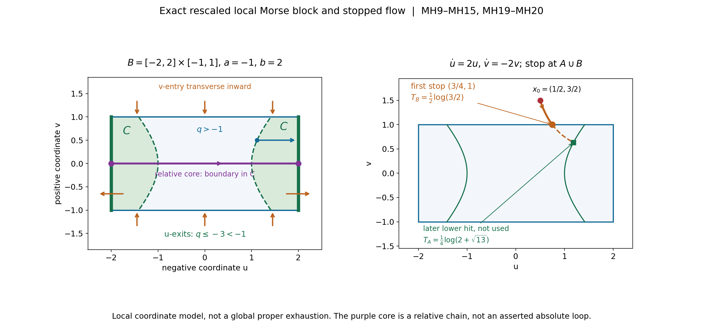
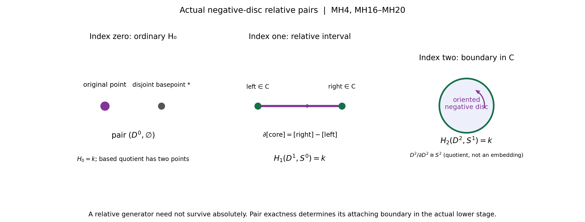
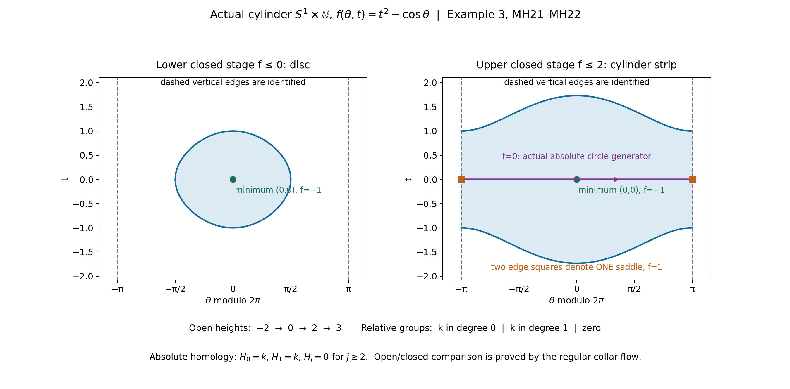

# Ordinary finite-chain Morse handles and the exhaustion bound

This reader proves the geometric H argument used by Projective exhaustion and the finite-chain tube receiver. Its complete original learner text, three worked examples, six full solutions and MH0–MH12 formal body follow.

## Follow the finite objects

Begin with the learner’s regular stages and local block. A compact band contains finitely many critical points. One value can contain several of them, so the proof attaches their actual relative groups together and keeps the attaching boundary visible. The stopped flow reaches the lower stage or a block first; it does not continue through the block to a later lower hit. The relative negative disc is not automatically an absolute cycle. The index-zero and index-top cases are included explicitly.

Then read the compatible open-stage argument. Every ordinary singular chain has finite support, so its compact image lies in one sublevel. Passing from the finite relative groups to the whole manifold uses that fact and compatible collars, not locally finite chains or a claimed global deformation retraction. The cylinder example distinguishes an actual surviving circle from a relative handle generator. The theorem works over an arbitrary associative unital coefficient ring on a finite-dimensional Hausdorff, second-countable, boundaryless smooth manifold with a proper bounded-below Morse function and the declared index bound.

## The topology receiver and its boundaries

L124 supplies the explicit projective exhaustion and the oriented normal-first homological tube receiver. Applying its index bound also uses the qualified smooth Morse perturbation and Sard entries retained in the complete SH03 programme source. Real form/right-cap and compact-support closed–open comparisons are separate admitted programme entries; rational spanning, integral or rational connecting-map comparison, affine C8 and full component constancy remain separate.

The exact corrected packet, original diagram alternative, native figures, reproducible sources and terms are supplied in full. The corrected block drawing changes label placement only; the original proof, coordinates, stopping times and geometry are preserved. This reader adds reversible math delimiters around original inline index and power notation. Reversing those presentation additions and heading/path changes recovers every byte of the admitted learner and its complete formal proof.

---

## How a critical point changes finite-chain homology

Written by GPT-6.1 Sol (OpenAI), Ultra, October 2026. Original exposition and diagrams: CC0-1.0. Self-checked by the writing AI. Classical Morse theory is the subject.

A proper height function lets us examine a manifold in compact pieces. Between critical heights, downward flow merely pushes one piece onto the preceding one. At a nondegenerate critical point, the height is exactly a difference of squares in suitable coordinates. Its negative coordinate directions supply a disc whose boundary is already in the lower region. That disc is a **relative** homology generator. Its boundary may join different lower components or may bound there; those possibilities have different effects on absolute homology.

The result is precise. If a bounded-below proper smooth Morse function on a boundaryless finite-dimensional second-countable manifold has every critical index at most d, ordinary finite singular homology is zero in degrees above d, with any coefficient ring k. The complete formal argument MH0–MH12 is retained after the examples and solutions. It proves the actual increasing **open** sublevel pairs needed by TP041 H; it does not assume a CW model or replace finite chains by locally finite ones.

### 1. An exact block, rather than an attachment slogan

In the local coordinates of MH6 a critical point has height

\[
 q(u,v)=-|u|^2+|v|^2,
 \qquad u\in\mathbb R^\lambda,\quad v\in\mathbb R^\nu.
\]

Take a compact product of discs \(B=D^λ(r)×D^ν(s)\), a lower height a=−ε<0, and an upper height b>s². Require r²>s²+ε if λ>0. Every point of B is below b, whereas every u-exit point |u|=r is strictly below a. The lower intersection C=B∩{q≤a} contains no point with u=0. Expanding u radially to the exit sphere keeps a point of C in C. Thus C retracts to \(S^{λ−1}(r)×D^ν(s)\). Contracting the v-disc gives the standard pair \((D^λ,S^{λ−1})\). Its relative homology is k in degree λ and zero elsewhere (MH4, MH19–MH20).

At a minimum λ=0, C is empty and B contributes **ordinary** \(H_0=k\). Reduced \(H_0\) of a single point would give the wrong answer. At a maximum ν=0, C is a nonempty outer shell and the pair contributes k in degree the full real dimension. The proof treats both extremes explicitly.

*Figure 1.* The local, rescaled Morse model is q=−u²+v² with λ=ν=1, B=[−2,2]×[−1,1], a=−1 and b=2. The green u-faces have q≤−3<−1, and the shaded lower lobes are q≤−1. The purple oriented core is a relative interval with boundary in the lobes; it is not asserted to be an absolute loop. The blue radial arrow keeps v fixed and expands a lower-boundary point to the exit face, as in MH19. The right panel traces the exact field (2u,−2v) from (1/2,3/2) to its first block entry (3/4,1), at time (log(3/2))/2. The dashed continuation illustrates the later hypothetical lower-level hit, which the stopped deformation does not perform. All arrows and curves are local coordinate data, not a global exhaustion or numerical proof. See MH9–MH15, MH19–MH20 and Example 1. Exact equations and renderer accompany the figure. The finite-chain and Morse-coordinate programme sources are credited in the full proof and input ledger.

### 2. Why the flow can be stopped continuously

Near each block use W=(2u,−2v). Along it dq/dt=−4(|u|²+|v|²). Patch these finitely many exact local fields with a smooth negative gradient elsewhere. The field strictly decreases the height away from critical points. The compact portion of the upper sublevel outside the interiors of the lower region and blocks has no critical points, so its decrease has a uniform positive lower bound. Every trajectory reaches the stopping region \(A∪⋃B_i\) in a uniformly bounded finite time (MH11–MH13).

The stopping time is continuous for a geometric reason. At the lower level the field crosses transversely downward. A first block entry outside A occurs only on a v-face, where the field points transversely inward. All u-faces and all u/v corners already lie strictly inside A. Where a v-face and the lower-level boundary meet, the first hitting time is the minimum of two continuous transverse crossing times. MH5 also checks that no earlier hit appears on a distant part of a nearby trajectory. This turns the stopped flow into a strong deformation of the upper sublevel onto \(A∪⋃B_i\), fixing A.

### 3. The relative calculation uses collars and OPEN excision

We cannot discard A from the closed union by calling it excision. Instead, a collar of A in the upper sublevel retracts onto A. A compatible collar inside a block uses the field (u/(2|u|²),0), for which dq/dt=−1. It expands u until the lower level is reached and never exits the block before then. MH14–MH15 choose its strictly positive margins.

For a compact good pair (Z,C) with C nonempty and an open neighborhood N retracting onto C, pair exactness gives H(Z,C)≅H(Z,N). Open excision removes C from (Z,N). After collapsing C, it removes the collapsed point from (Z/C,N/C) as well. The remaining pairs are homeomorphic and N/C is contractible. Thus \(H_j(Z,C)\cong\widetilde H_j(Z/C)\). This quotient theorem is proved in MH6, with its continuity and openness hypotheses. For empty C, one must use Z with a **disjoint added basepoint**.

For finitely many disjoint blocks the quotient of \(A∪⋃B_i\) by A is a finite wedge of their based quotients. Their collar neighborhoods are contractible and open, so reduced open Mayer–Vietoris proves the direct sum, without a cellular theorem (MH17–MH20). Only one critical value is crossed at a time; several points at that one value do give a direct sum. Several *distinct* values can interact through their attaching boundaries.

*Figure 2.* Each panel shows the standard negative-coordinate disc pair obtained in MH20. In index zero the pair is (point,∅); its based quotient has the original point and a separate basepoint, so the relative ordinary \(H_0\) is k. In index one an oriented core interval has its two boundary points in C; after collapse it has the S¹ homology generator, while its connecting image in the actual lower stage is [right]−[left]. In index two an oriented disc has boundary in C; its quotient D²/∂D² is S². The drawing is the disc with its collapsed-boundary label, not a planar embedding of S². The row of groups is **relative** homology, not a claim that every local core survives absolutely. MH4 and MH16–MH20 prove the calculations. This is an original exact pair diagram with programme finite-chain method credit.

### 4. From compact slabs to genuine open stages

Choose cofinal regular heights \(t_i\) so each step crosses at most one critical value and \(t_0\) lies below the lower bound. \(W_i={f<t_i}\) are the desired open stages. Immediately below each \(t_i\), choose \(s_i\) in a critical-free collar. The compact \(K_i={f≤s_i}\) is a strong deformation retract of \(W_i\) by the normalized field −∇f/|∇f|², stopped at \(s_i\). The inclusions \(K_{i−1}⊂K_i\) and \(W_{i−1}⊂W_i\) give a commuting diagram. Its absolute vertical maps are homotopy equivalences, so natural pair sequences give the **relative** pair isomorphism (MH21). Individual retractions need not themselves preserve the preceding stage; the inclusion diagram is the rigorous comparison.

Each relative group above d is now zero. Starting from the empty stage, pair exactness forces every absolute \(H_j(W_i;k)\) above d to be zero. Finally a finite cycle and any finite bounding chain have compact image and lie in one stage. That proves \(H_j(M;k)=colim_i\) \(H_j(W_i;k)\), giving the global vanishing (MH22). It makes no assertion about infinite locally finite chains.

### 5. Three fully computed examples

**Example 1: a local saddle with a finite first hit.** In Figure 1 use r=2,s=1,ε=1,b=2. On the block q≤1<2 and on either u-face q≤−3<−1. The lower intersection is

\[
 C=\{(u,v):|v|\leq1,\ \sqrt{1+v^2}\leq|u|\leq2\}.
\]

It has two lobes. Expanding |u| to 2 retracts them onto the two exit intervals E. Contracting v makes (B,E) the pair ([−2,2],{−2,2}). Its sequence has \(H_0(E;k)=k²→H_0(B;k)=k\) given by (a,b)↦a+b. Its kernel is generated by (−1,1), so \(H_1(B,C;k)=k\) and every other relative group is zero. The positive core interval has boundary (2,0)−(−2,0).

The exact local trajectory from \(x_0=(1/2,3/2)\) is \(u(t)=e^{2t}/2\), \(v(t)=3e^{-2t}/2\). It reaches the v-face v=1 at

\[
 T_B=\tfrac12\log(3/2),\quad
 (u(T_B),v(T_B))=(3/4,1),\quad q=7/16.
\]

This is outside the lower region and inside the u-range, so it is the first stop in B. If the flow were continued, putting \(y=e^{4t}\) in q=−1 gives y²/4−y−9/4=0, hence y=2+√13 and \(T_A=log(2+√13)/4>T_B\). The stopped deformation uses \(T_B\). The point (√5/2,1/2) lies on q=−1; its radial expansion ends at (2,1/2), where q=−15/4. These exact checks explain the margins and arrows. q itself is not bounded below or proper on the whole plane, and no global vanishing theorem is being applied to it.

**Example 2: the minimum and maximum of an actual sphere.** On the unit S² take f(x,y,z)=z. Compactness makes f proper and it is bounded below. Its only critical points are the south pole, height −1 and index zero, and the north pole, height 1 and index two. These indices can be checked by exact local coordinates: near the north pole set u=(x,y)/√(1+z), giving z=1−|u|²; near the south pole set v=(x,y)/√(1−z), giving z=−1+|v|².

Crossing −1 from an empty stage contributes ordinary relative \(H_0=k\). Between −1 and 1 the closed or open regular sublevels are discs up to the regular collar deformation and have \(H_0=k\) only. Crossing the maximum contributes relative \(H_2=k\) and all other relative groups zero. The pair sequence then gives \(H_2(S²;k)=k\): its connecting map lands in the zero \(H_1\) of the lower disc. It also gives \(H_1(S²;k)=0\) and \(H_0(S²;k)=k\). Thus the index-two contribution survives absolutely here. With d=2 the theorem gives vanishing above two. It cannot be applied with d=1: the maximum has index two, and a compact complex curve does not carry this function as a global strictly plurisubharmonic exhaustion.

**Example 3: one genuine saddle produces the cylinder loop.** Let M=S¹×R, with angle θ modulo 2π and real coordinate t, and put

\[
 f(\theta,t)=t^2-\cos\theta.
\]

It is bounded below by −1. For f≤b one has |t|≤√(b+1) when b≥−1, so the closed sublevel is compact; inverse images of compact real intervals are closed subsets of such sublevels, proving properness. The critical equations are sin θ=0 and t=0. At (0,0), height −1, the Hessian has eigenvalues 1,2 and index zero. At (π,0), height 1, its eigenvalues are −1,2 and index one. Near the saddle the exact coordinates u=√2 sin((θ−π)/2), v=t give f=1−u²+v².

For −1<a<1 the sublevel lies in |θ|≤arccos(−a)<π and is a closed disc: in the coordinates \(v_1=√2\) sin(θ/2), \(v_2=t\) it is the ball \(v_1²+v_2²≤a+1\). For b>1, every angle occurs, with |t|≤√(b+cos θ). Contracting t linearly to zero remains inside that sublevel and retracts it onto the actual circle S¹×{0}. A finite positive loop represents its \(H_1=k\), by the two-arc sphere computation in MH1. Crossing the saddle therefore gives \(H_1(relative)=k\), and its boundary has two points in the same lower disc; their difference is null homologous there. The relative class lifts to the absolute cylinder loop, constructed by completing the core arc with a path in the lower disc. Thus \(H_0(M;k)=k\), \(H_1(M;k)=k\) and \(H_j(M;k)=0\) for j≥2, sharp at d=1.

*Figure 3.* These are parameter plots of the actual cylinder S¹×R with f=t²−cos θ. The vertical edges θ=−π and θ=π are identified; the two edge markers in the right panel denote the **same** saddle. The left level f≤0 is the disc t²≤cos θ; the right level f≤2 is a cylinder strip t²≤2+cos θ and retracts onto the purple t=0 circle. The bottom ledger uses the actual open heights −2,0,2,3: relative degrees zero, one and no contribution respectively. Open and closed levels have the collar comparison MH21; the diagrams do not assume it. The final line records the verified absolute \(H_0=k,H_1=k\), higher groups zero, not a general promise that saddle generators survive. See Example 3 and MH8–MH10. Renderer and exact geometry are included.

### 6. Six graded exercises with complete solutions

**Exercise 1 (introductory: relative interval, absolute boundary).** Compute \(H_j([−2,2],{−2,2};k)\) and the connecting map in degree one. Suppose those two endpoint images lie in different components of a lower region A. Does the relative interval give an absolute one-cycle after attachment?

**Solution.** The interval is contractible, so its positive homology is zero and its \(H_0\) is k. The endpoint set has \(H_0=k²\). Its inclusion sends (a,b) to a+b, a surjection with kernel {(-c,c):c∈k}. Pair exactness gives \(H_1(relative)=k\), \(H_0(relative)=0\) and all higher groups zero. The positive interval has connecting image [right]−[left]. In different lower components this is a nonzero vector in the free component module \(H_0(A;k)\), unless k is the zero ring. Hence that generator is not in the image of \(H_1(new)\) and is not an absolute one-cycle. Its attachment can join the two components. If the endpoints are in one path component, a path there cancels the boundary and produces an absolute cycle, though subsequent attachments can still kill its class.

**Exercise 2 (intermediate: calculate the competing hitting times).** For q=−u²+v² and W=(2u,−2v), start at (1/2,3/2) and stop on A={q≤−1} or B=[−2,2]×[−1,1]. Compute both candidate times, the first endpoint and the local u-only collar trajectory from q=−1/2 to q=−1 with v=1/2.

**Solution.** The flow is \((e^{2t}/2,3e^{-2t}/2)\). The v-face is reached at \(T_B=log(3/2)/2\) with endpoint (3/4,1), q=7/16>−1 and |u|<2. Lower-level equality requires \(e^{4t}=2+√13\), giving \(T_A=log(2+√13)/4\). Since \(e^{4T_B}=9/4<2+√13\), \(T_B<T_A\) and the first endpoint is the block entry. For the collar take initial u=√3/2, v=1/2, giving q=−3/4+1/4=−1/2. Under du/dτ=u/(2u²), u(τ)²=3/4+τ and q(τ)=−1/2−τ. At τ=1/2 the endpoint is (√5/2,1/2), still inside B and on q=−1. This is the exact formula used for the collar. Its 1/2-wide illustrative time is within this particular block's strict exit margin; the proof may use a smaller δ uniformly across all blocks.

**Exercise 3 (intermediate: do not erase a new minimum).** A consists of one contractible component. At one critical value two disjoint minimum blocks are added, with no intersection with A. Compute \(H_0(S,A;k)\), and give the correct based quotient both when A is present and when it is empty.

**Solution.** With A present, S has three components, so \(H_0(S;k)=k³\). The map \(H_0(A)=k→k³\) is the inclusion of the old component, and pair exactness gives \(H_0(S,A)=k²\), with all positive relative groups zero. S/A still has the old collapsed component as one basepoint and two unattached contractible components. Its reduced \(H_0\) is k². Equivalently each new block contributes \(B_+=B⊔\)\(\{*\}\); wedging their added basepoints preserves all three components. If A is empty, S has two components and ordinary \(H_0(S)=k²\). Use \(S_+\), which has three components and reduced \(H_0=k²\). Reducing S itself would give only k and lose a generator. Empty intersections require a disjoint added point, as in MH16–MH17.

**Exercise 4 (advanced: simultaneous points and later differentials).** On the disjoint union (S¹×R)⊔S² use Example 3's function on the cylinder and Example 2's height on the sphere. Compute the relative groups between regular heights 0 and 2, and the absolute groups at height 2. Explain why a direct-sum statement for several distinct critical values is different.

**Solution.** The two minima occur simultaneously at −1 and give \(H_0=k²\) for the lower stage at height 0, whose two components are discs. At height 1 there are exactly two points: the cylinder saddle of index one and the sphere maximum of index two. The single-value formula gives \(H_1(M²,M⁰;k)=k\), \(H_2(M²,M⁰;k)=k\), and every other relative group zero, even though the indices differ. The upper stage is a cylinder strip disjoint from the complete sphere, so \(H_0=k²\), \(H_1=k\) and \(H_2=k\), with higher groups zero. The explicit retractions and pair sequences in Examples 2–3 prove these absolute claims. In a general connected attachment the boundary maps could change whether the relative generators lift or survive. Across distinct critical values those maps can kill earlier classes, so arbitrary multi-level relative homology need not be the sum of all local groups. MH8 instead uses triple exactness to prove the needed vanishing above the common index bound.

**Exercise 5 (intermediate: the factor four and the role of Morse perturbation).** On C² set \(ψ=|z_1|²+|z_2|²+Re(a_1z_1²+a_2z_2²)\), first with \((a_1,a_2)=(2,3)\), then (1,3). Compute the real Hessian, its index and degeneracy, and the value B(v,v)+B(Jv,Jv) for \(v=∂/∂x_1\). Can the global theorem be applied to this local polynomial?

**Solution.** In real coordinates \(ψ=∑(1+a_j)x_j²+(1−a_j)y_j²\). For (2,3), the Hessian eigenvalues in order \(x_1,y_1,x_2,y_2\) are 6,−2,8,−4. The index is two, equal to the complex dimension. For (1,3), they are 4,0,8,−4, so the critical point is degenerate even though the Levi matrix is still the identity. In both cases the requested sum is \(4=4ℒ_ψ(v)\). Strict Levi positivity bounds the index of a *nondegenerate* critical point but does not make it Morse. For (2,3) the negative y-directions make ψ unbounded below; in (1,3) it is also unbounded below and flat in \(y_1\). Neither meets the proper bounded-below Morse hypotheses. SH03's small proper-preserving perturbation and the geometric theorem are separate steps.

**Exercise 6 (advanced: an infinite exhaustion still uses finite chains).** Give an explicit zero-dimensional proper Morse example with infinitely many critical values and some simultaneous points. Compute its open-stage and global homology. Prove directly why an ordinary bounding relation is seen at one later stage, and explain the role of the compact/open pair maps in MH21.

**Solution.** Let M=Z with its discrete zero-dimensional smooth structure and f(ℓ)=ℓ². It is bounded below and proper because a bounded real interval has finite inverse image, which is compact. Every point is a nondegenerate zero-dimensional critical point of index zero. The value zero has one point, and every positive square n² has the two points ±n. Take \(t_0=−1\) and \(t_i=(i−1)²+1/2\) for i≥1. \(W_i={ℓ²<t_i}\) has 2i−1 points, so \(H_0(W_i;k)=k^{2i−1}\) and its higher groups vanish. The first relative \(H_0\) is k, every later relative \(H_0\) is k², and positive relative groups vanish. Inclusions keep the old point generators. Hence \(H_0(M;k)=⊕_{ℓ∈Z}k\), with finite-support vectors, and \(H_j(M;k)=0\) for j>0; it is not the product of all coefficient copies.

For the general bounding statement let z be a finite cycle in one \(W_i\) and suppose z=∂c in M, with c an actual ordinary finite chain. The union of the simplex images of z and c is compact. An increasing open cover has a finite subcover of this union, and its largest index \(W_h\) contains everything. Thus z already bounds in \(W_h\), proving injectivity of the direct-limit map. Surjectivity uses the compact image of a cycle alone. For general manifolds individual collar retractions \(W_i→K_i\) need not preserve \(K_{i−1}\); one must use the actual commuting inclusions and natural long exact sequences to get the relative isomorphism. The finite-chain argument and those relative maps are both required. An infinite locally finite chain escaping every \(W_h\) does not satisfy this compact-image proof.

### 7. What this supplies to TP041

The full proof below supplies the geometric finite-chain handle input H. At a strictly plurisubharmonic Morse critical point on a complex d-manifold, B(v,v)+B(Jv,Jv)=4ℒ(v)>0 bounds the real index by d. The exact SH03 zero-section perturbation interface supplies such a proper Morse function relative to its retained smooth/Sard foundations. The explicit projective exhaustion already proved in TP041 is its starting function. Consequently the geometric handle construction gives the ordinary \(H_{d+1}(U;Q)\) vanishing used in the separately reviewed ordinary-pair normal-tube argument. No sheaf/singular comparison is substituted for that proof.

This candidate is not independently admitted yet. It does not close lower Sard/analytic programme foundations, general rational-form spanning, the actual affine C8 tube/scalar/multiplicity comparison, the alternative closed–open compact-support comparison, historical coefficient conventions, full component constancy or recursive course closure. The complete formal proof, exact source credits and scope statement follow without abridgement.

---

## Morse handles from stopping flows and finite singular chains

Written by GPT-6.1 Sol (OpenAI), Ultra, October 2026. Independently authored exposition and original diagrams: CC0-1.0. Self-checked by the writing AI. Classical Morse and singular-homology methods are explained here; no novelty of the theorem is claimed and no external book prose or diagrams are reproduced.

The geometric argument below proves the missing handle statement H of TP041. It does not use a CW decomposition theorem. The argument states the elementary smooth inputs it uses and proves the relative sublevel and ordinary finite-chain deductions. Smooth inverse/flow and Morse-coordinate proofs are included; the existence of a strictly plurisubharmonic Morse perturbation uses the exact written SH03 provider relative to its own Sard, cutoff and other lower inputs. This distinction is retained at the end.

### MH0. Statement, coefficients and boundary cases

Let M be a Hausdorff second-countable smooth manifold without boundary of finite real dimension N. Let f:M→R be smooth, proper, bounded below and Morse: the real Hessian at every critical point is nonsingular. Fix a nonnegative integer d and assume every critical index is at most d. A coefficient ring k can be any associative unital ring; all chain maps below are integral maps extended to k, so commutativity, a field, torsion freeness and flatness assumptions are unnecessary. Write \(C_j(X;k)=C_j(X;Z)⊗_Z\) k with its natural left k-module structure. Every chain is a finite sum of actual continuous singular simplices. Ordinary negative chain groups vanish. Reduced homology is used only when explicitly marked.

**Theorem MH0.** There is an increasing sequence of open regular sublevels \(W_0=∅\), \(W_1,W_2,…\) covering M. Each step crosses either no critical value or one value with finitely many critical points p. With λ(p) their indices,

\[
 H_j(W_i,W_{i-1};k)\cong
 \bigoplus_{p\text{ crossed at step }i}
 \begin{cases}k,&j=\lambda(p),\\0,&j\ne\lambda(p),\end{cases}
 \qquad j\geq0. \tag{MH1}
\]

The direct sum is zero at a regular step. Consequently

\[
 H_j(M;k)=0\quad(j>d). \tag{MH2}
\]

The local identification is natural for the inclusions used in the proof, after choosing an orientation of each negative coordinate disc. It does not assert that groups from several distinct critical values simply add: connecting homomorphisms can cancel generators. For arbitrary regular compact endpoints a<b, even with several values between them, the proved consequence is \(H_j(M^b,M^a;k)=0\) for j>d, where \(M^t={f≤t}\).

If M is empty all statements are vacuous. Dimension zero is allowed: a 0×0 Hessian is nonsingular and every point has index zero. A compact zero-dimensional stage is a finite set; its relative \(H_0\) is one copy of k for every newly added point. If N<d the proof still applies. No orientation of M is required. If one instead specifies an integer d<0, a nonempty M is impossible under the index bound: properness and a lower bound make f achieve a minimum, whose index is zero. Thus that case reduces to the empty manifold.

### MH1. The finite-chain tools, proved at the level used here

A singular boundary is the alternating sum of deleted faces; twice-deleted faces cancel, so ∂²=0. For a homotopy F:X×[0,1]→Y the prism over an ordered j-simplex has the j+1 simplices

\[
 [(v_0,0),\ldots,(v_i,0),(v_i,1),\ldots,(v_j,1)],
 \quad0\leq i\leq j,
\]

with signs \((-1)^i\). Applying F gives a finite operator P satisfying \(∂P+P∂=F_{1*}−F_{0*}\); internal faces cancel, the top and bottom faces remain, and side faces give −P∂. If F carries a subspace A into B at all times this identity descends to relative chains. Thus homotopies of pairs induce equal homology maps over k.

The pair complex is \(C_*(X,A)\)=\(C_*(X)\)/\(C_*(A)\). It is free on simplices not wholly in A. The sequence 0→\(C_*(A)\)→\(C_*(X)\)→\(C_*(X,A)\)→0 splits degreewise on simplex bases, also over k. Its connecting map sends a relative cycle represented by c with ∂c in A to [∂c]. Changing the lift changes that class by a boundary. If ∂c=∂a in A, then c−a is an absolute cycle. Conversely an A-cycle bounds in X exactly when it is such a connecting image. These facts prove the pair long exact sequence and its naturality. For A⊂B⊂X the equally split sequence 0→\(C_*(B,A)\)→\(C_*(X,A)\)→\(C_*(X,B)\)→0 proves the triple sequence. Five-lemma uses here are elementary chases in these sequences: to lift a middle element, first lift its next image, then correct by the preceding image; for a kernel element, perform the same correction one position earlier.

We need **open excision**, not excision of an arbitrary closed piece. Here is its finite-chain proof. Barycentric subdivision S is a chain map. On affine standard simplices define it inductively by coning the already subdivided boundary to the barycenter; the cone identity ∂(b*c)=c−b*∂c proves ∂S=S∂. Coning the cycle σ−Sσ−T∂σ, inductively in dimension, gives a homotopy ∂T+T∂=1−S. In degree zero its augmentation is zero, so the same reduced cone identity works. All operations remain in the original simplex image. A barycentric subsimplex has diameter at most j/(j+1) times the old diameter: its vertices are barycenters of nested faces, and comparing face averages gives this bound. Iteration makes the mesh tend to zero. The inverse-image open cover of a compact standard simplex has a Lebesgue number, so every finite chain becomes small for any specified open cover after finitely many subdivisions.

For an open cover, inclusion of the complex of small simplices induces an isomorphism in homology, including relative homology. For surjectivity subdivide a finite cycle sufficiently; \(S^m\) is homotopic to identity by the finite sum of subdivision homotopies. For injectivity subdivide a finite bounding chain sufficiently; the homotopy keeps a chain that was already small small, so the original small cycle differs from its subdivision by a small boundary. For a relative cycle or relation, also subdivide the finitely many A-chains involved; all homotopies preserve A. These arguments prove both directions over any k without tensoring an unproved quasi-isomorphism.

If E⊂A⊂X and \(closure(E)⊂int_X\) A, apply this small-chain result to the open cover \(int_X\) A, X\closure(E). In the relative quotient the first cover member contributes zero, and the remaining complex is that for (X\closure(E),A\closure(E)). Restricting the cover to X\E gives exactly the same relative small-chain quotient. Hence

\[
 H_j(X\setminus E,A\setminus E;k)\xrightarrow{\sim}
 H_j(X,A;k). \tag{MH3}
\]

For an open cover X=U∪V, small chains also give the degreewise split sequence with maps c↦(c,−c) and (a,b)↦a+b from \(C_*(U\cap V)\) to \(C_*(U)\)⊕\(C_*(V)\) to the small-chain complex of X. Its exact sequence is Mayer–Vietoris, with the reduced version from augmented chains.

A point's chain complex has one generator in each nonnegative degree, with differential identity in positive even degrees and zero in odd degrees. Thus a contractible nonempty space has \(H_0=k\) and positive groups zero. Cover \(S^m\), m≥1, by two slightly enlarged hemispheres. Each contracts, their intersection retracts to \(S^{m−1}\), and reduced Mayer–Vietoris gives \(\widetilde H_j(S^m;k)\cong\widetilde H_{j-1}(S^{m-1};k)\). The initial \(S^0\) has two components and reduced \(H_0=k\). Therefore the ball pair sequence proves

\[
 H_j(D^\lambda,S^{\lambda-1};k)=
 \begin{cases}k,&j=\lambda,\\0,&j\ne\lambda\end{cases}
 \quad(\lambda\geq1). \tag{MH4}
\]

For λ=1 the reduced group of its two endpoints is used; the map \(H_0(S^0)→H_0(D^1)\) sums the two coefficients. A positive interval has boundary right minus left and represents the relative generator. For λ=0 the actual pair is (point,∅), with ordinary \(H_0=k\), not the reduced homology of a point. Finite chains triangulating an oriented disc give the generator in MH4: identify a simplex with a ball by radial projection from interior points, orient it, and subdivide if desired; its boundary lies in the boundary sphere and has the positive sphere generator from the hemisphere calculation. No cellular-homology theorem is used.

### MH2. Smooth inputs and the exact Morse chart

A smooth metric can be made by a locally finite smooth chart partition and weighted chart metrics. The same partition supplies cutoffs equal to one near prescribed compact sets inside charts. We retain the elementary smooth-partition input of the programme.

For completeness, the local inverse and ODE inputs are as follows. If DF(0)=B is invertible, shrink a closed Euclidean ball until \(||I−B^{-1}DF||≤1/2\). For y near F(0), \(x↦x+B^{-1}(y−F(x))\) preserves that ball and contracts by 1/2. Its geometric-series iteration gives a unique solution and a continuous inverse; inserting the inverse Lipschitz bound in F's differentiability remainder gives derivative \(DF(x)^{-1}\). Repeated differentiation of the inverse identity gives smoothness. A square submatrix of an implicit equation gives the corresponding implicit-function conclusion by this inverse theorem.

For a smooth vector field G on a chart ball with |G|≤C and ||DG||≤L, take T with TC below the spatial margin and TL<1/2. The integral operator \(x(t)↦x_0+∫_0^tG(x(s))ds\) contracts the closed ball of paths, giving existence and uniqueness. The initial-point derivative solves \(J(t)=I+∫_0^tDG(x(s))J(s)ds\). The same contraction and differentiability remainder prove that derivative exists and is continuous. Higher derivatives solve the same linear equation with already known inhomogeneous terms; induction gives smooth dependence. Uniqueness glues chart solutions. A trajectory that remains in a fixed compact subset can be continued through any finite time: a finite covering by chart balls gives a uniform positive local existence time, and successive extensions rule out a finite terminal time. This is the only continuation fact used below.

Here is the Morse coordinate proof, following the actual programme Lemma 4.1 in AN04. Translate a critical point to zero. A nonsingular symmetric Hessian has a vector on which its quadratic value is nonzero; otherwise polarization would make it zero. Make that vector the first coordinate. The implicit theorem solves \(∂_1\) f=0 as \(x_1=h(x')\). With \(v=x_1−h(x')\), Taylor's integral remainder gives

\[
 f(h+v,x')=g(x')+\tfrac12v^2 A(v,x'),\qquad
 A=2\int_0^1(1-t)f_{11}(h+tv,x')\,dt. \tag{MH5}
\]

Near zero A has constant nonzero sign. The change \(z_1=v|A|^{1/2}\) is locally invertible and replaces the last term by \(±z_1²/2\). The Hessian of g is the Schur complement of the first Hessian pivot. Block elimination gives its determinant as \(det(H)/H_{11}\), so it remains nonsingular. Induction proves a diagonal signed quadratic normal form. Congruence preserves its negative index. For each negative signed coordinate set \(u_j=z_j/√2\), and for each positive signed coordinate set \(v_j=z_j/√2\); thus \(±z_j²/2\) becomes \(±u_j²\) or \(±v_j²\). Regroup them to obtain

\[
 f=c+q(u,v),\qquad q(u,v)=-|u|^2+|v|^2,
 \quad u\in\mathbb R^\lambda,\ v\in\mathbb R^\nu,
 \quad\lambda+\nu=N. \tag{MH6}
\]

The proof works also for N=0 with no coordinates. It gives a neighborhood for each point, not a universal radius. Nonsingularity also makes df=0 isolated by the inverse theorem applied to df in a chart. The critical set is closed. Each \(M^t\) is compact: choose a lower bound L of f and write \(M^t=f^{-1}([L,t])\) (empty if t<L). A compact stage has finitely many critical points, since an infinite closed set of isolated critical points would have a critical accumulation point. Thus its critical values are finite. Critical values in any bounded range are locally finite, and regular values can be chosen between consecutive distinct critical values without invoking Sard for an already Morse function.

### MH3. A regular compact slab

Let a<b be regular and suppose there is no critical point with a≤f≤b. On a neighborhood of this compact band put

\[
 Z=-\nabla f/|\nabla f|^2,\qquad df(Z)=-1. \tag{MH7}
\]

There is a slightly larger critical-free band: otherwise critical values accumulate at a or b, contrary to MH2. Its field has a smooth local flow Φ. For x with a<f(x)≤b, continue Φ until time f(x)−a. Up to that time f(Φ(t,x))=f(x)−t, so the trajectory remains in the compact band and MH2 ensures continuation. It lands at f=a. Define \(D_s(x)=Φ(s\) max(f(x)−a,0),x) above a, and \(D_s(x)=x\) on \(M^a\). Smooth dependence and time tending to zero at f=a make this continuous across the boundary. It stays in \(M^b\), fixes \(M^a\), and is a strong deformation retraction. In particular

\[
 H_j(M^b,M^a;k)=0\quad\text{for every }j\geq0. \tag{MH8}
\]

The formula applies if the band is empty as the identity. A cutoff can extend the field beyond its band if desired, but the stopped construction requires neither completeness on all of M nor a global lower bound for |∇f|.

### MH4. One critical value and disjoint compact blocks

Choose regular a<b with exactly one critical value c between them, containing finitely many points \(p_1,…,p_h\). First take sufficiently close inner endpoints c−ε and \(c+b_0\), and translate c to zero. The general endpoints are handled in MH8. At each \(p_i\) choose disjoint Morse chart neighborhoods. Choose compact blocks

\[
 B_i=D^{\lambda_i}(r_i)\times D^{\nu_i}(s_i),\qquad
 s_i^2<b_0,\qquad r_i^2>s_i^2+\epsilon\ (\lambda_i>0). \tag{MH9}
\]

All blocks and slightly enlarged blocks lie inside their charts. These choices are possible after reducing ε and \(b_0\): start with chart-sized small radii \(r_i>0\) for positive indices, choose \(s_i\) still smaller, then choose ε smaller than every \(r_i²−s_i²\) and \(b_0\) above every \(s_i²\) while still below the next critical value. Equivalently choose all radii on the scale √ε and \(b_0\) on the same small scale; finite many charts suffice. For index zero there is no u-exit condition; choose its positive radius with \(s_i²<b_0\). For maximal index \(ν_i=0\) take \(D^0={0}\), \(s_i=0\) and \(r_i²>ε\). For N=0 the block is an open-and-closed singleton, with no faces.

Set \(X=M^{b_0}\), \(A=M^{−ε}\), and \(S=A∪⋃B_i\). The whole \(B_i\) lies in X because \(q≤s_i²<b_0\). Its u-exit face

\[
 E_i=S^{\lambda_i-1}(r_i)\times D^{\nu_i}(s_i)
 \quad(\lambda_i>0) \tag{MH10}
\]

lies strictly inside A, since \(q≤−r_i²+s_i²<−ε\). That strict margin is essential for the stopping flow and collars. The block intersection \(C_i=B_i∩A\) equals {q≤−ε} within \(B_i\). For \(λ_i=0\) this set is empty. When \(ν_i=0\) every boundary face of the block is already in int A.

### MH5. The global descending field and continuous stopping time

Use a smooth metric and start with G=−∇f. On each Morse chart use the exact field

\[
 W_i=(2u,-2v),\qquad dq(W_i)=-4(|u|^2+|v|^2). \tag{MH11}
\]

Choose chart cutoffs \(χ_i\) equal to one on neighborhoods of \(B_i\), with disjoint supports. Define \(W=(1−∑χ_i)G+∑χ_iW_i\), interpreting \(χ_iW_i\) by zero off its chart. This is smooth; df(W)<0 at every noncritical point, and it is exactly \(W_i\) near \(B_i\). At a critical point it is zero. Normalization is needed in MH3; here this unnormalized smooth field is preferable across the critical points and a compactness bound supplies uniform decrease where we need it. Positive rescaling outside the boxes would give the same stopped argument.

Forward trajectories starting in X have nonincreasing f and remain in compact X, so exist at every finite time. All critical points in X are either strictly inside A or strictly inside one \(B_i\). Thus the compact set \(K=X\int_M\) S contains no critical point. If K is nonempty there is η>0 with df(W)≤−η on K. For x∉S define T(x) as its first hitting time of S. If it had not hit by time \((b_0+ε)/η+1\), integration of df(W) would force f<−ε, a contradiction. Therefore T is finite and bounded uniformly. Put T=0 on S. If K is empty, X=S and the retraction is the identity.

We now prove continuity; a bare finite-time claim is insufficient. At a first hit outside int S, a point of ∂A has f=−ε and df(W)<0, so the implicit-function theorem gives a smoothly varying nearby crossing time of that regular level. A hit of a block outside int A cannot occur on a u-face, because that face has the strict margin in MH10. It can occur only on \(|v|=s_i\) with \(|u|<r_i\) and \(ν_i>0\). There

\[
 W_i(|v|^2-s_i^2)=-4s_i^2<0, \tag{MH12}
\]

so its inward crossing time also varies smoothly. The same applies when a regular level and v-face meet: near the hit the first entry into their union is the minimum of their two smooth crossing times, hence continuous. In this intersection \(|u|²=s_i²+ε<r_i²\), so no u-corner is present. The only geometric u/v corners have already fallen inside int A. For index zero there is just the transverse v-entry; for maximal index there is no v-entry outside A; for a zero-dimensional singleton there is no exterior local boundary to analyze.

To justify that these local times describe the *first* hit, for x∉S and any δ>0 below T(x), the compact orbit segment [0,T(x)−δ] misses the closed S. Nearby initial points also miss it on that segment by smooth dependence and compactness. Near the hit, the transverse local descriptions give an entry by time T(x)+δ and exclude an earlier local entry except at the stated minimum. They prove lim \(T(x_n)=T(x)\) for \(x_n→x\) outside S. For x∈∂S, the same transverse descriptions show exterior points hit at times tending to zero; interior points of S have T=0 in a neighborhood. Every critical point of S lies in its interior. These observations also prove continuity across S.

Consequently

\[
 D_t(x)=\Phi_W(tT(x),x),\quad0\leq t\leq1,
 \qquad D_t|_S=1, \tag{MH13}
\]

is a strong deformation retraction X→S. Before the stop a trajectory remains in X by descent; at and after its fixed endpoint it stays there. Because A⊂S is fixed, this is also a homotopy equivalence of pairs (X,A) and (S,A). We stop the original smooth flow; we do not claim that a discontinuously set-to-zero vector field has a smooth flow.

### MH6. Collars and the good-pair quotient lemma

All spaces in the closed-union argument are compact metrizable Hausdorff spaces. We call (Z,C) a good pair here when C is closed and has an open neighborhood N in Z that strongly deformation retracts onto C fixing C.

For (X,A), take N={f<−ε+δ}∩X with δ>0 small enough that its band contains no critical point. The normalized descent of MH3, stopped at f=−ε, is the required deformation on N, fixing all of A.

For \((B_i,C_i)\) with \(λ_i>0\) choose

\[
 0<\delta<\epsilon/2,\qquad
 \delta<r_i^2-s_i^2-\epsilon. \tag{MH14}
\]

On the collar −ε<q<−ε+δ one has |u|²=|v|²+ε−(q+ε)≥ε−δ>0. The u-only vector field

\[
 Z_i=(u/(2|u|^2),0),\qquad dq(Z_i)=-1 \tag{MH15}
\]

fixes v and expands |u|. Its explicit time-t formula is u(t)=√(1+t/|u(0)|²)u(0). A trajectory stopped at time q+ε lands on q=−ε before the u-face, because that face has \(q≤s_i²−r_i²<−ε\). It cannot exit through the v-face because v is fixed. Applying time s max(q+ε,0) above the lower boundary and identity below gives an open-neighborhood strong deformation onto \(C_i\) in \(B_i\).

The pair (S,A) has the same collar. Near its regular level f=−ε patch \(Z_i\), exact on each block's collar, with −∇f/|∇f|² elsewhere. Every patched term satisfies df=-1, so their partitioned sum does too. These fields are defined only near the level, away from all critical points. For points of S above A the field is \(Z_i\) in the relevant block and stays there until it meets A, by the preceding strict margin. For points of A it is stopped at time zero. Thus \(N_S=S∩{f<−ε+δ}\) strongly retracts onto A. Index-zero blocks do not meet this collar if δ<ε; their intersections \(C_i\) are empty and are treated separately below. Finite many blocks allow a common positive δ; no global chart radius is assumed.

**Lemma MH6 (good-pair quotient, from open excision).** If Z is compact Hausdorff, C is closed and nonempty, and (Z,C) is good as above, its quotient map induces

\[
 H_j(Z,C;k)\cong\widetilde H_j(Z/C;k),\qquad j\geq0. \tag{MH16}
\]

**Proof.** The pair (N,C) has zero relative homology by its deformation. The triple sequence therefore makes \(H_*(Z,C)\)→\(H_*(Z,N)\) an isomorphism. Since \(closure_Z\) \(C=C⊂int_Z\) N, the proved open-excision theorem MH3 removes C and gives \(H_*(Z,N)\)≅\(H_*(Z\setminus C,N\setminus C)\). Collapsing C gives a compact Hausdorff quotient: distinct points outside C can be separated from C and each other in the compact Hausdorff Z; equivalently its collapsed equivalence relation is closed. The image N/C is open, because N is saturated and open. It is contractible: the neighborhood deformation descends to one fixing the collapsed point. Its descent is continuous. Indeed q:Z→Z/C is a closed surjection between compact Hausdorff spaces, so \(q×1_[0,1]\) is a closed quotient map; restricting to the saturated open N×[0,1] proves the required homotopy quotient property.

Open excision on (Z/C,N/C), now removing its collapsed point \(*\), identifies its relative homology with \(H_*(Z\setminus C,N\setminus C)\), since q is a homeomorphism off C. Contractibility of N/C and the triple sequence identify \(H_*(Z/C,N/C)\) with \(H_*(Z/C,\{*\})=\widetilde H_*(Z/C)\). All comparisons commute with q, which proves MH16. This does not apply a closed-union excision theorem without hypotheses. ∎

For C=∅ use \(Z_+=Z⊔\)\(\{*\}\) and the natural identification \(H_j(Z;k)=\widetilde H_j(Z_+;k)\). At j=0, a component generator is identified with its difference from the added basepoint, so this is ordinary \(H_0(Z)\), not \(\widetilde H_0(Z)\). In positive degrees the identification follows directly from the split chain complexes. If Z also is empty both groups are zero. This convention will handle minima and an empty lower stage correctly.

### MH7. Closed union, finite wedge and the local relative group

If A≠∅, the inclusions induce a homeomorphism

\[
 S/A\ \cong\ \bigvee_{i=1}^h Q_i,
 \qquad Q_i=
 \begin{cases}B_i/C_i,&C_i\ne\varnothing,\\(B_i)_+,&C_i=\varnothing.
 \end{cases} \tag{MH17}
\]

If h=0 the right side is a point. This is a bijection because the boxes are disjoint and all identifications are precisely within A. It is continuous from the finite disjoint union with its basepoints identified, and compactness of that source and the Hausdorff quotient target make it a homeomorphism. For \(C_i\) empty, the added basepoint is needed: the entire unattached minimum block remains a separate component. If A=∅, instead apply the same statement to \(S_+=⋁(B_i)_+\). In this case \(C_i\) all are empty. Never collapse an empty A as though it were a nonempty connected subset.

We spell out finite-wedge homology without cellular assumptions. Each \(Q_i\) has an open contractible neighborhood \(V_i\) of its basepoint whose contraction fixes that point: use its good collar quotient if \(C_i≠∅\), and the isolated point if \(C_i=∅\). In the finite wedge put \(U_i=Q_i∪⋃_{h≠i}V_h\). It is open, contracts the \(V_h\) parts onto the basepoint and thus deformation retracts onto \(Q_i\). Distinct \(U_i\) intersect in \(⋃V_h\), a contractible open wedge of those neighborhoods; the contractions paste continuously on their finite closed-in-the-union branches. The same intersection occurs between \(U_i\) and a union of preceding \(U_h\). Reduced open Mayer–Vietoris, inductively, therefore identifies reduced homology of the whole wedge with the direct sum of the \(\widetilde H_*(Q_i)\). The maps are induced by branch inclusions.

By MH16, the empty-intersection convention and MH13 we have

\[
 H_j(X,A;k)\cong H_j(S,A;k)
 \cong\bigoplus_i H_j(B_i,C_i;k). \tag{MH18}
\]

It remains to compute one block. If λ=0, C=∅, the contractible block contributes ordinary \(H_0(B;k)=k\) and zero higher groups. If λ>0, every point of C has |u|²≥|v|²+ε, so u≠0. The radial expansion

\[
 (u,v)\longmapsto
 \left(\left[(1-t)+t\frac r{|u|}\right]u,v\right)
 \quad(0\leq t\leq1) \tag{MH19}
\]

strongly retracts C onto \(E=S^{λ−1}(r)×D^ν(s)\), fixing E. The u-radius increases, so q does not increase and the entire deformation stays in C. By the pair sequences and their naturality, the inclusion (B,E)→(B,C), identity on B, induces a relative homology isomorphism: E→C is a homotopy equivalence. We do not extend MH19 through u=0 in all of B. Finally the pair homotopy (u,v)↦(u,(1−t)v) retracts (B,E) onto \((D^λ(r),S^{λ−1}(r))\). It preserves E at every time, though it need not fix every point of E. By MH4,

\[
 H_j(B,C;k)=\begin{cases}k,&j=\lambda,\\0,&j\ne\lambda.\end{cases} \tag{MH20}
\]

This includes λ=N when ν=0. The oriented negative disc \(D^λ(r)×{0}\), triangulated as a finite chain, represents its generator; its boundary lies in C. In dimension one that boundary is the difference of two lower-region points, which need not vanish in \(H_0(A)\). Thus a relative handle class is not automatically an absolute cycle.

### MH8. General finite endpoints and several levels

Return to any regular endpoints a<c<b with only the critical value c between them. Pick close inner a'<c<b' for MH4–MH7. The regular deformation \(M^b→M^{b'}\) fixes \(M^{b'}\) and hence \(M^a\), identifying \(H_*(M^b,M^a)\) with \(H_*(M^{b'},M^a)\). The inclusion \(M^a→M^{a'}\) is a homotopy equivalence by MH3. The triple sequence or natural pair sequences therefore identify the latter group with \(H_*(M^{b'},M^{a'})\). This proves the direct-sum formula MH18–MH20 for those original endpoints. With no crossed critical value MH8 applies.

An arbitrary compact interval [a,b] has finitely many critical values. Insert finitely many regular separators so each step crosses at most one. If all indices are ≤d, every step's relative groups vanish above d. Apply the triple sequence successively for \(M^a⊂M^{t_h}⊂M^{t_{h+1}}\): when both \(H_j(M^{t_h},M^a)\) and \(H_j(M^{t_{h+1}},M^{t_h})\) vanish, exactness makes \(H_j(M^{t_{h+1}},M^a)\) vanish. Starting from the zero pair proves the general relative vanishing above d. This argument does not assert additivity of relative groups across distinct levels or overlook attaching-map differentials.

Likewise for absolute groups, begin below the lower bound, where the sublevel is empty. At every step and every j>d, the exact segment \(H_j(old)→H_j(new)→H_j(new,old)\) has zero outer groups and makes the new group zero. Consequently every compact regular sublevel has \(H_j=0\) above d. All exact-sequence representatives and lifts are ordinary finite chains by MH1.

### MH9. Increasing OPEN stages with compatible pair maps

Choose \(t_0\) below a lower bound and a cofinal increasing sequence of regular numbers \(t_i→+∞\), with at most one distinct critical value in each interval \((t_{i−1},t_i)\). Such a sequence exists because critical values are bounded below and finite in each bounded interval. Start with cofinal regular values near the positive integers, and insert finitely many separators between the finitely many critical values in every resulting bounded interval; the resulting locally finite sequence is countable and cofinal. Several critical points at one value are kept at that same step.

Set \(W_i={f<t_i}\). These are increasing open sets, \(W_0=∅\) and their union is M. Choose \(s_0<t_0\) still below the lower bound. For i≥1 choose \(s_i∈(t_{i−1},t_i)\) sufficiently close to \(t_i\) that \([s_i,t_i]\) is critical-free; then \(s_{i−1}<t_{i−1}<s_i\). Put \(K_i=M^{s_i}\). The explicit regular flow of MH3, for \(x∈W_i\) with \(f(x)>s_i\) run for time \(f(x)−s_i\), gives a strong deformation \(W_i→K_i\). Its trajectories lie in the compact closed band \([s_i,t_i]\), and it fixes \(K_i\). Even though \(W_i\) need not be compact, this particular collar is; if its band is empty the map is the identity. \(K_0\) and \(W_0\) are empty.

The inclusion maps form genuinely commuting diagrams

\[
 \begin{array}{ccc}K_{i-1}&\longrightarrow&K_i\\
 \downarrow&&\downarrow\\W_{i-1}&\longrightarrow&W_i.
 \end{array} \tag{MH21}
\]

Both vertical absolute maps are homotopy equivalences. Naturality of the pair long exact sequences and the five-lemma chase give an isomorphism \(H_j(K_i,K_{i−1};k)→H_j(W_i,W_{i−1};k)\) in all nonnegative degrees, including zero. The separate deformation retractions are not asserted to form a map of pairs; it is the actual inclusion diagram and exactness that prove the relative comparison. The strip from \(s_{i−1}\) to \(t_{i−1}\) has no critical value, and from \(s_i\) to \(t_i\) has none, so the compact pair crosses exactly the critical points intended for the open pair. MH8 supplies MH1 for these actual open stages.

### MH10. Passage to the whole manifold, with ordinary chains

Induction using MH1 and the absolute pair sequence proves \(H_j(W_i;k)=0\) for j>d. Every ordinary finite chain has compact image, the finite union of compact simplex images. An increasing open cover contains that image in one stage: take a finite subcover and its largest stage. Every cycle on M therefore belongs to a \(W_i\). If a class from a stage bounds in M, its actual finite bounding chain and the original cycle lie together in some later stage, where that relation already holds. Thus

\[
 \operatorname*{colim}_i H_j(W_i;k)\xrightarrow{\sim}H_j(M;k). \tag{MH22}
\]

These are explicit surjectivity and injectivity statements, without an inverse limit, dimension bound on individual groups or locally finite chains. The stage groups above d are zero, so MH22 proves MH2. A countable locally finite sum escaping every stage would not meet this proof's compactness condition and is deliberately excluded.

### MH11. Strict Levi positivity and the TP041 interface

At a critical point of a smooth strictly plurisubharmonic function φ on a complex d-manifold, let B be its real Hessian and J multiplication by i. With \(∂/∂z_j=(∂_xj−i∂_yj)/2\), direct expansion gives

\[
 B(v,v)+B(Jv,Jv)=4\mathcal L_\varphi(v)>0\quad(v\ne0). \tag{MH23}
\]

At a critical point the Hessian is a coordinate-independent bilinear form. If its negative eigenspace W had dimension q>d, then dim(W∩JW)≥2q−2d>0. For nonzero v=Jw in this intersection with w∈W, also Jv=−w∈W. Both terms on the left would be negative, contradicting MH23. Thus a nondegenerate strictly plurisubharmonic critical point has index ≤d. This proves the precise bound, including its factor four; strict Levi positivity by itself does not prove nondegeneracy.

The included SH03 source's sections “Small global perturbations can retain all three properties” and “A generic differential misses the bad cotangent locus”, specialized to the zero section \(Λ=Λ_0⊂T*X\) and empty bad locus, supply a bounded-below proper strictly plurisubharmonic Morse φ. Here is the exact consumed mechanism, relative to its named smooth/cutoff/Sard inputs. Compactly supported real coordinate functions \(w_i\) have differentials spanning cotangent fibres. Choose \(ε_i>0\) summably small in absolute value, Levi operator norm relative to its positive local minimum, and successive compact \(C^i\) norms. For parameters a in the unit ball of ℓ² the smooth sum \(φ_a=ρ+1+∑a_i\) \(ε_iw_i\) stays uniformly bounded away from loss of Levi positivity and within 1/2 of ρ+1, so properness and a lower bound survive. Over a compact base set a finite set of parameters spans every cotangent fibre. The map \((x,e)↦(x,dφ_{a+e}(x))\) is then a submersion. Its inverse image of the zero section has the dimension of this finite parameter space. Sard applied to its projection gives dense regular parameters; linearizing the zero equations says regularity is exactly invertibility of the Hessian. On compact sets this property is open. A countable compact exhaustion and the nested-ball Baire argument in complete ℓ² select one parameter regular on every stage. Thus φ is Morse.

Apply this to the exact proper strict-psh projective exhaustion in TP041 TP3, under those retained lower inputs. MH23 bounds all indices by the complex dimension d. MH9 gives the *actual increasing open stages* and their pairs that TP041 H requests, now with their finite-chain handle proof rather than a CW assertion. MH10 then gives ordinary \(H_{d+1}(U;Q)=0\). Together with the normal Thom/tubular construction in TP041, the ordinary pair exact sequence makes the defined homological normal-first tube injective. This is a geometric receiving implication relative to those exact providers, not an identification of an arbitrary affine C8 cycle with that tube.

### MH12. Credits, exact inputs and remaining limits

The coordinate proof MH2 follows the independently authored AN04 “Stationary phase and critical manifolds”, Lemma 4.1: implicit critical coordinate, Taylor pivot square and Schur-complement induction. Its stated IFT and smooth prerequisites are retained. The inverse/ODE proof and smooth metric/partition interface agree with the included DGCHAR “Manifold duality and tubular sections”, §3 Lemma 3.1; its own authored source is CC0 and its current source credits distinguish the verified Spring 1957 Milnor manuscript, notes by James Stasheff, from Hatcher's compact-support comparison. The finite-chain prism, subdivision, excision, sphere and exact-sequence arguments in MH1 agree with the included complete DGCHAR “Thom classes and Euler classes”, §§1–3, authored by GPT-6.1 Sol (OpenAI), Ultra, CC0. Its valid Hatcher and Spring 1957 Milnor/Stasheff background credits are method context; its citation and scope paragraphs are revised while every mathematical proof, formula and exercise body remains complete. Cited source expression retains its own rights. SH03 “Holomorphic Morse exhaustions on Stein manifolds”, authored by GPT-6.1 Sol (OpenAI), Ultra, CC0, supplies the exact perturbation interface described in MH11 and retains its smooth-coordinate, Sard and analytic lower obligations.

Classical Morse handle theory and ordinary singular excision are the historical mathematical methods. The stopping block, explicit corner/hitting-time proof, collar quotient comparison and figures here are independently written. No external textbook body was read or reproduced in this task, and no exact original-book proof match or book error is claimed. Local programme bodies were read only in the needed scopes and retain their stated origins and terms. A Blender scene would not explain the finite-chain relative pair better than the exact planar block/flow and quotient diagrams, so the reproducible figures use planar coordinates and exact algebraic labels.

The candidate supplies the geometric ordinary finite-chain handle theorem H, including zero and maximal indices, simultaneous points, finite compact stages and compatible open stages. It does not close the still lower Sard/weak/analytic foundations of the perturbation provider, certify all its sheaf results, or admit whole provider courses. General rational-form spanning, the actual affine/projective C8 representative and multiplicity/sign/scalar identification, the alternative compact-support closed–open comparison, historical coefficients, other C6–C8 hypotheses, full component constancy and recursive course closure remain separate. Public visibility and publication are outside this writer task.
