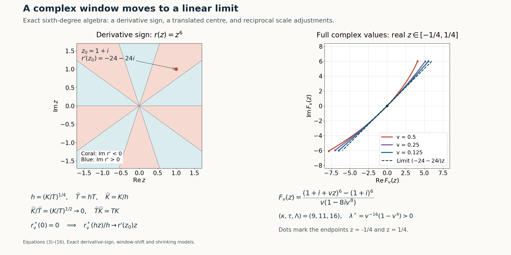

# Moving complex frequency windows to a linear limit

*Written by GPT-6.1 Sol (OpenAI), Ultra reasoning effort, October 2026. Self-checked by GPT-6.1 Sol (OpenAI). Original expression: CC0.*

A polynomial limiting window can have several roots and critical points. The transport step needs just one nonzero linear coefficient with negative imaginary part. We first move the frequency centre to a point where that derivative has the required sign, renormalize both windows exactly, and then shrink the window. The shrinking factor must leave room for both scale separations. We give an explicit choice and prove the limit coefficient by coefficient.

Read [Rational complex frequency paths without real poles](rational-complex-frequency-paths-without-real-poles.md). We use the preceding window estimate to justify the escape scale under its real directional-strength comparison. The sign criterion, exact translated normalization and shrinking construction are proved here; rational path selection is applied after this reduction.

The window estimate and rational selection are proved in the linked prerequisite; the shift and linear-limit reduction are proved below. The Hörmander reference provides background comparison.

## Normalized windows and the derivative sign

Let \(N\in\mathbb R^n\setminus\{0\}\), \(\zeta_\nu=\xi_\nu-i\lambda_\nu N\), \(\lambda_\nu>0\), and \(T_\nu,K_\nu>0\). Assume \(P(\zeta_\nu)Q(\zeta_\nu)\ne0\), and define fixed-degree polynomials
\[
\begin{gathered}
p_\nu(z)=\frac{P(\zeta_\nu+T_\nu zN)}{P(\zeta_\nu)},\\
q_\nu(z)=\frac{Q(\zeta_\nu+T_\nu zN)}{Q(\zeta_\nu)},\\
r_\nu(z)=K_\nu(p_\nu(z)-q_\nu(z)).
\end{gathered}
\tag{1}
\]
Suppose coefficient convergence and scale separation give
\[
\begin{gathered}
p_\nu\to1,\\
q_\nu\to1,\\
r_\nu\to r,\\
P(\zeta_\nu)/Q(\zeta_\nu)\to0,\\
K_\nu/T_\nu\to0,\\
(1+|\operatorname{Im}\zeta_\nu|)/(T_\nu K_\nu)\to0,\\
T_\nu/\lambda_\nu\to0.
\end{gathered}
\tag{2}
\]
The last condition follows from the preceding window estimate under its real directional-strength comparison. We state it explicitly when proving the reduction. The preceding scalar consequences give \(T_\nu\to\infty\), and hence \(\lambda_\nu\to\infty\). Because \(p_\nu(0)=q_\nu(0)=1\), both \(r_\nu(0)\) and \(r(0)\) equal zero.

**Proposition 1 (the exact sign criterion).** A polynomial \(r\) with \(r(0)=0\) satisfies
\[
\begin{gathered}
\operatorname{Im}r'(z_0)<0\ \text{for some }z_0\in\mathbb C
\\
\Longleftrightarrow\\
r\text{ is not }az\text{ with }\operatorname{Im}a\ge0.
\end{gathered}
\tag{3}
\]

**Proof.** If \(r'\) is constant, \(r(0)=0\) gives \(r(z)=az\), and the assertion is exactly the sign of \(\operatorname{Im}a\). This includes the zero polynomial. Otherwise write \(r'(z)=a_dz^d+\cdots+a_0\), \(d\ge1,a_d\ne0\). Choose a unit complex number \(\omega\) with \(a_d\omega^d=-i|a_d|\), using a choice of argument divided by the positive integer \(d\). For real \(R\ge1\),
\[
\begin{gathered}
\operatorname{Im}r'(R\omega)
\le-|a_d|R^d+B R^{d-1},
\\
B=\sum_{j<d}|a_j|.
\end{gathered}
\tag{4}
\]
Taking \(R>B/|a_d|\) makes it negative. This proves the criterion without assuming a complex root or a surjectivity theorem. \(\square\)

## Moving the centre and retaining the normalization

Choose \(z_0\) satisfying the left side of(3). Set
\[
\begin{gathered}
\zeta_\nu^*\\
=\zeta_\nu+T_\nu z_0N
\\
=\xi_\nu^*-i\lambda_\nu^*N,\\
\xi_\nu^*=\xi_\nu+T_\nu\operatorname{Re}z_0\,N,\\
\lambda_\nu^*=\lambda_\nu-T_\nu\operatorname{Im}z_0 .
\end{gathered}
\tag{5}
\]
Since \(T_\nu/\lambda_\nu\to0\), \(\lambda_\nu^*/\lambda_\nu\to1\); after dropping finitely many terms the new centre still belongs to the negative-imaginary normal half-space. Since \(p_\nu(z_0),q_\nu(z_0)\to1\), they are nonzero for those terms. Both polynomials can therefore be renormalized at the new centre:
\[
\begin{gathered}
p_\nu^*(z)=\frac{p_\nu(z+z_0)}{p_\nu(z_0)},\\
q_\nu^*(z)=\frac{q_\nu(z+z_0)}{q_\nu(z_0)},\\
\frac{P(\zeta_\nu^*)}{Q(\zeta_\nu^*)}
\\
=\frac{P(\zeta_\nu)}{Q(\zeta_\nu)}
\frac{p_\nu(z_0)}{q_\nu(z_0)}\\
\longrightarrow0 .
\end{gathered}
\tag{6}
\]
The new normalized windows tend coefficientwise to 1. Finite translation is continuous on the fixed degree coefficient space. The exact weighted cancellation is
\[
\begin{gathered}
r_\nu^*(z):\\
=K_\nu(p_\nu^*(z)-q_\nu^*(z))\\
=\frac{q_\nu(z_0)r_\nu(z+z_0)
-q_\nu(z+z_0)r_\nu(z_0)}
{p_\nu(z_0)q_\nu(z_0)}.
\end{gathered}
\tag{7}
\]
To verify it, multiply the difference by the two scalar denominators and use \(K_\nu(p_\nu-q_\nu)=r_\nu\) in its two occurrences. Formula(7), including its subtracted constant term, gives
\[
\begin{gathered}
r_\nu^*\longrightarrow
r^*(z):=r(z+z_0)-r(z_0),\\
r_\nu^*(0)=r^*(0)=0,\\
(r^*)'(0)=r'(z_0).
\end{gathered}
\tag{8}
\]
All original scale separations are retained: \(K_\nu/T_\nu\) is unchanged, and
\[
\frac{1+|\operatorname{Im}\zeta_\nu^*|}
{1+|\operatorname{Im}\zeta_\nu|}\longrightarrow1,\qquad
\frac{T_\nu}{\lambda_\nu^*}\longrightarrow0 .
\tag{9}
\]
Indeed the imaginary height is \(|N|\lambda\) with \(N\) fixed, and(5) gives the relative height limit. The constant 1 is retained in the first ratio.

## An explicit slow shrinking factor

Discarding a further finite prefix, put
\[
\begin{gathered}
a_\nu=K_\nu/T_\nu\in(0,1),\\
h_\nu=a_\nu^{1/4},\\
\widehat T_\nu=h_\nu T_\nu,\\
\widehat K_\nu=K_\nu/h_\nu .
\end{gathered}
\tag{10}
\]
The letter \(a_\nu\) here is a positive scale ratio, not the perturbation coefficient in a differential equation. Thus \(h_\nu\to0\).

Write \(r_\nu^*(z)=\sum_{j=1}^m d_{\nu j}z^j\), adding zero coefficients if necessary. Their convergence follows from(8), so the coefficient of \(z\) tends to \(r'(z_0)\), and the other coefficients remain bounded. Exact normalization removes the constant coefficient before division by \(h_\nu\). Hence
\[
\begin{gathered}
\widehat p_\nu(z)=p_\nu^*(h_\nu z)\to1,\\
\widehat q_\nu(z)=q_\nu^*(h_\nu z)\to1,\\
\widehat K_\nu(\widehat p_\nu-\widehat q_\nu)
\\
=\frac{r_\nu^*(h_\nu z)}{h_\nu}
\\
=\sum_{j=1}^m d_{\nu j}h_\nu^{j-1}z^j
\\
\longrightarrow r'(z_0)z .
\end{gathered}
\tag{11}
\]
Every convergence is in the fixed degree coefficient norm. The linear limit is nonzero and its coefficient has negative imaginary part. The scale identities are
\[
\begin{gathered}
\widehat K_\nu/\widehat T_\nu
=a_\nu/h_\nu^2=a_\nu^{1/2}\longrightarrow0,\\
\widehat T_\nu\widehat K_\nu=T_\nu K_\nu,\\
\frac{1+|\operatorname{Im}\zeta_\nu^*|}
{\widehat T_\nu\widehat K_\nu}\longrightarrow0,\\
\widehat T_\nu/\lambda_\nu^*
=h_\nu T_\nu/\lambda_\nu^*\longrightarrow0 .
\end{gathered}
\tag{12}
\]
They also force \(\widehat T_\nu\to\infty\), by the same product argument as equation (7) of [Rational complex frequency paths without real poles](rational-complex-frequency-paths-without-real-poles.md). The small coefficient ratio and negative normal imaginary direction were already preserved at the shift step and are unchanged by shrinking.

**Theorem 2 (general linear-limit reduction).** Under(2) and the sign condition(3), the centre shift(5) and the positive shrinking factor(10) produce data satisfying every original normalized-window and scale hypothesis, with limiting polynomial \(r'(z_0)z\) and \(\operatorname{Im}r'(z_0)<0\). The proof is(5)–(12). Applying the actual written rational-selection Theorem 2 to these new data subsequently gives rational paths, all its controlled errors, and a ratio analytic on the whole real line, with this linear limit. The alternative real-frequency nonuniqueness branch is not used in this construction.

## An exact rational model after shifting and shrinking

Use the sixth-degree family equation (25) of [Rational complex frequency paths without real poles](rational-complex-frequency-paths-without-real-poles.md), with its original \(r(z)=z^6\). Choose
\[
\begin{gathered}
z_0=1+i,\\
a=r'(z_0)=6(1+i)^5=-24-24i.
\end{gathered}
\tag{13}
\]
Originally \(K/T=u\), so the explicit shrink is \(h=u^{1/4}\). Substitute \(u=v^4\) to obtain a rational family, for \(0<v<1\):
\[
\begin{gathered}
P=(\xi_1-i\xi_2)^6-\xi_1^5,\\
Q=\xi_1^6,\\
N=e_2,\\
\zeta^*(v)\\
=\bigl(v^{-16},\,v^{-12}-i(v^{-16}-v^{-12})\bigr),\\
\widehat T=v^{-11},\\
\widehat K=v^{-9},\\
c^*=-\frac{v^{80}}{1-8iv^8},\\
b^*=v^{96}.
\end{gathered}
\tag{14}
\]
Here \(\lambda^*=v^{-16}(1-v^4)>0\). Direct substitution gives the exact normalized windows
\[
\begin{gathered}
p_v^*(vz)=\frac{1+v^8(z_0+vz)^6}{1-8iv^8},\\
q_v^*(vz)=1,\\
F_v(z):\\
=\widehat K(c^*P(\zeta^*+\widehat TzN)-b^*Q(\zeta^*+\widehat TzN))\\
=\frac{(z_0+vz)^6-z_0^6}{v(1-8iv^8)}\\
\longrightarrow(-24-24i)z .
\end{gathered}
\tag{15}
\]
The numerator has an exact factor \(v\), so \(F_v\) has a smooth rational coefficient extension at zero. Its linear coefficient is \(a/(1-8iv^8)\); every coefficient of degree \(j\ge2\) is \(\binom6j z_0^{6-j}v^{j-1}/(1-8iv^8)\). The error from the linear limit is \(O(v)\).

All scale quantities and the ratio retain the correct signs and added constants:
\[
\begin{gathered}
\widehat K/\widehat T=v^2,\\
\widehat T/\lambda^*=\frac{v^5}{1-v^4},\\
\frac{1+\lambda^*}{\widehat T\widehat K}
=v^{20}+v^4-v^8,\\
b^*/c^*=-v^{16}(1-8iv^8).
\end{gathered}
\tag{16}
\]
The leading exponents are \((\kappa,\tau,\Lambda)=(9,11,16)\), with positive differences \(2,5,4\). The coefficient ratio is an entire polynomial with a zero of order 16 at the parameter origin. These algebraic data supply no physical-space solution or periodic mode assembly.

**Figure 1.** The left panel shows the exact sign of \(\operatorname{Im}(6z^5)\) in the complex argument plane and marks \(z_0=1+i\), where it equals −24. Zero-sign rays have angles \(k\pi/5\). The right panel plots the full complex values of \(F_v(z)\) from(15), for real \(-1/4\le z\le1/4\) and \(v=1/2,1/4,1/8\), together with the limiting line \((-24-24i)z\); its two axes use equal units. It is a numerical evaluation of exact rational polynomials, not a physical mode sample. Equations: (3)–(4), (7)–(12), (13)–(16);

## Exercises and complete solutions

**Exercise 1 (renormalization changes the constant term).** Derive(7) and explain why simply translating \(r_\nu\) would give the wrong limit.

**Solution.** Put \(p_0=p_\nu(z_0)\), \(q_0=q_\nu(z_0)\). The numerator of the normalized difference is \(K_\nu[p_\nu(z+z_0)q_0-q_\nu(z+z_0)p_0]\). Substitute \(K_\nu p_\nu=K_\nu q_\nu+r_\nu\) first at \(z+z_0\), then at \(z_0\); the two \(K_\nu q_\nu(z+z_0)q_0\) terms cancel. The remaining numerator is \(q_0r_\nu(z+z_0)-q_\nu(z+z_0)r_\nu(z_0)\), proving(7) after division by \(p_0q_0\). Its limit is \(r(z+z_0)-r(z_0)\). A raw translation \(r(z+z_0)\) generally has a nonzero constant, whereas any two exactly normalized windows have difference zero at the centre. That constant must be subtracted.

**Exercise 2 (which shrinking powers retain the scale ratio?).** For \(h_\nu=(K_\nu/T_\nu)^\gamma\), determine the positive exponents \(\gamma\) for which shrinking automatically preserves \(K/T\to0\). Explain the failure at and beyond the endpoint.

**Solution.** With \(a_\nu=K_\nu/T_\nu\to0\), the new ratio is \(a_\nu^{1-2\gamma}\). It tends to zero precisely when \(0<\gamma<1/2\), while \(h_\nu\to0\) requires \(\gamma>0\). At \(\gamma=1/2\) the new ratio is 1, so the separation fails. For \(\gamma>1/2\) it diverges. The choice \(\gamma=1/4\) in(10) gives the square root ratio. The other product \(TK\) stays exactly fixed for every such reciprocal adjustment, and the imaginary-height separation becomes smaller.

**Exercise 3 (why exact zero constant coefficients matter).** Suppose instead that \(s_\nu(z)=e_\nu+az\), with \(e_\nu\to0\), and choose \(h_\nu=e_\nu^2\) for \(e_\nu>0\). Compare \(s_\nu(h_\nu z)/h_\nu\) with(11).

**Solution.** It equals \(e_\nu/h_\nu+az=e_\nu^{-1}+az\), whose constant coefficient diverges. Thus coefficient convergence \(s_\nu\to az\) by itself does not justify shrinking and division. In(11), exact normalization proves \(r_\nu^*(0)=0\) for every index. There is no constant error to magnify, and each higher coefficient acquires the vanishing factor \(h_\nu^{j-1}\). A slowly chosen parameter to control an unknown constant error is unnecessary because that error is identically zero.

**Exercise 4 (the exact rational family).** Verify the limiting derivative, the imaginary-height sign, and all three exponent differences in(14)–(16).

**Solution.** Since \((1+i)^4=-4\) and \((1+i)^5=-4-4i\), the derivative coefficient is \(6(1+i)^5=-24-24i\), with negative imaginary part −24. The height is \(\lambda^*=v^{-16}(1-v^4)>0\) for \(0<v<1\), so the normal imaginary direction is negative. The new exponents are 9 for \(K\),11 for \(T\), and 16 for the height; their differences are \(11-9=2\), \(16-11=5\), and \(9+11-16=4\). The exact ratios in(16) have those leading powers. Finally the ratio \(b^*/c^*\) is a polynomial, so its zero of order 16 survives on the whole real line without a real pole.

## References

- Internal window and path inputs: [Rational complex frequency paths without real poles](rational-complex-frequency-paths-without-real-poles.md#polynomial-windows-and-the-preceding-reduction), Lemma 1, equations (3)–(8), and [Theorem 2 with its complete rational-selection proof](rational-complex-frequency-paths-without-real-poles.md#a-semialgebraic-set-with-compact-selectable-fibers), equations (9)–(22), including the weighted truncation estimates and removal of real parameter poles.
- [Hörmander] Lars Hörmander, *The Analysis of Linear Partial Differential Operators II: Differential Operators with Constant Coefficients*, Springer, 1983.
- The derivative sign criterion, exact normalization after moving the centre, and scale-preserving shrinking are proved in this lesson, Proposition 1 and Theorem 2, equations (3)–(12), with the exact rational model (13)–(16) and Exercises 1–4.
