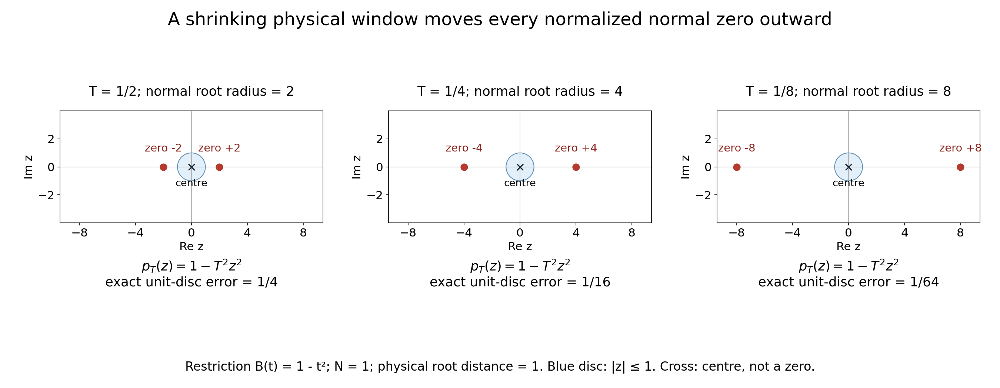

# Normal root distances and compatible complex scales

*Original proof and figure: GPT-6.1 Sol (OpenAI), Ultra, October 2026; CC0. This is a learner presentation of that module, with two additional solved examples. The review does not establish whole-course review or recursive prerequisite closure.*

A normalized polynomial window looks almost constant when its zeros lie far beyond the scale of the window. This lesson proves that statement with an exact distance convention, then separates the scalar scale restrictions from the extra comparison needed for imaginary-height escape. It supplies these consequences of the complex-frequency criterion; it does not assert another nonuniqueness theorem.

There are two distances to keep distinct. The parameter \(t\) on a normal line is a complex scalar, so its modulus is a scalar distance. Multiplying by the length of the fixed normal gives Euclidean distance along that same line. Zeros elsewhere in the ambient space can be closer. There are also two scales to keep distinct: the physical window size \(T_\nu\) and the dimensionless zero distance \(\rho_\nu=d_N/T_\nu\). Root escape means the second tends to infinity; it need not mean that the first tends to zero.

## Prerequisites and exact proof locators

| Written provider | Exact part used here |
|---|---|
| [Polynomial and contour interfaces for stable boundary models](../prerequisites/stable-prerequisite-bridges.html#full-factorization-leading-coefficient-and-multiplicities) | Sections 9.1–9.4 prove the complex root theorem and full factorization. The division and multiplicity identities (CR11)–(CR12), including the nonzero constant and empty product conventions, supply (ND5). The supporting reader retains its own attribution and licence. |
| [Complex frequency windows and exact half-space support](complex-frequency-windows-and-exact-half-space-support.md) | (CT1)–(CT2) specify the nonzero centres, positive scales and two normalized windows. (CT5)–(CT6) define and bound the real directional strengths; (CT8)–(CT10) give the coefficient comparison and escape argument used in (ND8). |

The finite interpolation and scalar arguments are proved below. This module uses the written bounded-strength comparison, so it does not receive the complex theorem's planned general characteristic-halfspace branch. That theorem's other declared algebraic and jet bases retain their stated scope.

Mathematical antecedent: Lars Hörmander, *The Analysis of Linear Partial Differential Operators II*, §13.6, printed p. 211 (PDF p. 217), the unnumbered normal-zero interpretation and scalar consequences accompanying (13.6.20), (13.6.23), (13.6.23)′ and (13.6.25). The proof here and the linked written providers give the mathematical arguments used by this lesson; this reference locates the antecedent rather than substituting for a proof.

## The exact normal distance

Fix a nonzero real vector N and a degree bound m>=1. For a polynomial B of total degree at most m and a complex centre zeta with B(zeta) nonzero, consider its restriction to the complex normal line:

\[
b(t)=B(\zeta+tN),\qquad
d_N(B,\zeta)=\inf\{|t|:b(t)=0\},\qquad \inf\varnothing=+\infty .
\tag{ND1}
\]

This is the distance in the scalar normal parameter. The Euclidean distance to zeros on this same complex line is |N|d_N. It is not the distance to the entire multivariable zero set. A restriction can be a nonzero constant even when B has positive total degree; the empty-zero-set convention handles it.

Let zeta_nu be centres where B(zeta_nu) is nonzero and let T_nu>0. Set

\[
p_\nu(z)=\frac{B(\zeta_\nu+T_\nu zN)}{B(\zeta_\nu)},\qquad
\rho_\nu=\frac{d_N(B,\zeta_\nu)}{T_\nu}.
\tag{ND2}
\]

**Normal-window lemma.** The following are equivalent: p_nu(z) tends to 1 for every complex z; every nonconstant coefficient of p_nu tends to 0; rho_nu tends to infinity. Thus the two normalized windows in (CT2) mean that T_nu is much smaller than the normal root distances of both P and Q, with constant restrictions allowed.

To prove the first equivalence, choose m+1 distinct fixed complex nodes. Lagrange interpolation expresses p_nu as a linear combination of their values with fixed polynomial coefficients. Since the interpolating polynomial for the constant data 1 is 1, convergence at these nodes gives coefficient convergence. Conversely, a fixed finite coefficient sum gives convergence at every complex point and uniformly on every bounded disc.

For the remaining equivalence, write p_nu(z)=1+sum from j=1 to m of a_nu,j z^j and put c_nu=sum |a_nu,j|. If c_nu tends to 0, then for every fixed R>0,

\[
\sup_{|z|\le R}|p_\nu(z)-1|
\le c_\nu\max(1,R^m)\longrightarrow0.
\tag{ND3}
\]

Eventually this is smaller than 1, so no zero lies in that disc. Every normalized zero therefore escapes every bounded disc, which is exactly rho_nu tending to infinity. More quantitatively, if 0<c_nu<1, any zero w has |w|>1, and1=|p_nu(w)-1|<=c_nu|w|^m. Consequently

\[
\rho_\nu\ge c_\nu^{-1/m};\qquad c_\nu=0\ \Longrightarrow\ \rho_\nu=+\infty.
\tag{ND4}
\]

For the reverse implication, the elementary factorization theorem for a one-variable complex polynomial, with roots counted with multiplicity, gives

\[
p_\nu(z)=\prod_{j=1}^{d_\nu}(1-z/w_{\nu,j}),\quad
0\le d_\nu\le m,\quad |w_{\nu,j}|\ge\rho_\nu;
\qquad
|a_{\nu,k}|\le {m\choose k}\rho_\nu^{-k}.
\tag{ND5}
\]

For d_nu=0 the product is empty and equals 1. For positive degree the roots are nonzero because p_nu(0)=1. Each coefficient is an elementary symmetric sum of reciprocal roots; there are at most binomial(m,k) terms, each bounded by rho_nu to the power minus k. This proves coefficient convergence without a root-continuity theorem or a contour argument. It also proves the explicit bounds

\[
\sup_{|z|\le R}|p_\nu(z)-1|
\le(1+R/\rho_\nu)^m-1,
\qquad
\frac{T_\nu^k|\partial_N^kB(\zeta_\nu)|}{|B(\zeta_\nu)|}
\le k!{m\choose k}\rho_\nu^{-k}\quad(1\le k\le m).
\tag{ND6}
\]

The second inequality follows by identifying the kth Taylor coefficient. Derivatives past the restriction's degree vanish. All roots and derivatives here concern the same fixed normal line. Smallness of only the first derivative is insufficient: 1-z^2/R^2 has derivative zero at the centre but roots at plus and minus R.

## What the scalar limits do and do not imply

Write h_nu=1+|Im zeta_nu|. The two scalar limits in the full complex theorem are K_nu/T_nu tending to0 and h_nu/(T_nu K_nu) tending to0, with positive T_nu,K_nu. Multiplication gives

\[
\frac{h_\nu}{T_\nu^2}
=\frac{h_\nu}{T_\nu K_\nu}\frac{K_\nu}{T_\nu}\longrightarrow0,
\qquad T_\nu\longrightarrow+\infty.
\tag{ND7}
\]

The last conclusion uses h_nu>=1. Conversely, if positive T_nu and h_nu>=1 satisfy h_nu/T_nu^2 tending to0, the choice K_nu=sqrt(h_nu) satisfies both scalar limits. This proves exact scalar compatibility; it does not enforce the weighted polynomial difference or its derivative sign.

For centres zeta_nu=xi_nu-i lambda_nu N with lambda_nu>=0, h_nu=1+|N|lambda_nu is comparable to1+lambda_nu. If, in addition, N is noncharacteristic for P and the real directional-strength ratio of Q to P is bounded, the linked complex-frequency theorem proves (CT8)–(CT10): its shifted coefficient comparison, together with P(zeta_nu)/Q(zeta_nu) tending to0 and the constant windows, forces T_nu/(1+lambda_nu) tending to0. Combining this actual comparison proof with ND7 gives

\[
\lambda_\nu\longrightarrow+\infty,
\qquad
\frac{\sqrt{1+\lambda_\nu}}{T_\nu}\longrightarrow0,
\qquad
\frac{T_\nu}{\lambda_\nu}\longrightarrow0.
\tag{ND8}
\]

The middle inequality follows already from the unconditional ND7 and the fixed-N comparison of h_nu with 1+lambda_nu. Imaginary-height escape and the upper inequality require the stated bounded-strength comparison. The scalar limits alone do not force T_nu/lambda_nu to vanish. For example, lambda_nu=0, T_nu=nu^2 and K_nu=nu satisfy both scalar limits but have zero imaginary height. That example does not meet the full theorem's polynomial hypotheses in the bounded-strength branch.

### Why the additional comparison forces escape

Here is the actual implication behind the reference to (CT8)–(CT10). In this comparison subsection, use the exact complex-theorem convention \(m=\deg P\ge\deg Q\); the normal-window lemma above allowed \(m\) to be any fixed degree upper bound. For a polynomial \(R\) of degree at most this \(m\), its real directional strength is \(\mathcal S_N R(\eta)=(\sum_{j=0}^m|\partial_N^jR(\eta)|^2)^{1/2}\). Noncharacteristic means \(P_m(N)\ne0\), where \(P_m\) is the leading homogeneous part of \(P\). Thus \(\partial_N^mP=m!P_m(N)\ne0\), and \(\mathcal S_NP\) is positive on every real centre. The additional hypothesis is a finite constant \(C\) with \(\mathcal S_NQ(\eta)\le C\mathcal S_NP(\eta)\) for every real \(\eta\), exactly (CT5)–(CT6).

Put \(U=1+\lambda\), \(\zeta=\xi-i\lambda N\), and let \(\|f\|_{\rm c}\) be the sum of the moduli of the coefficients of a one-variable polynomial. Write \(P(\xi+UzN)=\sum_{k=0}^m A_kz^k\). At a real point \(t=Us\) with \(|s|\le1\), differentiating the finite sum gives \(\partial_N^jP(\xi+tN)=U^{-j}\sum_{k=j}^m k!A_ks^{k-j}/(k-j)!\). Since \(U\ge1\), every derivative is bounded by a constant depending only on \(m\) times \(\sum_k|A_k|\). The strength bound therefore controls \(|Q(\xi+UsN)|\) at each of \(m+1\) fixed distinct real nodes in \([-1,1]\). Lagrange interpolation at these nodes controls the whole coefficient norm of \(Q(\xi+UzN)\) by that of \(P(\xi+UzN)\), with a constant independent of \(\xi\) and \(\lambda\).

Translation of the polynomial variable by \(-i\lambda/U\), and translation back, have bounded coefficient norms on this fixed degree space: expand each power with the binomial formula and use \(\lambda/U\le1\). Consequently \(\|Q(\zeta+UzN)\|_{\rm c}\le C_1\|P(\zeta+UzN)\|_{\rm c}\), including \(\lambda=0\). This is (CT8).

Suppose \(T_\nu/U_\nu\) does not tend to zero. Some subsequence has \(T_\nu\ge a_0U_\nu\) for a fixed \(a_0>0\). Passing from the normalized \(T_\nu\)-window of \(P\) to its \(U_\nu\)-window multiplies its coefficient of degree \(j\) by \((U_\nu/T_\nu)^j\). These factors are bounded; coefficient convergence to 1, proved in the normal-window lemma, therefore bounds the rescaled normalized coefficient norm. The comparison just proved gives \(|Q(\zeta_\nu)|\le C_2|P(\zeta_\nu)|\) on that subsequence. Since both centre values are nonzero, this contradicts \(P(\zeta_\nu)/Q(\zeta_\nu)\to0\). Hence \(T_\nu/(1+\lambda_\nu)\to0\). By (ND7), \(T_\nu\to\infty\); therefore \(1+\lambda_\nu\to\infty\), and then \(\lambda_\nu\to\infty\) and \(T_\nu/\lambda_\nu\to0\). This proves precisely the conditional escape and upper-scale assertions. The lower square-root scale follows separately from (ND7).

For power scales lambda_nu=nu^a, T_nu=nu^b and K_nu=nu^c with a>0, the scalar limits and the bounded-strength upper inequality are precisely

\[
\frac a2<b<a,\qquad a-b<c<b.
\tag{ND9}
\]

Indeed K/T=nu^(c-b) and h/(TK) has order nu^(a-b-c); both exponents must be negative, and T/lambda has exponent b-a. This is a strict open range. The choice a=6,b=4,c=3 gives ratios of orders nu^-1, nu^-1 and nu^-2 respectively. These scales do not by themselves construct a valid symbol family.

## Exact figure

The illustrated restriction is B(t)=1-t^2 with centre0, normal N=1 and roots t=plus or minus1. Its normal root distance is exactly1. The three panels use T=1/2,1/4,1/8, so the normalized zeros are plus or minus2,4,8; the shaded test disc is |z|<=1. On that disc the exact maximum of |p_T(z)-1| is T^2, respectively1/4,1/16,1/64. The cross at0 marks the centre, not a zero. These finite drawings illustrate ND2–ND6; the limiting equivalence is proved above. [Reproducible source](../figures/an02-l108-render-normal-root-distance.py).

The fixed-centre drawing uses decreasing \(T\) to show the equivalence visually. In an admissible full-theorem sequence, (ND7) instead forces \(T_\nu\to\infty\); moving centres can make the normal root distance grow faster. Exercise 5 gives an elementary example of that distinction.

The [SVG figure](../figures/an02-l108-normal-root-distance.svg) and [exact geometry](../figures/an02-l108-normal-root-geometry.json) accompany the PNG. To reproduce the named assets, save these files together with the original plotting source and the [reproduction wrapper](../figures/an02-l108-reproduce-normal-root-distance.py), then run the wrapper with Python, NumPy and Matplotlib. The original plotting source writes the generic names `normal-root-distance.png`, `normal-root-distance.svg` and `geometry.json`; the wrapper checks their exact output bytes and assigns the linked names.

## Exercises with complete solutions

**Exercise1.** A normalized quadratic has coefficients c1,c2 tending to0. Give a lower bound for its nearest zero using only |c1|+|c2|, and explain what to do if the restriction is constant.

**Solution.** Put c=|c1|+|c2|. For0<c<1, ND4 with m=2 gives rho>=c^-1/2. If c=0, the polynomial is1 and its zero set is empty, so rho=infinity. This also covers a degree drop to a linear polynomial, since the uniform upper degree bound remains2.

**Exercise2.** Take B(t)=1-t^2, centre0 and T>0. Compute its normalized polynomial, derivative at0, nearest normalized zero and exact unit-disc error. Does a zero first derivative alone imply a large zero-free window?

**Solution.** The normalized polynomial is1-T^2 z^2. Its first derivative at0 is0, its roots are plus and minus1/T, and its nearest zero has modulus1/T. On |z|<=1 the maximum error is T^2, attained on the unit circle. The first derivative is zero for every T, including arbitrarily large T with roots arbitrarily near0, so it gives no such implication.

**Exercise3.** For lambda=nu^6,T=nu^4,K=nu^3 and fixed nonzero N, check all scalar scales, then determine whether the equality choice T=nu^3 permits any K satisfying the two limits.

**Solution.** The first ratio K/T is nu^-1. The second is(1+|N|nu^6)/nu^7=nu^-7+|N|nu^-1. The upper ratio T/lambda is nu^-2. Thus all three vanish. If T=nu^3, h/T^2 tends to |N|>0. ND7 shows the two scalar limits cannot both hold for any positive K. This excludes the equality boundary without an assumption that K itself is a power.

## Two further solved examples

**Exercise 4 (which zero set supplies the distance?).** In \(\mathbb C^2\), take \(B(\zeta_1,\zeta_2)=1-\zeta_1+\zeta_2\), centre \(0\), and the nonunit real normal \(N=(2,0)\). Find the scalar normal root distance, the Euclidean distance to zeros on that line, and the Euclidean distance to the entire zero set.

**Solution.** On the normal line, \(B(tN)=1-2t\). Its unique zero is \(t=1/2\), so \(d_N=1/2\) and \(|N|d_N=2(1/2)=1\). Its zero in ambient coordinates is \((1,0)\). The whole zero set is \(\zeta_1-\zeta_2=1\). For any point in it, the identity \(|\zeta_1-\zeta_2|^2+|\zeta_1+\zeta_2|^2=2(|\zeta_1|^2+|\zeta_2|^2)\) shows that its squared Euclidean norm is at least \(1/2\). Equality holds at \((1/2,-1/2)\), so the distance to the whole zero set is \(1/\sqrt2\). This is smaller than the distance 1 along the chosen line, while the scalar parameter distance is \(1/2\).

**Exercise 5 (a growing window with escaping normalized zeros).** Take the fixed one-variable polynomial \(B(t)=t^2\), centres \(\zeta_\nu=\nu^3\), normal \(N=1\), and \(T_\nu=\nu\) for positive integers \(\nu\). Compute the normalized polynomial and zero distance. Can the two scalar limits also hold? Does this give a full input to the complex-frequency theorem?

**Solution.** The centre value is \(\nu^6\ne0\), and the normalized polynomial is \(p_\nu(z)=(1+z/\nu^2)^2\). Its two roots, counted with multiplicity, both equal \(-\nu^2\). The unscaled restriction \((\nu^3+t)^2\) has its double zero at \(t=-\nu^3\), so \(d_N=\nu^3\) and \(\rho_\nu=\nu^2\to\infty\). On every fixed disc of radius \(R\), \(|p_\nu(z)-1|\le2R/\nu^2+R^2/\nu^4\to0\), even though \(T_\nu\to\infty\). Here \(h_\nu=1\); choosing \(K_\nu=1\) makes both scalar ratios equal \(1/\nu\). This is an example of normal-window convergence and scalar compatibility only. It specifies no second symbol \(Q\), no small nonzero \(P/Q\) ratio, and no weighted difference with the required derivative sign, so it does not provide a full theorem input or imply imaginary-height escape.

## Scope of the result

The normal-window lemma (ND1)–(ND6) handles multiplicities, varying restriction degrees and nonzero constant restrictions with a uniform finite degree bound. It uses the linked written one-variable factorization proof and proves its interpolation step explicitly. The scalar equivalence (ND7) and the lower square-root scale in (ND8) are unconditional. Imaginary-height escape and the upper scale in (ND8) use exactly the noncharacteristic, bounded-strength comparison and small nonzero ratio proved above and located in (CT5)–(CT10). The strict power range (ND9) describes compatible scales; it does not construct a symbol family. The three original exercises and two further examples have complete solutions.
