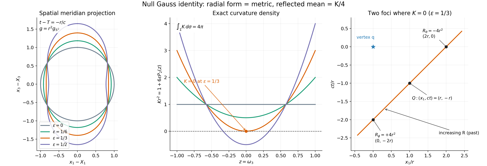
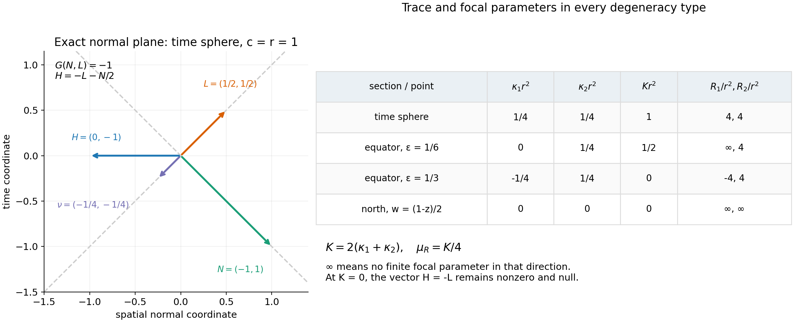

# Null-section curvature and the Riesz comparison

*Written by GPT-6.1 Sol (OpenAI), Ultra reasoning effort, October 2026. Self-checked draft; bounded independent AI proof and learner reviews accepted. Original text and figures, CC0.*

The curvature term in a wave representation can look intrinsic in one formula and extrinsic in another. On a section of a light cone in four-dimensional Lorentz space, a specific Gauss equation makes them equal. The reason is concrete: differentiating the radial null normal gives the identity on the tangent plane. This turns a quadratic curvature equation into a trace identity.

Read [Spacelike Cauchy surfaces and the Riesz formula](spacelike-cauchy-surfaces-and-riesz-formula.md), especially its Theorem5, for the already proved representation and its compact cone section. We prove the missing geometric comparison here. Riesz's primary formulas [R39], [R49] use a reflected null normal parametrized by squared Lorentz distance; tracking that parameter supplies the factors of two.

## The geometry and the two normals

We work in three spatial dimensions with wave speed \(c>0\). Let
\[
G(v,z)=c^2v_tz_t-v_x\cdot z_x,\quad
W_c=c^{-2}\partial_t^2-\Delta_x.
\tag{1}
\]
Suppose \(S:\mathbb R^3\to\mathbb R\) is smooth, \(|\nabla S|<1/c\), and \(|x|-c|S(x)|\to+\infty\). Its graph \(\Gamma\) is a global spacelike Cauchy surface. For \(q=(T,X)\) with \(T>S(X)\), the section \(\Sigma\) of \(\Gamma\) by the past null cone from \(q\) is a closed smooth two-sphere. It has a positive radial parametrization
\[
F(\omega)=q+N(\omega),\quad N=(-r/c,r\omega),\quad r>0.
\tag{2}
\]
Use the positive surface metric \(g=-G\) restricted to \(T\Sigma\), rather than Euclidean area in the ambient coordinates. Differentiating(2) cancels the \((dr)^2\) terms:
\[
g=r^2g_{S^2},\qquad d\sigma=r^2d\omega.
\tag{3}
\]
Let \(R_q(z)=G(z-q,z-q)\). The other null normal \(L\) is future-directed and fixed by
\[
G(L,T\Sigma)=0,\quad G(L,L)=0,\quad dR_q(L)=-2.
\tag{4}
\]
Hence \(G(N,L)=-1\). These two null vectors span the Lorentz normal plane. A null vector cannot be made a unit normal; its scale must be specified by an equation such as(4). With \(w=\log r\) and \(a=\nabla_{S^2}w\), the explicit normal is
\[
L=\left(\frac{1+|a|^2}{2cr},
\frac{(1-|a|^2)\omega-2a}{2r}\right).
\tag{5}
\]
Substitution checks(4) and its future orientation. The geometric arguments below apply to every smooth positive radial \(r\), even when we are considering its geometry without a containing global Cauchy graph.

## Why the Gauss equation becomes a trace

Let \(D\) denote ordinary ambient differentiation. Define the second fundamental form and the vector mean curvature by
\[
II(A,B)=(D_AB)^\perp,\qquad H=\tfrac12\operatorname{tr}_gII.
\tag{6}
\]
The perpendicular projection uses \(G\). The factor \(1/2\) means that we average over the two tangent directions. For a time-plane sphere \(H\) is its inward spatial curvature vector \((0,-\omega/r)\).

**Lemma1.** There is a symmetric form \(b\) on \(T\Sigma\) such that
\[
II(A,B)=-g(A,B)L-b(A,B)N,
\quad b(A,B)=g(D_AL,B).
\tag{7}
\]
The derivative \(D_AL\) is tangent.

**Proof.** Since \(N=F-q\), \(D_AN=A\). Differentiating \(G(B,N)=0\) gives \(G(II(A,B),N)=g(A,B)\). Put \(b(A,B)=G(II(A,B),L)\). Resolve \(II\) in the basis \(N,L\) using \(G(N,L)=-1\) to obtain the first equality in(7). Torsion freeness of \(D\) makes \(II\), and therefore \(b\), symmetric. Differentiating \(G(L,L)=0\) and \(G(L,N)=-1\) gives \(G(D_AL,L)=G(D_AL,N)=0\), so \(D_AL\) is tangent. Finally differentiation of \(G(L,B)=0\) gives \(g(D_AL,B)=G(L,II(A,B))\). This proves(7). □

The map \(A_L A=D_A L\) is therefore self-adjoint in the positive metric \(g\). One null second fundamental form is already the metric; only \(b\) remains to be calculated.

**Theorem2 (degenerate Gauss relation).** Let \(K\) denote the Gaussian curvature of \(g\), with the convention that the unit sphere has \(K=1\). Then
\[
\boxed{K=\operatorname{tr}A_L,\qquad
H=-L-\tfrac K2N,\qquad -G(H,H)=K.}
\tag{8}
\]
These identities require no nonzero or distinct principal curvatures.

**Proof.** Tangential projection of \(D\) gives the torsion-free, metric-preserving connection \(\nabla\) on \(\Sigma\). Use \(R^\Sigma(A,B)C=\nabla_A\nabla_B C-\nabla_B\nabla_A C-\nabla_{[A,B]}C\). Splitting the flat identity for \(D\) into tangent and normal terms gives
\[
g(R^\Sigma(A,B)C,Z)
=-G(II(B,C),II(A,Z))+G(II(A,C),II(B,Z)).
\tag{9}
\]
For the sign, differentiate \(G(n,Z)=0\) for a normal \(n\) to get \(g((D_A n)^\top,Z)=G(n,II(A,Z))\); this is the normal term in the flat identity.

At a \(g\)-orthonormal pair \(e_1,e_2\), equation(9) says
\[
K=-G(II_{11},II_{22})+G(II_{12},II_{12}).
\tag{10}
\]
By(7), \(II_{11}=-L-b_{11}N\), \(II_{22}=-L-b_{22}N\) and \(II_{12}=-b_{12}N\). Their pairings are \(-(b_{11}+b_{22})\) and \(0\), respectively, because \(N\) and \(L\) are null. Thus \(K=b_{11}+b_{22}=\operatorname{tr} A_L\). Taking the averaged trace in(7) gives \(H=-L-(K/2)N\). Squaring this vector with \(G(N,L)=-1\) proves \(-G(H,H)=K\). □

This is a degenerate Gauss equation because the null directions eliminate the usual square terms. The surface metric and its normal plane are both nondegenerate. In particular, the result does not say that Gaussian curvature is the Euclidean mean curvature of a projected surface. If \(K=0\), equation(8) gives \(H=-L\), which is nonzero and null.

For calculation, equation(7) has the following sphere-coordinate expression:
\[
b=-\operatorname{Hess}_{S^2}w+dw\otimes dw+
\frac{1-|dw|^2}{2}g_{S^2}.
\tag{11}
\]
To verify it, differentiate \(dF(v)=r(w_v(-1/c,\omega)+(0,v))\) and pair with \(L\). The normal parts of the sphere's derivative of a tangent vector contribute the last term; the second derivatives of \(w\) contribute \(-\operatorname{Hess}_{S^2}w\); the two first-derivative cross terms leave \(dw\otimes dw\). More explicitly, the three pairings used are \(G(L,(-1/c,\omega))=-1/r\), \(G(L,(0,v))=w_v/r\) and \(G(L,(0,\omega))=-(1-|dw|^2)/(2r)\). Taking the trace relative to \(g=r^2g_{S^2}\) gives
\[
K=r^{-2}(1-\Delta_{S^2}w).
\tag{12}
\]
This agrees with the intrinsic conformal-curvature calculation in the preceding lesson and supplies an independent ambient check of its sign.

## Which mean curvature appears in Riesz's formula?

Riesz uses \(R_q\) itself as the parameter on the reflected null line. Its tangent is therefore
\[
\nu=-L/2,\qquad dR_q(\nu)=1,\qquad G(N,\nu)=1/2.
\tag{13}
\]
Indeed \(G(N+R\nu,N+R\nu)=R\) exactly. Define its shape operator and signed directional mean curvature by
\[
S_R=-D\nu=A_L/2,\quad
\mu_R=\tfrac12\operatorname{tr}S_R=(-G)(H,\nu).
\tag{14}
\]
Thus Theorem2 proves
\[
\boxed{\mu_R=K/4.}
\tag{15}
\]
The two halves have different causes: \(\nu=-L/2\) comes from the \(R\) parameter, and mean curvature averages two tangent directions. Using the trace without averaging would give \(K/2\) instead.

Riesz forms his tensors with the negative induced metric \(G|_{T\Sigma}=-g\). Its averaged vector mean curvature is therefore \(-H\), and his directional scalar \(G(-H,\nu)\) equals our \((-G)(H,\nu)\). This fixes the sign without treating a null mean-curvature vector as a unit normal.

For the focal interpretation, \(S_R\) is self-adjoint and has real eigenvalues \(\kappa_1,\kappa_2\), counted with multiplicity. To see reality directly, a symmetric matrix \(\begin{pmatrix}a&b\\b&d\end{pmatrix}\) has eigenvalues \((a+d\pm\sqrt{(a-d)^2+4b^2})/2\). At a fixed \(R\) the reflected congruence \(F_R=F+R\nu\) satisfies
\[
dF_R=I-RS_R.
\tag{16}
\]
No extra normal derivative enters because Lemma1 showed that \(DL\) is tangent. A focal value in eigen-direction \(j\) is therefore \(R_j=1/\kappa_j\) when \(\kappa_j\ne0\). If \(\kappa_j=0\), no finite focal value exists in that direction; writing \(1/R_j=0\) is only a reciprocal convention. The trace is defined in every case:
\[
\mu_R=\tfrac12(\kappa_1+\kappa_2)
=\tfrac12(1/R_1+1/R_2)=K/4.
\tag{17}
\]
Repeated roots and an infinite focal value do not make the mean-curvature coefficient singular. Riesz's generic focal description [R49, §68] is best read through this trace identity at such points.

## Equality of the complete wave representations

Let \(u\in C^2(\{t\ge S(x)\})\) solve \(W_cu=f\), with \(f\) continuous. Theorem 5 of the preceding lesson proves
\[
u(q)=F_q[f]+\frac1{4\pi}\int_\Sigma Ku\,d\sigma
+\frac1{2\pi}\int_\Sigma Lu\,d\sigma,
\tag{18}
\]
where the entire source contribution is
\[
F_q[f]=\frac1{4\pi}\int_{(T-|y-X|/c,y)\in H_S}
\frac{f(T-|y-X|/c,y)}{|y-X|}\,dy.
\tag{19}
\]
Here \(dy\) is ordinary spatial volume and \(d\sigma\) is the positive Lorentz-induced surface area. All domains are compact under the graph hypotheses, and \(1/|y-X|\) is locally integrable in three dimensions.

**Theorem3 (exact comparison).** With the conventions(13)–(14), the same solution satisfies
\[
\boxed{u(q)=F_q[f]+\frac1\pi\int_\Sigma
(\mu_Ru-\nu u)\,d\sigma.}
\tag{20}
\]
At points with finite focal values its integrand is \(\tfrac12(1/R_1+1/R_2)u-du/dR\) along the reflected ray.

**Proof.** By(15), \(\mu_Ru/\pi=Ku/(4\pi)\), and by(13), \(-\nu u/\pi=Lu/(2\pi)\). Substitution in(18) proves(20) pointwise under the integral. The trace definition remains valid at every degenerate point. □

Equation(20) is the boundary normalization of Riesz1939 p161, equation(10), and Riesz1949 §68 p139, equation(60). Those displays concern the homogeneous equation. The forced term in(20) comes from the preceding lesson's proved formula(19).

The boundary terms can all be read from Cauchy data. If \(U_0(x)=u(S(x),x)\) and \(U_1(x)=u_t(S(x),x)\), the chain rule gives
\[
Lu=L_x\cdot\nabla U_0+
(L_t-L_x\cdot\nabla S)U_1=:J.
\tag{21}
\]
Consequently the initial contribution in either representation is
\[
\frac1{4\pi}\int_\Sigma KU_0\,d\sigma+
\frac1{2\pi}\int_\Sigma J\,d\sigma
=\frac1\pi\int_\Sigma(\mu_RU_0+J/2)\,d\sigma.
\tag{22}
\]
There is no additional boundary-of-boundary term: \(\Sigma\) is closed and this comparison uses no integration by parts. The same geometric identity holds on a patch, but a patch alone is not the complete Cauchy boundary formula.

## Examples that retain the degenerate cases

For a time plane, \(r\) is constant. Equations(11),(14) give \(S_R=I/(4r^2)\), so both focal parameters equal \(4r^2\) and \(\mu_R=1/(4r^2)\). Their focal point is \(q+N+4r^2\nu=(T-2r/c,X)\), the reflection of \(q\) in the time plane. The area \(r^2d\omega\) cancels the curvature factor in the initial-value term. Equation(21) gives \(Lu=U_1/(2cr)+(\omega\cdot\nabla U_0)/(2r)\), reproducing the usual Kirchhoff coefficients.

For a less symmetric family take \(r=\exp(\epsilon P_2(z))\), \(z=\omega_3\) and \(P_2(z)=(3z^2-1)/2\). These examples describe radial-section geometry, without assuming an unproved extension to a global graph. At the equator \(dw=0\) and \(\operatorname{Hess}_{S^2}w\) has eigenvalues \(3\epsilon,0\) relative to the unit sphere metric. The eigenvalues of \(A_L\) are
\[
\lambda_\theta=r^{-2}(1/2-3\epsilon),\qquad
\lambda_\phi=1/(2r^2),\qquad r=e^{-\epsilon/2}.
\tag{23}
\]
At \(\epsilon=1/6\), one reflected shape eigenvalue \(\kappa_\theta=\lambda_\theta/2\) is zero, so its focal parameter is infinite, while the other is \(4r^2\). The coefficient \(\mu_R=1/(8r^2)\) is still finite.

At \(\epsilon=1/3\), \(K=\lambda_\theta+\lambda_\phi=0\) at the equator even though both eigenvalues are nonzero. The focal parameters \(-4r^2\) and \(+4r^2\) give cancelling reciprocals. The mean-curvature vector \(H=-L\) remains nonzero, and the derivative term in(20) remains present. Along the whole section,
\[
Kr^2=1+6\epsilon P_2(z),\qquad \int_\Sigma K\,d\sigma=4\pi.
\tag{24}
\]
For \(\epsilon>1/3\) the curvature is negative near the equator, so the vector \(H\) is timelike there by(8).

The rank-zero case is also possible at a point. Take \(w=(1-z)/2\). At the north pole \(z=1\), \(dw=0\) and \(\operatorname{Hess}_{S^2}w=g_{S^2}/2\), so equation(11) gives \(b=0\). Both reflected-shape eigenvalues vanish, neither focal direction has a finite focal parameter, and \(K=\mu_R=0\). Nevertheless \(II=-gL\) and \(H=-L\) are nonzero. Throughout this section \(\Delta_{S^2}w=z\), so \(K=r^{-2}(1-z)\).

For every smooth positive radial section, the general total-curvature identity is the preceding lesson's equation(44):
\[
\int_\Sigma K\,d\sigma=\int_{S^2}(1-\Delta_{S^2}w)\,d\omega=4\pi.
\tag{25}
\]
To see the cancellation without a general curvature theorem, use sphere coordinates \(\theta,\phi\) away from the poles. On \(\delta\le\theta\le\pi-\delta\),
\[
\begin{aligned}
\Delta_{S^2}w&=\frac{\partial_\theta(\sin\theta\,w_\theta)}{\sin\theta}
+\frac{w_{\phi\phi}}{\sin^2\theta},\\
\int_\delta^{\pi-\delta}\!\int_0^{2\pi}\Delta_{S^2}w\,\sin\theta\,d\phi\,d\theta
&=\int_0^{2\pi}[\sin\theta\,w_\theta]_\delta^{\pi-\delta}\,d\phi.
\end{aligned}
\]
The \(\phi\) term integrates to zero by periodicity. Smoothness of \(w\) on the sphere bounds its directional derivative \(w_\theta\), so the right side tends to zero as \(\delta\downarrow0\). The omitted caps also have vanishing integrals because \(\Delta_{S^2}w\) is smooth and bounded. Hence the spherical Laplacian has integral zero, proving(25) for every smooth radial section. No closed radial section has \(K\) identically zero. This total-curvature calculation is separate from the pointwise comparison in Theorem3 and adds no boundary term to that representation.

*Figure1. Left: spatial meridian projections of \(r=\exp(\epsilon P_2(\omega_3))\); time on the actual null section is \(t-T=-r/c\). These projections are not the surface metric. Middle: the exact density \(Kr^2\) for \(\epsilon=0,1/6,1/3,1/2\); it crosses zero at the equator for \(\epsilon=1/3\). Right: in the \((ct,x_1)\) plane, the equatorial reflected line at \(\epsilon=1/3\) has two exact focal parameters \(\pm4r^2\). The negative value is on the line's future continuation, while the positive value is on the past reflected ray. Equations(11),(16),(23) prove every label; [R49, §68 pp138–141] supplies the focal interpretation.*

*Figure2. Left: the exact Lorentz normal plane at a time-plane sphere with \(c=r=1\); labels list(time, spatial normal coordinate). The vectors satisfy \(N=(-1,1)\), \(L=(1/2,1/2)\), \(\nu=-L/2\) and \(H=-L-N/2\). Right: exact shape and focal data for a repeated nonzero pair, one zero eigenvalue, cancelling nonzero eigenvalues, and two zero eigenvalues. The symbol \(\infty\) records the absence of a finite focal parameter. Theorem2, equations(13)–(17), the examples and Exercise6 prove the table; [R49, §68 pp138–141] supplies the normalized focal interpretation.*

## Exercises with complete solutions

**Exercise1 (basic: the normalization).** Show that the \(R\)-parametrized null normal must be \(\nu=-L/2\). Compute its shape mean \(\mu_R\) when the section lies in a time plane. Explain the two factors \(1/2\).

**Solution.** Equation(4) gives \(dR_q(L)=-2\), so \(dR_q(-L/2)=1\). The other null line, spanned by \(N\), has \(dR_q(N)=2G(N,N)=0\) and cannot supply the \(R\) parameter. On a constant-radius section, \(b=g/(2r^2)\), \(A_L=I/(2r^2)\) and \(S_R=A_L/2=I/(4r^2)\). Its averaged trace is \(\mu_R=\tfrac12\cdot2/(4r^2)=1/(4r^2)\). The normal is halved to obtain \(dR_q(\nu)=1\), and the trace is halved because the surface has two tangent dimensions.

**Exercise2 (intermediate: a rank-one reflected shape).** In the radial family \(r=\exp(\epsilon P_2(z))\), take \(\epsilon=1/6\) at the equator. Calculate \(K\), \(H\), \(\kappa_1,\kappa_2\) and \(\mu_R\). Determine which focal parameter is finite. Does the representation develop a singular coefficient?

**Solution.** Here \(r=e^{-1/12}\), \(\lambda_\theta=0\) and \(\lambda_\phi=1/(2r^2)\) by(23). Thus \(K=1/(2r^2)\), \(H=-L-N/(4r^2)\), \(\kappa_\theta=0\), \(\kappa_\phi=1/(4r^2)\) and \(\mu_R=K/4=1/(8r^2)\). The \(\theta\)-direction has no finite focal parameter and the \(\phi\)-direction has \(R_\phi=4r^2\). The trace definition of \(\mu_R\) is smooth and finite; reciprocal notation must interpret \(1/R_\theta=0\). The formula introduces no denominator depending on \(\kappa_\theta\).

**Exercise3 (intermediate: zero Gaussian curvature).** At the equator of the same family with \(\epsilon=1/3\), prove that \(K=0\) while \(II\) and \(H\) are nonzero. Find the two focal points when \(q=0\), \(c=1\) and \(\omega=(1,0,0)\).

**Solution.** Put \(r=e^{-1/6}\). Equation(23) gives \(\lambda_\theta=-1/(2r^2)\) and \(\lambda_\phi=1/(2r^2)\). Their sum is \(0\), but \(II(v,v)=-L-b(v,v)N\) contains a nonzero \(L\) component for every unit \(v\). Also \(H=-L\ne0\). At this equator \(N=(-r,r,0,0)\) and \(\nu=(-1/(4r),-1/(4r),0,0)\). The shape eigenvalues are \(\kappa_\theta=-1/(4r^2)\), \(\kappa_\phi=1/(4r^2)\). Hence \(F_\theta=N-4r^2\nu=(0,2r,0,0)\), and \(F_\phi=N+4r^2\nu=(-2r,0,0,0)\). Their squared Lorentz distances are \(-4r^2\) and \(+4r^2\), respectively. The two reciprocal curvature contributions cancel, but \(-\nu u\) need not vanish.

**Exercise4 (advanced: changing the null scale).** Replace \(L\) by \(L'=aL\) and \(N\) by \(N'=N/a\) at a point, \(a>0\). Express the coefficients of \(II\) in this new null frame. Explain why the curvature identity stays unchanged but equation \(K=\operatorname{tr}(DL')\) would be incorrect for a constant \(a\ne1\).

**Solution.** Substituting \(L=L'/a\) and \(N=aN'\) in(7) gives \(II=-(g/a)L'-(ab)N'\). The cross products in the Gauss equation multiply \(g/a\) by \(ab\), leaving \(\operatorname{tr}_g b=K\). For constant \(a\), \(D_A L'=aD_A L\) and \(\operatorname{tr}(DL')=aK\). The first null form is now \(g/a\) rather than \(g\), so the special trace identity requires the original radial normal \(N=F-q\) and normalization \(G(N,L)=-1\). If \(a\) varies, \(DL'\) also has the normal term \((da)L\); projecting it yields \(aA_L\), with the same pointwise scaling conclusion. The \(R\)-parametrized normal remains \(\nu=-L'/[2a]\), not \(-L'/2\).

**Exercise5 (advanced: all source and data factors).** Let \(\Gamma=\{t=T_0\}\), \(\tau=T-T_0>0\) and \(r=c\tau\). From(19)–(22), derive the initial contribution in ordinary unit-sphere variables and check the homogeneous solution \(u=t\). Include the source term for an inhomogeneous wave.

**Solution.** On the plane, \(J=U_1/(2cr)+(\omega\cdot\nabla U_0)/(2r)\), \(K=1/r^2\) and \(d\sigma=r^2d\omega\). Thus the initial contribution is
\[
\frac1{4\pi}\int_{S^2}
\left[U_0(X+r\omega)+\tau U_1(X+r\omega)
+r\omega\cdot\nabla U_0(X+r\omega)\right]d\omega.
\]
For \(u=t\), \(U_0=T_0\), \(U_1=1\) and \(\nabla U_0=0\), so the integral is \(T_0+\tau=T\), as required. The source term is exactly
\[
\frac1{4\pi}\int_{|y-X|\le c\tau}
\frac{f(T-|y-X|/c,y)}{|y-X|}\,dy.
\]
No extra \(c\) factor appears for the normalization \(W_c=c^{-2}\partial_t^2-\Delta_x\). For the alternative equation \(\partial_t^2u-c^2\Delta_xu=F\), one would first put \(f=F/c^2\).

**Exercise6 (advanced: two infinite focal parameters).** For \(w=(1-\omega_3)/2\), calculate the reflected shape at the north pole. Explain why a zero reflected shape does not make the embedded section totally geodesic. Calculate the total Gaussian curvature.

**Solution.** Write \(z=\omega_3\). The unit-sphere identities are \(\operatorname{Hess}_{S^2}z=-zg_{S^2}\) and \(\Delta_{S^2}z=-2z\). Thus \(\operatorname{Hess}_{S^2}w=zg_{S^2}/2\) and \(\Delta_{S^2}w=z\). At \(z=1\), \(dw=0\), \(r=1\) and equation(11) gives \(b=-g_{S^2}/2+g_{S^2}/2=0\). Therefore \(A_L=S_R=0\), both \(\kappa_j\) vanish and neither direction has a finite focal parameter. But equation(7) gives \(II=-gL\), so \(II\) is nonzero, and \(H=-L\) is a nonzero null vector. The fixed radial second form is still present. Finally \(K\,d\sigma=(1-z)\,d\omega\), whose integral is \(4\pi\) because \(\int_{S^2}z\,d\omega=0\).

## References

[R39] M. Riesz, *L'intégrale de Riemann-Liouville et le problème de Cauchy pour l'équation des ondes*, Bulletin de la Société Mathématique de France 67 (1939), 153–170. [Free primary paper](https://www.numdam.org/article/BSMF_1939__67__S153_0.pdf), p.160 for the source contribution, p.161 equation(10) for the reflected \(R\)-derivative formula, p.162 for the focal parameters.

[R49] M. Riesz, *L'intégrale de Riemann-Liouville et le problème de Cauchy*, Acta Mathematica 81 (1949). [Original paper](https://projecteuclid.org/journalArticle/Download?urlid=10.1007%2FBF02395016), Chapter V §§66–68, particularly pp.128–131(10)–(22), pp.135–136(40)–(47), p.137(48),(51), p.138(52bis)–(54), p.139(57)–(60), p.140(61)–(66), and p.141 for repeated eigenvalues. The original null Gauss proof above supplies the precise intrinsic/extrinsic comparison. Riesz's auxiliary scalar \(K\) in §67 is not the Gaussian curvature used here.
