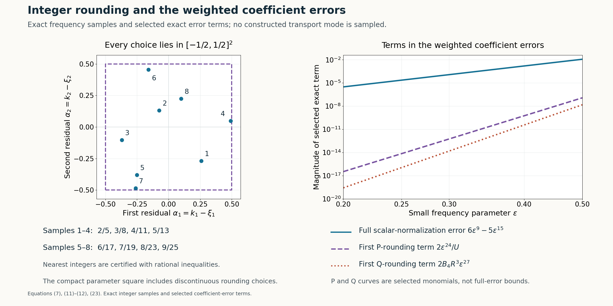

# Periodic flat solutions and uniform integer frequencies

*Written by GPT-6.1 Sol (OpenAI), Ultra reasoning effort, October 2026. Self-checked by GPT-6.1 Sol (OpenAI). Original expression: CC0.*

Integer tangential frequencies make a mode periodic, but rounding them changes the polynomial equation. We construct the transport family uniformly over every possible rounding error. Its limiting phase is independent of that error, so the neighbouring-mode comparison still holds when the rounding parameters jump. The resulting one-sided solution has a globally small coefficient and a nonzero single-mode germ on both sides of the plane used for compact elliptic gluing.

Read [Simple-root phases and flat switching errors](simple-root-phases-and-flat-switching-errors.md), [Physical transport scales and curved phases](physical-transport-scales-and-curved-phases.md), [Joining modes through a vanishing operator image](joining-modes-through-a-vanishing-operator-image.md), [Compatible smooth mixed data and the data that determine a solution](compatible-smooth-mixed-data-and-determination.md). We use the transport, physical-scale and joining arguments in the linked lessons, together with the smooth parameter-jet construction. Their compact auxiliary-parameter extension is proved here. Integer errors may jump between adjacent modes.

Basic references are [Grubb] and [Hörmander]. Their bibliographic entries are below; every argument used from a prerequisite is identified above.

## The seed statement

Write \(D_j=-i\partial_j\), \(x'=(x_1,x_2)\), and \(t=x_3\). Fix the real homogeneous symbols
\[
\begin{gathered}
P(\xi)=(\xi_1^2+\xi_2^2+\xi_3^2)^2-\tfrac12\xi_1^4,\\
Q(\xi)=\xi_2^4,\\
N=e_3 .
\end{gathered}
\tag{1}
\]
For real covectors \(P\ge|\xi|^4/2\) and \(0\le Q\le|\xi|^4\).

**Theorem 1 (a periodic seed with a small coefficient and two-sided germ).** Given \(c_*>0\) and an integer \(J_*\ge0\), there are complex \(u,a\in C^\infty(\mathbb T^2\times\mathbb R)\), where \(\mathbb T^2=(\mathbb R/2\pi\mathbb Z)^2\), satisfying
\[
\begin{gathered}
(P(D)+a(x',t)Q(D))u=0,\\
\operatorname{supp}u=\mathbb T^2\times[0,\infty),\\
\sup|a|<c_*,\\
\partial^\alpha a|_{t=0}=0\ (|\alpha|<J_*).
\end{gathered}
\tag{2}
\]
There are \(k\in\mathbb Z^2\), \(0<h_*<1/4\), and a smooth complex v such that
\[
\begin{gathered}
u(x',t)=e^{ik\cdot x'}v(t),\\
v(1)=1,\\
\operatorname{Re}v(t)>1/2
\\
(|t-1|<2h_*).
\end{gathered}
\tag{3}
\]
In particular \(c_*=1/4\) supplies the exact seed hypotheses equation (3) of [Compact elliptic kernels and adjoint obstructions](compact-elliptic-kernels-and-adjoint-obstructions.md)–equation (4) of [Compact elliptic kernels and adjoint obstructions](compact-elliptic-kernels-and-adjoint-obstructions.md) for the compact gluing construction. That gluing is a separate argument; the compact kernel is constructed in the next lesson.

## Explicit frequency data and an entire coefficient ratio

Let \(\varepsilon\) be small and positive. Put
\[
\begin{gathered}
R(\varepsilon)=\sqrt{1-\varepsilon^6},\\
z_0=-i/16,\\
p_\varepsilon(z)=1+8\varepsilon^{20}z^2
+8i\varepsilon^{36}z^3-2\varepsilon^{52}z^4 .
\end{gathered}
\tag{4}
\]
The square root is the positive analytic unit near zero and extends real analytically through zero. Directly, at the unshifted frequency
\((\varepsilon^{-45},\varepsilon^{-48}R,-i\varepsilon^{-48})\),
the sum of squares after adding \(\varepsilon^{-32}ze_3\) is
\(\varepsilon^{-64}z^2-2i\varepsilon^{-80}z\).
Multiplication by \(-2\varepsilon^{180}\) gives exactly p. Hence
\[
\begin{gathered}
U(\varepsilon):\\
=p_\varepsilon(z_0)
\\
=1-\varepsilon^{20}/32-\varepsilon^{36}/512-\varepsilon^{52}/32768,\\
U(0)=1 .
\end{gathered}
\tag{5}
\]
On a small signed neighbourhood U is nonzero.

Retain the scalar normalization
\[
\begin{gathered}
B_4=1+2\varepsilon^6+3\varepsilon^{12}+4\varepsilon^{18}+5\varepsilon^{24},
\\
b=\varepsilon^{192}B_4,\\
c=-2\varepsilon^{180}/U,
\\
K=\varepsilon^{-21},\\
T=\varepsilon^{-31}.
\end{gathered}
\tag{6}
\]
For unrounded frequencies the normalized Q is
\[
\begin{gathered}
q^{\,0}_\varepsilon=B_4(1-\varepsilon^6)^2
=1-6\varepsilon^{30}+5\varepsilon^{36},\\
K(1-q^{\,0}_\varepsilon)=6\varepsilon^9-5\varepsilon^{15}.
\end{gathered}
\tag{7}
\]
Thus truncating its scalar normalization has preserved the weighted limit. It has also given the entire polynomial
\[
\begin{gathered}
A(\varepsilon)=b/c=-\tfrac12\varepsilon^{12}B_4(\varepsilon)U(\varepsilon),
\\
j_0=\operatorname{ord}_0 A=12 .
\end{gathered}
\tag{8}
\]
There is no real pole to remove later.

For \(\alpha=(\alpha_1,\alpha_2)\in\mathcal A=[-1/2,1/2]^2\), use
\[
\begin{gathered}
\zeta_{\varepsilon,\alpha}
\\
=(\varepsilon^{-45}+\alpha_1,\
\varepsilon^{-48}R(\varepsilon)+\alpha_2,\
-i\lambda(\varepsilon)),\\
\lambda=\varepsilon^{-48}+\varepsilon^{-32}/16 .
\end{gathered}
\tag{9}
\]
All definitions extend for \(\alpha\) in a fixed open neighbourhood of this square. Define the normal-window polynomials
\[
\begin{gathered}
q_{\varepsilon,\alpha}(z)\\
=bQ(\zeta_{\varepsilon,\alpha}+Tze_3),\\
f_{\varepsilon,\alpha}(z)\\
=K(cP(\zeta_{\varepsilon,\alpha}+Tze_3)
-bQ(\zeta_{\varepsilon,\alpha}+Tze_3)).
\end{gathered}
\tag{10}
\]
For \(\alpha\) zero, the normalized P is
\(p_\varepsilon(z_0+\varepsilon z)/U\).
Its weighted difference from 1 tends \(-iz\), because the leading quadratic difference has linear part \(16z_0z=-iz\) and quadratic part \(8\varepsilon z^2\). The cubic and quartic terms give higher positive powers. The first error is \(8\varepsilon z^2+O(\varepsilon^2)\) in coefficient norm.

Here is a direct bound for all rounding errors, rather than an appeal to derivative estimates. Put
\[
\begin{gathered}
S_\varepsilon(z)\\
=\varepsilon^{-64}(z_0+\varepsilon z)^2
-2i\varepsilon^{-80}(z_0+\varepsilon z),\\
d_\alpha\\
=2\varepsilon^{-45}\alpha_1+2\varepsilon^{-48}R\alpha_2
+\alpha_1^2+\alpha_2^2,\\
\Delta P\\
=2S_\varepsilon d_\alpha+d_\alpha^2
-\tfrac12\bigl((\varepsilon^{-45}+\alpha_1)^4-\varepsilon^{-180}\bigr).
\end{gathered}
\tag{11}
\]
This is the full exact difference of the rounded and unrounded P-windows. In the numerator \(-2\varepsilon^{159}\Delta P\) of \(Kc\,\Delta P\), every \(\varepsilon\) exponent is at least 24. The leading term is \(4\alpha_1\varepsilon^{24}\). Indeed \(S_\varepsilon=O(\varepsilon^{-80})\), \(d_\alpha=O(\varepsilon^{-48})\), so the first two products contribute orders at least 31 and 63 after multiplication; the fourth-power difference has largest negative order 135 and gives order 24. Expand its four binomial terms to see no lower exponent. Every coefficient is polynomial in \(\alpha\) and the analytic bounded unit R, divided only by U. The same bounds hold with every fixed \(\alpha\) derivative.

The exact Q difference is
\[
\begin{gathered}
q_{\varepsilon,\alpha}-q^{\,0}_\varepsilon
\\
=B_4\bigl((R+\alpha_2\varepsilon^{48})^4-R^4\bigr)
\\
=O(\varepsilon^{48}),\\
K(q_{\varepsilon,\alpha}-q^{\,0}_\varepsilon)\\
=O(\varepsilon^{27}).
\end{gathered}
\tag{12}
\]
The finite binomial expansion proves the estimates also with all \(\alpha\) derivatives. Together (7),(11),(12) imply that the polynomial coefficients extend analytically at zero and
\[
\begin{gathered}
q_{0,\alpha}(z)=1,\\
f_{0,\alpha}(z)=-iz,\\
\kappa=21,\ \tau=31,\ \Lambda=48,\\
(\tau-\kappa,\Lambda-\tau,\kappa+\tau-\Lambda)\\
=(10,17,4).
\end{gathered}
\tag{13}
\]
All convergence is uniform on the compact \(\alpha\) square, with every fixed S,z-coefficient and \(\alpha\) derivative; the constant limiting coefficients have zero positive \(\alpha\) derivatives. The frequency includes R and is not claimed rational. Its smooth finite-power forms and analytically extending normalized polynomials are the properties actually needed.

## The physical operator and uniform curve conditions

Choose integer \(p\ge2\) with \(12p\ge J_*\). Write
\[
\begin{gathered}
\varepsilon=\delta^p,\\
w=21p+1,\\
t=\delta+S\delta^w,\\
\mu=\frac1{\delta^wT(\delta^p)}=\delta^{10p-1},\\
m_0=10p-1 .
\end{gathered}
\tag{14}
\]
Define the background coefficient difference and rescaled polynomial
\[
\begin{gathered}
C(S,\delta)\\
=\delta^{-21p}
\left(1-\frac{A((\delta+S\delta^w)^p)}{A(\delta^p)}\right),\\
H_{\delta,\alpha}\\
=f_{\delta^p,\alpha}+Cq_{\delta^p,\alpha},\\
H_{0,\alpha}(S,z)=-iz-12pS .
\end{gathered}
\tag{15}
\]
Analyticity follows by the same explicit divisibility used in equation (6) of [Physical transport scales and curved phases](physical-transport-scales-and-curved-phases.md): if \(A(\varepsilon)=\varepsilon^{12}v(\varepsilon)\), its ratio is
\((1+S\varepsilon^{21})^{12p}v(\varepsilon(1+S\varepsilon^{21})^p)/v(\varepsilon)\).
The difference from 1 is divisible by \(\varepsilon^{21}\); the v-argument displacement has order 22. This gives C smooth through zero with value \(-12pS\), independent of \(\alpha\). Its fixed mixed derivatives are bounded on a compact S-neighbourhood.

Let \(F_{\delta,\alpha}=H_{\delta,\alpha}(S,\mu D_S)\) with coefficients on the left, and \(G_{\delta,\alpha}=\delta^{-1}F_{\delta,\alpha}\). Directly
\[
\begin{gathered}
F_{\delta,\alpha}\\
=Kc\bigl(P(\zeta_{\delta^p,\alpha}+\delta^{-w}D_Se_3)
-A(t^p)Q(\zeta_{\delta^p,\alpha}+\delta^{-w}D_Se_3)\bigr),\\
g_4(S,\delta,\alpha)\\
=-2\delta^{75p-5}/U(\delta^p).
\end{gathered}
\tag{16}
\]
The fourth normal coefficient of P is 1, while Q is independent of the normal variable. Its normalized H coefficient is \(-2\varepsilon^{35}/U\); multiplication by \(\mu^4\) and division by \(\delta\) give the displayed G coefficient. It is independent of S and \(\alpha\), with finite order \(75p-5\) and nonzero leading unit. Thus its curve condition is uniform on both \(S=-1\) and the analytic matching curve f of equation (6) of [Joining modes through a vanishing operator image](joining-modes-through-a-vanishing-operator-image.md) with \(q=21p\). Every other G coefficient has at most a fixed finite-power singularity. In particular the positive transport exponent \(m_1=1\) is explicit.

The simple root and phase at zero are
\[
\begin{gathered}
\psi_0(S)=12p\,iS,\\
\phi_0(S)=6p\,iS^2,\\
\operatorname{Im}\phi_0''=12p>0 .
\end{gathered}
\tag{17}
\]
They are independent of \(\alpha\). They retain the parameter-power factor in the actual limiting root equation.

## Carrying compact parameters through transport

We now prove, rather than assume, the required compact-parameter extension of the transport base. The data \(H(S,z,\delta,\alpha)\) are smooth on a neighbourhood of the compact product \(I\times\{0\}\times\mathcal A\), \(I=[-2,2]\), with common simple root (17). In the contraction step equation (4) of [Simple-root phases and flat switching errors](simple-root-phases-and-flat-switching-errors.md) use the same map \(z-H/a_0\), here \(a_0=-i\). Compactness in both S and \(\alpha\) permits a single disc radius, a single small parameter interval and contraction constant 1/2. The centre displacement tends uniformly to zero. Therefore the invariant discs and their unique roots are simultaneous for all \(\alpha\). Integral differences in each real \(\alpha\) coordinate give
\(\partial_{\alpha_j}\psi=-H_z^{-1}H_{\alpha_j}\).
Together with the S,\(\delta\) formulas this proves smoothness and every mixed derivative by induction. Endpoint continuation uses the same compact product and the same residual-and-disc argument as equation (4) of [Simple-root phases and flat switching errors](simple-root-phases-and-flat-switching-errors.md). Integrate the root with base value zero at \(S=0\). The resulting phase is smooth and
\[
\begin{gathered}
\phi(S,0,\alpha)=6p\,iS^2,\\
\beta(S,\delta,\alpha):=\operatorname{Im}\phi_S
=12pS+O(\delta),\\
\beta_S\ge6p
\end{gathered}
\tag{18}
\]
uniformly on the compact product for small \(\delta\). The error bound includes every fixed S and \(\alpha\) derivative appropriate to its constant leading term.

The ordered conjugated operator is
\[
\begin{gathered}
\mathcal C_{\delta,\alpha}
\\
=\delta e^{-i\phi/\mu}G_{\delta,\alpha}e^{i\phi/\mu}
\\
=\sum_jh_j(S,\delta,\alpha)(\mu D_S+\psi)^j,\\
\mathcal B_{\delta,\alpha}\\
=\mu^{-1}\mathcal C_{\delta,\alpha}.
\end{gathered}
\tag{19}
\]
The root cancels the zero-scale part before division. Every remaining term in the finite product has a factor \(\mu\), so B has smooth coefficients. Its zero-parameter limit is \(-iD_S\): H is linear at zero, hence the zero-order transport coefficient \(-iH_{zz}\psi'_0/2\) is zero. Choose leading amplitude \(W_0=1\). Define all higher \(\delta\) jets by equation (9) of [Simple-root phases and flat switching errors](simple-root-phases-and-flat-switching-errors.md)–equation (10) of [Simple-root phases and flat switching errors](simple-root-phases-and-flat-switching-errors.md), now retaining \(\alpha\) as an ordinary parameter. The forcing at each stage is a finite combination of smooth earlier jets, so the new integral jet is smooth in S and \(\alpha\). This proves all jets on an open neighbourhood of the compact product; no uniform growth bound in the jet index is required.

Apply the parameter-jet series with realization variable \(\delta\) and parameters \((S,\alpha_1,\alpha_2)\). For its j-th summand choose a cutoff scale so that *all* mixed derivatives through total order \(\lfloor j/2\rfloor\) on the current compact product have bound \(2^{-j}\), using that proof's finite seminorm bound. Each derivative involves at most \(\lfloor j/2\rfloor\) \(\delta\) differentiations, so the remaining power of the cutoff scale is positive and can enforce this bound. Exhaust a slightly larger parameter neighbourhood by compact boxes exactly as in the parameter-jet construction. Every fixed mixed derivative series is therefore uniformly convergent. It realizes the prescribed jets; taking them in the operator equation proves B applied to W flat at \(\delta=0\), including every \(\alpha\) derivative.

For each curve use equation (15) of [Simple-root phases and flat switching errors](simple-root-phases-and-flat-switching-errors.md) with parameters \((\delta,\alpha)\). The highest derivative coefficient in the conjugated operator is
\[
c_4|_{\Gamma_j}=(-i)^4\delta g_4
=-2\delta^{75p-4}/U(\delta^p).
\tag{20}
\]
The recursive forcing is flat in \(\delta\) with all \(\alpha\) derivatives: it is obtained from the initial flat residual and earlier flat correction jets by a finite Leibniz and graph chain rule. Divide by the displayed finite power and its nonzero unit using equation (12) of [Simple-root phases and flat switching errors](simple-root-phases-and-flat-switching-errors.md), commuting \(\alpha\) differentiation with its integral. This yields smooth correction jets flat in \(\delta\) uniformly on the compact \(\alpha\) square. Their lower four S-jets are chosen zero as in equation (15) of [Simple-root phases and flat switching errors](simple-root-phases-and-flat-switching-errors.md).

Realize those S-jets with the parameter-jet construction, now in the graph coordinate \(S-\gamma_j(\delta)\), with parameters \((\delta,\alpha)\). The shrinking cutoff scales bound every mixed derivative, including \(\alpha\), by the same summable construction and remain strictly inside two disjoint fixed tubes. Every finite summand has zero \(\delta\) jets; uniform derivative convergence preserves these on the full tube. The graph coordinate change preserves flatness. Subtract both corrections. They change no jet on the other curve, remain flat at \(\delta=0\), and leave the leading amplitude 1. The residual now has all S-jets zero on both curves, and tangential curve differentiation gives all \(\delta\) and \(\alpha\) jets as well. Compactness makes the corrected W uniformly nonzero. This proves the whole compact-parameter extension used here, including the singular and smooth-scale versions, from the actual transport and jet proofs.

For \(\delta\) positive and \(\alpha\) fixed define
\[
\begin{gathered}
u_{\delta,\alpha}(x',t)
\\
=e^{i x'\cdot\zeta'_{\delta^p,\alpha}+\lambda(\delta^p)t}
W(S,\delta,\alpha)e^{i\phi(S,\delta,\alpha)/\mu},\\
(P(D)-A(t^p)Q(D))u_{\delta,\alpha}\\
=r_{\delta,\alpha}u_{\delta,\alpha}.
\end{gathered}
\tag{21}
\]
As in equation (16) of [Physical transport scales and curved phases](physical-transport-scales-and-curved-phases.md), \(r=R_F/(KcW)\). Here \(Kc=-2\varepsilon^{159}/U\) is a finite-power factor with nonzero unit; equation (12) of [Simple-root phases and flat switching errors](simple-root-phases-and-flat-switching-errors.md) gives smooth flat division with all \(\alpha\) derivatives. The same Taylor argument as equation (20) of [Physical transport scales and curved phases](physical-transport-scales-and-curved-phases.md) gives, for arbitrary J,L and every fixed mixed derivative,
\[
\begin{gathered}
|\partial_S^a\partial_\delta^b\partial_\alpha^\ell r|
\\
\le C_{a,b,\ell,J,L}|\delta|^J|S-\gamma_j(\delta)|^L .
\end{gathered}
\tag{22}
\]
It uses Taylor's integral remainder in S at the graph and parameter flatness of the integrand on a compact product. Consequently every fixed physical derivative costs only finitely many powers of \(\delta\), uniformly in \(\alpha\). This proves all uniform residual and relative derivative hypotheses needed for assembly.

## Integer choices and neighbouring parameters that may jump

Choose the centre sequence equation (5) of [Joining modes through a vanishing operator image](joining-modes-through-a-vanishing-operator-image.md) with \(q=21p\). At each \(\delta\) choose
\[
\begin{gathered}
k_{\nu,1}=\operatorname{round}(\delta_\nu^{-45p}),\\
k_{\nu,2}=\operatorname{round}(\delta_\nu^{-48p}R(\delta_\nu^p)),
\\
\alpha_\nu=k_\nu-\zeta'_{\delta_\nu^p,0}\in\mathcal A .
\end{gathered}
\tag{23}
\]
At ties choose either nearest integer. For a large starting index \(k_{\nu,2}\ge1\). Each local mode with that fixed \(\alpha\) is exactly periodic in both tangential variables. Moreover Q has no normal derivative, so
\[
\begin{gathered}
Q(D)u_{\delta_\nu,\alpha_\nu}=k_{\nu,2}^4u_{\delta_\nu,\alpha_\nu},
\\
M_\nu=k_{\nu,2}^4>0 .
\end{gathered}
\tag{24}
\]
This identity holds with the full actual phase and amplitude, on the local interval and any normal tail. No phase approximation is involved, and \([Q(D),\chi(t)]=0\).

The matching constants C are chosen as in equation (8) of [Joining modes through a vanishing operator image](joining-modes-through-a-vanishing-operator-image.md); their positive moduli depend only on t. All parameter estimates are uniform, but \(\alpha\) need not have small successive differences. To verify the only changed neighbouring-phase step, subtract equation (10) of [Joining modes through a vanishing operator image](joining-modes-through-a-vanishing-operator-image.md) with the chosen alphas. By (18),
\[
\begin{gathered}
T_{\nu+1}\beta(S_{\nu+1},\delta_{\nu+1},\alpha_{\nu+1})
-T_\nu\beta(S_\nu,\delta_\nu,\alpha_\nu)\\
={}T_\nu\bigl(12p(S_{\nu+1}-S_\nu)+o(1)\bigr),\\
\partial_t\log(F_\nu/F_{\nu+1})\\
={}
T_\nu\bigl(12p(S_{\nu+1}-S_\nu)+o(1)\bigr).
\end{gathered}
\tag{25}
\]
Indeed the two \(\beta\) errors are individually \(O(\delta_\nu)\) uniformly, without comparing alphas. The T ratio is \(1+O(1/\nu)\); the carrier difference is \(O(\lambda_\nu/\nu)=o(T_\nu)\), with exponent \(4p\) from the fixed scales, and \(\delta_\nu^{-w}/T_\nu=\delta_\nu^{10p-1}\to0\). The rescaled gap tends 2, so the bracket has a fixed positive lower bound. This proves equation (14) of [Joining modes through a vanishing operator image](joining-modes-through-a-vanishing-operator-image.md) for *every sequence* of \(\alpha\) choices in the square. It is the required repair for discontinuous rounding.

Now perform equation (8) of [Joining modes through a vanishing operator image](joining-modes-through-a-vanishing-operator-image.md)–equation (25) of [Joining modes through a vanishing operator image](joining-modes-through-a-vanishing-operator-image.md) with these selected modes. Their absolute carrier estimate is unchanged, with
\[
\begin{gathered}
\lambda_{\delta_\nu}\delta_\nu^w\asymp\nu^\eta,\\
\eta=\frac{27p-1}{21p}>0,\\
F_\nu\le C e^{-c\nu^{1+\eta}} .
\end{gathered}
\tag{26}
\]
All finite derivative bounds, curve-product flatness and cutoff constants are uniform. Therefore the locally finite sum is smooth and flat at \(t=0\), including every tangential derivative. In the switching tubes the Q-image may vanish on \(t=B\); the reverse triangle inequality away from that plane and (22) prove the flat quotient extension equation (20) of [Joining modes through a vanishing operator image](joining-modes-through-a-vanishing-operator-image.md)–equation (23) of [Joining modes through a vanishing operator image](joining-modes-through-a-vanishing-operator-image.md) uniformly in x'. In cutoff regions Q has no commutator; the small-to-dominant ratio is exponentially small and only the P commutator remains. Its finite product expansion and the relative derivative bounds prove equation (25) of [Joining modes through a vanishing operator image](joining-modes-through-a-vanishing-operator-image.md). Thus E is smooth and flat at 0. Every step retains \(2\pi\)-periodicity, including quotient extension by zero on a plane. The exact support argument equation (19) of [Joining modes through a vanishing operator image](joining-modes-through-a-vanishing-operator-image.md) and equation (23) of [Joining modes through a vanishing operator image](joining-modes-through-a-vanishing-operator-image.md) applies.

## Global smallness and the nonzero upper tail

Use the first-mode extension equation (26) of [Joining modes through a vanishing operator image](joining-modes-through-a-vanishing-operator-image.md), with a fixed normal flattening function \(\theta\) and the chosen fixed \(\alpha\). Extend the derivative of its phase by \(\phi_S(\theta(S),\delta,\alpha)\), integrate it to agree initially, and extend W by \(W(\theta(S),\delta,\alpha)\). The amplitude is nonzero and becomes constant; the phase becomes affine. All their fixed derivatives and the inverse amplitude are uniformly bounded on the whole upper domain for all small \(\delta\) and \(\alpha\) in the square.

For both normalized polynomials \(p_{\varepsilon,\alpha}=cP(\zeta_{\varepsilon,\alpha}+Tze_3)\) and q, the constant coefficient tends 1 and the other coefficients tend 0 uniformly. In fact \(p=q+f/K\). The same finite ordered-product bound that proves equation (26) of [Joining modes through a vanishing operator image](joining-modes-through-a-vanishing-operator-image.md) gives on the entire extended tail
\[
\begin{gathered}
\widetilde m_P\\
=\widetilde W^{-1}\sum_jp_j(\delta^p,\alpha)
(\mu D_S+\widetilde\phi')^j\widetilde W\\
\to1,\\
\widetilde m_Q\to1\\
\hbox{uniformly in S and alpha}.
\end{gathered}
\tag{27}
\]
Small coefficients multiply bounded ordered expressions, a point necessary for this global conclusion. For small enough \(\delta\) both deviations from 1 are below 1/2; hence
\[
\begin{gathered}
a=-\frac{P(D)\widetilde u}{Q(D)\widetilde u}
=-A(\delta_{\nu_0}^p)\frac{\widetilde m_P}{\widetilde m_Q},
\\
\sup_{\text{upper tail}}|a|\le3|A(\delta_{\nu_0}^p)|.
\end{gathered}
\tag{28}
\]
The extended local phase, amplitude and real integer carrier make the mode nonzero for every larger t. The displayed quotient agrees with the assembled coefficient on their common unchanged neighbourhood, so the join is smooth. Eventual affineness makes a constant on the far upper tail, but constancy is not needed for the bound.

Below the modification, the assembled coefficient is \(-A(t^p)-E\). From the uniform flat quotient estimates, for every J there is a common constant with \(|E|\le C_J\delta_\nu^J\) on the relevant intervals; they have \(0<t\le2\delta_{\nu_0}\) after increasing the first index. Thus
\[
\begin{gathered}
\sup_{\text{positive assembled interval}}|a|
\\
\le C\delta_{\nu_0}^{12p}+C_J\delta_{\nu_0}^J\\
\longrightarrow0 .
\end{gathered}
\tag{29}
\]
All constants were chosen on the fixed compact parameter family before selecting the integer sequence or first index, so this bound legitimately permits increasing \(\nu_0\).

On t negative choose \(0\le\eta_-\le1\), equal 1 on a neighbourhood of \([-\delta_{\nu_0},0]\), zero for \(t\le-2\delta_{\nu_0}\), and put \(a=-\eta_-(t)A(t^p)\). This agrees with the analytic background near 0, while the positive-side E is flat there. Hence a is smooth across 0, vanishes to order \(12p\) there, and its negative-side supremum is at most \(C\delta_{\nu_0}^{12p}\). The equation is unaffected there because u is identically zero. Together (28),(29) make the whole coefficient smaller than the prescribed positive constant \(c_*\), by taking \(\nu_0\) sufficiently large. This uses a cutoff only on a side where u vanishes and changes none of its boundary jets.

The first-mode modification begins at a normal coordinate tending 0 as \(\nu_0\to\infty\), so choose it below 1/2. Above it u has the exact form \(e^{ik_{\nu_0}\cdot x'}v_0(t)\), with \(v_0(t)\ne0\). Divide the whole solution by the fixed complex scalar \(v_0(1)\). It leaves its coefficient and periodicity unchanged and yields
\[
\begin{gathered}
v(1)=1,\\
|v(t)-1|<1/2\\
(|t-1|<2h_*)
\end{gathered}
\tag{30}
\]
for some \(0<h_*<1/4\), by continuity and by shrinking the interval so it lies in the single-mode tail on both sides. Then \(\operatorname{Re}v>1/2\). No dilation is used. The exact support argument remains unchanged by multiplication by a nonzero scalar. This proves all clauses of Theorem 1.

**Figure 1.** Left: exact nearest-integer residuals for the tangential frequencies in (9), using \(\varepsilon\) equal to \(2/5\), \(3/8\), \(4/11\), \(5/13\), \(6/17\), \(7/19\), \(8/23\) and \(9/25\). Integer choices are certified with rational arithmetic; the algebraic second residual is displayed using high-precision arithmetic. These are frequency samples rather than the assembled sequence. Right: exact scalar-normalization error (7), the first P-rounding monomial at \(|\alpha_1|=1/2\) divided by U (11), and the first Q-rounding monomial at \(|\alpha_2|=1/2\) (12), for \(1/5\le\varepsilon\le1/2\). The last two curves are selected exact terms, not bounds for the complete errors. No actual transport phase, amplitude or solution is sampled. Equations: (7),(11)–(12),(23);

## Exercises and complete solutions

**Exercise 1 (the scalar truncation).** Why is \(B_4\) sufficient, and why would replacing it by \(B_2\) not preserve the same weighted difference?

**Solution.** The finite geometric derivative identity gives
\[
\begin{gathered}
(1+2x+\cdots+(N+1)x^N)(1-x)^2\\
=1-(N+2)x^{N+1}+(N+1)x^{N+2}.
\end{gathered}
\]
For \(x=\varepsilon^6\), \(N=4\) gives error order 30, which after \(K=\varepsilon^{-21}\) is order 9. \(N=2\) gives order 18, whose weighted error is order -3 and diverges. The coordinates may converge, but the cancellation after weighting requires the larger truncation.

**Exercise 2 (the largest rounding loss).** In equation (11) identify the first \(\varepsilon^{24}\) term of the weighted P error.

**Solution.** The fourth-power difference begins \(4\varepsilon^{-135}\alpha_1\); multiplication by -1/2 makes \(-2\varepsilon^{-135}\alpha_1\). Multiplication by \(Kc=-2\varepsilon^{159}/U\) gives \(4\varepsilon^{24}\alpha_1/U\). The term \(2S_\varepsilon d_\alpha\) has weighted order at least 31 and \(d_\alpha^2\) at least 63. Higher fourth-power terms have larger exponents. Therefore the leading term is \(4\alpha_1\varepsilon^{24}\), since \(U(0)=1\).

**Exercise 3 (jumping auxiliary parameters).** Let \(\beta(S,\delta,\alpha)=bS+O(\delta)\) uniformly on a compact parameter square, \(b>0\). Prove the positive neighbouring \(\beta\) difference when \(\alpha\) jumps.

**Solution.** Subtract the two leading expansions individually. Their errors sum to \(O(\delta_\nu+\delta_{\nu+1})=o(1)\) regardless of the \(\alpha\) difference. The leading difference is \(b(S_{\nu+1}-S_\nu)\), whose gap tends 2. Thus it is bounded below by b eventually. This proof never differentiates the discontinuous sequence of rounding choices; it uses the smooth family before making those choices.

**Exercise 4 (exact Q image and periodicity).** Why are equation (24) and \([Q(D),\chi(t)]=0\) exact?

**Solution.** Q is \(D_2^4\). The entire normal factor of the mode, including its actual phase and amplitude, is independent of \(x_2\). Its \(x_2\) dependence is exactly \(e^{ik_{\nu,2}x_2}\), so each \(D_2\) multiplies by the integer \(k_{\nu,2}\). Four applications give its fourth power. A cutoff depending only on t also has no \(x_2\) derivative, so the commutator is zero. Integer frequencies give period \(2\pi\); quotients and smooth zero extensions of periodic expressions retain that period.

**Exercise 5 (uniform flat correction jets).** Why does division by the highest coefficient in equation (20) preserve all \(\alpha\) derivatives?

**Solution.** The forcing is smooth and flat in \(\delta\) with all \(\alpha\) derivatives. Its quotient by \(\delta\) to the fixed power is given by equation (12) of [Simple-root phases and flat switching errors](simple-root-phases-and-flat-switching-errors.md)'s finite integral of its corresponding \(\delta\) derivative. Differentiation in \(\alpha\) passes under this integral and preserves the zero traces. The remaining unit is \(U(\delta^p)/(-2)\), smooth and independent of \(\alpha\). Multiplication by it gives a smooth flat quotient, uniformly on the compact square. The jet realization then retains all mixed derivatives by the summable parameter-jet cutoff scales.

**Exercise 6 (smallness on both tails).** Explain why the polynomial \(A(t^p)\), which grows for large negative t, does not prevent a globally small coefficient.

**Solution.** On the negative side u is zero, so its coefficient can be cut off outside a small neighbourhood of 0. The cutoff equals 1 near 0 and thus preserves all boundary jets. Its support is contained in a region where \(A(t^p)\) is uniformly small. On the positive upper tail the coefficient is the exact quotient equation (28), controlled by the small *fixed* \(A(\delta_{\nu_0}^p)\) and a bounded ratio of normalized images. It is not estimated by the growing \(A(t^p)\) there; the complete quotient cancels that background. The assembled interval between these tails has equation (29). All three bounds tend 0 as the first index increases.

## References

- [Grubb] Gerd Grubb, *Distributions and Operators*, lecture notes, University of Copenhagen, 2007–2008. [Author's lecture notes](https://web.math.ku.dk/~grubb/distribution.htm).
- [Hörmander] Lars Hörmander, *The Analysis of Linear Partial Differential Operators II: Differential Operators with Constant Coefficients*, Springer, 1983.
