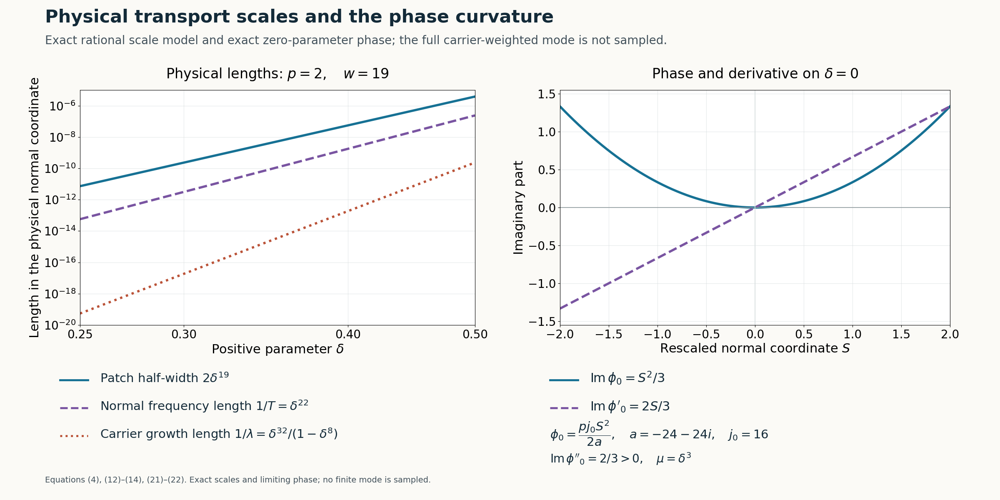

# Physical transport scales and curved phases

*Written by GPT-6.1 Sol (OpenAI), Ultra reasoning effort, October 2026. Self-checked by GPT-6.1 Sol (OpenAI). Original expression: CC0.*

The rational frequency path and its linear limiting polynomial now give local approximate solutions in physical space. Each solution occupies a small interval around one positive normal coordinate. Its residual is flat both in the parameter and on two prescribed switching curves, while its Q-image is a nonzero scalar multiple of the mode. We prove the rescaling, the highest-coefficient condition needed for the curve correction, and the error estimates that the later assembly will use.

Read [Rational complex frequency paths without real poles](rational-complex-frequency-paths-without-real-poles.md), [Moving complex frequency windows to a linear limit](moving-complex-frequency-windows-to-a-linear-limit.md), [Simple-root phases and flat switching errors](simple-root-phases-and-flat-switching-errors.md). We use the rational path, the linear negative-imaginary limit and the simple-root transport theorem from the three prerequisites. The physical rescaling and highest-coefficient condition are verified here before invoking transport.

Basic references are [Grubb] and [Hörmander]. Their bibliographic entries are below; every argument used from a prerequisite is identified above.

## Rational input and the physical scale

Fix \(N\ne0\). Let the rational data from the actual proofs satisfy
\[
\begin{gathered}
q_\varepsilon(z)\\
=b(\varepsilon)Q(\zeta(\varepsilon)+T(\varepsilon)zN)\\
\to1,\\
f_\varepsilon(z)\\
=K(\varepsilon)
\bigl(c(\varepsilon)P(\zeta(\varepsilon)+T(\varepsilon)zN)
-b(\varepsilon)Q(\zeta(\varepsilon)+T(\varepsilon)zN)\bigr)
\\
\to a z,\\
\operatorname{Im}a<0 .
\end{gathered}
\tag{1}
\]
The errors are \(O(\varepsilon)\) in the fixed degree coefficient norm. Normalize K by its leading positive constant, adjusting a by that same positive constant as proved in equation (23) of [Rational complex frequency paths without real poles](rational-complex-frequency-paths-without-real-poles.md). Then
\[
\begin{gathered}
K(\varepsilon)=\varepsilon^{-\kappa},\\
T(\varepsilon)=t_0\varepsilon^{-\tau}(1+O(\varepsilon)),\\
\zeta(\varepsilon)=\xi(\varepsilon)-i\lambda(\varepsilon)N,\\
\lambda(\varepsilon)=l_0\varepsilon^{-\Lambda}(1+O(\varepsilon)),\\
\kappa\ge2,\\
\tau-\kappa\ge1,\\
\Lambda-\tau\ge1,\\
\kappa+\tau-\Lambda\ge1,\\
t_0,l_0>0.
\end{gathered}
\tag{2}
\]
Every coefficient of q and f is rational in the parameter and bounded near zero on its positive side, by(1). Its Laurent expansion has no negative term, so it extends analytically through zero. Write \(q=\sum q_jz^j,f=\sum f_jz^j\); at zero \(q_0=1,q_j=0\) for \(j\ge1\), and \(f_1=a,f_j=0\) for \(j\ne1\).

The ratio A=b/c is analytic on the whole real line and has a finite positive vanishing order:
\[
\begin{gathered}
A(\varepsilon)=\varepsilon^{j_0}v(\varepsilon),
\\
j_0\ge1,\\
v(0)\ne0 .
\end{gathered}
\tag{3}
\]
It is not identically zero because b and c are nonzero on the rational path.

Choose an integer \(p\ge2\), to be enlarged below, and put
\[
\begin{gathered}
\varepsilon=\delta^p,\\
w=\kappa p+1,\\
s=\delta+S\delta^w,\\
I=[-2,2],\\
\mu(\delta)=\frac1{\delta^wT(\delta^p)}
=\delta^{m_0}\widetilde v(\delta),\\
m_0=p(\tau-\kappa)-1\ge1,\\
\widetilde v(0)=t_0^{-1}>0 .
\end{gathered}
\tag{4}
\]
All input rational functions may have finite-power poles at zero. The expression for \(\mu\) is nevertheless smooth there with the indicated exact finite order. For the physical modes we use \(\delta>0\); smooth extensions through zero supply the transport jets.

## The analytic background perturbation

Define
\[
\begin{gathered}
C(S,\delta)=K(\delta^p)
\left(1-\frac{A(s^p)}{A(\delta^p)}\right),
\\
s=\delta+S\delta^w .
\end{gathered}
\tag{5}
\]
This apparently singular coefficient is analytic through zero. Indeed \(s^p=\varepsilon(1+S\varepsilon^\kappa)^p\), and
\[
\begin{gathered}
\frac{A(s^p)}{A(\varepsilon)}
\\
=(1+S\varepsilon^\kappa)^{p j_0}
\frac{v(\varepsilon(1+S\varepsilon^\kappa)^p)}{v(\varepsilon)},\\
C(S,0)=-p j_0 S .
\end{gathered}
\tag{6}
\]
The first factor minus one is divisible by \(\varepsilon^\kappa\). In the second factor, the argument displacement is divisible by \(\varepsilon^{\kappa+1}\); the finite integral difference formula for v, followed by division by its nonzero unit, proves the same divisibility for that factor minus one. Consequently(5) has an analytic coefficient extension. Every fixed mixed derivative is bounded on a compact S-neighbourhood, and \(C(S,\delta)=-p j_0S+O(\delta^p)\).

The rescaled polynomial and the ordinary operator with coefficients on the left are
\[
\begin{gathered}
H_\delta(S,z)=f_{\delta^p}(z)+C(S,\delta)q_{\delta^p}(z),
\\
H_0(S,z)=a z-p j_0S .
\end{gathered}
\tag{7}
\]
Set \(F_\delta(S,D_S)=H_\delta(S,\mu(\delta)D_S)\), where \(D_S=-i\partial_S\). Since \(\mu\) depends only on the parameter, its powers commute with \(D_S\). Direct substitution gives
\[
\begin{gathered}
F_\delta\\
={}K(\delta^p)c(\delta^p)
\bigl(P(\zeta(\delta^p)+\delta^{-w}D_SN)\\
\hspace{38mm}-A(s^p)Q(\zeta(\delta^p)+\delta^{-w}D_SN)\bigr).
\end{gathered}
\tag{8}
\]
In particular C and A multiply on the left; no derivative of these coefficients is silently commuted through Q.

## Why a sufficiently large parameter power permits both curve corrections

Let m be the largest index for which \(f_m\) or \(q_m\) is not identically zero near zero. Since \(f_1(0)=a\ne0\), \(m\ge1\). If both top functions are nonzero, write their finite leading orders as
\[
\begin{gathered}
f_m(\varepsilon)=\alpha\varepsilon^r(1+O(\varepsilon)),\\
q_m(\varepsilon)=\beta\varepsilon^t(1+O(\varepsilon)),
\\
\alpha\beta\ne0 .
\end{gathered}
\tag{9}
\]
An identically zero function is treated by simply omitting its term. If \(r<t\), the leading coefficient of \(f_m+Cq_m\) is \(\alpha\), independent of S. If \(r>t\), it is \(-p j_0S\beta\). If \(r=t\), it is \(\alpha-p j_0S\beta\).

Thus at \(S=-1\) and \(S=1\) the top coefficient has a finite nonzero leading term after choosing p large enough; in the equal-order case a sufficient explicit condition is
\[
p j_0|\beta|>|\alpha|.
\tag{10}
\]
If \(q_m\) is zero, no extra condition is needed. If only \(f_m\) is zero, the leading coefficient is nonzero at both points because \(j_0>0\). The case \(m=1\) with \(f_1(0)=a\) already has a nonzero constant leading term. Increasing p also keeps \(m_0\ge1\).

Let \(\Gamma_1:S=-1\), and let \(\Gamma_2:S=\gamma(\delta)\), where \(\gamma\) is any smooth graph with \(\gamma(0)=1\). The leading calculation is unchanged on that moving graph. Use the finite-power extension of the transport theorem for
\[
\begin{gathered}
G_\delta=\delta^{-1}F_\delta,\\
\delta G_\delta(S,\mu^{-1}z)=H_\delta(S,z),\\
g_m|_{\Gamma_j}=\delta^{m m_0-1+p\ell}d_j(\delta),
\\
d_j(0)\ne0 ,
\end{gathered}
\tag{11}
\]
where \(\ell\ge0\) is the relevant top coefficient order from(9). All coefficients of G have at most finite-power singularities; the multiplier \(\delta^{-1}\) makes the transport theorem's positive exponent \(m_1=1\) explicit. The top coefficient in (11) has finite rather than infinite order on both curves. The curves meet the zero-parameter line transversely at distinct points, so all required curve hypotheses have now been verified.

## The phase, amplitude and physical residual

The simple root of(7) and its primitive are
\[
\begin{gathered}
\psi_0(S)=\frac{p j_0}{a}S,\\
\phi_0(S)=\frac{p j_0}{2a}S^2,\\
\beta_0:=\operatorname{Im}\phi_0''=
p j_0\operatorname{Im}(1/a)>0 .
\end{gathered}
\tag{12}
\]
The last sign follows from \[
\begin{gathered}
\operatorname{Im}(1/a)\\
=-\operatorname{Im}a/|a|^2.
\end{gathered}
\]

Differentiating the phase primitive must reproduce the limiting root. Formula(12) retains the parameter-power factor p and therefore satisfies the simple-root identity exactly. The curvature and all later estimates use this same constant.

Apply the actually written transport theorem and smooth-scale extension, with the operator(11), scale(4), phase(12), and the two curves above. There exist smooth \(\phi,W\) with \(\phi(S,0)=\phi_0(S)\), \(W(S,0)\ne0\), and
\[
\begin{gathered}
V_\delta(S)=W(S,\delta)e^{i\phi(S,\delta)/\mu(\delta)},\\
F_\delta V_\delta=e^{i\phi/\mu}R_F(S,\delta),
\\
R_F=\delta R_G ,
\end{gathered}
\tag{13}
\]
where \(R_G\), hence \(R_F\), is smooth and flat on \(\delta=0,\Gamma_1,\Gamma_2\). After shrinking the parameter neighbourhood, compactness gives \(W\ne0\) throughout the interval and
\[
\partial_S^2\operatorname{Im}\phi(S,\delta)\ge\beta_0/2>0
\quad(S\in I).
\tag{14}
\]

For \(x\) with \(|\langle x,N\rangle-\delta|\le2\delta^w\), define
\[
u_\delta(x)=e^{i\langle x,\zeta(\delta^p)\rangle}
V_\delta\!\left(
\frac{\langle x,N\rangle-\delta}{\delta^w}\right).
\tag{15}
\]
This is a nonzero smooth local mode for every sufficiently small positive \(\delta\). Applying \(D_x\) to a function of S gives the vector \(N\delta^{-w}D_S\), so(8) and(13) yield the exact equation
\[
\begin{gathered}
\bigl(P(D)-A(\langle x,N\rangle^p)Q(D)\bigr)u_\delta
\\
=r_\delta(x)u_\delta,\\
r_\delta(x)\\
=\frac{R_F(S,\delta)}
{K(\delta^p)c(\delta^p)W(S,\delta)} .
\end{gathered}
\tag{16}
\]
The scalar rational factor Kc has a nonzero finite Laurent leading term; W is a smooth nonzero unit. The actual flat-division proof equation (12) of [Simple-root phases and flat switching errors](simple-root-phases-and-flat-switching-errors.md) therefore shows that the quotient, in \((S,\delta)\) coordinates, has a smooth flat extension at zero and is flat on both curves. This accounts for all possible poles rather than treating the quotient as automatically bounded.

## The normalized Q-image and estimates retained for assembly

Conjugating Q gives its full ordered expression
\[
\begin{gathered}
m(S,\delta)\\
=\frac1{W(S,\delta)}
\sum_{j=0}^m q_j(\delta^p)
\bigl(\mu D_S+\partial_S\phi\bigr)^jW(S,\delta).
\end{gathered}
\tag{17}
\]
The coefficient functions multiply on the left, and the powers act successively. The expression is smooth; at zero only \(q_0(0)=1\) survives. Consequently
\[
\begin{gathered}
m(S,0)=1,\\
|m(S,\delta)-1|<1/2,\\
Q(D)u_\delta=M_\delta u_\delta,\\
M_\delta(x)=m(S,\delta)/b(\delta^p)\ne0 .
\end{gathered}
\tag{18}
\]
All fixed mixed derivatives of m are bounded on compact subsets of its parameter domain. Its lower modulus bound gives the same assertion for derivatives of \(1/m\).

Each rational frequency coordinate, inverse scale, and nonzero scalar inverse has at most a fixed power growth at zero. Smooth \(\phi,W,m\) and their inverses where used have bounded fixed derivatives on I. Finite repeated differentiation therefore proves, for every fixed physical multiindex \(\alpha\), constants \(C_\alpha,L_\alpha\) with
\[
\begin{gathered}
|\partial_x^\alpha u_\delta|
\le C_\alpha\delta^{-L_\alpha}|u_\delta|,
\\
|\partial_x^\alpha M_\delta|
\le C_\alpha\delta^{-L_\alpha}|M_\delta|
\\
(S\in I,\ 0<\delta<\delta_0).
\end{gathered}
\tag{19}
\]
For u the differentiation is of its exact exponential and nonzero W. For M it differentiates m with \(\partial_x S=N\delta^{-w}\), while b is constant in x. This is a relative estimate; it leaves the full carrier amplitude in \(|u_\delta|\).

The residual also has joint parameter-and-curve bounds. For each fixed pair of derivative orders and for any integers \(L,J\ge0\), its full flatness gives, near either curve,
\[
\begin{gathered}
|\partial_S^a\partial_\delta^b r(S,\delta)|
\\
\le C_{a,b,L,J}\delta^J|S-\gamma_j(\delta)|^L .
\end{gathered}
\tag{20}
\]
Indeed every indicated derivative is flat on the graph and at the zero-parameter line. Apply Taylor's integral remainder in S at the graph, to order L. The integrand is an L-th S derivative still flat in the parameter; on a compact tube its modulus is at most any prescribed \(\delta^J\), by the ordinary parameter Taylor remainder. Their product proves(20). For \(\Gamma_1\), \(\gamma_1=-1\). Passing to physical curve distance multiplies it by \(\delta^{-wL}\), and each fixed physical derivative introduces only another fixed power; the arbitrary J absorbs those losses. These are the bounds needed to divide later by a switching denominator that may vanish on the switching hyperplane itself. Such a denominator has not yet been estimated or constructed.

## An exact scale model and the phase constant

For the rational family equation (14) of [Moving complex frequency windows to a linear limit](moving-complex-frequency-windows-to-a-linear-limit.md) choose \(p=2\). Then
\[
\begin{gathered}
(\kappa,\tau,\Lambda)=(9,11,16),\\
j_0=16,\\
a=-24-24i,\\
w=19,\\
T(\delta^2)=\delta^{-22},\\
\mu=\delta^3,\\
\lambda(\delta^2)=\delta^{-32}(1-\delta^8),\\
q_\varepsilon(z)=1,\\
f_6(\varepsilon)=\frac{\varepsilon^5}{1-8i\varepsilon^8},\\
g_6(S,\delta)=\frac{\delta^{27}}{1-8i\delta^{16}} .
\end{gathered}
\tag{21}
\]
The highest coefficient is independent of S, so the two curves meet its finite-order condition for this model without a further bound on p. Its Q-image is exactly \(\delta^{-192}u_\delta\), since \(Q=D_1^6\), the carrier has tangential frequency \(\delta^{-32}\), and W and \(\phi\) depend only on \(x_2\).

The limiting phase and the three physical length quantities are
\[
\begin{gathered}
\phi_0(S)=-\tfrac13(1-i)S^2,\\
\operatorname{Im}\phi_0(S)=S^2/3,\\
\beta_0=2/3,\\
\text{patch half-width}=2\delta^{19},\\
1/T=\delta^{22},\\
1/\lambda=\frac{\delta^{32}}{1-\delta^8}.
\end{gathered}
\tag{22}
\]
Here \(1/T\) is the scale of the normal phase coefficient, not a claim about the local wavelength where \(\phi'_0=0\). The quantity \(1/\lambda\) is the carrier's growth length. The zero-parameter phase curve is exact; a finite-parameter mode includes its actual constructed phase, amplitude and carrier as in(15).

**Figure 1.** Left: exact physical length functions(22) for \(1/4\le\delta\le1/2\), with \(p=2,\kappa=9,\tau=11,\Lambda=16,N=e_2\). Right: exact \(\operatorname{Im}\phi_0=S^2/3\) and \(\operatorname{Im}\phi_0'=2S/3\) for \(S\in[-2,2]\). The right curves lie on the zero-parameter line; they are not the amplitude of a finite-parameter mode. Equations: (4),(12)–(14),(21)–(22); Reproducible rendering and exact scale data accompany the figure.

## Exercises and complete solutions

**Exercise 1 (the phase primitive).** For \(H_0(S,z)=az-pj_0S\), derive its root, the phase primitive with value zero at \(S=0\), and the sign of its imaginary curvature. Identify the effect of omitting p.

**Solution.** The unique root is \(z=pj_0S/a\), because \(a\ne0\). Integrating it gives \(\phi_0=pj_0S^2/(2a)\). Its curvature is \(pj_0\operatorname{Im}(1/a)=-pj_0\operatorname{Im}a/|a|^2>0\). Omitting p gives derivative \(j_0S/a\), which fails the displayed root equation unless \(p=1\) or \(S=0\). The phase used in transport must satisfy the root identity for the whole interval; positivity alone would not repair that error.

**Exercise 2 (finite top order on two curves).** Suppose \(f_m=(2+i)\varepsilon^3+O(\varepsilon^4)\), \(q_m=\varepsilon^3+O(\varepsilon^4)\), \(j_0=2,m=3,\kappa=2,\tau=3\). Verify that \(p=2\) works and compute the top G coefficient order on both curves.

**Solution.** Condition (10) is \(2p>|2+i|=\sqrt5\), which \(p=2\) satisfies. The two leading coefficients of \(H\) are \(2+i+4=6+i\) at \(S=-1\) and \(2+i-4=-2+i\) at \(S=1\). Both are nonzero. Here \(m_0=2(3-2)-1=1\), and the top coefficient exponent in (11) is \(m m_0-1+p\ell=3-1+2\cdot3=8\). A smooth moving curve with value 1 at zero has the same leading coefficient and order.

**Exercise 3 (joint flatness supplies a product bound).** Explain why separate flatness on the parameter line and on a smooth graph yields(20), rather than only two unrelated bounds.

**Solution.** Let F be any fixed mixed derivative of r. Full graph flatness says all its S derivatives vanish at \(S=\gamma(\delta)\). Taylor's integral formula expresses F as \((S-\gamma(\delta))^L/(L-1)!\) times the integral of \((1-\theta)^{L-1}\partial_S^LF(\gamma(\delta)+\theta(S-\gamma(\delta)),\delta)\) over \([0,1]\). Parameter-line flatness of that derivative gives a uniform bound \(C_J\delta^J\) throughout the compact tube, by its parameter Taylor remainder. Substitution proves the product bound. Arbitrarily high L and J can then absorb any fixed finite-order curve division and the powers introduced by physical rescaling.

**Exercise 4 (the exact Q-image).** For the family(21), verify \(Q(D)u_\delta=\delta^{-192}u_\delta\) without approximating the phase or amplitude.

**Solution.** \(N=e_2\), so S, W and \(\phi\) depend only on \(x_2\). In the exact expression(15), the \(x_1\) dependence is \(e^{i\delta^{-32}x_1}\). Since \(D_1=-i\partial_{x_1}\), each application gives \(\delta^{-32}\). Thus \(D_1^6\) gives \(\delta^{-192}\) times the entire mode, regardless of its \(x_2\) amplitude or phase. The special model's normalized factor is exactly \(m(S,\delta)=1\), so its Q-image is established without approximating its phase or amplitude.

**Exercise 5 (a carrier is part of the mode).** In(21)–(22), compare \(1/\lambda\), \(1/T\) and the patch half-width as \(\delta\to0^+\). State what the convex imaginary phase alone tells us about the full physical mode.

**Solution.** Their exponents are 32,22 and 19, with the first denominator tending to 1, so \(1/\lambda\) is much smaller than \(1/T\), which is much smaller than \(2\delta^{19}\). The imaginary carrier contributes the exact factor \(e^{\lambda\langle x,N\rangle}\) in(15), in addition to \(e^{-\operatorname{Im}\phi/\mu}\) and W. Convexity controls the phase factor and later relative mode comparisons; it does not on its own give an absolute amplitude bound for the full carrier-weighted mode. The relative derivative estimate(19) correctly retains that full amplitude.

## References

- [Grubb] Gerd Grubb, author-hosted lecture chapter 5, *Fourier transformation of distributions*, §§5.1–5.3, from the 2007–2008 lecture notes for *Distributions and Operators*. [Exact freely readable chapter](https://www.math.ku.dk/~grubb/dist5.pdf). [Author's lecture notes](https://web.math.ku.dk/~grubb/distribution.htm). Fourier and tempered-distribution background; the construction proofs use the written lessons cited below.
- [Hörmander] Lars Hörmander, *The Analysis of Linear Partial Differential Operators II: Differential Operators with Constant Coefficients*, Springer, 1983.
- Written proof inputs: [Rational complex frequency paths without real poles](rational-complex-frequency-paths-without-real-poles.md#a-semialgebraic-set-with-compact-selectable-fibers), Theorem 2, equations (9)–(24), including normalization (23)–(24); [Moving complex frequency windows to a linear limit](moving-complex-frequency-windows-to-a-linear-limit.md#moving-the-centre-and-retaining-the-normalization), Theorem 2 proved in (5)–(12), and [its exact rational model](moving-complex-frequency-windows-to-a-linear-limit.md#an-exact-rational-model-after-shifting-and-shrinking), (13)–(16); [Simple-root phases and flat switching errors](simple-root-phases-and-flat-switching-errors.md#statement-and-conventions), Theorem 1, flat division (12), and Corollary 2, (18)–(19). The physical rescaling, two curve conditions, residual and Q-image estimates, and exact scale model are proved here in (4)–(22). These inputs retain their stated prerequisite contracts.
