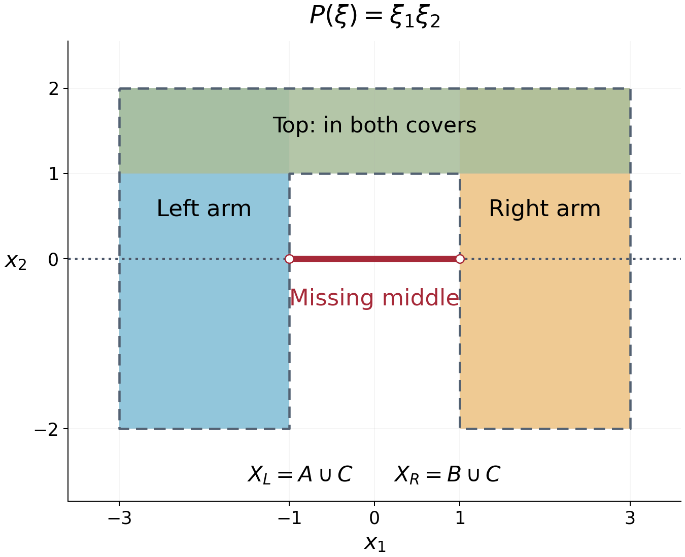

# Planar domains and directional solvability

*Written by GPT-6.1 Sol (OpenAI), Ultra reasoning effort, October 2026. Self-checked by GPT-6.1 Sol (OpenAI). Public domain (CC0).*

In two dimensions, support convexity has a complete geometric description: every characteristic line must meet the domain in an interval. The connectedness hypothesis is essential. We prove the criterion by building an exterior angle at every point outside the domain, then use it to illustrate the failure of locality. We also show that requiring support or singular-support convexity for every real directional derivative forces a connected domain to be convex, in any dimension.

Basic references are Kalmes's papers on surjectivity and augmented equations, and Grubb's open distribution lectures, listed below.

We use \(D=-i\partial\), the complex-linear transpose \(P^t=P(-D)\), and the Euclidean boundary distance \(d_X\) from [Boundary distance and propagation](boundary-distance-and-propagation.md). The nonzero complex polynomial \(P\) has constant coefficients. No condition of reality is placed on its lower order coefficients.

[Polygonal regions and the directions on a circle](polygonal-regions-and-circle-directions.md) proves polygonal connectedness, finite simple polygon separation and the circle-arc facts used in the filling argument. The conic continuation statement used in the support criterion is a planned prerequisite of [Distributions, kernels and analytic singularities](../prerequisites/planned-foundation-proofs.html), with its exact geometric hypothesis stated below.

## A geometric filling argument

Here is a plane argument we will use twice. The distance function in it can be measured in the full ambient space, not necessarily within the plane.

**Lemma 1.1.** Let \(X\subset\mathbb R^n\) be open, let \(M\) be an affine two dimensional plane, and fix a direction in \(M\). Suppose \(d_X\) satisfies the minimum principle on every line in \(M\) parallel to that direction. Then each connected component of \(X\cap M\) meets every such line in an interval or the empty set.

**Proof.** Let \(p,q\) belong to the same component and the same line \(L\). An open connected subset of a Euclidean plane is polygonally connected: the points reachable from \(p\) by finite polygonal paths form a set which is both open and relatively closed in that component. Choose a polygonal path from \(p\) to \(q\) in \(X\cap M\). It can be made simple by subdividing its finitely many edge intersections and taking a simple path in the resulting finite graph. Small perturbations within \(X\cap M\) arrange that it has no edge along \(L\) and meets \(L\) only finitely many times.

Split the path at its crossings of \(L\). For each consecutive pair of crossings, its subpath \(\gamma\) is simple and has interior entirely on one side of \(L\). Together with the straight interval \(I\) between its endpoints, it bounds a closed polygonal region \(F\), by the polygonal Jordan theorem. Choose orthonormal plane coordinates so that \(L\) has height zero and \(F\) lies at nonnegative heights. Its heights form \([0,h]\), with \(h>0\). Put
\[
\begin{gathered}
K_s=F\cap\{\text{height}=s\},\\
0\le s\le h,\qquad \delta=\min_{\gamma}d_X>0.
\end{gathered}
\tag{1}
\]
Every relative boundary point of \(K_s\) lies on \(\gamma\), including when \(s=0\), where \(K_0=I\). A point of a slice boundary cannot be an interior point of \(F\); above height zero its position on \(\partial F\) is on \(\gamma\), and at height zero the slice boundary consists of the endpoints of \(I\).

Let \(Y=\{s\in[0,h]:K_s\subset X\}\). It contains \(h\), because the top slice lies on \(\gamma\). It is relatively open: if a whole compact slice lies in \(X\), any sequence of points in neighboring slices outside \(X\) would have a limit in that slice, by compactness of \(F\), a contradiction.

For every \(s\in Y\), the minimum principle and (1) give \(d_X\ge\delta\) on \(K_s\). We claim this makes \(Y\) relatively closed. If \(s_j\in Y\) tend to \(s\), points of \(K_s\) on \(\gamma\) already lie in \(X\). Each remaining point is either in the interior of \(F\), or is an interior point of the bottom interval \(I\). An interior point is approached by points of every sufficiently nearby slice. At the bottom interval, the polygonal region locally occupies the upper side, so points of slices at positive heights approach it as well; if infinitely many \(s_j=0\), there is nothing to prove. Thus those remaining points are limits of points with distance at least \(\delta\), and the Lipschitz continuity of \(d_X\) gives the same bound at the limit. Hence \(K_s\subset X\).

The interval \([0,h]\) is connected, so \(Y=[0,h]\). In particular \(I\subset X\). These intervals lie in the same component, since they contain their crossing endpoints. The union of the intervals between consecutive crossings is a connected subset of \(L\) containing \(p\) and \(q\); it therefore contains \([p,q]\). This proves the lemma. \(\square\)

The finite simple polygon theorem is proved in [Polygonal regions and the directions on a circle](polygonal-regions-and-circle-directions.md), Section 3. The argument requires no smoothness of the boundary of the ambient domain.

## Exterior angles from connectedness

For a vertex \(q\in\mathbb R^2\), a **closed proper convex angle** will mean a closed convex cone with that vertex and aperture strictly less than \(\pi\); a single half-ray is allowed. It is the convex hull of one or two half-rays. An open proper convex cone has aperture at most \(\pi\) and excludes its vertex.

**Lemma 2.1.** Let \(X\subset\mathbb R^2\) be nonempty, open and connected. Let \(\mathcal L\) be a finite nonempty family of line directions, and suppose that every line in one of those directions meets \(X\) in an interval or the empty set. At every \(q\notin X\), there is a closed proper convex angle \(A\subset\mathbb R^2\setminus X\), with vertex \(q\), containing a nonzero half-ray of every line through \(q\) in a direction from \(\mathcal L\).

**Proof.** Translate \(q\) to zero. A line through zero cannot meet \(X\) in both of its open half-rays: its interval intersection would then include zero. If one of the lines misses \(X\) entirely, connectedness places \(X\) in one of its open halfplanes. The opposite closed halfplane is exterior. For every other direction choose its half-ray in the interior of that exterior halfplane; choose one of the boundary half-rays for the original line. There are finitely many directions. Their chosen rays span an angle of aperture strictly less than \(\pi\), because only the selected one lies on the boundary and all the others lie strictly on the same side. This angle is the required \(A\).

Otherwise every line in the family meets \(X\) in exactly one open half-ray. Choose the opposite, exterior half-ray \(R_j\). The directions of these rays are distinct points \(r_j\) on the unit circle. Since the radial map
\[
x\longmapsto x/|x|
\tag{2}
\]
is continuous on \(X\) and avoids every \(r_j\), its connected image lies in one component \(J\) of the circle with those finitely many points removed.

If there is just one removed direction, its complementary arc has length \(2\pi\), and its closed complement is that single exterior ray. With at least two directions, let \(r_a\) be the initial endpoint of the arc \(J\). Its opposite direction \(-r_a\) must lie in \(J\), because the corresponding line meets \(X\) on the opposite ray. An open arc of length at most \(\pi\), starting at \(r_a\), cannot contain \(-r_a\). Therefore \(J\) has length greater than \(\pi\).

The closed complementary arc has length less than \(\pi\), defines a closed convex angle \(A\), and contains every \(r_j\). All directions of \(X\) lie in \(J\), so \(A\) is exterior. Its contained rays provide the stated property for each line. \(\square\)

This proof explains precisely what connectedness contributes. It prevents different parts of \(X\) from lying in different angular components of the complement of the exterior rays.

## The planar support criterion

We need one exact continuation input for general constant-coefficient operators:

**Conic continuation input.** Let \(\Gamma\) be an open proper convex cone with vertex \(q\). Suppose no characteristic hyperplane through \(q\) meets \(\overline\Gamma\) only at \(q\). If \(P^tu=0\) on \(\Gamma\) and \(u\) vanishes there outside a bounded set, then \(u=0\) on \(\Gamma\).

This distributional uniqueness result follows from continuation between convex open sets; we assume it here as an analytic continuation prerequisite. In the application every characteristic line has a ray in the interior of \(\Gamma\), a stronger version of its hypothesis.

**Theorem 3.1.** Let \(P\) be nonelliptic on \(\mathbb R^2\), and let \(X\) be nonempty, open and connected. The following are equivalent:

1. \(X\) is \(P\)-convex for supports.
2. Every characteristic line meets \(X\) in an interval or the empty set.
3. At every \(q\notin X\), there is a closed proper convex angle \(A\subset\mathbb R^2\setminus X\) with vertex \(q\), such that no characteristic line through \(q\) meets \(A\) only at \(q\).

The characteristic line directions depend only on \(P_m\). There are finitely many of them: the zero set of a nonzero homogeneous polynomial on the real projective line is finite. This can be checked in the two projective coordinate charts by the corresponding nonzero one-variable polynomials. Nonellipticity says the family is nonempty.

**Proof that 1 implies 2.** Theorem 2.1 of the boundary-distance lesson gives the minimum principle on every characteristic line. Apply Lemma 1.1 with \(M=\mathbb R^2\), one characteristic direction at a time. The connected component is all of \(X\), so each line intersection is an interval.

**Proof that 2 implies 3.** Use the finite family of characteristic line directions in Lemma 2.1. Its angle contains a nonzero half-ray of every characteristic line through the vertex, which is exactly the assertion in item 3.

**Proof that 3 implies 1.** Let \(v\in\mathcal E'(X)\) be nonzero, let \(K=\operatorname{supp}P^tv\), and put \(r=d_X(K)>0\). The compact support hull theorem ensures that \(K\) is nonempty. Fix \(q\notin X\) and its exterior angle \(A\). For every \(|h|<r\),
\[
(A+h)\cap K=\varnothing.
\tag{3}
\]
Indeed any \(a\in A\) lies outside \(X\), so \(|k-a|\ge r\) for \(k\in K\), and \(|k-(a+h)|\ge r-|h|>0\).

For each fixed such \(h\), choose an open proper convex cone \(\Gamma\) with vertex \(q\), containing \(A\setminus\{q\}\), and with
\[
(\Gamma+h)\cap K=\varnothing.
\tag{4}
\]
To justify the choice, enlarge the angle's aperture slightly, keeping it less than \(\pi\). The directions from \(q+h\) to the compact set \(K\) form a compact subset of the unit circle disjoint from the closed angle directions, by (3). A sufficiently small enlargement avoids them. A degenerate single-ray angle can be enlarged the same way.

Every characteristic line through \(q\) has a nonzero ray in \(A\), hence in the interior of \(\Gamma\). Transposition leaves the characteristic directions unchanged. On \(\Gamma+h\), equation (4) gives \(P^tv=0\), and the global compact support of \(v\) supplies the boundedness condition for conic continuation. Thus \(v=0\) throughout \(\Gamma+h\).

We still must exclude the vertex itself, not merely the open cone. Given \(z=q+h\) with \(|h|<r\), choose a unit ray direction \(a\) in \(A-q\), and a small \(\varepsilon>0\) so that \(|h-\varepsilon a|<r\). Apply the preceding argument with \(h'=h-\varepsilon a\). Its open cone contains
\[
z=(q+h')+\varepsilon a
\]
as an interior point, so \(z\notin\operatorname{supp}v\). Hence the whole ball \(B(q,r)\) misses \(\operatorname{supp}v\).

Taking every \(q\notin X\) yields
\(d_X(\operatorname{supp}v)\ge r\). Locality gives the reverse inequality, and the distance criterion (3) of the preceding lesson proves support convexity. \(\square\)

The elliptic case is simpler: every open set is support convex, and there are no characteristic lines to test. For a disconnected planar set, apply the theorem to each connected component. Support convexity is componentwise: a compact subset of an open set meets only finitely many components, since a finite cover by connected balls inside the set accounts for all components it meets; one takes the finite union of their compact support bounds.

## A domain where locality fails

Consider \(P(\xi)=\xi_1\xi_2\). Its characteristic lines are horizontal and vertical. Define the open rectangles
\[
\begin{aligned}
A&=(-3,-1)\times(-2,2),\\
B&=(1,3)\times(-2,2),\\
C&=(-3,3)\times(1,2).
\end{aligned}
\tag{5}
\]
Let \(X_L=A\cup C\), \(X_R=B\cup C\), and \(X=X_L\cup X_R\). Each of \(X_L,X_R\) is connected and has interval intersections with every horizontal and vertical line. For example, a horizontal slice of \(X_L\) is \((-3,-1)\) at heights in \((-2,1]\), and \((-3,3)\) at heights in \((1,2)\); its vertical slices are also intervals. Theorem 3.1 makes both sets support convex.

The union \(X\) is connected, but its horizontal slice at height zero is
\[
((-3,-1)\cup(1,3))\times\{0\}.
\tag{6}
\]
It is not an interval, so \(X\) is not support convex. The two support-convex open sets cover \(X\). Thus support convexity cannot be inferred from an open cover by domains possessing that property.

The figure depicts the exact rectangles in (5); their boundary lines are excluded. The top rectangle belongs to both covering domains. The dashed line is characteristic, and its missing middle interval supplies the obstruction in (6). The drawing is an original coordinate illustration of this example.

## Testing every real direction

**Theorem 5.1.** For a nonempty open connected \(X\subset\mathbb R^n\), the following are equivalent:

1. \(X\) is convex.
2. For every real nonzero \(t\), \(X\) is \(P_t\)-convex for supports, where \(P_t(\xi)=t\cdot\xi\).
3. For every such \(t\), \(X\) is \(P_t\)-convex for singular supports.

**Proof.** A convex open set has both properties for every nonzero constant polynomial operator, by the two compact hull identities. This proves that item 1 implies the others.

If item 2 holds, Theorem 3.2 of the boundary-distance lesson, with active subspace \(\mathbb Rt\), gives the minimum principle on every affine line in every direction. If item 3 holds, its Theorem 4.1 gives the same conclusion: \(P_t\) is of real principal type and its bicharacteristic direction is \(t\). In dimension one connectedness already makes \(X\) an interval, so assume \(n\ge2\).

For any affine two dimensional plane \(M\), apply Lemma 1.1 in every direction in \(M\). Each connected component of \(X\cap M\) has interval intersections with every line in \(M\), so it is convex: two of its points lie on a line, and the interval property includes their segment. Here the distance in Lemma 1.1 is still the ambient \(d_X\); no smooth-extension theorem from the slice is needed.

Finally take any \(x,y\in X\) and a finite polygonal path between them, with vertices \(x=x_0,x_1,\ldots,x_N=y\). Any two adjacent edges lie in an affine plane of dimension at most two. If its dimension is two, the edges belong to the same component of \(X\cap M\), which is convex, so their endpoints \(x_0,x_2\) can be joined by the straight segment inside \(X\). If their dimension is one, their two overlapping intervals already contain that segment. Replace the two edges by this segment, and repeat to shorten the path. Ultimately \([x,y]\subset X\). This proves convexity from either item 2 or item 3. \(\square\)

For a fixed direction, these properties permit many nonconvex domains. Testing every direction, together with connectedness, is what recovers ordinary convexity.

## Exercises

**Exercise 1 (introductory: why connectedness is specified).** Let \(X\) be the union of the open unit disks centered at \((-3,0)\) and \((3,0)\), and let \(P(\xi)=\xi_1\). Prove that \(X\) is support convex, while a characteristic line can meet \(X\) in two intervals. Explain why this does not contradict Theorem 3.1.

**Exercise 2 (intermediate: complex directions).** Let \(P(\xi)=\xi_1+i\xi_2\). Identify its real characteristic normals. Determine support convexity on the domain (5). Explain why the two-arm picture by itself does not obstruct this equation.

**Exercise 3 (intermediate: the exterior vertex).** In the last implication of Theorem 3.1, show precisely why vanishing on \(\Gamma+h\) does not immediately exclude its vertex from the support of a distribution. Prove that the extra shift along an angle ray excludes every point of \(B(q,r)\).

**Exercise 4 (advanced: finite exterior rays).** Suppose three prescribed line directions through zero meet a connected open \(X\), but zero is outside \(X\) and each line meets \(X\) in an interval. Prove that the three exterior ray directions lie in a closed arc of length less than \(\pi\). Your proof must not assume \(X\) is bounded or has a smooth boundary.

## Complete solutions

**Solution 1.** Each disk is convex, hence support convex for every nonzero constant polynomial operator. Compact subsets of their disjoint union meet finitely many components, so their support bounds combine to give support convexity for the union. The characteristic normals of \(P\) satisfy \(N_1=0\); the characteristic lines are horizontal. The line \(x_2=0\) meets the two disks in \((-4,-2)\times\{0\}\) and \((2,4)\times\{0\}\). This is not one interval. The theorem applies to each connected component, not to a disconnected union as though it were connected.

**Solution 2.** A real normal \(N\) is characteristic only if \(N_1+iN_2=0\), which forces both real components to be zero. There are no nonzero real characteristic normals, so this operator is elliptic. Every open set is support convex by Theorem 3.1 of the boundary-distance lesson, including the two-arm domain. Its gap obstructs operators having the corresponding real characteristic lines; it is not an equation-independent obstruction.

**Solution 3.** A distribution can vanish in an open cone while having support at its vertex; \(\delta_q\) is a simple example. Fix \(z=q+h\), \(|h|<r\), and a unit vector \(a\) pointing along a ray of \(A\). Choose \(\varepsilon>0\) with \(|h-\varepsilon a|<r\). The construction applied at shift \(h'=h-\varepsilon a\) gives an open cone containing the nonzero ray point \((q+h')+\varepsilon a=z\), and the distribution vanishes on that open cone. Hence it vanishes on a neighborhood of \(z\), which excludes \(z\) from its support. Since \(h\) was arbitrary, the entire ball is excluded.

**Solution 4.** For each line choose the ray opposite its interval intersection with \(X\); the interval cannot occupy both rays because zero is excluded. The radial image of \(X\) is connected and lies in a single open arc \(J\) of the circle after removing these three exterior directions. The opposite of either endpoint exterior direction belongs to \(J\), since the line in question meets \(X\) on that opposite ray. It follows that \(J\) has length greater than \(\pi\). The closed complementary arc, containing all three exterior directions, has length less than \(\pi\), as required. Only connectedness, the interval property, and the topology of the circle were used.

## References

For a primary open source recording the planar support criterion in the context of augmented equations, see T. Kalmes, [*Some results on surjectivity of augmented differential operators*](https://www.tu-chemnitz.de/mathematik/analysis/kalmes/Preprints/Some_results_on_surjectivity_of_augmented_differential_operators_manuscript.pdf), Journal of Mathematical Analysis and Applications 386 (2012), 125–134, Section 4. Its statement uses boundary vertices for exterior cones; the proof above constructs an exterior angle at every complement point.

For the broader geometry of solvability, see T. Kalmes, [*Surjectivity of differential operators and linear topological invariants for spaces of zero solutions*](https://arxiv.org/abs/1408.4356), Revista Matemática Complutense 32 (2019), 37–55. For distribution prerequisites, see G. Grubb, *Distributions and Operators*, open lecture chapter [Distributions](https://web.math.ku.dk/~grubb/dist3.pdf).
