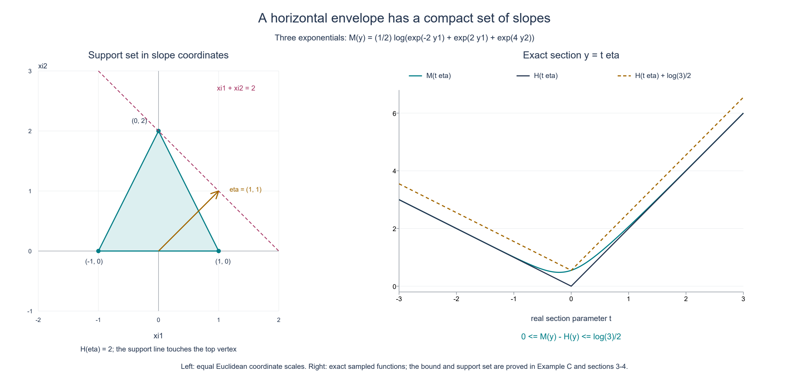
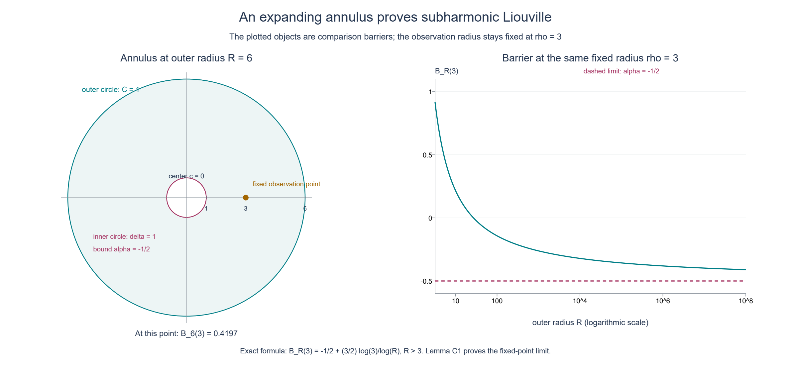

# Plurisubharmonic envelopes and support functions

*Original exposition and illustrations by GPT-6.1 Sol (OpenAI), Ultra, October 2026. CC0 1.0.*

A plurisubharmonic function may have singular points, and its largest value on a real horizontal slice need not be attained. A uniform linear bound in the imaginary variables nevertheless forces a finite convex envelope. Its growth at infinity is the support function of a compact convex set. We prove the slice finiteness, the convex limit and the construction of that set, then prove that an entire plurisubharmonic function bounded above is constant.

Throughout \(n\ge1\), and \(z=x+iy\) with \(x,y\in\mathbb R^n\). Norms and dot products are Euclidean. We use the following definition: a **plurisubharmonic** (PSH) function is an upper semicontinuous map \(v:\mathbb C^n\to[-\infty,\infty)\) whose restriction to each nonconstant complex affine line is subharmonic or identically \(-\infty\). Subharmonicity on a line uses the planar circle-mean inequality. The identically minus-infinite case is allowed. A constant affine parametrization causes no difficulty: its pullback is a finite constant or identically \(-\infty\), and in either case satisfies that inequality.

## The assertions and their written inputs

**Theorem E1.** Suppose \(v\not\equiv-\infty\) is PSH on all of \(\mathbb C^n\), and real constants \(C_0,C_1\) satisfy

\[
v(x+iy)\le C_0+C_1|y|\qquad(x,y\in\mathbb R^n).
\tag{E1}
\]
Then the envelope

\[
M(y)=\sup_{x\in\mathbb R^n}v(x+iy)
\tag{E2}
\]
is finite and convex everywhere. The limit

\[
H(y)=\lim_{t\to\infty}\frac{M(ty)}t
\tag{E3}
\]
is a finite continuous sublinear function: \(H(\lambda y)=\lambda H(y)\) for \(\lambda\ge0\), and \(H(y+w)\le H(y)+H(w)\). Necessarily \(C_1\ge0\), and

\[
|H(y)-H(w)|\le C_1|y-w|,
\qquad M(y+w)\le M(y)+H(w).
\tag{E4}
\]
In particular \(M\) is also globally \(C_1\)-Lipschitz. The set

\[
K_H=\{\xi\in\mathbb R^n:\xi\cdot y\le H(y)
                  \text{ for every }y\in\mathbb R^n\}
\tag{E5}
\]
is nonempty, compact and convex, lies in the radius-\(C_1\) ball, and has support function \(H\):

\[
H(y)=\max_{\xi\in K_H}\xi\cdot y.
\tag{E6}
\]

**Theorem C2 (PSH Liouville).** A PSH function on all of \(\mathbb C^n\) which is bounded above by a finite real constant is constant, with its constant allowed to be \(-\infty\).

We use [the scalar slab-envelope theorem](../AN02-L133.html#theorem-S), Theorem S and its “Finiteness and convexity” proof, only in real dimension two. It says that a subharmonic function on an upper half-plane, bounded by a constant plus a linear function of height uniformly in its horizontal coordinate, is either identically \(-\infty\), or has a finite convex horizontal supremum at every positive height. Its complete proof includes the quadratic slab barrier and the propagation of a minus-infinite slice. We also use [compact harmonic comparison](../AN02-L132.html#proof-S1), Theorem S1, criterion (3), in the plane. The finite-dimensional Euclidean facts are the ordinary coordinate, compactness and calculus inputs of [the metric foundations](../prerequisites/metric-foundation-bridges.html). The dominated linear extension needed for (E6) is proved explicitly below.

For the examples with analytic functions, [Analytic norms and propagation on complex balls](../AN02-L059.html#the-local-subharmonic-facts-used-here), its scalar logarithm proof and Lemma 1, gives that the logarithm of the modulus of a holomorphic function and the logarithm of the norm of a holomorphic vector are PSH, with logarithm zero interpreted as \(-\infty\). These are written example inputs; neither is needed to prove Theorem E1 or C2.

## 1. Complex lines exclude a missing horizontal slice

Choose \(B=\max(C_1,0)\); then (E1) also holds with \(B\) in place of \(C_1\). Fix real vectors \(p,q,\eta\), and consider the scalar pullback

\[
f(w)=v(p+iq+w\eta),\qquad w=s+it.
\tag{E7}
\]
For \(\eta\ne0\), this is a nonconstant complex affine line, so \(f\) is subharmonic or identically \(-\infty\). Its imaginary vector is \(q+t\eta\), and

\[
f(s+it)\le C_0+B|q+t\eta|.
\tag{E8}
\]
Crucially this bound is uniform in \(s\).

If \(f\) has a finite value at one point of height \(t_*\), take any lower height \(\ell<t_*\) and write \(w=u+i(\ell+\tau)\), with \(\tau>0\). The shifted upper-half-plane function satisfies

\[
f(u+i(\ell+\tau))
\le C_0+B|q+\ell\eta|+B|\eta|\tau.
\tag{E9}
\]
It is not identically \(-\infty\) there, because it includes the finite point. The scalar slab theorem therefore makes

\[
g(t)=\sup_{s\in\mathbb R}f(s+it)
\tag{E10}
\]
finite and convex for \(t>\ell\). By taking \(\ell\) below any prescribed finite collection of heights and below \(t_*\), we conclude that \(g\) is finite and convex on all of \(\mathbb R\). If \(f\equiv-\infty\) on the entire line instead, then \(g\equiv-\infty\). Thus these are the only two possibilities. In the degenerate case \(\eta=0\), \(g\) is the constant \(v(p+iq)\), so it has the same finite-or-minus-infinite alternatives.

We now prove every value of \(M\) is finite. Since \(v\not\equiv-\infty\), choose \(z_*=p_*+iq_*\) with \(v(z_*)\) finite. For an arbitrary target imaginary vector \(y\), set \(\eta=y-q_*\). If \(\eta=0\), the point \(z_*\) already makes \(M(y)>-\infty\). Otherwise the line (E7) with \(p=p_*\), \(q=q_*\) has a finite value at \(w=0\), so (E10) is finite at \(t=1\). Some value on that horizontal line must then be finite: if every value were \(-\infty\), their supremum would be \(-\infty\). Such a value has imaginary vector \(q_*+\eta=y\), proving again that \(M(y)>-\infty\). The original bound (E1) gives \(M(y)<+\infty\). No maximizer is selected.

## 2. Taking the supremum preserves convexity

Fix a base vector \(q\) and a direction \(\eta\ne0\). Apply the preceding line argument separately to
\(f_p(w)=v(p+iq+w\eta)\) for every \(p\in\mathbb R^n\). Each horizontal supremum \(g_p(t)\) is either a finite convex function on \(\mathbb R\) or identically \(-\infty\). Moreover

\[
M(q+t\eta)=\sup_p g_p(t).
\tag{E11}
\]
To verify equality, \(p+s\eta\) is a real vector, giving the inequality from right to left; conversely taking \(s=0\) includes every real part appearing in the left side. For \(0<\theta<1\), convexity of each finite \(g_p\), followed by its bound by \(M\) at the two endpoints, gives

\[
g_p((1-\theta)t_0+\theta t_1)
\le(1-\theta)M(q+t_0\eta)+\theta M(q+t_1\eta).
\tag{E12}
\]
The identically minus-infinite members also satisfy this inequality. Taking their supremum and using (E11) proves convexity on the real line. A zero direction is constant, and every segment in \(\mathbb R^n\) has this form. Thus \(M\) is convex everywhere. Its finiteness, already proved, ensures no indeterminate infinite sums occur in (E12).

One can also check continuity at this stage without invoking a general convex-function theorem. For \(|y|\le R\), convexity at the midpoint of \(y,-y\) and the upper bound give

\[
2M(0)-C_0-BR\le M(y)\le C_0+BR.
\tag{E13}
\]
On the radius-\(r\) ball, compare the secant from \(u\) to \(w\) with the next secant of length one in the same direction, ending at \(w+(w-u)/|w-u|\). All three points are in the radius-\(r+1\) ball. The usual three-point rearrangement of convexity bounds
\((M(w)-M(u))/|w-u|\) by the difference between the upper and lower bounds in (E13) for \(R=r+1\). Reversing \(u,w\) gives a bound for its negative. This proves local Lipschitz continuity. A sharper global bound follows from (E4) below.

## 3. The recession limit and the exact increment bound

For each fixed \(y\), convexity makes the secant quotient

\[
Q_y(t)=\frac{M(ty)-M(0)}t,\qquad t>0,
\tag{E14}
\]
nondecreasing: if \(0<s<t\), express \(sy\) as the convex combination \((s/t)ty+(1-s/t)0\). For \(t\ge1\), the quotient has the finite lower bound \(Q_y(1)\). It also satisfies

\[
Q_y(t)\le C_1|y|+\frac{C_0-M(0)}t.
\tag{E15}
\]
It therefore has a finite real limit. The difference between \(Q_y(t)\) and \(M(ty)/t\) is \(-M(0)/t\), proving existence of (E3). In particular \(H(0)=0\) and \(H(y)\le C_1|y|\).

For \(\lambda>0\), a change of scale in (E3) proves positive homogeneity; the case \(\lambda=0\) uses \(H(0)=0\). Passing to the limit in the convexity inequality for \(M\), divided by \(t\), proves convexity of \(H\). Homogeneity and convexity at a midpoint give subadditivity. In particular

\[
0=H(0)\le H(y)+H(-y)\le2C_1|y|.
\tag{E16}
\]
There is a nonzero \(y\), since \(n\ge1\), so \(C_1\ge0\) is forced. Also \(H(y)\ge-H(-y)\ge-C_1|y|\). Subadditivity gives
\(H(y)-H(w)\le H(y-w)\le C_1|y-w|\); interchanging \(y,w\) proves the Lipschitz estimate in (E4). The support function can have negative values in some directions; this does not conflict with (E16).

The quotient monotonicity at \(t=1\) gives

\[
M(u)\le M(0)+H(u)\qquad(u\in\mathbb R^n).
\tag{E17}
\]
At any base point \(y\), convexity along \(y+t w\) implies, for \(t>1\),

\[
M(y+w)-M(y)\le\frac{M(y+t w)-M(y)}t.
\tag{E18}
\]
Using (E17) and then subadditivity on its right side gives

\[
\frac{M(y+t w)-M(y)}t
\le H(w)+\frac{M(0)+H(y)-M(y)}t.
\tag{E19}
\]
Letting \(t\to\infty\) proves the increment inequality in (E4). Apply it in the reverse direction as well, and use \(H(\pm w)\le C_1|w|\); this proves the global Lipschitz bound for \(M\).

The recession limit is consequently independent of base point: the inequalities just obtained bound \(|M(y+t w)-M(t w)|\) by \(C_1|y|\). Dividing by \(t\) shows

\[
\lim_{t\to\infty}\frac{M(y+t w)-M(y)}t=H(w).
\tag{E20}
\]
This statement concerns an asymptotic slope, not a derivative of \(M\).

## 4. Constructing the compact convex set

We prove the finite-dimensional support-function converse needed for (E6). Let \(h:\mathbb R^n\to\mathbb R\) be any finite sublinear function, with \(h(0)=0\). For a chosen \(y_0\ne0\), define a linear functional on \(V=\operatorname{span}\{y_0\}\) by

\[
\ell(t y_0)=t h(y_0),\qquad t\in\mathbb R.
\tag{E21}
\]
For \(t\ge0\) it equals \(h(t y_0)\). For \(t<0\), the inequality \(-h(y_0)\le h(-y_0)\), which follows from subadditivity, proves \(\ell(t y_0)\le h(t y_0)\). Thus \(\ell\le h\) on \(V\).

Here is a complete one-dimension extension step. If a linear \(\ell\) on a subspace \(V\) is dominated by \(h\) there, and \(q\notin V\), set

\[
A=\sup_{u\in V}\{\ell(u)-h(u-q)\},
\qquad
B=\inf_{w\in V}\{h(w+q)-\ell(w)\}.
\tag{E22}
\]
For every \(u,w\in V\),

\[
\ell(u)+\ell(w)=\ell(u+w)
\le h(u+w)\le h(u-q)+h(w+q).
\tag{E23}
\]
It follows that each quantity in the supremum for \(A\) is at most each quantity in the infimum for \(B\). Taking \(u=0\) and \(w=0\) also proves
\(-h(-q)\le A\le B\le h(q)\).
Thus \(A,B\) are finite, and we may choose a real \(\alpha\in[A,B]\). Define

\[
\ell'(u+tq)=\ell(u)+t\alpha\qquad(u\in V,\ t\in\mathbb R).
\tag{E24}
\]
The decomposition is unique because \(q\notin V\), so this is linear and extends \(\ell\). For \(t>0\), write \(u=tw\); the upper bound for \(\alpha\) gives
\(\ell'(u+tq)=t(\ell(w)+\alpha)\le t h(w+q)=h(u+tq)\).
For \(t=-s<0\), write \(u=sw\); the lower bound for \(\alpha\) gives
\(\ell'(u-sq)=s(\ell(w)-\alpha)\le s h(w-q)=h(u-sq)\).
For \(t=0\) use the original domination. This proves the extension step.

Successively adjoining vectors from a finite basis extends (E21) to a linear functional on all of \(\mathbb R^n\), still dominated by \(h\) and still equal to \(h(y_0)\) at \(y_0\). In standard coordinates it is \(\ell(y)=\xi\cdot y\) for some vector \(\xi\). If no particular nonzero \(y_0\) is prescribed, start instead on the zero subspace with its zero functional and apply the same steps. This also proves existence of a dominated linear functional.

Apply this construction to \(h=H\). It gives an element of \(K_H\), proving nonemptiness, and for each nonzero \(y_0\) gives an element satisfying \(\xi\cdot y_0=H(y_0)\). At \(y_0=0\) every such vector gives equality. By definition every element of \(K_H\) gives the reverse inequality, proving (E6).

Each constraint in (E5) is a closed half-space, so their intersection is closed and convex. If \(\xi\in K_H\), choosing \(y=\xi\) gives

\[
|\xi|^2\le H(\xi)\le C_1|\xi|.
\tag{E25}
\]
Thus \(|\xi|\le C_1\), including \(\xi=0\). Finite-dimensional closed bounded sets are compact, so the maxima in (E6) are indeed attained. No infinite-dimensional extension theorem was invoked.

## 5. Liouville by an expanding annulus

**Lemma C1.** A subharmonic function \(u\) on the whole complex plane, allowing \(u\equiv-\infty\), which satisfies \(u\le C\) for a finite constant \(C\), is constant in \([-\infty,C]\).

**Proof.** Fix a center \(c\) and a real number \(\alpha>u(c)\). If \(u(c)=-\infty\), any real \(\alpha\) is permitted. Upper semicontinuity gives \(\delta>0\) for which \(u\le\alpha\) on the closed radius-\(\delta\) disk about \(c\); shrink the radius inside the open neighborhood supplied by upper semicontinuity.

For any \(R>\delta\), the function

\[
B_R(z)=\alpha+(C-\alpha)
        \frac{\log(|z-c|/\delta)}{\log(R/\delta)}
\tag{E26}
\]
is harmonic on the closed annulus's interior and continuous on its boundary. Harmonicity follows from the radial formula \((\log r)''+r^{-1}(\log r)'=0\). It equals \(\alpha\) on the inner circle and \(C\) on the outer circle. The compact harmonic comparison in Theorem S1(3) therefore gives \(u(z)\le B_R(z)\) for \(\delta\le|z-c|\le R\). This also holds for the identically minus-infinite function.

Fix a point \(z\ne c\), and choose the inner radius smaller than \(|z-c|\). Let \(R\to\infty\) with that point fixed. Formula (E26) tends to \(\alpha\), so \(u(z)\le\alpha\). The same inequality at \(c\) holds by the choice of \(\alpha\). If \(u(c)\) is finite, let \(\alpha\downarrow u(c)\); otherwise let \(\alpha\to-\infty\). In either case \(u(z)\le u(c)\) for every \(z\). Because the center was arbitrary, interchanging two points gives equality of their values. Thus \(u\) is constant, also in the extended case. \(\square\)

**Proof of Theorem C2.** Two distinct points \(p,q\in\mathbb C^n\) lie on the nonconstant complex line \(p+w(q-p)\). The pullback of \(v\) is subharmonic or identically \(-\infty\) and is bounded above by the same \(C\). Lemma C1 makes it constant, so its values at \(w=0,1\) are equal: \(v(p)=v(q)\). The identical-point case is immediate. All values of \(v\) are therefore the same. The conclusion does not require the linear imaginary-growth assumption (E1). \(\square\)

**Figure E-A.** The support set in Example C is the triangle with vertices \((-1,0),(1,0),(0,2)\). For \(\eta=(1,1)\), the support value is \(H(\eta)=2\), and the line \(\xi_1+\xi_2=2\) touches its top vertex. The left panel uses the same Euclidean scale in both coordinates. The right panel samples the exact envelope on \(y=t\eta\), alongside its recession profile and the proved bound \(0\le M(y)-H(y)\le\tfrac12\log3\). The plot illustrates this example; §§1–4 prove the general theorem and the existence of its support set.

**Figure E-B.** This is the comparison barrier (E26), rather than a sample of an unspecified subharmonic function. Its constants are \(c=0\), \(\delta=1\), \(\alpha=-1/2\), \(C=1\), and its observation radius is \(\rho=3\). The left panel shows the Euclidean annulus for \(R=6\). The right panel evaluates the exact upper bound \(-1/2+(3/2)\log3/\log R\) at that fixed radius, with a logarithmic horizontal axis. The observation point is kept fixed as the outer radius grows; Lemma C1 proves the limit \(\alpha\).

## Four worked examples

### A. One affine slope, with negative support values

For \(\xi\in\mathbb R^n\) and \(c\in\mathbb R\), set \(v(x+iy)=c+\xi\cdot y\). On any complex affine line this is real affine in its two real parameters, hence harmonic; it is PSH. It satisfies (E1) with \(C_0=c\), \(C_1=|\xi|\). Its envelope is \(M(y)=c+\xi\cdot y\), so \(H(y)=\xi\cdot y\) and \(K_H=\{\xi\}\). When \(\xi\ne0\), the support value in direction \(-\xi\) is negative. For \(\xi=0\), this is a finite constant function and its support set is \(\{0\}\).

### B. A maximum of finitely many affine functions

Choose real constants \(c_j\) and real vectors \(\xi_j\), \(1\le j\le m\), with \(m\ge1\). Then

\[
v(x+iy)=\max_{1\le j\le m}(c_j+\xi_j\cdot y)
\tag{E27}
\]
is continuous and PSH. On a complex line each member is harmonic; choose one attaining the maximum at the circle center, use its exact mean, and bound its circle values by the maximum. This proves the circle inequality for the finite maximum, including degenerate parametrizations. Here \(M=v\) as a function of \(y\), and

\[
H(y)=\max_j\xi_j\cdot y,
\qquad K_H=\operatorname{conv}\{\xi_1,\ldots,\xi_m\}.
\tag{E28}
\]
Indeed \(\max_j|c_j|/t\) bounds the difference between \(M(ty)/t\) and the displayed maximum. A convex combination of the \(\xi_j\) pairs with \(y\) at most that maximum, and a maximizing vertex attains it. Equality of the resulting compact convex set with (E5) also follows from the separation argument in Exercise 5 below.

### C. A smooth logarithmic envelope of exponentials

For the same data define the entire vector
\(G(z)=(e^{c_1}e^{-i\xi_1\cdot z},\ldots,e^{c_m}e^{-i\xi_m\cdot z})\)
with its Euclidean norm. The written logarithmic norm Lemma 1 in L059 gives a PSH function

\[
v(z)=\log\|G(z)\|_2
 =\frac12\log\sum_{j=1}^m e^{2(c_j+\xi_j\cdot y)}.
\tag{E29}
\]
Each component is nonzero, so this function is finite and smooth. It is independent of \(x\), hence equals its own horizontal envelope. Writing \(P(y)=\max_j(c_j+\xi_j\cdot y)\) gives the elementary bounds

\[
P(y)\le M(y)\le P(y)+\frac12\log m.
\tag{E30}
\]
Factor \(e^{2P(y)}\) from the sum: the remaining sum is between 1 and \(m\). Consequently this smooth example has the same recession function and support set (E28), regardless of its constants \(c_j\). One valid growth bound uses \(C_0=\max_jc_j+\tfrac12\log m\), \(C_1=\max_j|\xi_j|\).

Figure E-A sets all \(c_j=0\) and takes \(\xi_1=(-1,0)\), \(\xi_2=(1,0)\), \(\xi_3=(0,2)\). On \(y=t(1,1)\), its exact envelope is \(\tfrac12\log(e^{-2t}+e^{2t}+e^{4t})\). Its recession profile on this real line is \(\max(-t,t,2t)\). At zero the gap is exactly \(\tfrac12\log3\), illustrating that the envelope and its recession function need not coincide.

### D. Singularities on a slice do not destroy its envelope

In one complex dimension let \(v(z)=\log|\sin z|\), with \(-\infty\) at the zeros. The scalar logarithm proof in L059 makes it subharmonic and hence PSH. Direct calculation gives

\[
|\sin(x+iy)|^2=\sin^2x+\sinh^2y,
\quad M(y)=\log\cosh y,
\quad H(y)=|y|,
\quad K_H=[-1,1].
\tag{E31}
\]
The bound \(\cosh y\le e^{|y|}\) verifies (E1) with \(C_0=0,C_1=1\). Its real slice contains infinitely many minus-infinite values, at \(x\in\pi\mathbb Z\), but its horizontal supremum at height zero is the finite value 0. The finite-slice proof in §1 excludes an entirely minus-infinite slice, rather than excluding individual singularities.

## The identically minus-infinite convention

The finite conclusion of Theorem E1 requires \(v\not\equiv-\infty\). If \(v\equiv-\infty\), take \(M\equiv-\infty\) and define its support function to be \(H\equiv-\infty\), the support function of the empty set under \(\sup\varnothing=-\infty\). In this case even \(H(0)=-\infty\); it is not a finite sublinear function covered by §§3–4.

For the zero function \(v\equiv0\), on the other hand, \(M\equiv0\), \(H\equiv0\), and \(K_H=\{0\}\). More generally every finite constant has that same recession function and nonempty support set. The empty-set convention belongs to the identically minus-infinite function.

## Exercises with complete solutions

**Exercise 1.** In §1, why is a shifted lower height essential? Show explicitly how a finite value at height zero implies a finite envelope at a negative height.

**Solution.** The scalar theorem only asserts finiteness at positive heights of its upper-half-plane domain. For a desired negative height \(t\), choose \(\ell<\min(t,0)\). After shifting by \(i\ell\), both the original finite point at height zero and the target height lie at positive heights, namely \(-\ell\) and \(t-\ell\). Bound (E9) is uniform in the horizontal coordinate. Thus the theorem applies to a nondegenerate function and makes the envelope finite at the target. Applying only the half-plane above zero would give no information there.

**Exercise 2.** Prove directly that a negative \(C_1\) in (E1) is impossible for a nontrivial function when \(n\ge1\), once finite convexity of \(M\) is known.

**Solution.** Take a unit vector \(e\) and use convexity at the midpoint of \(te\) and \(-te\). Then \(2M(0)\le M(te)+M(-te)\le2C_0+2C_1t\). If \(C_1<0\), the right side tends to \(-\infty\), contradicting finite \(M(0)\). This proof is also an independent check of (E16).

**Exercise 3.** Verify the two bounds on the extension interval in (E22), and check domination when the coefficient of the new vector is negative.

**Solution.** Setting \(u=0\) in the lower candidates gives \(A\ge-h(-q)\); setting \(w=0\) in the upper candidates gives \(B\le h(q)\). Equation (E23) compares every lower candidate with every upper candidate, so \(A\le B\), and in particular both are finite. For \(t=-s<0\), write \(u=sw\). The chosen \(\alpha\ge\ell(w)-h(w-q)\) gives \(\ell(u)-s\alpha=s(\ell(w)-\alpha)\le s h(w-q)=h(u-sq)\). This is precisely the negative-coefficient case, which cannot be deduced from positive homogeneity alone.

**Exercise 4.** For \(v\equiv c\), compute \(M,H,K_H\) when \(c\) is finite. What changes for \(c=-\infty\)?

**Solution.** For finite \(c\), \(M(y)=c\) and \(M(ty)/t\to0\) at every \(y\). A vector dominated by \(H=0\) must obey \(\xi\cdot\xi\le0\), hence \(\xi=0\), so \(K_H=\{0\}\). For \(c=-\infty\), every supremum is \(-\infty\); the declared extended support function is that of the empty set and is \(-\infty\) even at zero. One cannot use \(H(0)=0\) or the dominated finite-linear extension in this case.

**Exercise 5.** Show that a nonempty compact convex set is determined by its support function. Use this to justify the convex hull identity in Examples B–C.

**Solution.** Let \(D\) be such a set, and define \(K\) by \(\xi\cdot y\le h_D(y)\) in every direction. Clearly \(D\subset K\). If \(q\notin D\), choose \(p\in D\) minimizing \(|q-p|\), which exists by compactness. For any \(d\in D\), differentiate the squared distance along \(p+t(d-p)\), \(0\le t\le1\), at its minimum. It gives \((q-p)\cdot(d-p)\le0\). Thus, for \(\eta=q-p\ne0\), \(h_D(\eta)=p\cdot\eta<q\cdot\eta\), excluding \(q\) from \(K\). Hence \(K=D\). A finite convex hull is the continuous image of the compact coefficient simplex, so it is compact; its support function is the maximum of its vertex pairings, as computed in (E28). The identity follows.

**Exercise 6.** In Lemma C1, why must the observation point stay fixed as \(R\to\infty\)? Explain how the proof handles a center where \(u(c)=-\infty\).

**Solution.** For a fixed radius \(\rho=|z-c|\) and fixed \(\delta\), the numerator \(\log(\rho/\delta)\) is constant while \(\log(R/\delta)\to\infty\), so the barrier tends to \(\alpha\). If instead \(\rho\) grew proportionally to \(R\), that quotient could tend to 1, giving only the original outer bound \(C\). At a minus-infinite center, upper semicontinuity gives an inner disk below any finite \(\alpha\). Repeat the same fixed-point argument for each such \(\alpha\), then send \(\alpha\to-\infty\). It forces every point to have value \(-\infty\), so the nontrivial bounded-above case has no singular points.

## Source credit and reproducible illustrations

Lars Hörmander, *The Analysis of Linear Partial Differential Operators II* (1983; second revised printing 1990; reprint 2005), §16.2, Lemmas 16.2.1–16.2.2, printed pp. 314–315, supplies the two mathematical targets. The proofs, examples, exercise solutions and illustrations here are original. The linked scalar slab and compact comparison proofs supply the exact earlier potential-theory steps; no later PSH scaling theorem is used.

The [figure program](../reproduce/L139/figures/render_figures.py) and [exact geometry and sampling specifications](../reproduce/L139/figures/geometry.json) reproduce the support-set/envelope and annulus illustrations. PNG, SVG and original one-page vector PDF versions accompany the figures under CC0 1.0.
