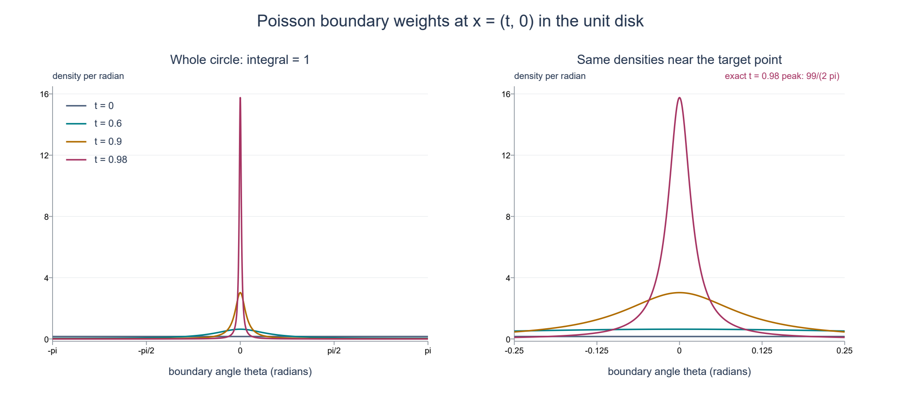
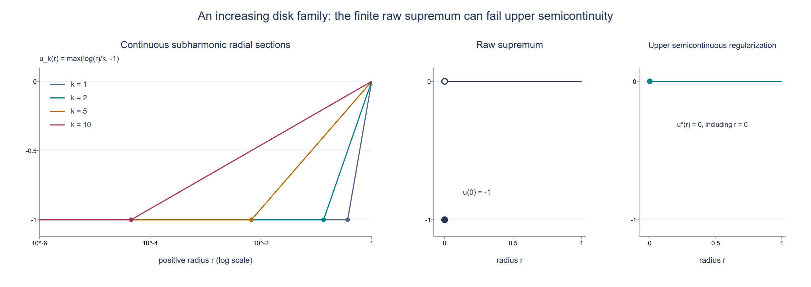

# Poisson extension and subharmonic comparison

*Original exposition and illustrations by GPT-6.1 Sol (OpenAI). CC0 1.0.*

A boundary average can solve a differential equation. The Poisson kernel tells us which boundary points to weight; those weights concentrate near a point as we approach it from inside the ball. The same construction converts an inequality against globally defined harmonic functions into a spherical mean inequality. This gives four equivalent ways to recognize a subharmonic function and explains when a supremum of such functions remains subharmonic.

The central distinction is between the boundary comparison itself and the function used to test it. A harmonic function on a ball need not be globally defined. We will construct global harmonic **polynomials** approximating its Poisson extension, with a uniform error on the closed ball. This approximation is part of the proof.

## Conventions and the integration inputs

First let \(n\geq2\), let \(S^{n-1}=\{\omega\in\mathbb R^n:|\omega|=1\}\), and let \(dS\) be Euclidean surface measure. Write \(\sigma=\int_{S^{n-1}}dS\). A harmonic function is a real \(C^2\) function with \(\Delta h=0\). Complex boundary data can be treated by their real and imaginary parts. The one-dimensional case is given below.

We use ordinary finite-measure integration, including monotone convergence and Tonelli after making an integrand nonnegative. The corresponding proofs are in [Banach estimates, quotient spaces and compact parameter arguments](../prerequisites/banach-foundation-bridges.html), §§15.0–15.1 and §16.4. For the mean-value calculation we use the already written flux identity in Boundary flux and weak identities, Theorem 2.1, formula (2.3). Applied to a cutoff equal to one near a closed ball, that identity is the usual divergence theorem on the ball. The scalar Cauchy coefficient formula and bound used below are in Cauchy kernels and distributional boundary limits, Corollary 2.2, formulas (2.3)–(2.4); [Cauchy bounds, root counts and analytic extensions](../AN02-L045.html#cauchy-estimates-and-parameter-contours), Lemmas 1.1–1.2, gives the compact parameter version.

If \(u:X\to[-\infty,\infty)\) is upper semicontinuous, then it is Borel measurable and bounded above on every compact subset of the open set \(X\). Indeed each point has a neighborhood with a finite upper bound, including a point where \(u=-\infty\); take a finite cover of the compact set. Integrals of \(u\) on spheres therefore have a well-defined value in \([-\infty,\infty)\).

For \(\overline B(a,R)\subset X\), put

\[
 M_tu(a)=\frac1\sigma\int_{S^{n-1}}u(a+t\omega)\,dS(\omega),
 \quad 0<t\leq R;\qquad M_0u(a)=u(a).
 \tag{P1}
\]
In this lesson **subharmonic** means upper semicontinuous, valued in \([-\infty,\infty)\), and satisfying \(u(a)\leq M_Ru(a)\) for every such closed ball. Identically \(-\infty\) functions are allowed. This mean definition fixes the pointwise representative; no distributional representative theorem is needed for the results below.

## Mean values and the maximum principle

**Lemma P1.** If \(h\) is harmonic near \(\overline B(a,R)\), then \(M_th(a)=h(a)\) for \(0\leq t\leq R\). The same holds at \(t=R\) if \(h\) is only continuous on the closed ball and harmonic in its interior.

**Proof.** For \(0<t<R\), differentiation under the compact sphere integral and the flux identity give

\[
 \frac{d}{dt}M_th(a)
 =\frac1\sigma\int_{S^{n-1}}\nabla h(a+t\omega)\cdot\omega\,dS
 =\frac{t^{1-n}}\sigma\int_{B(a,t)}\Delta h\,dx=0.
 \tag{P2}
\]
Continuity at \(t=0\) makes this constant \(h(a)\). If the function is merely continuous on the closed ball, uniform continuity passes the identity to \(t=R\). \(\square\)

**Lemma P2.** Let \(K\subset\mathbb R^n\) be nonempty and compact. If \(h\in C(K;\mathbb R)\) is harmonic in \(K^\circ\), then \(\max_Kh\leq\max_{\partial K}h\). No regularity of \(\partial K\) is required.

**Proof.** If \(K^\circ\) is empty, then \(K=\partial K\). Otherwise, suppose the maximum exceeds the boundary maximum by a positive amount. For sufficiently small \(\varepsilon>0\), the continuous function \(h(x)+\varepsilon|x|^2\) still attains its maximum in \(K^\circ\): the perturbation is uniformly small on the compact set. At an interior maximum its Hessian is negative semidefinite, so its Laplacian is nonpositive. But its Laplacian is \(2n\varepsilon>0\), a contradiction. \(\square\)

## The unit-ball Poisson operator

For \(|x|<1\) and \(\omega\in S^{n-1}\), define

\[
 P(x,\omega)=\frac{1-|x|^2}{\sigma|x-\omega|^n}.
 \tag{P3}
\]

**Theorem P3.** For \(g\in C(S^{n-1};\mathbb R)\), the function

\[
 H(x)=\int_{S^{n-1}}P(x,\omega)g(\omega)\,dS(\omega)
 \quad(|x|<1),\qquad H(y)=g(y)\quad(|y|=1)
 \tag{P4}
\]
is continuous on the closed unit ball, smooth and harmonic in its interior, and is its unique continuous harmonic solution with these boundary values. The operator is linear, preserves order, and satisfies \(\|H\|_{C(\overline B)}\leq\|g\|_{C(S)}\).

**Proof: harmonicity.** The kernel is positive. Put \(d=x-\omega\) and \(q=1-|x|^2\). Direct differentiation gives
\[
 \Delta|d|^{-n}=2n|d|^{-n-2},\quad
 \nabla|d|^{-n}=-n d|d|^{-n-2},\quad
 \nabla q=-2x,\quad\Delta q=-2n.
\]
Consequently

\[
 \Delta(q|d|^{-n})
 =2n|d|^{-n-2}\bigl(-|d|^2+2x\cdot d+1-|x|^2\bigr)=0,
 \tag{P5}
\]
because \(|\omega|=1\). On every smaller closed ball the denominator stays away from zero; every fixed kernel derivative is uniformly bounded on its product with the sphere. Differentiation under the integral is therefore valid, proving smoothness and harmonicity of \(H\).

**Proof: total mass.** Set \(A(x)=\int_S P(x,\omega)\,dS\). It is a smooth harmonic function. Orthogonal invariance of the formula and of \(dS\) makes \(A(x)=a(|x|)\) radial. For \(0<t<1\), the elementary radial Laplacian formula gives
\[
 a''(t)+(n-1)t^{-1}a'(t)=0,
 \quad\text{so}\quad t^{n-1}a'(t)=c.
\]
If \(c\ne0\), the derivative is unbounded as \(t\downarrow0\); this contradicts smoothness at zero. Thus \(A\) is constant. Since \(P(0,\omega)=1/\sigma\),

\[
 \int_S P(x,\omega)\,dS=1.
 \tag{P6}
\]

**Proof: concentration and boundary continuity.** For \(y,\omega\in S\) and \(0<t<1\),
\[
 |ty-\omega|^2=(1-t)^2+t|y-\omega|^2.
\]
For any chord radius \(\delta>0\), this implies

\[
 \int_{|y-\omega|\geq\delta}P(ty,\omega)\,dS
 \leq\frac{1-t^2}{t^{n/2}\delta^n}\longrightarrow0
 \quad(t\uparrow1),
 \tag{P7}
\]
uniformly in \(y\). Let \(\omega_g(\delta)\) be the supremum of \(|g(\omega)-g(y)|\) for \(|\omega-y|\leq\delta\). Positivity and total mass give

\[
 |H(ty)-g(y)|
 \leq\omega_g(\delta)
       +2\|g\|_\infty\frac{1-t^2}{t^{n/2}\delta^n}.
 \tag{P8}
\]
Choose \(\delta\) small by uniform continuity, then choose \(t\) close to one. This proves uniform radial convergence. For an arbitrary approach \(x\to y_0\in S\), write \(x=t y\); then \(t\to1\), \(y\to y_0\), and (P8), followed by continuity of \(g\), gives \(H(x)\to g(y_0)\).

Linearity, order preservation and the norm bound follow from positivity and (P6). If two continuous harmonic solutions have the same boundary values, apply Lemma P2 to their difference and its negative. Both vanish. \(\square\)

Translation and scaling give the same result on \(\overline B(a,R)\): use \(x=(z-a)/R\) and boundary data \(g(\omega)=h(a+R\omega)\). In particular the extension's value at the center is the ordinary spherical average of its boundary data.

**Figure P-A.** This is the exact two-dimensional kernel at \(x=(t,0)\), with boundary point \((\cos\theta,\sin\theta)\):
\[
 p_t(\theta)=\frac{1-t^2}{2\pi(1-2t\cos\theta+t^2)}.
\]
The curves use \(t=0,0.6,0.9,0.98\); the second panel magnifies angles near zero. Both panels plot numerical samples of this exact density, with integral one proved in (P6). Concentration is the uniform estimate (P7), rather than a claim obtained from the samples. The density at zero is exactly \((1+t)/(2\pi(1-t))\).

## Global harmonic polynomials approximate Poisson solutions

**Theorem P4.** Every function \(H\) in Theorem P3 is a uniform limit on the closed unit ball of real harmonic polynomials defined on all of \(\mathbb R^n\). The same statement holds on every translated and scaled closed ball.

**Proof.** Fix real \(|x|\leq1\) and \(\omega\in S\). For real \(|r|<1\),

\[
 P(rx,\omega)
 =\frac{1-r^2|x|^2}{\sigma(1-2r x\cdot\omega+r^2|x|^2)^{n/2}}.
 \tag{P9}
\]
Regard the right side as a function of the **complex scalar** \(r\); no complex norm is substituted for the quadratic expression. Write
\[
 \lambda_\pm=x\cdot\omega\pm i\sqrt{|x|^2-(x\cdot\omega)^2}.
\]
Their moduli are \(|x|\leq1\), and the denominator's quadratic factor is \((1-r\lambda_+)(1-r\lambda_-)\). Each factor has an analytic logarithm for \(|r|<1\), given by its convergent series \(-\sum_{j\geq1}(r\lambda_\pm)^j/j\). Differentiating this series shows that its exponential divided by \(1-r\lambda_\pm\) has derivative zero and value one at zero; thus it is the claimed logarithm. Use their sum to define the power in (P9), normalized to one at zero. For real \(r\) the factors and logarithms are conjugate, so this power agrees with the positive real denominator in the kernel. This gives a holomorphic function of \(r\) in the unit disk. On \(|r|=q<1\), each factor has modulus at least \(1-q\), while the numerator has modulus at most \(1+q^2\). Its modulus is therefore bounded by

\[
 C_q=\frac{1+q^2}{\sigma(1-q)^n},
 \tag{P10}
\]
uniformly in real \(x,\omega\). The Cauchy coefficient formula therefore gives

\[
 P(rx,\omega)=\sum_{m=0}^\infty r^m A_m(x,\omega),
 \qquad |A_m(x,\omega)|\leq C_q q^{-m}.
 \tag{P11}
\]
Each \(A_m\) is a homogeneous polynomial of degree \(m\) in the real coordinates of \(x\). To verify this, expand the analytic function \((1+s)^{-n/2}\) at zero and substitute \(s=-2r x\cdot\omega+r^2|x|^2\). The coefficient of \(r^m\) is a finite sum: the linear expression carries degree one and the quadratic expression degree two. Multiplication by \(1-r^2|x|^2\) preserves this matching of degree and scalar power.

These polynomials are harmonic. Near \(r=0\), the expression is jointly smooth in real \(r,x\); its \(m\)-th scalar derivative at zero is \(m! A_m\). Equation (P5) gives \(\Delta_xP(rx,\omega)=0\) for real \(r\) sufficiently small on any fixed neighborhood of a real \(x\). Commuting finitely many smooth derivatives yields \(\Delta_x A_m=0\). This holds at every real \(x\), so it is a global polynomial identity.

Integrate the coefficients against the continuous boundary data and put
\[
 a_m(x)=\int_S A_m(x,\omega)g(\omega)\,dS.
\]
The result is again a homogeneous harmonic polynomial. For fixed \(0<t<q<1\), the bounds (P10)–(P11) give uniform convergence on \(|x|\leq1\), so that
\[
 H(tx)=\sum_{m=0}^\infty t^m a_m(x),
\]
and the tail after degree \(N\) is at most

\[
 \|g\|_\infty\frac{1+q^2}{(1-q)^n}
 \frac{(t/q)^{N+1}}{1-t/q}.
 \tag{P12}
\]
Thus \(H(t\,\cdot)\) is uniformly approximated by global harmonic polynomials. Finally, continuity of \(H\) on the closed ball implies \(H(t\,\cdot)\to H\) uniformly as \(t\uparrow1\). First choose \(t\), then truncate. Translation and scaling of the polynomials prove the other-ball assertion. \(\square\)

## Continuous upper majorants for an upper semicontinuous boundary

**Lemma P5.** Let \(v:S\to[-\infty,\infty)\) be upper semicontinuous. There are continuous functions \(g_j\) decreasing pointwise to \(v\), and their integrals decrease to the extended integral of \(v\).

**Proof.** With the Euclidean distance on the compact sphere, define

\[
 g_j(\omega)=\sup_{\eta\in S}
     \bigl(\max(v(\eta),-j)-j|\omega-\eta|\bigr),
 \quad j=1,2,\ldots.
 \tag{P13}
\]
The truncated function is upper semicontinuous, bounded and finite, so its displayed supremum is finite. The triangle inequality proves \(|g_j(\omega)-g_j(\omega')|\leq j|\omega-\omega'|\). Each \(g_j\) is continuous, majorizes \(v\), and decreases with \(j\), because both the truncation level and the negative distance term decrease.

To prove convergence at \(\omega\), choose a common finite upper bound \(C\geq0\) for \(v\). If \(v(\omega)\) is finite, a maximizing \(\eta_j\) exists by upper semicontinuity and compactness, and
\[
 j|\omega-\eta_j|\leq C-v(\omega).
\]
Thus \(\eta_j\to\omega\), and upper semicontinuity, together with \(-j\to-\infty\), gives \(\limsup_jg_j(\omega)\leq v(\omega)\). The reverse bound was already proved. If \(v(\omega)=-\infty\), fix any finite \(A\). On some neighborhood of \(\omega\), \(v<A\). For large \(j\), also \(-j<A\), while outside that neighborhood \(C-j|\omega-\eta|<A\). Hence \(g_j(\omega)\leq A\), proving convergence to \(-\infty\).

All \(g_j\leq C\). Apply monotone convergence to the nonnegative increasing sequence \(C-g_j\). This proves the integral assertion even when the limit integral is \(-\infty\). If a strictly larger continuous majorant is wanted, use \(g_j+\varepsilon\), \(\varepsilon>0\). \(\square\)

## Four equivalent criteria

**Theorem S1.** Let \(X\subset\mathbb R^n\) be open and \(u:X\to[-\infty,\infty)\) upper semicontinuous. The following four conditions are equivalent; each characterizes subharmonicity under the mean definition above.

1. For every \(\overline B(a,R)\subset X\), \(u(a)\leq M_Ru(a)\).
2. For every such ball there is a **positive finite Borel measure** \(\nu\) on \([0,R]\), with \(\nu((0,R])>0\), such that
   

   \[
   u(a)\nu([0,R])\leq\int_{[0,R]}M_tu(a)\,d\nu(t).
   \tag{S1}
   \]
3. For every compact \(K\subset X\) and every \(h\in C(K;\mathbb R)\) harmonic in \(K^\circ\), the boundary inequality \(u\leq h\) on \(\partial K\) implies \(u\leq h\) on \(K\).
4. For every closed ball \(B\subset X\) and every harmonic \(h\) on **all of \(\mathbb R^n\)**, the inequality \(u\leq h\) on \(\partial B\) implies \(u\leq h\) on \(B\).

Normalizing \(\nu\) by its positive total mass makes it a probability measure without changing condition 2. A measure concentrated only at zero is excluded.

**Proof, 1 implies 2.** Take \(\nu=\delta_R\). More generally every positive finite radius measure gives (S1) by integrating the mean inequalities. If \(u(a)=-\infty\), the inequality is automatic; if it is finite, the means have that finite lower bound and a common finite upper bound, so this integration is unambiguous.

**Proof, 2 implies 3.** Suppose the boundary comparison holds but \(v=u-h\) has a positive maximum \(M\) on \(K\). This finite maximum exists by upper semicontinuity. The set
\[
 F=\{z\in K:v(z)=M\}
\]
is nonempty and compact and misses \(\partial K\). It therefore has a positive minimum distance \(\delta\) to \(\partial K\). Choose \(a\in F\) attaining it, and a closest point \(b\in\partial K\). The open ball of radius \(\delta\) lies in \(K^\circ\): a segment from \(a\) to a point outside \(K\) at distance less than \(\delta\) would meet its boundary sooner, contradicting that distance. Closedness of \(K\) adds the radius-\(\delta\) sphere. Thus \(\overline B(a,\delta)\) lies in \(K\), hence compactly in \(X\). For every \(0<t\leq\delta\), the point

\[
 z_t=a+\frac t\delta(b-a)
 \tag{S2}
\]
is on its radius-\(t\) sphere and has distance to \(\partial K\) at most \(\delta-t<\delta\). Thus it is outside \(F\) and \(v(z_t)<M\). Upper semicontinuity gives a spherical cap of positive surface measure on which \(v\leq M-\varepsilon_t\), for some \(\varepsilon_t>0\). Everywhere else on that sphere \(v\leq M\). It follows that

\[
 D(t):=M-M_tv(a)>0\quad(0<t\leq\delta),
 \qquad D(0)=0.
 \tag{S3}
\]
The deficit may be infinite. It is measurable: apply Tonelli to the nonnegative Borel function \(M-v(a+t\omega)\). The measure provided by condition 2 for radius \(\delta\) has positive mass on \((0,\delta]\), so \(\int D\,d\nu>0\). Indeed that set is the countable union of \(\{D\geq1/j\}\), and some such set has positive mass.

Lemma P1 gives \(M_th(a)=h(a)\) for \(t<\delta\), and continuity on \(K\) gives the same equality at \(t=\delta\). Subtracting this finite harmonic mean from (S1) yields
\[
 M\nu([0,\delta])\leq\int M_tv(a)\,d\nu(t)
 =M\nu([0,\delta])-\int D\,d\nu
 <M\nu([0,\delta]),
\]
a contradiction. This proves condition 3 even for an irregular compact set or one with empty interior.

**Proof, 3 implies 4.** Restrict the global harmonic function to the chosen closed ball and apply condition 3.

**Proof, 4 implies 1.** Fix \(\overline B(a,R)\subset X\). Lemma P5 gives continuous majorants \(g_j\downarrow u\) on its boundary, expressed in sphere coordinates. Let \(H_j\) be their Poisson extensions. By Theorem P4, for every \(\varepsilon>0\) there is a globally harmonic polynomial \(Q\) with \(\sup_B|Q-H_j|<\varepsilon\). On the boundary, \(Q+\varepsilon\geq H_j=g_j\geq u\). Condition 4 therefore gives
\[
 u(a)\leq Q(a)+\varepsilon\leq H_j(a)+2\varepsilon.
\]
Let \(\varepsilon\downarrow0\). At the center, the Poisson kernel is the constant normalized density, so
\[
 u(a)\leq H_j(a)=\frac1\sigma\int_Sg_j\,dS.
\]
Let \(j\to\infty\) using Lemma P5. The result is \(u(a)\leq M_Ru(a)\), including an extended value \(-\infty\) on the right. All implications are now proved. \(\square\)

## Supremum closure and two consequences

**Theorem S2.** Let \(\{u_\ell:\ell\in L\}\) be any family of subharmonic functions on \(X\). If \(u=\sup_\ell u_\ell\) is upper semicontinuous and \(u(x)<+\infty\) everywhere, then \(u\) is subharmonic. The empty supremum is \(-\infty\). In particular the maximum of finitely many subharmonic functions is subharmonic.

**Proof.** For the compact comparison in Theorem S1(3), if \(u\leq h\) on \(\partial K\), then every \(u_\ell\leq h\) there. Apply comparison to each member and take their supremum on \(K\). This proves the same comparison for \(u\), so Theorem S1 applies. A finite maximum is upper semicontinuous because the intersection of finitely many sets \(\{u_\ell<c\}\) is open; it is finite above because each member is. \(\square\)

**Corollary S3 (increasing spherical means).** If \(u\) is subharmonic and \(\overline B(a,R)\subset X\), then \(M_\rho u(a)\leq M_Ru(a)\) for \(0\leq\rho<R\).

**Proof.** Take decreasing continuous majorants \(g_j\) of \(u\) on the outer sphere and their Poisson extensions \(H_j\). Compact comparison gives \(u\leq H_j\) throughout the closed ball. For an inner sphere, Lemma P1 gives
\[
 M_\rho u(a)\leq M_\rho H_j(a)=H_j(a)=\frac1\sigma\int_Sg_j\,dS.
\]
The same inequality at \(\rho=0\) is pointwise comparison. Let \(j\to\infty\) by Lemma P5. This derives monotonicity from comparison rather than assuming it while proving the equivalences. \(\square\)

**Corollary S4 (the smooth criterion).** For real \(f\in C^2(X)\), subharmonicity is equivalent to \(\Delta f\geq0\).

**Proof.** If \(\Delta f\geq0\), compare \(f\) with any \(h\) in Theorem S1(3). A positive interior maximum of \(f-h\) is excluded by adding \(\varepsilon|x|^2\), exactly as in Lemma P2: the perturbed Laplacian is strictly positive. Thus comparison holds. Conversely Taylor's formula uniformly in \(\omega\), the identities \(\int\omega_i\,dS=0\) and \(\sigma^{-1}\int\omega_i\omega_j\,dS=\delta_{ij}/n\), and the mean inequality give
\[
 0\leq M_rf(a)-f(a)
 =\frac{r^2}{2n}\Delta f(a)+o(r^2).
\]
The moment identities follow by coordinate reflections, coordinate permutations and \(\sum_i\omega_i^2=1\). Divide by \(r^2\) and let \(r\downarrow0\). \(\square\)

## Three worked examples

**1. Polynomial boundary data.** On \(S^{n-1}\), take \(g(\omega)=1+2\omega_1+\omega_1^2-\omega_2^2\). The polynomial \(H(x)=1+2x_1+x_1^2-x_2^2\) has Laplacian \(2-2=0\) and exactly these boundary values. Uniqueness identifies it with the Poisson integral. Its center value is one, also obtained by averaging the boundary data. The extension is already a global harmonic polynomial.

**2. Why radius mass away from zero matters.** On \(\mathbb R^n\), take \(u(x)=-|x|^2\). It is smooth, but \(M_ru(0)=-r^2<0=u(0)\). It is not subharmonic. If the radius measure were allowed to be \(\delta_0\), condition 2 would be the identity \(u(a)\leq u(a)\) for this function and every other upper semicontinuous function. For every finite positive \(\nu\) with \(\nu((0,R])>0\), the tested average at zero is \(-\int t^2d\nu<0\). The strict radius premise is essential.

**3. An increasing family whose raw supremum is not upper semicontinuous.** On the open unit disk \(D\subset\mathbb R^2\), let

\[
 u_k(x)=\max\bigl(k^{-1}\log|x|,-1\bigr),\qquad k=1,2,\ldots,
 \quad\log0=-\infty.
 \tag{S4}
\]
Here \(\log|x|\) is subharmonic on the whole disk. For completeness, it is harmonic away from zero by the radial formula \(f''+f'/r\), and its value \(-\infty\) at zero is upper semicontinuous. To verify compact comparison, if zero is outside \(K\), apply Lemma P2 to \(\log|x|-h\). If zero belongs to \(K\), choose \(\varepsilon>0\) with \(\log\varepsilon<\min_Kh\), and apply Lemma P2 on \(K\setminus B(0,\varepsilon)\). Its boundary lies in \(\partial K\) or the radius-\(\varepsilon\) circle; the required boundary inequalities hold on both. Let \(\varepsilon\downarrow0\). Comparison follows at every nonzero point, and at zero it is automatic. Theorem S1 proves the claim without a potential representation.

Positive scaling preserves the mean inequality, and the constant \(-1\) is harmonic. Theorem S2 therefore proves each \(u_k\) subharmonic. Each is continuous: it equals \(-1\) on \(|x|\leq e^{-k}\), including zero. Because \(\log|x|<0\) in the punctured disk, the sequence increases with \(k\). Its pointwise supremum is

\[
 u(x)=\begin{cases}0,&0<|x|<1,\\-1,&x=0.\end{cases}
 \tag{S5}
\]
It is finite above but fails upper semicontinuity at zero. The closure theorem does not apply to this raw supremum. Its upper semicontinuous regularization in this example, \(u^*(x)=\limsup_{y\to x}u(y)\), is the constant zero and is harmonic.

**Figure P-B.** These are radial sections of (S4), not whole-disk pictures. The curves use \(k=1,2,5,10\), and their constant regions end at exactly \(e^{-k}\). The second panel separates the raw supremum's filled point \((0,-1)\) from its punctured limit, marked by the open point \((0,0)\). The third panel shows the regularization filling \((0,0)\). Values at radius one are displayed as boundary limits; the theorem's domain is the open disk. The argument above proves subharmonicity and the supremum formula; plotted samples are illustrations.

## Exercises with complete solutions

**Exercise 1.** In the disk, compute the kernel density at angles zero and \(\pi\) for \(t=3/4\). Verify that the peak-to-opposite-point ratio is 49.

**Solution.** The values are \((1+t)/(2\pi(1-t))=7/(2\pi)\) and \((1-t)/(2\pi(1+t))=1/(14\pi)\). Their quotient is 49. These are pointwise density values, not masses of singleton boundary points.

**Exercise 2.** For \(g(\omega)=\omega_1\), identify its Poisson extension and its value at the center of a ball of radius \(R\) centered at \(a\), when the physical boundary data are \((z_1-a_1)/R\).

**Solution.** On the unit ball the harmonic polynomial \(x_1\) has the stated boundary values, so uniqueness gives \(H(x)=x_1\). After translation and scaling the extension is \((z_1-a_1)/R\); its center value is zero. The formula concerns the specified boundary data and makes no claim that all linear data have zero center value.

**Exercise 3.** Let \(u(x)=|x|^2\). Compute every spherical mean about \(a\), and verify condition 2 for any finite positive radius measure.

**Solution.** Expanding \(|a+t\omega|^2\) and averaging the odd term gives \(M_tu(a)=|a|^2+t^2\). Thus the difference between the right and left sides of (S1) is \(\int t^2d\nu\geq0\), strictly positive if the measure has positive mass away from zero. Also \(\Delta u=2n>0\), agreeing with Corollary S4.

**Exercise 4.** Suppose \(\|g\|_\infty\leq1\), \(n=2\), \(t=1/2\) and \(q=3/4\). Give an explicit error bound for truncating the polynomial series of \(H(t x)\) after degree \(N\).

**Solution.** In (P12), \((1+q^2)/(1-q)^2=25\) and \(t/q=2/3\). The uniform error is at most \(75(2/3)^{N+1}\). Taking \(N=22\) makes this less than \(10^{-2}\). This bounds approximation of the contracted function \(H(t\,\cdot)\); approximating \(H\) itself also requires its uniform contraction error.

**Exercise 5.** A compact set \(K\) has empty interior. What does condition 3 say? Does the proof require a smooth boundary?

**Solution.** Since \(K\) is closed with empty interior, \(\partial K=K\). The premise already states the conclusion. In the nonempty-interior case the proof uses only compactness, a closest boundary point, upper semicontinuity and a ball contained in the interior. It imposes no smoothness on the boundary of \(K\).

**Exercise 6.** For the disk family in (S4), find the switching radius and show that its raw supremum still satisfies every spherical mean inequality although it is not subharmonic under the stated definition.

**Solution.** Equality \(k^{-1}\log r=-1\) gives \(r=e^{-k}\). At the origin the raw supremum is \(-1\), while every positive-radius circular mean is zero. At a nonzero center its value is zero; a circle can meet zero at at most one point, which has arc-length measure zero, so its mean is also zero. Thus all mean inequalities hold. Upper semicontinuity fails at the origin, and it is an independent premise of the definition and of Theorem S1. The example isolates exactly why finite-above pointwise bounds alone do not suffice.

## The one-dimensional case

For \(n=1\), use the two-point sphere \(S^0=\{-1,1\}\) with counting measure and \(\sigma=2\). The kernel formula becomes
\[
 P(x,1)=\frac{1+x}{2},\qquad P(x,-1)=\frac{1-x}{2},\qquad -1<x<1.
\]
Their sum is one and they are affine, hence harmonic. The Poisson solution is the affine interpolation of the two boundary values, continuous at the endpoints and already globally harmonic. The mean identity is the average of two endpoints. The maximum principle follows from the same second-derivative perturbation. In the proof of condition 2 implies 3, the point toward the nearest boundary is one of the two sphere points and has positive counting measure; no continuous cap is needed. All four criteria and the supremum theorem therefore hold in dimension one as well. The logarithmic disk example and both figures concern dimension two.

## Source credit

Lars Hörmander, *The Analysis of Linear Partial Differential Operators II* (1983; second revised printing 1990; reprint 2005), §16.1, Lemma 16.1.3, Proposition 16.1.4 and Corollary 16.1.5, printed pp. 306–307, supplies the Poisson and comparison targets. The kernel's normalization is the preceding formula (16.1.3). The arguments, examples and figures here are original. The scalar-kernel expansion in Theorem P4 supplies the global harmonic approximation used in the comparison proof. The integration, flux and scalar Cauchy inputs have the exact internal proof locations linked above.
