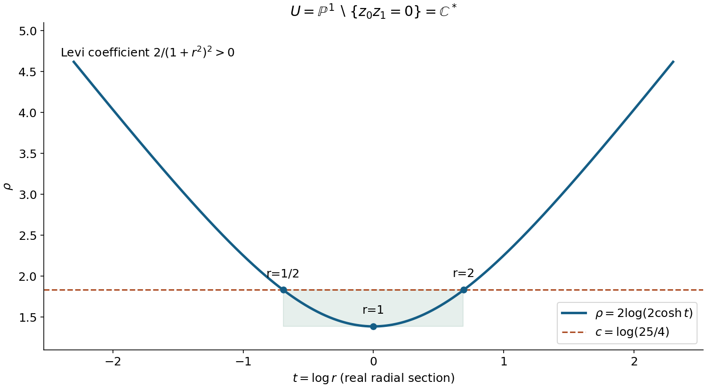
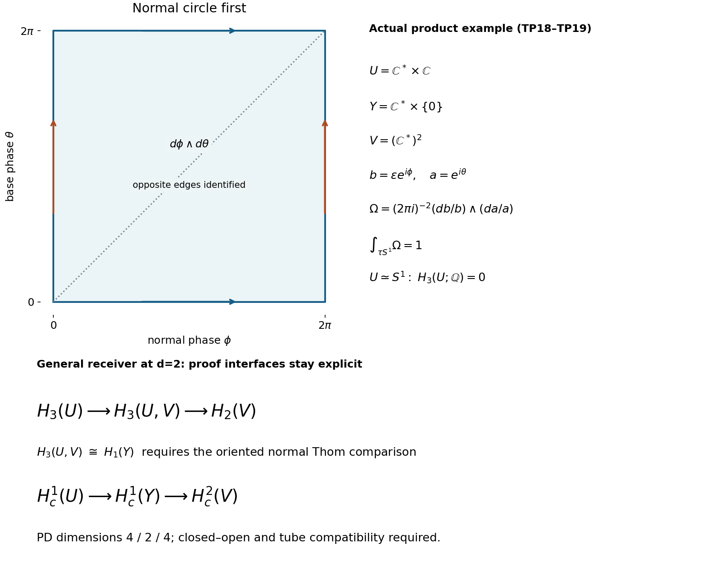

# Projective exhaustion and the finite-chain tube receiver

The formal argument below constructs an explicit proper strictly plurisubharmonic exhaustion of the complement of a homogeneous projective hypersurface. It computes the Levi form, proves the compactness of every sublevel, and traces the precise topological input that turns an exhaustion bound into normal-first homological tube injection. Read the three worked examples and all six complete solutions before following the source interfaces.

## A route through the proof

First follow TP2–TP6: homogeneity makes the exhaustion independent of the representative of a projective point, the normalized homogeneous polynomial controls its sublevels, and the Fubini–Study calculation makes the Levi form positive. Then separate the analytic index bound from the finite-chain conclusion. Ordinary finite-chain Morse handles and the exhaustion bound now supplies the latter geometric H argument at its written proper-Morse and smooth-manifold entries. Finally follow TP7–TP10 and the full product example: the oriented rank-two Thom comparison and the pair boundary identify the geometric homological tube, with the normal circle first.

The original conditional statements below are retained as historical source text. The Thom source is used at §§1–7; the selected manifold-duality source retains its complete §§1–3, with the inverse-flow Lemma3.1 and tubular Theorem3.2 at their actual hypotheses. The full SH03 source remains readable with its analytic regularity, smooth perturbation, Sard and later sheaf interfaces explicit.

## Coefficients and what the receiver supplies

The finite-chain H argument is available over an arbitrary associative unital coefficient ring. The oriented Thom and homological tube statements retain their own coefficient and orientation hypotheses. The original compact-support alternative is preserved in full. They do not identify a rational or integral connecting map merely by scalar extension, and do not supply rational spanning or form completeness.

Read the complete programme readings, exact source downloads and component terms, including the full original PSH alternative and its separately marked shell wording correction. The reproduction guide retains every original figure source and the exact corrected proof. The proof keeps affine/projective orientation, multiplicity, the reduced-zero exception, the C8 comparison and full component constancy as separate entries. The figures explain the radial section, degree ledger and actual product period; they do not prove those remaining general interfaces.

---

## Projective exhaustion and the finite-chain tube receiver

Written by GPT-6.1 Sol (OpenAI), Ultra, October 2026. This independently written exposition is public domain under CC0-1.0. Self-checked by the writing AI. The complete programme readings retain their own authors, terms and review notices. No source-book prose or media are reproduced.

This lesson proves useful parts of the general projective tube argument and identifies the exact remaining proofs. It gives an explicit strictly plurisubharmonic exhaustion of a projective hypersurface complement, proves the critical-point index bound, proves the finite-chain deduction from a specified handle input, and proves the tube deduction using actual included ordinary-chain Thom and noncompact tubular arguments. The handle input is not asserted to have been proved here. The worked product examples have direct complete tube proofs. The unconditional general tube theorem, rational-form completeness and full Petrowsky component theorem remain open in this candidate.

### TP1. The objects and the kind of homology

Let \(d\geq1\), let \(F\) be a nonzero homogeneous polynomial of degree \(m\geq1\) on \(\mathbb C^{d+1}\), and let \(L\) be a nonzero complex linear form. Define

\[
 U=\mathbb P^d(\mathbb C)\setminus\{F=0\},\qquad
 Y=\{L=0\}\cap U,\qquad V=U\setminus Y. \tag{TP1}
\]

The hypersurface of \(F\) may be singular or have repeated factors. Its complement \(U\) is nevertheless a smooth complex manifold of dimension \(d\). The hyperplane is smooth, so a nonempty \(Y\) is a closed smooth complex submanifold of \(U\) of dimension \(d-1\), with complex normal line bundle. If \(Y\) is empty its homology is zero and the tube receiver is vacuous. No transversality to the removed hypersurface is needed to make these statements.

We choose \(\mathbb Q\) as the coefficient field. This is an explicit course choice for the analytic receiver, not an assertion that the original source names that field. The proofs of TP2, TP5 and TP6 also apply over any field when their stated inputs hold. Unless explicitly marked reduced, \(H_j\) denotes **ordinary singular homology of finite chains**. Every chain is a finite sum of actual continuous singular simplices. Neither locally finite chains nor Borel–Moore homology are used. A noncompact space is allowed. All negative ordinary chain groups are zero.

The complex orientations of \(U\), \(V\) and \(Y\) are their underlying real orientations, of dimensions \(2d,2d,2d-2\). In a normal disc, the boundary circle is counterclockwise. Our tube convention places that **normal circle first**, followed by the base cycle. This order is fixed before comparing it to any affine C8 cycle.

### TP2. Finite-chain algebra, with no dimension assumption

For a field \(k\), a singular chain complex \(C_*\) has cochain complex \(C^q=\operatorname{Hom}_k(C_q,k)\), with \(\delta\varphi=\varphi\partial\). These are the full algebraic duals; a cochain has no compact-support condition.

**Lemma TP2a.** Evaluation induces a natural isomorphism

\[
 H^q(\operatorname{Hom}_k(C_*,k))\simeq
 \operatorname{Hom}_k(H_q(C_*),k). \tag{TP2}
\]

**Proof.** A closed cochain kills the boundary subspace \(B_q\), and hence induces a functional on \(Z_q/B_q\). Every functional on that quotient extends to \(C_q/B_q\) by extending a basis; its lift is a closed cochain. If a closed cochain kills \(Z_q\), define a functional on \(B_{q-1}\) by \(\partial c\mapsto\varphi(c)\). This is well defined because two such \(c\)'s differ by a cycle. Extend it to \(C_{q-1}\); its coboundary is \(\varphi\). This proves both directions and the isomorphism. Evaluation of the same cycle proves naturality. A nonzero homology class can be included in a basis and assigned value one by a functional, so the full dual detects it. No finite-dimensionality is required. \(\square\)

**Lemma TP2b.** For a pair \((X,A)\), let \(C_*(X,A)=C_*(X)/C_*(A)\). The relevant exact sequence is

\[
 H_{q+1}(X;k)\longrightarrow H_{q+1}(X,A;k)
 \xrightarrow{\partial_{X,A}}H_q(A;k)
 \longrightarrow H_q(X;k). \tag{TP3}
\]

**Proof.** A relative cycle is represented by a finite chain \(c\) in \(X\) with \(\partial c\) in \(A\). Send it to \([\partial c]\). Changing \(c\) by an \(A\)-chain changes this by an \(A\)-boundary; changing it by an \(X\)-boundary makes no change. If \([\partial c]=0\), choose a finite \(a\) in \(A\) with \(\partial a=\partial c\). Then \(c-a\) is an absolute cycle and represents the original relative class. Conversely an absolute cycle has zero connecting image. Finally an \(A\)-cycle maps to zero in \(X\) exactly when it is \(\partial c\) for a finite \(X\)-chain, which is exactly a connecting image. This proves the displayed exactness and fixes the sign of the connecting map. \(\square\)

**Lemma TP2c.** If \(X=\bigcup_{i\geq0}W_i\) is an increasing open union, then

\[
 \underset{i}{\operatorname{colim}}\,H_q(W_i;k)
 \simeq H_q(X;k). \tag{TP4}
\]

**Proof.** Each finite chain has compact image, because it has only finitely many compact simplex images. An increasing open cover contains this image in a single stage: choose a finite subcover and take the largest index. Thus every cycle occurs in a stage. If it bounds in \(X\), its finite bounding chain and the cycle occur together in a later stage. These two observations prove surjectivity and injectivity respectively. They also work for finite chains with integer coefficients. They do not apply to an infinite locally finite chain. \(\square\)

The complete proof of [smooth period detection](../reproduce/L124/context/providers/smooth-period-detection.html) independently supplies the subdivision, prism, smooth/continuous comparison and de Rham detection used in AN02. In particular it proves faithful \(\mathbb Q\)-to-\(\mathbb C\) extension for finite homology. TP2 is an independently written elementary extraction for the present receiver; it does not prove the provider's other conditional C8 inputs.

### TP3. An explicit projective exhaustion

For \(z\ne0\) with \(F(z)\ne0\), set

\[
 \rho([z])=\log\frac{\|z\|^{2m}}{|F(z)|^2}. \tag{TP5}
\]

**Theorem TP3.** This is a well-defined smooth, bounded-below, proper, strictly plurisubharmonic exhaustion of \(U\).

**Proof.** Replacing \(z\) by \(az\), with \(a\ne0\), multiplies both numerator and denominator by \(|a|^{2m}\), so the ratio is projectively invariant. Choose a chart in which one coordinate is one; write its remaining coordinates as \(w\in\mathbb C^d\), and write the polynomial in this chart as \(f(w)\). Then

\[
 \rho(w)=m\log(1+\|w\|^2)-\log|f(w)|^2. \tag{TP6}
\]

On each small neighborhood in \(U\), the nonvanishing holomorphic function \(f\) has a holomorphic logarithm. The second term is the real part of a holomorphic function and has zero Levi form. Differentiation of the first term gives, for \(\xi\in\mathbb C^d\),

\[
 \mathcal L_\rho(w)(\xi)
 =m\frac{(1+\|w\|^2)\|\xi\|^2
       -|\langle\xi,w\rangle|^2}{(1+\|w\|^2)^2}
 \geq\frac{m\|\xi\|^2}{(1+\|w\|^2)^2}>0
 \quad(\xi\ne0). \tag{TP7}
\]

The inequality follows from Cauchy–Schwarz. Thus strict positivity is checked in actual holomorphic charts, not merely on a real radial curve.

Define the globally continuous function
\(s([z])=|F(z)|/\|z\|^m\) on compact \(\mathbb P^d\). It is nonnegative, positive exactly on \(U\), and bounded above by some \(M>0\). Therefore \(\rho=-2\log s\geq-2\log M\). For a real number \(c\), the closed sublevel is the closed subset

\[
 \{\rho\leq c\}=\{s\geq e^{-c/2}\}\subset\mathbb P^d, \tag{TP8}
\]

which is compact and lies inside \(U\). This proves properness and exhaustion. Adding a constant makes \(\rho\) nonnegative if desired without changing its Levi form. The argument applies to singular or nonreduced removed hypersurfaces because no differentiation occurs at their zeros. \(\square\)

This directly supplies the **exhaustion-definition** of Stein used by the new [plurisubharmonic lesson](../reproduce/L124/context/providers/plurisubharmonic-functions-and-stein-manifolds.html). We do not use the equivalence with another definition of Stein. We also do not infer homology vanishing from this definition alone. The same exhaustion restricts properly and strictly plurisubharmonically to \(Y\), since it is closed in \(U\) and its inclusion is a holomorphic immersion. The vanishing needed below is the one on \(U\), in complex dimension \(d\).

*Figure 1.* The actual specialization is \(d=1\), \(F(z_0,z_1)=z_0z_1\), \(m=2\), \(U=\mathbb C^*\). In the chart \(w=z_1/z_0\), with \(r=|w|>0\) and \(t=\log r\), the exhaustion is \(\rho=2\log(2\cosh t)\). The marked level \(\log(25/4)\) has the exact sublevel annulus \(1/2\leq r\leq2\); the minimum is \(\log4\) at \(r=1\). This is a real radial section of the exhaustion, not the whole complex manifold. Strict positivity follows from the actual one-variable Levi coefficient \(2/(1+r^2)^2\), not from the appearance of the plot. The two ends correspond to the removed projective points. Formulae TP5–TP8 give the full geometric argument. Portable renderer and exact geometry are included.

### TP4. The complete local index argument

**Lemma TP4.** At a nondegenerate critical point of a smooth strictly plurisubharmonic function on a complex \(d\)-manifold, the real Morse index is at most \(d\).

**Proof.** In holomorphic coordinates let \(B\) be the real Hessian at the critical point and let \(J\) be multiplication by \(i\) on the real tangent space. At a critical point the Hessian is coordinate-independent. Directly expanding \(\partial/\partial z_j=(\partial_{x_j}-i\partial_{y_j})/2\) gives

\[
 B(v,v)+B(Jv,Jv)=4\mathcal L_\rho(v)>0\qquad(v\ne0). \tag{TP9}
\]

Let \(W\) be the negative eigenspace of \(B\), of real dimension \(q\). If \(q>d\), then
\(\dim(W\cap JW)\geq2q-2d>0\). Choose \(0\ne v\in W\cap JW\). Both \(v\) and \(Jv\) belong to \(W\): write \(v=Jw\) with \(w\in W\), and use \(Jv=-w\). Both Hessian terms are strictly negative, contradicting TP9. Hence \(q\leq d\). \(\square\)

Strict positivity does not guarantee nondegeneracy. For example

\[
 \psi(z)=\sum_{j=1}^d|z_j|^2+\operatorname{Re}\sum_{j=1}^d a_jz_j^2
 =\sum_j(1+a_j)x_j^2+(1-a_j)y_j^2 \tag{TP10}
\]

has Levi matrix the identity. If each real \(a_j>1\), its real Hessian has exactly \(d\) negative eigenvalues, so the bound is sharp. If one \(a_j=1\), the corresponding eigenvalue is zero. This is a local Hessian example; when all \(a_j>1\), it is unbounded below and is not a proper exhaustion.

The current [SH03 Morse exhaustion proof](../reproduce/L124/context/providers/holomorphic-morse-exhaustions-on-stein-manifolds.html) supplies a compactly supported, summably small perturbation family, a finite-parameter transversality/Sard reduction and a Baire argument for a proper strictly plurisubharmonic Morse exhaustion, relative to its stated smooth-coordinate, cutoff, Sard and related lower inputs. Its index calculation agrees with TP9. Its later sheaf support calculations are not an ordinary singular-chain handle attachment theorem. We use this distinction when stating the next input.

### TP5. What a finite-chain handle proof would give

**Declared handle input H.** There are increasing open sublevels \(W_0\subset W_1\subset\cdots\) exhausting \(U\), with \(W_0=\varnothing\), such that each pair \((W_i,W_{i-1})\) has relative ordinary homology a finite direct sum of copies of \(k\), in degrees equal to the indices of the finitely many critical points crossed at that step. Those indices are at most \(d\). Equivalently for the deduction, it suffices that
\(H_j(W_i,W_{i-1};k)=0\) for every \(j>d\).

For a proper Morse function, the geometric handle theorem is the intended proof of H: regular slabs are deformed by a normalized gradient flow, and each isolated critical level changes the space by a handle whose core is a disc of the Morse index. A full proof must justify the flow on compact slabs, the local deformation pair, the simultaneous finite critical points and the passage to open sublevels. **That full theorem is not included in the checked incoming modules and is not silently assumed proved.** A nondegenerate Hessian, or a statement that the space has a CW model, is not a replacement for this proof.

**Theorem TP5, relative to H.** Ordinary finite-chain homology satisfies

\[
 H_j(U;k)=0\quad(j>d),\qquad H_{d+1}(U;k)=0. \tag{TP11}
\]

**Proof.** Fix \(j>d\). Initially \(H_j(W_0;k)=0\). Suppose \(H_j(W_{i-1};k)=0\). Exactness for the pair gives
\(H_j(W_{i-1};k)\to H_j(W_i;k)\to H_j(W_i,W_{i-1};k)\).
Both outer groups are zero, the second by H, so \(H_j(W_i;k)=0\). Induction proves stage vanishing. Every finite cycle and every finite bounding chain lies in a stage by TP2c. Hence the direct limit of these zero groups is the ordinary group of \(U\), and TP11 follows. There is no cohomological inverse-limit argument and no finite-dimensionality requirement in this deduction. \(\square\)

There is also an existing current SH03 *sheaf cohomology* route: its microlocal Stein theorem proves ordinary and compact-support vanishing with the actual restriction, extension and limit maps. It retains bounded derived/microsupport, proper-base-change and other lower proofs. To turn that theorem into the ordinary singular homology assertion TP11 one must identify the correctly shifted constant sheaf and prove the sheaf/singular comparison. Neither its title nor coherent-sheaf vanishing proves those steps. The elementary finite-chain route above avoids those additional derived inputs, while leaving H explicit.

The exact alternative deduction can be stated conditionally. Suppose the SH03 theorem and its constant-sheaf/type and sheaf/singular comparisons have actually been justified for this \(U\). Put \(\mathcal F=\mathbb Q_U[d]\). The normalized zero-section formula in that theorem gives \(T_p(\mathcal F)=\mathbb Q[d]\), whose only cohomology is in degree \(-d\). It therefore satisfies the upper cut \(H^j(T_p(\mathcal F))=0\) for \(j>-d\). The theorem gives \(H^q(U;\mathcal F)=0\) for \(q>0\), hence \(H^r(U;\mathbb Q_U)=0\) for \(r>d\), because \(H^q(U;\mathbb Q_U[d])=H^{q+d}(U;\mathbb Q_U)\). The assumed comparison identifies these with ordinary singular cohomology. TP2a then forces \(H_r(U;\mathbb Q)=0\) for \(r>d\): a nonzero class would admit a nonzero detecting functional, contradicting the zero cohomology group. No finite-dimensionality is used. The field \(\mathbb Q\) has global dimension zero, so the source's coefficient-ring condition is met. This is a full conditional deduction with the correct shift; it does not discharge the source's lower sheaf or comparison inputs. It also does not confuse coherent \(\mathcal O_U\)-cohomology with constant-sheaf cohomology.

### TP6. The included normal-bundle argument and the tube deduction

The current complete [Thom/Euler lesson](../reproduce/L124/context/providers/thom-classes-and-euler-classes.html), Sections1–7, supplies singular excision, products, cap and coefficient calculations, finite-cover gluing and the ordinary finite-chain passage to arbitrary Hausdorff bases. Its Theorem7.1 proves the homological Thom isomorphism. The exact included [duality and tubular sections](../reproduce/L124/context/providers/manifold-duality-and-tubular-sections.html), Section3, supply the inverse/flow and noncompact tubular-neighborhood construction. These are actual full written arguments for the selected assertions, not shelf hits or assumed independent admissions.

**Normal-bundle argument T, with its written providers.** For the closed complex hypersurface \(Y\subset U\) and \(V=U\setminus Y\), these arguments give an ordinary finite-chain Thom isomorphism

\[
 \Theta:H_{d-1}(Y;k)\xrightarrow{\ \sim\ }H_{d+1}(U,V;k), \tag{TP12}
\]

formed using the complex orientation of the real rank-two normal bundle, with **normal disc first**. Here is the specialization and the precise meaning of the tube.

**Proof of T relative to the included written arguments.** A smooth metric gives an orthogonal representative of the quotient normal bundle \(\nu\); its complex orientation is the orientation of the quotient complex line, independent of that representative. A change of complex frame has positive real determinant \(|a|^2\). Smooth metrics and the needed cutoffs can be formed by a smooth locally finite chart partition, using the explicit projective cover/partition construction in CD034; taking a weighted sum of chart metrics is positive at each point. Thus no bundle classification is needed for this specialization.

The included tubular Theorem3.2 constructs an open neighborhood \(N\) of \(Y\) diffeomorphic to the whole \(\nu\), fixing the zero section, including variable radii for a noncompact base. Since \(Y\) is closed, \(N\) and \(V\) cover \(U\). The proved small-chain excision argument therefore identifies \(H_*(U,V;k)\) with \(H_*(\nu,\nu\setminus Y;k)\). Although the tubular source displays its final comparison as cohomology, the same small-chain equivalence supplies homology, by its included chain/excision proof.

The oriented rank-two Thom theorem supplies an integral fibre generator and a cap isomorphism \(H_{j+2}(\nu,\nu\setminus Y;\mathbb Z)\to H_j(Y;\mathbb Z)\). Its finite-cover proof also works directly over the field \(k=\mathbb Q\): use the image of the integral cocycle, the same product chain equivalence, the same commuting boundary diagrams and the same finite-chain direct limits. No integral inverse limit or finite-dimensionality is inserted. Inverting this homological cap map and then applying excision gives TP12 at \(j=d-1\).

In a product trivialization the inverse is the oriented base chain crossed with a positive normal disc. The source's right-cap convention puts the fibre last; placing the real two-disc first changes orientation by \((-1)^{2j}=1\), so these descriptions agree. For a nontrivial bundle this statement is an assertion about restrictions of the global homology isomorphism, not a claim that a single global product chart exists. Its finite-cover chain gluing and compact projected-support argument supply the global map. Define the geometric homological normal tube by the relative boundary of this oriented disc transfer. Locally it is the positive boundary circle before the base cycle, as checked below. Identifying a separately given affine C8 representative with this homological tube remains an additional obligation. This proves the normal homological construction needed here relative to the actually included written providers. \(\square\)

**Theorem TP6, relative to H and the included normal-bundle arguments.** With the conventions above, the normal-circle-first tube

\[
 \tau=\partial_{U,V}\Theta:
 H_{d-1}(Y;k)\longrightarrow H_d(V;k) \tag{TP13}
\]

is injective.

**Proof.** The exact segment from TP3 is

\[
 H_{d+1}(U;k)\longrightarrow H_{d+1}(U,V;k)
 \xrightarrow{\partial_{U,V}}H_d(V;k). \tag{TP14}
\]

TP5 makes the first group zero. Exactness therefore makes \(\partial_{U,V}\) injective. Composing it with the isomorphism TP12 proves the assertion.

The local sign is also fixed, rather than inferred from the degrees. In a trivializing chart and for a base cycle \(b\), the oriented product representative has boundary
\(\partial(D^2\times b)=S^1\times b+(-1)^2D^2\times\partial b\).
The second term vanishes. Thus the relative boundary is the positive normal circle **before** the base cycle, with coefficient one. Moving the circle after a \((d-1)\)-cycle instead contributes \((-1)^{d-1}\). The global map is supplied by the preceding Thom/excision construction; arbitrary cycles need not lie in one trivialization. \(\square\)

The handle hypothesis H is still explicit. The normal-bundle construction now has actual complete written provider arguments, with the elementary specialization above. A shelf URL would not have supplied them.

### TP7. The compact-support degree ledger

The new duality modules define

\[
 H_c^a(M;k)=\underset{K\subset M\text{ compact}}{\operatorname{colim}}
 H^a(M,M\setminus K;k),\qquad
 D_M:H_c^a(M;k)\longrightarrow H_{N-a}(M;k) \tag{TP15}
\]

by cap product with oriented local fundamental classes, for a real \(N\)-manifold. This is a map to ordinary finite-chain homology, not the algebraic dual of that homology. Full ordinary cochains in TP2 have no compact-support restriction. Neither of those two groups can be substituted for the other.

The compact-support route to TP13 needs the **closed–open** sequence for the closed inclusion \(Y\subset U\), followed by the identification of its connecting map with the correctly oriented tube under duality. Its required segment and indices are

\[
 H_c^{d-1}(U;k)\longrightarrow H_c^{d-1}(Y;k)
 \xrightarrow{\delta}H_c^d(V;k), \tag{TP16}
\]

\[
 \begin{array}{c|c|c}
 \text{space}&\text{real dimension}&\text{dual ordinary group}\\\hline
 U&2d&H_{2d-(d-1)}(U;k)=H_{d+1}(U;k)\\
 Y&2d-2&H_{(2d-2)-(d-1)}(Y;k)=H_{d-1}(Y;k)\\
 V&2d&H_{2d-d}(V;k)=H_d(V;k).
 \end{array} \tag{TP17}
\]

If duality and the exact closed–open/tube comparison have been proved, TP11 kills the first group of TP16, so exactness makes \(\delta\) injective; the other two duality isomorphisms identify the result with the tube injection, up to the explicitly checked sign. This explains the classical degree ledger. It does not add proofs of the comparison.

Read the complete incoming [orientation](../reproduce/L124/context/providers/orientations-and-fundamental-classes.html), [cap-product and compact-support](../reproduce/L124/context/providers/cap-products-and-cohomology-with-compact-supports.html), and [Poincaré duality](../reproduce/L124/context/providers/poincare-duality.html) texts. They supply actual arguments for local classes, open Mayer–Vietoris, direct limits and local-to-global duality. Their cap-product Proposition 3.2 explicitly leaves the full connecting-map calculation to Hatcher's Lemma 3.36. The duality proof then uses that proposition. The actually included current [DGCHAR duality sections](../reproduce/L124/context/providers/manifold-duality-and-tubular-sections.html), Lemma2.1, provide a separate complete written connecting-map calculation with their unshifted **right-cap** convention, and Theorem2.2 gives the local-to-global proof in that convention. These arguments can use the incoming orientation classes, whose construction is independent of the cap convention. The original source expressions and both conventions remain visible.

The ordinary-pair route TP14 and the compact-support route TP16 are two correctly typed alternatives. Supplying H and checking the included written T scope closes the first. Supplying and checking duality, the still-separate closed–open comparison with the tube, and the homology bound closes the second. Mixing the first route's ordinary pair sequence with the second route's compact-support groups without comparison would leave an unproved step.

### TP8. Three complete worked examples

#### Example 1: the projective point and the affine two-point equator differ

Let \(d=1\), \(F=z_0^m\), \(m\geq1\), and \(L=z_1\). Then \(U=\{z_0\ne0\}\simeq\mathbb C\), \(Y=\{w=0\}\) is one point, and \(V=\mathbb C^*\), where \(w=z_1/z_0\). Radial contraction makes \(U\) contractible, and radial retraction \(w\mapsto w/|w|\) identifies \(V\) with its positive unit circle up to homotopy. A loop traversing this circle once is a generator of \(H_1(V;\mathbb Q)\): splitting it between two contractible open arcs gives, under the finite-chain Mayer–Vietoris boundary, the difference of one point in each overlap component, with coefficient one. The two-arc calculation gives \(H_1(S^1;\mathbb Q)=\mathbb Q\). Therefore the tube sends the positive generator of **ordinary** \(H_0(Y;\mathbb Q)=\mathbb Q\) to the positive circle generator and is injective without H or T as external assumptions in this example.

By contrast the affine real equator at total dimension \(n=2\) is an oriented \(S^0\), represented by a difference of two points with total coefficient zero. It belongs to reduced degree-zero homology. The projective positive point is not that reduced class. This example establishes no general affine/projective scalar or multiplicity comparison.

#### Example 2: a complete product tube with its period

Let \(d=2\), \(F=z_0z_1\), and \(L=z_2\). Every point of \(U\) has \(z_0\ne0\), so in coordinates \(a=z_1/z_0\), \(b=z_2/z_0\),

\[
 U=\mathbb C^*\times\mathbb C,\quad
 Y=\mathbb C^*\times\{0\},\quad
 V=(\mathbb C^*)^2. \tag{TP18}
\]

The base circle is \(a=e^{i\theta}\). Its tube is the torus \(b=\epsilon e^{i\phi}\), \(a=e^{i\theta}\), oriented by \(d\phi\wedge d\theta\), with \(\epsilon>0\). The globally defined closed two-form

\[
 \Omega=\frac{1}{(2\pi i)^2}\frac{db}{b}\wedge\frac{da}{a} \tag{TP19}
\]

has period
\(\int_{S^1_\phi\times S^1_\theta}\Omega=(2\pi)^{-2}\int_0^{2\pi}\int_0^{2\pi}d\phi\,d\theta=1\).
The torus is represented by the two oriented triangles of a parameter square, with opposite sides identified; their diagonal cancels and so do opposite boundary edges. It is a finite smooth cycle. If a nonzero rational multiple of its class bounded a finite continuous chain, the smooth/continuous comparison in the period-detection provider would make it bound a finite smooth chain, and Stokes would force its nonzero period to be zero. This is impossible.

The base \(Y\) retracts to a circle, whose first group is generated by the once traversed circle as in Example 1. Thus this nonzero period proves injection of the entire map \(H_1(Y;\mathbb Q)\to H_2(V;\mathbb Q)\), not just nonvanishing of an unspecified tube. There is a global product normal coordinate \(b\) in this example; no global trivialization of the general normal bundle has been inferred.

*Figure 2.* The phase square parametrizes the torus in TP18–TP19; horizontal \(\phi\) is the positive **normal** phase and vertical \(\theta\) the base phase. Opposite edges are identified and \(d\phi\wedge d\theta\) gives period one. This is a parameter diagram, not an embedding of the whole torus into a square. The lower rows display TP14 and TP16 for \(d=2\). Here \(U\) retracts to a circle, so \(H_3(U;\mathbb Q)=0\); the top row's relative Thom comparison and the bottom row's duality/closed–open comparison are labelled as required interfaces in the general argument. Example 2 proves its actual product tube directly by the displayed period. No schematic arrow is presented as a general proof. Exact geometry and renderer are included.

#### Example 3: why positive polynomial degree is essential

If \(m=0\) and \(F=1\), then \(U=\mathbb P^d\), and TP5 becomes a constant. It has no positive Levi form and does not prove the desired vanishing. For \(d=1\), let \(Y\) be a projective point. Then \(V=\mathbb P^1\setminus Y\simeq\mathbb C\), so \(H_1(V;\mathbb Q)=0\), whereas \(H_0(Y;\mathbb Q)=\mathbb Q\). Its small positive normal circle contracts in \(V\), and the tube map is not injective. The theorem cannot be extended to \(m=0\) by silently treating a compact projective manifold as a Stein complement.

### TP9. Exercises with complete solutions

#### 1. The three dimension indices

*Difficulty: introductory.* Set \(n=5\), so \(d=4\). Determine the compact-support degrees in TP16 and the three ordinary homology degrees after duality.

**Solution.** The compact groups are \(H_c^3(U)\), \(H_c^3(Y)\), \(H_c^4(V)\). The real dimensions are \(8,6,8\), so the ordinary groups are respectively \(H_5(U)\), \(H_3(Y)\), \(H_4(V)\). The vanishing needed is \(H_5(U)=0\), above the complex dimension four. Replacing the first group by ordinary \(H^3(U)\) would change the proof.

#### 2. Compute the exact radial sublevel

*Difficulty: intermediate.* For Figure 1, solve \(\rho\leq\log(25/4)\) and compute the Levi coefficient at \(r=1/2,1,2\).

**Solution.** With \(F=z_0z_1\), the inequality is \((1+r^2)^2/r^2\leq25/4\). Taking positive square roots gives \(r+r^{-1}\leq5/2\), or \((r-1/2)(r-2)\leq0\). Thus \(1/2\leq r\leq2\). The Levi coefficient is \(2/(1+r^2)^2\), taking the exact values \(32/25,1/2,2/25\). Each is positive. The endpoint divergence follows from \(r+r^{-1}\to\infty\) as \(r\to0\) or \(r\to\infty\).

#### 3. Strict positivity, degeneracy and sharp index

*Difficulty: intermediate.* In TP10 take \(d=2\), first \((a_1,a_2)=(2,3)\) and then \((1,3)\). Find the Hessian eigenvalues and explain the role of the genericity input.

**Solution.** The eigenvalues are \(2(1+a_j)\), \(2(1-a_j)\). For \((2,3)\), they are \(6,-2,8,-4\): there are exactly two negative directions, attaining \(q=d\). For \((1,3)\), they are \(4,0,8,-4\), so the critical point is degenerate. The Levi matrix remains the identity in both cases. A strictly positive Levi form gives the index bound at a nondegenerate critical point but does not produce a Morse function; the perturbation argument has a separate obligation.

#### 4. Why finite chains select one stage

*Difficulty: intermediate.* Prove injectivity in TP4 directly for a cycle in one stage, and explain why a locally finite sum does not obey the same argument.

**Solution.** If the cycle \(z\) bounds in \(X\), choose its finite bounding chain \(c\). The union of images of \(z\) and \(c\) is compact. An increasing open cover has a finite subcover of this compact set, hence a largest covering stage \(W_j\). Then \(\partial c=z\) already in that stage, proving that the direct-limit class was zero. An infinite locally finite chain can have noncompact image; for example a sum of separated simplices escaping every compact set need not be contained in any \(W_j\). Thus the proof is specifically about ordinary finite chains.

#### 5. Reverse the product order

*Difficulty: intermediate.* In Example 2 interchange the base and normal circle order. Calculate both the orientation sign and the period of TP19.

**Solution.** Both circles have dimension one, so the interchange has sign \((-1)^{1\cdot1}=-1\). With base-first orientation \(d\theta\wedge d\phi\), the form \((2\pi)^{-2}d\phi\wedge d\theta\) has period \(-1\). The class is still nonzero and the example's map still injective, but its equality with the normal-first map has acquired a minus sign. In general the interchange sign is \((-1)^{d-1}\). Neither sign determines an additional affine/projective covering multiplicity.

#### 6. What does a vanished complex period prove?

*Difficulty: advanced.* A rational class \(\beta\in H_{d-1}(Y;\mathbb Q)\) has zero periods of a specified collection of rational \(d\)-forms on its tube. Which additional assertions are needed before concluding \(\beta=0\), and what does this say about an integral torsion class?

**Solution.** First the forms must span the full ordinary smooth complex de Rham cohomology in degree \(d\) on \(V\); otherwise other smooth periods might remain nonzero. Then the smooth-period theorem makes the tube zero over \(\mathbb C\). Faithful extension from \(\mathbb Q\) makes the rational tube zero. A proved tube injection, such as TP6 **after H is supplied and the included normal-bundle scope is checked**, then gives \(\beta=0\). General rational-form spanning and H are not proved here. An integral torsion class can map to zero over \(\mathbb Q\) while remaining nonzero integrally. The independently proved wave-cycle order-two obstruction is precisely such information; vanished complex periods do not contradict it or imply integral null homology.

### TP10. Credits, complete readings and remaining scope

The full supporting readings are actual included files, not promised bridge titles. Claude Opus 5.5 (Anthropic) wrote the three duality lessons and the plurisubharmonic lesson, with self-check notices and CC0 terms. Their human-source credits to Hatcher, Fomberg, Miller, Roberts, Demailly and Lebl are retained verbatim in their source downloads and readers. A citation's source license is not replaced by the CC0 terms of the independently written programme prose. No external human text was extracted or imported for this task. The current SH03 Morse lesson is written by GPT-6.1 Sol (OpenAI), Ultra, and retains its own CC0 notice, human source credit and unclosed lower inputs. The CD034 proof likewise retains its classical de Rham and Hatcher credits.

Hatcher's small-chain/prism and orientation/cap methods, and the elementary Levi geometry taught by Demailly and Lebl, receive method credit. Our explicit projective formula and new explanations are independently written. Exact original-source proofs were not compared in this task, so no source error or exact original-lemma match is claimed.

The DGCHAR Thom lesson and complete selected duality/tubular Sections 1–3 are independently written by GPT-6.1 Sol (OpenAI), Ultra. Their complete mathematical proof, formula and exercise bodies, original CC0 authorship headers and valid Hatcher/Roberts credits are preserved. The current source-credit and scope paragraphs are revised: they cite the verified Spring 1957 Milnor manuscript, notes by James Stasheff, as related background and give the actual selected-section proof locators. The unrelated diagonal/Wu sections are outside the selected download.

The usable new material consists of TP2's finite-chain algebra, TP3's projective exhaustion, TP4's index lemma, TP5's full deduction from H, TP6's specialization of the actual written Thom/tubular arguments and conditional injection from H, the dimension ledger, and the three direct worked examples. The exact remaining general proof interfaces are:

1. A full ordinary finite-chain Morse handle argument H, including regular flows, the local handle pair and the countable exhaustion; the current Morse provider gives useful geometry but not that full chain theorem.
2. The alternative compact-support route still needs its closed–open/tube comparison, rather than a different open Mayer–Vietoris sequence. The ordinary-pair route now includes actual written Thom, noncompact tubular, chain/excision and normal-first arguments, with their precise provider and author-check status. The separate affine C8 geometric cycle identification is item4.
3. Full general rational-form completeness, retaining resolution/local reduction, coherent-sheaf and algebraic/analytic comparison hypotheses. Vanishing for a coherent sheaf alone is not the finite singular homology theorem.
4. The actual affine/projective identification, orientation, source coefficient qualification and multiplicity for the canonical C8 cycle, including the reduced \(n=2\) exception; D7/C7/C6/C8's other declared inputs and full component constancy remain separate.
