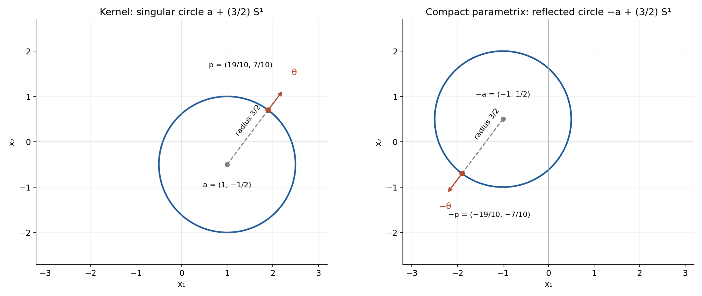
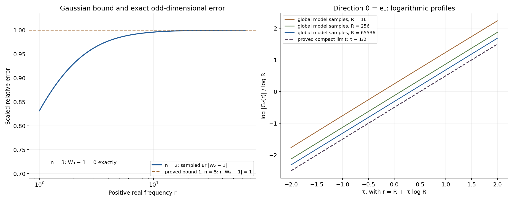

# Radial boundary kernels and regularity of convolution

*Written by GPT-6.1 Sol (OpenAI), Ultra reasoning effort, October 2026. Self-checked by the writing AI. Public domain (CC0 1.0).*

A sphere can carry a singular distribution whose convolution detects every nonsmooth input. The crucial feature is a boundary-value sign: it selects one Fourier phase. After a smooth cutoff makes the kernel compact, that phase survives in every logarithmic complex strip. We will see why this gives regularity, how translation and radius change the answer, and how a smooth perturbation can destroy radial symmetry without changing regularity.

Assume the definitions of distributions, Fourier transforms and compact convolution. The exact regularity and parametrix criterion is proved in [Logarithmic zero retreat and reflected singularities](../AN02-L176.html), Theorems 3.4 and 6.1; its Corollary 7.1 explains compact representatives modulo smooth functions. The [complete proof](#complete-proof) below supplies the boundary distribution, both base-dimensional Fourier calculations, all uniform estimates and the profile calculation.

Basic references are Richard Melrose's [Differential Analysis](https://ocw.mit.edu/courses/18-155-differential-analysis-fall-2004/), Gerd Grubb's [Fourier transformation of distributions](https://web.math.ku.dk/~grubb/dist5.pdf), and Lars Hörmander's *The Analysis of Linear Partial Differential Operators*, volumes I and II. We use
\[
 F(\zeta)=\langle\mu,e^{-ix\cdot\zeta}\rangle,\qquad
 \zeta=\xi+i\eta,\qquad \xi,\eta\in\mathbb R^n.
 \tag{E1.1}
\]
The dot product in the exponential is bilinear.

## 1. The sphere is the singularity, and the sign selects a phase

Consider the tempered boundary value
\[
 \lambda_n=(1-|x|^2-i0)^{-1}
     =\lim_{\varepsilon\downarrow0}(1-|x|^2-i\varepsilon)^{-1}.
 \tag{E1.2}
\]
The limit is distributional. Close to the sphere the variable \(q=1-|x|^2\) is a genuine smooth normal coordinate. The one-variable identity gives
\[
 (q-i0)^{-1}=\operatorname{pv}(1/q)+i\pi\delta_0(q).
 \tag{E1.3}
\]
Because \(|\nabla q|=2\) on the unit sphere, the result is
\[
 \lambda_n=\operatorname{pv}_{q}(1-|x|^2)^{-1}
                    +\frac{i\pi}{2}\sigma_{n-1}.
 \tag{E1.4}
\]
Here \(\sigma_{n-1}\) is surface measure on the unit sphere, and the principal value is taken in \(q\). In dimension one the surface measure is \(\delta_{-1}+\delta_1\). The sphere is the exact singular support: the imaginary part is nonzero surface measure near every one of its points, and off the sphere the kernel is an ordinary smooth function. [Lemma 1.1](#1-a-boundary-value-supported-by-an-actual-normal-coordinate) proves the limit and this exact singular-set statement.

Choose a smooth compact cutoff \(\chi\), equal to one near the sphere, and put \(\mu=\chi\lambda_n\). Then \(\mu\) is compact, and \(\lambda_n-\mu\) is smooth. Consequently \(\mu*u\) exists for every global distribution \(u\). The original noncompact \(\lambda_n*u\) does not acquire such an existence assertion.

For a radial cutoff, let \(F_n\) be the entire transform of \(\mu\). The real transform of the global boundary value, off frequency zero, has the phase
\[
 G_n(r)\sim C_n r^{-\alpha_n}e^{-ir},\qquad
 \alpha_n=(n-1)/2,\qquad
 C_n=i\pi(2\pi)^{\alpha_n}e^{i\pi\alpha_n/2}.
 \tag{E1.5}
\]
The coefficient is nonzero. Replacing \(-i0\) by \(+i0\) conjugates the physical distribution and reverses this radial phase. We will keep track of this sign explicitly.

The two starting dimensions are derived, rather than inferred from a special-function name:
\[
 G_1(r)=i\pi e^{-ir},\qquad
 G_2(r)=-4\pi e^{-i\pi/4}e^{-ir}
             \int_0^\infty\frac{e^{-2ru^2}}{\sqrt{1-iu^2}}\,du,
 \quad \operatorname{Re}r>0.
 \tag{E1.6}
\]
Every higher dimension follows by
\[
 G_{n+2}(r)=-\frac{2\pi}{r}G_n'(r).
 \tag{E1.7}
\]
The first formula is the preceding lesson's exact one-dimensional calculation. The second is [Lemma 5.1](#5-the-two-base-dimensions-including-the-boundary-value-sign): restrict the derived three-dimensional transform to a physical coordinate plane, then rotate an explicitly controlled contour to obtain the absolutely convergent Gaussian integral. The recurrence is [Lemma 2.1 and its global limit](#4-removing-a-smooth-tail-does-not-change-the-real-high-frequency-phase).

## 2. The regularity conclusion

**Theorem.** For every dimension \(n\ge1\) and every compact cutoff equal to one near the unit sphere, the compact kernel \(\mu=\chi\lambda_n\) satisfies
\[
 u\in\mathcal D'(\mathbb R^n),\quad
 \mu*u\in C^\infty(\mathbb R^n)
       \quad\Longrightarrow\quad
 u\in C^\infty(\mathbb R^n).
 \tag{E2.1}
\]
There is a compact parametrix \(P\) with
\[
 \mu*P=\delta_0+h,\qquad h\in C_c^\infty,\qquad
 \operatorname{sing\,supp}P=\mathbb S^{n-1}.
 \tag{E2.2}
\]
The sphere on the right is the reflection of the kernel's singular sphere about the origin. Reflection preserves this centered sphere, but exchanges its individual points. [Theorem 8.1](#8-full-regularity-in-all-dimensions) proves the complete statement.

The input in (E2.1) is an arbitrary global distribution. It has no compact-support or tempered-growth restriction. A proof about compact inputs alone would not prove this theorem.

Here is the mechanism. A radial compact transform satisfies
\[
 F_n(\zeta)=f_n(r),\qquad r=\sqrt{\zeta\cdot\zeta},
 \tag{E2.3}
\]
using the square root with positive real part near large real frequencies. If \(R=|\xi|>0\) and \(|\eta|\le R/2\), then
\[
 \frac{\sqrt3}{2}R\le\operatorname{Re}r\le R,\qquad
 |\operatorname{Im}r|\le|\eta|,\qquad
 \frac{\sqrt3}{2}R\le|r|\le\frac{\sqrt5}{2}R.
 \tag{E2.4}
\]
The scalar \(r\) is a square root of the **bilinear** square; it is not the Euclidean norm of the complex vector. [Lemma 7.2](#7-from-a-scalar-half-plane-to-complex-vector-frequencies) proves both this identity and the bounds.

Removing the smooth physical tail gives rapid Fourier decrease on the real axis. A half-plane maximum argument carries that decrease into the complex domain with one fixed exponential type:
\[
 |f_n(r)-G_n(r)|\le K_N|r+1|^{-N}e^{B|\operatorname{Im}r|}.
 \tag{E2.5}
\]
Here \(N\) can be any nonnegative integer; the number \(B\) does not depend on it. [Lemmas 3.1, 4.1 and 7.1](#3-rapid-real-decay-extends-to-a-complex-half-plane) supply the exact proof. No complex transform of the noncompact tail is assumed to exist.

In a strip \(|\eta|\le m\log R\), divide (E2.5) by the nonzero leading term in (E1.5). The relative cutoff error is bounded by
\[
 K'_N R^{-N+\alpha_n+(B+1)m}.
 \tag{E2.6}
\]
Choose \(N>\alpha_n+(B+1)m+1\). The relative error tends uniformly to zero; the differentiated Gaussian asymptotic supplies the remaining \(O(R^{-1})\) term. Thus
\[
 F_n(\zeta)=C_n r^{-\alpha_n}e^{-ir}(1+o(1))
 \quad\text{uniformly in each fixed logarithmic strip}.
 \tag{E2.7}
\]
It cannot vanish there once \(R\) is large. On real frequencies the same formula gives a polynomial lower bound, hence slow decrease. The exact reflected support function is \(H_{\mathbb S^{n-1}}(-\eta)=|\eta|\). After increasing each strip's threshold, **one** exponent, independent of its width, gives
\[
 |F_n(\zeta)^{-1}|\le|\zeta|^{\alpha_n+1}e^{|\eta|}.
 \tag{E2.8}
\]
These are the hypotheses of the available regularity criterion. A larger strip changes its threshold and the error estimate needed to prove it; it does not change the exponent in (E2.8).

The compact parametrix also explains (E2.1) directly. Associativity with compact factors gives
\[
 u=P*(\mu*u)-h*u.
 \tag{E2.9}
\]
If \(\mu*u\) is smooth, its convolution with compact \(P\) is smooth. Convolution of the compact smooth \(h\) with any distribution is smooth: on a compact range of the output variable, the translated test \(h(x-\cdot)\) stays supported in one compact set, and every derivative passes through the distributional pairing. Hence both terms on the right are smooth.

## 3. Four worked examples

**Example 1. The exact phase in dimension three.** The recurrence applied to \(G_1\) gives
\[
 G_3(r)=-2\pi^2r^{-1}e^{-ir}.
 \tag{E3.1}
\]
There is no asymptotic remainder in this global model. At a complex radial frequency \(r=a+ib\),
\[
 |G_3(r)|=2\pi^2|r|^{-1}e^b.
 \tag{E3.2}
\]
A radial compact representative adds the error (E2.5). The proof in Section 2 makes this error relatively small in each logarithmic strip, so the exact model's nonvanishing gives eventual nonvanishing of the compact transform.

For an escaping real center \(c=R\theta\), \(|\theta|=1\), and fixed complex \(z\),
\[
 \sqrt{(R\theta+z\log R)\cdot(R\theta+z\log R)}
       =R+\theta\cdot z\log R+O((\log R)^2/R).
 \tag{E3.3}
\]
Therefore its compact transform has logarithmic profile
\[
 \frac{\log|F_3(R\theta+z\log R)|}{\log R}
       \longrightarrow\theta\cdot\operatorname{Im}z-1.
 \tag{E3.4}
\]
The entire unit sphere occurs as the slopes of these profiles. The exact singular support was already found in (E1.4); the profile calculation now identifies those same points through their Fourier growth. [Proposition 9.1](#9-the-entire-family-of-logarithmic-profiles) proves local uniform convergence and exhausts all escaping-real-center profiles.

**Example 2. A translated circle of radius \(3/2\).** In dimension two set \(a=(1,-1/2)\) and
\[
 \Lambda(x)=\bigl(9/4-|x-a|^2-i0\bigr)^{-1}.
 \tag{E3.5}
\]
Its imaginary part is \(\pi/3\) times surface measure on the circle \(a+(3/2)\mathbb S^1\). Transporting the radial cutoff under \(x=a+(3/2)y\) gives
\[
 F_{a,3/2}(\zeta)=e^{-ia\cdot\zeta}F_2((3/2)\zeta).
 \tag{E3.6}
\]
The dimensional factor here is \((3/2)^{n-2}=1\). Its leading coefficient and phase are
\[
 C_2\sqrt{2/3}\,r^{-1/2}
          e^{-i(a\cdot\zeta+(3/2)r)},\qquad
 C_2=i\pi\sqrt{2\pi}\,e^{i\pi/4}.
 \tag{E3.7}
\]
For the unit direction \(\theta=(3/5,4/5)\), the profile slope is
\[
 a+(3/2)\theta=(19/10,7/10).
 \tag{E3.8}
\]
Thus the corresponding profile is
\((19/10)\operatorname{Im}z_1+(7/10)\operatorname{Im}z_2-1/2\).
The compact parametrix has singular circle centered at \(-a=(-1,1/2)\), of the same radius, and contains the reflected point \((-19/10,-7/10)\). The support factor in the reciprocal estimate is exactly
\[
 e^{H_{a+(3/2)\mathbb S^1}(-\eta)}
       =e^{-\eta_1+\eta_2/2+(3/2)|\eta|}.
 \tag{E3.9}
\]
[Proposition 10.1 and Figure 1](#10-radius-translation-and-the-opposite-boundary-value) give the scaling proof and exact geometric illustration. The singular sets in that picture are circles, not filled disks.

**Example 3. Reverse the boundary sign in dimension five.** Take
\[
 \Lambda^+(x)=(4-|x|^2+i0)^{-1}\quad\text{on }\mathbb R^5.
 \tag{E3.10}
\]
The unit-radius minus-boundary model is
\[
 G_5^-(r)=-4\pi^3e^{-ir}(ir^{-2}+r^{-3}).
 \tag{E3.11}
\]
Conjugate its real-frequency formula and scale the radius to two. The exact global model becomes
\[
 G_{5,2}^+(r)=e^{2ir}(8\pi^3ir^{-2}-4\pi^3r^{-3})
       =8\pi^3ir^{-2}e^{2ir}\left(1+\frac{i}{2r}\right).
 \tag{E3.12}
\]
The phase is now \(e^{2ir}\), and the profile in direction \(\theta\) is
\[
 -2\theta\cdot\operatorname{Im}z-2.
 \tag{E3.13}
\]
As \(\theta\) ranges over the unit sphere, the slopes still fill the radius-two singular sphere. The compact representatives remain hypoelliptic: conjugating an equation for the plus-boundary kernel produces an equation for the minus-boundary kernel with conjugate input. The reflected parametrix sphere is again the radius-two sphere. This is a full regularity statement, not just a comparison of real Fourier magnitudes.

At positive real \(r\), the relative error in the unscaled minus-boundary dimension-five model is exactly \(-i/r\). In dimension two the derived Gaussian integral gives \(|W_2(r)-1|\le1/(8r)\), where \(W_n=e^{ir}r^{\alpha_n}G_n/C_n\). [Figure 2](#10-radius-translation-and-the-opposite-boundary-value) illustrates these bounds and the dimension-two profile limit. Its samples use the global model; the compact-transform conclusion is proved by (E2.5)–(E2.7).

**Example 4. Radial symmetry can be lost while regularity remains.** Start with a compact radial representative \(\mu\) in dimension two. Define
\[
 b(x)=
 \begin{cases}
  \exp\!\bigl(-1/(1-16|x-(3,0)|^2)\bigr),
                &|x-(3,0)|<1/4,\\
  0,&|x-(3,0)|\ge1/4.
 \end{cases}
 \tag{E3.14}
\]
It is smooth and compact: at the edge, each derivative is a finite sum of powers of \((1-16|x-(3,0)|^2)^{-1}\) times the displayed exponential, which tends to zero faster than each such power grows. Its support is disjoint from the unit sphere.

The kernel \(\widetilde\mu=\mu+b\) is no longer radial, but it is another compact representative of \(\lambda_2\) modulo smooth functions. Its singular support is unchanged. If \(P\) is the compact parametrix in (E2.2), then
\[
 \widetilde\mu*P=\delta_0+h+b*P.
 \tag{E3.15}
\]
The new error is compact and smooth. Apply the identity (E2.9) with that error to any global distribution input. It proves regularity for \(\widetilde\mu\) immediately. Radial symmetry was useful for deriving one representative's Fourier estimates; it is not a restriction on all equivalent representatives.

## 4. What the calculation does and does not say about support

The singular support of a compact representative is the sphere. Its ordinary support can be much larger: it includes whatever smooth part the cutoff retained. The compact parametrix has the reflected **singular** sphere; this does not specify its ordinary support or turn it into a surface measure.

The global boundary value has a smooth tail of size \(|x|^{-2}\). That tail need not be integrable in the ambient dimension, and arbitrary global distribution inputs can grow much faster. The regularity statement for this global kernel is defined through a compact representative modulo smooth functions. It makes no universal ordinary-convolution existence claim for the noncompact distribution.

Finally, the zeros excluded by the argument are the high-frequency zeros in each fixed logarithmic strip. Compact transforms can have zeros elsewhere. Slow decrease supplies the exact solvability condition used by the preceding criterion; zero-free logarithmic strips supply its additional regularity condition. They are separate facts, both proved here for the compact representatives.

## 5. Exercises and full solutions

There are **100 points in total**. Use the Fourier convention (E1.1). Each solution includes its grading allocation.

### Exercise 1. The coefficient on a sphere of radius two — 10 points

Find the imaginary part and exact singular support of \((4-|x|^2-i0)^{-1}\) on \(\mathbb R^3\). Explain the coefficient using the normal coordinate \(q=4-|x|^2\).

**Solution.** The scalar boundary identity contributes \(i\pi\delta(q)\). On the radius-two sphere, \(|\nabla q|=2|x|=4\). Polar coordinates, or the normal-coordinate change of variables, therefore give
\[
 \operatorname{Im}(4-|x|^2-i0)^{-1}
                  =\frac{\pi}{4}\sigma_{\{|x|=2\}}.
 \tag{E5.1}
\]
The real part is the principal value in \(q\). Off this sphere the denominator is nonzero and the distribution is smooth. At each sphere point its imaginary part is nonzero surface measure, which cannot equal a smooth density there: a test narrowed only in the normal direction retains a fixed surface pairing but has smooth-density pairing tending to zero. Thus the singular support is exactly the radius-two sphere.

**Grading:** 3 points for the scalar boundary sign, 4 for the gradient and coefficient, and 3 for both inclusions in the singular-support assertion.

### Exercise 2. One more odd dimension — 10 points

Derive the exact global model \(G_7\) from (E3.11), and verify its leading constant.

**Solution.** Differentiate the dimension-five expression before multiplying by the recurrence factor:
\[
 G_5'(r)=e^{-ir}
       (-4\pi^3r^{-2}+12\pi^3ir^{-3}+12\pi^3r^{-4}).
 \tag{E5.2}
\]
Consequently
\[
 G_7(r)=8\pi^4r^{-3}e^{-ir}
           \left(1-\frac{3i}{r}-\frac3{r^2}\right).
 \tag{E5.3}
\]
Here \(\alpha_7=3\) and \(C_7=8\pi^4\). Formula (E1.5) gives the same constant:
\(i\pi(2\pi)^3e^{3\pi i/2}=8\pi^4\).
These are exact global off-zero formulas; a compact cutoff adds the rapidly decreasing remainder described above.

**Grading:** 4 points for the differentiated expression, 4 for the recurrence and full result, and 2 for the independent leading-constant check.

### Exercise 3. Perpendicular imaginary frequencies — 10 points

In dimension two take \(\xi=(12,0)\), first with \(\eta=(0,5)\), then with \(\eta=(5,0)\) and \(\eta=(-5,0)\). Compute the positive-real-part radial square root in each case. Compare the phase magnitude \(e^{\operatorname{Im}r}\) with its worst lower envelope \(e^{-|\eta|}\).

**Solution.** For the perpendicular vectors the bilinear square is \(144-25=119\), so
\[
 r=\sqrt{119},\qquad \operatorname{Im}r=0,\qquad
 |e^{-ir}|=1.
 \tag{E5.4}
\]
The bounds (E2.4) hold: \(6\sqrt3\le\sqrt{119}\le12\), while the imaginary bound is strict. For the parallel and antiparallel cases the squares are \((12+5i)^2\) and \((12-5i)^2\), and the selected roots are \(12+5i\) and \(12-5i\). The phase magnitudes are therefore \(e^5\) and \(e^{-5}\).

All three imaginary vectors have norm five, so the lower envelope is \(e^{-5}\). It is attained by the antiparallel case; the perpendicular case is larger by a factor \(e^5\), and the parallel case by a factor \(e^{10}\). The bilinear radial coordinate retains this directional information.

**Grading:** 4 points for the three roots, 3 for their phase magnitudes, and 3 for the envelope comparison and directional explanation.

### Exercise 4. Spend enough powers to control a strip — 10 points

Suppose \(n=4\), the fixed exponential type in (E2.5) is \(B=3\), and the strip width is \(m=2\). What is the smallest integer \(N\) for which (E2.6) bounds the cutoff relative error by \(O(R^{-1})\)? Explain why \(N=6\) does not provide this conclusion.

**Solution.** Here \(\alpha_n=3/2\). The exponent in (E2.6) is
\[
 -N+\frac32+(3+1)2=-N+\frac{19}{2}.
 \tag{E5.5}
\]
To make it at most \(-1\), we need \(N\ge21/2\). The smallest integer is \(N=11\), which actually gives \(O(R^{-3/2})\). The Gaussian model's separate relative error is \(O(R^{-1})\), so the total relative error still tends to zero.

At \(N=6\) the displayed upper bound is \(O(R^{7/2})\). It does not prove smallness. This does not assert that the actual error grows: it says that these insufficiently many powers do not control the exponential factor in the strip. One may choose a larger \(N\), because the real cutoff error decreases faster than every inverse power and the half-plane bound retains the same \(B\).

**Grading:** 4 points for the exponent, 3 for \(N=11\), and 3 for distinguishing an inadequate bound from a claim about actual growth.

### Exercise 5. An explicit Gaussian remainder budget — 15 points

Prove \(|W_2(r)-1|\le1/(8r)\) for real \(r>0\), directly from (E1.6). Deduce a positive real lower bound for \(G_2\) when \(r\ge1/4\). Explain why this threshold is not automatically a threshold for every compact-cutoff transform.

**Solution.** Put \(a(u)=(1-iu^2)^{-1/2}\). Along \(t=u^2\ge0\),
\[
 \left|\frac{d}{dt}(1-it)^{-1/2}\right|
       =\frac12(1+t^2)^{-3/4}\le\frac12.
 \tag{E5.6}
\]
Thus \(|a(u)-1|\le u^2/2\). The Gaussian formula gives
\[
 \left|e^{ir}G_2(r)-C_2r^{-1/2}\right|
   \le2\pi\int_0^\infty u^2e^{-2ru^2}\,du
   =\frac{\pi^{3/2}}{2(2r)^{3/2}}.
 \tag{E5.7}
\]
The Gaussian moment is obtained by differentiating
\(\int_0^\infty e^{-2ru^2}du=\sqrt\pi/(2\sqrt{2r})\).
Divide (E5.7) by \(|C_2|r^{-1/2}=\sqrt2\,\pi^{3/2}r^{-1/2}\):
\[
 |W_2(r)-1|\le\frac1{8r}.
 \tag{E5.8}
\]
For \(r\ge1/4\) the relative error is at most \(1/2\), giving
\[
 |G_2(r)|\ge\frac{|C_2|}{2}r^{-1/2}>0.
 \tag{E5.9}
\]
A compact transform is \(f_2=G_2+q\), with a cutoff-dependent rapidly decreasing error \(q\). At a fixed frequency this error need not be small relative to \(G_2\); its controlling constants depend on the cutoff. Eventual nonvanishing follows only after estimating that additional error and increasing the threshold. The threshold \(1/4\) just proved belongs to the global model.

**Grading:** 4 points for the amplitude inequality, 5 for the Gaussian moment and exact constant, 3 for the lower bound, and 3 for the compact-cutoff distinction.

### Exercise 6. A shifted radius-two sphere — 15 points

In dimension three let \(a=(-2,1,0)\), \(R_0=2\), and use the minus boundary value. Find the leading compact-transform expression, the profile in direction \(\theta=(0,1,0)\), the singular sphere of a compact parametrix, and the reflected support factor.

**Solution.** Formula (10.3) of the complete proof gives the scaling factor \(2^{n-2}=2\). Substitute the exact dimension-three model at \(2r\):
\[
 2e^{-ia\cdot\zeta}G_3(2r)
       =-2\pi^2r^{-1}e^{-i(a\cdot\zeta+2r)}.
 \tag{E5.10}
\]
This is the leading compact-transform expression, with a relative error tending to zero in each logarithmic strip. The leading coefficient is independent of the radius in dimension three because \((n-3)/2=0\).

The direction gives \(a+2\theta=(-2,3,0)\), so its profile is
\[
 -2\operatorname{Im}z_1+3\operatorname{Im}z_2-1.
 \tag{E5.11}
\]
The kernel's singular sphere is centered at \((-2,1,0)\), of radius two. The parametrix's singular sphere is centered at \((2,-1,0)\), of radius two, and contains the reflected point \((2,-3,0)\). Finally,
\[
 H_{a+2\mathbb S^2}(-\eta)=2\eta_1-\eta_2+2|\eta|.
 \tag{E5.12}
\]
Its exponential is the factor in the reciprocal bound. These are singular supports and Fourier estimates; they do not describe the ordinary support of the parametrix.

**Grading:** 3 points for the coefficient and phase, 3 for the profile, 4 for the reflected sphere and point, 3 for the support function, and 2 for the support distinction.

### Exercise 7. Smooth perturbations and arbitrary inputs — 15 points

Let \(\mu*P=\delta_0+h\), with \(\mu,P\) compact and \(h\) compact smooth. Let \(b\) be any compact smooth function. Prove directly that smoothness of \((\mu+b)*u\), for arbitrary \(u\in\mathcal D'\), implies smoothness of \(u\). Explain what happens to the singular supports.

**Solution.** Compact convolution gives
\[
 (\mu+b)*P=\delta_0+h+b*P.
 \tag{E5.13}
\]
The term \(b*P\) is smooth by differentiating the compact distributional pairing, and compact because both factors are compact. Write \(k=h+b*P\). Associativity with compact factors gives
\[
 u=P*((\mu+b)*u)-k*u.
 \tag{E5.14}
\]
The first term is smooth under the stated hypothesis. For the second, on each compact range of \(x\) the tests \(k(x-\cdot)\) and all their derivatives have one compact support and bounded smooth seminorms. Pairing with the finite-order restriction of \(u\) therefore defines a smooth function, with derivatives obtained by differentiating \(k\). Thus \(k*u\) is smooth without any compactness or growth assumption on \(u\). Equation (E5.14) proves the result.

Adding the smooth \(b\) changes no singular point of the kernel: if either kernel were smooth near a point where the other was not, subtracting \(b\) would contradict that nonsmoothness. The same \(P\) is still a compact parametrix, since only its smooth error changed; its singular support is unchanged. In the spherical case that set is the exact reflected sphere.

**Grading:** 4 points for the new parametrix equation, 4 for the associative identity, 4 for the all-distribution smoothness argument, and 3 for the singular supports.

### Exercise 8. A smooth input with a divergent global tail — 15 points

Give a smooth global input for which the ordinary convolution integral with the noncompact \(\lambda_n\) has a divergent tail, in every dimension \(n\ge1\). Explain why this is consistent with the regularity theorem.

**Solution.** Choose \(u(y)=e^{|y|^2}\). It is smooth and defines a distribution on every compact test support, so \(u\in\mathcal D'(\mathbb R^n)\), even though it is not tempered. Fix an output point \(x\). For sufficiently large \(|y|\), \(|x-y|>2\), and the physical kernel has no boundary singularity there:
\[
 \lambda_n(x-y)u(y)=\frac{e^{|y|^2}}{1-|x-y|^2}.
 \tag{E5.15}
\]
Its real sign is negative. Once \(|y|\) exceeds a bound depending on \(x\), its absolute value is bounded below by
\(c_x e^{|y|^2}/|y|^2\). Polar integration of this lower bound diverges in every dimension; the exponential defeats any radial power. Thus the tail integral diverges, independently of any principal-value treatment near the sphere. There is no oscillatory tail cancellation here.

For a compact representative \(\mu\), the convolution \(\mu*u\) exists and is smooth, by the same compact pairing argument used in Exercise 7. The regularity theorem says that if this compact-kernel output is smooth then the input is smooth, which is true of the chosen input. For the global \(\lambda_n\), hypoellipticity modulo smooth functions is defined through such a compact representative. It asserts no universal ordinary-convolution existence statement for the global tail.

**Grading:** 4 points for a valid smooth distributional input, 5 for the sign and divergence argument in every dimension, and 6 for the exact compact-representative interpretation.

## References

- Richard B. Melrose, *Differential Analysis*, MIT OpenCourseWare, Fall 2004. [Open course materials](https://ocw.mit.edu/courses/18-155-differential-analysis-fall-2004/).
- Gerd Grubb, *Fourier transformation of distributions*. [Author-hosted chapter](https://web.math.ku.dk/~grubb/dist5.pdf).
- [Logarithmic zero retreat and reflected singularities](../AN02-L176.html), Theorems 3.4 and 6.1, Corollary 7.1 and the exact one-dimensional boundary-value example.
- [Radial boundary kernels and regularity of convolution: complete proof](#complete-proof), Lemmas 1.1–7.2, Theorem 8.1 and Propositions 9.1–10.1.
- Lars Hörmander, *The Analysis of Linear Partial Differential Operators*, volumes I and II, Springer.

## Complete proof

A radial singularity on a sphere has a preferred oscillatory Fourier phase. The boundary value chooses that phase, while a smooth cutoff makes the kernel compact. We identify the distribution, derive both base-dimensional transforms and their differentiated asymptotics, and transfer the cutoff error into logarithmic complex strips. This proves regularity for every global distribution input to a compact representative and identifies every logarithmic profile.

Basic references are Richard Melrose's [Differential Analysis](https://ocw.mit.edu/courses/18-155-differential-analysis-fall-2004/), Gerd Grubb's [Fourier transformation of distributions](https://web.math.ku.dk/~grubb/dist5.pdf), and Lars Hörmander's *The Analysis of Linear Partial Differential Operators*, volumes I and II. The exact one-dimensional boundary-value calculation is Example 4 of [Logarithmic zero retreat and reflected singularities](../AN02-L176.html); its Theorem 3.4 gives the spectral criterion and its Corollary 7.1 treats compact representatives modulo smooth functions. We use the bilinear Fourier convention \(F(\zeta)=\langle T,e^{-ix\cdot\zeta}\rangle\).

## 1. A boundary value supported by an actual normal coordinate

Let \(n\ge1\), and let \(\sigma_{n-1}\) be surface measure on the unit sphere; in dimension one it is \(\delta_{-1}+\delta_1\).

**Lemma 1.1 (the spherical boundary distribution).** The functions
\[
\lambda_{n,\varepsilon}(x)=(1-|x|^2-i\varepsilon)^{-1},
\qquad \varepsilon>0,
\tag{1.1}
\]
converge in tempered distributions to
\[
\lambda_n=\operatorname{pv}_{\,q}(1-|x|^2)^{-1}
             +\frac{i\pi}{2}\sigma_{n-1},\qquad q=1-|x|^2.
\tag{1.2}
\]
The principal value is taken in the coordinate \(q\) near the sphere. The singular support is precisely the unit sphere. If \(\chi\in C_c^\infty(\mathbb R^n)\) equals one near that sphere, then \(\mu_n=\chi\lambda_n\) is compact, has the same singular support, and \(\lambda_n-\mu_n\) is smooth.

**Proof.** Away from the sphere the denominators stay nonzero and the functions converge smoothly. For large \(|x|\), the denominators have modulus at least a fixed multiple of \(1+|x|^2\), uniformly for \(0<\varepsilon\le1\). Schwartz tests therefore control their tails by dominated integration.

Near the sphere use polar coordinates \(x=r\omega\) and \(q=1-r^2\). The derivative \(dq/dr=-2r\) is nonzero there. After a smooth cutoff supported in this coordinate neighborhood, the pairing becomes
\[
\int_{\mathbb R}\frac{g(q)}{q-i\varepsilon}\,dq,\qquad
g(q)=\frac12(1-q)^{(n-2)/2}
       \int_{\mathbb S^{n-1}}
        \phi\bigl(\sqrt{1-q}\,\omega\bigr)\,d\sigma_{n-1}(\omega),
\tag{1.3}
\]
with the coordinate cutoff included in \(g\). It is smooth and compactly supported in an interval strictly below \(q=1\).

For a compact smooth real or complex \(g\),
\[
\frac1{q-i\varepsilon}
=\frac q{q^2+\varepsilon^2}
 +i\,\frac{\varepsilon}{q^2+\varepsilon^2}.
\tag{1.4}
\]
The imaginary term converges to \(i\pi g(0)\): substitute \(q=\varepsilon t\), and use dominated convergence with \((1+t^2)^{-1}\). For the real term, subtract \(g(0)\) times an even compact cutoff equal to one near zero. Its pairing against the odd kernel is zero. The remaining numerator vanishes at zero, so it divided by \(q\) is a bounded smooth function near zero, and dominated convergence gives the principal value. A partition between this neighborhood and its complement proves the distributional limit and the required uniform finite-order bounds on compact test supports. Together with the Schwartz tail bound, these give convergence in tempered distributions.

In (1.3), \(g(0)=\tfrac12\int\phi\,d\sigma_{n-1}\), proving (1.2). The principal-value term is real on real tests. Thus the imaginary part near every sphere point is a nonzero multiple of surface measure. It cannot be a smooth function distribution there: in a normal coordinate choose a fixed nonnegative tangential test and a normal test supported in a strip of width \(s\), equal to one on the surface. Its surface pairing is a fixed positive number, whereas pairing against a bounded smooth density is \(O(s)\). This proves a singularity at each point. Off the sphere the limit is smooth, so the singular set is exact.

Multiplication by \(\chi\) gives a compact distribution. Near the sphere it changes nothing. Away from the sphere \((1-\chi)/(1-|x|^2)\) is a smooth function, proving the last assertion. \(\square\)

This statement concerns a compact representative modulo smooth functions. It makes no claim that convolution of the global noncompact \(\lambda_n\) with every distribution exists.

## 2. Raising the dimension by a differential operator

Choose an even \(\chi_0\in C_c^\infty(\mathbb R)\), equal to one near \([-1,1]\). Then \(\chi_0(|x|)\) is smooth at the origin, because it is constant there. Let \(f_n(z)\) be the entire scalar transform of
\[
\chi_0(|x|)(1-|x|^2-i0)^{-1}
\quad\text{at }\zeta=(z,0,\ldots,0).
\tag{2.1}
\]
This function is even.

**Lemma 2.1 (the exact dimension recurrence).** For \(z\ne0\),
\[
f_{n+2}(z)=-\frac{2\pi}{z}f_n'(z).
\tag{2.2}
\]
The right side has a removable value at zero, and the identity holds there by continuity.

**Proof.** First use the smooth compact function
\(h_\varepsilon(s)=\chi_0(s)/(1-s^2-i\varepsilon)\).
Its radial transform is
\[
f_{n,\varepsilon}(z)
=\int_0^\infty h_\varepsilon(s)s^{n-1}A_n(zs)\,ds,\qquad
A_n(t)=\int_{\mathbb S^{n-1}}e^{-it\omega_1}\,d\sigma_{n-1}(\omega).
\tag{2.3}
\]
These integrals are entire in \(z\).

For \(n\ge2\), spherical cross sections give
\[
A_n(t)=|\mathbb S^{n-2}|
 \int_{-1}^1 e^{-itv}(1-v^2)^{(n-3)/2}\,dv.
\tag{2.4}
\]
The area factor follows directly from the parameterization
\((v,\sqrt{1-v^2}\,\omega)\): its radial derivative has length
\((1-v^2)^{-1/2}\), and its tangential area contributes
\((1-v^2)^{(n-2)/2}\).

Put \(g(v)=(1-v^2)^{(n-1)/2}\). It vanishes at the endpoints and has integrable derivative \(g'(v)=-(n-1)v(1-v^2)^{(n-3)/2}\). Differentiating (2.4) and integrating by parts gives
\[
A_n'(t)
=-\frac{t|\mathbb S^{n-2}|}{n-1}
   \int_{-1}^1e^{-itv}(1-v^2)^{(n-1)/2}\,dv.
\tag{2.5}
\]
The sphere-area ratio is
\[
\frac{|\mathbb S^n|}{|\mathbb S^{n-2}|}=\frac{2\pi}{n-1}.
\tag{2.6}
\]
One direct proof uses the Gaussian integral: its one-dimensional square, evaluated in polar coordinates, is \(\pi\), so the \(n\)-dimensional integral is \(\pi^{n/2}\). Polar integration then gives \(|\mathbb S^{n-1}|=2\pi^{n/2}/\Gamma(n/2)\); integration by parts in the defining gamma integral gives (2.6). Thus
\[
A_{n+2}(t)=-\frac{2\pi}{t}A_n'(t).
\tag{2.7}
\]
For \(n=1\), \(A_1(t)=2\cos t\) and \(A_3(t)=4\pi\sin t/t\), verifying the same identity.

Differentiate (2.3). The factor \(s\) from that derivative and (2.7) give
\[
-\frac{2\pi}{z}f_{n,\varepsilon}'(z)
=\int_0^\infty h_\varepsilon(s)s^{n+1}A_{n+2}(zs)\,ds
=f_{n+2,\varepsilon}(z).
\tag{2.8}
\]
Lemma 1.1 gives compact distributional convergence as \(\varepsilon\downarrow0\). The exponential test families and all their parameter derivatives stay bounded in each fixed compact set of \(z\); the uniform finite-order bounds proved in that lemma therefore give local uniform convergence of the transforms and their derivatives. Pass to the limit in (2.8).

Finally, symmetry under \(x_1\mapsto-x_1\) makes \(f_n\) even, so \(f_n'\) is odd and \(f_n'(z)/z\) has a removable value at zero. This proves the entire identity. \(\square\)

## 3. Rapid real decay extends to a complex half-plane

**Lemma 3.1 (a half-plane decay estimate).** Let \(q\) be holomorphic on a neighborhood of \(\{\operatorname{Re}z\ge1\}\). Suppose that
\[
|q(z)|\le C(1+|z|)^M e^{R|\operatorname{Im}z|}
\quad(\operatorname{Re}z\ge1),
\tag{3.1}
\]
where \(C\ge1\), \(M,R\ge0\), and that for every integer \(N\ge0\),
\[
|q(x)|\le C_N(1+x)^{-N}\quad(x\ge1).
\tag{3.2}
\]
Then for each such \(N\) there is \(B_N\) with
\[
|q(z)|\le B_N|z+1|^{-N}
               e^{(R+1)|\operatorname{Im}z|}
\quad(\operatorname{Re}z\ge1).
\tag{3.3}
\]

**Proof.** In the upper quadrant with vertex 1, put
\[
H(z)=(z+1)^Nq(z)e^{i(R+1)z}.
\tag{3.4}
\]
On the real boundary it is bounded by \(C_N\). On the vertical boundary, (3.1) gives a polynomial in \(1+y\) times \(e^{-y}\), \(y\ge0\), so it is bounded there too. In the whole quadrant, (3.1) bounds it by a fixed polynomial in \(1+|z|\).

Write \(w=z-1\), choose \(0\le\arg w\le\pi/2\), and set
\[
\Psi(w)=e^{-3\pi i/8}w^{3/2}.
\tag{3.5}
\]
In this quadrant
\(\operatorname{Re}\Psi(w)\ge\cos(3\pi/8)|w|^{3/2}\).
For each \(\varepsilon>0\), \(H(z)e^{-\varepsilon\Psi(w)}\) is holomorphic in the open quadrant and continuous at its vertex. Its modulus on the two rays is bounded by a common constant, and its polynomial bound times
\(e^{-\varepsilon\cos(3\pi/8)|w|^{3/2}}\) tends uniformly to zero on a large circular boundary. The maximum modulus principle on truncated quadrants therefore bounds it everywhere by that ray-bound constant. A tiny circle about the vertex can be removed first; continuity makes its boundary bound tend to the same constant. Let the outer radius tend to infinity and then \(\varepsilon\downarrow0\). We obtain a uniform bound for \(H\).

Dividing (3.4) yields (3.3) in the upper half-plane. In the lower quadrant use \(e^{-i(R+1)z}\) and \(e^{3\pi i/8}w^{3/2}\), with \(-\pi/2\le\arg w\le0\). The identical positive-real-part estimate and boundary argument give (3.3) there. The real boundary was already included. \(\square\)

In particular, on \(|\operatorname{Im}z|\le m\log(\operatorname{Re}z)\), one can choose \(N\) arbitrarily large to retain any desired inverse power of the real part. The exponential type \(R+1\) in (3.3) is independent of that choice.

## 4. Removing a smooth tail does not change the real high-frequency phase

We will use the global tempered transform only on real frequencies away from zero. The compact transform is the one to which the regularity criterion applies.

**Lemma 4.1 (smooth tails and expanding cutoffs).** Suppose \(g\) is smooth on \(\mathbb R^n\) and
\[
 |\partial^\gamma g(x)|\le C_\gamma(1+|x|)^{-2-|\gamma|}
 \quad\text{for every multi-index }\gamma.
 \tag{4.1}
\]
Then its tempered Fourier transform is smooth away from zero. Every derivative decreases faster than every inverse power there as \(|\xi|\to\infty\). If \(\kappa\) is a smooth radial cutoff, one on the ball of radius one and zero outside a larger ball, then
\[
 \widehat{(1-\kappa(x/R))g}\longrightarrow0
 \quad\text{in }C^\infty\text{ on compact subsets of }\mathbb R^n\setminus\{0\}
 \quad(R\to\infty).
 \tag{4.2}
\]
The same conclusion in (4.2) holds for the smooth tail of \(\lambda_n\), once \(R\ge2\).

**Proof.** For every multi-index \(\beta\), the derivatives of \(x^\beta g\) satisfy symbol bounds of order \(|\beta|-2\). If \(k>n+|\beta|-2\), then
\(\partial_j^k(x^\beta g)\) is integrable. Differentiation and multiplication in the Fourier pairing give, as a distributional identity,
\[
 (i\xi_j)^k\widehat{x^\beta g}(\xi)
       =\widehat{\partial_j^k(x^\beta g)}(\xi).
 \tag{4.3}
\]
The right side is continuous and bounded by the integral of its absolute value: continuity follows by dominated convergence. On \(\xi_j\ne0\), division in (4.3) gives a continuous representative. Also
\(\partial_\xi^\beta\widehat g=(-i)^{|\beta|}\widehat{x^\beta g}\).
Thus all distributional derivatives have continuous representatives locally off zero, which makes \(\widehat g\) smooth there. For completeness, convolve locally with smooth approximate identities. The functions and their continuous derivative representatives converge uniformly on smaller compact sets; the fundamental theorem of calculus along coordinate segments passes to the limit and identifies the ordinary derivatives. Induction proves smoothness.

When \(|\xi|\ge1\), choose \(j\) with \(|\xi_j|\ge|\xi|/\sqrt n\). Formula (4.3), with \(k\) arbitrarily large, gives rapid decrease of each derivative.

Put \(g_R=(1-\kappa(x/R))g\). The product rule, (4.1), and a radial integral over \(|x|\ge R\) give
\[
 \|\partial_j^k(x^\beta g_R)\|_{L^1}
       \le C_{\beta,k}R^{\,n+|\beta|-2-k}.
 \tag{4.4}
\]
Indeed, each derivative falling on the cutoff costs \(R^{-1}\), and on its annular support \(|x|\) is comparable to \(R\); terms outside that annulus are bounded by the same power integral. The exponent is negative for the chosen \(k\). Apply (4.3) on a compact set away from zero, using finitely many coordinate patches. This proves (4.2) for all derivatives.

For \(\lambda_n\), its tail outside \(|x|\ge2\) is the ordinary function \((1-|x|^2)^{-1}\). Differentiating this rational function gives (4.1) there. A fixed cutoff near the sphere makes it globally smooth; the calculation (4.4) is unchanged for \(R\ge2\). \(\square\)

The global transform of \(\lambda_n\) consequently has a smooth radial representative
\[
 \widehat{\lambda_n}(\xi)=G_n(|\xi|)\quad(\xi\ne0).
 \tag{4.5}
\]
To see this, choose a compact representative from Lemma 1.1. Its transform is smooth everywhere; the remainder is covered by Lemma 4.1. Rotation invariance follows directly in the Fourier pairing. Apply Lemma 2.1 to \(\kappa(|x|/R)\lambda_n\), then use (4.2) to pass to the limit with every derivative on \(r>0\). We obtain the global real recurrence
\[
 G_{n+2}(r)=-\frac{2\pi}{r}G_n'(r),\qquad r>0.
 \tag{4.6}
\]
For a fixed compact radial cutoff, the same lemma gives
\[
 f_n(r)-G_n(r)=O_N(r^{-N})\quad(r\to+\infty)
 \tag{4.7}
\]
for every \(N\), with the corresponding bounds after every real derivative.

## 5. The two base dimensions, including the boundary-value sign

The available one-dimensional calculation cited above gives
\[
 G_1(r)=i\pi e^{-ir}\quad(r>0).
 \tag{5.1}
\]
In particular, (4.6) gives \(G_3(r)=-2\pi^2e^{-ir}/r\).

**Lemma 5.1 (the even-dimensional base).** The real transform \(G_2(r)\), \(r>0\), extends holomorphically to \(\operatorname{Re}r>0\), where
\[
 G_2(r)=-4\pi e^{-i\pi/4}e^{-ir}
       \int_0^\infty\frac{e^{-2ru^2}}{\sqrt{1-iu^2}}\,du.
 \tag{5.2}
\]
The square root in the integrand is the continuous branch equal to one at \(u=0\).

**Proof.** We first identify the full three-dimensional transform, including its behavior at frequency zero:
\[
 \widehat{\lambda_3}(\xi)
       =-2\pi^2\frac{e^{-i|\xi|}}{|\xi|}.
 \tag{5.3}
\]
The function on the right is locally integrable in dimension three and tempered. Formula (4.6) has already proved equality off zero. Multiplication of the boundary value by \(1-|x|^2\) gives the constant distribution one, so Fourier differentiation gives
\[
 (1+\Delta_\xi)\widehat{\lambda_3}=(2\pi)^3\delta_0.
 \tag{5.4}
\]
The function \(h(\xi)=e^{-i|\xi|}/|\xi|\) solves \((1+\Delta)h=0\) off zero and satisfies
\((1+\Delta)h=-4\pi\delta_0\).
Here is the boundary calculation: integrate Green's identity outside a ball of radius \(\epsilon\). At its inner boundary the outward normal for that exterior region is \(-\partial_r\). The boundary term for the distributional Laplacian is
\(-h\partial_r\phi+\phi\partial_r h\), integrated over that sphere. The first term tends to zero; the second tends to
\(-4\pi\phi(0)\), since \(\partial_r h=-r^{-2}+O(1)\).
The omitted interior integral of \(h\phi\) tends to zero. This proves the asserted delta coefficient and hence (5.4) also for the right side of (5.3).

Their difference is supported at zero. A distribution of finite order supported at one point is a finite sum of derivatives of its delta measure: subtract the Taylor polynomial through that order from a test, multiply the remainder by a cutoff of radius \(\epsilon\), and use the finite-order estimate. Its derivatives through that order are \(O(\epsilon)\), so the remainder pairing tends to zero. Thus the inverse Fourier transform of the difference is a polynomial \(p(x)\). By (5.4) it satisfies \((1-|x|^2)p(x)=0\); on the open set \(|x|>1\) this forces \(p=0\), and a polynomial zero on an open set is identically zero. This proves (5.3).

Now restrict the physical kernel to the coordinate plane. This restriction can be proved directly rather than assumed. Let
\[
 \phi_s(t)=(\sqrt\pi s)^{-1}e^{-t^2/s^2},\qquad
 \widehat{\phi_s}(\tau)=e^{-s^2\tau^2/4},\qquad s>0.
 \tag{5.5}
\]
For a Schwartz test \(\psi(x')\) on \(\mathbb R^2\), pair \(\lambda_3(x',t)\) with \(\psi(x')\phi_s(t)\). For \(|t|\) small its possible singularities lie where \(|x'|\) is near \(\sqrt{1-t^2}>0\). The normal coordinate
\(q=1-t^2-|x'|^2\), followed by (1.4), shows that the slice pairing is a smooth function of \(t\); its value at zero is \(\langle\lambda_2,\psi\rangle\). All normal-coordinate test derivatives are locally uniformly bounded in \(t\). Integrating against the approximate identity \(\phi_s\) therefore tends to that value. The part with \(|t|\ge\delta>0\), separated by a smooth cutoff, tends to zero in every Schwartz seminorm: derivatives of the Gaussian there are bounded by powers of \(s^{-1}\) times \(e^{-\delta^2/(2s^2)}\), with the remaining Gaussian controlling large \(t\). The tempered estimate for \(\lambda_3\) completes this argument. Thus this averaged restriction converges in tempered distributions to \(\lambda_2\).

Fourier inversion of the single Schwartz factor \(\phi_s\), and the evenness of (5.3) in its last coordinate, show that the two-dimensional transform of this average is
\[
 \frac1{2\pi}\int_{\mathbb R}
   -2\pi^2\frac{e^{-i\sqrt{r^2+t^2}}}{\sqrt{r^2+t^2}}\,
          e^{-s^2t^2/4}\,dt,\qquad r=|\xi'|>0.
 \tag{5.6}
\]
One may justify the formula first against a Schwartz test in \(\xi'\); the Gaussian and the locally integrable function (5.3) permit ordinary Fubini integration. This proves the distributional formula, and on \(r>0\) its integral and all \(r\)-derivatives are ordinary smooth functions.

The limit \(s\downarrow0\) in (5.6) is a convergent oscillatory integral, locally uniformly with every \(r\)-derivative for \(r>0\). To verify this precise claim, keep \(r\) in a compact interval in \((0,\infty)\), write \(\Phi(t)=\sqrt{r^2+t^2}\), and take \(t\ge T\) with \(T\) larger than that interval. Then \(\Phi'\) is bounded away from zero. After any fixed number of \(r\)-derivatives, the integrand without its Gaussian is \(e^{-i\Phi}A(t,r)\), with
\[
 |A(t,r)|\le C/t,\qquad |\partial_t A(t,r)|\le C/t^2.
 \tag{5.7}
\]
Integration by parts using \(e^{-i\Phi}=(-i\Phi')^{-1}\partial_t e^{-i\Phi}\) bounds its tail by \(C/T\). With the Gaussian included, the additional derivative term is at most
\[
 C s^2\int_T^\infty e^{-s^2t^2/4}\,dt\le C'/T,
 \tag{5.8}
\]
uniformly in \(s\); the last inequality follows on substituting \(v=st\), because
\(a\int_a^\infty e^{-v^2/4}\,dv\) is bounded for \(a\ge0\).
The same estimates hold on the negative tail. On each finite interval dominated convergence applies. First let \(s\downarrow0\), then \(T\to\infty\). This proves the claim and, by the established distributional restriction,
\[
 G_2(r)=-2\pi\int_0^\infty e^{-ir\cosh v}\,dv.
 \tag{5.9}
\]
We used \(t=r\sinh v\), so \(dt/\sqrt{r^2+t^2}=dv\).

Put \(y=\sinh(v/2)\) in (5.9). The integral becomes
\[
 2e^{-ir}\int_0^\infty\frac{e^{-2iry^2}}{\sqrt{1+y^2}}\,dy.
 \tag{5.10}
\]
For real \(r>0\), rotate the positive \(y\)-axis through angle \(-\pi/4\). The branch points \(i,-i\) lie outside this sector; use the holomorphic square root positive on its real ray. On the connecting arc \(y=R e^{-i\theta}\), \(0\le\theta\le\pi/4\), the amplitude is \(O(R^{-1})\), while
\[
 |e^{-2iry^2}|=e^{-2rR^2\sin(2\theta)}.
 \tag{5.11}
\]
Since \(\sin(2\theta)\ge4\theta/\pi\), the arc integral is \(O((rR^2)^{-1})\), hence tends to zero. A small arc at the origin tends to zero as well. Cauchy's theorem on this truncated sector and then \(R\to\infty\) therefore replace \(y\) by \(e^{-i\pi/4}u\) in (5.10), proving (5.2) on the real ray.

The Gaussian integral in (5.2) and each of its \(r\)-derivatives converge uniformly on compact subsets of \(\operatorname{Re}r>0\). It is consequently holomorphic there and supplies the claimed extension. \(\square\)

We extend all \(G_n\) holomorphically to this half-plane by (5.1), (5.2), and (4.6). They agree with the real transforms by construction. No complex Fourier transform of the noncompact physical tail has been used.

## 6. A differentiated asymptotic in every dimension

**Proposition 6.1 (the radial phase).** Set
\[
 \alpha_n=(n-1)/2,\qquad
 C_n=i\pi(2\pi)^{\alpha_n}e^{i\pi\alpha_n/2}.
 \tag{6.1}
\]
On the sector \(\operatorname{Re}r\ge|r|/2\), \(|r|\ge1\),
\[
 e^{ir}G_n(r)=C_n r^{-\alpha_n}+E_n(r),\qquad
 |E_n^{(j)}(r)|\le K_{n,j}|r|^{-\alpha_n-1-j}
 \quad(j\ge0).
 \tag{6.2}
\]
Powers use the branch of the logarithm on \(\operatorname{Re}r>0\). Also, on \(\operatorname{Re}r\ge1\),
\[
 |G_n(r)|\le K_n e^{|\operatorname{Im}r|}.
 \tag{6.3}
\]

**Proof.** Dimension one has zero remainder by (5.1). In dimension two put \(a(u)=(1-iu^2)^{-1/2}\). Its modulus is at most one. Along the real variable \(t=u^2\), the derivative of \((1-it)^{-1/2}\) has modulus at most \(1/2\). Integrating this derivative from zero gives the global bound \(|a(u)-1|\le u^2/2\). Therefore, for every \(j\ge0\),
\[
 \left|\frac{d^j}{dr^j}
    \int_0^\infty e^{-2ru^2}(a(u)-1)\,du\right|
 \le C_j\int_0^\infty u^{2j+2}e^{-2(\operatorname{Re}r)u^2}\,du
 \le C'_j|r|^{-j-3/2}
 \tag{6.4}
\]
in the stated sector. The elementary Gaussian integral, first for positive \(r\) and then by holomorphic identity, is
\[
 \int_0^\infty e^{-2ru^2}\,du
       =\frac{\sqrt\pi}{2\sqrt{2r}}.
 \tag{6.5}
\]
Its derivatives are obtained by differentiating that convergent integral. Substitution into (5.2) proves (6.2) in dimension two, with
\[
 C_2=-\sqrt2\,\pi^{3/2}e^{-i\pi/4}
       =i\pi\sqrt{2\pi}\,e^{i\pi/4}.
 \tag{6.6}
\]

Write \(H_n=e^{ir}G_n\). The dimension recurrence becomes
\[
 H_{n+2}=\frac{2\pi i}{r}H_n-\frac{2\pi}{r}H_n'.
 \tag{6.7}
\]
If \(H_n=C_n r^{-\alpha_n}+E_n\), its right side has leading term
\(2\pi i C_n r^{-\alpha_n-1}\). The remaining explicit term is
\(2\pi\alpha_n C_n r^{-\alpha_n-2}\); the two remainder terms are
\((2\pi i/r)E_n-(2\pi/r)E_n'\).
The product rule and the bounds for every derivative of \(E_n\) prove
\(E_{n+2}^{(j)}=O(|r|^{-\alpha_n-2-j})\).
Thus \(\alpha_{n+2}=\alpha_n+1\) and \(C_{n+2}=2\pi i C_n\), exactly as in (6.1). Induction from dimensions one and two proves (6.2) for all \(n\).

For (6.3), all derivatives of \(H_1=i\pi\) are bounded. Formula (5.2) gives
\[
 |H_2^{(j)}(r)|\le C_j
      \int_0^\infty u^{2j}e^{-2u^2}\,du
 \quad(\operatorname{Re}r\ge1).
 \tag{6.8}
\]
The recurrence (6.7), including its derivatives, preserves boundedness on this half-plane, since \(|r|\ge1\). Multiplication by \(e^{-ir}\) then gives (6.3). \(\square\)

For example, the first odd dimensions are the exact formulas
\[
 G_1(r)=i\pi e^{-ir},\qquad
 G_3(r)=-2\pi^2r^{-1}e^{-ir},\qquad
 G_5(r)=-4\pi^3e^{-ir}(ir^{-2}+r^{-3}).
 \tag{6.9}
\]
The sign in the phase and every coefficient come from the chosen \( -i0\) boundary value.

## 7. From a scalar half-plane to complex vector frequencies

Let \(F_n(\zeta)\) be the entire transform of the fixed compact radial representative in (2.1). We use \(f_n(r)=F_n(r,0,\ldots,0)\).

**Lemma 7.1 (the compact-cutoff error).** There is a fixed number \(B\ge1\) such that for every integer \(N\ge0\),
\[
 |f_n(r)-G_n(r)|\le K_N|r+1|^{-N}
                              e^{B|\operatorname{Im}r|}
 \quad(\operatorname{Re}r\ge1).
 \tag{7.1}
\]

**Proof.** The difference is holomorphic in the right half-plane. The finite-order estimate for the compact distribution gives
\[
 |f_n(r)|\le K(1+|r|)^M e^{A|\operatorname{Im}r|}
 \tag{7.2}
\]
for some finite \(A\ge1,M\ge0\): multiply the exponential test by a cutoff equal to one on the distribution's support, and bound its derivatives through that finite order. Proposition 6.1 bounds \(G_n\) in the same half-plane. The real difference is rapidly decreasing by (4.7). Lemma 3.1 applied to this difference proves (7.1) with \(B=A+1\), independent of \(N\). \(\square\)

**Lemma 7.2 (a complex radial square root).** If \(\zeta=\xi+i\eta\), \(R=|\xi|>0\), and \(|\eta|\le R/2\), then
\[
 r=\sqrt{\zeta\cdot\zeta}=a+ib,\qquad a>0,
 \tag{7.3}
\]
is well defined and holomorphic on that region, locally including its boundary. It satisfies
\[
 \frac{\sqrt3}{2}R\le a\le R,\quad
 |b|\le|\eta|,\quad
 \frac{\sqrt3}{2}R\le|r|\le\frac{\sqrt5}{2}R.
 \tag{7.4}
\]
Moreover \(F_n(\zeta)=f_n(r)\).

**Proof.** The real part of \(\zeta\cdot\zeta\) is \(R^2-|\eta|^2>0\), so use the square root with positive real part. The bilinear dot product satisfies
\[
 |\zeta\cdot\zeta|\le R^2+|\eta|^2,\qquad
 |\zeta\cdot\zeta|\ge R^2-|\eta|^2.
 \tag{7.5}
\]
The first inequality follows from \(|\sum_j\zeta_j^2|\le\sum_j|\zeta_j|^2\); the second follows by taking the real part. Consequently
\[
 a^2=\tfrac12(|\zeta\cdot\zeta|+R^2-|\eta|^2)
       \in[R^2-|\eta|^2,R^2],\qquad
 b^2=\tfrac12(|\zeta\cdot\zeta|-R^2+|\eta|^2)
       \le|\eta|^2.
 \tag{7.6}
\]
These identities prove (7.4).

To prove the transform identity globally without a complex rotation, expand the entire radial transform into homogeneous Taylor polynomials \(P_k(\zeta)\). Each is invariant under real orthogonal changes of coordinates. On real vectors its homogeneity and radiality make it \(P_k(x)=c_k|x|^k\); invariance under \(x\mapsto-x\) makes odd degrees zero. For \(k=2j\) it is therefore \(c_{2j}(x\cdot x)^j\). Equality of these real polynomials implies equality of their complex coefficient polynomials. Thus
\[
 F_n(\zeta)=\sum_{j\ge0}c_{2j}(\zeta\cdot\zeta)^j,\qquad
 f_n(z)=\sum_{j\ge0}c_{2j}z^{2j}.
 \tag{7.7}
\]
Both series converge everywhere as Taylor series of their entire transforms. Substitution of (7.3) proves \(F_n(\zeta)=f_n(r)\). \(\square\)

## 8. Full regularity in all dimensions

**Theorem 8.1 (spherical boundary kernels are hypoelliptic modulo smooth functions).** Let \(n\ge1\), and let \(\chi\in C_c^\infty(\mathbb R^n)\) be any cutoff equal to one near the unit sphere. Set \(\mu=\chi\lambda_n\). Then
\[
 \mu*u\in C^\infty(\mathbb R^n),\ u\in\mathcal D'(\mathbb R^n)
       \quad\Longrightarrow\quad
 u\in C^\infty(\mathbb R^n).
 \tag{8.1}
\]
There is a compact parametrix \(P\) with \(\mu*P-\delta_0\) smooth and
\[
 \operatorname{sing\,supp}P=-\operatorname{sing\,supp}\mu
                              =\mathbb S^{n-1}.
 \tag{8.2}
\]
All such compact representatives describe the same hypoelliptic kernel modulo smooth functions.

For the radial representative, more precisely, for every \(m>0\) there is \(R_m\) such that on
\[
 R=|\operatorname{Re}\zeta|\ge R_m,\qquad
 |\operatorname{Im}\zeta|\le m\log R,
 \tag{8.3}
\]
its transform satisfies
\[
 F_n(\zeta)=C_n r^{-\alpha_n}e^{-ir}(1+\varepsilon_m(\zeta)),
 \quad r=\sqrt{\zeta\cdot\zeta},\quad
 \sup_{\text{(8.3)},\,R\ge T}|\varepsilon_m(\zeta)|
                      \longrightarrow0\quad(T\to\infty).
 \tag{8.4}
\]
It has no zeros there. A single exponent \(b_0=\alpha_n+1\), independent of \(m\), gives, after increasing \(R_m\),
\[
 |F_n(\zeta)^{-1}|
       \le|\zeta|^{\,b_0}e^{|\operatorname{Im}\zeta|}.
 \tag{8.5}
\]

**Proof.** First choose a radial cutoff as in (2.1). For each fixed \(m\), \(m\log R\le R/2\) for large \(R\), so Lemma 7.2 applies and puts \(r\) in the sector of Proposition 6.1. Its leading term obeys
\[
 |C_n r^{-\alpha_n}e^{-ir}|
        =|C_n||r|^{-\alpha_n}e^{b}
        \ge c_n R^{-\alpha_n}e^{-|\eta|},
       \qquad \eta=\operatorname{Im}\zeta.
 \tag{8.6}
\]
The relative error from (6.2) is \(O(R^{-1})\). The error (7.1), divided by that leading term, is bounded by
\[
 K'_N R^{-N+\alpha_n}e^{B|b|-b}
        \le K'_N R^{-N+\alpha_n+(B+1)m}.
 \tag{8.7}
\]
Choose an integer \(N>\alpha_n+(B+1)m+1\). This proves uniform convergence in (8.4). Increase \(R_m\) until the relative error is at most \(1/2\). This proves the absence of zeros and the bound
\[
 |F_n(\zeta)^{-1}|\le K_n R^{\alpha_n}e^{|\eta|}.
 \tag{8.8}
\]
The fixed constant \(K_n\) can be absorbed into one extra power of \(|\zeta|\) by further increasing \(R_m\), giving (8.5).

On the real axis (8.4) gives \(|F_n(\xi)|\ge c|\xi|^{-\alpha_n}\) for sufficiently large \(|\xi|\). This yields slow decrease. Explicitly, for those centers the center itself witnesses a polynomial lower bound in the complex window of radius \(A\log(2+|\xi|)\). For the remaining bounded set of centers, choose one real point where \(F_n\ne0\), increase \(A\) so every such window includes that point, and increase the polynomial exponent to make its required lower bound smaller than the value there. These are exactly the complex-window bounds in the available invertibility criterion.

Lemma 1.1 gives \(S=\operatorname{sing\,supp}\mu=\mathbb S^{n-1}\), whose support function is \(H_S(\eta)=|\eta|\). In a strip written as \(|\eta|<m\log|\zeta|\), sufficiently large \(|\zeta|\) imply \(R\to\infty\), \(\log|\zeta|/\log R\to1\), and hence \(|\eta|<2m\log R\). Apply (8.5) with width \(2m\). Its exponent remains \(b_0\), and its exponential factor is precisely \(e^{H_S(-\eta)}\), as required in Theorem 3.4 of the cited lesson. Alternatively, absence of zeros in every region (8.3) proves logarithmic zero retreat by that same comparison of norms: any escaping sequence of zeros with bounded \(|\operatorname{Im}\zeta|/\log|\zeta|\) would enter a fixed zero-free strip (8.3), a contradiction. With slow decrease, that same theorem applies.

The full global-distribution regularity and the compact parametrix conclusion are now exactly Theorem 6.1 of the cited lesson, including its reflected singular-support conclusion. The reflection of the unit sphere is itself, giving (8.2).

Finally, the difference between any given compact representative and the radial one is compact and smooth: the cutoffs agree near the only singular set, and elsewhere the kernel is a smooth function. Corollary 7.1 of that lesson preserves hypoellipticity under this compact smooth change. This proves the theorem for every allowed cutoff. \(\square\)

The original global \(\lambda_n\) is noncompact. The conclusion for it means the just-proved conclusion for its compact representatives modulo smooth functions. Statement (8.1) quantifies over every global distribution input for the **compact** kernel, where the convolution is defined.

## 9. The entire family of logarithmic profiles

**Proposition 9.1 (directions on the singular sphere).** Suppose \(c_j\in\mathbb R^n\), \(R_j=|c_j|\to\infty\), and \(c_j/R_j\to\theta\). Then \(|\theta|=1\) and, locally uniformly for \(z\in\mathbb C^n\),
\[
 \frac{\log|F_n(c_j+z\log R_j)|}{\log R_j}
        \longrightarrow\theta\cdot\operatorname{Im}z-\alpha_n.
 \tag{9.1}
\]
All unit directions occur. These are all subsequential logarithmic profiles along escaping real centers.

**Proof.** Write \(\theta_j=c_j/R_j\). On a fixed compact set of \(z\), the holomorphic square root expansion gives
\[
 \sqrt{(c_j+z\log R_j)\cdot(c_j+z\log R_j)}
      =R_j+\theta_j\cdot z\log R_j
                    +O((\log R_j)^2/R_j),
 \tag{9.2}
\]
uniformly there. Indeed, factor \(R_j^2\) inside the root, use the convergent Taylor expansion of \(\sqrt{1+w}\) for uniformly small \(w\), and bound its quadratic remainder. The arguments lie in a fixed logarithmic strip; (8.4) consequently applies uniformly on that compact set and is zero-free there for large \(j\). Taking absolute values and logarithms gives
\[
 \log|F_n|=\log|C_n|-\alpha_n\log|r|
                             +\operatorname{Im}r+o(1).
 \tag{9.3}
\]
Here \(\log|r|/\log R_j\to1\). Divide by \(\log R_j\) in (9.3), use (9.2), and then \(\theta_j\to\theta\) to obtain (9.1).

Every direction is realized by \(c_j=R_j\theta\). Every escaping sequence has an angularly convergent subsequence by compactness of the unit sphere. On that subsequence the proof gives (9.1). Hence any locally convergent profile along real centers must be one of those in (9.1), and all of them occur. \(\square\)

The slope of each profile is the actual point \(\theta\) on the singular sphere. Reflection in the parametrix sends that slope to \(-\theta\); it preserves the spherical set but reverses its individual points.

## 10. Radius, translation, and the opposite boundary value

**Proposition 10.1 (a sphere with arbitrary center and radius).** Let \(a\in\mathbb R^n\), \(R_0>0\), and
\[
 \Lambda_{a,R_0}^{-}(x)
       =(R_0^2-|x-a|^2-i0)^{-1}.
 \tag{10.1}
\]
Every compact representative equal to this distribution near its singular sphere is hypoelliptic. Its singular set and the singular set of any compact parametrix are, respectively,
\[
 a+R_0\mathbb S^{n-1},\qquad -a+R_0\mathbb S^{n-1}.
 \tag{10.2}
\]
For the radial cutoff transported by \(x=a+R_0y\), its complex transform is
\[
 F_{a,R_0}^{-}(\zeta)
       =e^{-ia\cdot\zeta}R_0^{n-2}F_n(R_0\zeta).
 \tag{10.3}
\]
In every logarithmic strip its leading asymptotic is
\[
 C_n R_0^{(n-3)/2}r^{-\alpha_n}
      e^{-i(a\cdot\zeta+R_0r)}(1+o(1)),
 \qquad r=\sqrt{\zeta\cdot\zeta},
 \tag{10.4}
\]
uniformly on the high-frequency part of that strip. Its profiles are
\[
 (a+R_0\theta)\cdot\operatorname{Im}z-\alpha_n,
                 \qquad |\theta|=1.
 \tag{10.5}
\]
For the \(+i0\) boundary value the same regularity and reflected singular set hold. Its phase has \(+iR_0r\) in place of \(-iR_0r\), its leading constant is \(\overline{C_n}R_0^{(n-3)/2}\), and its profiles are
\((a-R_0\theta)\cdot\operatorname{Im}z-\alpha_n\).

**Proof.** Substitute \(x=a+R_0y\) in the regularized boundary value, with the regularization parameter also divided by \(R_0^2\). Lemma 1.1 and that limit give
\(\Lambda_{a,R_0}^{-}(x)=R_0^{-2}\lambda_n((x-a)/R_0)\) as a distributional scaling identity. The Jacobian in its pairing gives \(R_0^{n-2}\), while translation of the exponential gives \(e^{-ia\cdot\zeta}\). This proves (10.3). Lemma 1.1 gives the first singular sphere in (10.2); in particular its imaginary part is \(\pi/(2R_0)\) times surface measure on that sphere.

Apply (8.4) to \(R_0\zeta\). For each fixed strip width the scaled frequencies lie in another fixed logarithmic strip for large \(|\operatorname{Re}\zeta|\); the added constant \(\log R_0\) is absorbed by increasing the threshold. Since \(n-2-\alpha_n=(n-3)/2\), this proves (10.4). Its reciprocal is bounded by a fixed polynomial times
\[
 e^{-a\cdot\eta+R_0|\eta|}
       =e^{H_{a+R_0\mathbb S^{n-1}}(-\eta)}.
 \tag{10.6}
\]
Its real leading coefficient is nonzero, so the same bounded-center argument gives slow decrease. The available regularity criterion and parametrix theorem therefore prove hypoellipticity and the second sphere in (10.2). Compact smooth changes of the cutoff preserve them. The profile calculation (9.2) applied to (10.4) gives (10.5).

For the other sign, use a real cutoff. The kernel is the complex conjugate of the one just treated. For an arbitrary compact kernel,
\[
 \widehat{\overline\mu}(\zeta)
       =\overline{\widehat\mu(-\overline\zeta)}.
 \tag{10.7}
\]
This follows by conjugating the Fourier pairing, including the minus sign in its exponential. The untranslated radial transform is even, so (10.7) conjugates its coefficient and reverses its radial phase. The translation factor remains \(e^{-ia\cdot\zeta}\). This proves the stated phase and profiles. Alternatively, if \(\overline\mu*u\) is smooth, conjugation gives \(\mu*\overline u\) smooth; (8.1) gives \(\overline u\), and hence \(u\), smooth. The parametrix conclusion then follows from the same theorem. \(\square\)

**Figure 1.** The exact dimension-two example has \(a=(1,-1/2)\), \(R_0=3/2\), and \(\theta=(3/5,4/5)\). The marked singular point is \(p=a+R_0\theta=(19/10,7/10)\); its reflection is \(-p\). The circles themselves are the singular sets, not their filled disks. In higher dimensions this picture describes a central two-dimensional section. The reflected-set conclusion is (10.2); its full parametrix proof is the cited Theorem 6.1. Editable plotting source and exact geometry accompany the figure.

**Figure 2.** At positive real \(r\), write \(W_n(r)=e^{ir}r^{\alpha_n}G_n(r)/C_n\). The left panel shows samples of \(8r|W_2-1|\), bounded by one by the explicit estimate \(|(1-iu^2)^{-1/2}-1|\le u^2/2\) in Proposition 6.1; \(r|W_5-1|=1\) follows exactly from (6.9). Dimension three has zero relative error. The right panel samples the global model \(G_2\) at \(r=R+i\tau\log R\), and shows the proved limit \(\tau-1/2\). These are model samples, rather than numerical transforms of a compact cutoff. Theorem 8.1 and Proposition 9.1 prove that every compact radial representative has the same limit. The numerical evaluation uses the Hankel normalization only for this supplementary comparison; the proof uses the derived Gaussian integral.

## References

- Richard B. Melrose, *Differential Analysis*, MIT OpenCourseWare, Fall 2004. [Open course materials](https://ocw.mit.edu/courses/18-155-differential-analysis-fall-2004/).
- Gerd Grubb, *Fourier transformation of distributions*. [Author-hosted chapter](https://web.math.ku.dk/~grubb/dist5.pdf).
- [Logarithmic zero retreat and reflected singularities](../AN02-L176.html), Example 4, Theorem 3.4 and Corollary 7.1.
- Lars Hörmander, *The Analysis of Linear Partial Differential Operators*, volumes I and II, Springer.
- NIST Digital Library of Mathematical Functions, [Bessel recurrence relations](https://dlmf.nist.gov/10.6) and [large-argument expansions](https://dlmf.nist.gov/10.17), for the supplementary numerical comparisons.
