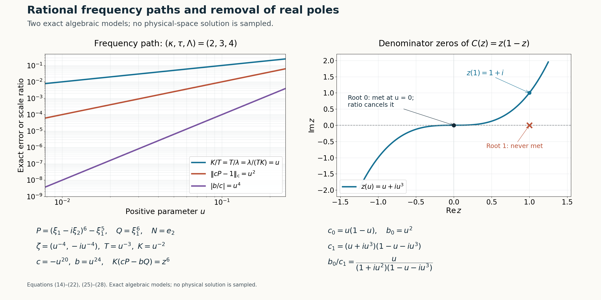

# Rational complex frequency paths without real poles

*Written by GPT-6.1 Sol (OpenAI), Ultra reasoning effort, October 2026. Self-checked by GPT-6.1 Sol (OpenAI). Original expression: CC0.*

A sequence of useful frequency windows is not enough for the transport construction: the window centre and its two scales must depend smoothly on one parameter. We convert the sequence into a rational path while retaining the normalized polynomial limits and the three scale separations. We also remove every real pole of the ratio used as the background perturbation. The proof makes two steps explicit that need care: the algebraic fibers may be unbounded, and truncating a convergent Laurent expansion can spoil an error that has already been multiplied by a large scale.

Read [Symbols at infinity](symbols-at-infinity.md). We use Lemma 2.1, Lemma 3.1 and Corollary 3.3 of the algebraic prerequisite. The real directional-strength comparison is an explicit hypothesis of the window estimate below. The escape scale follows from that estimate, and the path is selected only after these limits have been established.

The proofs use the internal algebraic results cited above, with their stated elementary complex-analysis inputs. The Hörmander reference provides background comparison.

## Polynomial windows and the preceding reduction

Fix \(N\in\mathbb R^n\setminus\{0\}\), and let \(P,Q\) be complex polynomials of degree at most \(m\). A normal complex centre has the form
\[
\zeta=\xi-i\lambda N,\qquad
\xi\in\mathbb R^n,\quad\lambda>0.
\tag{1}
\]
For a polynomial \(f(z)=\sum_{j=0}^m f_jz^j\), put
\[
\begin{gathered}
\|f\|_{\mathrm c}=\sum_{j=0}^m|f_j|,
\\
\mathcal S_N P(\xi)=
\left(\sum_{j=0}^m|\partial_N^jP(\xi)|^2\right)^{1/2}.
\end{gathered}
\tag{2}
\]
Factorial weights, a maximum of coefficients, and the sum norm are equivalent by fixed finite constants. All limits below use this fixed degree space.

**Lemma 1 (a complex window estimate from the real directional bound).** Suppose
\[
\mathcal S_N Q(\xi)\le C\mathcal S_N P(\xi)
\quad(\xi\in\mathbb R^n).
\tag{3}
\]
For \(U=1+\lambda\) there is a constant \(C_1\), independent of \(\xi,\lambda\), such that
\[
\|Q(\zeta+UzN)\|_{\mathrm c}
\le C_1\|P(\zeta+UzN)\|_{\mathrm c}.
\tag{4}
\]

**Proof.** Write \(p(t)=P(\xi+tN)\), \(q(t)=Q(\xi+tN)\). For real \(|t|\le U\), express \(p(t)\) and each derivative through the coefficients of \(p(Uz)\). Since \(U\ge1\), each factor \(U^{-j}\) arising in the \(j\)-th derivative is at most one. The remaining finite derivative sums on \(|t/U|\le1\) are bounded by a constant depending only on \(m\). Hence \(\mathcal S_N P(\xi+tN)\le C_m\|p(Uz)\|_{\mathrm c}\). Hypothesis(3) in particular bounds \(|q(t)|\) by the same right side.

Choose \(m+1\) fixed distinct real numbers \(t_j\in[-1,1]\). The exact Lagrange formula
\[
q(Uz)=\sum_{j=0}^m q(Ut_j)
\prod_{\ell\ne j}\frac{z-t_\ell}{t_j-t_\ell}
\tag{5}
\]
therefore bounds its coefficient norm by \(C_m'\|p(Uz)\|_{\mathrm c}\). Translation \(f(z)\mapsto f(z+w)\) on this finite degree space has norm bounded by a fixed constant for \(|w|\le1\), directly from the binomial formula. Apply it to \(q(Uz)\) with \(w=-i\lambda/U\), and apply its inverse to \(P(\zeta+UzN)\). This proves(4). The proof includes constant polynomials; for \(m=0\) the interpolation product is empty. \(\square\)

Consider sequences \(\zeta_\nu\) as in(1), \(T_\nu,K_\nu>0\), with \(P(\zeta_\nu)Q(\zeta_\nu)\ne0\), satisfying
\[
\begin{gathered}
\frac{P(\zeta_\nu+T_\nu zN)}{P(\zeta_\nu)}\\
\longrightarrow1,
\frac{Q(\zeta_\nu+T_\nu zN)}{Q(\zeta_\nu)}\\
\longrightarrow1,\\
\frac{P(\zeta_\nu)}{Q(\zeta_\nu)}\\
\longrightarrow0,
K_\nu\left(
\frac{P(\zeta_\nu+T_\nu zN)}{P(\zeta_\nu)}
-\frac{Q(\zeta_\nu+T_\nu zN)}{Q(\zeta_\nu)}
\right)\\
\longrightarrow r(z),\\
\frac{K_\nu}{T_\nu}\\
\longrightarrow0,
\frac{1+|\operatorname{Im}\zeta_\nu|}{T_\nu K_\nu}\\
\longrightarrow0 .
\end{gathered}
\tag{6}
\]
The polynomial limits are coefficient limits. Pointwise convergence gives the same coefficient limits: evaluate at \(m+1\) fixed distinct points and use(5). In particular \(r\) is a polynomial of degree at most \(m\), and \(r(0)=0\).

The last two conditions imply
\[
\begin{gathered}
\frac{1+|\operatorname{Im}\zeta_\nu|}{T_\nu^2}
\\
=\frac{1+|\operatorname{Im}\zeta_\nu|}{T_\nu K_\nu}
\frac{K_\nu}{T_\nu}\\
\longrightarrow0,\\
T_\nu\longrightarrow\infty.
\end{gathered}
\tag{7}
\]
Under(3), they and the polynomial limits also give
\[
\lambda_\nu\longrightarrow\infty,\qquad
\frac{T_\nu}{\lambda_\nu}\longrightarrow0.
\tag{8}
\]
Indeed, if \(T_\nu\ge a(1+\lambda_\nu)\) on a subsequence for some \(a>0\), rescaling the normalized \(P\)-window from \(T_\nu\) to \(1+\lambda_\nu\) multiplies its finitely many coefficients by uniformly bounded factors. Its norm is thus bounded by a constant times \(|P(\zeta_\nu)|\). Formula(4) bounds \(|Q(\zeta_\nu)|\) by this same quantity, contradicting \(P(\zeta_\nu)/Q(\zeta_\nu)\to0\). Consequently \(T_\nu/(1+\lambda_\nu)\to0\). Combined with \(T_\nu\to\infty\), this gives both assertions in(8). Since \(|\operatorname{Im}\zeta_\nu|=|N|\lambda_\nu\), this is precisely the required escape-scale conclusion with the Euclidean norm.

The normalized polynomial limits have the root-distance meaning used in that reduction. For each fixed \(R\), coefficient convergence makes each normalized polynomial uniformly close to one on \(|z|\le R\); it therefore has no zero there for all sufficiently large \(\nu\). Thus every root in the normal variable has distance from the centre divided by \(T_\nu\) tending to infinity, with infinite distance allowed when the normal polynomial is constant. This implication uses the displayed finite coefficient bound, rather than a root-continuity theorem.

## A semialgebraic set with compact selectable fibers

**Theorem 2 (rational path selection with the escape scale explicit).** Assume(6) and(8). There are rational functions \(\xi(u)\in\mathbb R^n\), \(\lambda(u),T(u),K(u)\in\mathbb R\), \(c(u),b(u)\in\mathbb C\), with \(\lambda,T,K>0\) for small \(u>0\), such that \(\zeta(u)=\xi(u)-i\lambda(u)N\) and
\[
\begin{gathered}
\|cP(\zeta+TzN)-1\|_{\mathrm c}\\
=O(u),\\
\|bQ(\zeta+TzN)-1\|_{\mathrm c}\\
=O(u),\\
|b/c|\\
=O(u),\\
\|K(cP(\zeta+TzN)-bQ(\zeta+TzN))-r\|_{\mathrm c}\\
=O(u),\\
K/T\\
=O(u),\\
(1+|\operatorname{Im}\zeta|)/(TK)\\
=O(u),\\
(1+T)/|\operatorname{Im}\zeta|\\
=O(u).
\end{gathered}
\tag{9}
\]
In addition \(A=b/c\) is analytic on the entire real line. No sign condition on \(r'\) is used. Lemma 1 shows that the explicit escape-scale premise follows from the assumed real directional bound.

**Proof: the algebraic set.** For \(0<e\le1/2\), use real coordinates for
\(X=(\xi,\lambda,T,K,\operatorname{Re}c,\operatorname{Im}c,
\operatorname{Re}b,\operatorname{Im}b)\).
Set \(\zeta=\xi-i\lambda N\). Define \(E_e\) by \(\lambda,T,K\ge0\), the inequalities
\[
\begin{gathered}
|b|^2\le e^2|c|^2,\\
K^2\le e^2T^2,\\
1+T^2\le e^2|\operatorname{Im}\zeta|^2,\\
1+|\operatorname{Im}\zeta|^2\le e^2T^2K^2,
\end{gathered}
\tag{10}
\]
and the requirement that every coefficient of each polynomial
\[
\begin{gathered}
cP(\zeta+TzN)-1,\\
bQ(\zeta+TzN)-1,\\
K(cP(\zeta+TzN)-bQ(\zeta+TzN))-r(z)
\end{gathered}
\tag{11}
\]
has squared modulus at most \(e^2\). These are real polynomial weak inequalities: expand \(P,Q\), and separate real and imaginary parts. Fixed complex coefficients simply give fixed real polynomial coefficients.

Each \(E_e\) is closed. Its inequalities force \(\lambda,T,K>0\), because the left sides of the last two inequalities in(10) are at least one. The constant coefficients in(11), with \(e\le1/2\), also force \(c,b\ne0\). Thus replacing strict positivity by closed nonnegativity has introduced no inadmissible point.

Every sufficiently small \(e>0\) has a nonempty fiber. Choose a sufficiently late member of(6) and take \(c=P(\zeta_\nu)^{-1}\), \(b=Q(\zeta_\nu)^{-1}\). Its finitely many coefficient errors tend to zero, as do every ratio in(10); the last ratio there follows from(8) and \(T_\nu\to\infty\). This verifies every inequality after choosing \(\nu\) late enough for that particular \(e\). The fiber need not be bounded.

Choose its least squared norm:
\[
\begin{gathered}
\rho(e)=\min_{X\in E_e}|X|^2,\\
F_e=\{X\in E_e:|X|^2=\rho(e)\}.
\end{gathered}
\tag{12}
\]
The minimum exists. A sequence with norms tending to the infimum is eventually bounded by the norm of any one point of \(E_e\) plus one; a bounded subsequence has a limit in the closed fiber, attaining that infimum. Hence \(F_e\) is nonempty and compact.

Its graph is semialgebraic. Membership says \(X\in E_e\) and that no \(Y\in E_e\) has \(|Y|^2<|X|^2\), a finite real quantified polynomial condition. Lemma 2.1 of the algebraic prerequisite eliminates these quantifiers. Corollary 3.3, with parameter \(t=1/e\), selects a point \(X(e)\in F_e\). Lemma 3.1 gives convergent Puiseux expansions for every selected real coordinate, including unbounded coordinates. There are only finitely many negative exponents.

Choose a common positive integer \(\ell\) clearing their fractional denominators, and substitute \(e=u^\ell\). Each coordinate now has a convergent Laurent expansion
\[
X_j(u)=\sum_{k=k_j}^{\infty}x_{jk}u^k
\quad(0<u<u_0).
\tag{13}
\]
Coordinates \(\lambda,T,K\) remain positive. Every inequality gives its corresponding error or ratio \(O(u^\ell)\), hence \(O(u)\). Norms of polynomial errors differ from maximum coefficient moduli only by a fixed degree factor. All real coordinates remain real; recombining \(c,b\) gives complex Laurent expansions.

## Truncating without losing a weighted cancellation

We need a finite path, not an infinite analytic Laurent series. Truncate every coordinate at one sufficiently high common integer \(M\). The error is \(O(u^{M+1})\), but that statement alone does not justify the weighted third polynomial in(11). The factors \(K,T,\zeta\) may grow as negative powers.

Here is the required finite estimate. If all coordinates are \(O(u^{-L})\), \(L\ge0\), and their perturbations are \(O(u^{M+1})\), a polynomial \(p\) of degree \(d\) satisfies
\[
\begin{gathered}
p(X+\Delta X)-p(X)
\\
=O\!\left(u^{M+1-(d-1)L}\right).
\end{gathered}
\tag{14}
\]
For sufficiently high \(M\), each perturbed coordinate is also \(O(u^{-L})\). Expand each monomial by telescoping its finitely many factors: one factor is a coordinate perturbation and at most \(d-1\) other factors contribute the displayed negative power. This proves(14), including constant polynomials with zero difference.

For a nonzero Laurent denominator \(q(X(u))\), write
\[
\begin{gathered}
q(X(u))=a u^v(1+O(u)),\\
a\ne0.
\end{gathered}
\tag{15}
\]
Choose \(M\) high enough that its perturbation estimate in(14) is \(o(u^v)\). The new denominator is then bounded below by a positive constant times \(u^v\) in modulus, and
\[
\begin{gathered}
\frac{p(X+\Delta X)}{q(X+\Delta X)}
-\frac{p(X)}{q(X)}\\
=\frac{[p(X+\Delta X)-p(X)]q(X)
-p(X)[q(X+\Delta X)-q(X)]}
{q(X+\Delta X)q(X)}.
\end{gathered}
\tag{16}
\]
The finite degree and the two lower denominator bounds show that this is \(O(u^{M+1-B})\) for some fixed finite \(B\). Taking \(M\ge B\) makes it \(O(u)\). There are only finitely many rational expressions to preserve: the coefficients in(11) and
\[
\begin{gathered}
\frac bc,\\
\frac KT,\\
\frac1{TK},
\\
\frac{\lambda}{TK},\\
\frac1\lambda,\\
\frac T\lambda .
\end{gathered}
\tag{17}
\]
A common \(M\) therefore works for all of them. It can also preserve the leading nonzero terms of \(c,b,\lambda,T,K\). Positivity of the latter three is retained for small positive \(u\).

Apply this truncation to the real coordinates \(\xi,\lambda,T,K\), and then reconstruct \(\zeta=\xi-i\lambda N\); do not perturb its imaginary direction independently. Apply it also to the real and imaginary parts of \(c,b\). Finite Laurent sums are rational functions. Formulas(14)–(17) prove all estimates in(9) for the truncated functions, including the large-\(K\) cancellation. The factors \(|N|\) in the last two ratios are fixed nonzero constants.

## Moving the denominator zeros away from the real parameter

After truncation, write the two nonzero scalar Laurent polynomials as
\[
\begin{gathered}
c(u)=u^{v_c}C(u),\\
b(u)=u^{v_b}B(u),
\\
C(0)B(0)\ne0.
\end{gathered}
\tag{18}
\]
Their ratio estimate gives the integer inequality \(v_b-v_c\ge1\). Choose a sufficiently large integer \(v\ge2\). For a real number \(h\), set
\[
\begin{gathered}
z_h(u)=u+ihu^v,\\
\widehat c(u)=c(z_h(u)),\\
\widehat A(u)=b(u)/\widehat c(u).
\end{gathered}
\tag{19}
\]
For real \(u\ne0\), \(z_h(u)\ne0\), since its real part is \(u\). A nonzero root \(\alpha\) of \(C\) can equal \(z_h(u)\) only if
\[
u=\operatorname{Re}\alpha\ne0,\qquad
h=\frac{\operatorname{Im}\alpha}{(\operatorname{Re}\alpha)^v}.
\tag{20}
\]
There are finitely many such forbidden real values of \(h\). A root with zero real part cannot equal \(z_h(u)\) for a nonzero real \(u\). Choose \(h\) outside this finite set. Then \(\widehat c\) has no zero or pole at any nonzero real parameter.

At zero the potential pole of the ratio is removable:
\[
\begin{gathered}
\widehat A(u)\\
=u^{v_b-v_c}
\frac{B(u)}
{(1+ihu^{v-1})^{v_c}C(u+ihu^v)}.
\end{gathered}
\tag{21}
\]
The remaining denominator is a holomorphic nonzero unit near zero; this includes negative integers \(v_c\). Thus \(\widehat A\) is analytic there and vanishes to order \(v_b-v_c\ge1\). At every other real point it is a rational function with nonzero denominator in a complex neighbourhood. It is therefore analytic on all of \(\mathbb R\), not merely free of poles on its positive half.

The modification can be made invisible at the required error order:
\[
\widehat c(u)-c(u)=O(u^{v_c+v-1}).
\tag{22}
\]
To verify this, factor \(c\) as in(18). For the integer power, expand \((1+ihu^{v-1})^{v_c}=1+O(u^{v-1})\), using its convergent reciprocal series when \(v_c<0\). Also \(C(u+ihu^v)-C(u)=O(u^v)\) by its finite polynomial expansion. Multiplying gives(22). Choose \(v\) large enough that this single-coordinate perturbation has the high order required by(14)–(17). All estimates in(9) remain true. The other real coordinates are unchanged. Rename \(\widehat c\) as \(c\). This proves Theorem 2. \(\square\)

## Leading integer powers and an exact model

The resulting positive rational scales have integer leading exponents
\[
\begin{gathered}
K(u)=k_0u^{-\kappa}(1+O(u)),\\
T(u)=t_0u^{-\tau}(1+O(u)),\\
\lambda(u)=l_0u^{-\Lambda}(1+O(u)),
\\
k_0,t_0,l_0>0.
\end{gathered}
\tag{23}
\]
They all diverge: \(T\to\infty\) by the analogue of(7), \(\lambda/T\to\infty\), and \(K=(TK/\lambda)(\lambda/T)\to\infty\). Hence \(\kappa,\tau,\Lambda\) are positive integers. The three \(O(u)\) ratios force
\[
\begin{gathered}
\tau-\kappa\ge1,\\
\Lambda-\tau\ge1,\\
\kappa+\tau-\Lambda\ge1.
\end{gathered}
\tag{24}
\]
In particular \(\kappa\ge2\). Replacing \(K\) by its leading term \(k_0u^{-\kappa}\) preserves the polynomial limit with \(O(u)\) error: the quotient of new and old \(K\) is \(1+O(u)\), and the old weighted polynomial is bounded. If one instead takes \(K=u^{-\kappa}\), the limiting polynomial is \(r/k_0\); this positive scalar change preserves any strict derivative-imaginary-part sign.

For a concrete path, take \(n=2,N=e_2\) and the same-order member of the second power-frequency family:
\[
\begin{gathered}
P(\xi)=(\xi_1-i\xi_2)^6-\xi_1^5,\\
Q(\xi)=\xi_1^6,\\
\zeta(u)=(u^{-4},-iu^{-4}),\\
T=u^{-3},\\
K=u^{-2},\\
c=-u^{20},\\
b=u^{24}.
\end{gathered}
\tag{25}
\]
A direct calculation gives
\[
\begin{gathered}
cP(\zeta+TzN)=1+u^2z^6,\\
bQ(\zeta+TzN)=1,\\
K(cP-bQ)=z^6,\\
b/c=-u^4.
\end{gathered}
\tag{26}
\]
Here \(K/T=T/\lambda=\lambda/(TK)=u\). The model also satisfies equation (3): for real \(|\xi|\ge2\), the leading term of P has modulus \(|\xi|^6\) and the lower term has modulus at most \(|\xi|^5\), so \(|P(\xi)|\ge|\xi|^6/2\ge|Q(\xi)|/2\). For \(|\xi|\le2\), \(|Q|\le64\) and the sixth normal derivative of P has modulus 720. Since Q is independent of its normal variable, its directional strength equals \(|Q|\). Thus \(\mathcal S_NQ\le2\mathcal S_NP\) everywhere. This exact algebraic path proves the scale estimates and the limiting polynomial for that family. It does not construct a half-space-supported solution.

The pole-removal mechanism can be seen separately with
\[
\begin{gathered}
c_0(u)=u(1-u),\\
b_0(u)=u^2,\\
c_1(u)=(u+iu^3)(1-u-iu^3).
\end{gathered}
\tag{27}
\]
The original ratio has a real pole at \(u=1\). The displaced denominator has none there or anywhere else on the punctured real line: the only roots of \(z(1-z)\) are \(0,1\), and \(z=u+iu^3\) can reach neither for real \(u\ne0\). At zero
\[
\frac{b_0(u)}{c_1(u)}
=\frac{u}{(1+iu^2)(1-u-iu^3)}
\tag{28}
\]
is analytic and vanishes to order one. This second model illustrates denominator displacement; it is distinct from the frequency path(25).

**Figure 1.** The left panel evaluates the exact coefficient error \(u^2\), coefficient ratio modulus \(u^4\), and three scale ratios \(u\) from(25)–(26). The right panel plots \(z=u+iu^3\), \(-5/4\le u\le5/4\), in the complex parameter plane, and marks the denominator roots \(0,1\). The curve meets the root 0 only at \(u=0\), where(28) cancels it; it misses root 1. These are exact algebraic examples, not samples of a physical-space solution. Equations: (14)–(22), (25)–(28)

## Exercises and complete solutions

**Exercise 1 (the missing escape premise).** Explain exactly how the real directional bound is used to infer(8), and why(7) alone does not imply it.

**Solution.** The two scalar limits alone allow, for example, \(T=u^{-3},K=u^{-2},\lambda=u^{-1}\); then \(K/T=u\) and \((1+\lambda)/(TK)=u^5+u^4\) tend to zero, but \(T/\lambda=u^{-2}\) diverges. Under(3), Lemma 1 compares the full \(Q\)-window and \(P\)-window at the imaginary-height scale \(1+\lambda\). If \(T\) is at least a fixed positive fraction of that height, the normalized \(P\)-window is bounded there, so \(|Q(\zeta)|\le C|P(\zeta)|\), contradicting the small coefficient ratio. This is the additional argument; the two scale limits are insufficient by themselves.

**Exercise 2 (compact fibers without a radius choice).** Prove the minimum-norm assertion(12) for any nonempty closed semialgebraic fiber. Explain why its minimizer graph is semialgebraic without first knowing a bound on its radius.

**Solution.** The squared norm has an infimum at least zero. Choose one point of the fiber and a sequence whose squared norms tend to the infimum. The sequence is eventually inside a finite closed ball determined by that point. Finite-dimensional compactness supplies a convergent subsequence; closedness places its limit in the fiber, and norm continuity gives the minimum. The minimizers form a closed subset of the sphere at that minimum, hence are compact. Their graph is the original semialgebraic membership condition together with the quantified condition that no competing fiber point has smaller squared norm. Lemma 2.1 of the algebraic prerequisite removes precisely this finite quantifier; no semialgebraic radius was assumed.

**Exercise 3 (a truncation error that grows after weighting).** For \(K=u^{-5}\), compare the effect of discarding a term \(u^3\) and a term \(u^7\) in an unweighted polynomial difference. Identify which gives a weighted \(O(u)\) error.

**Solution.** Multiplication by \(K\) turns the first omitted term into \(u^{-2}\), which diverges; convergence of the original coordinate error was insufficient. It turns the second into \(u^2\), which is \(O(u)\). In a general window, other growing factors such as \(T^j\) and powers of \(\zeta\) also contribute. Formula(14) bounds their total finite loss, and(16) handles the possible denominator losses. Choosing a common truncation order beyond all those losses is what protects(11).

**Exercise 4 (the forbidden displacement values).** For \(C(z)=(z-1)(z-(2+3i))(z-i)\) and \(z_h(u)=u+ihu^4\), find every forbidden real \(h\), and exhibit one admissible choice.

**Solution.** Root 1 gives \(h=0/1^4=0\). Root\(2+3i\) gives \(h=3/2^4=3/16\). Root\(i\) has zero real part, so it can equal no \(z_h(u)\) for a nonzero real \(u\). Thus the forbidden set is \(\{0,3/16\}\); \(h=1\) is admissible. This computation treats every real parameter, including negative ones.

**Exercise 5 (why the leading \(K\)-power is at least two).** Deduce \(\kappa\ge2\) from(24), and verify all three exponent differences for(25).

**Solution.** From \(\Lambda-\tau\ge1\) and \(\kappa+\tau-\Lambda\ge1\), add the inequalities to get \(\kappa\ge2\). In(25), \((\kappa,\tau,\Lambda)=(2,3,4)\), so the differences are \(1,1,1\). The equalities \(K/T=T/\lambda=\lambda/(TK)=u\) verify them exactly. No limiting-frequency path with these rational \(O(u)\) separations can have leading exponent \(\kappa=1\).

**Exercise 6 (pole-free does not mean entire).** Verify that(28) is analytic at every real point. Explain which conclusion about complex points is justified.

**Solution.** The factor \(1+iu^2\) has no real zero. A zero of \(1-u-iu^3\) at real \(u\) would require simultaneously \(u=1\) and \(u^3=0\), which is impossible. Both factors are nonzero also at \(u=0\), so(28) is analytic there with leading term \(u\). At each real point continuity gives a small complex neighbourhood with no denominator zero. Complex poles may occur at the complex roots of those two factors, so the conclusion is real-line analyticity with local holomorphic extensions, not an entire function.

## References

- Internal algebraic inputs: [Symbols at infinity](symbols-at-infinity.md#algebraic-inequalities-survive-projection), Lemma 2.1, and [its power expansion and compact-fiber selection](symbols-at-infinity.md#one-parameter-has-a-power-expansion), Lemma 3.1 and Corollary 3.3, with the stated elementary complex-analysis inputs.
- [Hörmander] Lars Hörmander, *The Analysis of Linear Partial Differential Operators II: Differential Operators with Constant Coefficients*, Springer, 1983.
- The complex window estimate, escape scale, compact minimum-norm fibers, weighted Laurent truncation and displacement of real denominator poles are proved in this lesson, Lemma 1 and Theorem 2, equations (3)–(22), with the leading exponents and exact models (23)–(28) and Exercises 1–6.
