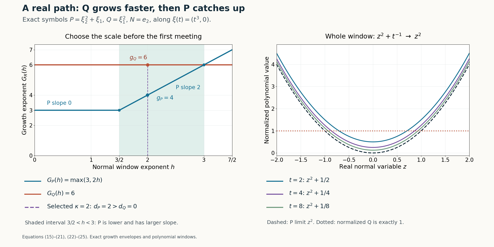

# Real Laurent paths and the growth of normal windows

*Written by GPT-6.1 Sol (OpenAI), Ultra reasoning effort, October 2026. Self-checked by GPT-6.1 Sol (OpenAI). Original expression: CC0.*

A large directional-strength ratio says that Q can outgrow P on real frequencies. The construction of a smooth nonunique solution needs more: one real frequency path, one normal scale, and limiting monomials whose powers of the normal variable have the opposite order. We select the path on spheres, then choose the scale from two piecewise linear growth envelopes. The point where P starts catching Q is what creates the degree inequality.

Read [Symbols at infinity](symbols-at-infinity.md). We use the projection theorem, eventual Puiseux expansion and compact-fiber selection proved in the prerequisite, specifically Lemma 2.1, Lemma 3.1 and Corollary 3.3. The proof below supplies the normal scale and all coefficient estimates.

The mathematical inputs are the internal proof routes identified above and below, with their stated prerequisite assumptions. The Hörmander reference provides background comparison.

## The hypotheses and the exact statement

Fix a nonzero real vector N and complex polynomials P,Q of total degree at most m. Write \(P_m\) for the degree m homogeneous part and use
\[
D_N=-i\partial_N,\qquad
\mathcal S_N R(\eta)^2=\sum_{j=0}^{m}|D_N^jR(\eta)|^2.
\]
We assume
\[
P_m(N)\ne0,\qquad
\sup_{\eta\in\mathbb R^n}
\frac{\mathcal S_N Q(\eta)}{\mathcal S_N P(\eta)}
=\infty .
\tag{1}
\]
Thus m is the degree of P. The hypothesis is impossible for \(m=0\), when both polynomials are constant, so m is a positive integer. Q is not the zero polynomial. No assumption that Q has degree exactly m or that \(Q_m(N)\) is nonzero is made.

**Theorem 1 (the real Laurent path lemma).** Under (1) there is a real convergent Laurent series
\[
\xi(t)=\sum_{j=-\infty}^{M}c_jt^j,\qquad c_j\in\mathbb R^n,
\]
defined for all sufficiently large positive t, a positive integer \(\kappa\), nonzero complex constants \(c_P,c_Q\), and integers
\[
0<g_P<g_Q,\qquad d_P>d_Q\ge0,
\]
such that, in the fixed finite dimensional coefficient space of polynomials in z,
\[
\begin{aligned}
t^{-g_P}P(\xi(t)+zt^\kappa N)&\longrightarrow c_Pz^{d_P},\\
t^{-g_Q}Q(\xi(t)+zt^\kappa N)&\longrightarrow c_Qz^{d_Q}.
\end{aligned}
\]
After these choices the normalized coefficients are convergent power series in \(1/t\) at zero. In particular the error is \(O(t^{-1})\) in coefficient norm, and all derivatives in z converge uniformly on compact sets.

## Selecting a maximizing real path

**Proof of Theorem 1, part 1.** Taylor's formula for the homogeneous leading term gives the exact constant
\[
\begin{gathered}
D_N^mP(\eta)=(-i)^m m!P_m(N),\\
\mathcal S_N P(\eta)\ge m!|P_m(N)|>0.
\end{gathered}
\tag{2}
\]
It follows that the ratio in (1) is continuous on all real frequencies, including its zeros in the numerator. It is bounded on every compact set. Thus any sequence on which it tends to infinity must have an unbounded subsequence of radii tending to infinity.

Use squared strengths to keep every equation polynomial in real coordinates. Put
\[
\begin{gathered}
A(\eta)=\mathcal S_N P(\eta)^2,\\
B(\eta)=\mathcal S_N Q(\eta)^2,\\
M(R)=\max_{|\eta|=R}\frac{B(\eta)}{A(\eta)}
\\
(R>0).
\end{gathered}
\tag{3}
\]
Real and imaginary parts of each polynomial coefficient are fixed real constants, so A and B are real polynomials. The sphere is nonempty and compact and A is strictly positive. Consequently the maximum exists, and the maximizing fiber \(K_R\) is nonempty and compact.

Its graph is semialgebraic. One exact quantified description of the maximum and fiber is
\[
\begin{gathered}
R>0,\\
|\eta|^2=R^2,\\
B(\eta)=S A(\eta),\\
\forall y\in\mathbb R^n:\\
|y|^2=R^2\ \Longrightarrow\ B(y)\le S A(y).
\end{gathered}
\tag{4}
\]
A positive denominator allowed this multiplication without changing the inequality. Lemma 2.1 of the algebraic prerequisite eliminates these finitely many real quantifiers. Projection also shows that the graph of M is semialgebraic.

The preceding unbounded sequence implies that M is unbounded as R tends to infinity. Lemma 3.1 of the algebraic prerequisite applies to this finite valued function. M is eventually positive and has a first nonzero Puiseux term. If its exponent were nonpositive it would be bounded on a final interval. Therefore
\[
\begin{gathered}
M(R)=aR^\rho(1+o(1)),\\
a>0,\\
\rho\in\mathbb Q,\\
\rho>0,
\\
M(R)\longrightarrow\infty .
\end{gathered}
\tag{5}
\]
This proves a limit along all sufficiently large radii, rather than only the original sequence.

Corollary 3.3 of the algebraic prerequisite selects a semialgebraic maximizer \(\eta(R)\in K_R\). Each coordinate has a convergent Puiseux expansion at infinity. Choose a common positive integer L divisible by all their denominators. Substitution \(R=t^L\) yields
\[
\begin{gathered}
\xi_0(t)=\eta(t^L)
=\sum_{j=-\infty}^{M_0}c_jt^j,\\
|\xi_0(t)|=t^L,\\
\frac{\mathcal S_N Q(\xi_0(t))}
{\mathcal S_N P(\xi_0(t))}\longrightarrow\infty .
\end{gathered}
\tag{6}
\]
There are only finitely many positive powers, all coefficients are real, and the series converges for sufficiently large positive t. No negative powers are discarded.

## Growth envelopes and a strict slope inequality

For \(R=P\) or \(R=Q\), each function \(D_N^jR(\xi_0(t))\) is a polynomial in finitely many convergent Laurent series. It is itself such a series. It is either identically zero for large t or has the form
\[
\begin{gathered}
D_N^jR(\xi_0(t))
=a_{R,j}t^{\mu_{R,j}}(1+O(t^{-1})),
\\
a_{R,j}\ne0,\\
\mu_{R,j}\in\mathbb Z.
\end{gathered}
\tag{7}
\]
For an identically zero function set \(\mu_{R,j}=-\infty\) and omit that index from maxima and sums involving its leading coefficient. At least one index remains for each polynomial: for P this follows from (2), and for Q it follows from (6).

Define for every real \(h\ge0\)
\[
\begin{gathered}
G_R(h)=\max_{0\le j\le m}
\{\mu_{R,j}+jh\},\\
R=P,Q .
\end{gathered}
\tag{8}
\]
These are continuous finite maxima of finitely many affine functions. Their slopes lie among the integers 0 through m. All genuine finite breakpoints are rational because the intercepts are integers. They are nondecreasing and convex; their difference need not be either.

Let \(\sigma_R=G_R(0)\). The sum of squared moduli in the strength has no cancellation between different derivatives. Dividing it by its largest power therefore gives
\[
\begin{gathered}
t^{-\sigma_R}\mathcal S_N R(\xi_0(t))
\\
\longrightarrow
\left(\sum_{\mu_{R,j}=\sigma_R}|a_{R,j}|^2\right)^{1/2}>0 .
\end{gathered}
\tag{9}
\]
Terms with smaller exponents vanish and terms with the largest exponent contribute positive squared moduli, even if their complex phases differ. Equation (6) and these two nonzero limits imply
\[
G_Q(0)>G_P(0).
\tag{10}
\]

The noncharacteristic hypothesis controls the other end of the h axis. Specifically,
\[
\begin{gathered}
\mu_{P,m}=0,\\
a_{P,m}=(-i)^m m!P_m(N).
\end{gathered}
\tag{11}
\]
For Q the m-th normal derivative is either identically zero or the constant \((-i)^m m!Q_m(N)\). Thus it too has exponent zero whenever it is nonzero. All remaining indices have \(j<m\). Consequently, for sufficiently large h,
\[
G_P(h)=mh,\qquad G_Q(h)\le mh.
\tag{12}
\]
The first equality follows because the finitely many lines with slopes below m eventually lie below mh. If Q has a nonzero m-th derivative its envelope also equals mh eventually; otherwise its maximal slope is less than m and it is eventually strictly below mh.

Write \(F(h)=G_Q(h)-G_P(h)\). It is continuous, positive at zero, and nonpositive for large h. Its first zero
\[
h_*=\min\{h>0:F(h)=0\}
\]
exists, is positive and finite, and satisfies
\[
\begin{gathered}
F(h)>0\\
(0\le h<h_*),\\
F(h_*)=0.
\end{gathered}
\tag{13}
\]
For existence, first choose H with F(H) nonpositive, use the intermediate value theorem on [0,H], and take the minimum of its compact nonempty zero set. Continuity and F(0)>0 put that minimum strictly above zero.

Partition [0,\(h_*\)] at the finitely many breakpoints of either envelope. On each nonempty open subinterval the maximizer for each envelope is a single index, and F has a constant slope \(s_\ell\). If two different indices maximized at an interior point, their distinct slopes would make their maximum bend there: the larger slope wins just to the right and the smaller slope wins just to the left. The envelope could not be affine in a neighborhood of that point. Such a point is a breakpoint already excluded. Since
\[
\begin{gathered}
\sum_\ell s_\ell\,|J_\ell|
\\
=F(h_*)-F(0)\\
=-F(0)<0,
\end{gathered}
\tag{14}
\]
some nonempty subinterval J has a negative slope for F. Throughout J the difference is still positive. Choose a rational \(\kappa_0\in J\). Let \(d_P\) and \(d_Q\) denote the unique maximizing indices there. Then
\[
\begin{gathered}
\kappa_0>0,\\
G_P(\kappa_0)<G_Q(\kappa_0),\\
d_P>d_Q\ge0,\\
G_P(\kappa_0)\ge m\kappa_0>0.
\end{gathered}
\tag{15}
\]
Here the slope of F on J is \(d_Q-d_P<0\), and the final inequality uses the line mh in P's envelope. Thus the desired positivity is obtained even when the path starts on a zero of P.

For each R its unique maximizing index satisfies the strict inequalities
\[
\begin{gathered}
\mu_{R,j}+j\kappa_0<G_R(\kappa_0)
\\
(j\ne d_R),\\
G_R(\kappa_0)=\mu_{R,d_R}+d_R\kappa_0 .
\end{gathered}
\tag{16}
\]
Identically zero derivatives are absent from these comparisons. Choosing a scale at a breakpoint would not justify this uniqueness.

## Taylor coefficients, their phases and the integer scale

The finite Taylor formula, with our D convention retained, is
\[
\begin{gathered}
R(\xi_0(t)+zt^{\kappa_0}N)
\\
=\sum_{j=0}^m
\frac{i^j}{j!}\,
D_N^jR(\xi_0(t))\,t^{j\kappa_0}z^j.
\end{gathered}
\tag{17}
\]
Indeed \(\partial_N^j=i^jD_N^j\). Dividing by \(t^{G_R(\kappa_0)}\), equations (7) and (16) make every coefficient except j=\(d_R\) tend to zero. The surviving coefficient is
\[
\begin{gathered}
c_R=\frac{i^{d_R}}{d_R!}a_{R,d_R}\ne0,\\
t^{-G_R(\kappa_0)}
R(\xi_0(t)+zt^{\kappa_0}N)
\\
\longrightarrow c_Rz^{d_R}.
\end{gathered}
\tag{18}
\]
The complex factor \(i^{d_R}\) is part of the constant, not a strength weight. A finite number of coefficient limits implies uniform convergence on every compact z set, and the same for any fixed number of z derivatives.

Choose an integer \(b>0\) with \(b\kappa_0\in\mathbb Z\). As all \(\mu_{R,j}\) are integers, b also clears the denominators of both G values. Change the large parameter by \(t=v^b\) and set
\[
\begin{gathered}
\xi(v)=\xi_0(v^b),\\
\kappa=b\kappa_0,\\
g_R=bG_R(\kappa_0).
\end{gathered}
\tag{19}
\]
The path remains a real convergent Laurent series. The exponents \(g_R\) and \(\kappa\) are integers, the latter positive, and the degree indices and constants do not change. Renaming v as t gives the conclusion
\[
\begin{gathered}
0<g_P<g_Q,\\
d_P>d_Q\ge0,\\
t^{-g_P}P(\xi(t)+zt^\kappa N)\to c_Pz^{d_P},\\
t^{-g_Q}Q(\xi(t)+zt^\kappa N)\to c_Qz^{d_Q}.
\end{gathered}
\tag{20}
\]

There is also the claimed rate. After (19), every normalized coefficient has a convergent Laurent series with no positive powers of t: (16) ensures that its largest exponent is at most zero. It is therefore holomorphic as a function of \(u=1/t\) near \(u=0\). Its value there is the corresponding coefficient of \(c_Rz^{d_R}\). Subtracting that value leaves a series divisible by u. Termwise differentiation on a smaller convergence disk proves, for every \(a,r\ge0\) and compact z set K,
\[
\begin{gathered}
\sup_{z\in K}
\left|
\partial_t^r\partial_z^a
\left[t^{-g_R}R(\xi(t)+zt^\kappa N)-c_Rz^{d_R}\right]
\right|
\\
\le C_{a,r,K}t^{-1-r}\\
(t\ge T_{a,r,K}).
\end{gathered}
\tag{21}
\]
For r derivatives, differentiating each power \(t^{-k}\), \(k\ge 1\), contributes a bounded integer polynomial in k times \(t^{-k-r}\); convergence on a smaller disk controls the sum. The polynomial degree in z is at most m, so the z derivatives create only finite constants. This proves the asserted coefficient analyticity and estimates and finishes the theorem. \(\square\)

## An exact model of the catch-up mechanism

Use two real variables with
\[
\begin{gathered}
P(\xi_1,\xi_2)=\xi_2^2+\xi_1,\\
Q(\xi_1,\xi_2)=\xi_1^2,\\
N=e_2,\\
\xi_0(t)=(t^3,0).
\end{gathered}
\tag{22}
\]
Both symbols have degree at most \(m=2\) and \(P_2(e_2)=1\). Along the path,
\[
\begin{gathered}
D_NP=0,\\
D_N^2P=-2,\\
\mathcal S_N P=(t^6+4)^{1/2},\\
\mathcal S_N Q=t^6.
\end{gathered}
\tag{23}
\]
The ratio tends to infinity like \(t^3\). The only active P indices are \(j=0\) with exponent 3 and \(j=2\) with exponent 0. Q has only \(j=0\) with exponent 6. Hence
\[
\begin{gathered}
G_P(h)=\max(3,2h),\\
G_Q(h)=6,\\
h_*=3 .
\end{gathered}
\tag{24}
\]
The interval \(3/2<h<3\) has \(G_Q-G_P>0\) and slope difference \(-2\). Choosing \(\kappa=2\) gives \(g_P=4,g_Q=6,d_P=2,d_Q=0,c_P=c_Q=1\), and the entire normalized polynomials are exactly
\[
\begin{gathered}
t^{-4}P(\xi_0(t)+zt^2e_2)=z^2+t^{-1},\\
t^{-6}Q(\xi_0(t)+zt^2e_2)=1.
\end{gathered}
\tag{25}
\]
Thus this example displays an actual error term, not just its leading asymptotic order. The growth envelopes shown below belong to these exact symbols and this chosen path; the path is an explicit witness, not a claimed output of the spherical maximizer algorithm.

**Figure 1.** Left: the exact envelopes in (24), P's slope change at \(h=3/2\), their first meeting at \(h=3\), and the selected scale \(h=2\) strictly between them. At that scale \(0<g_P=4<g_Q=6\) while \(d_P=2>d_Q=0\). Right: on \(-2\le z\le2\), the complete normalized P polynomials \(z^2+t^{-1}\) for \(t=2\),4,8, their limit \(z^2\), and Q's normalized value 1. The figure shows polynomial values, not a physical solution or a proved mode profile. Equations: equation (15)–equation (21) and equation (22)–equation (25). 

## Exercises with complete solutions

**Exercise 1 (the D sign cannot be dropped).** For \(P(\xi_1,\xi_2)=\xi_2^3+\xi_1\), \(N=e_2\) and the path \((t,0)\), compute \(D_N^3P\). Recover the coefficient of \(z^3t^{3h}\) from (17).

**Solution.** Since \((-i)^3=i\), \(D_N^3P=6i\). Its Taylor coefficient in (17) is \(i^3(6i)/3!=(-i)i=1\), exactly the coefficient of \((zt^h)^3\). Omitting \(i^3\) would give i instead of 1. The strength uses \(|6i|=6\), which cannot retain this phase information.

**Exercise 2 (why the maximum tends to infinity).** Explain why continuity and an unbounded subsequence alone do not prove \(M(R)\to\infty\), and give the additional argument supplied by the algebraic provider. For contrast, exhibit a positive continuous nonsemialgebraic function on [1,∞) that is unbounded but does not tend to infinity.

**Solution.** A continuous function can have arbitrarily high peaks and repeatedly return to small values. For example \(f(R)=1+R\sin^2R\) takes the value 1 at every positive multiple of \(\pi\), but grows along \(R=\pi/2+k\pi\). It is nonsemialgebraic: the zero set of \(f-1\) contains infinitely many isolated points, whereas a semialgebraic subset of the real line is a finite union of points and intervals. For M, (4) first proves semialgebraicity. The eventual convergent Puiseux expansion then gives either an eventual zero or a single leading term \(aR^\rho\). Unboundedness excludes zero and all \(\rho\le0\), while nonnegativity forces \(a>0\). This proves (5) along every large R.

**Exercise 3 (noncharacteristic growth is needed).** Remove \(P_m(N)\ne0\) while keeping \(P\ne0\) and an unbounded strength ratio. Show that the degree inequality in Theorem 1 can fail completely.

**Solution.** Take \(P=1,Q=\xi_1\) in two variables, \(m=1\), and N=\(e_2\). Both symbols are independent of the normal variable, \(\mathcal S_N P=1\), and \(\mathcal S_N Q=|\xi_1|\), so the ratio is unbounded. But every translated window \(P(\xi(t)+zt^\kappa N)\) and \(Q(\xi(t)+zt^\kappa N)\) is independent of z. Any nonzero normalized monomial limits must have \(d_P=d_Q=0\). Thus \(d_P>d_Q\) is impossible. Here \(P_m(N)=0\); it is precisely the missing slope m that invalidates (12).

**Exercise 4 (a scale at a breakpoint).** In (22), compute the normalized P limit at \(h=3/2\), allowing fractional exponents, and explain why that scale does not prove the monomial assertion.

**Solution.** The exact translated polynomial is \(t^3+z^2t^{2h}\). At \(h=3/2\), both terms have exponent 3, so dividing by \(t^3\) gives \(1+z^2\) for every t. The two active lines tie there. This limit is not a monomial and has two nonzero coefficients. Reparameterizing t by an integer power clears fractional powers but preserves both coefficients; it does not resolve the tie. The scale must be chosen in the open interval where a unique index maximizes each envelope.

**Exercise 5 (clearing all exponents together).** Keep P,Q,N from (22) but choose \(\xi_0(t)=(t,0)\) and \(h=3/4\). Find the growth exponents, perform a common integer reparameterization and verify the normalized windows exactly.

**Solution.** The envelopes are \(G_P(h)=\max(1,2h)\) and \(G_Q(h)=2\). At \(h=3/4\) they have values 3/2 and 2, with maximizing indices 2 and 0. Taking \(t=v^4\) gives \(\xi(v)=(v^4,0)\), \(\kappa=3,g_P=6,g_Q=8\). Direct substitution yields
\[
\begin{gathered}
v^{-6}P((v^4,0)+zv^3e_2)=z^2+v^{-2},\\
v^{-8}Q((v^4,0)+zv^3e_2)=1 .
\end{gathered}
\tag{26}
\]
All path powers, both growth exponents and the normal scale are integers. The constants and degree indices remain 1,1 and 2,0. The error happens to be \(O(v^{-2})\), which is stronger than the general \(O(v^{-1})\) assertion.

**Exercise 6 (why a strength sum cannot cancel).** Suppose \(D_N^0R(\xi_0(t))=t^5(1+O(t^{-1}))\) and \(D_NR(\xi_0(t))=-t^5(1+O(t^{-1}))\), while all other derivatives are \(O(t^4)\). Compute the leading strength and explain why the opposite signs do not invalidate (9).

**Solution.** The strength squared is a sum of squared moduli, not the modulus squared of the sum. Its first two terms are each \(t^{10}(1+O(t^{-1}))\), and the remaining finite sum is \(O(t^8)\). Therefore \(\mathcal S_N R(\xi_0(t))=\sqrt2\,t^5(1+O(t^{-1}))\). The signs affect a possible sum of the derivatives but not their strength. This is why \(\sigma_R=\max_j\mu_{R,j}\) always gives a nonzero positive limit in (9).

## References

- Internal algebraic path inputs: [Symbols at infinity](symbols-at-infinity.md#algebraic-inequalities-survive-projection), Lemma 2.1 (projection), and [its one-parameter expansion and selection](symbols-at-infinity.md#one-parameter-has-a-power-expansion), Lemma 3.1 and Corollary 3.3, with the stated elementary complex-analysis prerequisites.
- [Hörmander] Lars Hörmander, *The Analysis of Linear Partial Differential Operators II: Differential Operators with Constant Coefficients*, Springer, 1983.
- The positive strength denominator, maximizing-path choice, strict envelope slope inequality, Taylor phases, integer reparameterization and coefficient estimates are proved in this lesson, equations (2)–(21), with the exact model (22)–(25) and Exercises 1–6.
