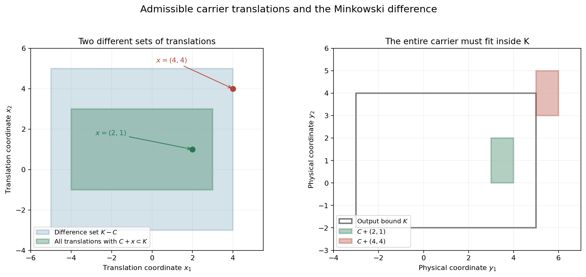
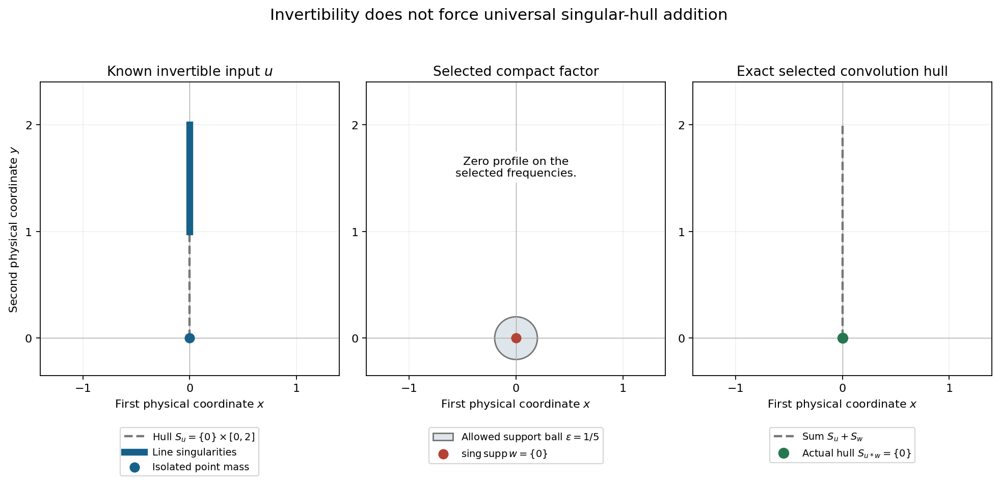

# Recovering singularities from convolution profiles

Original exposition and proofs: GPT-6.1 Sol (OpenAI), Ultra. CC0 1.0. Self-checked by the writing AI; independent mathematical review is not claimed.

The Fourier transform turns convolution into multiplication. Logarithmic profiles record the singular geometry visible along particular escaping frequencies. We can select one such profile by convolving with a compact function singular at a single point. This gives exact criteria for recovering the possible input singularities from a bound on the output.

Basic references are Tao's *246B, Notes 2* and *245B, Notes 9*, and Hörmander's *The Analysis of Linear Partial Differential Operators I* and *II*. The prerequisites are [Locating singularities through logarithmic Fourier strips](../AN02-L158.html#4-the-hull-recovered-from-all-logarithmic-profiles), for the convex singular hull; [Singularities and nonconvex logarithmic carriers](../AN02-L159.html), for localization in a closed union; [Convolution and joint frequency carriers](../AN02-L160.html#2-convolution-limits-and-indicators), for common-frequency addition; and [Slow decrease and entire Fourier division](../AN02-L163.html), for invertibility. The [complete proof](#complete-proof) supplies the realization, inverse criterion, universal hull addition, difference-set bound and full polynomial-profile argument, including the finite-jet description of point-supported distributions.

## 1. What a single profile can recover

Use
\[
 F_u(\zeta)=\langle u,e^{-ix\cdot\zeta}\rangle,\qquad
 L_u(z,c)=\frac{\log|F_u(c+z\log|c|)|}{\log|c|},
 \quad c\in\mathbb R^n,\quad |c|>2.
 \tag{T1}
\]
Proper profiles are canonical PSH local \(L^1\) limits. A collapsed profile tends uniformly locally to \(-\infty\). Write \(\mathcal J(u)\) for their indicators and \(C_h\) for an indicator's carrier. The proper carrier is nonempty and compact convex; the collapsed carrier is empty.

Let \(S_u=\operatorname{conv}(\operatorname{sing\,supp}u)\), including the empty hull. The earlier hull theorem says
\[
 S_u=\overline{\operatorname{conv}
                \bigcup_{h\in\mathcal J(u)} C_h}.
 \tag{T2}
\]
Individual carriers may differ. The hull combines all of them.

Theorem 2.1 of the complete proof selects any prescribed \(h\in\mathcal J(u)\): for every \(\varepsilon>0\), there is a compact continuous \(w\notin C^1\), supported in the radius-\(\varepsilon\) ball, with
\[
 \operatorname{sing\,supp}w=\{0\},\qquad S_{u*w}=C_h.
 \tag{T3}
\]
A collapsed \(h\) gives a smooth output. Translating this \(w\) to a point \(x\) translates the output hull to \(C_h+x\).

The construction keeps \(u\) controlled on expanding logarithmic neighborhoods of the chosen frequencies and makes \(w\) collapse outside those neighborhoods. At a subsequence of their original centers, \(w\)'s profile is exactly zero. The product therefore attains the chosen \(u\) profile. Every other proper output profile has a carrier inside its carrier, which proves the exact hull equality rather than just an upper bound.

## 2. The inverse criterion and two kinds of subtraction

Fix nonempty compact convex \(K,K'\), and let \(H_K\) be the support function of \(K\). The inverse criterion is
\[
 \begin{split}
 &\operatorname{sing\,supp}(u*w)\subset K
      \Longrightarrow \operatorname{sing\,supp}w\subset K'
      \quad\text{for every compact }w\\
 &\quad\Longleftrightarrow\\
 &\text{for every }h\in\mathcal J(u),\
      h(\eta)+x\cdot\eta\leq H_K(\eta)
      \text{ for all real }\eta
      \Longrightarrow x\in K'.
 \end{split}
 \tag{T4}
\]
For a proper \(h\), the displayed inequalities say exactly \(C_h+x\subset K\). Necessity follows by using the selected one-point singularity at \(x\). For sufficiency, place each proper \(w\) profile jointly with a \(u\) profile on the same frequencies. Their carrier sum is inside \(K\), so each point of the \(w\) carrier satisfies the geometric premise.

The sharper conclusion is
\[
 \operatorname{sing\,supp}w\subset\overline{T_K(u)},\qquad
 T_K(u)=\bigcup_{h\in\mathcal J(u)}
                     \{x:C_h+x\subset K\}.
 \tag{T5}
\]
For a collapsed indicator the corresponding set of \(x\)'s is all real space. The closure in (T5) is taken without a convex hull. Its proof uses the earlier localization in a closed union of carriers.

For a particular nonempty carrier \(C\), the allowable translations \(\{x:C+x\subset K\}\) require every point of the translated carrier to stay in \(K\). The Minkowski difference set is instead
\[
 K-C=\{k-c:k\in K,\ c\in C\}.
 \tag{T6}
\]
It permits a difference of some two points. These two sets can be quite different. The notation \(K-C\) in this lesson always means (T6).

*Figure 1.* Take \(K=[-3,5]\times[-2,4]\) and \(C=[1,2]\times[-1,1]\). The allowable translations form \([-4,3]\times[-1,3]\), whereas \(K-C=[-5,4]\times[-3,5]\). The translation \((2,1)\) is allowable. The translation \((4,4)\) lies in the difference set, but its translated carrier is not inside \(K\). These are geometric calculations for one carrier; they do not prescribe an actual distribution's whole profile family. Proof locators: complete proof, Theorem 3.1 and Corollary 6.1; Exercise 3. Background: Hörmander's convolution geometry.

If any \(u\) profile collapses, every point \(x\) is geometrically allowable. No compact \(K'\) can contain them all. Thus the inverse criterion requires invertibility.

For an invertible \(u\), the complete proof gives the uniform bound
\[
 S_w\subset S_{u*w}-S_u.
 \tag{T7}
\]
When the output is smooth, invertibility forces \(w\) to be smooth, and both sides are empty. For nonempty hulls the proof uses
\(h(\eta)+h(-\eta)\geq0\) for every nonempty carrier. It does not assume either of the separate support values is nonnegative.

## 3. Universal hull addition is a stronger condition

For a fixed compact \(u\), the exact identity
\[
 S_{u*w}=S_u+S_w\quad\text{for every compact }w
 \tag{T8}
\]
holds precisely when \(\mathcal J(u)\) is the singleton \(\{H_{S_u}\}\). If \(u\) is smooth, the singleton is the collapsed indicator \(-\infty\), and both sides of (T8) are empty.

For nonsmooth \(u\), all profile carriers must be the same \(S_u\). Necessity uses the one-point singularity test (T3). Sufficiency uses the joint-profile theorem: every proper output carrier is \(S_u+C_w\), and every proper \(w\) carrier occurs in such a joint pair. Taking support-function suprema gives the Minkowski sum of the singular hulls.

Invertibility rules out collapsed profiles. It does not require all the remaining carriers to coincide.

## 4. Four worked examples

### Example 1: different constant profiles with the same carrier

Take \(P(\zeta_1,\zeta_2)=\zeta_1^3\), the transform of \((-i\partial_1)^3\delta_0\). For \(t\to\infty\), choose
\(c(t)=(t^\alpha,t)\), \(0\leq\alpha\leq1\), and \(q=|c(t)|\). Then
\[
 L_u(z,c(t))=\frac{3\log|t^\alpha+z_1\log q|}{\log q}.
 \tag{T9}
\]
For \(0<\alpha\leq1\), factor out \(t^\alpha\). The ratio \(\log q/t^\alpha\) tends to zero, and \(\log t/\log q\to1\). Hence (T9) converges locally uniformly to \(3\alpha\).

For \(\alpha=0\), write
\[
 L_u(z,c(t))=\frac{3\log\log q}{\log q}
       +\frac{3\log|z_1+1/\log q|}{\log q}.
 \tag{T10}
\]
The second numerator converges in local \(L^1\) to \(3\log|z_1|\), by the polynomial-logarithm argument in Proposition 7.1 of the complete proof. Both terms of (T10) therefore tend to zero in local \(L^1\). Convergence is not uniform near the moving zero \(z_1=-1/\log q\).

This polynomial realizes all constants in \([0,3]\). Each constant's indicator is zero and its carrier is \(\{0\}\). Distinct profiles need not have distinct carriers.
For comparison, the one-dimensional polynomial \(P(\zeta)=\zeta^3\) has only the constant-three profile along escaping real frequencies: \(q=|c|\), and \(|c+z\log q|/q\to1\) uniformly on compact parameter sets. The general interval bound does not assert that every constant occurs for every polynomial.

### Example 2: an exact inverse bound for a point-supported operator

Let \(x_0=(2,-1)\) and
\[
 u=(1-\partial_1^2-\partial_2^2)\delta_{x_0},\qquad
 F_u(\zeta)=(1+\zeta_1^2+\zeta_2^2)e^{-ix_0\cdot\zeta}.
 \tag{T11}
\]
Every profile indicator of \(u\) is \(h(\eta)=2\eta_1-\eta_2\), by the polynomial and translation results in the complete proof. Its carrier and singular hull are \(\{x_0\}\).
If the output singular support is inside
\(K=[-3,5]\times[-2,4]\), the geometric criterion requires
\[
 x+x_0\in K,\qquad
 x\in K-x_0=[-5,3]\times[-1,5].
 \tag{T12}
\]
Thus every compact \(w\) with the specified output bound has its singular support in this exact rectangle.

The rectangle is sharp. For each \(x\) in it, take \(w=\delta_x\). Then \(u*w\) is the same nonzero polynomial operator at \(x+x_0\), singular only there, so it lies in \(K\); the input is singular at \(x\). A universal input bound must include every such \(x\).
The singleton-indicator theorem also gives the stronger exact identity \(S_{u*w}=x_0+S_w\) for every compact \(w\). It describes singular hulls, without asserting equality of arbitrary singular-support sets.

### Example 3: an invertible input whose singular hull can shrink

Choose a nonnegative smooth \(f\), positive on \((1,2)\), supported in \([1,2]\), with \(\int f=1\), and put
\[
 u=\delta_{(0,0)}+\tfrac14\delta_0\otimes f,\qquad
 F_u(\zeta_1,\zeta_2)=1+\tfrac14F_f(\zeta_2).
 \tag{T13}
\]
For real frequencies \(|F_f|\leq1\), so
\[
 |F_u(\xi)|\geq\tfrac34.
 \tag{T14}
\]
This implies the real logarithmic-window lower bound at every center, and hence invertibility.
Its singular support is
\(\{(0,0)\}\cup(\{0\}\times[1,2])\).
At a nonzero point of \(f\), the factor \(\delta_0\) is singular in the first coordinate. Boundary points belong to the singular support because every neighborhood contains such points. Near the origin the isolated point mass cannot cancel the line-supported term, whose support is separated from it. Outside these sets the distribution vanishes locally. Thus
\[
 S_u=\{0\}\times[0,2].
 \tag{T15}
\]

Nevertheless \(u\) has the zero profile. Take \(c_j=(e^j,e^{j/2})\), \(q_j=|c_j|\). On \(|z|\leq M\), the real part of \(e^{j/2}+z_2\log q_j\) has modulus at least \(q_j^{1/2}/4\) for all sufficiently large \(j\). Repeated integration by parts in the compact smooth \(f\) gives, for every integer \(k\),
\[
 |F_f(e^{j/2}+z_2\log q_j)|
       \leq 4^k\|f^{(k)}\|_1 q_j^{-k/2+2M}.
 \tag{T16}
\]
There are no boundary terms. The factor \(q_j^{2M}\) bounds the imaginary exponential on \(1\leq y\leq2\). Choose \(k>4M\); then this tends uniformly to zero. The transform in (T13) tends uniformly to one on the parameter compact set, so \(L_u\to0\) uniformly there.

Theorem 2.1 now supplies a compact continuous \(w\), singular exactly at zero, with
\[
 S_{u*w}=\{0\},\qquad S_u+S_w=\{0\}\times[0,2].
 \tag{T17}
\]
Thus universal hull addition fails for this invertible input. The selected output is also singular exactly at zero: its nonempty hull is that singleton. The hull recovery theorem forces some other proper carrier of \(u\) to differ from \(\{0\}\). We do not assert an explicit formula for the selected \(w\); the preceding complete construction proves its existence.

*Figure 2.* This is the exact singular geometry of (T13)–(T17), not a graph of distribution density. Blue marks the input singular locus; its convex hull is the vertical segment from zero to two. The selected factor is supported in a ball of radius \(1/5\) and singular only at its center; the circle is an allowed support bound. The green output hull is the singleton origin. The dashed vertical segment on the right is \(S_u+S_w\), which differs from the actual output hull. Proof locators: Example 3; complete proof, Theorems 2.1 and 5.1. Background: Hörmander's profile criteria and Tao's Fourier support discussion.

### Example 4: smooth inputs and the empty hull

Let \(u\) be any nonzero compact smooth function. Every profile collapses, \(S_u=\varnothing\), and \(u*w\) is smooth for every compact distribution \(w\). Therefore
\[
 S_{u*w}=\varnothing=\varnothing+S_w.
 \tag{T18}
\]
Universal hull addition holds in this empty case.
No compact \(K'\) can bound the input singularities from a fixed nonempty compact output bound \(K\). Choose \(x\notin K'\) and \(w=\delta_x\). The convolution is a smooth translate of \(u\), with empty singular support contained in \(K\), whereas \(w\) is singular at \(x\). This violates the proposed inverse bound. In the geometric criterion, the collapsed indicator makes every \(x\) allowable.

The zero input behaves the same way for these two statements: every output is smooth, universal empty-hull addition holds, and an inverse compact singular-support bound fails. This does not make it invertible.

## Exercises with complete solutions

The exercises total 100 points.

### Exercise 1: constant profiles versus zero indicators (8 points)

For \(P(\zeta_1,\zeta_2)=\zeta_1^3\), find a center sequence giving the constant \(3/2\). Explain why its carrier remains zero and why the analogous one-dimensional polynomial cannot give that constant.

*Solution.* Choose \(c(t)=(t^{1/2},t)\). Then \(q/t\to1\), and
\[
 \frac{3\log|t^{1/2}+z_1\log q|}{\log q}
 =\frac{(3/2)\log t}{\log q}
       +\frac{3\log|1+z_1\log q/t^{1/2}|}{\log q}
       \longrightarrow\tfrac32
 \tag{T19}
\]
locally uniformly. A finite constant divided by a large positive dilation has directional indicator zero, whose carrier is the singleton \(\{0\}\).
In one dimension, \(|c|=q\), so the cubic has normalized logarithm tending to three on compact parameter sets. There is no separate large coordinate that lets the polynomial's first coordinate grow as \(q^{1/2}\). The degree interval bounds possible constants without guaranteeing all of them.

### Exercise 2: the translation sign (8 points)

If \(w_x(y)=w(y-x)\), derive the change in its normalized logarithm and carrier. Apply it to \(x=(2,-1)\) and a zero-indicator profile.

*Solution.* Substituting the translation in the Fourier pairing gives \(F_{w_x}(\zeta)=e^{-ix\cdot\zeta}F_w(\zeta)\). At \(\zeta=c+z\log|c|\), the real \(c\) contributes a unit-modulus phase and
\[
 \log|e^{-ix\cdot(c+z\log|c|)}|
       =(x\cdot\operatorname{Im}z)\log|c|.
 \tag{T20}
\]
Thus \(L_{w_x}=L_w+x\cdot\operatorname{Im}z\). A proper indicator becomes \(h(\eta)+x\cdot\eta\), and its carrier becomes \(C_h+x\). A collapsed profile stays collapsed and its empty carrier stays empty.
For zero indicator and the stated \(x\), the new indicator is \(2\eta_1-\eta_2\), with carrier \(\{(2,-1)\}\). The sign is positive because the modulus of the spatial-translation exponential grows in the corresponding positive imaginary direction.

### Exercise 3: admissible rectangles and difference sets (10 points)

Take \(K=[-3,5]\times[-2,4]\), \(C=[1,2]\times[-1,1]\). Compute the allowable translation set and \(K-C\). Check \(x=(2,1)\) and \(x=(4,4)\).

*Solution.* Requiring every point of \(C+x\) to lie in \(K\) is exactly
\[
 x_1+1\geq-3,\quad x_1+2\leq5,\quad
 x_2-1\geq-2,\quad x_2+1\leq4.
 \tag{T21}
\]
Thus the allowable set is \([-4,3]\times[-1,3]\). Direct coordinate differences give \(K-C=[-5,4]\times[-3,5]\).
For \(x=(2,1)\), \(C+x=[3,4]\times[0,2]\subset K\).
For \(x=(4,4)\), \(C+x=[5,6]\times[3,5]\) exceeds both the right and upper bounds. Yet this \(x\) belongs to \(K-C\): for instance \((5,4)-(1,0)=(4,4)\), with the first point in \(K\) and the second in \(C\).
The existence of that one point difference does not place the whole translated carrier inside \(K\).

### Exercise 4: a nonconvex union of allowable translations (10 points)

Consider the hypothetical carrier family \(\{C_-,C_+\}\), with \(C_\pm=\{(\pm2,0)\}\), and let \(K\) be the closed unit disk. Compute its union of allowable translations. Show why adding a convex hull changes it. Does this calculation establish that a distribution has exactly this profile family?

*Solution.* For \(C_+\), the condition is \(x+(2,0)\in K\), so its allowable set is the closed unit disk centered at \((-2,0)\). For \(C_-\), it is the disk centered at \((2,0)\). Their union is closed and nonconvex:
\[
 T=\overline B_1((-2,0))\cup\overline B_1((2,0)).
 \tag{T22}
\]
The origin lies in their convex hull, as the midpoint of their centers, but in neither disk because its distance to each center is two. Taking only the closure preserves the exclusion of the origin.
This is a geometric calculation for a stated family. It does not establish its realization as some \(\mathcal J(u)\). Theorem 2.1 selects a profile already present in a known distribution; it does not prescribe arbitrary complete profile families.

### Exercise 5: why the selected hull is exact (10 points)

Suppose the construction has a proper selected \(u\) profile with carrier \(C_h\), a zero selected \(w\) profile, exterior collapse of \(w\), and singular support of \(w\) equal to \(\{0\}\). Explain both inclusions proving \(S_{u*w}=C_h\).

*Solution.* On the selected original centers, the product logarithms are the exact sum of the two input logarithms. Their proper \(L^1\) limit is the selected \(u\) profile plus zero. Its indicator is \(h\), so the output profile family contains the carrier \(C_h\). The hull formula (T2) gives \(C_h\subset S_{u*w}\).
Conversely a proper output profile cannot have infinitely many exterior centers: \(w\) collapses there and the other normalized logarithms are locally bounded above, which would collapse an output subsequence. Inside the selected neighborhood, extract both input profiles on the same subsequence. Both are proper. The \(u\) profile satisfies the global continuous ceiling \(N+h(\operatorname{Im}z)\), so its carrier is contained in \(C_h\).
The \(w\) carrier is a nonempty subset of its singular hull \(\{0\}\), hence equals \(\{0\}\). Exact indicator addition makes the output carrier the \(u\) carrier plus \(\{0\}\), still contained in \(C_h\). Every proper output carrier lies there, and \(C_h\) is closed convex. Their closed convex hull gives the reverse inclusion.

### Exercise 6: negative support values and the subtraction bound (8 points)

Let \(C=[2,4]\) and \(K=[-1,6]\) on the line. Find the support function \(h\), its values in directions one and minus one, and the exact translation set. Compare that set with \(K-C\), and verify the two-direction estimate used in Corollary 6.1.

*Solution.* The support function is \(h(\eta)=4\eta\) for \(\eta\geq0\), and \(h(\eta)=2\eta\) for \(\eta<0\). Thus \(h(1)=4\), \(h(-1)=-2\), while \(h(1)+h(-1)=2\geq0\).
The containment \(C+x\subset K\) gives \(x+2\geq-1\), \(x+4\leq6\), hence \(x\in[-3,2]\). The difference set is the larger \([-5,4]\).
For a permissible \(x\), the proof inequality is
\[
 x\eta\leq H_K(\eta)-h(\eta)
       \leq H_K(\eta)+h(-\eta).
 \tag{T23}
\]
At \(\eta=1\) its exact upper bound is \(x\leq6-4=2\), and the coarser difference bound is \(x\leq6-2=4\).
At \(\eta=-1\) its exact bound is \(-x\leq1-(-2)=3\), while the difference bound is \(-x\leq1+4=5\). A support function can be negative in one direction. The sum in opposite directions, not either separate sign, validates (T23).

### Exercise 7: a finite jet and its exact distribution order (12 points)

On the line define \(T(\phi)=3\phi(0)-2\phi''(0)+\phi'''(0)\). Write \(T\) as delta derivatives, compute its Fourier polynomial, prove its order is exactly three, and identify its possible logarithmic profiles.

*Solution.* Since \(\partial^k\delta_0(\phi)=(-1)^k\phi^{(k)}(0)\),
\[
 T=3\delta_0-2\partial^2\delta_0-\partial^3\delta_0,\qquad
 F_T(\zeta)=3-2(i\zeta)^2-(i\zeta)^3
          =3+2\zeta^2+i\zeta^3.
 \tag{T24}
\]
The representation gives a seminorm bound through order three. To rule out order two, choose a smooth compact \(\chi\) equal to one near zero and set \(\phi_\varepsilon(x)=x^3\chi(x/\varepsilon)/6\). Its lower jets at zero vanish and its third derivative there equals one, so \(T(\phi_\varepsilon)=1\). For \(k=0,1,2\), Leibniz's rule on the shrinking support gives \(\|\phi_\varepsilon^{(k)}\|_\infty=O(\varepsilon^{3-k})\to0\). An order-two continuity bound would make its distribution values tend to zero, a contradiction.
For real \(|c|=q\to\infty\), the leading cubic term dominates uniformly at \(c+z\log q\) on compact \(z\) sets. Its modulus divided by \(q^3\) tends to one. Thus the normalized logarithm tends to three, the only possible profile. Its indicator is zero and carrier \(\{0\}\), so \(T\) is invertible and has universal singular-hull addition.

### Exercise 8: a collapsed indicator defeats an inverse compact bound (10 points)

Let \(-\infty\in\mathcal J(u)\), and let \(K,K'\) be nonempty compact convex sets. Construct a counterexample to the implication in (T4), and explain why this does not contradict universal empty-hull addition for smooth \(u\).

*Solution.* Choose \(x\notin K'\). The collapsed-profile realization supplies a compact continuous \(w\), singular exactly at zero, with \(u*w\) smooth. Translate it to \(x\). The new input is singular exactly at \(x\), and the output is a smooth translate, whose empty singular support is contained in \(K\). The proposed implication fails.
Geometrically, \(-\infty+x\cdot\eta\leq H_K(\eta)\) holds for every direction and every \(x\), so the criterion would force \(K'\) to contain all real space.
If \(u\) is smooth, universal addition compares the output hull with \(S_u+S_w=\varnothing\). That identity is true for all \(w\), but it cannot bound their arbitrary singularities. The inverse criterion and universal addition are different statements.

### Exercise 9: the exact singleton-indicator condition (12 points)

Prove both directions of the universal hull-addition criterion. Explain why taking unrelated maximizing frequency sequences for the two inputs would not justify the sufficient direction.

*Solution.* Assume addition for every \(w\). Given any \(h\in\mathcal J(u)\), Theorem 2.1 gives a factor with \(S_w=\{0\}\) and output hull \(C_h\). Universal addition forces \(C_h=S_u\). If it is empty, \(u\) is smooth and all its profiles collapse. Otherwise every indicator equals \(H_{S_u}\), with no collapsed indicator.
Conversely suppose this singleton condition. If \(u\) is smooth, every output is smooth and the empty identity follows. Otherwise every proper \(w\) carrier \(C_w\) can be extracted jointly with a \(u\) profile whose carrier is \(S_u\); thus \(S_u+C_w\) is an output carrier. Every proper output also has such a joint extraction, and neither input can collapse. Therefore these are exactly the proper output carriers.
Taking support functions of their closed convex hull gives
\[
 H_{S_{u*w}}(\eta)
    =\sup_{h_w}\bigl(H_{S_u}(\eta)+h_w(\eta)\bigr)
    =H_{S_u}(\eta)+H_{S_w}(\eta).
 \tag{T25}
\]
If \(w\) is smooth, both sides have empty hulls instead. Equality of support functions gives the desired sum.
The product's two profiles must use the same real frequencies. Independent maximizing sequences need not give a joint pair and cannot be substituted in a convolution limit. The finite joint-projection theorem is what permits every proper \(w\) profile to appear in an actual common-frequency pair.

### Exercise 10: an invertible input with a smaller selected output (12 points)

For \(u\) in Example 3, prove its real transform bound. On \(|z|\leq M\), derive (T16), including the threshold for the real denominator, and explain the strict failure of universal hull addition.

*Solution.* The physical integral and \(\int f=1\) give \(|F_f(\xi_2)|\leq1\) on real frequencies. The reverse triangle inequality gives \(|1+\frac14F_f(\xi_2)|\geq3/4\), a uniform real lower bound. It implies slow decrease and invertibility by the preceding theorem.
For \(q_j=(e^{2j}+e^j)^{1/2}\), we have \(e^{j/2}\geq q_j^{1/2}/2\). Once \(M\log q_j\leq q_j^{1/2}/4\),
\[
 |\operatorname{Re}(e^{j/2}+z_2\log q_j)|
       \geq q_j^{1/2}/4.
 \tag{T26}
\]
Integrating the smooth compact \(f\) by parts \(k\) times gives a denominator with modulus at least \((q_j^{1/2}/4)^k\). On its support the exponential modulus is at most \(e^{2M\log q_j}=q_j^{2M}\). This proves (T16) with \(4^k\|f^{(k)}\|_1\). The threshold exists because \(\log q/q^{1/2}\to0\). Choose an integer \(k>4M\) to force uniform decay.
Thus the selected \(u\) profile is zero. The realization theorem produces \(w\) with singular support \(\{0\}\) and output hull \(\{0\}\). Meanwhile \(S_u\) is the nontrivial vertical segment (T15), so \(S_u+S_w=S_u\neq\{0\}\). Invertibility excludes collapsed profiles; it does not remove the different proper carriers responsible for this failure.

## References

- Terence Tao, [246B, Notes 2: Some connections with the Fourier transform](https://terrytao.wordpress.com/2021/01/23/246b-notes-2-some-connections-with-the-fourier-transform/), 2021. Background on compact support and Fourier transforms; its normalization differs from (T1).
- Terence Tao, [245B, Notes 9: The Baire category theorem and its Banach space consequences](https://terrytao.wordpress.com/2009/02/01/245b-notes-9-the-baire-category-theorem-and-its-banach-space-consequences/), 2009. Background on the preceding frequency-selective construction.
- Lars Hörmander, *The Analysis of Linear Partial Differential Operators I*, Springer, 1983.
- Lars Hörmander, *The Analysis of Linear Partial Differential Operators II*, Springer, 1983, Chapter XVI. The complete realization and singular-hull arguments are supplied in the full proof above.

## Complete proof

A convolution can remove singularities, even when both inputs are singular. Logarithmic Fourier profiles describe which part of an input's singular geometry survives at a prescribed sequence of frequencies. We first realize any one of these profiles as an exact convolution singular hull. We then turn that realization into a criterion for bounding the singularities of an unknown input, and characterize when singular hulls always add.

Basic references are Tao's *246B, Notes 2* and *245B, Notes 9*, and Hörmander's *The Analysis of Linear Partial Differential Operators I* and *II*. The exact preceding proofs are [Locating singularities through logarithmic Fourier strips](../AN02-L158.html#4-the-hull-recovered-from-all-logarithmic-profiles), Theorem 4.1, for recovery of the convex singular hull; [Singularities and nonconvex logarithmic carriers](../AN02-L159.html), Theorem 1.1, for localization in a closed union; [Convolution and joint frequency carriers](../AN02-L160.html#2-convolution-limits-and-indicators), for joint profile sums; [Changing centers in Fourier windows](../AN02-L161.html#3-one-profile-controls-expanding-logarithmic-neighborhoods), for a neighborhood controlled by one profile; [Frequency-selective singularities and smooth convolutions](../AN02-L162.html), Theorem 4.1 and Corollary 4.2, for a compact isolated-singularity construction; and [Slow decrease and entire Fourier division](../AN02-L163.html), Theorem 1.1, for invertibility. These available proofs, rather than an external reference, supply the mathematical inputs.

The polynomial-profile argument also uses [Entire logarithms and the approximation of plurisubharmonic functions](../AN02-L147.html#gd4-scalar-holomorphic-logarithms-are-proper-psh-and-locally-integrable), for logarithm integrability and zero-set volume, and [Local compactness and Hartogs bounds](../AN02-L143.html#hc1-the-precise-alternative-and-compact-comparison), for the full PSH compactness alternative. The finite-jet description of point-supported distributions is proved here.

## 1. Carriers and singular hulls

For a compact distribution \(u\) on \(\mathbb R^n\), \(n\geq1\), use
\[
 F_u(\zeta)=\langle u,e^{-ix\cdot\zeta}\rangle,\qquad
 L_u(z,c)=\frac{\log|F_u(c+z\log|c|)|}{\log|c|},
 \quad c\in\mathbb R^n,\quad |c|>2.
 \tag{1.1}
\]
A profile is a proper canonical PSH local \(L^1\) limit along an escaping real sequence, or uniform local collapse to \(-\infty\). Write \(\mathcal J(u)\) for the family of their indicators. A proper indicator \(h\) is the support function of a nonempty compact convex carrier \(C_h\). For the collapsed case set \(h=-\infty\) and \(C_h=\varnothing\).

Let
\[
 S_u=\operatorname{conv}(\operatorname{sing\,supp}u).
 \tag{1.2}
\]
The empty hull is empty and its support function is \(-\infty\). For compact nonempty convex sets, write \(H_K(\eta)=\max_{x\in K}x\cdot\eta\). The preceding singular-hull theorem states
\[
 S_u=\overline{\operatorname{conv}
              \bigcup_{h\in\mathcal J(u)}C_h}.
 \tag{1.3}
\]
The preceding nonconvex localization theorem supplies the stronger containment
\[
 \operatorname{sing\,supp}u
       \subset\overline{\bigcup_{h\in\mathcal J(u)}C_h}.
 \tag{1.4}
\]
Neither statement says that each carrier consists entirely of singular points. In particular every individual carrier lies in \(S_u\), although it may contain smooth points inside that hull.

The finite joint-profile theorem lets us extract a profile of a second compact distribution on the same subsequence as a prescribed first profile. With two proper profiles, Fourier multiplication and exact indicator additivity give
\[
 L_{u*w}=L_u+L_w,\qquad C_{u*w}=C_u+C_w.
 \tag{1.5}
\]
Here the carrier notation in the second equality refers to that particular joint profile. A collapsed input makes the convolution profile collapse because the other normalized logarithms have a common upper bound on each parameter compact set.

We use ordinary Minkowski operations on sets. In particular
\[
 K-L=K+(-L)=\{x-y:x\in K,\ y\in L\}.
 \tag{1.6}
\]
This is the difference set, not a set of translations which place all of \(L\) inside \(K\). Addition or difference with an empty set is empty.

## 2. Realizing one prescribed convolution hull

**Theorem 2.1 (isolated singularity with a prescribed output hull).** Let \(u\) be a compact distribution and \(h\in\mathcal J(u)\). For every \(\varepsilon>0\), there is a compact continuous \(w\notin C^1\), supported in \(\overline B_\varepsilon(0)\), such that
\[
 \operatorname{sing\,supp}w=\{0\},\qquad S_{u*w}=C_h.
 \tag{2.1}
\]
The conclusion includes \(h=-\infty\), in which case \(u*w\) is smooth and the output hull is empty.

*Proof for a proper profile.* Choose escaping real centers \(c_j\) with \(L_u(\cdot,c_j)\to V\) properly in local \(L^1\), and let \(h\) be the indicator of \(V\). The expanding-neighborhood theorem gives \(r_j\to\infty\) and
\[
 E=\bigcup_j B_{\mathbb R^n}(c_j,r_j\log|c_j|)
 \tag{2.2}
\]
such that, for a finite Fourier order \(N\), every compact parameter set and every positive tolerance eventually have
\[
 L_u(z,d)\leq N+h(\operatorname{Im}z)+\text{tolerance},
 \qquad d\in E,\quad |d|\to\infty.
 \tag{2.3}
\]
This is a uniform bound on the chosen parameter set, including moving parameter points.

Apply the complete frequency-selective construction to these exact centers and radii, with physical support radius \(\varepsilon\). It supplies a continuous compact \(w\notin C^1\), singular exactly at zero, for which
\[
 L_w(\cdot,d)\longrightarrow-\infty
       \quad(d\notin E,\ |d|\to\infty),
 \qquad
 L_w(\cdot,c_{j_k})\longrightarrow0
       \quad\text{in local }L^1
 \tag{2.4}
\]
on a subsequence of the original centers. The first convergence is uniform on every compact complex parameter set. The construction's support-radius freedom and exact selected-center conclusion are both proved in that earlier chapter.

On the selected subsequence, the product identity gives \(L_{u*w}\to V+0=V\) properly. Thus \(C_h\) actually occurs as one output profile carrier.

We next control every other proper output profile. Suppose \(L_{u*w}(\cdot,d_k)\to Q\) properly. Infinitely many centers outside \(E\) would, by (2.4) and a local common upper bound for \(L_u\), give a collapsed further subsequence. That contradicts the proper \(L^1\) limit \(Q\). Hence a tail lies in \(E\).

Extract joint input profiles along a further subsequence. Neither can collapse, since a collapsed input would collapse the product. Denote their proper limits by \(U,W\). Passing the continuous upper bound (2.3) to the canonical \(L^1\) representative gives
\[
 U(z)\leq N+h(\operatorname{Im}z).
 \tag{2.5}
\]
For completeness, the almost-everywhere limit after an \(L^1\) extraction first gives this inequality almost everywhere. Submean inequalities on small balls, followed by shrinking their radii, give it at every point because the right side is continuous. Dividing (2.5) along the indicator's positive dilation and letting its radius tend to infinity yields \(h_U\leq h\), hence \(C_U\subset C_h\).

Every proper profile carrier of \(w\) lies in \(S_w=\{0\}\) by (1.3). It is nonempty, so \(C_W=\{0\}\). The exact joint addition theorem gives
\[
 C_Q=C_U+\{0\}=C_U\subset C_h.
 \tag{2.6}
\]
All proper output carriers therefore lie in \(C_h\), and one equals \(C_h\). Taking their closed convex hull in (1.3) proves \(S_{u*w}=C_h\).

*Proof for a collapsed profile.* Choose a collapsing sequence for \(u\), its expanding neighborhood \(E\), and the same isolated-singularity construction for \(w\). On escaping centers inside \(E\), \(L_u\) collapses uniformly locally. Outside \(E\), \(L_w\) does so. On each fixed parameter compact set the other input has a common upper bound.
Given any required negative product bound, take the larger of the two frequency thresholds for these regions. The product sum then satisfies that negative bound at every sufficiently large real center, inside or outside \(E\). Consequently all output profiles collapse. The empty-profile Fourier-inversion lemma in the preceding nonconvex localization chapter makes \(u*w\) smooth. Thus \(S_{u*w}=\varnothing=C_h\). This includes \(u=0\). \(\square\)

**Corollary 2.2 (translation of the realization).** The distribution \(w_x(y)=w(y-x)\) is singular exactly at \(x\), has arbitrarily small support about \(x\), and satisfies
\[
 S_{u*w_x}=C_h+x.
 \tag{2.7}
\]
For an empty carrier, its translate remains empty.

*Proof.* Translation multiplies the transform by \(e^{-ix\cdot\zeta}\), so adds \(x\cdot\operatorname{Im}z\) to each normalized logarithm. It translates the singular support and every proper carrier by \(x\). Convolution commutes with this translation. Apply Theorem 2.1. \(\square\)

## 3. An exact criterion for bounding the unknown singularities

**Theorem 3.1 (the inverse singular-support criterion).** Fix a compact distribution \(u\), and nonempty compact convex sets \(K,K'\) with support functions \(H,H'\). The following assertions are equivalent:

1. For every compact distribution \(w\),
   \[
   \operatorname{sing\,supp}(u*w)\subset K
       \quad\Longrightarrow\quad
   \operatorname{sing\,supp}w\subset K'.
   \tag{3.1}
   \]
2. For every \(h\in\mathcal J(u)\) and every \(x\in\mathbb R^n\),
   \[
   h(\eta)+x\cdot\eta\leq H(\eta)\quad
       \text{for all }\eta\in\mathbb R^n
       \quad\Longrightarrow\quad x\in K'.
   \tag{3.2}
   \]

The extended inequality for \(h=-\infty\) holds for every \(x\). Either equivalent assertion therefore requires \(u\) to be invertible.

*Proof of necessity.* Suppose (3.1). Given \(h,x\) satisfying the inequalities in (3.2), use the translated realization \(w_x\) of Corollary 2.2. For proper \(h\), its output hull \(C_h+x\) has support function \(h(\eta)+x\cdot\eta\), so is contained in \(K\). Support functions determine compact convex containment by separation, as proved in the preceding support-function chapter. The singular support is contained in its hull, hence lies in \(K\). For collapsed \(h\), the output is smooth, so its empty singular support also lies in \(K\).
Apply (3.1). The input has singular support exactly \(\{x\}\), giving \(x\in K'\). Thus (3.2) holds.

*Proof of sufficiency.* Assume (3.2), and suppose the output singular support lies in \(K\). Take any proper input profile of \(w\), with indicator \(h_w\) and carrier \(C_w\). The finite joint-profile projection theorem supplies an indicator \(h\in\mathcal J(u)\) along a further extraction on the same frequency sequence.

There is no collapsed indicator in \(\mathcal J(u)\): such an indicator would make the premise of (3.2) true for every real \(x\), forcing the compact set \(K'\) to contain \(\mathbb R^n\), impossible. Thus the joint \(u\) profile is proper. Their sum is a proper output profile, whose carrier is contained in the output hull, and that hull is contained in \(K\). Therefore
\[
 h(\eta)+h_w(\eta)\leq H(\eta)\quad(\eta\in\mathbb R^n).
 \tag{3.3}
\]
For every \(x\in C_w\), \(x\cdot\eta\leq h_w(\eta)\). Hence (3.3) gives the premise of (3.2), proving \(C_w\subset K'\).
All proper profile carriers of \(w\) lie in \(K'\). Taking their closed convex hull in (1.3), including the empty case, gives \(S_w\subset K'\), so its singular support lies there as required.

The absence of a collapsed \(u\) profile is exactly the first slow-decrease criterion in the preceding entire-division theorem. It proves the asserted invertibility requirement. \(\square\)

The criterion uses every profile of the fixed known input. Replacing their family by its largest singular hull can lose information.

## 4. A sharper localization before convexification

For nonempty compact convex \(K\), define the set of admissible singular-point translations
\[
 T_K(u)=\{x\in\mathbb R^n:
       \text{some }h\in\mathcal J(u)
       \text{ satisfies }h(\eta)+x\cdot\eta\leq H_K(\eta)
       \text{ for all }\eta\}.
 \tag{4.1}
\]
For proper \(h\), the inequality says exactly \(C_h+x\subset K\). A collapsed profile makes \(T_K(u)=\mathbb R^n\).

**Proposition 4.1 (nonconvex localization).** If \(\operatorname{sing\,supp}(u*w)\subset K\), then
\[
 \operatorname{sing\,supp}w\subset\overline{T_K(u)}.
 \tag{4.2}
\]
The closure is taken without first forming a convex hull.

*Proof.* If \(u\) has a collapsed profile, the right side is all real space and the assertion follows. Otherwise take any proper \(w\) carrier \(C_w\), and extract its joint proper \(u\) profile as in the proof of Theorem 3.1. Their output carrier lies in \(K\), giving (3.3). For every \(x\in C_w\), \(h+x\cdot\eta\leq H_K\), so \(x\in T_K(u)\).
Thus the union of all proper \(w\) carriers lies in \(T_K(u)\). Apply the actual preceding closed-union localization (1.4), not just its convex-hull version (1.3), and take closures. This proves (4.2). \(\square\)

This stronger conclusion also explains the convex criterion. If every admissible translation lies in the closed convex \(K'\), then its closure lies there and (4.2) gives (3.1).

## 5. When singular hulls always add

**Theorem 5.1 (universal singular-hull addition).** For a compact distribution \(u\), the identity
\[
 S_{u*w}=S_u+S_w\quad\text{for every compact distribution }w
 \tag{5.1}
\]
holds if and only if
\[
 \mathcal J(u)=\{H_{S_u}\}.
 \tag{5.2}
\]
For smooth \(u\), the support function here is \(-\infty\) and the sole indicator is collapsed. For nonsmooth \(u\), the sole indicator is a proper support function.

*Proof of necessity.* For each \(h\in\mathcal J(u)\), realize it by Theorem 2.1 with \(S_w=\{0\}\). Then (5.1) gives
\[
 C_h=S_{u*w}=S_u+\{0\}=S_u.
 \tag{5.3}
\]
For proper \(h\), equality of carriers gives \(h=H_{S_u}\). For collapsed \(h\), (5.3) makes \(S_u\) empty, so \(u\) is smooth.
If \(u\) is smooth, the preceding full logarithmic-strip theorem makes every escaping profile collapse, and \(\mathcal J(u)=\{-\infty\}\). Conversely the profile family is nonempty for any compact distribution, by the compactness alternative on any escaping real sequence. Thus (5.3) yields exactly the singleton family (5.2) in all cases.

*Proof of sufficiency in the empty case.* If \(S_u=\varnothing\), \(u\) is smooth. The convolution with any compact distribution is smooth: differentiate the compact smooth factor in the distribution pairing, with fixed cutoffs on the other compact support. All derivatives pass through that pairing. Hence both sides of (5.1) are empty. This includes \(u=0\).

*Proof of sufficiency in the nonempty case.* Suppose \(S_u\neq\varnothing\) and (5.2). Every \(u\) profile is proper, with carrier exactly \(S_u\). Take any proper \(w\) profile carrier \(C_w\); the finite joint projection theorem realizes it jointly with a \(u\) profile, so \(S_u+C_w\) is an output profile carrier. Conversely every proper output profile has a joint extraction of its inputs. Neither input can collapse, and its carrier is therefore \(S_u+C_w\) for some proper \(w\) carrier. Collapsed \(w\) profiles only give empty output carriers.

If \(w\) has no proper profile, (1.3) makes it smooth and both sides of (5.1) are empty. Otherwise their support functions satisfy
\[
 \begin{split}
 H_{S_{u*w}}(\eta)
 &=\sup_{h_w\in\mathcal J(w),\ h_w\neq-\infty}
                      \bigl(H_{S_u}(\eta)+h_w(\eta)\bigr)\\
 &=H_{S_u}(\eta)+H_{S_w}(\eta).
 \end{split}
 \tag{5.4}
\]
The first and last equalities use (1.3): closing and taking a convex hull do not alter the supremum of a continuous linear functional. The final expression is the support function of the compact convex Minkowski sum. Equality of support functions proves (5.1). \(\square\)

For nonsmooth \(u\), singleton-indicator addition in particular implies invertibility. Invertibility alone excludes collapsed profiles but allows several different proper carriers.

## 6. A uniform difference-set bound for invertible inputs

**Corollary 6.1 (singular-hull subtraction bound).** If \(u\) is invertible, then every compact distribution \(w\) satisfies
\[
 S_w\subset S_{u*w}-S_u.
 \tag{6.1}
\]
The subtraction is the Minkowski difference set (1.6).

*Proof.* An invertible compact distribution is not smooth: a compact smooth transform collapses on every escaping real sequence, violating slow decrease. Thus \(S_u\) is nonempty.
If \(u*w\) is smooth, the smoothing characterization in the preceding frequency-selective chapter implies \(w\) is smooth, since otherwise \(u\) would have a collapsed profile. Both sides of (6.1) are then empty.

Assume now that \(K=S_{u*w}\) is nonempty, and set \(K'=K-S_u\). These are nonempty compact convex sets. Every \(h\in\mathcal J(u)\) is proper and \(C_h\subset S_u\). If a real \(x\) satisfies \(h(\eta)+x\cdot\eta\leq H_K(\eta)\) for all \(\eta\), then
\[
 \begin{split}
 x\cdot\eta
 &\leq H_K(\eta)-h(\eta)\\
 &\leq H_K(\eta)+h(-\eta)\\
 &\leq H_K(\eta)+H_{S_u}(-\eta)
   =H_{K-S_u}(\eta).
 \end{split}
 \tag{6.2}
\]
The middle inequality uses \(h(\eta)+h(-\eta)\geq0\): pick any point of the nonempty carrier, evaluate it in the two opposite directions, and add. The last inequality uses \(C_h\subset S_u\). Support-function separation gives \(x\in K'\).
Thus the geometric criterion of Theorem 3.1 holds for \(K,K'\). It places \(\operatorname{sing\,supp}w\) in \(K'\), and convexity of \(K'\) places its hull there too. This proves (6.1). \(\square\)

No sign restriction on \(h(\eta)\) is used. Individual support values may be negative; only the sum of the opposite values is nonnegative.

## 7. Polynomial symbols concentrated at one point

**Proposition 7.1 (all normalized polynomial profiles are constant).** Let \(P\) be a nonzero polynomial on \(\mathbb C^n\) of degree \(N\), and let \(u=P(-i\partial)\delta_0\), so that \(F_u=P\). Every proper logarithmic profile is a constant \(\tau\in[0,N]\). Every escaping real sequence has a proper extracted profile, so there is no collapsed profile. All its indicators equal zero and all its carriers equal \(\{0\}\).

The assertion is that all occurring constants lie in \([0,N]\), not that every value in that interval occurs for each polynomial.

*Proof.* For \(q=|c|>2\), Taylor expansion gives
\[
 P(c+z\log q)=\sum_{|\alpha|\leq N}b_\alpha(c)z^\alpha,\qquad
 b_\alpha(c)=\frac{\partial^\alpha P(c)}{\alpha!}(\log q)^{|\alpha|}.
 \tag{7.1}
\]
Let \(a(c)=\max_{|\alpha|\leq N}|b_\alpha(c)|\), and put \(p_c(z)=P(c+z\log q)/a(c)\). At least one degree-\(N\) coefficient of \(P\) is nonzero, so its corresponding \(\partial^\alpha P/\alpha!\) is a fixed nonzero constant. Thus \(a(c)>0\), and for fixed positive constants,
\[
 C_1(\log q)^N\leq a(c)\leq C_2(1+q)^N.
 \tag{7.2}
\]
The upper bound follows from \(|\partial^\alpha P(c)|\leq C_\alpha(1+q)^{N-|\alpha|}\) and \(\log q\leq1+q\). The same formulas apply when \(N=0\).
Every coefficient of \(p_c\) has modulus at most one and their maximum modulus is one.

Given any escaping sequence, finite-dimensional coefficient compactness supplies a subsequence \(p_{c_j}\to p\) locally uniformly, where \(p\) is a nonzero polynomial: the maximum coefficient modulus remains one. By (7.2), after another extraction,
\[
 \frac{\log a(c_j)}{\log|c_j|}\longrightarrow\tau\in[0,N].
 \tag{7.3}
\]
Indeed the lower bound tends to zero after taking this logarithmic ratio, and the upper bound tends to \(N\).

We justify the needed logarithm convergence. The \(\log|p_{c_j}|\) form a locally uniformly upper-bounded PSH family. At a point where \(p\neq0\), their values converge to the finite \(\log|p|\), so uniform local collapse is impossible. Every PSH compactness extraction has a proper local \(L^1\) further limit. On the open set where \(p\neq0\), uniform polynomial convergence implies local uniform convergence of these logarithms. Any proper \(L^1\) limit therefore equals \(\log|p|\) there. The zero set of the nonzero polynomial has real volume zero, by the precise holomorphic-logarithm theorem. The two functions consequently agree almost everywhere.
All possible proper \(L^1\) extractions have this same limit. If convergence failed on one compact observation region, a subsequence whose \(L^1\) distance stayed positive would have a further proper extraction with that limit, a contradiction. Hence
\[
 \log|p_{c_j}|\longrightarrow\log|p|
                  \quad\text{in local }L^1.
 \tag{7.4}
\]
In particular these logarithms have bounded \(L^1\) norms on compact sets. Since \(\log|c_j|\to\infty\),
\[
 L_u(z,c_j)
 =\frac{\log a(c_j)}{\log|c_j|}
       +\frac{\log|p_{c_j}(z)|}{\log|c_j|}
 \longrightarrow\tau
       \quad\text{in local }L^1.
 \tag{7.5}
\]
This produces a proper constant extraction from every escaping sequence and rules out collapse.
If a sequence already has a specified proper profile, applying the same coefficient and scalar extractions to it identifies that profile with a constant in \([0,N]\). The constant's directional indicator is zero, whose unique nonempty compact convex carrier is \(\{0\}\). \(\square\)

**Lemma 7.2 (point support is a finite jet).** A distribution supported at zero is a finite linear combination of derivatives of \(\delta_0\). For a nonzero such distribution, its Fourier polynomial's degree equals its order.

*Proof.* Fix a smooth compact cutoff \(\chi\) equal to one near zero. On a fixed compact neighborhood of its support, continuity of the distribution \(T\) gives an integer \(m\) and constant \(C\) with
\[
 |T(\psi)|\leq C\max_{|\alpha|\leq m}\|\partial^\alpha\psi\|_\infty
 \tag{7.6}
\]
for test functions supported there. Indeed a continuous linear functional on the test-function space restricted to that compact set is bounded on a neighborhood defined by finitely many derivative seminorms; take their largest order and scale the function.

If all derivatives of \(\phi\) through order \(m\) vanish at zero, Taylor's formula with a continuous highest derivative gives
\(\partial^\beta\phi(x)=o(|x|^{m-|\beta|})\) for \(|\beta|\leq m\). Put \(\chi_\varepsilon(x)=\chi(x/\varepsilon)\). Since the difference vanishes near the distribution's support, \(T(\phi)=T(\chi_\varepsilon\phi)\). Leibniz's rule gives, for \(|\alpha|\leq m\), each summand
\[
 \varepsilon^{-|\gamma|}
 (\partial^\gamma\chi)(x/\varepsilon)
 (\partial^{\alpha-\gamma}\phi)(x)
       =o(\varepsilon^{m-|\alpha|})
 \tag{7.7}
\]
uniformly on the shrinking cutoff support. The finite sum is \(o(1)\). The estimate (7.6) therefore gives \(T(\phi)=0\).

Subtract from any test function its degree-\(m\) Taylor polynomial times the fixed cutoff. The remainder has all these jets zero. Thus
\[
 T(\phi)=\sum_{|\alpha|\leq m}
       T\!\left(\chi\,\frac{x^\alpha}{\alpha!}\right)
                  \partial^\alpha\phi(0).
 \tag{7.8}
\]
This is a finite combination of \(\partial^\alpha\delta_0\), whose action is \((-1)^{|\alpha|}\partial^\alpha\phi(0)\). Its Fourier transform is a polynomial, and it is nonzero if \(T\neq0\): the cutoff monomials independently prescribe the finite jets.

Let \(N\) be the largest degree of a nonzero coefficient in that representation. Its action is bounded by derivative seminorms through order \(N\), so its order is at most \(N\). If \(N\geq1\), choose a cutoff monomial \(\phi\) whose degree-\(N\) jet pairs nontrivially with the top-order coefficients and whose lower jets vanish. For
\(\phi_\varepsilon(x)=\varepsilon^N\phi(x/\varepsilon)\), its value under \(T\) is a fixed nonzero constant, while every derivative seminorm through order \(N-1\) tends to zero. No estimate of order \(N-1\) is possible. If \(N=0\), the nonzero distribution is a multiple of \(\delta_0\), of order zero. This proves the order assertion. \(\square\)

**Corollary 7.3 (point-supported polynomial operators).** A nonzero distribution supported at one point \(x_0\) is invertible, has exactly the indicator \(x_0\cdot\eta\), and satisfies
\[
 S_{u*w}=\{x_0\}+S_w
       \quad\text{for every compact distribution }w.
 \tag{7.9}
\]

*Proof.* Translate the point-supported distribution to zero and apply Lemma 7.2. It is a nonzero polynomial differential operator on \(\delta_{x_0}\). Translation adds \(x_0\cdot\operatorname{Im}z\) to Proposition 7.1's constant profiles, so every indicator is \(x_0\cdot\eta\). There is no collapsed profile; the slow-decrease theorem gives invertibility. Its singular hull is \(\{x_0\}\). Theorem 5.1 gives (7.9). \(\square\)

This concerns the singular hull. It does not assert pointwise equality of the two singular-support sets.

## References

- Terence Tao, [246B, Notes 2: Some connections with the Fourier transform](https://terrytao.wordpress.com/2021/01/23/246b-notes-2-some-connections-with-the-fourier-transform/), 2021. Background on support and entire Fourier transforms; its normalization differs from (1.1).
- Terence Tao, [245B, Notes 9: The Baire category theorem and its Banach space consequences](https://terrytao.wordpress.com/2009/02/01/245b-notes-9-the-baire-category-theorem-and-its-banach-space-consequences/), 2009. Background on the isolated-singularity construction in the preceding lesson.
- Lars Hörmander, *The Analysis of Linear Partial Differential Operators I*, Springer, 1983. Compact distributions, polynomial symbols and singular support.
- Lars Hörmander, *The Analysis of Linear Partial Differential Operators II*, Springer, 1983, Chapter XVI. Convolution profiles and singular-hull bounds. The realization, inverse criterion, nonconvex localization, universal addition and polynomial profile proofs are supplied above.
