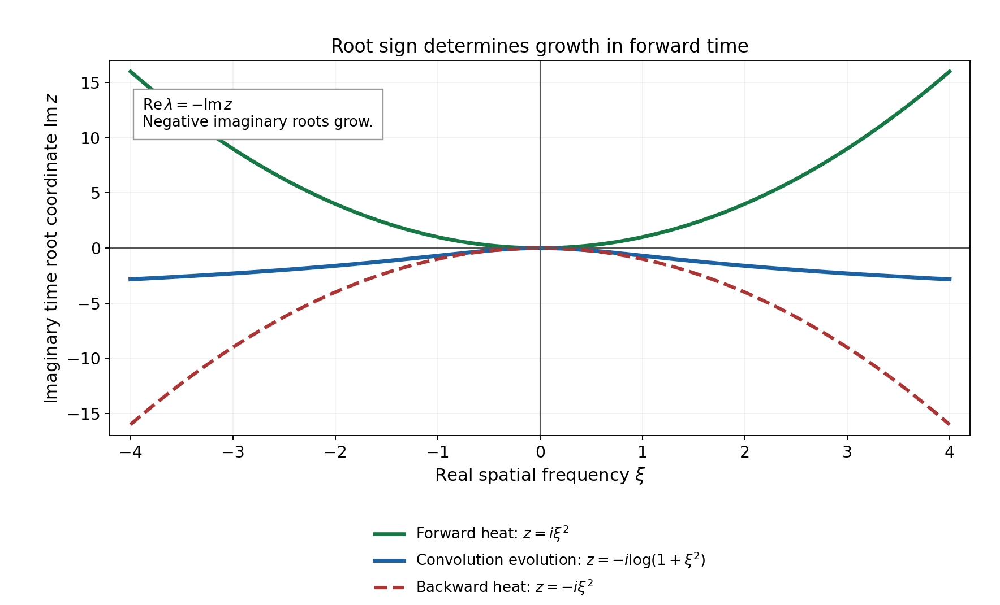
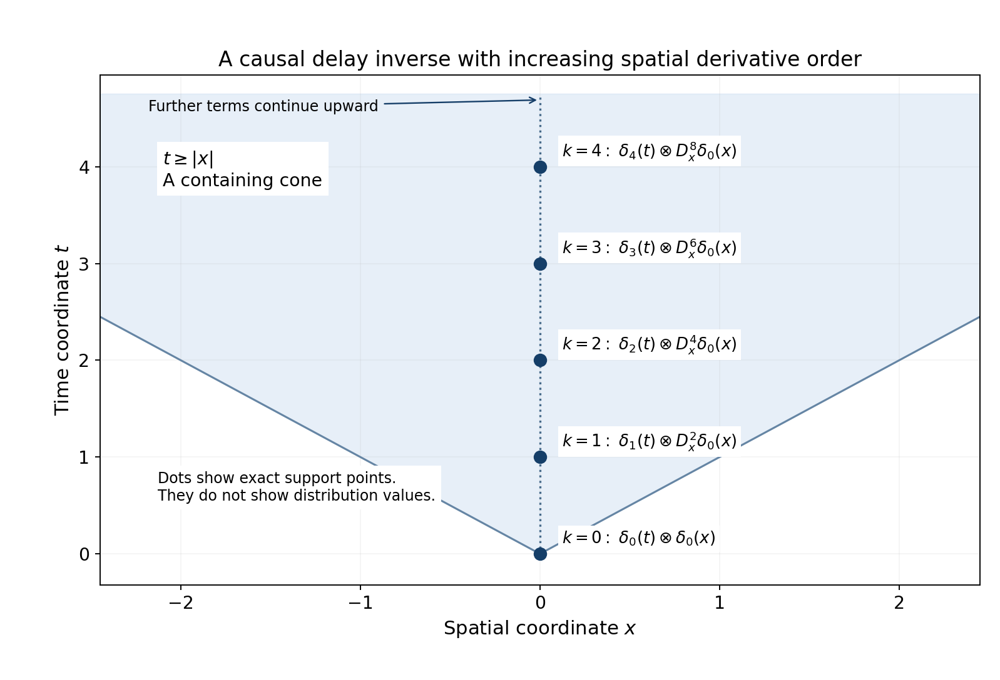

# Root growth and Cauchy evolution in Schwartz spaces

*Written by GPT-6.1 Sol (OpenAI), Ultra reasoning effort, October 2026. Self-checked by the writing AI. Public domain (CC0).*

The spatial growth class is part of a Cauchy problem. We will prove existence and uniqueness for the heat equation in Schwartz and tempered spatial classes, including its characteristic initial plane. The decisive question is what the spatial Fourier transform does to high frequencies. We prove that a logarithmic bound on the real parts of the evolution roots is exactly what permits arbitrary Schwartz or tempered initial data on every finite forward time interval. We also prove the forced formula, the higher time-order version, and the distinction between forward and reversible evolution.

Basic references are Laurent Schwartz's [Bourbaki talk on Petrowsky](https://www.numdam.org/item/SB_1948-1951__1__65_0.pdf), his [paper on evolution and convolution](https://www.numdam.org/item/10.5802/aif.18.pdf), and Jan Kisyński's [paper on Petrovskii correctness](https://arxiv.org/abs/0910.1120). The historical root-growth criterion is due to I. G. Petrovskii. All central evolution arguments are proved below.

Read Fourier transforms, finite spectra and convex separation, Section 1, for the Schwartz Fourier automorphism and its transpose on tempered distributions. Banach estimates, quotient spaces and compact parameter arguments, Sections 14.1–14.5 and 18, proves completeness of the defining Schwartz seminorms, uniform boundedness and the full Fréchet closed graph theorem. Polynomial and contour interfaces for stable boundary models, Sections 9.1–9.4 and 10, supplies complex polynomial factorization and finite linear algebra. Only the final polynomial improvement and the nonconstant leading coefficient use [Symbols at infinity](symbols-at-infinity.md), Lemmas 2.1 and 3.1, Corollary 3.2 and its positive-polynomial consequence. The main logarithmic equivalence does not require a semialgebraic theorem. We use ordinary scalar calculus, finite matrices, smooth compact cutoffs and distribution multiplication.

## The spatial classes and the time interval

Fix a spatial dimension \(d\geq1\) and a number of components \(r\geq1\). Vectors have their Euclidean norm and matrices its induced operator norm. On \(\mathcal S=\mathcal S(\mathbb R^d;\mathbb C^r)\), use the increasing seminorms
\[
 p_N(v)=\max_{|\alpha|\leq N}\sup_\xi
       (1+|\xi|)^N|\partial_\xi^\alpha v(\xi)|,
 \qquad N=0,1,\ldots .                                      \tag{1}
\]
They give the usual monomial Schwartz topology: a monomial of degree at most \(N\) is bounded by \((1+|\xi|)^N\), while expanding \((1+\sum_j|\xi_j|)^N\) bounds the latter weight by finitely many absolute monomials. Passing to finite maxima retains both families. Thus the cited completeness proof applies to (1).

Pairings with \(\mathcal S'\) are complex linear, with no complex conjugation. Its **strong topology** has seminorms
\[
 q_B(w)=\sup_{\phi\in B}|\langle w,\phi\rangle|,
 \qquad B\subset\mathcal S\text{ bounded}.                    \tag{2}
\]
Bounded means \(\sup_{\phi\in B}p_N(\phi)<\infty\) for every \(N\). Finite components use the sum of coordinate pairings. A continuous functional satisfies \(|\langle w,\phi\rangle|\leq C p_N(\phi)\) for some \(C,N\); this follows by rescaling a basic neighborhood of zero.

We use
\[
 Ff(\xi)=\int e^{-ix\cdot\xi}f(x)\,dx,\qquad
 F^{-1}v(x)=(2\pi)^{-d}\int e^{ix\cdot\xi}v(\xi)\,d\xi,
 \qquad D_x=-i\partial_x.                                   \tag{3}
\]
The transform is a continuous isomorphism on both classes. On the strong dual this follows directly by transposition: a continuous Schwartz map sends bounded sets to bounded sets, so its transpose satisfies a bound of the form (2). In particular \(F(D_x f)=\xi Ff\) and \(F\delta_0=1\).

If there are no spatial variables, take \(d=0\), \(\mathcal S=\mathbb C^r\) and its finite-dimensional dual, with the Fourier transform the identity. All matrix and time arguments below still apply. The frequency set is a single point, so its root bound is automatically a constant. The frequency-sequence obstruction is needed only when \(d\geq1\).

For \(0<T<\infty\), a solution trajectory is in \(C^1([0,T];E)\), where \(E=\mathcal S\) or \(\mathcal S'\) with the topology just specified. Derivatives at the two endpoints are one-sided. Continuity and differentiability are in every defining seminorm. On the half-line, these conditions are required on each finite interval. No estimate uniform in all positive times is part of this definition. In particular a trajectory may grow exponentially in time without being a tempered distribution on all of space-time.

Let \(A:\mathbb R^d\to\mathbb C^{r\times r}\) be smooth and assume
\[
 \forall\alpha\quad \exists C_\alpha,N_\alpha:
 \quad \|\partial_\xi^\alpha A(\xi)\|
      \leq C_\alpha(1+|\xi|)^{N_\alpha}.                       \tag{4}
\]
This is the slowly increasing multiplier class \(\mathcal O_M\). All polynomial matrices belong to it. The Leibniz rule shows that multiplication by \(A\) is continuous on \(\mathcal S\): every term in \(p_N(A\phi)\) is bounded by a constant times some \(p_L(\phi)\). On the strong dual define
\[
 \langle Aw,\phi\rangle=\langle w,A^{\mathsf T}\phi\rangle.
                                                                  \tag{5}
\]
If \(B\) is bounded, \(A^{\mathsf T}B\) is bounded, so (5) is continuous for (2). This is a transpose, not a Hermitian adjoint.

In Fourier variables our initial-value problem is
\[
 w'(t)=A(\xi)w(t)+g(t),\qquad w(0)=w_0.                    \tag{6}
\]
In spatial variables its generator is \(F^{-1}AF\). It is a constant coefficient differential operator when \(A\) is polynomial, and a spatial convolution operator in the multiplier sense for general (4).

## A finite matrix estimate that keeps multiple roots

Write
\[
 s(\xi)=\max\{\operatorname{Re}\lambda:
                   \det(\lambda I-A(\xi))=0\},\qquad
 M(t,\xi)=e^{tA(\xi)}.                                    \tag{7}
\]
All multiplicities and nontrivial Jordan blocks are allowed. No smooth choice of individual eigenvalues or eigenvectors is required.

**Lemma 2.1.** For any \(r\times r\) matrix \(B\), with spectral bound \(s_B\), and any \(t\geq0\),
\[
 \|e^{tB}\|\leq e^{t s_B}
       \sum_{k=0}^{r-1}\frac{(2t\|B\|)^k}{k!}.               \tag{8}
\]

**Proof.** Choose a unit eigenvector using complex root existence and the determinant-kernel criterion. Complete it to an orthonormal basis. In that basis the first column has zeros below the diagonal, and the lower square block has dimension \(r-1\). Induct on that block, using unitary changes on its orthogonal coordinate space. This gives a unitary upper triangularization \(U^*BU=D+R\), where \(D\) is diagonal and \(R\) strictly upper triangular. Each diagonal eigenvalue has modulus at most \(\|B\|\), because \(Bv=\lambda v\) for a unit vector. Hence \(\|D\|\leq\|B\|\) and \(\|R\|\leq2\|B\|\).

The exponential series and its derivatives converge uniformly on bounded time and matrix sets, by the factorial majorant. Thus the series solves its matrix ODE. Variation of constants, obtained by differentiating \(e^{-tD}e^{t(D+R)}\), gives
\[
 E(t)=e^{tD}+\int_0^t e^{(t-u)D}R E(u)\,du.               \tag{9}
\]
Iterating (9) leaves terms with successively more factors \(R\). A product of \(r\) strictly upper triangular factors separated by diagonal matrices is zero: each nonzero entry would need a strictly increasing chain of \(r+1\) indices in \(\{1,\ldots,r\}\). Thus the iteration ends exactly after \(r-1\) factors, with zero remainder. The diagonal exponentials in a \(k\)-fold term have nonnegative times summing to \(t\), so their product norm is bounded by \(e^{t s_B}\). Its simplex has volume \(t^k/k!\), found by iterated integration of one. Summing the resulting bounds and using unitary invariance gives (8). This proof works for repeated eigenvalues, \(r=1\), \(B=0\) and \(t=0\). \(\square\)

**Lemma 2.2.** Under (4), the following two conditions are equivalent:
\[
 s(\xi)\leq a+b\log(2+|\xi|)
       \quad(\xi\in\mathbb R^d),\qquad a,b\geq0;             \tag{10}
\]
\[
 \forall T>0\ \forall\alpha,j\quad\exists C,N:\quad
 \sup_{0\leq t\leq T}
 \|\partial_t^j\partial_\xi^\alpha M(t,\xi)\|
       \leq C(1+|\xi|)^N.                                \tag{11}
\]
Already the case \(\alpha=j=0\) at any single positive time implies (10).

**Proof.** By (4), \(\|A(\xi)\|\leq C(1+|\xi|)^L\) for some integer \(L\). Equations (8) and (10) give, for \(0\leq t\leq T\),
\[
 \|M(t,\xi)\|\leq C_T(1+|\xi|)^{L(r-1)+\lceil bT\rceil}.
                                                                  \tag{12}
\]
The factor \(e^{at}\) is bounded by \(e^{aT}\); \((2+|\xi|)^{bt}\) is bounded by \(2^{bT}(1+|\xi|)^{\lceil bT\rceil}\). Constants may depend on \(T\).

The exponential series is smooth in \((t,\xi)\). On every compact parameter set, each differentiated term is bounded by a fixed power of its index times a factorial majorant, so termwise differentiation is justified by uniform convergence and the scalar fundamental theorem of calculus. Set \(V_\alpha=\partial_\xi^\alpha M\). For \(|\alpha|>0\), differentiating the ODE gives
\[
 \begin{aligned}
 V_\alpha'&=A V_\alpha+
    \sum_{0<\beta\leq\alpha}{\alpha\choose\beta}
        (\partial_\xi^\beta A)V_{\alpha-\beta},\qquad
 V_\alpha(0)=0,\\
 V_\alpha(t)&=\int_0^t M(t-u)
    \sum_{0<\beta\leq\alpha}{\alpha\choose\beta}
        (\partial_\xi^\beta A)V_{\alpha-\beta}(u)\,du .
 \end{aligned}                                                   \tag{13}
\]
The second formula follows by differentiating \(e^{-tA}V_\alpha(t)\) for each fixed \(\xi\); invertibility here is the finite identity \(e^{-tA}e^{tA}=I\), obtained by multiplying the absolutely convergent series. Induction on \(|\alpha|\), using (4), (12), finite products and an integral of length at most \(T\), gives a polynomial bound for every \(V_\alpha\). Finally \(\partial_t^j M=A^jM\), and its \(\xi\)-derivatives have the finite Leibniz expansion. This proves (11) without differentiating roots or a diagonalizing basis.

Conversely let \(\|M(t_*,\xi)\|\leq C(1+|\xi|)^N\), \(t_*>0\). If \(Av=\lambda v\), the series gives \(M(t_*)v=e^{t_*\lambda}v\). A unit eigenvector therefore gives
\[
 e^{t_*s(\xi)}\leq\|M(t_*,\xi)\|,
 \qquad s(\xi)\leq t_*^{-1}
           \bigl(\log C+N\log(1+|\xi|)\bigr).                \tag{14}
\]
Increasing the constants to nonnegative values gives (10). \(\square\)

The triangular estimate explains why a root bound alone suffices even when the matrix is far from normal. Its additional factor is polynomial in \(\|A\|\), rather than exponential in \(\|A\|\).

## Uniqueness before growth estimates

**Lemma 3.1.** For any smooth \(A\), regardless of its behavior at infinity, a \(C^1\) trajectory in spatial distributions that satisfies \(w'=Aw\) is locally in frequency equal to \(M(t)w(0)\). In particular a solution in either class of (6) is unique.

**Proof.** On a compact frequency set all derivatives of \(M(-t,\xi)\) are bounded uniformly for \(t\in[0,T]\). It acts on distributions locally even when it is not a Schwartz multiplier. For a compactly supported smooth vector test \(\phi\), differentiate
\[
 \langle M(-t)w(t),\phi\rangle
     =\langle w(t),M(-t)^{\mathsf T}\phi\rangle.              \tag{15}
\]
The product rule is valid with this moving test. To check it, split its difference quotient into the change of \(w\) tested at the fixed test and the change of the test paired with \(w(t+h)\). Taylor's formula gives convergence of the test quotient in every compact smooth seminorm. The family \(w(t+h)\), for \(h\) in a compact small interval, is uniformly bounded on such tests. Indeed each fixed test pairing is bounded by continuity; the uniform boundedness theorem on the Fréchet space of tests supported in that compact gives one finite derivative order. The same estimate permits the product-rule limit. A strong \(\mathcal S'\) trajectory satisfies these local hypotheses, and a Schwartz trajectory does too.

Since \(A\) commutes with its exponential, the two derivatives in (15) cancel. The scalar fundamental theorem gives \(M(-t)w(t)=w(0)\) as distributions on every compact frequency neighborhood. Multiplying locally by \(M(t)\) gives the assertion. This equality is local, so it has not assumed a global multiplier estimate. Subtracting two forced solutions proves uniqueness as well. \(\square\)

## Arbitrary data are equivalent to the logarithmic bound

**Theorem 4.1.** Let (4) hold. The following conditions are equivalent.

1. The logarithmic spectral bound (10) holds.
2. For every \(w_0\in\mathcal S\), the homogeneous problem \(w'=Aw\), \(w(0)=w_0\), has a \(C^1([0,T_*];\mathcal S)\) solution on one fixed interval \(T_*>0\).
3. For every \(w_0\in\mathcal S'\), the same problem has a \(C^1([0,T_*];\mathcal S')\) solution in the strong topology on one fixed interval \(T_*>0\).

Each implies unique smooth homogeneous trajectories on every finite forward interval and continuous dependence on initial data, locally uniformly in time. The interval in conditions 2 and 3 is common to all data. A datum-dependent existence time is not asserted to be equivalent.

**Proof of sufficiency.** Lemma 2.2 and the finite Leibniz rule give, for every \(N,j,T\), some \(C,L\) such that
\[
 \sup_{0\leq t\leq T}p_N((\partial_t^jM(t))\phi)
                 \leq C p_L(\phi).                         \tag{16}
\]
Thus \(w(t)=M(t)w_0\) belongs to \(\mathcal S\). Taylor's integral remainder in \(t\), using (16) for one additional derivative, proves its continuity and all difference-quotient limits in every \(p_N\). It solves the ODE and has initial value \(w_0\).

For tempered data define \(M(t)w_0\) by transposition, as in (5). For any bounded \(B\subset\mathcal S\) the set
\[
 C_{B,j,T}=\{(\partial_t^j M(t))^{\mathsf T}\phi:
                   0\leq t\leq T,\ \phi\in B\}             \tag{17}
\]
is bounded by (16). Hence
\[
 \sup_{0\leq t\leq T}q_B((\partial_t^jM(t))w_0)
                   \leq q_{C_{B,j,T}}(w_0).                \tag{18}
\]
For a fixed \(w_0\), choose \(|\langle w_0,\psi\rangle|\leq C_0p_m(\psi)\). The first-order Taylor remainder, uniformly for \(\phi\in B\), is \(O(|h|)\) in \(p_m\), by (16) for the second time derivative. Pairing with \(w_0\) makes the difference quotient converge uniformly on \(B\). Applying the same argument to every time derivative proves a smooth strong trajectory and (6). Equations (16) and (18) give the stated locally uniform continuous dependence. Lemma 3.1 gives uniqueness.

**Necessity from Schwartz existence.** Work in frequency variables. Let \(X\) be the closed subspace of \(C^1([0,T_*];\mathcal S)\) consisting of solutions of \(w'=Aw\), with its trajectory seminorms
\[
 \max_{j=0,1}\sup_{0\leq t\leq T_*}p_N(w^{(j)}(t)).          \tag{19}
\]
This trajectory space is Fréchet. A Cauchy sequence has uniformly convergent function and first-derivative sequences in every Schwartz seminorm; their pointwise limits \(w,v\) exist by completeness of \(\mathcal S\) and are continuous. Applying spatial derivative evaluations to the scalar fundamental theorem gives \(w(t)-w(s)=\int_s^t v(u)\,du\) pointwise with every spatial derivative. Consequently, for each \(N\), the seminorm of \((w(t+h)-w(t))/h-v(t)\) is at most \(\sup_{u\text{ between }t\text{ and }t+h}p_N(v(u)-v(t))\), which tends to zero. This proves that \(v=w'\) without assuming an abstract vector integration theorem. The same seminorm estimates give convergence in (19). The equation defining \(X\) is closed because multiplication by \(A\) is continuous.

The evaluation \(J:X\to\mathcal S\), \(Jw=w(0)\), is continuous, bijective by the all-data hypothesis and Lemma 3.1. Its inverse has closed graph: convergence in \(X\) preserves the initial value. The Fréchet closed graph theorem therefore makes the data-to-trajectory map continuous. In particular for any \(t_*\in(0,T_*]\),
\[
 p_0(w(t_*))\leq C p_N(w_0)                               \tag{20}
\]
for some \(C,N\). Choose a scalar bump \(\chi\in C_c^\infty\), equal to one at zero, and a unit vector \(v\). Set \(w_0(\eta)=\chi(\eta-\xi)v\). Its seminorm is at most \(C_\chi(1+|\xi|)^N\). Lemma 3.1 identifies its solution locally with \(M(t,\eta)w_0(\eta)\). Evaluating (20) at \(\eta=\xi\) and taking the supremum over unit \(v\) gives the polynomial bound for \(\|M(t_*,\xi)\|\). Equation (14) proves (10). This derives continuity rather than presupposing it in condition 2.

**Necessity from tempered existence.** Suppose (10) fails, and fix \(t_*\in(0,T_*]\). The smooth matrix is bounded on compact frequency sets, so its spectral real parts are bounded there. Failure of every logarithmic upper bound permits a sequence \(\xi_k\), after successive choices, with
\[
 |\xi_k|\geq2^k,\qquad
 |\xi_{k+1}|>|\xi_k|+3,\qquad
 e^{t_*\operatorname{Re}\lambda_k}>(2+|\xi_k|)^k,            \tag{21}
\]
where \(A(\xi_k)v_k=\lambda_kv_k\) and \(|v_k|=1\). To see that choices can always avoid a given compact set, the quotient \(s(\xi)/\log(2+|\xi|)\) is bounded there, whereas failure of (10) makes it unbounded globally. Each chosen eigenvector has a component of absolute value at least \(r^{-1/2}\). An infinite subsequence has the same such component index \(\ell\); relabeling preserves (21), with the exponent at least its new index.

The vector distribution
\[
 w_0=\sum_{k=1}^{\infty}v_k\delta_{\xi_k}                   \tag{22}
\]
is tempered: \(\sum_k|\phi(\xi_k)|\leq p_1(\phi)\sum_k(1+2^k)^{-1}\). Its sum is locally finite. By condition 3 it has a strong solution. Lemma 3.1 gives, near each selected frequency,
\[
 w(t_*)=e^{t_*\lambda_k}v_k\delta_{\xi_k}.                 \tag{23}
\]
Choose one scalar bump supported in the unit ball and equal to one at zero. Testing (23) on its translate centered at \(\xi_k\), in component \(\ell\), gives absolute value at least \(r^{-1/2}e^{t_*\operatorname{Re}\lambda_k}\). Temperedness of \(w(t_*)\) would bound that value by \(C p_N(\chi(\cdot-\xi_k)e_\ell)\leq C_\chi'(1+|\xi_k|)^N\) for one fixed \(C,N\). This contradicts (21) for large \(k\). Thus (10) holds. No closed graph theorem on \(\mathcal S'\), reflexivity claim or assumed continuous data map is used in this direction. \(\square\)

**Corollary 4.2 (time reversal).** Arbitrary data in either class can be evolved both forward and backward on finite intervals if and only if
\[
 |\operatorname{Re}\lambda|\leq a+b\log(2+|\xi|)
       \quad\bigl(\lambda\in\operatorname{spec}A(\xi)\bigr). \tag{24}
\]
Apply Theorem 4.1 to \(A\) and \(-A\). Translation of the initial time gives any finite interval starting at any \(t_0\). A final-value problem on \([0,T]\) tests \(-A\). These two directions are different for the heat equation.

## Forcing and the strong tempered integral

**Theorem 5.1.** Under (10), for \(E=\mathcal S\) or strong \(\mathcal S'\), any \(w_0\in E\) and \(g\in C([0,T];E)\) have exactly one solution of (6) in \(C^1([0,T];E)\), given by
\[
 w(t)=M(t)w_0+\int_0^t M(t-u)g(u)\,du.                    \tag{25}
\]
For \(g\in C^k\), the solution is \(C^{k+1}\), and for smooth \(g\) it is smooth. The solution depends continuously on \(w_0,g\) for the trajectory topologies.

**Proof.** In \(\mathcal S\), the integrand is continuous in every seminorm: use (16) to separate the change of \(g\) from the change of \(M\). Riemann sums converge in every seminorm by uniform continuity on the compact time triangle and completeness. The scalar pairing integral agrees with this limit. Its defining estimate is
\[
 p_N\left(\int_0^tM(t-u)g(u)\,du\right)
       \leq C T\sup_{0\leq u\leq T}p_L(g(u)).               \tag{26}
\]
Taylor remainders or the difference of integrals at \(t+h\) and \(t\) give the derivative as \(g(t)+A\int_0^tM(t-u)g(u)\,du\), including the one-sided endpoints.

For strong tempered forcing, first note a uniform functional bound
\[
 |\langle g(u),\psi\rangle|\leq C p_m(\psi),
               \qquad 0\leq u\leq T.                      \tag{27}
\]
Each fixed pairing is bounded by continuity in time, and the uniform boundedness theorem on the Fréchet space \(\mathcal S\) gives (27). Define the integral by
\[
 \langle I(t),\phi\rangle
   =\int_0^t\langle g(u),M(t-u)^{\mathsf T}\phi\rangle\,du. \tag{28}
\]
The integrand is scalar continuous. Equations (27) and (16) bound the resulting functional by \(CTp_L(\phi)\), so \(I(t)\in\mathcal S'\). There is no unsupported assertion of an integral in a complete abstract dual space.

For a bounded set \(B\), all transformed tests \(M(v)^{\mathsf T}\phi\), \(0\leq v\leq T\), \(\phi\in B\), form a bounded set \(C_B\). The continuity of \(g\) in the seminorm \(q_{C_B}\), and Taylor's estimate (16) paired through (27), show uniformly on \(B\) that Riemann sums in (28) converge and that \(I(t)\) is strongly continuous. They also give
\[
 \sup_{0\leq t\leq T}q_B(I(t))
       \leq T\sup_{0\leq u\leq T}q_{C_B}(g(u)).             \tag{29}
\]
More explicitly, when two parameter points on the time triangle are close, the pairing change due to \(g\) is bounded by \(q_{C_B}(g(u)-g(u'))\); the change due to \(M\) is bounded through (27) by its \(p_m\) Taylor estimate, uniformly on \(B\). Both tend to zero uniformly. This is exactly the estimate needed for Riemann sums and their limits.

In the difference quotient for (28), the common interval contributes the strong limit \(AI(t)\) by the first time derivative of \(M\) and its uniform Taylor remainder. The extra interval, with its orientation when \(h<0\), contributes \(g(t)\): its transformed tests approach \(\phi\) uniformly in every \(p_m\), and strong continuity of \(g\) controls the other change. Thus \(I'=AI+g\) strongly. Together with (18) and (29), this proves the claimed existence, differentiability and continuous dependence. The equation successively gives higher derivatives when \(g\) has them. Lemma 3.1 gives uniqueness. \(\square\)

For completeness, the spatial convolution notation in this theorem has an exact meaning. Put \(K_t=F^{-1}M(t)\), entry by entry as tempered distributions. For \(f\in\mathcal S\), define the ordinary smooth convolution by \((K_t*f)(x)=\langle K_t(y),f(x-y)\rangle\), with matrix multiplication. This equals \(F^{-1}(M(t)Ff)\): insert (3) for the test \(f(x-\cdot)\) into the distributional inverse-transform pairing. Its Fourier transform is \(e^{-ix\cdot\eta}Ff(-\eta)\); reflection in the inverse transform changes this to \(e^{ix\cdot\xi}Ff(\xi)\), with the factor \((2\pi)^{-d}\). The product is integrable by the polynomial bound and rapid decay. For arbitrary tempered \(f\), the same notation denotes its continuous extension defined by the Fourier multiplier and (5). It is not an assertion that an arbitrary pair of tempered distributions has an ordinary convolution. In these conventions \(K_0=\delta_0 I\), and (25) becomes
\[
 u(t)=K_t*u_0+\int_0^tK_{t-v}*f(v)\,dv.                    \tag{30}
\]

## Higher time order and the imaginary-root sign

The same formulation applies to any nonzero real time normal \(N\) in \(\mathbb R^{1+d}\). Use \(n=N/|N|\), \(t=n\cdot X\) and orthonormal coordinates on \(n^\perp\). An orthogonal coordinate change preserves the Schwartz topology by the finite chain rule and the Euclidean weight. A complex covector on the time ray is \(\zeta=\xi+zn\), \(\xi\in n^\perp\) real. In the unnormalized convention \(\operatorname{Im}\zeta=\tau N\), its time coordinate satisfies \(\operatorname{Im}z=|N|\tau\). Consequently an exponential factor \(e^{c\tau}\) becomes \(e^{(c/|N|)\operatorname{Im}z}\); the forward halfspace is unchanged. This keeps the imaginary-root sign under normalization.

Let
\[
 P(z,\xi)=\sum_{j=0}^q a_j(\xi)z^j,
 \qquad q\geq1,\qquad a_q(\xi)\ne0\ (\xi\in\mathbb R^d),  \tag{31}
\]
where the coefficients are complex polynomials. A nonzero constant \(a_q\) is the ordinary equation solved for the highest time derivative. The more general nonvanishing assumption still permits inversion in the same spatial classes.

Indeed \(|a_q|^2\) is a positive real polynomial. The positive-polynomial bound in *Symbols at infinity* gives \(|a_q(\xi)|\geq c(1+|\xi|)^{-L}\). Repeated differentiation of \(a_q^{-1}\) is a finite sum of products of polynomial derivatives divided by powers of \(a_q\). Every derivative therefore has a polynomial bound. Thus \(a_q^{-1}\in\mathcal O_M\), and multiplication by it is an inverse on both spatial classes. No division of a distribution at a zero is being assumed.

Consider
\[
 P(D_t,D_x)u=f,\qquad D_t=-i\partial_t,
 \qquad \partial_t^j u(0)=h_j\quad(0\leq j<q).              \tag{32}
\]
After Fourier transformation in \(x\), set \(W=(v,\partial_tv,\ldots,\partial_t^{q-1}v)^{\mathsf T}\). Its equation is
\[
 W'=A_P(\xi)W+i^q a_q(\xi)^{-1}e_q Ff,
 \quad W(0)=(Fh_0,\ldots,Fh_{q-1})^{\mathsf T},             \tag{33}
\]
where the first \(q-1\) rows of \(A_P\) have a one immediately above the diagonal and zero elsewhere, and its last row, indexed by \(j=0,\ldots,q-1\), is
\[
 (A_P)_{q,j+1}=-i^{q-j}\frac{a_j(\xi)}{a_q(\xi)}.          \tag{34}
\]
These signs follow by dividing \(\sum_j a_j(-i)^j\partial_t^jv=Ff\) by \((-i)^qa_q\). In particular the forcing factor is \(i^q/a_q\). The matrix satisfies (4).

Its characteristic roots are precisely
\[
 \lambda=iz,\qquad P(z,\xi)=0,
 \qquad \operatorname{Re}\lambda=-\operatorname{Im}z.        \tag{35}
\]
For example a root \(\lambda\) gives the nonzero companion vector \((1,\lambda,\ldots,\lambda^{q-1})^{\mathsf T}\); the last row equation is the divided polynomial equation. Conversely the first rows of an eigenvector determine all components from the first, which cannot vanish, and the last row gives the same polynomial. The full characteristic determinant is the monic polynomial \(P(-i\lambda,\xi)/[(-i)^qa_q(\xi)]\): expansion along the companion rows, or induction on their size, gives coefficients \(i^{q-j}a_j/a_q\). Thus multiplicities also agree.

The elementary monic root bound gives a uniform polynomial modulus bound
\[
 |z|\leq C(1+|\xi|)^L\qquad(P(z,\xi)=0).                  \tag{36}
\]
To verify it, put \(b_j=a_j/a_q\). If \(|z|>1+\max_{j<q}|b_j|\), then \(\sum_{j<q}|b_j||z|^j<|z|^q\), by the geometric sum, so the monic polynomial cannot vanish. The ratios are polynomially bounded as just proved.

**Theorem 6.1.** Under (31), the following are equivalent: arbitrary initial traces \(h_0,\ldots,h_{q-1}\) in \(\mathcal S\) admit a solution of (32) with \(f=0\) in \(C^q([0,T_*];\mathcal S)\); arbitrary initial traces in strong \(\mathcal S'\) admit such a solution; and there are constants \(a,b\geq0\) such that
\[
 -\operatorname{Im}z\leq a+b\log(2+|\xi|)
                  \qquad(P(z,\xi)=0).                     \tag{37}
\]
Here \(T_*>0\) is fixed for all traces. Each implies unique smooth homogeneous solutions on every finite forward interval. For continuous forcing in either class, the solution is \(C^q\); the first component of (25) applied to (33) is its complete forced formula. Conversely any \(C^q\) solution gives the \(C^1\) companion trajectory. The first companion rows ensure that the constructed components really are the successive derivatives of the first. This proves the equivalence by Theorem 4.1, including all \(q\) independent traces.

An equivalent form of (37), concerning only roots with \(\operatorname{Im}z<0\), is the existence of \(C>0\), an integer \(N\geq0\) and \(c>0\) such that
\[
 1\leq C(1+|(z,\xi)|)^N e^{c\operatorname{Im}z},
 \qquad c>0.                                               \tag{38}
\]
From (38), taking logarithms and using (36) gives (37). From (37), use \(|(z,\xi)|\geq|\xi|\), increase \(C\), and choose integer \(N\geq cb\) to obtain (38). Roots with nonnegative imaginary part already satisfy the upper bound in (37) after increasing \(a\). The negative sign in (35) explains the direction of this estimate: negative imaginary time roots grow in positive time.

If \(P\) has total degree \(m\), the initial plane \(t=0\) is noncharacteristic precisely when \(P_m(e_t)\ne0\). In (31) this occurs exactly when \(q=m\) and \(a_q\) is a nonzero constant. When \(q<m\), the plane is characteristic in the total-degree sense, but Theorem 6.1 still applies. No unrestricted smooth uniqueness across a characteristic plane is inferred. The required spatial growth class is retained throughout.

### A noncharacteristic time normal

**Corollary 6.2.** Let \(P\) be a polynomial of total degree \(m\geq1\), let \(P_m\) be its principal homogeneous part, and let \(N\ne0\) be real with \(P_m(N)\ne0\). Write \(n=N/|N|\), \(t=n\cdot X\), and use orthonormal spatial coordinates on \(n^\perp\). The following are equivalent:

1. Every \(m\)-tuple of initial traces in \(\mathcal S(n^\perp)\) has a homogeneous solution in \(C^m([0,T_*];\mathcal S)\), on one fixed interval \(T_*>0\).
2. Every \(m\)-tuple of initial traces in strong \(\mathcal S'(n^\perp)\) has a homogeneous solution in \(C^m([0,T_*];\mathcal S')\), on one fixed interval \(T_*>0\).
3. There are \(C>0\), an integer \(k\geq0\), and \(c>0\) such that
   \[
   1\leq C(1+|\zeta|)^k e^{c\tau}
   \quad\text{whenever }P(\zeta)=0,\quad
   \operatorname{Im}\zeta=\tau N,\quad \tau<0 .
   \]

Each condition gives a unique smooth homogeneous trajectory on every finite forward interval. With continuous forcing in the stated spatial class, the solution is \(C^m\), and its formula is the first component of (25) with the companion matrix (33).

**Proof.** In these coordinates put \(Q(z,\eta)=P(\eta+zn)\), with \(\eta\in n^\perp\) real. Its coefficient of \(z^m\) is the nonzero constant \(P_m(n)=|N|^{-m}P_m(N)\). Indeed, a term containing \(z^m\) already has the full total degree \(m\), so it has no remaining spatial factor. Thus (31) holds with \(q=m\). Every complex covector with imaginary part \(\tau N\) is uniquely of the form \(\eta+zn\), where \(\operatorname{Im}z=|N|\tau\), and its norm is \((|\eta|^2+|z|^2)^{1/2}\). Condition 3 is therefore exactly (38), with its positive exponential constant rescaled by \(|N|^{-1}\). The equivalence of (37) and (38) and Theorem 6.1 prove the three equivalences. The same theorem, using Theorem 5.1, proves uniqueness, regularity and the forced formula. The time interval remains common to all initial data. \(\square\)

The nonvanishing leading coefficient is an assumption of Theorem 6.1. Without it, the root estimate alone can fail to give arbitrary trace data. For instance
\[
 P(z,\xi)=\xi z-1\quad(d=1)                               \tag{39}
\]
has only real time roots at nonzero real \(\xi\), hence a perfect one-sided root bound. At \(\xi=0\) it has no root, but its leading time coefficient vanishes. A \(C^1\) Schwartz solution of its homogeneous equation would satisfy \(-i\xi\partial_t v(t,\xi)-v(t,\xi)=0\), so \(v(0,0)=0\). Choosing a Schwartz initial transform equal to one at zero disproves arbitrary-data solvability. Root absence at that frequency does not remove the compatibility condition. Singular differential-algebraic time symbols require their own data spaces; they are not part of Theorem 6.1.

## Polynomial roots and a fixed barrier

For polynomial \(A\), (10) improves to \(s(\xi)\leq\omega\) for a constant \(\omega\). The same improvement holds for the rational companion matrix in (33). Here is the precise additional algebraic argument.

Let
\[
 h(R)=\max\left(\{0\}\cup
   \{\operatorname{Re}\lambda:
       |\xi|\leq R,\ \det(\lambda I-A(\xi))=0\}\right).      \tag{40}
\]
The maximum is attained: frequencies lie in a compact ball, eigenvalues have modulus at most the supremum of \(\|A\|\) on it, and the characteristic zero condition is closed. For a rational companion matrix, real denominators never vanish on the ball. Writing \(\lambda=u+iv\), the real and imaginary determinant equations, after clearing nonzero denominators, are real polynomial conditions. The graph of the maximum is semialgebraic by the projection lemma: express attainment and the absence of a larger feasible value with real quantifiers. Adjoining zero covers an entirely negative spectrum.

The function \(h\) is nonnegative, nondecreasing and bounded by \(a+b\log(2+R)\). The one-parameter power-expansion lemma says it is eventually zero or asymptotic to \(cR^\gamma\), \(c\ne0\), \(\gamma\) rational. If it were unbounded, nonnegativity and monotonicity would force \(c>0\) and \(\gamma>0\), contradicting the logarithmic upper bound. Thus \(h\) is bounded. Every frequency lies in one such ball, proving the constant spectral barrier. By (35) it is
\[
 \operatorname{Im}z\geq-\omega\qquad(P(z,\xi)=0).           \tag{41}
\]
In a noncharacteristic direction this is the usual full-polynomial hyperbolic root barrier. It includes complex lower order coefficients. For a characteristic evolution such as heat, the same one-sided root barrier holds in its spatial growth class while the principal noncharacteristic condition fails.

This improvement uses polynomial algebra. For the scalar multiplier
\[
 A(\xi)=\log(1+|\xi|^2),\qquad
 M(t,\xi)=(1+|\xi|^2)^t,                                 \tag{42}
\]
all derivatives of \(A\) have polynomial bounds, and (10) holds, but \(s(\xi)\) is unbounded. Lemma 2.2 and Theorems 4.1–5.1 still apply. Thus an unbounded logarithmic barrier really does occur for spatial convolution evolution. It allows finite-time polynomial derivative losses whose degrees increase with the time interval.

*Figure 1.* In one spatial dimension the forward heat symbol \(iz+\xi^2\) has roots \(z=i\xi^2\), while (42) has \(z=-i\log(1+\xi^2)\). The curves are exact imaginary-time root coordinates; their continuous traces are drawn from numerical samples. The lower curve escapes only logarithmically and still satisfies (38). The backward heat curve \(z=-i\xi^2\) violates it. Equations (35), (37) and (42) give the signs and the growth criterion.

## A compact delay convolution with logarithmic zeros

There is also a concrete space-time convolution example. In dimension \(1+1\), put
\[
 \mu=\delta_{(0,0)}-\delta_1(t)\otimes D_x^2\delta_0(x),
 \qquad
 E=\sum_{k=0}^{\infty}\delta_k(t)\otimes D_x^{2k}\delta_0(x).
                                                                  \tag{43}
\]
The sum defines a distribution: every compact time set meets only finitely many terms, each a finite derivative of a point mass. Both supports lie on the positive time axis, a proper closed convex cone. Their convolution exists locally by finite sums. Shifting the series once and multiplying by \(D_x^2\) cancels every term except \(k=0\), so
\[
 \mu*E=\delta_{(0,0)}.                                    \tag{44}
\]
No exchange of an infinite nonconvergent distribution series is needed; the equality on each compact set is a finite telescoping identity.

The Fourier–Laplace transform of the compact distribution \(\mu\) is
\[
 \widehat\mu(z,\xi)=1-\xi^2e^{-iz},\qquad
 z=2\pi\ell-2i\log|\xi|\quad
      (\widehat\mu(z,\xi)=0,\ \xi\ne0,\ \ell\in\mathbb Z).
                                                                  \tag{45}
\]
Indeed the modulus equation is \(e^{\operatorname{Im}z}=|\xi|^{-2}\), and the phase is \(\operatorname{Re}z\in2\pi\mathbb Z\). At \(\xi=0\) the transform is one. The negative imaginary roots are unbounded as \(|\xi|\to\infty\), but only logarithmically. A fixed zero-free half-plane cannot replace this logarithmic region. The example supplies an actual compact convolution operator and a causal inverse, rather than inferring a support theorem from a root sketch.

For forcing \(f\) smooth in time, identically zero for \(t<0\), and a Schwartz or strong tempered spatial trajectory, its solution is the locally finite expression
\[
 u(t)=\sum_{0\leq k\leq t}D_x^{2k}f(t-k).                 \tag{46}
\]
It is smooth across integer times if \(f\) is smooth across zero, because all its time derivatives there are zero. On each finite interval the sum involves finitely many continuous spatial derivative operators. Direct subtraction gives \(u(t)-D_x^2u(t-1)=f(t)\). A causal homogeneous solution vanishes on \(t<1\), then on \(t<2\), and successively on every finite interval, proving uniqueness in these trajectory classes. The analogous distributional uniqueness follows locally from the same delayed identity and support, with endpoints obtained by taking the open intervals \(t<k\).

The locally finite inverse (43) need not be a tempered distribution on all of space-time: its derivative orders \(2k\) increase without bound. A tempered distribution has one fixed finite derivative-order bound on tests, so a translate of a compact test whose first \(N\) derivatives are bounded but whose \(2k\)-th derivative at zero is arbitrarily large contradicts that bound once \(2k>N\). This failure does not affect finite-strip class solvability.

*Figure 2.* The dots are the support points \((t,x)=(k,0)\) of the first five terms of (43); labels give their spatial operators \(D_x^{2k}\). The drawing shows support and derivative order, not values of the distributions. The shaded cone is \(t\geq|x|\); all remaining support points continue on its central ray. Equation (44) cancels the delayed terms one by one, and (45) gives the logarithmic zero barrier. This example illustrates the logarithmic geometry of hyperbolic convolution equations. General open-cone reciprocal estimates and support characterizations for arbitrary compact convolution kernels are separate theorems; the example does not assert them.

For general compactly supported convolution kernels, [Support cones force reciprocal bounds](support-cones-force-reciprocal-bounds.md), Theorem 1.1, proves the support-to-reciprocal implication. [Logarithmic Fourier graphs construct a cone-supported inverse](logarithmic-fourier-graphs-construct-a-cone-supported-inverse.md), Theorem 1.1, proves the converse under its stated nonempty open-cone assumptions. Those proofs retain their own cone hypotheses; the delay example needs only its explicit locally finite cancellation.

## Exercises with complete solutions

**Exercise 1 (signs and time direction).** For \(P(z,\xi)=iz+|\xi|^2\), find the roots, determine whether the total-degree time plane is characteristic, and solve the Schwartz and tempered forward Cauchy problem. Does arbitrary-data backward evolution follow?

**Solution.** Its root is \(z=i|\xi|^2\), so the evolution root is \(\lambda=iz=-|\xi|^2\). Thus \(M(t,\xi)=e^{-t|\xi|^2}\), the forward root bound has \(a=b=0\), and \(u(t)=F^{-1}(e^{-t|\xi|^2}Fu_0)\). With forcing use (30). Since \(P\) has total degree two but time degree one, \(P_2(e_t)=0\): the plane is characteristic. Theorem 6.1 proves uniqueness in the specified classes, including tempered data, without unrestricted smooth uniqueness. Reversing time gives \(e^{t|\xi|^2}\) and roots with real part \(|\xi|^2\), which violate (10), so arbitrary-data backward evolution fails on every fixed positive interval.

**Exercise 2 (a multiple root with polynomial loss).** In one spatial dimension let \(A(\xi)=\begin{pmatrix}0&\xi^3\\0&0\end{pmatrix}\). Compute the evolution and its forced formula. Explain why diagonalizing individual roots is unnecessary.

**Solution.** Since \(A^2=0\), \(M=I+tA\). Both roots are zero, although the matrix has a nontrivial nilpotent part when \(\xi\ne0\). For \(w_0=(a,b)\) and \(g=(g_1,g_2)\),
\[
 \begin{aligned}
 w_2(t)&=b+\int_0^t g_2(s)\,ds,\\
 w_1(t)&=a+t\xi^3 b+
    \int_0^t\bigl(g_1(s)+(t-s)\xi^3g_2(s)\bigr)\,ds.
 \end{aligned}                                                   \tag{47}
\]
Differentiating gives \(w_1'=\xi^3w_2+g_1\), \(w_2'=g_2\), and the initial values. Multiplication by \(\xi^3\) is continuous on both classes. The root bound alone did not make \(M\) uniformly bounded in frequency, but its extra growth is only polynomial. Lemma 2.1 retains this effect without a root basis or a simple-spectrum assumption.

**Exercise 3 (higher-order normalization).** For \(P(z,\xi)=z^2-\xi^2\), write the companion equation, the homogeneous solution and the forcing integral for initial values \(u(0)=h_0\), \(u_t(0)=h_1\). Include \(\xi=0\).

**Solution.** Equations (33)–(34) give \(A_P=\begin{pmatrix}0&1\\-\xi^2&0\end{pmatrix}\) and forcing \((0,-Ff)\). This agrees with \(P(D)=-\partial_t^2+\partial_x^2\). With \(v=Fu\),
\[
 v(t,\xi)=\cos(t\xi)Fh_0(\xi)
       +\frac{\sin(t\xi)}{\xi}Fh_1(\xi)
       -\int_0^t\frac{\sin((t-s)\xi)}{\xi}Ff(s,\xi)\,ds.
                                                                  \tag{48}
\]
The quotient extends smoothly at zero with value \(t\), by its power series or \(\sin(t\xi)/\xi=\int_0^t\cos(s\xi)\,ds\). At zero (48) reads \(Fh_0(0)+tFh_1(0)-\int_0^t(t-s)Ff(s,0)\,ds\) for Schwartz data; the smooth multiplier extension is used for distributions. Twice differentiating checks \(v_{tt}=-\xi^2v-Ff\). Both time directions are permitted because \(\lambda=\pm i\xi\), with zero real part. The initial plane is noncharacteristic because the total and time degrees are both two and its leading time coefficient is one.

**Exercise 4 (a logarithm that does not become constant).** Prove directly that \(A(\xi)=\log(1+\xi^2)\) is in \(\mathcal O_M\), and describe its forward and backward solutions. Is the half-line trajectory necessarily tempered on all of space-time?

**Solution.** The zeroth derivative is bounded by a constant times \(1+|\xi|\); successive derivatives are rational functions with denominator a power of \(1+\xi^2\), hence polynomially bounded. Its real root \(\lambda=\log(1+\xi^2)\) obeys the two-sided logarithmic bound. Thus \(w(t)=(1+\xi^2)^tw_0\) for every finite interval in either direction. The real spectral bound is unbounded, so no constant barrier is possible. For a tempered datum \(w_0=\delta_{\xi=1}\), the trajectory is \(2^t\delta_1\); its inverse spatial transform is \((2\pi)^{-1}2^t e^{ix}\). Extended to the positive half-line, this is not a tempered space-time distribution, as compact tests translated far in positive time have exponential pairings against only polynomially growing Schwartz seminorms. The finite-interval theorem does not impose that stronger condition.

**Exercise 5 (failure of a root criterion with singular time coefficient).** Verify the root bound for (39), then give initial Schwartz data for which no \(C^1\) Schwartz solution exists. Explain why the scalar theorem excludes this case.

**Solution.** For real \(\xi\ne0\) the only root is \(z=1/\xi\in\mathbb R\); at \(\xi=0\) there is no root. Thus there are no negative imaginary time roots at all. Choose \(Fh_0(\xi)=e^{-\xi^2}\). A Schwartz trajectory is pointwise differentiable in time because evaluation is continuous. The transformed equation at \(\xi=0\) demands \(v(t,0)=0\), contrary to \(v(0,0)=1\). Here \(a_1(\xi)=\xi\) vanishes on the real frequency set and is not an invertible multiplier. The proof cannot form (33); a compatibility condition remains. A good root bound alone cannot justify division by a vanishing time-leading symbol.

**Exercise 6 (delay cancellation and exact support).** Verify (43)–(46), determine the zero set of the delay symbol, and prove that the whole inverse is not tempered although every finite-time portion is. Use the convention \(D_x=-i\partial_x\).

**Solution.** Let \(E_K=\sum_{k=0}^K\delta_k\otimes D_x^{2k}\delta_0\). Then
\[
 \mu*E_K=\delta_{(0,0)}-
            \delta_{K+1}(t)\otimes D_x^{2K+2}\delta_0(x).
                                                                  \tag{49}
\]
On any fixed compact time set the final term is absent for large \(K\), proving (44). Each coefficient is nonzero, so the exact support of \(E\) is \(\{(k,0):k\geq0\}\), not the entire shaded cone. The transform of \(D_x^2\delta_0\) is \(\xi^2\), so the delay symbol and its zeros are exactly (45), including the absence of zeros at \(\xi=0\). Convolving the locally finite series with causal smooth forcing gives (46). On \([0,T]\) at most \(\lfloor T\rfloor+1\) derivative terms occur, so the solution has the claimed spatial class, and direct delayed subtraction verifies the equation.

To make non-temperedness quantitative, suppose \(|E(\phi)|\leq C\max_{|\alpha|\leq N}\sup_{t,x}(1+|(t,x)|)^N|\partial^\alpha\phi(t,x)|\). Fix an integer \(k\) with \(2k>N\). Choose \(\rho\in C_c^\infty((-1/4,1/4))\), \(\rho(0)=1\), and \(\theta\in C_c^\infty((-1/4,1/4))\), equal to \(x^{2k}/(2k)!\) near zero. Set \(\theta_\varepsilon(x)=\varepsilon^N\theta(x/\varepsilon)\) and \(\phi_\varepsilon(t,x)=\rho(t-k)\theta_\varepsilon(x)\), \(0<\varepsilon<1\). For derivative orders at most \(N\), its weighted suprema are bounded uniformly in \(\varepsilon\), with a constant allowed to depend on the fixed \(k\). Only the \(k\)-th term of \(E\) meets its time support, and
\[
 |E(\phi_\varepsilon)|
   =|(-i)^{2k}\partial_x^{2k}\theta_\varepsilon(0)|
   =\varepsilon^{N-2k}\longrightarrow\infty.                \tag{50}
\]
This contradicts the tempered bound. Every compact time cutoff meets finitely many finite derivatives of point masses and is tempered. This distinction is precisely why the interval and the spatial class must be stated.

## References

- Laurent Schwartz, *Sur un mémoire de Petrowsky*, Séminaire Bourbaki, March 1949, exposé 11; published in the 1952 collection, 65–69. [Freely readable original](https://www.numdam.org/item/SB_1948-1951__1__65_0.pdf).
- Laurent Schwartz, *Les équations d'évolution liées au produit de composition*, Annales de l'Institut Fourier 2 (1950), 19–49. [Original paper](https://www.numdam.org/articles/10.5802/aif.18/).
- Jan Kisyński, *The Petrovskii correctness and semigroups of operators*, arXiv:0910.1120v1 (2009), Sections 2, 3, 8 and 9. [Primary manuscript](https://arxiv.org/abs/0910.1120).
- I. G. Petrovskii, *Über das Cauchysche Problem für ein System linearer partieller Differentialgleichungen im Gebiete der nichtanalytischen Funktionen*, Bulletin de l'Université d'État de Moscou 1, no. 7 (1938), 1–74. Historical attribution; the proofs needed here are supplied above.
