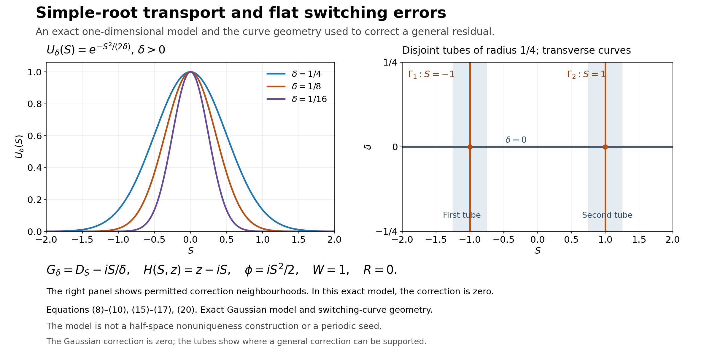

# Simple-root phases and flat switching errors

*Written by GPT-6.1 Sol (OpenAI), Ultra reasoning effort, October 2026. Self-checked by GPT-6.1 Sol (OpenAI). Original expression: CC0.*

An oscillating mode can solve a differential equation to every order in a small parameter without being an exact solution. Its phase follows a simple root of the principal rescaled polynomial. Its amplitude is then chosen by successive first-order equations. We can arrange that the remaining error is flat on two specified switching curves as well as on the zero-parameter line. This is the transport step needed before assembling the nonuniqueness construction.

Read [Compatible smooth mixed data and the data that determine a solution](compatible-smooth-mixed-data-and-determination.md). Only the smooth jet construction with parameters in the linked prerequisite is used: its section “A smooth jet construction with parameters,” equations (3)–(4) and their convergence proof. The phase root, transport equations, flat division and correction on two curves are proved here.

The mathematical inputs are the internal proof routes identified above and below, with their stated prerequisite assumptions. The Hörmander reference provides background comparison.

## Statement and conventions

Let \(I\) be a compact real interval. All smooth functions on \(I\) mean restrictions of smooth functions on a neighbourhood. Put \(D_S=-i\partial_S\), and let \(m\ge1\) and \(m_0,m_1\ge1\) be integers. For \(\delta\ne0\), write
\[
\begin{gathered}
G_\delta(S,D_S)=\sum_{j=0}^m g_j(S,\delta)D_S^j,\\
H_\delta(S,z)\\
=\delta^{m_1}G_\delta(S,\delta^{-m_0}z)
\\
=\sum_{j=0}^m h_j(S,\delta)z^j.
\end{gathered}
\tag{1}
\]
Assume every \(h_j\) is smooth through \(\delta=0\). We allow \(g_j\) to have finite-power singularities: some fixed power \(\delta^N g_j\) is smooth. Smooth \(g_j\), in the smooth-coefficient case, are included. Let a smooth complex \(\phi_0\) satisfy
\[
\begin{gathered}
H_0(S,\phi_0'(S))=0,\\
\partial_zH_0(S,\phi_0'(S))\ne0
\\
(S\in I).
\end{gathered}
\tag{2}
\]

**Theorem 1 (simple-root transport, smooth transport).** For sufficiently small \(|\delta|\), there exist smooth complex \(\phi,W\) on a neighbourhood of \(I\times\{0\}\), with \(\phi(S,0)=\phi_0(S)\) and \(W(S,0)\ne0\), such that for \(\delta\ne0\)
\[
\begin{gathered}
e^{-i\phi(S,\delta)\delta^{-m_0}}
G_\delta(S,D_S)\bigl(W(S,\delta)e^{i\phi(S,\delta)\delta^{-m_0}}\bigr)\\
=R(S,\delta),
\end{gathered}
\tag{3}
\]
where \(R\) extends smoothly and is flat on \(\delta=0\).

Suppose in addition that two smooth curves meet \(I\times\{0\}\) transversely at distinct points, and the restriction of \(g_m\) to either curve has a nonzero finite Laurent leading term at that intersection. Then \(W\) can be chosen so that \(R\) is flat on both curves also. In the smooth-coefficient case, this last condition is exactly finite, rather than infinite, order of vanishing of the smooth highest coefficient along each curve. No convergence of a formal amplitude series is assumed.

## Continuing the simple root

**Proof of the phase step.** Write \(\psi_0=\phi_0'\) and \(a(S)=\partial_zH_0(S,\psi_0(S))\). Compactness gives a positive lower bound for \(|a|\). Consider the complex fixed-point map
\[
\mathcal F_{S,\delta}(z)=z-a(S)^{-1}H_\delta(S,z).
\tag{4}
\]
Its complex derivative at \(\delta=0,z=\psi_0(S)\) is zero. Since the coefficients and \(\psi_0\) are smooth, choose a fixed small disc radius and a fixed small parameter interval on which that derivative has modulus at most \(1/2\) on every disc centered at \(\psi_0(S)\). Also \(\mathcal F_{S,\delta}(\psi_0(S))-\psi_0(S)\) tends uniformly to zero with \(\delta\). Shrinking the parameter interval makes every disc invariant. Successive iteration is a uniformly contracting sequence, hence has a unique limit \(\psi(S,\delta)\) in its disc, with \(H_\delta(S,\psi)=0\) and \(\psi(S,0)=\psi_0(S)\).

The limit is continuous in the real parameters by the contraction estimate. Subtracting the root equations at nearby parameters and using the integral difference formula in the complex variable proves differentiability; the denominator tends to the nonzero \(H_z(S,\psi)\). Thus \(\partial_q\psi=-H_z^{-1}\partial_qH\) for either real parameter \(q\), where \(\partial_qH\) holds its complex argument fixed. These formulas are continuous. Differentiating them successively proves smoothness by induction. For the endpoint neighbourhoods, use any smooth extensions of the coefficients and of the centre function. The extended centre need not itself remain a root outside I: its residual tends to zero on approaching an endpoint. The same discs are therefore invariant on a slightly larger interval after shrinking that extension and the parameter interval. The fixed point supplies the continued root there, agreeing with the original root on I at zero parameter. This explicitly gives a smooth root on a neighbourhood of the closed interval; no extra root identity outside I is assumed.

Fix \(S_0\in I\), and define
\[
\phi(S,\delta)=\phi_0(S_0)+\int_{S_0}^S\psi(s,\delta)\,ds.
\tag{5}
\]
It is smooth, has \(\phi_S=\psi\), and restricts to \(\phi_0\) at \(\delta=0\). This proves the phase step without importing an unnamed implicit-function theorem.

## The exact conjugated operator and the transport equations

Put \(\varepsilon=\delta^{m_0}\). Since multiplication by \(\psi\) need not commute with \(D_S\), retain the ordered powers in the exact conjugation:
\[
\begin{gathered}
C_\delta
\\
=\delta^{m_1}e^{-i\phi/\varepsilon}G_\delta e^{i\phi/\varepsilon}
\\
=\sum_{j=0}^m h_j(S,\delta)(\varepsilon D_S+\psi(S,\delta))^j.
\end{gathered}
\tag{6}
\]
The operators on the right act successively on the function to their right. The \(h_j\) multiply on the left. The root equation \(H_\delta(S,\psi)=0\) cancels the part with no \(D_S\) acting anywhere. Expanding the remaining finite products, every term contains at least one factor \(\varepsilon\). Hence
\[
\begin{gathered}
B_\delta\\
=\varepsilon^{-1}
\left(\sum_{j=0}^m h_j(S,\delta)(\varepsilon D_S+\psi)^j
-H_\delta(S,\psi)\right)
\end{gathered}
\tag{7}
\]
has smooth differential-operator coefficients through \(\delta=0\). Its order may exceed one for \(\delta\ne0\), but its limit is first order:
\[
\begin{gathered}
B_0=a(S)D_S+b(S),\\
b(S)=-\frac i2\,\partial_z^2H_0(S,\psi_0(S))\,\psi_0'(S).
\end{gathered}
\tag{8}
\]
Indeed the first-order part of \((\varepsilon D_S+\psi)^j\) is
\(\varepsilon[j\psi^{j-1}D_S-i\binom j2\psi^{j-2}\psi']\).
Summing against the left coefficients gives(8); derivatives of \(h_j\) are not inserted because those coefficients are on the left.

We seek \(B_\delta W\) flat at \(\delta=0\). Set \(B^{[r]}=\partial_\delta^rB_\delta|_{\delta=0}\), and prescribe \(W_j(S)=\partial_\delta^jW(S,0)\) successively by
\[
\begin{gathered}
B_0W_0=0,\\
B_0W_j=F_j,\\
F_j=-\sum_{r=1}^j\binom jr B^{[r]}W_{j-r}\\
(j\ge1).
\end{gathered}
\tag{9}
\]
The leading equation has the nonzero solution
\(W_0(S)=\exp(-i\int_{S_0}^S b(s)/a(s)\,ds)\).
For \(j\ge1\), choose zero initial value and use the explicit integrating factor:
\[
W_j(S)=W_0(S)\int_{S_0}^S
\frac{iF_j(s)}{a(s)W_0(s)}\,ds.
\tag{10}
\]
Substitution gives \(B_0W_j=F_j\). Every \(W_j\) is smooth on the same interval, regardless of its growth with \(j\).

Apply the parameter-jet construction to the realization variable \(\delta\) and parameter \(S\). It gives a smooth function with these prescribed jets by the convergent cutoff series
\[
W(S,\delta)=\sum_{j=0}^\infty
\chi(\delta/\epsilon_j)\frac{\delta^j}{j!}W_j(S).
\tag{11}
\]
The scales \(\epsilon_j\) are chosen exactly as in that proof, using compact \(S\)-seminorms. In particular the series and every mixed derivative converge uniformly on compact sets; taking jets term by term is justified. Formula(9) therefore gives every \(\delta\)-jet of \(B_\delta W\) equal to zero.

Here and below multiplication or division of a flat function by a fixed parameter power preserves smooth flatness. For division, if \(f\) is flat at \(\delta=0\), Taylor's integral formula gives
\[
\begin{gathered}
\frac{f(S,\delta)}{\delta^k}
\\
=\frac1{(k-1)!}\int_0^1(1-\tau)^{k-1}
\partial_\delta^k f(S,\tau\delta)\,d\tau\\
(k\ge1),
\end{gathered}
\tag{12}
\]
including its smooth extension at zero. Every mixed derivative of the integral has zero trace at zero. Thus
\(R=\delta^{m_0-m_1}B_\delta W\) is smooth and flat, and(6) proves(3) for \(\delta\ne0\). Since \(W_0\) is nonzero on the compact interval, uniform continuity makes \(W\) nonzero there for all sufficiently small parameters. This proves the first assertion.

## Removing the error jets on the switching curves

After shrinking the parameter interval, transversality writes the curves as \(\Gamma_j=\{(S,\delta):S=\gamma_j(\delta)\}\), \(j=1,2\), with \(\gamma_1(0)\ne\gamma_2(0)\). Their small tubular neighbourhoods can be chosen disjoint. The conjugated operator in(6) has the form
\[
\begin{gathered}
C_\delta=\sum_{\ell=0}^m c_\ell(S,\delta)\partial_S^\ell,\\
c_m(S,\delta)=(-i)^m\delta^{m_1}g_m(S,\delta).
\end{gathered}
\tag{13}
\]
All \(c_\ell\) are smooth, as proved in(6)–(7). On either curve the extra hypothesis gives
\[
\begin{gathered}
c_m(\gamma_j(\delta),\delta)=\delta^{\nu_j}d_j(\delta),
\\
d_j(0)\ne0,
\end{gathered}
\tag{14}
\]
for some nonnegative integer \(\nu_j\); nonnegativity follows from smoothness of \(c_m\). The assumption allowing a finite Laurent term for \(g_m\) has become finite smooth vanishing for this coefficient.

We construct a correction \(V^{(j)}\), flat at \(\delta=0\), so that \(C_\delta V^{(j)}\) and \(C_\delta W\) have the same full \(S\)-jet on \(\Gamma_j\). Prescribe \(v_\ell(\delta)=\partial_S^\ell V^{(j)}(\gamma_j(\delta),\delta)=0\) for \(0\le\ell<m\). Once the earlier \(v_\ell\) are known, the \(k\)-th \(S\)-derivative of the desired equation gives
\[
\begin{gathered}
v_{m+k}(\delta)\\
={}c_m(\gamma_j(\delta),\delta)^{-1}
\left[
\partial_S^k(C_\delta W)(\gamma_j(\delta),\delta)\right.\\
\left.-
\sum_{\substack{0\le\ell\le m,\ 0\le r\le k\\
(\ell,r)\ne(m,0)}}
\binom kr(\partial_S^r c_\ell)(\gamma_j(\delta),\delta)
v_{\ell+k-r}(\delta)
\right].
\end{gathered}
\tag{15}
\]
Every index in the sum is strictly less than \(m+k\). The forcing is flat in \(\delta\), because \(C_\delta W=\delta^{m_1}R\) and \(R\) is flat; composition with a smooth curve preserves this property by the finite chain rule. By induction the bracket is flat. Division using(12) and the nonzero smooth \(d_j\) in(14) gives a smooth flat \(v_{m+k}\), on both sides of zero.

Use coordinates \(s=S-\gamma_j(\delta)\) in a tube. Apply the parameter-jet construction to the prescribed sequence \(v_\ell(\delta)\), now with realization variable \(s\) and real parameter \(\delta\). Its scales can all be chosen at most half the fixed tube width, so the resulting correction has support strictly inside that tube. In these coordinates it is
\[
\begin{gathered}
V^{(j)}(S,\delta)\\
=\sum_{\ell=0}^\infty
\chi((S-\gamma_j(\delta))/r_\ell)
\frac{(S-\gamma_j(\delta))^\ell}{\ell!}\,v_\ell(\delta).
\end{gathered}
\tag{16}
\]
It is also flat at \(\delta=0\) on the entire tube. To see the added property, first work in \((s,\delta)\): every finite summand and every one of its \(\delta\)-derivatives vanishes at \(\delta=0\), since \(v_\ell\) is flat. The uniform convergence of every mixed derivative, already established by the parameter-jet construction's scale choice, passes this zero trace to the sum. The smooth coordinate change back to \(S\) preserves flatness by the chain rule. Extending by zero outside the tube is smooth because all cutoff scales lie strictly below a fixed tube width.

Let \(V=V^{(1)}+V^{(2)}\). The tubes are disjoint, so the second correction changes no jet on the first curve, and conversely. Replace the amplitude by
\[
\widetilde W=W-V,\qquad
\widetilde R=\delta^{-m_1}C_\delta\widetilde W.
\tag{17}
\]
Since \(V\) is flat in \(\delta\) and \(C_\delta\) has smooth coefficients, \(\widetilde R\) has a smooth flat extension at \(\delta=0\), by(12). It has every \(S\)-derivative zero on either curve for \(\delta\ne0\), by(15). Differentiating those identities along the curve shows that every mixed derivative vanishes there: in graph coordinates, the tangential derivative is \(\partial_\delta+\gamma_j'(\delta)\partial_S\), and the \(S\)-jets already vanish. At the intersection with \(\delta=0\), flatness on that line supplies all derivatives as well. Thus the residual is flat on both complete curve germs. The leading amplitude remains \(W_0\), so it is nonzero for small parameters. This proves the second assertion and Theorem 1. \(\square\)

**Corollary 2 (a smooth scale of the same finite order).** Replace \(\delta^{m_0}\) by a smooth scale \(\mu(\delta)\) that vanishes precisely to order \(m_0\). Assume the rescaled polynomial \(H_\delta(S,z)=\delta^{m_1}G_\delta(S,\mu(\delta)^{-1}z)\) has smooth coefficients and the same simple-root hypothesis. Then Theorem 1, including both flat-curve conclusions, holds with phase factor \(e^{i\phi/\mu}\).

**Proof.** The integral Taylor formula factors the scale as
\[
\mu(\delta)=\delta^{m_0}v(\delta),\qquad v(0)\ne0.
\tag{18}
\]
Shrink the parameter interval so \(v\) never vanishes. The phase step depends only on the rescaled polynomial and therefore is unchanged. In(6)–(8), replace \(\varepsilon\) by \(\mu\). The finite ordered-product expansion is still divisible by that scale, so \(B_\delta\) is smooth and has exactly the same first-order limit computed from the new \(H_0,\psi_0\). The identical jet recursion gives \(B_\delta W\) flat. Now
\[
\begin{gathered}
R\\
=\mu(\delta)\delta^{-m_1}B_\delta W
\\
=\delta^{m_0-m_1}v(\delta)B_\delta W
\end{gathered}
\tag{19}
\]
is smooth and flat by(12). The highest coefficient of \(C_\delta=\delta^{m_1}e^{-i\phi/\mu}G_\delta e^{i\phi/\mu}\) is still \((-i)^m\delta^{m_1}g_m\), so the curve-jet recursion and correction proof remain valid verbatim. This proves the smooth-scale extension. \(\square\)

## An exact model and solved exercises

The finite-power extension includes an exact Gaussian model. For \(I=[-2,2]\), \(m=m_0=m_1=1\), choose
\[
\begin{gathered}
G_\delta=D_S-\frac{iS}{\delta},\\
H_\delta(S,z)=z-iS,\\
\phi(S,\delta)=\frac{iS^2}{2},\\
W=1,\\
R=0.
\end{gathered}
\tag{20}
\]
For positive \(\delta\) the mode is \(e^{-S^2/(2\delta)}\). Its exact residual is zero; this is an ordinary one-dimensional model, not the assembled nonuniqueness solution. Here \(H_z=1\), \(H_{zz}=0\), \(B_\delta=D_S\), and the leading amplitude is constant. The vertical curves \(S=-1\) and \(S=1\) meet the zero-parameter line transversely, and their highest coefficient is nonzero.

**Figure 1.** The left panel evaluates the exact model (20) for \(\delta=1/4,1/8,1/16\) on \(S\in[-2,2]\). The right panel uses \(\Gamma_1:S=-1,\Gamma_2:S=1\), \(|\delta|\le1/4\), and tube radius \(1/4\). These tubes illustrate where a general correction may be supported. In the exact Gaussian model the correction is zero. Equations: (8)–(10), (15)–(17), (20);

**Exercise 1 (the zero-order transport term).** Derive the first-order expansion of \((\varepsilon D+\psi)^2\) and check (8) for a quadratic \(H\).

**Solution.** Apply the product twice to a test amplitude. Since \(D(\psi f)=\psi Df-i\psi'f\), the result is \(\psi^2f+\varepsilon(2\psi Df-i\psi'f)+\varepsilon^2D^2f\). For \(H=h_2z^2+h_1z+h_0\) with coefficients on the left, division by \(\varepsilon\) after cancelling the root gives \(B_0=(2h_2\psi+h_1)D-ih_2\psi'\). This is precisely \(H_zD-\tfrac i2H_{zz}\psi'\). No derivative of \(h_2\) appears because it has not moved through a derivative.

**Exercise 2 (why two-sided flat division is valid).** A smooth complex \(f(\delta)\) has every derivative zero at zero. Prove that division by \(\delta^k d(\delta)\), where \(d(0)\ne0\), has a smooth flat extension, including negative \(\delta\).

**Solution.** Taylor's integral formula gives(12) for every real \(\delta\), positive or negative. Differentiating under the finite integral proves smoothness; all resulting traces involve derivatives of \(f\) at zero and vanish. Shrink the interval so \(d\) never vanishes; \(1/d\) is then smooth. Multiplication by it preserves zero jets. This is the division used in(15), with no extension-by-zero shortcut on the negative side.

**Exercise 3 (flat jets and a moving graph).** Explain why the correction in(16) is flat at \(\delta=0\) at fixed \(S\), not just at fixed \(s=S-\gamma(\delta)\).

**Solution.** In the graph coordinates every mixed derivative of the sum has zero trace at \(\delta=0\), by convergence and the flat \(v_\ell\). At fixed \(S\), parameter differentiation is \(\partial_\delta-\gamma'(\delta)\partial_s\). Repeated application is a finite linear combination of mixed derivatives in \(s,\delta\), with smooth coefficients made from derivatives of \(\gamma\). Every term has zero trace. Tangential \(S\)-derivatives correspond to \(\partial_s\) and are already included. Thus all mixed derivatives at fixed \(S\) vanish.

**Exercise 4 (the exact Gaussian and the sign of \(D\)).** Verify(20) directly and identify the role of the two switching curves.

**Solution.** For \(U=e^{-S^2/(2\delta)}\), \(\partial_SU=-S U/\delta\), so \(D_SU=iS U/\delta\). Therefore \(G_\delta U=0\). The phase has derivative \(iS\), which is the simple root of \(z-iS\); the residual is exactly zero on every point, hence flat on both curves without a correction. The curves merely demonstrate the permitted transverse geometry. This example constructs no half-space-supported function in physical space, no periodic assembly and no compact elliptic kernel.

## References

- Internal parameter-jet input: [Compatible smooth mixed data and the data that determine a solution](compatible-smooth-mixed-data-and-determination.md#a-smooth-jet-construction-with-parameters), its section “A smooth jet construction with parameters,” equations (3)–(4) and the proof of convergence with every mixed derivative.
- [Hörmander] Lars Hörmander, *The Analysis of Linear Partial Differential Operators II: Differential Operators with Constant Coefficients*, Springer, 1983.
- The continued simple root, ordered conjugation, transport recursion, finite-power flat division, two disjoint curve corrections and smooth finite-order scale extension are proved in this lesson, equations (4)–(19), with the exact Gaussian model (20) and Exercises 1–4.
