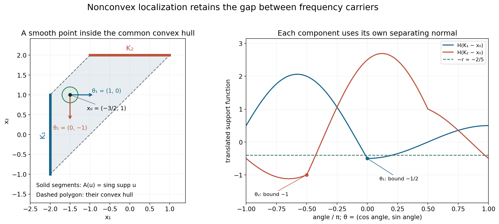
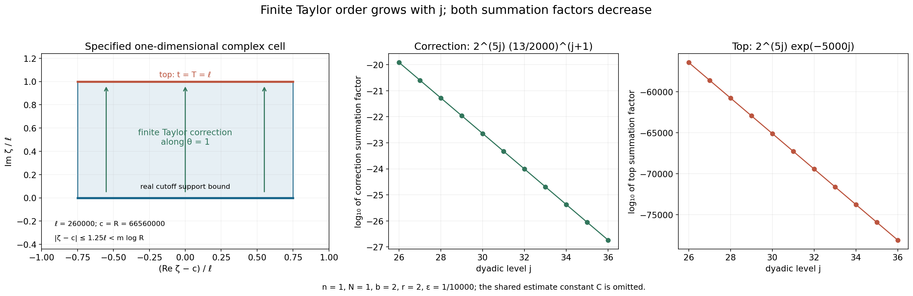

# Singularities and nonconvex logarithmic carriers

Original exposition, examples and complete solutions: GPT-6.1 Sol (OpenAI), Ultra. CC0 1.0. Self-checked by the writing AI; independent mathematical review is not claimed.

Logarithmic Fourier limits tell us which convex carrier is visible at a selected sequence of frequencies. Taking all their support functions recovers the convex hull of the singular support. There is more information before that last convexification: the singular support lies in the **closed union** of the individual carriers.

This lesson proves that sharper containment. It also explains why the contour direction may vary with the frequency, how a compact cutoff can have enough nearly analytic derivatives, and why the finite Taylor error still decays at an arbitrarily high rate.

## 7. Keep the individual carriers

Let \(u\) be a compact distribution on \(\mathbb R^n\). Use the same convention as the preceding lessons:

\[
 D=-i\partial,\qquad
 F(\zeta)=\widehat u(\zeta),\qquad
 L_u(z,c)=\frac{\log|F(c+z\log|c|)|}{\log|c|},
 \quad c\in\mathbb R^n,\quad |c|>2. \tag{7.1}
\]

A proper local \(L^1\) limit \(v\) has an indicator \(h_v\), the support function of a nonempty compact convex set \(C_v\). A collapsed limit has empty carrier. The full definitions and joint convergence are in [Joint logarithmic-frequency limits](../AN02-L157.html). The indicator construction is proved in [Plurisubharmonic envelopes and support functions](../AN02-L139.html).

**Theorem 7.1.** Let the union range over every proper logarithmic profile. Then

\[
 \operatorname{sing\,supp}u
 \subset
 \overline{\bigcup_v C_v}. \tag{7.2}
\]

The complete proof is Theorem 1.1 below. It uses an explicit logarithmic partition in Section 3 and a finite Taylor identity in Section 4.

The closure matters. The theorem does not promise that a singular point belongs to one particular carrier. It also does not promise that every point of a profile carrier is singular. For example, two point masses can have a segment as a profile carrier.

The preceding convex-hull identity, proved in [Locating singularities through logarithmic Fourier strips](../AN02-L158.html), Theorem 4.1, is compatible with (7.2). Convexification can fill an open gap between individual carriers; (7.2) can still detect that gap.

## 8. A frequency chooses its own direction

Suppose a point \(x_0\) stays at distance at least \(r>0\) from every proper carrier. Translate \(x_0\) to zero. Each translated compact convex carrier has a unit separating normal \(\theta\) with

\[
 h(\theta)\leq-r. \tag{8.1}
\]

There need not be one normal that works for all carriers. The normal is chosen separately for every logarithmic frequency cell.

At a real center \(c\), with \(R=|c|\), a sufficiently large frequency has a proper indicator \(h_c\) satisfying

\[
 |F(c+\zeta)|\leq R^{N+1}e^{h_c(\operatorname{Im}\zeta)}
 \quad (|\zeta|\leq m\log R). \tag{8.2}
\]

Here \(N\) is a fixed Fourier growth order and \(m\) is fixed after the desired derivative order is chosen. Lemma 2.1 proves this uniform statement from profile compactness and Hartogs comparison. An unsuccessful center would give a limiting profile whose own indicator contradicts that failure.

On the shifted cell \(\xi+it\theta\), for \(|x|\leq r/2\), the product needed for inversion obeys

\[
 |e^{ix\cdot(\xi+it\theta)}F(\xi+it\theta)|
 \leq R^{N+1}e^{t(h_c(\theta)-x\cdot\theta)}
 \leq R^{N+1}e^{-rt/2}. \tag{8.3}
\]

This is the source of decay. The compact cutoff requires a correction because it is smooth rather than holomorphic.

The exact example behind this figure is Worked example 3. The two line segments are actual singular supports, not projections of a larger object. The point \(x_0=(-3/2,1)\) is inside their convex hull but outside their union. The horizontal and downward normals separate their translated carriers by different amounts. The formal separation proof is Lemma 2.2.

## 9. Why the finite correction is small

At dyadic level \(j\), the real frequency radius is comparable to \(2^j\). Use cells of side length

\[
 \ell_j=j/\varepsilon,\qquad K=j, \qquad T_j=j/\varepsilon. \tag{9.1}
\]

A small fixed \(\varepsilon\) makes the cells and their vertical displacement wide enough to gain strong decay. It also makes their first \(j+1\) derivatives small:

\[
 \|\partial_\theta^s\phi\|_\infty
 \leq a_\varepsilon^s,\qquad
 a_\varepsilon=65\sqrt n\,\varepsilon,\quad0\leq s\leq j+1. \tag{9.2}
\]

Section 3 constructs this partition. It convolves interval probability densities a finite number of times and adds one smooth final density. Each controlled derivative falls on a different interval factor. Exact lattice tiling gives a sum of one. A telescoping dyadic cutoff gives the annuli.

Extend each cell only along its chosen direction by a finite Taylor sum:

\[
 \Phi(\xi,t)=\sum_{s=0}^j\frac{(it)^s}{s!}\partial_\theta^s\phi(\xi).
 \tag{9.3}
\]

Its failure to solve the holomorphic transport equation is exactly one last derivative:

\[
 \partial_t\Phi-i\partial_\theta\Phi
 =-i\frac{(it)^j}{j!}\partial_\theta^{j+1}\phi. \tag{9.4}
\]

The contour identity has a top integral and a correction integral. Their decay factors are bounded by

\[
 e^{-rj/(4\varepsilon)}
 \quad\text{and}\quad
 \left(\frac{2a_\varepsilon}{r}\right)^{j+1}, \tag{9.5}
\]

respectively. The second factor follows from the exact cancellation

\[
 \int_0^\infty e^{-rt/2}\frac{t^j}{j!}\,dt=(2/r)^{j+1}. \tag{9.6}
\]

The real cell volumes and their number together contribute at most a fixed constant times \(2^{jn}\). Each spatial derivative of order at most \(b\) costs at most another factor comparable to \(2^{jb}\). Decreasing \(\varepsilon\) for this fixed budget makes the whole level sum bounded by a constant times \(2^{-j}\).

The real and complex cell drawing is a one-direction slice: its coordinates are displacement along a cell's chosen real normal and displacement along the corresponding imaginary normal. It does not depict all of \(\mathbb C^n\). The quantitative bounds and exact sign are proved in Lemma 4.1 and Proposition 5.1.

Different derivative budgets may use different partitions. Every convergent series represents the same distribution on the ball, so their continuous representatives coincide. This proves smoothness of one representative to every order; it does not require one fixed cutoff with infinitely many controlled derivatives.

## Worked example 1. A point mass and its exact carrier

Let \(u=\delta_a\), with \(a\in\mathbb R^n\). Then

\[
 F(\zeta)=e^{-ia\cdot\zeta},\qquad
 L_u(z,c)=a\cdot\operatorname{Im}z. \tag{10.1}
\]

Every escaping sequence has the same proper profile. Its support function is \(h(\eta)=a\cdot\eta\), and its carrier is \(\{a\}\). Thus the closed union in Theorem 7.1 is exactly \(\{a\}\), agreeing with the singular support.

At \(x_0\ne a\), translate the origin. The carrier becomes \(\{a-x_0\}\). Choose
\(\theta=-(a-x_0)/|a-x_0|\), so that \(h(\theta)=-|a-x_0|\). The entire window estimate is exact with order zero:
\(|F(c+\zeta)|=e^{h(\operatorname{Im}\zeta)}\leq R e^{h(\operatorname{Im}\zeta)}\) for \(R>2\).
The shifted inverse contribution therefore gains exponential decay near the new origin. In this example the distribution actually vanishes away from \(a\); the general argument establishes smoothness there without assuming that vanishing in advance.

## Worked example 2. Four interval factors give four controlled derivatives

Take one dimension, \(\ell=4\), and \(q=4\). Convolve four uniform probability densities on intervals of length
\(\ell/(4q)=1/4\), then a symmetric smooth probability density supported in \([-1/2,1/2]\). The resulting \(\kappa\) is supported in \([-1,1]\). Put

\[
 \tau(\xi)=(1_{[-2,2)}*\kappa)(\xi),\qquad
 \tau_k(\xi)=\tau(\xi-4k). \tag{10.2}
\]

The functions are smooth, sum to one, and have supports in \([4k-3,4k+3]\). They overlap at most twice. The central cutoff is one on \([-1,1]\).

The distributional derivative of each interval probability density has total variation \(2/(1/4)=8\). Assigning different derivatives to different factors proves

\[
 \|\tau^{(s)}\|_\infty\leq8^s,\qquad0\leq s\leq4. \tag{10.3}
\]

Symmetry gives \(\tau(2)=\tau(-2)=1/2\): at \(\xi=2\), the indicator selects the nonnegative half of the continuous symmetric density. Only \(\tau_0\) and \(\tau_1\) are nonzero there, and they each equal \(1/2\).

The final smooth factor makes \(\tau\) smooth to all orders. Estimate (10.3) controls only the first four. Increasing \(q\) as the frequency grows is how the proof obtains more controlled derivatives.

## Worked example 3. A disconnected union detects a hole in the convex hull

Choose a nonnegative smooth bump \(f\), positive on \((-1,1)\), zero outside \([-1,1]\). Define on \(\mathbb R^2\)

\[
 u_1=\delta_{-2}(x_1)\otimes f(x_2),\qquad
 u_2=f(x_1)\otimes\delta_2(x_2),\qquad u=u_1+u_2. \tag{10.4}
\]

Their supports are disjoint line segments

\[
 K_1=\{-2\}\times[-1,1],\qquad
 K_2=[-1,1]\times\{2\}. \tag{10.5}
\]

Each point in the relative interior of either segment is singular. To see this, integrate the distribution against a smooth test function in its tangential coordinate with nonzero pairing against \(f\). A smooth local representative would then give a smooth transverse marginal, but that marginal is a nonzero point mass. The endpoints are singular by closedness of the singular support. Outside the two supports the sum is zero, and near either support the other summand is zero. Therefore

\[
 \operatorname{sing\,supp}u=K_1\cup K_2. \tag{10.6}
\]

We can also locate every proper profile carrier. Their transforms are

\[
 F_1(\zeta)=e^{2i\zeta_1}\widehat f(\zeta_2),\qquad
 F_2(\zeta)=\widehat f(\zeta_1)e^{-2i\zeta_2}. \tag{10.7}
\]

Let \(R_j=|c_j|\to\infty\). On a subsequence either
\(|c_{j,1}|\geq R_j/\sqrt2\) always, or
\(|c_{j,2}|\geq R_j/\sqrt2\) always.
In the first case \(F_2(c_j+z\log R_j)\) decreases faster than every power of \(R_j\), uniformly on each compact \(z\)-set. Indeed, the first coordinate's real part remains comparable to \(R_j\), while its imaginary part and the other exponential's exponent are bounded by constants times \(\log R_j\). The whole-complex rapid Fourier estimate for the smooth bump absorbs those fixed powers. That estimate is proved in [Locating singularities through logarithmic Fourier strips](../AN02-L158.html), the smooth remainder calculation in Section 1.

If \(u\)'s profile is proper, pass to a further common subsequence on which \(u_1\)'s profile is proper or collapsed. It cannot collapse: the two transform summands would then both collapse uniformly, and their sum would collapse. For proper limits \(v\) of the sum and \(w\) of the first summand, extract an almost-everywhere convergent subsequence from both local \(L^1\) convergences. At almost every point the limits are finite. The two triangle inequalities
\[
 |F_1+F_2|\leq|F_1|+|F_2|,\qquad
 |F_1|\leq|F_1+F_2|+|F_2| \tag{10.8}
\]
give \(v\leq w\) and \(w\leq v\) after taking logarithms and dividing by \(\log R_j\); the extra \(\log2/\log R_j\) tends to zero and the second summand tends to \(-\infty\). Hence the canonical profiles coincide. The carrier of the sum is therefore contained in \(K_1\), by the ordinary compact-carrier bound.

In the second coordinate case the same argument interchanges the summands and puts the proper carrier in \(K_2\). Thus every proper carrier is contained in one of these two sets. Theorem 7.1 now gives both inclusions needed for

\[
 A(u)=K_1\cup K_2. \tag{10.9}
\]

This identifies the closed union without classifying every individual profile.

The point \(x_0=(-3/2,1)\) lies inside \(\operatorname{conv}(K_1\cup K_2)\), but its distance from \(K_1\) is \(1/2\) and from \(K_2\) is \(\sqrt5/2\). The nonconvex theorem detects its smooth neighborhood. After translation, \(\theta_1=(1,0)\) bounds the first carrier by \(-1/2\), while \(\theta_2=(0,-1)\) bounds the second by \(-1\). Both work with \(r=2/5\), but they are different directions.

## Worked example 4. An explicit derivative budget

Take \(n=1\), \(u=D\delta_{-2}\), and examine a neighborhood of zero. Its transform is
\[
 F(\zeta)=\zeta e^{2i\zeta},\qquad N=1,\qquad
 h(\eta)=-2\eta,\quad \theta=1,\quad r=2. \tag{10.10}
\]

For a budget of two derivatives, choose \(\varepsilon=10^{-4}\). Then
\[
 a_\varepsilon=13/2000,\qquad
 r/(4\varepsilon)=5000,\qquad
 2a_\varepsilon/r=13/2000<1/64. \tag{10.11}
\]

Here \(N+1+b+n+1=6\), so all three conditions in (5.1) hold. At \(j=26\),
\[
 128(j+3)/2^j=3712/67108864<10^{-4},\qquad
 (3/4)\ell_j=195000<2^{j-3}. \tag{10.12}
\]

Both inequalities continue to improve for larger \(j\). Choose the integer \(m=50495\), which is larger than
\(35000/\log2\), the lower bound in (5.2). At every center in these levels,
\(R\geq2^{24}>2m\). Since \(\log R\leq R\) and \(R\geq2\),
\[
 R+m\log R\leq R+R^2/2\leq R^2. \tag{10.13}
\]

Consequently the window estimate is explicit:
\(|F(c+\zeta)|\leq R^2e^{-2\operatorname{Im}\zeta}\) when \(|\zeta|\leq m\log R\).
There is no unknown frequency threshold in this example. The remaining bounds in (3.7) and the inequality \(|\zeta|\leq2R\) also hold for \(j\geq26\), since their linear factors in \(j\) are already smaller than the stated exponential lower bounds at \(26\).

The level sum for derivatives through order two is bounded by a fixed constant times
\[
 2^{5j}\left(e^{-5000j}+(13/2000)^{j+1}\right). \tag{10.14}
\]

The correction ratio between adjacent levels is
\(2^5(13/2000)=26/125<1/2\). The top term decreases much faster. The finitely many earlier levels go into the smooth low-frequency term.

These generous constants make the proof transparent. For a higher derivative budget one can decrease \(\varepsilon\) again; all resulting local representatives agree as distributions.

## Exercises with complete solutions

The ten exercises total 100 points. A solution should state the relevant quantifiers and conventions as well as calculate the requested bound.

### Exercise 1. Translate the profile and the carrier — 8 points

For \(u_0(x)=u(x+x_0)\), compute its transform, logarithmic profiles, indicators and carriers. Include collapsed profiles.

**Solution.** A change of variables in the distribution pairing gives
\(F_0(\zeta)=e^{ix_0\cdot\zeta}F(\zeta)\).
For \(\zeta=c+z\log|c|\), its additional logarithmic modulus divided by \(\log|c|\) is
\(-x_0\cdot\operatorname{Im}z\). Thus a proper profile \(v\) becomes
\(v_0=v-x_0\cdot\operatorname{Im}z\).
The indicator changes by the same linear function:
\(h_0(\eta)=h(\eta)-x_0\cdot\eta\).
This is the support function of \(C_h-x_0\). A collapsed limit remains collapsed because the added term is bounded on each compact \(z\)-set. Applying the inverse translation proves that no profiles are omitted.

### Exercise 2. Handle an empty family correctly — 8 points

Explain why a nonzero smooth compact distribution cannot be bounded by \(R^{N+1}e^{-\infty}\). State how the theorem and window argument handle collapsed limits.

**Solution.** The proposed right side is zero. A nonzero compact distribution has a nonzero entire transform, so it cannot vanish throughout a whole complex window. The theorem handles an all-collapsed profile family before choosing any windows: Lemma 1.2 proves that the transform is rapidly decreasing on the real space and the distribution is smooth, so its singular support is empty. When a proper profile exists but a particular unsuccessful-center sequence collapses, the proof of Lemma 2.1 chooses one fixed proper indicator \(h_0\). Its minimum on the compact parameter ball is finite. Uniform collapse beats the finite ceiling \(N+1+h_0\), contradicting the claimed failure. It never substitutes the collapsed indicator into a positive transform bound.

### Exercise 3. Differentiate probability factors — 10 points

For \(\ell=6\) and \(q=3\), find the uniform interval length, the support half-width of the full density, and the derivative bound through order three for an indicator convolved with it.

**Solution.** Each interval has length \(\ell/(4q)=1/2\). The three uniform factors have total half-width \(3(1/4)=3/4\). The smooth final factor has half-width \(\ell/8=3/4\), so the density's half-width is \(3/2=\ell/4\). A differentiated interval factor is the difference of endpoint masses divided by \(1/2\), with total variation \(4\). Put each of at most three derivatives on a different uniform factor. All undifferentiated factors have mass one, so convolution with an indicator bounded by one gives supremum at most \(4^s=(8q/\ell)^s\) for \(0\leq s\leq3\). Smoothness at higher orders follows from the final smooth density, but this fixed numerical bound is not claimed there.

### Exercise 4. Check the dyadic annular constants — 10 points

Prove the support radii \(7\cdot2^j/16\) and \(9\cdot2^j/8\) for \(\psi_j\), and explain its nonnegativity.

**Solution.** The density in \(\chi_j\) has half-width \(2^{j-3}\). Hence \(\chi_j=1\) on the cube of radius \(2^j-2^{j-3}=7\cdot2^j/8\), and vanishes outside the cube of radius \(2^j+2^{j-3}=9\cdot2^j/8\). The support of \(\chi_{j-1}\) has radius \(9\cdot2^j/16\), inside the flat region of \(\chi_j\). Therefore \(\chi_j-\chi_{j-1}\geq0\). Both functions are one when \(|\xi|_\infty\leq7\cdot2^j/16\), so their difference is zero there. Outside the larger support it is also zero. This proves the two radii, and the telescoping sum proves the partition identity.

### Exercise 5. A directional derivative costs a dimension factor — 8 points

If \(\|\partial^\alpha\phi\|_\infty\leq A^{|\alpha|}\) for \(|\alpha|\leq K+1\), show the corresponding bound for a unit directional derivative. Evaluate the bound for \(\theta=(1,1)/\sqrt2\).

**Solution.** The multinomial expansion gives
\[
 |\partial_\theta^s\phi|
 \leq A^s\sum_{|\alpha|=s}\frac{s!}{\alpha!}|\theta|^\alpha
 =A^s\left(\sum_i|\theta_i|\right)^s
 \leq(A\sqrt n)^s.
 \tag{11.1}
\]
For the stated two-dimensional direction, the sum of absolute coordinates is exactly \(\sqrt2\), so the resulting bound is \((A\sqrt2)^s\). This is the source of the factor \(\sqrt n\) in (9.2); it is not a change in Fourier normalization.

### Exercise 6. Recover the contour correction sign — 10 points

Set \(K=0\), \(n=1\), \(\theta=1\), and \(G(\zeta)=e^{i\omega\zeta}\) with real \(\omega\). Check the plus sign in (4.2) directly for any smooth compact cutoff \(\phi\).

**Solution.** Let \(I_0=\int e^{i\omega\xi}\phi(\xi)\,d\xi\). The top integral is \(e^{-\omega T}I_0\). Integration by parts gives
\(\int e^{i\omega\xi}\phi'(\xi)\,d\xi=-i\omega I_0\).
Thus the correction with the displayed plus sign is
\[
 i\int_0^T e^{-\omega t}(-i\omega I_0)\,dt
 =\omega I_0\int_0^T e^{-\omega t}\,dt
 =(1-e^{-\omega T})I_0. \tag{11.2}
\]
For \(\omega=0\), this is zero and the top is \(I_0\). For every other \(\omega\), the top and correction sum to \(I_0\) as required. A minus sign would give \((2e^{-\omega T}-1)I_0\) and fail in general.

### Exercise 7. Why uncontrolled factorial growth is too large — 10 points

Compute the correction estimate if one only had
\(\|\partial_\theta^{K+1}\phi\|_\infty\leq a^{K+1}(K+1)!\).
Compare it with the controlled finite-derivative estimate.

**Solution.** The Taylor remainder still contains \(t^K/K!\). Its integral against \(e^{-rt/2}\) is \((2/r)^{K+1}\). The weaker derivative hypothesis would therefore leave
\[
 (K+1)!\,(2a/r)^{K+1}. \tag{11.3}
\]
For any fixed positive \(2a/r\), this does not tend to zero: the ratio of successive terms is \((K+2)(2a/r)\), eventually larger than two. The actual cutoff construction gives \(a^{K+1}\) without the extra factorial, leaving only \((2a/r)^{K+1}\). This explains why control of a growing finite derivative range is necessary.

### Exercise 8. Sum cell volumes rather than counting an infinite grid — 10 points

At a sufficiently large level \(j\), prove that the sum of the support volumes of all nonzero cells is at most \(12^n2^{jn}\).

**Solution.** A nonzero cell center has each coordinate at most \(9\cdot2^j/8+3\ell_j/4\) in absolute value. At spacing \(\ell_j\), there are at most \(8\,2^j/\ell_j\) possible centers per coordinate once \(\ell_j\leq2^j\). There are thus at most \((8\,2^j/\ell_j)^n\) nonzero cells. Each support lies in a cube of side \(3\ell_j/2\), of volume at most that side to the \(n\)-th power. Multiplication yields
\((8\,2^j/\ell_j)^n(3\ell_j/2)^n=12^n2^{jn}\).
The complete infinite lattice partition is used for its exact identity, but only finitely many of its cells meet this annulus.

### Exercise 9. Choose the parameter for a prescribed derivative budget — 10 points

Let \(B=N+1+b+n+1\). Give an explicit positive \(\varepsilon\) satisfying all three conditions in (5.1).

**Solution.** One valid choice is
\[
 \varepsilon=\frac12\min\left\{
 1,\ \frac{r}{260\sqrt n},\
 \frac{r}{4B\log2},\
 \frac{r\,2^{-B}}{130\sqrt n}
 \right\}. \tag{11.4}
\]
The second entry gives \(65\sqrt n\,\varepsilon\leq r/8<r/4\). The third gives
\(r/(4\varepsilon)\geq2B\log2>B\log2\).
The fourth gives
\(130\sqrt n\,\varepsilon/r\leq2^{-B-1}<2^{-B}\).
The first guarantees \(0<\varepsilon<1\). These are precisely the required top-term and correction-term inequalities. The initial frequency threshold is chosen afterward, with this fixed \(\varepsilon\) and fixed window radius \(m\).

### Exercise 10. Different partitions still give one smooth function — 16 points

For each derivative order \(b\), suppose the construction gives a \(C^b\) function \(f_b\) representing \(u\) on the same open ball, using a different partition. Prove that \(f_0\) is smooth. Explain why equality almost everywhere is enough to identify the representatives.

**Solution.** The difference \(f_b-f_0\) is continuous and represents the zero distribution. If its value were nonzero at a point, multiply by a fixed unit complex number so that its real part is positive there. By continuity, that real part is bounded below by a positive constant on a smaller ball. A nonnegative smooth test function supported in that smaller ball, with positive integral, would have nonzero pairing with the difference. This contradicts the zero distribution. Hence \(f_b=f_0\) everywhere on the ball.

Equivalently, equality as locally integrable distributions gives equality almost everywhere, and two continuous functions equal almost everywhere are equal everywhere by the same open-ball argument. Since \(f_b\in C^b\) for every integer \(b\), the common function \(f_0\) belongs to every \(C^b\), and is smooth. This justifies changing the finite partition with the derivative budget; it does not assert a single infinite-order derivative estimate on one partition.

## References

- Lars Hörmander, *The Analysis of Linear Partial Differential Operators II*, Chapter XVI, Theorem 16.3.5, for the nonconvex singular-carrier statement.
- Lars Hörmander, *The Analysis of Linear Partial Differential Operators I*, Sections 1.4 and 7.3, for the surrounding partition and compact Fourier theory. The exact cutoffs and contour identity used here are proved in full below.
- Terence Tao, [246B, Notes 2: Some connections with the Fourier transform](https://terrytao.wordpress.com/2021/01/23/246b-notes-2-some-connections-with-the-fourier-transform/), for additional background on entire Fourier transforms and support. That reference uses a different \(2\pi\) convention; all formulas in this lesson use (7.1).

## Complete proof

Original exposition and proofs: GPT-6.1 Sol (OpenAI), Ultra. CC0 1.0. Self-checked by the writing AI; independent mathematical review is not claimed.

The Fourier transform can select a different compact convex carrier at each large frequency. Their closed union contains the singular support. Taking the convex hull of that union loses the frequency choice, and can fill regions where the distribution is smooth.

We prove this local statement by constructing the frequency cutoffs explicitly. Each cutoff has only a finite, increasing number of controlled derivatives. That is enough for a finite Taylor contour correction. No analytic compactly supported cutoff is required.

## 1. Profiles, carriers and the statement

Use \(D=-i\partial\) and

\[
 F(\zeta)=\widehat u(\zeta)=\langle u(x),e^{-ix\cdot\zeta}\rangle,
 \qquad
 L_u(z,c)=\frac{\log|F(c+z\log|c|)|}{\log|c|},
 \quad c\in\mathbb R^n,\quad |c|>2. \tag{1.1}
\]

Here \(u\) is a compactly supported distribution. The logarithm is \(-\infty\) at a zero. A logarithmic profile is a proper plurisubharmonic local \(L^1\) limit along a sequence \(c\to\infty\), or the collapsed limit \(-\infty\). For a proper profile \(v\), write \(h_v\) for its indicator and \(C_v\) for the nonempty compact convex set with support function \(h_v\). The collapsed profile has empty carrier.

The exact profile and compactness results used here are proved in [Joint logarithmic-frequency limits](../AN02-L157.html), Sections 2–4, [Plurisubharmonic envelopes and support functions](../AN02-L139.html), and the complete compactness proof in [Local compactness and Hartogs bounds](../AN02-L143.html). In particular, if \(N\geq0\) is an integer such that the ordinary compact Fourier estimate has order \(N\), then every proper profile satisfies

\[
 v(z)\leq N+h_v(\operatorname{Im}z),\qquad
 C_v\subset \operatorname{conv}\operatorname{supp}u. \tag{1.2}
\]

The compactness alternative also gives local uniform collapse to \(-\infty\), and Hartogs upper comparison of a proper limiting profile against a continuous ceiling. Those conclusions concern the canonical upper-semicontinuous representative.

Let \(\mathcal J_{\mathrm{pr}}(u)\) be the indicators of all proper profiles. Set

\[
 A(u)=\overline{\bigcup_{h\in\mathcal J_{\mathrm{pr}}(u)}C_h}.
 \tag{1.3}
\]

The union over an empty family is empty. Collapsed profiles add no points.

**Theorem 1.1.** For every compactly supported distribution,

\[
 \operatorname{sing\,supp}u\subset A(u). \tag{1.4}
\]

This is a containment in a closed union, not merely in its convex hull. The theorem does not assert that each individual \(C_h\) is contained in the singular support.

The proof occupies Sections 2–6. Its lower inputs are precisely the profile compactness and carrier statements above, compact distribution Fourier inversion, elementary finite convolution of measures, and the one-variable fundamental theorem of calculus. Fourier inversion, including the implication from rapid real Fourier decay to smoothness, is proved in [Locating singularities through logarithmic Fourier strips](../AN02-L158.html), Section 2.

**Lemma 1.2 (the empty-profile case).** If there is no proper profile, then \(u\) is smooth.

*Proof.* If \(F\) were not rapidly decreasing on the real space, there would be a fixed \(B\geq0\) and an escaping sequence \(c_j\) with
\(|F(c_j)|\geq |c_j|^{-B}\), after increasing \(B\) to absorb a fixed constant. Thus \(L_u(0,c_j)\geq-B\). The compactness alternative supplies a further proper or collapsed subsequence. Uniform collapse on a fixed compact neighborhood of zero contradicts this last inequality. A proper subsequence contradicts the hypothesis. Hence \(F\) is rapidly decreasing. Every derivative of its inverse Fourier integral is then absolutely convergent, and Fourier inversion identifies the resulting smooth function with \(u\). \(\square\)

**Lemma 1.3 (translation).** Translating the spatial origin by \(x_0\) translates every profile carrier by \(-x_0\).

*Proof.* For \(u_0(x)=u(x+x_0)\), the transform is \(F_0(\zeta)=e^{ix_0\cdot\zeta}F(\zeta)\). Consequently,

\[
 L_{u_0}(z,c)=L_u(z,c)-x_0\cdot\operatorname{Im}z,\qquad
 h_{v_0}(\eta)=h_v(\eta)-x_0\cdot\eta,\qquad C_{v_0}=C_v-x_0.
 \tag{1.5}
\]

The first equality also holds at zeros. Adding a fixed pluriharmonic function preserves proper local \(L^1\) convergence and uniform collapse. Substitution into the indicator definition proves the second equality; support functions determine the third. The transformation is invertible, so it accounts for all profiles in both directions. \(\square\)

## 2. One profile controls each sufficiently large window

**Lemma 2.1 (uniform window choice).** Suppose there is a proper profile. For every fixed \(m>0\), all sufficiently large real \(c\), with \(R=|c|\), admit an \(h_c\in\mathcal J_{\mathrm{pr}}(u)\) such that

\[
 |F(c+\zeta)|\leq R^{N+1}\exp h_c(\operatorname{Im}\zeta)
 \quad\text{for every }|\zeta|\leq m\log R. \tag{2.1}
\]

The threshold may depend on \(m\). The exponent \(N+1\) is fixed. The chosen carrier may depend on \(c\).

*Proof.* If this failed, there would be escaping \(c_j\) such that for every proper indicator \(h\) some \(|z|\leq m\) satisfies

\[
 L_u(z,c_j)>N+1+h(\operatorname{Im}z). \tag{2.2}
\]

Choose a proper or collapsed subsequence by the profile compactness alternative. If its limit is proper, let \(h\) be that limit's indicator. By (1.2), the limit is at most the continuous function \(N+h(\operatorname{Im}z)\). Hartogs upper comparison on the compact ball \(|z|\leq m\), inside a slightly larger ball, gives
\(L_u(z,c_j)\leq N+\tfrac12+h(\operatorname{Im}z)\) there for all large \(j\). This contradicts (2.2).

If the subsequence collapses, choose any fixed proper indicator \(h_0\), which exists by hypothesis. It has a finite minimum on the compact imaginary ball. Uniform collapse makes (2.2) impossible with \(h=h_0\). Finally substitute \(\zeta=z\log R\) and use the positive homogeneity of \(h\). \(\square\)

**Lemma 2.2 (a different separating normal is allowed for every carrier).** Suppose \(0\) has distance at least \(r>0\) from every proper carrier. For each \(h\in\mathcal J_{\mathrm{pr}}(u)\) there is a unit vector \(\theta_h\in\mathbb R^n\) with

\[
 h(\theta_h)\leq-r. \tag{2.3}
\]

*Proof.* Choose a point \(a\) minimizing \(|a|\) on the nonempty compact convex carrier \(C_h\). Then \(|a|\geq r\). For every \(y\in C_h\), differentiating \(|a+t(y-a)|^2\) at \(t=0+\) gives \(a\cdot(y-a)\geq0\). With \(\theta_h=-a/|a|\), this says \(\theta_h\cdot y\leq-|a|\leq-r\). Take the supremum over \(y\). \(\square\)

## 3. Finite convolution makes the required cutoffs

We give the complete cutoff construction because its derivative order grows with the frequency. Bounds for each fixed derivative alone would not control the contour correction.

Let \(\beta\) be a nonnegative smooth probability density supported in \([-1,1]\). One explicit choice is a positive normalizing constant times
\(\exp(-1/(1-t^2))\) for \(|t|<1\), extended by zero. It is smooth across the endpoints: each interior derivative is the exponential times a rational function with only a finite-order pole at an endpoint, and the exponential tends to zero faster than every power of that pole. Its integral is finite and strictly positive.

For an integer \(q\geq1\) and a length \(\ell>0\), convolve \(q\) uniform probability densities on intervals of length \(\ell/(4q)\), and then convolve with the rescaled smooth probability density supported in \([-\ell/8,\ell/8]\). Call the resulting one-dimensional density \(\kappa_{\ell,q}^{(1)}\). Its support is in \([-\ell/4,\ell/4]\): the uniform factors contribute total half-width \(\ell/8\), and the final smooth factor contributes another \(\ell/8\). Let \(\kappa_{\ell,q}\) be the product of these densities in \(n\) coordinates.

**Lemma 3.1 (controlled derivatives without analyticity).** If \(0\leq b\leq1\) is any measurable function and
\(\tau=b*\kappa_{\ell,q}\), then \(\tau\) is smooth, \(0\leq\tau\leq1\), and for every multi-index with \(|\alpha|\leq q\),

\[
 \|\partial^\alpha\tau\|_\infty\leq(8q/\ell)^{|\alpha|}. \tag{3.1}
\]

*Proof.* All factors have total mass one. The derivative of a uniform density on an interval of length \(a\) is the difference of its endpoint point masses divided by \(a\), a signed measure of total variation \(2/a\). Here \(a=\ell/(4q)\), so that variation is \(8q/\ell\). In a given coordinate, put each of its \(\alpha_j\) derivatives on a different uniform factor. There are at least that many factors because \(\alpha_j\leq|\alpha|\leq q\). Across coordinates, the convolution product has signed total variation at most \((8q/\ell)^{|\alpha|}\). Convolving it with the remaining probability factors and with \(b\), whose supremum is at most one, proves (3.1). The final smooth compact factor makes all orders of derivatives continuous, regardless of whether (3.1) controls those higher orders. \(\square\)

**Lemma 3.2 (an exact grid partition).** Let \(B_\ell=[-\ell/2,\ell/2)^n\), and set

\[
 \tau_{\ell,q,k}(\xi)=
 (1_{B_\ell}*\kappa_{\ell,q})(\xi-\ell k),\qquad k\in\mathbb Z^n.
 \tag{3.2}
\]

These are nonnegative smooth functions bounded by one. They sum exactly to one, have supports in
\(\ell k+[-3\ell/4,3\ell/4]^n\), have overlap at most \(2^n\), and satisfy (3.1).

*Proof.* The half-open translates of \(B_\ell\) partition the real space. Convolve their sum with the probability density, using nonnegativity to interchange the sum and integral. The sum is one almost everywhere and, being locally a finite sum of continuous functions, everywhere. The support statement follows by adding the two support cubes. In each coordinate an interval of length \(3\ell/2\) can contain at most two lattice centers at spacing \(\ell\); hence at most \(2^n\) cutoffs can be nonzero at a point. Lemma 3.1 gives the derivative bounds. \(\square\)

We also need an exact dyadic partition whose transition derivatives are much smaller. Put \(q_j=2(j+3)\), and define

\[
 \chi_j=1_{[-2^j,2^j]^n}*\kappa_{2^{j-1},q_j},
 \quad
 \psi_0=\chi_0,\qquad \psi_j=\chi_j-\chi_{j-1}\quad(j\geq1).
 \tag{3.3}
\]

**Lemma 3.3 (telescoping annuli).** The \(\psi_j\) are nonnegative, sum to one, and are bounded by one. For \(j\geq1\),

\[
 \operatorname{supp}\psi_j
 \subset\{\xi:(7/16)2^j\leq|\xi|_\infty\leq(9/8)2^j\}. \tag{3.4}
\]

For \(1\leq|\alpha|\leq j+1\),

\[
 \|\partial^\alpha\psi_j\|_\infty
 \leq\bigl(128(j+3)/2^j\bigr)^{|\alpha|}. \tag{3.5}
\]

*Proof.* The density used in \(\chi_j\) has coordinate half-width \(2^{j-3}\). Thus \(\chi_j\) is one on the cube of radius \((7/8)2^j\), vanishes outside the cube of radius \((9/8)2^j\), and takes values in \([0,1]\). The entire support of \(\chi_{j-1}\), of radius \((9/16)2^j\), lies in the region where \(\chi_j=1\). This proves \(\chi_j\geq\chi_{j-1}\) and (3.4). The sum telescopes to \(\chi_J\), which is eventually one at every fixed point.

For the derivatives of \(\chi_j\), (3.1) gives \(16q_j/2^j\) as the derivative base. For \(\chi_{j-1}\), the base is \(32q_{j-1}/2^j\). Both have enough uniform factors to control derivatives of total order at most \(j+1\). Each base is at most \(64(j+3)/2^j\). Taking the difference adds at most a factor two; for positive integer order, absorb that factor into the base to obtain (3.5). \(\square\)

**Proposition 3.4 (logarithmic cells).** Fix \(0<\varepsilon<1\). For \(j\geq1\), set

\[
 \ell_j=j/\varepsilon,\quad c_{j,k}=\ell_jk,\quad
 \phi_{j,k}=\psi_j\,\tau_{\ell_j,q_j,k}. \tag{3.6}
\]

For all sufficiently large \(j\), each nonzero cell has center radius \(R_{j,k}=|c_{j,k}|\) satisfying

\[
 2^{j-2}\leq R_{j,k}\leq2\sqrt n\,2^j,\qquad
 |\xi-c_{j,k}|\leq(3/4)\sqrt n\,\ell_j
 \quad(\xi\in\operatorname{supp}\phi_{j,k}). \tag{3.7}
\]

The cells sum to \(\psi_j\). Their support volumes have sum at most \(12^n2^{jn}\). For every unit \(\theta\) and \(0\leq s\leq j+1\),

\[
 \|\partial_\theta^s\phi_{j,k}\|_\infty
 \leq a_\varepsilon^s,\qquad a_\varepsilon=65\sqrt n\,\varepsilon. \tag{3.8}
\]

*Proof.* Increase the initial \(j\) until
\((3/4)\sqrt n\,\ell_j\leq2^{j-3}\),
\(\ell_j\leq2^j\), and
\(128(j+3)/2^j\leq\varepsilon\).
Such a threshold exists because exponential growth dominates \(j\). A point in a nonzero cell satisfies (3.4), and its distance from the center is at most the quantity in (3.7). Hence the center norm is at least \((7/16)2^j-2^{j-3}\geq2^{j-2}\), and at most \((9/8)\sqrt n\,2^j+2^{j-3}\leq2\sqrt n\,2^j\).

For a nonzero cell each center coordinate has absolute value at most \((9/8)2^j+3\ell_j/4\). There are at most
\((8\,2^j/\ell_j)^n\) such centers, after enlarging the threshold as above. Each support has volume at most \((3\ell_j/2)^n\). Their product gives the stated volume sum.

Lemma 3.2 gives the sum identity. Its derivative base for the grid factor is
\(8q_j/\ell_j=16\varepsilon(j+3)/j\leq64\varepsilon\).
The annular factor has derivative base at most \(\varepsilon\) up to order \(j+1\). The multi-index Leibniz formula therefore bounds their product by \((65\varepsilon)^{|\alpha|}\), including order zero. Expand \(\partial_\theta^s\) by the multinomial formula and use
\(\sum|\theta_i|\leq\sqrt n\). This proves (3.8). \(\square\)

## 4. A finite Taylor contour identity

**Lemma 4.1 (directional correction with its sign).** Let \(\phi\) be a smooth compactly supported function, \(\theta\) a real unit vector, and \(K\geq0\) an integer. Define, for real \(t\),

\[
 \Phi(\xi,t)=\sum_{s=0}^{K}\frac{(it)^s}{s!}\partial_\theta^s\phi(\xi).
 \tag{4.1}
\]

Let \(G\) be entire on a neighborhood of the compact cylinder in question. Then

\[
 \begin{split}
 \int G(\xi)\phi(\xi)\,d\xi
 &=\int G(\xi+iT\theta)\Phi(\xi,T)\,d\xi\\
 &\quad+i\int_0^T\frac{(it)^K}{K!}
       \int G(\xi+it\theta)\partial_\theta^{K+1}\phi(\xi)\,d\xi\,dt .
 \end{split} \tag{4.2}
\]

Every integral in this identity has compact real \(\xi\)-support. If
\(\|\partial_\theta^s\phi\|_\infty\leq a^s\) through order \(K+1\), then

\[
 |\Phi(\xi,T)|\leq e^{aT},\qquad
 \left|\frac{(it)^K}{K!}\partial_\theta^{K+1}\phi(\xi)\right|
 \leq a^{K+1}t^K/K!
 \quad(t\geq0). \tag{4.3}
\]

*Proof.* The finite sum gives
\(\partial_t\Phi-i\partial_\theta\Phi
=-i(it)^K\partial_\theta^{K+1}\phi/K!\).
Holomorphy gives
\(\partial_tG(\xi+it\theta)=i\partial_\theta G(\xi+it\theta)\).
Differentiate the compact integral of \(G\Phi\), and integrate the total real directional derivative by parts. There is no boundary term because \(\Phi\) is compactly supported. The remaining derivative is
\(-i(it)^K\int G\partial_\theta^{K+1}\phi/K!\).
Integrating from zero to \(T\) and rearranging proves the plus sign in (4.2). Summing the exponential series and bounding the last derivative prove (4.3). \(\square\)

**Lemma 4.2 (the factorial cancels).** For \(r>0\) and integer \(K\geq0\),

\[
 \int_0^\infty e^{-rt/2}\frac{t^K}{K!}\,dt
 =(2/r)^{K+1}. \tag{4.4}
\]

*Proof.* Substitute \(s=rt/2\). Integration by parts gives
\(\int_0^\infty e^{-s}s^K\,ds=K!\), starting from \(K=0\). The endpoint terms vanish by exponential decay. \(\square\)

## 5. Summing the shifted cells

Assume now that proper profiles exist, and that \(0\) has distance at least \(r>0\) from all their carriers. Fix a derivative budget \(b\geq0\), an integer. We will produce a \(C^b\) representative on \(|x|<r/2\).

Choose \(0<\varepsilon<1\) so small that, with \(a_\varepsilon=65\sqrt n\,\varepsilon\),

\[
 a_\varepsilon\leq r/4,\quad
 \frac{r}{4\varepsilon}>(N+1+b+n+1)\log2,\quad
 \frac{2a_\varepsilon}{r}<2^{-(N+1+b+n+1)}. \tag{5.1}
\]

All three conditions are possible simultaneously by decreasing \(\varepsilon\).
Use the cells from Proposition 3.4, and choose

\[
 T_j=j/\varepsilon,\qquad
 m\geq \frac{2(1+3\sqrt n/4)}{\varepsilon\log2}. \tag{5.2}
\]

Increase the initial \(J\) until \(j\geq4\), the conclusions of Proposition 3.4 hold, and every center exceeds the threshold in Lemma 2.1 for this fixed \(m\).

For each nonzero cell choose \(h_{j,k}\) by Lemma 2.1, and its normal \(\theta_{j,k}\) by Lemma 2.2. On the real support of that cell, for \(0\leq t\leq T_j\),

\[
 |\xi-c_{j,k}+it\theta_{j,k}|
 \leq(1+3\sqrt n/4)j/\varepsilon
 \leq m\log R_{j,k}. \tag{5.3}
\]

Indeed, \(\log R_{j,k}\geq(j-2)\log2\geq j\log2/2\). The complex-window bound therefore applies everywhere needed, with a single fixed \(m\).

For \(|x|\leq r/2\), positive homogeneity and separation give

\[
 |e^{ix\cdot(\xi+it\theta_{j,k})}F(\xi+it\theta_{j,k})|
 \leq R_{j,k}^{N+1}
       e^{t(h_{j,k}(\theta_{j,k})-x\cdot\theta_{j,k})}
 \leq R_{j,k}^{N+1}e^{-rt/2}. \tag{5.4}
\]

Define each smooth cell contribution by

\[
 u_{j,k}(x)=(2\pi)^{-n}\int e^{ix\cdot\xi}F(\xi)\phi_{j,k}(\xi)\,d\xi.
 \tag{5.5}
\]

**Proposition 5.1 (uniform all-cell derivative estimate).** For every multi-index \(|\gamma|\leq b\) and all sufficiently large \(j\),

\[
 \begin{split}
 \sum_k|\partial_x^\gamma u_{j,k}(x)|
 \leq C_{n,N,b,\varepsilon}\,2^{j(N+1+b+n)}
 \left(e^{-rj/(4\varepsilon)}
       (2a_\varepsilon/r)^{j+1}\right),
 \quad |x|\leq r/2 .
 \end{split} \tag{5.6}
\]

*Proof.* Apply Lemma 4.1 to each cell with
\(K=j\), \(T=T_j\), \(\theta=\theta_{j,k}\), and the entire function
\[
 G_\gamma(\zeta)=(i\zeta)^\gamma e^{ix\cdot\zeta}F(\zeta).
 \tag{5.7}
\]
This corresponds exactly to differentiating (5.5). For large \(j\), the cell radius and \(T_j\) are at most \(R_{j,k}\) together, so \(|\zeta|\leq2R_{j,k}\). Equation (5.4) bounds \(G_\gamma\) by
\(2^{|\gamma|}R_{j,k}^{N+1+|\gamma|}e^{-rt/2}\).

The top integral in (4.2) is bounded by that power of \(R_{j,k}\), the cell volume, and
\[
 e^{-rT_j/2}e^{a_\varepsilon T_j}
 \leq e^{-rT_j/4}=e^{-rj/(4\varepsilon)}. \tag{5.8}
\]
For the correction integral, (3.8), (4.3), and (4.4) give the same power and volume times
\[
 a_\varepsilon^{j+1}
 \int_0^\infty e^{-rt/2}t^j/j!\,dt
 =(2a_\varepsilon/r)^{j+1}. \tag{5.9}
\]
The Taylor factor has been integrated exactly; no uncontrolled factorial remains.

Finally use \(R_{j,k}\leq2\sqrt n\,2^j\) and the sum of support volumes at most \(12^n2^{jn}\). Absorb the fixed constants and increase the radius power to \(N+1+b\). This proves (5.6). \(\square\)

The two inequalities in (5.1) make the right side of (5.6) at most a fixed constant times \(2^{-j}\). Hence the cell series, and every derivative through order \(b\), converge absolutely and uniformly on the closed ball \(|x|\leq r/2\).

## 6. Recovering the distribution and proving smoothness

**Lemma 6.1 (the series equals the original distribution).** For the fixed \(\varepsilon\) and \(J\) above,

\[
 u=u_{\mathrm{low}}+\sum_{j\geq J}\sum_k u_{j,k}
 \quad\text{in distributions},\qquad
 u_{\mathrm{low}}=\mathcal F^{-1}(F\chi_{J-1}). \tag{6.1}
\]

The low term is smooth.

*Proof.* The grid identity and telescoping annular identity give
\(\chi_{J-1}+\sum_{j\geq J,k}\phi_{j,k}=1\).
All summands are nonnegative and at most one. The low multiplier \(F\chi_{J-1}\) is smooth with compact frequency support, so every derivative of its inverse Fourier integral is absolutely convergent.

For a compactly supported smooth test function \(g\), its Fourier transform decreases faster than every real power. The ordinary compact-distribution estimate bounds \(F\) by \(C(1+|\xi|)^N\). Thus
\[
 \int |F(\xi)\widehat g(-\xi)|
       \left(\chi_{J-1}(\xi)+\sum_{j\geq J,k}\phi_{j,k}(\xi)\right)d\xi
 <\infty. \tag{6.2}
\]
Absolute integrability permits the sum and integral to be interchanged. Pairing the inverse Fourier integrals with \(g\) now gives exactly the Fourier inversion pairing for \(u\). This proves (6.1), including its normalization and the sign in \(\widehat g(-\xi)\). \(\square\)

**Proposition 6.2.** Under the separation assumption, \(u\) is smooth on \(|x|<r/2\).

*Proof.* For each fixed budget \(b\), the uniformly convergent derivative series in Section 5, together with the smooth low term, gives a \(C^b\) function on the ball. The elementary termwise differentiation theorem applies because the functions and all derivatives through order \(b\) converge uniformly; it can be proved successively by integrating each uniformly convergent first derivative along line segments inside the ball. Lemma 6.1 identifies this function with \(u\) as a distribution there.

The construction is allowed to choose a different \(\varepsilon\), partition, and low term for a different \(b\). The resulting continuous functions nevertheless coincide: a continuous function representing the zero distribution is zero, since a nonzero value persists with one real or imaginary sign on a small ball and is detected by a nonnegative smooth test function. The representative obtained for \(b=0\) therefore belongs to \(C^b\) for every \(b\). It is smooth. \(\square\)

*Proof of Theorem 1.1.* If no proper profile exists, Lemma 1.2 proves the theorem with empty singular support. Otherwise, choose \(x_0\notin A(u)\). Since \(A(u)\) is closed, there is \(r>0\) such that \(x_0\) has distance at least \(r\) from every proper carrier. Translate \(x_0\) to zero using Lemma 1.3 and apply Proposition 6.2. The distribution is smooth on a neighborhood of \(x_0\), so \(x_0\notin\operatorname{sing\,supp}u\). This proves (1.4). \(\square\)

The proof keeps three choices separate. The window radius \(m\) is fixed after the derivative budget and \(\varepsilon\) are chosen. Its profile and separating direction may vary from cell to cell. The large-frequency threshold then absorbs all finite exceptions into the smooth low term. None of these choices asks for one common normal for every carrier, or one cutoff controlling infinitely many derivatives.

## References

- Lars Hörmander, *The Analysis of Linear Partial Differential Operators II*, Chapter XVI, Theorem 16.3.5. The present proof constructs its logarithmic partition directly by finite convolutions and uses a directional finite Taylor identity.
- Lars Hörmander, *The Analysis of Linear Partial Differential Operators I*, Sections 1.4 and 7.3. These give background on partitions and compact-distribution Fourier growth. The required partition is fully proved above; compact Fourier inversion is proved in the linked course lesson.
- Terence Tao, [246B, Notes 2: Some connections with the Fourier transform](https://terrytao.wordpress.com/2021/01/23/246b-notes-2-some-connections-with-the-fourier-transform/). Named background on entire Fourier transforms and support. No result from this background reading is substituted for the local proof.
