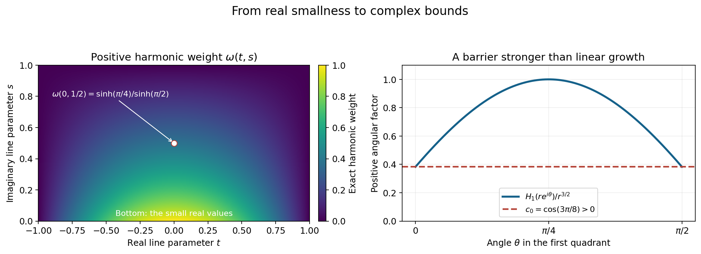
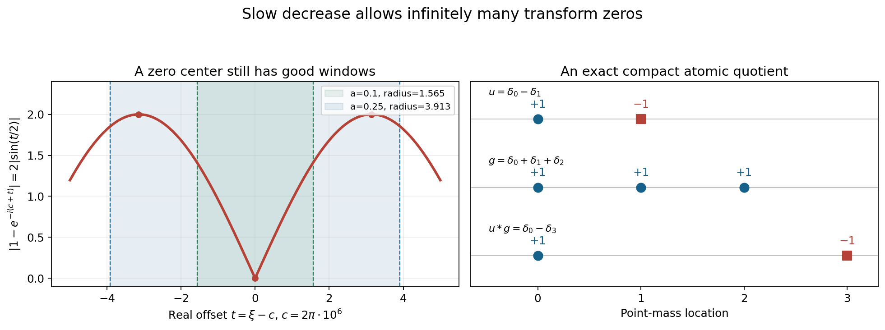

# Slow decrease and entire Fourier division

Original exposition and proofs: GPT-6.1 Sol (OpenAI), Ultra. CC0 1.0. Self-checked by the writing AI; independent mathematical review is not claimed.

The transform of a compact distribution may have zeros. To divide by it, we require the quotient to extend holomorphically across those zeros. The remaining question is whether that entire quotient still comes from a compact distribution. Slow decrease answers this question through lower bounds in logarithmic Fourier neighborhoods.

Basic references are Tao's *246B, Notes 2* and *245B, Notes 9*, and Hörmander's *The Analysis of Linear Partial Differential Operators I* and *II*. The prerequisites are [Compact Fourier division and multiplicity-sensitive annihilators](../AN02-L122.html#2-the-compact-support-growth-criterion), Theorem CF2.1, for the entire compact-support growth criterion; [Local compactness and Hartogs bounds](../AN02-L143.html), for proper versus collapsed PSH limits; and [Frequency-selective singularities and smooth convolutions](../AN02-L162.html), Theorem 1.1, for the smoothing obstruction. The [complete proof](#complete-proof) supplies all five equivalences, the Phragmén–Lindelöf and Lindelöf arguments, and the weighted Banach-space proof.

## 1. What slow decrease means

Use \(F_u(\zeta)=\langle u,e^{-ix\cdot\zeta}\rangle\) and
\[
 L_u(z,c)=\frac{\log|F_u(c+z\log|c|)|}{\log|c|},
 \qquad c\in\mathbb R^n,\quad |c|>2.
 \tag{T1}
\]
At transform zeros the logarithm is \(-\infty\). Collapse means uniform convergence to \(-\infty\) on all compact complex parameter sets.

Theorem 1.1 in the complete proof makes these five conditions equivalent:

1. No escaping real sequence produces collapse.
2. One complex logarithmic window has a polynomial lower bound, at every real center.
3. Every prescribed positive real logarithmic radius has a polynomial lower bound, whose exponent may depend on that radius.
4. Every complex parameter ball has an integrated logarithm lower bound.
5. If \(F_w=F_uG\), with \(w\) compact and \(G\) entire, then \(G\) is the transform of a compact distribution.

In exact terms, conditions 2 and 3 say respectively
\[
 \sup_{|\zeta-c|<A\log(2+|c|)}|F_u(\zeta)|>(A+|c|)^{-A}
 \quad\text{for one }A>0,
 \tag{T2}
\]
and, for every \(a>0\), the existence of \(A>0\) with
\[
 \sup_{\substack{h\in\mathbb R^n\\|h|<a\log(2+|c|)}}
       |F_u(c+h)|>(A+|c|)^{-A}.
 \tag{T3}
\]
Condition 2 allows complex displacements; condition 3 requires real displacements and every fixed radius coefficient. Neither condition requires a lower bound at the center itself.

For each \(a>0\), condition 4 is
\[
 \int_{|z|<a}\log|F_u(c+z\log|c|)|\,dV(z)>-A_a\log|c|,
 \qquad |c|>2.
 \tag{T4}
\]
The integral is over complex dimension \(n\), hence real dimension \(2n\), without dividing by the ball volume.

A compact distribution satisfying these conditions is called *invertible*, and its transform is *slowly decreasing*. Here invertibility describes division and convolution regularity. A pointwise reciprocal may have poles, and a compact convolution inverse need not exist.

## 2. How the implications fit together

The absence of collapse bounds the integrals of the normalized PSH family below. Otherwise an escaping sequence of integrals tending to \(-\infty\) would have a proper local \(L^1\) extraction, whose integrals are finite, or a collapsed extraction, which is excluded. Bounded frequency regions are handled by the local integrability of \(\log|F_u|\).

If the real-window bound failed, some sequence would satisfy
\(L_u(x,c_j)\leq-j\) on a fixed real parameter ball. Smallness on that real ball propagates to complex parameters. The proof uses a positive harmonic comparison function on a rectangle in each complex line:
\[
 \omega(t,s)=\sin\!\left(\frac{\pi(t+r)}{2r}\right)
       \frac{\sinh(\pi(r-s)/(2r))}{\sinh(\pi/2)}.
 \tag{T5}
\]
For a common upper bound \(C\), comparison gives
\(g_j(t+is)\leq C-(j+C)\omega(t,s)\).
The positive \(\omega\) forces collapse on the rectangle interior. PSH compactness then extends it along the line and through the complex parameter space. This contradicts (T4).

One real logarithmic lower bound lies inside a sufficiently large complex window. Conversely, uniform collapse on that fixed complex window would violate its polynomial lower bound. This completes the first four conditions.

*Figure 1.* Left: the exact harmonic function (T5) for \(r=1\), on \(-1\leq t\leq1,\ 0\leq s\leq1\). It vanishes on the vertical and upper sides and is positive inside. Right: \(\cos[\frac32(\theta-\pi/4)]\) for \(0\leq\theta\leq\pi/2\), with its positive lower bound \(\cos(3\pi/8)\). Multiplication by \(r^{3/2}\) gives the first-quadrant harmonic barrier, which dominates linear growth on outer arcs. Proof locators: complete proof, Lemmas 2.1 and 3.1. Background: Hörmander and the Phragmén–Lindelöf principle.

For division, Lindelöf's argument first bounds an entire quotient by exponential type. It controls the negative part of the denominator's logarithm by its average, instead of dividing pointwise through zeros. The integrated logarithm lower bound then gives polynomial growth of the quotient on real frequencies.

The remaining step preserves that polynomial order in complex directions. For real \(\xi,\eta\), let \(a=1+|\xi|\), \(b=|\eta|\), and use the harmonic logarithm of \(a-ibz\), whose zero is below the real axis. The half-plane lemma applied on the line \(\xi+z\eta\) gives
\[
 |G(\xi+i\eta)|\leq 2^NC_1
       (1+|\xi+i\eta|)^Ne^{A|\eta|}
 \tag{T6}
\]
from an exponential-type bound \(C_0e^{A|z|}\) and a real bound \(C_1(1+|\xi|)^N\). The earlier compact-support growth theorem recovers a distribution supported in the radius-\(A\) ball.

The converse division implication requires a uniform exponent. The proof forms a complete normed space of entire \(G\) whose products \(F_uG\) have one fixed compact-support growth bound. Baire's theorem supplies
\[
 |G(\xi)|\leq C\|G\|(1+|\xi|)^m
 \tag{T7}
\]
with one \(m\) for that whole space. If \(u\) had a collapsed profile, the preceding smoothing construction would give a compact continuous \(v\notin C^1\) with \(u*v\) smooth. Every derivative transform \((i\zeta)^\alpha F_v\) belongs to the same quotient space. Applying (T7) with the same \(m\) to arbitrarily high derivatives forces \(F_v\) to be rapidly decreasing, hence \(v\) smooth. The contradiction proves the fifth condition implies the first.

## 3. Four worked examples

### Example 1: a double zero and an entire compact quotient

Take \(u=D^2\delta_2\) and \(w=D^2\delta_5\) on \(\mathbb R\), with \(D\) the ordinary distribution derivative. Their transforms are
\[
 F_u(\zeta)=(i\zeta)^2e^{-2i\zeta},\qquad
 F_w(\zeta)=(i\zeta)^2e^{-5i\zeta},\qquad
 G(\zeta)=e^{-3i\zeta}.
 \tag{T8}
\]
The double denominator zero at zero is removable because the numerator has the same multiplicity. The quotient is the transform of \(\delta_3\), and \(u*\delta_3=w\).

The divisor is slowly decreasing: the existing polynomial division theorem preserves compact Fourier growth for division by the nonzero polynomial \((i\zeta)^2\), and division by the point-mass exponential merely translates the compact inverse. Thus condition 5 holds for every compact numerator whose quotient is entire, not just this example.
There is no compact convolution inverse for \(u\). If \(u*v=\delta_0\), the transform equality at \(\zeta=0\) would say \(0=1\). This exhibits the precise difference between the course's invertibility term and a compact convolution inverse.

### Example 2: infinitely many real zeros do not prevent slow decrease

For \(u=\delta_0-\delta_1\),
\[
 F_u(\zeta)=1-e^{-i\zeta},\qquad
 |F_u(\xi)|=2|\sin(\xi/2)|\quad(\xi\in\mathbb R).
 \tag{T9}
\]
The real zeros are \(2\pi k\). Nevertheless every real interval of radius greater than \(\pi\) contains an odd multiple of \(\pi\), where the modulus is two. For every fixed \(a>0\), the radius \(a\log(2+|c|)\) eventually exceeds \(\pi\). The real-window supremum is then two, and the bounded set of remaining centers has a positive minimum window supremum. It therefore has a positive polynomial lower bound at all centers, giving condition 3.

For \(w=\delta_0-\delta_3\), the identity
\[
 \frac{1-e^{-3i\zeta}}{1-e^{-i\zeta}}
      =1+e^{-i\zeta}+e^{-2i\zeta}
 \tag{T10}
\]
extends through every denominator zero. The compact quotient is
\(\delta_0+\delta_1+\delta_2\). Multiplying the finite sums cancels the two interior point masses and gives the stated numerator.

*Figure 2.* Left: the exact function \(2|\sin(t/2)|\), with frequency \(\xi=c+t\) and \(c=2\pi\cdot10^6\). Windows have radii \(a\log(2+c)\), for \(a=0.1\) and \(0.25\). The larger contains the peaks at \(t=\pm\pi\), although the center is a zero. Right: the exact atomic identity \((\delta_0-\delta_1)*(\delta_0+\delta_1+\delta_2)=\delta_0-\delta_3\). Markers show point-mass locations and signs, not continuous densities. Proof locators: Examples 1–2 and complete proof, Theorem 1.1. Background: Tao and Hörmander.

### Example 3: smoothness of a divisor does not give the division property

A nonzero compact smooth function has \(L_u\to-\infty\) uniformly on complex parameter compact sets along all escaping real frequencies. Whole-complex integration by parts proves this: any fixed logarithmic imaginary displacement contributes a fixed polynomial growth factor, and arbitrary derivative orders dominate it.
Thus it fails condition 1 and is not invertible. The theorem implies that there exists a compact numerator with an entire quotient which is not a compact-distribution transform. Entire removability alone is insufficient.

The quotient-space proof gives the reason without asserting a closed formula for that numerator. If every product-controlled entire quotient had polynomial real growth, Baire would give one exponent for all of them. The frequency-selective nonsmooth factor and all its derivatives would then force smoothness, a contradiction. The failure is a growth obstruction, not necessarily a pole.

### Example 4: keeping the polynomial order in complex directions

Let
\(G(\zeta)=(1-i\zeta)^3e^{-2i\zeta}\).
On real frequencies,
\(|G(\xi)|=(1+\xi^2)^{3/2}\leq(1+|\xi|)^3\).
There is a constant \(C_0\) with \(|G(\zeta)|\leq C_0e^{3|\zeta|}\): the exponential contributes at most \(e^{2|\zeta|}\), and the cubic factor is bounded by a constant times \(e^{|\zeta|}\).
Lemma 3.2 gives
\[
 |G(\xi+i\eta)|\leq8(1+|\xi+i\eta|)^3e^{3|\eta|}.
 \tag{T11}
\]
The polynomial order remains three. The compact inverse is explicitly
\((1-D)^3\delta_2\), whose actual carrier is \(\{2\}\). The lemma's radius-three ball is a valid general support bound, not the optimal carrier in this example. Its exact modulus is
\(|1-i(\xi+i\eta)|^3e^{2\eta}\), which records the signed point-mass location.

## Exercises with complete solutions

The exercises total 100 points.

### Exercise 1: translation and double multiplicity (8 points)

For \(u=D^2\delta_{-1}\) and \(w=D^2\delta_4\), compute the entire quotient and its compact inverse. Explain why dividing only one copy of the polynomial zero would give the wrong quotient.

*Solution.* The transforms are \((i\zeta)^2e^{i\zeta}\) and \((i\zeta)^2e^{-4i\zeta}\). Their quotient is \(e^{-5i\zeta}\), the transform of \(\delta_5\). The convolution shifts the derivative point mass from \(-1\) to four.
Both transforms vanish to order two at zero, and both copies of the factor must cancel. Dividing the numerator by only \(i\zeta e^{i\zeta}\) would leave \(i\zeta e^{-5i\zeta}\), the transform of \(D\delta_5\). Its convolution with the actual \(u\) is \(D^3\delta_4\), not \(w\). Entire division retains the exact divisor and its full multiplicity.

### Exercise 2: absorbing a polynomial constant (8 points)

Suppose a real logarithmic window of radius \(0.4\log(2+|c|)\) has supremum at least \(10^{-2}(1+|c|)^{-3}\). Show that \(A=8\) works for the complex-window condition.

*Solution.* The real window is inside the complex window with radius \(8\log(2+|c|)\). For \(q=|c|\),
\[
 (8+q)^8\geq8^5(1+q)^3,\qquad
 (8+q)^{-8}\leq\frac1{32768}(1+q)^{-3}
                         <10^{-2}(1+q)^{-3}.
 \tag{T12}
\]
The supremum over the larger window is at least the assumed real-window supremum, so the required strict inequality holds at every center, including zero. The constant and exponent were absorbed together; no asymptotic exception is needed.

### Exercise 3: why failing-window centers escape (10 points)

For a nonzero entire \(F\) and fixed \(a>0\), prove that
\(S_a(c)=\sup_{|h|<a\log(2+|c|)}|F(c+h)|\) is continuous and positive. Deduce that centers satisfying \(S_a(c_j)\leq(j+|c_j|)^{-j}\) escape.

*Solution.* The open-ball supremum equals the closed-ball maximum by continuity of \(F\). Substitute \(h=a\log(2+|c|)t\), with real \(|t|\leq1\). On each compact set of centers this is a continuous function of \((c,t)\) on a compact product, hence uniformly continuous. The absolute difference of its two maxima is at most the supremum of the corresponding pointwise differences, proving continuity in \(c\).
If a maximum were zero, \(F\) would vanish on an open real ball. A real box inside that ball lets the one-variable identity principle extend one coordinate at a time, showing \(F\equiv0\), a contradiction. Thus \(S_a>0\).
It has a positive minimum on each bounded closed set of centers. But the proposed right side is at most \(j^{-j}\to0\). No subsequence of \(c_j\) can stay in such a set, so \(|c_j|\to\infty\).

### Exercise 4: a quantitative real-to-complex comparison (10 points)

For \(r=1\), evaluate the harmonic function (T5) at \((t,s)=(0,1/2)\). If the real bottom values are at most \(-M\) and the other boundary values at most \(C\geq0\), give a sufficient \(M\) for the center value to be at most \(-K\).

*Solution.* The exact value is
\(\omega_0=\sinh(\pi/4)/\sinh(\pi/2)>0\).
Maximum comparison gives \(g(i/2)\leq C-(M+C)\omega_0\). It is at most \(-K\) whenever
\[
 M\geq\frac{K+C}{\omega_0}-C.
 \tag{T13}
\]
The comparison works because the harmonic function vanishes on the vertical and top sides and its bottom values lie in \([0,1]\). Hence \(C-(M+C)\omega\) is at least \(-M\) on the bottom and equals \(C\) on the remaining boundary. Positive interior harmonic weight transfers arbitrarily strong real smallness to the complex interior.

### Exercise 5: both Phragmén–Lindelöf barriers (10 points)

Let \(c_0=\cos(3\pi/8)\). Show that the power barrier dominates linear growth on every outer first-quadrant arc once \(R\geq(2A/(\varepsilon c_0))^2\). After obtaining the bound \(v\leq C^+\), give a radius making the logarithmic barrier's outer boundary nonpositive.

*Solution.* The power barrier is at least \(c_0R^{3/2}\). The stated inequality gives \(\varepsilon c_0R^{3/2}\geq2AR\). Therefore
\(C+AR-\varepsilon c_0R^{3/2}\leq C-AR\leq C^+\).
On the two straight sides the same upper bound already holds. Maximum comparison then bounds \(v-\varepsilon H_1\), and letting \(\varepsilon\downarrow0\) gives \(v\leq C^+\) in the quadrant. Reflection gives it in the other quadrant.
For the second step, on \(|z|=R\), \(\operatorname{Im}z\geq0\), we have \(|z+i|\geq R-1\). Choose
\(R>1+\exp(C^+/\varepsilon)\).
Then \(v-\varepsilon\log|z+i|\leq C^+-\varepsilon\log(R-1)<0\) on the arc. On the real boundary \(\log|x+i|\geq0\) and \(v\leq0\). Maximum comparison and then \(\varepsilon\downarrow0\) give the exact upper bound zero. The first barrier removes linear growth; the second removes the constant.

### Exercise 6: a harmonic denominator in two dimensions (8 points)

Take \(\xi=(3,4)\), \(\eta=(-1,2)\). Determine \(a,b\), the zero of \(p(z)=a-ibz\), and the denominator at \(z=i\). Explain why the logarithm is harmonic on the upper half-plane.

*Solution.* We have \(a=1+|\xi|=6\), \(b=|\eta|=\sqrt5\). The zero is \(-6i/\sqrt5\), strictly below the real axis. Thus \(p\) never vanishes on a neighborhood of the closed upper half-plane, and \(\log|p|\) is harmonic there as the real part of a local holomorphic logarithm. At \(i\), \(p(i)=6+\sqrt5\).
For real \(t\), \(1+|\xi+t\eta|\leq6+\sqrt5|t|\leq\sqrt2|6-i\sqrt5t|\), which justifies the polynomial normalization on the boundary. At the observation point, \(|\xi+i\eta|=\sqrt{30}\), and
\(6+\sqrt5\leq\sqrt2(1+\sqrt{30})\).
The polynomial factor therefore retains the same exponent after returning from the line parameter to complex vector norm.

### Exercise 7: division through a zero by averages (10 points)

For \(F(z)=z\), \(W(z)=ze^z\), identify the entire quotient. Explain how translating the origin and integrating \(\log|F|\) avoids an invalid pointwise lower bound at zero.

*Solution.* The quotient extends to \(G(z)=e^z\). Translate by the complex point one: the denominator becomes \(F_1(z)=z+1\), with \(\log|F_1(0)|=0\).
Its logarithm is locally integrable even at \(z=-1\). The submean inequality gives a lower bound for its mean on balls centered at zero, while its exponential-type upper bound controls its positive part. Thus the mean of its absolute logarithm is \(O(R+1)\). This controls the negative part on comparison balls used to estimate \(\log|G|\), proving exponential type of the quotient.
There is no positive pointwise lower bound for \(|F|\) near its zero, and none is used. The equality \(\log|G|=\log|W|-\log|F|\) is applied almost everywhere under locally integrable averages; the zero set has real area zero. This example illustrates Lindelöf's exponential-type step alone: \(e^\xi\) is not polynomially bounded on the real axis, so the example does not meet the compact Fourier numerator/divisor assumptions of the main theorem.

### Exercise 8: local control at a double divisor zero (12 points)

Let \(F(z_1,z_2)=z_1^2-z_2\). Use the complex direction \(\theta=(1,0)\), radius \(1/2\), and \(|z_1|,|z_2|\leq1/32\) to prove a local bound for every entire \(G\) in terms of \(FG\).

*Solution.* On \(|t|=1/2\),
\[
 F(z+t\theta)=t^2+2tz_1+z_1^2-z_2,\qquad
 |2tz_1+z_1^2-z_2|
 \leq\frac1{32}+\frac1{1024}+\frac1{32}
 =\frac{65}{1024}<\frac18.
 \tag{T14}
\]
Since \(|t^2|=1/4\), this gives
\(|F(z+t\theta)|\geq1/4-65/1024>1/8\).
Apply the Cauchy formula to \(t\mapsto G(z+t\theta)\). Then
\[
 |G(z)|\leq8\sup_{|t|=1/2}|F(z+t\theta)G(z+t\theta)|.
 \tag{T15}
\]
The circle points over the closed polydisk form a compact set, giving uniform local control. At the center \(F(t,0)=t^2\) has a double zero; the argument avoids it by a nonzero circle and still controls \(G\) at the zero itself. No simple-zero assumption is present.

### Exercise 9: one exponent makes every decay order available (12 points)

In dimension two suppose the quotient-space estimate has exponent \(m=4\). Show how coordinate derivative orders \(s=11\) imply real decay of \(V=F_v\) at least of order seven. Explain why derivative-dependent exponents could fail to prove any decay.

*Solution.* Apply the estimate to \((i\zeta_1)^{11}V\) and \((i\zeta_2)^{11}V\), and take the larger of their finite norm constants. For \(|\xi|\geq1\), one coordinate has modulus at least \(|\xi|/\sqrt2\). Therefore
\[
 |V(\xi)|\leq C\,2^{11/2}|\xi|^{-11}(1+|\xi|)^4
 \leq C\,2^{11/2+4}|\xi|^{-7}
 \leq C\,2^{11/2+11}(1+|\xi|)^{-7}.
 \tag{T16}
\]
Increase the constant to include the bounded frequency ball. Arbitrarily large \(s\) give every inverse polynomial order because the original exponent four does not change.
If instead the estimate for derivative order \(s\) only had exponent \(m_s=s+100\), dividing by \(|\xi|^s\) would leave growth of order one hundred, rather than decay. Separate polynomial bounds do not imply smoothness; Baire's theorem supplies the needed uniform exponent.

### Exercise 10: a finite regularity perturbation threshold (12 points)

Assume the original real-window supremum is at least \(10^{-2}(1+|c|)^{-3}\), with radius \(\log(2+|c|)\). Let a compact \(C^4\) perturbation obey \(|F_v(\xi)|\leq C_v(1+|\xi|)^{-4}\). Give a sufficient tail threshold and a new lower bound, then explain how to include bounded centers.

*Solution.* First take \(|c|=q\) large enough that \(\log(2+q)\leq q/2\). In the window, \(1+|c+h|\geq(1+q)/2\), so
\[
 |F_v(c+h)|\leq16C_v(1+q)^{-4}.
 \tag{T17}
\]
If \(1+q>6400C_v\), this is less than \((10^{-2}/4)(1+q)^{-3}\). Choose a real point where the original modulus exceeds \((3\cdot10^{-2}/4)(1+q)^{-3}\); such a point exists by the supremum lower bound. The perturbed modulus there exceeds
\((10^{-2}/2)(1+q)^{-3}\).
Thus the new transform is nonzero and has the stated polynomial lower bound on the tail.
Its window supremum is positive and continuous on bounded center sets, by Exercise 3. Decrease the positive coefficient to bound those sets too, then absorb it into the exponent by Lemma 2.2. The new distribution is invertible. The regularity order four is fixed by the original exponent three; only the frequency threshold depends on the perturbation's norm or support. A smooth perturbation is in every finite \(C^r\) class, giving the stated smooth invariance.

## References

- Terence Tao, [246B, Notes 2: Some connections with the Fourier transform](https://terrytao.wordpress.com/2021/01/23/246b-notes-2-some-connections-with-the-fourier-transform/), 2021. The Fourier normalization differs from (T1).
- Terence Tao, [245B, Notes 9: The Baire category theorem and its Banach space consequences](https://terrytao.wordpress.com/2009/02/01/245b-notes-9-the-baire-category-theorem-and-its-banach-space-consequences/), 2009.
- Lars Hörmander, *The Analysis of Linear Partial Differential Operators I*, Springer, 1983.
- Lars Hörmander, *The Analysis of Linear Partial Differential Operators II*, Springer, 1983, Chapter XVI. The full slow-decrease and entire-division proof is supplied in the complete proof above.

## Complete proof

Polynomial division preserves compact Fourier growth when the quotient is entire. For an arbitrary compact distribution's transform, that conclusion needs a lower-growth condition. We identify it through real logarithmic neighborhoods, complex averages and the absence of collapsed profiles. A complete Phragmén–Lindelöf argument and a Banach-space estimate connect these conditions to entire division.

Basic references are Tao's *246B, Notes 2* and *245B, Notes 9*, and Hörmander's *The Analysis of Linear Partial Differential Operators I* and *II*. The precise earlier proofs are [Compact Fourier division and multiplicity-sensitive annihilators](../AN02-L122.html#2-the-compact-support-growth-criterion), Theorem CF2.1, for the compact-support growth criterion; [Entire logarithms and the approximation of plurisubharmonic functions](../AN02-L147.html#gd4-scalar-holomorphic-logarithms-are-proper-psh-and-locally-integrable), for local integrability; [Local compactness and Hartogs bounds](../AN02-L143.html#hc1-the-precise-alternative-and-compact-comparison), for PSH compactness; and [Frequency-selective singularities and smooth convolutions](../AN02-L162.html), Theorem 1.1 and Lemma 3.2, for the smoothing characterization and Baire's theorem. We prove the additional real-to-complex propagation, entire-quotient growth and complete weighted-space arguments below.

## 1. Five descriptions of slow decrease

Let \(u\) be a compact distribution on \(\mathbb R^n\), \(n\geq1\), and use

\[
 F(\zeta)=\langle u,e^{-ix\cdot\zeta}\rangle,\qquad
 L_u(z,c)=\frac{\log|F(c+z\log|c|)|}{\log|c|},
 \quad c\in\mathbb R^n,\quad |c|>2.
 \tag{1.1}
\]

Logarithms at zeros equal \(-\infty\). A proper logarithmic profile is a canonical PSH local \(L^1\) limit. Collapse is convergence to \(-\infty\) uniformly on every compact parameter set.

**Theorem 1.1 (slow decrease and entire division).** The following five conditions are equivalent:

1. No escaping real frequency sequence has a collapsed profile.
2. There is \(A>0\) such that, for every \(c\in\mathbb R^n\),
   \[
   \sup_{\substack{\zeta\in\mathbb C^n\\
          |\zeta-c|<A\log(2+|c|)}}|F(\zeta)|
                  >(A+|c|)^{-A}.
   \tag{1.2}
   \]
3. For every \(a>0\) there is \(A>0\) such that, for every real \(c\),
   \[
   \sup_{\substack{h\in\mathbb R^n\\
             |h|<a\log(2+|c|)}}|F(c+h)|
                  >(A+|c|)^{-A}.
   \tag{1.3}
   \]
4. For every \(a>0\) there is \(A>0\) such that, for every real \(|c|>2\),
   \[
   \int_{|z|<a}\log|F(c+z\log|c|)|\,dV(z)
                         >-A\log|c|.
   \tag{1.4}
   \]
   Volume is real \(2n\)-dimensional volume, without normalization.
5. Whenever \(w\) is a compact distribution and \(G\) is entire with
   \(F_w=FG\), the function \(G\) is the Fourier–Laplace transform of a compact distribution.

For \(F\not\equiv0\), condition 5 says exactly that every entire extension of \(F_w/F\) is a compact-distribution transform. The factorization wording also handles the zero input: if \(F=0\), choose \(w=0\) and \(G(z)=e^{z_1^2}\). This function has superpolynomial real growth and fails the compact-support growth criterion. Thus condition 5 is false, as are the other four conditions.

The word *invertible* for \(u\), and *slowly decreasing* for \(F\), will mean these equivalent conditions. This terminology does not assert a compact convolution inverse or pointwise nonvanishing.

The implications are organized by their mechanisms: Section 2 proves \(1\Rightarrow4\Rightarrow3\Rightarrow2\Rightarrow1\); Sections 3–4 prove \(4\Rightarrow5\); Section 5 proves \(5\Rightarrow1\).

## 2. From real windows to complex profiles

**Lemma 2.1 (collapse propagates from a real ball).** Let \(f_j\) be PSH functions on \(\mathbb C^n\), allowing the identically \(-\infty\) function, locally uniformly bounded above. Suppose that for some \(a>0\) and \(M_j\to\infty\),

\[
 f_j(x)\leq-M_j\quad(x\in\mathbb R^n,\ |x|<a).
 \tag{2.1}
\]

Then \(f_j\to-\infty\) uniformly on every compact subset of \(\mathbb C^n\).

*Proof.* Fix \(x\) in the real ball and \(y\in\mathbb R^n\). If \(y=0\) the value at \(x\) already tends to \(-\infty\). Otherwise the restrictions
\(g_j(w)=f_j(x+wy)\) are subharmonic on \(\mathbb C\), or identically \(-\infty\), and have uniform upper bounds on compact subsets. Choose \(r>0\) so that \(x+ty\) stays in the real ball for \(-r\leq t\leq r\). On the rectangle \(-r<t<r,\ 0<s<r\), the harmonic function

\[
 \omega(t,s)=
 \sin\!\left(\frac{\pi(t+r)}{2r}\right)
 \frac{\sinh(\pi(r-s)/(2r))}{\sinh(\pi/2)}
 \tag{2.2}
\]

is positive in the interior, vanishes on the top and vertical sides, and lies between zero and one on the bottom side. Let \(C\geq0\) be a uniform upper bound for the \(g_j\) on the closed rectangle. Subharmonic maximum comparison with
\(C-(M_j+C)\omega\) gives
\[
 g_j(t+is)\leq C-(M_j+C)\omega(t,s).
 \tag{2.3}
\]
On the bottom the comparison function is at least \(-M_j\), and on the other sides it is \(C\). The boundary upper limits of \(g_j\) are bounded by these values because the functions are defined and upper semicontinuous in a neighborhood of the rectangle. Thus (2.3) follows from bounded-domain maximum comparison. It gives uniform collapse on each compact subset of the rectangle's interior.

PSH compactness in one complex dimension now makes the entire line family collapse locally uniformly: a subsequence with a proper local \(L^1\) further limit would contradict the preceding uniform collapse on a nonempty open rectangle. Specifically, pairing there against a nonnegative smooth function of positive integral would tend to \(-\infty\), whereas proper \(L^1\) convergence gives a finite pairing. If uniform collapse failed on any compact set, the compactness alternative would provide just such a proper further subsequence. Hence \(g_j(i)\to-\infty\).

We have proved \(f_j(x+iy)\to-\infty\) for all real \(|x|<a\) and all real \(y\). This is an open subset of \(\mathbb C^n\). If the full family had a proper local \(L^1\) extracted limit \(V\), take a small complex ball in this open set and a common upper bound \(C'\) there. Fatou applied to \(C'-f_j\geq0\) would force its integrals to tend to infinity, contrary to the finite \(L^1\) limit. PSH compactness excludes every proper extraction and therefore gives uniform local collapse of the full family. \(\square\)

**Lemma 2.2 (absorbing lower-bound constants).** Suppose a window supremum satisfies
\[
 S(c)\geq b(1+|c|)^{-M},\quad b>0,\ M\geq0.
 \tag{2.4}
\]
It then satisfies \(S(c)>(A+|c|)^{-A}\) for a sufficiently large \(A\).

*Proof.* Choose \(A\geq\max\{1,M\}\) with \(A^{-(A-M)}<b\). Then
\((A+q)^A=(A+q)^M(A+q)^{A-M}\geq(1+q)^M A^{A-M}\).
Its reciprocal proves the strict comparison for every \(q\geq0\). A lower bound \((B+q)^{-B}\), with arbitrary \(B>0\), gives (2.4) with \(M=\lceil B\rceil\) and \(b=\max\{1,B\}^{-B}\). \(\square\)

*Proof that condition 1 implies condition 4.* The case \(F=0\) cannot satisfy condition 1, so \(F\) is nonzero. Its logarithm is locally integrable by the precise preceding holomorphic-logarithm lemma.
Fix \(a>0\). If (1.4) had no constant \(A\), the integrals
\(\int_{|z|<a}L_u(z,c)\,dV(z)\) would be unbounded below.
They have a finite lower bound on every bounded range \(2<|c|\leq R\). Indeed the affine images \(c+z\log|c|\) lie in one compact region, and the change-of-variables factor \((\log|c|)^{-2n}\) is at most \((\log2)^{-2n}\). The integral of the negative part of \(\log|F|\) on that region is finite, giving a uniform lower bound for the unnormalized integral. Division by \(\log|c|\geq\log2\) retains such a bound.

There would consequently be an escaping sequence \(c_j\) with these normalized integrals tending to \(-\infty\). The family \(L_u(\cdot,c)\) is locally uniformly bounded above by the ordinary compact Fourier growth estimate. PSH compactness gives a proper local \(L^1\) extraction or a collapsed extraction. Condition 1 excludes collapse, and proper \(L^1\) convergence makes the integrals over the fixed ball converge to a finite value. This is a contradiction. Choose \(A\) larger than the absolute lower bound to obtain the strict inequality (1.4).

*Proof that condition 4 implies condition 3.* If (1.3) failed for a particular \(a>0\), for each integer \(j\geq2\) we could choose \(c_j\) with
\[
 \sup_{|h|<a\log(2+|c_j|)}|F(c_j+h)|
                         \leq(j+|c_j|)^{-j}.
 \tag{2.5}
\]
These centers escape. To see this, the window supremum is positive and continuous in \(c\): it is the maximum over the closed real unit ball after substituting \(h=a\log(2+|c|)t\), and the supremum over its open interior has the same value by continuity. It is positive because a nonzero entire function cannot vanish on an open real ball; applying the one-variable identity principle successively in each coordinate proves this assertion. Its minimum on any compact set of centers is therefore positive. The right side of (2.5) is at most \(j^{-j}\), which tends to zero, excluding bounded center subsequences.

Write \(q_j=|c_j|>2\) on a tail. For every real \(|x|<a\), the displacement \(h=x\log q_j\) is allowed in (2.5). Hence
\[
 L_u(x,c_j)\leq
    -j\frac{\log(j+q_j)}{\log q_j}\leq-j.
 \tag{2.6}
\]
Lemma 2.1 makes \(L_u(\cdot,c_j)\) collapse uniformly locally. Its integral over any fixed parameter ball then tends to \(-\infty\), contradicting the finite normalized lower bound (1.4). Thus condition 3 holds.

*Proof that condition 3 implies condition 2.* Use condition 3 with \(a=1\). Its real window is contained in any complex window with coefficient at least one. Lemma 2.2 converts its lower bound to the form (1.2), choosing \(A\) also at least one.

*Proof that condition 2 implies condition 1.* If \(L_u(\cdot,c_j)\) collapsed along escaping centers, the windows in (1.2) would correspond to parameter balls of radii
\(A\log(2+|c_j|)/\log|c_j|\leq2A\) on a tail. Uniform collapse on this fixed ball would contradict
\[
 \sup_{|z|<2A}L_u(z,c_j)>
       -A\frac{\log(A+|c_j|)}{\log|c_j|},
 \tag{2.7}
\]
whose right side tends to the finite number \(-A\). This completes the first four equivalences.

## 3. A half-plane bound with no residual polynomial loss

**Lemma 3.1 (a Phragmén–Lindelöf comparison).** Let \(v\) be subharmonic on an open set containing the closed upper half-plane, allowing the collapsed case, and suppose
\[
 v(x)\leq0\ (x\in\mathbb R),\qquad
 v(is)\leq C\ (s\geq0),\qquad
 v(z)\leq C+A|z|\ (\operatorname{Im}z\geq0).
 \tag{3.1}
\]
Here \(C\) is finite and \(A\geq0\). Then \(v\leq0\) on the whole upper half-plane.

*Proof.* The collapsed case is immediate. In the first quadrant write \(z=re^{i\theta}\), \(0\leq\theta\leq\pi/2\), and choose the continuous branch
\[
 H_1(z)=\operatorname{Re}[(e^{-i\pi/4}z)^{3/2}]
       =r^{3/2}\cos\!\left(\tfrac32(\theta-\pi/4)\right)
       \geq\cos(3\pi/8)\,r^{3/2}.
 \tag{3.2}
\]
It is harmonic inside the quadrant and continuous at its vertex. On the two straight boundary sides, \(v-\varepsilon H_1\leq C^+=\max\{C,0\}\). On a sufficiently large outer quarter-circle the same bound holds, because
\(C+Ar-\varepsilon\cos(3\pi/8)r^{3/2}\to-\infty\).
Bounded-domain maximum comparison gives \(v-\varepsilon H_1\leq C^+\) throughout that quarter-disk. For each fixed interior point let the disk radius become large, and then let \(\varepsilon\downarrow0\). Thus \(v\leq C^+\) in the first quadrant. Reflection \(z\mapsto-\overline z\), or the corresponding branch centered at angle \(3\pi/4\), gives the same bound in the second quadrant.

Now \(\log|z+i|\) is harmonic in the upper half-plane and at least zero on its real boundary. The function
\(v(z)-\varepsilon\log|z+i|\) has boundary upper limit at most zero and tends to \(-\infty\) on outer upper semicircles, since \(v\leq C^+\) there. Maximum comparison on large upper half-disks therefore makes it at most zero. Let \(\varepsilon\downarrow0\) to obtain \(v\leq0\). The two different barriers first remove linear growth and then remove the remaining constant. \(\square\)

**Lemma 3.2 (exponential type and real polynomial growth imply compact Fourier growth).** Suppose an entire \(G\) satisfies
\[
 |G(z)|\leq C_0e^{A|z|},\qquad
 |G(\xi)|\leq C_1(1+|\xi|)^N\quad(\xi\in\mathbb R^n),
 \tag{3.3}
\]
where \(A\geq0\), \(N\) is a nonnegative integer and \(C_0,C_1>0\). Then
\[
 |G(\xi+i\eta)|\leq 2^N C_1
       (1+|\xi+i\eta|)^N e^{A|\eta|}.
 \tag{3.4}
\]
Consequently \(G\) is the transform of a distribution supported in the closed ball of radius \(A\).

*Proof.* The conclusion is trivial if \(G=0\). Fix real \(\xi,\eta\), with \(b=|\eta|>0\), and put \(a=1+|\xi|\). The linear function \(p(z)=a-ibz\) has its zero in the lower half-plane, so \(\log|p|\) is harmonic above the real axis. There \(|p(z)|\geq a\geq1\). Consider
\[
 v(z)=\log|G(\xi+z\eta)|-N\log|a-ibz|
       -Ab\operatorname{Im}z-\log(2^{N/2}C_1).
 \tag{3.5}
\]
This is subharmonic in a neighborhood of the closed upper half-plane, or identically \(-\infty\). For real \(t\),
\[
 1+|\xi+t\eta|\leq a+b|t|
       \leq\sqrt2\,|a-ibt|,
 \tag{3.6}
\]
so the real-axis bound gives \(v(t)\leq0\). On \(z=is\), the exponential bound gives
\(v(is)\leq \log C_0+A|\xi|-\log(2^{N/2}C_1)\), since the term \(Abs\) cancels and \(-N\log(a+bs)\leq0\).
For every upper-half-plane \(z\) it also gives
\(v(z)\leq C_\xi+Ab|z|\), with the same finite constant increased if necessary. The proof of Lemma 3.1 uses only a neighborhood of the closed upper half-plane, so applies here as well; equivalently, each bounded comparison domain used there lies in that neighborhood. Hence \(v(i)\leq0\).

This yields
\(|G(\xi+i\eta)|\leq2^{N/2}C_1(a+b)^Ne^{Ab}\).
Since \(a+b=1+|\xi|+|\eta|\leq\sqrt2(1+|\xi+i\eta|)\), we obtain (3.4). For \(\eta=0\) it follows directly from (3.3). The exact compact-support growth theorem CF2.1 in the preceding compact Fourier chapter, applied to the ball with support function \(A|\eta|\), supplies the distribution and its uniqueness. \(\square\)

## 4. Entire quotients: first exponential, then polynomial

**Lemma 4.1 (Lindelöf's exponential-type division argument).** Let \(F\not\equiv0\) and \(W\) be entire functions satisfying exponential-type bounds \(C e^{A|z|}\), possibly with different constants. If \(W=FG\) with \(G\) entire, then \(G\) also has an exponential-type bound.

*Proof.* If \(G=0\), there is nothing to show. Translate the complex origin to a point where \(F\neq0\). The exponential-type bounds persist under this fixed translation. Write \(f=\log|F|\), so \(f\) is proper PSH and locally integrable. Choose constants \(A,B\) with \(f(z)\leq A|z|+B\). On the ball \(B_R\), the submean inequality at its center gives
\(\operatorname{avg}_{B_R}f\geq f(0)\), whereas \(f_+\leq AR+|B|\). Since \(|f|=2f_+-f\) almost everywhere,
\[
 \operatorname{avg}_{B_R}|f|\leq
          2(AR+|B|)-f(0)=O(R+1).
 \tag{4.1}
\]
For \(|z|\leq R\), the ball \(B_R(z)\) lies in \(B_{2R}(0)\). Its volume is \(2^{-2n}\) times that of the larger ball, so
\(\operatorname{avg}_{B_R(z)} f_-\leq2^{2n}\operatorname{avg}_{B_{2R}}|f|=O(R+1)\).
The logarithm of \(W\) is bounded above on this ball by \(O(R+1)\). Away from the zero sets, which have real volume zero by the preceding holomorphic-logarithm lemma,
\(\log|G|=\log|W|-\log|F|\).
Apply the submean inequality to \(\log|G|\), using its local integrability, to get
\[
 \log|G(z)|\leq
   \operatorname{avg}_{B_R(z)}\log|W|
   +\operatorname{avg}_{B_R(z)}f_-
   =O(R+1).
 \tag{4.2}
\]
All constants are independent of \(|z|\leq R\), for \(R\geq1\). Take \(R=\max\{1,|z|\}\), exponentiate, and undo the fixed translation. This proves the exponential-type bound. \(\square\)

*Proof that condition 4 implies condition 5.* Let \(W=F_w=FG\), with \(w\) compact. The case \(G=0\) has the zero inverse. Otherwise \(F,W\) are nonzero. Ordinary compact Fourier growth bounds both by exponential type, since any fixed polynomial factor is bounded by a constant times \(e^{|z|}\). Lemma 4.1 gives (3.3)'s exponential bound for \(G\).

We next establish real polynomial growth. Fix any \(a>0\), put \(\ell=\log|c|\), \(q=|c|>2\), and let \(V_a=\operatorname{vol}(B_a)\). Submean comparison and the product equality give
\[
 \log|G(c)|\leq\frac1{V_a}
 \left[\int_{|z|<a}\log|W(c+z\ell)|\,dV(z)
       -\int_{|z|<a}\log|F(c+z\ell)|\,dV(z)\right].
 \tag{4.3}
\]
If \(G(c)=0\), this inequality holds with left side \(-\infty\). The identity under the integrals is valid almost everywhere and all the logarithms are locally integrable.
Choose a compact support ball of radius \(R\) for \(w\), and Fourier order \(M\). On this parameter ball,
\[
 |W(c+z\ell)|\leq C(1+q+a\ell)^M e^{Ra\ell}
                    \leq C_a q^{M+Ra}.
 \tag{4.4}
\]
The last inequality uses \(\ell\leq q\) and \(q>2\). Condition 4 bounds the subtracted integral below by \(-A_a\ell\). Thus
\(\log|G(c)|\leq\log C_a+(M+Ra+A_a/V_a)\log q\).
Take an integer \(N\) at least the nonnegative part of that exponent, and include the bounded real region by increasing a constant. We obtain the real bound in (3.3). Lemma 3.2 upgrades it to (3.4), and Theorem CF2.1 supplies the compact inverse transform. This proves condition 5 for an arbitrary entire divisor \(F\), including its zeros with their full analytic multiplicities.

## 5. Why the division property excludes a collapsed profile

We must obtain one polynomial exponent for a whole class of quotients. An exponent depending separately on every derivative would not suffice.

**Lemma 5.1 (multiplication controls local entire quotients).** Fix a nonzero entire \(F\). For every compact \(T\subset\mathbb C^n\), there are another compact \(S\) and a finite constant \(C_T\) such that every entire \(G\) satisfies
\[
 \sup_T|G|\leq C_T\sup_S|FG|.
 \tag{5.1}
\]

*Proof.* At any \(z_0\), choose a complex direction \(\theta\) for which \(t\mapsto F(z_0+t\theta)\) is not identically zero. Such a direction exists: otherwise every point of \(\mathbb C^n\) would lie on a line from \(z_0\) on which \(F\) vanishes identically, making \(F=0\). The one-variable zeros are isolated, so choose a positive radius \(r\) whose circle has no zeros. By compactness of that circle and continuity, for \(z\) in some neighborhood of \(z_0\),
\[
 |F(z+t\theta)|\geq\delta>0\quad(|t|=r).
 \tag{5.2}
\]
The Cauchy formula for \(t\mapsto G(z+t\theta)\) gives
\(|G(z)|\leq\delta^{-1}\sup_{|t|=r}|F(z+t\theta)G(z+t\theta)|\).
Shrink to a neighborhood with compact closure so the indicated points form a compact set. Finitely many such neighborhoods cover \(T\). Their compact point sets form \(S\), and the maximum of their reciprocal bounds gives \(C_T\). This works at zeros of \(F\) as well as at nonzeros. \(\square\)

Assume condition 5, and \(u\neq0\). Let \(K\) be the compact convex hull of \(\operatorname{supp}u\), with support function \(H_K\). Define
\[
 \mathcal B=\left\{G\text{ entire}:
    \|G\|_{\mathcal B}
    =\sup_{\zeta\in\mathbb C^n}
       |F(\zeta)G(\zeta)|e^{-H_K(\operatorname{Im}\zeta)
                                   -|\operatorname{Im}\zeta|}
                   <\infty\right\}.
 \tag{5.3}
\]

**Lemma 5.2 (the weighted quotient space is Banach).** The expression (5.3) is a norm, \(\mathcal B\) is complete, and point evaluation of \(G\) is continuous.

*Proof.* The norm properties follow from the supremum; if it is zero then \(FG=0\) everywhere. Since \(F\) is nonzero on a nonempty open set, \(G=0\) there and hence everywhere by the identity principle. Lemma 5.1 and the finite upper bound of \(e^{H_K(\operatorname{Im}\zeta)+|\operatorname{Im}\zeta|}\) on its compact \(S\) bound every compact supremum of \(G\) by a constant times \(\|G\|_{\mathcal B}\). This proves continuity of evaluations and local uniform control.

A Cauchy sequence \(G_j\) in this norm is therefore Cauchy uniformly on every compact set. Its limit \(G\) is entire: the coordinate Cauchy integrals on small polydisks pass to the uniform limit and give the holomorphic derivatives there. For each fixed \(\zeta\), the weighted product difference converges to that of \(G_j-G\). Taking the pointwise limit in a common norm-Cauchy inequality, then its supremum, proves \(\|G_j-G\|_{\mathcal B}\to0\). Comparison with one \(G_j\) shows that \(G\in\mathcal B\). Hence the space is complete. \(\square\)

Every \(G\in\mathcal B\) has a product \(FG\) satisfying the compact-support growth bound for \(K+\overline B_1\), with polynomial order zero. Theorem CF2.1 gives a compact distribution \(w_G\) with transform \(FG\). Condition 5 then makes \(G\) a compact-distribution transform, so its real growth is bounded by some polynomial.

For positive integers \(m\), set
\[
 D_m=\{G\in\mathcal B:
        |G(\xi)|\leq m(1+|\xi|)^m
                          \text{ for every real }\xi\}.
 \tag{5.4}
\]
These sets are closed by evaluation continuity and cover \(\mathcal B\), since each real polynomial bound can be dominated by the displayed one for sufficiently large \(m\). Baire's theorem, proved in the preceding frequency-selective chapter, gives \(G_0,\varepsilon>0,m\) with \(G_0+\{G:\|G\|_{\mathcal B}<\varepsilon\}\subset D_m\). In particular \(G_0\in D_m\). Subtracting the values at \(G_0+G\) and \(G_0\) bounds \(|G(\xi)|\) by \(2m(1+|\xi|)^m\) when \(\|G\|_{\mathcal B}<\varepsilon\). For a nonzero arbitrary \(G\), apply this to \(\varepsilon G/(2\|G\|_{\mathcal B})\). The zero function already satisfies the result. We obtain one fixed exponent, with \(C=4m/\varepsilon\):
\[
 |G(\xi)|\leq C\|G\|_{\mathcal B}(1+|\xi|)^m
 \quad(G\in\mathcal B,\ \xi\in\mathbb R^n).
 \tag{5.5}
\]

*Proof that condition 5 implies condition 1.* If condition 1 failed, Theorem 1.1 of [Frequency-selective singularities and smooth convolutions](../AN02-L162.html) would provide a compact continuous \(v\notin C^1\), supported in \(\overline B_1(0)\), with \(u*v\) smooth. Put \(V=F_v\).
For every multi-index \(\alpha\), \(G_\alpha(\zeta)=(i\zeta)^\alpha V(\zeta)\) belongs to \(\mathcal B\): its product with \(F\) is the transform of the smooth compact function \(D^\alpha(u*v)\), whose support lies in \(K+\overline B_1\). Its direct integral bound is
\[
 |F(\zeta)G_\alpha(\zeta)|
 \leq\|D^\alpha(u*v)\|_1
                   e^{H_K(\operatorname{Im}\zeta)+|\operatorname{Im}\zeta|}.
 \tag{5.6}
\]
Thus (5.5) applies with the same \(m\) to every derivative, although its norm constant may depend on \(\alpha\).

Given an integer \(s>m\), apply it to \(\alpha=se_t\), for every coordinate \(t\). At a real \(\xi\) with \(|\xi|\geq1\), choose \(t\) with \(|\xi_t|\geq|\xi|/\sqrt n\). Taking the maximum of the finitely many norm constants gives
\[
 |V(\xi)|\leq C_s n^{s/2}|\xi|^{-s}(1+|\xi|)^m.
 \tag{5.7}
\]
Choose \(s\) arbitrarily large. This is rapid decay of \(V\) on all real frequencies. Its inverse Fourier integral and all differentiated inverse integrals are absolutely convergent, yielding a smooth representative of \(v\); Fourier injectivity identifies that representative with the given distribution, as proved in the preceding compact Fourier chapter. Since \(v\) is continuous, its representative agrees pointwise with it. This contradicts \(v\notin C^1\). Condition 1 follows, completing all five equivalences. \(\square\)

## 6. The terminology and finite-regularity stability

**Definition 6.1.** A compact distribution satisfying Theorem 1.1 is called invertible; its transform is called slowly decreasing.

Zeros of the transform are allowed. For example, every nonzero polynomial symbol, multiplied by a point-mass exponential if desired, has the entire-division property by the preceding polynomial division theorem. Thus its distribution is invertible even when the polynomial has zeros. The term records the convolution regularity and division criteria, not a claim that its transform has a pointwise reciprocal which is entire.

**Corollary 6.2 (a finite amount of smoothness suffices for perturbations).** If \(u\) is invertible, there is a nonnegative integer \(r\) such that \(u+v\) is invertible for every compactly supported \(v\in C^r(\mathbb R^n)\). The size and support of \(v\) may vary. In particular invertibility is unchanged by compact smooth perturbations.

*Proof.* Use condition 3 with \(a=1\), and Lemma 2.2's preliminary conversion to choose \(b>0,M\geq0\) with
\[
 \sup_{|h|<\log(2+|c|)}|F_u(c+h)|
                         \geq b(1+|c|)^{-M}.
 \tag{6.1}
\]
Choose an integer \(r>M\). For any compact \(C^r\) function, integration by parts \(r\) times in a coordinate with large frequency gives
\(|F_v(\xi)|\leq C_v(1+|\xi|)^{-r}\) on real frequencies; bounded frequencies are included by increasing \(C_v\).
When \(|c|\) is large and \(|h|<\log(2+|c|)\), \(|c+h|\geq|c|/2\). Hence the perturbing transform is at most
\(C'_v(1+|c|)^{-r}\), which is less than \((b/4)(1+|c|)^{-M}\) beyond a threshold depending on \(v\).
Choose a point in the window where the original modulus exceeds \((3b/4)(1+|c|)^{-M}\). The reverse triangle inequality gives a new window supremum at least \((b/2)(1+|c|)^{-M}\).

These tail lower bounds show that \(F_{u+v}\) is not identically zero. Its real-window suprema are continuous and positive on every bounded set of centers, as proved in Section 2. Decrease the constant \(b/2\) to extend a positive polynomial bound to all centers. That one real window sits in a complex window; Lemma 2.2 gives condition 2 for \(u+v\). Thus \(u+v\) is invertible. If a compact smooth perturbation changed a noninvertible \(u\) to an invertible one, applying the same result to the invertible \(u+v\) and the smooth perturbation \(-v\) would make \(u\) invertible too, a contradiction. \(\square\)

## References

- Terence Tao, [246B, Notes 2: Some connections with the Fourier transform](https://terrytao.wordpress.com/2021/01/23/246b-notes-2-some-connections-with-the-fourier-transform/), 2021. Background on entire transforms and support; its Fourier normalization differs from (1.1).
- Terence Tao, [245B, Notes 9: The Baire category theorem and its Banach space consequences](https://terrytao.wordpress.com/2009/02/01/245b-notes-9-the-baire-category-theorem-and-its-banach-space-consequences/), 2009. Background on the boundedness argument.
- Lars Hörmander, *The Analysis of Linear Partial Differential Operators I*, Springer, 1983. Compact Fourier growth and subharmonic estimates.
- Lars Hörmander, *The Analysis of Linear Partial Differential Operators II*, Springer, 1983, Chapter XVI. Slow decrease and entire division. The real-ball propagation, Phragmén–Lindelöf barriers, Lindelöf division argument and Banach-space proof are supplied above.
