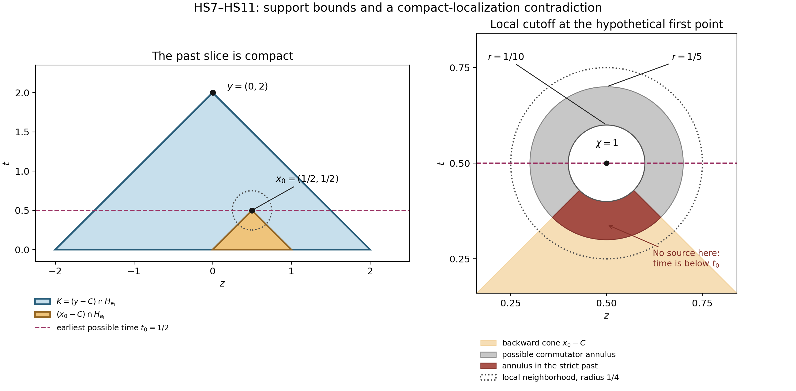

# Small weaker perturbations and hyperbolic uniqueness

*Original proof and figure: GPT-6.1 Sol (OpenAI), Ultra, October 2026; CC0. This learner presentation adds one solved example. Whole-course review and recursive prerequisite closure remain incomplete.*

A causal local inverse controls the support of the solution it constructs. To obtain uniqueness for every solution, we must also use its left-inverse identity. The missing step is a compact localization around the earliest possible support point in a backward propagation cone. The cone is strictly contained in the forward time halfspace, so a cutoff commutator cannot reach that point from the side.

Read [Constant-strength inverses with causal support](constant-strength-inverses-with-causal-support.md), Theorem 1, equations (SC3)–(SC4) and (SC15)–(SC16). That written proof supplies both local inverse identities for compact inputs, the causal support inclusion, and the common cone of equal-strength hyperbolic frozen symbols. Its regular frozen kernel is constructed in [Causal fundamental solutions and lower order expansions](causal-fundamental-solutions-and-lower-order-expansions.md). These are readable proofs of the precise interfaces used below.

The hyperbolic branch also uses [Hyperbolicity and lower order terms](hyperbolicity-and-lower-order-terms.md), including its two introductory analytic inputs and its full lower-order characterization. The general proofs of the [homogeneous hyperbolic cone contract](../prerequisites/planned-foundation-proofs.html#homogeneous-hyperbolic-component-cone-and-zero-free-tube) and the [analytic zero-strip order contract](../prerequisites/planned-foundation-proofs.html#one-sided-analytic-zero-strip-total-taylor-order) remain planned. The proof below is conditional on those exact stated inputs. It proves the additional localization argument needed for uniqueness; it does not supply or close those prerequisite proofs.

The human comparison is Hörmander, *The Analysis of Linear Partial Differential Operators II*, the unnumbered hyperbolic sharpness paragraph following the proof of Theorem 13.6.1, printed page 210 / PDF page 216. That paragraph states uniqueness under a sufficiently small weaker perturbation, with no growth condition on a smooth solution. The complete argument below derives the conclusion from the linked written inverse and its stated conditional inputs, and proves the distributional version. The book is a comparison reference; reading its proof is not required to follow this lesson.

## Exact statement

Use \(D=-i\partial\), let \(N\in\mathbb R^n\setminus\{0\}\), and put \(\ell(x)=x\cdot N\). Let \(P\ne0\) be a constant coefficient polynomial hyperbolic with respect to \(N\), in the convention of the receiving causal-kernel proof. Let \(Q\) be weaker than \(P\). Thus there is a finite positive constant \(M\) such that
\[
\mathcal S_Q(\xi)\le M\mathcal S_P(\xi)
\quad(\xi\in\mathbb R^n),\qquad
\mathcal S_R(\xi)^2=\sum_\alpha|\partial_\xi^\alpha R(\xi)|^2.
\tag{HS1}
\]
Only finitely many summands are nonzero; pad the derivative vectors to the same degree. For \(Q=0\) any positive \(M\) can be used.

**Theorem 1.** Suppose \(a\in C^\infty(\mathbb R^n;\mathbb C)\) and
\[
\|a\|_\infty<\frac1{2M},\qquad
A(x,D)=P(D)+a(x)Q(D),\qquad
Au=0,\qquad
\operatorname{supp}u\subset H_N=\{x:\ell(x)\ge0\}.
\tag{HS2}
\]
Then \(u=0\) for every \(u\in\mathcal D'(\mathbb R^n)\). In particular this holds for every smooth \(u\), without a bound on its growth or on the derivatives of \(a\). The numerical threshold in HS2 is sufficient; it is not claimed to be optimal.

## Frozen strength and the one propagation cone

For each \(x\), the triangle and reverse triangle inequalities for the finite derivative vectors give
\[
\tfrac12\mathcal S_P(\xi)
\le (1-|a(x)|M)\mathcal S_P(\xi)
\le\mathcal S_{P+a(x)Q}(\xi)
\le(1+|a(x)|M)\mathcal S_P(\xi)
<\tfrac32\mathcal S_P(\xi).
\tag{HS3}
\]
In particular all frozen symbols are nonzero and have the same strength. They form a smooth constant-strength family. The equal-strength hyperbolic conclusion and principal-part comparison in SC15–SC16 show that all are hyperbolic with respect to \(N\), with the same principal hyperbolic component and the same closed dual cone.

For positive order, let \(\Gamma\) be that open principal component containing \(N\), and define
\[
C=\{z:z\cdot\theta\ge0\text{ for every }\theta\in\Gamma\}.
\tag{HS4}
\]
Choose \(\eta>0\) with \(B(N,\eta)\subset\Gamma\). For \(z\in C\setminus\{0\}\), use \(\theta=N-rz/|z|\) with \(0<r<\eta\), and then let \(r\uparrow\eta\). It follows that
\[
\ell(z)\ge\eta|z|\quad(z\in C),\qquad
C+C=C,
\qquad C\cap\{\ell=0\}=\{0\}.
\tag{HS5}
\]
The cone is closed because it is an intersection of closed halfspaces. The sum identity follows directly from HS4 and \(0\in C\). This strict time inequality, not merely \(C\subset H_N\), is the geometric fact needed for uniqueness.

At every \(x_0\), Theorem 1 of the receiving inverse proof supplies a neighborhood \(X\) and a map \(E\) such that
\[
EA v=v\text{ in }X\quad(v\in\mathcal E'(X)),\qquad
\operatorname{supp}Ef\subset C+\operatorname{supp}f
\quad(f\in\mathcal E'(\mathbb R^n)).
\tag{HS6}
\]
These are exactly SC3 and SC4 for the frozen symbol at \(x_0\). The neighborhood may shrink as the derivatives of \(a\) grow. No uniform lower bound on its radius is needed.

## Compact localization proves uniqueness for every solution

Assume for contradiction that \(u\ne0\), and take \(y\in\operatorname{supp}u\). Define the closed backward-cone slice
\[
K=(y-C)\cap H_N.
\tag{HS7}
\]
It is compact. Indeed \(x\in K\) means \(y-x\in C\) and \(\ell(x)\ge0\), so HS5 gives
\[
0\le\ell(x)\le\ell(y),\qquad
|y-x|\le\frac{\ell(y)-\ell(x)}{\eta}
\le\frac{\ell(y)}{\eta}.
\tag{HS8}
\]
The closed set \(\operatorname{supp}u\cap K\) is nonempty because it contains \(y\). Choose \(x_0\) there minimizing \(\ell(x)\). This minimum is attained on a compact set; there is no assumption about a global minimum over the entire unbounded halfspace.

Choose (X,E) from HS6 at this \(x_0\). Choose \(\chi\in C_c^\infty(X)\) equal to one on a neighborhood of \(x_0\). Set \(v=\chi u\in\mathcal E'(X)\). By locality and \(Au=0\),
\[
Av=[A,\chi]u=:f,\qquad
f\in\mathcal E'(\mathbb R^n),\qquad
\operatorname{supp}f\subset\operatorname{supp}u,
\qquad x_0\notin\operatorname{supp}f.
\tag{HS9}
\]
All terms in the commutator contain at least one derivative of \(\chi\). Hence \(f\) vanishes where \(\chi\) is constant; its support is compact inside \(X\). This reasoning applies to distributions, with the smooth coefficient \(a\) multiplying the commutator terms.

We claim that \(x_0\notin C+\operatorname{supp}f\). Otherwise write \(x_0=z+c\), with \(z\in\operatorname{supp}f\) and \(c\in C\). HS9 excludes \(c=0\). Consequently HS5 and additivity of \(C\) give
\[
\ell(z)=\ell(x_0)-\ell(c)<\ell(x_0),\qquad
y-z=(y-x_0)+c\in C,
\qquad z\in\operatorname{supp}u\cap K.
\tag{HS10}
\]
This contradicts the choice of \(x_0\). Notice that the support of \(u\) is used twice: it puts \(z\) in \(H_N\), and it makes \(z\) an admissible competing support point in the compact slice.

The set \(C+\operatorname{supp}f\) is closed: along any convergent sequence of sums, compactness of the second set gives a convergent subsequence of its terms, and closedness of \(C\) gives the limit of the other terms. Thus HS6 and the claim imply that \(Ef=0\) on a neighborhood of \(x_0\). The left identity in HS6 now gives
\[
u=v=EAv=Ef=0\quad\text{near }x_0,
\tag{HS11}
\]
contradicting \(x_0\in\operatorname{supp}u\). This proves the positive-order case. The proof uses compact convolutions and compact data in the receiving inverse. It never convolves an arbitrary unbounded \(u\) with a causal kernel.

If \(P\) has order zero, HS1 forces \(Q\) to be constant: its polynomial value is bounded on \(\mathbb R^n\). HS3 says that the smooth multiplier (P+a(x)Q) never vanishes. Its smooth reciprocal makes \(Au=0\) imply \(u=0\) directly. This supplies the remaining case.

## The sharpness comparison

The [all-normal nonuniqueness lesson](https://kokunoyumeto.github.io/open-math-courses-public/courses/constant-coefficient-equations-and-solvability/AN02-L105.html) gives exact halfspace support and arbitrarily small coefficients when \(Q\) is not weaker than \(P\), at its stated order and characteristic/noncharacteristic scopes. Theorem 1 shows why the weakness condition is decisive in the hyperbolic case: every sufficiently small smooth weaker perturbation has no nonzero halfspace-supported solution. This is the exact unnumbered comparison on page 210. It asserts no analogous uniqueness from the evolution halfspace alone and no hypoelliptic sharpness statement.

## Exercises with complete solutions

**Exercise 1 (entry: time transport).** Take \(P(\xi,\tau)=\tau\), \(Q=1\), and \(N=e_t\). Compute a valid \(M\), the sufficient threshold in HS2, and the cone \(C\). For smooth solutions prove uniqueness directly, even without the threshold.

**Solution.** Here \(\mathcal S_P^2=1+\tau^2\) and \(\mathcal S_Q=1\), so \(M=1\) works. HS2 allows \(\|a\|_\infty<1/2\). The component is \(\{(\xi,\tau):\tau>0\}\). In its dual, arbitrary tangential covectors force the tangential coordinate to vanish, and positive \(\tau\) forces \(t\ge0\). Thus \(C\) is the forward time ray. It satisfies HS5 for any \(\eta\le1\).

For each fixed tangential point \(z\), \(D_tu+a(z,t)u=0\) means \(\partial_tu=-ia(z,t)u\). The integrating factor gives
\[
u(z,t)=u(z,0)\exp\!\left(-i\int_0^t a(z,s)\,ds\right).
\tag{HS12}
\]
Halfspace support and smoothness imply \(u(z,0)=0\). Hence \(u=0\) for every smooth \(a\), regardless of its size. This special case illustrates that the uniform general threshold is sufficient rather than optimal.

**Exercise 2 (intermediate: a large equal-order perturbation).** Take \(P(\xi,\tau)=\tau^2-\xi^2\), \(Q=P\), and \(N=e_t\). Verify weakness and the smallness threshold. Then construct a nonzero smooth halfspace-supported solution for one larger constant coefficient \(a\).

**Solution.** The derivative vectors agree, so \(M=1\), and Theorem 1 applies when \(\|a\|_\infty<1/2\). With \(a=-1\), however, \(P+aQ=0\). Therefore
\[
u(z,t)=\begin{cases}e^{-1/t^2},&t>0,\\0,&t\le0\end{cases}
\tag{HS13}
\]
is a solution. Every derivative on the positive side is a polynomial in (1/t) times (e^{-1/t^2}), which tends to zero as \(t\downarrow0\); induction proves smoothness across the boundary. Positivity for (t>0) gives \(\operatorname{supp}u=H_{e_t}\). This example does not assert the best smallness constant. It shows that weakness alone, with no smallness or nonvanishing condition on the frozen symbols, cannot force uniqueness for all \(a\).

**Exercise 3 (advanced: why a causal halfspace is insufficient for this proof).** In two dimensions replace the wave cone by \(C_0=H_{e_t}\). For \(y=(0,2)\), compute the set in HS7. Identify both failures in the compact-minimum argument, and compare them with the wave cone.

**Solution.** The sum-stable cone \(C_0\) contains all horizontal vectors. It gives \(K_0=\mathbb R\times[0,2]\), which is unbounded. Hence a closed nonempty support subset of \(K_0\) need not attain its minimum time. For example the closed set \(S=\{(z,1/z):z\ge1\}\) has infimum time zero without a point at time zero. In addition, nonzero \(c=(1,0)\in C_0\) has \(\ell(c)=0\), so the strict inequality in HS10 fails even if a minimum happens to exist.

For \(C=\{(z,t):t\ge|z|\}\), the slice is the compact triangle with vertices ((-2,0),(2,0),(0,2)). Every nonzero \(c\in C\) has \(\ell(c)>0\), with \(t\ge|c|/\sqrt2\). Both failures are removed. This exercise identifies the limits of this support argument; it claims neither a counterexample for every evolution operator nor uniqueness from a general halfspace-supported inverse.

## Figure: a compact past and a cutoff that cannot send a source to its tip

The coordinates are \((z,t)\), \(N=e_t\), and \(C=\{(z,t):t\ge|z|\}\). The large triangle is \(K=(y-C)\cap H_N\) for \(y=(0,2)\). The point \(x_0=(1/2,1/2)\) represents a hypothetical earliest support point in this compact slice; no actual solution values or support occupancy are plotted. Its backward cone lies in (y-C). The local panel uses exact cutoff radii (1/10) and (1/5), inside a local neighborhood of radius (1/4). The annulus is an upper bound for the commutator support. Its intersection with \(x_0-C\) lies strictly below time (1/2), so HS9–HS10 rule out a commutator source there. HS11 then removes the supposed support point. Colors represent sets and support bounds, not positive or nonzero values of a solution. The geometry record, rendering script, SVG and PNG are retained. Compare Hörmander II; this diagram and compact-localization argument are original expression.

## A lower-order example with an explicit smallness bound

**Exercise 4 (a wave equation with a smooth potential).** In two variables use \(P(\xi,\tau)=\tau^2-\xi^2\), \(Q=1\), and \(N=e_t\). Compute the optimal constant \(M\) in the weakness inequality (HS1), and one sufficient global bound on a smooth, possibly complex potential \(a(z,t)\) for Theorem 1. State the uniqueness conclusion and the assumptions that remain conditional.

**Solution.** The first derivatives of \(P\) are \(2\tau,-2\xi\), and the two nonzero second derivatives are \(2,-2\). Therefore
\[
\mathcal S_P(\xi,\tau)^2=(\tau^2-\xi^2)^2+4\tau^2+4\xi^2+8,\qquad
\mathcal S_Q=1.
\]
This expression is at least \(8\), with equality at \((\xi,\tau)=(0,0)\). Thus \(M=1/\sqrt8\) is the optimal constant in (HS1). A sufficient potential bound in (HS2) is \(\|a\|_\infty<\sqrt2\). The wave polynomial is hyperbolic with respect to \(e_t\), with propagation cone \(C=\{(z,t):t\ge|z|\}\). Hence any distributional solution of \((D_t^2-D_z^2+a(z,t))u=0\) supported in \(t\ge0\) must vanish, at the exact conditional scope of Theorem 1. In ordinary derivatives the operator is \(-\partial_t^2+\partial_z^2+a\); this fixes the sign convention.

No global growth bound on \(u\), no coefficient-derivative bound, and no uniform local inverse radius are required. The bound \(\sqrt2\) is a sufficient uniqueness threshold from the general argument; the optimal weakness constant does not imply an optimal uniqueness threshold. The two precise planned analytic contracts listed at the start remain dependencies of the receiving proof.

## Reproduce the figure

The [PNG figure](../figures/an02-l109-hyperbolic-first-support.png), [SVG figure](../figures/an02-l109-hyperbolic-first-support.svg) and [exact geometry](../figures/an02-l109-hyperbolic-first-support-geometry.json) are original. Save them with the [original rendering source](../figures/an02-l109-render-hyperbolic-first-support.py) and [reproduction wrapper](../figures/an02-l109-reproduce-hyperbolic-first-support.py), then run the wrapper with Python, NumPy and Matplotlib. It renders in a temporary directory, verifies the exact PNG/SVG/geometry bytes and produces the names used here. The original plotting source uses generic output names; its bytes are retained without editing.

## Scope of the result

HS1–HS11 prove the whole-space distributional uniqueness comparison from the exact causal local inverse and its declared hyperbolic inputs. HS12–HS13 and Exercise 3 give three complete solutions. No growth assumption, global convolution of unrestricted distributions, uniform local inverse radius, or bound on coefficient derivatives was added. This learner presentation and additional example require their own review. The planned analytic inputs and recursive prerequisite closure remain explicit.
