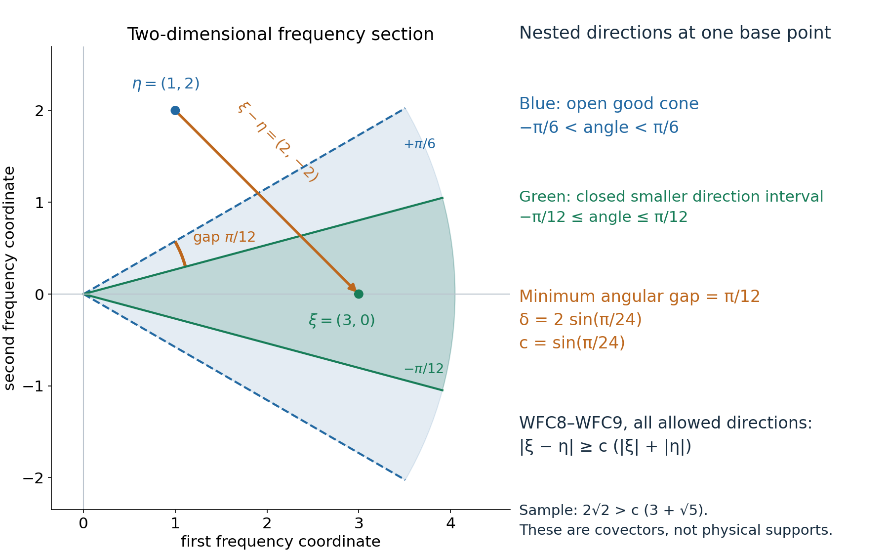
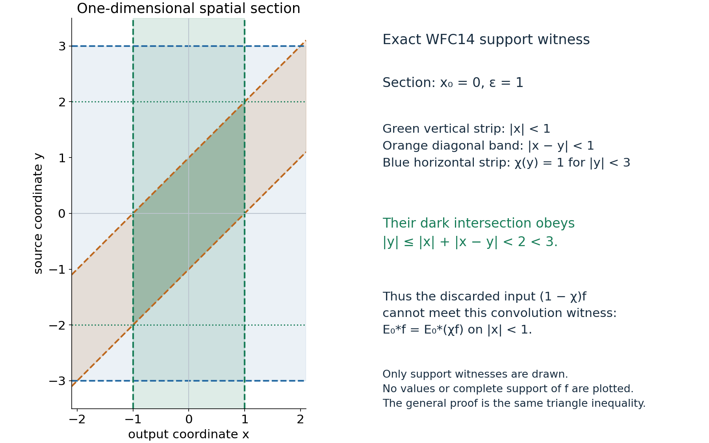

# Smooth-wavefront convolution with a kernel singular only at zero

## Reading guide

This complete lesson proves that convolution with a distribution kernel smooth away from zero adds no smooth-wavefront directions to a compact distribution input. It defines the compact-factor convolution on tests, proves the frequency-cone estimate, splits off a compact kernel and differentiates the smooth remainder through a fixed compact test family. No temperateness of the whole kernel is required.

The retained lower entries include fixed-compact finite-order distribution bounds, compact-distribution Fourier evaluation, tensor products and compact-factor convolution, Schwartz inversion and the compact smooth multiplication formula, cutoffs and ordinary scalar integration. The L021 receiving interface comprises its equation (1), compact inverse identity and separated-support commutator/test-family calculation. Strong-distribution topology and differential wavefront decrease remain separate entries, as do all other containing-lesson assertions and recursive foundations. Read WFC0–WFC6, all three examples and all six complete solutions below.

## Proof

# A singular kernel at the origin does not add wavefront directions

*Written by GPT-6.1 Sol (OpenAI), Ultra, October 2026. Classical exposition and original diagrams, dedicated under CC0. *

Let \(E\) be a distribution on \(\mathbb R^n\) that is smooth away from the origin, and let \(f\) be a compactly supported distribution. The convolution exists even when \(E\) grows too fast to be tempered. We prove the precise smooth-wavefront inclusion needed in the hypoellipticity lesson:
\[
 \operatorname{WF}(E*f)\subset\operatorname{WF}(f).
 \tag{WFC1}
\]
The claim concerns points and nonzero covectors, not only the projection called singular support. The proof uses a compact part of the kernel, a spatial support witness, and a frequency-cone estimate. It does not assume the general wavefront theorem for convolution or a general pseudodifferential calculus.

## WFC0. Objects, conventions and actual lower entries

We use the negative-exponential Fourier transform, its inverse factor \((2\pi)^{-n}\), and \(D=-i\partial\). A smooth wavefront point \((x_0,\xi_0)\), with \(\xi_0\ne0\), is absent from \(\operatorname{WF}(u)\) when there is a cutoff \(\chi\in C_c^\infty\), equal to one near \(x_0\), and an open cone \(\Gamma\) containing \(\xi_0\), such that
\[
 |\widehat{\chi u}(\eta)|\le C_L\langle\eta\rangle^{-L}
 \quad(\eta\in\Gamma,\ L\ge0),
 \qquad \langle\eta\rangle=(1+|\eta|^2)^{1/2}.
 \tag{WFC2}
\]
An open cone is invariant under every positive dilation and is a subset of the nonzero covectors. Values at zero have no effect on integrals or on the definition.

The lower distribution and scalar Fourier entries are explicit: a distribution restricted to tests with support in a fixed compact set has a finite-order bound; compact distributions have their Fourier transforms by evaluation on exponentials with a cutoff; tensor products and convolution with one compact factor have their usual test-function definitions; Fourier inversion on Schwartz tests and the product formula for multiplication by a compact smooth function hold; and compact smooth cutoffs exist. Ordinary integration, dominated convergence and the scalar product rule are also used. These are the distribution/Fourier contracts already used by the receiving course. This lesson does not claim to close all those foundations recursively.

For clarity, the particular compact-distribution facts used here can be seen directly. If \(a\) has compact support, choose \(\nu=1\) on a neighborhood of that support. Its finite-order bound gives
\[
 \widehat a(\eta)=\langle a,\nu(x)e^{-ix\cdot\eta}\rangle,
 \qquad |\widehat a(\eta)|\le C\langle\eta\rangle^M.
 \tag{WFC3}
\]
It is smooth in \(\eta\): differentiating the exponential produces a fixed compact test times a monomial in \(x\); difference quotients converge in every required test seminorm. The transform does not depend on \(\nu\).

If \(a,b\) both have compact support, their convolution is compactly supported and
\[
 \operatorname{supp}(a*b)\subset
 \operatorname{supp}a+\operatorname{supp}b,
 \qquad \widehat{a*b}(\eta)=\widehat a(\eta)\widehat b(\eta).
 \tag{WFC4}
\]
For the support assertion, a test supported outside the compact sum pulls back to a function vanishing on a neighborhood of \(\operatorname{supp}a\times\operatorname{supp}b\). For the Fourier assertion, insert \(e^{-i(x+y)\cdot\eta}\) with cutoffs equal to one on the two compact supports in the tensor-product definition. The exponential factors into the same two Fourier tests. These calculations supply the actual maps used below.

More generally, \(E*f\) for compact \(f\) is defined by testing the tensor product against \(\varphi(x+y)\), with compact cutoffs in both variables. On the support of a compact output test and the fixed compact support of \(f\), the possible first coordinates lie in a compact difference set. Thus these cutoffs can be chosen, their choices agree, and the resulting distribution exists without a tempered-growth assumption on \(E\).

## WFC1. The frequency-cone estimate

**Lemma.** Suppose \(F\) is a measurable function on frequency space with
\[
 |F(\eta)|\le C\langle\eta\rangle^B
 \quad\text{everywhere},\qquad
 |F(\eta)|\le C_L\langle\eta\rangle^{-L}
 \quad(\eta\in\Gamma,\ L\ge0),
 \tag{WFC5}
\]
where \(B\ge0\) and \(\Gamma\) is an open cone. If \(a\) is Schwartz and \(\Gamma'\) has its closed unit-direction set inside \(\Gamma\), then \(a*F\) decreases faster than every power on \(\Gamma'\).

**Proof.** The integral defining \(a*F\) is absolutely convergent because \(a\) is Schwartz and \(F\) has polynomial growth. Split it into \(\eta\in\Gamma\) and \(\eta\notin\Gamma\).

For the first part use
\[
 \langle\xi\rangle^L
 \le 2^{L/2}\langle\xi-\eta\rangle^L\langle\eta\rangle^L.
 \tag{WFC6}
\]
This follows by bounding \(1+|\xi|^2\) by \(2(1+|\xi-\eta|^2)(1+|\eta|^2)\). Apply the Schwartz bound of order \(L+n+1\) to \(a\) and the rapid bound of order \(L+n+1\) to \(F\) on \(\Gamma\). The weighted integrand is at most
\[
 C_L\langle\xi-\eta\rangle^{-n-1}
            \langle\eta\rangle^{-n-1}.
 \tag{WFC7}
\]
Its integral is bounded independently of \(\xi\), since the first factor is at most one and the second is integrable.

For the second part compact angular separation gives a constant \(c>0\) with
\[
 |\xi-\eta|\ge c(|\xi|+|\eta|)
 \quad(\xi\in\Gamma',\ \eta\notin\Gamma).
 \tag{WFC8}
\]
Here is the exact geometric argument. For nonzero \(\xi,\eta\), their unit directions have distance at least \(\delta>0\): the first directions lie in a compact subset of \(\Gamma\)'s unit directions and the second in its closed complement. With \(r=|\xi|\), \(s=|\eta|\), and unit directions \(\omega,\nu\),
\[
 |r\omega-s\nu|^2=(r-s)^2+rs|\omega-\nu|^2
 \ge \frac{\delta^2}{4}(r+s)^2.
 \tag{WFC9}
\]
The last inequality uses \(0<\delta\le2\). If there are no complementary unit directions there is no such integral part except a measure-zero point. If \(\eta=0\), WFC8 holds directly after decreasing \(c\).

WFC8 implies both \(\langle\xi-\eta\rangle\ge c'\langle\xi\rangle\) and \(\langle\xi-\eta\rangle\ge c'\langle\eta\rangle\). Apply the Schwartz bound of order \(L+B+n+1\) to \(a\), allocating \(L\) powers to the first inequality and \(B+n+1\) to the second. The polynomial bound for \(F\) leaves
\[
 |a(\xi-\eta)F(\eta)|
 \le C_L\langle\xi\rangle^{-L}\langle\eta\rangle^{-n-1}.
 \tag{WFC10}
\]
Its integral is at most \(C'_L\langle\xi\rangle^{-L}\). Together with the first part this proves the lemma. \(\square\)

In particular, if a compact distribution \(g\) has rapid Fourier decrease of \(\widehat g\) itself on \(\Gamma\), multiplication by any \(\psi\in C_c^\infty\) retains rapid Fourier decrease on a smaller cone:
\[
 \widehat{\psi g}
 =(2\pi)^{-n}\widehat\psi*\widehat g.
 \tag{WFC11}
\]
The scalar multiplication formula and the proved cone lemma justify this statement. They also reconcile a definition using a cutoff merely nonzero at \(x_0\) with the definition above: choose \(\psi=1\) near \(x_0\), supported where the first cutoff is nonzero, and multiply its localized distribution by the compact smooth quotient. No independent cutoff-stability theorem is concealed here.

*Figure 1.* This is a two-dimensional frequency section. The larger open cone has angles strictly between \(-\pi/6\) and \(\pi/6\); the smaller closed unit-direction interval has angles between \(-\pi/12\) and \(\pi/12\). The smallest angular gap to the complement is \(\pi/12\), so one may take \(\delta=2\sin(\pi/24)\) and \(c=\sin(\pi/24)\) in WFC8–WFC9. The displayed sample is \(\xi=(3,0)\) and \(\eta=(1,2)\), with \(\xi-\eta=(2,-2)\). Its actual lengths satisfy the bound. The cones describe covectors at the same base point; they are not support cones in physical space. The general proof uses compact unit-direction separation in any dimension.

## WFC2. The smooth part of the kernel

If \(A\in C^\infty(\mathbb R^n)\) and \(f\) is compactly supported, then \(A*f\) is smooth even when \(A\) is untempered. Choose one cutoff \(\nu=1\) near \(\operatorname{supp}f\). The formula is
\[
 (A*f)(x)=\langle f(y),\nu(y)A(x-y)\rangle,
 \qquad
 \partial_x^\alpha(A*f)(x)
 =\langle f(y),\nu(y)\partial_x^\alpha A(x-y)\rangle.
 \tag{WFC12}
\]
On any compact set of \(x\)'s the functions on the right have one common compact test support and bounded derivatives of every order. Taylor remainders in \(x\) tend to zero in the finite test seminorm controlling \(f\). Thus differentiation under this pairing is justified, and iteration proves every displayed derivative is continuous. This argument is local in \(x\); it imposes no global bound on \(A\).

## WFC3. The actual spatial and frequency proof

Fix \((x_0,\xi_0)\notin\operatorname{WF}(f)\). Choose a cutoff \(\chi\), equal to one near \(x_0\), and cone \(\Gamma\) satisfying WFC2 for \(f\). Choose \(\epsilon>0\) with
\[
 \chi=1\text{ on }B(x_0,3\epsilon).
\]
Choose \(\rho\in C_c^\infty(B(0,\epsilon))\), equal to one near zero, and split
\[
 E_0=\rho E,\qquad E_\infty=(1-\rho)E,\qquad
 E*f=E_0*f+E_\infty*f.
 \tag{WFC13}
\]
The first distribution has compact support in the kernel ball. The second is globally smooth: it vanishes near zero and equals a smooth multiple of \(E\) elsewhere. WFC12 proves its convolution with \(f\) is smooth.

On \(B(x_0,\epsilon)\),
\[
 E_0*f=E_0*(\chi f).
 \tag{WFC14}
\]
Indeed \(\operatorname{supp}((1-\chi)f)\) misses the larger ball \(B(x_0,3\epsilon)\). If \(z\in\operatorname{supp}E_0\), then \(|z|<\epsilon\). For \(x\in B(x_0,\epsilon)\), \(y=x-z\) has \(|y-x_0|<2\epsilon\), where \(\chi=1\). Thus no support sum \(z+y\) of the discarded convolution reaches the output ball. WFC4, or its identical test-support argument for this pair, proves WFC14 as an equality of distributions on that open ball.

The compact distribution \(h=E_0*(\chi f)\) has transform
\[
 \widehat h(\eta)=\widehat E_0(\eta)\widehat{\chi f}(\eta).
 \tag{WFC15}
\]
The first factor has polynomial growth by WFC3, and the second has polynomial growth globally and rapid decrease in \(\Gamma\). Their product therefore has polynomial growth globally and rapid decrease in \(\Gamma\), of every order.

Take \(\psi\in C_c^\infty(B(x_0,\epsilon))\), equal to one near \(x_0\), and an open cone \(\Gamma'\) containing \(\xi_0\) whose closed unit directions lie inside \(\Gamma\). WFC11 and the cone lemma show that \(\widehat{\psi h}\) decreases rapidly in \(\Gamma'\). The other localized term \(\psi(E_\infty*f)\) is compact smooth and has Schwartz transform. WFC13–WFC14 now give rapid decrease of \(\widehat{\psi(E*f)}\) on \(\Gamma'\). By the definition WFC2, \((x_0,\xi_0)\notin\operatorname{WF}(E*f)\). This proves WFC1. \(\square\)

*Figure 2.* In the one-dimensional section \(x_0=0\), \(\epsilon=1\), the vertical output strip is \(|x|<1\), the diagonal kernel-support band is \(|x-y|<1\), and the cutoff equals one on the horizontal source strip \(|y|<3\). Their intersection has \(|y|<2\), strictly inside the cutoff strip. It proves WFC14 by the triangle inequality. The plot bounds neither an arbitrary distribution's values nor its full support; only these exact spatial witnesses are displayed. WFC13 and WFC15 separately describe the kernel split and Fourier factors. No whole-space Fourier transform of an untempered \(E\) is used.

## WFC4. The receiving hypoellipticity calculation

The exact assumed estimate at equation (1) of *Hypoellipticity and complex zeros* is WFC1. Its other incoming existence, localization, topology and Fourier entries remain separate.

Suppose additionally that \(P(D)E=\delta_0\). For every compact distribution \(v\), differentiating the compact-factor convolution gives
\[
 E*P(D)v=P(D)E*v=\delta_0*v=v.
 \tag{WFC16}
\]
The equality follows directly by moving each constant-coefficient derivative between the two factors in the tensor/test definition; integration by parts supplies the matching signs. In the \(D=-i\partial\) convention the two factors use the same \(D\), so no new minus sign is inserted. Applying WFC1 to the compact input \(P(D)v\) gives \(\operatorname{WF}(v)\subset\operatorname{WF}(P(D)v)\).

For a distribution \(u\) on an open set, use \(v=\chi u\) with a compact cutoff equal to one near the observation point. The commutator \([P(D),\chi]u\) is compactly supported away from a smaller observation neighborhood. Its convolution with \(E\) is smooth there: all involved differences \(x-y\) avoid zero, and WFC12's compact-test differentiation proof applies on these separated compact sets after a local cutoff in the kernel. WFC1 applies to \(\chi P(D)u\). This supplies precisely the previously assumed convolution step, with point and covector localization preserved. Differential decrease of wavefront sets and the receiving lesson's other prerequisite proofs are not inferred from this one step.

## WFC5. Three worked examples

### Example 1: the point kernel

Take \(E=\delta_0\). It is zero, hence smooth, away from zero. Its convolution with any compact \(f\) is exactly \(f\), by evaluating the point factor in the test definition. WFC1 is equality. This shows that a singular kernel at zero can retain every existing wavefront direction rather than smooth its input. Its compact Fourier factor is the constant one, so WFC15 likewise leaves the localized transform unchanged.

### Example 2: the Heaviside kernel on the line

Let \(E=H\) on \(\mathbb R\). It is smooth off zero and satisfies \(\partial E=\delta_0\). For a compact smooth function \(f\), the convolution is
\[
 (H*f)(x)=\int_{-\infty}^x f(y)\,dy.
\]
It is smooth, as WFC1 predicts from the empty wavefront set of \(f\). For the compact distribution \(f=\delta_a\), the convolution is \(H(x-a)\). It is smooth away from \(a\). At \(a\), neither nonzero one-dimensional covector is absent: if a cutoff equal to one there gave rapid decrease on either frequency half-line, then its derivative would give rapid decrease on that half-line too. But
\[
 \partial(\chi H(\,\cdot-a))=\delta_a+\chi'H(\,\cdot-a),
\]
and the second term is compact smooth while the Fourier transform of \(\delta_a\) has modulus one. This is impossible. The derivative multiplier is \(i\xi\), which preserves rapid decrease; the argument applies to both signs of \(\xi\). Thus its wavefront set at \(a\) agrees with that of \(\delta_a\), and the inclusion is exact in this example.

### Example 3: an untempered smooth kernel

Take \(E(x)=e^{|x|^2}\) and \(f=\delta_a\). The kernel is smooth everywhere and need not be Fourier transformed on all of space. The test-pairing formula gives \((E*f)(x)=e^{|x-a|^2}\), again smooth. More generally WFC12 proves \(E*f\) smooth for every compact distribution \(f\). No tempered estimate on \(E\) or on this output is required. The empty output wavefront is a subset of the possibly nonempty input wavefront.

## WFC6. Six exercises with full solutions

**Exercise 1.** Why must the kernel be split before using Fourier transformation when \(E\) is untempered?

**Solution 1.** The whole \(E\) may have no tempered Fourier transform. Multiplication by \(\rho\) produces the compact distribution \(E_0\), whose transform has the finite-order polynomial bound WFC3. The remainder \(E_\infty\) is smooth because the only possible singular base point was zero and \(\rho=1\) near it. Its compact-factor convolution is handled by the local test pairing WFC12, with no Fourier transform of that remainder. The proof thus uses only legitimate Fourier objects.

**Exercise 2.** Verify the exact spatial margin in WFC14.

**Solution 2.** The output point has distance less than \(\epsilon\) from \(x_0\), and the kernel difference \(z\) has norm less than \(\epsilon\). Their difference \(y=x-z\) therefore has distance less than \(2\epsilon\) from \(x_0\). The cutoff is one on the larger ball of radius \(3\epsilon\). A point in the discarded input's support must lie outside that latter ball, so it cannot equal this \(y\). The positive spare margin also gives vanishing on neighborhoods needed when testing distributions, rather than only a pointwise cancellation.

**Exercise 3.** Derive the separated-frequency constant in Figure 1.

**Solution 3.** The nearest unit directions have angle \(\pi/12\), whose chord length is \(\delta=2\sin(\pi/24)\). WFC9 gives a square-distance bound \(\delta^2(r+s)^2/4\), so WFC8 holds with \(c=\delta/2=\sin(\pi/24)\). For the displayed points the actual left side is \(2\sqrt2\), and the right side is \(\sin(\pi/24)(3+\sqrt5)\), which is smaller. The constant is obtained from all allowed directions, rather than fitted to that sample.

**Exercise 4.** Why is polynomial growth of \(F\) outside the good cone sufficient for the cone lemma?

**Solution 4.** On the complementary frequencies the angular gap forces \(\langle\xi-\eta\rangle\) to dominate both \(\langle\xi\rangle\) and \(\langle\eta\rangle\). A Schwartz bound of order \(L+B+n+1\) on \(a\) spends \(L\) powers to give the desired output decay and the other \(B+n+1\) to cancel the \(B\)-power growth of \(F\) and leave an integrable \(\langle\eta\rangle^{-n-1}\). Integrating WFC10 proves the bound for every \(L\). No rapid decrease of \(F\) on the complement is needed.

**Exercise 5.** Explain why this theorem would fail for a singular kernel based away from zero.

**Solution 5.** If \(E=\delta_b\) with \(b\ne0\) and \(f=\delta_a\), their convolution is \(\delta_{a+b}\). Its wavefront is based at \(a+b\), whereas the input's is based at \(a\). The stated same-base-point inclusion therefore fails. The hypothesis that \(E\) is smooth away from zero is exactly what allows the singular compact kernel to be chosen in an arbitrarily small ball around the origin. A smooth kernel, in contrast, satisfies the theorem because its output is smooth.

**Exercise 6.** Identify the proof used in the local homogeneous-solution topology estimate of the receiving lesson.

**Solution 6.** A compact commutator is supported away from the compact observation set. Thus the differences \(x-y\) in that term stay in a compact subset avoiding the sole possible singularity of \(E\). After multiplying by a kernel cutoff equal to one on those differences, the pairing has the form in WFC12. Every observation derivative is paired with a test family on one fixed compact source support, with all derivatives uniformly bounded. The finite-order distribution bound makes differentiation legitimate. The receiving strong-distribution topology controls the supremum over each such bounded test family. This is a spatial separated-support calculation, while WFC1 supplies the other term's covector estimate.

## Credits and remaining scope

Smooth-wavefront cutoff tests and the microlocal convolution principle are classical. Human method credit follows the receiving lesson's open Fourier/distribution readings by Gerd Grubb and Richard Melrose and its [Hörmander seminar reference](https://www.numdam.org/item/SEDP_1971-1972____A25_0/). This proof does not reproduce those sources' wording or diagrams and makes no historical novelty claim. No new external source body was imported or source license changed. The Fourier cone estimate, compact support witness, examples, solutions and diagrams here are independently written.

This proof supplies the specific smooth-wavefront convolution prerequisite at its explicit lower distribution/Fourier entries. It does not prove every theorem of the containing hypoellipticity lesson, its minimal-linear-support theorem, the averaging existence proof, the semialgebraic power lemmas, general wavefront calculus or all recursive foundations. 

