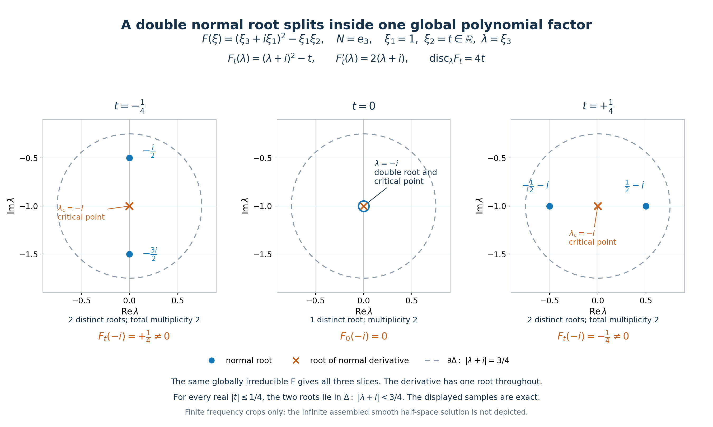

# Splitting normal roots and exceptional-factor perturbations

*Written by GPT-6.1 Sol (OpenAI), Ultra reasoning effort, October 2026. Original expression and original illustrations: CC0.*

The exceptional case has **nonzero** normal derivative: \(P=P_1^jP_2\), \(D_NP_1(\zeta)\ne0\), \(P_2(\zeta)\ne0\). The perturbing polynomial in the theorem below has the **same** homogeneous degree as P, is nonzero at the specified root, and is constant on every normal line. The lower-order extension proves an existence statement with exact degree conditions; it does not prescribe every lower-order polynomial.

Put \(D=-i\partial\), \(D_N=-iN\cdot\partial_\xi\), \(H_N=\{x:x\cdot N\ge0\}\), and let \(N\in\mathbb R^n\setminus\{0\}\). The operator equation is \((P(D)+a(x)Q(D))u=0\). Boundary order means: for every requested integer J≥0 we choose a,u with \(\partial^\alpha a=0\) on \(x\cdot N=0\) for every \(|\alpha|\le J\). A different coefficient may be chosen for each J.

For a polynomial B define its directional strength on real frequencies by \(\mathcal S_NB(\xi)=(\sum_{k=0}^{\deg B}|D_N^kB(\xi)|^2)^{1/2}\). Padding with zero derivatives allows comparison of symbols of different degrees. The factors −i do not change the absolute values of ordinary normal derivatives.

## The homogeneous theorem and its construction input

Let P be a nonzero homogeneous polynomial of degree m and let \(\zeta^0\ne0\), \(P(\zeta^0)=0\), with \(\operatorname{Im}\zeta^0\) proportional to N. Thus m≥1. Suppose there is no polynomial factorization

\[
P=F^jG,\qquad j\ge1,\qquad D_NF(\zeta^0)\ne0,\qquad G(\zeta^0)\ne0.
\tag{HE1}
\]

For every nonzero homogeneous Q of degree m with

\[
Q(\zeta^0)\ne0,\qquad Q(\xi+zN)\equiv Q(\xi),
\tag{HE2}
\]

and every integer J≥0, we prove existence of smooth a,u on \(\mathbb R^n\), satisfying the operator equation, \(\operatorname{supp}u=H_N\), and the inclusive boundary jets above. The polynomial identity in (HE2) holds for every complex \(\xi,z\); constancy just on the specified root line would not replace it in this proof.

Our full construction input is [Complex frequency windows and exact half-space support](complex-frequency-windows-and-exact-half-space-support.md), equations (CT1)–(CT3). Its hypotheses are nonzero P and Q, degree P≥degree Q, centres \(\zeta_\nu=\xi_\nu-i\lambda_\nu N\), \(\xi_\nu\) real, \(\lambda_\nu\ge0\), nonzero centre values, positive Tν,Kν, and coefficient limits

\[
\begin{gathered}
\frac{P(\zeta_\nu+T_\nu zN)}{P(\zeta_\nu)}\to1,
\qquad
\frac{Q(\zeta_\nu+T_\nu zN)}{Q(\zeta_\nu)}\to1,
\qquad \frac{P(\zeta_\nu)}{Q(\zeta_\nu)}\to0,\\
K_\nu\left(\frac{P(\zeta_\nu+T_\nu zN)}{P(\zeta_\nu)}-
\frac{Q(\zeta_\nu+T_\nu zN)}{Q(\zeta_\nu)}\right)\to r(z),\\
\frac{K_\nu}{T_\nu}\to0,
\qquad \frac{1+|\operatorname{Im}\zeta_\nu|}{T_\nu K_\nu}\to0,
\qquad \operatorname{Im}r'(z_*)<0\quad\text{at some }z_*\in\mathbb C.
\end{gathered}
\tag{HE3}
\]

Convergence of coefficients implies all the pointwise limits for z∈C. The conclusion of the complex-frequency theorem is exactly the asserted smooth equation, support equality and finite jets. Its characteristic branch retains the [planned exact characteristic-halfspace prerequisite](../prerequisites/planned-foundation-proofs.html#exact-characteristic-halfspace-smooth-homogeneous-solution), and its algebraic and smooth-jet lessons retain their stated open transitive dependencies. The general characteristic proof remains planned.

## Elementary alternatives and normal coordinates

If P(N)=0, the flat profile from [Characteristic rays and directional strength](characteristic-rays-and-directional-strength.md), equations (2)–(3), applies directly. Set a=0 and u(x)=f(x·N), where f(s)=exp(−1/s²) for s>0 and f(s)=0 for s≤0. Every derivative is smooth and flat at zero, and homogeneity gives \(P(D)u=P(N)(-i)^mf^{(m)}=0\). Since f>0 for s>0, its support is exactly H_N. This uses the proved homogeneous special case, without asserting the planned general characteristic theorem has been proved.

Assume henceforth P(N)≠0. Choose a real orthonormal basis of N⊥ and let L identify \(\mathbb R^{n-1}\) with N⊥. Write frequencies as \(Ly+\lambda N\), and set

\[
\mathsf P(y,\lambda)=P(Ly+\lambda N),\qquad
\mathsf Q(y,\lambda)=q(y)=Q(Ly).
\tag{HE4}
\]

Both are homogeneous of degree m in their full coordinates; \(\mathsf P\) has degree m in λ and leading coefficient P(N), a nonzero constant. Normal differentiation of P is exactly λ differentiation of \(\mathsf P\), up to the factor −i for D_N. Write \(\zeta^0=Ly_0+\lambda_0N\); y₀ is real and q(y₀)≠0. Since m≥1, q(0)=0, hence y₀≠0. These observations also show that an admissible Q requires at least one tangent coordinate.

If λ₀ is real, \(\zeta^0\) is a nonzero real zero and the real-frequency ray argument already suffices for this prescribed Q. For t≥1, homogeneity and P(ζ⁰)=0 give \(\mathcal S_NP(t\zeta^0)\le Ct^{m-1}\), with \(C^2=\sum_{k=1}^m|D_N^kP(\zeta^0)|^2\). The nonzero constant top derivative \(D_N^mP=(-i)^m m!P(N)\) guarantees C>0 and \(\mathcal S_NP>0\). Meanwhile \(\mathcal S_NQ(t\zeta^0)\ge t^m|Q(\zeta^0)|\), so the ratio diverges at least linearly. This is the homogeneous-ray argument in equations (11)–(14) of [Characteristic rays and directional strength](characteristic-rays-and-directional-strength.md), with the prescribed degree-m Q substituted in its ray estimate; no existence choice of a different Q is needed. The [real-frequency construction](flat-half-space-solutions-from-real-frequency-rays.md) used there supplies a smooth flat a and u with support H_N. Its hypotheses hold because P(N)≠0 and degree Q=m. Thus this branch also closes the claimed finite jets.

For the complex branch, replace ζ⁰ by −ζ⁰ if necessary. Homogeneity preserves P=0, the absence of (HE1) and the nonzero Q value, and changes λ₀ to −λ₀. We may therefore assume \(\operatorname{Im}\lambda_0<0\).

## From a cluster that does not split to a global polynomial factor

We prove the global polynomial-factor implication in full. It is essential that tangent parameters are allowed to range over a **real open neighbourhood**, rather than just one sequence or one tangent line.

Let λ₀ be a normal root of \(\mathsf P(y_0,\lambda)\) of multiplicity μ. If μ=1, the factorization (HE1) already holds with F=P, j=1, G=1, because \(D_NP(\zeta^0)\ne0\). Hence absence of (HE1) forces μ≥2.

Choose a closed disk \(\overline\Delta=\{|\lambda-\lambda_0|\le\epsilon\}\) contained in the lower half-plane, whose only zero of \(\mathsf P(y_0,\lambda)\) and of \(\partial_\lambda\mathsf P(y_0,\lambda)\) is λ₀. Shrinking ε avoids the other finitely many roots of both polynomials. Their boundary values have positive minima. Choose a connected complex polydisk U about the real point y₀ so small that neither polynomial acquires a boundary zero and both perturbations on \(\partial\Delta\) are smaller than those minima. Rouché's theorem, or equivalently the argument principle along the straight coefficient homotopy, gives exactly μ zeros of P and μ−1 zeros of its λ derivative in Δ, counted with multiplicity, for every y∈U. Only the elementary polynomial root-count contract is used here: a continuous polynomial homotopy with no boundary zeros keeps its boundary winding number, which equals its root count by factorization into linear factors.

Suppose that, for every real y∈U, all derivative zeros in Δ are also P zeros. Let the distinct roots of P in Δ have multiplicities \(a_1,\ldots,a_s\), with sum μ. At a root of multiplicity a the derivative has **exactly** multiplicity a−1: differentiate \((\lambda-h)^a V(\lambda)\), where V(h)≠0. The derivative zeros that are also P zeros consequently have total multiplicity

\[
\sum_{k=1}^s(a_k-1)=\mu-s.
\tag{HE5}
\]

The hypothesis says these account for all μ−1 derivative zeros in Δ, so μ−s=μ−1 and s=1. Thus P has a single cluster root of multiplicity μ for every such real y.

For completeness, this is an analytic persistence statement and not merely a numerical count. The root trace

\[
h(y)=\frac1\mu\frac1{2\pi i}
\int_{\partial\Delta}\lambda\,
\frac{\partial_\lambda\mathsf P(y,\lambda)}{\mathsf P(y,\lambda)}\,d\lambda
\tag{HE6}
\]

is holomorphic on U, because the denominator has no boundary zeros. On real y it is the unique root in Δ. Hence the holomorphic functions \(\partial_\lambda^k\mathsf P(y,h(y))\), for 0≤k<μ, vanish on the real open polydisk. They vanish identically on U: fix all but the first variable real and use one-variable identity uniqueness, then allow the first variable complex, apply it to the second, and continue. Since \(\partial_\lambda^\mu\mathsf P(y_0,\lambda_0)\ne0\), shrink U once more to obtain

\[
\mathsf P(y,\lambda)=(\lambda-h(y))^\mu V(y,\lambda),
\qquad V(y_0,\lambda_0)\ne0
\tag{HE7}
\]

locally. Taylor's polynomial formula in λ gives the analytic V explicitly. Analytic factorization alone would not establish (HE1), whose factors must be global polynomials. We now prove that stronger conclusion.

Factor the nonzero polynomial P in \(\mathbb C[y,\lambda]\) into distinct irreducibles:

\[
\mathsf P=c\prod_{a=1}^r F_a^{e_a}.
\tag{HE8}
\]

Each nonconstant F_a is homogeneous. Indeed, for a product in an integral graded polynomial ring, the lowest and highest occurring total degrees of the product are the sums of those of its factors, because the products of their nonzero lowest and highest parts are nonzero. A homogeneous product has equal lowest and highest degree, so every factor does too. Write d_a=degree F_a. The λ degree of F_a is at most d_a. Since the λ degree of P equals its total degree m, equality in

\[
m=\sum_a e_a\deg_\lambda F_a
\le\sum_a e_a d_a=m
\tag{HE9}
\]

forces \(\deg_\lambda F_a=d_a\) for every a. Each leading λ coefficient is therefore a nonzero **constant**. Dividing by it, we make each F_a monic in λ. In particular no irreducible factor is tangent-only.

Let K=\(\mathbb C(y)\) be the field of rational functions in the tangent variables. Each monic F_a remains irreducible in K[λ]. Here is the needed Gauss argument. The coefficient ring \(\mathbb C[y]\) is a unique-factorization ring; the product of two primitive polynomials is primitive, since reduction modulo any irreducible coefficient prime is multiplication of nonzero polynomials in an integral domain. Clearing denominators in a putative K factorization and cancelling contents therefore yields a polynomial factorization of a primitive F_a in \(\mathbb C[y,\lambda]\), a contradiction. Monicity makes F_a primitive and prevents a coefficient-only factor. Distinct F_a stay nonassociate and coprime in K[λ]: monic associates would be equal coefficient by coefficient.

In characteristic zero \(\partial_\lambda F_a\) is nonzero and has smaller λ degree. Irreducibility therefore gives \(\gcd(F_a,\partial_\lambda F_a)=1\) in K[λ]. The following polynomial in y is not identically zero:

\[
\mathcal R(y)=
\prod_a\operatorname{Res}_\lambda(F_a,\partial_\lambda F_a)
\prod_{a<b}\operatorname{Res}_\lambda(F_a,F_b).
\tag{HE10}
\]

For clarity, no geometric density assertion is hidden in (HE10). Over a field the Sylvester determinant of two polynomials is zero precisely when they have a common factor. To see the direction needed here, the determinant is the matrix of \((A,B)\mapsto AF+BG\) on \(\deg A<\deg G\), \(\deg B<\deg F\). A nonzero kernel gives AF=−BG and therefore a common factor, since coprimality would force G|A and F|B, contradicting the degree bounds. Thus coprimality makes the determinant nonzero. Computing that same determinant with the polynomial coefficients of F_a shows each factor of (HE10) is a nonzero element of \(\mathbb C[y]\). There are no leading-coefficient degeneration exceptions, because all F_a are monic.

A nonzero complex polynomial cannot vanish on a real open polydisk. In one variable this follows from its finite zero set; in several variables apply that fact successively to its polynomial coefficients in one variable. Thus we can choose a real \(y_*\in U\) with \(\mathcal R(y_*)\ne0\). At y_* every normal root of every F_a is simple, and roots of different F_a are distinct.

Let b_a be the multiplicity of λ₀ as a root of \(F_a(y_0,\lambda)\), taking b_a=0 if its value is nonzero. After shrinking Δ and U if needed, root-count stability gives exactly b_a roots of F_a in Δ for every y∈U. At y_* these are simple and pairwise distinct across all a. Hence the number of distinct P roots in Δ at y_* is \(\sum_a b_a\). (HE5) shows this number is 1. Therefore exactly one index a₀ has b_a₀=1 and all other b_a are zero. It follows that

\[
\partial_\lambda F_{a_0}(y_0,\lambda_0)\ne0,
\qquad F_a(y_0,\lambda_0)\ne0\ (a\ne a_0),
\qquad e_{a_0}=\mu.
\tag{HE11}
\]

Returning through the linear coordinate map gives the **global polynomial** factorization

\[
P=P_1^\mu P_2,\qquad
D_NP_1(\zeta^0)\ne0,\qquad P_2(\zeta^0)\ne0.
\tag{HE12}
\]

This proves the exact exceptional case, including both required nonzero values, rather than just a local analytic power representation. It also shows why a persistent multiple power of one normal-simple irreducible is the only obstruction: repeated factors are retained with their exponents in (HE8), while the discriminants and pair resultants are taken on its squarefree list.

## Critical points away from the zero set

Because (HE1) is excluded, the preceding implication gives critical points with real tangent parameters and nonzero P values arbitrarily near (y₀,λ₀). More explicitly, if there were no sequence of such points approaching that centre, some product neighbourhood would satisfy the universal real-parameter hypothesis of (HE5), and (HE12) would contradict (HE1). We can therefore choose

\[
y_\nu\in\mathbb R^{n-1},\qquad
\lambda_\nu\in\mathbb C,\qquad
\eta_\nu=Ly_\nu+\lambda_\nu N\to\zeta^0,
\tag{HE13}
\]

with \(\operatorname{Im}\lambda_\nu<0\), \(\partial_\lambda\mathsf P(y_\nu,\lambda_\nu)=0\), and

\[
\alpha_\nu=P(\eta_\nu)\ne0,\quad \alpha_\nu\to0,
\qquad \beta_\nu=q(y_\nu)\to q(y_0)\ne0.
\tag{HE14}
\]

Discard a finite prefix so that every βν is nonzero. The λ derivative vanishes **exactly**, not just asymptotically. Taylor's finite expansion consequently has no linear term:

\[
\frac{P(\eta_\nu+SzN)}{\alpha_\nu}
=1+\sum_{k=2}^m c_{\nu,k}S^kz^k,
\qquad
c_{\nu,k}=\frac{\partial_N^kP(\eta_\nu)}{k!\alpha_\nu}.
\tag{HE15}
\]

The coefficient of degree m is \(c_{\nu,m}=P(N)/\alpha_\nu\ne0\), so this coefficient vector is never zero. Set

\[
C_\nu=\max\left(1,\sum_{k=2}^m|c_{\nu,k}|\right),
\qquad S_\nu=\frac1{\nu C_\nu},
\qquad M_\nu=\max_{2\le k\le m}|c_{\nu,k}|S_\nu^k,
\qquad K_\nu=M_\nu^{-1}.
\tag{HE16}
\]

For ν≥1, Sν≤1/ν≤1, and

\[
0<M_\nu\le C_\nu S_\nu^2=\frac{S_\nu}{\nu},
\qquad K_\nu\ge\frac\nu{S_\nu},
\qquad S_\nu K_\nu\ge\nu.
\tag{HE17}
\]

The normalized coefficient vector \((K_\nu c_{\nu,k}S_\nu^k)_{k=2}^m\) has maximum norm exactly 1. The closed unit polydisk of this finite-dimensional complex vector space is compact. Choose a convergent subsequence, retain its original increasing indices, and write its limit as \((r_2,\ldots,r_m)\). Continuity of the maximum norm gives \(\max_k|r_k|=1\). Thus

\[
r(z)=\sum_{k=2}^m r_kz^k
\tag{HE18}
\]

is a nonzero polynomial of degree at least 2. Relabelling the subsequence by ν preserves (HE17) because its old indices are at least its new indices. This is the required normalization and compactness selection; it does not assume that a preassigned weighted window has a nonzero limit.

The unweighted coefficients in (HE15) satisfy \(|c_{\nu,k}S_\nu^k|\le S_\nu/\nu\to0\), so the P window tends coefficientwise to 1. (HE2) gives the Q window identically 1, and (HE14) gives P/Q→0. The weighted difference tends coefficientwise to (HE18). Its derivative is a nonconstant polynomial, so the fundamental theorem of algebra applied to \(r'(z)+i\) gives a point z_* with \(r'(z_*)=-i\). In particular its imaginary part is strictly negative. The complex-frequency theorem does not require z_* to be real.

## Scaling every limit of the full theorem

Choose the explicit positive dilation

\[
\rho_\nu=\nu\left(1+\frac{K_\nu}{S_\nu}\right),
\qquad \zeta_\nu=\rho_\nu\eta_\nu,
\qquad T_\nu=\rho_\nu S_\nu.
\tag{HE19}
\]

Then ρν→∞, and each centre belongs to Z_N, since its real part is \(\rho_\nu(Ly_\nu+\operatorname{Re}\lambda_\nu N)\) and its imaginary part is \(\rho_\nu\operatorname{Im}\lambda_\nu N\), a strictly negative multiple of N. Homogeneity gives the exact identities

\[
\begin{gathered}
P(\zeta_\nu+T_\nu zN)=\rho_\nu^mP(\eta_\nu+S_\nu zN),
\qquad P(\zeta_\nu)=\rho_\nu^m\alpha_\nu,\\
Q(\zeta_\nu+T_\nu zN)=Q(\zeta_\nu)=\rho_\nu^m\beta_\nu.
\end{gathered}
\tag{HE20}
\]

Thus dilation preserves every already established window, weighted limit and P/Q limit, as well as the nonzero centre values. It remains to check the two scalar separations, including the additive 1 in the imaginary-height condition. From (HE19) and (HE17),

\[
\frac{K_\nu}{T_\nu}\le\frac1\nu,
\qquad
\rho_\nu S_\nu K_\nu\ge\nu K_\nu^2,
\tag{HE21}
\]

and Kν≥ν/Sν→∞. The bounded convergent base centres ην have \(|\operatorname{Im}\eta_\nu|\le B\) for some B. Therefore

\[
\frac{1+|\operatorname{Im}\zeta_\nu|}{T_\nu K_\nu}
=\frac1{\rho_\nu S_\nu K_\nu}
+\frac{|\operatorname{Im}\eta_\nu|}{S_\nu K_\nu}
\le\frac1{\nu K_\nu^2}+\frac B\nu\longrightarrow0.
\tag{HE22}
\]

All of (HE3) now hold for the given Q, with degree P=degree Q=m. Apply the theorem in [Complex frequency windows and exact half-space support](complex-frequency-windows-and-exact-half-space-support.md) for the requested J. It produces smooth a,u with the exact equation and \(\operatorname{supp}u=H_N\), and zero boundary derivatives of a for every \(|\alpha|\le J\). Combined with the elementary characteristic and real-root alternatives, this proves the stated homogeneous theorem. It does not replace the finite-jet quantifier by one coefficient flat to all orders.

## The exceptional factor with an added lower-order term

The preceding corollary does not assert nonuniqueness in the exceptional case (HE1). The following proposition gives a general extension to an added lower-order term. It retains the original polynomial factors, rather than replacing the normal-simple factor by a globally linear monomial.

**Proposition (general loss of degree).** Let P be homogeneous of degree m and have a polynomial factorization

\[
P=F^jG,\qquad P(\zeta^0)=0,
\qquad D_NF(\zeta^0)\ne0,\qquad G(\zeta^0)\ne0,
\tag{HE23}
\]

where ζ⁰≠0 has imaginary part proportional to N. Let integers d,e satisfy

\[
1\le d\le m,\qquad 0\le e<d,\qquad j>2d+1.
\tag{HE24}
\]

Suppose R,Q are homogeneous polynomials of degrees m−d and m−e, respectively, and

\[
R(\xi+zN)\equiv R(\xi),\quad R(\zeta^0)\ne0,
\qquad
Q(\xi+zN)\equiv Q(\xi),\quad Q(\zeta^0)\ne0.
\tag{HE25}
\]

Then for every J≥0 there are smooth a,u with

\[
\big(P(D)-R(D)+a(x)Q(D)\big)u=0,
\quad \operatorname{supp}u=H_N,
\quad \partial^\alpha a|_{x\cdot N=0}=0\quad(|\alpha|\le J).
\tag{HE26}
\]

The minus sign chooses one representative lower-order term. Replacing R by −R gives the plus sign as well; (HE25) depends only on its nonzero value, not its phase. Q is nonzero and has degree at most m, so its order meets the complex-frequency theorem's degree hypothesis. Because d≥1, \(\widetilde P=P-R\) is nonzero and has highest degree m and highest homogeneous part P.

**Proof.** Since G(ζ⁰)≠0, (HE23) and P(ζ⁰)=0 imply F(ζ⁰)=0. As proved for homogeneous products above, both F and G are homogeneous up to nonzero constant factors. Write

\[
\gamma=\partial_NF(\zeta^0)=iD_NF(\zeta^0)\ne0,
\quad R_0=R(\zeta^0)\ne0,
\quad Q_0=Q(\zeta^0)\ne0.
\tag{HE27}
\]

The exact one-variable polynomial expansion is

\[
P(\zeta^0+wN)=\sum_{k=j}^m C_kw^k,
\qquad
C_k=\frac{\partial_N^kP(\zeta^0)}{k!},
\qquad C_j=\gamma^jG(\zeta^0)\ne0.
\tag{HE28}
\]

Indeed F(ζ⁰+wN)=γw+O(w²), so its j-th power starts exactly with γʲwʲ, and multiplication by G contributes its nonzero constant at the first term. All normal derivatives of orders 0 through j−1 vanish and the j-th derivative is \(j!\gamma^jG(\zeta^0)\ne0\). There is no claim that later coefficients vanish, and the construction retains all of them. In particular j≤m, so the degree restrictions are meaningful.

There is an elementary characteristic alternative for this extension too. Since j>2d+1 and j≤m, \(m-d\ge d+2>0\). Normal constancy and positive homogeneity degree give \(R(N)=R(0)=0\). If P(N)=0, the smooth flat function u=f(x·N) used above satisfies both P(D)u=0 and R(D)u=0, by the separate homogeneous chain-rule identities for their degrees. With a=0 it proves (HE26) with exact support H_N and all jets zero. Thus no general characteristic theorem is required for this special normal-constant lower-order term. Assume P(N)≠0 for the scaling argument that follows.

Orient ζ⁰ by changing its sign if necessary so that \(\operatorname{Im}\zeta^0\) is a nonpositive multiple of N. The factorization hypotheses and (HE25) persist under that change, by homogeneity; recalculate the constants at the oriented root. Zero imaginary part is allowed. Choose a rational θ strictly between

\[
\frac{j-d}{j+1}<\theta<\frac{j-d-1}{j-1}.
\tag{HE29}
\]

This interval is nonempty because its length is

\[
\frac{j-2d-1}{(j-1)(j+1)}>0.
\tag{HE30}
\]

Both endpoints are positive, and the upper endpoint is less than \((j-d)/j<1\): subtracting it from \((j-d)/j\) gives \(d/[j(j-1)]>0\). One may choose the arithmetic mean of the two endpoints; no parameter-selection or subsequence theorem is needed.

For an arbitrary positive sequence ρν→∞ define

\[
\zeta_\nu=\rho_\nu\zeta^0,
\qquad T_\nu=\rho_\nu^\theta,
\qquad K_\nu=\rho_\nu^{j-d-j\theta}.
\tag{HE31}
\]

The centres belong to Z_N, possibly on its real boundary. Exact homogeneity and normal constancy give

\[
\begin{gathered}
\widetilde P(\zeta_\nu)=-\rho_\nu^{m-d}R_0\ne0,
\qquad Q(\zeta_\nu)=\rho_\nu^{m-e}Q_0\ne0,\\
\widetilde p_\nu(z):=
\frac{\widetilde P(\zeta_\nu+T_\nu zN)}{\widetilde P(\zeta_\nu)}
=1-\frac1{R_0}\sum_{k=j}^m C_k\rho_\nu^{d-k(1-\theta)}z^k,
\qquad
q_\nu(z)=\frac{Q(\zeta_\nu+T_\nu zN)}{Q(\zeta_\nu)}=1.
\end{gathered}
\tag{HE32}
\]

Since θ<\((j-d)/j\), the exponent for k=j in (HE32) is negative. For larger k it is even smaller, because θ<1. Thus the normalized P window tends coefficientwise to 1. Moreover

\[
\frac{\widetilde P(\zeta_\nu)}{Q(\zeta_\nu)}
=-\frac{R_0}{Q_0}\rho_\nu^{e-d}\longrightarrow0,
\qquad
K_\nu(\widetilde p_\nu-q_\nu)
=-\frac1{R_0}\sum_{k=j}^m C_k
\rho_\nu^{(j-k)(1-\theta)}z^k
\longrightarrow -\frac{C_j}{R_0}z^j.
\tag{HE33}
\]

The limiting polynomial has degree j≥4, with nonzero coefficient. Its derivative is nonconstant and attains −i at a complex point, so the required imaginary sign holds. The two scalar limits are also exact powers, not heuristics:

\[
\frac{K_\nu}{T_\nu}
=\rho_\nu^{j-d-(j+1)\theta}\longrightarrow0,
\qquad
\frac{1+|\operatorname{Im}\zeta_\nu|}{T_\nu K_\nu}
=\rho_\nu^{-E}+|\operatorname{Im}\zeta^0|\rho_\nu^{1-E}
\longrightarrow0,
\quad E=j-d-(j-1)\theta>1.
\tag{HE34}
\]

The lower bound on θ in (HE29) proves the first limit, and its upper bound proves E>1. This even covers centres with zero imaginary part. All hypotheses of (HE3) hold for \(\widetilde P,Q\), including degree, nonzero values, centre orientation and every complex window. The complex-frequency theorem proves (HE26) for the prescribed finite J. ∎

For the **j>3** lower-order extension take d=1 and e=0. Here Q has degree m and R has degree m−1. The proposition proves the general exceptional-factor construction for every prescribed Q of the corollary's degree and normal constancy, and for every admissible R of that lower degree. Such an R can always be constructed from the given Q itself, with no new nonvanishing premise: let τ be the real tangent component of ζ⁰ and define

\[
R(\xi)=\frac1m\partial_\tau Q(\xi).
\tag{HE35}
\]

The derivative direction τ is a **fixed vector**, not the variable Euler vector field. Because Q is normal-constant, Q(ζ⁰)=Q(τ), and homogeneity gives Q((1+t)τ)=(1+t)^mQ(τ). Differentiating at t=0 yields \(\partial_\tau Q(\tau)=mQ(\tau)\). Thus R is homogeneous of degree m−1, normal-constant, and R(ζ⁰)=Q(ζ⁰)≠0. This proves a lower-order extension for any supplied admissible Q; it does not assert that an arbitrary normal-dependent lower-order term satisfies (HE25).

The existential extension also needs no prior choice of Q. An exceptional root has τ≠0. Otherwise ζ⁰=λ₀N with λ₀≠0; if f=degree F, homogeneity and F(ζ⁰)=0 give F(N)=0, and \(\partial_NF(\lambda_0N)=f\lambda_0^{f-1}F(N)=0\), contradicting (HE23). Thus the real linear tangent polynomial

\[
\ell(\xi)=\frac{\tau\cdot\xi}{|\tau|^2}
\tag{HE35a}
\]

is normal-constant and has ℓ(ζ⁰)=1. Taking Q⁺=ℓᵐ and R=ℓᵐ⁻¹ supplies all required degrees and nonzero values for j>3. This existence choice does not restrict the general F,G in (HE23), nor the proposition's allowance of any given Q satisfying (HE25).

If one also requests Q of **strictly lower degree** than P, choose d=2 and e=1. (HE24) becomes j>5, two more units of multiplicity than the j>3 case. Given an initial normal-constant Q⁺ of degree m with Q⁺(ζ⁰)≠0, the precise replacement and lower-order term are

\[
Q^-(\xi)=\frac1m\partial_\tau Q^+(\xi),
\qquad
R^-(\xi)=\frac1{m(m-1)}\partial_\tau^2 Q^+(\xi).
\tag{HE36}
\]

Their degrees are m−1 and m−2, and both have value Q⁺(ζ⁰) at ζ⁰, by two derivatives of the same homogeneous identity. They retain global normal constancy. The resulting equation \((P(D)-R^-(D)+aQ^-(D))u=0\) has the same finite-jet and support conclusion. Thus the general Q replacement is fully specified and checked; the proof has not reduced the factor F to a special globally linear factor.

The main corollary and this extension both use the elementary homogeneous flat profile in their characteristic branches, because the lower-order R here is normal-constant and has positive degree. Their subsequent full-theorem applications have noncharacteristic highest symbol P. The complex-frequency theorem continues to record the [general characteristic-halfspace contract](../prerequisites/planned-foundation-proofs.html#exact-characteristic-halfspace-smooth-homogeneous-solution) as planned, together with the open transitive algebraic and smooth-jet bases. These implications neither supply that general contract nor change its status. No additional unresolved interface is needed for (HE29)–(HE34).

## Two explicit examples with different root behaviour

**A root that splits.** In three frequency variables write

\[
N=e_3,\qquad
P(\xi)=(\xi_3+i\xi_1)^2-\xi_1\xi_2,
\qquad Q(\xi)=\xi_1^2,
\qquad \zeta^0=(1,0,-i).
\tag{HE37}
\]

P and Q are homogeneous of degree 2, P(N)=1, Q is normal-constant, and P(ζ⁰)=0, Q(ζ⁰)=1. P is irreducible: as a monic quadratic in \(s=\xi_3+i\xi_1\), its splitting would require \(\xi_1\xi_2\) to be a square in \(\mathbb C(\xi_1,\xi_2)\). The exponent of the coefficient prime ξ₁ in a rational square is even, whereas that product has exponent 1. Gauss's argument above transfers the irreducibility to the polynomial ring. Its normal derivative at ζ⁰ is zero, so no factorization (HE1) is possible. On the real tangent line ξ₂=0 the normal root stays double; when ξ₂ is varied it splits. The critical point stays at \(\xi_3=-i\xi_1\), while the value of P there becomes \(-\xi_1\xi_2\).

Choose the explicit sequence

\[
\eta_\nu=(1,\nu^{-2},-i),
\quad S_\nu=\nu^{-4},\quad K_\nu=\nu^6,
\quad\rho_\nu=\nu^{11},
\quad\zeta_\nu=(\nu^{11},\nu^9,-i\nu^{11}),
\quad T_\nu=\nu^7.
\tag{HE38}
\]

The base normal derivative is exactly zero, the base P value is −ν⁻², and the centre values are \(P(\zeta_\nu)=-\nu^{20}\) and \(Q(\zeta_\nu)=\nu^{22}\). Direct substitution yields

\[
\frac{P(\zeta_\nu+T_\nu zN)}{P(\zeta_\nu)}=1-\nu^{-6}z^2,
\qquad q_\nu(z)=1,
\qquad \frac{P(\zeta_\nu)}{Q(\zeta_\nu)}=-\nu^{-2},
\qquad K_\nu(p_\nu-q_\nu)=-z^2.
\tag{HE39}
\]

Here \(K_\nu/T_\nu=\nu^{-1}\), and the exact height quotient is \(\nu^{-13}+\nu^{-2}\). The derivative of r(z)=−z² at z=i is −2i. Thus every full-theorem limit is visible directly, including a complex point with the correct sign. This example illustrates the general argument without assuming that its automatically selected coefficient subsequence has this particular power form.

**A globally nonlinear factor whose chosen normal root is simple.** Let

\[
F(\xi)=(\xi_3+i\xi_1)^2-\xi_1\xi_2,
\quad G(\xi)=\xi_3+2i\xi_1,
\quad P=F^4G,
\quad Q=\xi_1^9,
\quad R=\xi_1^8,
\quad\zeta^0=(1,1,1-i),\quad N=e_3.
\tag{HE40}
\]

Here m=9, j=4, d=1, e=0. The factors are the global quadratic F and linear G. At ζ⁰, F=0, \(\partial_NF=2\), G=1+i≠0, and Q=R=1. The top normal value P(N)=1 is nonzero. The exact normal expansion is

\[
P(\zeta^0+wN)=(2w+w^2)^4(1+i+w),
\qquad C_4=16(1+i).
\tag{HE41}
\]

The choice θ=5/8 lies strictly between 3/5 and 2/3. Put

\[
\rho_\nu=\nu^8,\qquad T_\nu=\nu^5,\qquad K_\nu=\nu^4,
\qquad\zeta_\nu=\nu^8\zeta^0,
\qquad\widetilde P=P-R.
\tag{HE42}
\]

Then \(\widetilde P(\zeta_\nu)=-\nu^{64}\), Q(ζν)=ν⁷², and

\[
\begin{gathered}
\widetilde p_\nu(z)
=1-\nu^{-4}(2z+\nu^{-3}z^2)^4(1+i+\nu^{-3}z),
\qquad q_\nu(z)=1,
\qquad \frac{\widetilde P(\zeta_\nu)}{Q(\zeta_\nu)}=-\nu^{-8},\\
K_\nu(\widetilde p_\nu-q_\nu)
=-(2z+\nu^{-3}z^2)^4(1+i+\nu^{-3}z)
\longrightarrow-16(1+i)z^4.
\end{gathered}
\tag{HE43}
\]

The two exact scalar quotients are ν⁻¹ and \(\nu^{-9}+\nu^{-1}\); the limiting derivative at z=1 is −64(1+i), whose imaginary part is −64. Hence the full construction applies to

\[
\big(F(D)^4G(D)-D_1^8+a(x)D_1^9\big)u=0,
\qquad \operatorname{supp}u=\{x:x_3\ge0\}.
\tag{HE44}
\]

The constant-coefficient factors commute in F(D)⁴G(D). The multiplication by a is on the left of Q(D), as in the displayed equation. For every J the coefficient has all boundary jets of orders at most J zero. This example retains a nonlinear global factor; its use of monomial R and Q is an instance of the general proposition, not its proof.

**Figure 1. Root splitting inside one global factor.** For the polynomial F of (HE37), normal N=e_3 and tangent coordinates xi_1=1, xi_2=t, the exact normal slice is `F_t(lambda)=(lambda+i)^2−t`. The panels use t=−1/4, 0 and +1/4. The blue roots are respectively −i/2 and −3i/2; −i counted twice; and −1/2−i and +1/2−i. The orange derivative root remains −i, once, and its critical value is −t. Total root multiplicity is 2 and derivative-root multiplicity is 1 in each panel. The dashed disk has centre −i and radius 3/4: throughout real |t| ≤ 1/4, both roots have distance sqrt(|t|) ≤ 1/2 from its centre and stay in the lower half-plane. The crop is −0.9 ≤ Re lambda ≤ 0.9 and −1.9 ≤ Im lambda ≤ −0.1.

These are exact frequency samples of a single globally irreducible F. Irreducibility uses the odd xi_1 valuation of xi_1 xi_2 in the rational-function coefficient field and the monic quadratic argument, not the plotted samples. At (1,0,−i) the normal derivative vanishes, so the exceptional nonzero-derivative factor condition fails. The nearby critical point is not a polynomial zero when t is nonzero. The general argument requires a real open neighbourhood of all tangent parameters, then squarefree discriminants, pairwise resultants and the root trace; one plotted tangent line does not establish it. For the positive sequence t_nu=nu^−2, (HE38)–(HE39) give exact frequency scales and weighted limit −z². The assembled smooth function, physical half-space support and spatial coefficient are not depicted. Proof locators: (HE5)–(HE12), (HE37)–(HE39), and Exercise 1. Mathematical antecedent: Hörmander II, §13.6, Corollary 13.6.11, printed pp.213–214 (PDF pp.219–220). Original figure: GPT-6.1 Sol (OpenAI), Ultra; CC0.

## Exercises with complete solutions

**Exercise 1 (why all real tangent parameters are needed).** Suppose a cluster stays a single multiple root on one real tangent line. Does that imply the global exceptional factorization? Test the claim on (HE37).

**Solution.** It does not. With ξ₂=0 and ξ₁ near 1, the polynomial \((\lambda+i\xi_1)^2\) has exactly one double normal root, and every nearby critical point on that tangent line is a P zero. Yet the global polynomial in (HE37) is irreducible and its normal derivative at ζ⁰ is zero, so it has no (HE1) factorization. For ξ₂≠0 near zero the roots are \(-i\xi_1\pm\sqrt{\xi_1\xi_2}\), and the critical point λ=−iξ₁ is not a P zero. The discriminant vanishes identically on the tangent line ξ₂=0 but cannot vanish on a real open set of both tangent variables. (HE10)–(HE11) use that real open set to choose a squarefree separated specialization.

**Exercise 2 (exact multiplicities and global factors).** In a disk let P have μ roots counted with multiplicity and P′ have μ−1. If every P′ root there is a P root, determine the number of distinct P roots. Then explain why that count alone, at the single centre, does not prove a polynomial factorization of the required form.

**Solution.** If the distinct roots have multiplicities a₁,…,a_s summing to μ, differentiation lowers each exactly by one. The total shared derivative multiplicity is μ−s, so equality to μ−1 forces s=1. At one parameter that can be an accidental meeting of separate branches or a singular irreducible factor, as (HE37) shows. The global conclusion requires the same count for all nearby real tangent parameters, plus the nonzero discriminant/pair-resultant product for the squarefree global irreducible list. A nearby real parameter outside its zero set makes all factors simple and separated. Root-count continuity then shows exactly one global factor has multiplicity one at the original centre, all others are nonzero there, and its global exponent is μ.

**Exercise 3 (a nonzero weighted limit).** Prove that the selection in (HE16) produces a subsequential limit of degree at least 2. What happens if one instead uses Kν=ν² or Kν=ν⁸ for the exact difference \(-\nu^{-6}z^2\) in (HE39)?

**Solution.** The maximum normalized coefficient modulus is exactly 1 for every ν, and every constant and linear coefficient is exactly zero. A compact convergent coefficient subsequence therefore has maximum modulus 1 and zero coefficients of degrees 0 and 1, giving a nonzero polynomial of degree at least 2. Kν=ν² gives the zero limit; Kν=ν⁸ makes the coefficient −ν² unbounded. Thus merely choosing an increasing positive K does not establish either boundedness or nonzero convergence. The maximum-coefficient normalization proves both.

**Exercise 4 (dilation and the additive 1).** For Sν=ν⁻⁴ and Kν=ν⁶, test ρν=ν and ρν=ν¹¹. Assume the base imaginary height is 1. Verify both scalar requirements, including the additive 1, for the latter choice.

**Solution.** With ρν=ν one gets Tν=ν⁻³ and Kν/Tν=ν⁹, so the first requirement fails. With ρν=ν¹¹, Tν=ν⁷ and Kν/Tν=ν⁻¹→0. The centre height is ν¹¹ and TνKν=ν¹³, so \((1+|\operatorname{Im}\zeta_\nu|)/(T_\nu K_\nu)=\nu^{-13}+\nu^{-2}\to0\). Homogeneity of P and Q of equal degree means dilation changes neither their normalized windows nor their centre-value ratio. The extra factor ρ is used solely to establish the scalar scale separations.

**Exercise 5 (the two-degree warning).** Derive the threshold on j for an added term of degree m−d. Check d=1, d=2, and the endpoint j=5,d=2. For j=6,d=2 choose θ=7/12 and ρν=ν¹²; find Tν,Kν and the scale quotients.

**Solution.** Comparing the two strict bounds in (HE29) gives \((j-d)(j-1)<(j-d-1)(j+1)\), equivalent to j>2d+1. Thus d=1 requires j>3, while d=2 requires j>5. At j=5,d=2 both endpoints equal 1/2, so there is no permitted θ: equality would make at least one required scalar limit nonzero. For j=6,d=2, 4/7<7/12<3/5; Tν=ν⁷ and Kν=ν⁶. Therefore Kν/Tν=ν⁻¹ and the height quotient is \(\nu^{-13}+|\operatorname{Im}\zeta^0|\nu^{-1}\). Choosing e=1 yields the centre ratio \(-R_0/Q_0\,\nu^{-12}\). This is a genuinely lower-degree Q of degree m−1 with an added constant-coefficient term of degree m−2; it is a stronger scope than the j>3 same-degree-Q extension.

**Exercise 6 (replacement of a polynomial rather than a monomial).** At ζ⁰=(1,1,1−i) with N=e₃ and tangent τ=(1,1,0), let Q⁺=ξ₁⁷ξ₂², of degree 9. Calculate the degree-8 and degree-7 polynomials obtained by the normalized first and second fixed-direction derivatives in (HE36) and check their values at ζ⁰. State which one supplies the j=4 lower-order extension and whether the pair supplies the strict-lower-Q construction when j=4.

**Solution.** Since \(\partial_\tau=\partial_{\xi_1}+\partial_{\xi_2}\), the first polynomial is

\[
\frac19(7\xi_1^6\xi_2^2+2\xi_1^7\xi_2),
\tag{HE45}
\]

and the second is

\[
\frac1{72}(42\xi_1^5\xi_2^2+28\xi_1^6\xi_2+2\xi_1^7).
\tag{HE46}
\]

Their degrees are 8 and 7, they are independent of ξ₃, and their values at ζ⁰ are (7+2)/9=1 and (42+28+2)/72=1. For j=4 use Q=Q⁺ of degree 9 and R equal to the polynomial in (HE45), of degree 8: d=1,e=0 meets the threshold. Using the polynomial in (HE45) as Q and the polynomial in (HE46) as R instead would have d=2,e=1, which requires j>5 and is not justified for j=4 by this construction. The derivative identities give the necessary nonvanishing automatically, while the exponent inequalities still control which degree losses are permissible.

**Exercise 7 (characteristic branches, boundary order and dependency status).** If P(N)=0 in (HE23)–(HE25), prove directly that the flat normal profile solves the added lower-order equation. Does the complex construction prove that one coefficient works for all J? Does this lesson establish the planned general characteristic-halfspace theorem?

**Solution.** (HE24) and j≤m imply m−d≥d+2>0. Normal constancy gives R(N)=R(0)=0. With u=f(x·N), homogeneity gives P(D)u=P(N)(−i)^mf^(m)=0 and R(D)u=R(N)(−i)^(m−d)f^(m−d)=0. Taking a=0 therefore solves P−R+aQ, with exact half-space support and all coefficient jets zero. This proves only this homogeneous normal-constant special family. In the noncharacteristic complex construction, the complex-frequency theorem says for every finite J there exist a,u; it does not assert one a simultaneously flat to all orders. The full general characteristic theorem remains planned in its existing AN-01 contract, and no general prerequisite proof follows from the elementary special-family calculation.

## Scope of the conclusion

The main corollary has now been proved with the full prescribed-Q quantifier, the precise nonzero derivative exception, homogeneous degrees, the elementary characteristic and real-root alternatives, the real-open-parameter multiplicity count, holomorphic root trace, global irreducible localization through Gauss and squarefree resultants, exact critical points, explicit small windows, compact maximum-coefficient normalization, a nonconstant derivative with the required complex sign, and all scalar full-theorem limits. The exceptional extension preserves arbitrary global factors and every later normal derivative, specifies the lower-order R and the exact Q replacement, and distinguishes j>3 with same-degree Q from j>5 with lower-degree Q. The examples and seven solved exercises verify signs, powers, nonvanishing, support and finite-jet scope in concrete cases.

This proof uses the complex-frequency theorem and the real-frequency construction. Both characteristic alternatives in this lesson are elementary; the broader characteristic prerequisite remains planned. The linked algebraic and smooth-jet lessons retain their stated open transitive dependencies.

## References

- Lars Hörmander, *The Analysis of Linear Partial Differential Operators II: Differential Operators with Constant Coefficients*, Springer, 1983. Corollary 13.6.11 and the exceptional-factor extension, pp.213–214.
- Lars Hörmander, *The Analysis of Linear Partial Differential Operators I: Distribution Theory and Fourier Analysis*, Springer, Theorem 8.6.7. The general characteristic-halfspace proof remains a planned prerequisite here.

The linked course lessons provide the written proof ingredients. These human references identify the mathematical antecedents; the precise planned contract remains explicitly conditional.
