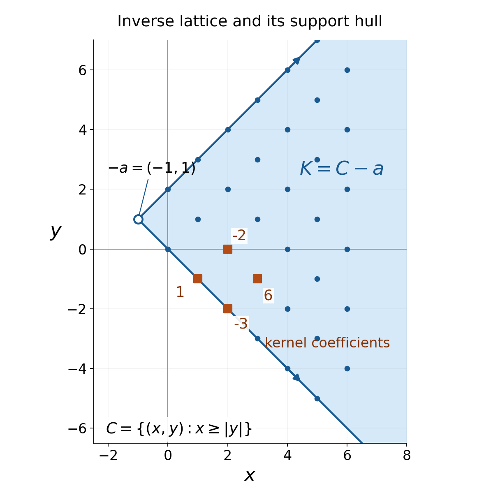
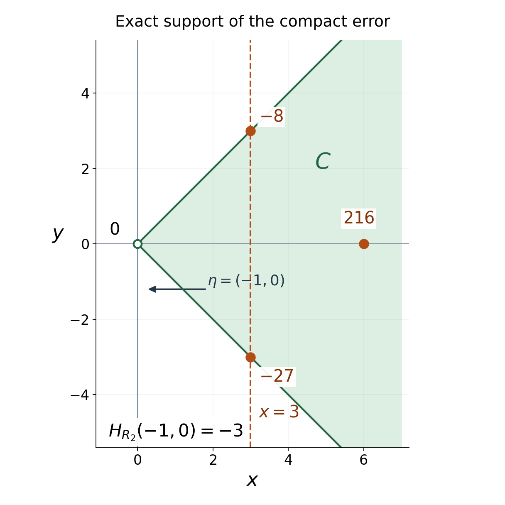

# Support cones force reciprocal bounds

*Written by GPT-6.1 Sol (OpenAI), Ultra reasoning effort, October 2026. Self-checked by GPT-6.1 Sol (OpenAI), Ultra reasoning effort. Public domain (CC0).* 

An inverse for a convolution equation may grow too quickly to have a Fourier transform. Its support can still determine where the compact kernel's entire transform is nonzero. We prove this by keeping a bounded part of the inverse. One truncation determines the vertex of its support cone. Another produces a compact error whose transform decays exponentially inside that cone's dual directions.

Assume the definitions of distributions, their support, multiplication by a smooth function, and their finite order on each fixed compact set. Theorem 1.1 of [Convolution as addition of supports](../prerequisites/src/convolution-as-addition-of-supports.md) supplies convolution when one factor is compact, its support inclusion, and its tensor formula. Theorem 3.1 of Convex supports and convolution cancellation supplies the complete compact convolution support theorem. Both proofs are used with their stated compactness hypotheses. Basic human references are [Dyatlov 2026] for distributions and compact convolution, and [Grubb] for transform conventions. The sharp estimate needed here is proved below; the full Paley–Wiener converse is unnecessary.

All pairings are complex-linear. For \(T\in\mathcal E'(\mathbb R^n)\), where \(n\ge1\), define

\[
\widehat T(\zeta)=\langle T(X),e^{-iX\cdot\zeta}\rangle,
\qquad \zeta\in\mathbb C^n.
\tag{1.1}
\]

A compact smooth cutoff equal to one near the support defines this pairing. Different such cutoffs give the same value. Notice the sign:

\[
|e^{-iX\cdot(\xi+i\eta)}|=e^{X\cdot\eta}.
\tag{1.2}
\]

For a nonempty set \(A\subset\mathbb R^n\), put \(H_A(\eta)=\sup_{X\in A}X\cdot\eta\), allowing \(+\infty\). Passing to its closed convex hull does not change \(H_A\): linearity handles convex combinations, and continuity handles their limits. Write \(H_T=H_{\operatorname{supp}T}\) for a nonzero distribution. A cone is invariant under multiplication by positive real numbers; a nonempty closed cone contains zero. An open cone may be all of \(\mathbb R^n\).

## The theorem and its geometric content

**Theorem 1.1 (a support cone fixes the exponential factor).** Suppose

\[
\mu\in\mathcal E'(\mathbb R^n),\quad
E\in\mathcal D'(\mathbb R^n),\quad
\mu*E=\delta_0.
\tag{1.3}
\]

Let \(K\) be the closed convex hull of \(\operatorname{supp}E\), and suppose that

\[
\Gamma=\operatorname{int}\{\eta:H_K(\eta)<\infty\}
\tag{1.4}
\]

is nonempty. Then \(\Gamma\) is an open convex cone. There is a unique real vector \(a\in\mathbb R^n\) such that

\[
H_\mu(\eta)=-H_K(\eta)=a\cdot\eta
\quad(\eta\in\Gamma).
\tag{1.5}
\]

With the negative polar cone

\[
C=\Gamma^\circ
=\{X:X\cdot\eta\le0\ \text{for every }\eta\in\Gamma\},
\tag{1.6}
\]

one has the exact identity and the inclusion

\[
K=C-a,\qquad \operatorname{supp}\mu\subset C+a.
\tag{1.7}
\]

For every **closed cone** \(\Gamma_1\subset\Gamma\cup\{0\}\), there are \(C_1>0\) and an integer \(M\ge0\) such that, whenever

\[
\operatorname{Im}\zeta\in\Gamma_1,
\qquad |\operatorname{Im}\zeta|
>C_1\log(|\zeta|+2),
\tag{1.8}
\]

the transform \(\widehat\mu(\zeta)\) is nonzero and

\[
\left|\frac1{\widehat\mu(\zeta)}\right|
\le C_1(1+|\zeta|)^M
e^{-a\cdot\operatorname{Im}\zeta}.
\tag{1.9}
\]

The constants may depend on \(\mu,E,\Gamma_1\). The norm is the Euclidean norm on \(\mathbb C^n\), and the logarithm is natural. No growth or transformability assumption on \(E\) is present.

The geometry is rigid. The support hull of the inverse is a whole translated cone, rather than an arbitrary convex set that happens to fit inside one. The compact kernel lies in the opposite translate of the same cone. Equation (1.9) records that translation exactly. An open set in \(\mathbb R^n\) spans all real directions, so (1.5) determines \(a\) uniquely.

*Figure 1. The worked two-direction example in Section 6 has \(a=(1,-1)\), \(v_1=(1,1)\), \(v_2=(1,-1)\). Its inverse has support at \(-a+jv_1+kv_2\), \(j,k\ge0\), and its closed convex hull is the entire wedge \(K=\{(x,y):x+1\ge|y-1|\}\). Only a finite portion is displayed; the arrows mark the unbounded rays. The compact kernel has four support points \(a,a+v_1,a+v_2,a+v_1+v_2\). Their coefficients are \(1,-2,-3,6\). The interior negative-polar directions are precisely \(\eta_x<-|\eta_y|\). Theorem 1.1 and Example 6.1 supply the proof; no numerical support test is being substituted for it.*

## Nearby directions make a high slice compact

Every support function is positively homogeneous and convex. It is also lower semicontinuous, since it is a supremum of continuous linear functions. Its effective domain

\[
D=\{\eta:H_K(\eta)<\infty\}
\tag{2.1}
\]

contains zero and is a convex cone: \(H_K(t\eta)=tH_K(\eta)\) for \(t>0\), and \(H_K(\eta+\theta)\le H_K(\eta)+H_K(\theta)\). Its nonempty interior \(\Gamma\) is therefore open and convex, and positive dilations preserve it. If \(0\in\Gamma\), a ball around zero lies in \(D\); dilation gives \(D=\Gamma=\mathbb R^n\).

**Lemma 2.1 (bounded high slices).** For \(\eta\in\Gamma\) and \(t\in\mathbb R\), the set

\[
K\cap\{X:X\cdot\eta\ge t\}
\tag{2.2}
\]

is compact, possibly empty.

**Proof.** Choose \(r>0\) so that \(\eta\pm r e_j\in D\) for every coordinate vector \(e_j\). For a point in (2.2),

\[
\pm rX_j
\le H_K(\eta\pm re_j)-t.
\tag{2.3}
\]

These finitely many finite bounds make the set bounded. It is closed because \(K\) and the half-space are closed, and is compact by finite-dimensional compactness. This argument handles all transverse coordinates; a bound only on \(X\cdot\eta\) would not suffice. □

**Lemma 2.2 (recovering a closed convex set).** A nonempty closed convex set \(L\subset\mathbb R^n\) is the intersection of its supporting half-spaces with finite support value:

\[
L=\{X:X\cdot\eta\le H_L(\eta)
\ \text{whenever }H_L(\eta)<\infty\}.
\tag{2.4}
\]

**Proof.** The inclusion from left to right follows from the definition. For \(X\notin L\), choose a point \(p\in L\) minimizing the distance to \(X\). It exists: a minimizing sequence is bounded, since its distances to \(X\) are bounded, and a convergent subsequence has its limit in \(L\). The distance is positive because \(L\) is closed. Put \(\eta=X-p\ne0\). For every \(y\in L\), the segment \(p+s(y-p)\), \(0\le s\le1\), lies in \(L\). The minimum of its squared distance to \(X\) at \(s=0\) gives \((X-p)\cdot(y-p)\le0\), by expanding the square and letting \(s\downarrow0\). Consequently \(H_L(\eta)=p\cdot\eta< X\cdot\eta\). This is a finite supporting half-space that excludes \(X\). □

## The first truncation determines the vertex

Both factors in (1.3) are nonzero, hence have nonempty support. Fix \(\eta\in\Gamma\) and set

\[
h=H_\mu(\eta),\qquad t=-h-1.
\tag{3.1}
\]

Lemma 2.1 makes \(A=K\cap\{X\cdot\eta\ge t\}\) compact. Choose a compact smooth cutoff \(\chi\) equal to one on a neighborhood of \(A\), and write

\[
E_0=\chi E,\qquad T=(1-\chi)E,
\qquad E=E_0+T.
\tag{3.2}
\]

If \(A\) is empty, the zero cutoff is allowed initially. Multiplication does not enlarge support. Since \(\chi=1\) near every point of \(\operatorname{supp}E\) with \(X\cdot\eta\ge t\),

\[
\operatorname{supp}T\subset K\cap\{X\cdot\eta\le t\}.
\tag{3.3}
\]

Convolution by the compact factor \(\mu\) is defined for this unrestricted \(T\in\mathcal D'\). Its support inclusion gives

\[
\operatorname{supp}(\mu*T)
\subset\{X:X\cdot\eta\le h+t=-1\}.
\tag{3.4}
\]

Therefore

\[
\mu*E_0=\delta_0-\mu*T
\tag{3.5}
\]

has support with directional supremum exactly zero. Indeed, its support lies in the union of \(\{0\}\) and the half-space in (3.4), and it agrees with \(\delta_0\) on the open half-space \(X\cdot\eta>-1\). Thus it is nonzero, and \(E_0\ne0\).

Both factors on the left of (3.5) are now compact. The compact convolution support theorem, with its exact hypotheses satisfied, gives

\[
H_\mu(\eta)+H_{E_0}(\eta)
=H_{\mu*E_0}(\eta)=0.
\tag{3.6}
\]

Since \(E_0\) is a smooth multiple of \(E\), \(H_{E_0}(\eta)\le H_K(\eta)\). Conversely (3.2)–(3.3) imply

\[
H_K(\eta)
\le\max\{H_{E_0}(\eta),t\}
=-h,
\tag{3.7}
\]

because \(H_{E_0}(\eta)=-h>t\). If \(T=0\), only the first term is needed. Hence

\[
H_K(\eta)=-H_\mu(\eta)
\quad(\eta\in\Gamma).
\tag{3.8}
\]

No convolution support equality for an arbitrary noncompact factor has been assumed. The compact theorem entered only after the high slice was retained in \(E_0\).

The function \(H_\mu\) is convex, and (3.8) makes it concave on the open convex set \(\Gamma\). It is therefore affine there. For completeness, both convexity inequalities give equality on every segment. Fix a point \(\eta_0\) and a small ball about it in \(\Gamma\). Subtract the value at \(\eta_0\), and denote the resulting increment by \(g(u)\). Midpoint equality gives \(g(-u)=-g(u)\) and

\[
g(u+v)=g(u)+g(v)
\tag{3.9}
\]

when all increments are sufficiently small: apply midpoint equality to \(u,v\), and then to \(0,u+v\). Segment equality supplies \(g(su)=s g(u)\) for real \(s\) with these increments in the ball. Splitting \(u\) into its coordinate increments now gives \(g(u)=a\cdot u\) for a real vector \(a\). Every other point of \(\Gamma\) lies on a segment whose initial small part is in that ball, so segment equality extends the same affine formula to all of \(\Gamma\). Positive homogeneity, applied to \(\eta\) and \(2\eta\), removes its constant term. We have proved (1.5).

To prove the exact set identity in (1.7), (1.5) first gives \(K+a\subset C\). Fix \(\eta_0\in\Gamma\) and any \(\eta\in D\). For every \(\varepsilon>0\),

\[
\eta+\varepsilon\eta_0\in\Gamma.
\tag{3.10}
\]

Indeed, an open ball around \(\eta_0\) is contained in \(D\), and adding \(\eta\) to its positive dilation remains in the convex cone \(D\). Subadditivity and lower semicontinuity then give, respectively,

\[
\begin{aligned}
-a\cdot(\eta+\varepsilon\eta_0)
&\le H_K(\eta)-\varepsilon a\cdot\eta_0,\\
H_K(\eta)&\le
\liminf_{\varepsilon\downarrow0}
[-a\cdot(\eta+\varepsilon\eta_0)].
\end{aligned}
\tag{3.11}
\]

Thus \(H_K(\eta)=-a\cdot\eta\) on **all** of \(D\), including its boundary. If \(X\in C-a\), (3.10) and the definition of \(C\) give \((X+a)\cdot(\eta+\varepsilon\eta_0)\le0\). Letting \(\varepsilon\downarrow0\) proves \(X\cdot\eta\le H_K(\eta)\) for every \(\eta\in D\). Lemma 2.2 puts \(X\) in \(K\). Hence \(K=C-a\). Finally, for \(y\in\operatorname{supp}\mu\), (1.5) says \((y-a)\cdot\eta\le0\) for every \(\eta\in\Gamma\). This proves \(\operatorname{supp}\mu\subset C+a\).

## A compact distribution has the sharp supporting exponent

**Proposition 4.1 (the needed forward transform estimate).** Let \(T\ne0\) be compactly supported, and put \(S=\operatorname{supp}T\). Its transform (1.1) is entire. For some constant \(A>0\) and integer \(m\ge0\),

\[
|\widehat T(\zeta)|
\le A(1+|\zeta|)^m e^{H_S(\operatorname{Im}\zeta)}
\quad(\zeta\in\mathbb C^n).
\tag{4.1}
\]

For compact distributions \(U,V\),

\[
\widehat{U*V}=\widehat U\,\widehat V,
\qquad \widehat{\delta_0}=1.
\tag{4.2}
\]

**Proof.** Fix a compact neighborhood of \(S\) large enough to contain every point at distance at most three from \(S\). The finite-order estimate on this one compact set gives a constant \(A_0\) and an integer \(m\) bounding the pairing with tests by their derivatives through order \(m\).

Choose a nonnegative \(\rho\in C_c^\infty(B(0,1))\) with integral one; for example normalize \(e^{-1/(1-|X|^2)}\) inside the unit ball and extend it by zero. Put \(\rho_\varepsilon(X)=\varepsilon^{-n}\rho(X/\varepsilon)\), and let \(S_{2\varepsilon}\) be the open \(2\varepsilon\)-neighborhood of \(S\). The function

\[
q_\varepsilon
=\rho_\varepsilon*\mathbf1_{S_{2\varepsilon}}
\tag{4.3}
\]

is smooth and compactly supported. It equals one when \(\operatorname{dist}(X,S)<\varepsilon\), is zero when that distance exceeds \(3\varepsilon\), and satisfies

\[
\|\partial^\alpha q_\varepsilon\|_\infty
\le\|\partial^\alpha\rho\|_1\varepsilon^{-|\alpha|}.
\tag{4.4}
\]

Differentiating the convolution is legitimate because its bounded indicator has compact support and the differentiated smooth kernel is integrable. The estimate follows from its \(L^1\) norm and the indicator's bound one.

For a particular \(\zeta=\xi+i\eta\), use

\[
\varepsilon=(1+|\zeta|)^{-1},\qquad
\widehat T(\zeta)
=\langle T,q_\varepsilon e^{-iX\cdot\zeta}\rangle.
\tag{4.5}
\]

On the support of \(q_\varepsilon\),

\[
X\cdot\eta
\le H_S(\eta)+3\varepsilon|\eta|
\le H_S(\eta)+3.
\tag{4.6}
\]

The product rule, (4.4), and \(\varepsilon^{-1}=1+|\zeta|\) bound every derivative of the test in (4.5) through order \(m\) by

\[
A_2(1+|\zeta|)^m e^{H_S(\eta)}.
\tag{4.7}
\]

The factor \(e^3\) has been included in \(A_2\). Applying the fixed compact finite-order estimate proves (4.1). The cutoff scale in (4.5) is what removes an unwanted \(e^{\varepsilon_0|\eta|}\) factor from a fixed enlarged support.

Entirety can be checked with one fixed compact cutoff. On its support, the exponential's power series about any \(\zeta_0\) converges in every fixed \(X\)-derivative, uniformly when \(\zeta-\zeta_0\) lies in a compact set. The factorial denominators dominate the powers and the finitely many derivative factors. Applying the continuous distribution to this series gives a convergent complex power series, with

\[
\partial_\zeta^\alpha\widehat T(\zeta)
=\langle T,(-iX)^\alpha e^{-iX\cdot\zeta}\rangle.
\tag{4.8}
\]

Thus the transform is entire.

For (4.2), use the tensor convolution formula with compact cutoffs near the two factor supports. The exponential pulled back under addition factors as \(e^{-iX\cdot\zeta}e^{-iY\cdot\zeta}\). The tensor pairing of this product is the product of the two pairings. Evaluation at zero gives \(\widehat{\delta_0}=1\). □

This is the forward support estimate alone. It uses finite local order, compact cutoffs and the tensor definition of compact convolution. Neither Fourier inversion nor a representation of the original \(E\) is needed.

## A compact error decays uniformly inside the dual cone

**Lemma 5.1 (strict cone pairing).** Let \(C=\Gamma^\circ\). It is closed and convex and contains no nonzero line. For \(X\in C\setminus\{0\}\) and \(\eta\in\Gamma\),

\[
X\cdot\eta<0.
\tag{5.1}
\]

If \(\Gamma_1\subset\Gamma\cup\{0\}\) is a closed cone with a nonzero direction, and \(C\ne\{0\}\), there is \(b>0\) such that

\[
X\cdot\eta\le-b|X||\eta|
\quad(X\in C,\ \eta\in\Gamma_1).
\tag{5.2}
\]

**Proof.** Closedness and convexity follow from the defining half-spaces. If both \(X\) and \(-X\) belong to \(C\), then \(X\cdot\eta=0\) on the open set \(\Gamma\). A linear function vanishing on a ball has every coefficient zero, so \(X=0\). If equality held in (5.1), openness would put \(\eta+\varepsilon X\) in \(\Gamma\) for small \(\varepsilon>0\), and \(X\cdot(\eta+\varepsilon X)>0\), a contradiction. The sets \(C\cap S^{n-1}\) and \(\Gamma_1\cap S^{n-1}\) are compact; the latter lies in \(\Gamma\). Their continuous pairings have a strictly negative maximum by (5.1). Scaling proves (5.2). □

Choose a compact smooth cutoff \(\psi\) equal to one on a ball of radius \(r>0\) centered at \(-a\), and put

\[
F=\psi E\in\mathcal E',\qquad
R=\mu*F-\delta_0\in\mathcal E'.
\tag{5.3}
\]

The support geometry already proved gives \(\operatorname{supp}F\subset C-a\). The convolution equation also gives the **distributional** identity

\[
R=-\mu*((1-\psi)E).
\tag{5.4}
\]

For a tail support point \(X\in\operatorname{supp}((1-\psi)E)\) and a kernel support point \(Y\in\operatorname{supp}\mu\), every contributing sum on the right has the form

\[
X+Y=(X+a)+(Y-a),
\tag{5.5}
\]

where \(X+a,Y-a\in C\) and \(|X+a|\ge r\). The sum is in \(C\). If \(C\ne\{0\}\), fix a nonzero \(\eta_0\in\Gamma\). The singleton direction cone generated by \(\eta_0\) satisfies Lemma 5.1, so for some \(b_0>0\),

\[
(X+Y)\cdot\eta_0
\le-b_0r|\eta_0|<0.
\tag{5.6}
\]

The compact factor \(\mu\) ensures that its sum with the closed tail support is closed and that convolution's support inclusion applies. Hence

\[
\operatorname{supp}R\subset C,
\qquad 0\notin\operatorname{supp}R.
\tag{5.7}
\]

Compactness of \(R\) in (5.3) comes from \(\mu*F-\delta_0\), even though the tail in (5.4) can be unbounded and grow arbitrarily quickly. If \(C=\{0\}\), then \(K=\{-a\}\), the tail is zero, and \(R=0\) directly.

Since \(\delta_0+R\) agrees with \(\delta_0\) near zero, \(\mu*F=\delta_0+R\) is nonzero. In particular \(F\ne0\), so its supporting function in the following estimates is defined.

Now fix a closed cone \(\Gamma_1\subset\Gamma\cup\{0\}\). If it has no nonzero directions, (1.8) has no solutions and the statement is vacuous. If \(R=0\), (4.2) gives \(\widehat\mu\widehat F=1\) everywhere, and (4.1) with \(H_F(\eta)\le-a\cdot\eta\) gives (1.9) immediately after enlarging the constant.

In the remaining case \(R\ne0\), its compact support avoids zero. Let \(d=\min_{X\in\operatorname{supp}R}|X|>0\). Lemma 5.1 gives \(c=bd>0\) with

\[
H_R(\eta)\le-c|\eta|
\quad(\eta\in\Gamma_1).
\tag{5.8}
\]

Applying Proposition 4.1 separately to the compact distributions \(R,F\), and enlarging constants to be at least one, yields

\[
\begin{aligned}
|\widehat R(\zeta)|
&\le A(1+|\zeta|)^N e^{-c|\eta|},\\
|\widehat F(\zeta)|
&\le B(1+|\zeta|)^M e^{-a\cdot\eta},
\end{aligned}
\qquad \eta=\operatorname{Im}\zeta\in\Gamma_1.
\tag{5.9}
\]

For example, choose

\[
C_0=\frac{N+\log(2A)/\log2+1}{c}.
\tag{5.10}
\]

If \(|\eta|>C_0\log(|\zeta|+2)\), the first estimate in (5.9) is less than \(1/2\): use \(\log(1+|\zeta|)\le\log(|\zeta|+2)\) and \(\log(|\zeta|+2)\ge\log2\). On this region, transforming the compact identity (5.3) gives

\[
\widehat\mu(\zeta)\widehat F(\zeta)
=1+\widehat R(\zeta),
\qquad |1+\widehat R(\zeta)|>\tfrac12.
\tag{5.11}
\]

In particular \(\widehat\mu(\zeta)\ne0\). Division now gives

\[
\left|\frac1{\widehat\mu(\zeta)}\right|
=\frac{|\widehat F(\zeta)|}{|1+\widehat R(\zeta)|}
\le2B(1+|\zeta|)^M e^{-a\cdot\eta}.
\tag{5.12}
\]

Taking \(C_1\ge\max(C_0,2B,1)\) proves both (1.8) and (1.9) with one constant. This completes Theorem 1.1. □

The closed-cone condition has a specific purpose. Its unit directions form a compact subset of \(\Gamma\), making \(b\) in (5.2) positive. The proof permits constants to deteriorate as the directions approach the boundary of \(\Gamma\).

## A growing inverse with an exactly computable cone

**Example 6.1 (two independent delays).** In \(\mathbb R^2\), take

\[
a=(1,-1),\quad v_1=(1,1),\quad v_2=(1,-1),
\tag{6.1}
\]

and define

\[
\begin{aligned}
\mu&=\delta_a*(\delta_0-2\delta_{v_1})
*(\delta_0-3\delta_{v_2}),\\
E&=\sum_{j,k\ge0}2^j3^k\delta_{-a+jv_1+kv_2}.
\end{aligned}
\tag{6.2}
\]

The sum defining \(E\) is locally finite: the first coordinate of its support point is \(-1+j+k\), so a compact set bounds \(j+k\). Thus it defines a distribution without a summability assumption at infinity. For each test, only finitely many terms of the convolution contribute. Successively subtracting the two shifted sums cancels every term except the origin after translation by \(a\), so \(\mu*E=\delta_0\).

All coefficients of \(E\) are positive. Its support is exactly the displayed lattice, with no extra points. The convex hull of \(\mathbb N^2\) is \(\mathbb R_+^2\): each point of a unit square is a convex combination of its four integer corners. The invertible map \((j,k)\mapsto jv_1+kv_2\) therefore gives

\[
\begin{aligned}
C&=\{(x,y):x\ge|y|\},\\
K&=C-a,\\
D&=\{\eta:\eta_x+\eta_y\le0,
\ \eta_x-\eta_y\le0\},\\
\Gamma&=\{\eta:\eta_x<-|\eta_y|\}.
\end{aligned}
\tag{6.3}
\]

On \(D\), \(H_K(\eta)=-a\cdot\eta\); outside \(D\) it is infinite. On \(\Gamma\), the finite kernel's largest supporting point is \(a\), since its other points add positive multiples of \(v_1,v_2\). Thus \(H_\mu(\eta)=a\cdot\eta\), as predicted.

The entire kernel transform is

\[
\widehat\mu(\zeta)=e^{-ia\cdot\zeta}
\bigl(1-2e^{-iv_1\cdot\zeta}\bigr)
\bigl(1-3e^{-iv_2\cdot\zeta}\bigr).
\tag{6.4}
\]

For \(0<\varepsilon\le1\), put

\[
\Gamma_\varepsilon
=\{\eta:\eta_x\le0,
\ |\eta_y|\le(1-\varepsilon)(-\eta_x)\}.
\tag{6.5}
\]

Its nonzero directions lie in \(\Gamma\), and \(v_\ell\cdot\eta\le-\varepsilon|\eta|/\sqrt2\) for \(\ell=1,2\). If \(|\eta|>(\sqrt2/\varepsilon)\log6\), each of the two exponential terms in (6.4) has modulus less than \(1/2\). Hence

\[
|1/\widehat\mu(\zeta)|\le4e^{-a\cdot\eta}.
\tag{6.6}
\]

Here the estimate is already independent of \(\operatorname{Re}\zeta\), and is stronger than the logarithmic bound.

A concrete compact truncation makes the error visible. Retain only \(0\le j,k\le2\) in (6.2), and call the resulting compact distribution \(F_2\). Such a truncation equals \(\psi E\) for a compact smooth cutoff that is one near those nine lattice points and zero near the other lattice points. Telescoping each finite sum gives

\[
\begin{aligned}
\mu*F_2&=\delta_0+R_2,\\
R_2&=-8\delta_{3v_1}-27\delta_{3v_2}
+216\delta_{3(v_1+v_2)}.
\end{aligned}
\tag{6.7}
\]

Thus the compact error has support at \((3,3),(3,-3),(6,0)\), all in \(C\) and all separated from zero. In the direction \(\eta=(-1,0)\), its support function is \(-3\). More generally (6.5) gives \(H_{R_2}(\eta)\le-3\varepsilon|\eta|/\sqrt2\). This finite computation illustrates the two compact transforms used in (5.11).

*Figure 2. The nine retained inverse atoms in \(F_2\) yield the three exact error atoms in (6.7). Their coefficients are \(-8,-27,216\); signs can affect cancellation, but each displayed coefficient is nonzero at a distinct point. Every error point lies in \(C=\{x\ge|y|\}\), and the dashed supporting line \(x=3\) gives \(X\cdot(-1,0)\le-3\). This is the compact error mechanism in (5.7)–(5.12), shown for the worked example rather than asserted numerically for a general distribution.*

To state its growth precisely, the Schwartz space consists of smooth functions for which all the increasing seminorms

\[
p_N(\phi)=\max_{|\alpha|\le N}\sup_X
(1+|X|)^N|\partial^\alpha\phi(X)|,\qquad N=0,1,\ldots
\tag{6.8}
\]

are finite. A tempered distribution is a continuous linear functional on this space. Such continuity gives a bound by one \(p_N\): a neighborhood of zero is determined by finitely many of these increasing seminorms, and scaling its inequality gives the bound for arbitrary \(\phi\).

Nevertheless \(E\) is not tempered. Choose a smooth test equal to one at zero supported in a ball of radius less than \(1/3\), and translate it to \(-a+jv_1\). Its pairing with \(E\) is \(2^j\), while every fixed Schwartz seminorm of this translated test grows at most polynomially in \(j\). Continuity would bound \(2^j\) by a polynomial, which is impossible. In fact, \(e^{X\cdot\eta}E\) need not be tempered even when \(\eta\in\Gamma\): for \(\eta=(-1/10,0)\), the coefficients along that same ray have ratio \(2e^{-1/10}>1\). This explains why the proof transforms \(F\) and \(R\), rather than \(E\).

**Example 6.2 (a boundary direction can contain zeros).** On \(\mathbb R^2\), let \(\mu=\partial_x\delta_{(0,0)}\) and \(E=H(x)\otimes\delta_0(y)\), where \(H\) is the half-line indicator. Integration by parts gives \(\partial_xE=\delta_{(0,0)}\), hence \(\mu*E=\delta_{(0,0)}\). Its support hull is the positive \(x\)-axis, and \(\Gamma=\{\eta:\eta_x<0\}\). Here \(a=0\) and \(\widehat\mu(\zeta)=i\zeta_x\). The boundary direction \((0,1)\) admits zeros, for example \(\zeta=(0,i)\). Inside \(\Gamma\), \(\zeta=(-i\varepsilon,i)\) has reciprocal modulus \(1/\varepsilon\), which diverges as \(\varepsilon\downarrow0\). The uniform constants of Theorem 1.1 therefore belong to cones whose angular directions remain inside \(\Gamma\).

## Exercises with complete solutions

### Translation determines the sign

**Problem 1.** Take \(b=(2,-3)\), \(\mu=\delta_b\), \(E=\delta_{-b}\). Find \(K,\Gamma,a,C\), the transform of \(\mu\), and its reciprocal modulus. Does this example satisfy the theorem when the imaginary part is zero?

**Solution.** Point-mass convolution gives \(\mu*E=\delta_0\). The hull \(K=\{-b\}\) has finite support function \(-b\cdot\eta\) in every direction. Hence \(\Gamma=\mathbb R^2\) and its negative polar is \(C=\{0\}\). The vector is \(a=b\), since \(H_\mu(\eta)=b\cdot\eta\). Direct evaluation gives

\[
\widehat\mu(\zeta)=e^{-ib\cdot\zeta},
\qquad |1/\widehat\mu(\xi+i\eta)|=e^{-b\cdot\eta}.
\]

The reciprocal identity is valid even at \(\eta=0\), although the theorem's stated region requires \(|\eta|>C_1\log(|\zeta|+2)\) and therefore excludes \(\eta=0\). A theorem can assert a sufficient region without describing every point where its conclusion holds.

### One finite direction is insufficient

**Problem 2.** Let \(K=\{(x,y):x\le0\}\). Show that \(H_K(-1,0)=+\infty\), \(H_K(1,0)=0\), and \(H_K(1,\varepsilon)=+\infty\) for every nonzero \(\varepsilon\). Find the effective domain and explain why its interior is empty. Is \(K\cap\{x\ge-1\}\) compact?

**Solution.** With \(\eta=(-1,0)\), points \((-t,0)\), \(t\ge0\), give arbitrarily large pairing. With \(\eta=(1,0)\), every pairing is \(x\le0\), and equality is attained at \(x=0\). A nonzero second component makes the pairing unbounded as \(y\) tends to infinity with its sign. More generally, the only finite directions are \((s,0)\), \(s\ge0\). This ray has empty interior in \(\mathbb R^2\). The high slice \([-1,0]\times\mathbb R\) is closed and unbounded, so it is not compact. The nearby directions in Lemma 2.1 are essential for controlling the transverse coordinate.

### The exact cone, rather than a containing cone

**Problem 3.** Let \(H=\mathbf1_{[0,\infty)}\) on the line. Put \(\mu=\delta'_0\) and \(E=H\). Verify the convolution equation, find \(K,D,\Gamma,C,a\), and calculate the reciprocal estimate on the closed cone \((-\infty,0]\).

**Solution.** For a compact smooth test \(\phi\), integration by parts gives

\[
\langle H',\phi\rangle
=-\int_0^\infty\phi'(x)\,dx=\phi(0).
\]

Thus \(\delta'_0*H=H'=\delta_0\). Its support hull is \(K=[0,\infty)\), with \(H_K(\eta)=0\) for \(\eta\le0\) and \(+\infty\) for \(\eta>0\). Consequently \(D=(-\infty,0]\), \(\Gamma=(-\infty,0)\), \(C=[0,\infty)\), and \(a=0\). The transform \(\widehat\mu(\zeta)=i\zeta\) gives

\[
|1/\widehat\mu(\xi+i\eta)|
=|\xi+i\eta|^{-1}\le|\eta|^{-1}
\quad(\eta<0).
\]

Choosing \(C_1\ge2\) in the theorem's logarithmic region guarantees \(|\eta|>2\log2>1\), and the bound holds with \(M=0\). On the real axis the transform vanishes at zero, so the claimed nonzero region must retain its imaginary-height restriction.

### Exponential growth can survive a support cone

**Problem 4.** In \(\mathbb R\), put

\[
\mu=\delta_0-4\delta_2,\qquad
E=\sum_{k\ge0}4^k\delta_{2k}.
\]

Prove that \(E\in\mathcal D'\), that \(\mu*E=\delta_0\), and that \(E\notin\mathcal S'\). Give an \(\eta\in\Gamma\) for which the weighted distribution \(e^{\eta x}E\) is still not tempered. Find the zeros of the compact transform.

**Solution.** A compact set intersects the sequence \(2k\) in finitely many points, so the defining sum pairs finitely on every compact test and has order zero there. Shift and subtract:

\[
(\delta_0-4\delta_2)*E
=\sum_{k\ge0}4^k\delta_{2k}
-\sum_{k\ge1}4^k\delta_{2k}
=\delta_0.
\]

The hull \(K=[0,\infty)\) gives \(\Gamma=(-\infty,0)\), \(a=0\). If \(E\) were tempered, its continuity would give a bound by finitely many Schwartz seminorms. Choose a test \(\phi\) supported in \((-1/2,1/2)\) with \(\phi(0)=1\), and set \(\phi_k(x)=\phi(x-2k)\). Then \(\langle E,\phi_k\rangle=4^k\), whereas every fixed Schwartz seminorm of \(\phi_k\) is bounded by a polynomial in \(k\): the derivatives are translates of fixed derivatives, and their support has \(|x|\le2k+1/2\). This contradicts exponential growth. For \(\eta=-1/10\), the weighted coefficients have ratio \(4e^{-1/5}>1\), so the same argument proves non-temperedness although \(\eta\in\Gamma\).

The compact kernel has transform \(\widehat\mu(\zeta)=1-4e^{-2i\zeta}\). Its zeros satisfy \(e^{-2i\zeta}=1/4\). Writing \(\zeta=\xi+i\eta\), their modulus and phase give

\[
\eta=-\log2,\qquad \xi\in\pi\mathbb Z.
\]

Zeros occur at a fixed negative height. The theorem excludes them by requiring an imaginary height large compared with \(\log(|\zeta|+2)\). The support cone alone does not make every negative-height point nonzero.

### A complete compact approximation to the delay inverse

**Problem 5.** For the distributions in Problem 4, define

\[
F_N=\sum_{k=0}^N4^k\delta_{2k}
\quad(N\ge0).
\]

Find \(R_N=\mu*F_N-\delta_0\), its support, its transform, and the region where \(|\widehat R_N|<1/2\). Explain why the transform of \(F_N\) can bound a reciprocal even when \(E\) is not tempered.

**Solution.** All interior terms cancel exactly, leaving

\[
R_N=-4^{N+1}\delta_{2(N+1)},\qquad
\widehat R_N(\zeta)
=-4^{N+1}e^{-2i(N+1)\zeta}.
\]

Its support is one point in \(C=[0,\infty)\), away from zero. For \(\eta<0\),

\[
|\widehat R_N(\xi+i\eta)|
=(4e^{2\eta})^{N+1}.
\]

It is less than \(1/2\) exactly when

\[
\eta<-\log2-\frac{\log2}{2(N+1)}.
\]

The compact identity \(\widehat\mu\widehat F_N=1+\widehat R_N\) then gives

\[
|1/\widehat\mu|\le2|\widehat F_N|.
\]

Every distribution transformed here is compact. The proof does not form, interchange, or transform the infinite sum defining \(E\). Increasing \(N\) approaches the true fixed zero height from below, but no \(N\) makes the reciprocal nonzero at that height.

### Angular separation is part of the estimate

**Problem 6.** For the wedge \(C=\{(x,y):x\ge|y|\}\), let \(0<\varepsilon\le1\) and

\[
\Gamma_\varepsilon
=\{(p,q):p\le0,\ |q|\le(1-\varepsilon)(-p)\}.
\]

Prove the explicit bound

\[
(x,y)\cdot(p,q)
\le-\frac{\varepsilon}{2}|(x,y)||(p,q)|
\quad((x,y)\in C,\ (p,q)\in\Gamma_\varepsilon).
\]

Give a pair of boundary directions for which strict negativity fails.

**Solution.** Set \(s=-p\ge0\). Since \(x\ge|y|\),

\[
xp+yq\le-xs+x|q|
\le-\varepsilon xs.
\]

Also \(|(x,y)|\le\sqrt2x\) and \(|(p,q)|\le\sqrt2s\). Thus \(xs\ge |(x,y)||(p,q)|/2\), proving the bound. The zero-vector cases follow directly. At the boundary, \(X=(1,1)\in C\) and \(\eta=(-1,1)\in\partial\Gamma\) have zero pairing. As \(\varepsilon\) tends to zero, the useful uniform coefficient can tend to zero. This is why Theorem 1.1 quantifies over each closed cone of interior directions separately.

### Turning an exponential gain into a logarithmic threshold

**Problem 7.** Suppose a compact remainder satisfies

\[
|\widehat R(\zeta)|
\le5(1+|\zeta|)^3e^{-(2/5)|\eta|},
\qquad \eta=\operatorname{Im}\zeta.
\]

Find an explicit constant \(L\) such that \(|\eta|>L\log(|\zeta|+2)\) implies \(|\widehat R(\zeta)|<1/2\).

**Solution.** Put \(u=\log(|\zeta|+2)\ge\log2\). Then \(\log(1+|\zeta|)\le u\), so

\[
\log|\widehat R|\le\log5+3u-\frac25|\eta|.
\]

Choose

\[
L=\frac52\left(4+\frac{\log10}{\log2}\right).
\]

The strict height inequality makes the right side less than the expression bounded here:

\[
\begin{aligned}
\log5-(1+\log10/\log2)u
&\le\log5-\log10-\log2\\
&=-\log4.
\end{aligned}
\]

Thus \(|\widehat R|<1/4<1/2\). The extra margin is harmless. The power of \(|\zeta|\) is overcome because exponential decay at a height proportional to \(\log|\zeta|\) becomes a negative power of \(|\zeta|\).

## References

- [Dyatlov 2026] Semyon Dyatlov, *Lecture notes for 18.155: distributions, elliptic regularity, and applications to PDEs*, October 2, 2026. Sections 4.2–4.3, 8.1–8.2, and 11.2.5. [Author-hosted notes](https://math.mit.edu/~dyatlov/18.155/155-notes.pdf). Theorem 11.31 states a ball version of the Paley–Wiener theorem; Proposition 4.1 above supplies the sharp support-function estimate with a complete proof.
- [Grubb] Gerd Grubb, *Distributions and Operators*, author-hosted Chapter 5, *Fourier transformation*, Sections on tempered distributions and the paragraph on entire extensions following Remark 5.18. [Open chapter](https://web.math.ku.dk/~grubb/dist5.pdf). This is background and credit for the transform convention; no proof is delegated to it.
- [Convolution as addition of supports](../prerequisites/src/convolution-as-addition-of-supports.md), Theorem 1.1: convolution with a compact factor, support inclusion, tensor pairing and point-mass identities.
- Convex supports and convolution cancellation, Theorem 3.1: the complete compact convolution support theorem. Its stated dependencies retain their own source and licence attribution.
