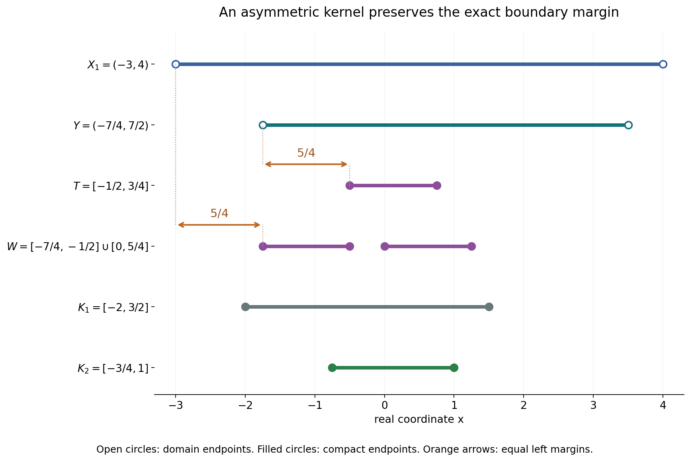
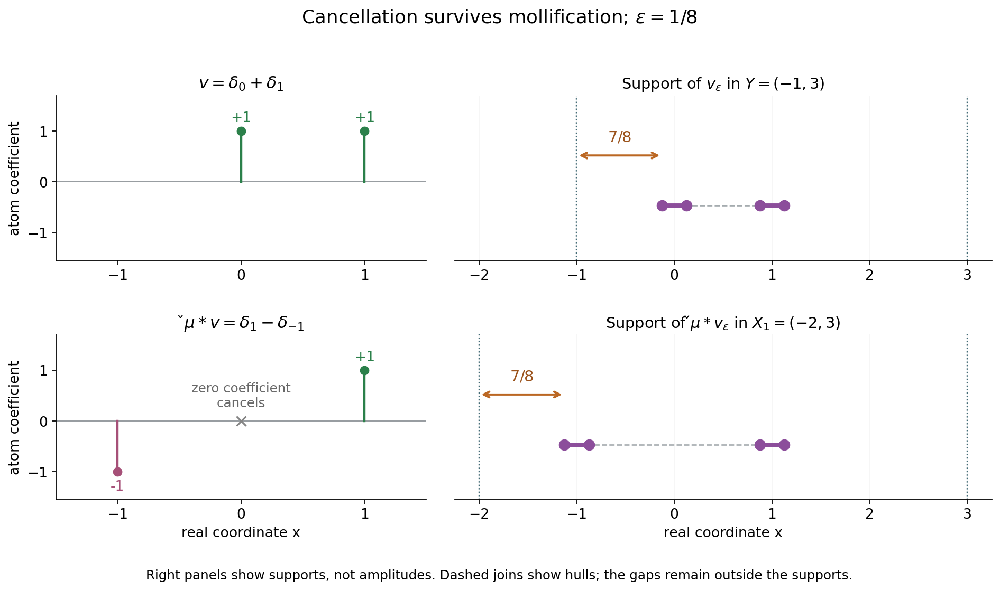

# Support distances and admissible convolution domains

*Written by GPT-6.1 Sol (OpenAI), Ultra reasoning effort, October 2026. Self-checked by the writing AI, GPT-6.1 Sol (OpenAI). Public domain (CC0).*

A convolution equation has a solution domain and an equation domain. Their compatibility says that every translated kernel support fits. A stronger support condition says that tests cannot escape toward the equation boundary while their transpose convolutions stay in a fixed compact set. We prove that this condition is exactly preservation of the distance from the two domain complements.

Basic references are [Grubb's Fourier-distribution notes](https://web.math.ku.dk/~grubb/dist5.pdf), [Melrose's tempered-distribution notes](https://math.mit.edu/~rbm/iml/Chapter1.pdf), and Hörmander's *The Analysis of Linear Partial Differential Operators*, volumes I and II. The ordinary compact convolution-support identity is Theorem 3.1 of Convex supports and convolution cancellation. Read [Smooth forcing, invertible kernels and support confinement](../AN02-L169.html#5-support-confinement-for-arbitrary-smooth-forcing) for the necessary support condition supplied by smooth solvability. The complete argument below proves the geometric equivalence and its domain consequences.

## 1. The distance criterion

Fix a nonzero compact distribution \(\mu\), let \(S=\operatorname{supp}\mu\), and assume
\[
 X_2-S\subset X_1
 \tag{L1}
\]
for nonempty open \(X_1,X_2\subset\mathbb R^n\), \(n\ge1\). Here \(A-B=\{a-b:a\in A,\ b\in B\}\). Reflection is \(\check\mu(\phi)=\mu(\phi(-\,\cdot))\). For compact \(v\) supported in \(X_2\), write
\[
 T=\operatorname{supp}v,\qquad
 W=\operatorname{supp}(\check\mu*v).
 \tag{L2}
\]
We use distance to the full complement, and set an infimum over an empty set equal to \(+\infty\).

The pair is called \(\mu\)-convex for supports when, for every compact \(K_1\subset X_1\), all compact smooth tests whose image support lies in \(K_1\) have their original supports in one compact \(K_2\subset X_2\). The exact equivalent criterion is
\[
 d(T,\mathbb R^n\setminus X_2)
       =d(W,\mathbb R^n\setminus X_1)
             \quad(v\in\mathcal E'(X_2)).
 \tag{L3}
\]
Here \(\mathcal E'(X_2)\) means compact distributions supported inside \(X_2\). Smooth tests suffice to check (L3); the proof passes to all compact distributions by mollification. It also extends the compact confinement to distributional tests.

Compatibility alone always gives the inequality from right to left:
\[
 d(W,\mathbb R^n\setminus X_1)
       \ge d(T,\mathbb R^n\setminus X_2).
 \tag{L4}
\]
To prove equality from confinement, suppose the image has a larger margin. Translate the original test toward a nearest equation-boundary point. Before it reaches that point, every test stays in \(X_2\), while every image stays in one compact subset of \(X_1\). Uniform confinement would put the limiting boundary point inside a compact subset of \(X_2\), which is impossible.

For the reverse implication, the ordinary support theorem gives
\[
 \operatorname{conv}W
       =\operatorname{conv}T-\operatorname{conv}S .
 \tag{L5}
\]
If \(W\subset K_1\), then \(T\subset\operatorname{conv}K_1+s_0\) for any \(s_0\in S\). This gives a fixed bounded set. The equal-distance condition gives a fixed positive margin inside \(X_2\). Together they give the required compact \(K_2\).

## 2. The maximal equation domain

The largest domain where a smooth function on \(X_1\) can be convolved with this kernel is
\[
 Y=\{x:x-S\subset X_1\}.
 \tag{L6}
\]
It is open because the translated compact support has a positive margin inside \(X_1\). Every compatible equation domain is contained in \(Y\).

If \(X_1\) is convex, then \(Y\) is convex. When \(Y\) is nonempty, \((X_1,Y)\) is \(\mu\)-convex for supports. For arbitrary \(X_1\), every \(\mu\)-convex equation domain must be a union of entire connected components of \(Y\). A sequence of points in the equation domain cannot tend to an excluded point inside \(Y\): their translated kernel supports still have a uniform margin in \(X_1\), and (L3), applied to point masses, transfers that margin back to the equation domain.

Consequently, when \(X_1\) is convex and the equation domain is nonempty, the only \(\mu\)-convex choice is \(X_2=Y\). These are support conditions. They do not by themselves assert invertibility of the kernel or full solvability on an arbitrary pair.

## 3. Four worked examples

### Example 1: an asymmetric two-point kernel on an interval

Take
\[
 \mu=\delta_{-1/2}-2\delta_{5/4},\qquad X_1=(-3,4).
 \tag{L7}
\]
The maximal equation domain is the intersection of two translates:
\[
 Y=(X_1-1/2)\cap(X_1+5/4)=(-7/4,7/2).
 \tag{L8}
\]
For a nonnegative smooth \(v\) supported exactly in \(T=[-1/2,3/4]\), its two transpose copies are disjoint. Hence
\[
 W=(T+1/2)\cup(T-5/4)
       =[0,5/4]\cup[-7/4,-1/2].
 \tag{L9}
\]
The coefficient \(-2\) changes the values on the second interval, but does not remove any part of its support. The boundary distances are
\[
 d(T,\mathbb R\setminus Y)=\min(5/4,11/4)=5/4,
 \quad
 d(W,\mathbb R\setminus X_1)=\min(5/4,11/4)=5/4.
 \tag{L10}
\]

For image supports inside \(K_1=[-2,3/2]\), the convex-domain proof gives the compact confinement set
\[
 K_2=\{x:x-[-1/2,5/4]\subset[-2,3/2]\}
             =[-3/4,1]\subset Y.
 \tag{L11}
\]
Indeed the leftmost translated point \(x-5/4\) must be at least \(-2\), and the rightmost point \(x+1/2\) must be at most \(3/2\). This applies to every compact distribution whose transpose image stays inside \(K_1\), including distributions with cancellations.

The rows show the sets in (L7)–(L11), using one real coordinate \(x\). Open circles mark domain endpoints; filled circles mark compact-support endpoints. The marked left margins are both \(5/4\). Vertical row positions are labels, not a second spatial coordinate.

### Example 2: cancellation and regularization

Let \(\mu=\delta_0-\delta_1\), \(X_1=(-2,3)\), and \(Y=(-1,3)\). Take the compact distribution \(v=\delta_0+\delta_1\). Then
\[
 \check\mu*v=(\delta_0-\delta_{-1})*(\delta_0+\delta_1)
                   =\delta_1-\delta_{-1}.
 \tag{L12}
\]
The coefficient at zero cancels. Thus \(T=\{0,1\}\), \(W=\{-1,1\}\), while \(T-S=\{-1,0,1\}\). Convolution support need not equal the full difference set. Its convex hull is exactly the difference of the convex hulls, as in (L5).

Both distances equal one. Choose a positive smooth mollifier \(\rho\) supported exactly in \([-1,1]\), with integral one, and \(0<\varepsilon<1/2\). The regularized supports are
\[
 \begin{aligned}
 T_\varepsilon&=[-\varepsilon,\varepsilon]
                      \cup[1-\varepsilon,1+\varepsilon],\\
 W_\varepsilon&=[-1-\varepsilon,-1+\varepsilon]
                      \cup[1-\varepsilon,1+\varepsilon].
 \end{aligned}
 \tag{L13}
\]
The image remains the difference of two disjoint mollifier copies, so the middle cancellation persists. The two domain distances are both \(1-\varepsilon\), converging to one.

This is an example where the supports can be computed exactly. The general mollification lemma only uses outer support inclusion and convergence on tests; it does not assume equality with an outer parallel set.

The left panel records the atoms and the cancelled zero coefficient. The right panel uses \(\varepsilon=1/8\), with closed support intervals in (L13). Their domain margins are \(7/8\). Dashed lines join convex hulls; they do not assert that the gaps belong to the support.

### Example 3: selecting an entire component

Take \(\mu=\delta_{2/3}\) and the disconnected solution domain
\[
 X_1=(-4,-2)\cup(0,3),\qquad
 Y=X_1+2/3=(-10/3,-4/3)\cup(2/3,11/3).
 \tag{L14}
\]
Select the whole right component \(X_2=(2/3,11/3)\). This pair is \(\mu\)-convex for supports. The transpose shifts every support by \(-2/3\). For each compact \(K_1\subset X_1\), take
\[
 K_2=(K_1\cap[0,3])+2/3.
 \tag{L15}
\]
The intersection is compact and lies inside \((0,3)\), since \(K_1\) contains no domain endpoint. Thus \(K_2\) is compact in \(X_2\), and contains every original support whose translated image lies in \(K_1\).

Cutting this component down to \(X'_2=(1,3)\) breaks the condition. With \(v=\delta_2\), the image support is \(\{4/3\}\), and
\[
 d(\{2\},\mathbb R\setminus X'_2)=1,\qquad
 d(\{4/3\},\mathbb R\setminus X_1)=4/3.
 \tag{L16}
\]
Compatibility still holds, but the unequal margins disprove support convexity. The general component condition is necessary; this point-mass example proves sufficiency for its particular selected component.

### Example 4: translating a test to an excluded boundary

Let \(\mu=\delta_0\), \(X_1=(-2,2)\), \(X_2=(-1,1)\), and choose a positive smooth test supported exactly in \(T=[-1/4,1/2]\). Its image support is the same set. The two distances are \(t=1/2\) and \(w=3/2\).

For \(0\le s<1/2\), its translated support is
\[
 T+s=[-1/4+s,1/2+s]\subset X_2.
 \tag{L17}
\]
Every image support lies in the single compact \(K_1=[-1/4,1]\subset X_1\). If one compact \(K_2\subset X_2\) contained all the original supports, closedness would put the limit of their right endpoints, \(1\), in \(K_2\). But \(1\notin X_2\). This is the translation contradiction from the full proof.

The identity kernel is invertible, and every compact smooth forcing on \(X_2\) extends by zero to \(X_1\). The failed support condition concerns arbitrary smooth forcing, as shown by the explicit boundary obstruction in [Smooth forcing, invertible kernels and support confinement](../AN02-L169.html#example-4-an-invertible-kernel-with-a-boundary-obstruction).

## 4. Exercises and full solutions

The ten exercises total 100 points. The solutions include every required argument.

**Exercise 1 (10 points; introductory).** Let \(X_1=(-5/2,9/2)\) and let a nonzero kernel have support \(S=\{-3/4,3/2\}\). Determine \(Y\). For \(T=[0,1]\), compute the distance of \(T\) from the complement of \(Y\), and the distance of \(T-S\) from the complement of \(X_1\).

*Solution.* Intersect the two translates:
\[
 Y=(X_1-3/4)\cap(X_1+3/2)
       =(-13/4,15/4)\cap(-1,6)=(-1,15/4).
 \tag{S1}
\]
The distance of \(T\) is \(\min(1,15/4-1)=1\). Its two reflected translates are \([3/4,7/4]\) and \([-3/2,-1/2]\), with full difference-set extrema \(-3/2,7/4\). Their distance from the complement of \(X_1\) is \(\min(-3/2+5/2,9/2-7/4)=1\). This computes the outer difference set; if an actual convolution has overlapping copies and cancellations, its support must be analyzed or controlled by the ordinary-support theorem. Here the chosen intervals are disjoint, so nonzero point coefficients and a test with full interval support give exactly these two support intervals.

**Exercise 2 (8 points; intermediate).** Take \(\mu=\delta_0+i\delta_2\), \(v=\delta_0+i\delta_2\), \(X_1=(-3,5)\). Compute the transpose convolution, the maximal domain and both support distances.

*Solution.* Reflection does not conjugate the coefficient: \(\check\mu=\delta_0+i\delta_{-2}\). Therefore
\[
 \check\mu*v=(1+i^2)\delta_0+i\delta_{-2}+i\delta_2
                 =i\delta_{-2}+i\delta_2.
 \tag{S2}
\]
The maximal domain is \(Y=X_1\cap(X_1+2)=(-1,5)\). The original support is \(\{0,2\}\), at distance \(\min(1,3)=1\) from its complement. The image support is \(\{-2,2\}\), at distance \(\min(1,3)=1\) from the complement of \(X_1\). Conjugating the reflected coefficient would produce a different coefficient at zero and would violate the bilinear convention used throughout.

**Exercise 3 (10 points; intermediate).** Let \(X_1=(-4,5)\times(-3,6)\) and \(\mu=\delta_{(0,0)}-3\delta_{(1,0)}+i\delta_{(0,2)}\). Determine \(Y\), and verify the distance equality for \(v=\delta_{(0,1)}\).

*Solution.* The conditions \(x\), \(x-(1,0)\), and \(x-(0,2)\) in \(X_1\) give
\[
 Y=(-3,5)\times(-1,6).
 \tag{S3}
\]
The original point \((0,1)\) has distance \(\min(3,5,2,5)=2\) from the rectangle complement. Its transpose image is
\(\delta_{(0,1)}-3\delta_{(-1,1)}+i\delta_{(0,-1)}\);
the three locations are distinct, so all remain in the support. The coordinate extrema are \(x=-1,0\), \(y=-1,1\), giving distance \(\min(3,5,2,5)=2\) from the complement of \(X_1\). For a set in an open rectangle, its distance to the complement is the least of its coordinate gaps to the four sides: the corresponding perpendicular segment attains the least gap, and every point outside has at least one coordinate beyond a side. This proves the distance formula used here.

**Exercise 4 (10 points; advanced).** Reconstruct the translation argument when \(0<t<w\), including \(w=+\infty\). Why does one compact image set suffice all the way up to the limiting equation-boundary point?

*Solution.* Choose a nearest pair \(x_0\in T\), \(y_0\notin X_2\), with \(|y_0-x_0|=t\), and set \(e=(y_0-x_0)/t\). The support \(T+se\) stays in \(X_2\) for every \(s<t\), because its displacement has length less than the original distance to the complement. Translation invariance gives image support \(W+se\). The whole swept set \(K_1=W+[0,t]e\) is compact as an image of two compact factors and lies inside \(X_1\), since every displacement has length at most \(t<w\). If the image margin is infinite, its complement is empty for nonempty \(W\), so inclusion is immediate as well. Confinement supplies one closed \(K_2\subset X_2\) containing every \(T+se\), \(s<t\). Its closedness would include \(x_0+te=y_0\), a contradiction. Using a different compact set for each \(s\) would not give this conclusion.

**Exercise 5 (8 points; intermediate).** Let \(\mu=\delta_0\), \(X_1=X_2=(-4,-2)\cup(0,3)\), and \(K_1=\{-3,1\}\). Apply the construction \(Q=\operatorname{conv}K_1\), \(\delta=1\), and (3.6). Does \(Q\) have to lie inside \(X_1\)?

*Solution.* Here \(Q=[-3,1]\), which crosses the gap \([-2,0]\) outside the domain. For \(x\in Q\), the condition \(d(\{x\},\mathbb R\setminus X_2)\ge1\) leaves only \(x=-3\) in the left component and \(x=1\) in the right component. Thus
\[
 K_2=\{-3,1\}.
 \tag{S4}
\]
The gap points have distance zero from the complement and are removed. The general distance-to-confinement proof needs \(Q\) only as a fixed bounded compact set; its positive-distance restriction produces a compact subset of \(X_2\). The claim \(\operatorname{conv}K_1\subset X_1\) is used only in the separate convex-domain theorem, where \(X_1\) is convex.

**Exercise 6 (10 points; advanced).** Prove convergence of the support distance under mollification for a nonzero compact distribution \(a\), without assuming that its mollified support equals the outer parallel set of its original support.

*Solution.* Put \(A=\operatorname{supp}a\) and \(d=d(A,\mathbb R^n\setminus X)\). If the complement is empty, all distances are infinite. Otherwise a nearest pair exists by compactness of \(A\), boundedness of a minimizing sequence and closedness of the complement. The inclusion \(\operatorname{supp}(a*\rho_\varepsilon)\subset A+\overline B_\varepsilon\) gives a lower bound \(d-\varepsilon\).

Choose a nearest \(x\in A\). Every ball \(B_r(x)\) has a smooth test \(\phi\) supported there with \(a(\phi)\ne0\), by the definition of support. Mollifier convergence makes \((a*\rho_\varepsilon)(\phi)\ne0\) for every sufficiently small \(\varepsilon\), so the mollified support meets that ball. Its distance from the chosen complement point is at most \(d+r\). Hence the upper limit is at most \(d+r\) for every \(r>0\), while the lower limit is at least \(d\). They agree. This argument retains possible cancellations and holes in the actual support.

**Exercise 7 (10 points; advanced).** Prove that a \(\mu\)-convex equation domain is relatively closed in \(Y\), including the case \(X_1=\mathbb R^n\), and conclude that it is a union of components.

*Solution.* Let \(x_j\in X_2\) tend to \(x\in Y\). The compact set \(x-S\) lies inside \(X_1\) with a positive margin \(\delta\); if the complement of \(X_1\) is empty, take \(\delta=1\). For sufficiently large \(j\), the translated support \(x_j-S\) has margin at least \(\delta/2\). Apply the distance identity to \(\delta_{x_j}\), whose image is the translate of \(\check\mu\) with exactly that support. It gives
\(d(\{x_j\},\mathbb R^n\setminus X_2)\ge\delta/2\).
If \(x\) were excluded from \(X_2\), this distance would be at most \(|x_j-x|\), tending to zero. Thus \(x\in X_2\). The equation domain is already relatively open in \(Y\), because it is open in the real space. Its intersection with each connected component of \(Y\) is therefore both open and closed in that component. Connectedness makes this intersection empty or the entire component.

**Exercise 8 (8 points; intermediate).** Explain why \(Y\) is open even though it is written as an intersection of possibly infinitely many translates. If \(X_1\) is convex and \(Y\ne\varnothing\), prove uniqueness of a nonempty \(\mu\)-convex equation domain.

*Solution.* For \(x\in Y\), the entire compact set \(x-S\) lies in the open \(X_1\). It has one positive distance from the complement. Any sufficiently small perturbation of \(x\) translates all those support points by less than that distance, so the perturbation remains in \(Y\). This proves openness; an arbitrary infinite intersection of open sets would not suffice.

Each translate \(X_1+s\) is convex, so their intersection \(Y\) is convex and, when nonempty, connected by its line segments. The full convex-domain proof gives \((X_1,Y)\) as a \(\mu\)-convex pair. Every other nonempty such equation domain must be a union of components of \(Y\); since there is only one component, it must equal \(Y\).

**Exercise 9 (8 points; introductory).** For \(\mu=\delta_0-\delta_3\) and \(X_1=(-1,1)\), determine \(Y\). What happens to the distance equality for the zero test, and why does this not produce a nonempty admissible equation domain?

*Solution.* One needs both \(x\in(-1,1)\) and \(x-3\in(-1,1)\), so
\[
 Y=(-1,1)\cap(2,4)=\varnothing.
 \tag{S5}
\]
Compatibility requires \(X_2\subset Y\); hence there is no nonempty compatible equation domain. A test on the empty domain can only be zero. Its original and image supports are empty, giving two infinite distances by the infimum convention. This vacuous identity does not meet the definition's requirement of two nonempty open domains.

**Exercise 10 (18 points; advanced).** Classify the zero-kernel case for both compact confinement and the distance identity. Then, for the cancellation example with a symmetric probability mollifier, compute the zeroth, first and third moments of its image after mollification.

*Solution.* If \(\mu=0\), every transpose image is zero. For \(K_1=\varnothing\), confinement would require one compact \(K_2\subset X_2\) containing every compact smooth test support. A bump at each point forces \(X_2\subset K_2\), hence \(X_2=K_2\) compact. In positive dimension a nonempty open subset of the real space cannot be compact: compactness makes it closed, and connectedness would make a nonempty clopen set the whole, unbounded space. Thus confinement always fails.

Every image distance is infinite. If \(X_2=\mathbb R^n\), every original distance is infinite too, so the identity holds. If the domain is proper and nonempty, a point mass inside it has a finite distance from its nonempty closed complement, and the identity fails. This explains the nonzero-kernel hypothesis in the standalone equivalence. The zero kernel also cannot solve nonzero forcing.

For Example 2, the image density is
\(\rho_\varepsilon(x-1)-\rho_\varepsilon(x+1)\).
Its total mass is \(1-1=0\). Symmetry gives the first centered mollifier moment zero, so the first image moment is \(1-(-1)=2\). Let \(m_2=\int t^2\rho(t)\,dt\). The third moments of the two translated mollifiers are respectively
\(1+3\varepsilon^2m_2\) and \(-1-3\varepsilon^2m_2\), by expanding \((\pm1+\varepsilon t)^3\) and using the vanishing odd moments. Their difference is
\[
 \int x^3[\rho_\varepsilon(x-1)-\rho_\varepsilon(x+1)]\,dx
                   =2+6\varepsilon^2m_2.
 \tag{S6}
\]
These moments agree with the limiting atoms as \(\varepsilon\to0\). They do not replace the support-distance proof.

## References

- Gerd Grubb, *Distributions and Operators*, Chapter 5, “Fourier transformation of distributions,” freely readable [lecture notes](https://web.math.ku.dk/~grubb/dist5.pdf).
- Richard B. Melrose, *Introduction to Microlocal Analysis*, MIT, 2007, Chapter 1, “Tempered distributions and the Fourier transform,” freely readable [notes](https://math.mit.edu/~rbm/iml/Chapter1.pdf).
- Lars Hörmander, *The Analysis of Linear Partial Differential Operators I: Distribution Theory and Fourier Analysis*, second edition, Springer, 1990.
- Lars Hörmander, *The Analysis of Linear Partial Differential Operators II: Differential Operators with Constant Coefficients*, Springer, 1983.
- The complete proof below supplies the distance equivalence, actual regularized-support convergence, maximal convex-domain pair, component necessity and degenerate zero-kernel classification. The ordinary-support identity is reused through the exact internal proof linked in the introduction.

## Complete proof

Uniform confinement of transpose-test supports has a geometric formulation: convolution preserves their distance from the relevant domain complements. We prove the equivalence for compact distributions, including the passage from smooth tests. It then identifies the maximal equation domain for a convex solution domain and shows that an admissible equation domain must be a union of entire components of the domain where convolution is defined.

Basic references are [Grubb's Fourier-distribution notes](https://web.math.ku.dk/~grubb/dist5.pdf), [Melrose's tempered-distribution notes](https://math.mit.edu/~rbm/iml/Chapter1.pdf), and Hörmander's *The Analysis of Linear Partial Differential Operators*, volumes I and II. The exact ordinary-support identity used below is Theorem 3.1 of Convex supports and convolution cancellation, for two nonzero compact distributions. Its proof covers complex cancellation and lower-dimensional supports. The support-confinement condition required by smooth solvability is proved in Theorem 5.1 of [Smooth forcing, invertible kernels and support confinement](../AN02-L169.html#5-support-confinement-for-arbitrary-smooth-forcing). Cutoffs, mollifiers and finite-dimensional compactness have their proofs in [Metric and topological foundations](../prerequisites/metric-foundation-bridges.html). Every distance and domain argument needed here is supplied below.

## 1. Confinement and distance from the complement

For sets \(A,B\subset\mathbb R^n\), set
\[
 d(A,B)=\inf\{|a-b|:a\in A,\ b\in B\},\qquad
 \inf\varnothing=+\infty .
 \tag{1.1}
\]
Let \(n\ge1\), \(0\ne\mu\in\mathcal E'(\mathbb R^n)\), \(S=\operatorname{supp}\mu\), and let \(X_1,X_2\) be nonempty open sets with
\[
 X_2-S\subset X_1.
 \tag{1.2}
\]
Subtraction between support sets always means the Minkowski difference
\(A-B=\{a-b:a\in A,\ b\in B\}\), not removal of points from a set.
The reflected kernel is \(\check\mu(\phi)=\mu(\phi(-\,\cdot))\). For compact \(v\) supported in \(X_2\), put
\[
 T=\operatorname{supp}v,\qquad
 W=\operatorname{supp}(\check\mu*v).
 \tag{1.3}
\]
Then \(W\subset T-S\subset X_1\). Both are compact. If \(v\ne0\), then \(W\ne\varnothing\): the exact ordinary-support theorem gives
\[
 \operatorname{conv}W
       =\operatorname{conv}T-\operatorname{conv}S.
 \tag{1.4}
\]
The zero distribution is treated separately by the empty-support convention.

**Theorem 1.1 (support-distance criterion).** Under these hypotheses the following conditions are equivalent.

1. For every compact \(K_1\subset X_1\), there is a compact \(K_2\subset X_2\) such that
   \[
   v\in C_c^\infty(X_2),\
       \operatorname{supp}(\check\mu*v)\subset K_1
       \ \Longrightarrow\ \operatorname{supp}v\subset K_2.
   \tag{1.5}
   \]
2. For every compact distribution \(v\) supported in \(X_2\),
   \[
   d(T,\mathbb R^n\setminus X_2)
       =d(W,\mathbb R^n\setminus X_1).
   \tag{1.6}
   \]
3. Identity (1.6) holds for every \(v\in C_c^\infty(X_2)\).

These conditions also give (1.5) with compact distributions in place of smooth tests. The kernel is not required to be invertible, and the domains need not be convex. The zero-kernel case is classified in Section 5.

## 2. Distances under translation and regularization

**Lemma 2.1 (the forward inequality).** For every compact \(v\) as above,
\[
 d(W,\mathbb R^n\setminus X_1)
          \ge d(T,\mathbb R^n\setminus X_2).
 \tag{2.1}
\]

*Proof.* For \(v=0\), both sides are infinite. Otherwise let
\(r<d(T,\mathbb R^n\setminus X_2)\), \(r\ge0\). Then
\(T+\overline B_r\subset X_2\), and compatibility gives
\[
 W+\overline B_r
       \subset T-S+\overline B_r\subset X_1.
 \tag{2.2}
\]
Thus the distance on the left of (2.1) is at least \(r\). Let \(r\) increase to the right side, including arbitrarily large \(r\) if that side is infinite. \(\square\)

**Lemma 2.2 (distance of mollified supports).** Let \(a\ne0\) be a compact distribution with support \(A\subset X\), where \(X\) is open. Let \(\rho\) be a nonnegative smooth mollifier supported in the closed unit ball, with integral one, and set \(a_\varepsilon=a*\rho_\varepsilon\). Then, for sufficiently small positive \(\varepsilon\),
\[
 \operatorname{supp}a_\varepsilon\subset A+\overline B_\varepsilon\subset X,
 \qquad
 d(\operatorname{supp}a_\varepsilon,\mathbb R^n\setminus X)
                \longrightarrow d(A,\mathbb R^n\setminus X).
 \tag{2.3}
\]
No equality between the full support and its outer parallel set is assumed.

*Proof.* Support inclusion follows from compact convolution. The positive gap of the compact \(A\) inside \(X\) gives the second inclusion for small \(\varepsilon\). If the complement is empty, all the distances are infinite, and the assertion follows directly.

Otherwise write \(d=d(A,\mathbb R^n\setminus X)<\infty\). The complement is closed, and a nearest pair \(x\in A\), \(y\notin X\) attains \(d\). To see attainment, choose a minimizing sequence. Compactness gives a convergent subsequence of its points in \(A\); bounded distances make the other points bounded, and their subsequence limit stays in the closed complement.

The outer support inclusion gives the lower bound \(d-\varepsilon\) for the mollified distance. For the upper bound, fix \(r>0\). Since \(x\in\operatorname{supp}a\), some compact smooth test supported in \(B_r(x)\) has nonzero pairing with \(a\). Mollifier convergence in distributions makes its pairing with \(a_\varepsilon\) nonzero for every sufficiently small \(\varepsilon\). Consequently the mollified support meets \(B_r(x)\), so its distance from the complement is at most \(d+r\). First let \(\varepsilon\downarrow0\), then \(r\downarrow0\). This proves convergence. The ordinary-support theorem also ensures that each \(a_\varepsilon\) is nonzero, since both compact factors are nonzero. \(\square\)

## 3. Proof of the support-distance criterion

*Proof of Theorem 1.1.* We first show \(1\Rightarrow3\). Take nonzero smooth compact \(v\), and let
\[
 t=d(T,\mathbb R^n\setminus X_2),\qquad
 w=d(W,\mathbb R^n\setminus X_1).
 \tag{3.1}
\]
Lemma 2.1 gives \(w\ge t\). If \(t=\infty\), this already proves equality. Otherwise \(t>0\), and suppose \(w>t\), allowing \(w=\infty\).

Choose a nearest pair \(x_0\in T\), \(y_0\notin X_2\), so \(|y_0-x_0|=t\), and let \(e=(y_0-x_0)/t\). For \(0\le s<t\), translate \(v\) by \(se\). Its support \(T+se\) stays in \(X_2\), since the translation length is less than \(t\). Its convolution support is exactly \(W+se\), by translation invariance. All these image supports lie in the one compact set
\[
 K_1=W+[0,t]e\subset X_1.
 \tag{3.2}
\]
The inclusion follows from \(t<w\); every displacement has length at most \(t\), less than the distance of \(W\) from the complement.

Condition 1 gives one compact \(K_2\subset X_2\) containing every \(T+se\), \(s<t\). It therefore contains the limit \(x_0+te=y_0\), by closedness. This contradicts \(y_0\notin X_2\). Thus \(w=t\), proving condition 3. Zero \(v\) gives the equality of infinite distances.

Next prove \(3\Rightarrow2\). For a nonzero compact distribution \(v\) supported in \(X_2\), use \(v_\varepsilon=v*\rho_\varepsilon\), whose support lies in \(X_2\) for small \(\varepsilon\). These are smooth compact tests. Their image is
\[
 \check\mu*v_\varepsilon=(\check\mu*v)*\rho_\varepsilon.
 \tag{3.3}
\]
Both \(v\) and \(\check\mu*v\) are nonzero compact distributions. Apply Lemma 2.2 to each side's support and take the limit in condition 3. This gives (1.6), including an empty domain complement. Again the zero input is immediate.

Finally assume condition 2. Fix a nonempty compact \(K_1\subset X_1\), choose \(s_0\in S\), and set
\[
 Q=\operatorname{conv}K_1+s_0,\qquad
 \delta=\min\{1,d(K_1,\mathbb R^n\setminus X_1)\}>0.
 \tag{3.4}
\]
The hull \(Q\) is compact: affine dependence reduces convex combinations to at most \(n+1\) points, so the hull is a compact image of a finite support product and a coefficient simplex.

For any nonzero compact distribution \(v\) whose image support \(W\) lies in \(K_1\), (1.4) gives
\[
 T-s_0\subset\operatorname{conv}W\subset\operatorname{conv}K_1,
 \quad T\subset Q,\qquad
 d(T,\mathbb R^n\setminus X_2)\ge\delta.
 \tag{3.5}
\]
The last inequality is condition 2 and \(W\subset K_1\). Define
\[
 K_2=\{x\in Q:d(\{x\},\mathbb R^n\setminus X_2)\ge\delta\}.
 \tag{3.6}
\]
If the complement is empty, use \(K_2=Q\). Otherwise distance to that closed set is continuous, so \(K_2\) is closed in the compact \(Q\). Its positive distance condition puts it inside \(X_2\). Formula (3.5) gives \(T\subset K_2\). For zero \(v\), containment is automatic. If \(K_1\) is empty, no nonzero \(v\) can have zero convolution, by (1.4); take empty \(K_2\). We have proved confinement even for compact distributions, hence condition 1. This completes all implications. \(\square\)

The ordinary-support hull in (1.4) has two distinct uses: it excludes a zero convolution of nonzero factors, and it supplies a bounded set \(Q\). The distance equality supplies the positive boundary margin. Neither property alone gives compact confinement on an unbounded domain.

## 4. Maximal equation domains and connected components

**Definition 4.1.** A compatible pair of nonempty open sets is called \(\mu\)-convex for supports when it satisfies the equivalent conditions of Theorem 1.1.

For an open solution domain \(X_1\), its maximal equation domain is
\[
 Y=\{x:x-S\subset X_1\}.
 \tag{4.1}
\]
The compact translated support \(x-S\) has a positive margin inside \(X_1\), which persists near \(x\); thus \(Y\) is open. Compatibility is exactly \(X_2\subset Y\). If \(X_1\) is convex, so is \(Y=\bigcap_{s\in S}(X_1+s)\).

**Theorem 4.2 (the convex maximal domain).** Suppose \(X_1\) is open and convex and \(Y\ne\varnothing\). Then \((X_1,Y)\) is \(\mu\)-convex for supports.

*Proof.* For nonempty compact \(K_1\subset X_1\), its compact hull \(C=\operatorname{conv}K_1\) lies in \(X_1\). Every finite convex combination lies there by convexity, and compactness gives a positive margin. Choose \(s_0\in S\) and put
\[
 K_2=\{x\in C+s_0:x-\operatorname{conv}S\subset C\}.
 \tag{4.2}
\]
This is a closed subset of the compact \(C+s_0\), since it is the intersection of closed conditions \(x-s\in C\), \(s\in\operatorname{conv}S\). Each of its points satisfies \(x-S\subset C\subset X_1\), so \(K_2\subset Y\).

For nonzero \(v\) supported in \(Y\) with \(W\subset K_1\), (1.4) gives
\(T-\operatorname{conv}S\subset\operatorname{conv}W\subset C\).
In particular \(T\subset C+s_0\), so \(T\subset K_2\). Zero inputs and empty \(K_1\) are handled as in Section 3. Theorem 1.1 proves the claim. If \(Y\) is empty, there is no nonempty equation domain in this definition; the confinement statement for tests in the empty set is vacuous. \(\square\)

**Proposition 4.3 (whole components are required).** If a compatible pair \((X_1,X_2)\) is \(\mu\)-convex for supports, then \(X_2\) is a union of connected components of \(Y\) in (4.1).

*Proof.* It is relatively open in \(Y\). To prove relative closedness, let \(x_j\in X_2\) tend to \(x\in Y\). The compact \(x-S\) has positive distance \(\delta\) from the complement of \(X_1\); if that complement is empty, choose any positive \(\delta\). For sufficiently large \(j\),
\[
 d(x_j-S,\mathbb R^n\setminus X_1)\ge\delta/2 .
 \tag{4.3}
\]
Apply the distance equality to the compact distribution \(\delta_{x_j}\). Its image is the translate of \(\check\mu\), with support \(x_j-S\), so
\[
 d(\{x_j\},\mathbb R^n\setminus X_2)\ge\delta/2.
 \tag{4.4}
\]
If \(x\notin X_2\), the left side is at most \(|x_j-x|\), tending to zero. This is a contradiction. Thus \(x\in X_2\), proving relative closedness.

The intersection of \(X_2\) with each connected component of \(Y\) is both relatively open and relatively closed in that component. Connectedness forces it to be empty or the entire component. This proves the assertion; no path selection is required. \(\square\)

**Corollary 4.4 (uniqueness in the convex case).** If \(X_1\) is convex and \(X_2\) is nonempty and makes a \(\mu\)-convex pair, then \(X_2=Y\).

*Proof.* The nonempty convex \(Y\) is connected: the line segment between any two points lies in it and provides a continuous path. Proposition 4.3 makes the nonempty \(X_2\) a union of its components, hence all of \(Y\). Theorem 4.2 supplies that maximal pair. \(\square\)

## 5. The degenerate zero kernel

The nonzero kernel in Theorem 1.1 matters. With \(\mu=0\), every transpose image has empty support. Confinement (1.5) is false on every nonempty open \(X_2\subset\mathbb R^n\), \(n\ge1\): for \(K_1=\varnothing\), it would require one compact \(K_2\subset X_2\) containing every smooth test support. A bump at each point makes \(X_2\subset K_2\), hence \(X_2=K_2\) compact. A nonempty open subset of \(\mathbb R^n\) cannot be compact: if also closed, connectedness of \(\mathbb R^n\) would make it the whole space, which is unbounded.

Under the explicit distance convention (1.1), the image distance is always infinite. The distance identity for every compact input then holds exactly when \(X_2=\mathbb R^n\). If the domain is proper, a point mass has finite distance from its nonempty complement, so the identity fails. If it is the whole space, both distances are infinite. Thus distance equality without a nonzero-kernel hypothesis is not equivalent to confinement on the full equation space. The zero kernel never satisfies the original solvability hypothesis for every nonzero forcing.

## References

- Gerd Grubb, *Distributions and Operators*, Chapter 5, “Fourier transformation of distributions,” freely readable [lecture notes](https://web.math.ku.dk/~grubb/dist5.pdf).
- Richard B. Melrose, *Introduction to Microlocal Analysis*, MIT, 2007, Chapter 1, “Tempered distributions and the Fourier transform,” freely readable [notes](https://math.mit.edu/~rbm/iml/Chapter1.pdf).
- Lars Hörmander, *The Analysis of Linear Partial Differential Operators I: Distribution Theory and Fourier Analysis*, second edition, Springer, 1990.
- Lars Hörmander, *The Analysis of Linear Partial Differential Operators II: Differential Operators with Constant Coefficients*, Springer, 1983.
- The exact ordinary convolution-support theorem is linked in the introduction with its own attribution and terms. The translation, regularization, compact-margin and component arguments are proved here.
