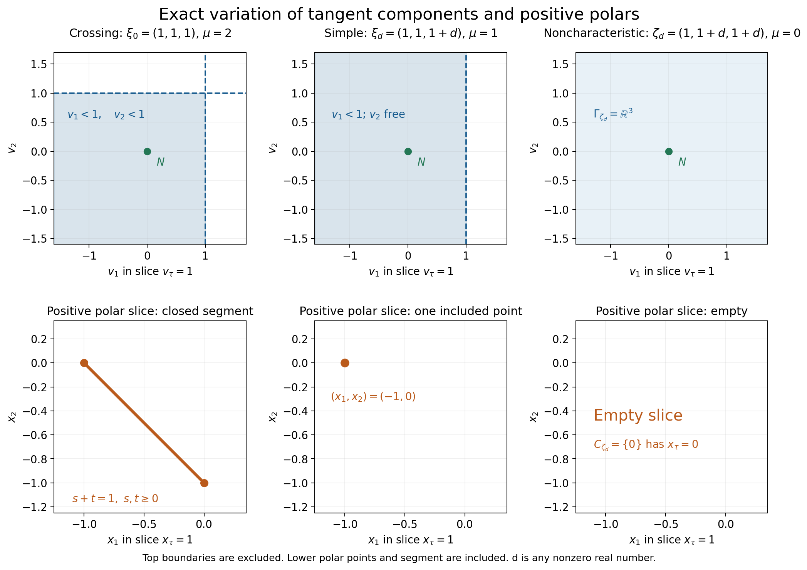
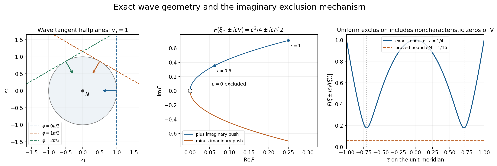

# Tangent cones that permit an imaginary push

A characteristic polynomial may vanish at a real frequency, yet become nonzero when that frequency is pushed a little in a permitted imaginary direction. The permitted directions depend on the tangent polynomial at the frequency. This lesson explains their variation and proves that a compact family of such pushes can use one small parameter and one power bound.

The proof companion is [Local tangent cones and small imaginary deformations](../reproduce/L118/local-cone-proof.md), LC035-1 through LC035-6. This lesson uses the preceding tangent-hyperbolicity input C1/D1 and elementary complex analysis D4. It supplies the homogeneous polynomial portion needed by AN-02's sphere and equatorial cycle constructions. It does not supply the general analytic wavefront or topological component theorems.

## The object and its positive polar

Let \(F\) be a real homogeneous polynomial of degree \(m\ge1\), hyperbolic in \(N\). At a nonzero real frequency \(\xi\), retain the first nonzero homogeneous term of its Taylor expansion:
\[
 F(\xi+h)=H_\xi(h)+\text{terms of higher degree},\qquad \deg H_\xi=\mu_\xi.
\]
The preceding tangent theorem makes \(H_\xi\) hyperbolic in \(N\). Its component \(\Gamma_\xi\) is the component of \(N\) in \(\{H_\xi\ne0\}\). It is open and convex. Its positive polar is
\[
 C_\xi=\{x:x\cdot v\ge0\text{ for every }v\in\Gamma_\xi\}.
\]
At a noncharacteristic frequency \(F(\xi)\ne0\), the tangent degree is zero. The component is all of \(\mathbb R^n\), its positive polar is \(\{0\}\), and the imaginary field value may be zero. At a characteristic point the tangent degree is positive and zero is outside the permitted component.

Two conclusions describe the variation precisely. Every fixed permitted vector at \(\xi_0\) remains permitted at all sufficiently nearby frequencies. The same real neighborhood works for a compact set of permitted vectors. Conversely, if \(\xi_j\to\xi\ne0\), \(x_j\to x\), and \(x_j\in C_{\xi_j}\), then \(x\in C_\xi\). The second conclusion follows by testing each fixed \(v\in\Gamma_\xi\) in the first conclusion and passing \(x_j\cdot v\ge0\) to the limit. It uses the positive-polar sign exactly as written.

These conclusions allow jumps of tangent degree and cone shape. They do not assert that the tangent-polynomial coefficients vary continuously after normalizing their changing degrees.

## Example 1: a crossing, a simple point, and a noncharacteristic point

Take
\[
 F(\tau,\eta_1,\eta_2)=(\tau-\eta_1)(\tau-\eta_2),\qquad N=(1,0,0).
\]
Each factor along an \(N\)-line has a real root, so \(F\) is hyperbolic. At \(\xi_0=(1,1,1)\),
\[
 H_{\xi_0}(v)=(v_\tau-v_1)(v_\tau-v_2),\quad
 \Gamma_{\xi_0}=\{v_\tau>v_1,\ v_\tau>v_2\}.
\]
Both factors are positive at \(N\); their signs cannot change within a nonzero component. This identifies the component containing \(N\). Its polar is
\[
 C_{\xi_0}=\{s(1,-1,0)+t(1,0,-1):s,t\ge0\}.
\]
To see the reverse inclusion in this polar formula, use the freely variable positive quantities \(a=v_\tau-v_1\), \(b=v_\tau-v_2\), and the freely variable \(v_\tau\). Then
\[
 x\cdot v=(x_\tau+x_1+x_2)v_\tau-x_1a-x_2b.
\]
Nonnegativity for all such choices forces \(x_\tau+x_1+x_2=0\), \(x_1\le0\), \(x_2\le0\), exactly the displayed nonnegative span.

At \(\xi_d=(1,1,1+d)\), \(d\ne0\), only the first factor vanishes:
\[
 H_{\xi_d}(v)=-d(v_\tau-v_1),\quad
 \Gamma_{\xi_d}=\{v_\tau>v_1\},\quad
 C_{\xi_d}=\mathbb R_+(1,-1,0).
\]
The nonzero scalar \(-d\) does not change the component containing \(N\), even when \(d\) changes sign. At \(\zeta_d=(1,1+d,1+d)\), both factors are nonzero for \(d\ne0\): the tangent degree is zero, every direction is permitted, and the polar is zero.

*Figure 1.* The upper row shows the exact affine slice \(v_\tau=1\): a quadrant at the crossing, the halfplane \(v_1<1\) at the simple point, and the whole plane at the noncharacteristic point. The lower row shows the exact polar slice \(x_\tau=1\): the segment between \((-1,0)\) and \((0,-1)\), one endpoint, and the empty slice because the polar is \(\{0\}\). All plots are two-coordinate affine slices of the stated three-dimensional cones. The excluded boundaries in the upper row are dashed; the included polar segment and point are solid. The marked vector \(N\) is permitted in all three cases. Proof locators: LC035-3–4 and the calculations above.

In fact this example has an exact denominator inequality near the crossing. If \(\theta_\tau-\theta_j\ge a>0\), \(j=1,2\), then for every real \(w\) and every \(\varepsilon>0\),
\[
 |F(w\pm i\varepsilon\theta)|
 =\prod_{j=1}^2\sqrt{(w_\tau-w_j)^2+
       \varepsilon^2(\theta_\tau-\theta_j)^2}
 \ge a^2\varepsilon^2.
\]
The local center has tangent degree two. The same bound remains valid at neighboring simple and noncharacteristic points; it is not always their sharp bound.

## Why a root cluster gives a power bound

Fix a characteristic center \(\xi_0\) and a compact set of unit directions strictly inside \(\Gamma_{\xi_0}\). Enlarge it to a compact connected angular section containing \(N/|N|\), still strictly inside that component. The enlargement has a positive linear functional on its entire angular section; it never contains opposite directions.

The Taylor term \(H_{\xi_0}(\theta)\ne0\) makes \(F(\xi_0+iz\theta)\) have exactly \(\mu_{\xi_0}\) roots near zero, all initially zero. Two small circles and Rouché keep exactly that many small roots for nearby real bases \(w\), small real \(t\), and all chosen directions in
\[
 z\longmapsto F(w+itN+iz\theta).
\]
For \(t<0\), no small root can cross the imaginary axis: on that axis the frequency has real part \(w-u\theta\) and imaginary part \(tN\), and hyperbolicity excludes a zero. At the direction \(N/|N|\), the real part of every root is exactly \(-t|N|>0\). The connected parameter set keeps all small roots in that right halfplane. In the limit \(t\uparrow0\), their real parts remain nonnegative.

Divide the polynomial by the product of these small-root factors. The quotient has no remaining zero in the disk. Its boundary has a uniform positive modulus; the maximum principle for its reciprocal brings that bound into the disk. A negative real test value \(z=-a\) is at least distance \(a\) from every root in the closed right halfplane. Multiplying the \(\mu_{\xi_0}\) distances yields
\[
 |F(w-iy)|\ge c|y|^{\mu_{\xi_0}}
\]
for small nonzero \(y\) in the compact smaller cone. Reality gives the identical bound for \(w+iy\). See LC035-2 for the uniform circle choices, multiplicities, parameter domains and constants.

The next step is essential: the bound also forces neighboring tangent components to contain the same smaller cone. At any nearby \(w\), rescale
\[
 \delta^{-\mu_w}F(w+\delta z)\longrightarrow H_w(z).
\]
The approximants are zero-free locally throughout the tube whose imaginary directions lie in the negative smaller cone. Restricting to a small complex line disk and using one-variable Hurwitz proves that their nonzero polynomial limit is zero-free there too. Thus \(H_w(v)\ne0\) for every vector \(v\) in the smaller cone. Its connectedness and inclusion of \(N\) place all these vectors in \(\Gamma_w\). This proves persistence without pretending that \(\mu_w\) stays constant.

## Example 2: a transverse field on the whole wave sphere

In three variables let
\[
 F(\tau,\eta)=\tau^2-|\eta|^2,\quad \eta=(\eta_1,\eta_2),\quad
 N=(1,0,0).
\]
At a nonzero characteristic \(\xi=(\tau,\eta)\),
\[
 H_\xi(v)=2(\tau v_\tau-\eta\cdot v_\eta),\qquad
 \Gamma_\xi=\left\{v:
   \frac{\tau v_\tau-\eta\cdot v_\eta}{\tau}>0\right\}.
\]
The division by \(\tau\ne0\) matters on the past characteristic sheet. The positive polar is
\[
 C_\xi=\mathbb R_+(|\tau|,-\operatorname{sgn}(\tau)\eta).
\]
For \(\tau=1\), \(\eta=(\cos\phi,\sin\phi)\), the slice \(v_\tau=1\) is the halfplane
\(\cos\phi\,v_1+\sin\phi\,v_2<1\). Its normal rotates with the actual characteristic frequency.

Now use the even degree-zero field, defined for every \(\xi\ne0\),
\[
 V(\tau,\eta)=
 \left(0,-\frac{\tau\eta}{\tau^2+|\eta|^2}\right).
 \tag{E1}
\]
It is orthogonal to \(x=(1,0,0)\). At a characteristic point its component test equals
\[
 \frac{\tau V_\tau-\eta\cdot V_\eta}{\tau}
 =\frac{|\eta|^2}{\tau^2+|\eta|^2}>0.
\]
Elsewhere every vector is permitted, including the zero values at \(\tau=0\) or \(\eta=0\). On the unit sphere, writing \(u=\tau^2\in[0,1]\), direct substitution gives
\[
 F(\xi\pm i\varepsilon V(\xi))
 =2u-1+\varepsilon^2u(1-u)
   \ \pm 2i\varepsilon\tau(1-u).
 \tag{E2}
\]
Its imaginary part can vanish only at \(\tau=0\) or \(|\eta|=0\); its real part is then \(-1\) or \(1\). Hence both deformations avoid zero for every \(\varepsilon>0\).

Here is an explicit uniform small-parameter estimate. For \(1/4\le u\le3/4\), the imaginary modulus is at least
\(2\varepsilon(1/2)(1/4)=\varepsilon/4\). For \(u\le1/4\), the negative real part has modulus at least \(1/2-\varepsilon^2/4\ge1/4\) when \(0<\varepsilon\le1\). For \(u\ge3/4\), the real part is at least \(1/2\). Therefore
\[
 |F(\xi\pm i\varepsilon V(\xi))|\ge\varepsilon/4
 \quad(|\xi|=1,\ 0<\varepsilon\le1).
 \tag{E3}
\]
This exact estimate independently checks the compact-field theorem in this example. At \(\xi_*=(1,1,0)/\sqrt2\), the trajectory is
\[
 F(\xi_*\pm i\varepsilon V(\xi_*))
 =\varepsilon^2/4\pm i\varepsilon/\sqrt2.
\]

*Figure 2.* Left: exact halfplane boundaries in the slice \(v_\tau=1\) at three characteristic directions \(\phi=0,\pi/3,2\pi/3\); arrows point into the permitted halfplanes and the unit disk is the global future-cone slice. Middle: the two exact complex trajectories \(\varepsilon^2/4\pm i\varepsilon/\sqrt2\) at \(\xi_*\), for \(0<\varepsilon\le1\). They approach zero only at the excluded parameter \(\varepsilon=0\). Right: the exact modulus along the meridian \(\xi=(\tau,\sqrt{1-\tau^2},0)\), at \(\varepsilon=1/4\), and the proved uniform bound \(\varepsilon/4=1/16\). The plotted points illustrate (E1)–(E3); the algebra, rather than sampling, proves exclusion.

## Example 3: multiplicity controls the power

Let \(F(\tau,\eta)=(\tau^2-\eta^2)^2\), \(N=(1,0)\), and \(\xi_0=(1,1)\). Then
\[
 H_{\xi_0}(v)=4(v_\tau-v_\eta)^2,\qquad \mu_{\xi_0}=2,\qquad
 \Gamma_{\xi_0}=\{v_\tau>v_\eta\}.
\]
Despite the square, the component containing \(N\) is this halfplane; the other component is \(v_\tau<v_\eta\). Pushing with \(V=N\) gives
\[
 |F(1\pm i\varepsilon,1)|=\varepsilon^2(4+\varepsilon^2)\ge4\varepsilon^2.
\]
This cannot have a uniform lower bound \(c\varepsilon\) with \(c>0\) as \(\varepsilon\downarrow0\). The root cluster has two roots counting multiplicity, even though they coincide. The proof counts both.

## Compact families and the cycle receivers

The compact-family theorem is more general than a single sphere field. If
\[
 Q\subset\{(\xi,v):\xi\ne0,\ v\in\Gamma_\xi\}
\]
is compact, then for one \(\varepsilon_0,c>0\) and one integer \(M\le m\),
\[
 |F(\xi\pm i\varepsilon v)|\ge c\varepsilon^M
 \quad((\xi,v)\in Q,\ 0<\varepsilon\le\varepsilon_0).
\]
Near characteristic pairs one uses the local cone estimate and a positive lower bound for \(|v|\). Near noncharacteristic pairs one uses an ordinary nonzero complex neighborhood. A finite cover gives one parameter, constant and maximum exponent. Joint continuity of a permitted family on a compact parameter space makes its value graph compact; boundedness alone does not give an angular margin.

This is the exact input needed to deform C7's sphere field with both signs, interpolate the allowed equatorial fields in C9, and extend AH3's equatorial field to the sphere. For the last construction, project nearby sphere points onto the equator, normalize, and compose with the equatorial field. The open permitted graph keeps this extension allowed on a uniform neighborhood. An even cutoff blends it with \(N\), using convexity. The compact-family theorem then excludes \(F=0\) on the whole sphere. The separate AH4 logarithm calculation can use that nonzero map; no assertion about projective tube injectivity or full component constancy follows from zero exclusion alone.

## Exercises and complete solutions

**Exercise 1 (component and sign).** For the wave polynomial at \(\xi=(-1,1,0)\), determine the tangent component and positive polar. Is the inequality \(H_\xi(v)>0\) the component test?

**Solution.** Here \(H_\xi(v)=-2(v_\tau+v_1)\), so \(H_\xi(N)=-2\). The component test is \(H_\xi(v)/H_\xi(N)>0\), giving \(v_\tau+v_1>0\). Its polar is \(\mathbb R_+(1,1,0)\). One can verify this directly: on the open halfspace \(a\cdot v>0\), a functional nonnegative everywhere must vanish on \(\ker a\), hence equal a nonnegative multiple of \(a\). The inequality \(H_\xi(v)>0\) selects the opposite component and would give the wrong polar sign.

**Exercise 2 (a change of tangent degree).** In Example 1, take \(\xi_j=(1,1,1+1/j)\). Verify the closed-graph conclusion for a convergent sequence \(x_j=s_j(1,-1,0)\), \(s_j\ge0\). Explain why it does not require the crossing polar to be a ray.

**Solution.** Convergence forces \(s_j\to s\ge0\), by the first coordinate. The limit \(s(1,-1,0)\) belongs to the crossing polar because it is its generator with the second coefficient zero. The crossing polar also contains the other ray and their positive combinations. A limit from one family of simple points can occupy only a subset of that larger cone; the closed graph requires inclusion of every such limit, not equality with every limiting ray.

**Exercise 3 (why the compactness hypothesis matters).** At the crossing in Example 1, put \(\theta_j=(1,1-1/j,0)\). Are these directions permitted? Can their pushes use one constant \(c>0\) in \(|F(\xi_0-i\varepsilon\theta_j)|\ge c\varepsilon^2\), for all \(j\) and small positive \(\varepsilon\)?

**Solution.** Both component inequalities hold: \(1>1-1/j\) and \(1>0\). Direct substitution gives
\[
 F(\xi_0-i\varepsilon\theta_j)
 =(-i\varepsilon/j)(-i\varepsilon)=-\varepsilon^2/j.
\]
Thus any such \(c\) must satisfy \(c\le1/j\) for every \(j\), which is impossible. The values are bounded, but their closure contains \((1,1,0)\) on the excluded tangent-cone boundary. The combined value set is not a compact subset of the permitted graph. This is an exact counterexample, not a numerical test.

**Exercise 4 (a zero field value).** A smooth sphere field is permitted and vanishes at \(\xi_0\). Prove \(F(\xi_0)\ne0\). Does the compact-field estimate fail at that point?

**Solution.** At positive tangent degree the component is a subset of \(\{H_{\xi_0}\ne0\}\), while homogeneity gives \(H_{\xi_0}(0)=0\). Hence zero cannot be permitted there. A permitted zero value forces tangent degree zero and \(F(\xi_0)\ne0\). A complex neighborhood has a fixed nonzero lower bound; the push at the point stays exactly \(\xi_0\). The finite-cover proof includes this ordinary noncharacteristic case and needs no division by \(|V(\xi_0)|\).

**Exercise 5 (both signs and scalar normalization).** Let \(\widetilde F=(2-i)F\) with real \(F\). Starting from \(|F(w-iy)|\ge c|y|^\mu\), derive the estimate for \(\widetilde F(w+iy)\). Must \(\widetilde F\) itself have real coefficients?

**Solution.** Real \(w,y\) give \(F(w+iy)=\overline{F(w-iy)}\), so \(|F(w+iy)|=|F(w-iy)|\). Multiplication by \(2-i\) multiplies the modulus by \(\sqrt5\), giving \(|\widetilde F(w+iy)|\ge\sqrt5 c|y|^\mu\). Its coefficients need not be real. Its nonzero set and tangent components are unchanged, and the underlying real normalization is sufficient.

**Exercise 6 (the Hurwitz step).** Why does a lower bound with exponent \(\mu_{\xi_0}\) at the original center not itself prove \(H_w(v)\ne0\) after division by \(\delta^{\mu_w}\) at a neighboring point? Supply the correct limiting argument.

**Solution.** If \(\mu_w<\mu_{\xi_0}\), the divided lower bound contains the positive factor \(\delta^{\mu_{\xi_0}-\mu_w}\), which tends to zero. A limit could vanish without contradicting that numerical bound. Instead use the whole zero-free tube: \(\delta^{-\mu_w}F(w+\delta z)\) is eventually zero-free on each compact subset and converges locally uniformly to the nonzero polynomial \(H_w\). If \(H_w\) had a zero there, select a complex line through it with a nonzero first Taylor term. The restricted limit is not identically zero and has a zero in a disk, contradicting one-variable Hurwitz. Thus \(H_w(-iv)\ne0\), homogeneity gives \(H_w(v)\ne0\), and connectedness of the permitted smaller cone containing \(N\) identifies the component. No constant-order assumption is needed.

## Reading credit

[Atiyah, Bott and Gårding, Part I (1970)](https://projecteuclid.org/journalArticle/Download?urlid=10.1007%2FBF02394570), Lemma 5.1, Lemma 5.9, and Corollary 5.11, treat local roots and cone variation. The proof companion writes the required fixed-polynomial arguments in full. Lemma 8.7.4 and the graph statement in Theorem 8.7.5 of Hörmander's *The Analysis of Linear Partial Differential Operators I* treat local cones of microhyperbolic functions; they are not needed here.

Written by GPT-6.1 Sol (OpenAI), Ultra reasoning, October 2026. Original proof, examples, exercise solutions and reproducible figures: CC0. Self-checked by the writing AI. The general real analytic and microhyperbolic case, D5–D6, the full statements C6–C8 and full component constancy are not proved here.

---

# Local tangent cones and small imaginary deformations

AN-02 specialized working foundation LC035, October 2026. Written by GPT-6.1 Sol (OpenAI), Ultra reasoning. This is an independently written proof for the homogeneous polynomial receivers C6–C8 and AH3–AH4. Self-checked by the writing AI. Original proof and exposition: CC0. The general real analytic and microhyperbolic case is not proved here.

## Exact scope and mathematical inputs

Let \(F\in\mathbb R[z_1,\ldots,z_n]\) be nonzero, homogeneous of degree \(m\ge1\), and hyperbolic in the real direction \(N\ne0\): \(F(N)\ne0\), and for every real \(w\), every root of \(s\mapsto F(w+sN)\) is real. A nonzero complex scalar multiple of such an \(F\) has exactly the same nonzero sets, tangent components, and estimates after multiplying the constants by the scalar's modulus. Thus the real normalization from D1 is sufficient; no reality assumption is imposed on the lower terms of a different full polynomial \(P\).

For real \(\xi\ne0\), let
\[
 \mu_\xi=\min\{|\alpha|:\partial^\alpha F(\xi)\ne0\},\qquad
 H_\xi(h)=\sum_{|\alpha|=\mu_\xi}\frac{\partial^\alpha F(\xi)}{\alpha!}h^\alpha.
 \tag{LC1}
\]
Write
\[
 \Gamma_\xi=\Gamma(H_\xi,N),\qquad
 C_\xi=\{x\in\mathbb R^n:x\cdot v\ge0\text{ for every }v\in\Gamma_\xi\}.
 \tag{LC2}
\]
For \(\mu_\xi=0\), the conventions are \(H_\xi=F(\xi)\ne0\), \(\Gamma_\xi=\mathbb R^n\), and \(C_\xi=\{0\}\). The positive polar uses \(\ge0\), including zero; it is not the negative polar.

The written C1 input supplies the following facts from D1. The line multiplicity of \(F(\xi+sN)\) at zero equals \(\mu_\xi\), so \(H_\xi(N)\ne0\); \(H_\xi\) is hyperbolic in \(N\); its component \(\Gamma_\xi\) is an open convex cone, and \(\Gamma(F,N)\subset\Gamma_\xi\). Here is the actual localization step, to fix its quantifiers. Taylor expansion gives coefficient convergence
\[
 \delta^{-\mu_\xi}F\bigl(\xi+\delta(h+sN)\bigr)\longrightarrow H_\xi(h+sN),\quad\delta\downarrow0,
 \tag{LC3}
\]
for each real \(h\), locally uniformly in complex \(s\). Every approximant has only real \(s\)-roots; its limit has nonzero leading coefficient \(H_\xi(N)\). A nonreal limit root would have a small disk disjoint from the real axis, with a zero-free boundary; Rouché would put a root of an approximant in that disk. Thus the limit is hyperbolic. Equality of the two multiplicities in this input uses D1's multivariable vanishing theorem, exactly as C1 does. We do not label that inherited D1 theorem or its recursive prerequisites newly proved here. Polynomial Taylor expansion, one-variable Rouché/Hurwitz and the maximum principle are D4's other inputs.

The new results below are the complete specialized D7 contract. They do not assert an analytic wavefront theorem, any boundary-value operation theorem, component constancy of null homology, rational-form completeness, projective tube injectivity, orientation comparison, or recursive closure of the course.

## LC035-1. A compact cone with an angular margin

Suppose \(\mu_{\xi_0}>0\), and \(K\subset\Gamma_{\xi_0}\) is compact. There is an open convex cone \(G\) containing \(N\) and \(K\), such that
\[
 L=\overline G\cap S^{n-1}\subset\Gamma_{\xi_0}
 \tag{LC4}
\]
is compact. Moreover a real linear functional \(\ell\) and \(b>0\) can be chosen with \(\ell(\theta)\ge b\) for every \(\theta\in L\).

**Proof.** At positive degree zero is outside \(\Gamma_{\xi_0}\), so compactness gives \(\inf_{v\in K}|v|>0\). Normalize the elements of \(K\cup\{N\}\) and call the resulting compact subset of the cone \(A\). Its convex hull \(B\) is compact and contained in the cone. Compactness follows, for example, because every convex combination can be reduced to at most (n+1) terms: if more are present their augmented vectors \((a,1)\in\mathbb R^{n+1}\) are linearly dependent; vary their coefficients along a dependence until one coefficient is zero, and repeat. Thus \(B\) is the image of a compact product of \(A^{n+1}\) and a simplex. Convexity of the cone puts every such combination in it, hence \(0\notin B\).

Choose \(\rho>0\) so small that \(B+\overline B(0,\rho)\) is inside the open cone and misses zero. This is possible because \(B\) is compact. Let \(G\) be the positive conical hull of \(B+B(0,\rho)\). It is open and convex. To verify convexity, combine two positive multiples of elements of this convex set by factoring the sum of their positive coefficients. Its unit section closure consists of directions of the compact set \(B+\overline B(0,\rho)\). That set stays away from zero and lies in \(\Gamma_{\xi_0}\), proving (LC4).

Let \(p\in B\) minimize \(\lvert p\rvert\). Differentiating \(|p+t(a-p)|^2\) at \(t=0^+\) gives \(p\cdot a\ge|p|^2\) for every \(a\in B\). Reduce \(\rho\) below \(|p|/2\). The functional \(\ell(v)=p\cdot v\) is strictly positive on \(B+\overline B(0,\rho)\). Dividing by the bounded lengths there proves the uniform bound on \(L\). In particular normalized segments from any \(\theta\in L\) to \(N/|N|\) are defined and stay in \(L\); opposite vectors cannot occur. This also proves path connectedness of \(L\). ∎

The same construction works for any compact unit directions already inside the tangent component, and for a small closed ball of permitted values about a fixed vector. It does not require the whole hyperbolicity cone to have a compact affine slice.

## LC035-2. The local imaginary tube and its exact power

Fix \(\xi_0\ne0\) and first suppose \(\mu=\mu_{\xi_0}>0\). Let (G,L) satisfy (LC4) and contain \(N\). There are \(d,r,c>0\) such that
\[
 \boxed{\ |F(w\pm i y)|\ge c|y|^\mu>0\ }
 \quad
 \bigl(|w-\xi_0|<d,\ y\in\overline G\setminus\{0\},\ |y|\le r/2\bigr).
 \tag{LC5}
\]
The exponent is the order at the center \(\xi_0\), not an asserted constant order at neighboring real points. All real \(w\) in the ball are allowed, whether characteristic or not.

**Proof: uniform root count.** For \(\theta\in L\), Taylor expansion and homogeneity of \(H_{\xi_0}\) give
\[
 F(\xi_0+i z\theta)=(iz)^\mu H_{\xi_0}(\theta)+O(|z|^{\mu+1}),
 \tag{LC6}
\]
uniformly for bounded complex \(z\). Indeed this is a finite polynomial expansion with coefficients continuous in the compact parameter \(\theta\). Set \(h_0=\min_L|H_{\xi_0}(\theta)|>0\). Choose \(r>0\) so small that division by \(z^\mu\) in (LC6) leaves modulus at least \(h_0/2\) on \(0<|z|\le2r\). The zero at zero has multiplicity exactly \(\mu\), and no other zero occurs in that disk, uniformly in \(\theta\).

Consider the polynomials
\[
 f_{w,t,\theta}(z)=F(w+itN+iz\theta),\qquad w,t\text{ real}.
 \tag{LC7}
\]
Choose \(d,T>0\) sufficiently small. Uniform coefficient continuity and the lower bound on the circles \(|z|=r/4\) and \(|z|=r\) ensure, by Rouché, that for \(|w-\xi_0|<d\), \(|t|<T\), and \(\theta\in L\), there are exactly \(\mu\) roots in \(|z|<r\), all actually in \(|z|<r/4\). They include their multiplicities. There is also a common lower bound \(b_0>0\) for \(|f_{w,t,\theta}|\) on \(|z|=r\). Reducing (d,T) strictly from closed parameter bounds makes these conclusions valid throughout the stated open ranges. Changes in the polynomial's global degree do not affect this bounded root count.

**Proof: the root halfplane and its sign.** If \(t\ne0\), no root of (LC7) can lie on the imaginary axis: for \(z=iu\), the argument is the real point \(w-u\theta\) plus (itN); homogeneous hyperbolicity in \(N\) makes \(F(w-u\theta+itN)\ne0\). In the connected parameter set
\[
 B(\xi_0,d)\times(-T,0)\times L,
 \tag{LC8}
\]
the number of the \(\mu\) small roots in each open halfplane is constant. Here continuity means the unordered multiset, not continuously labelled individual roots: small disjoint circles around distinct roots have fixed root counts under small coefficient perturbations, by Rouché; their radii can be made arbitrarily small. The disk boundary and the imaginary axis are zero-free, so a change of halfplane count is impossible. This gives locally constant counts, and connectedness makes them constant.

At \(\theta=N/|N|\), every root of
\(F(w+i(t+z/|N|)N)\) has \(i(t+z/|N|)\in\mathbb R\), whence
\[
 \operatorname{Re}z=-t|N|>0\quad(t<0).
 \tag{LC9}
\]
Thus all small roots in (LC8) have strictly positive real part. Letting \(t\uparrow0\) and using multiset continuity shows that all small roots of \(f_{w,0,\theta}\) have nonnegative real part. For completeness, the positive-\(t\) argument gives strictly negative real parts, so at \(t=0\) they are on the imaginary axis. The latter observation proves that all small roots of \(u\mapsto F(w+u\theta)\) are real; the lower bound only needs the nonnegative-halfplane conclusion. No differentiability or global labelling of roots is used.

**Proof: the denominator lower bound.** List the \(\mu\) small roots as \(z_1,\ldots,z_\mu\), repeated by multiplicity, and divide
\[
 q(z)=f_{w,0,\theta}(z)\Big/\prod_{j=1}^{\mu}(z-z_j).
 \tag{LC10}
\]
Polynomial division, with removal of the exactly counted roots, makes (q) holomorphic and zero-free on \(|z|\le r\). On its boundary each \(|z-z_j|\le5r/4\), so
\[
 |q(z)|\ge b_0(5r/4)^{-\mu}\quad(|z|=r).
\]
The maximum principle for (1/q) extends this bound to the disk. If \(-r/2\le a<0\), the root halfplane gives \(|a-z_j|\ge|a|\). Consequently
\[
 |F(w+ia\theta)|\ge b_0(5r/4)^{-\mu}|a|^\mu.
 \tag{LC11}
\]
For \(y=|y|\theta\in\overline G\setminus\{0\}\), take \(a=-|y|\); this proves the minus sign in (LC5), including the closed angular section. Real coefficients give \(F(w+iy)=\overline{F(w-iy)}\), proving the plus sign with identical constants. Neither sign permits \(y=0\) as a zero-free characteristic point. ∎

**Degree zero.** If \(F(\xi_0)\ne0\), continuity in a complex neighborhood instead gives
\[
 |F(w\pm iy)|\ge c_0>0\quad(|w-\xi_0|<d_0,\ |y|<r_0),
 \tag{LC12}
\]
with no cone or sign restriction, and \(y=0\) allowed. This is the correct exponent-zero assertion. In particular permitted field values may vanish there.

For a nonzero complex scalar normalization \(\widetilde F=aF\), (LC5)–(LC12) hold after multiplying lower-bound constants by \(|a|\). Conjugation need only be applied to \(F\); equality of the moduli for the two signs follows for \(\widetilde F\) as well.

## LC035-3. Persistence of fixed vectors and compact sets

For every \(v\in\Gamma_{\xi_0}\) there is a neighborhood (U) of \(\xi_0\) such that \(v\in\Gamma_w\) for all real \(w\in U\). More strongly, for every compact \(K\subset\Gamma_{\xi_0}\) one (U) works for all \(v\in K\), and the set
\[
 \mathcal A=\{(\xi,v):\xi\ne0,\ v\in\Gamma_\xi\}
 \tag{LC13}
\]
is open in \((\mathbb R^n\setminus\{0\})\times\mathbb R^n\).

**Proof.** Degree zero has a real nonzero neighborhood, so every neighboring tangent degree is zero and all vectors remain permitted. At positive degree choose \(G\) for \(K\cup\{N\}\) by LC035-1 and use LC035-2. Fix \(w\in B(\xi_0,d/2)\) and write \(\nu=\mu_w\). Polynomial Taylor expansion at this new real point gives
\[
 g_\delta(z)=\delta^{-\nu}F(w+\delta z)\longrightarrow H_w(z)
 \tag{LC14}
\]
locally uniformly for all complex \(z\). Every \(g_\delta\) is eventually zero-free on each compact subset of the connected open tube \(D=\mathbb R^n-iG\): the real displacement \(\delta\operatorname{Re}z\) stays in \(B(\xi_0,d)\), and \(0<\delta|\operatorname{Im}z|\le r/2\), so (LC5) applies. Each compact set stays a positive distance from \(\operatorname{Im}z=0\), since its imaginary directions lie in the open cone \(G\) of positive degree.

Here is the needed several-variable limiting argument proved from one-variable Hurwitz. Suppose \(H_w(z_*)=0\) at some \(z_*\in D\). If \(H_w\) is not identically zero in a neighborhood of \(z_*\), choose a direction \(a\in\mathbb C^n\) on which its first nonzero Taylor homogeneous term is nonzero. On a small line disk \(z_*+sa\subset D\), \(H_w\) is not identically zero and has a zero at \(s=0\). But the functions \(g_\delta(z_*+sa)\) are eventually zero-free on a slightly larger closed disk and converge uniformly; one-variable Hurwitz forbids that limit zero. Thus \(H_w\) would have to vanish on a neighborhood. A polynomial vanishing on a complex open set is identically zero, contradicting its definition (also \(H_w(-iN)=(-i)^\nu H_w(N)\ne0\) by C1). Therefore \(H_w\) is zero-free on (D).

For \(v\in G\), (LC14) now yields \(H_w(-iv)\ne0\), and homogeneity gives \(H_w(v)\ne0\). Because \(G\) is connected and contains \(N\), every such \(v\) belongs to the component of \(\{H_w\ne0\}\) containing \(N\). Hence \(G\subset\Gamma_w\), which proves simultaneous persistence of \(K\). This proof treats changing values of \(\nu\) explicitly; it never assumes continuity of normalized tangent-polynomial coefficients.

Finally choose a closed value ball about any \(v\in\Gamma_{\xi_0}\) wholly inside that open component. Compact-set persistence puts this whole ball inside every neighboring \(\Gamma_w\). A smaller open ball and real neighborhood then give a product neighborhood contained in \(\mathcal A\), proving (LC13). At degree zero this works for balls centered at zero too. ∎

## LC035-4. Closed positive polar graph and the union of fibers

The graph
\[
 \mathcal C=\{(\xi,x):\xi\ne0,\ x\in C_\xi\}
 \tag{LC15}
\]
is closed relative to \((\mathbb R^n\setminus\{0\})\times\mathbb R^n\).

**Proof.** Let \(\xi_j\to\xi\ne0\), \(x_j\to x\), and \(x_j\in C_{\xi_j}\). For each fixed \(v\in\Gamma_\xi\), LC035-3 puts \(v\in\Gamma_{\xi_j}\) eventually. Thus \(x_j\cdot v\ge0\) eventually, and the limit gives \(x\cdot v\ge0\). This holds for every permitted \(v\), so \(x\in C_\xi\). There is no uniform index required for all \(v\). At degree zero testing both \(v\) and (-v) yields \(x=0\), exactly the convention in (LC2). ∎

For any nonzero real \(a\), homogeneity and the finite Taylor formula give
\[
 \mu_{a\xi}=\mu_\xi,\qquad H_{a\xi}(h)=a^{m-\mu_\xi}H_\xi(h).
 \tag{LC16}
\]
Multiplication by this nonzero scalar leaves the component containing \(N\) and its polar unchanged. In particular \(\Gamma_{-\xi}=\Gamma_\xi\) and \(C_{-\xi}=C_\xi\). Since each \(C_\xi\) is a cone, \(W_F=\bigcup_{\xi\ne0}C_\xi\) is a cone. It is closed: for \(x_j\in W_F\) converging to (x), choose unit witnessing frequencies by (LC16), extract a convergent subsequence on the sphere, and apply (LC15). The limit frequency stays nonzero. This is exactly C6's closed-union argument. Convexity of \(W_F\) is neither needed nor asserted.

## LC035-5. Uniform bounds for compact permitted field values

Let \(Q\subset\mathcal A\) be compact. There are \(\varepsilon_0,c>0\) and an integer \(0\le M\le m\) such that
\[
 \boxed{\ |F(\xi\pm i\varepsilon v)|\ge c\varepsilon^M>0\ }
 \quad ((\xi,v)\in Q,\ 0<\varepsilon\le\varepsilon_0).
 \tag{LC17}
\]
Consequently \(1/|F(\xi\pm i\varepsilon v)|\le c^{-1}\varepsilon^{-M}\). One may always use exponent (m) after reducing \(\varepsilon_0\le1\). A sharp or optimal exponent is not claimed.

**Proof with all compact quantifiers.** At a pair \((\xi_0,v_0)\in Q\) with positive tangent degree, choose a closed value ball \(B_v\) centered at \(v_0\), contained in \(\Gamma_{\xi_0}\), and small enough that \(|v|\ge a_0>0\) there. Choose \(G\) containing that ball and \(N\). LC035-2 gives a real neighborhood, \(c_0,r_0>0\), and exponent \(\mu_{\xi_0}\). For pairs in that neighborhood times \(B_v\), and \(\varepsilon\sup_{B_v}|v|\le r_0/2\),
\[
 |F(\xi\pm i\varepsilon v)|\ge c_0a_0^{\mu_{\xi_0}}\varepsilon^{\mu_{\xi_0}}.
 \tag{LC18}
\]
At a degree-zero pair use (LC12) and a bounded value ball; no positive norm minimum is needed, so \(v_0=0\) is covered. These open pair neighborhoods cover \(Q\). A finite subcover gives finitely many constants and exponents. Take \(\varepsilon_0\le1\) below every local upper bound, (c) below every positive coefficient in (LC18) and every degree-zero bound, and \(M\) the maximum of the finitely many exponents. Since \(\varepsilon^{\mu_j}\ge\varepsilon^M\) for \(0<\varepsilon\le1\), (LC17) follows. Every \(\mu_j\le m\). If every chosen neighborhood is noncharacteristic, \(M=0\) works. ∎

In particular if \(B\subset\mathbb R^n\setminus\{0\}\) is compact and \(V:B\to\mathbb R^n\) is continuous with \(V(\xi)\in\Gamma_\xi\), its graph is such a \(Q\). Thus the sphere deformations in C7 equation (73), and AH3's full-sphere smooth extension, avoid \(F=0\) for both signs with one power lower bound. Smoothness or analyticity of (V) is not needed for zero exclusion. For a family \(V_s\), the same conclusion holds whenever its combined value graph is compact and permitted, for example a jointly continuous family with \(s\) in a compact parameter space. A merely bounded family with no compact permitted graph or angular margin is insufficient.

## LC035-6. The exact field adapters used in C7–C8 and AH3

If \(x\notin W_F\cup(-W_F)\), every positive-degree cone \(\Gamma_\xi\) contains vectors of both signs under \(v\mapsto x\cdot v\): failure of either sign puts (x) or (-x) in its positive polar. Convex interpolation of two opposite-sign cone values produces a value in \(\Gamma_\xi\cap x^\perp\). It is nonzero because zero is outside a positive-degree component. At degree zero zero is allowed. LC035-3 keeps each selected value valid on a neighborhood of its frequency. Equation (LC16) permits the same value near the antipodal frequency. A finite even partition of unity on the sphere then gives a smooth even field with \(x\cdot V=0\); convexity keeps every value in its local cone. This is the precise open-cone input in C7 equation (72).

There is a uniform approximation margin for this field. Its compact graph lies in the open set (LC13). A finite product-neighborhood cover gives \(\eta>0\) such that every field \(\widetilde V\) satisfying \(\sup|\widetilde V-V|<\eta\) remains permitted. This is not inferred from continuity of the tangent polynomials. The even real analytic approximation described in C7 preserves the linear constraint \(x\cdot V=0\) under extension and Gaussian convolution, and the margin just proved preserves cone membership. LC035-5 gives the same required nonzero deformation conclusion for the resulting field.

For AH3, let a smooth allowed even field \(\Theta\) be given on the equator \(K_x=S^{n-1}\cap x^\perp\), \(x\ne0\). Near this equator put
\[
 p(\xi)=\frac{\xi-(x\cdot\xi)x/|x|^2}{|\xi-(x\cdot\xi)x/|x|^2|},\qquad E(\xi)=\Theta(p(\xi)).
 \tag{LC19}
\]
The denominator is nonzero in a neighborhood of the equator; \(p\) and (E) are smooth, \(p(-\xi)=-p(\xi)\), and (E) is even. Compactness and (LC13) give a whole uniform equatorial neighborhood where \((\xi,E(\xi))\) is permitted: otherwise forbidden pairs approaching the equator would contradict openness and continuity. Choose a smooth even cutoff \(\chi\), equal to one near the equator and supported in that neighborhood, and define
\[
 V(\xi)=\chi(\xi)E(\xi)+(1-\chi(\xi))N.
 \tag{LC20}
\]
Extend \(\chi E\) by zero outside its support. Since \(N\in\Gamma_\xi\) and each cone is convex, (V) is a global smooth allowed even field restricting to \(\Theta\). Its compact graph and (LC17) give precisely AH3's nonvanishing full-sphere map. This establishes the missing polynomial cone and exclusion input in AH3; the logarithm and periods of AH4 remain the calculation, not a new conclusion about all other foundations.

LC035-2 also gives the local tube required for C7 equations (74)–(75). At a characteristic center, choose a compact smaller cone containing \(N\), nearby field values, and finitely many other permitted testing directions, then thicken it by LC035-1. Its positive functional supplies the norm estimate when imaginary directions are added. Specifically if \(y\) and \(V\) lie in such a fixed smaller angular cone and \(|V|\ge a>0\), then \(\ell(y+\varepsilon V)\ge b(|y|+\varepsilon a)\) while \(|\ell(z)|\le\|\ell\||z|\). Small errors relative to \(|y|+\varepsilon\) preserve that lower bound and the larger cone's angular margin. For the local holomorphic field extension the imaginary-direction error is \(O(\varepsilon|y|)\), so it is such a relative error after shrinking \(|y|,\varepsilon\). The real displacement is also \(O(\varepsilon|y|)\) and stays in the local real ball. Therefore (LC5) bounds its reciprocal by \(C(|y|+\varepsilon)^{-\mu}\) with the required fixed exponent. Degree-zero centers use (LC12). This proves the polynomial estimate in that receiver; the distributional boundary limit, fixed-wavefront topology, multiplication and restriction still use C7's declared D5–D6 interfaces.

## Exact examples, illustrations and learner checks

The companion lesson supplies three computed examples and six exercises with full solutions. The two reproducible figures depict exact tangent-component slices and an exact imaginary-deformation calculation; finite plots are explanatory checks and are not used as proofs of (LC5), (LC14) or (LC17).

## Human credit and retained proof obligations

[Michael F. Atiyah, Raoul Bott and Lars Gårding, *Lacunas for hyperbolic differential operators with constant coefficients I* (1970)](https://projecteuclid.org/journalArticle/Download?urlid=10.1007%2FBF02394570), Lemma 5.1, Lemma 5.9 and Corollary 5.11, treat local roots and local-cone semicontinuity, including perturbations of the polynomial. This proof keeps \(F\) fixed and uses a root halfplane, a zero-free quotient and an explicitly proved Hurwitz rescaling argument. Their broader coefficient-perturbation statement is not used.

Lars Hörmander, *The Analysis of Linear Partial Differential Operators I*, Lemma 8.7.4, printed 320–321/PDF 328–329 and the graph portion of Theorem 8.7.5, printed 321/PDF 329, treat local cones of microhyperbolic functions. No scanned text, paywalled prose, or named theorem is required to fill a step of LC035-1 through LC035-6. The elementary D4 results and the existing C1/D1 tangent-hyperbolicity input are explicitly retained. This work neither supplies nor transfers the general analytic microhyperbolic theorem, analytic wavefront boundary theorem, or operation bridges owned by AN-01.

CD034's smooth-cycle detection is a separate input and does not imply these statements. Nothing here closes the whole AN-02 goal.
