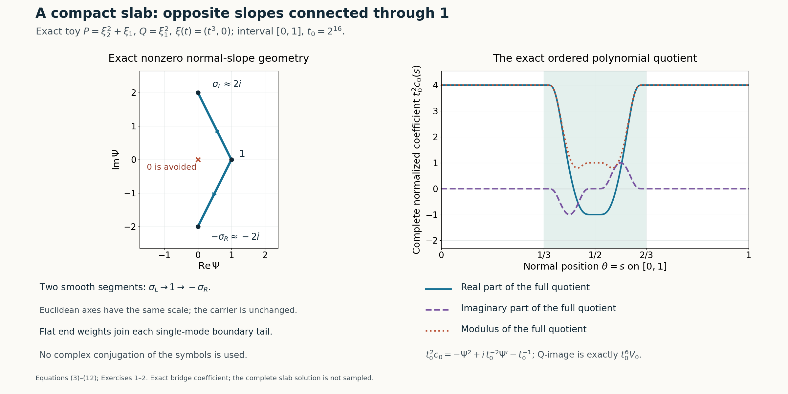

# Two flat boundaries and a nonzero phase bridge

*Written by GPT-6.1 Sol (OpenAI), Ultra reasoning effort, October 2026. Self-checked by GPT-6.1 Sol (OpenAI). Original expression: CC0.*

A solution with one flat boundary does not immediately give a solution supported in a compact slab. Multiplying it by a second cutoff adds new operator errors. Instead we construct a flat mode assembly at each boundary, give both assemblies the same real carrier in the middle, and connect their opposite imaginary normal slopes along a fixed curve that misses zero. The middle is a single exponential with a nonzero Q-image, so its coefficient is a smooth exact quotient.

Read [Flat half-space solutions from real frequency rays](flat-half-space-solutions-from-real-frequency-rays.md). We use the half-space construction with a freely chosen starting mode, initial phase constant and affine upper tail. The interval has two distinct endpoints. The middle bridge and both support equalities are proved here.

The mathematical inputs are the internal proof routes identified above and below, with their stated prerequisite assumptions. The Hörmander reference provides background comparison.

## The precise statement and the two normal directions

Assume the real-frequency hypotheses
\[
\begin{gathered}
N\ne0,\\
P_m(N)\ne0,\\
\sup_{\eta\in\mathbb R^n}
\mathcal S_N Q(\eta)/\mathcal S_N P(\eta)=\infty,
\\
\deg Q\le\deg P=m.
\end{gathered}
\tag{1}
\]
Let \(a<b\) be real numbers, \(L=b-a\), and fix \(\varepsilon_*>0\). We will construct smooth complex functions v,c on the whole space such that
\[
\begin{gathered}
(P(D)+c(x)Q(D))v=0,\\
D=-i\partial,\\
\operatorname{supp}v\\
=\operatorname{supp}c
\\
=\{x:a\le x\cdot N\le b\},\\
\sup|c|<\varepsilon_* .
\end{gathered}
\tag{2}
\]
All derivatives of v and c will be flat on both boundary hyperplanes. The slab is compact only in the normal coordinate; no compact support in the transverse directions is asserted.

Use the Laurent path from the Laurent-path theorem for N. Denote its path by \(\xi(t)\), normal integer scale by \(\kappa\), growth powers by \(g_P<g_Q\), degree indices by \(d_P>d_Q\), and constants by \(c_P,c_Q\ne0\). Keep
\[
\begin{gathered}
\beta\\
=g_Q-g_P>0,D_0\\
=d_P-d_Q>0,\gamma\\
=\beta/D_0>0.
\end{gathered}
\]
Exactly the same real path and integer exponents work for −N:
\[
\begin{gathered}
t^{-g_R}R(\xi(t)+zt^\kappa(-N))
\\
=t^{-g_R}R(\xi(t)+(-z)t^\kappa N)\\
\longrightarrow (-1)^{d_R}c_Rz^{d_R},
\\
R=P,Q .
\end{gathered}
\tag{3}
\]
Moreover \(P_m(-N)=(-1)^mP_m(N)\ne0\) and
\(\mathcal S_{-N}R=\mathcal S_NR\), since each j-th derivative changes by \((-1)^j\). Thus both real-frequency constructions are available. This is a sign change of the normal variable, not complex conjugation of either symbol.

Apply the matching lemma equation (5) of [Flat half-space solutions from real frequency rays](flat-half-space-solutions-from-real-frequency-rays.md)–equation (8) of [Flat half-space solutions from real frequency rays](flat-half-space-solutions-from-real-frequency-rays.md) independently in these two directions. At the same large starting index \(\nu_0\), the first upper-tail normalized slopes are
\[
\begin{gathered}
\sigma_L=\sigma_{\nu_0}^{+,N}
=2^\gamma i+O(2^{-\nu_0}),\\
\sigma_R=\sigma_{\nu_0}^{+,-N}
=2^\gamma i+O(2^{-\nu_0}).
\end{gathered}
\tag{4}
\]
The two roots need not be identical or conjugate. Their bounded errors are uniform after a fixed prefix. Apply the half-space construction with these specified Laurent data in both directions; do not reselect either real frequency path.

Translate the N construction to the lower boundary using normal distance
\(r_L=x\cdot N-a\), and the −N construction to the upper boundary using
\(r_R=b-x\cdot N\). Translation of a normal argument does not change its gradient or the constant coefficient operators. Both use the real carrier \(\xi_{\nu_0}\) in their first mode; choose the half-space construction's form \(e^{ix\cdot\xi_\nu+i\phi_\nu(r)}\) in both cases. The scalar carrier itself is therefore identical where each assembly has become a single first mode.

Choose \(\nu_0\) so large that every join and cutoff transition of either boundary assembly is contained in its boundary strip of width L/4:
\[
B_{\nu_0-1}+\rho_{\nu_0-1}<L/4 .
\tag{5}
\]
All later mode intervals lie still closer to their respective boundary. Above this distance each assembly consists of its first mode alone, with its cutoff 1 and its phase affine. The N assembly then has normal derivative \(t_0^\kappa\sigma_L\); the −N assembly, considered as a function of \(s=x\cdot N\), has derivative \(-t_0^\kappa\sigma_R\), where \(t_0=2^{\nu_0}\).

## Connecting the two tail slopes without a zero

Put \(\theta=(s-a)/L\), and use the explicit smooth step h in equation (10) of [Flat half-space solutions from real frequency rays](flat-half-space-solutions-from-real-frequency-rays.md). Define
\[
\begin{gathered}
u(\theta)=h(6(\theta-1/3)),\\
w(\theta)=h(6(\theta-1/2)).
\end{gathered}
\]
Here u and w name two weights, not a physical solution. For every real \(\theta\), \(0\le w\le u\le1\): below 1/2 the second weight is zero, while above 1/2 the first is one. Set
\[
\begin{gathered}
\Psi_{\nu_0}(s)\\
=(1-u(\theta))\sigma_L+(u(\theta)-w(\theta))\,1
+w(\theta)(-\sigma_R).
\end{gathered}
\tag{6}
\]
For \(s\le a+L/3\) this is \(\sigma_L\), and for \(s\ge a+2L/3\) it is \(-\sigma_R\). It follows two smooth line segments, from \(\sigma_L\) to 1 and then from 1 to \(-\sigma_R\). Both weights and every derivative are flat at their end values, so the connector is smooth at \(\theta=1/3,1/2,2/3\).

The limiting two segments, from \(2^\gamma i\) to 1 and from 1 to \(-2^\gamma i\), miss zero. Each interior point has positive real part and all endpoints are nonzero. Their compact union has a positive distance from zero. The \(O(2^{-\nu_0})\) endpoint perturbations preserve half that distance for large \(\nu_0\). For constants independent of the starting index after a fixed prefix,
\[
\begin{gathered}
0<c_{\min}\le|\Psi_{\nu_0}(s)|\le C_0,\\
|\partial_s^k\Psi_{\nu_0}(s)|\le C_k(L)
\\
(k\ge0,\ s\in\mathbb R).
\end{gathered}
\tag{7}
\]
The constants can depend on the prescribed interval length. No small or large L limit is claimed. The proof is unchanged if either endpoint perturbation has a small negative real part, because the distance estimate is made before the perturbation.

Let \(\phi_L(r_L)\) be the lower assembly's first phase. Choose a smooth primitive \(\Phi\) with
\[
\begin{gathered}
\Phi'(s)=t_0^\kappa\Psi_{\nu_0}(s),\\
\Phi(s)=\phi_L(s-a)
\\
(s_L-L/24<s\le s_L),\\
s_L=a+L/3 .
\end{gathered}
\tag{8}
\]
The equality is obtained by matching one additive complex constant: both derivatives equal \(t_0^\kappa\sigma_L\) on an open interval below \(s_L\), because (5) puts that interval in the lower affine tail. Define the primitive throughout the middle and its adjacent constant-slope regions.

For the upper assembly choose any reference first phase \(\phi_R^0(r_R)\) with the prescribed derivative. On an open interval above \(s_R=a+2L/3\), both
\(\Phi(s)\) and \(\phi_R^0(b-s)\) have derivative
\(-t_0^\kappa\sigma_R\). Their difference is constant there. Put
\[
\begin{gathered}
\Delta=\Phi(s_R)-\phi_R^0(b-s_R),\\
\phi_R(r)=\phi_R^0(r)+\Delta .
\end{gathered}
\tag{9}
\]
Add the same \(\Delta\) to all upper assembly phases. Their matching equations remain true, and their quotient coefficients are unchanged. The common real carrier means the physical upper first mode now agrees with the bridge mode
\[
\begin{gathered}
V_0(x)=\exp i[x\cdot\xi(t_0)+\Phi(s)],
\\
s=x\cdot N .
\end{gathered}
\tag{10}
\]
on a whole open interval above \(s_R\). There is no additional transverse phase factor.

Both boundary damping normalizations can be met simultaneously. First define the reference lower and upper primitives and the connector, then add a purely imaginary constant iH to the lower first phase and to \(\Phi\). It also adds iH to \(\Delta\), hence to every upper phase. The needed lower and upper initial imaginary values are two finite lower bounds after \(\nu_0\) is fixed. Choose H large enough for both. Each assembly then satisfies the initial normalization equation (16) of [Flat half-space solutions from real frequency rays](flat-half-space-solutions-from-real-frequency-rays.md) and retains equation (17) of [Flat half-space solutions from real frequency rays](flat-half-space-solutions-from-real-frequency-rays.md)–equation (20) of [Flat half-space solutions from real frequency rays](flat-half-space-solutions-from-real-frequency-rays.md). The bridge stays nonzero for every finite H; its symbol quotient is unaffected by this common additive phase. This order of choices avoids imposing a new restriction on the middle slope or on \(\nu_0\).

## The exact bridge quotient and smooth gluing

For each R=P,Q, evaluate the normal polynomial with the ordered operator
\(t_0^{-\kappa}D_s+\Psi_{\nu_0}(s)\) as in equation (23) of [Flat half-space solutions from real frequency rays](flat-half-space-solutions-from-real-frequency-rays.md)–equation (25) of [Flat half-space solutions from real frequency rays](flat-half-space-solutions-from-real-frequency-rays.md). The coefficient error of its normalized window is \(O(t_0^{-1})\). Every nonleading ordered-product term contains at least one \(t_0^{-\kappa}\), and the connector derivatives have the index-independent bounds (7). Hence, uniformly in s and transverse x,
\[
\begin{gathered}
\frac{R(D)V_0}{t_0^{g_R}V_0}
\\
=c_R\Psi_{\nu_0}(s)^{d_R}(1+e_{R,0}(s)),\\
|\partial_s^k e_{R,0}(s)|\le C_k(L)t_0^{-1}.
\end{gathered}
\tag{11}
\]
Here \(\kappa\ge1\), so \(t_0^{-\kappa}\le t_0^{-1}\). Division by the leading factor is valid because of (7); derivatives of its inverse satisfy the same uniform bounds. Choose \(\nu_0\) large enough that both zero-order errors are less than 1/4. The bridge's P-image and Q-image are consequently nonzero, and its exact coefficient is
\[
\begin{gathered}
c_0(s)\\
=-
\frac{c_P}{c_Q}t_0^{-\beta}
\Psi_{\nu_0}(s)^{D_0}
\frac{1+e_{P,0}(s)}{1+e_{Q,0}(s)},\\
|c_0(s)|\le C(L)t_0^{-\beta}.
\end{gathered}
\tag{12}
\]
In particular \(c_0\) is smooth and pointwise nonzero throughout the middle.

Place the actual seams strictly inside these constant-slope regions: \(s_-=s_L-L/48\) and \(s_+=s_R+L/48\). Use the lower assembly for \(s<s_-\), the bridge for \(s_-<s<s_+\), and the adjusted upper assembly for \(s>s_+\), restricting the whole construction to \(a<s<b\). For an explicit open cover, the lower overlap is \((s_L-L/24,s_L)\), and the upper overlap is \((s_R,s_R+L/24)\). Both lie inside the corresponding single-mode affine tails by (5), and each contains its seam. On those whole open intervals, (8) or (9) makes the physical waves exactly equal. Thus their exact P/Q quotients also agree there. The bridge and each boundary assembly can be assigned on overlapping open sets without changing either function. We do not place a seam at the point where its connector weight first starts to vary.

Set v equal to these agreed waves or assemblies in the open slab and zero outside; set c equal to their exact coefficients there and zero outside:
\[
v=0,\quad c=0\quad(s\le a\hbox{ or }s\ge b).
\tag{13}
\]
The bridge touches neither boundary. Near the lower boundary, v,c are the translated lower assembly. Near the upper boundary, they are the translated upper assembly with one fixed multiplicative phase factor in v. The equation (34) of [Flat half-space solutions from real frequency rays](flat-half-space-solutions-from-real-frequency-rays.md)–equation (35) of [Flat half-space solutions from real frequency rays](flat-half-space-solutions-from-real-frequency-rays.md) estimates for all derivatives therefore apply at both boundaries. The direct extension argument after equation (35) of [Flat half-space solutions from real frequency rays](flat-half-space-solutions-from-real-frequency-rays.md) proves that the zero extensions are smooth and flat on each boundary plane. The common multiplicative factor may affect the upper solution's derivative constants but cannot change flatness. The upper coefficient is unchanged.

The defining equation holds in every boundary assembly region and in the bridge by its exact quotient. It holds at the seams because of smooth agreement on open overlaps, and at and outside the boundary because every solution jet is zero there. This proves the equation globally.

The solution is nonzero at every middle point, because \(V_0\) is an exponential. Near either boundary the exact half-space support proof excludes open zero regions, including on joining planes where individual sums may vanish. The coefficient is pointwise nonzero throughout the open slab: its boundary-region coefficients have that property by equation (26) of [Flat half-space solutions from real frequency rays](flat-half-space-solutions-from-real-frequency-rays.md)–equation (32) of [Flat half-space solutions from real frequency rays](flat-half-space-solutions-from-real-frequency-rays.md) and the upper-tail discussion, and \(c_0\) has it by (11)–(12). Hence
\[
\begin{gathered}
\operatorname{supp}v\\
=\operatorname{supp}c
\\
=\{x:a\le x\cdot N\le b\}.
\end{gathered}
\tag{14}
\]
The boundary points belong to these supports because they are limits of nonzero values from the interior.

The two boundary coefficients satisfy fixed bounds
\(C_L2^{-\beta\nu_0},C_R2^{-\beta\nu_0}\) from equation (36) of [Flat half-space solutions from real frequency rays](flat-half-space-solutions-from-real-frequency-rays.md), and the bridge satisfies (12). All constants are independent of the starting index after a fixed prefix; for the bridge this follows from the uniform endpoint and derivative bounds (7). Therefore
\[
\sup_{\mathbb R^n}|c|
\le C(P,Q,N,L)2^{-\beta\nu_0}<\varepsilon_*
\tag{15}
\]
after increasing \(\nu_0\). That increase can simultaneously retain (5), the compact nonzero connector range, the bridge image bounds and all boundary prefixes. Choose the phase constant H last. This proves (2).

**Figure 1.** Exact toy symbols \(P=\xi_2^2+\xi_1,Q=\xi_1^2\), interval [0,1], path \(\xi(t)=(t^3,0)\) and \(t_0=2^{16}\). Left: the finite-parameter connector from \(\sigma_L=i\sqrt{4-7/(2\,2^{15})}\) to 1 and then to \(-\sigma_R=-\sigma_L\), with equal Euclidean axis scales and direction arrows. The equality of the roots is specific to this toy. Right: the real part, imaginary part and modulus of the complete coefficient \(t_0^2c_0=-\Psi^2+i\,t_0^{-2}\Psi'-t_0^{-1}\), retaining both the phase derivative term and the lower symbol coefficient. The Q-image is exactly \(t_0^6V_0\). The sampled minimum modulus is not used as a proof; equation (7) and equation (11) prove nonvanishing for sufficiently large starting indices. The full phase and the two infinite boundary assemblies are not sampled. Equations: equation (3)–equation (12) and Exercises 1–2. 

## Exercises with complete solutions

**Exercise 1 (the normal sign).** For the Laurent model \(P=\xi_2^2+\xi_1,Q=\xi_1^2,N=e_2,\xi(t)=(t^3,0)\) and \(\kappa=2\), compute the normalized windows in direction −N. Explain why the right bridge endpoint is the negative of the upper assembly's plus slope.

**Solution.** Direct substitution gives \(t^{-4}P((t^3,0)-zt^2e_2)=z^2+t^{-1}\) and \(t^{-6}Q((t^3,0)-zt^2e_2)=1\). Thus the two matching roots happen to coincide in this model. In general their limiting constants differ by \((-1)^{d_R}\), and their exact roots need not coincide. The upper phase is a function of \(r_R=b-s\), whose derivative with respect to s is −1. Hence its normal slope in the original N coordinate is \(-t_0^\kappa\sigma_R\), regardless of that coincidence. This proves the endpoint sign in equation (6).

**Exercise 2 (a straight vertical connector fails).** If both limiting endpoint slopes have magnitudes \(h>0\) and values \(ih\) and \(-ih\), find the minimum modulus along the straight connector. Find instead the minimum squared modulus on either segment connecting these endpoints through 1.

**Solution.** The vertical connector passes through 0 at its midpoint. On the segment from ih to 1 write \(z(\lambda)=\lambda+ih(1-\lambda)\), \(0\le\lambda\le1\). Its squared modulus is
\(\lambda^2+h^2(1-\lambda)^2\).
Differentiation gives the minimizer \(\lambda=h^2/(1+h^2)\) and minimum \(h^2/(1+h^2)>0\). The segment from 1 to \(-ih\) has the same minimum by reversal and conjugation of this numerical curve. That calculation concerns the limiting geometry only, and does not conjugate the polynomial symbols. A sufficiently small perturbation of either endpoint preserves a positive minimum.

**Exercise 3 (why a common large phase constant is harmless).** The upper assembly's phase must be shifted by \(\Delta\) to agree with the bridge. Explain why one purely imaginary constant iH added to the lower phase can still secure damping at both boundaries, and why it does not change the coefficient c.

**Solution.** Adding iH to the lower phase adds iH to the primitive \(\Phi\) through its matched initial value. It then adds iH to \(\Delta=\Phi(s_R)-\phi_R^0(b-s_R)\), so it also adds iH to every upper phase. Thus both required initial imaginary values increase by the same real H. There are only two finite lower bounds after the starting index is fixed, so H can meet both. Multiplication of any solution wave by the constant \(e^{-H}\) multiplies its P-image and Q-image by the same factor and leaves their quotient unchanged. It cannot remove a nonzero value or an exact support point. Smoothness and flatness retain the same form with adjusted derivative constants.

**Exercise 4 (a degenerate compact interval).** Explain why a nonzero smooth v cannot have support exactly \(\{x:x\cdot N=a\}\), with \(N\ne0\). What qualification does this impose on the compact-interval remark?

**Solution.** If the support lies in that hyperplane, v vanishes on its complement. Every point of the hyperplane is approached by points outside it, so continuity makes v vanish there as well. Thus v is identically zero and its support is empty. The nontrivial compact-slab assertion must therefore use a nondegenerate interval \(a<b\). Distributional hyperplane-supported solutions are a different statement and are not being invoked here.

## References

- Internal half-space construction: [Flat half-space solutions from real frequency rays](flat-half-space-solutions-from-real-frequency-rays.md#statement-and-normalized-windows), Lemma 1 and equations (5)–(36), including the chosen starting mode, initial phase constant, affine upper tail, flat boundary jets and both exact supports.
- [Hörmander] Lars Hörmander, *The Analysis of Linear Partial Differential Operators II: Differential Operators with Constant Coefficients*, Springer, 1983.
- The normal sign change, nonzero two-segment slope connector, phase constants, complete bridge quotient, open-overlap gluing, two exact slab supports and arbitrarily small coefficient are proved in this lesson, equations (3)–(15) and Exercises 1–4.
