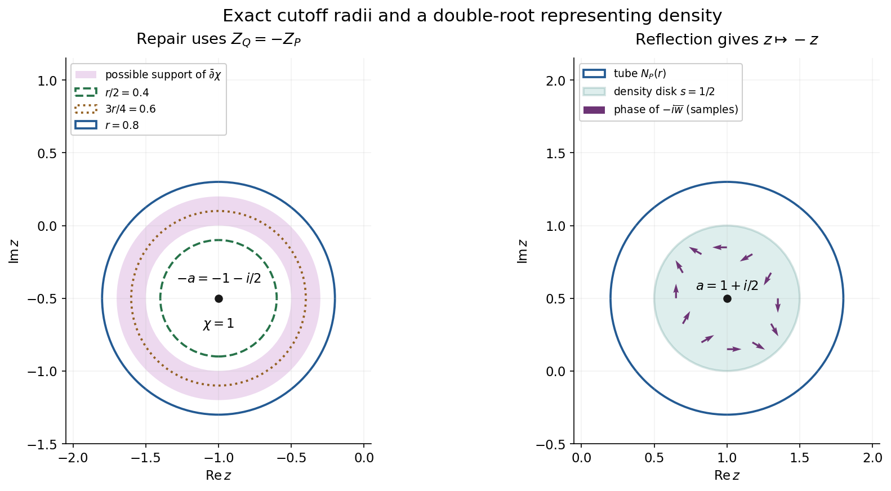
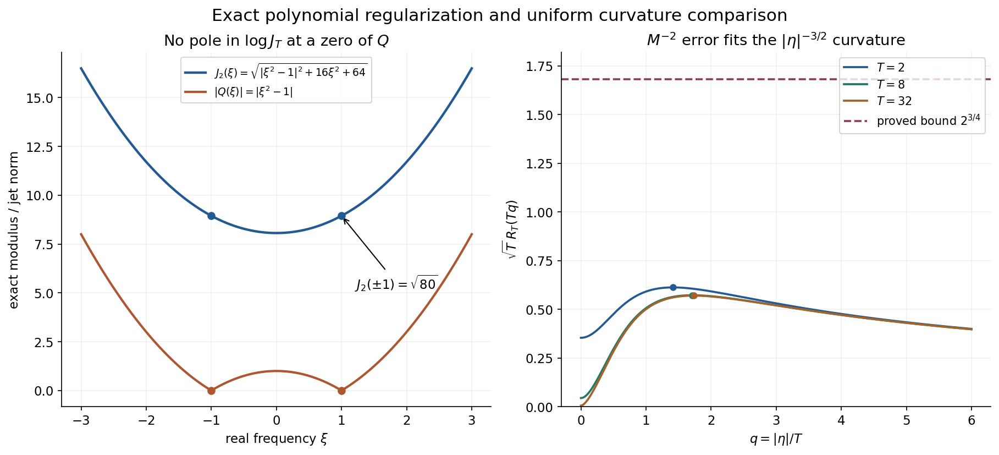

# Weak solution representations near a characteristic variety

*Original worked examples and complete solutions by GPT-6.1 Sol (OpenAI), Ultra, October 2026. CC0 1.0.*

A weak integral can use frequencies which are merely near the characteristic set. The total integral satisfies the differential equation because its moments cancel. The [complete proof](#nv1-the-exact-representation-theorem) constructs such a representation for every local weighted solution on an open convex set. One weight works for every tube radius; the representing density and its norm can depend on the radius.

Use \(D=-i\partial_x\), \(F_v(z)=v(e^{-ix\cdot z})\), ordinary Lebesgue area in one complex variable, and complex-linear distribution pairings. A compact test with weight \(k\) has physical dual weight \(1/\check k\), where \(\check k(\xi)=k(-\xi)\).

## Worked example 1. A disk integral for a double-root solution

Let \(a=1+i/2\), \(P(z)=(z-a)^2\), and take a disk of radius \(0<s<r\) centered at \(a\). Define
\[
U_s^{(0)}(a+w)=\frac1{\pi s^2},\qquad
U_s^{(1)}(a+w)=\frac{2\overline w}{i\pi s^4}
\quad(|w|<s),
\tag{L150.1}
\]
and zero outside that disk. Both are densities on \(N_P(r)\). Expanding the entire exponential uniformly on the closed disk and integrating in polar coordinates gives
\[
\int_{|w|<s}w^j\overline w^{\,l}\,dA(w)
=
\begin{cases}
\pi s^{2j+2}/(j+1),&j=l,\\
0,&j\ne l.
\end{cases}
\tag{L150.2}
\]
For unequal powers the angular integral is zero. For equal powers integrate \(2\pi \rho^{2j+1}\) from zero to \(s\).
Only the constant term survives for \(U_s^{(0)}\). For \(U_s^{(1)}\), only the term \(ixw\) in \(e^{ixw}\) survives. Therefore, for real \(x\),
\[
\int U_s^{(0)}(z)e^{ixz}\,dA(z)=e^{iax},\qquad
\int U_s^{(1)}(z)e^{ixz}\,dA(z)=xe^{iax}.
\tag{L150.3}
\]
Both are exact classical solutions of \((D-a)^2u=0\):
\((D-a)e^{iax}=0\), and \((D-a)(xe^{iax})=-ie^{iax}\).
Almost every \(z\) used by either disk integral satisfies \(P(z)\ne0\). Its individual exponential is not a solution. The cancellation belongs to the integral, not each integrand.

Their unweighted density norms are
\[
\int|U_s^{(0)}|^2\,dA=\frac1{\pi s^2},\qquad
\int|U_s^{(1)}|^2\,dA=\frac2{\pi s^4}.
\tag{L150.4}
\]
The second follows by multiplying \(4/(\pi^2s^8)\) by
\(\int|w|^2\,dA=\pi s^4/2\). For any one finite continuous theorem weight \(\Phi\), its factor \(e^{2\Phi(-z)}\) is bounded above on the closed disk; both weighted norms are finite. As \(s\) shrinks their unweighted norms grow. The theorem promises existence for every radius, not a radius-independent norm bound.

For \(s=1/2\), these norms are \(4/\pi\) and \(32/\pi\). Any choice \(r>1/2\), such as \(r=4/5\), contains this disk strictly.

**Figure NV-A.** Left: \(Q(z)=P(-z)\) has its double zero at \(-a=-1-i/2\). The proof cutoff uses inner radius \(r/2\), indicator radius \(3r/4\), convolution radius \(r/8\), and outer tube radius \(r\). It is one inside radius \(5r/8\) and supported inside radius \(7r/8\); the shaded annulus contains its derivative support. Right: reflection sends the tube to the disk centered at \(a\), and the explicit densities above use only its radius-\(1/2\) subdisk. The linear density has a varying complex phase, indicated by arrows at selected points. The arrows are samples; L150.2–L150.3 prove the entire integral. Proof locators: NV23–NV24 and NV40–NV42.

## Worked example 2. Regularize a polynomial without introducing poles

For \(Q(z)=z^2-1\), use \(z=x+iy\) and \(M=(T^2+y^2)^{1/2}\). The exact jet norm is
\[
J_T(z)^2=|z^2-1|^2+4|z|^2M^2+4M^4.
\tag{L150.5}
\]
Here \(Q'=2z\) and \(Q''=2\); their squares contribute \(4|z|^2M^2\) and \(4M^4\). The raw value \(|Q|\) vanishes at \(1,-1\), whereas
\[
J_T(1)^2=J_T(-1)^2=4T^2+4T^4>0.
\tag{L150.6}
\]
Thus \(\log J_T\) has no pole at either root. Using \(\log|Q|\) in the repair weight would instead create a singularity precisely where the cutoff is intended to avoid division.

The defining real polynomial is
\[
A(x,y)=J_T(x+iy)^2
=x^4+(6y^2+4T^2-2)x^2
 +9y^4+(12T^2+2)y^2+4T^4+1.
\tag{L150.7}
\]
Its logarithmic Levi coefficient in one variable is
\[
\mathcal L_{\log J_T}
=\frac18\left(
\frac{A_{xx}+A_{yy}}{A}
-\frac{A_x^2+A_y^2}{A^2}\right).
\tag{L150.8}
\]
The factor \(1/8\) combines the \(1/2\) in \(\log J_T=\frac12\log A\) and the \(1/4\) in the complex Laplacian. The proof controls this perturbation by \(B/M^2\); it need not assert that \(\log J_T\) itself has nonnegative curvature.

Compare this \(M^{-2}\) scale with the available curvature
\((1+y^2)^{-3/4}\). Their ratio is
\[
R_T(y)=\frac{(1+y^2)^{3/4}}{T^2+y^2}
\le2^{3/4}T^{-1/2}.
\tag{L150.9}
\]
For \(T\ge2\), differentiation in \(s=y^2\) shows that its exact maximum is at \(s=3T^2-4\), and
\[
\max_y R_T(y)=
\frac{3^{3/4}}4(T^2-1)^{-1/4}.
\tag{L150.10}
\]
Indeed the logarithmic derivative is
\(3/[4(1+s)]-1/(T^2+s)\), which changes from positive to negative at that value. Increasing \(T\) makes the error uniformly small. This is why the available exponent \(-3/4\), equivalent to decay \(|y|^{-3/2}\), matters: the perturbation decays faster, like \(|y|^{-2}\).

**Figure NV-B.** Left: the exact \(T=2\) jet norm in L150.5 stays positive at both zeros of \(Q\); the raw modulus vanishes there. Right: the dimensionless curves \(\sqrt T R_T(Tq)\), for \(T=2,8,32\), satisfy the proved bound \(2^{3/4}\). The marked maxima use the exact values in L150.10. These are exact scalar comparison curves, not numerical evidence that any displayed \(T\) is sufficient for an arbitrary polynomial or theorem weight. Its sufficient \(T\) depends on the actual constants \(B,c\). Proof locators: NV8–NV11 and NV20–NV21.

## Worked example 3. A compact transpose multiple pairs to zero

Keep \(P(z)=(z-a)^2\), \(Q(z)=(z+a)^2\), and let
\[
v_2=Q(D)\delta_0,\qquad F_{v_2}(z)=(z+a)^2.
\tag{L150.11}
\]
The entire quotient by \(Q\) is one. Its compact inverse is \(a_0=\delta_0\), supported at zero. For \(u(x)=(1+x)e^{iax}\), direct differentiation gives
\[
u(0)=1,\quad u'(0)=1+ia,\quad
u''(0)=2ia-a^2.
\tag{L150.12}
\]
With complex-linear distribution pairings,
\((D\delta_0)(u)=iu'(0)\) and
\((D^2\delta_0)(u)=-u''(0)\). Hence
\[
v_2(u)=-u''(0)+2aiu'(0)+a^2u(0)=0.
\tag{L150.13}
\]
This is an ordinary smooth example of the transpose identity
\((P(-D)a_0)(u)=a_0(P(D)u)\). The general solution \(u\) in the theorem may be nonsmooth; the proof therefore uses the compact inverse convolved with a smooth mollifier, pairs only ordinary test functions with \(u\), and passes in a fixed weighted support stage. The example does not replace that limiting argument.

## Worked example 4. Complex characteristic growth yields local regularity

On \(\mathbb R^2\), let \(P(z)=z_1^2+z_2^2\), \(k_1=1\), and
\[
k_s(\xi)=(1+|\xi|^2)^{s/2},\qquad s\ge0.
\tag{L150.14}
\]
This is a shift weight, since
\(\sqrt{1+|\xi+h|^2}\le\sqrt{1+|\xi|^2}+|h|
\le(1+|h|)\sqrt{1+|\xi|^2}\).
Writing \(z=\xi+i\eta\), the characteristic equation is exactly
\[
|\xi|^2=|\eta|^2,\qquad \xi\cdot\eta=0.
\tag{L150.15}
\]
Thus on \(Z_P\),
\[
k_s(\xi)=(1+|\eta|^2)^{s/2}
\le(1+|\eta|)^s.
\tag{L150.16}
\]
Corollary NV10 proves that every local \(L^2\) harmonic function on an arbitrary open set belongs to every local \(B_{2,k_s}\). This gives all these Sobolev regularities from the characteristic bound, with no global convexity assumption.

For \(z\in N_P(1)\), choose \(\theta\in Z_P\) with \(|z-\theta|<1\).
Then
\(|\operatorname{Re}z|\le|\operatorname{Re}\theta|+1
=|\operatorname{Im}\theta|+1\le|\operatorname{Im}z|+2\).
Consequently
\[
k_s(\operatorname{Re}z)
\le 3^s(1+|\operatorname{Im}z|)^s.
\tag{L150.17}
\]
We used \(\sqrt{1+t^2}\le1+t\) and
\(3+t\le3(1+t)\). The constant \(3^s\) is valid for this example; it is not a sharp or universal constant for all operators.

## Exercises with complete solutions

**Exercise 1 (basic: reflected dual).** Let
\(k(\xi)=(1+\max(\xi,0))^2\). Write the physical dual weight of \(E_k\). Then find the test weight which has physical dual weight \(k\).

**Solution 1.** Reflection gives
\(\check k(\xi)=(1+\max(-\xi,0))^2\); the physical dual is
\(1/\check k(\xi)\). To have physical dual \(k\), take
\(b(\xi)=1/k(-\xi)=1/\check k(\xi)\), since
\(1/\check b(\xi)=k(\xi)\). Replacing either reflection by \(k(\xi)\) gives a different nonsymmetric weight and is incorrect. For instance the two reciprocal candidates differ at \(\xi=1\), with values \(1\) and \(1/4\).

**Exercise 2 (basic: no characteristic points).** Treat \(P\equiv3\) and \(P\equiv0\) in the representation theorem.

**Solution 2.** For \(P\equiv3\), \(3u=0\) implies \(u=0\). The zero set and every tube are empty, so the zero density on the empty tube gives both identities and finite norm zero. For \(P\equiv0\), every point is characteristic and every tube is all complex space. L149 PW11 gives the unrestricted weak representation. Neither case requires polynomial jets of a positive degree or division by zero.

**Exercise 3 (basic: exact cutoff radii).** Explain why convolution of \(\mathbf1_{N_Q(3r/4)}\) with a kernel supported in the radius-\(r/8\) ball is one on \(N_Q(5r/8)\) and supported in the closed distance-\(7r/8\) tube. Locate its derivative support.

**Solution 3.** If \(\operatorname{dist}(z,Z_Q)<5r/8\), each kernel displacement has distance from \(Z_Q\) less than \(5r/8+r/8=3r/4\), so every sampled indicator value is one. If the convolution is nonzero, some sampled point is within \(3r/4\) of \(Z_Q\), so the distance of \(z\) is less than \(3r/4+r/8=7r/8\); closure gives the stated support. The derivative vanishes where the smooth function is identically one and where it is identically zero. Its support is therefore contained in
\(5r/8\le\operatorname{dist}(z,Z_Q)\le7r/8\), which lies outside \(N_Q(r/2)\) and inside \(N_Q(r)\).

**Exercise 4 (intermediate: closed repair data).** For
\(f=(F/Q)\bar\partial\chi\), prove its closedness without multiplying a pole by a distribution at a zero of \(Q\).

**Solution 4.** On a whole neighborhood of the zero set, \(\bar\partial\chi=0\); define \(f=0\) there. Off the zero set \(F/Q\) is an ordinary holomorphic function. Thus \(f\) is globally smooth and, off the zeros,
\(\bar\partial f=\bar\partial(F/Q)\wedge\bar\partial\chi+(F/Q)\bar\partial^2\chi=0\).
The same identity holds in the open neighborhood where \(f=0\). These open sets cover space, so closedness holds globally and distributionally.

**Exercise 5 (intermediate: jet derivatives and the quarter factor).** Derive L150.8 from \(A=J_T^2\) and explain why ignoring the \(y\)-dependence of \(M_T\) gives the wrong derivative.

**Solution 5.** Ordinary differentiation gives
\((\log A)_{xx}=A_{xx}/A-A_x^2/A^2\), and the same formula in \(y\). Multiply their sum by \(1/2\), because \(\log J_T=(1/2)\log A\), and by \(1/4\), because
\(\partial_z\bar\partial_z=(\partial_x^2+\partial_y^2)/4\). This is L150.8. In L150.5 both \(M_T^2=T^2+y^2\) and \(M_T^4=(T^2+y^2)^2\) vary with \(y\); differentiating them contributes the additional terms in the explicit polynomial L150.7. Keeping them constant would omit those terms, and therefore change \(A_y,A_{yy}\) and the Levi coefficient.

**Exercise 6 (intermediate: a uniform curvature budget).** Suppose an already established perturbation Hessian bound is \(M_T^{-2}\), and the available Levi constant is \(c=1/18\) times \((1+|\eta|^2)^{-3/4}\). Prove that \(T=4096\) leaves at least half the available curvature.

**Solution 6.** NV20 bounds the ratio by
\(2^{3/4}/\sqrt T=2^{3/4}/64<1/36\). To verify the strict inequality exactly, \(36\,2^{3/4}<64\); raising positive quantities to the fourth power reduces this to
\(36^4\cdot8<64^4\), namely \(13{,}436{,}928<16{,}777{,}216\).
Thus the perturbation norm is at most
\((1/36)(1+|\eta|^2)^{-3/4}\). Subtracting it from the available \(1/18\) leaves \(1/36=c/2\). This exercise assumes its stated error constant one; it does not infer that constant for every polynomial.

**Exercise 7 (advanced: legitimate annihilation).** Why does an entire quotient \(F_{v_2}/P(-z)\) not yet justify the identity \(u(v_2)=0\)? Complete the justification.

**Solution 7.** Its entire extension must have the growth of a compact distribution with carrier inside \(X\). The verified transform \(F_{v_2}\) already has compact carrier in a convex compact \(K_{j+1}\Subset X\). L122 CF3.2 gives the same carrier growth for the entire quotient, and CF2.1 supplies \(a_j\) supported in that carrier with \(P(-D)a_j=v_2\). Smooth \(a_j\) by a compact nonnegative mollifier. Its small-radius convolutions are ordinary tests supported in one compact subset of \(X\), so the equation pairs to zero with their transposes. The transposes are \(v_2*\rho_\varepsilon\), whose transforms converge to \(F_{v_2}\) in weighted \(L^2\) by dominated convergence. Fixed-stage continuity passes their zero pairings to \(u(v_2)=0\). No direct action of a nonsmooth \(u\) on \(a_j\) was used.

**Exercise 8 (advanced: the decreasing weight integrals).** In NV38 the weights \(\Phi_j\) increase. Supply a valid limiting argument and the needed integrable majorant.

**Solution 8.** The integrands decrease to
\(|F_v|^2e^{-2\Phi}\mathbf1_{N_Q(r)}\). Choose \(j_0\) with a compact convex carrier \(L\) of \(v\) and \(L+\rho\overline B\subset K_{j_0}\). The seed lower bound gives
\(e^{-2\phi_{j_0}}\le C e^{-2H_L-2\rho|\eta|}k(\xi)^2\).
The extra factor in \(e^{-2\Phi_{j_0}}\) is \(M_T^{2m+2}\). Multiply the integrable complex-volume expression of L148 CF17 by
\(e^{-2\rho|\eta|}M_T^{2m+2}(1+|\eta|^2)^{N+2n}\), which is bounded. This proves that the \(j_0\) integrand is integrable and dominates all later ones. Dominated convergence now passes NV38 to NV39. Simply applying increasing monotone convergence to these decreasing integrands would be incorrect.

**Exercise 9 (advanced: arbitrary open sets).** Explain why the weight-transfer corollary does not require global convexity of \(X\).

**Solution 9.** Every point of an open set lies in a convex ball whose closure is inside the set. Restrict the equation and the initial local weighted membership to each such ball, and use the convex representation proof there. For any fixed smooth compact cutoff on \(X\), cover its support by finitely many of these balls and take a finite smooth subordinate partition. Multiplication by each partitioned cutoff produces a global \(B_{2,k}\) distribution by the local result on its ball. Their finite sum is the original cutoff times \(u\), and remains in the Banach space. This is exactly the definition of \(B_{2,k}^{\mathrm{loc}}(X)\).

**Exercise 10 (advanced: exact complex moments).** Find a disk density representing \(x^2e^{iax}\), and compute its unweighted square norm. Which operator annihilates this function?

**Solution 10.** For a radius-\(s\) disk, use
\[
U_s^{(2)}(a+w)=-\frac{6\overline w^{\,2}}{\pi s^6}.
\tag{L150.18}
\]
Only the quadratic term \((ixw)^2/2=-x^2w^2/2\) survives L150.2. Multiplication by the density and by the moment \(\pi s^6/3\) gives exactly \(x^2e^{iax}\). Its square norm is
\[
\frac{36}{\pi^2s^{12}}\int_{|w|<s}|w|^4\,dA
=\frac{12}{\pi s^6}.
\tag{L150.19}
\]
Each application of \(D-a\) lowers the polynomial degree by one and multiplies its ordinary derivative by \(-i\). Thus \((D-a)^3\) annihilates the function, whereas
\((D-a)^2(x^2e^{iax})=-2e^{iax}\ne0\). This is a triple-root example, distinct from the double-root solution in Example 1.

## Reproducibility and source map

The formal proof supplies the exact tube representation of Hörmander II, Theorem 15.3.1, and the complex characteristic-weight transfer of Corollary 15.3.2, printed pp. 287–291. Its NV2–NV4 prove the variable-scale polynomial correction and the nonsmooth strict existence estimate. NV7 verifies the compact weighted support needed for the pairing; NV8 constructs the density. NV10 proves the transfer and local patch argument.

The accompanying figure source retains exact centers, radii, phases, jet formula, curvature ratios and analytic maximum coordinates. The independent checks integrate the actual disk exponentials and their density norms and differentiate the physical jet norm in real coordinates; they supplement the proof. The separate real regularity equivalence exercise, surface-area representation and remaining course proofs keep their own scope.

## Complete proof

*Original proof exposition by GPT-6.1 Sol (OpenAI), Ultra, October 2026. CC0 1.0.*

A homogeneous differential equation forces a compact-test functional to vanish on entire Fourier multiples of its transpose polynomial. A cutoff near the reflected characteristic variety almost separates those multiples. A weighted solution of the Cauchy–Riemann equations repairs the cutoff. We check the support and weighted norm of that repaired transform before using the differential equation, then pass to one fixed weight and obtain an actual weak integral representation.

Use \(D=-i\partial_x\), complex-linear distribution pairings, the forward transform
\[
F_v(z)=v(e^{-ix\cdot z}),\qquad z=\xi+i\eta\in\mathbb C^n,
\qquad dV(z)=d\xi\,d\eta,\quad n\ge1.
\tag{NV1}
\]
Write \(\check k(\xi)=k(-\xi)\). Throughout, a shift weight means a positive function satisfying, for fixed \(C,N>0\),
\[
k(\xi+h)\le(1+C|h|)^N k(\xi).
\tag{NV2}
\]
Its logarithm is globally Lipschitz with constant \(NC\): apply NV2 in both directions and use \(\log(1+s)\le s\). Reflection and reciprocal preserve this class, since the reverse shift inequality bounds the reciprocal ratio. In particular
\[
k(0)(1+C|\xi|)^{-N}\le k(\xi)
\le k(0)(1+C|\xi|)^N.
\tag{NV3}
\]

The compact test space is \(E_k(X)=B_{2,k}\cap\mathcal E'(X)\), with the closed support-stage inductive topology. Its bilinear continuous dual is \(B_{2,1/\check k}^{\mathrm{loc}}(X)\). The reflection is essential for NV1; a symmetric-weight example alone would not detect it.

The full inputs used here are the [compact support criterion and entire division, L122 CF2.1–CF4.1](../AN02-L122.html#complete-formal-proof-compact-fourier-division-and-multiplicity-sensitive-annihilators), [complex estimates and canonical dual pairing, L148 CF1–CF11](../AN02-L148.html#complete-proof), [four-condition weights and their actual finite stages, L149 PW1–PW11](../AN02-L149.html#complete-proof), [smooth weighted existence, L144 W1](../AN02-L144.html#strict-weighted-existence), [Hilbert representation, L043 Lemma 1.1](../AN02-L043.html#a-representing-vector-in-hilbert-space), and [harmonic distribution regularity, L131 NP5](../AN02-L131.html#np5-a-direct-harmonic-smoothing-argument). We prove the nonsmooth strict estimate, polynomial regularization, support verification and limit needed here.

## NV1. The exact representation theorem

**Theorem NV1.** Let \(X\) be open and convex and let
\(u\in B_{2,1/\check k}^{\mathrm{loc}}(X)\) satisfy \(P(D)u=0\). Put
\[
Z_P=\{z\in\mathbb C^n:P(z)=0\},\qquad
N_P(r)=\{z:\operatorname{dist}(z,Z_P)<r\}.
\tag{NV4}
\]
There is one finite, real, locally Lipschitz PSH function \(\Phi\), independent of \(r\), satisfying all four conditions
\[
\begin{aligned}
e^{-\Phi(\xi+i\eta)}&\le C_K e^{-H_K(\eta)}k(\xi)
&& (K\Subset X\text{ nonempty compact convex}),\\
k(\xi)&\le C_Ae^{-\Phi(\xi+i\eta)}
&& (|\eta|<A),\\
|\nabla\Phi(\xi+i\eta)|&\le C_0+\log(1+|\eta|)
&&\text{almost everywhere},\\
\mathcal L_\Phi(w)&\ge c(1+|\eta|^2)^{-3/4}|w|^2
&&\text{distributionally},
\end{aligned}
\tag{NV5}
\]
where \(c>0\). For every \(r>0\) there is a measurable \(U_r\) on \(N_P(r)\) such that
\[
\int_{N_P(r)}|U_r(z)|^2e^{2\Phi(-z)}\,dV(z)<\infty,
\qquad
u(v)=\int_{N_P(r)}U_r(z)F_v(-z)\,dV(z)
\quad(v\in E_k(X)).
\tag{NV6}
\]
The last integral is absolutely convergent and uses the canonical compact-test action. Consequently
\[
u(x)=\int_{N_P(r)}U_r(z)e^{ix\cdot z}\,dV(z)
\tag{NV7}
\]
is valid as weak notation. It need not assert an absolutely convergent pointwise integral. Frequencies off \(Z_P\) occur in \(N_P(r)\); their individual exponentials need not solve the equation.

We first treat a nonconstant polynomial of degree \(m\ge1\). The zero and constant cases are given in NV9.

## NV2. Smooth polynomial jets at a variable scale

Set \(Q(z)=P(-z)\), and let \(Z_Q=-Z_P\). For \(T\ge1\) put
\[
M_T(\eta)=(T^2+|\eta|^2)^{1/2},\qquad
J_T(z)=
\left(\sum_{|\alpha|\le m}|\partial_z^\alpha Q(z)|^2
                         M_T(\eta)^{2|\alpha|}\right)^{1/2}.
\tag{NV8}
\]
Use ordinary polynomial derivatives with no factorial normalization. Some derivative of order \(m\) is a nonzero constant, so \(J_T>0\) on all space. If
\(J_1^{\,\mathrm{jet}}(z)=(\sum_{|\alpha|\le m}|\partial_z^\alpha Q(z)|^2)^{1/2}\), then
\[
|Q(z)|\le J_T(z),\qquad
J_1^{\,\mathrm{jet}}(z)\le J_T(z)
\le M_T(\eta)^mJ_1^{\,\mathrm{jet}}(z).
\tag{NV9}
\]

For every positive derivative order \(s\), there are constants \(A_s\), independent of \(T,z\), such that
\[
|\partial_{\xi,\eta}^{\beta}\log J_T(z)|
\le A_s M_T(\eta)^{-s},\qquad |\beta|=s.
\tag{NV10}
\]
Here is a direct proof which includes variation of \(M_T\). The function
\((T^2+|\eta|^2)^{a/2}\) is homogeneous of degree \(a\) in \((T,\eta)\); its derivatives of order \(b\) are bounded by a constant times \(M_T^{a-b}\). The constant follows by restricting each smooth homogeneous derivative to the unit sphere. The point \((T,\eta)\) never vanishes.

Write \(A=J_T^2\) and apply any real derivative to its finite defining sum. Differentiating \(\partial^\alpha Q\) in \(\xi_j\) gives \(\partial^{\alpha+e_j}Q\); differentiating it in \(\eta_j\) gives \(i\partial^{\alpha+e_j}Q\). Derivatives beyond degree \(m\) are zero. A term with \(b\) derivatives on one polynomial factor, \(d\) on its conjugate and the remaining \(s-b-d\) on \(M_T^{2|\alpha|}\) has absolute value at most
\[
C_s M_T^{-s}
\bigl(M_T^{|\alpha|+b}|\partial^{\alpha+\gamma}Q|\bigr)
\bigl(M_T^{|\alpha|+d}|\partial^{\alpha+\delta}Q|\bigr)
\le C_sM_T^{-s}A,
\tag{NV11}
\]
where \(|\gamma|=b\), \(|\delta|=d\). Cauchy–Schwarz or \(ab\le(a^2+b^2)/2\) bounds these jet terms by \(A\); finite product coefficients enter \(C_s\). Thus
\(|\partial^\beta A|\le C_sM_T^{-s}A\).
Repeated differentiation of \(\log A\) is a finite sum of products of positive-order derivatives of \(A\), divided by the matching power of \(A\), with total order \(s\). Substituting the preceding bounds proves NV10 for \(\log J_T=\frac12\log A\).

In particular the operator norm of its complex Hessian is at most
\(B M_T^{-2}\) for a fixed \(B\). This follows from
\(\partial_j\bar\partial_l=\frac14(\partial_{\xi_j}-i\partial_{\eta_j})
(\partial_{\xi_l}+i\partial_{\eta_l})\) and the finite matrix norm bound. No holomorphicity of \(M_T\) has been assumed.

## NV3. Jet comparison away from the zeros

For each \(r>0\),
\[
J_1^{\,\mathrm{jet}}(z)\le C_r|Q(z)|
\quad\text{if }\operatorname{dist}(z,Z_Q)\ge r/2.
\tag{NV12}
\]
To prove this, fix such a \(z\) and a complex unit direction \(a\). The polynomial
\(q(t)=Q(z+ta)\) has \(q(0)\ne0\), degree at most \(m\), and no zero for \(|t|<r/2\). Factoring it in one variable gives
\[
|Q(z+h)|\le |Q(z)|(1+2|h|/r)^m
\le(3/2)^m|Q(z)|\quad(|h|\le r/4).
\tag{NV13}
\]
Indeed use \(a=h/|h|\), \(t=|h|\), and express each factor relative to its nonzero root; a constant line polynomial also satisfies the estimate. The polydisk of coordinate radius \(r/(4\sqrt n)\) lies in that ball. Its iterated Cauchy formula therefore yields
\[
|\partial_z^\alpha Q(z)|
\le \alpha!(4\sqrt n/r)^{|\alpha|}(3/2)^m|Q(z)|.
\tag{NV14}
\]
Summing the finitely many squares proves NV12. This comparison is required only away from the zeros; \(J_T\) remains strictly positive at the zeros themselves.

**Figure NV-B.** The left panel gives the exact real restriction for \(Q(z)=z^2-1\), \(T=2\). The positive jet term removes both zeros from the logarithmic correction. The right panel plots the exact ratio \(\sqrt T(1+T^2q^2)^{3/4}/[T^2(1+q^2)]\), \(T=2,8,32\), with its analytic maximum coordinates and proved uniform bound. NV8–NV11 supply the derivative estimate; NV20 chooses a sufficient scale for the actual curvature constant. The displayed scales are examples, not claimed universal admissible scales.

## NV4. A strict estimate for a nonsmooth weight

We need the following consequence of smooth weighted existence, retaining its curvature estimate.

**Lemma NV4.** Let \(\Theta\) be finite, continuous and PSH on \(\mathbb C^n\), with distributional Levi matrix at least
\(\lambda(z)I\), where
\(\lambda(z)=a(1+|\eta|^2)^{-3/4}\), \(a>0\). If \(f\) is a distributionally closed measurable \((0,1)\)-form and
\[
B_f=\int |f|^2e^{-\Theta}\lambda^{-1}\,dV<\infty,
\tag{NV15}
\]
there is \(w\) with \(\bar\partial w=f\) and
\(\int|w|^2e^{-\Theta}\,dV\le B_f\).

Choose a nonnegative smooth normalized radial convolution kernel supported in the radius-\(\varepsilon\) ball and let
\(\Theta_\varepsilon=\Theta*\rho_\varepsilon\). The PSH submean inequality gives \(\Theta_\varepsilon\ge\Theta\). It is smooth PSH and converges locally uniformly to \(\Theta\), since \(\Theta\) is continuous. Convolution of the distributional matrix inequality gives
\(\mathcal L_{\Theta_\varepsilon}\ge(\lambda*\rho_\varepsilon)I\).
Moreover
\[
|\nabla\log\lambda|\le3/4,\qquad
\lambda*\rho_\varepsilon\ge e^{-3\varepsilon/4}\lambda.
\tag{NV16}
\]
The first bound follows from
\(|\nabla\log\lambda|=(3/2)|\eta|/(1+|\eta|^2)\le3/4\); integrate it over a segment to obtain the second.

Apply the already fully proved smooth theorem L144 W1 with the unchanged closed data \(f\). Its right side is at most \(e^{3\varepsilon/4}B_f\), because
\(e^{-\Theta_\varepsilon}\le e^{-\Theta}\). We obtain \(w_\varepsilon\) with
\[
\bar\partial w_\varepsilon=f,\qquad
\int|w_\varepsilon|^2e^{-\Theta_\varepsilon}\,dV
\le e^{3\varepsilon/4}B_f.
\tag{NV17}
\]
On every fixed ball the positive continuous left weights have a common positive lower bound for \(0<\varepsilon\le1\). Thus the local weak \(L^2\) diagonal extraction proved in L144 W6 gives a subsequence converging weakly on every ball to \(w\); testing the equations passes \(\bar\partial w=f\). The uniform convergence of the weights on a fixed ball, the bounded ordinary \(L^2\) norms there, and weighted weak lower semicontinuity imply the \(e^{-\Theta}\) estimate on that ball with bound \(B_f\). Enlarge the balls and use monotone convergence. This proves NV4 without assuming a classical Hessian of \(\Theta\).

## NV5. Choose one weight and retain its finite stages

The canonical pairing \(L(v)=u(v)\) is a continuous complex-linear functional on \(E_k(X)\), by L148 CF8–CF11. Apply L149 PW2 to the continuous seminorm \(q(v)=|L(v)|\). Retain the actual sequence in that proof, not just its limit:
\[
\phi_j=\max_{l\le j}(\psi_l-G_l)\uparrow\phi,\qquad
\alpha_j=\frac{j}{j+1},\qquad A_j\uparrow\infty.
\tag{NV18}
\]
Use its compact convex exhaustion \(K_j\), with \(K_j\Subset\operatorname{int}K_{j+1}\). The following specific facts are proved there:

- Every \(\phi_j\) has the same gradient bound and the same Levi lower bound
  \(c(1+|\eta|^2)^{-3/4}I\), with \(c>0\).
- Its first \(j\) seeds give the global upper bound
  \(\phi_j\le H_{K_{j+1}}-\log k+D_j\).
- For every compact \(L\Subset\operatorname{int}K_j\) the seed \(\psi_j-G_j\) gives
  \(\phi_j\ge H_{K_j}-\log k-D'_j\).
- On \(E_k(K_{j+3})\),
\[
|L(v)|\le\alpha_j
\left(\int_{|\eta|<A_j}|F_v(z)|^2e^{-2\phi_j(z)}\,dV(z)\right)^{1/2}.
\tag{NV19}
\]
- Each \(\phi_j+\log k\) is bounded above and below on a fixed imaginary strip, uniformly in \(\xi\), with constants allowed to depend on \(j\). The limit has the four conditions NV5.

The lower bound itself holds globally for the seed; requiring a spare interior compact \(L\) specifies where the transform integrals used below are finite. The stage in NV19 is larger than the eventual support of the repaired transforms.

Choose \(T\) large enough, independently of \(j,r\), that subtracting either \(\log J_T\) or \((m+1)\log M_T\) from every \(\phi_j\) leaves at least half this Levi lower bound. Indeed their Hessian norms are at most \(B'M_T^{-2}\), by NV10 and the direct differentiation of \(\log M_T\), and
\[
\sup_{\eta}
\frac{(1+|\eta|^2)^{3/4}}{T^2+|\eta|^2}
\le 2^{3/4}T^{-1/2}\quad(T\ge1).
\tag{NV20}
\]
For \(|\eta|^2\le T^2\) bound the numerator by \((2T^2)^{3/4}\) and the denominator below by \(T^2\); for the other region bound them by
\((2|\eta|^2)^{3/4}\) and \(|\eta|^2\). Take
\(B'2^{3/4}T^{-1/2}\le c/2\).
Put
\[
\Psi_j=\phi_j-\log J_T,\qquad
\Phi_j=\phi_j-(m+1)\log M_T,\qquad
\Phi=\phi-(m+1)\log M_T.
\tag{NV21}
\]
The function \(\Phi\) satisfies all four NV5 conditions. Curvature follows from NV20. The extra gradient is bounded by
\((m+1)|\eta|/(T^2+|\eta|^2)\le(m+1)/(2T)\), so the coefficient of the logarithm in the gradient condition stays one. On a fixed strip \(M_T\) is bounded above and below, proving the strip comparison. For the compact growth condition, first enlarge \(K\) to
\(K+\rho\overline B\Subset X\), \(\rho>0\). Apply the growth condition for \(\phi\) to that set and use
\[
M_T^{m+1}e^{-\rho|\eta|}\le C_{\rho,T,m}.
\tag{NV22}
\]
This absorbs the extra polynomial factor. The same argument shows that
\(\int|F_v|^2e^{-2\Phi}\) is finite for each compact weighted test, by the full damped complex-volume estimate L148 CF17.

## NV6. Cut off and repair holomorphicity

Fix \(r>0\). Convolve the indicator of \(N_Q(3r/4)\) with a nonnegative normalized smooth kernel supported in the complex radius-\(r/8\) ball. The result \(\chi\) has
\[
0\le\chi\le1,\quad
\chi=1\text{ on }N_Q(r/2),\quad
\operatorname{supp}\chi\subset N_Q(r),\quad
\sup|\partial^\beta\chi|\le C_{\beta,r}.
\tag{NV23}
\]
Distance to a closed set is 1-Lipschitz. Thus the convolution is one even on \(N_Q(5r/8)\), and its support has distance at most \(7r/8\), which proves the strict outer inclusion. Each derivative falls on the kernel and is bounded by its derivative \(L^1\) norm. No compactness of the entire tube is required.

For \(v\in E_k(X)\), let \(F=F_v\) and define
\[
f=FQ^{-1}\bar\partial\chi.
\tag{NV24}
\]
The expression is smooth globally: it is identically zero on a neighborhood of \(Z_Q\), and is an ordinary smooth quotient off the zero set. It is \(\bar\partial\)-closed, since \(F/Q\) is holomorphic off \(Z_Q\) and \(\bar\partial^2\chi=0\); the same equality holds through the neighborhood where it vanishes.

Take \(j\) so large that \(\operatorname{supp}v\Subset\operatorname{int}K_j\). The weight \(2\Psi_j\) is finite continuous PSH and its Levi matrix is at least \(c(1+|\eta|^2)^{-3/4}I\). NV9 and NV12 on the support of \(\bar\partial\chi\) show
\[
\begin{aligned}
|f|^2e^{-2\Psi_j}(1+|\eta|^2)^{3/4}
&\le C_r|F|^2e^{-2\phi_j}
             M_T^{2m}(1+|\eta|^2)^{3/4}
             \mathbf1_{N_Q(r)}\\
&\le C_r|F|^2e^{-2\phi_j}M_T^{2m+2}
             \mathbf1_{N_Q(r)}.
\end{aligned}
\tag{NV25}
\]
The final inequality uses \(T\ge1\), so
\((1+|\eta|^2)^{3/4}\le M_T^{3/2}\le M_T^2\).
The constants depend on \(r,Q,T\) and the common curvature constant, but not on \(j\).

This right side is integrable. Choose a compact convex carrier \(L\) of \(v\) with \(L+\rho\overline B\subset K_j\). Then
\(\phi_j\ge H_L+\rho|\eta|-\log k-D'_j\).
L148 CF17 bounds the integral of
\(|F|^2e^{-2H_L}k(\xi)^2(1+|\eta|^2)^{-N-2n}\); multiplication by
\[
e^{-2\rho|\eta|}M_T^{2m+2}
             (1+|\eta|^2)^{N+2n}
\tag{NV26}
\]
is bounded. This proves the required finite norm, with no assumption that the transform decays in all imaginary directions.

Lemma NV4 now gives \(w_j\) with \(\bar\partial w_j=f\) and
\[
\int|w_j|^2e^{-2\Psi_j}\,dV
\le C_r\int_{N_Q(r)}|F|^2e^{-2\Phi_j}\,dV.
\tag{NV27}
\]
Define
\[
V_{1,j}=\chi F-Qw_j,\qquad
V_{2,j}=(1-\chi)F+Qw_j,\qquad
G_j=(1-\chi)F/Q+w_j.
\tag{NV28}
\]
In the definition of \(G_j\), the first term is zero near \(Z_Q\). It is a smooth global function. NV24 gives
\(\bar\partial V_{1,j}=\bar\partial G_j=0\) distributionally.
These functions are locally \(L^2\). Applying
\(\Delta=4\sum_l\partial_l\bar\partial_l\) and L131 NP5 makes them smooth harmonic; their vanishing \(\bar\partial\) derivatives then make them holomorphic. Thus \(V_{1,j}\) and \(G_j\) have entire representatives,
\[
V_{1,j}+V_{2,j}=F,\qquad V_{2,j}=QG_j.
\tag{NV29}
\]
Because \(|Q|\le J_T\), NV27 and the triangle inequality give the estimate
\[
\|V_{1,j}e^{-\phi_j}\|_{L^2(\mathbb C^n)}
\le C_r\|Fe^{-\Phi_j}\|_{L^2(N_Q(r))}.
\tag{NV30}
\]
We may enlarge \(C_r\) to include the norm of \(\chi F\), since \(M_T\ge1\). This is a whole complex-volume estimate for an entire function; the next step checks what distribution it represents.

## NV7. Verify support before using the equation

Let \(V\) be any entire function with
\(\int|V|^2e^{-2\phi_j}<\infty\).
The unit complex-ball submean inequality and the common gradient estimate give
\[
|V(\xi+i\eta)|^2
\le C(1+|\eta|)^2 e^{2\phi_j(\xi+i\eta)}
\int|V|^2e^{-2\phi_j}\,dV.
\tag{NV31}
\]
For clarity, on that ball the oscillation of \(\phi_j\) is at most
\(C_0+\log(2+|\eta|)\), up to a fixed constant. Smooth \(\phi_j\) first if necessary; its weak gradient bound yields this Lipschitz estimate on segments, and local uniform convergence passes it back to \(\phi_j\).
The global upper bound in NV5 and NV3 therefore yield
\[
|V(z)|\le C_{j,V}(1+|z|)^{N+1}
                    e^{H_{K_{j+1}}(\eta)}.
\tag{NV32}
\]
Raise \(N+1\) to an integer if necessary. L122 CF2.1 proves that \(V=F_a\) for a unique distribution \(a\) supported in \(K_{j+1}\).

It also belongs to \(B_{2,k}\). The unit-ball submean inequality at each real \(\xi\), the shift inequality for \(k\), and Fubini give
\[
\int_{\mathbb R^n}|V(\xi)|^2k(\xi)^2\,d\xi
\le C\int_{|\eta|<1}\int_{\mathbb R^n}
             |V(\xi+i\eta)|^2k(\xi)^2\,d\xi\,d\eta.
\tag{NV33}
\]
To see the integral step, bound \(k(\xi)^2\) by
\((1+C)^{2N}k(\xi+a)^2\) for \(|a|<1\) inside the complex ball, translate the real variable, and bound the remaining real slice volume by the unit real-ball volume. This is the support-independent estimate proved in L148 CF22, applied here before any membership assertion. The strip comparison for \(\phi_j\) bounds the right side by
\(C_j\int|V|^2e^{-2\phi_j}\). Fourier inversion identifies the norm with that of \(a\). Thus
\[
V_{1,j}=F_{v_{1,j}},\qquad
v_{1,j}\in E_k(K_{j+1})\subset E_k(K_{j+3}).
\tag{NV34}
\]
Also \(v_{2,j}=v-v_{1,j}\in E_k(X)\), with support in \(K_{j+1}\) for these large \(j\).

Its transform \(V_{2,j}\) has the entire quotient \(G_j\). L122 CF3.2 and CF4.1, including the proved support criterion, supply a compact distribution \(a_j\) supported in \(K_{j+1}\) with
\[
Q(D)a_j=P(-D)a_j=v_{2,j}.
\tag{NV35}
\]
No weighted norm of \(a_j\) is needed to justify the following use of \(P(D)u=0\). Let \(\rho_\varepsilon\) be a compactly supported normalized smooth mollifier. For small \(\varepsilon\), \(a_j*\rho_\varepsilon\) is a smooth test supported in one fixed compact subset of \(X\), and
\[
P(-D)(a_j*\rho_\varepsilon)=v_{2,j}*\rho_\varepsilon.
\tag{NV36}
\]
The right side converges to \(v_{2,j}\) in \(B_{2,k}\): its Fourier multiplier is \(\widehat\rho(\varepsilon\xi)\), bounded by \(\|\rho\|_1=1\) and converging pointwise to one; dominated convergence uses the existing weighted \(L^2\) transform of \(v_{2,j}\). Their supports stay in that same compact stage. Its canonical pairing with \(u\) is continuous there. The equation makes the pairing with every left side of NV36 zero, and hence
\[
L(v_{2,j})=0,\qquad L(v)=L(v_{1,j}).
\tag{NV37}
\]
This proves annihilation without pairing a compact distribution directly with a nonsmooth solution or declaring an entire quotient compact before checking its growth.

Now NV19 applies to the verified \(v_{1,j}\). Bounding its strip integral by its full integral and using NV30 gives
\[
|L(v)|^2\le C_r
\int_{N_Q(r)}|F_v(z)|^2e^{-2\Phi_j(z)}\,dV(z),
\tag{NV38}
\]
with \(C_r\) independent of \(j\).

## NV8. The fixed-weight limit and Hilbert representation

For fixed \(v\), choose one sufficiently large \(j_0\) as in NV6. The integrable expression proved there dominates every integrand in NV38 for \(j\ge j_0\), since \(\phi_j\uparrow\phi\). Dominated convergence, or monotone convergence applied to the difference from that integrable first term, gives
\[
|L(v)|^2\le C_r
\int_{N_Q(r)}|F_v(z)|^2e^{-2\Phi(z)}\,dV(z).
\tag{NV39}
\]
The weights \(\Phi_j\) increase and their exponential integrands decrease. Their finiteness at \(j_0\) is the reason this limit is legitimate; it is not an unsupported use of increasing integral domains.

Map \(E_k(X)\) into \(L^2(N_Q(r),dV)\) by
\(T_rv=F_v e^{-\Phi}\). NV39 says that \(L\) vanishes on its kernel and defines a bounded linear functional on its image, with norm at most \(\sqrt{C_r}\). Extend it by continuity to the closed image. L043 Lemma 1.1 gives a representing vector \(g_r\) in that closed Hilbert subspace. Thus
\[
L(v)=\int_{N_Q(r)}F_v(z)e^{-\Phi(z)}
                                  \overline{g_r(z)}\,dV(z),
\qquad \|g_r\|_2^2\le C_r.
\tag{NV40}
\]
There is no assertion that the image itself was initially closed.
Reflection preserves Lebesgue measure and sends \(N_Q(r)\) to \(N_P(r)\). Define
\[
U_r(z)=e^{-\Phi(-z)}\overline{g_r(-z)}.
\tag{NV41}
\]
Equations NV40–NV41 give NV6 and
\[
\int_{N_P(r)}|U_r|^2e^{2\Phi(-z)}\,dV=\|g_r\|_2^2.
\tag{NV42}
\]
Cauchy–Schwarz proves absolute convergence for every compact weighted test. This completes the theorem, using one \(\Phi\) chosen before \(r\).

**Figure NV-A.** For \(P(z)=(z-1-i/2)^2\), \(r=4/5\), the repair is around the reflected zero \(-1-i/2\). The shaded derivative annulus lies between distances \(5r/8\) and \(7r/8\), strictly inside the tube and away from the zeros. Reflection sends it to the original tube. The right-hand radius-\(1/2\) disk supports explicit densities for \(e^{i(1+i/2)x}\) and \(xe^{i(1+i/2)x}\); the complete moment calculation is in learner Example 1. The arrows show selected complex density phases, not a discretized proof. Exact centers, radii and phases are retained in the reproduction source.

## NV9. Endpoint cases

If \(P\) is a nonzero constant, the equation implies \(u=0\). Its characteristic tube is empty. Choose any four-condition weight from L149 and take \(U_r=0\) on the empty set; every integral is zero.

If \(P\equiv0\), the characteristic set and every tube are all of \(\mathbb C^n\). The unrestricted Hilbert representation L149 PW11 supplies NV6 with one four-condition weight, with no polynomial division or positive degree assumption. For empty \(X\) there is only the zero distribution and the empty-test assertion; the empty-domain weight case in L149 supplies the stated conditions.

## NV10. Transfer of weights on the characteristic set

**Corollary NV10.** Let \(k,k_1\) be shift weights. Suppose, for \(C>0\), \(N_0\ge0\),
\[
k(\operatorname{Re}z)
\le C k_1(\operatorname{Re}z)(1+|\operatorname{Im}z|)^{N_0}
\quad(P(z)=0).
\tag{NV43}
\]
On an arbitrary open \(X\), a solution
\(u\in B_{2,k_1}^{\mathrm{loc}}(X)\) of \(P(D)u=0\)
belongs to \(B_{2,k}^{\mathrm{loc}}(X)\).

First the same inequality, with a new constant, holds on \(N_P(1)\).
For \(z\) in that set choose \(\theta\in Z_P\) with \(|z-\theta|<1\).
The two shift inequalities compare \(k(\operatorname{Re}z)\) to
\(k(\operatorname{Re}\theta)\), and \(k_1(\operatorname{Re}\theta)\) to
\(k_1(\operatorname{Re}z)\), by fixed constants. Moreover
\(1+|\operatorname{Im}\theta|\le2(1+|\operatorname{Im}z|)\).
Substitute NV43 at \(\theta\). These three comparisons prove the tube inequality.

On a convex patch apply NV1 with test weight
\[
a(\xi)=1/k_1(-\xi).
\tag{NV44}
\]
Its physical dual weight \(1/\check a\) is exactly \(k_1\).
Obtain a four-condition \(\Phi\) and \(U_1\) on \(N_P(1)\). Define the finite locally Lipschitz function
\[
\widetilde\Phi(\xi+i\eta)
=\Phi(\xi+i\eta)
 +\log\frac{k(-\xi)}{k_1(-\xi)}
 -N_0\log(1+|\eta|).
\tag{NV45}
\]
The tube inequality gives
\[
\int_{N_P(1)}|U_1(z)|^2e^{2\widetilde\Phi(-z)}\,dV(z)
\le C'\int_{N_P(1)}|U_1(z)|^2e^{2\Phi(-z)}\,dV(z)<\infty.
\tag{NV46}
\]
The two logarithmic weights are Lipschitz by NV2; the last radial logarithm is Lipschitz with constant one. Thus \(\widetilde\Phi\) has the gradient condition with coefficient one on \(\log(1+|\eta|)\) and a changed additive constant.

Its compact growth condition is the one for test weight
\(b(\xi)=1/k(-\xi)\). Given \(K\), apply the growth condition of \(\Phi\) to \(K+\rho\overline B\) inside the patch, substitute NV44 in NV45, and absorb
\((1+|\eta|)^{N_0}e^{-\rho|\eta|}\). This gives
\[
e^{-\widetilde\Phi(\xi+i\eta)}
\le C_K e^{-H_K(\eta)}\,b(\xi).
\tag{NV47}
\]
The restricted Lebesgue measure of \(N_P(1)\) has uniformly bounded mass on every unit complex ball. L148 CF7–CF11 requires just this growth condition and the locally Lipschitz gradient condition; it does not require \(\widetilde\Phi\) to be PSH. Applying that result to NV46 identifies the represented distribution as an element of
\(B_{2,1/\check b}^{\mathrm{loc}}\), which is \(B_{2,k}^{\mathrm{loc}}\). Its action on ordinary tests is still NV6, hence it is the original \(u\).

Cover an arbitrary open \(X\) by convex balls compactly contained in \(X\). Each proves this local conclusion. For any compactly supported smooth cutoff, take a finite smooth partition subordinate to such balls on its support. Each partitioned product with \(u\) belongs to global \(B_{2,k}\) by the local definition; their finite sum does too. This proves membership on all of \(X\), without global convexity. The zero polynomial case has NV43 on all complex space and the same argument; the nonzero constant case gives \(u=0\).

## Source credit and scope

The classical targets are Lars Hörmander, *The Analysis of Linear Partial Differential Operators II*, §15.3, Theorem 15.3.1 and Corollary 15.3.2, printed pp. 287–291 (1983 edition; second revised printing 1990; reprint 2005). The proof above uses independently written, freely readable course proofs. It supplies the tube representation and the exact complex-variety weight transfer. The separate exercise comparing that condition with the real regularity criterion, the surface representation on the variety, its discriminant and multiplicity estimates, and the remaining course targets require their own proofs.
