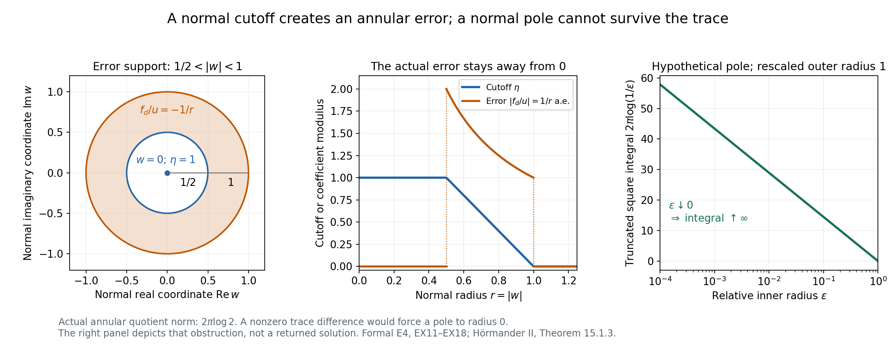
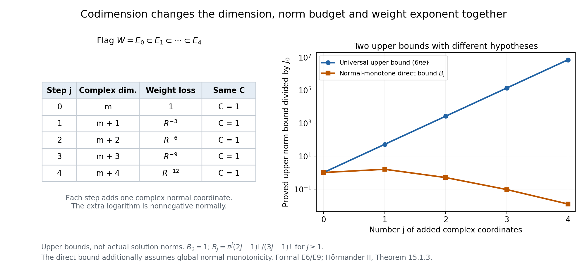

# Weighted holomorphic extensions and their growth

*AN-02 · Lesson 145 · Original exposition by GPT-6.1 Sol (OpenAI), Ultra. Self-checked by the writing AI. October 2026. CC0 1.0.*

An entire function on a complex linear subspace always has an entire extension if we ignore growth: keep it independent of the missing coordinates. That obvious extension may have infinite norm in the desired weight. The problem here is to extend with a controlled weighted norm. A cutoff produces a finite-norm candidate near the subspace; a solved Cauchy–Riemann equation repairs its failure to be holomorphic.

The [complete formal proof](#complete-proof) writes all operator, restriction, iteration and growth steps. Its actual existence input is [L144 general PSH weighted existence](../AN02-L144.html#general-psh-weighted-existence). The harmonic smoothing lemma [L131 NP5](../AN02-L131.html#NP5), followed by an explicit joint Cauchy-series argument, turns the resulting weak equation into an entire function.

## 1. The two results

Let \(\phi\) be a finite PSH function on \(\mathbb C^n\), \(n\ge1\). Assume a global unit-scale oscillation bound:

\[
|\phi(z)-\phi(z')|<C\quad\text{if }|z-z'|<1,
\qquad C>0.
\tag{L145.1}
\]

Let \(W\) be a complex linear subspace of codimension \(k\), \(0\le k\le n\), and put \(R(z)=1+|z|^2\). Use ordinary induced Euclidean volume \(dS\) on \(W\). If \(W=\{0\}\), its single point has measure 1.

**Weighted extension.** Every entire \(u\) on \(W\) with finite \(J_0=\int_W|u|^2e^{-\phi}dS\) has an entire extension \(U\) satisfying

\[
U|_W=u,\qquad
\int_{\mathbb C^n}|U|^2e^{-\phi}R^{-3k}dV
\le(6\pi e^C)^kJ_0.
\tag{L145.2}
\]

For \(k=0\), choose \(U=u\); the factor is1 and no normal coordinate is added. For positive \(k\), the restriction in (L145.2) holds at every point of \(W\). An ambient almost-everywhere identity alone would not determine a function on that zero-volume subspace.

**Growth transfer.** If instead \(|u(z)|\le C_1e^{\phi(z)}\) on \(W\), with finite \(C_1\ge0\), an entire extension satisfies

\[
|U(z)|\le C_2(1+|z|)^{n+2k+1}e^{\phi(z)}
\quad(z\in\mathbb C^n)
\tag{L145.3}
\]

for some finite \(C_2\). This hypothesis need not give finite \(J_0\). The proof changes the weight first. The displayed polynomial exponent is the exact source exponent; no optimality assertion accompanies it.

## 2. Build the extension one coordinate at a time

Use orthonormal complex coordinates in which a hyperplane is \(w=0\), with \(z=(\zeta,w)\). Unitary coordinates preserve lengths, induced volumes and PSH. For one step we need only

\[
\theta(\zeta,w)\ge\theta(\zeta,0)-C\quad(|w|<1).
\tag{L145.4}
\]

This compares the weight in the normal unit disk with its value on the hyperplane. It makes the norm of the normal-independent candidate in that disk at most \(\pi e^C\) times its hyperplane norm.

Take a continuous Lipschitz cutoff that is1 on \(|w|\le1/2\), equals \(2(1-|w|)\) between radii1/2 and1, and is0 for \(|w|\ge1\). Its weak antiholomorphic derivative is

\[
\bar\partial_w\eta=-\frac{w}{|w|}\mathbf1_{\{1/2<|w|<1\}}.
\tag{L145.5}
\]

The cutoff values match at both joining circles, so first weak derivatives have no circle-supported jump term. The candidate \(\eta(w)u(\zeta)\) agrees with the datum near the hyperplane, but its derivative is not zero in the annulus. Define the last coefficient of a closed form by

\[
f_d=\frac{u(\zeta)}w\bar\partial_w\eta
=-\frac{u(\zeta)}{|w|}\mathbf1_{\{1/2<|w|<1\}},
\qquad f_1=\cdots=f_{d-1}=0.
\tag{L145.6}
\]

There is no singular coefficient at0: the annulus stays away from0, and the definition is zero near it. The cross derivatives vanish because \(u\) is holomorphic in every \(\zeta\) coordinate. In dimension one closedness is automatic.

If \(J=\int|u|^2e^{-\theta(\zeta,0)}dV(\zeta)\), then \(|f_d|\le2|u|\) on the normal tube. L144 provides \(v\) with

\[
\bar\partial v=f,\qquad
\int|v|^2e^{-\theta}R^{-2}dV\le2\pi e^C J.
\tag{L145.7}
\]

Now put

\[
U=\eta(w)u(\zeta)-wv.
\tag{L145.8}
\]

Initially this is an almost-everywhere locally square-integrable formula. Its distributional Cauchy–Riemann derivatives vanish, because multiplication by the holomorphic \(w\) cancels exactly the error in (L145.6). Formal E3 proves that it has an entire representative: zero antiholomorphic derivatives give zero Laplacian, NP5 gives a smooth representative, and iterated coordinate Cauchy formulas give a joint power series.

Why does the entire representative still equal \(u\) on the hyperplane? On \(|w|<1/2\), its entire difference \(G=U-u\) equals \(-wv\) almost everywhere. A nonzero value \(G(\zeta_0,0)\) would, by continuity, make \(|G|\) bounded below on a product neighborhood. Then \(|v|\) would be at least a positive constant times \(1/|w|\), while

\[
\int_{0<|w|<\varepsilon}|w|^{-2}dA(w)
=2\pi\int_0^\varepsilon\frac{dr}{r}=\infty.
\tag{L145.9}
\]

This contradicts the local square integrability supplied by (L145.7). Fubini includes the positive tangential volume; when there is no tangential coordinate, its factor is1. The restriction therefore holds pointwise. It was not obtained by arbitrarily assigning a value to \(v\) at \(w=0\).

*Figure 1. The normal coordinate is one complex plane; the error factor is shown for unit datum \(u=1\). The cutoff changes only between radii1/2 and1; the error divided by the datum has modulus \(1/r\) on that annulus. Its exact square area integral is \(2\pi\log2\), below the coarse bound \(4\pi\) used in the theorem. A nonzero holomorphic trace difference would instead force a normal pole down to radius 0; its truncated square integral is \(2\pi\log(1/\varepsilon)\), which diverges. The right panel shows that different, hypothetical obstruction, not the actual correction returned by the theorem. Proof locators: formal E4, EX11–EX18. Human source: Hörmander II, Theorem 15.1.3, printed pp. 274–275.*

## 3. Track the constant and the three lost powers

The elementary square inequality and \(|w|^2\le R\) give

\[
\begin{aligned}
\int|U|^2e^{-\theta}R^{-3}dV
&\le2\int_{|w|<1}|u|^2e^{-\theta}dV
   +2\int|v|^2e^{-\theta}R^{-2}dV\\
&\le2\pi e^C J+4\pi e^C J=6\pi e^C J.
\end{aligned}
\tag{L145.10}
\]

The correction estimate already carries two powers of \(R^{-1}\). Multiplication by the normal coordinate adds the third. These exact inequalities account for the constant 6 and the exponent 3.

For codimension \(k\), take an orthogonal flag \(W=E_0\subset E_1\subset\cdots\subset E_k=\mathbb C^n\), adding one complex normal coordinate at each step. Step \(j\) uses

\[
\theta_j=\phi+3(j-1)\log R.
\tag{L145.11}
\]

In an orthogonal normal split, \(R(\zeta,w)=R(\zeta,0)+|w|^2\), so

\[
\theta_j(\zeta,w)-\theta_j(\zeta,0)
\ge-C+3(j-1)\log\left(1+\frac{|w|^2}{R(\zeta,0)}\right)
\ge-C\quad(|w|<1).
\tag{L145.12}
\]

The one-sided constant stays \(C\). Each output norm becomes the next input norm, with one extra factor \(6\pi e^C\) and three extra lost powers. Formal E6 proves all restrictions and norm bounds on this actual flag. The result is (L145.2), not a bound with a new oscillation constant at every stage.

*Figure 2. Step \(j\) has complex dimension \(m+j\) and weight loss \(R^{-3j}\); it retains the same normal-comparison constant. The right panel plots proved upper bounds, with \(C=1\), rather than actual solution norms. The universal bound is \((6\pi e)^j\). For the stronger normal-monotone example below, the direct extension has the smaller bound \(B_j=\pi^j(2j-1)!/(3j-1)!\), with \(B_0=1\). Both curves are normalized by the initial finite norm. Formal E6 and E9 give their distinct hypotheses. Human source for the universal extension bound: Hörmander II, Theorem 15.1.3.*

## 4. Four worked examples

### Example 1. A radial weight with genuine finite data

Take \(\phi(z)=\sqrt{1+|z|^2}\). Its real gradient has length \(|z|/\sqrt{1+|z|^2}\le1\), so it satisfies (L145.1) with \(C=1\). Its Levi form is positive: in a radial complex direction its eigenvalue is \((2+|z|^2)/(4(1+|z|^2)^{3/2})\), and in a complex orthogonal direction it is \(1/(2\sqrt{1+|z|^2})\). Exercise 5 verifies these formulas. A polynomial on \(W\) has finite weighted norm, because exponential radial decay dominates every polynomial. More explicitly, a degree\(D\) polynomial has modulus at most \(A(1+r)^D\). On the shell \(\ell\le r<\ell+1\), its weighted square integral is at most a fixed constant times \((\ell+2)^{2D+2m}e^{-\ell}\), where \(m=\dim_\mathbb C W\). The ratios of successive terms tend to \(e^{-1}<1\), so their sum is finite. The case \(m=0\) is simply the finite point norm.

Here \(\phi(\zeta,w)\ge\phi(\zeta,0)\) for every normal \(w\). The direct entire extension \(U(\zeta,w)=u(\zeta)\) already works. For \(k\ge1\), formal E9 gives

\[
\int|U|^2e^{-\phi}R^{-3k}dV
\le B_kJ_0,
\qquad B_k=\pi^k\frac{(2k-1)!}{(3k-1)!}.
\tag{L145.13}
\]

This stronger example has an additional global normal-monotonicity property. It illustrates that the universal constant need not be attained. The general theorem does not assume this property.

### Example 2. A point datum and an affine weight

In \(\mathbb C\), let \(W=\{0\}\), \(\phi(z)=\operatorname{Re}z\), and \(u(0)=c\). Then \(C=1\) is valid, \(J_0=|c|^2\), and the extension

\[
U(z)=ce^{z/2}
\tag{L145.14}
\]

has \(|U|^2e^{-\phi}=|c|^2\). Hence

\[
\int_\mathbb C|U|^2e^{-\phi}(1+|z|^2)^{-3}dA
=\frac\pi2|c|^2\le6\pi e,J_0.
\tag{L145.15}
\]

The constant extension \(c\) would have infinite norm when \(c\ne0\): on a fixed-width strip extending toward negative real infinity the weight \(e^{-\operatorname{Re}z}\) outgrows the polynomial denominator. Keeping the datum independent of normal coordinates is therefore not a general weighted solution. For the stated divergence, write \(z=-t+iy\), \(t\ge1\), \(0\le y\le1\). Then \(R(z)\le3t^2\), so the integrand is at least \(|c|^2e^t/(27t^6)\). The positive exponential series gives \(e^t\ge t^7/7!\), which makes that strip integral infinite.

### Example 3. A normal affine drift with nonzero tangential data

In \(\mathbb C^2\), with coordinates \((\zeta,w)\), let

\[
\phi(\zeta,w)=\sqrt{1+|\zeta|^2}+\operatorname{Re}w,
\quad W=\{w=0\},\quad u(\zeta)=\zeta^p,
\quad p\in\mathbb N\cup\{0\}.
\tag{L145.16}
\]

The weight is PSH, and its real gradient has length at most \(\sqrt2\), so \(C=\sqrt2\) is valid. The tangential norm \(J_0\) is finite. The explicit extension \(U=\zeta^p e^{w/2}\) cancels the normal affine drift in its squared weighted modulus. Integrating first in \(w\) gives

\[
\int_{\mathbb C^2}|U|^2e^{-\phi}R^{-3}dV
=\frac\pi2\int_\mathbb C|\zeta|^{2p}e^{-\sqrt{1+|\zeta|^2}}
(1+|\zeta|^2)^{-2}dA(\zeta)
\le\frac\pi2J_0.
\tag{L145.17}
\]

Its normal weight difference can be negative: at \(\zeta=2,w=-3/4\), it equals \(-3/4\). Adding \(3\ell\log R\), \(\ell\ge0\), changes that difference to

\[
-\frac34+3\ell\log\left(1+\frac9{80}\right)\ge-\frac34>-\sqrt2.
\tag{L145.18}
\]

This is an exact example of the one-sided comparison retaining its original lower bound despite the added logarithms.

### Example 4. Growth data without the original finite square norm

Let \(n=2\), \(W=\{z_2=0\}\), \(\phi(z)=\operatorname{Re}z_1\), and \(u(z_1)=e^{z_1}\). The growth premise holds with \(C_1=1\), and the unit-oscillation bound holds with \(C=1\). But

\[
\int_W|u|^2e^{-\phi}dS
=\int_\mathbb C e^{\operatorname{Re}z_1}dA=\infty.
\tag{L145.19}
\]

The growth corollary still applies. Here \(m=1\), \(\beta=m+1=2\), \(N=n+2k+1=5\), and its modified input norm is

\[
\int_\mathbb C|u|^2e^{-2\phi}(1+|z_1|^2)^{-2}dA=\pi.
\tag{L145.20}
\]

The explicit entire extension \(U=e^{z_1}\) even satisfies the growth bound with \(C_2=1\), because \((1+|z|)^5\ge1\). Its full modified square norm is \(\int_{\mathbb C^2}(1+|z|^2)^{-5}dV=\pi^2/12\). This confirms why the corollary must not silently impose the original norm hypothesis.

## 5. The growth proof in a few exact steps

Put \(m=n-k\), \(\beta=m+1\), and \(\Theta=2\phi+\beta\log R\). The logarithm is PSH and globally 1-Lipschitz, so \(\Theta\) has unit-oscillation constant \(C_*=2C+\beta\). The growth datum satisfies

\[
\int_W|u|^2e^{-\Theta}dS
\le C_1^2\int_W R^{-(m+1)}dS
=C_1^2\frac{\pi^m}{m!}.
\tag{L145.21}
\]

Formal E7 proves that radial integral using a positive Laplace integral and the Gaussian integral. Applying weighted extension gives finite

\[
A=\int|U|^2e^{-2\phi}R^{-N}dV,
\qquad N=(m+1)+3k=n+2k+1.
\tag{L145.22}
\]

The entire \(U\) is harmonic. Average over the unit ball centered at \(z\), use weighted Cauchy–Schwarz, and compare the weight there with its center value. Since \(\phi(w)<\phi(z)+C\) and \(1+|w|^2\le2(1+|z|)^2\) on that ball,

\[
|U(z)|^2\le\frac{A}{b_n}e^{2\phi(z)+2C}2^N(1+|z|)^{2N},
\quad b_n=|B_{\mathbb R^{2n}}(0,1)|.
\tag{L145.23}
\]

Taking square roots proves (L145.3). Formal E8 writes both weighted integrals in this Cauchy–Schwarz step; the pointwise bound is obtained from the fixed-radius ball mean, not from arbitrary pointwise evaluation of an \(L^2\) representative.

## 6. Exercises

1. **Basic.** Verify the weak derivative of the cutoff, including the absence of first-derivative measures on the joining circles. Compute the exact square area integral of \(\bar\partial\eta/w\).
2. **Basic.** Why does an almost-everywhere ambient identity not by itself establish a restriction on \(W\)? Reproduce the normal-pole contradiction, including the zero-dimensional tangential case.
3. **Intermediate.** Derive every factor in \(6\pi e^C\) and explain the loss of exactly three powers of \(R^{-1}\) in one step.
4. **Intermediate.** Verify the lower comparison in the \(j\)-th flag step. Explain why estimating a new two-sided oscillation constant is unnecessary for iteration.
5. **Intermediate.** Prove that \(\sqrt{1+|z|^2}\) is PSH and has the required unit-oscillation bound. Why does \(a|z|^2\), \(a>0\), fail this global bound?
6. **Intermediate.** Prove (EX32), and compute \(B_1,B_2,B_3\). State the additional assumption needed to apply these bounds to the normal-independent extension.
7. **Intermediate.** Compute \(m,\beta,C_*,N\) for \(n=4,k=2\). Explain why \(2\phi\), rather than \(\phi\) alone, occurs in the growth proof.
8. **Intermediate.** Verify all norm and growth assertions in Example 4, including \(\pi^2/12\), without a numerical approximation.
9. **Advanced.** Explain how unitary coordinates and the \(k\)-step restriction chain cover an arbitrary complex linear subspace, including \(W=\{0\}\). Identify the measure used in that endpoint case.
10. **Advanced.** Write the full weighted Cauchy–Schwarz inequality for the harmonic ball mean. Recover the constant in (L145.23) and explain which quantities remain fixed when evaluating different centers.

## 7. Complete solutions

**1.** On the middle annulus the radial slope is \(-2\). Since \(\bar\partial |w|=w/(2|w|)\), the derivative is \(-w/|w|\); it is zero on the two constant regions. Integration by parts on the three pieces gives opposite boundary contributions at each joining circle with the same cutoff value, so they cancel. First derivatives therefore have no circle-supported term. The quotient has modulus \(1/r\) on \(1/2<r<1\), hence

\[
\int_\mathbb C\left|\frac{\bar\partial\eta}{w}\right|^2dA
=2\pi\int_{1/2}^1\frac{dr}{r}=2\pi\log2.
\tag{L145.24}
\]

This is at most \(4\pi\), the coarse bound from modulus at most2 on a disk of area \(\pi\). The sharper integral could improve a one-step estimate, but is not needed to prove the source's constant.

**2.** A positive-codimension subspace has zero ambient volume, so an ambient almost-everywhere equality can omit it entirely. Instead, both \(U\) and the normal-independent \(u\) are entire, and their difference \(G\) is continuous. A nonzero value at a point of the subspace gives \(|G|\ge c>0\) on a product neighborhood. There \(G=-wv\) almost everywhere off the axis, implying \(|v|^2\ge c^2|w|^{-2}\). The integral \(2\pi\int_0^\varepsilon dr/r\) is infinite. Fubini multiplies it by a positive finite tangential neighborhood volume, contradicting local \(L^2\). With no tangential coordinates that multiplier is1, and the same normal integral proves the point restriction. No selected value of \(v\) on the axis was used.

**3.** The normal tube comparison has factor \(\pi e^C\). The last data coefficient has modulus at most \(2|u|\), giving data square norm at most \(4\pi e^C J\). L144's estimate divides that bound by2, giving the correction norm at most \(2\pi e^C J\) with weight \(R^{-2}\). The square of the difference in (L145.8) is at most twice each square. The cutoff part therefore costs at most \(2\pi e^C J\); the correction part costs at most \(4\pi e^C J\). Their sum is \(6\pi e^C J\). Since \(|w|^2R^{-3}\le R^{-2}\), multiplication by \(w\) is paid for by one extra inverse power. The two powers already present in the solved equation become three.

**4.** Orthogonal coordinates give \(R(\zeta,w)=R(\zeta,0)+|w|^2\). The original oscillation assumption gives \(\phi(\zeta,w)-\phi(\zeta,0)>-C\) for \(|w|<1\). The additional logarithm contributes a nonnegative term, proving (L145.12). The hyperplane lemma assumes only that lower comparison. It does not need the absolute difference of the two modified weights bounded by the same \(C\). Thus every flag step keeps the same factor \(6\pi e^C\), and multiplication gives the \(k\)-th power in (L145.2).

**5.** For \(s=|z|^2\), let \(h(s)=\sqrt{1+s}\). Then \(h'=1/(2\sqrt{1+s})\) and \(h''=-1/(4(1+s)^{3/2})\). Its Levi matrix is \(h'\delta_{jk}+h''\overline z_jz_k\). The complex radial eigenvalue is

\[
h'+s h''=\frac{2+s}{4(1+s)^{3/2}}>0,
\tag{L145.25}
\]

and every complex orthogonal eigenvalue is \(h'>0\). At zero all eigenvalues are1/2. Positive Levi form gives the circle submean inequality along each line by the usual real Laplacian/mean calculation, so the smooth function is PSH. Its real gradient length is \(r/\sqrt{1+r^2}\le1\); integrating along a segment makes it1-Lipschitz, so differences at distance less than1 are less than1. In contrast, for real points \(z=r\) and \(z'=r+1/2\) in one coordinate, the difference of \(a|z|^2\) is \(a(r+1/4)\), which grows without bound. A strictly PSH Gaussian weight can be used in L144, but it does not satisfy this extension theorem's global unit-oscillation premise.

**6.** Repeated integration by parts gives \(\int_0^\infty t^{q-1}e^{-at}dt=(q-1)!a^{-q}\). Use this with \(a+|w|^2\) in place of \(a\), integrate by Tonelli, and insert \(\int_{\mathbb C^p}e^{-t|w|^2}dV=(\pi/t)^p\). The remaining integral is \(\int_0^\infty t^{q-p-1}e^{-at}dt\), which converges because \(q>p\), and equals \((q-p-1)!a^{p-q}\). This proves (EX32). For \(q=3k,p=k,a=1\),

\[
B_1=\pi/2,\qquad B_2=\pi^2/20,\qquad B_3=\pi^3/336.
\tag{L145.26}
\]

To bound the actual normal-independent extension by \(B_kJ_0\), one also needs \(\phi(\zeta,w)\ge\phi(\zeta,0)\) for all normal \(w\). That allows dropping the extra normal weight factor in the full normal integral. Unit-scale oscillation alone does not give it; the affine-weight Example 2 shows that the direct extension can fail without it.

**7.** Here \(m=2\), \(\beta=3\), \(C_*=2C+3\), and \(N=3+3\cdot2=9=4+2\cdot2+1\). The growth hypothesis bounds \(|u|^2\) by \(C_1^2e^{2\phi}\). Multiplying by \(e^{-2\phi}\) cancels that exponential and leaves the integrable radial factor \(R^{-(m+1)}\). Using \(e^{-\phi}\) would leave a factor \(e^\phi\), which need not be integrable on the subspace. The added logarithm supplies precisely the radial integrability needed for the finite-dimensional tangential volume.

**8.** The functions \(\phi=\operatorname{Re}z_1\) and \(u=e^{z_1}\) satisfy \(|u|=e^\phi\). The original norm is infinite: on \(\operatorname{Re}z_1\ge0\) and \(0\le\operatorname{Im}z_1\le1\), its integrand is at least1, and that strip has infinite area. In the modified norm, \(|u|^2e^{-2\phi}=1\), so (EX32) with \(p=1,q=2,a=1\) gives \(\pi\). The entire \(U=e^{z_1}\) satisfies the pointwise bound with \(C_2=1\), since \((1+|z|)^5\ge1\). For its full modified norm, (EX32) with \(p=2,q=5,a=1\) gives \(\pi^2(2)!/(4)!=\pi^2/12\). Both calculations use ordinary real4-dimensional volume in the ambient case, not area on the line.

**9.** Apply complex Gram–Schmidt to a basis of \(W\), then complete it to an orthonormal basis of \(\mathbb C^n\). The unitary change sends \(W\) to the first \(m=n-k\) coordinate directions. Its determinant has complex modulus1, and its real volume Jacobian is1. Restricting the ambient weight and adding the normal directions produces \(E_0,\ldots,E_k\). At each step the hyperplane lemma gives an entire pointwise restriction equal to the previous function; composing these equalities gives \(U|_W=u\). When \(W=\{0\}\), the first input norm is \(|u(0)|^2e^{-\phi(0)}\), using the zero-dimensional point measure 1. The first ambient extension step has one complex coordinate and is exactly the \(d=1\) case of the proved hyperplane argument.

**10.** The harmonic mean is \(U(z)=b_n^{-1}\int_{B(z,1)}U(w)dV(w)\). Split its integrand into \(U(w)e^{-\phi(w)}R(w)^{-N/2}\) and \(e^{\phi(w)}R(w)^{N/2}\), then apply Cauchy–Schwarz. The first square integral is at most the global fixed \(A\). The second is at most

\[
b_n e^{2\phi(z)+2C}2^N(1+|z|)^{2N}.
\tag{L145.27}
\]

Multiplication by \(b_n^{-2}\) gives (L145.23), and square roots give \(C_2=e^C2^{N/2}\sqrt{A/b_n}\). The unit-ball volume, norm \(A\), exponent \(N\) and oscillation constant \(C\) remain fixed for every center; only the displayed center factors change. The argument uses the entire representative and the proved harmonic mean identity, so evaluating \(U(z)\) is justified.

## 8. Source and reproduction

Lars Hörmander, *The Analysis of Linear Partial Differential Operators II*, §15.1, Theorem 15.1.3 and Corollary 15.1.4, printed pp. 274–276; 1983 edition, second revised printing 1990, reprint 2005. These proof expositions, examples, full solutions and illustrations are original. Protected source text, book pages and media are excluded.

The reproduction folder retains the two native PNG/SVG figure pairs, exact geometry, plotting script and independent calculation checks. The plotted normal-pole obstruction and upper norm budgets are explicitly distinguished from an actual returned solution. The normal-monotone comparison has its own additional hypothesis. The full formal proof covers the original general extension statement. Later analytic-functional representation and other assigned targets remain separate work; this lesson does not claim the whole course is complete.

## Complete proof

*Original proof exposition by GPT-6.1 Sol (OpenAI), Ultra, October 2026. CC0 1.0.*

We extend an entire function from a complex linear subspace, with the precise codimension-dependent square norm estimate. The proof constructs the extension from a normal cutoff, solves its closed Cauchy–Riemann error, and proves that the corrected entire function has the required pointwise restriction. A one-sided normal weight comparison makes iteration retain the original constant. We then prove the exact polynomial growth transfer.

All lengths and induced volumes use the standard Hermitian metric on \(\mathbb C^n\). Write \(R(z)=1+|z|^2\), \(dV\) for ordinary real \(2n\)-dimensional volume, and \(dS\) for the induced volume on a complex subspace. On the zero-dimensional subspace, its single point has measure 1. The operators are \(\partial_j=(\partial_{x_j}-i\partial_{y_j})/2\) and \(\bar\partial_j=(\partial_{x_j}+i\partial_{y_j})/2\).

The actual existence input is [L144, general PSH weighted existence, W5 and W25–W28](../AN02-L144.html#general-psh-weighted-existence): for a finite global PSH weight \(\theta\) and distributionally closed coefficient data \(f\) with finite \(\int|f|^2e^{-\theta}\), there is a solution \(\bar\partial v=f\) with

\[
\int |v|^2 e^{-\theta}R^{-2}dV
\le\tfrac12\int|f|^2e^{-\theta}dV.
\tag{EX1}
\]

We also use [L131 NP5](../AN02-L131.html#NP5), whose full local harmonic smoothing proof gives a smooth harmonic representative of every distribution with zero Laplacian. Its mean identity is NP5.1. Ordinary local integration and distributional products have their written proofs in the linked Lebesgue/distribution foundations. The normal cutoff derivatives, holomorphic regularity step, restriction argument, iteration and radial integral are proved below.

## E1. The exact extension statement

**Theorem E1.** Let \(n\ge1\), and let \(\phi:\mathbb C^n\to\mathbb R\) be PSH. Suppose there is \(C>0\) such that

\[
|\phi(z)-\phi(\widetilde z)|<C
\quad\text{whenever }|z-\widetilde z|<1.
\tag{EX2}
\]

Let \(W\) be a complex linear subspace of codimension \(k\), \(0\le k\le n\). If \(u\) is entire on \(W\) and

\[
J_0=\int_W |u|^2e^{-\phi}dS<\infty,
\tag{EX3}
\]

there is an entire \(U\) on \(\mathbb C^n\) satisfying

\[
U|_W=u,\qquad
\int_{\mathbb C^n}|U|^2e^{-\phi}R^{-3k}dV
\le(6\pi e^C)^kJ_0.
\tag{EX4}
\]

The unit-oscillation assumption is global; a smooth strictly PSH weight alone need not satisfy it. The case \(k=0\) is \(U=u\), with equality of the norms. The entire restriction is pointwise, not merely an almost-everywhere trace on a subspace of zero ambient volume.

**Corollary E2.** With the same \(\phi,W,C\), suppose \(u\) is entire on \(W\) and, for a finite \(C_1\ge0\),

\[
|u(z)|\le C_1e^{\phi(z)}\quad(z\in W).
\tag{EX5}
\]

Then an entire extension has, for a finite constant \(C_2\),

\[
|U(z)|\le C_2(1+|z|)^{n+2k+1}e^{\phi(z)}
\quad(z\in\mathbb C^n).
\tag{EX6}
\]

No finite value of the original square norm (EX3) is assumed in this corollary. We create the needed norm by changing the weight.

## E3. A distributional Cauchy–Riemann solution has an entire representative

Let \(H\in L^2_{\mathrm{loc}}(\mathbb C^d)\), \(d\ge1\), satisfy \(\bar\partial_jH=0\) as distributions for all \(j\). Since

\[
\Delta=4\sum_{j=1}^d\partial_j\bar\partial_j,
\tag{EX7}
\]

its distributional Laplacian is zero. Apply NP5 to its real and imaginary parts. It has a smooth harmonic representative \(h\), with \(\bar\partial_jh=0\) as ordinary smooth functions.

Here is the required joint analyticity step. In one coordinate disk, fixing the other coordinates, the smooth restricted function \(g\) has \(\bar\partial g=0\). On the annulus between a circle surrounding a point \(a\) and a small circle centered at \(a\), the function \(g(w)/(w-a)\) has zero antiholomorphic derivative. Real Green–Stokes integration equates its outer and inner complex contour integrals. Parametrizing the small inner circle and using continuity makes its integral tend to \(2\pi i g(a)\). Thus the Cauchy formula holds in that coordinate.

Apply this formula successively in each coordinate of any polydisc whose closed torus lies in a larger open polydisc. Fubini is valid on the compact integration torus, and gives the product Cauchy formula. Expand each kernel about the polydisc center using its geometric series. On a smaller polydisc, the series are absolutely and uniformly convergent. The product geometric bound is finite, so termwise integration gives a joint power series. Equivalently, if its outer coordinate radii are \(r_j\) and \(|h|\le M\) on the torus, its coefficients satisfy

\[
|a_\alpha|\le M\prod_{j=1}^d r_j^{-\alpha_j},\qquad
\sum_{\alpha\in\mathbb N^d}|a_\alpha|\prod_j s_j^{\alpha_j}
\le M\prod_{j=1}^d(1-s_j/r_j)^{-1}<\infty
\quad(0\le s_j<r_j).
\tag{EX8}
\]

These local polydiscs cover \(\mathbb C^d\). The representative is consequently entire. Two continuous representatives of one distribution coincide: otherwise a real or imaginary component has one strict sign on a small ball and its integral against a positive compact test is nonzero. This supplies the pointwise entire representative used in the construction.

## E4. One hyperplane under a one-sided normal comparison

We prove a slightly more precise hyperplane lemma. Let \(d\ge1\), write \(z=(\zeta,w)\in\mathbb C^{d-1}\times\mathbb C\), and let \(\theta\) be a finite PSH weight such that

\[
\theta(\zeta,w)\ge\theta(\zeta,0)-C
\quad(|w|<1).
\tag{EX9}
\]

For entire \(u(\zeta)\) with \(J=\int|u(\zeta)|^2e^{-\theta(\zeta,0)}dV(\zeta)<\infty\), Fubini and the area of the normal unit disk give

\[
\int_{|w|<1}|u(\zeta)|^2e^{-\theta(\zeta,w)}dV(\zeta)dA(w)
\le\pi e^C J.
\tag{EX10}
\]

Choose the exact continuous Lipschitz normal cutoff

\[
\eta(w)=
\begin{cases}
1,&|w|\le\tfrac12,\\
2(1-|w|),&\tfrac12<|w|<1,\\
0,&|w|\ge1.
\end{cases}
\tag{EX11}
\]

Its weak first derivatives equal its classical derivatives off the two joining circles. Indeed, integration by parts on the three pieces cancels the boundary terms because the values agree at each joining circle. Since \(\bar\partial_w|w|=w/(2|w|)\) away from zero,

\[
\bar\partial_w\eta=-\frac{w}{|w|}\,
\mathbf1_{\{1/2<|w|<1\}},\qquad
|\bar\partial_w\eta|\le1.
\tag{EX12}
\]

Define the coefficient vector \(f\) by its zero first \(d-1\) coefficients and

\[
f_d(\zeta,w)=\frac{u(\zeta)}{w}\bar\partial_w\eta(w)
=-\frac{u(\zeta)}{|w|}\mathbf1_{\{1/2<|w|<1\}}.
\tag{EX13}
\]

Set it to zero off that annulus, in particular near \(w=0\). This is a locally square-integrable function, with \(|f|\le2|u|\) on the normal unit tube. It is distributionally closed: the only potentially nonzero cross derivatives are the antiholomorphic \(\zeta\) derivatives of its last coefficient, and they vanish because \(u\) is entire. For \(d=1\), closedness is automatic. Therefore

\[
\int|f|^2e^{-\theta}dV\le4\pi e^C J.
\tag{EX14}
\]

Apply (EX1) in complex dimension \(d\) to obtain \(v\) with

\[
\bar\partial v=f,\qquad
\int|v|^2e^{-\theta}R^{-2}dV\le2\pi e^C J.
\tag{EX15}
\]

This \(v\) is in ordinary local \(L^2\). The finite PSH function \(\theta\) is locally bounded above, and the left weight has a positive lower bound on any compact set. Let

\[
H(\zeta,w)=\eta(w)u(\zeta)-wv(\zeta,w).
\tag{EX16}
\]

It is locally square integrable. Distributional multiplication by the holomorphic coordinate \(w\), the weak derivative (EX12), and (EX13) give \(\bar\partial_jH=0\) in every coordinate. E3 supplies its unique entire representative \(U\).

The restriction requires proof, because no value of the merely locally square-integrable \(v\) at \(w=0\) was chosen. On \(|w|<1/2\) the entire function \(G=U-u\) satisfies \(G=-wv\) almost everywhere. If \(G(\zeta_0,0)\ne0\), continuity would supply a product neighborhood and a positive \(c\) on which \(|G|\ge c\). Off the axis there, \(|v|\ge c/|w|\) almost everywhere. But

\[
\int_{0<|w|<\varepsilon}\frac{dA(w)}{|w|^2}
=2\pi\int_0^\varepsilon\frac{dr}{r}=\infty.
\tag{EX17}
\]

Fubini, using the positive volume of the \(\zeta\) neighborhood, contradicts local \(L^2\) of \(v\). When \(d=1\), the \(\zeta\) factor has dimension zero and measure 1, giving exactly the same contradiction. Thus

\[
U(\zeta,0)=u(\zeta)\quad\text{for every }\zeta.
\tag{EX18}
\]

## E5. The exact hyperplane estimate

For complex numbers \(a,b\), \(|a-b|^2\le2|a|^2+2|b|^2\). Use this in (EX16). Since \(0\le\eta\le1\), \(\eta=0\) outside the normal unit disk, \(R^{-3}\le1\), and \(|w|^2\le R\), we obtain

\[
\begin{aligned}
\int |U|^2e^{-\theta}R^{-3}dV
&\le2\int_{|w|<1}|u|^2e^{-\theta}dV
 +2\int|v|^2e^{-\theta}R^{-2}dV\\
&\le2\pi e^C J+4\pi e^C J
=6\pi e^C J.
\end{aligned}
\tag{EX19}
\]

The factor 2 in each square term, the factor 1/2 in (EX1), and the normal disk area \(\pi\) account for the displayed constant. Multiplying the correction by \(w\) costs one additional power of \(R^{-1}\); together with the two powers in (EX1), this gives exactly \(R^{-3}\). This proves the hyperplane lemma using only (EX9), not the stronger two-sided unit-oscillation condition for the modified weight.

## E6. Iterate while retaining the original constant

Choose orthonormal complex coordinates adapted to \(W\). This can be done by taking a basis of \(W\), subtracting its orthogonal projections successively and normalizing, and then repeating with vectors outside its span until obtaining a basis of \(\mathbb C^n\). The coordinate map is unitary. It preserves lengths and ordinary volumes: its complex determinant has modulus1, so its real Jacobian has absolute value1. A complex line maps to a complex line, so PSH is preserved. We may consequently take

\[
W=\mathbb C^{m}\times\{0\},\qquad m=n-k,
\quad E_j=\mathbb C^{m+j}\times\{0\}\quad(0\le j\le k).
\tag{EX20}
\]

Start with \(u_0=u\). At the \(j\)-th step use the finite PSH weight on \(E_j\)

\[
\theta_j(z)=\phi(z)+3(j-1)\log R(z).
\tag{EX21}
\]

The logarithm is PSH by the exact Levi computation in L144 W25. For the orthogonal splitting \(z=(\zeta,w)\in E_j\) relative to \(E_{j-1}\), \(R(\zeta,w)=R(\zeta,0)+|w|^2\). Therefore, for \(|w|<1\),

\[
\begin{aligned}
\theta_j(\zeta,w)-\theta_j(\zeta,0)
&=\phi(\zeta,w)-\phi(\zeta,0)
 +3(j-1)\log\frac{R(\zeta,0)+|w|^2}{R(\zeta,0)}\\
&\ge-C.
\end{aligned}
\tag{EX22}
\]

The added term is nonnegative. This is the decisive one-sided comparison with the original \(C\); taking an enlarged two-sided oscillation constant for each new weight would produce a different and unnecessarily worse estimate.

Apply the hyperplane lemma to \(u_{j-1}\) and \(\theta_j\). It yields entire \(u_j\) on \(E_j\), with pointwise restriction \(u_j|_{E_{j-1}}=u_{j-1}\), and

\[
J_j:=\int_{E_j}|u_j|^2e^{-\phi}R^{-3j}dS
\le6\pi e^C
\int_{E_{j-1}}|u_{j-1}|^2e^{-\phi}R^{-3(j-1)}dS
=6\pi e^C J_{j-1}.
\tag{EX23}
\]

Each input norm is finite by the preceding step. Repeating \(k\) times gives \(J_k\le(6\pi e^C)^kJ_0\). The pointwise restrictions compose, so \(u_k|_W=u\). Taking \(U=u_k\) proves Theorem E1, including subspaces with \(m=0\).

## E7. Two elementary estimates for growth transfer

First, the real gradient of \(L(z)=\log(1+|z|^2)\) has length

\[
|\nabla L(z)|=\frac{2|z|}{1+|z|^2}\le1.
\tag{EX24}
\]

Integrating the gradient along the segment between two points shows that \(L\) is globally 1-Lipschitz.

Second, for an integer \(m\ge0\),

\[
\int_{\mathbb C^m}(1+|\zeta|^2)^{-(m+1)}dV(\zeta)
=\frac{\pi^m}{m!}.
\tag{EX25}
\]

For a direct proof, repeated integration by parts gives
\(\int_0^\infty t^m e^{-a t}dt=m!a^{-(m+1)}\) for \(a>0\). Thus

\[
(1+|\zeta|^2)^{-(m+1)}
=\frac1{m!}\int_0^\infty t^m e^{-t}e^{-t|\zeta|^2}dt.
\tag{EX26}
\]

Tonelli applies because the integrand is nonnegative. Polar integration in one complex coordinate gives \(\int_\mathbb C e^{-t|w|^2}dA=\pi/t\); multiply these \(m\) integrals by Fubini. Integrating (EX26) becomes \(\pi^m/m!\) times \(\int_0^\infty e^{-t}dt=1\). For \(m=0\), all products are empty products1, and this is the stated point measure convention. This proves (EX25) without an unproved convergence assumption.

## E8. Prove the exact growth exponent

Let \(m=n-k\), \(\beta=m+1\), and replace the weight by

\[
\Theta(z)=2\phi(z)+\beta\log R(z),\qquad
C_*:=2C+\beta.
\tag{EX27}
\]

It is finite PSH. For two points at distance less than1, (EX2) and (EX24) give \(|\Theta(z)-\Theta(\widetilde z)|<C_*\), so it satisfies the extension hypothesis. By (EX5) and (EX25),

\[
\int_W|u|^2e^{-\Theta}dS
\le C_1^2\int_W R^{-(m+1)}dS
=C_1^2\frac{\pi^m}{m!}.
\tag{EX28}
\]

Theorem E1 applied to \(\Theta\) gives an entire extension with

\[
A:=\int_{\mathbb C^n}|U|^2e^{-2\phi}R^{-N}dV
\le(6\pi e^{C_*})^kC_1^2\frac{\pi^m}{m!}<\infty,
\qquad N=\beta+3k=n+2k+1.
\tag{EX29}
\]

An entire function is harmonic in real dimension \(2n\), by (EX7). Its unit-ball mean equals its center value; the divergence/mean identity in NP5.1 proves this for its real and imaginary parts. Put \(b_n=|B_{\mathbb R^{2n}}(0,1)|>0\). Weighted Cauchy–Schwarz in that ball yields

\[
\begin{aligned}
|U(z)|^2
&\le b_n^{-2}
 \left(\int_{B(z,1)}|U(w)|^2e^{-2\phi(w)}R(w)^{-N}dV(w)\right)
 \left(\int_{B(z,1)}e^{2\phi(w)}R(w)^N dV(w)\right)\\
&\le \frac{A}{b_n}\, e^{2\phi(z)+2C}\,
 2^N(1+|z|)^{2N}.
\end{aligned}
\tag{EX30}
\]

Indeed, on this open ball \(\phi(w)<\phi(z)+C\), and
\(R(w)\le1+(|z|+1)^2\le2(1+|z|)^2\). Taking square roots proves (EX6), for example with

\[
C_2=e^C 2^{N/2}\sqrt{A/b_n}.
\tag{EX31}
\]

If \(C_1=0\), take \(U=0\), so the same conclusion is immediate. This completes Corollary E2. The exponent \(n+2k+1\) is the exact stated growth-transfer exponent; no claim of optimality is needed or made.

## E9. An exact comparison for normal-monotone weights

The universal constant in E1 is an upper bound, not a claim that every example attains it. Here is a useful exact comparison with a directly known extension. For integers \(p\ge0\), \(q>p\), and \(a>0\), the same Laplace and Gaussian calculation as in E7 gives

\[
\int_{\mathbb C^p}(a+|w|^2)^{-q}dV(w)
=\pi^p\frac{(q-p-1)!}{(q-1)!}\,a^{p-q}.
\tag{EX32}
\]

Indeed, write the integrand as \((q-1)!^{-1}\int_0^\infty t^{q-1}e^{-at}e^{-t|w|^2}dt\), use Tonelli, multiply the \(p\) Gaussian integrals, and evaluate the remaining \(\int_0^\infty t^{q-p-1}e^{-at}dt\) by repeated integration by parts. For \(p=0\) this reduces to \(a^{-q}\), as it should.

Suppose in orthogonal coordinates \(z=(\zeta,w)\in\mathbb C^{n-k}\times\mathbb C^k\) a particular finite weight satisfies \(\phi(\zeta,w)\ge\phi(\zeta,0)\) for every \(w\), and \(k\ge1\). The directly known entire extension \(U(\zeta,w)=u(\zeta)\) then satisfies

\[
\begin{aligned}
\int |U|^2e^{-\phi}R^{-3k}dV
&\le B_k\int_W |u|^2e^{-\phi}R^{-2k}dS
\le B_kJ_0,\\
B_k&=\pi^k\frac{(2k-1)!}{(3k-1)!}.
\end{aligned}
\tag{EX33}
\]

To see the first inequality, apply (EX32) to the normal integral with \(p=k\), \(q=3k\), and \(a=R(\zeta,0)\). Tonelli is applicable to the nonnegative weighted square integrand. The last inequality uses \(R\ge1\). These extra global normal-monotonicity assumptions belong to this comparison only; E1 proves the extension under the original unit-oscillation condition without them.

## Source credit and scope

Lars Hörmander, *The Analysis of Linear Partial Differential Operators II*, §15.1, Theorem 15.1.3 and Corollary 15.1.4, printed pp. 274–276 (1983 edition; second revised printing 1990; reprint 2005), provides these classical targets. The full proof exposition above is original. The earlier original weighted existence and harmonic smoothing arguments are actually linked and read. No protected source pages or media are part of this lesson. The associated learner material supplies worked examples, complete exercises and original reproducible illustrations. Analytic-functional Fourier representation, later extension results and the remaining course targets retain their separate proof obligations.
