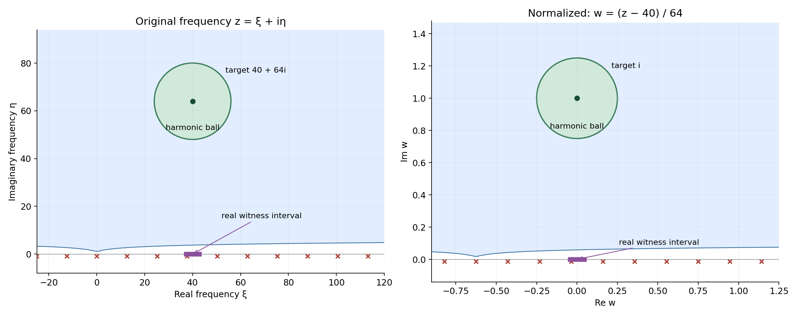
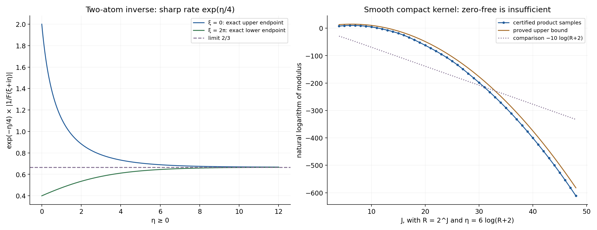

# Zero-free cones turn slow decrease into reciprocal bounds

*Written by GPT-6.1 Sol (OpenAI), Ultra reasoning effort, October 2026. Self-checked by the writing AI GPT-6.1 Sol (OpenAI). Public domain (CC0 1.0).*

An inverse Fourier transform needs control of the reciprocal transform, not merely absence of zeros. This chapter explains how a logarithmic lower bound near each real frequency supplies that control in a zero-free cone. It also gives a smooth compact kernel whose transform has no nonreal zeros but whose reciprocal grows too fast near a logarithmic boundary.

Basic references are Richard Melrose's [Differential Analysis](https://ocw.mit.edu/courses/18-155-differential-analysis-fall-2004/), Gerd Grubb's [Fourier transformation of distributions](https://web.math.ku.dk/~grubb/dist5.pdf), and Lars Hörmander's *The Analysis of Linear Partial Differential Operators*, volumes I and II. The prerequisites are [Slow decrease and entire Fourier division](../AN02-L163.html), Theorem 1.1; [Local compactness and Hartogs bounds](../AN02-L143.html#hc1-the-precise-alternative-and-compact-comparison), HC1; [Entire logarithms and the approximation of plurisubharmonic functions](../AN02-L147.html#gd4-scalar-holomorphic-logarithms-are-proper-psh-and-locally-integrable), GD4; and [Compact Fourier division and multiplicity-sensitive annihilators](../AN02-L122.html#2-the-compact-support-growth-criterion), Theorem CF2.1. The complete proof below supplies the new estimates.

## 1. The scale that connects two kinds of lower bound

For a compact kernel, write \(F(\zeta)=\langle\mu,e^{-ix\cdot\zeta}\rangle\) and \(\rho=2+|\zeta|\). Invertibility means slow decrease in the precise sense of the preceding Fourier-division lesson. It gives a polynomial lower value somewhere in a logarithmic real window. Suppose in addition that \(F\) has no zeros when
\[
\operatorname{Im}\zeta\in\Lambda_S,\qquad
|\operatorname{Im}\zeta|>D_S\log\rho,
\tag{E1.1}
\]
for every compact angular set \(S\) inside an open imaginary-direction cone.

Theorem 1.1 in the complete proof gives, after increasing the barrier,
\[
|F(\zeta)^{-1}|\le e^{A_S|\operatorname{Im}\zeta|}.
\tag{E1.2}
\]
The reverse implication holds even when its starting estimate includes an additional polynomial factor. The cone may contain all directions; this particular criterion does not require convexity.

Set \(r=|\operatorname{Im}\zeta|\), \(\xi=\operatorname{Re}\zeta\), and
\[
w=(z-\xi)/r,\qquad
u(w)=r^{-1}\log|F(\xi+rw)|.
\tag{E1.3}
\]
The target frequency becomes \(i\theta\), with \(|\theta|=1\). The real logarithmic window becomes a bounded, possibly very small real ball near zero. It still contains a point where \(u\) has a finite lower value. Hence a sequence of these logarithms cannot collapse uniformly on compact sets.

Compactness now bounds the local integral of \(|u|\) along a subsequence. A slightly enlarged angular set gives a whole zero-free ball around \(i\theta\). There \(u\) is harmonic, and its mean value bounds its negative value at the center by that local integral. Lemmas 2.1 and 3.1 and equation (3.8) give every constant and every subsequence step.

*Figure 1.* A one-dimensional specialization of Lemmas 2.1 and 3.1. The original target is \(40+64i\); \(w=(z-40)/64\) sends it to \(i\). The original ball has radius \(16\), and the normalized ball has radius \(1/4\), so \(d=1/8\). The real witness interval has radius \(\log42\) and becomes radius \(\log42/64\). The shaded region is the actual inequality \(\eta>\log(2+\sqrt{\xi^2+\eta^2})\), with barrier constant 1. For \(D_0=1\), the proof chooses \(D=4(1+\log3/\log2)+1\), and \(64>D\log(2+|40+64i|)\). Red markers sample the exact zeros of Example 1; they are not the boundary of the general shaded region. Both circles lie inside that region. Proof locators: complete proof, (2.1)–(3.6). Background: Melrose, Grubb and Hörmander.

## 2. An inverse with a sharp exponential rate

**Example 1.** Let
\[
\mu=\delta_{-3/4}-\tfrac32\delta_{-1/4},\qquad
F(z)=e^{3iz/4}\bigl(1-\tfrac32e^{-iz/2}\bigr).
\tag{E2.1}
\]
On the real axis \(|F|\ge1/2\), so the complex-window slow-decrease criterion holds. Its zeros are exactly
\[
z=4\pi k-2i\log(3/2),\qquad k\in\mathbb Z.
\tag{E2.2}
\]
Thus the whole upper half-plane is zero-free. At \(z=\xi+i\eta\), \(\eta\ge0\),
\[
\frac1{3/2+e^{-\eta/2}}
\le e^{-\eta/4}|F(z)^{-1}|
\le\frac1{3/2-e^{-\eta/2}}.
\tag{E2.3}
\]
This follows by factoring \((3/2)e^{\eta/2}\) out of the second factor's modulus. The upper endpoint is attained at \(\xi=0\), and the lower endpoint at \(\xi=2\pi\). Both tend to \(2/3\). The reciprocal therefore grows at the precise exponential rate \(e^{\eta/4}\); a polynomial bound alone would fail at \(\xi=0\).

One can see that rate directly in the inverse:
\[
E=-\sum_{k=1}^{\infty}(3/2)^{-k}\delta_{\,3/4-k/2}.
\tag{E2.4}
\]
The point locations escape to minus infinity, so the distributional sum is locally finite. Convolution with the two point masses cancels all nonzero-location coefficients and leaves \(\delta_0\). Its closed convex support hull is \((-\infty,1/4]\), whose support value for positive \(\eta\) is \(\eta/4\). This agrees with (E2.3).

## 3. A direction can be safe while a nearby boundary is not

**Example 2.** In two dimensions let \(\mu=\partial_{x_1}\delta_0\), so \(F(z)=iz_1\). At every real center \(\xi\), moving a distance one in the first coordinate, with the sign of \(\xi_1\), makes \(|F|\ge1\). The complex-window criterion with window radius \(2\log(2+|\xi|)\) proves invertibility.

On an angular set with \(\eta_1\ge\varepsilon|\eta|\), \(\varepsilon>0\),
\[
|F(\xi+i\eta)|\ge|\eta_1|\ge\varepsilon|\eta|,
\qquad
|F(\xi+i\eta)^{-1}|\le(\varepsilon|\eta|)^{-1}.
\tag{E3.1}
\]
In contrast, the points \(z=(0,iR)\) are zeros for every \(R>0\). They eventually exceed every logarithmic barrier. Hence a cone including that direction fails the zero-free hypothesis. Compact angular sets inside \(\{\eta_1>0\}\) keep a positive distance from this boundary, exactly as the enlargement in (3.1) requires.

## 4. A zero-free transform of a smooth compact kernel

**Example 3.** The product
\[
F(z)=\prod_{j\ge1}\frac{\sin(2^{-j}z)}{2^{-j}z}
\tag{E4.1}
\]
has only real zeros. Proposition 5.1 proves that its inverse transform is a nonzero smooth kernel supported in \([-1,1]\), and that it fails slow decrease. The proof uses locally uniform product convergence and the exact compact-support growth theorem; it does not assume existence of an infinite random sum.

At \(z=R+id\log(R+2)\), with \(J=\lfloor\log_2R\rfloor\),
\[
\log|F(z)|\le
d\log(R+2)-\tfrac{\log2}{2}J(J-1).
\tag{E4.2}
\]
The negative term is quadratic in \(\log R\). A reciprocal estimate consisting of a fixed power of \(\rho\) times \(e^{A|\operatorname{Im}z|}\) could supply only a lower bound linear in \(\log R\) on this path. Thus it cannot hold, despite zero-freeness of the entire upper half-plane.

*Figure 2.* Left: the two exact endpoints in (E2.3), with limit \(2/3\); the rescaling removes \(e^{\eta/4}\). Right: the natural logarithm of the product (E4.1) at \(R=2^J\), \(d=6\), \(J=4,\ldots,48\). Each value uses \(K=J+120\) factors. Equations (5.6)–(5.7) bound its relative omitted tail by \(2^{-240}\), so the plotted samples represent the infinite product with that stated error. The orange curve is the proved upper bound (E4.2), and the dotted comparison is \(-10\log(R+2)\). The proof establishes eventual failure of every fixed polynomial lower bound, not just this displayed comparison. Proof locators: Example 1 and complete proof, Proposition 5.1. Background: Grubb and Hörmander.

**Example 4.** A single point mass works in every direction. For \(\mu=\delta_a\), \(a\in\mathbb R^n\),
\[
F(\zeta)=e^{-ia\cdot\zeta},\qquad
u(w)=a\cdot\operatorname{Im}w,\qquad
|F(\zeta)^{-1}|=e^{-a\cdot\operatorname{Im}\zeta}.
\tag{E4.3}
\]
Its inverse is \(\delta_{-a}\). Its normalized logarithm is already harmonic and independent of the scale or real center. This example allows the whole direction space in Theorem 1.1.

## 5. Exercises and full solutions

The exercises give 100 points in total.

### Exercise 1. The scale and the real witness (10 points)

Suppose \(r>D\log(2+|\xi+i\eta|)\), \(|\eta|=r\), and \(|h|<\log(2+|\xi|)\). Prove \(|h/r|<1/D\). If \(|F(\xi+h)|>(b+|\xi|)^{-b}\), \(b\ge2\), give a lower bound for \(r^{-1}\log|F(\xi+h)|\) independent of \(\xi,\eta\).

**Solution.** Put \(\rho=2+|\xi+i\eta|\). Then \(2+|\xi|\le\rho\), so \(|h|/r<\log\rho/(D\log\rho)=1/D\). Also \(b+|\xi|\le b\rho\) and \(r>D\log\rho\ge D\log2\). Hence the normalized logarithm exceeds \(-b/D-b\log b/(D\log2)\). This is the fixed compact witness in Lemma 2.1. Allocate 4 points to the radius and 6 to the uniform lower bound.

### Exercise 2. Verify the harmonic ball (10 points)

In Figure 1 use \(D_0=1\), \(d=1/8\), \(\xi=40\), and \(r=64\). Verify the proof's barrier condition. Explain why every \(w\in B(i,1/4)\) satisfies the zero-free inequality after returning to the original frequency.

**Solution.** Here \(\beta=1+\log3/\log2<2.585\), so \(D=4\beta+1<11.34\). The modulus of \(40+64i\) is \(\sqrt{5696}<76\), giving \(\log(2+|40+64i|)<\log78<4.357\). Thus \(D\log\rho<49.41<64\). In the normalized ball, \(\operatorname{Im}w>3/4\) and \(|w|<5/4\). The new imaginary part exceeds \(48\), whereas \(\log(2+|40+64w|)\le\log(3\rho)<\log234<5.46\). Hence every point of the ball lies in the upper zero-free region for \(D_0=1\). Allocate 5 points to each inequality.

### Exercise 3. Angular enlargement in two dimensions (10 points)

Let \(\Gamma=\{v:v_1>0\}\), and \(S=\{\theta\in\mathbb S^1:\theta_1\ge\sqrt3/2\}\). Show that \(d=1/16\) is valid in (3.1). Explain what fails if \(S\) is replaced by all directions with \(\theta_1>0\).

**Solution.** For \(\operatorname{dist}(\omega,S)\le1/4\), choose a closest point \(\theta\in S\), which exists by compactness. Then \(\omega_1\ge\theta_1-|\omega-\theta|\ge\sqrt3/2-1/4>0\). Thus \(T\subset\Gamma\). The full set of strictly positive first-coordinate directions is not compact in the sphere; directions approach \((0,1)\). No positive enlargement radius keeps them inside \(\Gamma\). For \(F(z)=iz_1\), the limiting direction has zeros \((0,iR)\) at arbitrarily large imaginary size. Allocate 6 points to the estimate and 4 to the boundary obstruction.

### Exercise 4. Translation of a kernel (10 points)

If \(G\) is the transform of \(\nu\), find the transform of \(\tau_a\nu\) and its normalized logarithm. If \(|G(\zeta)^{-1}|\le e^{A|\operatorname{Im}\zeta|}\), give a pure exponential reciprocal bound after translation.

**Solution.** Translation in the exponential pairing gives \(F(\zeta)=e^{-ia\cdot\zeta}G(\zeta)\). Since the real center contributes a factor of modulus one,
\[
r^{-1}\log|F(\xi+rw)|
=a\cdot\operatorname{Im}w+r^{-1}\log|G(\xi+rw)|.
\tag{S4.1}
\]
The reciprocal has the factor \(e^{-a\cdot\operatorname{Im}\zeta}\le e^{|a||\operatorname{Im}\zeta|}\). Its bound is therefore \(e^{(A+|a|)|\operatorname{Im}\zeta|}\). Allocate 4 points to the transform, 3 to the normalized logarithm, and 3 to the new bound.

### Exercise 5. Integral convergence alone does not control a value (15 points)

On \(\mathbb C\), consider \(v_j(w)=j^{-1}\log|w-i|\). Show that these functions are locally uniformly bounded above and converge to zero in local \(L^1\), but all have value minus infinity at \(i\). Identify the additional property used in (3.8).

**Solution.** On a compact set the distance to \(i\) has a finite upper bound, so all \(v_j\) have a common upper bound, for example the nonnegative part of the logarithm of that distance bound. The function \(\log|w-i|\) is locally integrable: near \(i\), polar coordinates give the finite integral \(2\pi\int_0^\varepsilon r|\log r|\,dr\); away from \(i\) it is continuous. Dividing its local integral norm by \(j\) proves convergence to zero. Its value at \(i\) is nevertheless minus infinity for every \(j\). A common zero-free neighborhood makes the actual normalized logarithms harmonic near the observation point. Their ball-mean identity then bounds their absolute values by the local integral norms. Allocate 4 points to the upper bound, 6 to integral convergence, and 5 to the missing harmonic-neighborhood property.

### Exercise 6. A certified product tail (15 points)

Take \(R=2^{20}\), \(z=R+6i\log(R+2)\), and \(K=140\). Prove that the relative tail in (5.7) is smaller than \(2^{-240}\). Give the argument that makes the same bound valid at the plotted points \(R=2^J\), \(4\le J\le48\), \(K=J+120\).

**Solution.** At all these points \(|z|<2R\). Indeed the ratio \(\log(R+2)/R\) decreases for \(R\ge16\), and at \(R=16\) one has \(6\log18<\sqrt3\,16\). This follows, for example, from \(\log18<3\) and \(18<16\sqrt3\); differentiation verifies the decreasing ratio because \(R/(R+2)<\log(R+2)\). Thus \(|z|^2<4R^2\). For \(K=J+120\),
\[
s_K<\frac{e^{1/2}}{18}\,2^{-238}<2^{-241}.
\tag{S6.1}
\]
The last inequality uses \(e^{1/2}<2\) and \(2/18<1/8\). Also \(|z|2^{-K-1}<2^{-120}<1/2\), so (5.7) applies and gives \(2s_K<2^{-240}\). None of these points is a zero because its imaginary part is positive. Allocate 5 points to \(|z|<2R\), 6 to the tail sum, and 4 to checking all hypotheses.

### Exercise 7. Exact zero multiplicities of the smooth kernel (15 points)

For a nonzero integer \(m\), determine the multiplicity of the zero \(z=2\pi m\) of (5.1). Prove that there are no other zeros.

**Solution.** Write \(|m|=2^k\ell\), with \(\ell\) odd. The \(j\)-th factor vanishes there precisely when \(2^{1-j}m\) is a nonzero integer, namely for \(j=1,\ldots,k+1\). Each of these sine zeros is simple, and its denominator is nonzero. The remaining finite factors and convergent product tail are nonzero near that point, by the nonvanishing tail argument in Proposition 5.1. The multiplicity is \(k+1=1+v_2(|m|)\). The first factor already has its zeros at all \(2\pi m\), \(m\ne0\), and every other factor's zeros belong to this set. Outside their union, the locally convergent nonzero tail shows that the product is nonzero. Allocate 6 points to identifying the factors, 5 to multiplicity, and 4 to completeness of the zero set.

### Exercise 8. A second exact inverse and its support rate (15 points)

Find a locally finite point-mass inverse of \(\mu=\delta_{-2/3}-(5/4)\delta_{-1/3}\). Find its closed convex support hull and the precise exponential growth rate of \(F(i\eta)^{-1}\) as \(\eta\to+\infty\).

**Solution.** Set \(a=-2/3\), \(b=1/3\), and \(\lambda=5/4\). Then
\[
E=-\sum_{k\ge1}\lambda^{-k}\delta_{-a-kb}
=-\sum_{k\ge1}(5/4)^{-k}\delta_{\,2/3-k/3}.
\tag{S8.1}
\]
The locations tend to minus infinity, making the sum locally finite. The first translated sum in \(\mu*E\) has coefficients \(-\lambda^{-k}\) at \(-kb\), \(k\ge1\). The second has coefficient \(1\) at zero and \(+\lambda^{-k}\) at those same other locations. Thus the convolution is \(\delta_0\). The rightmost support point is \(1/3\), so its hull is \((-\infty,1/3]\). Factoring the transform gives
\[
|F(i\eta)^{-1}|=
\frac{e^{\eta/3}}{5/4-e^{-\eta/3}}
\sim\tfrac45e^{\eta/3}.
\tag{S8.2}
\]
The exponential rate is exactly \(1/3\), equal to the hull's support value at the unit positive direction. Allocate 6 points to the inverse and cancellation, 4 to the hull, and 5 to the growth rate.

## References

- Richard B. Melrose, *Differential Analysis*, MIT OpenCourseWare, Fall 2004. [Open course materials](https://ocw.mit.edu/courses/18-155-differential-analysis-fall-2004/).
- Gerd Grubb, *Fourier transformation of distributions*. [Author-hosted chapter](https://web.math.ku.dk/~grubb/dist5.pdf).
- [Slow decrease and entire Fourier division](../AN02-L163.html), Theorem 1.1.
- [Local compactness and Hartogs bounds](../AN02-L143.html), HC1.
- [Entire logarithms and the approximation of plurisubharmonic functions](../AN02-L147.html), GD4.
- [Compact Fourier division and multiplicity-sensitive annihilators](../AN02-L122.html), Theorem CF2.1.
- Lars Hörmander, *The Analysis of Linear Partial Differential Operators*, volumes I and II, Springer. Background; the required estimates and all example and exercise proofs are supplied here or in the preceding linked lessons.

## Complete proof

A transform can avoid zero and still be extremely small. For a compact convolution kernel, slow decrease supplies the additional control. We prove that slow decrease and a zero-free cone give an exponential bound for the reciprocal outside a logarithmic barrier. Conversely, a polynomial times exponential reciprocal bound implies slow decrease. The proof rescales an imaginary frequency to unit length, uses compactness for its logarithm, and then uses the mean value identity where that logarithm is harmonic.

Basic references are Richard Melrose's [Differential Analysis](https://ocw.mit.edu/courses/18-155-differential-analysis-fall-2004/), Gerd Grubb's [Fourier transformation of distributions](https://web.math.ku.dk/~grubb/dist5.pdf), and Lars Hörmander's *The Analysis of Linear Partial Differential Operators*, volumes I and II. Required preceding proofs are:

- [Slow decrease and entire Fourier division](../AN02-L163.html), Theorem 1.1: the exact real-window and complex-window criteria for an invertible compact kernel.
- [Local compactness and Hartogs bounds](../AN02-L143.html#hc1-the-precise-alternative-and-compact-comparison), HC1: a locally upper-bounded PSH sequence either collapses uniformly on compact sets or has a proper local integral limit along a subsequence.
- [Entire logarithms and the approximation of plurisubharmonic functions](../AN02-L147.html#gd4-scalar-holomorphic-logarithms-are-proper-psh-and-locally-integrable), GD4: the proper PSH logarithm of a nonzero entire scalar function.
- [Compact Fourier division and multiplicity-sensitive annihilators](../AN02-L122.html#2-the-compact-support-growth-criterion), Theorem CF2.1: the entire growth criterion for a compact inverse Fourier transform.

Pairings are complex-linear. Let \(\mu\in\mathcal E'(\mathbb R^n)\), \(n\ge1\), and write
\[
F(\zeta)=\langle\mu,e^{-ix\cdot\zeta}\rangle,\qquad
\rho(\zeta)=2+|\zeta|.
\tag{1.1}
\]
There are constants \(C\ge1\), \(m\ge0\), and \(L\ge0\) such that
\[
|F(\zeta)|\le C\rho(\zeta)^m e^{L|\operatorname{Im}\zeta|}.
\tag{1.2}
\]
Indeed, a finite-order bound on a compact neighborhood of the support, applied to the exponential with a fixed cutoff, gives (1.2). The growth criterion cited above supplies the converse when needed.

We call \(\mu\) **invertible** in the sense of Theorem 1.1 of the slow-decrease lesson. In particular, invertibility gives a constant \(b\ge2\) such that for every real \(\xi\),
\[
\sup_{\substack{h\in\mathbb R^n\\|h|<\log(2+|\xi|)}}
 |F(\xi+h)|>(b+|\xi|)^{-b}.
\tag{1.3}
\]
It is also equivalent to one lower bound on complex windows of radius \(B\log(2+|\xi|)\), with lower value \((B+|\xi|)^{-B}\).

## 1. The reciprocal criterion on an angular cone

Let \(\Gamma\subset\mathbb R^n\) be nonempty, open, and invariant under positive dilations. Convexity is not required here. The set \(\Gamma=\mathbb R^n\) is allowed. An **angular set** means a nonempty compact subset \(S\) of \(\Gamma\cap\mathbb S^{n-1}\); put
\[
\Lambda_S=\{r\theta:r\ge0,\ \theta\in S\}.
\tag{1.4}
\]
Every nontrivial closed cone contained in \(\Gamma\cup\{0\}\) has this form. A cone containing only zero gives no points beyond the positive logarithmic barrier.

**Theorem 1.1 (zero-free and reciprocal criteria).** The following are equivalent:

1. The kernel is invertible, and for every angular set \(S\) there is \(D_S>0\) such that \(F(\zeta)\ne0\) whenever
\[
\operatorname{Im}\zeta\in\Lambda_S,\qquad
|\operatorname{Im}\zeta|>D_S\log\rho(\zeta).
\tag{1.5}
\]
2. For every angular set \(S\), there are \(D_S>0\), \(C_S\ge1\), \(N_S\ge0\), and \(A_S\ge0\) such that \(F\ne0\) in (1.5) and
\[
|F(\zeta)^{-1}|\le
C_S\rho(\zeta)^{N_S}e^{A_S|\operatorname{Im}\zeta|}.
\tag{1.6}
\]

In condition 1, increasing \(D_S\) permits the stronger bound
\[
|F(\zeta)^{-1}|\le e^{A_S|\operatorname{Im}\zeta|}.
\tag{1.7}
\]
All constants are uniform over \(S\), but may depend on \(S\).

Sections 2 and 3 prove \(1\Rightarrow2\), including (1.7). Section 4 proves the converse. This theorem concerns reciprocal growth; construction of a common cone-supported fundamental solution uses the separate hypotheses and proof of [Logarithmic Fourier graphs construct a cone-supported inverse](../AN02-L117.html).

## 2. Rescaling preserves a finite logarithmic witness

**Lemma 2.1 (normalized logarithms do not collapse).** Assume (1.2) and invertibility. Fix \(D>0\). For any sequence
\[
\zeta_j=\xi_j+i\eta_j,\qquad
r_j=|\eta_j|>D\log\rho_j,\qquad
\rho_j=2+|\zeta_j|,
\tag{2.1}
\]
the proper PSH functions
\[
u_j(w)=r_j^{-1}\log|F(\xi_j+r_jw)|,\qquad w\in\mathbb C^n,
\tag{2.2}
\]
are locally uniformly bounded above and have a subsequence converging in \(L^1_{\mathrm{loc}}\) to a proper PSH function.

**Proof.** Since \(r_j>D\log2\), all scale factors are bounded away from zero. For \(|w|\le R\),
\[
2+|\xi_j+r_jw|\le(1+R)\rho_j.
\tag{2.3}
\]
Thus (1.2) gives the locally uniform upper bound
\[
u_j(w)\le L|\operatorname{Im}w|+\frac mD+
\frac{\log C+m\log(1+R)}{D\log2}.
\tag{2.4}
\]
The proper PSH assertion follows from GD4 of the entire-logarithm lesson, since invertibility implies \(F\not\equiv0\).

Choose \(h_j\) from (1.3), and set \(w_j=h_j/r_j\). These points lie in the fixed compact real ball \(|w|\le1/D\). With \(b\ge2\),
\[
\begin{aligned}
u_j(w_j)&>-b\,\frac{\log(b+|\xi_j|)}{r_j}\\
&\ge-\frac bD-\frac{b\log b}{D\log2}.
\end{aligned}
\tag{2.5}
\]
Here \(b+|\xi_j|\le b\rho_j\). The finite witness (2.5) rules out uniform collapse on that compact ball. Apply the exact local compactness alternative HC1 of the preceding lesson on the connected domain \(\mathbb C^n\). Its other alternative is the required proper local integral limit. \(\square\)

The lemma uses the imaginary size as its scale. It allows that size to be much larger than the logarithmic window on the real axis.

## 3. A zero-free neighborhood controls the negative values

Fix an angular set \(S\). Openness of \(\Gamma\) and compactness of \(S\) let us choose \(0<d\le1/8\) so that
\[
T=\{\omega\in\mathbb S^{n-1}:
\operatorname{dist}(\omega,S)\le4d\}\subset\Gamma.
\tag{3.1}
\]
This is an angular set. Let \(D_0>0\) be its zero-free constant in (1.5), and put
\[
\beta=1+\frac{\log3}{\log2},\qquad D=4\beta D_0+1.
\tag{3.2}
\]

**Lemma 3.1 (a fixed harmonic ball).** For \(\xi\in\mathbb R^n\), \(\eta=r\theta\), \(\theta\in S\), and \(r>D\log(2+|\xi+i\eta|)\), the function
\[
w\longmapsto r^{-1}\log|F(\xi+rw)|
\tag{3.3}
\]
is harmonic on the complex Euclidean ball \(B(i\theta,2d)\), regarded as a real \(2n\)-dimensional ball.

**Proof.** On this ball let \(v=\operatorname{Im}w\). Then \(|v-\theta|<2d\), \(|v|>1-2d\ge3/4\), and
\[
\left|\frac v{|v|}-\theta\right|
\le2|v-\theta|<4d.
\tag{3.4}
\]
Its direction is in \(T\). Also \(|w|<1+2d\), so, with \(\rho=2+|\xi+i\eta|\),
\[
2+|\xi+rw|\le3\rho,\qquad
\log(3\rho)\le\beta\log\rho.
\tag{3.5}
\]
Consequently
\[
|\operatorname{Im}(\xi+rw)|=r|v|
>\tfrac34D\log\rho
>D_0\log(2+|\xi+rw|).
\tag{3.6}
\]
The zero-free hypothesis on \(T\) applies. Near each point a nonzero holomorphic function has a holomorphic logarithm: shrink until \(F/F(w_0)\) is within distance less than one of 1 and use the convergent power series for \(\log(1+z)\). The real part of that logarithm is \(\log|F|\) and has zero real Laplacian by the Cauchy–Riemann equations. These local statements agree for the real part. Thus (3.3) is harmonic throughout the ball. \(\square\)

**Proof of \(1\Rightarrow2\) in Theorem 1.1.** We show that (3.3), evaluated at \(i\theta\), has a common lower bound for all these \(\xi,r,\theta\). If no such bound existed, there would be a sequence as in (2.1), with \(\theta_j=\eta_j/r_j\in S\), for which
\[
u_j(i\theta_j)\longrightarrow-\infty.
\tag{3.7}
\]
Pass to a subsequence with \(\theta_j\to\theta\in S\). Lemma 2.1 supplies a further subsequence with a proper local \(L^1\) limit. The Euclidean norm \(|\xi_j+ir_j\theta|\) equals \(|\xi_j+ir_j\theta_j|\), since both directions are unit vectors and \(\xi_j\) is real. Lemma 3.1 therefore applies also to the fixed direction \(\theta\), making every \(u_j\) harmonic on \(B(i\theta,2d)\); the imaginary scale is still \(r_j\).

For large \(j\), \(i\theta_j\in B(i\theta,d)\). The harmonic ball-mean identity therefore gives
\[
|u_j(i\theta_j)|
\le |B_{d/2}|^{-1}
\int_{B(i\theta,\,3d/2)}|u_j(w)|\,dV(w).
\tag{3.8}
\]
The closed ball of radius \(3d/2\) lies inside the harmonic ball. Local \(L^1\) convergence bounds the integral uniformly. This contradicts (3.7).

There is therefore \(A\ge0\) with \(u(i\theta)\ge-A\) for every point under consideration. Multiplying by \(r\) and exponentiating gives (1.7). In particular (1.6) holds with \(C_S=1\) and \(N_S=0\), after this increase of the barrier. \(\square\)

The mean identity in (3.8) follows from the divergence theorem: the derivative of the spherical mean of a smooth harmonic function is the ball integral of its Laplacian divided by the sphere area, and hence is zero. Averaging the resulting sphere identity in the radius gives the ball identity. This also explains why zero-freeness is needed here, rather than only at the evaluation point.

## 4. A reciprocal bound supplies slow decrease

**Proof of \(2\Rightarrow1\) in Theorem 1.1.** Select a unit vector \(\theta\in\Gamma\); its singleton is an angular set. Let \(D,C,N,A\) be its constants in (1.5)–(1.6). Choose \(c>D\). For a real center \(\xi\), set
\[
q=2+|\xi|,\qquad \zeta=\xi+ic\theta\log q.
\tag{4.1}
\]
For all sufficiently large \(q\),
\[
|\operatorname{Im}\zeta|=c\log q
>D\log(2+|\zeta|),\qquad
2+|\zeta|\le(1+c)q.
\tag{4.2}
\]
Indeed \(\log(2+|\zeta|)\le\log q+\log(1+c)\), and \(c>D\). The reciprocal estimate now gives
\[
|F(\zeta)|\ge C^{-1}(1+c)^{-N}q^{-N-Ac},
\qquad |\zeta-\xi|=c\log q.
\tag{4.3}
\]
Increase a constant \(B\) above \(c\) and \(N+Ac\), and enough further to absorb the fixed factor in (4.3). Then the strict complex-window lower criterion of Theorem 1.1 of the slow-decrease lesson holds at all sufficiently large real centers.

For completeness, the bounded centers can be included with the same criterion. Fix any \(\zeta_0\) with \(F(\zeta_0)\ne0\); such a point already exists by (4.3). All bounded centers are within a fixed distance of \(\zeta_0\). Increasing \(B\) puts that point strictly inside every window \(B\log(2+|\xi|)\) on this bounded set and makes \((B+|\xi|)^{-B}<|F(\zeta_0)|\). For the unbounded centers, increasing \(B\) only enlarges the window and decreases this positive lower threshold. The complex-window criterion thus holds for every real center. Its exact preceding proof makes \(\mu\) invertible. The zero-free condition is already part of condition 2. \(\square\)

## 5. Why zero-freeness alone is insufficient

**Proposition 5.1 (a smooth compact counterexample).** In dimension one define the removable value of \(\operatorname{sinc}z=\sin z/z\) at zero to be 1, and let
\[
F(z)=\prod_{j=1}^{\infty}\operatorname{sinc}(2^{-j}z).
\tag{5.1}
\]
This is the transform of a nonzero smooth kernel supported in \([-1,1]\). All its zeros are real. It is not slowly decreasing, and no estimate of the form (1.6) holds throughout the upper half-plane beyond any logarithmic barrier.

**Proof.** On compact sets, the power series of sine gives
\[
|\operatorname{sinc}w-1|\le |w|^2e^{|w|}/6.
\tag{5.2}
\]
For the terms of degree at least two, this follows from \((2k+1)!\ge6(2k-2)!\), \(k\ge1\). Summing (5.2) with \(w=2^{-j}z\) proves locally uniform convergence of the product to an entire function, with \(F(0)=1\). The estimate
\[
|\operatorname{sinc}(az)|
=\left|\frac12\int_{-1}^1 e^{-iat z}\,dt\right|
\le e^{a|\operatorname{Im}z|}\quad(a>0)
\tag{5.3}
\]
gives \(|F(z)|\le e^{|\operatorname{Im}z|}\). Theorem CF2.1 therefore supplies a compact distribution supported in \([-1,1]\) with transform \(F\).

Away from the zeros of the individual factors, a tail with the summable errors (5.2) is nonzero. To see this, choose the tail so that each error is below \(1/2\); the power series of \(\log(1+\varepsilon)\) has modulus at most \(2|\varepsilon|\), so its sum converges and exponentiates to a nonzero product. Every individual zero is real. This proves the zero assertion, including absence of zeros in the whole upper half-plane.

For real \(x\), any fixed number \(J\) of factors gives
\[
|F(x)|\le
\prod_{j=1}^{J}\min\{1,2^j/|x|\}
\le2^{J(J+1)/2}|x|^{-J}\quad(|x|\ge1).
\tag{5.4}
\]
The remaining factors have modulus at most one on the real axis. Thus \(F\) decreases faster than every inverse power there. The inverse Fourier integral and all of its derivatives converge absolutely; differentiation under that integral gives a smooth function. Fourier uniqueness identifies it with the compact distribution already obtained. In a logarithmic real window centered at a large positive \(R\), \(|x|\ge R/2\). Applying (5.4) with \(J>b\) defeats any proposed lower value \((b+R)^{-b}\), and the same argument applies to every fixed window radius. The real-window equivalent of invertibility proves failure of slow decrease.

Finally fix \(d>0\), take \(R\ge2\), and put \(z=R+id\log(R+2)\) and \(J=\lfloor\log_2R\rfloor\). The sine bound \(|\sin w|\le e^{|\operatorname{Im}w|}\), for the first \(J\) factors, and (5.3), for the tail, give
\[
\log|F(z)|
\le d\log(R+2)-\tfrac{\log2}{2}J(J-1).
\tag{5.5}
\]
We used \(|z|\ge R\ge2^J\). The negative quadratic term in \(J\) defeats every bound \(-M\log(R+2)-K\) with fixed \(M,K\).

If (1.6) held past a barrier \(D\), choose \(d>D\). These points eventually lie past that barrier, because \(\log(2+|z|)/\log(R+2)\to1\). The estimate would give a lower bound
\(\log|F(z)|\ge-\log C-N\log(2+|z|)-Ad\log(R+2)\), of just that linear logarithmic size. This contradicts (5.5). \(\square\)

For reproducible evaluation of (5.1), a finite product \(P_K\) has a rigorous relative tail bound. If \(|z|2^{-K-1}\le1/2\), set
\[
s_K=e^{1/2}|z|^2\,4^{-K}/18.
\tag{5.6}
\]
When \(s_K\le1/2\), (5.2) and a telescoping product give
\[
|F(z)/P_K(z)-1|\le e^{s_K}-1\le2s_K
\tag{5.7}
\]
provided \(P_K(z)\ne0\). The telescoping bound follows by replacing each error with its modulus and using \(\prod(1+\varepsilon_j)\le e^{\sum\varepsilon_j}\).

## References

- Richard B. Melrose, *Differential Analysis*, MIT OpenCourseWare, Fall 2004. [Open course materials](https://ocw.mit.edu/courses/18-155-differential-analysis-fall-2004/).
- Gerd Grubb, *Fourier transformation of distributions*. [Author-hosted chapter](https://web.math.ku.dk/~grubb/dist5.pdf).
- [Slow decrease and entire Fourier division](../AN02-L163.html), Theorem 1.1.
- [Local compactness and Hartogs bounds](../AN02-L143.html), HC1.
- [Entire logarithms and the approximation of plurisubharmonic functions](../AN02-L147.html), GD4.
- [Compact Fourier division and multiplicity-sensitive annihilators](../AN02-L122.html), Theorem CF2.1.
- Lars Hörmander, *The Analysis of Linear Partial Differential Operators*, volumes I and II, Springer. Background reference; all required proofs are supplied here or at the exact internal links.
