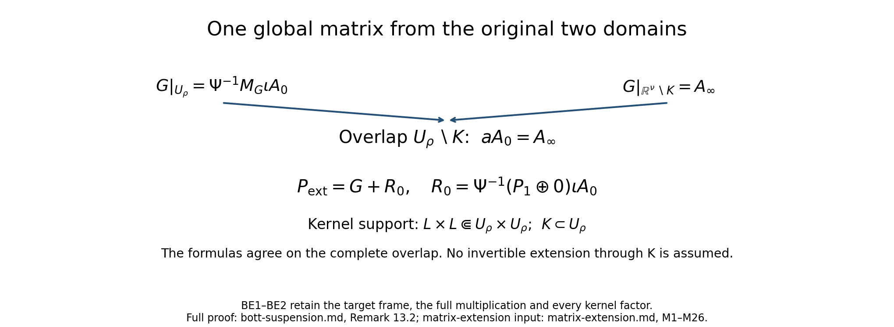

# The Bott operator, suspension, and reduction of the index to Euclidean space

*Written by Claude Opus 5.5 (Anthropic), September 2026. Self-checked by the writing AI. Public domain (CC0).*

*Edited and supplemented by Codex, September 2026. The additions and editorial corrections are also public domain (CC0).*

This lesson moves the index of an elliptic operator on a compact manifold to an operator on a Euclidean space. The route has four steps.

1. We build one operator of index one on \(\mathbb R^n\), the Bott operator. It uses only the Euclidean structure of \(\mathbb R^n\), so it commutes with the orthogonal group. Its index is computed from an energy identity for the harmonic oscillator (Sections 2–8).
2. We combine an elliptic symbol on a compact manifold \(Y\) with the Bott symbol along the fibres of a Euclidean vector bundle over \(Y\), and we prove that the index does not change. This is the suspension theorem (Sections 9–11).
3. We embed \(Y\) in some \(\mathbb R^\nu\). Its normal bundle is then diffeomorphic to a tubular neighbourhood of \(Y\), and every vector bundle over a compact manifold becomes trivial after adding a suitable complement (Section 12).
4. We apply the suspension theorem to the normal bundle, trivialize the bundles, and move the operator into the tubular neighbourhood. The result is a square system on \(\mathbb R^\nu\) that equals the identity outside a compact set and has the same index as the operator we started with (Section 13).

After this reduction, an index formula for systems on Euclidean space that are trivial at infinity gives an index formula on every compact manifold. The same strategy, carried out in K-theory, is the embedding proof of the Atiyah–Singer index theorem.

The lesson assumes the index theory of elliptic pseudodifferential operators on a compact manifold, including the index of a continuous symbol and its homotopy invariance, from the lesson [Symbols, finite defects, and the index on a closed manifold](global-elliptic-symbol-index.md). It also uses Fredholm theory in Banach spaces (Finite defects under perturbation), the Euclidean symbol calculus ([From symbol estimates to operators on every Sobolev scale](euclidean-symbol-calculus.md)), symbols for a slowly varying metric ([Localizing symbols when the measuring scale moves](metric-localization.md), [Two measuring scales, one Weyl product](weyl-metric-products.md) and [When a moving symbol scale controls an operator](metric-operator-bounds.md)), and pseudodifferential operators on manifolds ([Detecting regularity without choosing coordinates](geometric-microlocal-calculus.md)). The facts we use are stated in full in Section 1.

The proof inputs are the linked course lessons; Section 17 writes out the additional receiving arguments.

## 1. Conventions and background

### Conventions

- \(D_j=-i\partial_j\). The Fourier transform is \(\widehat u(\xi)=\int e^{-ix\cdot\xi}u(x)\,dx\), and a symbol \(a(x,\xi)\) acts by left quantization,
\[
a(x,D)u(x)=\operatorname{Op}(a)u(x)=(2\pi)^{-n}\int e^{ix\cdot\xi}a(x,\xi)\widehat u(\xi)\,d\xi .
\]
This is the convention of the lessons [From symbol estimates to operators on every Sobolev scale](euclidean-symbol-calculus.md) and [Symbols, finite defects, and the index on a closed manifold](global-elliptic-symbol-index.md).
- Inner products are linear in the first argument: \((u,v)=\int\langle u(x),v(x)\rangle\,dx\). Norms without a subscript are \(L^2\) norms.
- \(\langle x\rangle=(1+|x|^2)^{1/2}\). For \(X=(x,\xi)\in\mathbb R^{2n}\) we write \(R(X)=(1+|x|^2+|\xi|^2)^{1/2}\).
- A *metric* on \(\mathbb R^{2n}\) is a field \(X\mapsto g_X\) of positive definite quadratic forms. For a metric \(g\) and a positive function \(m\) (a *weight*), the class \(S(m,g)\) consists of the smooth functions \(a\) on \(\mathbb R^{2n}\) such that, for every \(k\), \(|D^ka(X)[T_1,\dots,T_k]|\le C_k\,m(X)\prod_{i=1}^kg_X(T_i)^{1/2}\) for all \(X,T_1,\dots,T_k\in\mathbb R^{2n}\). The best constants \(C_k\) are the seminorms of \(a\).
- The classes \(S^m_{1,0}\) and \(S^m_{\mathrm{phg}}\) on \(\mathbb R^n\times\mathbb R^n\) have bounds uniform in \(x\): \(|\partial_\xi^\alpha\partial_x^\beta a(x,\xi)|\le C_{\alpha\beta}\langle\xi\rangle^{m-|\alpha|}\). "Classical" means polyhomogeneous: for large \(|\xi|\), \(a\) has an asymptotic expansion in terms that are homogeneous in \(\xi\) of degrees \(m,m-1,m-2,\dots\). Symbols may take values in linear maps between fixed finite-dimensional Hermitian spaces; products keep their order.
- Manifolds are Hausdorff and second countable. A compact manifold has no boundary. On a compact manifold, \(\Psi^m_{\mathrm{cl}}(X;E,F)\) is the space of classical pseudodifferential operators of order \(m\) from sections of \(E\) to sections of \(F\). Usually \(E\) and \(F\) contain the factor \(\Omega^{1/2}\), the bundle of half-densities, so that the \(L^2\) pairing of sections needs no choice of measure. The *geometric adjoint* \(P^*\) of \(P\) is its adjoint for this pairing and the Hermitian metrics. The *symbol index* \(\operatorname{s-ind}\) of a continuous symbol is recalled in Fact 1.13. By a *homotopy* of continuous symbols we mean a jointly continuous family that is invertible outside one compact set; by Fact 1.13(a) it preserves \(\operatorname{s-ind}\).
- Two metrics on \(\mathbb R^{2n}\) recur:
\[
g=\frac{|dx|^2+|d\xi|^2}{1+|x|^2+|\xi|^2},\qquad
G=\frac{|dx|^2}{1+|x|^2}+\frac{|d\xi|^2}{1+|\xi|^2}.
\tag{1.1}
\]
The first treats \(x\) and \(\xi\) alike; it is the natural metric for the harmonic oscillator. The second is a product metric.

### Proofs used from earlier lessons

The following facts are proved in the preceding course lessons linked after each statement. Their hypotheses and conclusions are stated here so that each application can be checked at its full generality. Operators between Banach spaces are bounded and linear. An operator is *Fredholm* if its kernel and its cokernel are finite-dimensional; its range is then closed, and its *index* is \(\dim\ker-\dim\operatorname{coker}\).

**Fact 1.1** (Compactness test). An operator \(T:X\to Y\) between Banach spaces has finite-dimensional kernel and closed range if and only if every bounded sequence \((x_j)\) for which \((Tx_j)\) converges has a convergent subsequence. In that case, for every closed complement \(M\) of \(\ker T\) there is \(a>0\) with \(\|Tm\|\ge a\|m\|\) for all \(m\in M\). See Finite defects under perturbation.

**Fact 1.2** (Small perturbations). If \(T:X\to Y\) is Fredholm, there is \(\varepsilon>0\) such that for every \(E\) with \(\|E\|<\varepsilon\) the operator \(T+E\) is Fredholm, \(\dim\ker(T+E)\le\dim\ker T\), and \(\operatorname{ind}(T+E)=\operatorname{ind}T\). See Finite defects under perturbation.

**Fact 1.3** (Products, sums and parametrices). If \(A:X\to Y\) and \(B:Y\to Z\) are Fredholm, then \(BA\) is Fredholm and \(\operatorname{ind}(BA)=\operatorname{ind}A+\operatorname{ind}B\). A finite direct sum of Fredholm operators is Fredholm, and its index is the sum of the indices. A bounded bijection has index \(0\). If \(T:X\to Y\) and there are \(L,R:Y\to X\) such that \(LT-I\) and \(TR-I\) are compact, then \(T\) is Fredholm. See Finite defects under perturbation.

**Fact 1.4** (Strongly continuous families). Let \(I\) be a compact space, and let \(T_t:X\to Y\) and \(S_t:Y\to X\), \(t\in I\), be strongly continuous: \(t\mapsto T_tx\) and \(t\mapsto S_ty\) are continuous for each \(x\) and each \(y\). Suppose that the families \(S_tT_t-I\) and \(T_tS_t-I\) are *collectively compact*: the set of all \((S_tT_t-I)x\) with \(t\in I\) and \(\|x\|\le1\) has compact closure, and likewise for the other family. Then every \(T_t\) is Fredholm, the function \(t\mapsto\dim\ker T_t\) is upper semicontinuous, and \(t\mapsto\operatorname{ind}T_t\) is locally constant, hence constant when \(I\) is connected. See Finite defects under perturbation.

**Fact 1.5** (\(L^2\) boundedness). There is an integer \(L_n\), depending only on \(n\), with the following property. If \(a(x,\xi)\) is a smooth matrix-valued function on \(\mathbb R^{2n}\) whose derivatives of order at most \(L_n\) are all bounded by \(M\), then \(\|\operatorname{Op}(a)u\|\le C_nM\|u\|\) for \(u\in\mathcal S(\mathbb R^n)\), so \(\operatorname{Op}(a)\) extends to a bounded operator on \(L^2\). This is a form of the Calderón–Vaillancourt theorem. See [From symbol estimates to operators on every Sobolev scale](euclidean-symbol-calculus.md).

**Fact 1.6** (Kernels of operators of low order). If \(a\in S^q_{1,0}\) with \(q<-n\), the Schwartz kernel \(K(x,y)\) of \(\operatorname{Op}(a)\) is a continuous function, and \(|K(x,y)|\le C_N\langle x-y\rangle^{-N}\) for every \(N\). See [From symbol estimates to operators on every Sobolev scale](euclidean-symbol-calculus.md).

**Fact 1.7** (Composition and asymptotic sums). If \(a\in S^{m_1}_{1,0}\) and \(b\in S^{m_2}_{1,0}\), then \(\operatorname{Op}(a)\operatorname{Op}(b)=\operatorname{Op}(a\circ b)\) with \(a\circ b\in S^{m_1+m_2}_{1,0}\), and \(a\circ b-\sum_{|\alpha|<N}(\partial_\xi^\alpha a)(D_x^\alpha b)/\alpha!\in S^{m_1+m_2-N}_{1,0}\) for every \(N\). If \(a_j\in S^{m_j}_{1,0}\) and \(m_j\to-\infty\), there is \(a\in S^{\max_jm_j}_{1,0}\) with \(a-\sum_{j<k}a_j\in S^{\max_{j\ge k}m_j}_{1,0}\) for every \(k\), and with \(\operatorname{supp}a\subset\bigcup_j\operatorname{supp}a_j\). See [From symbol estimates to operators on every Sobolev scale](euclidean-symbol-calculus.md).

**Fact 1.8** (Elliptic parametrices). Let \(a\in S^m_{1,0}\) take values in square matrices and be uniformly elliptic: \(\|a(x,\xi)v\|\ge c\langle\xi\rangle^m\|v\|\) for all \(x\), all \(v\) and \(|\xi|\ge C\). Choose \(b_0\in S^{-m}_{1,0}\) with \(ab_0=b_0a=I\) for large \(|\xi|\), and put \(r=I-a\circ b_0\) and \(\ell=I-b_0\circ a\), which lie in \(S^{-1}_{1,0}\). Asymptotic sums of the series \(\sum_jb_0\circ r^{\circ j}\) and \(\sum_j\ell^{\circ j}\circ b_0\) give \(b\in S^{-m}_{1,0}\) with \(a\circ b-I\) and \(b\circ a-I\) in \(S^{-\infty}\). Consequently, if \(u\in H^s\) for some \(s\) and \(\operatorname{Op}(a)u\in H^\infty=\bigcap_tH^t\), then \(u\in H^\infty\); in particular \(u\) is smooth. See [From symbol estimates to operators on every Sobolev scale](euclidean-symbol-calculus.md).

**Fact 1.9** (Composition for a slowly varying metric). Let \(\sigma((x,\xi),(y,\eta))=\xi\cdot y-x\cdot\eta\) be the symplectic form on \(\mathbb R^{2n}\). For a metric \(g\), let \(g^\sigma_X(T)=\sup_{S\ne0}\sigma(T,S)^2/g_X(S)\) be its dual metric, and \(h(X)^2=\sup_{T\ne0}g_X(T)/g^\sigma_X(T)\) its *Planck function*. Assume:
- \(g\) is *slowly varying*: there are \(c,C>0\) such that \(g_X(Y-X)\le c\) implies \(C^{-1}g_X\le g_Y\le Cg_X\);
- \(g\) is *symplectically temperate*: \(g\le g^\sigma\), and \(g^\sigma_X(T)\le Cg^\sigma_Y(T)\bigl(1+g^\sigma_Y(X-Y)\bigr)^N\) for all \(X,Y,T\);
- \(g_{(x,\xi)}(t,\tau)=g_{(x,\xi)}(t,-\tau)\).

Let the weights \(m_1,m_2\) be \(g\)-continuous (\(g_X(Y-X)\le c\) implies \(C^{-1}\le m(Y)/m(X)\le C\)) and temperate (\(m(Y)\le Cm(X)(1+g^\sigma_Y(X-Y))^N\)). If \(a\in S(m_1,g)\) and \(b\in S(m_2,g)\), then \(\operatorname{Op}(a)\operatorname{Op}(b)=\operatorname{Op}(a\circ b)\) on \(\mathcal S\), and \(a\circ b-ab\in S(hm_1m_2,g)\). Each seminorm of \(a\circ b-ab\) is bounded by a constant times a product of finitely many seminorms of \(a\) and of \(b\), and the constant depends only on \(n\), on the seminorm and on the constants in the hypotheses. See [When a moving symbol scale controls an operator](metric-operator-bounds.md).

The complete split-metric receiving proof is [Section 17.1](#AN03-BOTT-P261-1), (P261.1)–(P261.7). It combines [Quadratic Fourier multipliers at a moving scale](gauss-transform-estimates.md), Theorems 7.1 and 8.1 and (G24)–(G26), [Two measuring scales, one Weyl product](weyl-metric-products.md), (W31)–(W34), and [From Weyl symbols to operators and changes of coordinates](weyl-covariance-action.md), (A21), (A25), (A33)–(A43).

In Facts 1.10–1.16, \(X\) is a compact manifold and \(E,F\) are Hermitian vector bundles over it.

**Fact 1.10** (Rellich compactness). For \(\delta>0\) the inclusion \(H^{s+\delta}(X;E)\to H^s(X;E)\) is compact. We also use the local form: a set of distributions on \(\mathbb R^n\) that are supported in one fixed compact set and bounded in \(H^1(\mathbb R^n)\) is relatively compact in \(L^2(\mathbb R^n)\). See [Symbols, finite defects, and the index on a closed manifold](global-elliptic-symbol-index.md).

**Fact 1.11** (The elliptic alternative). Let \(P\in\Psi^m_{\mathrm{cl}}(X;E\otimes\Omega^{1/2},F\otimes\Omega^{1/2})\) be elliptic. Then \(P:H^s\to H^{s-m}\) is Fredholm for every \(s\). The kernel of \(P\) and the kernel of its geometric adjoint \(P^*\) consist of smooth sections and do not depend on \(s\), and \(\operatorname{ind}P=\dim\ker P-\dim\ker P^*\). The kernel and cokernel have the same dimensions when \(P\) acts on smooth sections. The index of a product of elliptic operators is the sum of their indices, and a formally self-adjoint elliptic operator has index \(0\). See [Symbols, finite defects, and the index on a closed manifold](global-elliptic-symbol-index.md).

**Fact 1.12** (Building operators). If \(U\) is a coordinate chart of \(X\) over which \(E\) and \(F\) are trivial, then a classical operator of order \(m\) on \(\mathbb R^n\) whose Schwartz kernel has compact support in \(U\times U\) defines, after extension by zero, an element of \(\Psi^m_{\mathrm{cl}}(X;E,F)\). For every smooth section \(s\) of \(\operatorname{Hom}(\pi^*E,\pi^*F)\) over \(T^*X\setminus0\) that is homogeneous of degree \(m\), there is \(P\in\Psi^m_{\mathrm{cl}}(X;E,F)\) with principal symbol \(s\). See [Detecting regularity without choosing coordinates](geometric-microlocal-calculus.md).

**Fact 1.13** (The index of a continuous symbol). Let \(p\) be a continuous section of \(\operatorname{Hom}(\pi^*E,\pi^*F)\) over \(T^*X\) that is invertible outside a compact set \(K\). Let \(h\) be the length function of a Riemannian metric on the fibres of \(T^*X\), and choose \(R>0\) with \(K\subset\{h<R\}\). The radial restriction \(p_R(x,\xi)=p(x,R\xi/h(x,\xi))\) is a continuous invertible symbol of degree \(0\) on \(T^*X\setminus0\). A smooth symbol that approximates it closely enough, uniformly on the unit cosphere bundle, is elliptic; the index of any of its quantizations is the *symbol index* \(\operatorname{s-ind}p\), and it does not depend on the choices. It has these properties.
- (a) *Homotopy invariance.* If \(p_t\), \(0\le t\le1\), is jointly continuous in \((t,x,\xi)\) and every \(p_t\) is invertible outside one compact set, then \(\operatorname{s-ind}p_t\) does not depend on \(t\).
- (b) *Agreement with the index.* If \(P\in\Psi^m_{\mathrm{cl}}\) is elliptic, then \(\operatorname{ind}P=\operatorname{s-ind}p\), where \(p\) is the principal symbol of \(P\), extended in any continuous way across a neighbourhood of the zero section.
- (c) *Smoothing.* A continuous section of a vector bundle over the compact cosphere bundle can be approximated uniformly by smooth sections.
- (d) *Reduction to degree one.* If every component of \(X\) has positive dimension, then \(p\) is homotopic, through continuous symbols invertible outside one compact set, to a symbol that is homogeneous of degree \(1\), smooth and invertible off the zero section.
- (e) *Zero-dimensional components.* If \(X\) is a finite set, then \(\operatorname{s-ind}p=\sum_{x\in X}(\operatorname{rank}E_x-\operatorname{rank}F_x)\). In general the symbol index is the sum of its values on the components of \(X\).

See [Symbols, finite defects, and the index on a closed manifold](global-elliptic-symbol-index.md).

**Fact 1.14** (Norm limits). Let \(P_j\in\Psi^m_{\mathrm{cl}}(X;E,F)\), and let \(P\) be a linear map on smooth sections that extends to bounded maps \(H^s\to H^{s-m}\) with \(\|P_j-P\|_{H^s\to H^{s-m}}\to0\) for every real \(s\). Suppose that the principal symbols of the \(P_j\) converge, uniformly on the unit cosphere bundle, to a continuous symbol \(p\), homogeneous of degree \(m\) and invertible on \(T^*X\setminus0\). Then \(P:H^s\to H^{s-m}\) is Fredholm for every \(s\). The kernels of \(P\) and of its geometric adjoint \(P^*\) consist of smooth sections and do not depend on \(s\), the range of \(P\) is the annihilator of \(\ker P^*\), and \(\operatorname{ind}P=\dim\ker P-\dim\ker P^*=\operatorname{s-ind}p\). See [Symbols, finite defects, and the index on a closed manifold](global-elliptic-symbol-index.md).

**Fact 1.15** (Partial operators). Let \(z=(x,y)\in\mathbb R^n\times\mathbb R^{n'}\), with dual variables \((\xi,\eta)\). Let \(a(z,\xi)\) be a classical symbol of order \(m>0\) in \(\xi\), with symbol bounds uniform in \(z\) and principal part \(a_m\), and let \(A=a(z,D_x)\) act in \(x\) with \(y\) as a parameter. Then \(A\) maps \(H^{s+m}(\mathbb R^{n+n'})\) to \(H^s(\mathbb R^{n+n'})\) for every real \(s\). Moreover there are classical operators \(A_\varepsilon\), \(0<\varepsilon\le1\), of order \(m\) on \(\mathbb R^{n+n'}\) with \(\|A_\varepsilon-A\|_{H^{s+m}\to H^s}\le C_s\varepsilon^m\) for every real \(s\), whose principal symbols differ from \(a_m(z,\xi)\) (extended by \(0\) at \(\xi=0\)) by at most \(C\varepsilon^m\) on the unit sphere \(|\xi|^2+|\eta|^2=1\). See [Symbols, finite defects, and the index on a closed manifold](global-elliptic-symbol-index.md).

**Fact 1.16** (Products of symbols). Let \(X\) and \(Y\) be compact manifolds. Let \(p\) be a continuous symbol on \(T^*X\) from \(E_X\) to \(F_X\), and \(q\) one on \(T^*Y\) from \(E_Y\) to \(F_Y\), both invertible outside compact sets. On \(T^*(X\times Y)=T^*X\times T^*Y\), the block symbol \(d(p,q)=\begin{pmatrix}p\otimes I&-I\otimes q^*\\ I\otimes q&p^*\otimes I\end{pmatrix}\), from \((E_X\otimes E_Y)\oplus(F_X\otimes F_Y)\) to \((F_X\otimes E_Y)\oplus(E_X\otimes F_Y)\), is invertible outside a compact set, and \(\operatorname{s-ind}d(p,q)=\operatorname{s-ind}p\cdot\operatorname{s-ind}q\). This holds also when \(X\) or \(Y\) is a finite set. See [Symbols, finite defects, and the index on a closed manifold](global-elliptic-symbol-index.md).

**Fact 1.17** (Differential topology). The inverse function theorem. Smooth partitions of unity exist subordinate to every open cover, with the support of each function a closed set inside its member of the cover. Green's formula \(\int_M\langle\Delta u,u\rangle\,dV=\int_M|du|^2\,dV\) holds for the nonnegative Laplace–Beltrami operator \(\Delta\) of a compact Riemannian manifold \(M\), applied to each component of a vector-valued function.

The complete inverse, subordinate-support partition and Green proofs are [Section 17.2](#AN03-BOTT-P261-2), (P261.8)–(P261.15). Their independent calculus, compactness, cutoff and inversion entries are [Metric and topological foundations](metric-foundation-bridges.md), Sections 5, 9, 12.4–12.8, 13.4–13.6 and 14.2.

**Fact 1.18** (Hilbert spaces). Riesz representation: every bounded linear functional on a Hilbert space \(H\) is \(u\mapsto(u,v)\) for a unique \(v\in H\). An integral operator whose kernel lies in \(L^2(\mathbb R^k\times\mathbb R^k)\) is compact on \(L^2(\mathbb R^k)\), and its norm is at most the \(L^2\) norm of the kernel.

The complete linear-first Hilbert representation and compact-kernel receiver are [Section 17.3](#AN03-BOTT-P261-3), (P261.16)–(P261.20). See also [Lower-bounded spectral calculus](lower-bounded-spectral-calculus.md), Section 2.3, (PR37)–(PR38), and [Banach and Hilbert foundations](banach-foundation-bridges.md), (LP3)–(LP4), (LP10)–(LP12), for product integration, completeness and compact smooth density.

**Fact 1.19** (Integration and compactness). Dominated convergence. The Arzelà–Ascoli theorem: a set of continuous functions on a compact metric space that is uniformly bounded and equicontinuous is relatively compact in the uniform norm.

The complete dominated-convergence and Arzelà–Ascoli receivers are [Section 17.4](#AN03-BOTT-P261-4), (P261.21)–(P261.23). Their independent integration and metric compactness providers are [Banach and Hilbert foundations](banach-foundation-bridges.md), Section 15.1, (LP1)–(LP2), and Section 16.1, and [Metric and topological foundations](metric-foundation-bridges.md), Sections 7 and 14.1.

**Fact 1.20** (Distributions with zero gradient). A distribution on a connected open subset of \(\mathbb R^n\) whose first partial derivatives all vanish is a constant function.

The complete compact primitive decomposition and connected-domain distribution proof are [Section 17.5](#AN03-BOTT-P261-5), (P261.24)–(P261.27). Their cutoff, coordinate integration and derivative entries are [Metric and topological foundations](metric-foundation-bridges.md), Sections 5 and 13.4–13.6, and [Banach and Hilbert foundations](banach-foundation-bridges.md), Sections 15.1 and 15.5.

## 2. The model \(x+d/dx\) on the line

We need an operator of index one on \(\mathbb R^n\) that uses only the Euclidean structure. In one dimension there is a simple candidate: \(x+d/dx\), which is \(\sqrt2\) times the annihilation operator of the harmonic oscillator. First we fix the space on which it acts.

**Definition 2.1.** Let
\[
\mathcal B=\mathcal B(\mathbb R^n)=\{u\in L^2(\mathbb R^n):\ x_ju\in L^2,\ D_ju\in L^2,\ j=1,\dots,n\},
\qquad
\|u\|_{\mathcal B}^2=\|u\|^2+\sum_j\bigl(\|x_ju\|^2+\|D_ju\|^2\bigr),
\tag{2.1}
\]
with derivatives in the sense of distributions. For a finite-dimensional Hermitian space \(W\) we write \(\mathcal B\otimes W\) for the \(W\)-valued functions whose coefficients lie in \(\mathcal B\).

**Lemma 2.2.** (1) \(\mathcal B\) is a Hilbert space, and \(C_c^\infty(\mathbb R^n)\) is dense in it. (2) The inclusion \(\mathcal B\to L^2\) is compact.

**Proof.** (1) If \(u_k\) is Cauchy in \(\mathcal B\), then \(u_k\), \(x_ju_k\) and \(D_ju_k\) converge in \(L^2\) to some \(u,f_j,h_j\). Limits in \(L^2\) are limits in distributions, so \(f_j=x_ju\) and \(h_j=D_ju\). For density, fix \(\chi\in C_c^\infty\) with \(0\le\chi\le1\) and \(\chi=1\) for \(|x|\le1\), and put \(\chi_R(x)=\chi(x/R)\). Fix \(R_\chi\ge2\) with \(\operatorname{supp}\chi\subset\{|x|\le R_\chi\}\). For \(u\in\mathcal B\), dominated convergence gives \(\chi_Ru\to u\) and \(\chi_Rx_ju\to x_ju\) in \(L^2\). Also \(D_j(\chi_Ru)=\chi_RD_ju+R^{-1}(D_j\chi)(x/R)u\to D_ju\). So compactly supported elements are dense. If \(u\in\mathcal B\) vanishes outside the ball of radius \(r\), let \(u_\epsilon=\rho_\epsilon*u\) with a mollifier supported in \(|x|\le\epsilon\le1\). Then \(u_\epsilon\in C_c^\infty\), \(u_\epsilon\to u\) and \(D_ju_\epsilon=\rho_\epsilon*D_ju\to D_ju\) in \(L^2\). All supports lie in the ball of radius \(r+1\), so \(\|x_j(u_\epsilon-u)\|\le(r+1)\|u_\epsilon-u\|\to0\).

(2) Let \(u_k\) be bounded in \(\mathcal B\), say \(\|u_k\|_{\mathcal B}\le M\). For each \(R\ge1\), the functions \(\chi_Ru_k\) are bounded in \(H^1(\mathbb R^n)\) and vanish outside the ball of radius \(R_\chi R\). By the local form of Rellich's theorem (Fact 1.10), \(\chi_Ru_k\) has an \(L^2\)-convergent subsequence. The tails are small uniformly: \(\|(1-\chi_R)u_k\|\le R^{-1}\||x|u_k\|\le M/R\). Take successive subsequences for \(R=1,2,\dots\) and then the diagonal subsequence. For it, \(\|u_k-u_l\|\le\|\chi_R(u_k-u_l)\|+2M/R\), so it is Cauchy in \(L^2\). \(\square\)

**Proposition 2.3** (The model). Let \(n=1\), \(H_1=\mathcal B(\mathbb R)\), \(H_0=L^2(\mathbb R)\), and \(P=x+iD=x+d/dx\). Then for \(u\in H_1\)
\[
\|Pu\|^2=\|xu\|^2+\|Du\|^2-\|u\|^2 .
\tag{2.2}
\]
\(P:H_1\to H_0\) is bounded and surjective, its kernel is spanned by \(e^{-x^2/2}\), and \(P\) is Fredholm of index \(1\).

**Proof.** *Identity (2.2).* For \(u\in C_c^\infty\), \(\|u'+xu\|^2=\|xu\|^2+\|u'\|^2+2\operatorname{Re}(xu,u')\), and \(2\operatorname{Re}(xu,u')=\int x\,(|u|^2)'\,dx=-\int|u|^2\,dx\). Both sides of (2.2) are continuous in the norm of \(H_1\), so Lemma 2.2(1) extends the identity to \(H_1\). In particular \(\|Pu\|\le\|u\|_{\mathcal B}\).

*Kernel.* If \(Pu=0\) as a distribution, then \((e^{x^2/2}u)'=e^{x^2/2}(u'+xu)=0\). A distribution on \(\mathbb R\) with zero derivative is constant (Fact 1.20), so \(u=Ce^{-x^2/2}\), and this function lies in \(H_1\).

*Closed range and finite kernel.* We use the compactness test (Fact 1.1). Let \(u_k\) be bounded in \(H_1\) with \(Pu_k\) convergent. By Lemma 2.2(2) a subsequence converges in \(L^2\). Apply (2.2) to differences:
\(\|x(u_k-u_l)\|^2+\|D(u_k-u_l)\|^2=\|P(u_k-u_l)\|^2+\|u_k-u_l\|^2\to0\).
So the subsequence is Cauchy in \(H_1\). Hence \(P\) has finite-dimensional kernel and closed range.

*Dense range.* Let \(v\in L^2\) be orthogonal to \(PH_1\). Then \(\int(\varphi'+x\varphi)\overline v\,dx=0\) for every \(\varphi\in C_c^\infty\). As a distribution this says \(x\overline v-(\overline v)'=0\), so \((e^{-x^2/2}\overline v)'=0\) and \(\overline v=Ce^{x^2/2}\). This is in \(L^2\) only if \(C=0\).

A closed dense range is everything, so \(P\) is surjective. The index is \(1-0=1\). \(\square\)

The adjoint direction behaves in the opposite way: \(x-d/dx\) is injective on \(H_1\) and its range has codimension one (Exercise 14.1). Proposition 2.3 is the case \(n=1\) of Proposition 4.4 below: for \(n=1\) the operator \(p(x+iD)\) of Section 4 is exactly \(x+d/dx\).

## 3. The exterior algebra and the odd–even symbol \(p(w)\)

To go from one dimension to \(n\), we need a matrix-valued symbol \(p(w)\), linear over \(\mathbb R\) in \(w\in\mathbb C^n\), whose values are invertible for \(w\ne0\). The exterior algebra provides one.

Let \(\Lambda=\Lambda(\mathbb C^n)=\bigoplus_{q=0}^n\Lambda^q\) be the exterior algebra of \(\mathbb C^n\). We give \(\mathbb C^n\) the inner product \(\langle z,w\rangle=\sum_jz_j\overline{w_j}\), and \(\Lambda^q\) the inner product
\[
\langle u_1\wedge\dots\wedge u_q,\ v_1\wedge\dots\wedge v_q\rangle=\det\bigl(\langle u_i,v_k\rangle\bigr)_{i,k=1}^q,
\]
with different degrees orthogonal. For \(J=\{j_1<\dots<j_q\}\) put \(e_J=e_{j_1}\wedge\dots\wedge e_{j_q}\). These vectors form an orthonormal basis. Write \(\Lambda^e=\bigoplus_q\Lambda^{2q}\) and \(\Lambda^o=\bigoplus_q\Lambda^{2q+1}\). For \(w\in\mathbb C^n\) let \(\Lambda(w)v=w\wedge v\) and let \(\Lambda(w)^*\) be its adjoint. Put \(\varepsilon_j=\Lambda(e_j)\), \(\iota_j=\varepsilon_j^*\), and \(\mathcal N=\sum_j\varepsilon_j\iota_j\).

**Lemma 3.1.** (1) Let \(\sigma(j,J)=(-1)^{\#\{k\in J:\,k<j\}}\). Then \(\varepsilon_je_J=\sigma(j,J)e_{J\cup\{j\}}\) if \(j\notin J\) and \(0\) otherwise; \(\iota_je_J=\sigma(j,J)e_{J\setminus\{j\}}\) if \(j\in J\) and \(0\) otherwise.

(2) For all \(j,l\):
\[
\varepsilon_j\varepsilon_l+\varepsilon_l\varepsilon_j=0,\qquad
\iota_j\iota_l+\iota_l\iota_j=0,\qquad
\varepsilon_j\iota_l+\iota_l\varepsilon_j=\delta_{jl}I .
\tag{3.1}
\]
(3) \(\Lambda(w)=\sum_jw_j\varepsilon_j\), \(\Lambda(w)^*=\sum_j\overline{w_j}\iota_j\), \(\Lambda(w)^2=0\), and
\[
\Lambda(w)\Lambda(w)^*+\Lambda(w)^*\Lambda(w)=|w|^2I .
\tag{3.2}
\]
Also \(\mathcal Ne_J=|J|\,e_J\): the operator \(\mathcal N\) multiplies a form of degree \(q\) by \(q\).

**Proof.** (1) To write \(e_j\wedge e_J\) in increasing order, move \(e_j\) past the elements of \(J\) that are smaller than \(j\); each move gives a factor \(-1\). If \(J=K\cup\{j\}\) with \(j\notin K\), then \((\varepsilon_je_K,e_J)=\sigma(j,K)=\sigma(j,J)\), and all other inner products vanish; this gives \(\iota_j\).

(2) The first relation is \(e_j\wedge e_l=-e_l\wedge e_j\); the second is its adjoint. For the third, take \(j=l\) first. If \(j\in J\) then \(\varepsilon_j\iota_je_J=e_J\) (the two signs are equal) and \(\iota_j\varepsilon_je_J=0\); if \(j\notin J\) the roles swap. Now let \(j\ne l\). Both \(\varepsilon_j\iota_le_J\) and \(\iota_l\varepsilon_je_J\) vanish unless \(l\in J\) and \(j\notin J\). Then both are multiples of \(e_K\), \(K=(J\setminus\{l\})\cup\{j\}\):
\[
\varepsilon_j\iota_le_J=\sigma(l,J)\sigma(j,J\setminus\{l\})e_K,\qquad
\iota_l\varepsilon_je_J=\sigma(j,J)\sigma(l,J\cup\{j\})e_K .
\]
If \(j<l\), then \(\sigma(j,J\setminus\{l\})=\sigma(j,J)\) and \(\sigma(l,J\cup\{j\})=-\sigma(l,J)\). If \(j>l\), then \(\sigma(j,J\setminus\{l\})=-\sigma(j,J)\) and \(\sigma(l,J\cup\{j\})=\sigma(l,J)\). In both cases the two terms cancel.

(3) The first two formulas follow from linearity of \(w\mapsto w\wedge v\) and conjugate-linearity of the adjoint. \(\Lambda(w)^2v=w\wedge w\wedge v=0\). By (3.1), \(\Lambda(w)\Lambda(w)^*+\Lambda(w)^*\Lambda(w)=\sum_{j,l}w_j\overline{w_l}(\varepsilon_j\iota_l+\iota_l\varepsilon_j)=\sum_j|w_j|^2I\). Finally \(\varepsilon_j\iota_je_J=e_J\) for \(j\in J\) and \(0\) otherwise. \(\square\)

**Proposition 3.2.** Let \(w\in\mathbb C^n\setminus\{0\}\).

1. (Koszul complex.) The sequence \(0\to\Lambda^0\to\Lambda^1\to\dots\to\Lambda^n\to0\), with every map equal to \(\Lambda(w)\), is exact.
2. (Odd–even symbol.) Let \(A=\Lambda(w)+\Lambda(w)^*\) and \(p(w)=A|_{\Lambda^e}:\Lambda^e\to\Lambda^o\). The adjoint of \(p(w)\) is \(A|_{\Lambda^o}\), and
\[
p(w)^*p(w)=|w|^2I_{\Lambda^e},\qquad p(w)p(w)^*=|w|^2I_{\Lambda^o}.
\tag{3.3}
\]
So \(p(w)\) is invertible, \(p(w)^{-1}=p(w)^*/|w|^2\), and \(p(w)/|w|\) is unitary.
3. If \(n\ge1\), then \(\dim\Lambda^e=\dim\Lambda^o=2^{n-1}\). If \(n=0\), then \(\Lambda^e=\mathbb C\) and \(\Lambda^o=0\).
4. For \(x,\xi\in\mathbb R^n\), \(p(x+i\xi)=\sum_j(x_j+i\xi_j)\varepsilon_j+\sum_j(x_j-i\xi_j)\iota_j\) on \(\Lambda^e\). So \(p\) is real-linear in \((x,\xi)\).
5. For \(O\in O(n)\) let \(\Lambda(O)\) act by \(\Lambda(O)(u_1\wedge\dots\wedge u_q)=Ou_1\wedge\dots\wedge Ou_q\). Then \(\Lambda(O)\) is unitary, preserves \(\Lambda^e\) and \(\Lambda^o\), and
\[
p(Ow)=\Lambda(O)\,p(w)\,\Lambda(O)^{-1},\qquad Ow=Ox+iO\xi .
\tag{3.4}
\]

**Proof.** (1) \(\Lambda(w)^2=0\), so each range lies in the next kernel. If \(\Lambda(w)v=0\), then (3.2) gives \(v=\Lambda(w)\bigl(|w|^{-2}\Lambda(w)^*v\bigr)\), so \(v\) is in the range. (The map \(|w|^{-2}\Lambda(w)^*\) is a contracting homotopy.)

(2) \(A\) is self-adjoint and changes the degree by \(\pm1\), so it maps \(\Lambda^e\) to \(\Lambda^o\) and back. Since \(\Lambda^e\perp\Lambda^o\), the adjoint of \(A|_{\Lambda^e}\) is \(A|_{\Lambda^o}\). By Lemma 3.1(3), \(A^2=\Lambda(w)^2+(\Lambda(w)^*)^2+\Lambda(w)\Lambda(w)^*+\Lambda(w)^*\Lambda(w)=|w|^2I\). Restricting to \(\Lambda^e\) and to \(\Lambda^o\) gives (3.3).

(3) If \(n\ge1\), \(p(e_1)\) is unitary from \(\Lambda^e\) onto \(\Lambda^o\), so the dimensions agree; they add up to \(2^n\). This matches the count \(\sum_q(-1)^q\binom nq=(1-1)^n=0\). If \(n=0\), \(\Lambda=\Lambda^0=\mathbb C\).

(4) This is Lemma 3.1(3) with \(w_j=x_j+i\xi_j\).

(5) \(O\) is real and orthogonal, so it preserves \(\langle\cdot,\cdot\rangle\) on \(\mathbb C^n\). The determinant formula then shows that \(\Lambda(O)\) preserves inner products, and it is invertible with inverse \(\Lambda(O^{-1})\). It preserves degrees. From \(\Lambda(O)(w\wedge v)=Ow\wedge\Lambda(O)v\) we get \(\Lambda(O)\Lambda(w)=\Lambda(Ow)\Lambda(O)\). Taking adjoints and using unitarity gives \(\Lambda(O)\Lambda(w)^*=\Lambda(Ow)^*\Lambda(O)\). Add the two identities and restrict to \(\Lambda^e\). \(\square\)

**Remark 3.3.** The invertibility of \(p(w)\) is the finite-dimensional case of a general fact about complexes: for an exact complex, the odd–even operator \(d+d^*\), from the even to the odd part, has zero kernel, and its index is the Euler characteristic, which is zero. See Traces that survive passage to cohomology. The identity (3.3) gives more: an explicit inverse, with norm \(1/|w|\).

**Example 3.4** (Two small cases). For \(n=1\), \(\Lambda^e=\mathbb C\cdot1\), \(\Lambda^o=\mathbb C e_1\), and \(p(w)1=we_1\); so \(p(w)\) is multiplication by \(w\). For \(n=2\), in the bases \(\{1,e_1\wedge e_2\}\) of \(\Lambda^e\) and \(\{e_1,e_2\}\) of \(\Lambda^o\),
\[
p(w)=\begin{pmatrix}w_1&-\overline{w_2}\\ w_2&\overline{w_1}\end{pmatrix},\qquad \det p(w)=|w|^2 .
\]
Indeed \(p(w)1=w_1e_1+w_2e_2\), and \(p(w)(e_1\wedge e_2)=\Lambda(w)^*(e_1\wedge e_2)=\overline{w_1}e_2-\overline{w_2}e_1\) by Lemma 3.1(1).

## 4. The Bott oscillator \(p(x+iD)\)

We now replace \(w=x+i\xi\) by the operators \(x+iD\). The result is an operator of index one on \(\mathbb R^n\) for every \(n\).

A *form* on \(\mathbb R^n\) is a function \(u=\sum_Ju_Je_J\) with values in \(\Lambda\); operators on functions act on each coefficient \(u_J\). Put
\[
a_j=x_j+\partial_j=x_j+iD_j,\qquad a_j^\dagger=x_j-\partial_j,\qquad
d_x=\sum_ja_j\varepsilon_j,\quad \delta_x=\sum_ja_j^\dagger\iota_j,\quad \mathcal D=d_x+\delta_x .
\]
Thus \(d_x\) and \(\delta_x\) come from \(\Lambda(w)\) and \(\Lambda(w)^*\) in Lemma 3.1(3) when \(a_j\) replaces \(w_j\) and \(a_j^\dagger\) replaces \(\overline{w_j}\). By Proposition 3.2(4), the symbol of \(\mathcal D\) is \(\Lambda(x+i\xi)+\Lambda(x+i\xi)^*\). Each term contains either \(x_j\) or \(\xi_j\) alone, so every quantization gives the same operator. We write
\[
P=p(x+iD)=\mathcal D\big|_{\text{even forms}},\qquad H_1=\mathcal B\otimes\Lambda^e,\qquad H_0=L^2\otimes\Lambda^o ,
\]
and \(\mathsf g(x)=e^{-|x|^2/2}\), regarded as a form of degree \(0\). Here \(\mathcal B\) is the space (2.1).

**Lemma 4.1** (Algebra). On smooth forms, and on distributions:
1. \([a_j,a_l]=0\), \([a_j^\dagger,a_l^\dagger]=0\), \([a_j,a_l^\dagger]=2\delta_{jl}\).
2. \(d_x=e^{-|x|^2/2}\circ d\circ e^{|x|^2/2}\), where \(d=\sum_j\partial_j\varepsilon_j\) is the exterior derivative. Also \(d_x^2=0\) and \(\delta_x^2=0\).
3. With \(\mathcal N\) the degree operator of Lemma 3.1,
\[
\mathcal D^2=d_x\delta_x+\delta_xd_x=\sum_ja_j^\dagger a_j+2\mathcal N .
\tag{4.1}
\]
4. \(\sum_ja_j^\dagger a_j=-\Delta+|x|^2-n\) on each coefficient.

**Proof.** (1) Using \([\partial_j,x_l]=\delta_{jl}\): \([x_j+\partial_j,x_l-\partial_l]=[\partial_j,x_l]-[x_j,\partial_l]=2\delta_{jl}\), while \([x_j+\partial_j,x_l+\partial_l]=\delta_{jl}-\delta_{jl}=0\), and similarly for \(a^\dagger\). (2) \(e^{-|x|^2/2}\partial_j(e^{|x|^2/2}f)=\partial_jf+x_jf\). In \(d_x^2=\sum_{j,l}a_ja_l\varepsilon_j\varepsilon_l\) the factor \(a_ja_l\) is symmetric in \((j,l)\) and \(\varepsilon_j\varepsilon_l\) is antisymmetric by (3.1), so the sum vanishes; the same argument works for \(\delta_x\). (3) The scalar operators \(a_j,a_l^\dagger\) commute with the constant matrices \(\varepsilon_j,\iota_l\). Writing \(a_ja_l^\dagger=a_l^\dagger a_j+2\delta_{jl}\),
\[
d_x\delta_x+\delta_xd_x=\sum_{j,l}a_l^\dagger a_j(\varepsilon_j\iota_l+\iota_l\varepsilon_j)+2\sum_j\varepsilon_j\iota_j=\sum_ja_j^\dagger a_j+2\mathcal N
\]
by (3.1). (4) \((x_j-\partial_j)(x_j+\partial_j)=x_j^2-\partial_j^2+x_j\partial_j-\partial_jx_j=x_j^2-\partial_j^2-1\). \(\square\)

**Lemma 4.2** (Energy identity). For \(u\in\mathcal B\otimes\Lambda\) with degree components \(u_q\),
\[
\|\mathcal Du\|^2=\sum_j\|a_ju\|^2+2\sum_qq\,\|u_q\|^2,
\tag{4.2}
\]
\[
\sum_j\|a_ju\|^2=\sum_j\bigl(\|x_ju\|^2+\|D_ju\|^2\bigr)-n\|u\|^2 .
\tag{4.3}
\]
Consequently
\[
\|u\|_{\mathcal B}^2\le\|\mathcal Du\|^2+(n+1)\|u\|^2,\qquad \|\mathcal Du\|\le(2n+1)^{1/2}\|u\|_{\mathcal B}.
\tag{4.4}
\]
For an even form \(u=\sum_qu_{2q}\) and an odd form \(v=\sum_qv_{2q+1}\) in \(\mathcal B\otimes\Lambda\),
\[
\|Pu\|^2=\sum_q4q\|u_{2q}\|^2+\sum_j\|a_ju\|^2,\qquad
\|\mathcal Dv\|^2=\sum_q(4q+2)\|v_{2q+1}\|^2+\sum_j\|a_jv\|^2 .
\tag{4.5}
\]

**Proof.** First let \(u\in C_c^\infty\otimes\Lambda\). Integration by parts gives \((a_jf,h)=(f,a_j^\dagger h)\), and \(\varepsilon_j^*=\iota_j\). So \(\delta_x\) is the formal adjoint of \(d_x\) and \(\mathcal D\) is formally symmetric. Then (4.1) gives \(\|\mathcal Du\|^2=(\mathcal D^2u,u)=\sum_j(a_j^\dagger a_ju,u)+2(\mathcal Nu,u)\), which is (4.2). For (4.3), on each coefficient \(\|(x_j+\partial_j)f\|^2=\|x_jf\|^2+\|\partial_jf\|^2+2\operatorname{Re}(x_jf,\partial_jf)\), and \(2\operatorname{Re}(x_jf,\partial_jf)=\int x_j\partial_j|f|^2dx=-\|f\|^2\). Both identities have sides that are continuous on \(\mathcal B\otimes\Lambda\), so Lemma 2.2(1) extends them. By (4.2)–(4.3), \(\sum_j(\|x_ju\|^2+\|D_ju\|^2)=\|\mathcal Du\|^2+n\|u\|^2-2\sum_qq\|u_q\|^2\), which gives the first inequality in (4.4). For the second, \(\sum_j\|a_ju\|^2\le\|u\|^2_{\mathcal B}\) by (4.3) and \(2\sum_qq\|u_q\|^2\le2n\|u\|^2\). Finally (4.5) is (4.2) with \(q\) replaced by \(2q\) or \(2q+1\). \(\square\)

**Lemma 4.3** (Regularity). If \(v\in L^2\otimes\Lambda\) and \(\mathcal Dv\in L^2\otimes\Lambda\) in the sense of distributions, then \(v\in\mathcal B\otimes\Lambda\).

**Proof.** Let \(\rho\ge0\) be a mollifier supported in \(|z|\le1\) with \(\int\rho=1\), let \(\rho_k(z)=k^n\rho(kz)\), let \(\chi_k(x)=\chi(x/k)\) with \(\chi\) as in Lemma 2.2, and put \(v_k=\chi_k(\rho_k*v)\in C_c^\infty\otimes\Lambda\). Then \(v_k\to v\) in \(L^2\). We bound \(\mathcal Dv_k\), using
\(\mathcal D=\sum_jx_j(\varepsilon_j+\iota_j)+\sum_j\partial_j(\varepsilon_j-\iota_j)\).
- Convolution commutes with \(\partial_j\), and \(x_j(\rho_k*w)-\rho_k*(x_jw)=(z_j\rho_k)*w\) has norm at most \(\|w\|/k\), because \(\int|z_j|\rho_k(z)\,dz\le1/k\).
- The matrices \(\varepsilon_j\pm\iota_j\) have norm \(1\): by (3.1), \((\varepsilon_j+\iota_j)^2=I\) and \((\varepsilon_j-\iota_j)^2=-I\), and the first is self-adjoint, the second skew-adjoint.
- \(\mathcal D(\chi_kw)=\chi_k\mathcal Dw+\sum_j(\partial_j\chi_k)(\varepsilon_j-\iota_j)w\), and the last term has norm at most \(C\|w\|/k\).

Together,
\[
\|\mathcal Dv_k\|\le\|\mathcal Dv\|+(n+C)\|v\|/k .
\]
By (4.4), \(\|v_k\|_{\mathcal B}\le M\) for all \(k\). Now fix a coefficient \(J\) and a scalar test function \(\varphi\in C_c^\infty\). Then \((v_J,x_j\varphi)=\lim_k(x_jv_{k,J},\varphi)\), so \(|(v_J,x_j\varphi)|\le M\|\varphi\|\). The distribution \(x_jv_J\), which acts by \(\varphi\mapsto(v_J,x_j\varphi)\), is therefore bounded in the \(L^2\) norm on a dense subspace. By the Riesz representation theorem (Fact 1.18) it is an \(L^2\) function. The same argument with \((v_J,D_j\varphi)=\lim_k(D_jv_{k,J},\varphi)\) shows \(D_jv_J\in L^2\). So \(v\in\mathcal B\otimes\Lambda\). \(\square\)

**Proposition 4.4** (The Bott oscillator). Let \(n\ge1\).
1. \(P=p(x+iD):H_1\to H_0\) is bounded and surjective, its kernel is spanned by \(\mathsf g=e^{-|x|^2/2}\), and \(P\) is Fredholm of index \(1\).
2. If \(u\in L^2\otimes\Lambda^e\) and \(Pu=0\) in the sense of distributions, then \(u\in\mathbb C\mathsf g\). If \(v\in L^2\otimes\Lambda^o\) and \(\mathcal Dv=0\) in the sense of distributions, then \(v=0\).
3. \(\mathcal D\), with domain \(\mathcal B\otimes\Lambda\), is a self-adjoint operator on \(L^2\otimes\Lambda\). Its kernel is \(\mathbb C\mathsf g\), and \(\|\mathcal Dv\|\ge\sqrt2\,\|v\|\) for every odd \(v\in\mathcal B\otimes\Lambda^o\).

**Proof.** (1) \(P\) is bounded by (4.4). *Kernel.* If \(u\in H_1\) and \(Pu=0\), then (4.5) gives \(u_{2q}=0\) for \(q\ge1\) and \(a_ju_0=0\) for all \(j\). Then \(\partial_j(e^{|x|^2/2}u_0)=e^{|x|^2/2}a_ju_0=0\). A distribution on the connected set \(\mathbb R^n\) with zero gradient is constant (Fact 1.20), so \(u=C\mathsf g\). Conversely \(a_j\mathsf g=0\), so \(P\mathsf g=0\), and \(\mathsf g\in H_1\).

*Closed range.* Let \(u_k\) be bounded in \(H_1\) with \(Pu_k\) convergent. By Lemma 2.2(2) a subsequence converges in \(L^2\), and (4.4) applied to differences shows that it is Cauchy in \(\mathcal B\otimes\Lambda\). By the compactness test (Fact 1.1), \(P\) has finite-dimensional kernel and closed range.

*Dense range.* Let \(v\in H_0\) be orthogonal to \(PH_1\). Testing with \(\varphi\in C_c^\infty\otimes\Lambda^e\) and using the formal symmetry of \(\mathcal D\), we get \(\mathcal Dv=0\) as a distribution. By Lemma 4.3, \(v\in\mathcal B\otimes\Lambda^o\), and then (4.5) gives \(0=\|\mathcal Dv\|^2\ge2\|v\|^2\). So \(v=0\).

The range is closed and dense, so \(P\) is surjective, and \(\operatorname{ind}P=1-0=1\).

(2) Apply Lemma 4.3 (with \(\mathcal Du=0\) or \(\mathcal Dv=0\)), then part (1) or (4.5).

(3) \(\mathcal D\) is symmetric on \(\mathcal B\otimes\Lambda\): the identity \((\mathcal Du,u')=(u,\mathcal Du')\) holds on \(C_c^\infty\otimes\Lambda\) and extends by (4.4) and density. If \(v\) is in the domain of the adjoint, then \(u\mapsto(\mathcal Du,v)\) is \(L^2\)-bounded on test forms, so the distribution \(\mathcal Dv\) lies in \(L^2\). By Lemma 4.3, \(v\in\mathcal B\otimes\Lambda\). So the adjoint has the same domain and \(\mathcal D\) is self-adjoint. The kernel and the lower bound follow from (4.2) and (4.5) as in (1). \(\square\)

**Remark 4.5** (The weighted identity behind (4.2)). By Lemma 4.1(2), \(d_x\) is the exterior derivative conjugated by \(e^{|x|^2/2}\). If \(F=e^{|x|^2/2}f\), then \(\|d_xf\|^2=\int|dF|^2e^{-|x|^2}dx\), and \(\delta_x\) corresponds to the adjoint of \(d\) in \(L^2(e^{-|x|^2}dx)\). So (4.2) is an identity for the de Rham complex with the weight \(e^{-\varphi}\), \(\varphi=|x|^2\). The commutator \([a_j,a_l^\dagger]=2\delta_{jl}\) is the Hessian of \(\varphi\), and the term \(2q\|u_q\|^2\) is that Hessian acting on forms of degree \(q\). The same mechanism, in degree one and for \(\bar\partial\) in place of \(d\), underlies [Hörmander's paper, *L² estimates and existence theorems for the ∂̄ operator*](https://projecteuclid.org/journalArticle/Download?urlid=10.1007%2FBF02391775), Acta Mathematica 113, pages 89–152, on \(L^2\) estimates for \(\bar\partial\): for a strictly plurisubharmonic weight \(\varphi\), the equation \(\bar\partial u=f\), with \(f\) a \(\bar\partial\)-closed form, can be solved in \(L^2(\mathbb C^n,e^{-\varphi})\). The key identity there is for forms of type \((0,1)\), and it comes from the commutator of the weighted adjoint \(\delta_j\) with \(\partial/\partial\bar z_k\), which is \(\partial^2\varphi/\partial z_j\partial\bar z_k\): the complex Hessian of the weight takes the place of \(2\delta_{jl}\). We do not use that theorem.

## 5. Lowering the order to zero

The operator \(P\) has order one in both \(x\) and \(\xi\). The truncation in Section 6 needs an operator of order zero. We compose \(P\) with an operator that maps \(L^2\) onto \(\mathcal B\). First we record how quantization interacts with the coordinate functions.

**Lemma 5.1** (Exact composition rules). Let \(a\) be a smooth symbol on \(\mathbb R^{2n}\) whose derivatives grow at most polynomially. On Schwartz functions,
\[
\operatorname{Op}(a)D_j=\operatorname{Op}(a\xi_j),\quad
\operatorname{Op}(a)x_j=\operatorname{Op}(ax_j-i\partial_{\xi_j}a),\quad
x_j\operatorname{Op}(a)=\operatorname{Op}(x_ja),\quad
D_j\operatorname{Op}(a)=\operatorname{Op}(\xi_ja+D_{x_j}a)
\tag{5.1}
\]

**Proof.** The first rule holds because \(\widehat{D_ju}=\xi_j\widehat u\), and the third is immediate from the definition of \(\operatorname{Op}\). The second follows from \(\widehat{x_ju}=i\partial_{\xi_j}\widehat u\) and an integration by parts in \(\xi\). The fourth follows by differentiating under the integral sign, since \(D_{x_j}(e^{ix\cdot\xi}a)=e^{ix\cdot\xi}(\xi_ja+D_{x_j}a)\). \(\square\)

**Remark 5.2** (A parametrix for the Bott oscillator). Proposition 4.4 can also be proved with a parametrix. Take \(q\in C^\infty(\mathbb R^{2n},\mathcal L(\Lambda^o,\Lambda^e))\) equal to \(p(x+i\xi)^{-1}\) outside a compact set. By (3.3) this inverse is \(p(x+i\xi)^*/(|x|^2+|\xi|^2)\), which is homogeneous of degree \(-1\); so \(q\in S(R^{-1},g)\) with \(g\) from (1.1). The operators \(x_jq(x,D)\) and \(D_jq(x,D)\) have symbols in \(S(1,g)\), whose derivatives are all bounded, so they are bounded on \(L^2\) by Fact 1.5. Thus \(q(x,D):H_0\to H_1\). Since the symbol \(p\) of \(P\) is affine in \((x,\xi)\), (5.1) gives the compositions exactly:
\[
q(x,D)P=I+K_1(x,D),\quad K_1=qp-I+\sum_j\partial_{\xi_j}q\,D_{x_j}p;\qquad
Pq(x,D)=I+K_2(x,D),\quad K_2=pq-I+\sum_j\partial_{\xi_j}p\,D_{x_j}q .
\]
Both errors lie in \(S(R^{-2},g)\). Then \(K_2(x,D)\) maps \(L^2\) into \(\mathcal B\otimes\Lambda^o\), so it is compact on \(L^2\) by Lemma 2.2(2), and the range of \(P\) is closed of finite codimension. In the same way \(K_1(x,D)\) maps \(L^2\) into \(\mathcal B\otimes\Lambda^e\). So if \(u\in L^2\) and \(Pu=0\), then \(u=-K_1(x,D)u\) lies in \(\mathcal B\otimes\Lambda^e\); Lemma 4.3 gives this without a parametrix. Iterating, \(u=(-K_1(x,D))^Nu\), one can show that a tempered solution of \(Pu=0\) is a Schwartz function. That needs the mapping properties of \(\operatorname{Op}S(R^{-N},g)\) on tempered distributions, which we do not develop.

Now we lower the order. For \(0<\varepsilon\le1\) and \(X=(x,\xi)\in\mathbb R^{2n}\) put
\[
R_\varepsilon(X)=(1+\varepsilon^2|x|^2+\varepsilon^2|\xi|^2)^{1/2}=R(\varepsilon X),\qquad
T_\varepsilon=1/R_\varepsilon,\qquad
g_{\varepsilon,X}(T)=\varepsilon^2|T|^2/R_\varepsilon(X)^2 .
\]
So \(g_1\) is the metric \(g\) of (1.1). We use the symplectic form \(\sigma\), the dual metric \(g^\sigma\) and the Planck function of Fact 1.9, as in the lessons [Two measuring scales, one Weyl product](weyl-metric-products.md) and [When a moving symbol scale controls an operator](metric-operator-bounds.md).

**Lemma 5.3** (Uniform structure). Let \(0<\varepsilon\le1\).
1. \(g_{\varepsilon,X}(T)=g_{1,\varepsilon X}(\varepsilon T)\) and \(R_\varepsilon=R\circ(\varepsilon\,\cdot)\).
2. \(g^\sigma_{\varepsilon,X}(T)=R_\varepsilon(X)^2|T|^2/\varepsilon^2\), so \(g_\varepsilon\le g_\varepsilon^\sigma\) with Planck function \(h_\varepsilon=\varepsilon^2/R_\varepsilon^2\le\varepsilon^2\). Also \(g_{\varepsilon,X}(t,\tau)=g_{\varepsilon,X}(t,-\tau)\).
3. \(g_\varepsilon\) is slowly varying and symplectically temperate, in the sense of Fact 1.9, with constants independent of \(\varepsilon\).
4. For each real \(s\), the weight \(R_\varepsilon^s\) is \(g_\varepsilon\)-continuous and temperate in the sense of Fact 1.9, with constants independent of \(\varepsilon\), and \(R_\varepsilon^s\in S(R_\varepsilon^s,g_\varepsilon)\) with seminorms independent of \(\varepsilon\).

**Proof.** (1) is immediate. (2) Since \(g_{\varepsilon,X}(S)=\varepsilon^2|S|^2/R_\varepsilon(X)^2\), we have \(g^\sigma_{\varepsilon,X}(T)=(R_\varepsilon(X)^2/\varepsilon^2)\sup_S\sigma(T,S)^2/|S|^2\). The map \(T\mapsto\) (the covector \(S\mapsto\sigma(T,S)\)) is an isometry for the Euclidean norm, so the supremum is \(|T|^2\). Then \(h_\varepsilon^2=\sup g_\varepsilon/g_\varepsilon^\sigma=\varepsilon^4/R_\varepsilon^4\).

(3) First let \(\varepsilon=1\).

*Slow variation.* The function \(R\) is \(1\)-Lipschitz. If \(g_{1,X}(Y-X)\le1/4\), then \(|Y-X|\le R(X)/2\). Hence \(R(X)/2\le R(Y)\le3R(X)/2\), and the forms \(g_{1,X}\) and \(g_{1,Y}\) agree within the factor \(4\).

*Temperance.* Since \(R\) is \(1\)-Lipschitz and \(R\ge1\), \(R(X)\le R(Y)(1+|X-Y|)\) and \(R(Y)\le R(X)(1+|X-Y|)\). Moreover
\[
(1+|X-Y|)^2\le2\bigl(1+R(Y)^2|X-Y|^2\bigr)=2\bigl(1+g^\sigma_{1,Y}(X-Y)\bigr).
\]
So \(R(X)^{\pm2}/R(Y)^{\pm2}\le2(1+g^\sigma_{1,Y}(X-Y))\). Since \(g_1=|T|^2/R^2\) and \(g_1^\sigma=R^2|T|^2\), the ratios \(g_{1,X}/g_{1,Y}\) and \(g^\sigma_{1,X}/g^\sigma_{1,Y}\) have the same bound.

*General \(\varepsilon\).* By (1), the slow-variation condition for \(g_\varepsilon\) at \(X\) is the one for \(g_1\) at \(\varepsilon X\). For temperance, \(g^\sigma_{1,\varepsilon Y}(\varepsilon(X-Y))=\varepsilon^4g^\sigma_{\varepsilon,Y}(X-Y)\le g^\sigma_{\varepsilon,Y}(X-Y)\). So the temperance inequality for \(g_1\) at \(\varepsilon X,\varepsilon Y\) implies the one for \(g_\varepsilon\), with the same constants.

(4) \(R^s\) is a classical symbol of order \(s\) on \(\mathbb R^{2n}\): \(|\partial^\alpha R^s|\le C_\alpha R^{s-|\alpha|}\). So \(|D^kR^s(Y)[T_1,\dots,T_k]|\le C_kR(Y)^s\prod_ig_{1,Y}(T_i)^{1/2}\), that is, \(R^s\in S(R^s,g_1)\). By (1), \(D^kR_\varepsilon^s(X)[T_i]=D^kR^s(\varepsilon X)[\varepsilon T_i]\), and the same bound holds with \(g_\varepsilon\) and the same \(C_k\). Temperance of the weight follows from the bound in (3), and its \(g_\varepsilon\)-continuity from slow variation. \(\square\)

So \(g_\varepsilon\) and the weights \(R_\varepsilon^s\) satisfy the hypotheses of Fact 1.9 with constants independent of \(\varepsilon\), and the constants in Fact 1.9 depend only on these, on the dimension and on the orders. Hence, for \(a\in S(m_1,g_\varepsilon)\) and \(b\in S(m_2,g_\varepsilon)\), where \(m_1,m_2\) are powers of \(R_\varepsilon\), we have \(\operatorname{Op}(a)\operatorname{Op}(b)=\operatorname{Op}(a\circ b)\) on \(\mathcal S\), and \(a\circ b-ab\in S(h_\varepsilon m_1m_2,g_\varepsilon)\), with seminorm bounds independent of \(\varepsilon\).

**Lemma 5.4.** There is \(\varepsilon_0>0\) such that for \(0<\varepsilon\le\varepsilon_0\) the operator \(T_\varepsilon(x,D)\) is an isomorphism of \(L^2(\mathbb R^n)\) onto \(\mathcal B\). Moreover \(T_\varepsilon(x,D)^{-1}f\to f\) in \(L^2\) as \(\varepsilon\to0\), for every \(f\in\mathcal B\).

**Proof.** (a) *\(T_\varepsilon(x,D)\) maps \(L^2\) into \(\mathcal B\).* By (5.1), \(x_jT_\varepsilon(x,D)=\operatorname{Op}(x_jT_\varepsilon)\) and \(D_jT_\varepsilon(x,D)=\operatorname{Op}(\xi_jT_\varepsilon+D_{x_j}T_\varepsilon)\). For fixed \(\varepsilon\) these symbols are bounded with all derivatives bounded (for example \(|x_jT_\varepsilon|\le1/\varepsilon\)), so Fact 1.5 bounds the operators on \(L^2\).

(b) *\(R_\varepsilon(x,D)\) maps \(\mathcal B\) into \(L^2\), uniformly in \(\varepsilon\).* On \(\mathcal S\), (5.1) gives the exact identity
\[
R_\varepsilon(x,D)=T_\varepsilon(x,D)+\sum_j\operatorname{Op}(\varepsilon^2x_jT_\varepsilon)\,x_j+\sum_j\operatorname{Op}(\varepsilon^2\xi_jT_\varepsilon)\,D_j+i\varepsilon^2\sum_j\operatorname{Op}(x_j\partial_{\xi_j}T_\varepsilon).
\tag{5.2}
\]
Indeed the second sum has symbol \(\varepsilon^2|x|^2T_\varepsilon-i\varepsilon^2\sum_jx_j\partial_{\xi_j}T_\varepsilon\), the third has symbol \(\varepsilon^2|\xi|^2T_\varepsilon\), and \(T_\varepsilon(1+\varepsilon^2|x|^2+\varepsilon^2|\xi|^2)=R_\varepsilon\). Now \(\varepsilon x_j\in S(R_\varepsilon,g_\varepsilon)\), \(\varepsilon T_\varepsilon\in S(\varepsilon T_\varepsilon,g_\varepsilon)\), and a derivative in a unit direction costs the factor \(\varepsilon/R_\varepsilon\le1\). So all derivatives of \(\varepsilon^2x_jT_\varepsilon\) and \(\varepsilon^2\xi_jT_\varepsilon\) are bounded by \(C\varepsilon\), and all derivatives of \(\varepsilon^2x_j\partial_{\xi_j}T_\varepsilon\in S(\varepsilon^2/R_\varepsilon,g_\varepsilon)\) by \(C\varepsilon^2\), with \(C\) independent of \(\varepsilon\). By Fact 1.5,
\[
\|R_\varepsilon(x,D)u\|\le\|T_\varepsilon(x,D)u\|+C\varepsilon\sum_j(\|x_ju\|+\|D_ju\|)+C\varepsilon^2\|u\|\le C'\|u\|_{\mathcal B},
\]
first on \(\mathcal S\) and then on \(\mathcal B\) by density.

(c) *Compositions.* By Lemma 5.3 and Fact 1.9, \(R_\varepsilon\circ T_\varepsilon=1+K_{1\varepsilon}\) and \(T_\varepsilon\circ R_\varepsilon=1+K_{2\varepsilon}\), where \(K_{1\varepsilon},K_{2\varepsilon}\) are bounded in \(S(\varepsilon^2/R_\varepsilon^2,g_\varepsilon)\) uniformly in \(\varepsilon\). So \(R_\varepsilon(x,D)T_\varepsilon(x,D)=I+K_{1\varepsilon}(x,D)\) and \(T_\varepsilon(x,D)R_\varepsilon(x,D)=I+K_{2\varepsilon}(x,D)\) on \(\mathcal S\).

(d) *\(L^2\) bounds.* For \(k\) bounded in \(S(\varepsilon^2/R_\varepsilon^2,g_\varepsilon)\), \(|D^mk(X)[T_1,\dots,T_m]|\le C_m\varepsilon^2R_\varepsilon^{-2}\prod_i(\varepsilon|T_i|/R_\varepsilon)\le C_m\varepsilon^2\prod_i|T_i|\). By Fact 1.5, \(\|K_{j\varepsilon}(x,D)\|_{L^2\to L^2}\le C\varepsilon^2\).

(e) *\(\mathcal B\) bound.* By (5.1), \([x_j,\operatorname{Op}(k)]=\operatorname{Op}(i\partial_{\xi_j}k)\) and \([D_j,\operatorname{Op}(k)]=\operatorname{Op}(D_{x_j}k)\). For \(k=K_{2\varepsilon}\) these symbols are bounded in \(S(\varepsilon^3/R_\varepsilon^3,g_\varepsilon)\), so the commutators have \(L^2\) norm at most \(C\varepsilon^3\). Hence \(\|K_{2\varepsilon}(x,D)u\|_{\mathcal B}\le C\varepsilon^2\|u\|_{\mathcal B}\), first on \(\mathcal S\), then on \(\mathcal B\).

(f) *Invertibility.* Choose \(\varepsilon_0\) so that \(C\varepsilon_0^2\le1/2\) in (d) and (e). The identities in (c) extend by continuity and density: the first to \(L^2\), the second to \(\mathcal B\), using (a) and (b). Then \(I+K_{1\varepsilon}\) is invertible on \(L^2\) and \(I+K_{2\varepsilon}\) on \(\mathcal B\), by the Neumann series. If \(T_\varepsilon(x,D)u=0\), then \((I+K_{1\varepsilon})u=0\), so \(u=0\). If \(f\in\mathcal B\), then \(u=R_\varepsilon(x,D)(I+K_{2\varepsilon}(x,D))^{-1}f\in L^2\) satisfies \(T_\varepsilon(x,D)u=f\). So \(T_\varepsilon(x,D):L^2\to\mathcal B\) is bijective, with the bounded inverse
\[
T_\varepsilon(x,D)^{-1}=R_\varepsilon(x,D)\bigl(I+K_{2\varepsilon}(x,D)\bigr)^{-1}\quad\text{on }\mathcal B .
\]
(g) *Convergence.* For \(f\in\mathcal B\),
\[
T_\varepsilon(x,D)^{-1}f-f=R_\varepsilon(x,D)\bigl[(I+K_{2\varepsilon})^{-1}f-f\bigr]+\bigl(R_\varepsilon(x,D)f-f\bigr).
\]
The first term is at most \(C'\|(I+K_{2\varepsilon})^{-1}f-f\|_{\mathcal B}\le2C'C\varepsilon^2\|f\|_{\mathcal B}\), by (b) and (e). For the second, (b) gives a bound uniform in \(\varepsilon\), so it is enough to take \(f\in\mathcal S\). By (5.2), \(R_\varepsilon(x,D)f-f=(T_\varepsilon-1)(x,D)f+O(\varepsilon)\) in \(L^2\). Finally \((T_\varepsilon-1)(x,D)f\to0\) in \(L^2\). For each \(x\), \((T_\varepsilon-1)(x,D)f(x)\to0\) by dominated convergence in \(\xi\), since \(|T_\varepsilon-1|\le1\) and \(T_\varepsilon\to1\). These functions have the common bound \(C\langle x\rangle^{-n-1}\), obtained from \(x^\alpha e^{ix\cdot\xi}=(-i\partial_\xi)^\alpha e^{ix\cdot\xi}\), an integration by parts, and the uniform bounds \(|\partial_\xi^\alpha T_\varepsilon|\le C_\alpha\). Dominated convergence in \(x\) gives convergence in \(L^2\). \(\square\)

**Corollary 5.5** (The order-zero oscillator). Fix \(\varepsilon\in(0,\varepsilon_0]\) with \(\varepsilon<1\) and \((T_\varepsilon(x,D)^{-1}\mathsf g,\mathsf g)>0\). This is possible because \(T_\varepsilon(x,D)^{-1}\mathsf g\to\mathsf g\) by Lemma 5.4, so every small \(\varepsilon\) qualifies. (The bound \(\varepsilon<1\) is used in Theorem 7.4(v) and Proposition 8.2.) Let \(T_\varepsilon(x,D)\) act on each coefficient, and put \(P_\varepsilon=P\,T_\varepsilon(x,D):L^2\otimes\Lambda^e\to L^2\otimes\Lambda^o\).
1. \(P_\varepsilon\) is bounded, surjective and Fredholm of index \(1\). Its kernel is spanned by \(T_\varepsilon(x,D)^{-1}\mathsf g\), a form of degree \(0\). So \(P_\varepsilon\) is injective on the forms \(u\) with \((u_0,\mathsf g)=0\).
2. \(P_\varepsilon=\operatorname{Op}(p_\varepsilon)\), where
\[
p_\varepsilon(x,\xi)=p(x+i\xi)T_\varepsilon(x,\xi)-i\sum_j\partial_{\xi_j}p\,\partial_{x_j}T_\varepsilon
=p(x+i\xi)T_\varepsilon(x,\xi)-\varepsilon^2T_\varepsilon(x,\xi)^3\bigl(\Lambda(x)-\Lambda(x)^*\bigr).
\tag{5.3}
\]
3. \(p_\varepsilon\in S(1,g)\). There is \(C_0\) such that \(p_\varepsilon(X)\) is invertible for \(|X|\ge C_0\), with \(\|p_\varepsilon(X)^{-1}\|\le2\sqrt2\,\varepsilon\), and the derivatives of \(p_\varepsilon^{-1}\) satisfy the bounds of \(S(1,g)\) on \(\{|X|\ge C_0\}\).
4. \(p_\varepsilon(Ox,O\xi)=\Lambda(O)p_\varepsilon(x,\xi)\Lambda(O)^{-1}\) for \(O\in O(n)\).

**Proof.** (1) \(T_\varepsilon(x,D)\) is an isomorphism of \(L^2\otimes\Lambda^e\) onto \(H_1\) (Lemma 5.4), and \(P:H_1\to H_0\) is surjective of index \(1\) (Proposition 4.4). The composite is surjective, and its index is \(0+1=1\) by Fact 1.3. Its kernel is \(T_\varepsilon(x,D)^{-1}\ker P\). If \(P_\varepsilon u=0\) and \((u_0,\mathsf g)=0\), then \(u=cT_\varepsilon(x,D)^{-1}\mathsf g\) and \(0=c(T_\varepsilon(x,D)^{-1}\mathsf g,\mathsf g)\), so \(c=0\).

(2) The symbol \(p\) is affine in \((x,\xi)\), so (5.1) gives \(P\operatorname{Op}(a)=\operatorname{Op}(pa+\sum_j\partial_{\xi_j}p\,D_{x_j}a)\) exactly. With \(a=T_\varepsilon\): \(\partial_{\xi_j}p=p(ie_j)=i(\varepsilon_j-\iota_j)\) by Proposition 3.2(4), and \(D_{x_j}T_\varepsilon=i\varepsilon^2x_jT_\varepsilon^3\). So the correction is \(\sum_j i(\varepsilon_j-\iota_j)\,i\varepsilon^2x_jT_\varepsilon^3=-\varepsilon^2T_\varepsilon^3(\Lambda(x)-\Lambda(x)^*)\), since \(\Lambda(x)=\sum x_j\varepsilon_j\) and \(\Lambda(x)^*=\sum x_j\iota_j\) for real \(x\).

(3) \(p\in S(R,g)\). For fixed \(\varepsilon\), \(\varepsilon R\le R_\varepsilon\le R\), so \(T_\varepsilon\in S(R^{-1},g)\) (the metrics \(g_\varepsilon\) and \(g\) are comparable, with constants depending on \(\varepsilon\)). Hence \(pT_\varepsilon\in S(1,g)\) and the correction lies in \(S(R^{-2},g)\). By (3.3), \((pT_\varepsilon)^{-1}=p(x+i\xi)^*R_\varepsilon/|X|^2\) has norm \(R_\varepsilon/|X|\le\sqrt2\,\varepsilon\) when \(\varepsilon|X|\ge1\). The correction has norm \(\varepsilon^2T_\varepsilon^3|x|\le1/(\varepsilon|X|^2)\) there, because \(R_\varepsilon\ge\varepsilon|X|\). So for \(|X|\ge C_0=\max(1/\varepsilon,2)\), \(p_\varepsilon=pT_\varepsilon(I+E)\) with \(\|E\|\le\sqrt2/|X|^2\le1/2\), and \(\|p_\varepsilon^{-1}\|\le2\sqrt2\,\varepsilon\). Differentiating \(p_\varepsilon^{-1}p_\varepsilon=I\) gives \(\partial p_\varepsilon^{-1}=-p_\varepsilon^{-1}(\partial p_\varepsilon)p_\varepsilon^{-1}\); by induction every derivative of order \(k\) is a sum of products of \(p_\varepsilon^{-1}\) and derivatives of \(p_\varepsilon\) of total order \(k\), hence \(O(R^{-k})\).

(4) Use (3.4), the invariance \(T_\varepsilon(Ox,O\xi)=T_\varepsilon(x,\xi)\), and \(\Lambda(Ox)-\Lambda(Ox)^*=\Lambda(O)(\Lambda(x)-\Lambda(x)^*)\Lambda(O)^{-1}\). \(\square\)

The lower-order part of (5.3) matters later: after the truncation of Section 6 it is homogeneous of degree zero in \(\xi\), so it survives in the principal symbol of the Bott operator (Theorem 7.4(v)).

## 6. A truncation that is uniform in the product metric

The Bott operator of Section 7 must be classical of order \(0\), and it must act as a multiplication for large \(|x|\). We obtain it by deforming the symbol \(p_\varepsilon\). This section provides the deformation: it makes a symbol homogeneous of degree \(0\) for large \(|\xi|\) and independent of \(\xi\) for large \(|x|\), with bounds that are uniform in the product metric \(G\).

**Cutoffs.** Fix radial functions \(\phi\in C_c^\infty(\mathbb R^n)\) and \(\psi\in C^\infty(\mathbb R^n)\), both decreasing in \(|x|\), with
\[
\phi(x)=\psi(x)=1\ \ (|x|\le1),\qquad \phi(x)=0,\ \ \psi(x)=1/|x|\ \ (|x|\ge2).
\tag{6.1}
\]
Such \(\psi\) exists. Take \(\vartheta\in C^\infty(\mathbb R)\), \(\vartheta\ge0\), \(\vartheta=0\) on \((-\infty,1]\), \(\vartheta=1\) on \([2,\infty)\), with \(\int_1^2\vartheta=1\) (so \(\vartheta\) exceeds \(1\) somewhere in \((1,2)\)), and put \(\psi(x)=1/m(|x|)\) with \(m(r)=1+\int_0^r\vartheta\). Then \(m\) is increasing, \(m=1\) on \([0,1]\) and \(m(r)=r\) for \(r\ge2\). Two consequences of (6.1) are used below: \(1/2\le\psi\le1\) on \(|x|\le2\); and \(r\psi(r)>1/2\) for every \(r>1/2\). (For \(r\le1\), \(r\psi(r)=r\). For \(1<r\le2\), \(r\psi(r)\ge r\psi(2)=r/2>1/2\). For \(r>2\), \(r\psi(r)=1\).)

**Lemma 6.1** (Uniform truncation). Let
\[
\tilde G_X(t,\tau)=\frac{|t|^2}{\langle x\rangle^2}+\frac{|\tau|^2}{R(X)^2},
\]
and let \(a\in S(1,\tilde G)\), with values in a fixed space of matrices. Equivalently,
\[
|\partial_x^\beta\partial_\xi^\alpha a(x,\xi)|\le C_{\alpha\beta}\langle x\rangle^{-|\beta|}R(x,\xi)^{-|\alpha|}.
\tag{6.2}
\]
Every \(a\in S(1,g)\) has this property. For \(0\le\delta\le1\) put
\[
\Theta_\delta(x,\xi)=\phi(\delta x)\psi(\delta\xi)\xi,\qquad a_\delta(x,\xi)=a\bigl(x,\Theta_\delta(x,\xi)\bigr).
\tag{6.3}
\]
1. The family \(a_\delta\), \(0\le\delta\le1\), is bounded in \(S(1,G)\): \(|\partial_x^\beta\partial_\xi^\alpha a_\delta|\le C'_{\alpha\beta}\langle x\rangle^{-|\beta|}\langle\xi\rangle^{-|\alpha|}\) with constants independent of \(\delta\).
2. \(a_0=a\). If \(\delta|x|\ge2\), then \(a_\delta(x,\xi)=a(x,0)\). If \(\delta|\xi|\ge2\), then \(a_\delta(x,\xi)=a\bigl(x,\phi(\delta x)\xi/(\delta|\xi|)\bigr)\), which is homogeneous of degree \(0\) in \(\xi\).
3. \(a_\delta(x,\xi)\) is jointly continuous in \((\delta,x,\xi)\).

Since \(g\le\tilde G\le G\), we have \(S(1,g)\subset S(1,\tilde G)\subset S(1,G)\). The first inclusion is strict: \(a(x)=x_1/\langle x\rangle\) lies in \(S(1,\tilde G)\) but not in \(S(1,g)\), because \(\partial_{x_1}a\) is of size \(\langle x\rangle^{-1}\), not \(R^{-1}\), when \(|\xi|\gg|x|\). The proof below needs only (6.2). Example 6.2 shows that \(S(1,G)\) is not enough.

**Proof.** Parts 2 and 3 follow from (6.1) and the continuity of \(\phi,\psi\). For part 1 we split into regions.

*Reduction to \(\delta|\xi|\le2\).* On the closed set \(\{\delta|\xi|\ge2\}\), \(a_\delta(x,\cdot)\) is homogeneous of degree \(0\) (\(a_\delta(x,\lambda\xi)=a_\delta(x,\xi)\) for \(\lambda\ge1\)), so \(\partial_x^\beta\partial_\xi^\alpha a_\delta\) is homogeneous of degree \(-|\alpha|\) there. Given \((x,\xi)\) with \(\delta|\xi|>2\), put \(\xi'=2\xi/(\delta|\xi|)\), so \(\delta|\xi'|=2\). If the bound holds at \((x,\xi')\), then
\[
|\partial_x^\beta\partial_\xi^\alpha a_\delta(x,\xi)|=(\delta|\xi|/2)^{-|\alpha|}|\partial_x^\beta\partial_\xi^\alpha a_\delta(x,\xi')|
\le C\langle x\rangle^{-|\beta|}\bigl((\delta|\xi|/2)\,|\xi'|\bigr)^{-|\alpha|}=C\langle x\rangle^{-|\beta|}|\xi|^{-|\alpha|},
\]
and \(|\xi|\ge\langle\xi\rangle/\sqrt2\) because \(|\xi|\ge2\). So it suffices to prove the bound where \(\delta|\xi|\le2\). The three regions below cover all \(x\).

*Region \(\delta|x|\le1\).* Here \(\phi(\delta x)=1\) and \(a_\delta=a(x,\Psi_\delta(\xi))\) with \(\Psi_\delta(\xi)=\psi(\delta\xi)\xi\). Since \(\delta|\xi|\le2\), \(|\xi|/2\le|\Psi_\delta(\xi)|\le|\xi|\). For \(\delta>0\), \(\Psi_\delta(\xi)=\delta^{-1}\Psi_1(\delta\xi)\), and \(\Psi_1(\eta)=\psi(\eta)\eta\) is smooth, and it is homogeneous of degree \(0\) where \(|\eta|\ge2\). Hence, for \(\alpha\ne0\),
\[
|\partial^\alpha\Psi_\delta(\xi)|\le C_\alpha\delta^{|\alpha|-1}(1+\delta|\xi|)^{-|\alpha|}\le C_\alpha(1+|\xi|)^{1-|\alpha|}.
\]
The second step uses \(\delta/(1+\delta|\xi|)=1/(\delta^{-1}+|\xi|)\le1/(1+|\xi|)\) and \((1+\delta|\xi|)^{-1}\le1\). For \(\delta=0\), \(\Psi_0(\xi)=\xi\) and the bound is trivial. By the chain rule, \(\partial_x^\beta\partial_\xi^\alpha a_\delta\) is a finite sum of terms
\[
(\partial_x^\beta\partial_\eta^\gamma a)(x,\Psi_\delta(\xi))\prod_{i=1}^{|\gamma|}\partial^{\alpha_i}\Psi_\delta(\xi),\qquad \alpha_1+\dots+\alpha_{|\gamma|}=\alpha,\ \alpha_i\ne0 .
\]
By (6.2) and \(R(x,\Psi_\delta)\ge1+|\xi|/2\) up to a constant, each term is at most \(C\langle x\rangle^{-|\beta|}\langle\xi\rangle^{-|\gamma|}\langle\xi\rangle^{|\gamma|-|\alpha|}\).

*Region \(\delta|x|\ge2\).* Here \(a_\delta=a(x,0)\). All \(\xi\)-derivatives vanish and \(|\partial_x^\beta a(x,0)|\le C\langle x\rangle^{-|\beta|}\) by (6.2). By continuity this also holds where \(\delta|x|=2\).

*Region \(1\le\delta|x|\le2\).* Here \(\delta>0\) and \(\langle x\rangle\ge|x|\ge1/\delta\). By (6.2), since \(R\ge\langle x\rangle\),
\[
|\partial_x^{\beta_0}\partial_\eta^\gamma a(x,\eta)|\le C\langle x\rangle^{-|\beta_0|}\langle x\rangle^{-|\gamma|}\le C\delta^{|\gamma|}\langle x\rangle^{-|\beta_0|}.
\]
Also \(\delta\Theta_\delta(x,\xi)=F(\delta x,\delta\xi)\) with \(F(y,\eta)=\phi(y)\psi(\eta)\eta\). Since \(\phi\) has compact support and \(\psi(\eta)\eta\) is homogeneous of degree \(0\) for \(|\eta|\ge2\), \(|\partial_y^\beta\partial_\eta^\alpha F(y,\eta)|\le C(1+|y|)^{-|\beta|}(1+|\eta|)^{-|\alpha|}\). Hence
\[
|\partial_x^\beta\partial_\xi^\alpha(\delta\Theta_\delta)|\le C\Bigl(\frac{\delta}{1+\delta|x|}\Bigr)^{|\beta|}\Bigl(\frac{\delta}{1+\delta|\xi|}\Bigr)^{|\alpha|}\le C(1+|x|)^{-|\beta|}(1+|\xi|)^{-|\alpha|}.
\]
The chain rule writes \(\partial_x^\beta\partial_\xi^\alpha a_\delta\) as a sum of terms \((\partial_x^{\beta_0}\partial_\eta^\gamma a)(x,\Theta_\delta)\prod_{i=1}^{|\gamma|}\partial_x^{\beta_i}\partial_\xi^{\alpha_i}\Theta_\delta\) with \(\beta_0+\sum\beta_i=\beta\), \(\sum\alpha_i=\alpha\) and \((\alpha_i,\beta_i)\ne0\). Write each factor as \(\delta^{-1}\partial(\delta\Theta_\delta)\). The \(\delta^{|\gamma|}\) from \(a\) cancels the \(\delta^{-|\gamma|}\), and each term is at most \(C\langle x\rangle^{-|\beta|}\langle\xi\rangle^{-|\alpha|}\). \(\square\)

**Example 6.2** (The product class is not enough). Let \(\kappa\in C^\infty(\mathbb R)\) with \(\kappa=0\) on \((-\infty,1]\) and \(\kappa=1\) on \([2,\infty)\), and \(a(x,\xi)=\kappa(|\xi|)\). This symbol lies in \(S(1,G)\), but not in \(S(1,\tilde G)\), since \(\partial_\xi a\) does not decay in \(x\) where \(1<|\xi|<2\). Let \(r_0=\inf\{r:\phi(r)=0\}\in(1,2]\) (we write \(\phi(r)\) for the value at \(|x|=r\)); \(\phi>0\) on \([0,r_0)\). For \(0<\delta<1/2\) and \(\delta|\xi|>2\), Lemma 6.1(2) gives \(a_\delta(x,\xi)=\kappa(\phi(\delta x)/\delta)\). Along a ray, as \(|x|\) runs from \(1/\delta\) to \(r_0/\delta\), this falls from \(\kappa(1/\delta)=1\) to \(\kappa(0)=0\). The fall happens where \(\phi(\delta x)\le2\delta\), that is, on \(s_\delta/\delta\le|x|\le r_0/\delta\) with \(s_\delta=\inf\{r\ge1:\phi(r)\le2\delta\}\). Since \(\phi\) is continuous and positive on \([1,r_0)\), \(s_\delta\to r_0\) as \(\delta\to0\). By the mean value theorem some \(x^*\) on this segment has \(|\partial_ra_\delta(x^*,\xi)|\ge\delta/(r_0-s_\delta)\), while \(\langle x^*\rangle\ge1/\delta\). So \(\langle x^*\rangle|\partial_xa_\delta(x^*,\xi)|\ge1/(r_0-s_\delta)\to\infty\): the family \(a_\delta\) is not bounded in \(S(1,G)\). So the derivatives of \(a\) in its second slot must also gain the factor \(\langle x\rangle^{-1}\), as (6.2) requires through \(R\ge\langle x\rangle\).

## 7. The Bott operator

The Bott operator is obtained from the order-zero oscillator \(P_\varepsilon\) of Corollary 5.5 in three moves: truncate its symbol by Lemma 6.1, cut off the far part of its kernel, and normalize it at infinity. We first collect three tools.

**Lemma 7.1** (The product metric). The metric \(G\) of (1.1) has dual metric \(G^\sigma_X(t,\tau)=\langle\xi\rangle^2|t|^2+\langle x\rangle^2|\tau|^2\) and Planck function \(h_G(X)=\langle x\rangle^{-1}\langle\xi\rangle^{-1}\le\min(1,\sqrt2/R(X))\). It is slowly varying and symplectically temperate, and \(G_X(t,\tau)=G_X(t,-\tau)\). The weights \(1\) and \(h_G\) are \(G\)-continuous and temperate in the sense of Fact 1.9. Consequently, for \(a,b\) bounded in \(S(1,G)\), \(\operatorname{Op}(a)\operatorname{Op}(b)=\operatorname{Op}(a\circ b)\) on \(\mathcal S\), and \(a\circ b-ab\) is bounded in \(S(h_G,G)\), with bounds depending only on finitely many seminorms of \(a\) and \(b\).

**Proof.** By definition, \(G^\sigma_X(t,\tau)\) is the supremum of \((\tau\cdot s-t\cdot\sigma')^2/G_X(s,\sigma')\) over \((s,\sigma')\ne0\). Substitute \(s=\langle x\rangle\tilde s\) and \(\sigma'=\langle\xi\rangle\tilde\sigma\). Then \(G_X(s,\sigma')=|\tilde s|^2+|\tilde\sigma|^2\) and \(\tau\cdot s-t\cdot\sigma'=\langle x\rangle\tau\cdot\tilde s-\langle\xi\rangle t\cdot\tilde\sigma\), so by Cauchy–Schwarz the supremum is \(\langle x\rangle^2|\tau|^2+\langle\xi\rangle^2|t|^2\). The ratio of the corresponding terms of \(G\) and \(G^\sigma\) is \(\langle x\rangle^{-2}\langle\xi\rangle^{-2}\) for both, so \(h_G^2=\langle x\rangle^{-2}\langle\xi\rangle^{-2}\). Also \(\langle x\rangle\langle\xi\rangle\ge\max(\langle x\rangle,\langle\xi\rangle)\ge R/\sqrt2\). If \(G_X(Y-X)\le1/4\), then \(|y-x|\le\langle x\rangle/2\) and \(|\eta-\xi|\le\langle\xi\rangle/2\), so \(\langle y\rangle/\langle x\rangle\) and \(\langle\eta\rangle/\langle\xi\rangle\) lie in \([1/2,3/2]\); this is slow variation. For temperance, \(\langle x\rangle\le\langle y\rangle(1+|x-y|)\) and \((1+|x-y|)^2\le2(1+\langle\eta\rangle^2|x-y|^2)\le2(1+G^\sigma_Y(X-Y))\); the same holds for \(\langle\xi\rangle/\langle\eta\rangle\) and for the inverse ratios. This bounds \(G_X/G_Y\), \(G^\sigma_X/G^\sigma_Y\) and \(h_G(X)/h_G(Y)\) by \(2(1+G^\sigma_Y(X-Y))\). The last statement is Fact 1.9 with \(m_1=m_2=1\). \(\square\)

**Lemma 7.2** (Families). Let \(I\) be a compact metric space.
1. (Strong continuity.) Let symbols \(a_s\), \(s\in I\), have all derivatives bounded uniformly in \(s\), and let \(s\mapsto a_s(X)\) be continuous for each \(X\). Then \(\sup_s\|\operatorname{Op}(a_s)\|_{L^2\to L^2}<\infty\) and \(s\mapsto\operatorname{Op}(a_s)u\) is continuous in \(L^2\) for every \(u\in L^2\).
2. (Collective compactness.) If \(k_s\), \(s\in I\), is bounded in \(S(h_G,G)\), then the family \(\operatorname{Op}(k_s)\) is collectively compact on \(L^2\): the set \(\{\operatorname{Op}(k_s)u:\ s\in I,\ \|u\|\le1\}\) has compact closure.

**Proof.** (1) The uniform bound is Fact 1.5. Let \(u\in\mathcal S\) and \(s\to s_0\). For each \(x\), \(\operatorname{Op}(a_s)u(x)\to\operatorname{Op}(a_{s_0})u(x)\) by dominated convergence in \(\xi\). Integrating by parts with \(x^\alpha e^{ix\cdot\xi}=(-i\partial_\xi)^\alpha e^{ix\cdot\xi}\), and using the uniform bounds on \(\partial_\xi^\alpha a_s\), gives \(|\operatorname{Op}(a_s)u(x)|\le C\langle x\rangle^{-n-1}\) uniformly in \(s\). Dominated convergence in \(x\) gives convergence in \(L^2\). For general \(u\), approximate by Schwartz functions and use the uniform bound.

(2) Fix \(\chi\in C_c^\infty(\mathbb R^{2n})\) with \(0\le\chi\le1\), \(\chi=1\) on \(|X|\le1\), \(\chi=0\) for \(|X|\ge2\), and put \(\chi_R(X)=\chi(X/R)\).

*Far part.* On the support of \(1-\chi_R\) every derivative of \(k_s\) is bounded by \(Ch_G\le C\sqrt2/R\), and every derivative of \(\chi_R\) of positive order is at most \(C/R\). So all derivatives of \(k_s(1-\chi_R)\) up to any fixed order are at most \(C'/R\), and by Fact 1.5, \(\|\operatorname{Op}(k_s(1-\chi_R))\|\le C''/R\) for all \(s\).

*Near part.* Let \(c_s=k_s\chi_R\), supported in \(|X|\le2R\), and \(\|u\|\le1\). The function \(f=\operatorname{Op}(c_s)u\) vanishes for \(|x|>2R\). By Cauchy–Schwarz on the ball \(|\xi|\le2R\) and Plancherel, \(|f(x)|\le C_R\) and \(|\nabla f(x)|\le C_R\), uniformly in \(s\) and \(u\): a derivative falls either on \(e^{ix\cdot\xi}\), giving a factor of size at most \(2R\), or on \(c_s\). By the Arzelà–Ascoli theorem (Fact 1.19) these functions form a relatively compact set in \(C(\{|x|\le2R\})\), hence in \(L^2\).

Given \(\eta>0\), choose \(R\) with \(C''/R<\eta/2\) and a finite \(\eta/2\)-net for the images of the near parts. It is an \(\eta\)-net for the whole family of images. So that family is totally bounded. \(\square\)

**Lemma 7.3** (Orthogonal symmetry). For \(O\in O(n)\) and a form \(u\) put \((O^*u)(x)=\Lambda(O)^{-1}u(Ox)\). (For forms of degree \(q\) this is the pull-back of \(u\) by \(x\mapsto Ox\).)
1. \(O^*\) is unitary on \(L^2\otimes\Lambda\), preserves degrees, and preserves \(\mathcal S\), \(\mathcal B\) and \(C_c^\infty\).
2. Let \(b\) be a symbol with bounded derivatives, or a polynomial in \((x,\xi)\), with values in \(\mathcal L(\Lambda)\) or between parts of \(\Lambda\), such that
\[
b(Ox,O\xi)=\Lambda(O)\,b(x,\xi)\,\Lambda(O)^{-1}\qquad(O\in O(n)).
\tag{7.1}
\]
Then \(O^*\operatorname{Op}(b)=\operatorname{Op}(b)O^*\) on \(\mathcal S\), and on \(L^2\) when \(\operatorname{Op}(b)\) is bounded there. Scalar symbols that depend only on \(|x|\) and \(|\xi|\) satisfy (7.1).
3. A continuous even form \(u\) with \(O^*u=u\) for all \(O\) is a scalar function of \(|x|\) times \(1\in\Lambda^0\).
4. Let \(K\) be a one-dimensional subspace of \(L^2\otimes\Lambda\) with \(O^*K=K\) for all \(O\). If some \(w\) with \(O^*w=w\) for all \(O\) satisfies \((k,w)\ne0\) for \(k\in K\setminus0\), then \(O^*k=k\) for all \(k\in K\) and all \(O\).

**Proof.** (1) Change variables \(x\mapsto Ox\) and use unitarity of \(\Lambda(O)\) (Proposition 3.2(5)).

(2) The Fourier transform of \(O^*u\) is \(\Lambda(O)^{-1}\widehat u(O\xi)\). Substituting \(\zeta=O\xi\), so that \(x\cdot\xi=Ox\cdot\zeta\),
\[
\operatorname{Op}(b)O^*u(x)=(2\pi)^{-n}\int e^{iOx\cdot\zeta}b(x,O^{-1}\zeta)\Lambda(O)^{-1}\widehat u(\zeta)\,d\zeta,\qquad
O^*\operatorname{Op}(b)u(x)=(2\pi)^{-n}\int e^{iOx\cdot\zeta}\Lambda(O)^{-1}b(Ox,\zeta)\widehat u(\zeta)\,d\zeta .
\]
They agree by (7.1) with \(\xi=O^{-1}\zeta\).

(3) At \(x=0\): let \(r_j\) be the reflection in \(e_j^\perp\). Then \(\Lambda(r_j)e_J=-e_J\) if \(j\in J\) and \(e_J\) otherwise, so invariance kills every component \(e_J\) with \(J\ne\emptyset\). At \(x\ne0\): choose an orthonormal basis \(f_1=x/|x|,f_2,\dots,f_n\) and expand \(u(x)\) in the corresponding basis \(f_J\) of \(\Lambda\). The reflections in \(f_k^\perp\), \(k\ge2\), fix \(x\), so invariance kills every \(f_J\) with \(J\cap\{2,\dots,n\}\ne\emptyset\). What remains is spanned by \(1\) and \(f_1\), and \(u\) is even, so \(u(x)\in\Lambda^0\). The scalar \(u\) then satisfies \(u(Ox)=u(x)\), so it depends only on \(|x|\).

(4) Since \(K\) is one-dimensional and invariant, \(O^*k=c(O)k\) for a scalar \(c(O)\). By unitarity, \((k,w)=(O^*k,O^*w)=c(O)(k,w)\), so \(c(O)=1\). \(\square\)

Part 4 needs no average over the orthogonal group, and no continuity in \(O\).

**Theorem 7.4** (The Bott operator). Let \(n\ge1\). There are numbers \(\varepsilon,\delta,\theta\in(0,1)\) and a symbol \(B\in S^0_{\mathrm{phg}}(\mathbb R^n\times\mathbb R^n;\mathcal L(\Lambda^e,\Lambda^o))\) with these properties.
- (i) \(B(x,\xi)=p(x/|x|)=\Lambda(x/|x|)+\Lambda(x/|x|)^*\) for \(|x|\ge2/\theta\).
- (ii) The Schwartz kernel of \(B(x,D)\) minus \(B(x,0)\delta(x-y)\) has compact support.
- (iii) \(B(x,D):L^2\otimes\Lambda^e\to L^2\otimes\Lambda^o\) is surjective. Its kernel is spanned by one function \(u_B\in C_c^\infty(\mathbb R^n)\) of degree \(0\) that depends only on \(|x|\).
- (iv) \(O^*B(x,D)=B(x,D)O^*\) for every \(O\in O(n)\).
- (v) For \(\xi\ne0\) the principal symbol is \(\sigma_0(B)=\beta+e\), where, with \(\eta=\phi(\delta x)\xi/(\delta|\xi|)\),
\[
\beta(x,\xi)=\frac{p\bigl(x+i\phi(\delta x)\xi/(\delta|\xi|)\bigr)}{(|x|^2+\phi(\delta x)^2)^{1/2}},\qquad
e(x,\xi)=-\frac{\phi(\theta x)\,\varepsilon^2T_\varepsilon(x,\eta)^2}{(|x|^2+\phi(\delta x)^2)^{1/2}}\bigl(\Lambda(x)-\Lambda(x)^*\bigr).
\tag{7.2}
\]
Every singular value of \(\beta(x,\xi)\) is at least \(1\), and \(\|e(x,\xi)\|\le\varepsilon^2<1\). So \(\sigma_0(B)\) is invertible for \(\xi\ne0\), and every point of the segment from \(\sigma_0(B)\) to \(\beta\) is invertible.

*Construction note:* For the literal construction here the principal symbol is \(\beta+e\), and \(e\ne0\) at every \(x\ne0\) with \(|x|<1/\theta\), as Step 8 proves.

**Proof.** *Step 1 (the inverse symbol).* Fix \(\varepsilon\) as in Corollary 5.5, so \(P_\varepsilon=\operatorname{Op}(p_\varepsilon)\) with \(p_\varepsilon\in S(1,g)\). Let \(\tilde\chi\) be a smooth function of \(|X|\), equal to \(1\) for \(|X|\le C_0\) and \(0\) for \(|X|\ge C_0+1\), and put \(b=(1-\tilde\chi)p_\varepsilon^{-1}\in S(1,g)\). Let \(C=C_0+1\) and \(M=\{(x,\xi):|x|\le C,\ |\xi|\le C\}\). Outside \(M\) we have \(|X|>C\), so \(b=p_\varepsilon^{-1}\) there. Both \(p_\varepsilon\) and \(b\) satisfy (7.1).

*Step 2 (truncation).* For \(0\le\delta\le\delta_0=1/(2C)\), let \(a_\delta\) and \(b_\delta\) be the truncations (6.3) of \(a=p_\varepsilon\) and of \(b\). By Lemma 6.1 they are bounded in \(S(1,G)\) and continuous in \(\delta\). They satisfy (7.1), because \(\Theta_\delta(Ox,O\xi)=O\Theta_\delta(x,\xi)\). We claim \(a_\delta b_\delta=b_\delta a_\delta=I\) outside \(M\). Indeed \(a_\delta(X)b_\delta(X)=a(x,\Theta_\delta)b(x,\Theta_\delta)\), which is \(I\) unless \((x,\Theta_\delta)\in M\). In that case \(\delta|x|\le\delta C\le1/2\), so \(\phi(\delta x)=1\) and \(\Theta_\delta=\psi(\delta\xi)\xi\). Then \(\delta|\xi|\psi(\delta\xi)=\delta|\Theta_\delta|\le1/2\), and since \(r\psi(r)>1/2\) for \(r>1/2\), we get \(\delta|\xi|\le1/2\). So \(\psi(\delta\xi)=1\), \(\Theta_\delta=\xi\), and \((x,\xi)\in M\).

*Step 3 (index one).* By Lemma 7.1, \(b_\delta\circ a_\delta=I+k_{1\delta}\) and \(a_\delta\circ b_\delta=I+k_{2\delta}\), where
\[
k_{1\delta}=(b_\delta\circ a_\delta-b_\delta a_\delta)+(b_\delta a_\delta-I)
\]
is bounded in \(S(h_G,G)\): the first bracket by Lemma 7.1, the second because it is supported in the compact set \(M\), where \(h_G\) is bounded below. The same holds for \(k_{2\delta}\). The operator identities hold on \(\mathcal S\), hence on \(L^2\). By Lemma 7.2, \(\operatorname{Op}(a_\delta)\) and \(\operatorname{Op}(b_\delta)\) are strongly continuous in \(\delta\in[0,\delta_0]\), and the errors form collectively compact families. Fact 1.4 now gives three conclusions. Every \(\operatorname{Op}(a_\delta)\) is Fredholm. Its index is constant, hence equal to \(\operatorname{ind}\operatorname{Op}(a_0)=\operatorname{ind}P_\varepsilon=1\). And since the kernel dimension is upper semicontinuous, there is \(\delta_1\in(0,\delta_0]\) with \(\dim\ker\operatorname{Op}(a_\delta)\le\dim\ker P_\varepsilon=1\) for \(0\le\delta\le\delta_1\). For those \(\delta\) the kernel has dimension exactly \(1\) and the cokernel is \(0\).

*Step 4 (the kernel is invariant).* Let \(u_\delta\) span \(\ker\operatorname{Op}(a_\delta)\), \(\|u_\delta\|=1\). We claim \((u_{\delta,0},\mathsf g)\ne0\) for all small \(\delta>0\). If not, take \(\delta_k\to0\) with \((u_{\delta_k,0},\mathsf g)=0\). Since \(u_\delta=-\operatorname{Op}(k_{1\delta})u_\delta\), collective compactness gives a subsequence converging in \(L^2\) to some \(u\) with \(\|u\|=1\). Then
\[
\operatorname{Op}(a_0)u=\bigl(\operatorname{Op}(a_0)-\operatorname{Op}(a_{\delta_k})\bigr)u+\operatorname{Op}(a_{\delta_k})(u-u_{\delta_k})\to0,
\]
by strong continuity and the uniform bound. So \(u\in\ker P_\varepsilon\) and \((u_0,\mathsf g)=0\), which Corollary 5.5(1) excludes. Fix such a \(\delta\in(0,\delta_1]\). The kernel is invariant under every \(O^*\), by Lemma 7.3(2), and \(\mathsf g\) is invariant, so Lemma 7.3(4) shows that \(u_\delta\) is invariant. For \(\delta|\xi|\ge2\), Lemma 6.1(2) gives \(a_\delta(x,\xi)=p_\varepsilon(x,\Theta_\delta)\) with \((x,\Theta_\delta)\notin M\): if \(|x|\le C\), then \(|\Theta_\delta|=1/\delta\ge2C\). So \(a_\delta\) is invertible there, with inverse \(b_\delta\) bounded. Thus \(a_\delta\) is uniformly elliptic in \(S^0_{1,0}\), Fact 1.8 gives \(u_\delta\in H^\infty\), and \(u_\delta\) is smooth. By Lemma 7.3(3) it is a scalar function of \(|x|\).

*Step 5 (the kernel near infinity).* Let \(K(x,y)\) be the Schwartz kernel of \(\operatorname{Op}(a_\delta)\).
- (a) For \(|x|>2/\delta\), \(a_\delta(x,\xi)=a_\delta(x,0)\) for all \(\xi\), so \((\operatorname{Op}(a_\delta)u)(x)=a_\delta(x,0)u(x)\); that is, \(K(x,y)=a_\delta(x,0)\delta(x-y)\) there.
- (b) Off the diagonal \(K\) is smooth and \(|\partial_x^\beta\partial_y^{\beta'}K(x,y)|\le C_N|x-y|^{-N}\) for \(|x-y|\ge1\). Indeed \((x-y)^\alpha K\) is, up to a power of \(i\), the kernel of \(\operatorname{Op}(\partial_\xi^\alpha a_\delta)\), whose symbol has order \(-|\alpha|\). By Fact 1.6, such a kernel is continuous and rapidly decreasing in \(x-y\) when \(|\alpha|>n\); derivatives in \(x\) and \(y\) are handled by taking \(|\alpha|\) larger.

*Step 6 (cutting the far part of the kernel).* Let \(0<\gamma<\delta/4\). Put
\[
E_\gamma=\bigl(\operatorname{Op}(a_\delta)-a_\delta(x,0)\bigr)\bigl(1-\phi(\gamma\,\cdot)\bigr),\qquad
B_0=\operatorname{Op}(a_\delta)-E_\gamma=\operatorname{Op}(a_\delta)\phi(\gamma\,\cdot)+a_\delta(x,0)\bigl(1-\phi(\gamma x)\bigr).
\]
The kernel of \(E_\gamma\) is \(k_\gamma(x,y)=(K(x,y)-a_\delta(x,0)\delta(x-y))(1-\phi(\gamma y))\). It vanishes for \(|x|>2/\delta\) by Step 5(a). If \(|x|\le2/\delta\) and \(1-\phi(\gamma y)\ne0\), then \(|y|\ge1/\gamma\ge2|x|\), so \(|x-y|\ge|y|/2\ge1\) and only \(K\) contributes. By Step 5(b), \(k_\gamma\) is smooth, vanishes unless \(|x|\le2/\delta\) and \(|y|\ge1/\gamma\), and satisfies \(|k_\gamma(x,y)|\le C_N\langle y\rangle^{-N}\). So \(\|E_\gamma\|\le\|k_\gamma\|_{L^2(\mathbb R^{2n})}\to0\) as \(\gamma\to0\). By Fact 1.2, for small \(\gamma\), \(B_0\) is Fredholm of index \(1\) with kernel of dimension at most \(1\); so it is surjective with a one-dimensional kernel. \(B_0\) satisfies (iv) because \(\phi(\gamma\,\cdot)\) is radial and \(a_\delta(x,0)\) satisfies (7.1).

Let \(u_\gamma\) span \(\ker B_0\), \(\|u_\gamma\|=1\), and put \(v=u_\gamma-(u_\gamma,u_\delta)u_\delta\). Then \(v\) is orthogonal to \(\ker\operatorname{Op}(a_\delta)\), and \(\operatorname{Op}(a_\delta)v=\operatorname{Op}(a_\delta)u_\gamma=E_\gamma u_\gamma\). By the lower bound of Fact 1.1 for \(\operatorname{Op}(a_\delta)\) on the orthogonal complement of its kernel, \(\|v\|\le C\|\operatorname{Op}(a_\delta)v\|=C\|E_\gamma u_\gamma\|\to0\). So \(|(u_\gamma,u_\delta)|\to1\). Fix \(\gamma\) with \((u_\gamma,u_\delta)\ne0\). Lemma 7.3(4), with \(w=u_\delta\), shows that \(u_\gamma\) is invariant.

For \(|x|>2/\delta\), Step 5(a) gives \((B_0u)(x)=a_\delta(x,0)\phi(\gamma x)u(x)+a_\delta(x,0)(1-\phi(\gamma x))u(x)=a_\delta(x,0)u(x)\). Here \(a_\delta(x,0)=p_\varepsilon(x,0)\) is invertible, because \(|x|>2/\delta\ge4C>C_0\). So \(u_\gamma\) vanishes for \(|x|>2/\delta\). The principal part of the symbol of \(B_0\) is \(a_\delta(x,\xi)\phi(\gamma x)+a_\delta(x,0)(1-\phi(\gamma x))=a_\delta(x,\xi)\) (for \(|x|\ge1/\gamma\) both terms equal \(a_\delta(x,0)\)), and the other terms of the composition have order \(-1\) by the composition formula of Fact 1.7. So \(B_0\) is uniformly elliptic, \(u_\gamma\) is smooth by Fact 1.8, and by Lemma 7.3(3) \(u_\gamma\) is a smooth compactly supported scalar function of \(|x|\).

The kernel of \(B_0\) is \(K(x,y)\phi(\gamma y)+a_\delta(x,0)(1-\phi(\gamma x))\delta(x-y)\). For \(|x|>2/\delta\) it equals \(a_\delta(x,0)\delta(x-y)\), so \(B_0(x,\xi)=a_\delta(x,0)\) there. For \(|x|\le2/\delta\) the second term vanishes and the first is supported in \(|y|\le2/\gamma\). So the kernel of \(B_0\) minus \(B_0(x,0)\delta(x-y)\) is supported in \(\{|x|\le2/\delta\}\times\{|y|\le2/\gamma\}\).

*Step 7 (normalization at infinity).* Put
\[
f(x)=\bigl(1+\varepsilon^2(|x|^2+\phi(\delta x)^2/\delta^2)\bigr)^{1/2}\bigl(|x|^2+\phi(\delta x)^2\bigr)^{-1/2},
\]
a smooth positive radial function (the last factor is finite because \(\phi(0)=1\)). For \(|x|>2/\delta\), \(\phi(\delta x)=0\), \(f(x)=R_\varepsilon(x,0)/|x|\), and by (5.3)
\[
f(x)a_\delta(x,0)=f(x)p_\varepsilon(x,0)=p(x/|x|)+e_\infty(x),\qquad e_\infty(x)=-\varepsilon^2T_\varepsilon(x,0)^2\bigl(\Lambda(x/|x|)-\Lambda(x/|x|)^*\bigr),
\]
with \(\|e_\infty(x)\|=\varepsilon^2/(1+\varepsilon^2|x|^2)\le|x|^{-2}\). Choose \(\theta\in(0,1)\) with \(1/\theta>\max(2/\delta,2/\gamma)\). For \(|x|>2/\delta\) put
\[
m(x)=\phi(\theta x)f(x)a_\delta(x,0)+(1-\phi(\theta x))p(x/|x|)=p(x/|x|)+\phi(\theta x)e_\infty(x).
\]
For \(|x|\ge1/\theta\), \(\|\phi(\theta x)e_\infty(x)\|\le\theta^2<1\) and \(p(x/|x|)\) is unitary, so \(m(x)\) is invertible. Define \(F(x)=f(x)I\) for \(|x|<1/\theta\) and \(F(x)=m(x)a_\delta(x,0)^{-1}\) for \(|x|>2/\delta\). On the overlap \(2/\delta<|x|<1/\theta\) we have \(\phi(\theta x)=1\) and \(m=fa_\delta(\cdot,0)\), so the two formulas agree there, and \(F\) is smooth. \(F\) is invertible at every point, it satisfies (7.1), and \(F\), \(F^{-1}\) and all derivatives of \(F\) are bounded: for \(|x|\ge2/\theta\), \(F(x)=p(x/|x|)p_\varepsilon(x,0)^{-1}\). Now set
\[
B(x,\xi)=F(x)B_0(x,\xi),\qquad B(x,D)=F\,B_0 .
\]
We check (i)–(iv).
- (i) For \(|x|\ge2/\theta\), \(B_0(x,\xi)=a_\delta(x,0)\) and \(\phi(\theta x)=0\), so \(B(x,\xi)=m(x)=p(x/|x|)\).
- (ii) The kernel of \(B(x,D)\) minus \(B(x,0)\delta(x-y)\) is \(F(x)\) times the corresponding kernel of \(B_0\).
- (iii) \(\ker B(x,D)=\ker B_0\), spanned by \(u_B=u_\gamma\), and \(B(x,D)\) is surjective because \(F\) is a bounded bijection of \(L^2\otimes\Lambda^o\).
- (iv) holds because \(F\) and \(B_0\) are equivariant.

\(B\) is classical: \(a_\delta\) is exactly homogeneous of degree \(0\) for \(\delta|\xi|\ge2\); the composition \(a_\delta\circ\phi(\gamma\,\cdot)\) has the expansion of Fact 1.7, whose terms \(\partial_\xi^\alpha a_\delta\,D_x^\alpha\phi(\gamma x)/\alpha!\) are homogeneous of degree \(-|\alpha|\) for large \(\xi\); and multiplication by \(F\) preserves this.

*Step 8 (the principal symbol).* For \(|x|<1/\theta\), \(F=f\) and \(\sigma_0(B)=f\,\sigma_0(a_\delta)\). By Lemma 6.1(2), \(\sigma_0(a_\delta)(x,\xi)=p_\varepsilon(x,\eta)\) with \(\eta=\phi(\delta x)\xi/(\delta|\xi|)\), and \(|\eta|=\phi(\delta x)/\delta\), so \(f(x)T_\varepsilon(x,\eta)=(|x|^2+\phi(\delta x)^2)^{-1/2}\). With (5.3) this gives \(\sigma_0(B)=\beta+e\), since \(\phi(\theta x)=1\) there. For \(|x|\ge1/\theta\), \(\sigma_0(B)=m(x)=p(x/|x|)+\phi(\theta x)e_\infty(x)\); here \(\phi(\delta x)=0\), so \(\beta=p(x/|x|)\) and \(e=\phi(\theta x)e_\infty\). So (7.2) holds everywhere.

Next, \(\beta=|w|(|x|^2+\phi(\delta x)^2)^{-1/2}\,p(w)/|w|\) with \(w=x+i\phi(\delta x)\xi/(\delta|\xi|)\); \(p(w)/|w|\) is unitary by (3.3), and \(|w|^2=|x|^2+\phi(\delta x)^2/\delta^2\ge|x|^2+\phi(\delta x)^2\). So all singular values of \(\beta\) are at least \(1\). Since \(\|\Lambda(x)-\Lambda(x)^*\|=|x|\) and \(T_\varepsilon\le1\), \(\|e\|\le\varepsilon^2T_\varepsilon(x,\eta)^2\le\varepsilon^2\). Then \(\beta+te=\beta(I+t\beta^{-1}e)\) with \(\|\beta^{-1}e\|\le\varepsilon^2<1\), for \(0\le t\le1\). Finally, for \(x\ne0\) and \(|x|<1/\theta\), \(\phi(\theta x)=1\), \(T_\varepsilon>0\) and \(\Lambda(x)-\Lambda(x)^*\ne0\), so \(e\ne0\). \(\square\)

**Remark 7.5.** The factor \(f\) of Step 7 cancels \(T_\varepsilon(x,\eta)\) in the first term of (5.3) but not in the second term \(-\varepsilon^2T_\varepsilon^3(\Lambda(x)-\Lambda(x)^*)\). In the metric \(g\) that term has lower order (it lies in \(S(R^{-2},g)\)), but after the truncation it is homogeneous of degree \(0\) in \(\xi\), so it stays in the classical principal symbol. This does no harm: every later use needs only the invertibility of \(\sigma_0(B)\) for \(\xi\ne0\) and its homotopy class, and part (v) gives both. The number \(\theta\) is small for two reasons: \(1/\theta\) must exceed \(2/\delta\) and \(2/\gamma\), so that \(B\) is a multiple of \(B_0\) wherever \(B_0\) is not a multiplication, and \(\theta^2<1\), so that \(m\) is invertible.

## 8. The Bott operator on the sphere

The suspension theorem needs an elliptic operator of index one on a compact manifold. We move the Bott operator to the sphere \(S^n\), the one-point compactification of \(\mathbb R^n\).

Let \(S^n=\mathbb R^n\cup\{\infty\}\), with the identity chart on \(\mathbb R^n\) and the chart \(x\mapsto x/|x|^2\) (with \(\infty\mapsto0\)) on \(S^n\setminus\{0\}\). The group \(O(n)\) acts on \(S^n\) by \(x\mapsto Ox\), fixing \(0\) and \(\infty\); this commutes with the inversion, so the action is smooth. The metric \(\bar g=|dx|^2/(1+|x|^2)^2\) is invariant under \(O(n)\) and under the inversion, so it is a smooth metric on \(S^n\) (the round metric of radius \(1/2\)). The length of a covector \(\xi\) at \(x\) is \(|\xi|_x=(1+|x|^2)|\xi|\).

Let \(E_B=S^n\times\Lambda^e\). Let \(F_B\) be the bundle glued from \(\mathbb R^n\times\Lambda^o\) and \((S^n\setminus\{0\})\times\Lambda^e\) by identifying \((x,p(x/|x|)w)\) with \((x,w)\) for \(x\in\mathbb R^n\setminus\{0\}\) and \(w\in\Lambda^e\). The transition \(p(x/|x|)\) is smooth and unitary by (3.3), so \(F_B\) is a smooth Hermitian bundle. We call the two descriptions the first and second trivializations of \(F_B\). \(O(n)\) acts on \(E_B\) and on \(F_B\) through \(\Lambda(O)\) in each description; by (3.4) the two actions agree on the overlap.

**Proposition 8.1** (The Bott operator on the sphere). Let \(B\) be as in Theorem 7.4, and choose \(r_1\ge2/\theta\) such that the compactly supported kernel in (ii) vanishes unless \(|x|,|y|\le r_1\). There is exactly one operator \(B_S\in\Psi^0_{\mathrm{cl}}(S^n;E_B,F_B)\) such that
- (a) on \(\mathbb R^n\), in the first trivialization, \(B_Su=B(x,D)u\) for every \(u\in C^\infty(S^n;E_B)\);
- (b) on \(\{|x|>r_1\}\cup\{\infty\}\), in the second trivialization, \(B_Su=u\).

Moreover:
- (c) \(B_S\) is elliptic. Its principal symbol is \(\sigma_0(B)\) over \(\mathbb R^n\) and the identity (second trivialization) near \(\infty\).
- (d) The kernel of \(B_S\), on smooth sections or on any Sobolev space, is spanned by \(u_B\) (extended by \(0\) near \(\infty\)). \(B_S\) maps \(C^\infty(S^n;E_B)\) onto \(C^\infty(S^n;F_B)\), and \(\operatorname{ind}B_S=1\).
- (e) \(B_S\) commutes with the action of \(O(n)\).

**Proof.** Write \(B(x,D)=M_B+K_B\), where \(M_B\) is multiplication by \(B(x,0)\) and \(K_B=\operatorname{Op}(B(x,\xi)-B(x,0))\); by (ii), the kernel of \(K_B\) vanishes unless \(|x|,|y|\le r_1\). So \(K_B\) is a classical operator of order \(0\) with compactly supported kernel in the chart \(\mathbb R^n\), and by Fact 1.12 it defines an element of \(\Psi^0_{\mathrm{cl}}(S^n;E_B,F_B)\) that vanishes near \(\infty\). For \(|x|\ge2/\theta\), \(B(x,0)=p(x/|x|)\), which is the identity in the second trivialization. So \(M_B\) extends to a smooth bundle map on \(S^n\), equal to the identity near \(\infty\). Put \(B_S=M_B+K_B\). For \(u\in C^\infty(S^n;E_B)\), \(u|_{\mathbb R^n}\) is smooth and bounded, hence tempered, and \(B(x,D)u=B(x,0)u+K_Bu\); this is (a). For \(|x|>r_1\), \(K_Bu(x)=0\), which gives (b). Uniqueness holds because (a) and (b) prescribe \(B_Su\) on an open cover.

(c) The principal symbol of \(K_B\) is \(\sigma_0(B)-B(x,0)\), and that of \(M_B\) is \(B(x,0)\). Ellipticity is Theorem 7.4(v).

(d) If \(B_Su=0\) for a distributional section \(u\), then by (b) \(u=0\) on \(|x|>r_1\). So \(u\) is a compactly supported distribution on \(\mathbb R^n\), hence in some \(H^s\), with \(B(x,D)u=0\). \(B\) is uniformly elliptic in \(S^0_{1,0}\), so Fact 1.8 gives \(u\in H^\infty\subset L^2\), and \(u\in\mathbb Cu_B\) by (iii). Conversely \(u_B\in C_c^\infty\) lies in the kernel. For surjectivity let \(f\in C^\infty(S^n;F_B)\). Choose a smooth radial \(\chi\) on \(S^n\), equal to \(1\) for \(|x|\ge r_1+2\) and at \(\infty\), and \(0\) for \(|x|\le r_1+1\). Let \(u_2\) be the section of \(E_B\) that equals \(\chi f\) in the second trivialization. It vanishes for \(|x|\le r_1+1\), so \(K_Bu_2=0\) and \(B_Su_2=M_Bu_2=\chi f\). Next, \(f_1=(1-\chi)f\in C_c^\infty(\mathbb R^n;\Lambda^o)\). By (iii) there is \(u_1\in L^2\) with \(B(x,D)u_1=f_1\). For \(|x|>r_1\), \(B(x,0)u_1(x)=f_1(x)\), which vanishes for \(|x|\ge r_1+2\), and \(B(x,0)=p(x/|x|)\) is invertible there. So \(u_1\) has compact support, it is smooth by ellipticity, and \(B_Su_1=f_1\). Hence \(B_S(u_1+u_2)=f\). The index on smooth sections is \(1-0=1\), and by Fact 1.11 it equals the index on every Sobolev space.

(e) follows from (iv) and the equivariance of \(M_B\) and of the transition of \(F_B\). \(\square\)

**Proposition 8.2** (The symbol class). For all large \(\rho\), the maps \(X\mapsto B(X)\) and \(X\mapsto p(x+i\xi)/\rho\), from the sphere \(\Sigma_\rho=\{|X|=\rho\}\subset\mathbb R^{2n}\) to the invertible maps \(\Lambda^e\to\Lambda^o\), are homotopic through continuous maps into the invertible maps.

So away from a compact set the symbol of \(B\) is homotopic to \(p(x+i\xi)\). The name *Bott operator* comes from K-theory: on \(\mathbb R^{2n}=\mathbb C^n\), the class of the symbol \(p(x+i\xi)\) is the generator that appears in the Bott periodicity theorem. We do not use that theorem.

**Proof.** Take \(\rho>2/\theta\).

*From \(B\) to \(\sigma_0(B)\).* Where \(|x|\ge2/\theta\) both equal \(p(x/|x|)\) (Theorem 7.4(i), (v)). Where \(|x|\le2/\theta\), \(|\xi|^2\ge\rho^2-4/\theta^2\) is large. \(B\) is classical of order \(0\) with bounds uniform in \(x\), so \(\|B-\sigma_0(B)\|\le C/|\xi|\) there, while \(\|\sigma_0(B)^{-1}\|\le(1-\varepsilon^2)^{-1}\) by (v). For large \(\rho\) the segment from \(\sigma_0(B)\) to \(B\) consists of invertible maps.

*From \(\sigma_0(B)\) to \(\beta\).* Use the segment, which is invertible by (v).

*From \(\beta\) to \(p(x+i\xi)/\rho\).* Write \(\beta=c(x)\,p(x+i\lambda\xi)\) with \(\lambda=\phi(\delta x)/(\delta|\xi|)\ge0\) and \(c(x)=(|x|^2+\phi(\delta x)^2)^{-1/2}>0\). For \(0\le s\le1\) use
\[
\bigl((1-s)c(x)+s/\rho\bigr)\,p\bigl(x+i((1-s)\lambda+s)\xi\bigr).
\]
The scalar factor is positive. On \(\Sigma_\rho\), the argument of \(p\) vanishes only if \(x=0\); then \(|\xi|=\rho\) and \(\lambda=1/(\delta\rho)>0\), so the imaginary part is not \(0\). All maps are continuous on \(\Sigma_\rho\): at points with \(\xi=0\) we have \(|x|=\rho>2/\delta\), so \(\phi(\delta x)=0\) nearby and \(\lambda\xi=0\) there. \(\square\)

**Example 8.3** (Dimension one). Let \(n=1\). Then \(\Lambda^e=\mathbb C\), \(\Lambda^o=\mathbb Ce_1\), \(p(w)=w\), and \(P=x+d/dx\) is the model of Section 2. On \(\Lambda^e=\Lambda^0\), \(\Lambda(x)-\Lambda(x)^*\) is multiplication by \(x\) (into \(\Lambda^1\)), so (5.3) reads \(p_\varepsilon=\bigl(x(1-\varepsilon^2T_\varepsilon^2)+i\xi\bigr)T_\varepsilon\), and by (7.2), with \(\eta=\phi(\delta x)\operatorname{sgn}(\xi)/\delta\),
\[
\sigma_0(B)(x,\xi)=\frac{x\bigl(1-\phi(\theta x)\varepsilon^2T_\varepsilon(x,\eta)^2\bigr)+i\,\phi(\delta x)\operatorname{sgn}(\xi)/\delta}{(x^2+\phi(\delta x)^2)^{1/2}} .
\]
The correction \(e\) rescales the real part by a factor in \([1-\varepsilon^2,1]\) and never changes its sign. So it cannot change a winding number, which is the content of Theorem 7.4(v) in this dimension. On a large circle in the \((x,\xi)\)-plane the symbol \(x+i\xi\) winds once around \(0\), counterclockwise for the orientation \(dx\wedge d\xi\). By Proposition 8.2, so does \(B\). This agrees with \(\operatorname{ind}(x+d/dx)=1\). It also agrees with the index formula for systems on Euclidean space mentioned in "Where this leads": in dimension one it gives the index as \((2\pi i)^{-1}\int_{|X|=\rho}da/a\) for large \(\rho\), and here it serves only as a check.

## 9. The suspension theorem

We now combine an elliptic symbol on a compact manifold \(Y\) with the Bott symbol along the fibres of a Euclidean vector bundle over \(Y\).

**Setting.**
- (S1) \(Y\) is a compact smooth manifold, \(E_Y,F_Y\) are smooth Hermitian vector bundles over \(Y\), and \(q\in C(T^*Y,\operatorname{Hom}(\pi_Y^*E_Y,\pi_Y^*F_Y))\) is invertible outside a compact set \(K_q\).
- (S2) \(V\to Y\) is a smooth real vector bundle of rank \(n\ge1\) with a Euclidean structure. Near each point of \(Y\) there is an orthonormal frame; a frame over an open set \(Y_k\) gives \(V|_{Y_k}\cong Y_k\times\mathbb R^n\), and two frames differ by a smooth map \(g_{kl}:Y_k\cap Y_l\to O(n)\).
- (S3) \(\tilde V\) is the fibrewise one-point compactification: \(\tilde V|_{Y_k}\cong Y_k\times S^n\), glued by \((y,s)\mapsto(y,g_{kl}(y)s)\). Since \(g_{kl}(y)\) commutes with the inversion \(s\mapsto s/|s|^2\), this is a smooth structure, and in it \(v\mapsto v/|v|^2\) extends to a diffeomorphism of \(\tilde V\setminus V^0\) onto \(V\) (\(V^0\) is the zero section). \(\tilde V\) is compact of dimension \(\dim Y+n\), and \(\pi:\tilde V\to Y\) is a submersion.
- (S4) \(\tilde E_B=\pi^*\Lambda^e(V_{\mathbb C})\). \(\tilde F_B\) is glued from \(\pi^*\Lambda^o(V_{\mathbb C})\) over \(V\) and \(\pi^*\Lambda^e(V_{\mathbb C})\) over \(\tilde V\setminus V^0\), identifying \((v,p(v/|v|)w)\) with \((v,w)\). In a frame, \(\tilde E_B|_{Y_k}\cong Y_k\times E_B\) and \(\tilde F_B|_{Y_k}\cong Y_k\times F_B\), glued by \(\Lambda(g_{kl})\); this is well defined by the equivariance in Section 8. \(\tilde E_Y=\pi^*E_Y\) and \(\tilde F_Y=\pi^*F_Y\).
- (S5) For \((t,\tau)\in T^*\tilde V\) with \(t\in V\), let \(x=t\in V_{\pi t}\), and let \(\xi\) be the restriction of \(\tau\) to the tangent space of the fibre at \(t\), which is \(V_{\pi t}\); we identify \(\xi\) with a vector by the Euclidean structure. \(\phi,\psi\) are real continuous functions of \(|x|\) with \(\psi>0\), \(\phi(0)=\psi(0)=1\), and \(\phi(x)=0\), \(\psi(x)=1/|x|\) for \(|x|\ge r_*\). (Real values are used in Theorem 9.2(1): if \(\phi(x)=ic\) with \(c\ne0\) real at some \(x\ne0\), then \(x+i\xi\phi(x)=0\) at \(\xi=x/c\), and the diagonal entries of (9.2) are not invertible there.) Finally \(\tilde q\in C(T^*\tilde V,\operatorname{Hom}(\pi_{\tilde V}^*\tilde E_Y,\pi_{\tilde V}^*\tilde F_Y))\) satisfies
\[
\tilde q(t,\pi^*\eta)=q(\pi t,\eta)\qquad(t\in\tilde V,\ \eta\in T^*_{\pi t}Y).
\tag{9.1}
\]

Such \(\tilde q\) exist. Take smooth real functions \(\omega_k\) with \(\sum_k\omega_k^4=1\) on \(Y\) and \(\operatorname{supp}\omega_k\subset Y_k\), and let \(h_k(t,\tau)\in T^*_{\pi t}Y\) be the restriction of \(\tau\) to the horizontal space of frame \(k\) (the tangent space of \(Y_k\times\{s\}\), which \(d\pi\) maps isomorphically onto \(T_{\pi t}Y\)). Then
\[
\tilde q_{\mathrm{std}}(t,\tau)=\sum_k\omega_k(\pi t)^4\,q\bigl(\pi t,h_k(t,\tau)\bigr)
\]
is continuous and satisfies (9.1), because \(\pi^*\eta\) restricts to \(\eta\) on every horizontal space.

Define
\[
d(t,\tau)=\begin{pmatrix}\psi(x)p(x+i\xi\phi(x))\otimes I&-I\otimes\tilde q(t,\tau)^*\\ I\otimes\tilde q(t,\tau)&\psi(x)p(x+i\xi\phi(x))^*\otimes I\end{pmatrix}
\tag{9.2}
\]
from \(\pi^*(\tilde E_B\otimes\tilde E_Y\oplus\tilde F_B\otimes\tilde F_Y)\) to \(\pi^*(\tilde F_B\otimes\tilde E_Y\oplus\tilde E_B\otimes\tilde F_Y)\). Where \(|x|\ge r_*\), the diagonal entries are \(p(x/|x|)\) and \(p(x/|x|)^*\), which are the identity in the second trivialization of \(\tilde F_B\); this defines \(d\) at the section at infinity.

**Lemma 9.1** (Block lemma). Let \(A_1:E_1\to F_1\) and \(A_2:E_2\to F_2\) be linear maps of finite-dimensional Hermitian spaces, and let \(d(A_1,A_2)\) be the block matrix of (9.2) with \(A_1\) in place of \(\psi p\) and \(A_2\) in place of \(\tilde q\). Then \(d^*d\) and \(dd^*\) are block diagonal with blocks \(A_1^*A_1\otimes I+I\otimes A_2^*A_2\), \(A_1A_1^*\otimes I+I\otimes A_2A_2^*\) and \(A_1A_1^*\otimes I+I\otimes A_2^*A_2\), \(A_1^*A_1\otimes I+I\otimes A_2A_2^*\). If \(A_1\) or \(A_2\) is invertible, all four blocks are positive definite and \(d(A_1,A_2)\) is invertible.

**Proof.** Multiply out. The off-diagonal blocks cancel, because operators acting on different tensor factors commute; for instance the lower left block of \(d^*d\) is \(-A_1\otimes A_2+A_1\otimes A_2=0\). If \(A_1\) is invertible, then \(A_1^*A_1\) and \(A_1A_1^*\) are positive definite; the other term of each block is positive semidefinite, so every block is positive definite. The same holds if \(A_2\) is invertible. Then \(d^*d\) and \(dd^*\) are invertible, so \(d\) is injective and surjective. This is the pointwise algebra behind Fact 1.16. \(\square\)

**Theorem 9.2** (The suspension theorem). Assume (S1)–(S5).
1. \(d\) is continuous on \(T^*\tilde V\) and invertible outside a compact set.
2. \(\operatorname{s-ind}d\) does not depend on the choice of \(\tilde q\) satisfying (9.1), nor on \(\phi,\psi\) as in (S5), and it depends on \(q\) only through its homotopy class.
3. \[
\operatorname{s-ind}d=\operatorname{s-ind}q .
\tag{9.3}
\]

**Proof of (1) and (2).** (1) Continuity is clear away from the section at infinity; near it the diagonal entries are the identity in the second trivialization and \(\tilde q\) is continuous. If \(x\ne0\) or \(\xi\ne0\), then \(\psi(x)p(x+i\xi\phi(x))\) is invertible: \(\psi>0\), and \(x+i\xi\phi(x)=0\) forces \(x=0\) and then \(\xi=\xi\phi(0)=0\). At infinity the diagonal is the identity. The remaining points have \(t\in V^0\) and \(\xi=0\). Then \(\tau\) vanishes on the vertical space, which is the kernel of the surjection \(d\pi_t\), so \(\tau=\pi^*\eta\), and \(\tilde q(t,\tau)=q(\pi t,\eta)\). By Lemma 9.1, \(d\) is invertible outside \(\{(0_y,\pi^*\eta):(y,\eta)\in K_q\}\), which is compact.

(2) If \(\tilde q_0,\tilde q_1\) both satisfy (9.1), so does \((1-s)\tilde q_0+s\tilde q_1\), and the corresponding \(d_s\) are invertible outside the same compact set. By homotopy invariance (Fact 1.13(a)) they have the same symbol index. Convex combinations of admissible pairs \((\phi,\psi)\) are admissible (with the larger \(r_*\)), and the same argument applies. If \(q_s\) is a homotopy of symbols invertible outside one compact set, then \(\tilde q_s=\sum_k\omega_k^4q_s(\cdot,h_k)\) is continuous in \(s\) and satisfies (9.1), so \(\operatorname{s-ind}d\) is unchanged. \(\square\)

Part (3) is proved in Section 10.

**Example 9.3** (The condition \(\phi(0)\ne0\) is necessary). Let \(Y\) be a point, \(E_Y=F_Y=\mathbb C\) and \(q=0\). Then \(T^*Y\) is a point, so \(q\) is invertible outside a compact set, and \(\operatorname{s-ind}q=0\). Here \(\tilde V=S^n\), and (9.1) only fixes \(\tilde q\) on the zero section, so \(\tilde q=0\) is allowed. With \(\phi(0)=1\), \(d=\operatorname{diag}(\psi p(x+i\xi\phi),\psi p(x+i\xi\phi)^*)\) is invertible except at \(x=\xi=0\). If instead \(\phi(0)=0\), then at \(x=0\) the diagonal entries vanish for every \(\xi\), so \(d(0,\xi)=0\) on an unbounded set and \(\operatorname{s-ind}d\) is not defined.

## 10. Proof of the suspension theorem

We prove (9.3). We realize a symbol homotopic to \(d\) by an operator \(D\) whose kernel and cokernel we can compute exactly. \(D\) combines an operator along the fibres, built from the Bott operator, with a lift of an operator on \(Y\). Neither part is a pseudodifferential operator on \(\tilde V\), so \(D\) is reached as a norm limit of genuine ones, as in the proof of the product formula (Fact 1.16).

**Step 0 (the full comparison with the original symbol).** Keep the original symbol \(q^{\mathrm{orig}}\) and the original block \(d^{\mathrm{orig}}\) from (S1)–(S5). Section 16 gives the complete families linking them to the degree-two symbol used in the operator construction, and proves the exact receiving equalities (BQ6). In Steps 1–7 below the shorter letter \(q\) denotes that specified degree-two symbol; the original remains explicit in (BQ1)–(BQ6). First let every component of \(Y\) have positive dimension; zero-dimensional components are treated in Corollary 10.1. By Fact 1.13(d), \(q\) is homotopic to a symbol that is homogeneous of degree \(1\), smooth and invertible off the zero section. Multiply it by \((1-s)+s\,h_Y(\eta)\), where \(h_Y\) is the length for a Riemannian metric on \(Y\). This is a homotopy through symbols invertible off the zero section, and it ends at a symbol homogeneous of degree \(2\). So from now on \(q\) is homogeneous of degree \(2\), smooth and invertible on \(T^*Y\setminus0\). We take \(\tilde q=\tilde q_{\mathrm{std}}\), and in \(d\) we take the cutoff \(\phi(\delta\,\cdot)\), with \(\delta\) from Theorem 7.4; both choices are allowed by Theorem 9.2(2).

**Step 1 (an operator of order two on the fibre).** Let \(\Delta_S\ge0\) be the Laplace–Beltrami operator of \(\bar g\) on \(S^n\), acting on each component of sections of the trivial bundle \(E_B\), and let \(A=\Delta_S+1\). It is an elliptic differential operator of order \(2\) with principal symbol \(|\xi|_x^2I\). With the Riemannian volume \(dV\) of \(\bar g\), Green's formula (Fact 1.17) gives \((Au,u)=\|du\|^2+\|u\|^2\) for smooth \(u\). So \(A\) is formally self-adjoint and injective on smooth sections. By Fact 1.11 a formally self-adjoint elliptic operator has index \(0\); hence \(A\) is a bijection of smooth sections and an isomorphism \(H^s\to H^{s-2}\) for every \(s\). \(A\) commutes with the action of \(O(n)\), which acts by isometries and by the constant matrices \(\Lambda(O)\). Put
\[
B_2=B_SA:\ C^\infty(S^n;E_B)\to C^\infty(S^n;F_B).
\tag{10.1}
\]
\(B_2\) is elliptic of order \(2\) with principal symbol \(|\xi|_x^2\sigma_0(B_S)\). It is surjective, because \(A\) is bijective and \(B_S\) is surjective (Proposition 8.1(d)). Its kernel is spanned by \(u_1=A^{-1}u_B\), and it commutes with \(O(n)\). The section \(u_1\) is smooth and invariant, hence a scalar function of \(|x|\) by Lemma 7.3(3). Since \(B_2\) is surjective, its formal adjoint \(B_2^*\) (for \(dV\) and the Hermitian metrics) is injective on smooth sections.

We use an operator of order two because it is easy to make invariant and invertible. A first-order operator with principal symbol \(|\xi|_x\) that commutes with \(O(n)\) would need an invariant square root of an elliptic operator. The only cost of order two is that \(q\) is taken homogeneous of degree \(2\) in Step 0.

**Step 2 (the fibre operator on \(\tilde V\)).** Use the fibre volume \(dV\) to identify fibre half-densities with fibre functions; then \(\Omega^{1/2}_{\tilde V}\cong\pi^*\Omega^{1/2}_Y\). Over \(Y_k\), a section of \(\tilde E_B\otimes\tilde E_Y\otimes\Omega^{1/2}_{\tilde V}\) is a function of \((y,s)\in Y_k\times S^n\) with values in \(\Lambda^e\otimes(E_Y\otimes\Omega^{1/2}_Y)_y\). Let \(\hat B\) act by \(B_2\) in \(s\), with \(y\) as a parameter. A change of frame acts by \(g_{kl}(y)\in O(n)\), which commutes with \(B_2\); so \(\hat B\) is well defined on \(\tilde V\). The same holds with \(F_Y\) in place of \(E_Y\), and for \(\hat B^*\), which acts by \(B_2^*\).

**Step 3 (lifting \(Q\)).** Let each \(Y_k\) be a coordinate chart over which \(E_Y,F_Y\) are trivial and \(V\) has an orthonormal frame, with \(\omega_k\) as in (S5). Let \(Q\in\Psi^2_{\mathrm{cl}}(Y;E_Y\otimes\Omega_Y^{1/2},F_Y\otimes\Omega_Y^{1/2})\) have principal symbol \(q\) (Fact 1.12). In frame \(k\), let \(\tilde Q_k\) act by \(\omega_k^2Q\omega_k^2\) in \(y\), with \(s\) as a parameter. Put \(\tilde Q=\sum_k\tilde Q_k\), from sections of \(\tilde E_B\otimes\tilde E_Y\otimes\Omega^{1/2}\) to sections of \(\tilde E_B\otimes\tilde F_Y\otimes\Omega^{1/2}\), and define \(\tilde Q_1\) on \(\tilde F_B\otimes\tilde E_Y\otimes\Omega^{1/2}\) in the same way. Put \(Q_0=\sum_k\omega_k^2Q\omega_k^2\); its principal symbol is \(q\).
- (a) If \(f\) is a smooth function on \(\tilde V\) that depends only on \(|x|\) (so it is the same in every frame) and \(v\in C^\infty(Y;E_Y\otimes\Omega^{1/2})\), then
\[
\tilde Q(f\otimes\pi^*v)=f\otimes\pi^*(Q_0v).
\tag{10.2}
\]
- (b) On smooth sections,
\[
\tilde Q_1\hat B=\hat B\tilde Q,\qquad \hat B^*\tilde Q_1=\tilde Q\hat B^* .
\tag{10.3}
\]
- (c) In frame \(k\), \(\tilde Q^*=\sum_k\omega_k^2Q^*\omega_k^2\) acting in \(y\), with \(Q^*\) the geometric adjoint on \(Y\); similarly for \(\tilde Q_1^*\).

*Proof of (a)–(c).* (a) In frame \(k\), \(\tilde Q_k\) acts in \(y\) only, and \(f\) depends only on \(s\). (b) In frame \(k\), \(\hat B\) acts in \(s\) and \(\tilde Q_k\) in \(y\). Operators acting in different factors of \(Y_k\times S^n\) commute on smooth sections: they commute on finite sums of separated sections, which are dense in the smooth topology, and both are continuous there. (This is the density argument used for products in [Symbols, finite defects, and the index on a closed manifold](global-elliptic-symbol-index.md).) Sum over \(k\). (c) In frame \(k\) the \(L^2\) pairing is the product of the pairing on \(Y_k\) and the pairing on \((S^n,dV)\), with the Hermitian metric of \(\Lambda^e\), which does not depend on the frame. Fubini's theorem gives the adjoint.

**Step 4 (the operator \(D\) and its approximations).** Let
\[
D=\begin{pmatrix}\hat B&-\tilde Q_1^*\\ \tilde Q&\hat B^*\end{pmatrix}
\tag{10.4}
\]
from sections of \((\tilde E_B\otimes\tilde E_Y\oplus\tilde F_B\otimes\tilde F_Y)\otimes\Omega^{1/2}\) to sections of \((\tilde F_B\otimes\tilde E_Y\oplus\tilde E_B\otimes\tilde F_Y)\otimes\Omega^{1/2}\). Let
\[
d_{\lim}=\begin{pmatrix}b\otimes I&-I\otimes\tilde q^*\\ I\otimes\tilde q&b^*\otimes I\end{pmatrix},\qquad b(t,\tau)=|\xi|_x^2\,\sigma_0(B_S)(t,\xi),\quad\tilde q=\tilde q_{\mathrm{std}} .
\tag{10.5}
\]
It is continuous, homogeneous of degree \(2\) in \(\tau\), and invertible on \(T^*\tilde V\setminus0\): if \(\xi\ne0\), \(b\) is invertible by Proposition 8.1(c); if \(\xi=0\) and \(\tau\ne0\), then \(\tau=\pi^*\eta\) with \(\eta\ne0\) and \(\tilde q(t,\tau)=q(\pi t,\eta)\) is invertible; now use Lemma 9.1.

*Claim.* There are \(D_\epsilon\in\Psi^2_{\mathrm{cl}}(\tilde V)\) with \(\|D_\epsilon-D\|_{H^s\to H^{s-2}}\le C_s\epsilon^2\) for every real \(s\), whose principal symbols converge to \(d_{\lim}\) uniformly on the unit cosphere bundle.

*Construction.* We follow the proof of the product formula (Fact 1.16), with the product \(X\times Y\) replaced by the local products \(Y_k\times S^n\). Choose real functions \(\chi_a\) on \(S^n\) with \(\sum_a\chi_a^4=1\), such that each \(\operatorname{supp}\chi_a\) lies in \(\mathbb R^n\) or in \(S^n\setminus\{0\}\) (so \(F_B\) is trivial over it), and each union \(\operatorname{supp}\chi_a\cup\operatorname{supp}\chi_b\) misses some point \(p_{ab}\) (small supports do this, since \(n\ge1\)). In frame \(k\),
\[
\hat B=\sum_{k,a,b}\omega_k^4\,\chi_a^4B_2\chi_b^4,\qquad \tilde Q=\sum_{k,a}(\omega_k^2Q\omega_k^2)\,\chi_a^4 .
\]
**Editorial completion of the bundle frame in these charts.** The target bundle \(F_B\) is trivial on each punctured sphere \(S^n\setminus\{p_{ab}\}\), with a smooth frame that can be constructed as follows. If \(p_{ab}=0\), use its original second trivialization; if \(p_{ab}=\infty\), use its original first trivialization. Otherwise identify the punctured sphere with \(\mathbb R^n\) by the chosen stereographic coordinate \(w\), and let \(w_0\) be the coordinate of the original point \(0\). Choose a bounded open ball \(U_0\) around \(w_0\), with closure in the original first-trivialization chart, and set \(K_0=\{w_0\}\), \(V_0=\mathbb R^n\setminus K_0\). The first frame is defined on \(U_0\), and the second on all of \(V_0\). Let \(a_{ab}(w)\) be their actual smooth invertible coordinate transition on \(U_0\setminus K_0\), so a target vector has second coordinate \(v=a_{ab}u\). The matrix-extension theorem in [Changing an interior frame to extend an invertible matrix](matrix-extension.md), (M1)–(M3), supplies smooth invertible matrices \(A_0\) on \(U_0\) and \(A_\infty\) on \(V_0\), with \(A_\infty=a_{ab}A_0\) on the overlap. Their columns therefore define the same frame in both original bundle charts. This proves a global smooth frame on the punctured sphere, with a smooth inverse, without assuming a separate bundle-triviality theorem. The domain bundle \(E_B\) already has its original global frame. These frames depend only on the sphere variable; in a fixed base frame they preserve the partial-operator form. The compact kernel cutoffs in the next paragraph keep all needed matrix and inverse derivatives bounded. No global bound near the omitted point is used.

- Each term of the first sum is a partial operator in the product chart \(Y_k\times(S^n\setminus\{p_{ab}\})\), where \(S^n\setminus\{p_{ab}\}\cong\mathbb R^n\) by stereographic projection. It acts in the sphere variables, with the base variables as parameters. Its partial symbol is \(\omega_k(y)^4c_{ab}(z,\zeta)\), where \(c_{ab}\) is the left symbol of \(\chi_a^4B_2\chi_b^4\) in that chart: classical of order \(2\) in \(\zeta\), compactly supported in \((y,z)\), with uniform bounds.
- Each term of the second sum is a partial operator acting in \(y\), with partial symbol \(q_k(y,\eta)\chi_a(z)^4\), where \(q_k\) is the local symbol of \(\omega_k^2Q\omega_k^2\).
- The half-density identifications multiply these operators by fixed smooth positive functions of \((y,z)\), which keeps the partial form.

Apply Fact 1.15 with \(m=2\) to each term. Then multiply the approximants on both sides by fixed cutoffs that equal one near the supports of the exact terms, so that the exact terms are unchanged and the approximants have compact kernel support in their product chart; by Fact 1.12 they define elements of \(\Psi^2_{\mathrm{cl}}(\tilde V)\). The adjoint entries are treated the same way, using \(\omega_k^2Q^*\omega_k^2\) and \(B_2^*\). There are finitely many terms, so the operator estimate of Fact 1.15 gives the norm bound. By the symbol estimate of Fact 1.15, the leading symbols converge uniformly on the total cosphere bundle to the partial leading symbols, extended constantly in the other frequency. For the fibre terms the limit is \(\sum_{k,a,b}\omega_k^4\chi_a^4\chi_b^4\,|\xi|_x^2\sigma_0(B_S)=b\), because the fibre frequency in every product chart is the restriction \(\xi\) of \(\tau\) to the fibre. For the base terms it is \(\sum_{k,a}\omega_k^4\chi_a^4q(\pi t,h_k(t,\tau))=\tilde q_{\mathrm{std}}\), because in the chart of frame \(k\) the base frequency of \(\tau\) is \(h_k(t,\tau)\).

**Step 5 (Fredholm property and index).** Fact 1.14 applies to \(D_\epsilon\to D\), with \(D\) from (10.4) and limiting symbol \(d_{\lim}\) from (10.5). So \(D:H^s\to H^{s-2}\) is Fredholm for every \(s\), the kernels of \(D\) and of its geometric adjoint \(D^*\) consist of smooth sections and do not depend on \(s\), and
\[
\operatorname{ind}D=\operatorname{s-ind}d_{\lim}.
\tag{10.6}
\]

**Step 6 (kernel and cokernel).** Here \(D^*=\begin{pmatrix}\hat B^*&\tilde Q^*\\-\tilde Q_1&\hat B\end{pmatrix}\). By (10.3),
\[
D^*D=\begin{pmatrix}\hat B^*\hat B+\tilde Q^*\tilde Q&0\\0&\hat B\hat B^*+\tilde Q_1\tilde Q_1^*\end{pmatrix},\qquad
DD^*=\begin{pmatrix}\hat B\hat B^*+\tilde Q_1^*\tilde Q_1&0\\0&\hat B^*\hat B+\tilde Q\tilde Q^*\end{pmatrix}.
\]
For example the lower left entry of \(D^*D\) is \(\hat B\tilde Q-\tilde Q_1\hat B=0\), and the lower left entry of \(DD^*\) is \(\tilde Q\hat B^*-\hat B^*\tilde Q_1=0\); the upper right entries are their adjoints. For smooth \(w\), \((D^*Dw,w)=\|Dw\|^2\), so \(\ker D=\ker D^*D\), and likewise for \(D^*\). Each diagonal block is a sum of two nonnegative terms, so
\[
\ker D=(\ker\hat B\cap\ker\tilde Q)\oplus(\ker\hat B^*\cap\ker\tilde Q_1^*),\qquad
\ker D^*=(\ker\hat B^*\cap\ker\tilde Q_1)\oplus(\ker\hat B\cap\ker\tilde Q^*).
\]
\(\hat B^*\) is injective on smooth sections, because \(B_2^*\) is injective on each fibre. So the second summand of \(\ker D\) and the first of \(\ker D^*\) vanish.

A smooth \(u\) with \(\hat Bu=0\) restricts on each fibre to an element of \(\ker B_2\otimes(E_Y\otimes\Omega^{1/2})_y\). So \(u=u_1\otimes\pi^*v\) with \(v(y)=\|u_1\|^{-2}\int_{\tilde V_y}\overline{u_1}\,u(y,\cdot)\,dV\), which is smooth. By (10.2), \(\tilde Q(u_1\otimes\pi^*v)=u_1\otimes\pi^*Q_0v\). Hence \(v\mapsto(u_1\otimes\pi^*v,0)\) is an isomorphism of \(\ker Q_0\) onto \(\ker D\).

Next let \(g=u_1\otimes\pi^*v\) with \(v\in C^\infty(Y;F_Y\otimes\Omega^{1/2})\). We need to know when \(\tilde Q^*g=0\), that is, when \((g,\tilde Qw)=0\) for all smooth \(w\). \(\tilde Q\) preserves the fibre degree and \(g\) has degree \(0\), so it suffices to take \(w\) of degree \(0\). For a section \(h\) of degree \(0\) put \(I(h)(y)=\int_{\tilde V_y}\overline{u_1(s)}\,h(y,s)\,dV(s)\). Then \((g,h)=(v,I(h))_Y\), and \(I(\tilde Qw)=Q_0I(w)\): in frame \(k\), \(\omega_k^2Q\omega_k^2\) acts in \(y\) and is continuous on smooth sections, so it commutes with the integral in \(s\). As \(w\) runs over sections of degree \(0\), \(I(w)\) runs over all of \(C^\infty(Y;E_Y\otimes\Omega^{1/2})\) (take \(w=\|u_1\|^{-2}u_1\otimes\pi^*z\)). So \(\tilde Q^*g=0\) if and only if \((v,Q_0z)=0\) for all \(z\), that is, \(Q_0^*v=0\). Hence \(\ker D^*\cong\ker Q_0^*\). By Fact 1.14, \(\operatorname{ind}D=\dim\ker D-\dim\ker D^*\); by Fact 1.11, \(\dim\ker Q_0-\dim\ker Q_0^*=\operatorname{ind}Q_0\); and \(\operatorname{ind}Q_0=\operatorname{s-ind}q\) by Fact 1.13(b), since \(Q_0\) has principal symbol \(q\). So
\[
\operatorname{ind}D=\dim\ker Q_0-\dim\ker Q_0^*=\operatorname{ind}Q_0=\operatorname{s-ind}q .
\tag{10.7}
\]

**Step 7 (from \(d_{\lim}\) to \(d\)).** It remains to show \(\operatorname{s-ind}d_{\lim}=\operatorname{s-ind}d\). We deform the diagonal entries and keep \(\tilde q_{\mathrm{std}}\). By Lemma 9.1 each intermediate symbol is invertible where \(\xi\ne0\), and where \(\xi=0\), \(\tau\ne0\) it is invertible because of \(\tilde q\). So each family below is invertible off the zero section, which is compact, and only continuity has to be checked.

(a) From \(b=|\xi|_x^2(\beta+e)\) to \(|\xi|_x^2\beta\) along \(|\xi|_x^2(\beta+(1-t)e)\): invertible for \(\xi\ne0\) by Theorem 7.4(v), continuous, and \(0\) at \(\xi=0\).

(b) From \(|\xi|_x^2\beta\) to \(\psi(x)p(x+i\phi(\delta x)\xi)\) along
\[
H_\lambda=\bigl(\lambda\psi(x)+(1-\lambda)(|x|^2+\phi(\delta x)^2)^{-1/2}\bigr)\,p\bigl(a_\lambda x+ic_\lambda\phi(\delta x)\xi\bigr),
\qquad a_\lambda=(1-\lambda)|\xi|_x^2+\lambda,\quad c_\lambda=\frac{(1-\lambda)|\xi|_x^2}{\delta|\xi|}+\lambda .
\tag{10.8}
\]
At \(\lambda=0\), real-linearity of \(p\) gives \(H_0=|\xi|_x^2\beta\); at \(\lambda=1\), \(H_1=\psi(x)p(x+i\phi(\delta x)\xi)\). For \(\xi\ne0\), \(a_\lambda,c_\lambda>0\): the argument of \(p\) vanishes only if \(x=0\), and then its imaginary part is \(c_\lambda\xi\ne0\) because \(\phi(0)=1\); the scalar factor is positive. \(H_\lambda\) is continuous at \(\xi=0\) because \(|\xi|_x^2/|\xi|=(1+|x|^2)^2|\xi|\to0\). Near the section at infinity, \(\phi(\delta x)=0\) and \(\psi(x)=1/|x|\), so \(H_\lambda=a_\lambda p(x/|x|)\), which is \(a_\lambda\) times the identity in the second trivialization; and \(a_\lambda\) is continuous on \(T^*\tilde V\).

(c) The lower right entries are deformed by the adjoint families.

So \(\operatorname{s-ind}d_{\lim}=\operatorname{s-ind}d\), with \(d\) formed from \(\phi(\delta\,\cdot)\), \(\psi\) and \(\tilde q_{\mathrm{std}}\), and by Theorem 9.2(2) this is \(\operatorname{s-ind}d\) for every admissible choice. With (10.6) and (10.7), \(\operatorname{s-ind}d=\operatorname{s-ind}q\). \(\square\)

**Corollary 10.1** (The Bott symbol has index one; zero-dimensional bases).
1. Let \(\beta_S(x,\xi)=\psi(x)p(x+i\xi\phi(x))\) on \(T^*S^n\), a continuous symbol from \(E_B\) to \(F_B\) that is the identity near \(\infty\) in the second trivialization and invertible except at \(x=\xi=0\). Then \(\operatorname{s-ind}\beta_S=1\).
2. Theorem 9.2(3) also holds when \(Y\) has zero-dimensional components.

**Proof.** (1) For \(B_2\) of (10.1), \(\operatorname{ind}B_2=\operatorname{ind}B_S+\operatorname{ind}A=1\) by Fact 1.3, so the principal symbol \(|\xi|_x^2\sigma_0(B_S)\) has symbol index \(1\) by Fact 1.13(b). Steps 7(a)–(b), without the block with \(\tilde q\), deform it to \(\psi(x)p(x+i\xi\phi(\delta x))\) through symbols that are invertible off the zero section of \(T^*S^n\), a compact set. The convex combination of \(\phi(\delta\,\cdot)\) and \(\phi\) is invertible except at \(x=\xi=0\). So \(\operatorname{s-ind}\beta_S=1\). (This is the case of Theorem 9.2 with \(Y\) a point, \(E_Y=\mathbb C\), \(F_Y=0\).)

(2) Over a component of \(Y\) that is a point \(y\), \(d\) is the block \(d(\beta_S,q(y))\) with a constant map \(q(y):E_y\to F_y\). This is the product symbol of Fact 1.16 for \(\beta_S\) on \(S^n\) and \(q\) on a one-point manifold. By Fact 1.16, \(\operatorname{s-ind}d=\operatorname{s-ind}\beta_S\cdot(\operatorname{rank}E_y-\operatorname{rank}F_y)\), which is \(\operatorname{s-ind}q\) on that component by Fact 1.13(e). The index adds over components. \(\square\)

**Example 10.2** (A trivial bundle: the product formula). Let \(V=Y\times\mathbb R^n\) with the standard Euclidean structure. Then \(\tilde V=Y\times S^n\), the Bott bundles are pulled back from \(E_B,F_B\) on \(S^n\), and \(\tilde q(t,\tau)=q(y,\eta)\), for \(\tau=(\eta,\xi)\), satisfies (9.1). Now \(d\) is exactly the product symbol of Fact 1.16 built from \(\beta_S\) on \(S^n\) and \(q\) on \(Y\). By Fact 1.16 and Corollary 10.1(1), \(\operatorname{s-ind}d=\operatorname{s-ind}\beta_S\cdot\operatorname{s-ind}q=\operatorname{s-ind}q\). So Theorem 9.2 extends the product formula from products to twisted products; for a product, its content is that the Bott symbol has index one.

**Example 10.3** (Fibre dimension zero). If \(n=0\), then \(V=Y\times\{0\}\) and \(\tilde V=Y\times\{0,\infty\}\) is two copies of \(Y\). By Proposition 3.2(3), \(\Lambda^e=\mathbb C\) and \(\Lambda^o=0\); so \(\tilde F_B=0\) over \(Y\times\{0\}\) and \(\tilde F_B=\mathbb C\) over \(Y\times\{\infty\}\). Over \(Y\times\{0\}\) the domain of \(d\) is \(\tilde E_Y\oplus0\), the target is \(0\oplus\tilde F_Y\), and \(d=\tilde q=q\) there, since \(\xi=0\) always. Over \(Y\times\{\infty\}\) the diagonal entries are the identity by the gluing convention, so \(d=\begin{pmatrix}I&-\tilde q^*\\ \tilde q&I\end{pmatrix}\), which is invertible everywhere by Lemma 9.1; the homotopy \(\tilde q\to0\) keeps it invertible, so its symbol index is \(0\). In total \(\operatorname{s-ind}d=\operatorname{s-ind}q\): formula (9.3) survives although \(\dim\Lambda^e\ne\dim\Lambda^o\). The theorem was stated for \(n\ge1\) because the Bott operator of Section 7 needs \(n\ge1\).

## 11. Making the symbol trivial near fibre infinity

To move the operator into \(\mathbb R^\nu\) later, we want it to act near the section at infinity as a fixed bundle map, independent of the covector. By Theorem 9.2(2) and Step 0 of Section 10, we may assume that \(q\) is invertible off the zero section of \(T^*Y\). Write
\[
E=(\tilde E_B\otimes\tilde E_Y\oplus\tilde F_B\otimes\tilde F_Y)\otimes\Omega^{1/2},\qquad
E'=(\tilde F_B\otimes\tilde E_Y\oplus\tilde E_B\otimes\tilde F_Y)\otimes\Omega^{1/2}.
\]

**Proposition 11.1.** Assume (S1)–(S5), with \(q\) invertible off the zero section.
1. For \(0\le\lambda\le1\) put \(\phi_\lambda=1-\lambda+\lambda\phi\), and let \(d^{(\lambda)}\) be (9.2) with both off-diagonal entries multiplied by \(\phi_\lambda(x)\) (equal to \(1-\lambda\) at infinity). This family is jointly continuous and invertible outside one compact set. So \(\operatorname{s-ind}d=\operatorname{s-ind}d_0\), where \(d_0=d^{(1)}\).
2. Where \(|x|\ge r_*\), including the section at infinity, \(d_0(t,\tau)=M_0(t)=\operatorname{diag}\bigl(p(x/|x|)\otimes I,\ p(x/|x|)^*\otimes I\bigr)\). This is the identity in the second trivialization of \(\tilde F_B\), and it does not depend on \(\tau\). Also \(d_0\) is invertible on \(T^*\tilde V\setminus0\).
3. There are a compact set \(K_3\subset V\) and \(D_0\in\Psi^0_{\mathrm{cl}}(\tilde V;E,E')\) with \(D_0=M+P_1\), where \(M:E\to E'\) is a smooth bundle map, invertible outside \(K_3\) and equal to \(M_0\) near the section at infinity, and \(P_1\) has Schwartz kernel supported in \(K_3\times K_3\). The principal symbol of \(D_0\) is homotopic to \(d_0\), and \(\operatorname{ind}D_0=\operatorname{s-ind}q\). The kernels of \(D_0\) and of \(D_0^*\) consist of smooth sections supported in \(K_3\).

*Continuity note:* The family with off-diagonal factor \(\phi(\delta x)\), \(0\le\delta\le1\), is discontinuous at fibre infinity: it has value zero there for every \(\delta>0\), and value one at \(\delta=0\). The factor \(\phi_\lambda\) in part 1 is jointly continuous.

**Proof.** (1) \(\phi_\lambda(x)\) is continuous in \((\lambda,t)\), including at infinity, where \(\phi=0\). If \(x\ne0\), or \(\xi\ne0\), or \(t\) is at infinity, the diagonal entries are invertible, and Lemma 9.1 gives invertibility whatever the off-diagonal entries are. If \(x=0\) and \(\xi=0\), then \(\phi_\lambda(0)=1\) and \(d^{(\lambda)}=d\) there. So every \(d^{(\lambda)}\) is invertible outside the compact set of Theorem 9.2(1).

(2) Where \(\phi=0\) the off-diagonal entries vanish and \(\psi(x)p(x)=p(x/|x|)\). The diagonal is invertible unless \(x=0=\xi\); there \(\tau=\pi^*\eta\), and if \(\tau\ne0\) then \(\eta\ne0\), \(\phi_1(0)=1\), and the off-diagonal entries \(\pm q(\pi t,\eta)^{(*)}\) are invertible.

(3) Let \(h\) be the cotangent length of a Riemannian metric on \(\tilde V\). The exceptional set of \(d_0\) lies in the zero section, so by the definition in Fact 1.13 (with \(R=1\)), \(\operatorname{s-ind}d_0\) is the symbol index of the degree-\(0\) symbol \(s_1(t,\tau)=d_0(t,\tau/h(t,\tau))\). It is continuous and invertible on \(T^*\tilde V\setminus0\), and \(s_1=M_0\) where \(|x|\ge r_*\).

Let \(\chi_\infty\) be a smooth function of \(|x|\) on \(\tilde V\) with values in \([0,1]\), equal to \(1\) for \(|x|\ge r_*+1\) and at infinity, and \(0\) for \(|x|\le r_*+1/2\). Let \(\tilde s\) be a smooth uniform approximation of \(s_1\) on the unit cosphere bundle (Fact 1.13(c)), and put \(s_2=\chi_\infty M_0+(1-\chi_\infty)\tilde s\), extended with degree \(0\). Where \(\chi_\infty\ne0\) we have \(s_1=M_0\), so \(\|s_2-s_1\|\le\|\tilde s-s_1\|\). If this is small, the segment from \(s_1\) to \(s_2\) is invertible, and \(\operatorname{s-ind}s_2=\operatorname{s-ind}s_1\).

Put \(M=\chi_\infty M_0\) (extended by \(0\)); it equals \(M_0\), hence is invertible, where \(|x|\ge r_*+1\). The symbol \(s_2-M\) vanishes where \(|x|\ge r_*+1\). Let \(K_2=\{|x|\le r_*+1\}\) and \(K_3=\{|x|\le r_*+2\}\), both compact subsets of \(V\). Choose a smooth function \(\chi_3\) of \(|x|\) with \(\chi_3=1\) on \(K_2\) and support in \(K_3\). Choose \(P'\in\Psi^0_{\mathrm{cl}}(\tilde V;E,E')\) with principal symbol \(s_2-M\) (Fact 1.12, applied in local trivializations of \(E\) and \(E'\)), and put \(P_1=\chi_3P'\chi_3\) and \(D_0=M+P_1\). The principal symbol of \(P_1\) is \(\chi_3^2(s_2-M)=s_2-M\), so \(\sigma_0(D_0)=s_2\), and the kernel of \(P_1\) is supported in \(K_3\times K_3\). By Fact 1.13(b) and Theorem 9.2, \(\operatorname{ind}D_0=\operatorname{s-ind}s_2=\operatorname{s-ind}d_0=\operatorname{s-ind}d=\operatorname{s-ind}q\).

If \(D_0u=0\), then for \(t\notin K_3\), \((D_0u)(t)=M(t)u(t)=0\), so \(u(t)=0\); and \(u\) is smooth by Fact 1.11. The same argument applies to \(D_0^*=M^*+P_1^*\). \(\square\)

Part 3 shows that the kernel and the cokernel only involve sections supported in a compact subset of \(V\), so the added section at infinity plays no role.

## 12. Embeddings, tubular neighbourhoods and stable complements

The final reduction needs two facts from geometry. A compact manifold embeds in a Euclidean space, with a tubular neighbourhood that is diffeomorphic to its normal bundle. And every vector bundle over a compact manifold has a complement whose direct sum with it is trivial.

**Lemma 12.1** (Embedding). Let \(X\) be a compact smooth manifold of dimension \(n\). There is a smooth embedding \(\Phi:X\to\mathbb R^\nu\) for some \(\nu\).

**Proof.** Every point has a chart around it, and inside that chart a compact neighbourhood. By compactness, finitely many of these neighbourhoods cover \(X\). Call them \(K_1,\dots,K_J\), with charts \(\kappa_j:X_j\to\mathbb R^n\) and \(K_j\subset X_j\). Choose \(\phi_j\in C_c^\infty(X_j)\) with \(\phi_j=1\) on a neighbourhood of \(K_j\). The functions \(\phi_j\) and \(\phi_j\kappa_j\), extended by zero outside \(X_j\), are smooth on \(X\). Put
\[
\Phi(x)=\bigl(\phi_1(x),\phi_1(x)\kappa_1(x),\dots,\phi_J(x),\phi_J(x)\kappa_J(x)\bigr)\in\mathbb R^{(n+1)J}.
\]
*Immersion.* If \(x\in K_j\), then \(\phi_j\kappa_j=\kappa_j\) near \(x\). The differential of \(\kappa_j\) is injective, so the differential of \(\Phi\) at \(x\) is injective. Every point lies in some \(K_j\).

*Injective.* Let \(\Phi(x)=\Phi(y)\) and \(x\in K_j\). Then \(\phi_j(y)=\phi_j(x)=1\), so \(y\) lies in the support of \(\phi_j\), which is inside \(X_j\). Also \(\phi_j(y)\kappa_j(y)=\phi_j(x)\kappa_j(x)\) gives \(\kappa_j(y)=\kappa_j(x)\). Since \(\kappa_j\) is injective, \(y=x\).

*Embedding.* A continuous injective map from a compact space to a Hausdorff space is a homeomorphism onto its image, because it maps closed sets to closed sets. An injective immersion that is a homeomorphism onto its image is an embedding: by the inverse function theorem (Fact 1.17), near each point the image is the graph of a smooth map over its tangent plane. \(\square\)

A generic projection reduces \(\nu\) to \(2n+1\). We prove this; it is the easy form of Whitney's embedding theorem.

**Lemma 12.2** (Images of smaller dimension are null). Let \(M\) be a smooth manifold of dimension \(m\), and let \(F:M\to\mathbb R^N\) be \(C^1\) with \(m<N\). Then \(F(M)\) has Lebesgue measure zero.

**Proof.** \(M\) is a countable union of sets \(\kappa^{-1}(Q)\), where \(\kappa\) is a chart and \(Q\) is a closed cube of side \(s\) inside the chart image. It is enough to treat one such set. The map \(F\circ\kappa^{-1}\) is \(C^1\) on the convex set \(Q\), so it is Lipschitz there with some constant \(L\), by the mean value inequality. Cut \(Q\) into \(k^m\) cubes of side \(s/k\). The image of each small cube lies in a ball of radius \(L\sqrt m\,s/k\). So the image of \(Q\) has outer measure at most \(k^m c_N(L\sqrt m\,s/k)^N=Ck^{m-N}\), which tends to \(0\) as \(k\to\infty\). \(\square\)

**Proposition 12.3** (Dimension \(2n+1\)). If \(X\) is compact of dimension \(n\), there is a smooth embedding \(X\to\mathbb R^{2n+1}\).

*Proof location:* The projection argument is written out below.

**Proof.** Start from Lemma 12.1. Suppose \(\Phi:X\to\mathbb R^\nu\) is an injective immersion with \(\nu>2n+1\). Consider the smooth maps
\[
S:X\times X\times\mathbb R\to\mathbb R^\nu,\quad S(x,y,t)=t\bigl(\Phi(x)-\Phi(y)\bigr);\qquad
T:TX\to\mathbb R^\nu,\quad T(v)=d\Phi(v).
\]
Their domains have dimensions \(2n+1\) and \(2n\), both less than \(\nu\). By Lemma 12.2 their images are null, so we can choose \(a\neq0\) outside both images. Let \(P\) be the orthogonal projection of \(\mathbb R^\nu\) onto \(a^\perp\cong\mathbb R^{\nu-1}\).

\(P\Phi\) is injective. If \(P\Phi(x)=P\Phi(y)\) with \(x\neq y\), then \(\Phi(x)-\Phi(y)=sa\) for some \(s\), and \(s\neq0\) because \(\Phi\) is injective. So \(a=S(x,y,1/s)\), which is impossible.

\(P\Phi\) is an immersion. If \(P\,d\Phi(v)=0\) with \(v\neq0\), then \(d\Phi(v)=sa\) with \(s\neq0\), so \(a=T(v/s)\), which is impossible.

Repeat until \(\nu=2n+1\). The final map is an injective immersion of a compact manifold, hence an embedding. \(\square\)

**Proposition 12.4** (Normal bundle and tubular neighbourhood). Let \(\Phi:X\to\mathbb R^\nu\) be an embedding of a compact manifold of dimension \(n\), and put
\[ N=\{(x,y)\in X\times\mathbb R^\nu:\ y\perp d\Phi_x(T_xX)\}. \tag{12.1} \]
1. \(N\) is a smooth subbundle of \(X\times\mathbb R^\nu\) of rank \(\nu-n\). Its fibres carry the Euclidean structure of \(\mathbb R^\nu\).
2. There is \(\rho_0>0\) such that for \(0<\rho\le\rho_0\) the map \(E(x,y)=\Phi(x)+y\) is a diffeomorphism of \(N_\rho=\{(x,y)\in N:|y|<\rho\}\) onto an open set \(U_\rho\supset\Phi(X)\).
3. For such \(\rho\), the map \(\Theta(x,y)=\Phi(x)+\rho y/(1+|y|^2)^{1/2}\) is a diffeomorphism of \(N\) onto \(U_\rho\). It maps each fibre \(N_x\) onto the ball of radius \(\rho\) around \(\Phi(x)\) in the normal plane. For every orthogonal map \(O:N_x\to N_x\), its precise equivariance is \(\Theta(x,Oy)=\Phi(x)+O(\Theta(x,y)-\Phi(x))\); the target action is the affine orthogonal action centered at \(\Phi(x)\).

**Proof.** (1) Fix \(x_0\) and a chart around it. The vectors \(d\Phi_x(\partial_1),\dots,d\Phi_x(\partial_n)\) depend smoothly on \(x\) and are independent. Gram–Schmidt turns them into a smooth orthonormal frame \(\tau_1(x),\dots,\tau_n(x)\) of the tangent image. The orthogonal projection \(P_x=\sum_i\tau_i(x)\tau_i(x)^{t}\) onto the tangent image is smooth in \(x\), and it does not depend on the frame. \(N_x\) is the range of \(I-P_x\). Choose \(w_1,\dots,w_{\nu-n}\) spanning \(N_{x_0}\). The sections \((I-P_x)w_k\) are smooth and, by continuity, independent near \(x_0\). They form a local frame of \(N\), so \(N\) is a smooth subbundle.

(2) At a point \((x,0)\) of the zero section, \(T_{(x,0)}N=T_xX\oplus N_x\) and \(dE(v,y)=d\Phi_x v+y\). The two terms lie in orthogonal subspaces, and \(d\Phi_x\) is injective, so \(dE\) is injective. The dimensions are equal, so \(dE\) is invertible there. The set \(W\) of points of \(N\) where \(dE\) is invertible is open and contains the zero section. It contains \(N_{\rho_1}\) for some \(\rho_1>0\): otherwise there are points \((x_k,y_k)\notin W\) with \(|y_k|\to0\), a subsequence has \(x_k\to x\), and then \((x_k,y_k)\to(x,0)\in W\), which contradicts openness of \(W\).

Next, \(E\) is injective on \(N_\rho\) for small \(\rho\). If not, there are distinct points \((x_k,y_k)\neq(x_k',y_k')\) with \(|y_k|,|y_k'|<1/k\) and the same image. Pass to subsequences with \(x_k\to x\), \(x'_k\to x'\). Then \(\Phi(x)=\Phi(x')\), so \(x=x'\). By the inverse function theorem \(E\) is injective on a neighbourhood of \((x,0)\). For large \(k\) both points lie in it, a contradiction.

Take \(\rho_0\) below both thresholds. On \(N_\rho\), \(E\) is an injective local diffeomorphism. Its image \(U_\rho\) is open, and \(E\) is a diffeomorphism onto it. It contains \(\Phi(X)=E(\text{zero section})\).

(3) The fibre map \(r(x,y)=(x,\rho y/(1+|y|^2)^{1/2})\) is a diffeomorphism of \(N\) onto \(N_\rho\), with inverse \((x,y')\mapsto(x,y'/(\rho^2-|y'|^2)^{1/2})\). Indeed, if \(y'=\rho y/(1+|y|^2)^{1/2}\) then \(\rho^2-|y'|^2=\rho^2/(1+|y|^2)\). So \(\Theta=E\circ r\) is a diffeomorphism onto \(U_\rho\). The factor multiplying \(y\) depends only on \(|y|\), and \(|Oy|=|y|\). Substitution in the original formula gives \(\Theta(x,Oy)-\Phi(x)=O(\rho y/(1+|y|^2)^{1/2})=O(\Theta(x,y)-\Phi(x))\), proving the stated equivariance with both actions and their domains explicit. \(\square\)

The compactness arguments in (2) are what make one radius work for all of \(X\).

**Lemma 12.5** (Stable complements). Let \(X\) be a smooth manifold and \(E\to X\) a smooth complex vector bundle of rank \(r\). Suppose \(X\) is covered by finitely many open sets \(X_1,\dots,X_J\) over which \(E\) is trivial; this holds, for example, when \(X\) is compact. Then there is a smooth complex vector bundle \(G\) over \(X\) with \(E\oplus G\cong X\times\mathbb C^N\), \(N=Jr\). The same holds for real bundles, with \(\mathbb R^N\).

**Proof.** Let \(\psi_j:E|_{X_j}\to X_j\times\mathbb C^r\) be trivializations, and let \(\phi_1,\dots,\phi_J\) be a smooth partition of unity with \(\operatorname{supp}\phi_j\subset X_j\) (closed supports suffice; Fact 1.17). Define
\[
\iota:E\to X\times\mathbb C^{N},\qquad \iota(e)=\bigl(\pi e,\ \phi_1(\pi e)\psi_1(e),\dots,\phi_J(\pi e)\psi_J(e)\bigr),
\]
where \(\phi_j(\pi e)\psi_j(e)\) means the \(\mathbb C^r\) component of \(\psi_j(e)\) times \(\phi_j(\pi e)\), taken to be \(0\) when \(\pi e\notin X_j\). This is smooth because \(\operatorname{supp}\phi_j\) is a closed subset of \(X_j\). It is linear on each fibre and injective there: if \(\iota(e)=0\), choose \(j\) with \(\phi_j(\pi e)\ne0\); then \(\psi_j(e)=0\), so \(e=0\). A local frame \(e_1,\dots,e_r\) of \(E\) is carried to \(r\) smooth sections of \(X\times\mathbb C^N\) that are independent at each point, so \(E'=\iota(E)\) is a smooth subbundle of rank \(r\). If \(F(x)\) is the \(N\times r\) matrix of such a local frame, the orthogonal projection onto \(E'_x\) is \(P(x)=F(F^*F)^{-1}F^*\), which is smooth. Let \(G\) be the range of \(I-P\), a smooth subbundle of rank \(N-r\). Then \((e,w)\mapsto\iota(e)+w\) is a smooth bundle isomorphism \(E\oplus G\to X\times\mathbb C^N\), since \(\mathbb C^N=E'_x\oplus(E'_x)^\perp\). The real case is the same with transposes. \(\square\)

The proof uses only a finite trivializing cover, so it applies, for instance, to the restriction of a bundle over a compact manifold to any open subset. On an arbitrary finite-dimensional manifold a finite trivializing cover also exists, by a colouring argument from dimension theory; that step is not proved here. The complement \(G\) is not unique, but it is unique up to adding trivial bundles (Exercise 14.3).

**Example 12.6** (A stable complement). On \(S^2\cong\mathbb{CP}^1\) let \(L=\{([z],v):v\in\mathbb Cz\}\subset\mathbb{CP}^1\times\mathbb C^2\). Its orthogonal complement \(L^\perp=\{([z],v):v\perp z\}\) is a line bundle, and \(L\oplus L^\perp=\mathbb{CP}^1\times\mathbb C^2\); so \(N=2\) works. Lemma 12.5 with the two standard charts also gives \(N=2\cdot1=2\), but through a different embedding \(\iota\), so the complement it produces is in general a different subbundle of \(\mathbb{CP}^1\times\mathbb C^2\). Exercise 14.3 shows that any two complements agree after adding trivial bundles.

## 13. Reduction of the manifold index to a Euclidean operator

We now put the pieces together.

**Theorem 13.1** (Reduction to a Euclidean operator). Let \(Y\), \(E_Y\), \(F_Y\) and \(q\) be as in (S1), and let \(\Phi:Y\to\mathbb R^\nu\) be an embedding with \(\nu>\dim Y\) on every component (Proposition 12.3). Then there are \(N\) and an \(N\times N\) system \(P_E=I+K_E\) on \(\mathbb R^\nu\), where \(K_E\in\Psi^0_{\mathrm{cl}}(\mathbb R^\nu;\mathbb C^N,\mathbb C^N)\) has a Schwartz kernel with compact support, such that:
1. \(P_E\) is elliptic: its principal symbol is invertible for \(\Xi\ne0\).
2. \(P_E\) maps \(C_c^\infty(\mathbb R^\nu;\mathbb C^N)\) into itself, with finite-dimensional kernel and range of finite codimension there, and
\[
\dim\ker P_E-\operatorname{codim}P_E\bigl(C_c^\infty\bigr)=\operatorname{s-ind}q .
\tag{13.1}
\]
3. \(P_E\) is Fredholm on \(L^2(\mathbb R^\nu;\mathbb C^N)\) with index \(\operatorname{s-ind}q\). The kernels of \(P_E\) and \(P_E^*\) consist of functions in \(C_c^\infty\).

So \(P_E\) is an elliptic \(N\times N\) system on \(\mathbb R^\nu\) that acts, outside a compact set, as the identity matrix.

**Proof.** *Step 1 (suspension).* Let \(V=N(Y)\) be the normal bundle (12.1) of Proposition 12.4, of rank \(n=\nu-\dim Y\ge1\) on each component, with the Euclidean structure of \(\mathbb R^\nu\). By Theorem 9.2(2) we may assume that \(q\) is invertible off the zero section. Proposition 11.1 gives \(D_0=M+P_1\) on \(\tilde V\) with \(\operatorname{ind}D_0=\operatorname{s-ind}q\), the kernel of \(P_1\) in \(K_3\times K_3\subset V\times V\), and \(M\) invertible outside \(K_3\).

*Step 2 (stable triviality).* \(\tilde V\) is compact, so Lemma 12.5 gives a bundle \(G\) over \(\tilde V\) and an isomorphism \(\iota:\tilde V\times\mathbb C^N\to E\oplus G\). Put \(D_G=D_0\oplus I_G\), from sections of \(E\oplus G\) to sections of \(E'\oplus G\). By Fact 1.3 (a direct sum with an isomorphism), \(\operatorname{ind}D_G=\operatorname{ind}D_0\). Also \(D_G=M_G+(P_1\oplus0)\) with \(M_G=M\oplus I\), invertible outside \(K_3\).

*Step 3 (moving to \(\mathbb R^\nu\)).* Let \(\Theta:V\to U_\rho\) be the diffeomorphism of Proposition 12.4(3). Restricted to compactly supported sections over \(V\), \(D_G\) is a classical pseudodifferential operator on the open manifold \(V\). Transport it by \(\Theta\). The half-density factor is part of \(E\) and \(E'\), so the two trivializations below also trivialize it. In the domain use \(\iota\). In the target fix \(\Xi\in\mathbb R^\nu\setminus0\) and use \(\Phi_\Xi(X)=d_G(X,\Xi)\,\iota(X)\), where \(d_G(X,\Xi)\) is the principal symbol of \(D_G\) at \(X\in U_\rho\cong V\) in the direction \(\Xi\). It is an isomorphism of \((E\oplus G)_X\) onto \((E'\oplus G)_X\) because \(D_G\) is elliptic, and it depends smoothly on \(X\). Put \(P_E=\Phi_\Xi^{-1}D_G\,\iota\) on \(C_c^\infty(U_\rho;\mathbb C^N)\). Outside the compact set \(L=\Theta(K_3)\), \(D_G\) acts as multiplication by \(M_G(X)\), and its principal symbol there is \(M_G(X)\) in every direction. So there \(P_E=(M_G\iota)^{-1}M_G\iota=I\). Thus \(P_E=I+K_E\), where \(K_E\) is classical of order \(0\) with kernel supported in \(L\times L\); we extend it by \(0\) to \(\mathbb R^\nu\times\mathbb R^\nu\).

(1) At \(X\in U_\rho\) the principal symbol of \(P_E\) in the direction \(\Xi'\) is \(\iota^{-1}d_G(X,\Xi)^{-1}d_G(X,\Xi')\iota\), which is invertible; outside \(L\) it is \(I\).

(2) *Kernel.* If \(P_Eu=0\) with \(u\in C_c^\infty(\mathbb R^\nu)\), then \(u=-K_Eu\) is supported in \(L\), and \(\iota u\in\ker D_G\). Conversely \(\ker D_G=\ker D_0\oplus0\) consists of smooth sections supported in \(K_3\) (Proposition 11.1(3)), which correspond to elements of \(\ker P_E\).

*Cokernel.* Every \(f\in C_c^\infty(\mathbb R^\nu)\) splits as \(f=f_1+f_2\) with \(f_1\in C_c^\infty(U_\rho)\) and \(f_2\) vanishing near \(L\); then \(K_Ef_2=0\), so \(f_2=P_Ef_2\) lies in the range. If \(f\in C_c^\infty(U_\rho)\) and \(f=P_Eu\) with \(u\in C_c^\infty(\mathbb R^\nu)\), then \(u=f-K_Eu\) lies in \(C_c^\infty(U_\rho)\). So the cokernel of \(P_E\) on \(C_c^\infty(\mathbb R^\nu)\) is the cokernel of \(P_E\) on \(C_c^\infty(U_\rho)\). By \(\iota\) and \(\Phi_\Xi\), this is the cokernel of \(D_G\) on \(C_c^\infty(V)\). The same splitting argument on \(\tilde V\), with \(M_G\) invertible outside \(K_3\), shows that this equals the cokernel of \(D_G\) on \(C^\infty(\tilde V)\): a section supported where \(M_G\) is invertible and away from \(K_3\) is \(D_G(M_G^{-1}f_2)\), and if \(u\in C^\infty(\tilde V)\) solves \(D_Gu=f\) with \(f\in C_c^\infty(V)\), then outside \(K_3\cup\operatorname{supp}f\) we have \(M_Gu=f=0\), so \(u=0\) there and \(u\in C_c^\infty(V)\). By Fact 1.11 that cokernel is finite-dimensional, and (13.1) is \(\operatorname{ind}D_G=\operatorname{ind}D_0=\operatorname{s-ind}q\).

(3) The full symbol of \(P_E\) is \(a=I+k\) with \(k(X,\Xi)=0\) for \(X\notin L\). Choose \(\vartheta(\Xi)\), zero near \(0\) and one for large \(|\Xi|\), such that \(a(X,\Xi)\) is uniformly invertible where \(\vartheta\ne0\), and put \(b_0=I+\vartheta(a^{-1}-I)\); then \(b_0=I\) for \(X\notin L\). For \(X\notin L\), \(a(X,\cdot)=I\) does not depend on \(\Xi\), so \((a\circ b_0)(X,\Xi)=b_0(X,\Xi)=I\) and \((b_0\circ a)(X,\Xi)=I\). Hence the error symbols of the parametrix construction in Fact 1.8, and all their compositions, vanish for \(X\notin L\), and the asymptotic sums can be taken with the same property, since the summation in Fact 1.7 keeps supports. This gives \(b_L,b_R\) with \(b_L\circ a-I\) and \(a\circ b_R-I\) in \(S^{-\infty}\), vanishing for \(X\notin L\). Their kernels are supported in \(L\times\mathbb R^\nu\) and decrease rapidly in \(X-Y\), so they lie in \(L^2(\mathbb R^{2\nu})\), and the operators are Hilbert–Schmidt, hence compact (Fact 1.18). By Fact 1.3, \(P_E\) is Fredholm on \(L^2\). If \(u\in L^2\) and \(P_Eu=0\), then \(u=-K_Eu\) has compact support and is smooth by ellipticity (Fact 1.8). The kernel of \(P_E^*=I+K_E^*\) has the same property, since the kernel of \(K_E^*\) is also supported in \(L\times L\). Finally \(f\in C_c^\infty\) lies in \(P_E(C_c^\infty)\) if and only if \(f\perp\ker P_E^*\): if \(f=P_Eu\) with \(u\in L^2\), then \(u=f-K_Eu\) is compactly supported, and it is smooth by ellipticity, as for the kernel. So the two indices agree. \(\square\)

**Remark 13.2** (Other trivializations). Step 3 trivializes the target bundle by the principal symbol at one fixed covector \(\Xi\). Any other smooth frame \(\Psi\) of the target over \(U_\rho\) could be used, at a price. With it, \(P'=\Psi^{-1}D_G\,\iota\) is multiplication by \(a(X)=\Psi(X)^{-1}M_G(X)\iota(X)\) on \(U_\rho\setminus L\). This matrix function is invertible there, but it need not have an invertible extension across \(L\), and it need not behave well at \(\partial U_\rho\). The matrix extension lemma of the lesson [Changing an interior frame to extend an invertible matrix](matrix-extension.md), with \(U=U_\rho\) and \(K\) a compact neighbourhood of \(L\), gives \(A_0\in C^\infty(U_\rho,GL(N,\mathbb C))\) and \(A_\infty\in C^\infty(\mathbb R^\nu\setminus K,GL(N,\mathbb C))\) with \(A_\infty=aA_0\) on \(U_\rho\setminus K\) and \(A_\infty\) homogeneous of degree \(0\) near infinity. Then \(P'A_0\) is multiplication by \(A_\infty\) on \(U_\rho\setminus K\). **Editorial completion of its global extension.** Retain the transported bundles, multiplication \(M_G\), and compact kernel \(P_1\oplus0\) from Steps 2–3. Define the global matrix function
\[
 G(X)=\begin{cases}
  \Psi(X)^{-1}M_G(X)\iota(X)A_0(X),&X\in U_\rho,\\
  A_\infty(X),&X\in\mathbb R^\nu\setminus K.
 \end{cases}
 \tag{BE1}
\]
The two open sets cover \(\mathbb R^\nu\), because \(K\subset U_\rho\). Their formulas agree on the entire overlap: there \(\Psi^{-1}M_G\iota=a\), and the retained ordered identity is \(aA_0=A_\infty\). Consequently \(G\) is smooth globally. It may be singular inside \(K\); no invertible extension of \(A_\infty\) through \(K\) has been assumed. In the same transported coordinates put
\[
 R_0=\Psi^{-1}(P_1\oplus0)\iota A_0,\qquad
 P_{\mathrm{ext}}=G+R_0.
 \tag{BE2}
\]
The kernel of \(R_0\) is supported in \(L\times L\Subset U_\rho\times U_\rho\). Its frame factors are evaluated at the original output and input points, respectively; the half-density transport is the one retained in Step 3. Extension of this kernel by zero is therefore a global classical kernel with that same compact support. On \(U_\rho\), the exact equality is \(P_{\mathrm{ext}}=P'A_0\); outside \(K\), it is multiplication by the original \(A_\infty\). This proves the asserted global extension with every factor and domain present. The kernel and cokernel comparison on compactly supported smooth functions is exactly the splitting argument in Step 3 and part (2), now using invertibility of \(G\) outside \(K\). Multiplication by \(A_0\) is a bijection of \(C_c^\infty(U_\rho;\mathbb C^N)\), with inverse multiplication by \(A_0^{-1}\). Both preserve each compact support because they are smooth on the original open domain. Thus the kernel and the range quotient are isomorphic before and after this right composition, and the index on compactly supported smooth functions is still \(\operatorname{s-ind}q\). The result is a system that equals the homogeneous matrix function \(A_\infty\) near infinity. With the frame \(\Phi_\Xi\) of Step 3, \(a=I\) on \(U_\rho\setminus L\), and no extension is needed.

The two restrictions agree on their entire overlap, giving the global map in (BE1). Formula (BE2) retains the full compactly supported kernel. These maps establish the alternate-frame extension in Remark 13.2.

### The exact comparison of two extension choices

Retain the matrix \(G\), kernel operator \(R_0\) and global extension
\(P_{\mathrm{ext}}\) of (BE1)--(BE2). For a second factor pair of
the same original \(a\), (MG1)--(MG4) in [the matrix-extension
lesson](matrix-extension.md#the-exact-map-between-two-choices-of-factors)
give a unique smooth invertible map
\(H:\mathbb R^\nu\to\operatorname{GL}(N,\mathbb C)\), with
\(\widehat A_0=A_0H|_{U_\rho}\) and
\(\widehat A_\infty=A_\infty H|_{\mathbb R^\nu\setminus K}\).
The letter \(H\) keeps this globally invertible choice map distinct
from the original \(G\), which may be singular inside \(K\).
The unchanged formulas, in their original multiplication order, give
\[
 \begin{aligned}
 \widehat G(X)&=G(X)H(X),\\
 \widehat R_0&=R_0H,\\
 \widehat P_{\mathrm{ext}}&=P_{\mathrm{ext}}H.
 \end{aligned}
 \tag{BE3}
\]
The first identity holds on \(U_\rho\) by
\(\Psi^{-1}M_G\iota\widehat A_0
 =\Psi^{-1}M_G\iota A_0H\), and on the exterior by
\(\widehat A_\infty=A_\infty H\); these sets cover the full base.
For the kernel of \(R_0\), keep its original half-density and both
point coordinates: if that matrix kernel is \(r_0(X,Y)\), the new
kernel is exactly \(r_0(X,Y)H(Y)\). Multiplication is at its input
point, and the support remains in \(L\times L\). Smooth extension by
zero therefore retains the same compact support. Adding the two
identities proves the last line of (BE3).

On the full original space
\(\mathcal D=C_c^\infty(\mathbb R^\nu;\mathbb C^N)\),
multiplication by \(H\) and by \(H^{-1}\) are mutually inverse maps
preserving each support exactly. Thus the actual defect maps are
\[
 \begin{aligned}
 \ker\widehat P_{\mathrm{ext}}&\longrightarrow
       \ker P_{\mathrm{ext}},&u&\longmapsto Hu,\\
 \ker P_{\mathrm{ext}}&\longrightarrow
       \ker\widehat P_{\mathrm{ext}},&v&\longmapsto H^{-1}v,\\
 \widehat P_{\mathrm{ext}}(\mathcal D)
      &=P_{\mathrm{ext}}(\mathcal D),&&\\
 \mathcal D/\widehat P_{\mathrm{ext}}(\mathcal D)
      &\longrightarrow\mathcal D/P_{\mathrm{ext}}(\mathcal D),
      &[f]&\longmapsto[f].
 \end{aligned}
 \tag{BE4}
\]
Substitution in (BE3) proves both kernel maps and their composites.
The range equality follows from the surjectivity of multiplication by
\(H\); the quotient map is the identity on that identical range
quotient. Hence these choices preserve both original defect dimensions
and their difference whenever they are finite. The finite-dimensional
assertions and index value remain supplied by the preceding argument,
with no additional conclusion inferred from matrix factorization alone.

## 14. Exercises

**Exercise 14.1** (The adjoint model). With \(H_1=\mathcal B(\mathbb R)\) and \(H_0=L^2(\mathbb R)\) as in Proposition 2.3, show that \(x-d/dx:H_1\to H_0\) is injective, has closed range of codimension one, and has index \(-1\). Identify its cokernel.

**Solution.** If \((x-d/dx)u=0\), then \((e^{-x^2/2}u)'=0\), so \(u=Ce^{x^2/2}\), which is in \(L^2\) only for \(C=0\). As in (2.2), \(\|(x-d/dx)u\|^2=\|xu\|^2+\|u'\|^2+\|u\|^2\ge\|u\|_{\mathcal B}^2\), so the operator is bounded below and its range is closed. A vector \(v\in L^2\) is orthogonal to the range exactly when \((x+d/dx)v=0\) as a distribution, that is, \(v=Ce^{-x^2/2}\). So the cokernel is spanned by the Gaussian, and the index is \(0-1=-1\).

**Exercise 14.2** (The case \(n=2\)). Using the matrix of \(p(w)\) for \(n=2\) in Example 3.4, verify (3.3) directly. Write \(P=p(x+iD)\) as a system acting on \((u_0,u_{12})\), the coefficients of \(1\) and \(e_1\wedge e_2\), and check (4.5) for \(u=\mathsf g\,e_1\wedge e_2\).

**Solution.**
\[
p(w)^*p(w)=\begin{pmatrix}\overline{w_1}&\overline{w_2}\\-w_2&w_1\end{pmatrix}\begin{pmatrix}w_1&-\overline{w_2}\\w_2&\overline{w_1}\end{pmatrix}
=\begin{pmatrix}|w_1|^2+|w_2|^2&0\\0&|w_1|^2+|w_2|^2\end{pmatrix},
\]
and \(p(w)p(w)^*=|w|^2I\) in the same way. Replacing \(w_j\) by \(a_j=x_j+\partial_j\) and \(\overline{w_j}\) by \(a_j^\dagger=x_j-\partial_j\) (Proposition 3.2(4)),
\[
P(u_0+u_{12}e_1\wedge e_2)=\bigl(a_1u_0-a_2^\dagger u_{12}\bigr)e_1+\bigl(a_2u_0+a_1^\dagger u_{12}\bigr)e_2 .
\]
For \(u=\mathsf g\,e_1\wedge e_2\): \(a_j^\dagger\mathsf g=2x_j\mathsf g\), so \(Pu=-2x_2\mathsf g\,e_1+2x_1\mathsf g\,e_2\) and \(\|Pu\|^2=4(\|x_1\mathsf g\|^2+\|x_2\mathsf g\|^2)\). Since \(\int x_j^2e^{-|x|^2}dx=\frac12\int e^{-|x|^2}dx\), this is \(4\|\mathsf g\|^2\). On the other side of (4.5), the degree-two term is \(4\cdot1\cdot\|u\|^2=4\|\mathsf g\|^2\), and \(a_ju=(a_j\mathsf g)e_1\wedge e_2=0\). The two sides agree.

**Exercise 14.3** (Stable complements are stably unique). Let \(E\oplus G\cong X\times\mathbb C^N\) and \(E\oplus G'\cong X\times\mathbb C^{N'}\). Show that \(G\oplus(X\times\mathbb C^{N'})\cong G'\oplus(X\times\mathbb C^N)\).

**Solution.** \(G\oplus\mathbb C^{N'}\cong G\oplus(E\oplus G')\cong(G\oplus E)\oplus G'\cong\mathbb C^N\oplus G'\), where \(\mathbb C^k\) stands for the trivial bundle and we use associativity and commutativity of the direct sum.

**Exercise 14.4** (The homotopy (10.8)). Show that \(H_\lambda(x,\xi)\) is invertible for \(\xi\ne0\) and compute \(\|H_\lambda^{-1}\|\). Then consider the degree-one family, in which \(p\) is evaluated at the vector with real part \(((1-\lambda)|\xi|_x+\lambda)x\) and imaginary part \(\phi(\delta x)\xi((1+|x|^2)/\delta)^{1-\lambda}\). It is the analogue of (10.8) with \(|\xi|_x\) in place of \(|\xi|_x^2\), except that the coefficient of \(i\phi(\delta x)\xi\) is interpolated geometrically; at \(\lambda=0\) the real coefficient is \(|\xi|_x=(1+|x|^2)|\xi|\), while the imaginary coefficient is \((1+|x|^2)/\delta\). They agree only if \(|\xi|=1/\delta\). Show that it is also a family of invertible maps for \(\xi\ne0\).

**Solution.** \(H_\lambda=s_\lambda\,p(w_\lambda)\) with \(s_\lambda>0\) and \(w_\lambda=a_\lambda x+ic_\lambda\phi(\delta x)\xi\). By (3.3), \(\|H_\lambda^{-1}\|=1/(s_\lambda|w_\lambda|)\), with \(|w_\lambda|^2=a_\lambda^2|x|^2+c_\lambda^2\phi(\delta x)^2|\xi|^2\). This is positive: if \(x\ne0\) the first term is positive since \(a_\lambda>0\); if \(x=0\), then \(\phi(0)=1\) and the second term is positive since \(c_\lambda>0\) and \(\xi\ne0\). The degree-one family has the same form with the positive coefficients \((1-\lambda)|\xi|_x+\lambda\) and \(((1+|x|^2)/\delta)^{1-\lambda}\), so the same argument applies.

**Exercise 14.5** (The correction term at one point). Let \(n=1\). Evaluate the formula of Example 8.3 with \(\varepsilon=\delta=\tfrac12\) and any \(\theta\) with \(1/\theta>4\); the construction of Theorem 7.4 may need smaller values, and these only illustrate the formula. Compute \(\sigma_0(B)(1,\xi)\) for \(\xi>0\), compare it with \(\beta(1,\xi)\) from (7.2), and check that the difference does not change the sign of the real part.

**Solution.** At \(x=1\), \(\delta x=\tfrac12\le1\), so \(\phi(\delta x)=1\); and \(|x|=1<1/\theta\), so \(\phi(\theta x)=1\). Then \(\eta=1/\delta=2\) and \(T_\varepsilon(1,2)^2=(1+\tfrac14+1)^{-1}=\tfrac49\). By Example 8.3,
\[
\sigma_0(B)(1,\xi)=\frac{1-\tfrac14\cdot\tfrac49+2i}{\sqrt2}=\frac{\tfrac89+2i}{\sqrt2},\qquad \beta(1,\xi)=\frac{1+2i}{\sqrt2}.
\]
The difference is \(e(1,\xi)=-\tfrac19/\sqrt2\), which is not zero, and the real part stays positive. So \(\beta\) alone is not the principal symbol, while the winding (and hence the index) is unchanged.

## 15. Editorial comparisons on the original graph domain

### Reality of the kernel pairing

Corollary 5.5 chooses \(\varepsilon\) so that
\((T_\varepsilon(x,D)^{-1}\mathsf g,\mathsf g)>0\).
Convergence alone would only place a complex number near a positive real
number. Here the literal scalar symbol \(T_\varepsilon\) is real and even
in \(\xi\), so its left operator commutes with complex conjugation:
for a real Schwartz function, conjugate its Fourier integral and substitute
\(\xi\mapsto-\xi\) to recover exactly the same integral. Density extends
this commutation to \(L^2\to\mathcal B\). Bijectivity from Lemma 5.4 then
implies that its inverse also commutes with conjugation. The original
\(\mathsf g=e^{-|x|^2/2}\) is real, so the pairing is real. Keeping its
original norm and using Lemma 5.4(g), we get
\[
 \operatorname{Im}(T_\varepsilon^{-1}\mathsf g,\mathsf g)=0,\qquad
 (T_\varepsilon^{-1}\mathsf g,\mathsf g)
 \ge\|\mathsf g\|^2
       -\|T_\varepsilon^{-1}\mathsf g-\mathsf g\|\,
        \|\mathsf g\|
 \ge\frac12\|\mathsf g\|^2>0
 \tag{BS3}
\]
for sufficiently small original \(\varepsilon>0\).
This supplies the exact reality step behind the stated choice, rather than
altering the Gaussian, its pairing, or the symbol.

### An exact strengthening of the full-form upper bound

The upper bound in (4.4) is
\(\|\mathcal Du\|\le\sqrt{2n+1}\|u\|_{\mathcal B}\).
For the original full exterior-form space, \(n\ge1\), its optimal replacement
constant is \(\sqrt{2n/(n+1)}\). The weaker original inequality remains true.

Let \(u=\sum_{q=0}^n u_q\) lie in \(\mathcal B\otimes\Lambda\), and keep
\(a_j=x_j+\partial_j\) and the original norm
\(\|u\|_{\mathcal B}^2=\|u\|^2+\sum_j(\|x_ju\|^2+\|D_ju\|^2)\).
The complete comparison, using both (4.2) and (4.3), is
\[
 \begin{aligned}
 &\frac{2n}{n+1}
    \left[\|u\|^2+\sum_j(\|x_ju\|^2+\|D_ju\|^2)\right]
       -\|\mathcal Du\|^2\\
 &\quad=\frac{n-1}{n+1}
    \left[\sum_j(\|x_ju\|^2+\|D_ju\|^2)-n\|u\|^2\right]
       +2\sum_{q=0}^n(n-q)\|u_q\|^2\\
 &\quad=\frac{n-1}{n+1}\sum_j\|a_ju\|^2
       +2\sum_{q=0}^n(n-q)\|u_q\|^2\ \ge0 .
 \end{aligned}
 \tag{BS1}
\]
Every summand, degree and original norm factor is retained. The final
nonnegativity uses precisely \(n\ge1\) and \(0\le q\le n\). This proves the
stronger bound on the same domain; it makes no change of scale.

It is sharp. Use the original, unscaled Gaussian
\(u(x)=e^{-|x|^2/2}e_1\wedge\cdots\wedge e_n\), of degree \(n\).
For this input \(a_ju=0\). Integration by parts in
\(\int x_j^2e^{-|x|^2}\,dx\) gives
\(\|x_ju\|^2=\|u\|^2/2\), and \(D_ju=ix_ju\), so the derivative norm is the
same. Consequently
\[
 \|u\|_{\mathcal B}^2=(n+1)\|u\|^2,\qquad
 \|\mathcal Du\|^2=2n\|u\|^2 .
 \tag{BS2}
\]
This nonzero input attains equality in (BS1). The formula holds also for
\(n=1\), where the first nonnegative term in (BS1) is zero.

The same stronger upper bound holds on the original even domain of \(P\). Its exact parity norm is derived below. The original lower graph estimate, compactness,
maximal domain, odd gap and index-one proof remain unchanged. The stronger estimate is an editorial addition to the original oscillator argument.

The exact parity constants are derived below; they strengthen that earlier
bounded conclusion on the same domains.

![Figure BS-F1. For the original full exterior-form domain B tensor Lambda and n>=1, BS1 retains every original graph-norm term and proves the exact sharp upper constant sqrt(2n/(n+1)); BS2 attains it at the unscaled degree-n Gaussian. The weaker original sqrt(2n+1) bound is plotted for comparison. The displayed points are n=1,...,12; connecting lines guide the eye and do not extend the integer dimension domain. This figure does not claim that the same bound is optimal for P restricted to even forms. Reproducible source: figures/bott_full_graph_bound.py.](../figures/bott_full_graph_bound.png)

### The endpoint description in Exercise 14.4

The displayed degree-one family has real coefficient
\(a_\lambda^{(1)}=(1-\lambda)|\xi|_x+\lambda\) and imaginary coefficient
\(c_\lambda^{(1)}=((1+|x|^2)/\delta)^{1-\lambda}\).
Its parenthetical assertion that both coefficients at \(\lambda=0\)
equal \((1+|x|^2)/\delta\) is false for general \(\xi\).
The actual endpoints, retaining the original covector norm, are
\[
 a_0^{(1)}=|\xi|_x=(1+|x|^2)|\xi|,\qquad
 c_0^{(1)}=(1+|x|^2)/\delta,\qquad
 a_1^{(1)}=c_1^{(1)}=1 .
 \tag{BS4}
\]
The first two agree precisely when \(|\xi|=1/\delta\).
For example, \(x=0,\delta=1/2,|\xi|=1\) gives \(1\) and \(2\).

The conclusion of the exercise remains valid. Keep its scalar
\(s_\lambda=\lambda\psi(x)+(1-\lambda)
(|x|^2+\phi(\delta x)^2)^{-1/2}>0\).
Then
\[
 K_\lambda=s_\lambda p\!\left(
       a_\lambda^{(1)}x+i c_\lambda^{(1)}\phi(\delta x)\xi\right),
 \qquad
 \|K_\lambda^{-1}\|=
 \frac{1}{s_\lambda
 \sqrt{(a_\lambda^{(1)})^2|x|^2+
       (c_\lambda^{(1)})^2\phi(\delta x)^2|\xi|^2}} .
\]
For \(\xi\ne0\) both coefficients are strictly positive. If \(x\ne0\)
the first term in the square root is positive; if \(x=0\), the second
is positive because \(\phi(0)=1\). The norm formula follows from the
original identity \(p(w)^*p(w)=|w|^2I\), on the original parity spaces.
Real-linearity gives \(K_0=|\xi|_x\beta\), and \(K_1=
\psi(x)p(x+i\phi(\delta x)\xi)\).
Thus the formula, endpoint maps and invertibility proof need no alteration;
only the assertion that the two intermediate coefficients agree is removed.
This does not change (10.8), Theorem 9.2 or Theorem 13.1.

### Sharp constants on the two original parity domains

Let \(\mathcal P\) be the set of even degrees or of odd degrees in
\(\{0,\ldots,n\}\), with \(n\ge1\), and let \(q_{\mathcal P}=\max\mathcal P\).
Keep exactly the original operator \(\mathcal D\), its restricted domain,
and its full graph norm. Its norm on that domain is
\[
 C_{\mathcal P}=
 \sqrt{\max\{1,\,2q_{\mathcal P}/(n+1)\}},\qquad
 q_e=2\lfloor n/2\rfloor,\quad
 q_o=2\lceil n/2\rceil-1 .
 \tag{BS5}
\]
For even input this is the norm of \(P:\mathcal B\otimes\Lambda^e
\to L^2\otimes\Lambda^o\). For odd input it is the norm of the original
differential adjoint on \(\mathcal B\otimes\Lambda^o\); it is not a claim
about the Hilbert adjoint of a map whose domain has the graph inner product.

Here is the complete upper-bound calculation. Write
\(U=\|u\|^2\), \(E=\sum_j(\|x_ju\|^2+\|D_ju\|^2)\), and
\(c=C_{\mathcal P}^2\). The exact energy identity in Section 4 gives
\[
 \begin{aligned}
 c\left[U+E\right]-\|\mathcal Du\|^2
 &= (c-1)(E-nU)+
       \sum_{q\in\mathcal P}\bigl(c(n+1)-2q\bigr)\|u_q\|^2\\
 &= (c-1)\sum_j\|a_ju\|^2+
       \sum_{q\in\mathcal P}\bigl(c(n+1)-2q\bigr)\|u_q\|^2
 \ \ge0 .
 \end{aligned}
 \tag{BS6}
\]
All coefficients are nonnegative by (BS5). The first equality retains the
original \(-nU\), every degree term and the extra \(U\) in the graph norm.
The second uses the same \(a_j=x_j+\partial_j\), without a change of scale.
The identity extends from Schwartz forms to the full original domain by
its already-proved graph density.

If \(2q_{\mathcal P}\ge n+1\), take
\(u=\mathsf g e_J\), \(|J|=q_{\mathcal P}\), with the original
\(\mathsf g=e^{-|x|^2/2}\). Then
\[
 \|u\|_{\mathcal B}^2=(n+1)\|\mathsf g\|^2,\qquad
 \|\mathcal Du\|^2=2q_{\mathcal P}\|\mathsf g\|^2 .
 \tag{BS7}
\]
This attains the bound, including the equality case.

The remaining cases are even input with \(n=1\), and odd input with
\(n=2\). The constant is \(1\). For any legal degree \(q\), take the
actual Schwartz inputs \(u_t(x)=e^{itx_1}\mathsf g(x)e_J\), \(t\in\mathbb R\).
Since \(a_1u_t=it u_t\) and \(a_ju_t=0\) for \(j>1\), the complete original
energy and graph-norm calculation is
\[
 \|u_t\|_{\mathcal B}^2=(n+1+t^2)\|\mathsf g\|^2,\qquad
 \|\mathcal Du_t\|^2=(2q+t^2)\|\mathsf g\|^2,\qquad
 \frac{\|\mathcal Du_t\|^2}{\|u_t\|_{\mathcal B}^2}
 =\frac{2q+t^2}{n+1+t^2}\longrightarrow1 .
 \tag{BS8}
\]
The coefficient \(n+1-2q\) in (BS6) is strictly positive in these two
cases, so no nonzero vector attains the constant. The limit proves that
no smaller bound is possible. These calculations establish (BS5) for every
positive integer \(n\), and identify attainment exactly. They sharpen the
upper constants only; the kernel, odd lower gap, full principal correction
and index proof keep their original formulas and conclusions.

## 16. Keeping the original symbol through suspension

The degree changes in the suspension proof concern different symbols.
This section records the full maps from the original continuous
\(q^{\mathrm{orig}}\), preserving its values, both vector bundles and the
complete suspended block. Let \(Y_+\) be the union of the positive-dimensional
components of \(Y\). Fix the original cotangent norm \(h_Y\), and choose
\(R>0\) such that the compact exceptional set of \(q^{\mathrm{orig}}\)
over \(Y_+\) lies in \(\{h_Y<R\}\). This disk bundle is compact because
\(Y_+\) is compact.

Write \(r=h_Y(y,\eta)\) and, for \(r>0\), \(\omega=\eta/r\).
For \(0\le t\le1\) define the first family by
\[
 r_t=(1-t)r+tR,\qquad
 q^{[a]}_t(y,\eta)=
 \begin{cases}
 q^{\mathrm{orig}}(y,\eta),&r\le R,\\
 \displaystyle\frac r{r_t}
           q^{\mathrm{orig}}(y,r_t\omega),&r\ge R .
 \end{cases}
 \tag{BQ1}
\]
The formulas agree at \(r=R\), and \(q^{[a]}_0=q^{\mathrm{orig}}\).
For \(r\ge R\), \(r_t\ge R\) and \(r/r_t>0\), so the map is invertible.
The family is jointly continuous on the entire cotangent bundle:
the formula near \(r=0\) is the unchanged original symbol. At \(t=1\)
its exterior value is \((r/R)q^{\mathrm{orig}}(y,R\omega)\).

The next family is stationary outside the radius-\(R\) disk and equals
\[
 q^{[b]}_t(y,\eta)=
 (1-t)q^{[a]}_1(y,\eta)
       +t\,\frac rR q^{\mathrm{orig}}(y,R\omega)
 \quad(0<r\le R),\qquad
 q^{[b]}_t(y,0)=(1-t)q^{\mathrm{orig}}(y,0).
 \tag{BQ2}
\]
It agrees at \(r=R\). The second summand tends uniformly to zero as
\(r\to0\), because the original symbol on the radius-\(R\) sphere is bounded.
Thus this family is jointly continuous, and all its possible defects
remain in that same disk bundle. Its last member is the degree-one
map \(r f(y,\omega)\), where
\(f(y,\omega)=R^{-1}q^{\mathrm{orig}}(y,R\omega)\).
The full original evaluation and the factor \(R^{-1}\) remain explicit.

On the compact unit cosphere \(f\) is continuous and invertible.
The inverse is continuous by the finite-matrix inverse formula in bundle
frames, and is bounded. Choose a smooth bundle-map approximation \(a\)
with
\(\sup\|f^{-1}(a-f)\|=\theta_0<1\).
Such an approximation is obtained by finite frame charts, a partition of
unity and componentwise convolution; uniform continuity controls the
error, and compactness controls the transition matrices.
Define
\[
 q^{[c]}_t(y,\eta)
 =r\bigl[(1-t)f(y,\omega)+t a(y,\omega)\bigr]\quad(r>0),
 \qquad q^{[c]}_t(y,0)=0 .
 \tag{BQ3}
\]
Continuity at zero follows from the bounded bracket.
Its inverse away from zero is the actual ordered expression
\[
 r^{-1}\bigl[I+t f^{-1}(a-f)\bigr]^{-1}f^{-1},
 \qquad
 \bigl[I+t f^{-1}(a-f)\bigr]^{-1}
 =\sum_{j=0}^\infty[-t f^{-1}(a-f)]^j .
\]
The series converges uniformly, because its norm ratio is at most
\(\theta_0<1\). No commuting matrix factors are assumed.
The last member \(q^{[1]}=r a(y,\omega)\) is smooth off zero and continuous
at zero; it is a different symbol linked by these exact families.

Finally set
\[
 q^{[d]}_t(y,\eta)=\bigl[(1-t)+t h_Y(y,\eta)\bigr]q^{[1]}(y,\eta),
 \qquad q^{[2]}=h_Y q^{[1]} .
 \tag{BQ4}
\]
For every nonzero \(\eta\) the displayed scalar is positive. At zero,
the whole product is zero and is jointly continuous. The last symbol has
degree two. These four families concatenate with their specified endpoints.
Every possible defect lies in the same radius-\(R\) disk bundle, and
the original \(q^{\mathrm{orig}}\) has never been identified with either
new symbol.

Here is the receiving map for the full suspension, rather than only its
factor index. First join the original extension
\(\widetilde q^{\mathrm{orig}}\) from (S5) to
\(\widetilde q_{\mathrm{std}}^{\mathrm{orig}}
=\sum_k\omega_k(\pi t)^4q^{\mathrm{orig}}(\pi t,h_k(t,\tau))\)
by their straight line. Both satisfy (9.1), and every intermediate
extension does too. For each member \(q_\gamma\) of (BQ1)–(BQ4) lift it as
\[
 \widetilde q_\gamma(t,\tau)
 =\sum_k\omega_k(\pi t)^4 q_\gamma(\pi t,h_k(t,\tau)),\qquad
 d_\gamma=
 \begin{pmatrix}
 \psi(x)p(x+i\xi\phi(x))\otimes I&
             -I\otimes\widetilde q_\gamma^*\\
 I\otimes\widetilde q_\gamma&
             \psi(x)p(x+i\xi\phi(x))^*\otimes I
 \end{pmatrix}.
 \tag{BQ5}
\]
Every original weight, real cutoff, positive factor, conjugate adjoint,
sign and tensor order is retained. Since \(\sum_k\omega_k^4=1\) and
\(h_k(t,\pi^*\eta)=\eta\), this lift restricts to \(q_\gamma\)
on the covectors in (9.1).

If \(x\ne0\), if \(\xi\ne0\), or at the section at infinity, the first
factor in this block is invertible by the argument of Theorem 9.2(1).
The block lemma therefore applies regardless of the lifted symbol.
At the remaining points \(x=0,\xi=0\), write \(\tau=\pi^*\eta\);
then the lifted symbol is exactly \(q_\gamma(y,\eta)\).
Consequently every defect of every block in (BQ5) lies in the common
compact set
\(\{(0_y,\pi^*\eta):h_Y(y,\eta)\le R\}\).
The initial extension straight line has the same conclusion.
At fibre infinity the diagonal is the identity in the second
trivialization, and the lifted off-diagonal maps are continuous; hence
joint continuity holds there too.

If the fibre proof selects the cutoff \(\phi(\delta x)\), the additional
family \((1-t)\phi^{\mathrm{orig}}(x)+t\phi(\delta x)\) retains real
values, value one at zero, and vanishes outside the larger of the two
fixed radial supports. The preceding block argument applies unchanged.
The original \(\psi\) can remain fixed throughout.
Homotopy invariance now proves, on the original bundles,
\[
 \operatorname{s-ind}d^{\mathrm{orig}}
 =\operatorname{s-ind}d\!\left(q^{[2]},
             \widetilde q^{[2]}_{\mathrm{std}}\right),\qquad
 \operatorname{s-ind}q^{\mathrm{orig}}
 =\operatorname{s-ind}q^{[2]} .
 \tag{BQ6}
\]
Section 10 computes the right-hand block index by its actual operator,
including both kernel isomorphisms. Combining those equalities proves
the conclusion for the original block and original symbol. This comparison
does not assert a literal equality of symbols or of their operators.

A zero-dimensional component is a finite set of points and has no
cosphere. Keep its original finite-dimensional maps unchanged. Corollary
10.1(2) computes their suspension index by the actual block and the rank
difference. A compact manifold has finitely many components; indices and
the constructions add over them. This gives the original statement for
all components without applying a nonexistent radial construction to
a zero-dimensional base component.

## Where this leads

- *The index formula on Euclidean space.* Theorem 13.1 reduces the index of every elliptic operator on a compact manifold to the index of an elliptic system on \(\mathbb R^\nu\) that equals the identity outside a compact set. For such systems there is an explicit integral formula for the index in terms of the symbol on a large sphere in \(\mathbb R^{2\nu}\); in dimension one it is the winding number of Example 8.3.
- *K-theory and characteristic classes.* The class of the Bott symbol is the generator in the Bott periodicity theorem, and the suspension theorem is the analytic counterpart of the Thom isomorphism in K-theory. These are the ingredients of the K-theoretic proof of the index theorem. Through them the index is expressed by characteristic classes.
- *A first-order operator on the sphere.* Step 1 of Section 10 uses the second-order operator \(\Delta_S+1\). A version with an \(O(n)\)-invariant first-order operator needs complex powers of elliptic operators.
- *Bases that are not compact.* Lemma 12.5 extends to every finite-dimensional manifold once one knows that it has a finite trivializing cover; that follows from a covering lemma of dimension theory, which is not proved here.
- *Equivariant versions.* When a compact group acts on \(Y\) and on the bundles, one can ask for an equivariant reduction. Every construction above except the choice of \(Q\) and of \(\tilde q_{\mathrm{std}}\) is already \(O(n)\)-equivariant along the fibres.

## 17. Editorial prerequisite appendix: exact receiving proofs

The proofs below supply the split-metric composition and elementary foundations used by Facts 1.9 and 1.17–1.20. They use the coordinate, Fourier, support and pairing conventions of Section 1.

### 17.1. The full split metric in Fact 1.9
Retain \(X=(x,\xi)\), \(T=(t,\tau)\), \(\sigma(T,S)=\tau\cdot s-t\cdot\upsilon\), and the original positive quadratic form \(g_X\). Write its matrix in these same coordinates as
\[
 g_X(t,\tau)=t^tA_Xt+2t^tC_X\tau+\tau^tB_X\tau.
\]
The stated reflection equality gives \(4t^tC_X\tau=0\) for every original pair \(t,\tau\), hence every entry of \(C_X\) is zero. The two principal blocks \(A_X,B_X\) are positive definite. Taking the supremum in the original dual definition, or completing the two independent positive squares, gives
\[
 q_X(t,\tau)=g_X^\sigma(t,\tau)
 =t^tB_X^{-1}t+\tau^tA_X^{-1}\tau,
 \qquad
 h(X)^2=\max\left\{
 \sup_{t\ne0}\frac{t^tA_Xt}{t^tB_X^{-1}t},
 \sup_{\tau\ne0}\frac{\tau^tB_X\tau}{\tau^tA_X^{-1}\tau}
 \right\}.
 \tag{P261.1}
\]
Indeed the quotient for a mixed nonzero direction is the weighted mean of these two quotients, with weights its two nonnegative denominator contributions; a pure direction gives each component supremum. Thus \(0<h\le1\) follows exactly from \(g\le q\). No derivative of a metric matrix is required. Reflection also holds for \(q\).

For the two original Bott metrics this gives, without changing their measuring scale,
\[
 \begin{aligned}
 g_X(t,\tau)&=R(X)^{-2}(|t|^2+|\tau|^2),&
 g_X^\sigma(t,\tau)&=R(X)^2(|t|^2+|\tau|^2),&
 h_g(X)&=R(X)^{-2},\\
 G_X(t,\tau)&=\langle x\rangle^{-2}|t|^2+
             \langle\xi\rangle^{-2}|\tau|^2,&
 G_X^\sigma(t,\tau)&=\langle\xi\rangle^2|t|^2+
                    \langle x\rangle^2|\tau|^2,&
 h_G(X)&=\langle x\rangle^{-1}\langle\xi\rangle^{-1}.
 \end{aligned}
\]
Every factor \(R(X)^2=1+|x|^2+|\xi|^2\),
\(\langle x\rangle^2=1+|x|^2\), and
\(\langle\xi\rangle^2=1+|\xi|^2\) remains. Their slow-variation and ordered temperateness proofs are the existing Lemma 7.1 and oscillator metric argument; the present receiving map does not alter their hypotheses.

For the actual quantization-change phase \(\Phi_c(p,r)=c\,p\cdot r\), \(c\ne0\), its symmetric map is
\[
 B_c=\frac c2\begin{pmatrix}0&I_n\\I_n&0\end{pmatrix},\qquad
 g_X(B_c(p,r))=\frac{c^2}{4}
 \big(r^tA_Xr+p^tB_Xp\big).
\]
The phase-dual supremum therefore gives, in the unchanged original directions,
\[
 g_X^{\Phi_c}(t,\tau)=\frac4{c^2}
 \big(t^tB_X^{-1}t+\tau^tA_X^{-1}\tau\big)
 =\frac4{c^2}q_X(t,\tau),\qquad
 h_{g,\Phi_c}=\frac{|c|}{2}h.
 \tag{P261.2}
\]
The distance conversion needed for every original ordered metric and weight inequality is
\[
 1+q_Y(X-Y)\le\max(1,c^2/4)
 \big(1+4c^{-2}q_Y(X-Y)\big).
 \tag{P261.3}
\]
An exponent \(L\) therefore keeps its original constant multiplied by \(\max(1,c^2/4)^L\). The factor \(4/c^2\) in a comparison of the phase-dual forms occurs on both sides and remains identifiable before cancellation. Slow variation and local weight continuity use exactly the original \(g\). These calculations verify the hypotheses of the preceding Gauss finite-bound theorem (G24)–(G26), with observation space all of \(\mathbb R^{2n}\), actual phase bound \(|c|/2\), and counting factor \((1+|c|/2)^{2n}\).

Consequently \(T_c=\exp(ic\langle D_x,D_\xi\rangle)\), with \(D=-i\partial\), is a continuous map \(S(m,g)\to S(m,g)\), with bounded-set local smooth continuity. Its remainder of order \(N\) has target \(S(mh^N,g)\) and directional estimate
\[
 |\partial_{T_1}\cdots\partial_{T_l}
 (T_ca-\sum_{j<N}(ic\langle D_x,D_\xi\rangle)^ja/j!)(X)|
 \le C_{N,l,c}(|c|/2)^N m(X)h(X)^N
 \prod_{r=1}^lg_X(T_r)^{1/2}\,p_{\le J}(a;m,g),
 \tag{P261.4}
\]
for a finite \(J\). The zero phase is \(T_0=I\): its zeroth remainder is \(a\), and all positive-order remainders vanish. The preceding polynomial-growth and bounded compact approximation argument, equations (A3), (A35b), identifies these maps with their distributional Fourier multipliers, so \(T_cT_d=T_{c+d}\) and \(T_{-c}\) is the exact inverse. In particular the full maps on the original classes, with coefficient order retained, are
\[
 S(m_1,g)\times S(m_2,g)
 \xrightarrow{\ (T_{-1/2},T_{-1/2})\ }
 S(m_1,g)\times S(m_2,g)
 \xrightarrow{\ \#\ }S(m_1m_2,g)
 \xrightarrow{\ T_{1/2}\ }S(m_1m_2,g).
 \tag{P261.5}
\]
The middle map is the preceding Weyl theorem (W31)–(W34), specialized to the same original metric in both factors: its cross parameter is \(H=h\), its product metric is \(g\oplus g\), its diagonal metric is \(2g\), its actual quadratic phase parameter is \(h/4\), and its derivative comparisons retain \(4^{-N}\), \(2^{l/2}\), and the tensor factor \(2^J\). The two conversion phases also have parameter \(h/4\).

The original Weyl multiplier and its restriction are
\[
 a\#b=
 \left.
 \exp\left(\frac i2
 [\langle D_\xi,D_y\rangle-\langle D_x,D_\eta\rangle]\right)
 [a(x,\xi)b(y,\eta)]
 \right|_{(y,\eta)=(x,\xi)}.
\]
For general symbols this denotes the preceding bounded weak extension. Its product directions \((T,T)\) have squared length \(2g_X(T)\), exactly accounting for the indicated diagonal factor. The tensor product uses the displayed order \(a(x,\xi)b(y,\eta)\); no commutativity of matrix coefficients is assumed.

The preceding operator action (A21) and exact Weyl operator identity (A25), together with the kernel conversion (A36)–(A37), identify (P261.5) with
\[
 a\circ b=T_{1/2}\big((T_{-1/2}a)\#(T_{-1/2}b)\big),\qquad
 \operatorname{Op}_0(a)\operatorname{Op}_0(b)=\operatorname{Op}_0(a\circ b)
 \quad\hbox{on }\mathcal S.
 \tag{P261.6}
\]
Here the kernel is always the original
\((2\pi)^{-n}\int e^{i(x-y)\cdot\xi}a(x,\xi)\,d\xi\).
Its partial Fourier transform is injective, so the symbol is unique. Each operator has its continuous Schwartz action, making the composite defined on the stated domain.

For the precise remainder required by Fact 1.9, write \(U=T_{-1/2}\), \(V=T_{1/2}\), \(r_a=Ua-a\in S(m_1h,g)\), \(r_b=Ub-b\in S(m_2h,g)\), and \(P=Ua\#Ub\). Then the following is an exact identity, with every ordered term retained:
\[
 a\circ b-ab=(VP-P)+(P-(Ua)(Ub))+r_a b+a r_b+r_a r_b.
 \tag{P261.7}
\]
The first term is in \(S(m_1m_2h,g)\) by the conversion estimate on the actual weight \(m_1m_2\). The second has that target by the Weyl order-one remainder on the converted inputs. The third and fourth have that target by the full directional product rule. The fifth lies in \(S(m_1m_2h^2,g)\), whose inclusion into \(S(m_1m_2h,g)\) has bound one because the original \(h\le1\). Every estimate uses finitely many input seminorms. Products and powers of \(h\) are legitimate weights: slow variation compares \(g,q\) on the same small balls, while \(q_X\le Cq_YR^L\), \(R=1+q_Y(X-Y)\), implies \(g_Y\le Cg_XR^L\), \(q_Y\ge C^{-1}q_XR^{-L}\), and therefore \(h(Y)\le Ch(X)R^L\). This proves exactly the target, dependence and domain in Fact 1.9.

### 17.2. Fact 1.17: inverses, full supports and Green's formula
**The inverse function theorem in the original coordinates.** Let \(f:U\subset\mathbb R^d\to\mathbb R^d\) be \(C^r\), \(1\le r\le\infty\), \(x_0\in U\), and \(A=df(x_0)\) invertible. The preceding finite-coordinate calculus (OC18)–(OC21a), matrix inversion and completeness give the following direct proof. Choose a closed ball \(\overline B(x_0,\rho)\subset U\) and \(0<q<1\) so that
\[
 \sup_{x\in\overline B(x_0,\rho)}\|I-A^{-1}df(x)\|\le q.
 \tag{P261.8}
\]
For the unchanged target \(y\), define \(\Gamma_y(x)=x+A^{-1}(y-f(x))\). The segment integral of its derivative proves
\[
 |\Gamma_y(x)-\Gamma_y(z)|\le q|x-z|,\qquad
 |\Gamma_y(x)-x_0|\le q|x-x_0|+|A^{-1}(y-f(x_0))|.
 \tag{P261.9}
\]
For \(|A^{-1}(y-f(x_0))|<(1-q)\rho\), this map takes the closed ball into itself. Its iterates \(x_{j+1}=\Gamma_y(x_j)\) satisfy
\[
 |x_{j+1}-x_j|\le q^j|x_1-x_0|,\qquad
 |x_l-x_j|\le \frac{q^j}{1-q}|x_1-x_0|\quad(l>j).
\]
Coordinate completeness supplies a limit \(F(y)\); continuity gives \(\Gamma_y(F(y))=F(y)\), hence \(f(F(y))=y\). Two fixed points agree by (P261.9). Moreover
\[
 |F(y)-F(z)|\le (1-q)^{-1}\|A^{-1}\||y-z|.
 \tag{P261.10}
\]
The strict target inequality and (P261.9) put each fixed point inside the open ball. Thus \(f\) restricts to a bijection between the open set \(B(x_0,\rho)\cap f^{-1}(V)\) and the displayed open target set \(V\), and \(F\) is continuous.

All \(df(x)\) in this ball are invertible: \(A^{-1}df(x)=I-(I-A^{-1}df(x))\) has its full convergent Neumann inverse. For \(x=F(y)\) and \(\delta=F(y+k)-F(y)\), differentiability of the original \(f\) gives
\[
 k=df(x)\delta+o(|\delta|),\qquad
 \delta=df(x)^{-1}k+o(|k|),
 \tag{P261.11}
\]
where the second remainder follows from (P261.10). Therefore \(dF(y)=df(F(y))^{-1}\), continuously. Induction using the proved coordinate chain rule and smooth matrix inversion gives \(F\in C^r\): if \(F\) is \(C^j\) and \(j<r\), the displayed derivative is \(C^j\), so \(F\) is \(C^{j+1}\). No coordinates or derivative factors were removed. In dimension zero the sole local map and its inverse are the identity on the one point.

**Partitions for the entire stated cover.** Let \(M\) be a Hausdorff second countable smooth manifold and \((U_\alpha)\) any open cover. Every point has coordinate balls with compact closures inside a specified neighborhood: choose two Euclidean balls with nested compact closures inside its chart, and transport the closures back. They remain compact and closed because \(M\) is Hausdorff. A second countable space has a countable subcover of any open cover: for each basis member contained in some cover member choose one such member; these countably many members cover every point. Thus take a countable family of precompact coordinate balls \(V_j\) covering \(M\).

Construct compact sets \(K_r\) with \(K_r\subset\operatorname{int}K_{r+1}\) and \(\bigcup_rK_r=M\). Start with \(K_0=\varnothing\). Given \(K_r\), finitely many precompact balls cover it; let \(K_{r+1}\) be the union of their closures and \(\overline V_1,\ldots,\overline V_{r+1}\). This finite union is compact, contains \(K_r\) in its interior, and includes every original \(V_j\) eventually. Set all negatively indexed \(K_r\) to the empty set. The compact shell \(C_r=K_r\setminus\operatorname{int}K_{r-1}\) lies in the open set \(\operatorname{int}K_{r+1}\setminus K_{r-2}\). Choose finitely many pairs of coordinate balls \(V_{ri},W_{ri}\), whose smaller members cover \(C_r\), such that
\[
 \overline V_{ri}\subset W_{ri},\qquad
 \overline W_{ri}\subset
 (\operatorname{int}K_{r+1}\setminus K_{r-2})\cap U_{\alpha(ri)}.
 \tag{P261.12}
\]
The family of larger balls is locally finite. Indeed a point has a neighborhood inside some \(\operatorname{int}K_N\), and this neighborhood meets no \(W_{ri}\) with \(r\ge N+2\); only finitely many balls occur for each remaining \(r\).

The preceding cutoff construction in metric foundations Section 5 supplies smooth \(b_{ri}\ge0\), equal to one on \(\overline V_{ri}\), with support contained in \(\overline W_{ri}\). Its extension by zero is smooth because that compact support stays inside its coordinate chart. Every point is in some shell, so \(b=\sum_{r,i}b_{ri}\) is positive. Local finiteness makes \(b\) smooth and gives the same property to
\[
 \phi_{ri}=b_{ri}/b,\qquad
 \phi_\alpha=\sum_{\alpha(ri)=\alpha}\phi_{ri},\qquad
 \sum_\alpha\phi_\alpha=1.
 \tag{P261.13}
\]
The union of any subfamily of the closed supports \(\operatorname{supp}b_{ri}\) is closed: near any point only finitely many such sets occur, and their finite union is closed there. Thus
\[
 \operatorname{supp}\phi_\alpha\subset
 \bigcup_{\alpha(ri)=\alpha}\operatorname{supp}b_{ri}\subset U_\alpha.
\]
The support is a closed set in \(M\), exactly as Fact 1.17 requires. Empty members receive zero. On a compact manifold a finite subcover suffices and the same construction can be finite. This justifies sums and extension by zero without weakening the support requirement.

**Green's formula with its original density.** In a coordinate chart \(z=(z^1,\ldots,z^d)\), keep the Riemannian matrix \(g_{ij}(z)\), its inverse \(g^{ij}(z)\), and \(v(z)=\sqrt{\det(g_{ij}(z))}\). The nonnegative scalar Laplace–Beltrami operator and volume are
\[
 \Delta u=-v^{-1}\sum_{i,j=1}^d
 \partial_i(vg^{ij}\partial_ju),\qquad dV=v\,dz.
 \tag{P261.14}
\]
Take the finite compactly supported chart partition \((\phi_a)\) just proved on the compact boundaryless \(M\). Componentwise compact integration by parts, with every cutoff term retained, gives
\[
 \begin{aligned}
 \int_M(\Delta u)\overline u\,dV
 &=\sum_a\sum_{i,j}\int
 vg^{ij}(\partial_j u)\partial_i(\phi_a\overline u)\,dz\\
 &=\sum_a\sum_{i,j}\int
 \phi_a vg^{ij}(\partial_j u)\overline{\partial_i u}\,dz
 +\sum_a\int_M\overline u\,\langle du,d\phi_a\rangle_g\,dV\\
 &=\int_M |du|_g^2\,dV.
 \end{aligned}
 \tag{P261.15}
\]
The last sum vanishes because its exact covector sum is \(d(\sum_a\phi_a)=d1=0\). Each chart boundary term is zero by compact support, and \(M\) has no boundary. This is valid without orientability: \(dV\) is a density and the contraction is intrinsic. Summing the same equation over every original vector component gives the stated vector-valued formula. On the Bott sphere the original metric is \(\bar g=|dx|^2/(1+|x|^2)^2\); hence \(((\Delta_S+1)u,u)=\|du\|_{\bar g}^2+\|u\|^2\), with the coefficient \(+1\) retained.

Keeping a second original smooth function \(w\) in place of the conjugated \(u\) in this same calculation gives
\[
 (\Delta u,w)=\int_M\sum_{i,j}g^{ij}
 (\partial_j u)\overline{\partial_i w}\,dV=(u,\Delta w).
\]
The identical cutoff cancellation proves both equalities. Thus the formal self-adjointness used for \(\Delta_S+1\) follows with the stated linear-first pairing, rather than from an implicit choice of another adjoint.

### 17.3. Fact 1.18: the full Hilbert receiver and compact kernel map
For a closed subspace \(N\subset H\) and \(x\in H\), let \(\delta=\inf_{z\in N}\|x-z\|\), and choose \(z_j\in N\) with \(\|x-z_j\|\to\delta\). The complete parallelogram identity gives
\[
 \|z_j-z_l\|^2
 =2\|x-z_j\|^2+2\|x-z_l\|^2
 -4\left\|x-\frac{z_j+z_l}{2}\right\|^2.
 \tag{P261.16}
\]
The last square is at least \(\delta^2\); thus \(z_j\) is Cauchy. Completeness and closedness give a minimizer \(z\in N\). Expanding the square for \(z+tw\), for real and then purely imaginary \(t\), gives \((x-z,w)=0\) for every \(w\in N\). Two minimizers agree because their difference lies in \(N\) and is orthogonal to \(N\).

Let \(\ell:H\to\mathbb C\) be bounded and linear. If \(\ell=0\), take \(v=0\). Otherwise \(N=\ker\ell\) is closed. For \(x\) with \(\ell(x)\ne0\), its orthogonal component \(y=x-z\ne0\) satisfies \(\ell(y)=\ell(x)\ne0\), and \(u-(\ell(u)/\ell(y))y\in N\). The inner product is linear in its first variable, so
\[
 (u,y)=\frac{\ell(u)}{\ell(y)}\|y\|^2,\qquad
 v=\frac{\overline{\ell(y)}}{\|y\|^2}y,\qquad
 \ell(u)=(u,v).
 \tag{P261.17}
\]
This retains the conjugate. Testing the difference of two representing vectors against itself proves uniqueness. The real Hilbert case omits the conjugate. A functional bounded in the \(L^2\) norm on the compact smooth dense subspace extends uniquely by completeness before this representation applies.

The coefficientwise receiver in Lemma 4.3 also retains which test slot is linear. For \(M=x_j\) or \(M=D_j=-i\partial_j\), its bound is \(|(v_J,M\varphi)|\le C\|\varphi\|_2\). This is an antilinear function of the test \(\varphi\). Apply (P261.17) to the bounded linear functional \(\ell_M(\varphi)=(M\varphi,v_J)\), extending it first from \(C_c^\infty\). Its representing vector \(w_M\in L^2\) gives the exact conjugate equality
\[
 (M\varphi,v_J)=(\varphi,w_M),\qquad
 (v_J,M\varphi)=(w_M,\varphi).
\]
For \(M=x_j\) this says that the distribution \(x_jv_J\) equals \(w_M\). For \(M=D_j\), substituting \(\tau=\overline\varphi\) gives \(\int w_M\tau\,dx=i\int v_J\partial_j\tau\,dx\), exactly the complex-linear distribution formula for \(-i\partial_jv_J\). Thus both required distributions are \(L^2\) functions, with the original sign and no change of pairing. Proposition 4.4 uses this same receiver for the maximal domain.

For measurable \(K\in L^2(dx\,dy)\) on \(\mathbb R^k\times\mathbb R^k\), Fubini gives \(K(x,\cdot)\in L^2\) for almost every \(x\). Define
\[
 (T_Ku)(x)=\int_{\mathbb R^k}K(x,y)u(y)\,dy.
\]
Cauchy–Schwarz and Fubini retain the entire norm bound
\[
 |T_Ku(x)|^2\le
 \left(\int |K(x,y)|^2\,dy\right)\left(\int |u(y)|^2\,dy\right),
 \qquad \|T_Ku\|_2\le\|K\|_{L^2(dx\,dy)}\|u\|_2.
 \tag{P261.18}
\]
Measurability follows by integrable measurable approximations and the preceding product-integration proof (LP3)–(LP4). Values on a null exceptional set may be assigned zero.

The preceding compact smooth \(L^2\) density (LP10)–(LP12) approximates \(K\) by compact smooth functions on the same \(\mathbb R^{2k}\). Uniform continuity on a compact box then gives finite rectangular-grid approximants
\[
 K_j(x,y)=\sum_{\nu=1}^{N_j}c_\nu
 1_{A_\nu}(x)1_{B_\nu}(y),\qquad \|K_j-K\|_2\longrightarrow0,
 \tag{P261.19}
\]
where \(A_\nu,B_\nu\) are bounded boxes. The uniform error times the square root of the full box volume bounds its \(L^2\) error. Each associated operator has range in \(\operatorname{span}\{1_{A_\nu}\}\), and (P261.18) gives \(\|T_{K_j}-T_K\|\le\|K_j-K\|_2\to0\). Its unit-ball image is totally bounded: use a finite net for the bounded finite-dimensional \(T_{K_j}\) image and this uniform approximation. Completeness makes its closure compact. Finite rectangular matrix kernels keep every entry and intermediate index sum, and the same proof applies to the corresponding finite Hilbert direct sums.

In Section 13 the actual support \(x\in L\) has finite volume, and the retained decay gives
\[
 \int_{L\times\mathbb R^\nu}|K(x,y)|^2\,dx\,dy
 \le C_N^2|L|\int_{\mathbb R^\nu}(1+|z|^2)^{-N}\,dz<\infty
 \quad(2N>\nu).
 \tag{P261.20}
\]
The substitution \(z=x-y\) has absolute Jacobian one, and all finite matrix entries obey the same estimate. Thus compactness keeps the actual one-sided support and requires no unsupported assertion that this error kernel is supported in \(L\times L\).

### 17.4. Fact 1.19: convergence and uniform compactness
Dominated convergence is the preceding proof (LP1)–(LP2) in Banach foundations Section 15.1, extended to general measures in Section 16.1. If measurable complex \(f_j\to f\) almost everywhere and \(|f_j|\le g\) for an integrable nonnegative \(g\), then \(|f|\le g\) off the same null set. Fatou's inequality applied to the full nonnegative function \(2g-|f_j-f|\) gives
\[
 2\int g\le\liminf_j\left(2\int g-\int|f_j-f|\right).
 \tag{P261.21}
\]
The nonnegative error integrals therefore tend to zero, and complex linearity gives \(\int f_j\to\int f\). Fatou is proved there from the increasing functions \(\inf_{j\ge m}h_j\) and monotone convergence. This independent proof is the receiver for the Bott frequency integrals and parameter limits.

For Arzelà–Ascoli let \(K\) be compact metric and \(\mathcal F\subset C(K;\mathbb C)\) uniformly bounded and equicontinuous: for every \(\epsilon>0\), one \(\delta>0\) gives \(|f(x)-f(y)|<\epsilon\) for every \(f\in\mathcal F\) whenever \(d(x,y)<\delta\). Finite covers by balls of radii tending to zero supply a countable dense set \((x_r)\). Given a sequence in \(\mathcal F\), successive bounded subsequences at \(x_1,x_2,\ldots\), followed by the diagonal subsequence, give \(f_j\) whose values converge at every \(x_r\). Choose the common radius for \(\epsilon/3\) and finitely many \(x_r\) whose balls of smaller radius cover \(K\). Once all these finitely many sample differences are below \(\epsilon/3\), every \(x\in K\) satisfies
\[
 |f_j(x)-f_l(x)|
 \le |f_j(x)-f_j(x_r)|
    +|f_j(x_r)-f_l(x_r)|
    +|f_l(x_r)-f_l(x)|<\epsilon.
 \tag{P261.22}
\]
The subsequence is uniformly Cauchy. Scalar completeness and the uniform-limit proof in metric foundations Section 7 give a continuous uniform limit. For a sequence in the closure of \(\mathcal F\), choose approximants in \(\mathcal F\) with error at most \(1/j\); the same argument gives a convergent subsequence. The preceding metric theorem in Section 14.1 converts sequential compactness of that closure to compactness. Empty \(K\) has the sole zero function; finite-dimensional vector values use their full coordinate subsequences.

For Lemma 7.2 the near-part supports remain \(|x|\le2R\) and \(|\xi|\le2R\). The stated common bounds on \(f,\nabla f\) imply the common equicontinuity on the closed ball by the segment estimate. Uniform convergence gives \(L^2\) convergence by
\[
 \|f_j-f_l\|_2\le |\{|x|\le2R\}|^{1/2}\|f_j-f_l\|_\infty;
 \tag{P261.23}
\]
the original support makes the exterior contribution zero.

### 17.5. Fact 1.20: every zero-gradient distribution is constant
Keep the complex-linear distribution pairing, the connected open \(\Omega\subset\mathbb R^n\), and a box \(Q=\prod_{j=1}^n(a_j,b_j)\) with compact closure in \(\Omega\). Choose \(\rho_j\in C_c^\infty(a_j,b_j)\) with \(\int\rho_j=1\), and set \(\rho(x)=\prod_j\rho_j(x_j)\). For \(\varphi\in C_c^\infty(Q)\) let
\[
 \varphi_0=\varphi,\qquad
 \varphi_j(x_{j+1},\ldots,x_n)
 =\int_{a_j}^{b_j}\varphi_{j-1}(t,x_{j+1},\ldots,x_n)\,dt,
\]
and define the complete original primitives
\[
 F_j(x)=
 \left(\prod_{i<j}\rho_i(x_i)\right)
 \int_{a_j}^{x_j}
 \left[\varphi_{j-1}(t,x_{j+1},\ldots,x_n)
       -\rho_j(t)\varphi_j(x_{j+1},\ldots,x_n)\right]dt.
 \tag{P261.24}
\]
The bracket has integral zero over \((a_j,b_j)\), so its primitive vanishes near both endpoints. Its remaining supports are compact and the preceding coordinates have their compact \(\rho_i\) factors. Compact differentiation under the integral, proved in the preceding calculus/integration providers, gives \(F_j\in C_c^\infty(Q)\). Differentiating and summing retains every marginal term and telescopes:
\[
 \varphi-\rho\int_Q\varphi\,dx=\sum_{j=1}^n\partial_jF_j.
 \tag{P261.25}
\]
If \(\partial_j u=0\), the exact derivative convention
\(\langle\partial_j u,F_j\rangle=-\langle u,\partial_jF_j\rangle\)
therefore gives
\[
 \langle u,\varphi\rangle=c_Q\int_Q\varphi\,dx,\qquad
 c_Q=\langle u,\rho\rangle.
 \tag{P261.26}
\]
Intersecting boxes have the same constant: test with a compact smooth function of integral one in their nonempty open intersection. The points reachable from a fixed point by finitely many intersecting boxes form an open set whose complement is open by the local box argument. Connectedness makes this set all of \(\Omega\). Hence one constant \(c\) works on every box. For any compactly supported test, finitely many boxes cover its support. The partition proof above splits it into finitely many box tests; summing gives
\[
 \langle u,\varphi\rangle=c\int_\Omega\varphi\,dx
 \quad(\varphi\in C_c^\infty(\Omega)).
 \tag{P261.27}
\]
This proves equality with the original constant-function distribution, retaining all derivative signs. In dimension zero the connected nonempty domain is the one point and its test space is one-dimensional, so every distribution is its constant distribution. The empty domain has its unique zero distribution.

The receivers in this lesson keep the original exponential coefficients. In Proposition 2.3,
\((e^{x^2/2}u)'=e^{x^2/2}(u'+xu)\) gives \(u=ce^{-x^2/2}\).
In Proposition 4.4, for the original \(a_j=\partial_j+x_j\),
\(\partial_j(e^{|x|^2/2}u_0)=e^{|x|^2/2}a_ju_0\) gives
\(u_0=ce^{-|x|^2/2}\). The distribution product rule follows directly by applying its derivative definition to the product of the test function and the smooth multiplier. These multipliers and their inverses are smooth on every compact test support, so no global growth condition is inserted into their distribution multiplication.

## References

The proof inputs are the earlier course lessons linked in Section 1. The receiving arguments are written out in this lesson:

- [Split-metric composition](#AN03-BOTT-P261-1), (P261.1)–(P261.7).
- [Inverses, subordinate partitions and Green's formula](#AN03-BOTT-P261-2), (P261.8)–(P261.15).
- [Hilbert representation and compact kernels](#AN03-BOTT-P261-3), (P261.16)–(P261.20).
- [Dominated convergence and uniform compactness](#AN03-BOTT-P261-4), (P261.21)–(P261.23).
- [Zero-gradient distributions](#AN03-BOTT-P261-5), (P261.24)–(P261.27).
- [Matrix extension and the comparison of frame choices](matrix-extension.md), (M1)–(M26) and (MG1)–(MG4); the ordered receiving maps are (BE1)–(BE4) in Remark 13.2.
