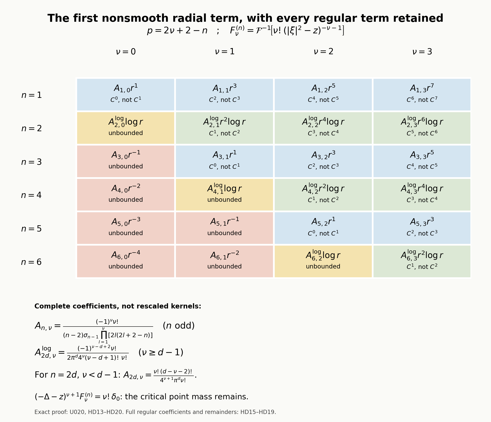
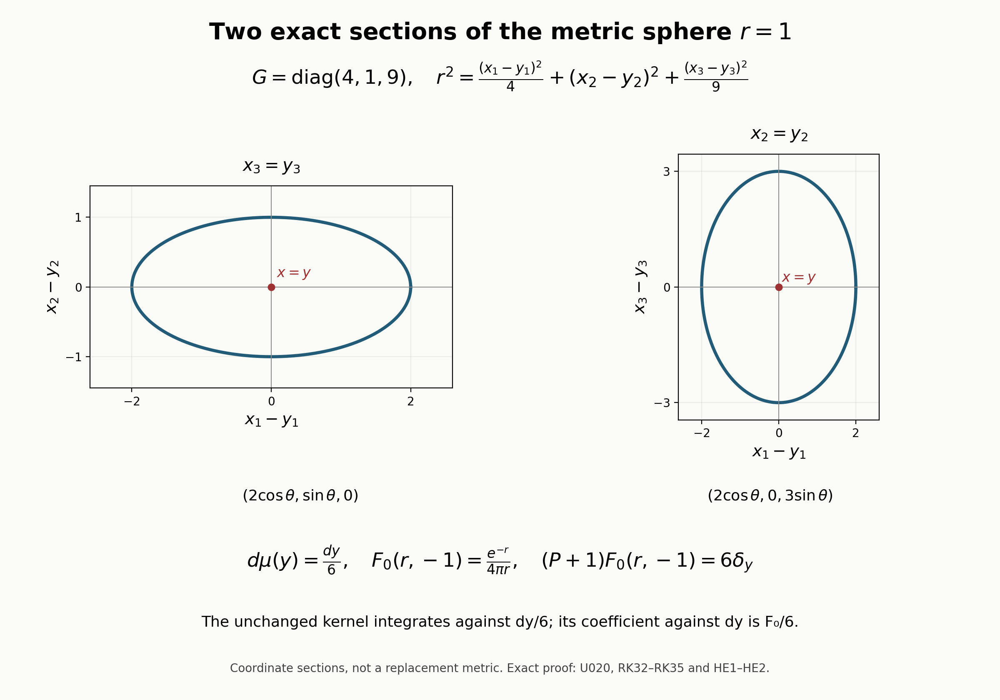

# Building a local inverse from radial singularities

A local inverse of a differential operator has more structure than its mapping estimates reveal. Near the diagonal, its leading singularity is the Euclidean inverse kernel measured in the metric of the principal symbol. Successive corrections are found by ordinary differential equations along short geodesics. The corrections improve the error by two orders at a time, while the same radial kernels continue to describe the singular part.

The construction below separates three operations: choosing the radial coordinate, transporting a smooth amplitude, and controlling the distribution that the amplitude multiplies. This separation is useful for systems. A positive scalar principal symbol still determines one Riemannian metric, while the amplitudes are matrices whose multiplication order must be retained.

## 1. Operators, densities, and the meaning of a finite parametrix

Let \(X\) be an open subset of \(\mathbb R^n\), \(n\geq1\). Consider an operator on \(\mathbb C^r\)-valued functions of the form
\[
 P=-\sum_{j,k=1}^n\partial_j\bigl(g^{jk}(x)\partial_k\bigr)I_r
       +\sum_{j=1}^n b^j(x)\partial_j+c(x).                    \tag{H1}
\]
The matrix \(G(x)=(g^{jk}(x))\) is real, symmetric, smooth, and positive definite at each point. The lower-order coefficients \(b^j,c\) are smooth complex \(r\)-by-\(r\) matrices; they act on the left. We write \(H(x)=G(x)^{-1}=(g_{jk}(x))\). Positive definiteness is a local assumption. On a compact coordinate neighborhood it gives uniform bounds, but no uniform bound on all of \(X\) is imposed.

Fix
\[
                         z\in\mathbb C\setminus[0,\infty).     \tag{H2}
\]
The parameter will be suppressed from most kernel notation. Constants may depend on this fixed \(z\). In particular, no estimate uniform as \(z\) approaches the excluded ray is asserted. The exclusion includes zero.

The metric on tangent vectors is \(H\), and its volume density is
\[
                   d\mu(x)=\rho(x)\,dx,
 \qquad \rho(x)=(\det G(x))^{-1/2}.                            \tag{H3}
\]
A kernel \(K(x,y):\mathbb C^r\to\mathbb C^r\) acts with this density in its second variable. Consequently its identity kernel, written as a distribution in the ordinary coordinate variable \(x\), is
\[
              \delta_\mu(x,y)I_r
                  =\rho(y)^{-1}\delta_y(x)I_r.                \tag{H4}
\]
This convention explains the determinant factor in the construction. A change from coordinate volume to Riemannian volume is part of the kernel formula, not a modification of the differential equation.

For each sufficiently large integer \(N\) we shall construct a properly supported kernel \(K_N\), smooth away from the diagonal, with
\[
                    (P_x-z)K_N=\delta_\mu I_r+R_N,             \tag{H5}
\]
where \(R_N\) has at least \(2N+1-n\) continuous derivatives whenever this number is nonnegative. Thus a prescribed finite error regularity is obtained by choosing \(N\). A fixed finite expansion is distinguished throughout from an expansion completed modulo a smooth kernel.

The construction uses the following facts and earlier lessons.

* **Fourier transforms.** The Fourier convention, Schwartz inversion, and tempered-distribution extension appear in Sections 1 and 2 of [Fourier transforms, finite spectra and convex separation](prerequisite-bridges.md). The estimates for the particular radial multipliers are proved in this lesson.
* **Calculus and geometry.** elementary smooth multivariable calculus, finite-dimensional linear algebra, the inverse function theorem, local existence and uniqueness with smooth parameter dependence for a smooth finite-dimensional ordinary differential equation, smooth partitions and cutoffs, and distributional differentiation and multiplication by smooth functions. The matrix transport result below is proved directly by its convergent iterated-integral series. The geometry proof derives the normal-coordinate identities from the geodesic equation.
* **Symbol calculus.** We use the asymptotic-summation proof in Section 2 and the Fourier quantization convention in Section 3 of [Symbols, operators and Sobolev scales](euclidean-symbol-calculus.md). The amplitude reduction, distributional action, wavefront noncreation, smooth completion, matrix adjoint construction, and left/right comparison are proved here. No scalar-only elliptic-inversion theorem is used to close the matrix case.
* **Coordinate invariance.** Section 9 of [Detecting regularity without choosing coordinates](geometric-microlocal-calculus.md) proves the transformation rule for the distribution wavefront set under a smooth diffeomorphism, with covectors transformed by its transposed differential, and invariance under a smooth invertible frame. This is needed only to phrase the proved coordinatewise statement intrinsically on a manifold. Its exact use is restated in Section 10; it does not assume a propagation or elliptic regularity theorem.

## 2. An estimate that turns frequency decay into an integrable kernel

For a real number \(m>0\), suppose \(a\in C^\infty(\mathbb R^n)\) satisfies
\[
 |\partial_\xi^\beta a(\xi)|\leq C_\beta\langle\xi\rangle^{-m-|\beta|}
 \quad\text{for every multi-index }\beta.
 \tag{RK1}
\]
Use
\[
 \widehat f(\xi)=\int e^{-ix\cdot\xi}f(x)\,dx,\qquad
 \mathcal F^{-1}a(x)=(2\pi)^{-n}\int e^{ix\cdot\xi}a(\xi)\,d\xi
 \tag{RK2}
\]
when the integrals exist; elsewhere the second formula means the tempered inverse transform. Put \(K=\mathcal F^{-1}a\).

Then \(K\) is smooth outside the origin. Whenever \(|\alpha|<m\), its distributional derivative \(\partial^\alpha K\) is represented by an \(L^1\) function. For \(0<r=|x|\leq1\), every derivative, evaluated outside the origin, satisfies
\[
 |\partial^\alpha K(x)|\leq C_\alpha
 \begin{cases}
 r^{m-n-|\alpha|},&n+|\alpha|>m,\\
 1+|\log r|,&n+|\alpha|=m,\\
 1,&n+|\alpha|<m.
 \end{cases}
 \tag{RK3}
\]
All these derivatives decrease faster than any fixed inverse power of \(|x|\) for \(|x|\geq1\). In addition,
\[
 k\in\mathbb N_0,\quad k<m-n
 \quad\Longrightarrow\quad K\in C^k(\mathbb R^n).
 \tag{RK4}
\]
The constants can be chosen uniformly for families having uniform bounds in (RK1).

**Proof.** Choose \(\eta\in C_c^\infty\) equal to one on the unit ball, supported in the ball of radius two, and set
\[
 \theta(\xi)=\eta(\xi/2)-\eta(\xi),\qquad
 a_{\mathrm{low}}=\eta a,\qquad
 a_j(\xi)=\theta(2^{-j}\xi)a(\xi),\quad j\geq0.
\]
Telescoping gives \(a=a_{\mathrm{low}}+\sum_{j\geq0}a_j\) in tempered distributions. Indeed the partial sum equals \(\eta(2^{-J-1}\xi)a(\xi)\), whose pairing with any Schwartz function converges by dominated convergence. The functions
\[
 b_j(\zeta)=2^{jm}a_j(2^j\zeta)
\]
have support in one fixed annulus and all their derivatives are bounded independently of \(j\). Differentiating the inverse transform, scaling \(\xi=2^j\zeta\), and integrating by parts in \(\zeta\) give, for every integer \(A\geq0\),
\[
 |\partial^\alpha K_j(x)|
 \leq C_{\alpha,A}2^{j(n-m+|\alpha|)}
                   (1+2^j|x|)^{-A},\qquad K_j=\mathcal F^{-1}a_j.
 \tag{RK5}
\]
For completeness, repeated application of \(1-\Delta_\zeta\) to
\((i\zeta)^\alpha b_j(\zeta)\) has a uniformly bounded integral, while its action on the exponential multiplies that exponential by \(1+|2^jx|^2\). This proves (RK5) for even powers, and increasing that power gives every stated \(A\). The low-frequency kernel is Schwartz by the same integration by parts.

Integration of (RK5), with \(A>n\), gives
\[
 \|\partial^\alpha K_j\|_{L^1}
 \leq C_\alpha2^{-j(m-|\alpha|)}.
 \tag{RK6}
\]
For \(|\alpha|<m\), the derivatives therefore sum in \(L^1\). Their distributional limit is \(\partial^\alpha K\), by the already established tempered convergence. Thus the assertion concerns the distributional derivative itself: no distribution supported at the origin has been discarded.

On a compact set not containing zero, choose \(A>n-m+|\alpha|\) in (RK5). The derivative series converges uniformly, for every \(\alpha\), which proves smoothness there. If \(|x|\geq1\), the same choice with arbitrarily large \(A\) proves the assertion at infinity. If \(0<r\leq1\), split the sum at the integer \(J\) satisfying \(2^J\leq r^{-1}<2^{J+1}\). For \(j\leq J\), sum \(2^{j(n-m+|\alpha|)}\). This is a geometric sum, a sum of \(J+1\) ones, or a bounded sum according as its exponent is positive, zero, or negative. For \(j>J\), take \(A>\max(0,n-m+|\alpha|)\); the sum is bounded by
\(C r^{-A}2^{J(n-m+|\alpha|-A)}\).
These estimates give (RK3). Finally, if \(n-m+k<0\), the bound (RK5) with \(A=0\) is summable uniformly in \(x\) for every \(|\alpha|\leq k\). Uniform convergence of these derivative series proves (RK4). This also proves the assertion about parameter-uniform constants. \(\square\)

The strict inequalities in the two conclusions are essential. For example, the critical second derivatives of the inverse of \(|\xi|^2-z\) will have a Dirac contribution. Absolute integration of its undifferentiated multiplier is not needed for the construction.

**RK02 — The family and its exact algebra**

Fix \(n\geq1\) and \(z\in\mathbb C\setminus[0,\infty)\). For every integer \(\nu\geq0\), define
\[
 a_\nu(\xi,z)=\nu!(|\xi|^2-z)^{-\nu-1},\qquad
 F_\nu(\,\cdot\,,z)=\mathcal F^{-1}a_\nu(\,\cdot\,,z).
 \tag{RK7}
\]
More explicitly, for \(\phi\in\mathcal S\),
\[
 \langle F_\nu,\phi\rangle
 =(2\pi)^{-n}\int a_\nu(\xi,z)\widehat\phi(-\xi)\,d\xi.
 \tag{RK8}
\]
This integral is absolutely convergent. It defines a continuous functional on the Schwartz space, since \(a_\nu\) is bounded and a Schwartz seminorm controls the integral of \(|\widehat\phi|\).

For each compact \(Q\subset\mathbb C\setminus[0,\infty)\), there is \(c_Q>0\) such that
\[
 |t-z|\geq c_Q(1+t)\qquad(t\geq0,\ z\in Q).
 \tag{RK9}
\]
To see this, first take \(t\) larger than twice the maximum of \(|z|\) on \(Q\), and then minimize the positive continuous quotient \(|t-z|/(1+t)\) on the remaining compact set. Repeated differentiation in \(\xi\), using (RK9), proves (RK1) for \(a_\nu\) with \(m=2\nu+2\). Consequently \(F_\nu\) is smooth outside zero and
\[
 |\alpha|<2\nu+2\quad\Longrightarrow\quad
 \partial^\alpha F_\nu\in L^1(\mathbb R^n).
 \tag{RK10}
\]
In particular, all derivatives through order two are locally integrable when \(\nu\geq1\), and the derivatives through order one are locally integrable when \(\nu=0\). Also
\[
 0\leq k<2\nu+2-n\quad\Longrightarrow\quad F_\nu\in C^k.
 \tag{RK11}
\]
For an integer \(N\) with \(2N+1-n\geq0\), this gives the precise useful endpoint \(F_N\in C^{2N+1-n}\). It does not assert differentiability of the next order.

Orthogonal changes of variable leave \(a_\nu\) invariant. Applying such changes in (RK8) proves that \(F_\nu\) is rotationally invariant as a distribution; its smooth representative on the punctured space therefore depends only on \(|x|\). We write that representative as \(f_\nu(r,z)\), and occasionally abbreviate \(F_\nu(x,z)\) by \(F_\nu(r,z)\). These are radial distributions on \(\mathbb R^n\); no one-dimensional pullback at \(r=0\) is implicit in the notation.

The following identities hold in \(\mathcal S'\):
\[
 (-\Delta-z)F_0=\delta_0,\qquad
 (-\Delta-z)F_\nu=\nu F_{\nu-1}\quad(\nu\geq1),
 \tag{RK12}
\]
\[
 -2\partial_{x_j}F_\nu=x_jF_{\nu-1}\quad(\nu\geq1).
 \tag{RK13}
\]
Indeed multiplication by \(|\xi|^2-z\) sends \(a_0\) to \(1\) and \(a_\nu\) to \(\nu a_{\nu-1}\). With (RK2), the inverse transform of \(1\) is exactly \(\delta_0\). For the derivative identity, the Fourier transforms of its two sides are respectively
\[
 -2i\xi_j\nu!(|\xi|^2-z)^{-\nu-1},\qquad
 i\partial_{\xi_j}\big((\nu-1)!(|\xi|^2-z)^{-\nu}\big),
\]
and these coincide. The index restriction \(\nu\geq1\) is part of the assertion. There is no \(F_{-1}\) in this family.

Differentiating (RK8) in \(z\), justified locally by (RK9) and the Schwartz decay, also gives
\[
 \partial_zF_\nu=F_{\nu+1},\qquad F_\nu=\partial_z^\nu F_0.
 \tag{RK14}
\]
The same domination proves holomorphic dependence as a tempered distribution; on the punctured space the differentiated dyadic estimates give locally uniform dependence with all \(x\)-derivatives. These facts do not extend the asserted spectral domain to the excluded ray.

**RK03 — What occurs at the critical Hessian**

Let \(\sigma_{n-1}\) denote the area of the unit sphere in \(\mathbb R^n\). Define the tempered, locally integrable distribution
\[
 E_n(x)=
 \begin{cases}
 \displaystyle\frac{|x|^{2-n}}{(n-2)\sigma_{n-1}},& n\geq3,\\[4pt]
 \displaystyle-\frac{\log|x|}{2\pi},& n=2,\\[4pt]
 \displaystyle-\frac{|x|}{2},& n=1.
 \end{cases}
 \tag{RK15}
\]
Then \(-\Delta E_n=\delta_0\). Here and below the additive constant in the logarithmic kernel has been fixed by (RK15); another constant would change only a smooth term.

For \(n\geq2\) and \(x\ne0\),
\[
 \partial_jE_n(x)=-\frac{x_j}{\sigma_{n-1}|x|^n},\qquad
 H_{jk}(x)=\partial_k\partial_jE_n(x)
 =\frac{n x_jx_k-\delta_{jk}|x|^2}
        {\sigma_{n-1}|x|^{n+2}}.
 \tag{RK16}
\]
Both \(E_n\) and its displayed first derivatives are locally integrable. For the derivative identity itself, excise a ball of radius \(\epsilon\), integrate by parts, and let \(\epsilon\) decrease to zero. The possible first-derivative boundary integral is bounded by
\(C\epsilon\) for \(n\geq3\), and by \(C\epsilon|\log\epsilon|\) for \(n=2\), hence vanishes.

The angular mean of \(H_{jk}\) is zero:
\[
 \int_{S^{n-1}}(n\omega_j\omega_k-\delta_{jk})\,d\omega=0.
 \tag{RK17}
\]
Reflection gives zero for the off-diagonal integrals; coordinate symmetry and
\(\sum_j\omega_j^2=1\) give
\(\int\omega_j^2=\sigma_{n-1}/n\).
It follows that
\[
 \langle\operatorname{pv}H_{jk},\phi\rangle
 =\lim_{\epsilon\downarrow0}
   \int_{|x|>\epsilon}H_{jk}(x)\phi(x)\,dx
 \tag{RK18}
\]
exists. In a fixed small ball subtract \(\phi(0)\); the remaining integrand has absolute radial bound \(C\,dr\), because \(\phi(x)-\phi(0)=O(|x|)\). The subtracted constant integrates to zero by (RK17).

A second integration by parts gives the full distributional formula
\[
 \partial_j\partial_kE_n
 =\operatorname{pv}H_{jk}-\frac{\delta_{jk}}{n}\delta_0,
 \qquad n\geq2.
 \tag{RK19}
\]
Here is the boundary sign. Put \(v_j=-x_j/(\sigma_{n-1}|x|^n)\) and integrate
\(-v_j\partial_k\phi\) over the punctured domain. Its inward spherical boundary has outward normal \(-\omega\). The boundary term to subtract is
\[
 \int_{|x|=\epsilon}v_j(-\omega_k)\phi\,dS
 =\frac{1}{\sigma_{n-1}}
   \int_{S^{n-1}}\omega_j\omega_k\phi(\epsilon\omega)\,d\omega
 \longrightarrow \frac{\delta_{jk}}n\phi(0).
\]
The interior term is the truncated integral of \(H_{jk}\phi\), proving (RK19). Summing in \(j=k\), its principal-value terms cancel pointwise and its Dirac terms sum to \(-\delta_0\). This proves the stated fundamental-solution normalization as well. In dimension one, direct integration on the two half-lines gives
\[
 E_1'=-\tfrac12\operatorname{sgn}x,\qquad E_1''=-\delta_0.
 \tag{RK20}
\]

Both terms on the right of (RK19) are homogeneous distributions of degree \(-n\). More explicitly, they satisfy \(T(\lambda\,\cdot)=\lambda^{-n}T\) for every \(\lambda>0\). For the principal value this follows by the substitution \(y=\lambda x\) in its excised integrals; (RK17) prevents a logarithmic defect. The logarithmic function \(E_2\) itself is not homogeneous, but its additive scaling constant disappears after differentiation. In dimension one, (RK20) is homogeneous of degree \(-1\).

We now prove that these are exactly the exceptional terms needed for \(F_0\):
\[
 F_0=E_n+R_z,\qquad R_z\in W_{\mathrm{loc}}^{2,1}(\mathbb R^n).
 \tag{RK21}
\]
This comparison must not treat \(|\xi|^{-2}\) as a locally integrable multiplier near zero in dimensions one or two. Instead, Fourier transformation of the already proved equation for \(E_n\) gives
\(|\xi|^2\widehat E_n=1\). Hence on \(\mathbb R^n\setminus\{0\}\) its Fourier transform equals the smooth function \(|\xi|^{-2}\). With the cutoff \(\eta\) from RK01, put
\[
 r_z(\xi)=\frac1{|\xi|^2-z}-\frac{1-\eta(\xi)}{|\xi|^2}.
 \tag{RK22}
\]
This is smooth everywhere. Outside a compact set it equals
\[
 \frac{z}{|\xi|^2(|\xi|^2-z)},
\]
so it satisfies (RK1) with \(m=4\). Moreover
\[
 R_z=\mathcal F^{-1}r_z-\mathcal F^{-1}(\eta\widehat E_n).
 \tag{RK23}
\]
The first term has its derivatives through order two in \(L^1\) by (RK10)'s dyadic argument. The second term is smooth: the inverse transform of any compactly supported distribution \(T\) is the function
\((2\pi)^{-n}\langle T(\xi),\chi(\xi)e^{ix\cdot\xi}\rangle\),
where \(\chi=1\) near its support. Every \(x\)-derivative may be taken inside this pairing, using the finite-order estimate defining a compactly supported distribution. Pairing with a Schwartz test function and interchanging its absolutely convergent seminorm-bounded integral verifies the inverse-transform assertion. Thus (RK23) proves (RK21) without a low-frequency division at zero.

Combining (RK19)–(RK23), for \(n\geq2\),
\[
 \partial_j\partial_kF_0
 =\operatorname{pv}H_{jk}-\frac{\delta_{jk}}n\delta_0
  +\partial_j\partial_kR_z,\qquad
 \partial_j\partial_kR_z\in L^1_{\mathrm{loc}}.
 \tag{RK24}
\]
For \(n=1\), \(F_0''=-\delta_0+R_z''\).
The singular homogeneous term is independent of \(z\). It cannot in general be absorbed into an ordinary locally integrable function.

A useful consequence for later variable coefficients is the following. If \(q\) is smooth and \(q(x)=O(|x|^2)\) near zero, then
\[
 q\,\partial_j\partial_kE_n=qH_{jk}
 \quad(n\geq2)
 \tag{RK25}
\]
as distributions, and the right side is locally integrable, with bound
\(C|x|^{2-n}\). Indeed \(q\delta_0=0\), and the integral in (RK18) becomes absolutely convergent after multiplication by \(q\). In dimension one \(qE_1''=0\). A derivative of \(q\) times a first derivative of \(E_n\) is likewise locally integrable. Together with (RK21), this gives the precise elementary interface for removing an apparent singular defect when metric coefficients differ by \(O(|x|^2)\).

**RK04 — Low-dimensional models, including the logarithmic endpoint**

In dimension one choose the square root \(\kappa=\sqrt{-z}\) with
\(\operatorname{Re}\kappa>0\), which exists uniquely on the stated spectral domain. Then
\[
 F_0(x,z)=\frac{e^{-\kappa|x|}}{2\kappa},\qquad
 F_0''=\frac{\kappa}{2}e^{-\kappa|x|}-\delta_0.
 \tag{RK26}
\]
To verify this, differentiate separately on the half-lines and use the jump
\(F_0'(0+)-F_0'(0-)=-1\). Thus
\((-\partial_x^2+\kappa^2)F_0=\delta_0\).
The function is integrable and hence tempered. Uniqueness of a tempered solution follows by Fourier transformation: multiplication by the nowhere-vanishing smooth function \(\xi^2-z\) is injective on \(\mathcal S'\), because its smooth inverse and all its derivatives have polynomial bounds and therefore multiply the Schwartz space continuously. This identifies the formula with (RK7), not merely with some fundamental solution.

Writing \(r=|x|\), (RK13) becomes
\[
 f_\nu'(r)=-\tfrac r2 f_{\nu-1}(r),\qquad r>0,\quad \nu\geq1.
 \tag{RK27}
\]
In dimension one each \(f_\nu\) is continuous at zero, so integration from zero is legitimate. Formula (RK26) and repeated use of (RK27) show
\[
 f_\nu(r)=p_\nu(r^2)
 +\frac{(-1)^{\nu+1}\nu!}{2(2\nu+1)!}r^{2\nu+1}
 +O(r^{2\nu+2}),
 \tag{RK28}
\]
where \(p_\nu\) is a polynomial of degree at most \(\nu\); its coefficients depend on \(z\). The remainder estimate can also be differentiated twice on \(r>0\). Indeed the starting exponential has a convergent power series in \(r\), and integration in (RK27) divides its coefficients by positive integers. The odd leading coefficient follows from the initial value \(-1/2\) and the recursion
\(A_\nu=-A_{\nu-1}/(2(2\nu+1))\).
The cusp produces the Dirac mass in (RK26) only at \(\nu=0\); for \(\nu\geq1\) the first two distributional derivatives are ordinary locally integrable functions, in agreement with RK02.

In dimension two the comparison (RK23), (RK3), and (RK4) give
\[
 f_0(r)=-\frac{\log r}{2\pi}+C_z+\rho_0(r),
 \quad
 |\rho_0^{(\ell)}(r)|
 \leq C r^{2-\ell}(1+|\log r|),\quad 0\leq\ell\leq2,
 \tag{RK29}
\]
for small positive \(r\). To justify the improved zeroth- and first-order bounds in this formula, initially (RK23) gives \(R_z\in C^1\) and \(D^2R_z=O(1+|\log r|)\) outside zero. Radial \(C^1\) regularity implies \(R_z'(0)=0\). The radial equation \((-\Delta-z)F_0=0\) away from zero implies
\[
 (rR_z'(r))'=-z r f_0(r).
\]
Since \(rR_z'(r)\to0\), integration gives
\(R_z'(r)=-z r^{-1}\int_0^r s f_0(s)\,ds
=O(r(1+|\log r|))\).
A further integration gives
\(R_z(r)-R_z(0)=O(r^2(1+|\log r|))\).
The equation then supplies the second derivative bound. Taking
\(C_z=R_z(0)\) proves (RK29).

For every \(\nu\geq1\), integrate (RK27), using (RK29) as the initial case. One obtains
\[
 f_\nu(r)=p_\nu(r^2)
 +\frac{(-1)^{\nu+1}}{2\pi\,4^\nu\nu!}r^{2\nu}\log r
 +\rho_\nu(r),
 \tag{RK30}
\]
where \(p_\nu\) has degree at most \(\nu\), and
\[
 |\rho_\nu^{(\ell)}(r)|
 \leq C r^{2\nu+2-\ell}(1+|\log r|),
 \qquad 0\leq\ell\leq2.
 \tag{RK31}
\]
In this induction the constant \(f_\nu(0)\) exists by (RK11), and contributes to \(p_\nu\). Integrating \(s^{2\nu-1}\log s\) creates both the next logarithmic term and a polynomial term. Its logarithmic coefficient satisfies
\(A_\nu=-A_{\nu-1}/(4\nu)\), starting with \(A_0=-1/(2\pi)\), which proves the constant in (RK30). Integrating the previous remainder proves (RK31); its first two derivatives follow by differentiating that integral. Cartesian second derivatives of a radial remainder are combinations of \(\rho_\nu''\) and \(\rho_\nu'/r\), so the same bounds control them.

For example, \(F_1\) in dimension two has the term
\(r^2\log r/(8\pi)\). Its Hessian has a logarithmic singularity and is locally integrable, although \(F_1\) need not be \(C^2\). Meanwhile the logarithmic leading term of \(F_0\) has the Hessian (RK19), including the Dirac coefficient \(-\delta_{jk}/2\). These are distinct endpoints.

## 3. Constant metric transport and the density normalization

Let \(G=(g^{jk})\) be a real symmetric positive definite matrix, and set
\[
 r_G(x)=\sqrt{x^{\mathsf T}G^{-1}x},\qquad
 L_G=-\sum_{j,k}g^{jk}\partial_j\partial_k.
\]
Choose any real invertible \(T\) such that \(G=T^{-1}T^{-\mathsf T}\), for example \(T=G^{-1/2}\). Then \(r_G(x)=|Tx|\). For a distribution \(u\), define its invertible linear pullback by
\[
 \langle T^*u,\phi\rangle
 =|\det T|^{-1}\langle u,\phi\circ T^{-1}\rangle.
 \tag{RK32}
\]
This formula defines a continuous map on tempered distributions, since composition with an invertible linear map is continuous on the Schwartz space. For regular distributions it is exactly the function \(u(Tx)\), by change of variables. Distributional integration by parts proves the chain rule
\(\partial_{x_j}T^*u=\sum_aT_{aj}T^*(\partial_{y_a}u)\).
It follows that \(L_GT^*u=T^*(-\Delta u)\), because \(TGT^{\mathsf T}=I\).

Define \(K_{\nu,G}=T^*F_\nu\). Radial invariance makes this independent of the choice of \(T\), and as a locally integrable function it is \(F_\nu(r_G(x),z)\). Pulling back (RK12) yields
\[
 (L_G-z)K_{\nu,G}=\nu K_{\nu-1,G}\quad(\nu\geq1),\qquad
 (L_G-z)K_{0,G}=\sqrt{\det G}\,\delta_0.
 \tag{RK33}
\]
The constant follows directly from (RK32):
\(T^*\delta_0=|\det T|^{-1}\delta_0\), and
\(|\det T|^{-1}=\sqrt{\det G}\).
This factor is present because \(K_{0,G}\) has not been multiplied by a determinant prefactor.

The derivative relation becomes
\[
 -2\sum_k g^{jk}\partial_{x_k}K_{\nu,G}
 =x_jK_{\nu-1,G},\qquad \nu\geq1.
 \tag{RK34}
\]
Indeed (RK13) and the chain rule give
\(-2\nabla_xK_{\nu,G}=T^{\mathsf T}Tx\,K_{\nu-1,G}
=G^{-1}x\,K_{\nu-1,G}\); multiplication by \(G\) proves (RK34).

Thus the kernel for Lebesgue integration normalized to a unit Dirac mass is
\[
 (\det G)^{-1/2}F_0(r_G(x-y),z).
 \tag{RK35}
\]
Equivalently, the unscaled kernel \(F_0(r_G(x-y),z)\) is correctly normalized when integrated against the metric density
\(d\mu_G(y)=(\det G)^{-1/2}dy\).
This distinguishes the coefficient matrix \(G=(g^{jk})\) from its inverse metric matrix \(G^{-1}=(g_{jk})\).

Invertible pullback preserves local integrability and differentiability, so all the earlier regularity conclusions remain valid. The homogeneous Hessian distribution in (RK24) pulls back to a homogeneous distribution of degree \(-n\); multiplication by a smooth coefficient vanishing to second order still gives a locally integrable function. On compact families of positive definite matrices, these estimates are uniform by boundedness of \(T\), \(T^{-1}\), and their determinants.

## 4. Normal coordinates without orthonormalizing the center

Fix a center \(y\). The geodesic equation for \(H\), in an ordinary coordinate chart, is
\[
 \ddot x^i+\sum_{j,k}\Gamma^i_{jk}(x)\dot x^j\dot x^k=0,
 \qquad x(0)=y,\quad\dot x(0)=v,                               \tag{HG1}
\]
where
\[
 \Gamma^i_{jk}=\frac12\sum_l g^{il}
             (\partial_jg_{kl}+\partial_kg_{jl}-\partial_lg_{jk}).
                                                                    \tag{HG2}
\]
For \(v\) small enough, the solution exists for \(0\leq t\leq1\) and depends smoothly on \((t,v,y)\). Put \(\gamma(v,y)=x(1;v,y)\). Uniqueness in (HG1) and the change of parameter in that equation give
\[
 x(t;v,y)=\gamma(tv,y),\qquad
 \gamma(0,y)=y,\qquad d_v\gamma(0,y)=I.                         \tag{HG3}
\]
For the last assertion, the solution at \(v=0\) is constant; its first variation in the initial velocity solves \(\ddot V=0\), \(V(0)=0\), \(\dot V(0)=w\), and hence is \(tw\).

The inverse function theorem now gives a diffeomorphism
\[
 (v,y)\longmapsto(\gamma(v,y),y)                                \tag{HG4}
\]
from a neighborhood of the zero section onto a neighborhood of the diagonal. Its fibers can be chosen to be small convex balls about \(v=0\). To justify this simultaneously over noncompact \(X\), first use the parameter-dependent inverse function theorem near each \((0,y)\). Shrink in the base variable so that a positive velocity radius works throughout that base neighborhood. A locally finite refinement and a positive smooth minorant of these local radii give a smaller neighborhood with ball fibers on which the same map is locally invertible and injective in each fiber. Points with different second coordinates cannot have the same image, so the total map is injective as well. No global injectivity radius is assumed. Over a fixed compact set of centers, a finite subcover gives a common positive lower radius after shrinking the coordinate neighborhoods.

Write \(\widetilde H(v,y)\) for the metric pulled back in the first variable by \(\gamma\). The normal coordinates here retain the original coordinates on \(T_yX\); thus
\[
                       \widetilde H(0,y)=H(y).                  \tag{HG5}
\]
The matrix at the center need not be the identity.

**Radial metric identity.** In these coordinates,
\[
       \sum_k\widetilde g_{jk}(v,y)v_k
                 =\sum_k g_{jk}(y)v_k.                         \tag{HG6}
\]
Here is a derivation of the identity, including its variational input. The connection with coefficients (HG2) is torsion free because it is symmetric in \(j,k\). Substitution in (HG2) also gives metric compatibility: differentiating \(\langle A,B\rangle_H\) along a curve equals the sum of the two pairings with its covariant derivatives. For the geodesic \(q(t)=\gamma(tv,y)\), this shows that \(\langle\dot q,\dot q\rangle_H=\langle v,v\rangle_{H(y)}\) is constant.

Vary the initial velocity to \(v+sw\), and let \(V(t)=\partial_s q(t,s)|_{s=0}\). Torsion freeness gives \(\nabla_tV=\nabla_s\dot q\). Since \(\nabla_t\dot q=0\),
\[
 \frac d{dt}\langle\dot q,V\rangle_H
       =\frac12\partial_s\langle\dot q,\dot q\rangle_H
       =\langle v,w\rangle_{H(y)}.                             \tag{HG7}
\]
The initial value is zero. At \(t=1\), the equality is therefore
\[
 \big\langle d_v\gamma(v,y)v,d_v\gamma(v,y)w\big\rangle_H
                         =\langle v,w\rangle_{H(y)}.
\]
As this holds for every \(w\), it is exactly (HG6).

Two consequences of this identity will be used in the distribution calculation. First,
\[
 \widetilde H(v,y)-H(y)=O(|v|^2),\qquad
 \widetilde G(v,y)-G(y)=O(|v|^2),                               \tag{HG8}
\]
locally uniformly with the center and with all needed smooth parameter bounds. To prove the first assertion, let \(A_{ijk}=\partial_k\widetilde g_{ij}(0,y)\). Symmetry gives \(A_{ijk}=A_{jik}\), while the quadratic terms in (HG6) give \(A_{ijk}=-A_{ikj}\). Combining these relations yields
\[
 A_{ijk}=-A_{ikj}=-A_{kij}=A_{kji}=A_{jki}=-A_{jik}=-A_{ijk}.
\]
Thus every first derivative is zero, and Taylor's formula proves the first bound in (HG8). The smooth inverse-matrix formula proves the second. In particular their first derivatives are \(O(|v|)\).

Second, the geodesic distance from the center is
\[
 s(\gamma(v,y),y)^2=v^tH(y)v.                                  \tag{HG9}
\]
To see the minimizing assertion, put \(r=(v^tH(y)v)^{1/2}\) away from zero. By (HG6), its metric gradient is \(v/r\), of metric length one. Along any piecewise smooth curve staying in the normal neighborhood, \(|dr/dt|\) is therefore at most its speed. Its length from the center to \(v\) is at least \(r\), while the radial geodesic has exactly that length. Shrink the neighborhood so that leaving the original normal neighborhood costs more length than any retained radial segment. This is possible because the metric is bounded below on a compact coordinate neighborhood and the center stays a positive coordinate distance from its boundary. It rules out a shorter path that leaves and returns. The same argument is uniform on a sufficiently small compact set of centers; a finite cover gives the earlier compact-center statement. This proves (HG9) for the ordinary Riemannian distance after the stated shrinking.

The inverse map in (HG4) is smooth, so (HG9) proves that \(s^2\) is jointly smooth near the diagonal. The function \(s\) itself is smooth off the diagonal there. Its failure to be smooth on the diagonal is precisely the radial singularity that the construction will retain.

We shall also need the exact coordinate form of the operator. If \(x=\gamma(v,y)\), \(J(v,y)=|\det d_v\gamma(v,y)|\), and tildes denote pullback, then
\[
\begin{split}
 \widetilde G&=(d_v\gamma)^{-1}G(\gamma(v,y))(d_v\gamma)^{-t},\\
 \widetilde b^{\,i}
   &=\sum_j(d_v\gamma)^{-1}_{ij}b^j(\gamma(v,y))
               -\sum_k\widetilde g^{ik}\partial_k\log J\,I_r,\\
 \widetilde c&=c(\gamma(v,y)).
\end{split}                                                       \tag{HG10}
\]
Indeed divergence transforms to \(J^{-1}\partial_i(J\widetilde g^{ik}\partial_k)\). This follows either by the chain rule in a smooth test integral with \(dx=J\,dv\), or by expanding that expression and changing variables back. Expanding the derivative of \(J\) proves the drift correction in (HG10). It is smooth, and \(J(0,y)=1\). Omitting this term would generally give the wrong transported amplitude even for the Riemannian Laplacian.

## 5. Scalar transport with a regular center

The transport equation needed below has a useful form independent of the elliptic kernel. Let \(V\subset\mathbb R^n\) be star shaped about zero, let \(h,f\) be smooth complex functions, and assume \(h(0)=0\). Put \(E=v\cdot\partial_v\). We first solve
\[
                       2Eu_0=hu_0,\qquad u_0(0)=1.            \tag{HS1}
\]
The solution is
\[
 u_0(v)=\exp A(v),\qquad
                  A(v)=\frac12\int_0^1\frac{h(tv)}t\,dt.       \tag{HS2}
\]
This formula is regular at its apparent singular endpoint. In fact
\[
 \frac{h(tv)}t
       =\sum_jv_j\int_0^1(\partial_jh)(\sigma tv)\,d\sigma       \tag{HS3}
\]
for \(0\leq t\leq1\), with the right side providing the value at zero. It is jointly smooth in \((t,v)\); the formula and all its derivatives are bounded on compact parameter sets. Thus \(A\) and \(u_0\) are smooth, and \(u_0\) never vanishes.

For \(r>0\), substitution \(s=rt\) gives
\[
 A(rv)=\frac12\int_0^r\frac{h(sv)}s\,ds.
\]
Differentiating proves (HS1) along each ray, and continuity proves the equation at the center. Conversely, the restriction of any solution to a ray solves the scalar linear ordinary differential equation with coefficient \(h(rv)/(2r)\), which extends continuously to \(r=0\) by (HS3). Its initial value fixes it uniquely. This also proves uniqueness among smooth solutions on all of the star-shaped set.

Now let \(\nu>0\) be any real number, not necessarily an integer. The equation
\[
                     (2\nu-h)u+2Eu=f                         \tag{HS4}
\]
has exactly one smooth solution,
\[
       u(v)=u_0(v)\int_0^1
                   t^{\nu-1}\frac{f(tv)}{2u_0(tv)}\,dt.        \tag{HS5}
\]
To prove this, set \(u=u_0w\). Equation (HS1) reduces (HS4) to
\[
                             \nu w+Ew=g,
                      \qquad g=f/(2u_0).                       \tag{HS6}
\]
Along a ray, multiplication by \(r^{\nu-1}\) gives
\[
             \frac d{dr}\bigl(r^\nu w(rv)\bigr)
                               =r^{\nu-1}g(rv).                \tag{HS7}
\]
Integrating from zero is legitimate for a bounded solution because \(r^\nu w(rv)\to0\). Substitution \(r=t\) gives (HS5). Conversely, differentiating its integral proves (HS6). Each derivative in \(v\) introduces a nonnegative power of \(t\) in derivatives of \(g(tv)\); the factor \(t^{\nu-1}\) is integrable. Uniform domination on compact subsets proves smoothness of every order. The same argument proves smooth dependence on any extra parameters, including the center, as long as \(\nu>0\) is fixed.

There is no independent datum at the center in (HS4): evaluation there gives
\[
                            u(0)=f(0)/(2\nu).                   \tag{HS8}
\]
The difference of two bounded solutions would be \(r^{-\nu}\) times a constant along each ray, and boundedness forces that constant to vanish. These arguments cover complex \(h\) and \(f\); no positivity or reality is used in the transport lemma.

## 6. Matrix transport and the order of multiplication

Let now \(h(v)\) be a smooth \(r\)-by-\(r\) complex matrix with \(h(0)=0\). We seek an invertible matrix \(S(v)\) such that
\[
                             2ES=hS,\qquad S(0)=I_r.           \tag{HM1}
\]
In general \(S\) is not the ordinary exponential of the integral in (HS2), because the matrices at different points on a ray need not commute.

For fixed \(v\), define the smooth coefficient
\[
                   A_v(t)=\frac{h(tv)}{2t},\qquad0\leq t\leq1,
                                                                    \tag{HM2}
\]
where (HS3) is applied entry by entry at \(t=0\). The solution of \(Y'=A_vY\), \(Y(0)=I_r\), is given by the absolutely convergent series
\[
 Y_v(t)=I_r+\sum_{k=1}^{\infty}
  \int_{0<t_k<\cdots<t_1<t}
          A_v(t_1)\cdots A_v(t_k)\,dt_k\cdots dt_1.             \tag{HM3}
\]
On a compact set of \(v\)'s, the norm of the \(k\)-th term is at most \(M^kt^k/k!\). Each fixed number \(l\) of parameter derivatives is a sum of at most a fixed multiple of \(k^l\) products, each bounded by \(C_l^k\); their series still converges uniformly by the factorial denominator. Thus the sum is smooth in all parameters, and termwise integration or differentiation verifies the integral equation and the differential equation. Subtracting two solutions, iterating the integral equation \(k\) times, and taking \(k\to\infty\) proves uniqueness by the same factorial bound. This proves the needed parameter theorem for this particular transport equation without a commutativity assumption.

The equation \(Z'=-ZA_v\), \(Z(0)=I_r\), has the analogous iterated-integral construction. Differentiating \(ZY\) gives zero, so \(Z_v(t)Y_v(t)=I_r\). In finite dimension this proves that \(Y_v(t)\) is invertible, with inverse \(Z_v(t)\). Set \(S(v)=Y_v(1)\). The equation for \(Y_{rv}(t)\) is the equation for \(Y_v(rt)\), so uniqueness gives \(Y_{rv}(t)=Y_v(rt)\) whenever the ray segments in question are present. It follows that \(S(rv)=Y_v(r)\), which proves (HM1). Invertibility and smoothness of \(S^{-1}\) follow from the constructed inverse. Initial-value uniqueness proves that this is the unique smooth normalized solution.

For a smooth matrix-valued right side \(f\) and any real \(\nu>0\), the unique smooth solution of
\[
                  (2\nu I_r-h)u+2Eu=f                         \tag{HM4}
\]
is
\[
      u(v)=S(v)\int_0^1
                  t^{\nu-1}S(tv)^{-1}\frac{f(tv)}2\,dt.        \tag{HM5}
\]
Indeed put \(u=Sw\) and use the product rule:
\[
 (2\nu I_r-h)Sw+2E(Sw)=2S(\nu w+Ew).
\]
Left multiplication by \(S^{-1}\) reduces the equation to (HS6) entry by entry, with \(g=S^{-1}f/2\). The scalar integration argument proves (HM5), smoothness, and uniqueness. The order \(S(tv)^{-1}f(tv)\) is fixed by this calculation. Moving \(S^{-1}\) to the right of \(f\) would solve a different equation.

For the operator in (H1), use the transformed coefficients (HG10) in normal coordinates and set
\[
                h(v,y)=\sum_{j,k}g_{jk}(y)\,
                                   \widetilde b^{\,j}(v,y)v_k.
                                                                    \tag{HM6}
\]
This is smooth and vanishes at \(v=0\). The amplitudes are now fixed recursively by
\[
\begin{split}
 u_0(v,y)&=S(v,y),\qquad u_{-1}=0,\\
 (2\nu I_r-h)u_\nu+2Eu_\nu&=-2\widetilde P u_{\nu-1},
                       \qquad \nu=1,2,\ldots .
\end{split}                                                       \tag{HM7}
\]
The operator \(\widetilde P\) acts on the first variable and on each column, with its matrix lower-order coefficients acting on the left. Formula (HM5) proves existence and uniqueness at every step, and all amplitudes are jointly smooth in \((v,y)\). On compact sets of centers and sufficiently small common velocity balls, the construction and each finite collection of its derivatives have uniform bounds, by the parameter estimates in (HM3) and (HM5). The amplitudes in this particular normalization are independent of \(z\); its dependence is entirely in the radial kernel family.

This includes operators on a smooth vector bundle with positive scalar principal symbol. In a local trivialization the differential expression has the form (H1). Changing frame conjugates its action and changes the lower-order coefficients, while the scalar principal matrix remains \(G I_r\). The normalized amplitude is a map from the fiber at the center to the fiber at the running point. On overlapping frames it transforms as
\[
                  U_\nu(x,y)\longmapsto
                    T(x)^{-1}U_\nu(x,y)T(y).                  \tag{HM8}
\]
The transport equation transforms in the same manner because it was obtained from the invariant operator product, and its initial value is the identity map of the center fiber. Uniqueness then gives (HM8). Thus these locally constructed amplitudes have the correct bundle meaning; no simultaneous diagonalization of the matrices is used.

### 6.1. The full coefficient transformation

We now prove the frame assertion in (HM8) from the original differential expression. Fix the same center, original velocity coordinates, metric and Jacobian used in (HG1)--(HG10). In this subsection every coefficient carries its normal-coordinate meaning:
\[
 \widetilde P a
 =-\sum_{j,k=1}^n\partial_j
          (\widetilde g^{jk}\partial_k a)
       +\sum_{j=1}^n\widetilde b^{\,j}\partial_j a
       +\widetilde c a,\qquad
 h=\sum_{j,k=1}^n g_{jk}(y)\widetilde b^{\,j}v_k,\qquad
 E=\sum_{j=1}^n v_j\partial_j .
 \tag{MC0}
\]
The scalar principal matrix is still the original \(\widetilde G\), the drift still includes the complete Jacobian term in (HG10), and the density is still (H3). In particular
\(\sum_{j,k} \widetilde g^{\,lj}g_{jk}(y)v_k=v_l\), by (HG6). Neither the metric at the center nor any matrix coefficient is replaced.

Let \(T(x)\) be the actual smooth change of bundle frame, with the convention that the old component column equals \(T(x)\) times the new column. Put
\[
 V(v,y)=T(\gamma(v,y)),\qquad V_0(y)=T(y),\qquad
 \widetilde P^{\,T}a=V^{-1}\widetilde P(Va).
 \tag{MC1}
\]
All these matrices are invertible on the overlap in question. Expanding every differentiated factor gives
\[
\begin{split}
 \widetilde P(Va)
 &=V\left[-\sum_{j,k}\partial_j
                  (\widetilde g^{jk}\partial_k a)\right]\\
 &\quad-\sum_{j,k}\widetilde g^{jk}
                  (\partial_kV)(\partial_j a)
       -\sum_{j,k}\widetilde g^{jk}
                  (\partial_jV)(\partial_k a)
       +\sum_j\widetilde b^{\,j}V\partial_j a\\
 &\quad+\left[-\sum_{j,k}\partial_j
                  (\widetilde g^{jk}\partial_kV)
       +\sum_j\widetilde b^{\,j}\partial_jV
       +\widetilde cV\right]a.
\end{split}
\tag{MC2}
\]
Symmetry of the scalar principal matrix identifies the two displayed cross sums; both have been retained before making that comparison. Thus the complete transformed coefficients are
\[
\begin{split}
 (\widetilde g^{jk})^{T}&=\widetilde g^{jk},\\
 (\widetilde b^{\,j})^{T}
 &=V^{-1}\widetilde b^{\,j}V
       -2\sum_k\widetilde g^{jk}V^{-1}\partial_kV,\\
 \widetilde c^{\,T}
 &=V^{-1}\left[-\sum_{j,k}
          \partial_j(\widetilde g^{jk}\partial_kV)
          +\sum_j\widetilde b^{\,j}\partial_jV
          +\widetilde cV\right].
\end{split}
\tag{MC3}
\]
In particular the zero-order coefficient is not merely conjugated. Expanding its derivative retains
\(-\sum_{j,k}(\partial_j\widetilde g^{jk})\partial_kV\) and
\(-\sum_{j,k}\widetilde g^{jk}\partial_j\partial_kV\), both multiplied on the left by \(V^{-1}\).

The transport coefficient follows from the same definition as in (MC0):
\[
\begin{split}
 h^{T}
 &=\sum_{j,k}g_{jk}(y)
           \left[V^{-1}\widetilde b^{\,j}V
              -2\sum_l\widetilde g^{jl}V^{-1}\partial_lV\right]v_k\\
 &=V^{-1}hV
       -2\sum_lV^{-1}(\partial_lV)
                  \left(\sum_{j,k}\widetilde g^{lj}g_{jk}(y)v_k\right)\\
 &=V^{-1}hV-2V^{-1}EV .
\end{split}
\tag{MC4}
\]
This uses the full radial metric identity, with its original \(H(y)\), and is the exact connecting map between the two transport equations. Since every term in \(EV\) contains a velocity coordinate,
\(h^{T}(0,y)=0\).

### 6.2. Every ordered integral and parameter derivative

For completeness, the estimates in (HM3) can be made explicit at every order. Define the original coefficient on a ray by
\[
 A(t,v,y)=\frac{h(tv,y)}{2t}
 =\frac12\sum_jv_j\int_0^1
          (\partial_jh)(\sigma tv,y)\,d\sigma,\qquad 0\leq t\leq1.
 \tag{MC5}
\]
The second expression defines its actual value at \(t=0\). It also proves smoothness in all velocity and center coordinates: differentiation under the integral involves a smooth integrand on a compact interval. Work on any compact parameter set whose full ray segments lie within one permitted normal neighborhood. No estimate outside that domain is being asserted.

For the original matrix norm, let \(M_l\geq1\) bound every coordinate derivative of \(A\) involving any sublist of a fixed list of \(l\) parameter directions, uniformly on this compact set and \(0\leq t\leq1\). The existence of this finite bound follows from (MC5). If the norm is not submultiplicative with constant one, retain a constant \(C_{\mathrm{mult}}\geq1\) such that
\(\|BC\|\leq C_{\mathrm{mult}}\|B\|\|C\|\). Such a constant exists for the given finite-dimensional matrix norm, by continuity of the actual bilinear multiplication on the product of its two unit spheres. Keep \(M_l\) and \(C_{\mathrm{mult}}\) in every product estimate.

Let \([l]=\{1,\ldots,l\}\), with an empty list when \(l=0\). For \(k\geq1\), write
\(\Delta_k(t)=\{0<t_k<\cdots<t_1<t\}\). The full derivative of the \(k\)-th ordered term is
\[
\begin{split}
 D_{a_1}\cdots D_{a_l}
 \int_{\Delta_k(t)}A(t_1)\cdots A(t_k)\,dt_k\cdots dt_1
 &=\sum_{\sigma:[l]\to\{1,\ldots,k\}}
 \int_{\Delta_k(t)}
       (D_{a_{\sigma^{-1}(1)}}A)(t_1)\cdots
       (D_{a_{\sigma^{-1}(k)}}A)(t_k)\,dt_k\cdots dt_1,\\
 \left\|\text{each full derivative term}\right\|
 &\leq k^l C_{\mathrm{mult}}^{\,k-1}M_l^k\frac{t^k}{k!}.
\end{split}
\tag{MC6}
\]
Here a sublist retains its original label order and an empty sublist means the original undifferentiated factor. The first identity follows by applying the product rule once for each labelled derivative; its assignments are distinct even when two parameter directions coincide. Induction by slicing the simplex at \(t_1\) gives its volume \(t^k/k!\). The second line bounds the sum of its \(k^l\) assignments, with the original multiplication constant. For \(l=0\), \(k^0=1\).

The ratio of the bounds for consecutive terms tends to zero:
\[
 \frac{(k+1)^l C_{\mathrm{mult}}^{\,k}M_l^{k+1}/(k+1)!}
      {k^l C_{\mathrm{mult}}^{\,k-1}M_l^k/k!}
 =\left(1+\frac1k\right)^l
           \frac{C_{\mathrm{mult}}M_l}{k+1}.
 \tag{MC7}
\]
Thus every one of these derivative series converges uniformly, with its entire tail bounded by the sum of the remaining terms in (MC6). The zero-th term is \(I_r\), whose positive-order parameter derivatives vanish. The uniform differentiation theorem proved in [Metric and topological foundations](metric-foundation-bridges.md), Section 13.7, applies successively to each coordinate direction. It proves that the ordered sum and all its displayed parameter derivatives are the actual derivatives, rather than merely candidate formulas.

Construct both original fundamental matrices:
\[
\begin{split}
 Y(t)&=I_r+\sum_{k=1}^{\infty}
       \int_{\Delta_k(t)}A(t_1)\cdots A(t_k)\,dt_k\cdots dt_1,\\
 Z(t)&=I_r+\sum_{k=1}^{\infty}(-1)^k
       \int_{\Delta_k(t)}A(t_k)\cdots A(t_1)\,dt_k\cdots dt_1,\\
 Y'&=AY,\quad Z'=-ZA,\quad Y(0)=Z(0)=I_r.
\end{split}
\tag{MC8}
\]
The bounds (MC6) apply to both series, with every reverse-ordered factor of \(Z\) retained. Slicing their simplexes verifies the two integral equations; the fundamental theorem of calculus then verifies their derivatives. If two solutions have the same initial value, iteration of the difference integral equation \(k\) times bounds their difference by a constant times
\(C_{\mathrm{mult}}^{\,k}M_0^kt^k/k!\); this tends to zero by (MC7) with \(l=0\). It proves uniqueness. The derivative of \(ZY\) is zero, so \(ZY=I_r\). Also \(B=YZ\) satisfies \(B'=AB-BA\), \(B(0)=I_r\). The difference \(B-I_r\) satisfies the same zero-initial integral equation with multiplication bound \(2C_{\mathrm{mult}}M_0\). Its factorial estimate proves \(YZ=I_r\) as well.

Set \(S(v,y)=Y(1,v,y)\). Substitution in (MC5) gives
\(A(t,rv,y)=rA(rt,v,y)\), including its continuous value at zero. Uniqueness, on each original ray segment on which both solutions exist, therefore gives
\(Y(t,rv,y)=Y(rt,v,y)\) and \(S(rv,y)=Y(r,v,y)\). This proves \(2ES=hS\), \(S(0,y)=I_r\). Its inverse is the constructed \(Z(1,v,y)\); no commutation or ordinary exponential has been assumed. The same restriction to rays proves uniqueness among smooth solutions.

For an arbitrary fixed real \(\nu>0\) and a smooth matrix \(f\), put
\[
 u=S\int_0^1 t^{\nu-1}Z(1,tv,y)\frac{f(tv,y)}2\,dt.
 \tag{MC9}
\]
Here \(Z(1,tv,y)=S(tv,y)^{-1}\), so this is exactly (HM5), with its original factors. Substitution \(u=Sw\) gives
\((2\nu I_r-h)u+2Eu=2S(\nu w+Ew)\). On a ray,
\((r^\nu w(rv,y))'=r^{\nu-1}S(rv,y)^{-1}f(rv,y)/2\).
For a bounded solution the lower endpoint is zero because \(\nu>0\); integration gives (MC9). This proves both existence and uniqueness, and retains the actual center value \(u(0,y)=f(0,y)/(2\nu)\).

For any velocity multi-index \(\alpha\) and center multi-index \(\beta\), its integral factor has the exact derivative
\
 \partial_v^\alpha\partial_y^\beta
 \int_0^1 t^{\nu-1}\frac{S(tv,y)^{-1}f(tv,y)}2\,dt
 =\frac12\int_0^1 t^{\nu-1+|\alpha|}
       [\partial_v^\alpha\partial_y^\beta(S^{-1}f)\,dt.
 \tag{MC10}
\]
The ordered product rule expands the derivative of \(S^{-1}f\) with each factor in its displayed position. Its compact bound is integrable, with integral
\(1/(\nu+|\alpha|)\). Dominated convergence proves the equality and continuity of every derivative. The outer factor \(S(v,y)\) in (MC9) contributes all its product-rule terms as well. This proves full smooth dependence on the center and velocity and every stated finite collection of compact parameter bounds. Applying the actual differential operator in (MC0) to each column of \(u_{\nu-1}\) preserves these properties and therefore proves the entire recursive construction (HM7).

If \(n=0\), all coordinate sums in (MC0) and (MC5) are empty: \(h=E=0\), \(S=I_r\), and (MC9) gives \(u=f/(2\nu)\). If \(r=0\), every displayed matrix is the unique empty matrix and both inverse identities mean the identity of the zero-dimensional fiber. These cases require no discarded term.

### 6.3. The exact conjugated transport equation

Write \(L_\nu u=(2\nu I_r-h)u+2Eu\), allowing \(\nu=0\) for the homogeneous equation. Differentiating \(VV^{-1}=I_r\) gives
\(\partial_jV^{-1}=-V^{-1}(\partial_jV)V^{-1}\). The value \(V_0(y)\) is constant in the velocity variable. Equations (MC4) and the product rule now give
\[
\begin{split}
 L_\nu^{T}(V^{-1}uV_0)
 &=2\nu V^{-1}uV_0
       -(V^{-1}hV-2V^{-1}EV)V^{-1}uV_0\\
 &\quad+2\left[-V^{-1}(EV)V^{-1}uV_0
                         +V^{-1}(Eu)V_0\right]\\
 &=V^{-1}(L_\nu u)V_0.
\end{split}
\tag{MC11}
\]
Both derivatives of the frame cancel by their actual ordered products. Thus the homogeneous normalized solution and its inverse are
\[
 S^{T}=V^{-1}SV_0,\qquad
 (S^{T})^{-1}=V_0^{-1}S^{-1}V,\qquad S^{T}(0,y)=I_r.
 \tag{MC12}
\]
Existence and uniqueness in Section 6.2 show that these are the fundamental matrices constructed from \(h^{T}\).

For the inhomogeneous recursion, right multiplication by \(V_0(y)\) is independent of the differentiated variable, and therefore
\[
 \widetilde P^{\,T}(V^{-1}uV_0)
       =V^{-1}(\widetilde Pu)V_0,\qquad
 f^{T}=V^{-1}fV_0.
 \tag{MC13}
\]
Induction in (HM7), starting with (MC12), and uniqueness in (MC9) prove
\(u_\nu^{T}(v,y)=V(v,y)^{-1}u_\nu(v,y)V_0(y)\) for every integer \(\nu\geq0\). The integral itself verifies the same induction without moving any matrix:
\[
\begin{split}
 S^{T}(v,y)\int_0^1
       t^{\nu-1}(S^{T}(tv,y))^{-1}\frac{f^{T}(tv,y)}2\,dt
 &=V(v,y)^{-1}S(v,y)V_0
   \int_0^1t^{\nu-1}
      V_0^{-1}S(tv,y)^{-1}V(tv,y)
                    V(tv,y)^{-1}\frac{f(tv,y)}2V_0\,dt\\
 &=V(v,y)^{-1}u(v,y)V_0 .
\end{split}
\tag{MC14}
\]
This is the promised proof of (HM8), with the exact changing frames at both endpoints.

The center dependence in this assertion must also be retained. Let \(a_1,\ldots,a_l\) be any labelled velocity or center coordinate derivatives. The complete derivative is
\[
 D_{a_1}\cdots D_{a_l}(V^{-1}u_\nu V_0)
 =\sum_{\sigma:[l]\to\{1,2,3\}}
       (D_{a_{\sigma^{-1}(1)}}V^{-1})
       (D_{a_{\sigma^{-1}(2)}}u_\nu)
       (D_{a_{\sigma^{-1}(3)}}V_0).
 \tag{MC15}
\]
An empty sublist again means the original factor. Every derivative of \(V=T\circ\gamma\) is its full chain-rule derivative; the higher chain rule in Section 13.6 of the finite-calculus lesson retains all set partitions. Differentiating \(VV^{-1}=I_r\) recursively gives all inverse derivatives with their original matrix order, as proved in (IV7)--(IV8) of [Detecting regularity without choosing coordinates](geometric-microlocal-calculus.md), Section 16.5. In particular center derivatives of \(V_0=T(y)\) are present in (MC15); only its velocity derivatives vanish. Smoothness and compact bounds follow because every actual factor and inverse is bounded with its finitely many required derivatives on the compact overlap. No derivative of the endpoint frame has been suppressed.

The Hodge Laplacian is an example. The principal symbols of exterior differentiation and its formal adjoint are, up to the Fourier sign convention, exterior multiplication by a covector and contraction by its metric dual. For a covector \(\xi\), their anticommutator on forms is \(|\xi|_G^2 I\): the formula follows by expanding contraction of \(\xi\wedge\alpha\). Therefore the principal symbol of \(d\delta+\delta d\) is \(|\xi|_G^2 I\). In any smooth local frame its remaining coefficients are smooth matrices, so the construction applies. This identifies the exact principal-symbol class; it does not identify the lower-order matrix coefficients with a scalar operator.

## 7. The flux identity and the finite cancellation

Fix a center and work in its normal velocity coordinates. In this section write \(G_0=G(y)\), \(H_0=G_0^{-1}\), \(r^2=v^tH_0v\), \(G=\widetilde G(v,y)\), and \(P=\widetilde P\). The tildes will return when the center varies. The inverse form of (HG6) is
\[
                         G(v)H_0v=v.                         \tag{HT1}
\]
For a smooth one-variable function \(f\), the chain rule therefore gives
\[
 G(v)\nabla_v f(r^2)=2v f'(r^2)=G_0\nabla_v f(r^2).            \tag{HT2}
\]
This equality remains true for the actual distributional gradient of every \(F_\nu(r)\). Indeed those gradients are locally integrable by (RK10). Away from zero they are radial and (HT2) applies. Equality of the locally integrable vector fields away from a set of measure zero is equality as distributions. Taking a distributional divergence consequently gives
\[
 -\partial_j\bigl(g^{jk}(v)\partial_kF_\nu(r)\bigr)
             =-g_0^{jk}\partial_j\partial_kF_\nu(r).           \tag{HT3}
\]
Repeated indices in this section are summed. This proof includes the Dirac mass at the center; it has not argued only on the punctured neighborhood.

The expanded second-derivative calculation gives the same conclusion. By (HG8), \(g^{jk}-g_0^{jk}=O(|v|^2)\), and its first derivatives are \(O(|v|)\). Formula (RK24), after the invertible linear pullback of (RK32), separates the critical Hessian into a homogeneous degree \(-n\) distribution and a locally integrable function. The quadratic coefficient times that homogeneous distribution is the ordinary locally integrable product, by (RK25); its Dirac part vanishes. The derivative of the coefficient times the first derivative of \(F_0\) is also locally integrable. Their sum is zero off the center by differentiating (HT2), hence zero as a distribution. For \(\nu\geq1\) there is no exceptional Hessian and the argument is simpler. Thus the flux proof and the expanded proof agree at the only delicate endpoint.

For \(\nu\geq1\), (RK34) and (HT1) give
\[
       G\nabla F_\nu=-\tfrac12v F_{\nu-1},\qquad
       b^j\partial_jF_\nu=-\tfrac12 hF_{\nu-1},               \tag{HT4}
\]
where \(h=b^j(H_0v)_j\) is a matrix. Let \(u\) be a smooth matrix amplitude. Put \(L=-\partial_j(g^{jk}\partial_k)\), a scalar operator. Expanding the differential product, with each coefficient on its stated side, gives
\[
\begin{split}
 (P-z)(uF_\nu)
 &=u(L-z)F_\nu+(Pu)F_\nu
       -2g^{jk}(\partial_ju)(\partial_kF_\nu)
       +(b^ju)(\partial_jF_\nu)\\
 &=(Pu)F_\nu+
       \bigl(\nu u+Eu-\tfrac12hu\bigr)F_{\nu-1}.
\end{split}                                                    \tag{HT5}
\]
The last term in the first line is \(b^ju\), not \(ub^j\). This distinction produces \(hu\) in the second line. The distributional product rule is valid because the amplitude is smooth, and (HT3) and (RK33) supply the first term exactly.

There is no \(F_{-1}\). For \(\nu=0\), write \(F_0(r)=f(r^2)\) off zero. The full formula is
\[
 (P-z)(uF_0)
   =u(0)\sqrt{\det G_0}\,\delta_0
         +(Pu)F_0+2(hu-2Eu)f'(r^2).                           \tag{HT6}
\]
The last expression means its locally integrable extension: \(h\) and \(Eu\) vanish to first order, and each of its individual terms is a smooth coefficient times a first derivative of \(F_0\). Thus the formula does not require an independently defined distribution \(f'(r^2)\) at zero. One may instead retain those gradient products as its definition. The sign follows directly from the drift contribution \(+2hu f'\) and the principal cross term \(-4Eu f'\). For the normalized amplitude \(u_0\), the expression is zero off zero by (HM1), and hence zero as a locally integrable distribution. Therefore
\[
          (P-z)(u_0F_0)=\sqrt{\det G_0}\,\delta_0I_r+(Pu_0)F_0.
                                                               \tag{HT7}
\]

With the amplitudes in (HM7), (HT5) reads
\[
       (P-z)(u_\nu F_\nu)
                 =(Pu_\nu)F_\nu-(Pu_{\nu-1})F_{\nu-1}.
                                                               \tag{HT8}
\]
Adding (HT7) and (HT8) for \(1\leq\nu\leq N\) cancels every intermediate term, including the \((Pu_0)F_0\) at the lower endpoint. The uncancelled last term is
\[
 (P-z)\sum_{\nu=0}^{N}u_\nu F_\nu
       =\sqrt{\det G_0}\,\delta_0I_r+(Pu_N)F_N.                \tag{HT9}
\]
The formula also holds for \(N=0\), by (HT7). It is a finite identity of distributions, for every matrix size and every fixed parameter in (H2).

## 8. Moving the center and recovering the correct identity operator

Let \(v=v(x,y)\) be the inverse of (HG4), and define
\[
                    U_\nu(x,y)=u_\nu(v(x,y),y).                \tag{HB1}
\]
These are jointly smooth, because both factors in their construction are jointly smooth, and \(U_0(y,y)=I_r\). We claim that on a sufficiently small neighborhood \(W\) of the diagonal,
\[
 (P_x-z)\sum_{\nu=0}^{N}U_\nu(x,y)F_\nu(s(x,y))
       =\rho(y)^{-1}\delta_y(x)I_r
                    +(P_xU_N(x,y))F_N(s(x,y)).                \tag{HB2}
\]
For a fixed \(y\), the change from \(v\) to \(x=\gamma(v,y)\) converts the differential expression by (HG10). Its derivative at the center is the identity, so its Jacobian there is one. The transformation of the Dirac term in (HT9) consequently retains its coefficient \(\sqrt{\det G(y)}=\rho(y)^{-1}\). This proves (HB2) for each center, including the delta normalization.

There is also a direct joint-distribution justification. On a compact set of centers choose the positive symmetric square root \(T(y)=H(y)^{1/2}\). Its smoothness can be seen from the equation \(T^2=H\): the differential in a symmetric perturbation \(S\) is \(TS+ST\), whose entries in an eigenbasis are \((\lambda_j+\lambda_k)S_{jk}\). Every \(\lambda_j+\lambda_k\) is positive, so the inverse function theorem gives a smooth square root locally; uniqueness of the positive root identifies these local choices. The variable \(w=T(y)v\), together with \(y\), is a smooth coordinate system near the zero section. The radial kernel in (HB2) is the pullback of the locally integrable function \(F_\nu(w)\). Multiplication by a smooth amplitude and smooth Jacobians preserves local integrability. Test against a compactly supported smooth function of \((x,y)\), change to \((w,y)\), and use Fubini for these integrable functions and their first derivatives. The fixed-center distribution identity then integrates to (HB2) as an identity on \(W\). The delta term acts by the ordinary smooth diagonal restriction of the test function. No undefined pullback by the nonsmooth function \(s\) has been used.

Integrating (HB2) against \(f(y)d\mu(y)\) gives exactly \(f(x)\) for its first term. Omitting \(\rho(y)\) from the operator while retaining the unscaled kernel would instead give \(\rho(x)^{-1}f(x)\). This distinguishes an inverse relative to the metric density from one relative to coordinate volume.

On a manifold the distance, the metric density, and the differential operator are geometric objects. The transport equations can be read off invariantly from the product calculation (HT5)–(HT6), and their normalized solutions are unique along each radial geodesic. Thus the local amplitudes agree on common normal neighborhoods, with the fiber transformation (HM8) for a bundle. A coordinate change in the second variable changes its coordinate volume and the identity-delta coefficient by reciprocal Jacobians; their combination \(\delta_\mu\) is invariant. Choosing a smaller neighborhood of the diagonal if needed makes all these descriptions agree. This proves the manifold and bundle extension of (HB2), without assuming a globally trivial bundle, an orthonormal coordinate system at every center, or a compact manifold.

## 9. Frequency coordinates for the singularity and a finite error budget

We next put the bivariate radial kernel into a form that controls both variables at once. Work in a small coordinate neighborhood of a diagonal point. Since \(v(y,y)=0\), the fundamental theorem of calculus gives a smooth matrix \(A(x,y)\) with
\[
 v(x,y)=A(x,y)(x-y),\qquad
 A(x,y)=\int_0^1d_xv(y+t(x-y),y)\,dt,
 \qquad A(y,y)=I.                                             \tag{HA1}
\]
After shrinking, the line segment stays in the coordinate neighborhood and \(A\) is invertible. Put \(L(x,y)=T(y)A(x,y)\). Then
\[
                 s(x,y)=|L(x,y)(x-y)|.                        \tag{HA2}
\]
The Fourier formula (RK7) and the invertible frequency substitution \(\eta=L(x,y)^t\xi\) give the distributional identity
\[
 F_\nu(s(x,y))=(2\pi)^{-n}\int e^{i(x-y)\cdot\eta}
       \frac{\nu!\,|\det L(x,y)|^{-1}}
            {\bigl(|L(x,y)^{-t}\eta|^2-z\bigr)^{\nu+1}}\,d\eta.
                                                               \tag{HA3}
\]
One rigorous interpretation uses the locally integrable pullback described after (HB2). Decompose its Fourier multiplier into the dyadic pieces of (RK5) and perform the frequency change separately on each piece. Each transformed integral is an ordinary smooth kernel equal to that dyadic kernel evaluated at \(L(x,y)(x-y)\). The \(L^1\) bounds (RK6), after the local coordinate change to \((w,y)\), show summability against compact tests. Thus their limit is exactly the locally integrable pullback. Integration by parts against compact tests also identifies this sum with the oscillatory amplitude integral in (HA3). Dependence of \(L\) on \((x,y)\) causes no change in the exponential after the frequency substitution.

On each compact base set the amplitude in (HA3), and that amplitude times any smooth matrix, satisfies
\[
 |\partial_x^\alpha\partial_y^\beta\partial_\eta^\gamma
                         a_\nu(x,y,\eta)|
       \leq C_{\alpha\beta\gamma}\langle\eta\rangle^{-2\nu-2-|\gamma|}.
                                                               \tag{HA4}
\]
Here the real quadratic form \(|L^{-t}\eta|^2\) is uniformly comparable to \(|\eta|^2\). Inequality (RK9) therefore bounds its denominator below by a positive multiple of \(1+|\eta|^2\). A base derivative of the quadratic form has degree two and is divided by an additional denominator of degree two, so it does not increase the order. A frequency derivative reduces the total degree by one. Repeated product and chain rules prove every bound in (HA4), including mixed derivatives. This gives an explicit proof of the amplitude class, rather than inferring it merely from radiality.

If \(k<2\nu+2-n\) is a nonnegative integer, all derivatives in \((x,y)\) through order \(k\) of the integral in (HA3) are absolutely integrable: differentiating its exponential adds at most \(k\) frequency powers, and (HA4) leaves an integrable power strictly below \(-n\). Dominated convergence consequently proves joint \(C^k\) regularity. In particular,
\[
               F_N(s(x,y))\in C^{2N+1-n}(W)
                   \quad\hbox{if }2N+1-n\geq0.                \tag{HA5}
\]
This is a joint conclusion; continuity in the running point separately from the center would not have sufficed.

Choose a smooth function \(\chi\) on \(X\times X\), equal to one on a neighborhood of the diagonal, whose support lies in \(W\), and whose two support projections are proper. Such a choice exists without compactness of \(X\). Use a locally finite precompact cover \(V_j\), a partition \(\theta_j(x)\), and larger precompact sets \(V'_j\) whose closures still lie within the permitted pair neighborhood over \(\operatorname{supp}\theta_j\). Choose \(\psi_j(y)=1\) on a neighborhood of \(\operatorname{supp}\theta_j\) and supported in \(V'_j\). The refinement and its enlargements can be chosen locally finite. Then \(\chi=\sum_j\theta_j(x)\psi_j(y)\) is one near the diagonal and has support in \(W\). If one projection is restricted to a compact set, local finiteness gives only finitely many possible indices and the other projection lies in a finite union of precompact sets. This proves properness of both projections. All refinements take place inside the original small diagonal neighborhood; the same construction in locally finite bundle charts works on a manifold.

Set
\[
        K_N(x,y)=\chi(x,y)\sum_{\nu=0}^NU_\nu(x,y)F_\nu(s(x,y)).
                                                               \tag{HA6}
\]
The product rule and (HB2) imply
\[
\begin{split}
 (P_x-z)K_N&=\delta_\mu I_r+R_N,\\
 R_N&=\chi(P_xU_N)F_N(s)
         +[P_x,\chi]\sum_{\nu=0}^NU_\nu F_\nu(s).
\end{split}                                                    \tag{HA7}
\]
All derivatives of \(\chi\) vanish near the diagonal. The commutator term is therefore smooth; the kernel family is smooth away from the diagonal by (RK5) and the smoothness of \(s\) there. Formula (HA5) proves the claimed \(C^{2N+1-n}\) regularity of \(R_N\), and the cutoff makes the resulting operators properly supported. Its local amplitude order is \(-2N-2\), because its first term has that order in (HA4) and the commutator is smooth. The order of \(K_N\) is \(-2\), irrespective of how many terms are used. Passing from metric-density integration to coordinate integration multiplies these amplitudes by the smooth positive factor \(\rho(y)\), and hence changes none of their orders.

For a prescribed nonnegative integer \(k\), it is enough to choose
\[
                  N\geq\left\lceil\frac{k+n-1}{2}\right\rceil.
                                                               \tag{HA8}
\]
Equality in this inequality still leaves the strict integrability margin required above. It gives a finite error budget. In dimension two, the \(r^2\log r\) term of \(F_1\) shows why replacing that finite budget by unlimited differentiability would be false in general.

## 10. Action on distributions and preservation of microlocal regularity

We record the needed operator argument explicitly. Suppose that a matrix amplitude \(a(x,y,\xi)\) has compact base support and
\[
 |\partial_x^\alpha\partial_y^\beta\partial_\xi^\gamma a|
                   \leq C_{\alpha\beta\gamma}\langle\xi\rangle^{m-|\gamma|}.
                                                               \tag{HW1}
\]
Define its operator by the oscillatory kernel \((2\pi)^{-n}\int e^{i(x-y)\xi}a\,d\xi\). For a compactly supported smooth input, integration by parts in \(y\), using \((1-\Delta_y)^J\), gives arbitrary inverse powers of \(\langle\xi\rangle\). Derivatives of the input and amplitude have compact base support. Thus the integral, after this integration by parts, is absolutely convergent with every output derivative. Its bounds involve finitely many input seminorms. The same argument applies to the transposed kernel, with \(x,y\) exchanged. Consequently the operator and its transpose act continuously on test functions and extend by transposition to compactly supported distributions; with proper support they act on all distributions locally. These extensions agree with the integral on smooth inputs. Localizing a properly supported kernel in both variables reduces it to this compact-base case, plus kernels smooth off the diagonal.

Here is a useful exact reduction, with its estimate. The operator has a left symbol
\[
 q(x,\xi)=(2\pi)^{-n}\iint e^{i(x-y)\cdot\eta}
                           a(x,y,\xi+\eta)\,dy\,d\eta.         \tag{HW2}
\]
To interpret the integral, first carry out the compact \(y\)-integration. Integrating by parts \(J\) times there bounds it by
\[
 C_J\langle\eta\rangle^{-2J}\langle\xi+\eta\rangle^m.
\]
The elementary inequalities
\(\langle\xi+\eta\rangle\leq\sqrt2\langle\xi\rangle\langle\eta\rangle\)
and the same inequality with \(\xi\) and \(\xi+\eta\) interchanged give
\[
 \langle\xi+\eta\rangle^t
             \leq C_t\langle\xi\rangle^t\langle\eta\rangle^{|t|}
                  \qquad(t\in\mathbb R).                     \tag{HW3}
\]
Choose \(2J>n+|m|\). The \(\eta\)-integral is absolutely convergent and bounded by \(C\langle\xi\rangle^m\). For \(\partial_x^\alpha\partial_\xi^\gamma q\), output derivatives introduce at most \(|\alpha|\) extra powers of \(\eta\); frequency derivatives replace \(m\) by \(m-|\gamma|\). Increasing \(J\) proves
\[
               |\partial_x^\alpha\partial_\xi^\gamma q|
                    \leq C_{\alpha\gamma}\langle\xi\rangle^{m-|\gamma|}.
                                                               \tag{HW4}
\]
These bounds also justify differentiation under the integrated expression. Insert the Fourier inversion formula for a Schwartz input into the amplitude operator and put \(\eta=\zeta-\xi\), where \(\zeta\) was its original amplitude frequency. The identity
\(e^{i(x-y)\zeta}e^{iy\xi}=e^{ix\xi}e^{i(x-y)\eta}\)
gives exactly \(\operatorname{Op}(q)\), with the convention (E10) of Section 3 of [Symbols, operators and Sobolev scales](euclidean-symbol-calculus.md). Perform the compact \(y\)-integration first. The bounds just established, combined with rapid decay of the input Fourier transform, make the remaining integrals absolutely convergent and justify the interchange. Frequency cutoffs converge under those same bounds. Thus (HW2) is an equality of operators, not only an asymptotic expansion. This argument is entrywise and applies to matrices.

For completeness, define \((x_0,\xi_0)\notin\operatorname{WF}(u)\), where \(\xi_0\ne0\), to mean that some smooth compact cutoff equal to one near \(x_0\) makes \(\widehat{\theta u}(\xi)\) decrease faster than every inverse power of \(|\xi|\) in an open cone containing \(\xi_0\). For a vector distribution take the union over its components. We prove
\[
                    \operatorname{WF}(\mathcal K_Nu)\subset
                                 \operatorname{WF}(u).       \tag{HW5}
\]
Choose \(\theta\) giving the indicated decay, and a smaller output cutoff \(\phi\) supported where \(\theta=1\). The contribution from \((1-\theta)u\) is smooth near \(\operatorname{supp}\phi\), because its kernel is separated from the diagonal. Proper support reduces the relevant part of this distribution to compact support, so its finite-order estimate proves the smoothness by differentiation of that smooth kernel.

For the localized part, put \(v=\theta u\). Choose another input cutoff equal to one near \(\operatorname{supp}v\), and apply (HW2) with that cutoff and \(\phi\) inserted in the amplitude. Its compact base support and (HW4) imply
\[
 |\mathcal F_x q(\eta-\xi,\xi)|
              \leq C_J\langle\eta-\xi\rangle^{-J}\langle\xi\rangle^m.
                                                               \tag{HW6}
\]
Thus the Fourier transform of the output is the integral of \((2\pi)^{-n}\mathcal F_xq(\eta-\xi,\xi)\widehat v(\xi)\). A compactly supported distribution has a polynomially bounded Fourier transform: apply its finite-order test-function estimate to a cutoff times \(e^{-iy\xi}\). It is rapidly decreasing in the given cone.

For \(\xi\) in that cone, the product \(\langle\xi\rangle^m|\widehat v(\xi)|\) is bounded by \(C_M\langle\xi\rangle^{-M}\) for every \(M\). The integral against \(\langle\eta-\xi\rangle^{-J}\) is rapidly decreasing in \(\eta\): if \(|\xi|\geq|\eta|/2\), allocate any desired power of \(\langle\eta\rangle^{-1}\) from \(\langle\xi\rangle^{-M}\), leaving an integrable weight in \(\xi\); if \(|\xi|<|\eta|/2\), allocate that power from \(\langle\eta-\xi\rangle^{-J}\), again leaving an integrable convolution bound. Outside the original cone and for \(\eta\) in a smaller cone with closure inside it, angular separation gives
\[
                   |\eta-\xi|\geq c(|\eta|+|\xi|).             \tag{HW7}
\]
The estimate (HW6) then defeats any fixed polynomial growth of \(\widehat v\) and gives any prescribed decay in \(\eta\), by choosing \(J\) sufficiently large. For fixed \(\eta\), the same estimates make the integral absolutely convergent. Apply the argument first to smooth regularizations of \(v\); their Fourier transforms have a common polynomial bound and converge pointwise, so dominated convergence identifies the limit with the operator already defined by transposition. This proves (HW5).

The definition is used in local coordinates. Its coordinate-invariance rule, when the result is stated intrinsically on a manifold, is the coordinate rule proved in Section 9 of [Detecting regularity without choosing coordinates](geometric-microlocal-calculus.md): under a smooth coordinate diffeomorphism \(\kappa\), the covector transforms by \((d\kappa)^t\), and multiplication by a smooth invertible frame does not alter the transformed wavefront set. No propagation theorem or elliptic theorem is included in that interface. The preceding proof establishes (HW5) in every chart; this coordinate rule gives its invariant formulation. The cited proof supplies the coordinate rule used here.

The identity (HA7) now acts on distributions in the form
\[
                       (P-z)\mathcal K_N=I+\mathcal R_N.      \tag{HW8}
\]
Although \(R_N\) has a finite \(C^k\) representative, its operator on arbitrary distributions is defined by the amplitude/transposition construction. One must not pair an arbitrary-order distribution directly with an insufficiently differentiable function. If \(u\) has order at most \(d\) on a relevant compact set and \(k\geq d\), its ordinary finite-order pairing with the \(C^k\) kernel is valid and shows
\[
                        \mathcal R_Nu\in C^{k-d}
                              \quad(k=2N+1-n).                \tag{HW9}
\]
Indeed each output derivative through order \(k-d\) leaves at least \(d\) continuous input derivatives. The finite-order estimate extends the pairing continuously to those \(C^d\) functions, and uniform continuity on compact sets justifies differentiation and continuity of the pairing. Smooth approximation in the relevant \(C^d\) seminorms shows that this agrees with the transposition extension. This states the finite-error consequence at its actual distribution order.

## 11. Completing the expansion, then comparing left and right inverses

There is a precise optional completion of the finite construction. It uses the asymptotic-summation argument of Section 2 of [Symbols, operators and Sobolev scales](euclidean-symbol-calculus.md) at \((\rho,\delta)=(1,0)\), with \((x,y)\) as its base variables. That proof uses only finitely many base derivatives in each seminorm; their number need not equal the frequency dimension. It therefore applies to amplitudes satisfying (HW1). For localized amplitudes \(a_\nu\) of the summands in (HA6), the orders are \(-2\nu-2\). The sum can be chosen with the same base support and
\[
       a_\infty-\sum_{\nu=0}^{N}a_\nu
                 \text{ of amplitude order }-2N-4.           \tag{HC1}
\]
Here and below the amplitudes include \(\rho(y)\) when acting relative to coordinate volume. Concretely, replace the \(\nu\)-th amplitude, for \(\nu\geq1\), by
\((1-\vartheta(\xi/R_\nu))a_\nu\), with \(R_\nu\to\infty\) chosen so that its first \(\nu\) seminorms at order \(-2\nu-1\) are at most \(2^{-\nu}\). On the support of the high-frequency factor, one extra inverse frequency power makes these seminorms arbitrarily small. Keep \(a_0\) itself. The series is locally finite in frequency. For a fixed remainder order, all sufficiently late terms have their controlled order below that remainder order, so their seminorms sum geometrically. The remaining finitely many terms already have the required order, and finitely many removed low-frequency pieces are smooth kernels. This proves (HC1) and the support assertion.

For noncompact base sets choose the radii successively on a countable compact exhaustion and for the first \(\nu\) local seminorms. Alternatively, take a locally finite diagonal cover, a smooth partition of one near the diagonal supported in that cover, and perform the amplitude summation in each chart after multiplying each original summand by the same partition. Outside that diagonal neighborhood all original kernels are smooth and may be extended arbitrarily by a properly supported smooth kernel. A compact set meets only finitely many partition terms, so (HC1) remains a local operator-order statement there, including after two derivatives. This constructs a global properly supported kernel with the asserted expansion without imposing uniform estimates over the whole manifold.

Let \(\mathcal K_\infty\) be the resulting operator. Applying the order-two differential operator to (HC1) raises the amplitude order by at most two: a derivative of the exponential inserts one frequency factor, while a base derivative preserves the symbol order. Therefore
\[
 (P-z)(\mathcal K_\infty-\mathcal K_N)
                         \text{ has order at most }-2N-2.    \tag{HC2}
\]
By (HA7), \(\mathcal R_N\) has that same order, apart from a smooth kernel. It follows from (HW8) that \((P-z)\mathcal K_\infty-I\) has a kernel of every finite differentiability order: for any prescribed derivative count choose \(N\) so large that the power in (HC2) is integrable after all those derivatives. These are identities for the same kernel, so
\[
                     (P-z)\mathcal K_\infty=I+\mathcal R_\infty,
                       \qquad R_\infty\in C^\infty.           \tag{HC3}
\]
The infinite completion is nonunique; its finite initial singularity expansions are fixed modulo their stated orders. Every completion still has order \(-2\) and the wavefront property (HW5).

Choose a smooth Hermitian metric on the bundle; in the trivial case use the usual inner product on \(\mathbb C^r\). With respect to this metric and \(d\mu\), let \(P^{*\mu}\) be the formal adjoint. In a trivial orthonormal frame it is obtained by \(P^{*\mu}=\rho^{-1}P^{*dx}\rho\), where
\[
 P^{*dx}=-\partial_j(g^{jk}\partial_k)I_r
                            -\partial_j(b^{j*}\,\cdot)+c^*.
                                                               \tag{HC4}
\]
Expanding the derivatives verifies that \(P^{*\mu}\) still has smooth complex matrix lower-order coefficients and positive scalar principal symbol \(g^{jk}\xi_j\xi_k I_r\). A nonorthonormal bundle frame adds the smooth fiber-metric factors on either side of this formula and leaves that principal symbol unchanged. The adjoint of \(P-z\) is \(P^{*\mu}-\bar z\), and \(\bar z\) lies in the same slit domain.

Apply the finite construction to \(P^{*\mu}-\bar z\), obtaining \((P^{*\mu}-\bar z)\mathcal Q_N=I+\mathcal S_N\). Taking formal adjoints of its distributional kernel identity gives
\[
                      \mathcal Q_N^{*\mu}(P-z)=I+\mathcal S_N^{*\mu}.
                                                               \tag{HC5}
\]
In orthonormal frames the adjoint kernel relative to \(d\mu\) is \(Q_N(y,x)^*\); the density is already in the integration convention, so no additional density ratio belongs in that kernel. Intrinsically the star is the fiber-metric adjoint. The kernel \(S_N(y,x)^*\) has the same finite differentiability as \(S_N\). This is the left finite parametrix, with both the parameter conjugation and the density accounted for. Completing \(\mathcal Q_N\) as above gives a left parametrix \(\mathcal L\) with smooth error; denote a completed right one by \(\mathcal K\).

If \((P-z)\mathcal K=I+\mathcal R\) and \(\mathcal L(P-z)=I+\mathcal S\), associativity on test functions and then distributions gives
\[
                  \mathcal K-\mathcal L
                       =\mathcal L\mathcal R-\mathcal S\mathcal K.
                                                               \tag{HC6}
\]
Both terms on the right have smooth kernels. For example, a properly supported smooth kernel \(R(x,y)\), with \(y\) in a compact set, is a smoothly parameterized family of compactly supported smooth functions of \(x\) after localization. The seminorm bounds established for amplitude operators show that \(\mathcal L\) sends it to a smooth family of smooth functions. This proves smoothness of \(\mathcal L\mathcal R\). Apply the corresponding transpose statement for \(\mathcal S\mathcal K\). Proper support makes the intermediate integrations local and justifies their associativity. Formula (HC6) proves that completed left and right constructions have the same singularities, including for systems. It does not assert that their finite truncations differ by a smooth kernel.

A direct consequence is the local equality
\[
                 \operatorname{WF}((P-z)u)=\operatorname{WF}(u).
                                                               \tag{HC7}
\]
One inclusion follows by differentiating and multiplying localized Fourier transforms: derivatives insert frequency polynomials, and smooth cutoffs give rapidly decreasing convolutions, preserving conic rapid decay by the cone argument of (HW6)–(HW7). For the reverse inclusion use \(u=\mathcal L(P-z)u-\mathcal S u\), localize to a relatively compact neighborhood, and apply (HW5). The smooth kernel makes \(\mathcal S u\) smooth there. In particular \((P-z)u\in C^\infty\) implies \(u\in C^\infty\). To identify emptiness of the defined wavefront set with smoothness, cover the compact unit sphere by finitely many good cones. Choose one cutoff supported in the intersection of the corresponding base neighborhoods. Multiplication by this further cutoff preserves conic rapid decay on smaller cones, by convolution with its Schwartz Fourier transform and (HW7). The resulting localized Fourier transform therefore decays in every direction. Its inverse transform and all derivatives are absolutely convergent. The converse follows by integration by parts for a smooth compactly supported function.

This local microlocal conclusion is what has been proved here. Global solvability, boundary conditions, Fredholm obstructions, and the complete existence and regularity results for other elliptic classes require their own course units or exact other-volume interfaces. The Hadamard calculation is not a substitute for those broader theorems.

## 12. Three calculations that test the construction

**An anisotropic point source.** In three dimensions take \(G=\operatorname{diag}(4,1,9)\), no lower-order terms, and \(z=-1\). Then
\[
 r(x,y)^2=(x_1-y_1)^2/4+(x_2-y_2)^2+(x_3-y_3)^2/9,
 \qquad d\mu=\tfrac16\,dy.                                    \tag{HE1}
\]
The Euclidean kernel is \(F_0(r,-1)=e^{-r}/(4\pi r)\). To verify its normalization, the radial Laplacian gives \((-\Delta+1)F_0=0\) for \(r>0\), and the inward flux at a shrinking sphere is
\(-4\pi r^2\partial_rF_0\to1\). Integration by parts therefore gives a unit Dirac mass, with the locally integrable zeroth-order term producing no point mass. The linear change of variables in Section 3 now gives
\[
 \bigl(-4\partial_1^2-\partial_2^2-9\partial_3^2+1\bigr)
               F_0(r(x,y),-1)=6\delta_y(x).                   \tag{HE2}
\]
The unscaled kernel is an inverse with respect to \(d\mu\). With respect to \(dy\), its coefficient is \(1/6\). Because the coefficients are constant, \(U_0=1\) and every \(U_\nu\), \(\nu\geq1\), is zero. A proper cutoff introduces only an error away from the diagonal. This example tests the inverse metric, the square root of the determinant and the integration density at once.

**A drift absorbed by its leading amplitude.** In one dimension let
\(P=-\partial_x^2+\beta\partial_x+c\), with constant complex \(\beta,c\). Center the coordinates at \(y\) and put \(v=x-y\). Here \(h=\beta v\), so the leading amplitude and its residual are
\[
 S(v)=e^{\beta v/2},\qquad PS=\lambda S,
                  \qquad\lambda=c+\beta^2/4.                 \tag{HE3}
\]
Indeed \(S'=\beta S/2\), and direct differentiation gives the stated residual. The unique amplitudes are
\[
                     u_\nu(v)=\frac{(-\lambda)^\nu}{\nu!}S(v).
                                                               \tag{HE4}
\]
To check the recursion, write \(u_\nu=a_\nu S\). The homogeneous transport cancels the derivative of \(S\), leaving \(2\nu a_\nu S=-2\lambda a_{\nu-1}S\); the normalization \(a_0=1\) yields (HE4). Thus the finite Hadamard sum is the finite resolvent-power expansion after the exact local conjugation
\[
              P(Sw)=S(-w''+\lambda w).                        \tag{HE5}
\]
Its last residual is \(\lambda(-\lambda)^N S F_N/N!\). There is no claim here that an infinite geometric series converges for arbitrary \(\lambda\), or that multiplication by a complex exponential preserves a chosen global function space. The finite identity is valid without either assertion.

**A matrix amplitude that detects ordering.** Still in one dimension, set \(G=1\), \(c=0\), and \(b(x)=2A+2xB\), where \(A,B\) are constant matrices. Use center zero. Then \(h(x)=2xA+2x^2B\), and the coefficient in the ordered integral series is \(A_x(t)=xA+tx^2B\). Expanding that series through degree three gives
\[
\begin{split}
 S(x)={}&I+xA+\tfrac{x^2}{2}(B+A^2)\\
       &+x^3\bigl(AB/6+BA/3+A^3/6\bigr)+O(x^4).
\end{split}             \tag{HE6}
\]
The first integral contributes \(xA+x^2B/2\). In the second integral the mixed terms have coefficients
\(\int_0^1\int_0^{t_1}t_2\,dt_2dt_1=1/6\) and
\(\int_0^1\int_0^{t_1}t_1\,dt_2dt_1=1/3\); the third integral contributes \(x^3A^3/6\). Every later integral or unused term has degree at least four, with a uniformly convergent derivative expansion near zero. By contrast, \(\exp(xA+x^2B/2)\) has mixed cubic coefficient \((AB+BA)/4\). The difference at that order is \(x^3(BA-AB)/12\). Choosing, for instance,
\[
 A=\begin{pmatrix}0&1\\0&0\end{pmatrix},\qquad
 B=\begin{pmatrix}0&0\\1&0\end{pmatrix}                       \tag{HE7}
\]
makes it nonzero. Scalar transport cannot supply this matrix amplitude by an ordinary exponential shortcut.

## 13. Problems with complete solutions

**Problem 1 — The point mass in a second derivative.** In dimension one, with \(z=-1\), verify directly that \(F_0(x)=e^{-|x|}/2\) has a locally integrable first derivative but its second distributional derivative is \(F_0-\delta_0\). Explain what would fail in a product calculation that kept only the ordinary derivative off zero.

**Solution.** Away from zero,
\(F_0'=-\operatorname{sgn}(x)e^{-|x|}/2\) and \(F_0''=F_0\). The function \(F_0\) is continuous at zero, so integration by parts on the two half-lines produces no delta term in its first derivative. Its first derivative has right and left limits \(-1/2\) and \(1/2\). A second integration by parts against a compact smooth test \(\phi\) gives
\[
               \langle F_0'',\phi\rangle
                      =\int F_0(x)\phi(x)\,dx-\phi(0).       \tag{HP1}
\]
Both displayed ordinary functions are integrable. The jump contributes \(-\delta_0\), proving the assertion and \((-\partial_x^2+1)F_0=\delta_0\). If \(u\) is smooth, the distribution product rule contains \(-u(0)\delta_0\) in \((uF_0)''\). Keeping only derivatives off zero would erase the identity operator from the parametrix equation. A coefficient vanishing at zero removes this delta contribution, but one must establish that vanishing before discarding it.

**Problem 2 — An integrability threshold is not a vanishing order.** In dimension three and at \(z=-1\), prove \(F_1(0)=1/(8\pi)\). Why can no estimate \(|F_1(x)|\leq C|x|\) hold on a full neighborhood of zero? Derive the first nonconstant term using the radial derivative recursion.

**Solution.** The multiplier \((1+|\xi|^2)^{-2}\) is integrable in three dimensions. Dominated convergence in its inverse Fourier integral proves continuity at zero, and polar coordinates give
\[
 F_1(0)=(2\pi)^{-3}4\pi\int_0^\infty
                     \frac{r^2}{(1+r^2)^2}\,dr=\frac1{8\pi}.
                                                               \tag{HP2}
\]
For the integral substitute \(r=\tan t\), \(0<t<\pi/2\); the integrand times \(dr\) becomes \(\sin^2t\,dt\), whose integral is \(\pi/4\). An upper bound tending to zero would contradict the positive value and continuity. For \(r>0\), (RK13) says \(-2F_1'(r)=rF_0(r)=e^{-r}/(4\pi)\), so integration from zero gives
\(F_1(r)=F_1(0)-(1-e^{-r})/(8\pi)=e^{-r}/(8\pi)\).
In particular \(F_1(r)=1/(8\pi)-r/(8\pi)+O(r^2)\). It is continuous but its radial cusp prevents differentiability at the origin as a function on \(\mathbb R^3\). This distinguishes the bounded regime in (RK3) from a false positive power of vanishing.

**Problem 3 — A forced center value.** Suppose \(h(v)=\ell\cdot v\) is scalar and \(f(v)=f_0+q\cdot v\), with complex constants. For an arbitrary real \(\nu>0\), compute the value and gradient at zero of the smooth solution to \((2\nu-h)u+2Eu=f\). Explain why specifying a different value at zero cannot yield another smooth solution.

**Solution.** At zero the equation gives \(2\nu u(0)=f_0\). Differentiate it in \(v_j\). Since \(\partial_j(Eu)=\partial_ju+E\partial_ju\), evaluation at zero gives
\[
 u(0)=\frac{f_0}{2\nu},\qquad
 \partial_ju(0)=\frac{q_j+\ell_j f_0/(2\nu)}{2(\nu+1)}.       \tag{HP3}
\]
The denominator is nonzero for every stated parameter. Existence follows directly from (HS5); differentiating that integral gives the same result because \(u_0(v)=e^{\ell\cdot v/2}\), \(\int_0^1t^{\nu-1}dt=1/\nu\), and \(\int_0^1t^\nu dt=1/(\nu+1)\). For uniqueness, divide a homogeneous difference by the nonvanishing \(u_0\). Along a ray it is \(Cr^{-\nu}\); boundedness at the center forces \(C=0\). The forced center value is a compatibility condition, not an extra free initial datum.

**Problem 4 — Changing coordinates changes the drift.** In one dimension let \(P=-\partial_x(g(x)\partial_x)\), with \(g>0\) smooth. Fix \(y\), and choose its unnormalized normal coordinate by \(\gamma(0)=y\), \(\gamma'(v)=\sqrt{g(\gamma(v))/g(y)}\). Compute the transformed principal coefficient and drift. Find the normalized leading transport amplitude.

**Solution.** Since \(\gamma'>0\) near zero, the change is invertible and its Jacobian is \(J=\gamma'\). The transformed principal coefficient is
\(g(\gamma)/(\gamma')^2=g(y)\), a constant. Acting on a smooth function of \(v\), the original divergence expression becomes
\[
       -J^{-1}\partial_v(Jg(y)\partial_v)
          =-g(y)\partial_v^2-g(y)(\partial_v\log J)\partial_v.
                                                               \tag{HP4}
\]
There was no original drift, yet the transformed drift is generally nonzero. The inverse metric at the center is \(1/g(y)\), hence \(h(v)=-v\partial_v\log J(v)\). The transport equation \(2vS'=hS\) reduces off zero to \(2S'/S=-\partial_v\log J\). Since \(J(0)=1\), its normalized smooth solution is
\[
                    S(v)=J(v)^{-1/2}
                         =\bigl(g(\gamma(v))/g(y)\bigr)^{-1/4}.
                                                               \tag{HP5}
\]
The formula extends smoothly across zero and verifies the equation there. Taking the leading amplitude to be one would miss this Jacobian correction except when \(g\) is locally constant along the coordinate.

**Problem 5 — Choose a finite error for a singular input.** Work in dimension seven. A compactly supported input distribution has order at most three. Choose the least integer \(N\) guaranteed by (HA5) and (HW9) to make the residual \(\mathcal R_Nu\) twice continuously differentiable. Show directly why the available joint derivatives suffice. Does this choice guarantee a smooth residual for every distribution?

**Solution.** Here \(k=2N+1-7=2N-6\). The guaranteed output regularity is \(k-3=2N-9\). Requiring at least two derivatives gives \(N\geq11/2\), so the least integer supplied by these bounds is \(N=6\). It gives \(k=6\), in fact three continuous output derivatives. With two output derivatives, the joint \(C^6\) kernel still has at least four continuous input derivatives, more than the three needed to pair with the distribution. The finite-order estimate bounds that pairing by the input \(C^3\) seminorm, and uniform continuity on the relevant compact product set proves continuity of each differentiated output. The smaller choice \(N=5\) provides only \(k=4\), hence only one output derivative by this argument. This is a statement about the guaranteed bound; cancellation might improve a particular operator. A fixed \(N=6\) gives neither unlimited kernel derivatives nor control of arbitrary distribution order by this elementary pairing. The amplitude construction still defines its action on all distributions, but a smooth residual requires the separate completion of Section 11.

**Problem 6 — One parametrix becomes two.** Let \(A=P-z\). Suppose properly supported operators \(K,L\), each with amplitude order \(-2\), satisfy \(AK=I+R\) and \(LA=I+S\), where \(R,S\) have smooth kernels. Prove that \(K\) is also a left parametrix with smooth error. Track the order in the algebra, and explain why the same assertion with “smooth” cannot be deduced from only one fixed finite \(C^k\) bound for the error kernels.

**Solution.** Associativity gives \(LAK=K+SK=L+LR\), so \(K-L=LR-SK\). As proved after (HC6), a properly supported amplitude operator on either side of a properly supported smooth kernel gives a smooth kernel. Therefore \(T=K-L\) is smooth and properly supported. Now
\[
                         KA=LA+TA=I+S+TA.                    \tag{HP6}
\]
The right composition \(TA\) differentiates the smooth kernel in its input variable, after the formal transpose and the integration density are included. All such derivatives are smooth, so \(S+TA\) is a smooth error. The products used were \(LR\) and \(SK\); no commutation of matrices or operators was invoked. With errors known only in one finite \(C^k\) class, applying or composing the operators consumes derivatives, and arbitrary smoothness of these products has not been established. The finite construction retains its explicit regularity budget; completing it is a logically separate step.

## 14. Fiber maps, composition of frames and the whole kernel identity
Returning to the original points, (HB1) and (MC14) give
\[
 U_\nu^{T}(x,y)=T(x)^{-1}U_\nu(x,y)T(y).
 \tag{MC16}
\]
This is a map from the center fiber to the running fiber. If the next frame change is \(R(x)\), the actual composite change is \(T(x)R(x)\), and the two successive formulas give
\[
 R(x)^{-1}T(x)^{-1}U_\nu(x,y)T(y)R(y)
       =(T(x)R(x))^{-1}U_\nu(x,y)(T(y)R(y)).
 \tag{MC17}
\]
Thus the transition maps satisfy the bundle cocycle with precisely the required input and output fibers. Smooth bundle gluing is proved in (BG3)--(BG6) of the geometry lesson, Section 16.2. These formulas glue all the amplitudes on their common normal neighborhood.

There is also an exact check of the singular term and every finite remainder. The radial distributions, the original distance and the metric density are scalar and do not change with the bundle frame. For the entire uncut finite kernel in (HB2), conjugation in its first variable gives
\[
\begin{split}
 (P_x^{T}-z)\sum_{\nu=0}^{N}U_\nu^{T}F_\nu(s)
 &=T(x)^{-1}
       \left[(P_x-z)\sum_{\nu=0}^{N}U_\nu F_\nu(s)\right]T(y)\\
 &=\rho(y)^{-1}\delta_y(x)I_r
       +T(x)^{-1}(P_xU_N(x,y))T(y)F_N(s(x,y)).
\end{split}
\tag{MC18}
\]
The first equality holds for distributions because multiplication by the smooth frame matrices and the finite differential product rule define the conjugated action. In its diagonal term, the distribution evaluates
\(T(x)^{-1}T(y)\) at \(x=y\), where it is \(I_r\); the original coefficient \(\rho(y)^{-1}\) remains. In the remainder the left differential action includes every derivative of \(T\) through (MC3) and (MC13).

The scalar cutoff in (HA6) commutes with both endpoint frame matrices. Consequently
\(K_N^{T}(x,y)=T(x)^{-1}K_N(x,y)T(y)\), and its full remainder, including the cutoff commutator in (HA7), is
\(R_N^{T}(x,y)=T(x)^{-1}R_N(x,y)T(y)\). Multiplication by smooth invertible matrices preserves the actual stated finite regularity and proper support. It does not increase that regularity to unlimited smoothness. Integrating the unchanged identity term against the original density \(d\mu(y)=\rho(y)\,dy\) still gives the new component column of the input section.

Together with the full original flow, geodesic, radius and divergence calculations (NF1)--(NF21) and (NG0)--(NG7b) in the geometry lesson, Sections 17.1--17.10, this completes the geometric and transport interface used by the wave-kernel lesson. The scalar ray formulas (HS1)--(HS8) keep their fixed real \(\nu>0\), their factor \(1/2\), their integrable endpoint and their center parameters. The arbitrary complex matrix construction keeps every ordered factor, both inverses, the entire recursive right side and both endpoint frames. The causal wave family's distributional support and its wavefront assertions remain the separate arguments of that lesson.

## References

This exposition develops a dyadic kernel estimate before the geometry, derives the exceptional Hessian term and flux identity explicitly, and separates matrix transport, finite error accounting and asymptotic completion. The examples and problems above were constructed for those distinctions.

Direct differentiation gives the drift contribution \(+2hu f'\) and the principal cross contribution \(-4Eu f'\). The transport equation makes their sum zero, with the full sign calculation proved in (HT6).

David Dos Santos Ferreira, Carlos E. Kenig and Mikko Salo, [*On L^p resolvent estimates for Laplace-Beltrami operators on compact manifolds*, arXiv:1112.3216v1](https://arxiv.org/abs/1112.3216v1), §3, pp. 8–11, is a useful comparison for the scalar resolvent construction. Its spectral parameter is the negative of the parameter used here. The inspected version does not supply the general matrix transport or the detailed finite-regularity and exceptional-distribution proofs required here. Problem 2 also explains why its displayed positive-power bound for all radial indices needs qualification. Semyon Dyatlov's [*Lecture 15: variable-coefficient elliptic PDE*, MIT 18.155, Fall 2021, final notes](https://math.mit.edu/~dyatlov/18.155-F21/Lecture15.pdf), §15.3 and its symbol-summation proof, offers a complementary symbolic construction. Its singular-support statements and bilinear transpose require the additional wavefront and density-adjoint arguments supplied above. These are comparison readings.

## Further questions

Three continuations help locate the result within the course. First, one can track which finitely many coefficient derivatives control a prescribed remainder norm on a specified compact set of centers. The proof supplies the mechanisms, but a sharp seminorm count would require optimizing its estimates. Second, the same transport amplitudes can be coupled to the causal radial wave family; the support, time traces and cone singularities of that family require the separate wave-kernel unit. Third, at a boundary the reflected geometry and boundary-matching transport must be constructed explicitly. Interior normal coordinates alone do not produce a boundary parametrix.

## 15. The exact operative geometry and distribution receivers

The complete original construction remains above. We specify every operative earlier proof and give the further receiving calculations here. Sections 17.1–17.10, (NF1)–(NF21) and (NG0)–(NG7b), of [the earlier geometric lesson](geometric-microlocal-calculus.md) prove the original finite-coordinate flow with its actual norms and time endpoints, all parameter derivatives, continuation, Christoffel transformation, geodesic endpoint, minimizing radius, full metric first jets and transformed divergence. They prove the existence and smooth dependence used in (HG1)–(HG10), rather than assuming a heat or wave construction. Its (IV1)–(IV10) prove the actual inverse and implicit maps and every higher inverse derivative; (BG1)–(BG10) prove the original bundle, metric, density and partition receivers. The complete exhaustion, partition, cutoff and positive-minorant proofs are (MG1)–(MG9), Section 11 of [the earlier divergence lesson](divergence-solvability.md). That section explicitly proves its smooth-atlas extension; no divergence-equation conclusion is needed here. The exact Fourier inputs are Sections 1–2 of [the Fourier foundation](prerequisite-bridges.md), and symbol summation and the actual mapping bounds are (E6)–(E12), (E37)–(E40) and (BQ1)–(BQ8) of [the earlier symbol lesson](euclidean-symbol-calculus.md). No result from the unfinished heat, causal-wave or spectral branches, or from the later elliptic-complex lesson, is an operative premise.

### 15.1. Coordinate changes of the actual normal velocities

Let the original base coordinates change by \(x'=\kappa(x)\), and put \(C_y=D\kappa(y)\). The complete Christoffel formula (NG3) retains both the original connection and the Hessian of κ. Its proved flow receiver therefore gives, on their common actual normal domains,
\[
v'=C_yv,\qquad y'=\kappa(y),\qquad
\gamma'(v',y')=\kappa(\gamma(C_y^{-1}v',y)),\qquad
H'_0=C_y^{-t}H_0C_y^{-1}.
\tag{HD1}
\]
Here the prime on γ labels the coordinate presentation; it is not differentiation. The original velocity has not been replaced by an orthonormal one. For each fixed center this velocity change is linear. Thus its determinant is independent of the differentiated velocity, and the divergence law adds no extra velocity derivative of that determinant. The transformed normal coefficients and Euler field are exactly
\[
G'=C_yGC_y^t,\qquad
(b')^a=\sum_j(C_y)_{aj}b^j,\qquad c'=c,
\qquad E'=\sum_av'_a\partial_{v'_a}=E,
\qquad h'=\sum_a(b')^a(H'_0v')_a=h.
\tag{HD2}
\]
Indeed substitute \(\partial_v=C_y^t\partial_{v'}\) in each original differential term; every matrix coefficient remains on the left. The last equality uses the full sum \(\sum_a(C_y)_{aj}(C_y^{-t})_{ak}=\delta_{jk}\). The transport differential operator, recursive right side and center identity therefore have exactly the same receiver. Uniqueness in (HM3) and (HM5) gives the same amplitudes. If bundle frames also change, the endpoint factors are the additional original factors \(T(x)^{-1}U_\nu(x,y)T(y)\), in that order, as (MC11)–(MC18) prove.

The density also has its full map:
\(G'(x')=D\kappa(x)G(x)D\kappa(x)^t\), whence
\(\rho'(x')=\rho(x)/|\det D\kappa(x)|\).
Consequently \(\rho'(y')\,|dy'|=\rho(y)\,|dy|\). More explicitly,
\(\delta_{y'}(x')=|\det D\kappa(y)|^{-1}\delta_y(x)\) and
\(\rho'(y')^{-1}=|\det D\kappa(y)|\rho(y)^{-1}\).
Their full product is \(\rho(y)^{-1}\delta_y(x)\), the unchanged identity coefficient. This proves the coordinate and bundle gluing of (HB2), with every normal-coordinate, density and endpoint factor retained.

### 15.2. Joint distribution testing, cutoffs and full matrix adjoints

The joint locally integrable kernel construction after (HB2) also justifies every distributional derivative in that equation. On a compact center set the actual change \((v,y)\mapsto(w,y)=(H(y)^{1/2}v,y)\) is a smooth diffeomorphism. The smooth positive square root exists by finite Hermitian diagonalization and the invertible symmetric derivative \(S\mapsto TS+ST\), with its complete eigenvalue sums \(\lambda_j+\lambda_k>0\); the earlier finite inverse theorem applies to that unchanged map. In a compact test integral every original amplitude and coordinate Jacobian, with any specified finite collection of derivatives, is bounded. The radial kernel and its first derivatives are locally integrable by (RK6). Distributional differentiation is defined by moving the complete derivative onto the test, so this local integrability and Fubini identify every fixed-center identity with the same identity on the product. Second derivatives need not be ordinary functions: the full point contribution in (RK24), pulled back with its determinant, is retained before testing. The flux identity (HT3) consequently has its actual center mass, and not only its punctured value.

For completeness the proper cutoff in (HA6) can be chosen inside any prescribed open diagonal neighborhood W. For each diagonal point choose a relatively compact coordinate neighborhood O with \(\overline O\times\overline O\subset W\). Apply the complete shell refinement and smooth partition construction (MG1)–(MG6) to smaller such neighborhoods; choose locally finite enlargements still inside their assigned O's. For a partition term θ_j with compact support in its assigned smaller neighborhood, choose ψ_j equal to one on a neighborhood of supp θ_j and compactly supported in its assigned enlargement, using the proved compact cutoff. Then every rectangle supp θ_j×supp ψ_j lies in W. The sum \(\chi(x,y)=\sum_j\theta_j(x)\psi_j(y)\) is locally finite and one on an open neighborhood of every diagonal point. A compact set in either projection meets only finitely many assigned enlargements, and the other projection is contained in a finite union of their compact closures. Both support projections are therefore proper. All derivatives of χ vanish near the diagonal. The full commutator is
\[
[P,\chi]u
=-\sum_{j,k}\partial_j(g^{jk}\partial_k\chi)u
 -2\sum_{j,k}g^{jk}(\partial_j\chi)\partial_ku
 +\sum_jb^j(\partial_j\chi)u.
\tag{HD3}
\]
The symmetry of G combines the two principal cross terms only after both have been expanded. The scalar c and scalar parameter z commute with χ and give zero commutator; the displayed b still acts on the left. Every term is supported away from the diagonal and acts on the original smooth off-diagonal kernel. This proves its unlimited smoothness and preserves the full finite radial remainder of (HA7).

Let M(x) be the actual positive Hermitian fiber-metric matrix in an arbitrary original frame; retain the original density ρ. Put \(Q(x)=\rho(x)M(x)\). This notation records the full product, not a substituted measure or metric. The actual formal adjoint and its complete coefficients are
\[
\begin{split}
P^{*\mu,M}u
&=Q^{-1}\left[-\sum_{j,k}\partial_j(g^{jk}\partial_k(Qu))
              -\sum_j\partial_j(b^{j*}Qu)+c^*Qu\right],\\
(b_*)^j
&=-Q^{-1}b^{j*}Q-2\sum_kg^{jk}Q^{-1}\partial_kQ,\\
c_*
&=Q^{-1}\left[-\sum_{j,k}\partial_j(g^{jk}\partial_kQ)
               -\sum_j\partial_j(b^{j*}Q)+c^*Q\right].
\end{split}
\tag{HD4}
\]
Expand each derivative of Qu by the full product rule. The two terms with one derivative on Q give the second line, while the remaining derivatives on Q give the third. Its first sum retains both \((\partial_jg^{jk})\partial_kQ\) and \(g^{jk}\partial_j\partial_kQ\), and its drift retains both \((\partial_jb^{j*})Q\) and \(b^{j*}\partial_jQ\). The leading coefficient is the original scalar G because \(Q^{-1}g^{jk}Q=g^{jk}I_r\). All metric and density derivatives remain present in Q; none has been omitted. Integration by parts in the original weighted pairing proves this formula on compact smooth inputs, and transposition gives the same distributional identity.

For a kernel integrated against dμ its adjoint coefficient is precisely
\[
K^{*\mu,M}(x,y)=M(x)^{-1}K(y,x)^*M(y).
\tag{HD5}
\]
Indeed exchange x and y in the absolutely convergent smooth test pairing and keep both original densities; the metric factors then occur at the displayed endpoint fibers. Density factors already belong to the two integrations, so no additional density quotient occurs in this kernel. Regularizing a distributional kernel and then transposing its compact tests proves the same formula for distributions. The scalar parameter becomes \(\bar z\), exactly as in (HC5). These complete coefficients and endpoint maps supply the matrix left parametrix and (HC6) without a scalar-only inversion assertion.

### 15.3. The exact mapping budget

After compact input/output cutoffs, (HW2) is an actual left symbol of the original amplitude order. The proof there retains the factor \((2\pi)^{-n}\), carries out the compact y integral first and uses every additional integration-by-parts derivative required for each seminorm. Apply the already proved matrix mapping theorem (E37) to those actual symbols, with their original Fourier norm (E36). For every real s the actual properly supported operators have the local maps
\[
\mathcal K_N:H^s_{\mathrm{comp}}\longrightarrow H^{s+2}_{\mathrm{loc}},
\qquad
\mathcal R_N:H^s_{\mathrm{comp}}\longrightarrow
                         H^{s+2N+2}_{\mathrm{loc}}.
\tag{HD6}
\]
The same proof gives \(B^s_{2,p,\mathrm{comp}}\to B^{s+2}_{2,p,\mathrm{loc}}\) and \(B^s_{2,p,\mathrm{comp}}\to B^{s+2N+2}_{2,p,\mathrm{loc}}\) for every \(0<p\leq\infty\), by the complete original-annulus proof (BQ1)–(BQ8). A compact output cutoff only sees a compact input set by proper support; a cutoff equal to one there reduces a local input to the compact case. Finite partitions then give the same maps on local spaces with the corresponding local seminorms. All constants use finitely many actual symbol, density and cutoff derivatives on these fixed compact sets. No uniform noncompact-base bound is asserted. The smoothing cutoff term maps every such localized Sobolev order into every higher order, because its compact smooth kernel has jointly rapid Fourier coefficients, proved by repeated integration by parts.

The C^k pairing receiver (HW9) is a separate exact interface, not a reinterpretation of an insufficiently differentiable kernel on all distributions. A compact distribution of order d extends to compact C^d functions by its finite-order estimate and smooth convolution approximation. For an output derivative α with |α|≤k−d, every input derivative of order at most d of \(\partial_x^\alpha R_N(x,\cdot)\) is continuous, jointly on the compact product. Uniform continuity and the full finite-order bound prove continuity of its distributional pairing. Difference quotients converge in those input C^d seminorms, so they give the actual output derivatives. Agreement with transposition follows by the same smooth approximation. Thus a guaranteed q continuous output derivatives require
\[
2N+1-n\geq d+q,
\qquad N\geq\left\lceil\frac{n+d+q-1}{2}\right\rceil.
\tag{HD7}
\]
For n=7,d=3,q=2 this is N≥6 and k=6, recovering the original solution, including its extra derivative. It is a guaranteed finite budget; the following radial calculations prove why endpoint smoothness cannot be inferred in general.

## 16. Complete dimensional and resonant radial receiving maps

Throughout this section \(F_\nu^{(n)}\) denotes exactly the original Fourier distribution (RK7)–(RK8) in dimension n, with its original \(\nu!\), parameter z and \((2\pi)^{-n}\). The new superscript records the dimension, without replacing the original object. We calculate exact comparisons, retaining their entire regular contributions as well as every singular term.

### 16.1. The original square root and the complete two-dimensional kernel

On the original slit domain put \(\kappa=\sqrt{-z}\) with Re κ>0. If \(-z=ae^{i\theta}\), a>0 and −π<θ<π, the actual choice is \(\sqrt a e^{i\theta/2}\); these conditions prove both uniqueness and positive real part. Its square identity and the finite implicit-function proof give \(\partial_z\kappa=-1/(2\kappa)\). The logarithm of κ uses −π/2<arg κ<π/2 and has derivative 1/κ, by differentiating its actual polar expression. Compact parameter sets have a positive lower bound for Re κ and for |κ|. Define
\[
J(r,z)=\frac1{2\pi}\int_0^\infty
                              e^{-\kappa r\cosh t}\,dt,
\qquad r>0.
\tag{HD8}
\]
Every fixed r derivative and z derivative is dominated on compact positive r intervals and compact parameter sets by a polynomial in cosh t times a decaying exponential. Thus they can be taken under the integral and are continuous. Since
\(\partial_t[\sinh t\,e^{-a\cosh t}]
=(\cosh t-a\sinh^2t)e^{-a\cosh t}\),
its endpoint values are zero at t=0 and t=∞ when Re a>0. Integration gives \(\int\cosh t\,e^{-a\cosh t}dt=a\int\sinh^2t\,e^{-a\cosh t}dt\). Substitution a=κr in the two full derivatives of (HD8) proves
\(J''+r^{-1}J'+zJ=0\).

Here are its exact constant and flux, including the complex parameter. Set
\[
c_*=\int_0^1\frac{e^{-s}-1}{s}\,ds+
                       \int_1^\infty\frac{e^{-s}}s\,ds,
\qquad
C_2(z)=\frac{\log2-\log\kappa+c_*}{2\pi}.
\tag{HD9}
\]
Both integrals defining c_* converge absolutely. On making u=cosh t in (HD8), compare its integral with \(E_\kappa(r)=\int_1^\infty e^{-\kappa r u}du/u=\int_r^\infty e^{-\kappa s}ds/s\). Their difference tends to
\(\int_1^\infty[(u^2-1)^{-1/2}-u^{-1}]du=\log2\),
because the integrand is integrable at one and is O(u^(−3)) at infinity; its antiderivative is arcosh u−log u. Dominated convergence works uniformly on compact right-half-plane κ sets. For κ=1, the full split at s=1 gives \(E_1(r)+\log r\to c_*\). In the difference from this κ=1 expression one may differentiate in κ under its absolutely convergent integrals: its derivative is \(-\int_0^\infty e^{-\kappa s}ds=-1/\kappa\). Integrating that derivative along segments in the right half-plane gives \(E_\kappa(r)+\log r\to c_*-\log\kappa\). All limits are locally uniform with their κ derivatives. Hence
\[
J(r,z)=-\frac{\log r}{2\pi}+C_2(z)+o(1),
\qquad -2\pi rJ'(r,z)\longrightarrow1.
\tag{HD10}
\]
For the flux use its exact expression \(-2\pi rJ'=a\int_1^\infty u e^{-au}(u^2-1)^{-1/2}du\). The difference from \(a\int_1^\infty e^{-au}du=e^{-a}\) is bounded by |a| times the integral of \(u(u^2-1)^{-1/2}-1\), an integrable function, and tends to zero.

The logarithmic bound makes J locally integrable on ℝ², and its derivative is locally integrable by the flux expression. At infinity, cosh t≥1+t²/2 bounds it by a constant times \(r^{-1/2}e^{-r\operatorname{Re}\kappa}\); each fixed differentiated integral has an exponential bound as well by allocating half the exponential to its polynomial cosh factor. It is therefore tempered. Integrating by parts outside a small disk, the boundary term with a test derivative is O(r|log r|) and tends to zero, while the flux term tends to its test value at zero. The locally integrable zeroth-order term has no point contribution. Thus \((-\Delta-z)J=\delta_0\) in the actual two-dimensional distributions. Multiplication by the nowhere-zero \(|\xi|^2-z\) is invertible on tempered distributions through its polynomially bounded smooth inverse, exactly as in (RK26). Therefore J is precisely \(F_0^{(2)}\), not merely another punctured solution.

Retain every regular term as follows. Put H_0=0 and \(H_j=\sum_{l=1}^j1/l\), and define
\[
g_2(z,r)=\sum_{j=0}^\infty
                 \frac{(-z)^jr^{2j}}{4^j(j!)^2},\qquad
F_0^{(2)}(r,z)
=-\frac{g_2(z,r)\log r}{2\pi}+C_2(z)g_2(z,r)
 +\frac1{2\pi}\sum_{j=1}^\infty
                 \frac{H_j(-z)^jr^{2j}}{4^j(j!)^2}.
\tag{HD11}
\]
The series and every fixed derivative converge locally uniformly by their factorial denominators; H_j≤1+log j for j≥1, by comparison with its integral. To prove the equality, the coefficient recursion \(a_{j+1}=-za_j/[4(j+1)^2]\) shows g_2 solves the radial equation. The logarithmic derivative contributes \(-2g_2'/r\) when \(-\Delta-z\) is applied to g_2 log r. The j-th harmonic correction contributes the difference H_(j+1)−H_j=1/(j+1); its full coefficient cancels that logarithmic derivative coefficient. Thus the right side solves the same punctured equation and has exactly (HD10)'s constant and flux. Its difference h from J is continuous with h(0)=0 and r h'(r)→0. The equation gives \(r h'(r)=-z\int_0^r s h(s)ds\); integration from zero bounds \(\sup_{0\leq s\leq r}|h(s)|\) by \(|z|r^2/4\) times itself. It vanishes for sufficiently small r. Ordinary finite-coordinate ODE uniqueness at a positive radius, already proved in (NF1)–(NF5), extends equality over all r>0. This proves the complete formula, not an expansion with an omitted regular function.

### 16.2. Raising the actual dimension and retaining its normalization

Define on positive radial representatives
\[
\mathcal T f(r)=-\frac1{2\pi r}\frac{df}{dr}(r).
\tag{HD12}
\]
If \(f''+(n-1)r^{-1}f'+zf=0\), differentiate that whole equation and insert the derivative of f/r. The two resulting terms give \((\mathcal Tf)''+(n+1)r^{-1}(\mathcal Tf)'+z\mathcal Tf=0\). This retains the same z. The sphere areas obey \(\sigma_{n+1}=2\pi\sigma_{n-1}/n\): apply Fubini to the full Gaussian integral in n and n+2 dimensions and use polar coordinates; integration by parts gives \(\int_0^\infty e^{-r^2}r^{n+1}dr=(n/2)\int_0^\infty e^{-r^2}r^{n-1}dr\). Here σ_0=2, so the relation includes the passage from dimension one to three.

Start with the exact original n=1 expression (RK26), or the exact n=2 expression (HD11). Their leading coefficient, derivative flux, local integrability and exponential infinity bounds have been proved. Under \(\mathcal T\), the leading \(r^{2-n}/[(n-2)\sigma_{n-1}]\) becomes \(r^{-n}/[2\pi\sigma_{n-1}]=r^{-n}/[n\sigma_{n+1}]\). For n=1 the leading cusp −r/2 becomes 1/(4πr), and for n=2 the leading −log r/(2π) becomes 1/(4π²r²). These are the exact same target coefficients. Every remaining term follows by differentiating the full convergent formulas; it has a weaker singularity, with locally integrable first derivative, and retains exponential decay at infinity. The same excised-sphere calculation used for (HD10) gives a unit delta in the target dimension. Tempered Fourier uniqueness in that target dimension identifies it with the original target kernel. Induction therefore proves the exact maps
\[
F_0^{(n+2)}(r,z)=\mathcal T F_0^{(n)}(r,z),\qquad
F_\nu^{(n+2)}(r,z)=\mathcal T F_\nu^{(n)}(r,z),\quad r>0,
\tag{HD13}
\]
where the second equality follows by all ν actual z derivatives, justified on every compact positive radial interval. The target \(F_0\) has the unit fundamental mass just proved. For every ν the original target \(F_\nu\) is locally integrable by (RK6); the positive-radius parameter derivative has the integrable local powers in the complete differentiated formulas. The two locally integrable distributions coincide off zero, and their difference, an integrable function supported at a singleton of measure zero, is zero. Thus every target is its actual locally integrable extension, with no unspecified point-supported correction. In particular the complete formulas are
\[
F_\nu^{(2q+1)}(r,z)=\partial_z^\nu\mathcal T^q
                     \left[\frac{e^{-\kappa r}}{2\kappa}\right],
\qquad
F_\nu^{(2d)}(r,z)=\partial_z^\nu\mathcal T^{d-1}
                     [\text{the full right side of (HD11)}].
\tag{HD14}
\]
They retain every κ derivative, harmonic number, regular contribution and original factorial through (RK14); they are exact comparisons with (RK7), not reduced working replacements.

### 16.3. Every odd-dimensional cusp and every even-dimensional resonance

For any n let
\(g_n(z,r)=\sum_{j\geq0}(-z)^jr^{2j}/\prod_{l=1}^j[2l(2l+n-2)]\), with empty product one. This is an everywhere-convergent even series, since its denominator has quadratic growth in each successive index. For odd n=2q+1, no factor in the following second series is zero. The complete expression is
\[
\begin{split}
F_0^{(n)}(r,z)
&=\frac{r^{2-n}}{(n-2)\sigma_{n-1}}
       \sum_{j=0}^\infty
       \frac{(-z)^jr^{2j}}{\prod_{l=1}^j[2l(2l+2-n)]}
       +C_n(z)g_n(z,r),\\
C_{2q+1}(z)
&=\frac{z^q}{2\kappa(2\pi)^q
                      \prod_{l=0}^{q-1}(2l+1)}.
\end{split}
\tag{HD15}
\]
The full singular-series recursion follows by substituting each power in the radial equation; its leading coefficient is the original E_n coefficient, including n=1 with σ_0=2 and n−2=−1. At n=1, the two series are respectively \(-\sinh(\kappa r)/(2\kappa)\) and \(\cosh(\kappa r)/(2\kappa)\), whose full sum is the original exponential. The dimension receiver proves the formula at higher odd n: the singular series maps to the target singular series by its actual power derivative, and
\(\mathcal T g_n=z g_{n+2}/(2\pi n)\), by its full coefficient products. Thus C_(n+2)=z C_n/(2πn), yielding exactly the displayed finite product. Every regular term has been retained.

Differentiate (HD15) ν times in z. Its singular j-th coefficient is exactly
\[
\frac1{(n-2)\sigma_{n-1}}
\frac{(-1)^j j!\,z^{j-\nu}}
     {(j-\nu)!\prod_{l=1}^j[2l(2l+2-n)]}
       r^{2-n+2j},\qquad j\geq\nu.
\tag{HD16}
\]
All j<ν terms vanish by that actual derivative. The regular contribution is the complete \(\partial_z^\nu[C_n(z)g_n(z,r)]\), including every derivative of C_n and g_n. The leading power p=2ν+2−n has nonzero coefficient
\[
A_{n,\nu}=\frac{(-1)^\nu\nu!}
 {(n-2)\sigma_{n-1}\prod_{l=1}^\nu[2l(2l+2-n)]}.
\tag{HD17}
\]
This keeps the original ν! before any comparison. At n=1 the full product is \((2\nu+1)!\), and (HD17) is exactly \((-1)^{\nu+1}\nu!/[2(2\nu+1)!]\) from (RK28). At n=3,ν=1 it is −1/(8π), exactly the original cusp in Problem 2.

For even n=2d the complete expression is still (HD14), with the full regular series (HD11). Its finite negative powers and its logarithmic coefficient are explicitly
\[
\begin{split}
F_0^{(2d)}(r,z)
&=\sum_{j=0}^{d-2}
 \frac{z^j(d-j-2)!}{4^{j+1}\pi^d j!}\,r^{2j+2-2d}
 -\frac{z^{d-1}}{2\pi(4\pi)^{d-1}(d-1)!}
                                      g_{2d}(z,r)\log r
 +B_{2d}(z,r),\\
B_{2d}(z,r)
&=\mathcal T^{d-1}[\text{the full right side of (HD11)}]
  -\sum_{j=0}^{d-2}
       \frac{z^j(d-j-2)!}{4^{j+1}\pi^d j!}r^{2j+2-2d}
  +\frac{z^{d-1}}{2\pi(4\pi)^{d-1}(d-1)!}
                                      g_{2d}(z,r)\log r.
\end{split}
\tag{HD18}
\]
For d=1 the finite sum is empty. The last line is an exact receiving formula for the entire regular contribution, not its removal: apply the indicated finite derivatives to each original power and logarithmic power in (HD11). After subtracting the displayed negative powers and logarithmic series, every remaining term is an even nonnegative power with a locally uniformly convergent factorial coefficient series. This proves that B_(2d) is jointly analytic in r² and holomorphic in z. Its full coefficients, including C_2 and all its parameter derivatives, remain defined by the displayed exact formula.

The coefficient calculation can be checked without an omitted term. A negative-power term differentiates by \(\mathcal T r^a=-a r^{a-2}/(2\pi)\); the derivative of the logarithmic term includes both \(-g'\log r/(2\pi r)\) and \(-g/(2\pi r^2)\). The latter gives the final new negative power and a regular series, both retained in B. The former maps the logarithmic coefficient by multiplication with z/(2πn), because \(\mathcal T g_n=z g_{n+2}/(2\pi n)\). Starting at the full n=2 expression proves both the finite coefficients and the complete logarithmic coefficient in (HD18) by induction. In particular the apparently exceptional zero denominator at j=d−1 is resolved by this actual logarithmic receiver, rather than by dividing by zero.

For ν<d−1 the leading F_ν power has p=2ν+2−2d<0, and its full coefficient is \(\nu!(d-\nu-2)!/[4^{\nu+1}\pi^d\nu!]\), obtained by differentiating the j=ν term of (HD18); the displayed numerator and denominator identify its original derivative factors. For ν≥d−1 put p=2(ν−d+1)≥0. Differentiate the entire (HD18), including B. The first surviving logarithmic power has coefficient
\[
A^{\log}_{2d,\nu}
 =\frac{(-1)^{\nu-d+2}\nu!}
           {2\pi^d4^\nu(\nu-d+1)!\,\nu!},
\qquad
F_\nu^{(2d)}(r,z)=\partial_z^\nu F_0^{(2d)}(r,z).
\tag{HD19}
\]
Indeed the j-th coefficient of the logarithmic product before differentiation is
\((-1)^{j+1}z^{d-1+j}/[2\pi^d4^{d-1+j}j!(d+j-1)!]\).
For j=ν−d+1 the ν-th derivative contributes its full ν!, yielding (HD19). At d=1 this is the exact coefficient in (RK30), including its original ν! after that comparison. No z-dependent regular or lower logarithmic contribution was discarded.

These convergent full formulas give the sharp original regularity thresholds and their precise remainders. On a compact z set, every finite derivative of their coefficient series converges uniformly on compact r sets, by the factorial denominators; finitely many low coefficients and the uniformly convergent tail retain bounds. For odd p>0, retain the complete even Taylor polynomial through degree p−1. Its remainder is
\(A_{n,\nu}r^p+O(r^{p+1})\), with each fixed radial derivative ℓ of the error bounded by a constant times r^(p+1−ℓ). For even p≥0, retain the complete even Taylor polynomial through degree p. Its remainder is
\(A^{\log}_{n,\nu}r^p\log r+O(r^{p+2}(1+|\log r|))\), with every fixed radial derivative ℓ bounded by the corresponding r^(p+2−ℓ)(1+|log r|). These estimates follow termwise by keeping the first omitted regular and logarithmic powers and bounding the remaining convergent differentiated series. Cartesian derivatives of a radial term are finite sums of radial derivatives divided by the corresponding powers of r; induction in \(\partial_{x_i}r=x_i/r\) proves the same total-degree bounds.

Thus when p>0 the original kernel is C^(p−1) but is not C^p: an odd positive p cusp has unequal p-th one-sided derivatives on a coordinate axis, and an even positive p logarithmic term has an unbounded p-th derivative there. The nonzero coefficients (HD17) and (HD19), and the stronger remainder estimates, prevent cancellation of these failures. At even p=0 the logarithm prevents continuity. For p<0 the leading power is unbounded; the exact regular series does not create a positive vanishing estimate. These statements explain both strict inequalities in (RK4)/(RK11), including all dimensional resonances and the original n=1, n=2 and n=3 examples.

### 16.4. Every critical differentiated equation keeps its point mass

The original multiplier proves, for every integer ν≥0, the full distributional identities
\[
\begin{split}
(-\Delta-z)^{\nu+1}F_\nu&=\nu!\delta_0,\\
(-\Delta)^{\nu+1}F_\nu
 &=\nu!\delta_0+
   \sum_{j=0}^{\nu}\binom{\nu+1}{j}
        z^{\nu+1-j}\frac{\nu!}{(\nu-j)!}F_{\nu-j}.
\end{split}
\tag{HD20}
\]
The first multiplies \(\nu!(|\xi|^2-z)^{-\nu-1}\) by its actual denominator. For the second write \(-\Delta=(-\Delta-z)+z\) and expand the full binomial; j≤ν applications of (RK12) contribute \(\nu!/(\nu-j)!\), and the j=ν+1 term is the point mass. Every parameter power and lower radial term remains. The lower terms are L¹ by (RK6). A Dirac mass cannot be L¹: testing a putative L¹ representative against compact bumps equal to one at zero with support shrinking to zero would give a limit zero by absolute integrability, whereas δ gives one. If all partial derivatives of total order 2ν+2 were L¹, their full Laplacian combination would be L¹, contradicting (HD20). Hence the strict distributional L¹ threshold |α|<2ν+2 cannot be extended to all derivatives at the critical order. The particular individual Hessian coefficients for ν=0 remain exactly (RK19)/(RK24); no uncomputed claim about each separate higher tensor coefficient is inferred from their full contracted equation.

## 17. The exact transport resonance space and its meromorphic receiver

The original transport lemma uses real ν>0 and is fully proved in (HS1)–(HS8)/(HM1)–(HM5). Its stronger complex-parameter receiver can also be constructed completely. Keep the same actual S, h and original left factor order. Put \(g=S^{-1}f/2\), so the original equation is exactly \((\nu+E)w=g\), u=Sw. For each integer l≥0 let
\(g_l(v)=\sum_{|\alpha|=l}\partial^\alpha g(0)v^\alpha/\alpha!\), the full degree-l Taylor polynomial. For a complex ν not in \(-\mathbb N_0\), choose an integer K≥0 with Re ν+K+1>0 and define
\[
w_\nu(v)=\sum_{l=0}^K\frac{g_l(v)}{\nu+l}
 +\int_0^1 t^{\nu-1}
        \left[g(tv)-\sum_{l=0}^Kt^lg_l(v)\right]dt,
\qquad u_\nu=Sw_\nu,
\quad t^{\nu-1}=e^{(\nu-1)\log t}.
\tag{HD21}
\]
Taylor's complete integral remainder gives a bound by C t^(K+1) for the bracket on each fixed compact velocity set. Every velocity derivative has the same t^(K+1) bound: up to order K+1 use its differentiated Taylor remainder; above that order the Taylor polynomial vanishes and the factor from differentiating g(tv) is t^|α|. Multiplication by t^(Re ν−1) is integrable. Thus all derivatives exist by dominated convergence and give a smooth solution. Differentiating t^ν times the bracket gives exactly \(t^{\nu-1}(\nu+E)\) applied to it; its lower boundary value is zero, and at t=1 it is the full remainder. The polynomial terms give their exact g_l. Hence \((\nu+E)w_\nu=g\). Increasing K adds one polynomial term and subtracts its integral \(\int_0^1t^{\nu+K}dt=1/(\nu+K+1)\); they cancel exactly, so the constructed solution is independent of that choice.

A smooth homogeneous difference has degree-l jet killed by ν+l, so all its jets vanish. Along a ray t^νw(tv) is constant. Flatness bounds w(tv) by C t^L for every integer L; choose L+Re ν>0 and let t↓0 to prove that constant is zero. This proves uniqueness. For Re ν>0 the full Taylor subtraction recombines into the original integral (HM5), so (HD21) is an exact continuation of that receiver, not a different transport normalization. All center parameter derivatives have the same full Taylor and domination arguments, with the original inverse and product factors retained.

At ν=−k, k∈ℕ_0, the exact defect map is the entire homogeneous jet
\[
\mathscr D_k(f)=
 \sum_{|\alpha|=k}\frac{\partial^\alpha(S^{-1}f/2)(0)}{\alpha!}
                         v^\alpha.
\tag{HD22}
\]
The equation forces this polynomial to be zero, since applying its degree-k jet to \((E-k)w=g\) gives zero. This is also sufficient: choose K≥k in (HD21), omit the absent degree-k term, and use the same convergent remainder integral. It solves the equation with every other jet and domain unchanged. Every homogeneous difference has all jets zero except its degree-k polynomial; subtract that polynomial and the remaining flat ray solution vanishes by the preceding proof. The exact kernel and image are therefore
\[
\ker L_{-k}=S\,\mathcal P_k,
\qquad
\operatorname{ran}L_{-k}=\ker\mathscr D_k,
\qquad
L_\nu u=(2\nu I_r-h)u+2Eu,
\tag{HD23}
\]
where \(\mathcal P_k\) is the whole space of matrix-valued degree-k homogeneous polynomials on the original velocity space. The defect is onto that space: take the actual f=2S p_k, for which \(\mathscr D_k(f)=p_k\). Thus its cokernel is precisely that finite polynomial space, with an explicit representative and complete connecting maps. The obstruction defines this space; it is not an unproved assumption replacing transport.

On compact ν sets away from the excluded integers one K works, and ν derivatives of the integral have factors (log t)^a dominated by the same integrable power. They converge because \(\int_0^1t^{b-1}|\log t|^a dt=a!/b^{a+1}\) for b>0, by s=−log t and a integrations by parts. Consequently the inverse is holomorphic there. Near ν=−k, choose K≥k with enough strict margin; the integral and every other polynomial term are holomorphic, and the one degree-k term has residue g_k. The full inverse has simple residue Sg_k. For each fixed center this has finite rank, since its input is the entire finite degree-k jet. With varying centers it is the same smooth family of these exact fiberwise maps; no finite-rank assertion on the whole center-function space follows. Every compact velocity seminorm of the solution uses finitely many input seminorms on the compact ray hull of that set and at zero, by the proved integral remainder bounds. Thus these are continuous operators in the actual smooth compact-set topology, with the holomorphic and meromorphic conclusions in that topology. This proves the exact receiver and all resonant exceptions. It does not change the original radial family's integer ν≥0 or its separate dimensional resonance.

## 18. Local parametrices for every parameter, with the original shift retained

The slit-domain hypothesis in (H2) is needed for the original globally tempered radial family at that same z. The local elliptic construction has a stronger exact receiver. Fix any auxiliary \(z_0\in\mathbb C\setminus[0,\infty)\), retain any target \(\zeta\in\mathbb C\), and retain the entire shifted tuple
\[
P^{(\zeta;z_0)}=P+(z_0-\zeta)I_r,
\qquad
P^{(\zeta;z_0)}-z_0=P-\zeta.
\tag{HD24}
\]
Its principal G, original drift and metric density are exactly those in (H1)–(H3); its zero-order matrix is explicitly \(c+(z_0-\zeta)I_r\). Construct the same leading S and recursive amplitudes by
\[
L_\nu u_\nu^{(\zeta;z_0)}
       =-2[\widetilde P+(z_0-\zeta)I_r]
                                      u_{\nu-1}^{(\zeta;z_0)},
\quad u_0^{(\zeta;z_0)}=S,
\quad
K_N^{(\zeta;z_0)}=
 \chi\sum_{\nu=0}^NU_\nu^{(\zeta;z_0)}F_\nu(s,z_0).
\tag{HD25}
\]
Every amplitude is fully constructed by the original ordered transport integral; the added scalar term remains in its complete recursive right side. The finite product calculation (HT5)–(HT9) applied to the exact tuple (HD24) gives
\[
\begin{split}
(P_x-\zeta)K_N^{(\zeta;z_0)}
 &=\delta_\mu I_r+R_N^{(\zeta;z_0)},\\
R_N^{(\zeta;z_0)}
 &=\chi[P_x+(z_0-\zeta)I_r]U_N^{(\zeta;z_0)}F_N(s,z_0)
   +[P_x,\chi]\sum_{\nu=0}^NU_\nu^{(\zeta;z_0)}F_\nu(s,z_0).
\end{split}
\tag{HD26}
\]
Thus all original finite-regularity, distribution, density, coordinate, matrix and mapping conclusions hold for the unchanged target operator P−ζ at every complex ζ. No value of the original slit radial distribution \(F_\nu(\cdot,\zeta)\) on its excluded ray has been asserted. This is the actual connecting construction, retaining both target and auxiliary parameters.

Induction in (HD25) proves \(u_\nu^{(\zeta;z_0)}\) is a polynomial of degree at most ν in ζ, with smooth original matrix coefficients: the transport inverse is independent of ζ, and its complete recursive operator is affine in ζ. Therefore every finite kernel is entire in ζ, with the original amplitude and mapping estimates uniform on compact ζ sets; the first residual term has degree at most N+1, and the commutator has degree at most N.

Construct the completed entire family explicitly by (HC1)'s unchanged frequency cutoffs. Enumerate the compact base exhaustion, the compact disks \(|\zeta|\leq j\), and every finite symbol seminorm of each mixed base, frequency and ζ derivative. For ν≥1 select a radius \(R_\nu\geq\max(\nu,2R_{\nu-1})\) so the first ν enumerated seminorms of \((1-\vartheta(\xi/R_\nu))a_\nu\), measured at order −2ν−1, are at most \(2^{-\nu}\). This radius exists: each corresponding derivative of \(a_\nu\) has its actual order −2ν−2 uniformly on its specified compact ζ disk, and the extra inverse frequency power, with the full cutoff product derivatives from (HC1), makes each of this finite set of bounds tend to zero. Keep \(a_0\) unchanged. The sum is locally finite in frequency. For each fixed remainder order and each specified ζ derivative, all sufficiently late terms satisfy the controlled geometric tail bound at an even lower order; the finitely many earlier terms and their removed compact-frequency pieces retain their exact coefficients. Thus the same full remainder estimate (HC1) holds locally uniformly with every ζ derivative. Uniform differentiated convergence proves the actual complex derivative of the sum, giving an entire local operator family. Applying the original differential operator and choosing N for each finite derivative count as in (HC2)–(HC3) gives its smooth error. Formal-adjoint construction retains \(\overline\zeta\) and supplies the actual left family at each ζ, just as (HD4)–(HD5) prove. The complete left/right argument makes each completed right family a two-sided parametrix.

Changing the auxiliary z_0 cannot change these singularities. If K_0,K_1 are completed right constructions for the same P−ζ and L is a completed left construction, associativity gives the exact comparison
\[
K_0-K_1=L(R_0-R_1)-S(K_0-K_1),
\qquad L(P-\zeta)=I+S,
\quad (P-\zeta)K_i=I+R_i.
\tag{HD27}
\]
Every error on the right is smooth; the complete properly supported smooth-kernel ideal proof after (HC6) applies to each term, so the difference is smooth. Both auxiliary tuples, their entire coefficient shifts and all density factors remain in the comparison. This proves auxiliary-choice independence modulo a smooth kernel. Global invertibility and boundary or Fredholm obstructions are still not implied by this local construction.

The original six solutions preserve all their constants and matrix orders. The anisotropic example retains G=diag(4,1,9), \(r^2=(x_1-y_1)^2/4+(x_2-y_2)^2+(x_3-y_3)^2/9\), density dy/6 and point mass 6δ. The one-dimensional drift example retains its entire \(c+\beta^2/4\) and finite residual. The noncommuting cubic example retains AB/6 and BA/3 separately; their exact difference from the ordinary exponential is \((BA-AB)/12\). The critical distribution, nonvanishing continuous value, forced transport jet, Jacobian amplitude, singular-input budget and left/right error algebra are all unchanged. Sections 15–18 supply their complete operative receiving proofs and proved further consequences.

## 19. Exact radial thresholds and the original anisotropic source

The grid displays the first nonsmooth term of each original kernel, with its complete coefficient as calculated in (HD17)–(HD19). It does not replace the kernel by that term. Every regular Taylor coefficient and every further radial and logarithmic contribution remains in (HD14)–(HD19). The formula at the bottom retains the critical point mass proved in (HD20). Colors distinguish the negative powers, the zero-power logarithm, the odd cusp and the positive even logarithmic cusp. The full parameter domain remains (H2). The calculation and figure are original derivations in this lesson.

These are the actual sections of the radius-one metric sphere from the first original example, not a changed metric or orthonormal velocity diagram. Their parameterizations keep all three original coordinates; the left has the third coordinate zero, and the right has the second coordinate zero. Rendering joins 801 sampled points of each exact parameterization. The entire sections are defined by the displayed equations. The original unscaled kernel, integration density and coordinate point mass retain all their factors, as (RK32)–(RK35) and (HE1)–(HE2) prove. Both figures have reproducible Python, SVG and parameter sources beside their PNG files.
