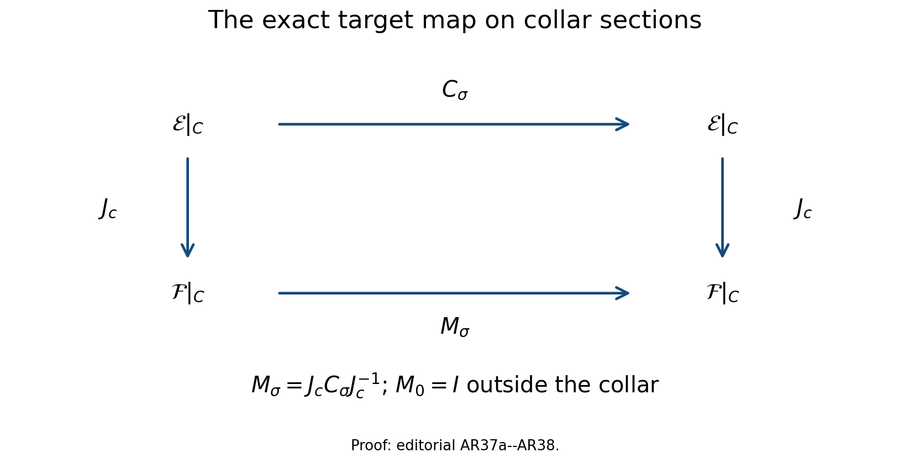
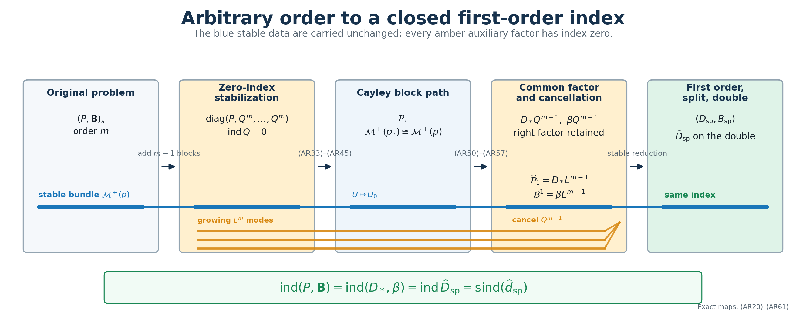
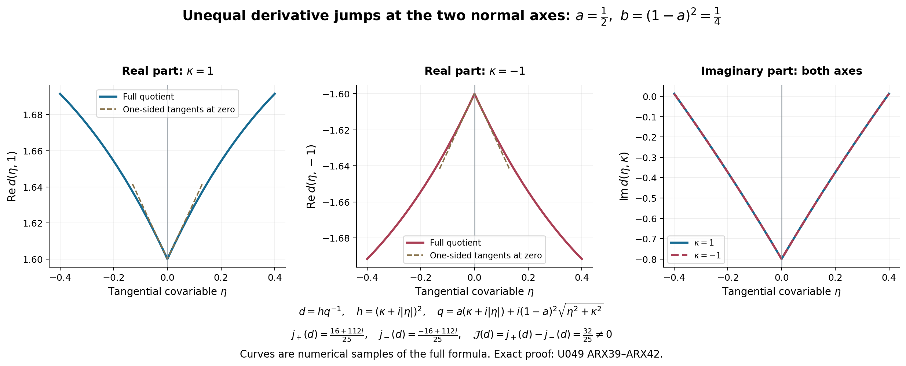

# Reducing arbitrary-order boundary problems to first order

An elliptic boundary problem of order \(m>1\) can be reduced to a first-order problem, but the reduction is not obtained by deleting \(m-1\) factors. Those factors carry a genuine operator on the global Sobolev space. The correct construction first adds zero-index equations, deforms the resulting block operator through a Cayley system whose stable space is unchanged, rewrites every boundary measurement on that stable space, and only then cancels a common zero-index right factor.

This lesson proves that construction with the original bundles, Sobolev exponents, coefficient order, and factor order visible throughout. The normal order of a boundary operator is always distinguished from its total order. Lower-order discrepancies are recorded as compact maps, and the first-order interior operator keeps its target bundle \(F\) even though \(F\) is identified with \(E\) in a collar.

The named prerequisites are [Stable modes and the algebra of boundary data](stable-boundary-models.md), [Composition in the mixed symbol calculus](mixed-symbol-composition.md), [Fredholm boundary problems with first-order Calderón defects](generalized-collar-fredholm.md), [Finite defects under perturbation](fredholm-stability.md), [Reducing first-order boundary data to a split trace](stable-reduction-boundary-data.md), and [Doubling a boundary problem and computing its index](split-doubling-boundary-index.md). We use \(D_t=-i\partial_t\), an inward collar coordinate \(t\geq0\), and complex bundles. Every displayed product acts from right to left.

## 1. The arbitrary-order problem and the reduction theorem

Let \(X\) be a compact smooth manifold with boundary \(Y\). Let \(E,F\to X\) and \(G_j\to Y\) be smooth complex bundles. Fix \(m>1\), and let \(P\) be an elliptic mixed operator of order \(m\). For \(s\geq m\), consider

\[
 (P,\mathbf B)_s:\bar H^s(X;E)\longrightarrow
 \bar H^{s-m}(X;F)\oplus
 \bigoplus_{j=1}^{J}H^{s-m_j-1/2}(Y;G_j).
 \tag{AR1}
\]

Here \(B_j\) has total order \(m_j\), while its normal order \(r_j\) satisfies \(r_j<m\). In a collar it has the exact form

\[
 B_j^b u=\sum_{\ell=0}^{r_j}B_{j\ell}\gamma_\ell u,
 \qquad
 B_{j\ell}\in\Psi_{\mathrm{phg}}^{m_j-\ell}(Y;E|_Y,G_j),
 \qquad \gamma_\ell u=(D_t^\ell u)|_{t=0}.
 \tag{AR2}
\]

There is no hypothesis \(m_j<m\). Only the number of normal derivatives is restricted. Assume that the principal boundary map is bijective on the stable Cauchy bundle, so that \((P,\mathbf B)_s\) is Fredholm.

**Arbitrary-order reduction theorem.** After adding \(m-1\) zero-index equations, there is a Fredholm homotopy to a block problem with a common right factor of order \(m-1\). Cancelling that factor gives a first-order elliptic boundary problem \((D_*,\boldsymbol\beta)\). Applying the first-order stable reduction and the geometric double gives

\[
 \boxed{
 \operatorname{ind}(P,\mathbf B)_s
 =\operatorname{ind}(D_*,\boldsymbol\beta)_{s-m+1}
 =\operatorname{ind}\widehat D_{\mathrm{sp}}
 =\operatorname{sind}(\widehat d_{\mathrm{sp}}).}
 \tag{AR3}
\]

Every equality will be proved below. In particular, the first equality includes the indices of all auxiliary factors; none is silently omitted. For a tangential row \(\beta_j\) on \(Y\), the notation \((D_*,\boldsymbol\beta)\) denotes the actual boundary realization \(u\mapsto(D_*u,(\beta_j\gamma_0u)_j)\). The same convention applies to tangential rows \(\widetilde B_j\) in a first-order realization; every boundary composition below displays the trace.

## 2. A common right factor and its stable inverse

Choose a positive scalar elliptic tangential operator \(\Lambda^+\in\Psi^1_{\mathrm{phg}}(Y;E|_Y)\), constant in the collar variable, with principal symbol \(\lambda(y,\eta)I_E\), where \(\lambda(y,\eta)>0\) for \(\eta\ne0\). Write

\[
 L=D_t+i\Lambda^+,\qquad R=D_t-i\Lambda^+,
 \qquad
 L_\eta=D_t+i\lambda(y,\eta),\quad
 R_\eta=D_t-i\lambda(y,\eta).
 \tag{AR4}
\]

First consider a problem that already has the collar factorization

\[
 P^b=(D_t-A)L^{m-1},\qquad
 B_j^b=\widetilde B_j\gamma_0L^{m-1},\qquad
 \widetilde B_j\in
 \Psi_{\mathrm{phg}}^{m_j+1-m}(Y;E|_Y,G_j).
 \tag{AR5}
\]

The leading normal coefficient identifies \(F\) with \(E\) only in this collar. Globally, the first operator in the product still maps \(E\) to \(F\).

Freeze the principal coefficients at \((y,\eta)\in T^*Y\setminus0\). If \(u\) is a decaying solution of the product equation, set

\[
 w=L_\eta^{m-1}u.
 \qquad
 (D_t-a(y,\eta))w=0,\qquad
 b_j(y,\eta,D_t)u(0)=\widetilde b_j(y,\eta)w(0).
 \tag{AR6}
\]

The inverse of one \(L_\eta\) factor on exponentially decreasing functions is explicit:

\[
 (T_\lambda g)(t)
 =-i\int_0^\infty e^{-\lambda s}g(t+s)\,ds,
 \qquad L_\eta T_\lambda g=g.
 \tag{AR7}
\]

If \(\|D_t^kg(t)\|\leq M_ke^{-\delta t}\), then differentiation under the integral gives

\[
 \|D_t^kT_\lambda g(t)\|
 \leq\frac{M_k}{\lambda+\delta}e^{-\delta t}.
 \tag{AR8}
\]

The homogeneous equation \(L_\eta^qf=0\) has exactly the functions
\(e^{\lambda t}p(t)\), where \(p\) is a vector polynomial of degree less than \(q\). None is bounded unless it is zero. It follows that

\[
 \mathcal M^+\big((D_t-a)L_\eta^{m-1}\big)
 \xrightarrow[\cong]{\ L_\eta^{m-1}\ }
 \mathcal M^+(D_t-a),\qquad
 w\longmapsto T_\lambda^{m-1}w
 \text{ is the inverse.}
 \tag{AR9}
\]

This proves both injectivity and surjectivity; a dimension count is not being used. The complementing map for the product problem is therefore the composite of this isomorphism with the reduced boundary map:

\[
 \mathcal M^+\big((D_t-a)L_\eta^{m-1}\big)
 \xrightarrow{L_\eta^{m-1}}
 \mathcal M^+(D_t-a)
 \xrightarrow{(\widetilde b_j)_j}
 \bigoplus_j(G_j)_y.
 \tag{AR10}
\]

Consequently the higher-order boundary symbol is complementing exactly when the reduced first-order boundary symbol is complementing.

## 3. The global zero-index factor and the cancellation theorem

Let \(\phi,\psi\in C_c^\infty([0,\delta))\) satisfy
\(0\leq\phi,\psi\leq1\), with \(\phi=1\) near \(0\), the support of \(\phi\) contained in the factorization collar, and \(\psi=1\) on the support of \(\phi\). Choose a positive scalar elliptic interior operator \(\Lambda\) of order one on \(E\). Define

\[
 Q=\psi(D_t+i\Lambda^+)+i(1-\psi)\Lambda(1-\psi):
 \bar H^q(X;E)\longrightarrow\bar H^{q-1}(X;E).
 \tag{AR11}
\]

Its principal symbol in the transition region is

\[
 q(x,\xi)=\psi(t)\bigl(\xi_t+i\lambda^+(y,\eta)\bigr)
 +i(1-\psi(t))^2\lambda(x,\xi).
 \tag{AR12}
\]

For real \(\xi_t\) and a nonzero covector, its imaginary scalar part satisfies

\[
 \operatorname{Im}q
 =\psi\lambda^++(1-\psi)^2\lambda>0
 \quad\text{unless }\psi=1,\ \eta=0,
 \quad\text{where }q=\xi_t\ne0.
 \tag{AR13}
\]

Thus \(Q\) is elliptic. Its collar equation is \(Lu=0\), whose stable space is zero, so it needs no boundary operator. It is the split first-order model with the entire bundle in the growing summand. The shift estimate and its adjoint estimate from the split model give

\[
 Q_q:\bar H^q(X;E)\longrightarrow\bar H^{q-1}(X;E)
 \text{ Fredholm},\qquad \operatorname{ind}Q_q=0
 \quad(q\geq1).
 \tag{AR14}
\]

Now choose a first-order mixed operator \(\widetilde P:E\to F\) whose collar and interior pieces have the types

\[
 \widetilde P^b=\phi(D_t-A):E\longrightarrow F,\qquad
 \widetilde P^i\in\Psi_{\mathrm{phg}}^1(X^\circ;E,F),\qquad
 \widetilde P=\widetilde P^b+\widetilde P^i.
 \tag{AR15}
\]

For \(s\geq m\), the composed boundary problem is the bounded map

\[
 (\widetilde P,\widetilde{\mathbf B})_{s-m+1}Q_s^{m-1}
 =\bigl(\widetilde P Q^{m-1},
 (\widetilde B_j\gamma_0Q^{m-1})_j\bigr):
 \bar H^s(X;E)\longrightarrow
 \bar H^{s-m}(X;F)\oplus
 \bigoplus_jH^{s-m_j-1/2}(Y;G_j).
 \tag{AR16}
\]

The index of a composition of Fredholm maps is additive. Since every \(Q_q\) has index zero,

\[
 \operatorname{ind}\bigl(\widetilde P Q^{m-1},
 \widetilde{\mathbf B}Q^{m-1}\bigr)_s
 =\operatorname{ind}(\widetilde P,\widetilde{\mathbf B})_{s-m+1}
 +(m-1)\operatorname{ind}Q
 =\operatorname{ind}(\widetilde P,\widetilde{\mathbf B})_{s-m+1}.
 \tag{AR17}
\]

Suppose the product principal symbol is sufficiently close to that of \(P\), while its boundary principal symbol is the one in (AR5). The straight segment between the two principal symbols then remains in the open elliptic set, and its quantization gives a Fredholm path. At the product endpoint, two quantizations with that same principal symbol differ in the interior by order at most \(m-1\); a boundary remainder one total order lower has the compact mappings

\[
 \begin{aligned}
 K&:\bar H^s(X;E)\longrightarrow
 \bar H^{s-m+1}(X;F)\hookrightarrow\bar H^{s-m}(X;F),\\
 R_j&:\bar H^s(X;E)\longrightarrow
 H^{s-m_j+1/2}(Y;G_j)
 \hookrightarrow H^{s-m_j-1/2}(Y;G_j).
 \end{aligned}
 \tag{AR18}
\]

The embeddings are compact because \(X\) and \(Y\) are compact. Operator-norm openness of the Fredholm set, followed by the compact straight-line path for the retained lower-order remainders, proves the cancellation theorem

\[
 \boxed{
 \operatorname{ind}(P,\mathbf B)_s
 =\operatorname{ind}(\widetilde P,\widetilde{\mathbf B})_{s-m+1}.}
 \tag{AR19}
\]

The theorem applies only after the global factor \(Q^{m-1}\) and the compact comparison have been constructed. The stable-space bijection (AR9) alone does not prove an operator index equality.

## 4. Stabilizing an arbitrary problem

Return to the original problem (AR1). Put \(\mathcal E=E^m\) and \(\mathcal F=F\oplus E^{m-1}\). On \(U=(U_0,\ldots,U_{m-1})\), first form

\[
 \mathcal P_0U=\bigl(PU_0,Q^mU_1,\ldots,Q^mU_{m-1}\bigr),
 \qquad
 \mathcal B_j^0U=B_jU_0.
 \tag{AR20}
\]

It acts as

\[
 (\mathcal P_0,\boldsymbol{\mathcal B}^0)_s:
 \bar H^s(X;\mathcal E)\longrightarrow
 \bar H^{s-m}(X;\mathcal F)\oplus
 \bigoplus_jH^{s-m_j-1/2}(Y;G_j).
 \tag{AR21}
\]

This is a direct sum of the original problem and \(m-1\) copies of \(Q^m\). Therefore

\[
 \operatorname{ind}(\mathcal P_0,\boldsymbol{\mathcal B}^0)_s
 =\operatorname{ind}(P,\mathbf B)_s
 +(m-1)m\operatorname{ind}Q
 =\operatorname{ind}(P,\mathbf B)_s.
 \tag{AR22}
\]

The literal composition \(Q^m\) need not be presented in the permitted mixed operator form. The mixed composition theorem supplies an allowed operator \(Q_{[m]}\) with the same collar expression and an arbitrarily small global norm error:

\[
 Q_{[m]}^b=L^m,\qquad
 \|Q_{[m]}-Q^m\|_{\bar H^s\to\bar H^{s-m}}<\varepsilon.
 \tag{AR23}
\]

Choose \(\varepsilon\) below the Fredholm stability radius for all auxiliary copies. The path

\[
 Q^m_\rho=(1-\rho)Q^m+\rho Q_{[m]},\qquad0\leq\rho\leq1,
 \tag{AR24}
\]

is Fredholm and has index zero. Hence we may use the allowed \(Q_{[m]}\) blocks from now on while retaining (AR22). The replacement has been recorded as a norm-controlled path, rather than identifying two different operator classes.

## 5. Cayley coefficients with the full collar polynomial retained

Shrink the collar once. On its compact cosphere the original principal symbol has a uniform inverse bound. A cutoff interpolation from its coefficient family at \(t\) to the family at \(t=0\) is therefore elliptic when the collar is sufficiently thin, by the same inverse-factor estimate used for first-order collar freezing. Extend the coefficients at \(t=0\) constantly across the smaller collar and retain the original operator outside the cutoff support. This is an explicit elliptic homotopy of the original principal symbol, not an identification of the two operators.

Use the invertible leading normal coefficient as a collar identification \(F\simeq E\). In that frame write the complete collar operator

\[
 P^b=\sum_{k=0}^{m}P_k^bD_t^k,\qquad
 P_k^b\in\Psi_{\mathrm{phg}}^{m-k}(Y;E,E),\qquad
 P_m^b=I_E.
 \tag{AR25}
\]

Let \(F_+\in\Psi_{\mathrm{phg}}^{-1}(Y;E)\) be a two-sided parametrix of \(\Lambda^+\). For \(0\leq j,k\leq m\), set

\[
 c_{jk}=\frac{i^{k-m}}{2^m}
 \sum_{r=0}^{j}(-1)^{j-r}
 \binom{k}{r}\binom{m-k}{j-r},
 \qquad
 \sum_{j=0}^{m}c_{jk}=\delta_{mk}.
 \tag{AR26}
\]

Define the order-zero tangential operators, with the factor order fixed as written,

\[
 A_j=\sum_{k=0}^{m}c_{jk}P_k^bF_+^{m-k}
 \in\Psi_{\mathrm{phg}}^0(Y;E,E).
 \tag{AR27}
\]

The numerical identity in (AR26) and \(F_+^0=I_E\) give the exact operator identity

\[
 \sum_{j=0}^{m}A_j
 =\sum_{k=0}^{m}\left(\sum_{j=0}^{m}c_{jk}\right)
 P_k^bF_+^{m-k}
 =P_m^b=I_E.
 \tag{AR28}
\]

No parametrix remainder is used in this calculation. At principal-symbol level, the Cayley formula gives

\[
 p^b(y,\eta,z)
 =\sum_{j=0}^{m}a_j(y,\eta)
 (z-i\lambda)^j(z+i\lambda)^{m-j},
 \qquad a_j=\sigma_0(A_j).
 \tag{AR29}
\]

Quantize the right side without changing its factor order:

\[
 P_{\mathrm{Cay}}^b
 =\sum_{j=0}^{m}A_jR^jL^{m-j},
 \qquad
 K_{m-1}=P^b-P_{\mathrm{Cay}}^b\in\Psi_{\mathrm{mix}}^{m-1}.
 \tag{AR30}
\]

The remainder contains every parametrix defect, commutator, and lower total-order coefficient. It is not erased. The collar path

\[
 P_\rho^b=P^b-\rho K_{m-1}
 =(1-\rho)P^b+\rho P_{\mathrm{Cay}}^b,\qquad0\leq\rho\leq1,
 \tag{AR31}
\]

has fixed principal symbol. With a collar cutoff it extends by the original operator outside the collar. Its contribution \(K_{m-1}:\bar H^s\to\bar H^{s-m}\) is compact by (AR18), so the Fredholm index remains fixed. We now work at the exact endpoint \(P_{\mathrm{Cay}}^b\), while (AR31) retains the relation to the original operator.

## 6. The quantized block homotopy

Choose \(\chi\in C_c^\infty([0,\delta))\), equal to one on a smaller boundary collar, with support inside the region where (AR30) is valid. For \(0\leq\tau\leq1\), write

\[
 \sigma(t)=\tau\chi(t),\qquad0\leq\sigma(t)\leq1.
 \tag{AR32}
\]

On the collar define an order-\(m\) operator matrix \(\mathfrak P_\tau\) on \(U=(U_0,\ldots,U_{m-1})\). Its first row is

\[
 \begin{aligned}
 (\mathfrak P_\tau U)_0={}&
 \bigl((1-\sigma^m)P_{\mathrm{Cay}}^b
       +\sigma^mA_0L^m\bigr)U_0\\
 &+\sum_{j=1}^{m-2}\sigma^{m-j}A_jL^mU_j
 +\sigma\bigl(A_{m-1}L^m+A_mRL^{m-1}\bigr)U_{m-1},
 \end{aligned}
 \tag{AR33}
\]

and its remaining rows are

\[
 (\mathfrak P_\tau U)_j
 =L^mU_j-\sigma RL^{m-1}U_{j-1},
 \qquad1\leq j<m.
 \tag{AR34}
\]

For \(m=2\), the sum in (AR33) is empty. The endpoint formulas are

\[
 \mathfrak P_0
 =\operatorname{diag}(P_{\mathrm{Cay}}^b,L^m,\ldots,L^m),
 \qquad
 \mathfrak P_1^b=\mathfrak F_*L^{m-1}
 \quad\text{where }\chi=1,
 \tag{AR35}
\]

with the common factor on the right. In the transition region derivatives of \(\chi\) and all quantization commutators have lower total order and remain in the displayed operator; none changes the principal symbol.

Let \(S(U_0,\ldots,U_{m-1})=(0,U_0,\ldots,U_{m-2})\). If \(C_\sigma\) is the leading normal coefficient of \(\mathfrak P_\tau\), define \(H_\sigma=I+N_\sigma\), where the only nonzero off-diagonal blocks of \(N_\sigma\) are

\[
 (N_\sigma)_{0j}=h_j
 =\sigma^{m-j}\sum_{k=j}^{m}A_k,\qquad1\leq j<m.
 \qquad
 C_\sigma=H_\sigma(I-\sigma S).
 \tag{AR36}
\]

Since \(N_\sigma^2=0\), \(S^m=0\), and (AR28) is exact, the inverse is the finite operator matrix

\[
 C_\sigma^{-1}
 =\left(\sum_{r=0}^{m-1}\sigma^rS^r\right)(I-N_\sigma),
 \qquad
 (C_\sigma^{-1})_{ij}=
 \begin{cases}
 \sigma^{i-j}I-\sigma^ih_j,&i\geq j\geq1,\\
 -\sigma^ih_j,&1\leq j>i,\\
 \sigma^iI,&j=0.
 \end{cases}
 \tag{AR37}
\]

Each entry is linear in the \(A_k\) after replacing \(I\) by \(\sum A_k\). Thus this calculation remains valid in the noncommutative order-zero operator algebra. **Editorial correction of the global target map.** The matrix \(C_\sigma\) and its inverse above are operators in the collar target frame. They do not identify \(F\) with \(E\) over all of \(X\). Let \(c:E|_C\to F|_C\) be the retained normal-coefficient identification on the collar \(C\), and put
\[
 J_c=\operatorname{diag}(c,I,\ldots,I):\mathcal E|_C\longrightarrow\mathcal F|_C,
 \qquad M_\sigma=J_cC_\sigma J_c^{-1},
 \qquad M_\sigma^{-1}=J_cC_\sigma^{-1}J_c^{-1}.
 \tag{AR37a}
\]
Every product is a composition of tangential operators on collar sections. No factor is moved through a coefficient. Direct multiplication gives both inverse identities because the intervening \(J_c^{-1}J_c\) and \(C_\sigma^{-1}C_\sigma\) cancel in their displayed order. Where \(\chi=0\), one has \(\sigma=0\), \(N_0=0\), and \(C_0=I\), hence \(M_0=I_{\mathcal F}\). The difference \(M_\sigma-I\) is supported in the collar where \(c\) is defined, so extend \(M_\sigma\) and its displayed inverse by the identity outside that collar.

These are bounded inverse operators on every restriction Sobolev space \(\bar H^q(X;\mathcal F)\). To check the assertion locally, tangential order-zero families are bounded in tangential Sobolev norms; each normal derivative gives a finite sum of their normal coefficient derivatives, again of tangential order zero, applied to normal derivatives of the input. The integer whole-space Sobolev estimate follows by summing these terms. The transposed families have the same property, giving the negative integer estimates by duality; interpolation gives every real exponent. Extend the smooth family across the collar boundary before applying this argument, and then restrict. Since the operator acts at each fixed normal coordinate, it preserves extension differences vanishing in the interior, proving the quotient-space bound. A finite chart partition completes the global estimate. The entries depend continuously on \(\tau\) in these bounds, and the exact inverses remain as written.

Thus the global comparison with the original target retained is

\[
 \widehat{\mathfrak P}_\tau=M_\sigma^{-1}\mathfrak P_\tau,
 \qquad
 \mathfrak P_\tau=M_\sigma\widehat{\mathfrak P}_\tau.
 \tag{AR38}
\]

In the collar frame this is exactly \(C_\sigma^{-1}J_c^{-1}\mathfrak P_\tau\); multiplication by \(J_c\) returns it to \(\mathcal F\). Postcomposition by the global invertible \(M_\sigma^{-1}\) identifies the original range quotient with the new one and leaves the kernel unchanged. Its index is zero, so this step adds no index contribution and changes no boundary measurement.

The square is an exact identity of operators on collar sections, with vertical maps \(J_c\). Outside the collar the target automorphism is the identity. The full formulas and inverse proof are (AR37a)–(AR38).

At a frozen nonzero tangential covector, write \(p(z)\) for the original monic normal polynomial and \(L(z)=z+i\lambda\). Block elimination gives the exact identity

\[
 \det\mathfrak p_\sigma(z)
 =\det p(z)\,L(z)^{m(m-1)\operatorname{rank}E}.
 \tag{AR39}
\]

Indeed, the lower-right block has determinant \(L^{m(m-1)\operatorname{rank}E}\); its Schur complement is
\((1-\sigma^m)p+\sigma^m\sum a_jR^jL^{m-j}=p\). Polynomial continuation covers \(L=0\). For real \(z\), ellipticity of \(p\) and \(\lambda>0\) imply

\[
 \det\mathfrak p_\sigma(z)\ne0
 \qquad(0\leq\sigma\leq1).
 \tag{AR40}
\]

The same identity applies pointwise with \(\sigma=\tau\chi(t)\). It proves ellipticity throughout the collar transition, while the operator remains the original stabilized problem outside the support of \(\chi\).

## 7. The stable space along the block homotopy

Freeze again at \((y,\eta)\), now in the region \(\chi=1\). The lower rows of the equation say
\(L_\eta^{m-1}(L_\eta U_j-\tau R_\eta U_{j-1})=0\). The expression in parentheses is bounded for a stable solution, and the bounded kernel of \(L_\eta^{m-1}\) is zero. Therefore

\[
 L_\eta U_j=\tau R_\eta U_{j-1},\qquad
 L_\eta^jU_j=\tau^jR_\eta^jU_0
 \quad(1\leq j<m).
 \tag{AR41}
\]

Substitution into the first row, with all \(A_j\) left of the scalar factors, gives \(p(D_t)U_0=0\). Hence

\[
 \Pi_\tau:\mathcal M^+(\mathfrak p_\tau)\longrightarrow
 \mathcal M^+(p),\qquad U\longmapsto U_0
 \tag{AR42}
\]

is injective. Its inverse is constructive. For \(u\in\mathcal M^+(p)\), define

\[
 U_0=u,\qquad
 U_j=\tau T_\lambda R_\eta U_{j-1}
 =\tau^j(T_\lambda R_\eta)^ju,\qquad1\leq j<m.
 \tag{AR43}
\]

The estimate (AR8), applied successively, proves that every component and all its derivatives decrease exponentially. The recurrences hold, and substitution in the first row gives

\[
 (1-\tau^m)p(D_t)u
 +\tau^m\sum_{j=0}^{m}a_jR_\eta^jL_\eta^{m-j}u
 =p(D_t)u=0.
 \tag{AR44}
\]

Thus (AR42) is surjective. On compact subsets of \(T^*Y\setminus0\), the integral formula and its parameter derivatives are uniformly bounded because \(\lambda\) has a positive lower bound. The stable spaces therefore form smooth bundles, and

\[
 \begin{array}{ccc}
 \mathcal M^+(\mathfrak p_\tau)&\xrightarrow{\Pi_\tau}&\mathcal M^+(p)\\
 \downarrow&&\downarrow\\
 T^*Y\setminus0&=&T^*Y\setminus0
 \end{array}
 \quad\text{is a smooth bundle isomorphism for every }0\leq\tau\leq1.
 \tag{AR45}
\]

The auxiliary factor adds only the lower-half-plane root \(-i\lambda\), with its full multiplicity recorded in (AR39). It adds no stable Cauchy data.

## 8. Transporting every boundary measurement

Retain the complete boundary operator (AR2). Its frozen normal polynomial is

\[
 b_j(y,\eta,z)=\sum_{\ell=0}^{r_j}b_{j\ell}(y,\eta)z^\ell,
 \qquad r_j<m,\qquad
 b_{j\ell}\text{ homogeneous of degree }m_j-\ell.
 \tag{AR46}
\]

The degree-\(m-1\) Cayley basis gives unique symbols \(\beta_{jk}\) such that

\[
 b_j(z)=\sum_{k=0}^{m-1}\beta_{jk}R(z)^kL(z)^{m-1-k},
 \quad
 \beta_{jk}=\sum_{\ell=0}^{r_j}c'_{k\ell}
 b_{j\ell}\lambda^{\ell+1-m},
 \tag{AR47}
\]

where

\[
 c'_{k\ell}=\frac{i^{\ell+1-m}}{2^{m-1}}
 \sum_{a=0}^{k}(-1)^{k-a}
 \binom{\ell}{a}\binom{m-1-\ell}{k-a}.
 \tag{AR48}
\]

Because \(b_{j\ell}\) has degree \(m_j-\ell\), every term in \(\beta_{jk}\) has degree
\((m_j-\ell)+(\ell+1-m)=m_j+1-m\). Quantization and descending-order correction therefore give

\[
 \beta_j=(\beta_{j0},\ldots,\beta_{j,m-1})
 \in\Psi_{\mathrm{phg}}^{m_j+1-m}
 (Y;E^m|_Y,G_j).
 \tag{AR49}
\]

**Editorial correction of the frozen-symbol identity.** Let \(\beta_j^{\mathrm{pr}}=(\beta_{j0},\ldots,\beta_{j,m-1})\) denote the row of symbols in (AR47), before quantization. At \(\tau=1\), (AR41) gives the following exact equality of functions for a frozen stable solution \(U\):

\[
 b_j(y,\eta,D_t)U_0
 =\sum_{k=0}^{m-1}\beta_{jk}(y,\eta)R_\eta^kL_\eta^{m-1-k}U_0
 =\sum_{k=0}^{m-1}\beta_{jk}(y,\eta)L_\eta^{m-1}U_k
 =\beta_j^{\mathrm{pr}}(y,\eta)L_\eta^{m-1}U.
 \tag{AR50}
\]

The formula containing \(\tau^{-k}\) is needed only to derive this endpoint identity; it is never used at \(\tau=0\). Define the final boundary homotopy solely at the elliptic interior endpoint:

\[
 \mathcal B_j^\kappa U
 =(1-\kappa)B_jU_0+\kappa\beta_j\gamma_0L^{m-1}U,
 \qquad0\leq\kappa\leq1.
 \tag{AR51}
\]

If \(\mathcal C^+\) is the stable trace bundle of the frozen principal polynomial \(\mathfrak p_1\), let \(\mathfrak b_j^\kappa\) denote the principal boundary map of (AR51). For the stable solution determined by a vector in \(\mathcal C^+\), evaluation of (AR50) at zero gives

\[
 \left.\mathfrak b_j^\kappa(y,\eta)\right|_{\mathcal C^+}
 =\bigl[U\mapsto b_j(y,\eta,D_t)U_0(0)\bigr]
 =\bigl[U\mapsto\beta_j^{\mathrm{pr}}(y,\eta)(L_\eta^{m-1}U)(0)\bigr].
 \tag{AR52}
\]

This identity holds for every \(\kappa\); it is a principal-symbol identity, while the full quantized operator remains (AR51) with its lower-order terms. Thus the boundary principal map is literally constant along \(\kappa\), rather than merely a convex path between invertible maps. The component orders are exact:

\[
 \bar H^s(X;E^m)
 \xrightarrow{L^{m-1}}
 \bar H^{s-m+1}(X;E^m)
 \xrightarrow{\beta_j\gamma_0}
 H^{s-m_j-1/2}(Y;G_j).
 \tag{AR53}
\]

The complementing condition and Fredholm index are therefore fixed throughout (AR51). A quantized lower-order boundary remainder maps first into \(H^{s-m_j+1/2}\) and is compact into the target in (AR53), so its retained straight-line correction also leaves the index fixed.

## 9. The endpoint factor and its global cancellation

On the smaller collar, combine (AR35), (AR38), and (AR51). In the collar target frame write \(\mathfrak P_1^{\mathrm{fr}}=J_c^{-1}\mathfrak P_1=\mathfrak F_*^{\mathrm{fr}}L^{m-1}\). The explicit first-order factor with the original target is \(D_*^b=J_cC_1^{-1}\mathfrak F_*^{\mathrm{fr}}\). Thus there is a first-order mixed operator matrix \(D_*^b:E^m\to F\oplus E^{m-1}\) such that

\[
 \widehat{\mathfrak P}_1^b=D_*^bL^{m-1},
 \qquad
 \mathcal B_j^1=\beta_j\gamma_0L^{m-1}.
 \tag{AR54}
\]

At frozen principal-symbol level the scalar factor can be written on either side. At operator level, (AR54) is the required right factor; it has not been commuted through the tangential coefficients.

Let \(Q_{\mathcal E}\) be the operator (AR11) on \(\mathcal E=E^m\). Its principal symbol \(q_{\mathcal E}\) is invertible off the zero section. If \(\widehat{\mathfrak p}_1\) is the complete endpoint principal symbol, define the first-order symbol

\[
 d_*(x,\xi)=\widehat{\mathfrak p}_1(x,\xi)
 q_{\mathcal E}(x,\xi)^{1-m}:
 \pi^*\mathcal E\longrightarrow\pi^*\mathcal F.
 \tag{AR55}
\]

It agrees with the symbol of \(D_*^b\) in the collar. Quantize it by a global first-order mixed operator \(D_*:\mathcal E\to\mathcal F\) with that collar form. The exact endpoint and the composition retain a lower-order difference:

\[
 \widehat{\mathfrak P}_1-D_*Q_{\mathcal E}^{m-1}=K_{m-1},\qquad
 \mathcal B_j^1-\beta_j\gamma_0Q_{\mathcal E}^{m-1}=R_j,
 \tag{AR56}
\]

where \(K_{m-1}\) and \(R_j\) have the compact mappings in (AR18). The full symbols are joined first inside the open elliptic set; then the retained compact remainders are joined by their straight-line paths. The cancellation theorem gives

\[
 \operatorname{ind}(\widehat{\mathfrak P}_1,\boldsymbol{\mathcal B}^1)_s
 =\operatorname{ind}(D_*,\boldsymbol\beta)_{s-m+1}
 +(m-1)\operatorname{ind}Q_{\mathcal E}
 =\operatorname{ind}(D_*,\boldsymbol\beta)_{s-m+1}.
 \tag{AR57}
\]

The reduced map has the unchanged boundary targets

\[
 (D_*,\boldsymbol\beta)_{s-m+1}:
 \bar H^{s-m+1}(X;\mathcal E)\longrightarrow
 \bar H^{s-m}(X;\mathcal F)\oplus
 \bigoplus_jH^{s-m_j-1/2}(Y;G_j).
 \tag{AR58}
\]

This verifies the source, interior target, and every boundary target after cancellation.

## 10. The complete index chain

Combining stabilization, the lower-order collar comparison, the block homotopy, the boundary homotopy, and cancellation gives

\[
 \begin{aligned}
 \operatorname{ind}(P,\mathbf B)_s
 &=\operatorname{ind}(\mathcal P_0,\boldsymbol{\mathcal B}^0)_s\\
 &=\operatorname{ind}(\widehat{\mathfrak P}_1,\boldsymbol{\mathcal B}^1)_s\\
 &=\operatorname{ind}(D_*,\boldsymbol\beta)_{s-m+1}.
 \end{aligned}
 \tag{AR59}
\]

If a component \(\beta_j\) has nonzero order \(\mu_j=m_j+1-m\), choose an exact invertible order reducer \(J_{G_j}^{-\mu_j}\) on its target. Then

\[
 \beta_j^{(0)}=J_{G_j}^{-\mu_j}\beta_j,\qquad
 \operatorname{ind}(D_*,\boldsymbol\beta^{(0)})
 =\operatorname{ind}(D_*,\boldsymbol\beta)
 +\sum_j\operatorname{ind}J_{G_j}^{-\mu_j}
 =\operatorname{ind}(D_*,\boldsymbol\beta).
 \tag{AR60}
\]

The last equality uses invertible reducers, whose indices are zero. The first-order stable reduction deforms this problem to a split trace problem without changing its index. Its zero-index reflected complement glues to a closed doubled operator \(\widehat D_{\mathrm{sp}}\), and ordinary operator-norm approximation gives its symbol index:

\[
 \operatorname{ind}(D_*,\boldsymbol\beta)
 =\operatorname{ind}(D_{\mathrm{sp}},B_{\mathrm{sp}})
 =\operatorname{ind}\widehat D_{\mathrm{sp}}
 =\operatorname{sind}(\widehat d_{\mathrm{sp}}).
 \tag{AR61}
\]

Equations (AR59)–(AR61) prove (AR3) for the original problem. The stabilization is specialized back by (AR22), and the cancelled factors are specialized back by (AR57); the conclusion is not confined to the terminal block model.

The left panel depicts (AR20)–(AR24), the middle panels depict (AR33)–(AR54), and the last panel depicts (AR57)–(AR61). The blue strand is the stable Cauchy bundle carried by the first-coordinate isomorphism (AR42). The amber strands are the growing auxiliary modes of \(L^m\); they never enter the stable boundary map.

## 11. Two exact calculations

Take \(m=2\), \(\lambda=1\), and

\[
 p(z)=(z-2i)(z+3i)=z^2+iz+6.
 \tag{AR62}
\]

For \(L=z+i\) and \(R=z-i\), direct coefficient comparison gives

\[
 p(z)=-L(z)^2+\frac72R(z)L(z)-\frac32R(z)^2,
 \qquad -1+\frac72-\frac32=1.
 \tag{AR63}
\]

The block path is

\[
 \begin{aligned}
 (\mathfrak p_\tau U)_0
 &=\bigl((1-\tau^2)p-\tau^2L^2\bigr)U_0
 +\tau\left(\frac72L^2-\frac32RL\right)U_1,\\
 (\mathfrak p_\tau U)_1&=L^2U_1-\tau RLU_0.
 \end{aligned}
 \tag{AR64}
\]

At \(\tau=1\), every term has the common right factor \(L\). If the boundary measurement is \(B(z)=z\), then

\[
 z=\frac12L(z)+\frac12R(z),\qquad
 B(D)U_0=\frac12LU_0+\frac12LU_1
 \quad\text{on }\mathcal M^+(\mathfrak p_1),
 \tag{AR65}
\]

because \(LU_1=RU_0\). This is the endpoint identity (AR50) in a case where every coefficient can be checked by multiplication.

For a separate order calculation, let \(m=3\) and let a boundary row have total order \(m_j=5\) but normal order two:

\[
 B_j=B_{j0}\gamma_0+B_{j1}\gamma_1+B_{j2}\gamma_2,\qquad
 \operatorname{ord}B_{j0}=5,\quad
 \operatorname{ord}B_{j1}=4,\quad
 \operatorname{ord}B_{j2}=3.
 \tag{AR66}
\]

Every Cayley coefficient \(\beta_{jk}\) belongs to \(\Psi^{5+1-3}=\Psi^3\), and \(\beta_j\gamma_0L^2\) belongs to the declared total-order-five boundary class. Cancellation of a leading component can lower its actual order. This verifies directly that a large total boundary order is compatible with the reduction; the essential restriction is the normal degree \(2<3\).

## 12. A typed correction and the exact limits of the argument

The global interior part of the reduced first-order operator in (AR15) must have type \(E\to F\). Writing it as \(E\to E\) is valid only after choosing a global bundle isomorphism \(F\simeq E\), while ellipticity supplies such an identification only in the boundary collar. This is a bundle-target correction, not a change to the collar calculation.

The argument also proves more generality than an order comparison might suggest: the integers \(m_j\) are unrestricted. Formula (AR49) remains valid for positive, zero, or negative \(m_j+1-m\). What must remain below \(m\) is the normal degree \(r_j\), because the endpoint Cayley basis in (AR47) has degree \(m-1\).

Three limits remain explicit. The construction assumes an existing complementing boundary system; it does not remove the stable-bundle obstruction. It proves stable cancellation, not equality of all solutions of a product equation. Finally, it uses a zero-index global completion \(Q\); a local factor \(L^{m-1}\) without that completion does not justify the global index equality.

## 13. Exercises with complete solutions

**Exercise 1.** Verify the sign and uniqueness in (AR7).

**Solution.** Put \(I(t)=\int_0^\infty e^{-\lambda s}g(t+s)\,ds\). Integration by parts gives \(I'=-g+\lambda I\). For \(f=-iI\),

\[
 D_tf+i\lambda f=-if'+i\lambda f=g.
 \tag{AR67}
\]

The difference of two bounded solutions solves \(L_\eta h=0\), hence equals \(ce^{\lambda t}\), so \(c=0\).

**Exercise 2.** Prove directly that the transition symbol (AR12) has no real zero.

**Solution.** If \(0\leq\psi<1\), then
\(\psi\lambda^++(1-\psi)^2\lambda>0\), so the imaginary part is nonzero. If \(\psi=1\) and \(\eta\ne0\), it equals \(\lambda^+>0\). If \(\psi=1\) and \(\eta=0\), a nonzero covector has \(\xi_t\ne0\), and

\[
 q=\xi_t\ne0.
 \tag{AR68}
\]

**Exercise 3.** Derive the sum identity in (AR28) without assuming that \(F_+\) is an exact inverse.

**Solution.** Sum (AR27) over \(j\), retain the displayed order, and use only the numerical identity in (AR26):

\[
 \sum_jA_j
 =\sum_k\delta_{mk}P_k^bF_+^{m-k}
 =P_m^bF_+^0=I_E.
 \tag{AR69}
\]

No product \(F_+\Lambda^+\) occurs.

**Exercise 4.** Check the inverse in (AR37).

**Solution.** Since \(N_\sigma^2=0\), \(H_\sigma^{-1}=I-N_\sigma\). Since \(S^m=0\),

\[
 (I-\sigma S)^{-1}=\sum_{r=0}^{m-1}\sigma^rS^r,\qquad
 C_\sigma^{-1}C_\sigma
 =(I-\sigma S)^{-1}H_\sigma^{-1}H_\sigma(I-\sigma S)=I.
 \tag{AR70}
\]

Multiplying the two finite block matrices gives the component formula in (AR37) without interchanging any \(A_k\).

**Exercise 5.** Explain why the boundary path (AR51) cannot lose the complementing condition.

**Solution.** On the frozen stable trace bundle, evaluation of (AR50) at zero makes the two principal boundary maps equal. Put \(T_0U=b_j(y,\eta,D_t)U_0(0)\) and \(T_1U=\beta_j^{\mathrm{pr}}(y,\eta)(L_\eta^{m-1}U)(0)\). Then \(T_0=T_1\), so for every \(\kappa\),

\[
 (1-\kappa)T_0+\kappa T_1=T_0.
 \tag{AR71}
\]

The complete boundary map on the stable bundle is therefore the original bijection for the entire path.

**Exercise 6.** Locate every zero contribution in the index chain.

**Solution.** The \(m-1\) stabilization blocks each contain \(Q^m\), so their total contribution is \((m-1)m\operatorname{ind}Q=0\). Cancellation removes \(Q^{m-1}\), contributing \((m-1)\operatorname{ind}Q=0\). Exact target reducers and the reflected complementary half are invertible or zero-index. Thus

\[
 \operatorname{ind}(P,\mathbf B)
 =\operatorname{ind}(D_*,\boldsymbol\beta)
 =\operatorname{ind}\widehat D_{\mathrm{sp}},
 \tag{AR72}
\]

with the homotopy equalities supplied by (AR31), (AR33)–(AR40), and (AR51)–(AR53).

## 14. Reading notes and references

The finite-dimensional Cayley identities, their noncommutative leading-matrix factorization, and the explicit stable lift are proved in [Stable modes and the algebra of boundary data](stable-boundary-models.md). The global approximation and compact composition steps use [Composition in the mixed symbol calculus](mixed-symbol-composition.md) and [Finite defects under perturbation](fredholm-stability.md). The first-order endpoint is treated in [Reducing first-order boundary data to a split trace](stable-reduction-boundary-data.md), and its closed-manifold realization is proved in [Doubling a boundary problem and computing its index](split-doubling-boundary-index.md).

This is an independent teaching derivation. Its historical statement route is recorded separately from the proof, and exact correspondence to an original-author source remains open.

Written and dedicated to the public domain by Codex under CC0 1.0.

## 15. Editorial receiving proofs for the global reduction

The following arguments supply the analytic maps used in (AR14), (AR23), (AR38), (AR56), and (AR60). They retain the original operators and their factor order. The normal polynomial degree \(m\) is an integer: the \(m\) components in (AR20), the coefficient \(P_m^b\), and the powers in the stated construction all use that same integer \(m>1\).

### 15.1. The actual zero-index factor and every intervening Sobolev space

The operator \(Q\) in (AR11) is exactly the split operator (DI2) of [Doubling a boundary problem and computing its index](split-doubling-boundary-index.md), with
\[
 E^+=E,\qquad E^-=0,\qquad \phi=\psi,\qquad
 P^b=\psi(D_t+i\Lambda^+),\qquad
 P^i=i(1-\psi)\Lambda(1-\psi),\qquad B=0.
 \tag{ARX1}
\]
Both occurrences of \(1-\psi\) remain. The transition symbol is consequently (AR12), and the frozen stable space is the zero bundle by (DI4). The empty boundary map is the unique isomorphism from that zero stable bundle to the zero measurement bundle. Thus the Fredholm and dual regularity theorem in [Fredholm boundary problems with first-order Calderón defects](generalized-collar-fredholm.md) applies with precisely this boundary datum.

For clarity, the index-zero proof includes the cokernel. Use a product density in the collar to compute the pairing; equivalent smooth densities do not change the realization or its index. The original inward coordinate and linear-first pairing give
\[
 2\operatorname{Im}(\psi D_tu,u)
 =\|\gamma_0u\|_Y^2+\int\psi'(t)|u|^2\,dV.
 \tag{ARX2}
\]
For each positive scalar principal operator \(A\), the retained identity (DA1) is
\((A+A^*)/2=R_A^*R_A+H_A\), with \(H_A\) of order zero. Applying it to \(\Lambda^+\) and to \(\Lambda\) on the actual input \((1-\psi)u\), and retaining the \(\psi'\) and all patching terms, yields
\[
 2\operatorname{Im}(Qu,u)\ge
 \|\gamma_0u\|_Y^2-C\|u\|_X^2.
 \tag{ARX3}
\]
Choose \(T>C/2\), enlarging \(C\) once for the adjoint. Then \(Q+iTI\) has zero kernel. A vector \(v\) in its cokernel at the realization \(\bar H^1\to L^2\) is smooth by dual regularity. Green's identity gives
\[
 (Q^*-iT)v=0,\qquad \gamma_0v=0.
 \tag{ARX4}
\]
Indeed the boundary term is \(i(\gamma_0u,\gamma_0v)\), and arbitrary smooth traces force the displayed condition. The operator \(-Q^*\) has inward normal coefficient \(-1\), positive scalar imaginary principal terms, and the complete differentiated-cutoff terms of (DA3)–(DA5). Apply its version of (ARX3) under \(\gamma_0v=0\). The shift \(+iT\) then gives \(v=0\). The shifted operator is therefore bijective. The path \(Q+irTI\), \(0\le r\le1\), keeps both principal symbols fixed and remains Fredholm. Its index is zero throughout. The same smooth kernel and dual obstruction spaces represent every realization \(q\ge1\), proving (AR14) without deriving an index from ellipticity alone.

The actual powers have the separately typed factorization
\[
 Q_s^m=Q_{s-m+1}\circ Q_{s-m+2}\circ\cdots\circ Q_s:
 \bar H^s(E)\longrightarrow\bar H^{s-m}(E),
 \tag{ARX5}
\]
\[
 Q_s^{m-1}=Q_{s-m+2}\circ\cdots\circ Q_s:
 \bar H^s(E)\longrightarrow\bar H^{s-m+1}(E).
 \tag{ARX6}
\]
For \(s\ge m\), every source exponent of a factor is at least one. Fredholm product additivity gives zero index for both powers. The same proof on \(\mathcal E=E^m\) gives \(Q_{\mathcal E}^{m-1}\) and its zero contribution in (AR57). Stabilization still contributes exactly \((m-1)m\operatorname{ind}Q\); cancellation contributes exactly \((m-1)\operatorname{ind}Q_{\mathcal E}\).

### 15.2. The collar freeze and the pure normal covectors after target normalization

Use the original collar pullbacks of \(E|_Y\) and \(F|_Y\), and write \(p_t(y,\eta,z):E_y\to F_y\) for the complete homogeneous principal polynomial. Its inverse on the compact real unit cosphere is uniformly bounded. Smoothness in \(t\) gives a collar thickness for which
\[
 \sup_{y,\,|\eta|^2+z^2=1,\,0\le t\le\delta_0}
 \|p_t^{-1}(p_0-p_t)\|=\theta<1.
 \tag{ARX7}
\]
With a cutoff \(\chi_0\) supported in that collar, retain the exact path and ordered inverse
\[
 p_{r,t}=p_t+r\chi_0(t)(p_0-p_t),\qquad
 p_{r,t}^{-1}
 =[I+r\chi_0p_t^{-1}(p_0-p_t)]^{-1}p_t^{-1},
 \tag{ARX8}
\]
\[
 [I+r\chi_0p_t^{-1}(p_0-p_t)]^{-1}
 =\sum_{\nu=0}^\infty[-r\chi_0p_t^{-1}(p_0-p_t)]^\nu.
 \tag{ARX9}
\]
The ratio is at most \(\theta\). Homogeneity extends invertibility from the unit cosphere to every nonzero real covector. At \(t=0\), the path is exactly \(p_0\), so the stable polynomial and every original boundary principal measurement are unchanged. Quantize the coefficient differences in their original orders, retain the original operator outside the cutoff support, and keep all lower terms. The resulting norm-continuous Fredholm path is the freezing operation used in Section 5. It does not require an unproved freezing assertion from another unit.

Next shrink the support of the original \(\chi\) in (AR32) inside the region where the full stabilized operator has the displayed collar polynomial and every interior piece vanishes. Such a region exists because each interior kernel is supported away from \(Y\), and only finitely many operators occur. The tangential target maps \(M_\sigma^{\pm1}-I\) act at fixed \(t\) and have this same output support. They therefore annihilate those interior outputs. Outside the collar the normalized operator has the unchanged interior piece.

Inside the collar, retain every complete tangential coefficient:
\[
 J_c^{-1}\mathfrak P_\tau
 =C_\sigma D_t^m+\sum_{k=0}^{m-1}V_{\tau,k}(t)D_t^k,
 \qquad V_{\tau,k}\in\Psi_{\mathrm{phg}}^{m-k}(Y;E^m),
 \tag{ARX10}
\]
\
 J_c^{-1}\widehat{\mathfrak P}_\tau
 =D_t^m+\sum_{k=0}^{m-1}
 [C_\sigma^{-1}V_{\tau,k}D_t^k.
 \tag{ARX11}
\]
There is no differentiation of the left factor in this composition: each tangential product acts before the displayed normal derivative. The exact identity \(C_\sigma^{-1}C_\sigma=I\), rather than a principal-symbol approximation, makes the leading normal coefficient the multiplication map \(J_c\) on the original target. Each lower coefficient still has order at most \(m-k\), with \(m-k\ge1\).

Its homogeneous degree-\((m-k)\) part tends to zero as \(\eta\to0\). Consequently the full principal symbol of the normalized operator extends continuously to the pure normal axis with the exact value
\[
 \widehat{\mathfrak p}_\tau(y,t,0,z)=J_c(y,t)z^m,\qquad z\ne0.
 \tag{ARX12}
\]
This is invertible. For \(\eta\ne0\), (AR39) and the invertible left matrix \(J_cC_\sigma^{-1}\) give invertibility. Thus the normalized path satisfies the actual normal-leading and interior ellipticity hypotheses of (GF1), including the pure normal directions. Its frozen stable solutions are those of the original \(\mathfrak p_\tau\), because its left factor is invertible. Equations (AR41)–(AR45) identify their boundary data with the unchanged original \(p\), including \(\tau=0\). This proves the Fredholm receiving step for the entire block path.

### 15.3. A permitted representative of every literal auxiliary power

Here is the operator construction behind (AR23). Choose a scalar normal cutoff \(\zeta_b\), equal to one near \(Y\), supported where \(Q=L\), and put \(\zeta_i=1-\zeta_b\). Choose \(\zeta_{\mathrm{in}}\), zero in a smaller collar and equal to one outside it, with \(\operatorname{supp}(1-\zeta_{\mathrm{in}})\) inside the region where \(\zeta_b=1\) and \(\psi=1\). The collar factor \(L\) and all its tangential coefficients preserve normal support. The interior term of \(Q\) has the two exact factors \(1-\psi\), and hence both its normal input and output supports stay away from \(Y\). Expanding the finite power in its original operator order therefore gives the exact decomposition
\[
 Q^m=\zeta_bL^m+\zeta_iQ^m\zeta_{\mathrm{in}},
 \qquad
 \zeta_iQ^m(1-\zeta_{\mathrm{in}})=0.
 \tag{ARX13}
\]
In the second identity every word containing an interior factor kills the near-boundary input before any such factor can act; the remaining word is \(L^m\), whose normal support is killed by \(\zeta_i\). The first identity uses the same support argument at the output.

Every iterate \(Q^j\zeta_{\mathrm{in}}u\), \(0\le j\le m\), is supported outside one fixed smaller collar. Indeed the collar term preserves its normal support, and the interior term has an output cutoff \(1-\psi\). Choose \(\alpha\), zero near \(Y\) and equal to one on all these supports, and define \(Q_i=\alpha Q\alpha\) on a boundaryless neighborhood by extension of its interior-supported kernels. Then
\[
 Q^j\zeta_{\mathrm{in}}=Q_i^j\zeta_{\mathrm{in}}
 \quad(0\le j\le m).
 \tag{ARX14}
\]
The extension introduces no boundary trace or zero-extension Sobolev loss: every kernel in this formula has its two supports a positive distance from \(Y\).

The local pieces of \(Q_i\) are ordinary first-order operators, first-order normal differential terms with multiplication coefficients, and partial tangential operators of positive order one. Apply the actual annular approximation (I29)–(I34) in [Symbols, finite defects, and the index on a closed manifold](global-elliptic-symbol-index.md) to the last pieces, retaining their cutoffs, densities and frame matrices. A finite chart partition gives an ordinary interior operator \(Q_{i,\varepsilon}\) for which, for every real \(q\),
\[
 \|Q_{i,\varepsilon}-Q_i\|_{H^q\to H^{q-1}}
 \le C_q\varepsilon,\qquad
 \sup_{0<\varepsilon\le1}\|Q_{i,\varepsilon}\|_{H^q\to H^{q-1}}<\infty.
 \tag{ARX15}
\]
The full symbol seminorms of the approximants may grow; this bound uses the proved operator-norm estimate, not a claimed uniform classical symbol bound.

The noncommutative telescoping identity is
\[
 Q_{i,\varepsilon}^m-Q_i^m
 =\sum_{a=0}^{m-1}
 Q_{i,\varepsilon}^{m-1-a}
 (Q_{i,\varepsilon}-Q_i)Q_i^a.
 \tag{ARX16}
\]
Its \(a\)-th term maps \(H^s\) through \(H^{s-a}\), \(H^{s-a-1}\), and then \(H^{s-m}\). The finitely many bounds in (ARX15) prove
\[
 \|Q_{i,\varepsilon}^m-Q_i^m\|_{H^s\to H^{s-m}}
 \le C_{s,m}\varepsilon.
 \tag{ARX17}
\]
Consequently the allowed mixed operator
\[
 Q_{[m],\varepsilon}
 =\zeta_bL^m+\zeta_iQ_{i,\varepsilon}^m\zeta_{\mathrm{in}}
 \tag{ARX18}
\]
has its exact collar form \(L^m\), an ordinary interior part supported away from \(Y\), and the asserted arbitrarily small norm error from the literal \(Q^m\). No tangential order-zero annular approximation is used. The Fredholm stability radius supplies (AR24). Replacing \(m\) by \(m-1\) proves the corresponding common-factor representative. The same support decomposition and ordered telescoping apply to \(D_*Q_{\mathcal E}^{m-1}\): its normalized first-order collar coefficient is the multiplication leading map \(J_c\), while its other tangential coefficient has order at most one and may be approximated as a positive order-one symbol. They supply the permitted product representative used in (AR56), retaining every lower-order difference.

### 15.4. Every trace order and the exact target order reducers

For each original \(0\le\ell\le r_j<m\), \(s\ge m\) gives the actual trace map and tangential row
\[
 \bar H^s(X;E)\xrightarrow{\gamma_\ell}
 H^{s-\ell-1/2}(Y;E)
 \xrightarrow{B_{j\ell}}
 H^{s-m_j-1/2}(Y;G_j).
 \tag{ARX19}
\]
The cancellation endpoint has the equally exact sequence
\[
 \bar H^s(E^m)\xrightarrow{L^{m-1}}
 \bar H^{s-m+1}(E^m)\xrightarrow{\gamma_0}
 H^{s-m+1/2}(E^m|_Y)
 \xrightarrow{\beta_j}
 H^{s-m_j-1/2}(G_j).
 \tag{ARX20}
\]
Thus no upper bound on \(m_j\) occurs. Lower total order by one improves the final target by exactly one, giving the compact boundary inclusion in (AR18); a finite sum over the original normal derivatives retains this gain.

Put \(\mu_j=m_j+1-m\), and keep the separate target reducer constructed in (I9) of [Symbols, finite defects, and the index on a closed manifold](global-elliptic-symbol-index.md). It is an exact bounded isomorphism
\[
 J_{G_j}^{-\mu_j}:
 H^{s-m_j-1/2}(Y;G_j)\longrightarrow
 H^{s-m+1/2}(Y;G_j),
 \qquad \operatorname{ind}J_{G_j}^{-\mu_j}=0.
 \tag{ARX21}
\]
Its exact inverse is supplied by (I9), for every real exponent; no identity between different powers \(J^rJ^t\) is assumed. Postcomposition of the boundary realization by
\(\operatorname{diag}(I_{\bar H^{s-m}(F)},(J_{G_j}^{-\mu_j})_j)\)
is an isomorphism of its full target. It leaves the kernel unchanged and identifies the two range quotients, proving (AR60) with all target spaces visible.

The first-order system now satisfies precisely the starting hypotheses of [Reducing first-order boundary data to a split trace](stable-reduction-boundary-data.md): its domain is \(\bar H^{s-m+1}\), its interior order is one with original target \(\mathcal F\), and its reduced measurement rows have declared order zero and form a bijection on the stable Cauchy bundle. This is the particular stable reduction branch consumed by (AR61). The finite normal products (NP1)–(NP29) there provide the actual finite inverse/layer receiving maps; the complete first-order collar deformation and auxiliary realization are also required for its split endpoint. The Bott input to that branch is its explicit finite bundle-complement construction in Section 12, rather than the oscillator or suspension calculation as a new prerequisite here.

## 16. Editorial correction: the global quotient and actual cancellation

The conclusion (AR57) is valid, but the global realization assertion before (AR56) needs correction. The function \(d_*=\widehat{\mathfrak p}_1q_{\mathcal E}^{1-m}\) in (AR55) is a continuous homogeneous symbol, by (ARX12), the continuous symbol (AR12), and invertibility of \(q_{\mathcal E}\). Such a symbol need not be the exact principal symbol of a permitted mixed operator: division by the transition symbol of \(Q_{\mathcal E}\) need not leave a polynomial in the normal covariable. Thus (AR55) alone neither constructs the asserted exact quantization nor proves the compactness asserted for the literal difference in (AR56). The original displays remain identifiable. The following construction supplies their actual receiving operation and proves the index equality. It also completes the product representative at the end of Section 15.3.

### 16.1. An allowed first-order realization with the original collar

In this section write \(H=\widehat{\mathfrak P}_1\), \(h=\widehat{\mathfrak p}_1\), \(Q=Q_{\mathcal E}\), \(q=q_{\mathcal E}\), and \(n=m-1\). These are aliases for the unchanged operators, symbols and exponent. Keep \(H:\mathcal E\to\mathcal F\), \(Q:\mathcal E\to\mathcal E\), and \(d_*=h q^{-n}:\pi^*\mathcal E\to\pi^*\mathcal F\). On the compact total cosphere \(h,q,d_*\) are uniformly invertible. On the factorization collar \(d_*\) is exactly the symbol \(d_b\) of the actual \(D_*^b\) in (AR54).

Choose a scalar output cutoff \(\theta\), equal to one on a smaller collar and supported strictly inside that factorization collar. Construct a smooth morphism \(c_\delta\) uniformly within \(\delta\) of \(d_*\) on the total cosphere as follows. In a finite trivializing cover of the source and target pullbacks, convolve local matrix entries with smooth kernels of sufficiently small radius. Uniform continuity on the compact chart closures controls the error. Multiply by a smooth subordinate partition and sum the local maps in their original bundle frames. Extend by positive degree-one homogeneity, then insert a low-frequency cutoff. Quantize on the interior and insert an input cutoff equal to one on \(\operatorname{supp}(1-\theta)\), zero in a still smaller collar. Multiplication on the left by \(1-\theta\) gives an ordinary interior operator with both supports away from \(Y\). Together with \(\theta D_*^b\) this constructs an allowed first-order mixed operator \(D_\delta:\mathcal E\to\mathcal F\), exactly \(D_*^b\) near \(Y\), with

\[
 d_\delta=\theta d_b+(1-\theta)c_\delta,\qquad
 \|d_\delta-d_*\|_{S^*X}<\delta.
 \tag{ARX22}
\]

The input cutoff has principal value one wherever the second output term occurs. On \(\operatorname{supp}\theta\), \(d_b=d_*\). Choose
\[
 \delta\sup_{S^*X}\|d_*^{-1}\|<\tfrac12.
 \tag{ARX23}
\]
Then \(d_\delta=d_*[I+d_*^{-1}(d_\delta-d_*)]\) is invertible by the ordered Neumann series. This includes pure normal directions. Its boundary polynomial is the unchanged \(d_b\). The stable isomorphism (AR9) identifies its stable measurements with those of \(H^b=D_*^bL^n\); hence \((D_\delta,\boldsymbol\beta)_{s-n}\) is Fredholm by (GF1), (GF55)--(GF57), with
\[
 \bar H^{s-n}(X;\mathcal E)\longrightarrow
 \bar H^{s-m}(X;\mathcal F)\oplus
 \bigoplus_jH^{s-m_j-1/2}(Y;G_j),\qquad s\ge m.
 \tag{ARX24}
\]
Its normal leading multiplication map is \(J_c\): the normal leading matrix of the collar factor is \(C_1\), and its exact left inverse in (AR54) is \(C_1^{-1}\). Thus the actual normal-coefficient hypothesis is checked.

### 16.2. The literal ordered product and permitted representative

Form the literal bounded composition \((D_\delta,\boldsymbol\beta)_{s-n}Q_s^n\). Sections 15.1 and 15.4 give every intermediate exponent. Its Fredholm index is the index in (ARX24), plus exactly \(n\operatorname{ind}Q=0\). Near \(Y\), \(Q=L\) and \(D_\delta=D_*^b\), so its collar expression is exactly \(D_*^bL^n\). All interior output cutoffs vanish there; each collar factor preserves normal support. Iteration proves equality of every boundary jet of \(Q^nu\) and \(L^nu\), first on smooth sections and then by continuous trace maps on \(\bar H^s\). Consequently, at every original \(m_j\),
\[
 \beta_j\gamma_0Q^n=\beta_j\gamma_0L^n=\mathcal B_j^1,\qquad R_j=0.
 \tag{ARX25}
\]
The zero is equality of these actual operators, not omission of an unexamined remainder.

Choose the three scalar normal cutoffs of Section 15.3 within the common factorization collar. The same support proof gives
\[
 D_\delta Q^n=\zeta_bD_*^bL^n+\zeta_iD_iQ_i^n\zeta_{\mathrm{in}}.
 \tag{ARX26}
\]
Here \(Q_i=\alpha Q\alpha\) and \(D_i=\alpha_FD_\delta\alpha\) have their interior-supported kernels extended to a boundaryless neighborhood. Choose \(\alpha=1\) on the normal supports of \(Q^j\zeta_{\mathrm{in}}u\), \(0\le j\le n\), and \(\alpha_F=1\) on the part of their \(D_\delta\)-outputs selected by \(\zeta_i\). These supports stay outside one fixed smaller collar: collar factors preserve normal support and each ordinary interior factor has its two cutoffs a positive distance from \(Y\). In the first summand any word with an interior factor has zero output in \(\operatorname{supp}\zeta_b\); the remaining word is \(D_*^bL^n\). In the second summand an input \(1-\zeta_{\mathrm{in}}\) is killed at the first interior factor or remains a collar word killed by \(\zeta_i\). This proves both support identities and their original multiplication order.

Each local term of \(Q_i,D_i\) is ordinary of order one, a normal differential term with multiplication coefficient, or a partial tangential term of order at most one. Treat the last coefficient as an order-one symbol while retaining its entire lower expansion. Apply the positive-order approximation (I29)--(I47), (FC1)--(FC7), with the fixed charts, densities and cutoffs. It gives ordinary \(Q_{i,\varepsilon},D_{i,\varepsilon}\) such that
\[
 \|Q_{i,\varepsilon}-Q_i\|_{H^a\to H^{a-1}}\le C_a\varepsilon,\qquad
 \|D_{i,\varepsilon}-D_i\|_{H^a\to H^{a-1}}\le C_{a,\delta}\varepsilon.
 \tag{ARX27}
\]
Only finitely many exponents are used in the following product. At those exponents their norms are uniformly bounded by the original norm plus the displayed error. Their principal symbols converge uniformly on the full cosphere by (I33); full classical seminorms need not be uniformly bounded. The permitted order-\(m\) mixed representative is
\[
 V_{\delta,\varepsilon}=
 \zeta_bD_*^bL^n+\zeta_iD_{i,\varepsilon}Q_{i,\varepsilon}^{\,n}\zeta_{\mathrm{in}}.
 \tag{ARX28}
\]
Its second summand is an ordinary interior composition with both support cutoffs retained. Use the exact noncommutative identity
\[
 \begin{aligned}
 D_{i,\varepsilon}Q_{i,\varepsilon}^{\,n}-D_iQ_i^n
 &=(D_{i,\varepsilon}-D_i)Q_i^n\\
 &\quad+D_{i,\varepsilon}\sum_{a=0}^{n-1}
 Q_{i,\varepsilon}^{\,n-1-a}(Q_{i,\varepsilon}-Q_i)Q_i^a.
 \end{aligned}
 \tag{ARX29}
\]
The first summand uses \(H^s\to H^{s-n}\to H^{s-m}\). Summand \(a\) in the second line uses, from right to left, \(H^s\to H^{s-a}\to H^{s-a-1}\to H^{s-n}\to H^{s-m}\). The finite bounds (ARX27) therefore prove
\[
 \|V_{\delta,\varepsilon}-D_\delta Q^n\|_{\bar H^s\to\bar H^{s-m}}
 \le C_{s,\delta}\varepsilon,\qquad
 \|v_{\delta,\varepsilon}-d_\delta q^n\|_{S^*X}\longrightarrow0.
 \tag{ARX30}
\]
For the second assertion apply the same finite telescoping to the principal products, keeping all cutoff factors and frame maps; each individual principal approximation converges uniformly by (I33). The exact support comparisons in (ARX26) give the principal product \(d_\delta q^n\). This includes the normal axis. The boundary error is zero by (ARX25). Choose \(\varepsilon\) below the norm Fredholm radius of the literal composed realization. Its straight segment to the realization with \(V_{\delta,\varepsilon}\) is Fredholm and has the same index.

### 16.3. The original endpoint and specialization back

The original relation \(d_*q^n=h\) gives
\[
 d_\delta q^n-h=(d_\delta-d_*)q^n,\qquad
 \|d_\delta q^n-h\|_{S^*X}\le\delta\sup_{S^*X}\|q^n\|.
 \tag{ARX31}
\]
Decrease \(\delta\) to make this bound less than \(1/(4\sup\|h^{-1}\|)\). Choose \(\varepsilon\) satisfying the norm radius above and principal error in (ARX30) less than that same bound. The allowed mixed-operator segment
\[
 H_r=(1-r)H+rV_{\delta,\varepsilon},\qquad
 B_{j,r}=\mathcal B_j^1,\qquad0\le r\le1
 \tag{ARX32}
\]
has an invertible interior symbol: factor it as \(h[I+r h^{-1}(v_{\delta,\varepsilon}-h)]\), whose bracket error has norm less than \(1/2\), and use its ordered Neumann inverse. Its full collar operator is exactly \(D_*^bL^n\) for every \(r\). Its stable polynomial, complementing boundary map and normal leading multiplication coefficient \(J_c\) are therefore unchanged. The generalized Fredholm theorem and norm continuity of this finite operator segment preserve its index. The two concrete paths and Fredholm product additivity give
\[
 \begin{aligned}
 \operatorname{ind}(H,\boldsymbol{\mathcal B}^1)_s
 &=\operatorname{ind}(V_{\delta,\varepsilon},\boldsymbol{\mathcal B}^1)_s\\
 &=\operatorname{ind}\big((D_\delta,\boldsymbol\beta)_{s-m+1}Q_s^{m-1}\big)\\
 &=\operatorname{ind}(D_\delta,\boldsymbol\beta)_{s-m+1}.
 \end{aligned}
 \tag{ARX33}
\]
Use \(D_\delta\) as the constructed global \(D_*\) in (AR3), (AR57)--(AR61) and (AR72). All boundary targets remain those of (AR58). Retain the actual bounded difference \(H-D_\delta Q^{m-1}\); its approximation part has not been falsely assigned order \(m-1\) or declared compact. Genuine lower-order terms still have (AR18). This correction propagates through Sections 3, 9, 10 and Exercise 6: the proved chain is (AR22), (AR31), (AR38)--(AR53), (ARX33), (AR60), (AR61).

## 17. Full coefficient, multiplicity and zero-parameter calculations

### 17.1. Every Cayley coefficient and numerical sum

For \(\lambda>0\), \(w=R(z)/L(z)\), direct solution gives \(z=i\lambda(1+w)/(1-w)\), \(L=2i\lambda/(1-w)\). For every original \(0\le k\le m\),
\[
 \frac{z^k}{L(z)^m}
 =\frac{i^{k-m}}{2^m}\lambda^{k-m}(1+w)^k(1-w)^{m-k}.
 \tag{ARX34}
\]
Expanding both finite powers gives precisely \(c_{jk}\lambda^{k-m}\) as coefficient of \(w^j\), with the sign and both binomial coefficients in (AR26). Out-of-range binomial indices give zero. Multiply by \(L^m\); polynomial equality includes \(z=-i\lambda\). Apply the identity to each matrix coefficient \(p_k\), with scalar factors on its right. This proves (AR29) without commuting two original matrix coefficients. For uniqueness, a vanishing combination divided by \(L^m\) is a matrix polynomial in \(w\) vanishing at infinitely many values, so each entry and coefficient is zero. Evaluation of the generating polynomial at \(w=1\) gives zero when \(k<m\) and \(2^{-m}2^m=1\) when \(k=m\). This proves the full numerical sum (AR26), and hence the exact operator sum (AR28) independently of all parametrix defects.

The principal symbol of the ordered \(P_k^bF_+^{m-k}\) is \(p_k\lambda^{k-m}\), of degree zero. Every complete lower composition term stays in (AR30); \(P_m^b=I_E\) is exact multiplication. The original target comparison is \(p_{\mathrm{original}}=c\,p\), retaining the full normal-coefficient map \(c:E\to F\). Repeat the identical expansion at degree \(m-1\) for every \(0\le\ell\le r_j<m\). It gives exactly \(i^{\ell+1-m}2^{1-m}\lambda^{\ell+1-m}\), sign \((-1)^{k-a}\), and both binomial coefficients in (AR48). Thus (AR47)--(AR49) keep every negative power of \(\lambda\) and the degree \(m_j+1-m\), with no upper bound on \(m_j\). Quantization realizes this principal row; retained lower-order rows gain the one derivative in (AR18).

### 17.2. Leading inverse and all determinant factors

The first block of \(H_\sigma(I-\sigma S)\) is \(I-\sigma h_1=(1-\sigma^m)I+\sigma^mA_0\). Its intermediate first-row block is \(h_j-\sigma h_{j+1}=\sigma^{m-j}A_j\), and its last block is \(h_{m-1}=\sigma(A_{m-1}+A_m)\). The lower rows have adjacent \(-\sigma I,I\). These are exactly (AR33)--(AR34); the middle sum is empty at \(m=2\). Scalar \(\sigma(t)\) commutes with tangential operators at fixed \(t\); no normal derivative has been moved through it.

Both factors have identity diagonal. Their exact inverses are \(I-N_\sigma\) and \(\sum_{r=0}^{m-1}\sigma^rS^r\), since \(N_\sigma^2=0\), \(S^m=0\). Multiplication in both orders proves (AR37). The \(i,j\) block is \(\sigma^{i-j}I-\sigma^ih_j\) for \(i\ge j\ge1\), \(-\sigma^ih_j\) for \(j>i\), and \(\sigma^iI\) for \(j=0\). At frozen finite-dimensional symbol level each triangular factor has determinant one, so \(\det C_\sigma^{\mathrm{pr}}=1\).

When \(L(z)\ne0\), the auxiliary lower triangular block has \(m-1\) diagonal entries \(L^mI_E\) and determinant \(L^{m(m-1)\operatorname{rank}E}\). Elimination gives \(U_j=(\sigma R/L)^jU_0\). Retain every term of the first-row Schur complement:
\[
 (1-\sigma^m)p+\sigma^ma_0L^m
 +\sum_{j=1}^{m-2}\sigma^ma_jR^jL^{m-j}
 +\sigma^ma_{m-1}R^{m-1}L+\sigma^ma_mR^m=p.
 \tag{ARX35}
\]
This proves (AR39) without assuming \(p(z)\) invertible. Polynomial equality includes \(L=0\). If \(-i\lambda\) was already a root of \(\det p\), its multiplicities add; every upper root retains its full original multiplicity. Return to the original target and apply the inverse leading matrix in its original order:
\[
 \det\widehat{\mathfrak p}_\sigma
 =\det J_c\,\det p\,L^{m(m-1)\operatorname{rank}E},\qquad
 \det J_c=\det c.
 \tag{ARX36}
\]
These determinants are in the retained collar source/target frames. The nowhere-zero target coefficient \(\det c\) remains explicit. At pure normal covectors the formula is (ARX12); no undefined degree-zero tangential coefficient is evaluated at \(\eta=0\).

### 17.3. The inverse kernel, every derivative and parameter zero

For \(j\ge1\) the exact iterated kernel is
\[
 T_\lambda^jg(t)=\frac{(-i)^j}{(j-1)!}
       \int_0^\infty a^{j-1}e^{-\lambda a}g(t+a)\,da.
 \tag{ARX37}
\]
Inductively compose the two integrals in their original order. Exponential derivative bounds make their double integral absolutely integrable. Put \(a=r+v\); the inner integral on \(0\le r\le a\) equals \(a^j/j!\), its Jacobian is one, and the phase is \((-i)^{j+1}\). This proves the factorial and sign. For fixed negative \(t\), split the finite initial interval from the exponentially decreasing tail; the same formula applies on the full original real line.

If \(\|D_t^ku(t)\|\le M_ke^{-\delta_0t}\), \(\delta_0>0\), only scalar constant-coefficient factors commute in
\[
 \begin{aligned}
 U_j&=\tau^j\sum_{a=0}^j\binom ja(-i\lambda)^{j-a}T_\lambda^jD_t^au,\\
 \|D_t^kU_j(t)\|&\le
 |\tau|^j(\lambda+\delta_0)^{-j}
 \sum_{a=0}^j\binom ja\lambda^{j-a}M_{k+a}e^{-\delta_0t}.
 \end{aligned}
 \tag{ARX38}
\]
Here \(\delta_0\) is the stable decay exponent, distinct from the collar width in (ARX7). Differentiate (ARX37) under the integrable envelope and use \(\int_0^\infty a^{j-1}e^{-(\lambda+\delta_0)a}\,da=(j-1)!(\lambda+\delta_0)^{-j}\). The full finite binomial sum proves (ARX38), so the lift retains every derivative, recurrence and first-row substitution (AR44). If \(U_0=0\), bounded uniqueness for \(LU_1=0\), then each successive equation, proves injectivity of (AR42). The constructed lift proves surjectivity. At \(\tau=0\) it is exactly \((u,0,\ldots,0)\); no division by \(\tau\) occurs.

On compact parameter neighborhoods of \(T^*Y\setminus0\), the original spectral decay gap and positive lower bound of \(\lambda\) are uniform by (S10)--(S11). Parameter differentiation of the integral introduces only powers of \(a\), coefficient derivatives and finite ordered products, all controlled by that common exponential envelope. Thus the lift and all Cauchy jets are smooth, including at \(\tau=0\).

The unchanged boundary map on the entire block path is \(U\mapsto(B_j(D_t)U_0(0))_j=\mathbf B\Pi_\tau\). At \(\tau=1\), \(L^{m-1}U_k=R^kL^{m-1-k}U_0\), proving (AR50) and constancy of the stable principal boundary map (AR52). Negative powers of \(\tau\) define no ambient operator at zero. Every original normal derivative and total order has exactly the maps (ARX19)--(ARX21).

### 17.4. The precise first-order and doubled receivers

Postcompose (ARX24) by the separate exact reducers (ARX21). The domain exponent is \(q_0=s-m+1\ge1\), the interior target is \(\bar H^{q_0-1}(X;\mathcal F)\), and each boundary target is \(H^{q_0-1/2}(Y;G_j)\). Its order-zero principal measurement is bijective on the stable bundle by (AR10), (AR52). These are the precise hypotheses (BR1)--(BR3) of [Reducing first-order boundary data to a split trace](stable-reduction-boundary-data.md). Its operative maps are the retained target identification, collar freeze, fixed-projection collapse, typed inverse \(s\), finite bundle complement, projection rotation, zero-index growing problem and target sign map (BR5)--(BR40).

The higher-level index is identified with the base \(H^1\) realization by (GF55)--(GF57). The split receiver then uses the reflected zero-index half (DI19)--(DI21), actual constraint isomorphisms (DI16)--(DI18), (DI31)--(DI32), full seam delta calculation (DG1)--(DG3), and ordinary approximation with both norm and principal convergence (DI36)--(DI42). Value-trace gluing occurs only at \(H^1\), as (DI33) requires. These typed compositions give (AR61), retaining the bundles and signs. The finite-product branch (NP1)--(NP29) supplies the Fredholm error-layer maps with both original signed error sides and every boundary order. The first-order collar deformation and auxiliary realization are the exact U048 receiver; an unfinished broader source survey is not a prerequisite failure here.

The completed receiving derivation is now explicit in that lesson: (BF1)--(BF12) retains the normal coefficient, both finite inverse errors and their boundary maps; (BF13)--(BF20) constructs the finite complement and actual zero-index growing auxiliary; (BF21)--(BF26) proves the all-real-order annular approximation; (BF27)--(BF35) realizes the complete lower-order and original-target rotation paths; and (BF36)--(BF38) gives the exact split endpoint and double. In those formulas substitute the unchanged source \(\mathcal E=E^m\), target \(\mathcal F=F\oplus E^{m-1}\), and exponent \(q_0=s-m+1\); take the boundary rows already postcomposed by (ARX21), so the further row reducer in (BF29) is the identity. Every original boundary row is recovered by the displayed inverse of (ARX21). The normal-linear collar condition identified in (BF42)--(BF44) is verified here by the actual \(D_*^b\) and its multiplication leading coefficient \(J_c\), rather than inferred from conormal invertibility. The finite complement is proved directly in (BF13)--(BF14), so the earlier mention of the Bott complement in Section 15.4 introduces no further operative provider. These specific complete receiving proofs establish (AR61) and close the original index chain at its stated collar class.

## 18. The quotient defect, including the ordinary interior summand

Failure to remain a normal polynomial, by itself, would not disprove an exact mixed realization: an allowed ordinary interior summand can have a nonpolynomial smooth full-variable symbol. The following exact calculation proves the stronger obstruction used in Section 16. It retains both terms and both cutoff factors of (AR12).

Use one tangential variable \(\eta\), the original normal covariable \(\kappa\), scalar source and target, and a base point in the transition where \(a=\psi(t)\in(0,1)\). Set \(b=(1-a)^2>0\), choose the original positive symbols \(\lambda^+=|\eta|\), \(\lambda=(\eta^2+\kappa^2)^{1/2}\), and retain
\[
 q(\eta,\kappa)=a(\kappa+i|\eta|)
             +i(1-a)^2(\eta^2+\kappa^2)^{1/2},\qquad
 h(\eta,\kappa)=(\kappa+i|\eta|)^2,\qquad
 d(\eta,\kappa)=h(\eta,\kappa)q(\eta,\kappa)^{-1}.
 \tag{ARX39}
\]
The full imaginary part of \(q\) is \(a|\eta|+(1-a)^2(\eta^2+\kappa^2)^{1/2}>0\) at every nonzero covector. Also \(\kappa+i|\eta|\ne0\) there. Thus \(q,h,d\) are elliptic, and \(d\) is continuous and homogeneous of degree one, including both normal axes.

For a fixed \(\kappa\ne0\), write \(s=\operatorname{sign}\kappa\), \(r=|\eta|\), and retain the exact quantities
\[
 A_s=a+ibs,\qquad
 C_s=\frac{2i}{A_s}-\frac{ia}{A_s^2},\qquad
 e(r,\kappa)=\sqrt{\kappa^2+r^2}-|\kappa|
            =\frac{r^2}{\sqrt{\kappa^2+r^2}+|\kappa|}.
 \tag{ARX40}
\]
Direct ordered multiplication of \(q=A_s\kappa+iar+ibe\) gives the exact expansion, with its entire remainder present,
\[
 \begin{split}
 d(\eta,\kappa)&=\frac{\kappa}{A_s}+C_s|\eta|+R_s(\eta,\kappa),\\
 R_s(\eta,\kappa)
 &=\frac{-(1+iaC_s)r^2
          -ib(\kappa/A_s+C_sr)e(r,\kappa)}
         {a(\kappa+ir)+i(1-a)^2\sqrt{\kappa^2+r^2}},\\
 C_+-C_-&=
 \left(\frac{2i}{a+ib}-\frac{ia}{(a+ib)^2}\right)
 -\left(\frac{2i}{a-ib}-\frac{ia}{(a-ib)^2}\right)
 =\frac{4b^3}{(a^2+b^2)^2}\ne0.
 \end{split}
 \tag{ARX41}
\]
In particular \(R_s(0,\kappa)=0\). Its displayed denominator is nonzero, its numerator is \(r^2\) times a function with finite one-sided derivatives, and \(e=r^2/(\sqrt{\kappa^2+r^2}+|\kappa|)\). Therefore \(R_s=O(r^2)\), with one-sided \(\eta\)-derivatives tending to zero, at each of the two fixed covectors \((0,1)\), \((0,-1)\). The one-sided derivative jump of \(d\) is consequently \(2C_+\) at \(\kappa=1\) and \(2C_-\) at \(\kappa=-1\).

Suppose \(d\) were the principal symbol of a permitted first-order mixed operator. At the fixed base point that symbol would have the form \(g_1(\eta)\kappa+g_0(\eta)+v(\eta,\kappa)\), where \(g_1\) is homogeneous of degree zero, \(g_0\) is homogeneous of degree one, and the ordinary interior symbol \(v\) is smooth at both nonzero normal covectors. This even allows a tangential degree-zero leading coefficient, a larger class than the multiplication leading coefficient required here. In one tangential dimension, \(g_1\) has one constant value on each of \(\eta>0\), \(\eta<0\). Continuity of \(d\), continuity of \(v\), and \(g_0\to0\) as \(\eta\to0\), with \(\kappa\ne0\), force those two constants to coincide. The first term therefore has no derivative jump. The derivative jump of \(g_0\) is independent of \(\kappa\), while that of \(v\) is zero. Every such continuous permitted symbol must have equal derivative jumps at the two normal axes. Equation (ARX41) disproves that equality for the full quotient \(d\), even after the arbitrary smooth ordinary summand is allowed.

This example occurs inside the original reduction class, rather than replacing that class. Choose a second auxiliary completion \(\widetilde Q\) of (AR11) whose cutoff equals one on a collar containing the selected transition point of \(Q\), and whose transition occurs farther inward. The permitted power representative (ARX13)--(ARX18), applied to \(\widetilde Q^2\), gives an allowed original order-two \(P\) with exact collar form \(L^2\) on that larger collar. Choose its approximation below both the Fredholm norm radius and the principal ellipticity bound. Its stable space is zero and the empty boundary system is complementing. Place the block cutoff \(\chi\) in the still smaller boundary collar, before the selected point. At that point the order-two stabilized endpoint remains \(\operatorname{diag}(P,Q_{[2]})\) and its normalizing target map is the identity. The first diagonal entry of (AR55) is precisely (ARX39). Any permitted matrix realization would give a permitted realization of this scalar entry, which has just been disproved. All other blocks remain present. Thus the original arbitrary-symbol quotient construction can fail to be an exact permitted quantization; the actual approximation and two paths (ARX22)--(ARX33) are needed.

The obstruction also determines an exact symbol space and connecting maps. Let \(\mathcal V\) be the complex vector space of continuous degree-one homogeneous scalar symbols, smooth for \(\eta\ne0\), with finite one-sided tangential derivatives at \((0,\pm1)\). Define
\[
 \begin{split}
 j_s(f)&=\partial_\eta f(0^+,s)-\partial_\eta f(0^-,s),\qquad
 \mathcal J(f)=j_+(f)-j_-(f),\\
 \mathcal K&=\ker\mathcal J,\qquad
 \mathcal J(d)=2(C_+-C_-)=\frac{8b^3}{(a^2+b^2)^2},\\
 \sigma(z)&=\frac{z}{\mathcal J(d)}d,\qquad
 \pi_{\mathcal K}(f)=f-\sigma(\mathcal J(f)),\\
 \mathcal J\sigma&=I_{\mathbb C},\qquad
 \pi_{\mathcal K}|_{\mathcal K}=I_{\mathcal K},\qquad
 f=\pi_{\mathcal K}(f)+\sigma(\mathcal J(f)),\qquad
 \mathcal V=\mathcal K\oplus\sigma(\mathbb C).
 \end{split}
 \tag{ARX42}
\]
Both one-sided derivatives are linear, so \(\mathcal J\) is linear. The computed nonzero value makes \(\sigma\) a defined linear right inverse. Substitution proves every displayed identity, proves that \(\pi_{\mathcal K}(f)\) lies in \(\mathcal K\), and proves uniqueness of the two summands by applying \(\mathcal J\). The inclusion \(\mathcal K\hookrightarrow\mathcal V\), quotient map \(\mathcal J\), section \(\sigma\), and retraction \(\pi_{\mathcal K}\) are therefore exact connecting maps. The continuous permitted symbols lie in \(\mathcal K\); membership in \(\mathcal K\) is only this necessary test and is not asserted to characterize the entire operator class. The original \(h,q,d\) remain those of (ARX39), and their actual realization for index purposes is the proved approximation construction, with its error retained, in (ARX22)--(ARX33).

The curves are numerical samples of the full quotient in (ARX39), with
\(a=1/2\), \(b=(1-a)^2=1/4\), \(\kappa=1,-1\), and
\(-0.4\leq\eta\leq0.4\). The dashed real curves are the exact
one-sided tangent lines at zero; they are not claimed as bounds.
The exact labels are \(j_+(d)=(16+112i)/25\),
\(j_-(d)=(-16+112i)/25\), and \(\mathcal J(d)=32/25\).
Equations (ARX39)--(ARX42) prove the obstruction and all connecting maps.
The [reproducible drawing](../figures/render_quotient_defect_264.py)
retains both cutoff factors and the original quotient.
