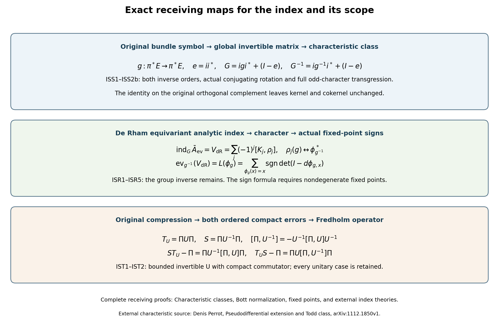
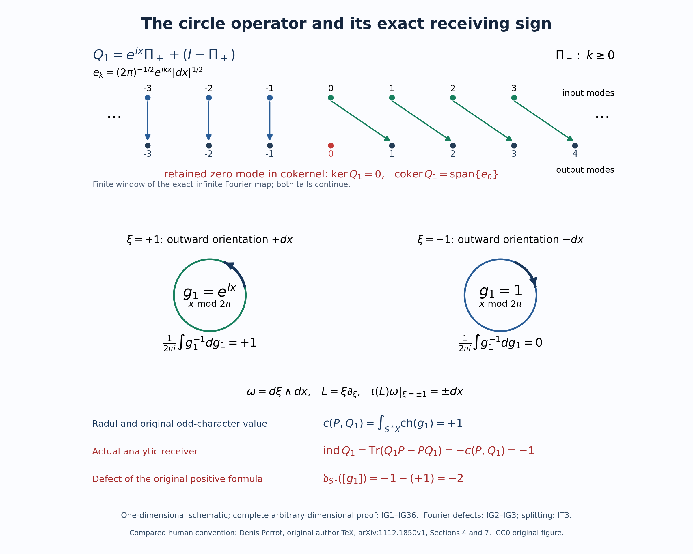

# Characteristic classes, Bott normalization, fixed points, and external index theories

**Editorial status, October 2026.** Sections 1–10 retain the original formulations, including the positive receiving signs in (ISN12) and (ISN14). Those signs fail for the cited original cotangent orientation. Sections 11–15 prove the full global characteristic formula at the original scope, exhibit and correct its analytic receiving sign, and construct its exact defect. They also give complete independent proofs of the smooth fixed-point and adapted-family receivers and a stronger Fredholm compression theorem. The historical external-theorem statements below must be read with that explicit correction.

*Written and dedicated to the public domain by Codex, September 2026 (CC0).*

Several index formulas meet in this course, but they do not all have the same input. A Fredholm operator has an integer index. Its principal symbol has a stable homotopy class. A characteristic-class formula evaluates that class after a choice of orientation and normalization. A fixed-point formula evaluates a chain map. A Toeplitz index begins with a projection and a compressed operator. Treating these inputs as interchangeable would hide the maps that make each theorem meaningful.

This lesson gives those maps and records four exact scope boundaries. It imports one topological index theorem in a fixed primary-source convention. It then compares that theorem with the analytic symbol route already proved in the course, checks the Bott normalization that the course actually owns, proves that the fixed-point result has broader map scope than diffeomorphism pullback, and states the additional data required by broader hypoelliptic and Toeplitz theories.

Read [Symbols, finite defects, and the index on a closed manifold](global-elliptic-symbol-index.md) for the analytic index and stable symbol homotopies; [Relative Weyl projectors and the Chern cutoff form](relative-projectors-chern-cutoff.md) for the complete relative projector and its Chern form; [The Bott operator, suspension, and reduction of the index to Euclidean space](bott-suspension.md) for the index-one Bott operator and suspension; [Elliptic complexes, diagonal traces, and fixed points](elliptic-complex-lefschetz.md) for the distributional Lefschetz formula; and [Nonelliptic Fredholm operators on their exact adapted spaces](adapted-hypoelliptic-fredholm.md) for the proved anisotropic family.

## 1. The four carriers and the maps that are already proved

Let \(X\) be a closed smooth manifold, let \(E,F\to X\) be complex vector bundles, and let
\[
 P:C^\infty(X,E\otimes\Omega_X^{1/2})
   \longrightarrow C^\infty(X,F\otimes\Omega_X^{1/2})
 \tag{ISN1}
\]
be elliptic. Denote by \(B^*X\) the radial compactification of \(T^*X\), by \(S^*X=\partial B^*X\) its cosphere boundary, and by \(\pi\) the bundle projection. After multiplying the principal symbol by the positive order-changing factor used in the closed-manifold lesson, its boundary value is an isomorphism
\[
 p:\pi^*E|_{S^*X}\longrightarrow \pi^*F|_{S^*X}.
 \tag{ISN2}
\]
The exact relative carrier is
\[
 \alpha(P)
 =
 [\,\pi^*E,\pi^*F,p\,]
 \in K^0(B^*X,S^*X)
 \cong K_c^0(T^*X).
 \tag{ISN3}
\]
The last isomorphism extends a relative bundle triple by zero from the interior of \(B^*X\), which is \(T^*X\). Stable bundle addition, homotopy through boundary isomorphisms, and addition of a triple that extends as an isomorphism over \(B^*X\) leave this class unchanged.

The analytic route proved earlier supplies
\[
 \operatorname{a\!-\!ind}_X(\alpha(P))
   =\operatorname{sind}(p)
   =\operatorname{ind}P.
 \tag{ISN4}
\]
Here the middle term is defined by smooth approximation on one large cosphere and quantization; the proof of its independence uses a common exterior invertibility region. Thus (ISN4) does not presuppose a characteristic-class formula.

A square order-zero presentation has a second carrier. Suppose
\[
 Q\in\Psi^0_{\mathrm{cl}}(X;E\otimes\Omega_X^{1/2})
 \tag{ISN5}
\]
is elliptic, and write \(g=\sigma_0(Q)|_{S^*X}\). After stabilization, \(g\) defines
\[
 [g]\in K_1(C^\infty(S^*X)).
 \tag{ISN6}
\]
Here is the actual stabilization when \(E\) is not trivial.
Choose a finite cover with smooth local frames and smooth real functions
\(\chi_a\) supported in those frame charts such that
\(\sum_a\chi_a^2=1\). Such functions follow from an ordinary smooth
partition \(\{\psi_a\}\) by replacing \(\psi_a\) with
\(\psi_a/(\sum_b\psi_b^2)^{1/2}\); the denominator is everywhere
positive. In local orthonormal frames, the map
\(i:E\to X\times\mathbb C^M\) whose components are \(\chi_a v\)
is a smooth fiberwise isometry. Extension by zero is smooth because
each \(\chi_a\) has support inside its frame chart. Keep the actual
orthogonal projection \(e=ii^*\) and complement
\(E^\perp=\ker i^*\), pulled back to the cosphere where needed.
The original \(g\) remains an automorphism of \(\pi^*E\).
Its global matrix representative and inverse are
\[
 G=igi^*+(I-e),\qquad
 G^{-1}=ig^{-1}i^*+(I-e),\qquad [g]:=[G].
 \tag{ISS1}
\]
The products \(i^*i=I_E\), \(e(I-e)=(I-e)e=0\) prove both inverse
orders exactly. The stabilized operator is \(Q\oplus I_{E^\perp}\),
conjugated by the smooth unitary bundle map \(E\oplus E^\perp\to
X\times\mathbb C^M\). Its symbol is \(G\); its kernel and cokernel
are those of \(Q\), since the added identity is invertible. Thus its
index is the original \(\operatorname{ind}Q\).

The matrix class does not depend on the chosen embedding. For two
isometries \(i_1,i_2\), in the sum of their two trivial bundles put
\[
 i_\theta v=(\cos\theta\,i_1v,\sin\theta\,i_2v),\qquad
 G_\theta=i_\theta g i_\theta^*+I-i_\theta i_\theta^*,
 \quad 0\leq\theta\leq\pi/2 .
 \tag{ISS2}
\]
Since \(i_\theta^*i_\theta=I_E\), the displayed inverse in (ISS1)
with \(i_\theta\) proves that the whole path is invertible.
Its endpoints are \(G_1\oplus I\) and \(I\oplus G_2\).
The whole comparison is also an actual conjugation. Keep
\(e_a=i_ai_a^*\) and define
\[
 U_\theta=
 \begin{pmatrix}
 I+(\cos\theta-1)e_1&-\sin\theta\,i_1i_2^*\\
 \sin\theta\,i_2i_1^*&I+(\cos\theta-1)e_2
 \end{pmatrix}.
 \tag{ISS2a}
\]
On the two embedded copies of \(E\) this is exactly the two-plane
rotation, and on both orthogonal complements it is the identity.
Thus \(U_\theta^*U_\theta=U_\theta U_\theta^*=I\),
\(U_\theta(i_1v,0)=i_\theta v\), and
\(G_\theta=U_\theta(G_1\oplus I)U_\theta^*\).
Conjugation preserves the algebraic matrix \(K_1\) class as well as
the stable homotopy class.
Block permutation does not change the stable class: each exchange
of two complex coordinate vectors can be implemented by the
continuous real two-plane rotation through \(\pi/2\), followed by
a complex phase path from \(-1\) to \(1\) on the one coordinate
whose sign was changed. Conjugating by that path gives the required
invertible homotopy. This proves the square-to-matrix comparison.
In (ISN11) the ordinary differential is applied to a global matrix
representative such as \(G\), rather than to unrelated local matrices
of an automorphism of a nontrivial bundle.

The odd differential-form class has its exact homotopy comparison
too. For a smooth invertible matrix path \(G_t\), let
\(\theta_t=G_t^{-1}dG_t\) and \(\eta_t=G_t^{-1}\partial_tG_t\).
Differentiating both actual inverse identities gives
\(d\theta_t=-\theta_t^2\) and
\(\partial_t\theta_t=d\eta_t+[\theta_t,\eta_t]\).
The graded product rule gives \(d(\theta_t^{2k})=0\).
In the trace of the derivative of \(\theta_t^{2k+1}\), each
of its \(2k+1\) terms rotates to the same written order with
positive sign: moving a length-\(j\) block past \(2k+1-j\)
one-forms has the even exponent \(j(2k+1-j)\).
The commutator term has trace zero. Consequently the full character
in (ISN11) satisfies
\[
 \partial_t\operatorname{ch}(G_t)
 =d\sum_{k\geq0}\frac{k!}{(2k)!}
       \operatorname{tr}
        \left(\frac{\eta_t\theta_t^{2k}}{(2\pi i)^{k+1}}\right).
 \tag{ISS2b}
\]
Only the actual dimensions truncate this sum. The same graded
cyclicity makes the trace of each positive even power zero, so
each odd summand in (ISN11) is closed. Integration of (ISS2b)
over the original parameter interval proves equality of the
character classes at the endpoints of (ISS2), with every
factorial and \(2\pi i\) factor retained.

The pseudodifferential extension has an index map
\[
 \operatorname{Ind}_{\mathcal E}:
 K_1(C^\infty(S^*X))
 \longrightarrow K_0(\mathcal L^{-\infty}(X))
 \cong\mathbb Z,
 \qquad
 \operatorname{Ind}_{\mathcal E}([g])=\operatorname{ind}Q.
 \tag{ISN7}
\]
Equations (ISN4) and (ISN7) meet at the same operator:
\[
 \operatorname{a\!-\!ind}_X(\alpha(Q))
 =\operatorname{ind}Q
 =\operatorname{Ind}_{\mathcal E}([g]).
 \tag{ISN8}
\]
This is the exact comparison available here. For a general relative triple with different bundles, the course does not replace the triple by an unproved canonical odd class. It first performs an actual stable square reduction, or it retains the relative carrier. The later closed-double boundary construction likewise lands first in (ISN3).

## 2. The characteristic-class formula in one fixed convention

Choose an affine torsion-free connection on \(TX\), with curvature
\[
 R\in\Omega^2(X;\operatorname{End}(TX)).
 \tag{ISN9}
\]
In Denis Perrot's convention the Todd form of the complexified tangent bundle is
\[
 \operatorname{Td}\!\left(\frac{iR}{2\pi}\right)
 =
 \det\!\left(
   \frac{iR/2\pi}{\exp(iR/2\pi)-1}
 \right).
 \tag{ISN10}
\]
Only degrees at most \(\dim X\) contribute, so the power series in (ISN10) truncates as a differential form. For an invertible matrix-valued function \(g\) on \(S^*X\), the odd Chern character is
\[
 \operatorname{ch}(g)
 =
 \sum_{k\geq0}
 \frac{k!}{(2k+1)!}\,
 \operatorname{tr}\!\left(
   \frac{(g^{-1}dg)^{2k+1}}{(2\pi i)^{k+1}}
 \right).
 \tag{ISN11}
\]
Again only finitely many degrees can pair with the fundamental class.

**External index theorem in the adopted convention.** Let \(X\) be closed; orient \(S^*X\) by its canonical cosphere orientation. If \(Q\) is an elliptic pseudodifferential operator of order at most zero on a complex vector bundle, with leading symbol class \([g]\), then
\[
 \operatorname{ind}Q
 =
 \left\langle
   [S^*X],
   \pi^*\operatorname{Td}(T_{\mathbb C}X)
      \smile\operatorname{ch}([g])
 \right\rangle.
 \tag{ISN12}
\]
The leading degree-zero matrix is required to be invertible. A
strictly negative-order operator has zero degree-zero symbol and is
not thereby Fredholm on \(L^2\); its actual order-changing Sobolev
realization is treated in (ISN13). This theorem is an external input.
The original-author source proves that the Radul cocycle is the pullback of the Poincaré dual of the Todd class and derives (ISN12) from the index map of the pseudodifferential extension. The formula is quoted with the source's orientation, Todd form (ISN10), and odd Chern character (ISN11); no sign is imported from a different cotangent orientation.

For a square elliptic operator \(P\) of order \(m\), the exact order changer \(J_E^{-m}\) from the closed-manifold lesson is invertible and has index zero. Hence
\[
 Q=PJ_E^{-m}\in\Psi^0_{\mathrm{cl}}(X;E),
 \qquad
 \operatorname{ind}Q=\operatorname{ind}P,
 \qquad
 \sigma_0(Q)=p_m h^{-m}.
 \tag{ISN13}
\]
This proves the order reduction needed before (ISN12). It does not alter the original principal symbol silently: the factor \(h^{-m}\), the side on which it is composed, and the zero index of \(J_E^{-m}\) are all displayed.

Combining (ISN8) and (ISN12) gives the course's strongest exact characteristic statement for a square presentation:
\[
 \operatorname{a\!-\!ind}_X(\alpha(Q))
 =
 \operatorname{Ind}_{\mathcal E}([g])
 =
 \left\langle
   [S^*X],
   \pi^*\operatorname{Td}(T_{\mathbb C}X)
      \smile\operatorname{ch}([g])
 \right\rangle.
 \tag{ISN14}
\]
A compact-support formula on \(T^*X\) requires an additional, convention-sensitive comparison between its Thom or boundary orientation and the cosphere orientation. This lesson therefore uses (ISN14) as the fixed formula and does not replace it by an unsigned symbol \(J(X)\).

## 3. What the Bott calculation normalizes

The Bott lesson proves three analytic facts without invoking full Bott periodicity:

1. the Euclidean Bott oscillator has index \(1\);
2. its compactified symbol is homotopic, with the displayed orientation, to the Clifford symbol \(p(x+i\xi)\);
3. suspension by the fibrewise Bott block preserves the symbol index:
   \[
   \operatorname{sind}(d)=\operatorname{sind}(q).
   \tag{ISN15}
   \]

In one complex phase coordinate, the boundary loop is
\[
 b(e^{i\theta})=e^{i\theta},
 \qquad
 b^{-1}db=i\,d\theta.
 \tag{ISN16}
\]
The degree-one term of (ISN11) gives
\[
 \int_{S^1}\operatorname{ch}(b)
 =
 \frac{1}{2\pi i}\int_0^{2\pi} i\,d\theta
 =1.
 \tag{ISN17}
\]
This checks the coefficient and orientation against the analytic index-one calculation. Replacing \(e^{i\theta}\) by \(e^{-i\theta}\) changes the integral to \(-1\), so the sign is not disposable.

The relative-projector lesson gives the even-form normalization used by the matrix index route. With the original phase orientation retained, its exact equality is
\[
 (2\pi)^{-n}\frac{2}{i^n n!}
 \int (1-\psi)^n\operatorname{tr}\!\bigl[(db\wedge da)^n\bigr]
 =
 (2\pi)^{-n}\frac{1}{i^n n!}
 \int\operatorname{tr}\!\bigl[P(dP)^{2n}\bigr].
 \tag{ISN18}
\]
The full matrix pairing and the independent finite Weyl calculation
now give the same analytic index for the actual original symbols.
For the isotropic matrix class and exterior inverse of the matrix-index
lesson, with its actual orientation
\(\Omega_{\mathrm{AN}}=dx_1\wedge d\xi_1\wedge\cdots
\wedge dx_n\wedge d\xi_n\), they prove
\[
 \begin{aligned}
 \operatorname{ind}a^w
 &=(2\pi)^{-n}\frac{2}{i^n n!}
       \int^{\Omega_{\mathrm{AN}}}
          (1-\psi)^n\operatorname{tr}[(db\wedge da)^n]\\
 &=-(-2\pi i)^{-n}\frac{(n-1)!}{(2n-1)!}
       \int_{\partial B_R}^{\Omega_{\mathrm{AN}}}
          \operatorname{tr}[(a^{-1}da)^{2n-1}].
 \end{aligned}
 \tag{ISS3}
\]
The full central connection and compact curvature transgression are
proved in the matrix-index lesson, (FM6)–(FM10) and (FC8).
Its analytic finite-degree formula (AT1) proves that every integrated
relative-projector coefficient below and above degree \(n\) is zero,
while the degree-\(n\) coefficient gives the original analytic index.
The independent direct derivation is
[From ordered Weyl errors to the exterior index form](ordered-weyl-exterior-reduction.md),
equations (5)–(18), for every integer error power \(N>n\).
These are complete receiving proofs for (ISN18), retaining the
original compact cutoff, both ordered errors and every coefficient.

Thus the course owns an analytic Bott index, a suspension identity, the odd one-dimensional check (ISN17), and the complete relative-projector normalization (ISN18). It does not prove that multiplication by the Bott class is an isomorphism on every compactly supported \(K\)-group. That full periodicity statement, and the full Thom-character compatibility needed to move between every compact-support and cosphere presentation, remain external.

## 4. The fixed-point theorem has broader map scope than diffeomorphism pullback

The fixed-point lesson starts with any smooth map
\[
 \phi:X\longrightarrow X
 \tag{ISN19}
\]
on a compact smooth manifold. It never assumes that \(\phi\) is invertible or a local diffeomorphism. The exact transversality condition is
\[
 \det(I-d\phi_x)\ne0
 \quad\text{for every fixed point }x.
 \tag{ISN20}
\]
Under this condition the graph conormal misses the diagonal conormal, the fixed set is finite, and the course proves
\[
 L(\phi)
 =
 \sum_{\phi(x)=x}
 \operatorname{sgn}\det(I-d\phi_x).
 \tag{ISN21}
\]

Every diffeomorphism is a smooth map, so (ISN21) includes diffeomorphism pullbacks whenever (ISN20) holds. The inclusion is strict. If \(p\in X\) and \(\phi(x)=p\) for all \(x\), then \(p\) is the only fixed point, \(d\phi_p=0\), and
\[
 \det(I-d\phi_p)=1.
 \tag{ISN22}
\]
On a positive-dimensional \(X\), this map is not a diffeomorphism, yet (ISN21) applies and gives \(L(\phi)=1\).

An equivariant index theorem has different input. It begins with a group action, equivariant bundles and an equivariant operator, and usually returns a representation-valued or \(K\)-theoretic class. For a compact group \(G\) and \(g\in G\), character evaluation is the exact homomorphism
\[
 \operatorname{ev}_g:R(G)\longrightarrow\mathbb C,
 \qquad
 [V]-[W]\longmapsto
 \operatorname{tr}(g|_V)-\operatorname{tr}(g|_W).
 \tag{ISN23}
\]
The de Rham theorem supplies an exact representation-valued class
as soon as a smooth action of a compact Lie group is given.
Write \(\phi_g\) for a left action, so
\(\phi_{gh}=\phi_g\circ\phi_h\), and retain the original harmonic
spaces \(K_j\) from the fixed-point lesson. Define
\[
 \rho_j(g)=H_jM_{\mu^{1/2}}\phi_{g^{-1}}^*
                        M_{\mu^{-1/2}}|_{K_j},\qquad
 V_{\mathrm{dR}}=\sum_j(-1)^j[K_j,\rho_j]\in R(G).
 \tag{ISR1}
\]
The inverse in the pullback is essential to the representation order.
For a closed form \(f\), (EC14) proves that \(f-H_jf\) is an exact
form with its actual smooth primitive. Pullback preserves exact
forms, and \(H_jD_{j-1}=0\). Inserting \(H_j\) between the two
pullbacks therefore changes the result by zero after the outer
\(H_j\). Since
\(\phi_{g^{-1}}^*\phi_{h^{-1}}^*=\phi_{(gh)^{-1}}^*\), this proves
\(\rho_j(g)\rho_j(h)=\rho_j(gh)\), and \(\rho_j(1)=I_{K_j}\).
The matrix entries in any fixed harmonic basis are integrals of
smooth pullbacks of that basis against fixed smooth forms. They
depend smoothly on \(g\), by differentiation under the integral on
compact \(X\). Thus (ISR1) is a finite-dimensional continuous
representation in each degree, rather than an assumed equivariant
class. The isomorphism \(K_j\to H^j_{\mathrm{dR}}(X;\mathbb C)\)
from (EC14) intertwines \(\rho_j(g)\) with
\(\phi_{g^{-1}}^*\).
Consequently the original evaluation map (ISN23) gives
\[
 \operatorname{ev}_g(V_{\mathrm{dR}})=L(\phi_{g^{-1}}),\qquad
 \operatorname{ev}_{g^{-1}}(V_{\mathrm{dR}})=L(\phi_g).
 \tag{ISR2}
\]
When \(\phi_g\) has the nondegenerate fixed points of (ISN20),
the already-proved kernel calculation gives the exact comparison
\[
 \operatorname{ev}_{g^{-1}}(V_{\mathrm{dR}})
   =\sum_{\phi_g(x)=x}\operatorname{sgn}\det(I-d\phi_{g,x}).
 \tag{ISR3}
\]
Every determinant, group inverse and alternating degree is retained.

This class is also the equivariant analytic index of the actual
de Rham even-to-odd operator with invariant geometric data.
To prove that identification, average the original Riemannian metric
over normalized Haar measure. For completeness, on a compact Lie
group such a measure can be obtained by choosing a positive density
at the identity and extending it by left translations. The resulting
smooth density has finite positive mass, so divide by that mass.
A right translation pulls it back to another left-invariant density,
hence to a positive constant multiple. The change-of-variables
formula preserves its total mass one, so that constant is one.
This proves the two invariances used in the average:
\[
 \bar h_x(v,w)
   =\int_G(\phi_g^*h)_x(v,w)\,dg .
 \tag{ISR4}
\]
Every integrand is positive on nonzero \(v=w\), and compactness
permits all coordinate derivatives under the integral. The result
is a smooth positive metric. Haar measure is invariant on both
sides for compact \(G\), so a group change of variables proves
\(\phi_g^*\bar h=\bar h\). Keep the associated invariant density
\(\bar\mu\), induced form metrics and actual half-density
differential
\(\bar D=M_{\bar\mu^{1/2}}dM_{\bar\mu^{-1/2}}\).
The unitary pullbacks
\(\bar R_g=M_{\bar\mu^{1/2}}\phi_{g^{-1}}^*
M_{\bar\mu^{-1/2}}\) commute with \(\bar D\), hence with its
adjoint, both full Laplacian summands and
\(\bar A_{\mathrm{ev}}=(\bar D+\bar D^*)_{\mathrm{ev}}\).
The kernel and adjoint kernel are respectively the even and odd
harmonic sums by (EC4)–(EC15). The equivariant Fredholm index is
therefore their difference in \(R(G)\).
Each invariant harmonic space and each original \(K_j\) map
isomorphically to the same de Rham cohomology with the same
\(\phi_{g^{-1}}^*\) action. These isomorphisms prove
\[
 \operatorname{ind}_G\bar A_{\mathrm{ev}}
 =[\ker\bar A_{\mathrm{ev}}]-[\ker\bar A_{\mathrm{ev}}^*]
 =V_{\mathrm{dR}}\quad\text{in }R(G).
 \tag{ISR5}
\]
This constructs the representation class and its scalar receiving
map for the de Rham operator. General equivariant characteristic
formulas and fixed-submanifold evaluations when (ISN20) fails
remain external subjects; neither is asserted by (ISR1)–(ISR5).

## 5. The exact hypoelliptic result and its boundary

The proved nonelliptic family is
\[
 P_{r,m}=I+D_x^{2r}+D_y^{2m},
 \qquad
 1\leq r<m,
 \tag{ISN24}
\]
on \(\mathbb T^2\). Its full multiplier is \(1+k^{2r}+\ell^{2m}\), and the exact adapted domain records that entire multiplier. Division by it proves an isometric bijection onto \(H^\sigma\) for every real \(\sigma\). Both Sobolev inclusions bounding this domain are strict for every
real \(\sigma\), by the full axis distributions (AH22)–(AH24).
The same operator on the ordinary pair \(H^{\sigma+2m}\to H^\sigma\)
has dense, proper, nonclosed range. Equations (AH25)–(AH32) prove
local hypoellipticity on every open subset of the original torus,
using the full reciprocal and its exact off-origin kernel.

This result proves more than an isolated example because it covers every integer pair \(1\leq r<m\), but it does not establish a general hypoelliptic index theory. Such a theory must specify its symbol class, anisotropic estimates, composition law, parametrix remainders, domain and range, and the topology in which the index is stable. Hypoellipticity says that output smooth on any open set forces
input smooth on that same set; it does not imply Fredholmness on a chosen ordinary Sobolev pair. The ordinary realization of (ISN24) is the course's exact counterexample to that implication.

## 6. The missing operation in a Toeplitz index problem

A Toeplitz problem begins with data absent from (ISN24): a Hilbert space \(H\), an orthogonal projection \(\Pi\), and an invertible or unitary operator \(U\). The compressed operator is
\[
 T_U=\Pi U\Pi:\Pi H\longrightarrow\Pi H.
 \tag{ISN25}
\]
The basic Fredholm mechanism can be proved without an index formula. If \(U\) is unitary and \([\Pi,U]\) is compact, put \(S=\Pi U^*\Pi\) on \(\Pi H\). Then
\[
 \begin{aligned}
 ST-\Pi
 &=\Pi U^*(\Pi U-U\Pi)\Pi
   =\Pi U^*[\Pi,U]\Pi,\\
 TS-\Pi
 &=\Pi U(\Pi U^*-U^*\Pi)\Pi
   =\Pi U[\Pi,U^*]\Pi.
 \end{aligned}
 \tag{ISN26}
\]
Both errors are compact, so \(T_U\) is Fredholm.

The unitary hypothesis can be removed from this Fredholm mechanism.
Let \(U\) be any bounded invertible operator on \(H\), with
\([\Pi,U]\) compact. Set \(S=\Pi U^{-1}\Pi\) on the original
\(\Pi H\). Multiplication of the full commutator proves
\[
 [\Pi,U^{-1}]=-U^{-1}[\Pi,U]U^{-1},
 \tag{IST1}
\]
because the right side expands to
\(-U^{-1}\Pi+ \Pi U^{-1}\).
With both original compression orders unchanged, the exact errors are
\[
 \begin{aligned}
 ST_U-\Pi&=\Pi U^{-1}[\Pi,U]\Pi,\\
 T_US-\Pi&=\Pi U[\Pi,U^{-1}]\Pi .
 \end{aligned}
 \tag{IST2}
\]
Both are compact by (IST1). The two-sided Fredholm criterion therefore
applies to every such bounded invertible \(U\). For unitary \(U\),
\(U^{-1}=U^*\), so these are precisely the original (ISN26), with
neither error deleted. Along an operator-norm-continuous path of
invertible \(U_t\) satisfying the same compact commutator condition,
\(\Pi U_t\Pi\) is norm-continuous and Fredholm at each point.
The Fredholm stability lesson consequently proves that its index
is constant on the path; no characteristic evaluation is assumed.

Equation (ISN26) identifies the operation prerequisites precisely. A Toeplitz index theorem must construct the relevant \(\Pi\) and \(U\), prove compactness of their commutator, identify the compressed symbol class, and evaluate the resulting Fredholm index. Neither the anisotropic multiplier lesson nor the radial-compression lesson supplies those data. Their index statements therefore cannot be relabeled as a Toeplitz theorem.

The top row keeps the original bundle automorphism and its actual
global matrix representative (ISS1)–(ISS2). The middle row keeps
the group inverse in the cohomology and character maps (ISR1)–(ISR5).
The last row keeps both ordered compressed errors (IST1)–(IST2).
The human source for the external characteristic theorem is
Denis Perrot, *Pseudodifferential extension and Todd class*,
arXiv:1112.1850v1, index corollary. All other displayed receiving
maps have their complete proofs above.
The reproducible source is
[index-scope-receiving-maps.py](../figures/index-scope-receiving-maps.py).

## 7. Four reader records and their exact dispositions

| Reader topic | Current course witness | Exact status |
|---|---|---|
| Topological expression for the analytic index | (ISN8)–(ISN14) | Perrot's cosphere formula is imported with its full convention; the analytic carrier and receiving integer are exact. |
| Bott normalization and characteristic compatibility | (ISN15)–(ISN18) | Index one, suspension and the displayed Chern coefficients are proved; full Bott periodicity and the general Thom-character square remain external. |
| Antecedents and broader fixed-point scope | (ISN19)–(ISN23) | The theorem covers arbitrary smooth maps satisfying (ISN20); (ISR1)–(ISR5) construct the de Rham equivariant index and its exact evaluation. General equivariant characteristic formulas remain external. |
| External hypoelliptic and Toeplitz theories | (ISN24)–(ISN26) | The locally hypoelliptic family, both strict domain inclusions and the bounded-invertible compression criterion are proved; broad symbol calculi and Toeplitz index evaluations remain external. |

Each record points to a proved course equation or to the single
marked external index theorem. The added exact constructions above
preserve the original formulas and identify the previously omitted
receiving maps.

## 8. Worked checks

**The circle orientation.** For \(b(e^{i\theta})=e^{i\theta}\), (ISN17) is \(+1\). Traversing the same geometric circle with parameter \(e^{-i\theta}\) gives
\[
 \frac{1}{2\pi i}\int_0^{2\pi}(-i)\,d\theta=-1.
\]
The coefficient alone does not determine the sign; the orientation is part of the input.

**A smooth map with singular derivative.** For the constant map in (ISN22), the derivative has rank zero, while \(I-d\phi_p=I\) is invertible. This separates the theorem's actual condition from local invertibility of \(\phi\).

**A compression parametrix.** Formula (ISN26) keeps the two products in their original order. Reversing \(U\) and \(\Pi\) without taking the adjoint commutator would not prove that both errors are compact.

**A hypoelliptic non-Fredholm realization.** For \(P=I+D_x^2+D_y^4\), normalized Fourier modes on the \(k\)-axis have unit \(H^{\sigma+4}\)-norm while their images tend to zero in \(H^\sigma\). Injectivity plus closed range would give a lower bound, so the ordinary range cannot be closed. On the adapted domain, the same multiplier gives an exact isometry.

## 9. Exercises with complete solutions

**1. Order reduction.** Let \(P\in\Psi^m_{\mathrm{cl}}(X;E)\) be square and elliptic. Prove every assertion in (ISN13).

**Solution.** The closed-manifold lesson constructs \(J_E^{-m}\in\Psi^{-m}_{\mathrm{cl}}(X;E)\) as an invertible map on every Sobolev scale, with principal symbol \(h^{-m}I_E\) and index zero. Composition gives order \(m+(-m)=0\) and principal symbol \(p_mh^{-m}\), with this factor on the right. Fredholm index additivity gives
\[
 \operatorname{ind}(PJ_E^{-m})
 =\operatorname{ind}P+\operatorname{ind}J_E^{-m}
 =\operatorname{ind}P.
\]

**2. Reverse the Bott loop.** Compute the odd Chern integral of \(b_-(e^{i\theta})=e^{-i\theta}\).

**Solution.** Since \(b_-^{-1}db_-=-i\,d\theta\),
\[
 \int_{S^1}\operatorname{ch}(b_-)
 =\frac{1}{2\pi i}\int_0^{2\pi}(-i)\,d\theta=-1.
\]
This is the exact opposite of (ISN17).

**3. Locate the failure for the identity map.** Let \(\phi=I_X\) on a positive-dimensional compact manifold. Which part of the fixed-point proof fails?

**Solution.** Every point is fixed and \(I-d\phi_x=0\). Thus (ISN20) fails, the graph conormal meets the diagonal conormal, the diagonal restriction used for isolated fixed points is unavailable, and the delta change-of-variables step has zero Jacobian. The cohomological Lefschetz number still exists; only formula (ISN21) is outside its hypotheses.

**4. Verify both Toeplitz errors.** Starting from \(T=\Pi U\Pi\) and \(S=\Pi U^*\Pi\), derive (ISN26) without commuting any factor.

**Solution.** On \(\Pi H\), the identity is \(\Pi\). Insert \(U^*U=UU^*=I\):
\[
 ST-\Pi
 =\Pi U^*\Pi U\Pi-\Pi U^*U\Pi
 =\Pi U^*(\Pi U-U\Pi)\Pi,
\]
and
\[
 TS-\Pi
 =\Pi U\Pi U^*\Pi-\Pi UU^*\Pi
 =\Pi U(\Pi U^*-U^*\Pi)\Pi.
\]
The first middle factor is \([\Pi,U]\); the second is \([\Pi,U^*]\), which is compact because it equals \(-U^*[\Pi,U]U^*\). Bounded multiplication on both sides preserves compactness.

**5. Separate hypoellipticity from an ordinary Fredholm estimate.** Why does smooth regularity for (ISN24) not repair its ordinary order-\(2m\) realization?

**Solution.** Division by \(1+k^{2r}+\ell^{2m}\) preserves rapid Fourier decay,
which proves global smoothness. The full difference-kernel argument
(AH25)–(AH32) proves local hypoellipticity. Along \((k,0)\), however, the multiplier grows only like \(|k|^{2r}\), while the domain norm \(H^{\sigma+2m}\) charges \(|k|^{2m}\). Normalized modes therefore have images tending to zero. A bounded inverse on a closed range would forbid that sequence. Regularity of each solution and a uniform Fredholm estimate are different assertions.

## 10. Sources and exact scope

The characteristic formula is taken from Denis Perrot, *Pseudodifferential extension and Todd class*, arXiv:1112.1850v1. Its original-author TeX states the Todd form, odd Chern character and index theorem in the convention reproduced in (ISN10)–(ISN12), and proves the Radul-cocycle theorem from which the index formula follows.

The analytic Bott operator, its index one, and the exact suspension receiving maps are proved in [The Bott operator, suspension, and reduction of the index to Euclidean space](bott-suspension.md). That complete programme proof is the mathematical source used here. Full Bott periodicity is not a theorem asserted or imported in this lesson.

The fixed-point result used here is the course's proved distributional chain-map theorem. Equations (ISR1)–(ISR5) construct the de Rham equivariant index class
and prove its exact scalar fixed-point evaluation. General equivariant
characteristic formulas, fixed-submanifold evaluations, broad
hypoelliptic calculi and Toeplitz index evaluations remain external
subjects. Equations (IST1)–(IST2) prove the compression mechanism for
every bounded invertible \(U\) with compact commutator.

## 11. Editorial supplement: the full global calculation and its receiving sign

This supplement retains (ISN1)–(ISN26), (ISS1)–(ISS3), (ISR1)–(ISR5), and (IST1)–(IST2) as the identifiable original text. It supplies the missing proof of the global characteristic calculation and corrects a sign in its analytic receiver. The correction has the same closed-manifold, bundle, operator-order, and invertibility scope as (ISN12). In particular it does not replace that statement by a Euclidean, trivial-bundle, differential-operator, or flat-connection theorem. The original Todd determinant (ISN10), positive odd character (ISN11), half-density realizations, and right order-changing factor (ISN13) all remain.

Write \(n=\dim X>0\), \(\omega=d\xi_i\wedge dx^i\), \(L=\xi_i\partial_{\xi_i}\), and orient \(S^*X\) as the outward boundary for \(\omega^n/n!\). This is the exact orientation specified at lines 552–559 of Denis Perrot's freely accessible [original author source, arXiv:1112.1850v1](https://arxiv.org/abs/1112.1850v1). It is defined even when \(X\) is not orientable: simultaneous changes in base and cotangent coordinates have positive total determinant. With that orientation, the proved formula is

\[
\begin{split}
 \operatorname{ind}Q
 &=-\int_{S^*X}^{\iota(L)\omega^n/n!}
       \pi^*\det\!\left(\frac{iR/(2\pi)}{e^{iR/(2\pi)}-1}\right)
       \wedge
       \sum_{j\geq0}\frac{j!}{(2j+1)!}
         \operatorname{tr}\!\left(
              \frac{(G^{-1}dG)^{2j+1}}{(2\pi i)^{j+1}}\right),\\
 \operatorname{a\!-\!ind}_X(\alpha(Q))
 &=\operatorname{Ind}_E([g])=\operatorname{ind}Q.
\end{split}
\tag{IG1}
\]

Here \(G\) is precisely (ISS1), including the identity on the orthogonal complement of the actual embedded bundle. Only total degree \(2n-1\) is integrated. The minus sign is not a change in either characteristic form or orientation. It is the correction to the receiving sign in (ISN12) and hence in (ISN14). Sections 11.1–11.8 prove (IG1) at this full scope.

### 11.1. An exact counterexample and its defect

On \(X=\mathbb R/(2\pi\mathbb Z)\), keep \(D_x=-i\partial_x\), the original half-density \(|dx|^{1/2}\), and orthonormal vectors \((2\pi)^{-1/2}e^{ikx}|dx|^{1/2}\). Let \(\Pi_+\) project onto \(k\geq0\). Choose a smooth function \(\beta(\xi)\), zero for \(\xi\leq-3/4\), one for \(\xi\geq-1/4\). Its integer values are exactly those of \(\Pi_+\). Periodizing its inverse Fourier distribution gives the kernel of \(\Pi_+\): all nonzero translations are smooth near the diagonal, since integration by parts in the compactly supported derivatives of \(\beta\) bounds their differentiated kernels by every inverse power of the translation. Thus \(\Pi_+\) is classical of order zero, with leading branches \(1\) and \(0\), without a holomorphic-boundary theorem.

For every integer \(w\), retain the full operator

\[
 Q_w=e^{iwx}\Pi_++(I-\Pi_+),\qquad
 g_w(x,+1)=e^{iwx},\quad g_w(x,-1)=1.
\tag{IG2}
\]

For \(w\geq0\) its images are the disjoint Fourier sets \(k<0\) and \(k\geq w\); its kernel is zero and its cokernel is the span of modes \(0,\ldots,w-1\). For \(w=-d<0\) every mode occurs, and the only overlaps are \(-d,\ldots,-1\); its kernel is exactly the span of \(e_j-e_{j-d}\), \(0\leq j<d\), and its cokernel is zero. Each range is closed and every defect vector is smooth. Consequently its index at every original Sobolev realization is \(-w\). On the two components of \(S^*X\), \(\iota(L)(d\xi\wedge dx)\) gives orientations \(+dx\) at \(\xi=+1\), \(-dx\) at \(\xi=-1\). The full original forms give \(\operatorname{Td}=1\) and

\[
 \int_{S^*X}\operatorname{ch}(g_w)=w,
 \qquad
 \operatorname{ind}Q_w-\int_{S^*X}\operatorname{ch}(g_w)=-2w.
\tag{IG3}
\]

In particular \(w=1\) disproves the positive receiving sign, and \(w=-1\) proves that reversing the loop reverses both integer values. This is also the literal operator and orientation comparison with (I27)–(I28) in [Symbols, finite defects, and the index on a closed manifold](global-elliptic-symbol-index.md).

For every closed \(X\), define the defect homomorphism on the original stable square cosphere carrier by

\[
 \mathfrak d_X([g])=
 \operatorname{Ind}_E([g])-
 \int_{S^*X}\pi^*\operatorname{Td}(T_{\mathbb C}X)
                    \wedge\operatorname{ch}([g]).
\tag{IG4}
\]

The proof below establishes both well-definedness and the exact relation
\(\mathfrak d_X=2\operatorname{Ind}_E=-2\langle\operatorname{Td},\operatorname{ch}\rangle\). Thus the locus on which the old positive formula happens to hold is exactly \(\ker\operatorname{Ind}_E\); the quotient by that locus maps isomorphically onto the actual subgroup \(\operatorname{im}\operatorname{Ind}_E\subset\mathbb Z\). Surjectivity onto all integers is proved for the circle by (IG2), rather than assumed for every manifold. These maps study the obstruction while preserving the original carrier.

### 11.2. Classical symbols, actual traces, and the regularized commutator

In a chart with the original half-density coordinates, use left quantization
\((2\pi)^{-n}\int e^{i(x-y)\cdot\xi}a(x,\xi)u(y)\,dy\,d\xi\). Its full formal product is

\[
 a\star b=\sum_{\gamma\in\mathbb N^n}
       \frac{(-i)^{|\gamma|}}{\gamma!}
       \partial_\xi^\gamma a\,\partial_x^\gamma b.
\tag{IG5}
\]

Taylor's formula in the intermediate variable, followed by integration by parts in its Fourier variable, proves this product with the exact order drop \(|\gamma|\). Each finite remainder satisfies the corresponding symbol estimates: apply \((1-\Delta_y)^N\) to the oscillatory factor, divide by \(\langle\eta\rangle^{2N}\), and take \(2N\) greater than the dimension plus the finitely many differentiations in question. Coordinate changes and the original input/output half-density factors are those of Sections 4–6 and 13 of [Detecting regularity without choosing coordinates](geometric-microlocal-calculus.md); nothing here replaces them by functions on an oriented base. Their all-order remainder and asymptotic-summation proofs identify the quotient by smooth kernels with the complete formal symbol algebra \(\mathcal A\). For a classical order-zero symbol its leading map \(\lambda:\mathcal A^0\to C^\infty(S^*X)\) is an algebra map, because all \(|\gamma|>0\) terms in (IG5) have negative order. For matrix symbols the word order is unchanged.

We need a holomorphic regularizer, and prove its construction. On the half-density line take the metric connection Laplacian \(H=I+\nabla^*\nabla\), with principal symbol \(h^2=|\xi|_x^2\). Its positive form is \(q(u,v)=(u,v)+(\nabla u,\nabla v)\). Chart Fourier estimates and the positive metric on the finite covering make its form norm equivalent to the original \(H^1\) norm. Here is the operator construction, without a form-representation theorem as an additional premise. On the Hilbert space \(V=H^1\) with inner product \(q\), the Hilbert representation proved in [Lower bounds and spectral calculus](lower-bounded-spectral-calculus.md), (PR37), gives a unique \(Tf\in V\) satisfying \(q(Tf,v)=(f,v)_{L^2}\) for every \(v\in V\). Cauchy–Schwarz gives its boundedness. Let \(Kf=Tf\) regarded in \(L^2\). Then \(K\) is bounded, positive and selfadjoint, because \((Kf,g)=q(Tf,Tg)=(f,Kg)\). If \(Kf=0\), the defining equality and density of \(V\) give \(f=0\); selfadjointness then makes its range dense. The spectral calculus constructs its inverse \(K^{-1}\) on the exact domain \(\operatorname{ran}K\). Alternatively selfadjointness follows directly from \((K^{-1}\pm i)K=I\pm iK\), since \(I\pm iK\) has the bounded spectral inverse. The weak defining equality identifies \(K^{-1}\) with the distributional operator \(I+\nabla^*\nabla\). The smoothing parametrix gives \(Tf\in H^2\) for \(f\in L^2\), and conversely any \(u\in H^2\) satisfies \(u=T(Hu)\). Thus its operator domain is exactly \(H^2\). Its form domain is exactly \(V\): on \(H^2\), its square-root norm is \(q(u,u)^{1/2}\) by spectral integration; smooth sections are dense in \(V\) by chart mollification, and spectral truncation proves that the completion of \(H^2\) in that square-root norm is \(\operatorname{Dom}H^{1/2}\). Compactness of \(H^2\hookrightarrow L^2\), proved by local Fourier truncation in (I2) of the closed-manifold lesson, makes its resolvent compact. Its spectrum lies in \([1,\infty)\), and its spectral calculus therefore defines \(J=H^{1/2}\) and \(J^{-s}=H^{-s/2}\).

Here is the symbol proof, including complex parameters. Write the complete differential symbol of \(H\) as \(a_2+a_1+a_0\). On the separated contour rays, take \(z\) outside a fixed cone about the positive real axis and \(|z|\geq c>0\), and put

\[
 \begin{split}
 r_{-2}(x,\xi,z)&=(a_2(x,\xi)-z)^{-1},\\
 r_{-2-j}&=-r_{-2}
   \sum_{\substack{k+|\gamma|+\ell=j\\0\leq k\leq2,\ 0\leq\ell<j}}
       \frac{(-i)^{|\gamma|}}{\gamma!}
       (\partial_\xi^\gamma a_{2-k})
       (\partial_x^\gamma r_{-2-\ell}).
 \end{split}
\tag{IG6}
\]

Every original lower coefficient and multiindex remains in this recurrence. Differentiate it inductively. On each compact chart, with \(\rho=(1+|\xi|^2+|z|)^{1/2}\), one obtains
\(|\partial_x^\alpha\partial_\xi^\beta\partial_z^q r_{-2-j}|\leq C_{\alpha\beta qj}\rho^{-2-j-|\beta|-2q}\); the initial inequality follows from the positive scalar \(a_2\) and the angular separation of \(z\), and each summand in the recurrence has exactly the displayed degree. Above zero frequency \(r_{-2-j}(x,t\xi,t^2z)=t^{-2-j}r_{-2-j}(x,\xi,z)\). Use cutoffs at increasing \(\rho\) to sum these symbols: choose the next cutoff radius to make each next differentiated tail smaller than \(2^{-j}\) in the first \(j\) seminorms. This proves all parameter remainders and preserves the finite chart supports. Multiplying the quantized sum by \(H-z\) leaves a remainder decreasing in \(\rho\) by any requested power. The identity
\((H-z)^{-1}=B(z)+(H-z)^{-1}(I-(H-z)B(z))\), the spectral bound \(\|(H-z)^{-1}\|\leq C/(1+|z|)\) on the rays, and the elliptic estimates at each Sobolev order show that the difference has a smooth kernel with every kernel derivative decreasing by any chosen inverse power of \(|z|\). The input derivative assertion follows by the adjoint identity. Thus this is the actual resolvent, not only a formal inverse.

For \(\Re u<0\), integrate \(z^u(z-H)^{-1}/(2\pi i)\) around the positive spectrum, on two separated rays and a small circle of radius \(c<1\), with positive contour orientation. On the compact joining arc, the ordinary elliptic recurrence applies for all sufficiently large \(|\xi|\), uniformly in \(z\); its finite low-frequency piece is smooth. This treats the arc crossing the excluded parameter cone without asserting the ray estimate there. For every \(\lambda\geq1\) the scalar contour integral is exactly \(\lambda^u\). The spectral integral in the proved calculus, Fubini, and the uniform resolvent bounds therefore identify the operator contour integral with \(H^u\). This does not assume an eigenbasis. The elementary scalar contour identities and their actual logarithm branch are proved in the polynomial/contour and metric prerequisite lessons; the branch here is the one real on positive \(\lambda\). In the homogeneous coefficients the contour can be moved to one surrounding \(a_2\), by the elementary contour integral of each rational term in (IG6). Substitution \(z=t^2v\) then gives homogeneous degrees \(2u-j\), holomorphic in \(u\); moving the small joining arc changes no pole enclosure at large frequency. All differentiated contour tails obey the preceding estimates. Extending by \(H^{u+N}=H^NH^u\) supplies the entire holomorphic classical family. At \(u=0\) it is the exact identity. Consequently \(J^{-s}\) is a holomorphic family of order \(-s\), with leading symbol \(h^{-s}\), and
\(\log J=-\partial_sJ^{-s}|_{s=0}\) has symbol \(\log h+\ell_0\), where \(\ell_0\) is classical of order at most zero. In a Euclidean polar chart this is \(\log|\xi|+q'_0\), retaining the degree-zero norm factor inside \(q'_0\). The same construction on an auxiliary bundle can be made block diagonal for its degree-zero-form projection.

For a classical \(A\) of order \(m\), \(\operatorname{Tr}(AJ^{-s})\) exists for \(\Re s>m+n\). Indeed, an operator of order less than \(-n/2\) is Hilbert–Schmidt: on each localized left-quantized piece Plancherel gives \((2\pi)^{-n}\int|a(x,\xi)|^2\,dx\,d\xi\), and the proper-kernel cutoff and smooth remaining pieces retain that property. An operator of order less than \(-n\) is a product of two such operators by inserting powers of \(J\). The trace-product theorem and trace of a smooth kernel are proved in [Traces that survive passage to cohomology](traces-and-complexes.md), (T6)–(T17). Finite Fourier kernel approximations prove the diagonal trace formula, with the same \((2\pi)^{-n}\), by trace-norm convergence.

Subtract finitely many homogeneous terms from the localized diagonal symbol. The remaining integral is holomorphic on successively larger half-planes. For each retained term the radial integral is

\[
 \int_1^\infty r^{m-s-j+n-1}\,dr=
                  \frac1{s+j-m-n}.
\tag{IG7}
\]

Its angular and base integrals are holomorphic coefficients. This proves a meromorphic continuation with simple poles. At \(s=0\), the residue is the globally defined functional

\[
 \operatorname{res}A=\frac1{(2\pi)^n}
   \int_{S^*X}^{\iota(L)\omega^n/n!}
        \operatorname{tr}(a_{-n})\,\iota(L)\frac{\omega^n}{n!},
 \qquad
 \operatorname{TR}_J(A)=\operatorname{FP}_{s=0}
                         \operatorname{Tr}(AJ^{-s}).
\tag{IG8}
\]

The orientation superscript identifies the integration orientation; the differential form under the integral is included explicitly, not counted a second time. The residue is independent of the chart: it is the residue of an actual global trace, and at \(s=0\) the formal family equals \(A\), so every local computation gives precisely its degree \(-n\) coefficient. This argument also proves independence of the chosen positive order-one regularizer. For smoothing \(A\), \(\operatorname{TR}_J(A)=\operatorname{Tr}A\). An operator of order below \(-n\) has zero residue.

Put \(\delta A=[\log J,A]\). It is classical of order at most \(m-1\): the scalar logarithmic leading term commutes at zeroth product order, and every other term of its commutator uses at least one frequency derivative. On the initial trace half-plane, cyclicity and the exact exponential commutator give

\[
 \begin{split}
 \operatorname{Tr}([A,B]J^{-s})
 &=s\operatorname{Tr}\!\left(
 A\int_0^1J^{-(1-t)s}[\log J,B]J^{-ts}\,dt\right),\\
 \operatorname{TR}_J([A,B])&=\operatorname{res}(A\delta B),\qquad
 \operatorname{res}[A,B]=0,
 \qquad \operatorname{res}\delta A=0.
 \end{split}
\tag{IG9}
\]

For the first equality, \([B,e^{-s\log J}]=s\int_0^1e^{-(1-t)s\log J}[\log J,B]e^{-ts\log J}\,dt\); differentiating that integral proves it with its positive sign. The integral symbol family at \(s=0\) is \(A\delta B\); (IG7) proves the finite-part and residue statements. The last identity follows from the exact zero trace of \([\log J,A]J^{-s}\), since \(\log J\) commutes with \(J^{-s}\). These trace manipulations are valid also for finite positive orders: insert enough powers of \(J^{-1}\) to make the products Hilbert–Schmidt and apply the already proved trace-product theorem to those factors and their Sobolev conjugations. No trace of an unregularized non-trace-class commutator is taken. Graded matrix versions follow by the graded finite-dimensional trace.

For a formal inverse \(P\) to the full symbol of \(Q\), choose any actual smoothing-error parametrix, in the original order and on the original half-density bundle. Its analytic index is

\[
 \begin{split}
 \operatorname{ind}Q
 &=\operatorname{Tr}(I-PQ)-\operatorname{Tr}(I-QP)
   =\operatorname{Tr}(QP-PQ)\\
 &=\operatorname{res}(Q\delta P)
   =-\operatorname{res}(P\delta Q).
 \end{split}
\tag{IG10}
\]

To prove the first equality for any such parametrix, start with the bounded inverse of \(Q\) from its kernel complement onto its closed range and set it zero on the cokernel. The elliptic alternative and all-order parametrix identity in (I4)–(I7) make that inverse a pseudodifferential parametrix with smooth finite-rank errors exactly the two defect projections. Their traces are their dimensions. The difference between any two smoothing-error parametrices is smoothing, since \(P-P_0=P(I-QP_0)+(PQ-I)P_0\). Changing the two error traces by this difference gives zero by trace cyclicity. This proves the claimed equality without an excision theorem. The final minus sign follows from \(0=\operatorname{res}\delta(PQ)=\operatorname{res}((\delta P)Q+P\delta Q)\), because \(PQ=1\) in the formal algebra. This is the exact sign missing in the original author's line 1353 and in (ISN12).

Define \(c(a_0,a_1)=\operatorname{res}(a_0\delta a_1)\). The derivation identity and (IG9) give \(c(a_0,a_1)=-c(a_1,a_0)\) and
\(c(a_0a_1,a_2)-c(a_0,a_1a_2)+c(a_2a_0,a_1)=0\). If the regularizer changes, the two logarithms differ by a classical order-zero symbol \(s\); the cocycles differ by the explicit Hochschild coboundary \(-b\eta\), \(\eta(a)=\operatorname{res}(sa)\). Thus neither a residue uniqueness theorem nor a cyclic-cohomology excision theorem is a premise of this construction.

### 11.3. The formal bimodule and its finite trace

The following construction is algebraic. Its parameter \(\varepsilon\) is an indeterminate, not the heat time or a change in the original Weyl parameter. Let \(V=\Lambda T^*_{\mathbb C}X\), and let \(\mathcal A(V)\) be the full classical formal symbol algebra acting on forms. Its local generators are \(x^i,\xi_i,\psi^i=dx^i\wedge,\bar\psi_i=\iota(\partial_{x^i})\), with

\[
 [x^i,\xi_j]=i\delta^i_j,\qquad
 \psi^i\psi^j+\psi^j\psi^i=0,\qquad
 \bar\psi_i\bar\psi_j+\bar\psi_j\bar\psi_i=0,\qquad
 \psi^i\bar\psi_j+\bar\psi_j\psi^i=\delta^i_j.
\tag{IG11}
\]

On a symbol \(u\), define \(a_Lu=a\star u\) and \(b_Ru=(-1)^{|b||u|}u\star b\), with \(b\) a differential symbol. Left and right actions graded commute; right multiplication represents the graded opposite algebra. In particular
\(\partial_{\xi_i}=(x^i_L-x^i_R)/i\),
\(\partial_{x^i}=i(\xi_{iL}-\xi_{iR})\), and the right anticommutator is
\(\psi_R^i\bar\psi_{jR}+\bar\psi_{jR}\psi_R^i=-\delta^i_j\).
These signs are retained in every subsequent contraction. Let \(\mathcal L\) be the image of the left/right actions, and \(\mathcal S=\mathcal L[[\varepsilon]]\). In a chart an element of the filtered space \(\mathcal D^m_k\) has no powers below \(\varepsilon^k\), and its coefficient at \(\varepsilon^r\) is a sum

\[
 \sum_{|\alpha|\leq r,\ \beta,\eta,\theta}
 (s_{r\alpha\beta\eta\theta})_L
 (\psi^\eta\bar\psi^\theta)_R
 \partial_x^\alpha\partial_\xi^\beta,
 \qquad
 \operatorname{ord}s_{r\alpha\beta\eta\theta}
       \leq m+\frac{r+|\beta|-3|\alpha|}{2}.
\tag{IG12}
\]

Here the odd indices each have entries zero or one, and the coefficients arise from the actual image \(\mathcal L\); an arbitrary series is not declared to be a left/right operator. The full Leibniz expansion proves
\(\mathcal D^m_k\mathcal D^{m'}_{k'}\subset\mathcal D^{m+m'}_{k+k'}\). More explicitly, if \(\gamma\leq\alpha\), \(\zeta\leq\beta\) derivatives survive on the right, the difference between the resulting coefficient order and the permitted order for \(\partial_x^{\gamma+\alpha'}\partial_\xi^{\zeta+\beta'}\) is at most
\(-3(|\alpha|-|\gamma|)/2-(|\beta|-|\zeta|)/2\). Thus each summand satisfies (IG12), and, for fixed surviving indices, the remaining infinite \(\beta\)-tail converges in decreasing symbol orders. This proves multiplication in the complete formal algebra, not a rearrangement of a numerically convergent infinite operator sum.

A generalized Laplacian is an even \(\Delta\in\mathcal D^{1/2}_1\) whose local difference from \(\Delta_0=i\varepsilon\partial_{x^i}\partial_{\xi_i}\) is in \(\mathcal D^0_1\). Under \(y=y(x)\), the exact generator transformations are

\[
 \psi^i\mapsto\frac{\partial y^i}{\partial x^j}\psi^j,
 \quad\bar\psi_i\mapsto\frac{\partial x^j}{\partial y^i}\bar\psi_j,
 \quad\xi_i\mapsto
 \frac{\partial x^j}{\partial y^i}\xi_j
 -i\partial_{x^k}\!\left(\frac{\partial x^j}{\partial y^i}\right)
                      \psi^k\bar\psi_j.
\tag{IG13}
\]

The last term follows by applying the Lie derivative to a form, including its changing basis. Expand every scalar right multiplication by (IG5). It gives
\(\partial_{\xi_i}\mapsto(\partial y^i/\partial x^j)_L\partial_{\xi_j}\pmod{\mathcal D^{-1}_0}\) and
\(i\varepsilon\partial_{x^i}\mapsto(\partial x^j/\partial y^i)_L i\varepsilon\partial_{x^j}\pmod{\mathcal D^{1/2}_1}\).
Multiplying the two comparisons proves \(\Delta_0\mapsto\Delta_0\pmod{\mathcal D^0_1}\). A finite subordinate partition therefore constructs a global \(\Delta\).

Direct commutation with \(\Delta_0\) gives
\([\Delta,s]=i\varepsilon((\partial_xs)\partial_\xi+(\partial_\xi s)\partial_x+\partial_x\partial_\xi s)+[\Delta-\Delta_0,s]\).
By (IG12), \([\Delta,\mathcal D^m_k]\subset\mathcal D^m_{k+1}\); consequently the series \(\sigma_t(s)=\sum_{r\geq0}t^r\operatorname{ad}_\Delta^r(s)/r!\) preserves \(\mathcal D\) and is its inverse for \(-t\). The formal exponential \(e^{t\Delta}\) exists in \(\mathcal S\) because \(\Delta\) has a factor \(\varepsilon\). For \(u\in\mathcal D^0_1\), the identity

\[
 e^{\Delta+u}=\sum_{r\geq0}\int_{\Delta_r}
       e^{t_0\Delta}u e^{t_1\Delta}\cdots u e^{t_r\Delta}\,dt,
 \quad t_i\geq0,\quad\sum_i t_i=1,
 \quad dt=dt_0\cdots dt_{r-1}
\tag{IG14}
\]

is proved by expanding both sides. The integral of
\(t_0^{a_0}\cdots t_r^{a_r}\) is
\(a_0!\cdots a_r!/(a_0+\cdots+a_r+r)!\): integrate successively, using integration by parts to prove the integer beta integrals. This matches the coefficient of every word of \(\Delta\)'s and \(u\)'s in the left exponential. For each \(\varepsilon\)-degree only finitely many inserted \(u\)'s occur. Moving the exponentials to the right with \(\sigma_t\) shows that
\(\mathcal T=\mathcal D e^\Delta\) is a \(\mathcal D\)-bimodule and is independent of the generalized Laplacian: (IG14) expresses each exponential as an invertible \(\mathcal D^0\)-factor times the other, and the reverse expansion supplies its inverse. This bimodule is not called an algebra of actual trace-class Hilbert operators.

In the flat chart define the even contraction by

\[
 \left\langle\partial_x^\alpha\partial_\xi^\beta
                     e^{\Delta_0}\right\rangle
 =\left.\partial_x^\alpha\partial_\xi^\beta
 e^{\frac{i}{\varepsilon}(\xi-\zeta)\cdot(x-y)}
                    \right|_{x=y,\ \xi=\zeta}.
\tag{IG15}
\]

It is zero unless \(|\alpha|=|\beta|\), and otherwise it is the sum over all bijections between the derivative slots, each edge contributing \(i\delta^i_j/\varepsilon\). Define the odd contraction as
\(\langle(\psi^\eta\bar\psi^\theta)_R\rangle=(-1)^n\operatorname{str}(\psi^\eta\bar\psi^\theta)\).
On \(\Lambda\mathbb C^n\), the supertrace is zero unless every creation and annihilation label occurs; on
\(\psi^1\cdots\psi^n\bar\psi_n\cdots\bar\psi_1\) it is \((-1)^n\). This follows by taking the tensor product of the two basis vectors \(1,dx^i\) in each factor: a missing factor has supertrace \(1-1=0\), while a full number projection contributes \(-1\). All other word orders follow from the actual relations (IG11).

Contracting both sectors in a normal form defines \(\langle\!\langle se^{\Delta_0}\rangle\!\rangle\). At a fixed surviving power \(\varepsilon^\ell\), (IG15) forces \(|\alpha|=|\beta|=r-\ell\); the coefficient symbol order is at most \(m+\ell-r/2\). It tends strictly to minus infinity with \(r\). Thus this is a well-defined formal symbol, and its coefficient at \(\varepsilon^n\) has only finitely many terms capable of contributing to the degree \(-n\) residue: necessarily \(r\leq2m+4n\). Define

\[
 \mathcal{T}r_s(se^{\Delta_0})=
      \operatorname{res}\big(
            \langle\!\langle se^{\Delta_0}\rangle\!\rangle[n]\big).
\tag{IG16}
\]

The preceding estimate proves every coefficient manipulation under this trace is finite. It also proves continuity under the formal-order tails actually used here.

Here is its trace and coordinate proof. For a constant-coefficient polynomial \(F(X,P)e^{i\varepsilon X\cdot P}\), its contraction is the linear functional given by (IG15). That functional annihilates its \(X\)- or \(P\)-derivative: differentiating the polynomial and differentiating the exponential give opposite terms, as is verified on a monomial by pairing its distinguished differentiated slot with each slot of the other type. The product rule
\(F(\partial_x,\partial_\xi)b_L=\sum_{\gamma,\zeta}(\partial_x^\gamma\partial_\xi^\zeta b)_L(\partial_X^\gamma\partial_P^\zeta F)/(\gamma!\zeta!)\)
therefore leaves only \(\gamma=\zeta=0\) after contraction. Its residue can be cyclically moved by (IG9). Commutation with \(\partial_x\) or \(\partial_\xi\) gives a derivative of the coefficient symbol, whose residue is zero. For the base derivative this is integration of a compactly supported total derivative. For the frequency derivative, the divergence theorem on \(1\leq|\xi|\leq2\) applied to a degree \(-n+1\) coefficient gives equal outer and inner fluxes; its degree \(-n\) derivative consequently has zero angular integral. Commutation with \(\psi_R,\bar\psi_R\) vanishes by the finite-dimensional graded trace. These generators span \(\mathcal D\), so (IG16) is a graded bimodule trace.

Affine coordinate changes preserve (IG15) and the odd contraction. For a general coordinate change, localize near a point and remove its affine part. After shrinking the coordinate ball, \(y_t=x+t(y(x)-x)\) is a diffeomorphism for every \(t\), since its derivative is uniformly within a strict ball about the identity. Its infinitesimal action on symbols is \([L_Z,\cdot]\), where
\(L_Z=iZ^j\xi_j+(\partial_{x^k}Z^j)\psi^k\bar\psi_j\), and on endomorphisms is commutation with \((L_Z)_L-(L_Z)_R\). Both belong to the allowed left/right algebra and the trace annihilates that commutator. Integrating in \(t\) proves coordinate invariance; a partition of unity defines the global trace. The minus between the two actions is fixed by the graded opposite action; invariance does not require the incorrect plus printed at the source's line 681.

The derivation \(\delta=[(\log\widetilde J)_L,\cdot]\) is well-defined on this bimodule, taking zero on the right actions and on \(\varepsilon\); this definition in the larger log-symbol endomorphism space also proves independence of a left/right tensor presentation. Choose \(\widetilde J\) block diagonal on zero forms and their complement, with zero-form block \(J\). On local derivatives,
\(\delta\partial_\xi=-i[\log\widetilde J,x]_L\) and
\(\delta\partial_x=i[\log\widetilde J,\xi]_L\).
Their symbol orders are respectively \(-1\) and \(0\); thus
\(\delta\mathcal D^m_k\subset\mathcal D^{m-1/2}_k\).
Differentiating the formal exponential, using (IG14), proves that it preserves \(\mathcal T\) as a derivation. The trace is \(\delta\)-closed: repeat the generator trace calculation with \((\log\widetilde J)_L\). Its scalar leading logarithm cancels in a commutator, so its frequency derivatives have the required decreasing orders; the remaining contracted expression is a residue of a logarithmic commutator, zero by (IG9). Thus no illicit logarithmic symbol is placed inside the unextended algebra.

### 11.4. The complete Todd contraction

Let \(C\) be a matrix with commuting even formal entries, each having positive \(\varepsilon\)-degree. Define
\(F(t)=tC/(1-e^{-tC})\) and
\(D(t)=\det(tC/(e^{tC}-1))\) by their power series with value \(I\), respectively \(1\), at zero. Put
\(K(t)=t^{-1}I+(e^{-tC}-1)/(t^2C)\).
The apparent negative powers cancel: \(K(t)=C/2-tC^2/6+\cdots\). Expanding the exponential derivative as an iterated commutator gives

\[
 \partial_t e^{\Delta_0+\xi_L\cdot tC\partial_\xi}
 =\left(\xi_L\cdot C\partial_\xi
       +i\varepsilon\partial_x\cdot K(t)\partial_\xi\right)
                   e^{\Delta_0+\xi_L\cdot tC\partial_\xi}.
\tag{IG17}
\]

Indeed the first commutator of \(\Delta_0+\xi_LtC\partial_\xi\) with \(\xi_LC\partial_\xi\) is \(i\varepsilon\partial_x C\partial_\xi\); its subsequent iterates are \(i\varepsilon(-t)^{r-1}\partial_x C^r\partial_\xi\), and their coefficients \(1/(r+1)!\) sum exactly to \(K(t)\). Applying this identity to the contraction kernel yields the unique formal solution with its prescribed value at zero,

\[
 H_t=D(t)\exp\!\left[\frac{i}{\varepsilon}
  \big(\zeta\cdot tC+(\xi-\zeta)\cdot F(t)\big)\cdot(x-y)\right].
\tag{IG18}
\]

To verify it, write \(B(t)=\zeta tC+(\xi-\zeta)F(t)\). The exponential differential equation reduces precisely to
\(D'/D=-\operatorname{tr}(K F)\) and \(B'=\xi C F-BKF\).
The series identities
\(KF=(F-I)/t\),
\(F'=CF-F(F-I)/t\), and
\(\partial_t\log D=\operatorname{tr}((I-F)/t)\)
prove both equations term by term. At zero, (IG18) is the kernel in (IG15). The nonnegative-power differential equation determines its coefficients successively, proving uniqueness. Differentiating before setting \(x=y,\xi=\zeta\) proves the complete contraction formula, including every derivative slot. In particular

\[
 \left\langle e^{\Delta_0+\xi_L C\partial_\xi}\right\rangle
 =\det\!\left(\frac{C}{e^C-1}\right),\qquad
 \left\langle(i\varepsilon\partial_x+\xi_L C)^\alpha
          e^{\Delta_0+\xi_L C\partial_\xi}\right\rangle=0
               \quad(|\alpha|>0).
\tag{IG19}
\]

For the last assertion use the normal-form contraction kernel (IG18) at parameter value one. The coefficient symbol in \(\xi_L C\) multiplies that kernel in its normal-form calculation. Applying the differential part and this coefficient gives the full factor \(\xi C-\zeta C-(\xi-\zeta)F(1)=(\xi-\zeta)C-(\xi-\zeta)F(1)\). The frequency and matrix terms in both summands are retained. Repeated applications do not differentiate this factor, since they differentiate only \(x\). Each factor is zero at \(\xi=\zeta\), so every nonempty multiindex has zero diagonal contraction. This proves all of (IG19), including its Todd determinant.

### 11.5. The original Dirac operators and all remainder terms

Let \(\mathcal P^1_s\) denote differential symbols
\(a^i(x)\xi_i+a^i_j(x)\psi^j\bar\psi_i+b(x)\), with scalar coefficients. Their commutator has the same form, by (IG11). A generalized Dirac operator on the bimodule is

\[
 D=i\varepsilon\nabla+\bar\nabla,
 \qquad
 \nabla=\psi_R^i\partial_{x^i}+s,
 \qquad\bar\nabla=\bar\psi_{iR}\partial_{\xi_i}+r,
 \tag{IG20}
\]

where \(s\in(\mathcal P_s^1)_L(\Omega^1)_R\) and
\(r\in(\Omega^0)_L(\operatorname{Vect})_R\cap\mathcal D^{-1}_0\).
The coordinate laws (IG13) imply that the transformed first leading term differs by such an \(s\), and the second by an \(r\) whose local series starts at two frequency derivatives. This is checked by expanding scalar right multiplication as (IG5): the first derivative terms cancel by the inverse Jacobian identity, and each subsequent term has \(|\alpha|\geq2\). A partition of unity gives global operators of this form. Their convex combinations retain it.

The vector-field right factors anticommute and their scalar left factors commute, so \(\bar\nabla^2=0\). Writing \(s=\sum a_Lb_R\) with \(b\) a one-form gives
\(s^2=-\frac12\sum[a,a']_L(b'b)_R\), while
\([\psi_R^i\partial_{x^i},s]\) has the same two-form right degree. Hence
\(\nabla^2\in(\mathcal P_s^1)_L(\Omega^2)_R\subset\mathcal D^1_0\).
The right anticommutator in (IG11) gives
\([\psi_R^j\partial_{x^j},\bar\psi_{iR}\partial_{\xi_i}]=-\partial_{x^i}\partial_{\xi_i}\).
All remaining terms of \(-D^2=-i\varepsilon[\nabla,\bar\nabla]+\varepsilon^2\nabla^2\) are in \(\mathcal D^0_1\). Thus \(-D^2\) is a generalized Laplacian, with the original factor \(+i\varepsilon\) in its leading term.

One endpoint is \(\nabla=-d_R\), since
\(d=i\xi_i\psi^i\) and \(-d_R=\psi_R^i\partial_{x^i}-i\xi_{iL}\psi_R^i\).
For \(D_0=-i\varepsilon d_R+\bar\nabla\), direct anticommutation gives the entire local form

\[
\begin{split}
 -D_0^2={}&i\varepsilon\left(
 \partial_{x^i}\partial_{\xi_i}
 +\sum_{|\alpha|\geq2}(a^i_\alpha)_L
                   \partial_{x^i}\partial_\xi^\alpha\right)\\
 &+\varepsilon\left(\xi_{iL}\partial_{\xi_i}
 +\sum_{|\alpha|\geq2}(a^i_\alpha\xi_i)_L
                                  \partial_\xi^\alpha\right)\\
 &+\varepsilon\left((\psi^i\bar\psi_i)_R
 +\sum_{|\alpha|\geq1}(b^i_{\alpha j})_L
                   (\psi^j\bar\psi_i)_R\partial_\xi^\alpha\right).
\end{split}
\tag{IG21}
\]

The coefficients are the actual smooth coefficients obtained by expanding \(r\) and the commutators; no term is deleted from this operator. To check the thresholds, commute \(d_R\) with
\((a^i_\alpha)_L\bar\psi_{iR}\partial_\xi^\alpha\):
\([d_R,\bar\psi_{iR}]=\partial_{x^i}-i\xi_{iL}\), and
\([d_R,\partial_\xi^\alpha]\) contains \(\psi_R^j\partial_\xi^\beta\) with \(|\beta|=|\alpha|-1\). These are exactly the three lines of (IG21).

At the other endpoint take a Levi-Civita connection \(\Gamma\) and an affiliated generalized Dirac operator. Its principal covariant derivative is

\[
 \nabla_i^\Gamma=\partial_{x^i}
 +\Gamma^k_{ij,L}\left(
       \xi_{kL}\partial_{\xi_j}
       +(\bar\psi_k\psi^j)_L-(\bar\psi_k\psi^j)_R\right).
\tag{IG22}
\]

Under (IG13), the second derivatives of the coordinate change give precisely the Christoffel transformation term. After expanding all scalar right factors, its remaining \(\nabla-\psi_R^i\nabla_i^\Gamma\) is
\(\psi_R^i[\sum_{|\alpha|\geq2}(s^k_{\alpha i}\xi_k)_L\partial_\xi^\alpha+\sum_{|\alpha|\geq1}(s^k_{\alpha ij}\bar\psi_k\psi^j+s_{\alpha i})_L\partial_\xi^\alpha]\).
The symmetry of the Christoffel symbols cancels the extra right connection factor in \(\psi_R^i\nabla_i^\Gamma\). Partitions construct a global affiliated operator with these full remainders.

Define the full curvature
\(R^k_{\ell ij}=\partial_i\Gamma^k_{j\ell}-\partial_j\Gamma^k_{i\ell}+\Gamma^k_{ia}\Gamma^a_{j\ell}-\Gamma^k_{ja}\Gamma^a_{i\ell}\).
Expanding the square with (IG11) and (IG22) gives

\[
\begin{split}
 -D_1^2={}&i\varepsilon\left(
 \partial_{x^i}\partial_{\xi_i}
 +\Gamma^k_{ij,L}(\psi^i\bar\psi_k)_R\partial_{\xi_j}
 +u+v\right)\\
 &+\varepsilon^2\left[
 \frac12(\psi^i\psi^j)_R R^k_{\ell ij,L}
       \left(\xi_{kL}\partial_{\xi_\ell}
                    +(\bar\psi_k\psi^\ell)_L\right)+w\right],\\
 u={}&\sum_{|\alpha|\geq2}
   \left((u_{\alpha i})_L\partial_{x^i}
       +(u^k_\alpha\xi_k)_L
       +(u^k_{\alpha i})_L(\psi^i\bar\psi_k)_R
       +(u_\alpha)_L\right)\partial_\xi^\alpha,\\
 v={}&\sum_{|\alpha|\geq1}
          (v^k_{\alpha i}\bar\psi_k\psi^i)_L\partial_\xi^\alpha,\\
 w={}&(\psi^i\psi^j)_R\left[
     \sum_{|\alpha|\geq2}(w^k_{\alpha ij}\xi_k)_L\partial_\xi^\alpha
    +\sum_{|\alpha|\geq1}
      (w^k_{\alpha\ell ij}\bar\psi_k\psi^\ell+w_{\alpha ij})_L
                                     \partial_\xi^\alpha\right].
\end{split}
\tag{IG23}
\]

Here is a verification of every type of contribution, including the terms that will later have zero trace. The three leading parts of \(-i\varepsilon[\psi_R\nabla^\Gamma,\bar\psi_R\partial_\xi]\) give respectively \(i\varepsilon\partial_x\partial_\xi\), \(i\varepsilon\Gamma^k_{ij,L}(\psi^i\bar\psi_k)_R\partial_{\xi_j}\), and the two terms \(i\varepsilon(\Gamma^\ell_{ij}\xi_\ell)_L\partial_{\xi_i}\partial_{\xi_j}\), \(i\varepsilon(\Gamma^\ell_{ij}\bar\psi_\ell\psi^j)_L\partial_{\xi_i}\), lying in \(u,v\). Commuting it with \(r\), or \(s\) with \(\bar\psi_R\partial_\xi\), gives scalar or right-number coefficients with at least two frequency derivatives, and left-number coefficients with at least one; these are exactly \(u,v\). The term \([s,r]\) has the same types since \([\mathcal P_s^1,\Omega^0]\subset\Omega^0\). Finally
\([\nabla_i^\Gamma,\nabla_j^\Gamma]=R^k_{\ell ij,L}(\xi_{kL}\partial_{\xi_\ell}+(\bar\psi_k\psi^\ell)_L-(\bar\psi_k\psi^\ell)_R)\).
Its last right factor disappears when multiplied by \(\psi_R^i\psi_R^j\): the first Bianchi identity is exactly \(R^k_{\ell ij}\psi^\ell\psi^i\psi^j=0\), obtained by adding the three cyclic curvature expansions and using the symmetric Christoffel symbols. The remaining term is the displayed curvature term. Each of \([\psi_R\nabla^\Gamma,s]\) and \(s^2\) has the same two right one-forms and the thresholds in \(w\), by its full Leibniz expansion. This proves (IG23) without treating the remainders as assumed zero.

### 11.6. The cyclic identities and the omitted JLO transgression

We supply the algebra needed by the original source instead of importing its cited cyclic-cohomology or homotopy theorems. Let \(\rho(a)=(a\Pi)_L\), where \(\Pi=\bar\psi_1\psi^1\cdots\bar\psi_n\psi^n\) projects forms onto degree zero; \(\operatorname{str}\Pi=1\). The original algebra \(\mathcal A^0\) is unital. We use its normalized chains \(\mathcal A^0\otimes(\mathcal A^0/\mathbb C1)^{\otimes r}\), with its own unit, not an additional unit of a second unitalization. Its represented unit is the actual projection \(\Pi_L\). Every allowed left scalar or left number operator preserves form degree, so \([D,\Pi_L]=[\dot D,\Pi_L]=\delta\Pi_L=0\). Every \(\rho(a)\), \([D,\rho(a)]\), and \(\delta\rho(a)\) lies in this corner. Thus inserting \(\Pi_L\) instead of the ambient identity in any bracket whose initial argument is \(\rho(a_0)\) gives exactly the same trace. This proves the unit comparison needed below. Cochains are normalized to vanish when any noninitial argument is the original unit, since its commutator and derivation are zero. For a normalized \(r\)-cochain use

\[
\begin{split}
 b\phi(a_0,\ldots,a_{r+1})={}&
   \sum_{j=0}^{r}(-1)^j
      \phi(a_0,\ldots,a_ja_{j+1},\ldots,a_{r+1})
   +(-1)^{r+1}\phi(a_{r+1}a_0,a_1,\ldots,a_r),\\
 B\phi(a_0,\ldots,a_{r-1})={}&
   \sum_{j=0}^{r-1}(-1)^{j(r-1)}
        \phi(1,a_j,\ldots,a_{r-1},a_0,\ldots,a_{j-1}).
\end{split}
\tag{IG24}
\]

The inserted unit supplies the missing argument in the printed definition at source line 1049. These are the transposes of the normalized chain operators. The adjacent multiplication faces cancel in pairs to give \(b^2=0\); two unit insertions have a noninitial unit and vanish, giving \(B^2=0\); grouping the first and last multiplication faces of each cyclic rotation gives \(bB+Bb=0\). This proves that \(b+B\) is a differential on finite even/odd cochains.

For homogeneous operators define the simplex bracket
\(\langle A_0,\ldots,A_r\rangle_D=\int_{\Delta_r}\mathcal{T}r_s(A_0e^{-t_0D^2}\cdots A_re^{-t_rD^2})\,dt\).
Its four identities, with the displayed graded signs, are

\[
\begin{split}
 \langle A_0,\ldots,A_r\rangle_D
 &=(-1)^{|A_r|\sum_{j<r}|A_j|}
                         \langle A_r,A_0,\ldots,A_{r-1}\rangle_D,\\
 \sum_{j=0}^{r}\langle A_0,\ldots,A_j,1,A_{j+1},\ldots,A_r\rangle_D
 &=\langle A_0,\ldots,A_r\rangle_D,\\
 \langle\ldots,A_{j-1},[D^2,A_j],A_{j+1},\ldots\rangle_D
 &=\langle\ldots,A_{j-1}A_j,A_{j+1},\ldots\rangle_D
   -\langle\ldots,A_{j-1},A_jA_{j+1},\ldots\rangle_D,\\
 \sum_{j=0}^r(-1)^{\sum_{\ell<j}|A_\ell|}
 \langle A_0,\ldots,[D,A_j],\ldots,A_r\rangle_D&=0.
\end{split}
\tag{IG25}
\]

For the third identity the noncyclic internal position \(1\leq j\leq r-1\) is shown; the end positions are obtained from the first identity, retaining the resulting signs. To prove it, vary the heat intervals immediately before and after \(A_j\) with fixed sum. The derivative is \(-[D^2,A_j]\); its two endpoint faces multiply \(A_j\) on its left and right. Integrating gives the stated order. The second identity splits one heat interval in all possible ways: each insertion contributes that interval's length and their sum is one. The last identity is the trace of the graded commutator of \(D\) with the entire product, since \(D\) commutes with its square. The first is trace cyclicity and rotation of the simplex coordinates. All integrals and derivatives are coefficientwise finite by (IG12)–(IG16).

Put \(A_j=[D,\rho(a_j)]\), and
\(\Phi_r^D(a_0,\ldots,a_r)=\langle\rho(a_0),A_1,\ldots,A_r\rangle_D\) for even \(r\). The following cancellations prove its cocycle identity explicitly. Applying the Leibniz rule to the multiplication faces of \(b\Phi_r\) cancels the adjacent \(\rho(a_j)A_{j+1}\) and \(A_j\rho(a_{j+1})\) terms from neighboring faces. The remaining face difference at slot \(j\) is, by the third identity of (IG25),
\((-1)^{j-1}\langle\rho(a_0),A_1,\ldots,[D^2,\rho(a_j)],\ldots,A_{r+1}\rangle_D\).
Since \([D^2,\rho(a_j)]=[D,A_j]\) in the graded sense, the last identity turns their sum into
\(-\langle A_0,A_1,\ldots,A_{r+1}\rangle_D\), where \(A_0=[D,\rho(a_0)]\).
The cyclic rotations and unit insertions in \(B\Phi_{r+2}\), using the first two identities, give exactly \(+\langle A_0,A_1,\ldots,A_{r+1}\rangle_D\). Thus
\(b\Phi_r+B\Phi_{r+2}=0\), including the first and last faces.

For a differentiable family \(D_t\), let \(W=\dot D_t\) and define

\[
 T_r^t(a_0,\ldots,a_r)=
   \sum_{j=0}^r(-1)^{j+1}
    \langle\rho(a_0),A_1,\ldots,A_j,W,
                            A_{j+1},\ldots,A_r\rangle_{D_t}.
\tag{IG26}
\]

Here \(r\) is odd. Differentiation of a bracket gives the sum of its differentiated arguments and minus the sum of insertions of \(D_tW+WD_t\) into each heat interval, by (IG14). To verify \(\partial_t\Phi=(b+B)T\), expand the multiplication faces in (IG26) exactly as above. Faces not adjacent to \(W\) cancel in neighboring pairs. Faces crossing \(W\) leave the differentiated-commutator terms \([W,\rho(a_j)]\) in the corresponding slot. The internal face differences are \([D_t,A_j]\); moving \(D_t\) through the bracket by the last identity in (IG25) leaves minus the insertions \(D_tW+WD_t\). The cyclic endpoint terms are the unit-insertion terms of \(BT\) with their indicated rotation signs. These are every term in the bracket derivative: one differentiated commutator for each of its \(r\) arguments and one heat insertion for each of its \(r+1\) intervals. This proves the transgression identity and its sign rather than assuming homotopy invariance.

More explicitly, for each even \(q\geq0\), this expansion is the exact identity
\[
\begin{split}
 bT_{q-1}+BT_{q+1}
 ={}&\sum_{k=1}^q
 \langle\rho(a_0),A_1,\ldots,[W,\rho(a_k)],\ldots,A_q\rangle_{D_t}\\
 &-\sum_{j=0}^q
 \langle\rho(a_0),A_1,\ldots,A_j,D_tW+WD_t,
                              A_{j+1},\ldots,A_q\rangle_{D_t}.
\end{split}
\]
The convention is \(T_{-1}=0\). The second sum enumerates every heat interval, including the interval before \(A_1\) and the interval after \(A_q\). In the multiplication-face expansion its \(j\)-th term has the minus from moving the odd \(D_t\) past the \(j\) odd commutators together with the insertion coefficient \((-1)^{j+1}\); their product is \(-1\). At a face crossing an argument \(a_k\), the two products with \(W\) are \(W\rho(a_k)\) and \(\rho(a_k)W\), with opposite face signs, yielding the displayed positive commutator. This accounts for the two signs on the right at every slot. The right side is exactly the differentiated bracket, so integrating it over \(t\in[0,1]\) gives its full endpoint coboundary.

The same argument includes the derivation \(\delta\) as follows. Adjoin an odd symbol \(\theta\), with \(\theta^2=0\), and the formal odd operator \(\widehat D=D+\theta\delta\). The derivation is even; moving \(\theta\) across an odd factor gives a minus. Then
\(\widehat D^2=D^2+\theta\delta D\) and
\([\widehat D,\rho(a)]=[D,\rho(a)]+\theta\delta\rho(a)\).
The \(\theta\)-coefficient in its JLO bracket is exactly

\[
\begin{split}
 \Phi_r^{D,\delta}={}&
  \sum_{j=1}^r(-1)^{j+1}
   \langle\rho(a_0),A_1,\ldots,\delta\rho(a_j),\ldots,A_r\rangle_D\\
 &+\sum_{j=1}^{r+1}(-1)^j
   \langle\rho(a_0),A_1,\ldots,A_{j-1},
                  \delta D,A_j,\ldots,A_r\rangle_D.
\end{split}
\tag{IG27}
\]

In the second sum \(j=1\) places \(\delta D\) before \(A_1\), and \(j=r+1\) after \(A_r\). The minus from differentiating the exponential and the \(j-1\) crossed odd factors give \((-1)^j\). Since the trace is \(\delta\)-closed, the last identity of (IG25) is valid with \(\widehat D\). Taking \(\theta\)-coefficients proves that (IG27), for odd \(r\), is a \((b+B)\)-cocycle. Taking the same coefficient in (IG26) gives its explicit even transgression along every affine path of generalized Dirac operators.

These cochains and transgressions are finite. Give a frequency derivative order \(-1\), a base derivative order \(+1\), and the right odd generators and \(\varepsilon\) order zero. In \([D,\rho(a)]\), the \(\varepsilon\psi_R\) part has order at most zero, and the \(\bar\psi_R\) part at most \(-1\). A curvature insertion from \(\varepsilon^2\nabla^2\) has two right \(\psi\)'s and order at most \(+1\); all other insertions have either a paired right \(\psi,\bar\psi\) or neither, and order at most zero. If there are \(l\) first commutators, \(\bar l\) second commutators, and \(m\) curvature insertions, right-sector balance requires \(\bar l=l+2m\), and the resulting symbol order is at most \(-\bar l+m=-l-m\). Residue requires \(l+m\leq n\); hence \(r=l+\bar l\leq2n\). Conjugation by the heat exponential and even contractions preserve this order. A \(\delta\rho\) insertion has one extra order drop; a \(\delta D\) insertion obeys the same two right-sector bounds. This proves the bound \(r\leq2n+1\) for (IG27). In (IG26), the possible \(\varepsilon\psi_R\) part of \(W\) has order at most \(+1\), so the bound increases by at most two; after taking a \(\theta\)-coefficient it remains \(r\leq2n+2\). Thus the homotopy is in the finite periodic complex, and no infinite cochain, convergence assertion, or external JLO theorem has been imported.

### 11.7. Evaluation of both endpoints with the full curvature and orientation

At the de Rham endpoint, \([D_0,\rho(a)]=[\bar\nabla,\rho(a)]\) has only right annihilators. The same is true of \(\delta D_0\), since \(\delta d_R=0\). The heat factors in (IG21) add paired right generators. Thus (IG27) is zero for every odd degree above one, and its second sum is zero also in degree one. Its first sum in degree one is
\(\int_0^1\mathcal{T}r_s(\rho(a_0)e^{-tD_0^2}\delta\rho(a_1)e^{-(1-t)D_0^2})\,dt\).
Its derivative with respect to \(t\) is, by graded cyclicity,
\(\mathcal{T}r_s([D_0,\rho(a_0)]e^{-tD_0^2}[D_0,\delta\rho(a_1)]e^{-(1-t)D_0^2})\), zero by the same imbalance. Thus it equals its value at zero.

We verify its remaining trace with every term in (IG21). In a normal differential monomial count the surplus
\(\#\partial_\xi-\#\partial_x-\deg_\xi(\text{polynomial coefficient})\).
The principal dilation \(\xi\partial_\xi\) has surplus zero. Each displayed remainder in (IG21) has strictly positive surplus: it is \(|\alpha|-1\) in its first two lines, and \(|\alpha|\) in the last. Moving a frequency derivative across a linear frequency factor decreases both counts by one; conjugating that factor by the flat heat replaces it by a multiple of \(\varepsilon\partial_x\), again preserving surplus. A base derivative hitting a scalar coefficient increases surplus. Products add it. Hence any word containing a remainder ends with more frequency than base derivatives and has zero even contraction (IG15). This proves trace vanishing of those full retained terms. The remaining heat is the product of the dilation heat in (IG19), with \(C=\varepsilon I\), and \(e^{\varepsilon(\psi^i\bar\psi_i)_R}\). Its right contraction is \((e^\varepsilon-1)^n\), whose first power is \(\varepsilon^n\) with coefficient one. The dilation contraction is \(\det(\varepsilon I/(e^{\varepsilon I}-I))\), with constant coefficient one. The left projection has supertrace one. It follows that

\[
 \mathcal{T}r_s(\rho(a)e^{-D_0^2})=\operatorname{res}a,
 \qquad \Phi_1^{D_0,\delta}(a_0,a_1)=c(a_0,a_1),
 \qquad \Phi_r^{D_0,\delta}=0\quad(r>1).
\tag{IG28}
\]

At the Levi-Civita endpoint take normal coordinates at a given base point. The curvature in (IG23) has already been derived with all first derivatives of the connection; it is retained when the Christoffel symbols themselves vanish at that point. We now prove which subsequent terms have zero trace. Each right annihilator needed for the nonzero top contraction brings a frequency order drop of at least one. Exactly \(n\) are needed, so every retained contribution has order at most \(-n\). Any \(u,v,w\) remainder in (IG23), any subleading homogeneous symbol coefficient, and any subleading part of a commutator brings at least one additional frequency order drop; its order is then below \(-n\), and its residue is zero by (IG8). In a flat-heat commutator,
\([\Delta_0,X]=i\varepsilon((\partial_xX)\partial_\xi+(\partial_\xi X)\partial_x+\partial_x\partial_\xi X)\),
the first and third terms similarly introduce an additional frequency order drop. A base derivative from the symbol product (IG5) is accompanied by such a drop. This proves that, after retaining the explicit \(\partial_xa\) already in \([D_1,\rho(a)]\) and the full curvature already in (IG23), their further base jets do not contribute to the residue. This is a proved trace comparison, not a replacement of the original connection or symbols by constant ones.

The resulting model inside this trace comparison is

\[
 \begin{split}
 [D_1,\rho(a)]&\equiv
      i\varepsilon(\partial_{x^i}a\,\Pi)_L\psi_R^i
       +(\partial_{\xi_i}a\,\Pi)_L\bar\psi_{iR},\\
 -D_1^2&\equiv \Delta_0+\xi_{kL}C^k_\ell\partial_{\xi_\ell}
                            +C^k_\ell(\bar\psi_k\psi^\ell)_L,
 \qquad C^k_\ell=\frac{\varepsilon^2}{2}
                        R^k_{\ell ij,L}(\psi^i\psi^j)_R.
 \end{split}
\tag{IG29}
\]

The sign \(\equiv\) means equality of the final contracted degree \(-n\), \(\varepsilon^n\) trace, with its explicit null terms just proved; it does not assert equality of operators. The left curvature factor annihilates \(\Pi\):
\(R^k_{\ell ij}\bar\psi_k\psi^\ell\Pi=R^k_{kij}\Pi=0\), since a metric curvature is skew with respect to the metric and has trace zero. This uses the actual projection, not a scalar replacement for the bundle.

After even contraction the remaining power of \(\varepsilon\) counts the right creation generators. The additional \(\varepsilon\)'s from conjugating a linear frequency factor are paired exactly with the \(\varepsilon^{-1}\)'s in (IG15). Thus a right Clifford contraction removing one creation and one annihilation leaves too large an \(\varepsilon\)-power to contribute at degree \(n\). In this final top coefficient only, the right generators therefore obey exterior anticommutation. Their full Clifford algebra outside that coefficient remains (IG11). In particular the entries of \(C\) commute as even exterior elements.

The iterated commutator of the model heat with an insertion is a sum of its frequency derivatives multiplied by nonempty powers of
\(i\varepsilon\partial_x+\xi_L C\). Commuting those powers to the far right has no effect on this top coefficient: a commutator with a base coefficient has the extra frequency order drop already proved, and a commutator with a right annihilator is a right Clifford contraction, just proved null. Their contractions vanish by (IG19). Consequently heat-interval conjugations may be removed under this trace, and integration of the retained simplex gives exactly \(1/r!\), or \(1/(r+1)!\) when \(\delta D\) is inserted. The full Todd determinant (IG19) is what remains of the model heat.

For (IG27), the terms with \(\delta\rho(a_j)\) have the additional order drop \(-1\) besides the \(n\) required annihilators, so vanish. In the other sum its leading insertion is

\[
 \delta D_1\equiv
 -i\varepsilon(\partial_{x^i}q'_0)_L\psi_R^i
 -(\partial_{\xi_i}q'_0+\xi^i/|\xi|^2)_L\bar\psi_{iR}.
\tag{IG30}
\]

All components of its remainder have the additional order drop in their respective right sector, so are trace-null by the same estimate. The term \(dq'_0\) is also null. Indeed its leading degree-zero function, like every leading \(a_j\), is constant along radial rays. Their differential forms annihilate \(L\); an exterior product containing \(n\) frequency differentials of these functions vanishes because the angular tangent space has dimension \(n-1\). The first nonzero lower radial coefficient has one additional order drop. This proves zero residue while keeping the norm factor and its derivatives in \(q'_0\). The only surviving piece is \(d|\xi|/|\xi|=\xi^id\xi_i/|\xi|^2\).

For completeness the top-contraction sign and coefficient are computed before any rescaling. Identify \(\varepsilon\psi_R^i\) with \(dx^i\) and \(\bar\psi_{iR}\) with \(d\xi_i-\Gamma^k_{ij}\xi_kdx^j\). In the chosen normal coordinates these give the brackets in (IG29). Multiplication by \(\omega^n/n!\), and
\(\langle(\bar\psi_1\psi^1\cdots\bar\psi_n\psi^n)_R\rangle=(-1)^n\), show that the \(\delta D\) insertion has the top form
\(-(-1)^ni^{r+1-n}(a_0da_1\cdots(dq'_0+d|\xi|/|\xi|)\cdots da_r\operatorname{Td}(R))_{2n}\).
Moving the radial one-form to the first place and summing the \(r+1\) insertion signs in (IG27) gives

\[
 \Phi_r^{D_1,\delta}(a_0,\ldots,a_r)=
 \frac{i^{r+n+1}}{(2\pi)^n r!}
       \int_{S^*X}a_0\,da_1\wedge\cdots\wedge da_r
                          \wedge\operatorname{Td}(R),
                  \qquad r\text{ odd}.
\tag{IG31}
\]

The leading symbols are used on the right. Its orientation is exactly \(\iota(L)\omega^n/n!\), since \(\iota(L)(d|\xi|/|\xi|)=1\). If \(r=2j+1\), the selected Todd component has curvature power \(n-j-1\). Its rescaling by \(i/(2\pi)\), together with the coefficient in (IG31), gives

\[
 \Phi_{2j+1}^{D_1,\delta}(a_0,\ldots,a_{2j+1})=
 \frac1{(2\pi i)^{j+1}(2j+1)!}
 \int_{S^*X}\lambda(a_0)d\lambda(a_1)\wedge\cdots
             \wedge d\lambda(a_{2j+1})
             \wedge\pi^*\operatorname{Td}(iR/(2\pi)).
\tag{IG32}
\]

Explicitly the unrescaled power of \(i\) is \(i^{2j+n+2}\); the rescaled expression gives \(i^{n-2j-2}\). They differ by \(i^{4j+4}=1\), and both have denominator \((2\pi)^n\). This checks every power and factorial. Degree truncation alone makes the finite sum; none of the lower-degree Todd summands is suppressed.

Although the trace evaluation used a metric connection, (IG32) has the full affine-connection convention of (ISN10). To prove it, let \(\Gamma_t\) join any two connections, put \(Z_t=iR_t/(2\pi)\), and define the power-series coefficients \(c_\ell\) by
\(\log(z/(e^z-1))=\sum_{\ell\geq1}c_\ell z^\ell\).
The quotient means the inverse of \(1+z/2!+z^2/3!+\cdots\), so no division by a zero constant is made. The curvature identity \(\nabla_tR_t=0\) follows by expanding \(R_t=d\Gamma_t+\Gamma_t\wedge\Gamma_t\) and using the product rule. Graded trace kills its commutators. Hence \(d\operatorname{tr}Z_t^\ell=0\), \(d\operatorname{Td}(Z_t)=0\), and

\[
 \partial_t\operatorname{Td}(Z_t)=d\left[
   \operatorname{Td}(Z_t)
   \sum_{\ell\geq1}\ell c_\ell
    \operatorname{tr}\!\left(
      \frac{i\dot\Gamma_t}{2\pi}Z_t^{\ell-1}\right)\right].
\tag{IG33}
\]

All sums are finite in each form degree. The difference of two connections is an actual global endomorphism-valued one-form, making the transgression global. The affine path between torsion-free connections remains torsion-free. The odd character is closed by its full Maurer–Cartan calculation (ISS2b). Integration of an exact top form on the closed cosphere is zero: a finite coordinate partition writes it as a sum of compactly supported coordinate derivatives, whose integrals vanish by the fundamental theorem of calculus; the partition-derivative contributions cancel because their sum is zero. This proves the precise Stokes step that makes its pairing with (IG33) zero. Thus every torsion-free connection in the original scope, including every term of its full curvature, gives the same value.

### 11.8. The index pairing and the exact original analytic receiver

No cyclic-cohomology classification or algebraic K1 isomorphism is needed. In the normalized chain complex, for an invertible formal matrix \(A\) write \(P=A^{-1}\) and form its odd chain
\(C_{2j+1}(A)=(P,A,\ldots,P,A)\). The interior multiplication faces are zero because they put \(1\) in a noninitial normalized slot. The first and last faces give
\(bC_{2j+1}=1\otimes(P,A)^j-1\otimes(A,P)^j\).
For \(j\geq1\), the \(2j\) cyclic rotations in \(BC_{2j-1}\) give \(j\) copies of that same difference. Thus the coefficients \((-1)^jj!\) cancel exactly because \((-1)^jj!+j(-1)^{j-1}(j-1)!=0\). In degree zero the first difference is \(1-1=0\). It follows, by transposing these equalities, that a finite coboundary pairs to zero against

\[
 \langle\Phi,A\rangle=
    \sum_{j\geq0}(-1)^jj!
       (\Phi_{2j+1}\otimes\operatorname{tr})(P,A,\ldots,P,A).
\tag{IG34}
\]

The even transgression constructed in Section 11.6 therefore proves equality of this pairing at the two actual Dirac endpoints. At the first it is \(c(P,A)\) by (IG28). At the second, (IG32) and
\(dG^{-1}=-G^{-1}(dG)G^{-1}\) give

\[
 \begin{split}
 c(P,A)
 &=\sum_{j\geq0}\frac{(-1)^jj!}{(2\pi i)^{j+1}(2j+1)!}
      \int_{S^*X}\pi^*\operatorname{Td}(iR/(2\pi))\wedge
       \operatorname{tr}\big(G^{-1}dG(dG^{-1}dG)^j\big)\\
 &=\int_{S^*X}\pi^*\operatorname{Td}(iR/(2\pi))
                     \wedge\operatorname{ch}(G).
 \end{split}
\tag{IG35}
\]

The \(j\) inverse derivatives contribute exactly \((-1)^j\), cancelling the original chain coefficient. Matrix factors have not been commuted: substitution yields the ordered word \((G^{-1}dG)^{2j+1}\). Combining (IG35) with the analytic sign (IG10) proves (IG1) for global matrices. Conjugating the actual \(Q\oplus I_{E^\perp}\) by the actual bundle isometry (ISS1) gives exactly that matrix case. Its defects are the original defects plus zero; (ISS2a) and (ISS2b) prove independence of the embedding. The resulting formula therefore holds for every original complex bundle in (ISN12). On zero-dimensional components \(S^*X\) is empty and a square finite-dimensional operator has index zero; rank-nullity proves both sides. On all components the right factor \(J_E^{-m}\) in (ISN13) is the exact invertible operator constructed in (I9), not the holomorphic regularizer used to prove (IG9). Its principal factor remains \(h^{-m}\) on the right and its index is zero. Thus this proof also closes the full receiver for every order allowed in (ISN13).

The original Euclidean phase orientation is \(\Omega_{\rm AN}=dx^1\wedge d\xi_1\wedge\cdots\wedge dx^n\wedge d\xi_n\). The exact orientation morphism is

\[
 \omega^n/n!=(-1)^n\Omega_{\rm AN},\qquad
 \int_{\partial B_R}^{\Omega_{\rm AN}}\eta
     =(-1)^n\int_{\partial B_R}^{\omega^n/n!}\eta.
\tag{IG36}
\]

Consequently the complete coefficient in (ISS3),
\(-(-2\pi i)^{-n}(n-1)!/(2n-1)!\), becomes exactly
\(-(2\pi i)^{-n}(n-1)!/(2n-1)!\) in the present cotangent orientation. This agrees with the top odd-character coefficient and the minus sign in (IG1). Both original oriented integrals, every factorial, and the original index convention remain explicit; an unsigned identification has not been substituted for this morphism.

## 12. Editorial supplement: exact carriers, finite defects, and stable maps

The relative group in (ISN3) is defined by triples of bundles and a boundary isomorphism, modulo stabilization, isomorphism, homotopy of that boundary isomorphism, and addition of a triple whose isomorphism extends over the full space. Addition is direct sum; reversal of the two bundles and inversion of the isomorphism gives the inverse. This last assertion follows explicitly by rotating the two summands: the block consisting of an isomorphism and its inverse is joined to the identity by the invertible rotation construction below. The compact-support group uses the same definition, with an isomorphism off one compact subset of the interior.

This definition agrees whether continuous or smooth bundle data are used. To prove the comparison, embed a continuous bundle over a compact smooth manifold with boundary into a finite trivial bundle by its actual local frames and a finite partition, exactly as in (ISS1). Continuous Gram–Schmidt supplies the fiber metric and isometry; its range is a continuous matrix projection \(e\). Approximate its entries uniformly by smooth entries using chart mollification and a finite partition; in boundary charts extend continuous entries across a collar before mollifying. Symmetrization gives a smooth Hermitian matrix \(b\) as close to \(e\) as desired. On the fixed circle \(|z-1|=1/2\), the inverse of \(z-b\) exists by the matrix Neumann series about \(z-e\). The smooth projection \(p=(2\pi i)^{-1}\int_{|z-1|=1/2}(z-b)^{-1}dz\) tends uniformly to \(e\). The resolvent identity proves \(p^2=p\), and \(W=pe+(I-p)(I-e)=I+(p-e)(2e-I)\) is invertible when the approximation is sufficiently close; its exact intertwining equation \(We=pW\) identifies the original continuous bundle with the smooth range of \(p\).

After this identification, approximate a continuous boundary isomorphism by a smooth matrix, then sandwich it between the actual smooth source and target projections. Uniform error less than the reciprocal of its inverse-norm bound makes the approximation and the full straight segment invertible on the original fibers. The same construction applies to a continuous homotopy on the compact product with its parameter interval. Preserve smooth endpoints by using collars at the parameter endpoints and a partition whose interior corrections vanish there; uniform continuity makes the initial collar adjustment arbitrarily small, so its straight segment remains invertible. Thus continuous relations introduce exactly the same smooth stable classes. For compact-support triples perform these operations on a single compact ball containing the exceptional set, freeze the exterior isomorphism radially as below, and use one common ball for a compact homotopy parameter interval. No bundle-classification or smoothing theorem is an additional premise of (ISN3).

A collar of \(S^*X\) extends its isomorphism constantly in the radial collar coordinate, so restriction to the interior gives a compact-support triple. Conversely, a bundle on the cotangent interior is isomorphic to the pullback of its restriction to the zero section: choose a smooth connection by partitions, and solve its linear parallel-transport equation along \(t\mapsto(x,t\xi)\), \(0\leq t\leq1\). The transport and its inverse solve linear integral equations, whose successive approximations converge uniformly with all parameter derivatives on compact sets; the factorial bound for the iterated integrals proves smooth dependence. This supplies the actual bundle isomorphism, without assuming a bundle classification theorem. After that transport, freeze an exterior isomorphism at one radius \(R\) outside its compact exceptional set, along the explicit path of positive radii \((1-t)|\xi|+tR\). It stays invertible on the exterior. The endpoint extends to the radial boundary on the pulled-back bundles. Applying the two operations successively gives the original class by these actual collar/radial homotopies; a compact parameter interval uses one common exceptional compact set. This proves the isomorphism in (ISN3) with its original maps.

Quantizing a smooth approximation to the exterior sphere defines its analytic index, as in (I21)–(I25). Uniform closeness below the inverse-norm bound joins two approximations by an invertible straight segment; quantizations differ by compact lower-order errors. The radial path, bundle transports, and stabilization have the same index by those actual homotopies and the two-sided Fredholm theorem. An isomorphism extending over the whole cotangent ball has zero index: contract its values along bounded radial segments to its zero-section bundle isomorphism, then use that invertible multiplication operator. The quantized inverse provides the negative class. This proves the well-defined map \(\operatorname{a\!-\!ind}_X\) on the full relative carrier and (ISN4), including the finite-set rank contribution when the source and target bundles differ. A general relative triple has not been replaced by a square odd class.

We define algebraic \(K_1(A)\) as \(\mathrm{GL}_\infty(A)/E_\infty(A)\), where \(E_\infty\) is generated by the actual elementary matrices \(I+aE_{ij}\), \(i\ne j\). The stable smooth-homotopy group is the quotient by smooth paths of stable invertibles. Their exact comparison is a surjective map

\[
 K_1^{\mathrm{alg}}(C^\infty(S^*X))
       \longrightarrow K_1^{\mathrm{sm}}(S^*X).
\tag{IK1}
\]

Every elementary matrix is joined to the identity by \(I+taE_{ij}\), proving that map exists. The block identity
\[
 \begin{pmatrix}I&A\\0&I\end{pmatrix}
 \begin{pmatrix}I&0\\-A^{-1}&I\end{pmatrix}
 \begin{pmatrix}I&A\\0&I\end{pmatrix}
 \begin{pmatrix}0&-I\\I&0\end{pmatrix}
       =\operatorname{diag}(A,A^{-1})
\tag{IK2}
\]
proves this last diagonal is elementary; the final scalar rotation is elementary by the same three shears with \(A=I\). It also proves normality of the stable elementary subgroup: conjugate a first-block elementary matrix by \(\operatorname{diag}(T,T^{-1})\), itself elementary, and note that the unused second block cancels. Modulo that subgroup a first-block \(A\) can be moved to the second block by (IK2), where it commutes with a first-block \(B\). Hence the quotient is abelian and conjugation preserves algebraic K1. This proves the particular algebraic assertion about (ISS2a), without inferring it from smooth homotopy.

The comparison need not be injective. On any nonempty cosphere the constant scalar \(e\) has nontrivial algebraic class, since the ordinary determinant is one on elementary matrices and its determinant is \(e\ne1\). The path \(e^t\) gives its zero smooth-homotopy class. This is a concrete kernel object, not an assertion that the two carriers are unrelated. A general assertion that a pro-nilpotent extension induces an algebraic K1 isomorphism is neither required nor assumed here.

Quantize a smooth matrix \(g\) on the cosphere, radially extended with an interior cutoff. All lifts have the same index because their leading symbols coincide. An invertible symbol path has norm-continuous quantizations: the finite order-zero estimate in the local calculus bounds the operator-norm difference by finitely many symbol seminorms; the compact parameter-cosphere family is smooth in those seminorms after the fixed radial extension. Index stability then proves homotopy invariance. For two symbols the principal product is their matrix product, so index additivity proves multiplication. A quantized elementary matrix is the exact bounded triangular inverse \(I+AE_{ij}\), inverse \(I-AE_{ij}\), so its index is zero. This proves (ISN7) as a map from algebraic K1 and its factorization through (IK1), without claiming either carrier is the other.

The odd character has the same addition and multiplication receivers. Additivity for a block sum is the actual sum of matrix traces. For multiplication, put
\(R_t=\begin{psmallmatrix}\cos t\,I&-\sin t\,I\\\sin t\,I&\cos t\,I\end{psmallmatrix}\).
The full invertible path
\(\operatorname{diag}(A,I)R_t\operatorname{diag}(I,B)R_t^{-1}\)
joins \(\operatorname{diag}(A,B)\) to \(\operatorname{diag}(AB,I)\) for \(0\leq t\leq\pi/2\). Formula (ISS2b), with its original factorials and powers, proves equality of their characteristic classes. The inverse gives the negative class. The derivation of (ISS2b) is exact for every term: \(d\theta=-\theta^2\), \(\partial_t\theta=d\eta+[\theta,\eta]\), graded cyclicity makes every even trace zero, and
\(d\operatorname{tr}(\eta\theta^{2j})=\operatorname{tr}(d\eta\,\theta^{2j})\).
The \(2j+1\) differentiated slots have positive cyclic sign and yield its coefficient \(j!/(2j)!\). Thus both the index and the character integral factor through the same exact comparison map, giving the homomorphism and kernel statement in (IG4).

We also prove the smoothing target in (ISN7). For the algebra \(\mathcal I\) of smooth kernels, define nonunital \(K_0(\mathcal I)\) as the kernel of the rank map for idempotents over \(\mathcal I^+=\mathcal I\oplus\mathbb C\), stabilized with equal constant ranks. After a constant change of basis two such constant idempotents can be made the same standard \(p_0\). Let \(p-p_0\) be smoothing. Choose finite-rank orthogonal projections \(F_N\) onto increasing finite-dimensional spaces of smooth sections, with dense union, and apply them to every matrix component. They commute with \(p_0\). The operators
\(b_N=p_0+F_N(p-p_0)F_N\) tend to \(p\) in operator norm, since a smoothing operator is compact. Their idempotency errors tend to zero. On a small fixed contour around \(1\), disjoint from \(0\), define
\(p_N=(2\pi i)^{-1}\int(z-b_N)^{-1}\,dz\).
For large \(N\), the Neumann inverse about \(p\) exists uniformly on that contour. It proves \(p_N^2=p_N\), \(p_N\to p\), and that \(p_N\) equals \(p_0\) on the orthogonal complement of the finite-dimensional space. The idempotent identity can also be checked by multiplying the two contour resolvents and using their resolvent difference identity.

The exact intertwiner
\[
 W_N=p_Np+(1-p_N)(1-p),\qquad W_Np=p_NW_N,
 \qquad W_N=I+(p_N-p)(2p-I)
\tag{IK3}
\]
is invertible for large \(N\), by its norm bound. Its difference from \(I\) is smoothing. Its inverse has the same property: for \(f\in H^s\), \(s\geq0\), the equation \(v=f-(W_N-I)v\) and its \(L^2\) inverse bound give the bound at order \(s\). Apply the same argument to the adjoint inverse and dualize to obtain every negative order. Then \(W_N^{-1}-I=-W_N^{-1}(W_N-I)\) maps every negative order to every positive order, and its adjoint does too. The smooth-kernel Fourier criterion proves the input and output kernel estimates. Thus (IK3) is conjugation inside the actual unitized smoothing algebra. Every relative idempotent class is consequently represented by a finite-dimensional rank difference. Conversely finite smooth projections of every rank exist on a positive-dimensional nonempty manifold; finite-dimensional linear algebra classifies their stable classes by rank. Similarity and stabilization preserve rank, and the inclusion of these projections realizes all integer differences. This proves \(K_0(\mathcal I)\cong\mathbb Z\), with its actual trace receiver. A nonzero finite-dimensional section space gives the same integer group after matrix stabilization. For the empty manifold the smoothing algebra is zero and its relative K0 is zero; (ISN7)'s integer target is then the zero subgroup of \(\mathbb Z\), and every operator index and characteristic integral is zero. This explicitly treats the empty case rather than asserting an isomorphism from its zero algebra to \(\mathbb Z\).

For completeness construct the extension boundary rather than merely name it. For a quantized \(Q\) and parametrix \(P\), the left side of (IK2), with \(A,A^{-1}\) replaced by the actual \(Q,P\), is an invertible product of four shears \(W(Q,P)\), even though neither \(Q\) nor \(P\) need be invertible. Its full formal symbol is \(\operatorname{diag}(a,a^{-1})\), with \(a\) the full symbol of \(Q\); its leading symbol is \(\operatorname{diag}(g,g^{-1})\). Both diagonal matrices commute with \(p_0\). Hence
\[
 p=W(Q,P)p_0W(Q,P)^{-1},\qquad p-p_0\in M_2(\mathcal I),
 \qquad \partial[g]=[p]-[p_0].
\tag{IK4}
\]
Small changes of its smoothing idempotent give the same class by (IK3); changing the lift or parametrix follows by a continuous affine path with the same formal invertibility, or by the principal-symbol homotopy and the actual polar path described next. These paths have smoothing \(p-p_0\) and stay in the same K0 class by finitely many applications of (IK3).

Deform \(Q\) to its partial isometry \(U\) by its positive invertible factor \((Q^*Q+\Pi_{\ker Q})^{1/2}\). This factor and inverse belong to the order-zero calculus: off the positive spectrum the symbol inverse recurrence gives a full parametrix, its actual resolvent differs by a smoothing kernel by the all-order elliptic alternative, and integration of that resolvent over a finite contour gives the positive square root and its inverse. The strict positive lower spectral bound comes from the closed-range inverse on the kernel complement; the added projection is the identity on the kernel. The path of positive factors \((1-t)I+t(Q^*Q+\Pi_{\ker Q})^{-1/2}\) is invertible with a uniform lower bound and retains the original defect spaces. At the endpoint choose \(P=U^*\). The shears in (IK4) multiply to
\[
 W(U,U^*)=
 \begin{pmatrix}U&-\Pi_{\operatorname{coker}Q}\\
                 \Pi_{\ker Q}&U^*\end{pmatrix},\qquad
 p=\operatorname{diag}(I-\Pi_{\operatorname{coker}Q},\Pi_{\ker Q}).
\tag{IK5}
\]
The block is unitary by the original orthogonal kernel/range decompositions; its off-diagonal cross terms are zero. Therefore its K0 rank difference is
\([\Pi_{\ker Q}]-[\Pi_{\operatorname{coker}Q}]\), and its trace is \(\operatorname{ind}Q\). This proves both the boundary map and its sign. It closes (ISN7)–(ISN8) exactly and agrees with (IG10), rather than importing an excision receiver with an unchecked orientation.

## 13. Editorial supplement: smooth fixed points and the exact representation

The following proof is independent of new, unaccepted material in the elliptic-complex lesson. It proves precisely the facts used in (ISN19)–(ISN23) and (ISR1)–(ISR5), for the original smooth map and the original half-density conjugations.

Choose any metric and its positive density \(\mu\). On ordinary forms put \(\Delta=dd^*+d^*d\). Both summands remain: its principal symbol is \(|\xi|^2I\), since exterior and interior multiplication satisfy their full anticommutator relation. The first-order elliptic operator \(d+d^*\) has squared principal symbol \(|\xi|^2I\); its parametrix estimate proves that \(\|u\|^2+\|du\|^2+\|d^*u\|^2\) is equivalent to the \(H^1\) norm. Apply the complete positive-form construction of Section 11.2 to \(I+\Delta\), then subtract the original identity. This gives the nonnegative selfadjoint realization of \(\Delta\) with domain \(H^2\). The closed-manifold elliptic alternative gives a finite-dimensional smooth kernel \(K_j\) in each degree, with orthogonal projection \(H_j\). There is a bounded inverse \(G_j\) on its orthogonal complement and zero on its kernel; its all-order parametrix identity gives order \(-2\) and smooth-kernel errors. For a harmonic form the identity
\(\langle\Delta f,f\rangle=\|df\|^2+\|d^*f\|^2\)
proves both equations. On smooth forms \(d\Delta=\Delta d\), so uniqueness of the complementary inverse gives \(dG=Gd\) and \(dH=Hd=0\). Hence
\[
 I-H=d(d^*G)+(d^*G)d.
\tag{IF1}
\]
For a closed form this gives the exact primitive \(d^*Gf\) of \(f-Hf\). Exact forms have harmonic projection zero, by integration by parts. Thus the harmonic map and its inverse give a canonical isomorphism with de Rham cohomology, including both original domains and the actual primitive.

Let \(\phi\) be any smooth map. Pullback commutes with \(d\), without requiring invertibility. Its action on each finite harmonic space is \(H\phi^*|_K\), and its alternating trace defines \(L(\phi)\). If \(E_t=e^{-t\Delta}\), the same chain-homotopy formula gives
\[
 E_t-H=d(d^*GE_t)+(d^*GE_t)d,\qquad
 \operatorname{Str}(\phi^*E_t)=L(\phi).
\tag{IF2}
\]
Here all kernels after the heat factor are smooth. Pullback by even a constant map is continuous on \(C^\infty\), so \(\phi^*E_t\) and \(\phi^*d^*GE_t\) are smoothing, although \(\phi^*\) itself need not be bounded on \(L^2\). The two commutator traces in (IF2) cancel by integration by parts in a smooth kernel on the closed manifold, equivalently by finite smooth Fourier kernel sums and their differentiated trace-norm limits. Thus no unjustified \(L^2\) boundedness of a singular pullback is used.

We prove the heat-kernel input to its evaluation. The bundle connection in this construction is obtained from the actual first-order coefficients of \(\Delta\). In coordinates write its complete expression as \(-g^{ij}\partial_i\partial_j+b^j\partial_j+c\), and write the scalar metric Laplacian as \(-g^{ij}\partial_i\partial_j+b^j_{\rm sc}\partial_j\). Define the connection matrices \(A_i=-\tfrac12g_{ij}(b^j-b^j_{\rm sc}I)\). Expanding \((\partial_i+A_i)\) in the connection Laplacian gives exactly the displayed second- and first-order coefficients. The remaining difference is the actual endomorphism
\(E=c-(-g^{ij}\partial_iA_j-g^{ij}A_iA_j+b^j_{\rm sc}A_j)\).
Thus \(\Delta\) is exactly that connection Laplacian plus this full \(E\), not a discarded curvature term. The coefficient definition is preserved on overlaps by the original operator coordinate law, so it defines a global connection. Its transport solves its actual matrix linear equation along each geodesic. In a sufficiently small geodesic neighborhood write \(r=d(y,x)\), let \(\tau(y,x)\) be this bundle parallel transport, and let \(\vartheta(y,x)\) be the positive radial density Jacobian with value one at \(y=x\). Such neighborhoods exist uniformly on a finite covering: the geodesic integral equation has a unique smooth solution on a small coordinate ball by its successive-approximation factorial estimate, its derivative in the initial vector is the identity at zero, and the inverse function theorem plus compactness supplies a common smaller radius. Put \(u_0=\vartheta^{-1/2}\tau\), and recursively solve the full transport equations for \(u_j\):
\[
 u_j(y,x)=-\vartheta(y,x)^{-1/2}\tau(y,x)
  \int_0^1 s^{j-1}\vartheta(y_s,x)^{1/2}
       \tau(y_s,x)^{-1}\Delta_yu_{j-1}(y_s,x)\,ds,
 \quad j\geq1,
\tag{IF3}
\]
where \(y_s\) is the point at proportion \(s\) on the geodesic. All coefficient and derivative terms of the actual form Laplacian are included in \(\Delta_yu_{j-1}\). The integral proves smoothness even at the diagonal by differentiation on compact coordinate balls. The eikonal identity \(|d_y r|=1\) cancels the \(t^{-2}\) coefficient when applying \(\partial_t+\Delta_y\); the radial density equation for \(u_0\) cancels the \(t^{-1}\) coefficient, and (IF3) cancels each subsequent coefficient. With a cutoff \(\chi(r)\) equal to one on a smaller neighborhood, the resulting approximate kernel is
\[
 K^{(N)}_t(y,x)=\chi(r)(4\pi t)^{-n/2}
                   e^{-r^2/(4t)}\sum_{j=0}^N t^j u_j(y,x).
\tag{IF4}
\]
Its error under \(\partial_t+\Delta_y\), with any fixed number of input and output derivatives, is \(O(t^{N-n/2-C})\); derivatives of the cutoff have \(r\) bounded below and decay by every positive power of \(t\). The constants \(C\) depend only on those finitely many derivatives. Its initial distribution is the identity, by the local Gaussian integral, \(\vartheta(x,x)=1\), and \(u_0(x,x)=I\).

Duhamel's identity corrects it to the actual spectral heat kernel. To bound the correction, apply the identity in a fixed high Sobolev norm to its error kernel. Powers of \(I+\Delta\) give equivalent even-integer Sobolev norms by the elliptic alternative, and the spectral inequality \(\|(I+\Delta)^q e^{-t\Delta}\|\leq C_q t^{-q}\), proved by maximizing \((1+\lambda)^qe^{-t\lambda}\), bounds any further smoothing requested. Alternatively the semigroup is uniformly bounded on a fixed such high norm, so integrating the already smooth error columns and their input derivatives gives \(O(t^{N+1-n/2-C})\) there. Sobolev embedding, proved by the Fourier Cauchy–Schwarz estimate in (I1), gives the corresponding kernel-derivative estimate. Since \(N\) is arbitrary, the correction can be made \(O(t^M)\) in any fixed derivative norm. This proves (IF4)'s local leading term and its off-diagonal \(O(t^M)\) remainder for the actual heat kernel. No external heat or local-index theorem has been invoked.

The trace in (IF2), using the original form density, is the integral of
\(\operatorname{Str}(\Lambda d\phi_x^*\,K_t(\phi(x),x))\,\mu(x)\).
After conjugation by \(M_{\mu^{1/2}}\) it is exactly the same half-density trace; the two density factors cancel in this diagonal expression. There is no determinant of \(d\phi\) in that map. When \(\det(I-d\phi_x)\ne0\) at a fixed point, the inverse function theorem isolates that point. The fixed set is closed; compactness and the same isolation at an accumulation point show it is finite. Away from their small neighborhoods the heat trace tends to zero by the proved off-diagonal estimate.

In orthonormal coordinates at a fixed point \(x_0\), put \(A=I-d\phi_{x_0}\). The leading squared distance is \(|A(x-x_0)|^2+O(|x-x_0|^3)\), and its small-neighborhood lower bound is \(c|x-x_0|^2\), by invertibility of \(A\). Substitution \(x-x_0=\sqrt t\,v\) in (IF4), followed by dominated convergence with that Gaussian lower bound, gives the factor
\[
 (4\pi)^{-n/2}\int_{\mathbb R^n}e^{-|Av|^2/4}\,dv
       =|\det A|^{-1}.
\tag{IF5}
\]
The fiber supertrace is \(\sum_j(-1)^j\operatorname{tr}\Lambda^j(d\phi_{x_0}^*)=\det(I-d\phi_{x_0})\). Indeed the trace of each exterior power is the sum of all principal minors of its size, and the full determinant expansion has precisely these alternating signs. This works for every real matrix, including singular ones. Therefore (IF2)–(IF5) give exactly (ISN21), and the constant map has the single contribution \(+1\). The graph conormal meets the diagonal conormal exactly when \(\zeta-(d\phi_x)^*\zeta=0\) has a nonzero solution: a graph conormal is \((-(d\phi_x)^*\eta,\eta)\), and a diagonal conormal is \((\zeta,-\zeta)\). This proves the geometric condition in (ISN20) with its actual cotangent maps.

For a compact Lie group with the original left action, composition of the operators
\(\rho_j(g)=H_jM_{\mu^{1/2}}\phi_{g^{-1}}^*M_{\mu^{-1/2}}|_{K_j}\)
gives \(\rho_j(g)\rho_j(h)=\rho_j(gh)\). To verify insertion of the middle \(H_j\), use (IF1): the pulled-back harmonic form is closed and differs from its harmonic part by the explicit exact primitive there; pullback preserves exactness and the outer harmonic projection kills it. The order of pullbacks is
\(\phi_{g^{-1}}^*\phi_{h^{-1}}^*=\phi_{(gh)^{-1}}^*\).
Their entries are smooth functions of \(g\), since they are integrals of smooth coefficients over a compact manifold. This proves the representation, not just its character.

Take a positive density at the identity of \(G\), extend it by left translations, and divide by its finite positive total integral. A right translate is another left-invariant density, so its ratio is a positive constant determined at the identity. Change of variables preserves its normalized total mass, forcing that constant to be one. For zero-dimensional compact Lie groups this is the same normalized counting density on the finite set. Thus the averaging measure used in (ISR4) is both left and right invariant. Differentiation under its compact integral makes \(\bar h\) smooth, and positivity at every nonzero vector makes it a metric. Right invariance and the exact action order give \(\phi_g^*\bar h=\bar h\).

Consequently the actual \(\bar\mu\)-half-density maps
\(M_{\bar\mu^{1/2}}\phi_{g^{-1}}^*M_{\bar\mu^{-1/2}}\)
are unitary, commute with \(\bar D\), then with \(\bar D^*\), and then with both full summands of the Laplacian. The harmonic spaces for \((h,\mu)\) and \((\bar h,\bar\mu)\) both map isomorphically, via (IF1), to the same cohomology representation with the same group inverse. The kernel of \(\bar A_{\rm ev}=\bar D+\bar D^*\) on even forms is the even harmonic space, since its squared norm is the sum of the two nonnegative norms; its adjoint kernel is the odd harmonic space. The elliptic alternative proves its Fredholm realization. This proves (ISR5) in \(R(G)\). Trace is additive on sums and multiplicative on tensor products, so evaluation is a well-defined ring homomorphism on virtual finite-dimensional continuous representations. Equations (ISR2)–(ISR3), with evaluation at \(g^{-1}\), now follow from (IF2) and (IF5). The group inverse, original densities, both Laplacian terms, and the nondegenerate fixed-point hypothesis remain exactly as stated.

## 14. Editorial supplement: the original adapted family and stronger compressions

We prove the receiving facts for (ISN24) here, without taking new unaccepted results in the adapted lesson as premises. Use its original torus coordinates, \(D_x=-i\partial_x\), \(D_y=-i\partial_y\), normalized basis \((2\pi)^{-1}e^{i(kx+\ell y)}\), and the full multiplier
\[
 p_{rm}(k,\ell)=1+k^{2r}+\ell^{2m},\qquad
 W(k,\ell)=1+k^2+\ell^2,\qquad 1\leq r<m.
\tag{IA1}
\]
The Fourier norm of \(H^\sigma\) is \(\sum W^\sigma|\widehat u|^2\); the exact adapted norm is \(\sum W^\sigma p_{rm}^2|\widehat u|^2\). Every distribution on the compact torus has polynomially growing Fourier coefficients, by its finite-order test bound; conversely such coefficients define a distribution by pairing with rapidly decreasing smooth test coefficients. Fourier inversion and integration by parts prove that smoothness is exactly rapid decrease. Thus division by the strictly positive \(p_{rm}\) defines the actual inverse on distributions, and multiplication by it is an isometric bijection from this adapted domain onto \(H^\sigma\), for every real \(\sigma\).

The full norm comparisons, with constants retained, are
\[
 p_{rm}\leq W^m,\qquad W^r\leq3^{r-1}p_{rm},
 \qquad
 H^{\sigma+2m}\hookrightarrow\mathcal H^\sigma_{rm}
                \hookrightarrow H^{\sigma+2r}.
\tag{IA2}
\]
The first follows from the nonnegative multinomial terms of \(W^m\), including the \(k^{2r}\) term. The second uses
\((a+b+c)^r\leq3^{r-1}(a^r+b^r+c^r)\), proved by the convexity of \(t^r\), and \(|\ell|^{2r}\leq|\ell|^{2m}\) on the integer lattice. Their operator norm bounds are respectively \(1\) and \(3^{r-1}\); equality occurs at the origin for the first and at \(|k|=|\ell|=1\) for the second. These are therefore exact bounds for the original spaces.

Both inclusions are strict. On the \(k\)-axis, the coefficients \(u_{k0}=k^{-\sigma-2r-1/2-\epsilon}\), \(k\geq1\), with \(0<\epsilon\leq2(m-r)\), give an adapted element not in \(H^{\sigma+2m}\): the two squared norm series have exponents \(-1-2\epsilon\) and \(4(m-r)-1-2\epsilon\). On the \(\ell\)-axis the same coefficients \(u_{0\ell}=\ell^{-\sigma-2r-1/2-\epsilon}\) give an element of \(H^{\sigma+2r}\) outside the adapted domain, with those same two exponents. All three coefficient sequences define distributions. On the ordinary \(H^{\sigma+2m}\) domain the normalized modes on the \(k\)-axis have images with norm \(p_{rm}(k,0)/W(k,0)^m\to0\). The operator is injective and its range contains all finite Fourier sums, so its range is dense. The first strict-inclusion example supplies a target in \(H^\sigma\) whose unique distributional inverse is outside that ordinary domain, so the range is proper. If it were closed, the Banach inverse on the closed range would give a positive lower bound, contradicted by those normalized modes. This proves the ordinary failure with every original exponent and multiplier.

For local hypoellipticity, not only global division, extend \(q=1/p_{rm}\) to the same polynomial reciprocal on \(\mathbb R^2\). Repeated differentiation of \(pq=1\) gives
\[
 |\partial_k^a\partial_\ell^b q(k,\ell)|
     \leq C_{ab}p_{rm}(k,\ell)^{-1-a/(2r)-b/(2m)}.
\tag{IA3}
\]
Indeed each differentiated polynomial factor has bound \(C p^{1-a/(2r)-b/(2m)}\), with zero factors above its degree; induction in the differentiated inverse identity gives the displayed bound for every order. Finite differences are integrals of these derivatives over bounded intervals. On the fixed intervals for a prescribed difference order, the polynomial weights at shifted arguments are comparable with their original weights, by the binomial inequality in both directions. Since \(p_{rm}\geq c\langle(k,\ell)\rangle^{2r}\), a difference of total order \(N\) has bound \(C_N\langle(k,\ell)\rangle^{-2r-Nr/m}\). Applying the finite product rule to a polynomial frequency factor of degree \(d\) gives \(C\langle(k,\ell)\rangle^{d-2r-Nr/m}\), because a difference on that factor drops its degree by one, at least \(r/m\).

Let the full torus kernel be \(K=(2\pi)^{-2}\sum q(k,\ell)e^{i(kx+\ell y)}\), in distributions. Multiplication of its Fourier series by \((1-e^{ix})^N\), or \((1-e^{iy})^N\), is exactly a shifted finite difference. Choose \(N\) so large that the displayed bound, with any requested derivative factor, is summable on the two-dimensional lattice. Its Fourier series and all those derivatives then converge uniformly. Where the corresponding multiplier is nonzero its smooth reciprocal proves \(K\) smooth. These sets cover the complement of the original origin. Thus the inverse kernel is smooth off the diagonal.

Now suppose \(P_{rm}u=f\) is smooth in an open \(U\). Choose \(V\Subset W\Subset U\) and a smooth cutoff \(\chi\) supported in \(U\), equal to one near \(\overline W\). The exact distributional decomposition is
\[
 u=Q_{rm}(\chi f)+Q_{rm}((1-\chi)f).
\tag{IA4}
\]
The first term is globally smooth by rapid Fourier decrease. In the second, the input support stays a positive distance from \(\overline V\); the kernel just proved smooth off the diagonal has all derivatives bounded on that compact input/output product. The finite-order distribution bound lets the input pairing be differentiated to every order in \(V\). Both actual outputs are therefore smooth in \(V\). The second output need not vanish there; only its input support is separated. This proves the local assertion used in Section 5 and Exercise 5 with its exact maps.

The original Toeplitz criterion admits the following additional scope. Let \(U:H\to H\) be Fredholm, not necessarily invertible, and \([\Pi,U]\) compact. Choose its bounded two-sided parametrix \(S\), whose errors \(I-SU,I-US\) are finite rank, by inversion on the original kernel complement and range. The full commutator identity is
\[
 [\Pi,S]=-S[\Pi,U]S+(I-SU)\Pi S-S\Pi(I-US).
\tag{IT1}
\]
Expansion proves every sign and order; hence this commutator is compact. The compressed operators on \(\Pi H\) have the two errors
\[
 \begin{split}
 (\Pi S\Pi)(\Pi U\Pi)-\Pi
     &=\Pi(SU-I)\Pi+\Pi S[\Pi,U]\Pi,\\
 (\Pi U\Pi)(\Pi S\Pi)-\Pi
     &=\Pi(US-I)\Pi+\Pi U[\Pi,S]\Pi.
 \end{split}
\tag{IT2}
\]
Both are compact, so the original two-sided Fredholm proof applies. For invertible \(U\) the first terms vanish with \(S=U^{-1}\), giving exactly (IST1)–(IST2), and for unitary \(U\) exactly (ISN26). No original case has been replaced.

The complementary compression \(T_-=(I-\Pi)U(I-\Pi)\) is Fredholm by the same proof. The original off-diagonal blocks are
\(\Pi U(I-\Pi)=\Pi,U\) and
\((I-\Pi)U\Pi=-(I-\Pi)[\Pi,U]\Pi\).
They are compact. The exact decomposition \(H=\Pi H\oplus(I-\Pi)H\), compact perturbation invariance, and addition of the two finite defect spaces therefore prove
\[
 \operatorname{ind}U=\operatorname{ind}(\Pi U\Pi)
                     +\operatorname{ind}((I-\Pi)U(I-\Pi)).
\tag{IT3}
\]
Norm-continuous Fredholm paths with compact commutators give norm-continuous compressed Fredholm paths, so each compressed index is constant. This proves the stronger criterion and its actual splitting map.

There is also an evaluated Toeplitz example, rather than only a general criterion. On the original circle take \(U=e^{ix}\) and \(\Pi=\Pi_+\). Then \([\Pi_+,U]\) sends \(e_{-1}\) to \(e_0\) and annihilates all other Fourier vectors; it is exactly rank one. The positive compression is the unilateral forward shift, with zero kernel and cokernel \(\operatorname{span}\{e_0\}\), so its index is \(-1\). The negative compression has kernel \(\operatorname{span}\{e_{-1}\}\) and zero cokernel, so its index is \(+1\). Their sum is the index zero of the original unitary \(U\), exactly (IT3). This calculation also identifies the \(Q_1\) of (IG2) as the positive compression direct-summed with the identity on negative modes. It preserves the exact relation between a Toeplitz defect and the global cosphere-sign defect; it does not claim a general Toeplitz characteristic theorem.

## 15. Current disposition and propagation of the proved results

The original scope table in Section 7 remains as its historical formulation. Its current global characteristic row is resolved by (IG1)–(IG35), with the explicit receiving-sign correction to (ISN12) and (ISN14). The theorem has been proved on every original closed manifold, including a nonorientable base, with the original square bundle, all original Todd degrees and odd-character coefficients, and the exact right order changer. Its characteristic calculation is no longer a citation substitute. The full Bott-periodicity isomorphism for all K-groups, a general Thom-character square, fixed-submanifold and general equivariant characteristic formulas, and broad anisotropic and Toeplitz characteristic theories remain subjects not asserted as theorems here. They are not hidden prerequisites of the proof: Sections 11–14 constructed its actual analytic, algebraic, geometric and scalar receivers.

The exact finite Weyl theorem in the matrix lesson and its independent ordered-exterior proof supply (ISS3) at their already proved scope. Their phase orientation transports by (IG36) and agrees with the corrected global receiver. The Bott index-one and suspension statements in the Bott lesson keep their original objects and index values; (ISN17) and its reversed-loop Exercise 2 are odd-character integrals on their stated oriented circle, not unqualified indices of an arbitrary closed-manifold quantization. The full new closed-manifold circle comparison is (IG2)–(IG3), retaining both branches and the zero Fourier mode.

All five original solutions remain valid: (I9) and (IG1)'s order-changing receiver close Exercise 1 with its right factor; (ISN17) closes Exercise 2 with the original negative orientation; (IF5)'s invertible Jacobian and the exact conormal comparison locate Exercise 3's failure for the identity; the literal product expansions (ISN26) and (IT2) close Exercise 4; and (IA1)–(IA4) prove every global, local and nonclosed-range assertion in Exercise 5. The de Rham representation and its scalar evaluations are independently closed in (IF1)–(IF5), so unaccepted additions in the separate elliptic-complex lesson are not premises. The same holds for the independently proved adapted family.

The displayed original receiving-map figure remains a schematic of its actual maps. Its reference to an external characteristic formula has the updated disposition proved in Section 11. The new figure below gives the exact circle Fourier defects, both original cosphere orientations, and the full Radul/index receiver.

*Figure. A schematic for the exact one-dimensional section \(X=\mathbb R/(2\pi\mathbb Z)\), not a replacement for the arbitrary-dimensional proof. The two cosphere components have outward orientations \(+dx\) at \(\xi=+1\), \(-dx\) at \(\xi=-1\) for \(d\xi\wedge dx\). The original \(Q_1=e^{ix}\Pi_++(I-\Pi_+)\) has kernel zero and cokernel spanned by the retained zero Fourier mode. Its Radul/odd-character value is \(+1\), its analytic index is \(-1\), and its original positive-formula defect is \(-2\). Complete proofs and full global transport: (IG2)–(IG3), (IG9)–(IG10), (IG35)–(IG36), and (IT3). Freely accessible human source for the compared convention: Denis Perrot, [original author TeX, arXiv:1112.1850v1](https://arxiv.org/abs/1112.1850v1), Sections 4 and 7; the correction and its complete receiver are proved here. The reproducible figure source is [index-scope-circle-defect-264.py](../figures/index-scope-circle-defect-264.py).*

The only new primary mathematical source used for this supplement is that paper of Denis Perrot. Its cited external algebraic JLO, residue, K-theory and index receivers have been proved above at the actual scope used. No paid book or paper supplies a proof, template, or public citation here. The specific Bott operator and suspension are proved in the programme's freely readable Bott lesson; a paid antecedent is not a prerequisite or reference for that result.
