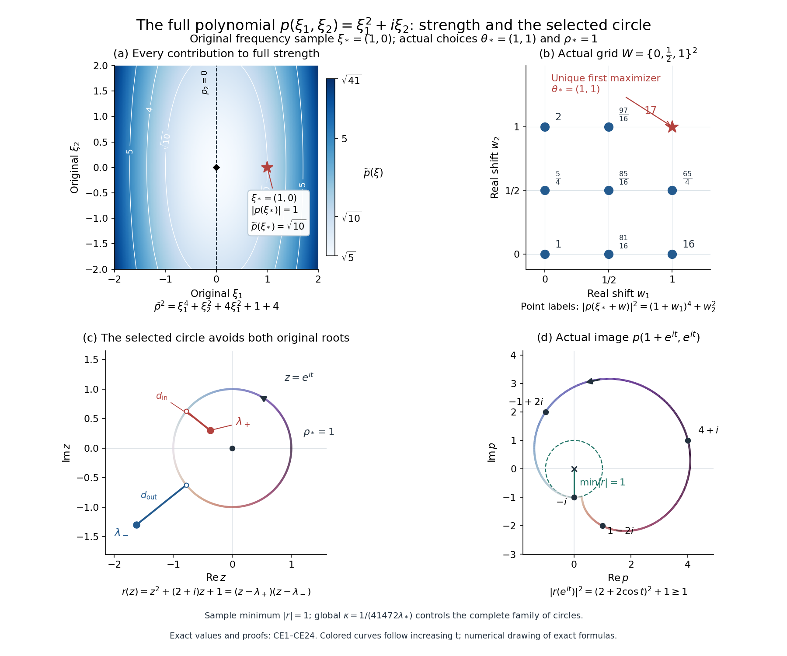
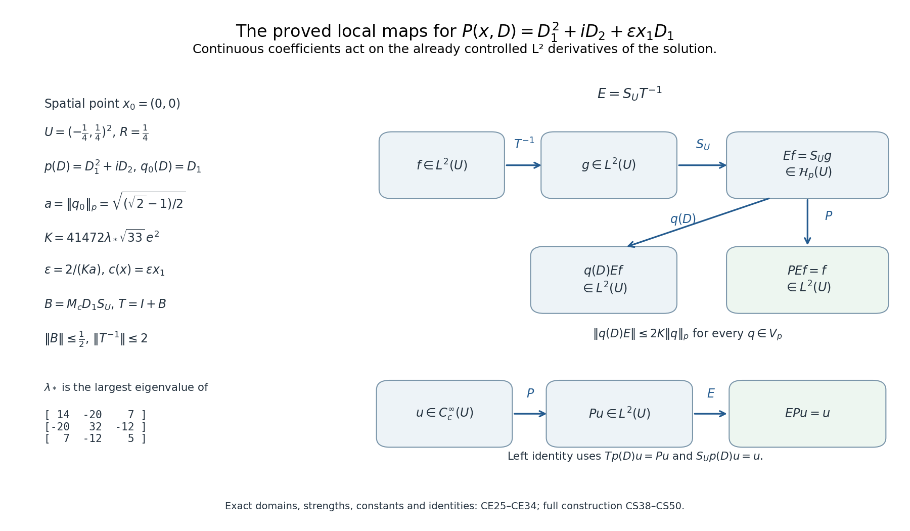

# Local inverses and distance-weighted elliptic estimates

Ellipticity gives a local inverse with exactly as many derivatives as the order of the operator. The useful question here is how little regularity its coefficients may have. Continuity will suffice for the highest-order coefficients. Lower-order coefficients can be unbounded; their admissible integrability depends on how many derivatives separate their term from the principal part.

We first build a constant-coefficient solver and record its quantitative bounds. Multiplication estimates then determine the coefficient assumptions. A separate localization argument gives estimates on arbitrary open subsets of one fixed neighborhood, with constants independent of the subset. Finally, a commutator argument supplies the missing highest derivatives when the equation is initially defined only as a distribution.

## 1. Conventions and prerequisite contracts

Let \(n,m\geq1\) be integers and \(1<p<\infty\). The order \(m\) is arbitrary. Coefficients and functions may be complex-valued. We use the Fourier convention of Section 1 of [Fourier transforms, finite spectra and convex separation](prerequisite-bridges.md):

\[
D_j=-i\partial_j,\qquad
\widehat f(\xi)=\int e^{-ix\cdot\xi}f(x)\,dx,\qquad
\mathcal F^{-1}h(x)=(2\pi)^{-n}\int e^{ix\cdot\xi}h(\xi)\,d\xi.
\]

The space \(W^{s,p}(V)\), for a nonnegative integer \(s\), consists of distributions whose derivatives of orders at most \(s\) belong to \(L^p(V)\). We write \(\nabla^j u\) for the finite array \((D^\alpha u)_{|\alpha|=j}\), using its pointwise \(\ell^p\) norm inside an \(L^p\) norm. Switching to the sum of the component norms changes only constants depending on \(n,m,p\).

The proofs use the following entry results, each with its stated hypotheses.

* **Distribution operations:** Distributions carry the usual test-function topology. Multiplication by a smooth function and distributional differentiation are continuous operations. A distribution supported in a compact set has finite order: after inserting a fixed cutoff near its support, its pairing is bounded by a constant times finitely many suprema of derivatives of the test function on a fixed compact neighborhood. It therefore acts on smooth functions through that cutoff and is tempered. Convolution is defined when one factor is compactly supported; differentiation transfers between its factors, and associativity holds in the uses here where all but at most one factor are compactly supported. Convolution of a tempered distribution with a compactly supported distribution is tempered. A smooth kernel paired with a compactly supported distribution gives a smooth function, also locally when all relevant kernel arguments stay away from its singular set. Fourier inversion of a compactly supported distribution is smooth, with derivatives obtained by differentiating its exponential pairing. These distribution-calculus entry facts are used in (L4)–(L5), (L12), (L14), and the smoothness argument at the end of Section 2. Sections 13.6–13.10 of [Detecting regularity without choosing coordinates](geometric-microlocal-calculus.md) give the complete proofs of this interface, including the exact applications to the inverse identities below.
* **Integration and weak derivatives:** Lebesgue integration, Hölder and Young inequalities, Tonelli, dominated and monotone convergence; completeness of \(L^p\); density of \(C_c^\infty(\mathbb R^n)\) in \(L^p\) for finite \(p\); translation continuity and convergence of smooth approximate identities in these spaces. Locally, smooth approximation holds in integer \(W^{s,p}\). A distribution represented by an \(L^p\) limit has the corresponding distributional derivatives. These are the integration and weak-derivative facts used below. Sections 15.1–15.5 of [Banach estimates, quotient spaces and compact parameter arguments](banach-foundation-bridges.md) prove these operations with their full norms, scale factors and derivative signs, and identify their exact applications below.
* **Fourier multiplier estimate:** If \(b\in C^{n+2}(\mathbb R^n\setminus\{0\})\) and
  \[
  \max_{|\beta|\leq n+2}\sup_{\xi\ne0}
  |\xi|^{|\beta|}|\partial_\xi^\beta b(\xi)|\leq B,
  \]
  then \(b(D)\) extends from Schwartz functions to \(L^p(\mathbb R^n)\), with norm at most \(C_{n,p}B\). The source is Terence Tao, *Lecture Notes 4 for 247A*, Theorem 4.4, pp. 19–20; its singular-integral implication is Corollary 2.10, pp. 8–9. The bound uses only finitely many symbol derivatives. Section 13 proves this statement with the original operator, finite exponents and full constants; its Fourier maps are constructed in Section 7 of [Fourier transforms, finite spectra and convex separation](prerequisite-bridges.md).
* **Fractional-integration estimate:** For \(0<s<n\), \(1<p<q<\infty\), and \(1/q=1/p-s/n\), convolution with \(|x|^{s-n}\) maps \(L^p(\mathbb R^n)\) to \(L^q(\mathbb R^n)\). The source is Tao, *Lecture Notes 2 for 247A*, Corollary 6.3, p. 16, with Proposition 6.1 on p. 15. No strong \(L^\infty\) endpoint is included. Section 12 proves this original kernel estimate, including its finite endpoint, full constants and derivative-array application.
* **Lipschitz product rule:** A Lipschitz scalar function has weak first derivatives in \(L^\infty\), bounded by its Lipschitz constant, and satisfies the weak product rule with smooth functions. This local fact also permits integration by parts against compactly supported smooth functions. It will be used only in the weak-coefficient part. Section 11 supplies the complete weak-derivative, product, cutoff and commutator proofs for the original complex coefficients.

There is also a broader constant-strength comparison. For an operator with nonzero frozen symbol, continuous coefficients and constant strength near a point, it provides a local \(L^2\) right inverse, a left inverse on compactly supported smooth functions, and bounded \(Q(D)E\) when the constant-coefficient operator \(Q\) is weaker than the frozen operator. In this terminology, write
\(\widetilde q(\xi)^2=\sum_\beta|\partial_\xi^\beta q(\xi)|^2\);
“weaker” means \(\widetilde q\leq C\widetilde p\), and constant strength means pairwise comparability of the frozen \(\widetilde p_x\). Section 14 proves this full constant-strength assertion with both inverse identities and every weaker-operator bound. It does not supply the rough lower-coefficient \(L^p\) theorem below. The elliptic construction below retains its additional finite-exponent estimates.

The equation in that antecedent has a specific interpretation. The finite-dimensional weaker-operator representation is
\(P(x,D)=P_0(D)+\sum_{\nu=1}^r c_\nu(x)P_\nu(D)\), with \(P_0\) the frozen operator, \(P_\nu\) weaker than \(P_0\), and continuous \(c_\nu\) vanishing at the frozen point. Define \(PEf=P_0Ef+\sum_\nu c_\nu P_\nu Ef\). Each \(P_\nu Ef\), including \(P_0Ef\), belongs to \(L^2\) by the stated operator bounds; after shrinking the neighborhood, its product with \(c_\nu\) is an \(L^2\) function. Section 14.6 proves this graph-domain interpretation: each continuous coefficient multiplies an already defined local square-integrable derivative.

The proofs below establish the fundamental solution, the local Hölder multiplier bound, the perturbation argument, the distance-weighted estimate, and the Lipschitz commutator. The Banach-space geometric-series argument is also available in Section 3 of [Finite defects under perturbation](fredholm-stability.md); we recall its short application where it is needed.

## 2. A frozen solver without a restriction on dimension or order

Let \(q(\xi)\) be homogeneous of degree \(m\), with

\[
|q(\xi)|\geq c|\xi|^m\quad(\xi\in\mathbb R^n).                 \tag{L1}
\]

Choose \(\chi\in C_c^\infty(\mathbb R^n)\), equal to one for \(|\xi|\leq1/2\) and zero for \(|\xi|\geq1\). Set

\[
b_0(\xi)=\frac{1-\chi(\xi)}{q(\xi)},\qquad F_0=\mathcal F^{-1}b_0.
                                                                    \tag{L2}
\]

The quotient is smooth across zero because its numerator vanishes there. Repeated differentiation of a reciprocal, or induction in the identity \(q/q=1\), gives

\[
|\partial^\beta b_0(\xi)|\leq C_\beta(1+|\xi|)^{-m-|\beta|}.
                                                                    \tag{L3}
\]

In particular \(F_0\) is tempered and
\(q(D)F_0=\delta+\omega\), where \(\omega=-\mathcal F^{-1}\chi\) is Schwartz.

Here is an exact fundamental solution. When \(m<n\), the locally integrable function \(1/q\) defines a tempered distribution \(T\). When \(m\geq n\), put \(L=m-n\) and define, for \(\varphi\in\mathcal S\),

\[
\langle T,\varphi\rangle=
\int_{\mathbb R^n}\frac{\displaystyle\varphi(\xi)-\chi(\xi)
  \sum_{|\beta|\leq L}\frac{\partial^\beta\varphi(0)}{\beta!}\xi^\beta}
 {q(\xi)}\,d\xi.                                                   \tag{L4}
\]

Taylor's theorem bounds the numerator by \(C|\xi|^{L+1}\) near zero. Its quotient is integrable there, since the radial power after including the volume element is \(n-1-m+L+1=0\). At infinity, Schwartz decay applies. These same estimates, in terms of finitely many Schwartz seminorms, prove that \(T\) is tempered. As \(L<m\), all derivatives of \(q\varphi\) of orders at most \(L\) vanish at zero. Consequently \(qT=1\). Thus

\[
G=\mathcal F^{-1}T,\qquad q(D)G=\delta.                            \tag{L5}
\]

Moreover, \(T-b_0\) is supported in \(\operatorname{supp}\chi\). Its inverse Fourier transform \(H=G-F_0\) is smooth: on a fixed compact frequency set one may differentiate the exponential in its distributional pairing any number of times. Those differentiated pairings depend continuously on \(x\), by the finite-order bound for a compactly supported distribution. This proves smoothness, without assuming that \(G\) is an ordinary homogeneous function. In the dimensions where logarithmic terms occur, (L4) includes them automatically.

We need two kernel estimates. Fix \(|\alpha|=j\leq m\) and put \(k=m-j\). The symbol of \(D^\alpha F_0\) is \(\xi^\alpha b_0(\xi)\). With
\(\psi(\xi)=\chi(\xi/2)-\chi(\xi)\), its decomposition into annuli has inverse transforms

\[
K_\ell(x)=2^{\ell(n-k)}\kappa_\alpha(2^\ell x),\quad
\kappa_\alpha=\mathcal F^{-1}\!\left(\psi(\xi)\frac{\xi^\alpha}{q(\xi)}\right),
\quad \ell=0,1,\ldots.                                             \tag{L6}
\]

The function \(\kappa_\alpha\) is Schwartz. Indeed its Fourier transform is smooth with compact support away from zero; multiplication by powers of \(x\) in the inverse transform is integration by parts. The telescoping identity \(\sum_{\ell\geq0}\psi(2^{-\ell}\xi)=1-\chi(\xi)\) proves (L6) in tempered distributions. For every integer \(N\),

\[
|K_\ell(x)|\leq C_N2^{\ell(n-k)}(1+2^\ell|x|)^{-N}.              \tag{L7}
\]

If \(k>0\), then \(\sum_\ell\|K_\ell\|_1\leq C\sum_\ell2^{-\ell k}<\infty\). It therefore represents an \(L^1\) kernel. Splitting the sum at \(2^\ell|x|=1\) gives, for \(0<|x|\leq1\),

\[
|D^\alpha F_0(x)|\leq C
\begin{cases}
|x|^{k-n},&0<k<n,\\
1+|\log|x||,&k=n,\\
1,&k>n.
\end{cases}                                                       \tag{L8}
\]

For example the terms below the splitting point form a geometric sum when \(k\ne n\); when \(k=n\), their number is at most \(C(1+|\log|x||)\). Terms above the splitting point form a convergent geometric tail if \(N>n-k\). When \(|x|\geq1\), (L7), with \(N\) as large as desired, gives rapid decay. These arguments also prove smoothness away from zero by differentiating (L7). In particular,

\[
D^\alpha F_0\in L^r_{\mathrm{loc}}
\quad\hbox{if}\quad k>n(1-1/r),\qquad 1\leq r\leq\infty.          \tag{L9}
\]

For \(r<\infty\) this follows by integrating \(\rho^{r(k-n)+n-1}\); the logarithmic case is integrable to every finite power. The stated condition for \(r=\infty\) is \(k>n\). No assertion that a highest derivative is an integrable kernel is being made. When \(k=0\), its boundedness on \(L^p\) follows from Fourier multiplier estimate and (L3).

For \(0<k<n/p\), (L8), its decay at infinity, and Fractional-integration estimate give the finite endpoint

\[
\|D^\alpha F_0*g\|_q\leq C\|g\|_p,
\qquad \frac1q=\frac1p-\frac{k}{n}.                              \tag{L10}
\]

Together with the multiplier case \(k=0,q=p\), this is the global endpoint estimate whenever the displayed \(q\) is finite. For strictly larger \(1/q\), Young's inequality applies to a localized kernel: choose \(r\) by \(1+1/q=1/p+1/r\) and use (L9). This includes \(q=\infty\) precisely when \(k>n/p\). Interpolation with, or the finite-measure inclusion from, the finite endpoint handles the other \(p\leq q<\infty\).

Consequently, if \(V\subset B_1\), extend \(g\in L^p(V)\) by zero and define
\(S_Vg=(G*g)|_V\). For every \(j\leq m\),

\[
\|D^\alpha S_Vg\|_{L^q(V)}\leq C\|g\|_{L^p(V)},\qquad
p\leq q\leq\infty,\quad
\frac1q\geq\frac1p-\frac{k}{n},                                  \tag{L11}
\]

where the last inequality must be strict if \(q=\infty\). The constant is independent of the particular \(V\subset B_1\), with the frozen polynomial and the chosen exponents fixed. To verify the smooth correction, all arguments \(x-y\), for \(x,y\in V\), lie in \(B_2\); hence each derivative of \(H\) is bounded there and its convolution is bounded by \(C\|g\|_1\leq C|B_1|^{1-1/p}\|g\|_p\). Its \(L^q(V)\) norm has the required uniform bound. The same reasoning localizes the kernels in the strict Young estimates.

Both inverse identities are exact:

\[
q(D)S_Vg=g\text{ in }V,\qquad S_Vq(D)v=v\quad(v\in C_c^\infty(V)).
                                                                    \tag{L12}
\]

For the first, convolve (L5) with the compactly supported distribution given by the zero extension of \(g\). For the second, differentiation may be transferred to the compactly supported smooth factor: \(G*q(D)v=(q(D)G)*v=v\).

For completeness, any other fundamental solution differs from \(G\) by a smooth function. If \(q(D)w=0\), take a cutoff \(\eta\) equal to one near any prescribed compact set. Then
\[
\eta w=F_0*q(D)(\eta w)-\omega*(\eta w).
\]
Here \(q(D)(\eta w)=[q(D),\eta]w\) has compact support away from that set. The first convolution is smooth near the set because \(F_0\) is smooth away from zero; the second is smooth because \(\omega\) is smooth and \(\eta w\) has compact support. This proves the assertion locally everywhere. It also explains the smooth-remainder assertion for a regularized inverse with a different low-frequency cutoff.

## 3. A parameter in the constant-coefficient estimate

**Lemma.** For a homogeneous elliptic \(q\) of degree \(m\),

\[
\sum_{|\alpha|\leq m} A^{m-|\alpha|}\|D^\alpha v\|_p
\leq C\bigl(\|q(D)v\|_p+A^m\|v\|_p\bigr),\qquad A>0,\quad
v\in W^{m,p}(\mathbb R^n).                                        \tag{L13}
\]

The constant is independent of \(A\). It can also be chosen uniformly when \(q\) ranges over a compact set of homogeneous elliptic polynomials of degree \(m\).

**Proof.** At \(A=1\), the Fourier identity \(q b_0=1+\widehat\omega\) gives
\[
D^\alpha v=(D^\alpha F_0)*q(D)v-(D^\alpha\omega)*v.                \tag{L14}
\]
It holds first on Schwartz functions. Each first operator is bounded on \(L^p\) by the multiplier contract for top order, and by the \(L^1\) kernel estimate for lower orders. The second kernel is Schwartz. Smooth cutoff and mollification approximate any \(W^{m,p}\) function in that norm, so the identity and estimate extend to the stated domain. For \(w(y)=v(y/A)\), the derivative norm is
\(\|D^\alpha w\|_p=A^{n/p-|\alpha|}\|D^\alpha v\|_p\),
while homogeneity gives
\(\|q(D)w\|_p=A^{n/p-m}\|q(D)v\|_p\).
Apply the estimate at one and multiply by \(A^{m-n/p}\).

Finally, a compact family of elliptic polynomials has a positive common minimum of \(|q(\theta)|\) on the unit sphere. Its coefficients are bounded. The reciprocal differentiation identity bounds every required derivative in (L3) uniformly; the integrations by parts and the multiplier theorem use only finitely many of these bounds. The same \(C\) therefore works for the family. \(\square\)

## 4. The coefficient table and a local inverse in \(L^p\)

Consider
\[
P=\sum_{|\alpha|\leq m}a_\alpha(x)D^\alpha,
\qquad P_m=\sum_{|\alpha|=m}a_\alpha(x)D^\alpha                     \tag{L15}
\]
near zero. Assume that the coefficients of \(P_m\) are continuous and its frozen symbol
\(q(\xi)=\sum_{|\alpha|=m}a_\alpha(0)\xi^\alpha\) is elliptic. For every lower-order term set \(k=m-|\alpha|>0\) and require the following local integrability.

| Derivative gap \(k\) | Coefficient space \(L^{r_\alpha}_{\rm loc}\) | Exponent used for \(D^\alpha S_Vg\) |
| --- | --- | --- |
| \(k<n/p\) | \(r_\alpha=n/k\) | \(1/q_\alpha=1/p-k/n\) |
| \(k=n/p\) | \(r_\alpha=p+\varepsilon_\alpha\), some \(\varepsilon_\alpha>0\) | \(q_\alpha=p(p+\varepsilon_\alpha)/\varepsilon_\alpha\) |
| \(k>n/p\) | \(r_\alpha=p\) | \(q_\alpha=\infty\) |

There are finitely many coefficients, so different positive \(\varepsilon_\alpha\) cause no difficulty. At the critical gap any finite \(q_\alpha\) is allowed by (L11). The table gives \(1/p=1/r_\alpha+1/q_\alpha\) in every row.

**Theorem.** Every sufficiently small open neighborhood \(V\) of zero has a linear operator \(E:L^p(V)\to L^p(V)\) satisfying

\[
PEf=f\quad(f\in L^p(V)),\qquad EPv=v\quad(v\in C_c^\infty(V)),     \tag{L16}
\]

and, simultaneously for all \(|\alpha|\leq m\),

\[
D^\alpha E:L^p(V)\longrightarrow L^q(V)\text{ bounded if }
p\leq q\leq\infty,\quad
\frac1q\geq\frac1p-\frac{m-|\alpha|}{n},                           \tag{L17}
\]

with strict inequality when \(q=\infty\). The equation in (L16) is a distributional equality and every term of \(PEf\) is represented by an \(L^p\) function. In particular \(Ef\in W^{m,p}(V)\).

**Proof.** Use \(S_V\) from (L11), with the same frozen polynomial, and compute
\[
PS_V=I+R_V,\qquad
R_Vg=\sum_{|\alpha|=m}(a_\alpha-a_\alpha(0))D^\alpha S_Vg
       +\sum_{|\alpha|<m}a_\alpha D^\alpha S_Vg.                   \tag{L18}
\]
The top-order terms have norms at most
\(C\sup_V|a_\alpha-a_\alpha(0)|\|g\|_p\).
For a lower-order term, Hölder's inequality and the corresponding row of the table give
\[
\|a_\alpha D^\alpha S_Vg\|_p
\leq C\|a_\alpha\|_{L^{r_\alpha}(V)}\|g\|_p.                      \tag{L19}
\]
All \(r_\alpha\) are finite. On shrinking the surrounding ball, the first coefficients tend to zero by continuity and the norms in (L19) tend to zero by absolute continuity of their integrals. The constants in (L11) do not grow as \(V\) shrinks inside \(B_1\). Choose the ball so that \(\|R_V\|\leq1/2\) for every \(V\) contained in it.

The series \(B_V=\sum_{\nu=0}^\infty(-R_V)^\nu\) converges in operator norm, since \(L^p(V)\) is Banach. Multiplication of its finite partial sums by \(I+R_V\) leaves an error of norm at most \(2^{-N}\), so \(B_V\) is its two-sided inverse and \(\|B_V\|\leq2\). Define
\[
E=S_VB_V.                                                        \tag{L20}
\]
Equations (L18) and (L11) give the right identity and every bound in (L17). They also justify all coefficient products used in the equation.

For the left identity let \(g=q(D)v\), extended by zero, where \(v\in C_c^\infty(V)\). The second identity in (L12) gives \(S_Vg=v\), and therefore \((I+R_V)g=Pv\). The inverse on \(L^p(V)\) implies \(B_VPv=g\), and hence \(EPv=v\). This checks the same \(E\) on both stated domains. It asserts neither a boundary condition for \(Ef\) nor uniqueness among all local solutions. \(\square\)

## 5. The Hölder alternative, with its scaling made explicit

For \(0<\gamma<1\), let \(\overline C^\gamma(V)\) be the bounded functions with finite seminorm
\([f]_{\gamma,V}=\sup_{x\ne y\in V}|f(x)-f(y)|/|x-y|^\gamma\).
On a ball \(B_r\) use the equivalent, scaled norm
\[
N_r(f)=\|f\|_{\infty,B_r}+r^\gamma[f]_{\gamma,B_r}.                 \tag{L21}
\]
This is a Banach norm: a Cauchy sequence converges uniformly, and the difference quotient bound passes to that limit, including the Cauchy bound for the seminorm. The product inequality
\(N_r(fg)\leq N_r(f)N_r(g)\) follows by adding and subtracting \(f(x)g(y)\).

**Extension.** A function in this space has a unique continuous extension to \(\overline B_r\), by its Hölder bound. Extend it to all of \(\mathbb R^n\) by
\[
\mathcal A_rf(x)=
\begin{cases}
f(x),&|x|\leq r,\\
(2-|x|/r)f(rx/|x|),&r<|x|<2r,\\
0,&|x|\geq2r.
\end{cases}                                                       \tag{L22}
\]
To check the norm including pairs in different regions, let \(\pi_r\) be radial projection onto \(\overline B_r\), and let \(\theta_r(x)=\min(1,\max(0,2-|x|/r))\). Then \(\mathcal A_rf=\theta_r(f\circ\pi_r)\). The projection has Lipschitz constant at most two: for exterior points expand the difference of their normalized vectors, ordering their radii; for an interior and an exterior point insert the point where their connecting segment first meets the sphere. Also
\(|\theta_r(x)-\theta_r(y)|\leq\min(1,|x-y|/r)\leq(|x-y|/r)^\gamma\).
The product difference estimate now gives
\[
\|\mathcal A_rf\|_\infty+r^\gamma[\mathcal A_rf]_{\gamma,\mathbb R^n}
\leq C_\gamma N_r(f),                                             \tag{L23}
\]
with a constant independent of \(r\).

**The frozen Hölder bound.** For \(h\) bounded and globally \(\gamma\)-Hölder, the top-order kernels in (L6) have zero integral. Thus
\[
K_\ell*h(x)=\int K_\ell(z)(h(x-z)-h(x))\,dz,
\quad
\|K_\ell*h\|_\infty\leq C2^{-\ell\gamma}[h]_\gamma.                \tag{L24}
\]
The derivative kernel also has zero integral, and the same computation gives
\(\|\nabla(K_\ell*h)\|_\infty\leq C2^{\ell(1-\gamma)}[h]_\gamma\).
For points a distance \(t\leq1\) apart, estimate a term either by twice its supremum or by \(t\) times its derivative supremum. Sum the derivative bound where \(2^\ell t\leq1\) and the supremum bound where \(2^\ell t>1\). The geometric sums are at most
\(C_\gamma t^\gamma[h]_\gamma\).
For \(t>1\), the convergent supremum sum suffices. Therefore the sum defines a bounded \(C^\gamma\) function with norm at most \(C_\gamma(\|h\|_\infty+[h]_\gamma)\). For compactly supported \(h\), it is the distribution \((D^\alpha F_0)*h\): the symbol partial sums converge on Schwartz test functions, and (L24) identifies their locally uniform limit. For lower orders \(k>0\), the sum of the \(L^1\) kernel norms is finite, so both the supremum and the Hölder seminorm are bounded directly by convolution. Finally, convolution with \(D^\alpha H\), for \(h\) supported in \(B_2\) and output restricted to \(B_1\), is bounded in the full \(C^\gamma\) norm. Use the supremum of that derivative and its first derivatives on \(B_3\), the mean-value theorem, and \(\|h\|_1\leq|B_2|\|h\|_\infty\).

It follows that the operator \(T f=(G*\mathcal A_1 f)|_{B_1}\) satisfies
\[
\|D^\alpha Tf\|_{\overline C^\gamma(B_1)}
\leq C\|f\|_{\overline C^\gamma(B_1)},\qquad |\alpha|\leq m.       \tag{L25}
\]
This argument works directly for the full Hölder space. It does not require smooth functions to be dense in the same Hölder norm.

Rescale this single solver by
\[
S_rf(x)=r^m\,T(f(r\,\cdot))(x/r),\qquad x\in B_r.
\]
Homogeneity of \(q\) gives
\[
q(D)S_rf=f,\qquad
N_r(D^\alpha S_rf)\leq C r^{m-|\alpha|}N_r(f).                    \tag{L26}
\]
If \(g=q(D)v\) with \(v\in C_c^\infty(B_r)\), its rescaled extension in (L22) is precisely its zero extension. Equivalently \(S_rg\) is convolution with the fundamental solution \(r^{m-n}G(\cdot/r)\). Hence \(S_rq(D)v=v\). This remains true when \(G\) has logarithmic terms; no homogeneity assertion about \(G\) was used.

**Theorem.** If every coefficient of \(P\) is \(C^\gamma\) near zero and its frozen principal symbol is elliptic, then on a sufficiently small centered ball there is a linear \(E_\gamma\) on \(\overline C^\gamma\) with
\[
PE_\gamma f=f,\qquad E_\gamma Pv=v\ (v\in C_c^\infty),\qquad
D^\alpha E_\gamma:\overline C^\gamma\to\overline C^\gamma
\text{ bounded for }|\alpha|\leq m.                              \tag{L27}
\]

**Proof.** Compute \(PS_r=I+R_r\) as in (L18). For a highest-order coefficient,
\[
N_r(a_\alpha-a_\alpha(0))\leq2r^\gamma[a_\alpha]_{\gamma,B_r}.
\]
For a lower-order coefficient its norm \(N_r(a_\alpha)\) remains bounded as \(r\downarrow0\), while (L26) supplies the extra factor \(r^{m-|\alpha|}\). The product inequality therefore gives
\[
\|R_r\|_{N_r\to N_r}\leq C\left(
r^\gamma\sum_{|\alpha|=m}[a_\alpha]_{\gamma,B_r}
 +\sum_{|\alpha|<m}r^{m-|\alpha|}N_r(a_\alpha)\right)\longrightarrow0.
                                                                    \tag{L28}
\]
Choose this norm below \(1/2\), and set \(E_\gamma=S_r(I+R_r)^{-1}\). The same geometric-series and test-function argument used for (L20) proves both identities. Equation (L26) gives the stronger estimate
\(N_r(D^\alpha E_\gamma f)\leq2C r^{m-|\alpha|}N_r(f)\).
At fixed \(r\), scaled and unscaled norms are equivalent, proving (L27). The small factor in the top terms is \(r^\gamma\); the unscaled Hölder seminorm of a coefficient need not decrease on smaller balls. \(\square\)

## 6. An estimate uniform over open subsets

In this part the operator is the principal part \(P_m\) alone. Fix a compact neighborhood \(K\) of zero, contained in the coefficient domain, on which the coefficients are continuous and
\[
\left|\sum_{|\alpha|=m}a_\alpha(x)\xi^\alpha\right|
\geq c_K|\xi|^m\qquad(x\in K,\ \xi\in\mathbb R^n).                \tag{L29}
\]
Such a \(K\) is obtained by shrinking around an elliptic point, using continuity and compactness of the unit sphere. For any open \(V\subset K\), let
\(d_V(x)=\operatorname{dist}(x,\mathbb R^n\setminus V)\).

**Theorem.** There is a constant \(C\), depending on \(K,P_m,n,m,p\) but not on \(V\), such that, for \(u\in W^{m,p}(V)\) and \(0\leq j\leq m\),

\[
\|d_V^j\nabla^j u\|_{L^p(V)}
\leq C\bigl(\|d_V^mP_mu\|_{L^p(V)}+\|u\|_{L^p(V)}\bigr)^{j/m}
        \|u\|_{L^p(V)}^{1-j/m}.                                  \tag{L30}
\]

For \(j=m\) this is a linear estimate, and for \(j=0\) it is the identity bound. If \(u=0\) as an \(L^p\) function, every derivative is zero, and the assertion is interpreted accordingly. Lower-order terms are not included in \(P_m\) in (L30).

**Proof.** The frozen polynomials
\(q_y(\xi)=\sum_{|\alpha|=m}a_\alpha(y)\xi^\alpha\), \(y\in K\), form a compact family satisfying (L29). Thus (L13) has a common constant. Let \(\eta\in C_c^\infty(B_1)\) equal one on \(B_{1/2}\). For a ball \(B(y,r)\subset V\), apply (L13) to \(\eta((x-y)/r)u(x)\), extended by zero, with \(A=M/r\). On \(B(y,r/2)\) its derivatives equal those of \(u\). Expanding the frozen operator gives three types of terms:
\[
q_y(D)(\eta_yu)=\eta_yP_mu+\eta_y(q_y(D)-P_m)u+[q_y(D),\eta_y]u.
\]
The middle term is at most \(\omega_a(r)|\nabla^m u|\), up to a fixed array constant, where \(\omega_a(r)\to0\) is a common modulus of continuity of the finitely many coefficients on \(K\). Every term in the last commutator contains a derivative of \(u\) of some order \(j<m\), multiplied by a coefficient bounded by \(Cr^{j-m}\). Taking \(p\)th powers, using the finite-sum inequality, and multiplying by \(r^{mp}\), gives
\[
\begin{split}
\sum_{j=0}^m M^{p(m-j)}r^{pj}
       \int_{B(y,r/2)}|\nabla^j u|^p
\leq C\bigg(&\int_{B(y,r)}|r^mP_mu|^p
 +\omega_a(r)^p\int_{B(y,r)}|r^m\nabla^m u|^p\\
 &+\sum_{j<m}\int_{B(y,r)}|r^j\nabla^j u|^p
 +M^{mp}\int_{B(y,r)}|u|^p\bigg).
\end{split}                                                       \tag{L31}
\]
All constants in this inequality are independent of \(M,r,y,V\).

Choose a small number \(r_0>0\), to be fixed below, and put
\[
\rho(y)=\min(r_0,d_V(y)/2).                                       \tag{L32}
\]
The distance function is 1-Lipschitz, by the triangle inequality and taking an infimum. Thus \(\rho\) is \(1/2\)-Lipschitz. Every ball \(B(y,\rho(y))\) is contained in \(V\). The following two geometric bounds ensure uniform overlap when the centers, rather than a discrete covering, are integrated:
\[
\begin{array}{ll}
|x-y|<\rho(y)&\Longrightarrow\quad
       \rho(y)/2<\rho(x)<3\rho(y)/2,\\[2pt]
|x-y|<2\rho(x)/5&\Longrightarrow\quad
       4\rho(x)/5<\rho(y)<6\rho(x)/5
       \quad\hbox{and}\quad |x-y|<\rho(y)/2.
\end{array}                                                       \tag{L33}
\]
They follow immediately by subtracting the two radii and using the Lipschitz bound. The second ball of centers lies in \(V\), since \(2\rho(x)/5<d_V(x)\). Writing \(v_n=|B_1|\), they imply
\[
\int_{\{y:x\in B(y,\rho(y))\}}\frac{dy}{\rho(y)^n}\leq3^n v_n,
\qquad
\int_{\{y:x\in B(y,\rho(y)/2)\}}\frac{dy}{\rho(y)^n}\geq3^{-n}v_n.
                                                                    \tag{L34}
\]
For the upper bound, the centers lie in \(B(x,2\rho(x))\) and \(\rho(y)>2\rho(x)/3\). For the lower bound, integrate just over \(B(x,2\rho(x)/5)\), where \(\rho(y)<6\rho(x)/5\). The same estimates, with constants depending also on \(j,p\), hold if the integrands are multiplied by \(\rho(y)^{pj}\), after factoring out \(\rho(x)^{pj}\).

Integrate (L31), with \(r=\rho(y)\), against \(dy/\rho(y)^n\). Tonelli and (L34) give
\[
\begin{split}
\sum_{j=0}^m M^{p(m-j)}\|\rho^j\nabla^j u\|_p^p
\leq C\bigg(&\|\rho^mP_mu\|_p^p
 +\omega_a(r_0)^p\|\rho^m\nabla^m u\|_p^p\\
 &+\sum_{j<m}\|\rho^j\nabla^j u\|_p^p+M^{mp}\|u\|_p^p\bigg).
\end{split}                                                       \tag{L35}
\]
First choose \(r_0\) so the coefficient of the highest-order term on the right is less than \(1/2\). Next choose \(M_0\geq1\) sufficiently large that the terms of all lower orders on the right can be absorbed by half of their terms on the left whenever \(M\geq M_0\). Indeed each corresponding left coefficient is at least \(M^p\). This proves, with \(F=\|\rho^mP_mu\|_p\) and \(U=\|u\|_p\),
\[
\|\rho^j\nabla^j u\|_p
\leq C\bigl(M^{j-m}F+M^jU\bigr),\qquad M\geq M_0.               \tag{L36}
\]

If \(U>0\) and \(F>M_0^mU\), choose \(M=(F/U)^{1/m}\), obtaining
\(C F^{j/m}U^{1-j/m}\). If \(F\leq M_0^mU\), choose \(M=M_0\), obtaining \(CU\). In both cases the bound is at most
\(C(F+U)^{j/m}U^{1-j/m}\). Finally \(d_V\) is bounded above by a constant depending only on the bounded set \(K\); (L32) therefore gives \(c\,d_V\leq\rho\leq d_V/2\), with \(c>0\) depending only on \(K,r_0\). Replacing \(\rho\) by \(d_V\) proves (L30), with a constant independent of the shape, connectedness, or boundary regularity of \(V\). \(\square\)

## 7. A Lipschitz coefficient through a mollifier

We now give the exact weak product used in the remainder of the lesson. If \(v\in L^p_{\rm loc}\) and \(a\) is Lipschitz, define
\[
aD_jv=D_j(av)-(D_ja)v                                             \tag{L37}
\]
as a distribution. The two products on the right are locally integrable. This definition agrees with the usual product for smooth \(v\), and depends continuously on \(v\) in \(L^p\) on compact sets, when tested against a fixed compactly supported smooth function.

If \(u\in W^{m-1,p}_{\rm loc}\), choose \(j\) with \(\alpha_j>0\) and use (L37) with \(v=D^{\alpha-e_j}u\) to define \(aD^\alpha u\), \(|\alpha|=m\). This is independent of that choice: smooth approximation of \(u\) in \(W^{m-1,p}\) on a neighborhood of a test function's support makes each definition converge to the same classical product on the approximants. The continuous dependence just proved identifies the limits.

**Commutator lemma.** Suppose \(a:\mathbb R^n\to\mathbb C\) has Lipschitz constant \(M\), \(v\in L^p(\mathbb R^n)\), and \(\varphi\in C_c^\infty(\mathbb R^n)\). Put \(\varphi_\varepsilon(x)=\varepsilon^{-n}\varphi(x/\varepsilon)\). Then
\[
\begin{split}
C_\varepsilon^a v&=(aD_jv)*\varphi_\varepsilon
                     -a(D_jv*\varphi_\varepsilon),\\
\|C_\varepsilon^a v\|_p
&\leq M\|v\|_p\int_{\mathbb R^n}
       \bigl(|\varphi(z)|+|z|\,|D_j\varphi(z)|\bigr)\,dz,
\end{split}                                                       \tag{L38}
\]
and \(C_\varepsilon^a v\to0\) in \(L^p\) for each fixed \(v\).

**Proof.** Applying (L37), or integrating by parts first for smooth \(v\), gives
\[
\begin{split}
C_\varepsilon^a v(x)
={}&\int [a(x-y)-a(x)]v(x-y)D_j\varphi_\varepsilon(y)\,dy\\
 &-\int (D_ja)(x-y)v(x-y)\varphi_\varepsilon(y)\,dy.
\end{split}                \tag{L39}
\]
The right side makes sense for \(v\in L^p\). Its absolute value is bounded by convolution of \(M|v|\) with
\(|y||D_j\varphi_\varepsilon(y)|+|\varphi_\varepsilon(y)|\).
Young's inequality yields (L38), because changing \(y=\varepsilon z\) makes that kernel's \(L^1\) norm independent of \(\varepsilon\). Approximation in \(L^p\) proves that (L39) represents the distribution in (L38), using the continuity of the product (L37) on compact sets. No boundedness of \(a\) on all of \(\mathbb R^n\) is required; its at most linear growth also makes the original products legitimate distributions.

For \(h\in C_c^\infty\), use the unintegrated expression
\[
C_\varepsilon^a h(x)=\int[a(x-y)-a(x)]D_jh(x-y)\varphi_\varepsilon(y)\,dy.
\]
Its \(L^p\) norm is at most
\(\varepsilon M\|D_jh\|_p\int|z||\varphi(z)|\,dz\), which tends to zero. Given \(v\), approximate it by such an \(h\); (L38) bounds \(C_\varepsilon^a(v-h)\) uniformly in \(\varepsilon\). Let \(\varepsilon\downarrow0\) first, and then \(\|v-h\|_p\downarrow0\). This proves strong convergence. \(\square\)

## 8. Recovering the highest derivatives from the equation

**Weak regularity and weighted estimate.** Retain the fixed compact neighborhood and ellipticity of Section 6, and suppose that all coefficients of \(P_m\) are Lipschitz on a neighborhood of \(K\). Let \(V\subset K\) be open. If
\[
u\in W^{m-1,p}(V),\qquad P_mu\in L^p(V),                           \tag{L40}
\]
where \(P_mu\) is defined by (L37), then \(u\in W^{m,p}_{\rm loc}(V)\), all the weighted derivatives in (L30) belong to \(L^p(V)\), and (L30) holds with the same type of constant. Global unweighted highest-derivative integrability up to \(\partial V\) is not asserted.

**Proof.** Fix a ball \(B_0\) compactly contained in \(V\). Choose nested slightly larger balls inside \(V\), a cutoff \(\chi_0\) equal to one near \(\overline B_0\), and a cutoff \(\chi_1\) equal to one on an open neighborhood \(W\) of \(\operatorname{supp}\chi_0\). Take \(\overline W\subset V\). Set \(v=\chi_0u\), extend it by zero, and set \(b_\alpha=\chi_1a_\alpha\), extended by zero to \(\mathbb R^n\). These \(b_\alpha\) are globally Lipschitz and bounded. Product differentiation, justified by the smooth approximation used after (L37), gives
\[
P_mv=\chi_0P_mu+
\sum_{|\alpha|=m}\sum_{\substack{\beta\leq\alpha\\|\beta|<m}}
 \binom{\alpha}{\beta}a_\alpha(D^{\alpha-\beta}\chi_0)D^\beta u.
                                                                    \tag{L41}
\]
Every term on the right is \(L^p\) and supported in \(V\); its zero extension is also \(\sum b_\alpha D^\alpha v\) on the whole space.

Choose \(\varphi\in C_c^\infty\) of integral one and let \(v_\varepsilon=v*\varphi_\varepsilon\). For each top-order \(\alpha\), choose \(j\) as in (L37). Applying (L38) to \(D^{\alpha-e_j}v\in L^p\) shows
\[
\sum_{|\alpha|=m} b_\alpha D^\alpha v_\varepsilon
=(P_mv)*\varphi_\varepsilon
 -\sum_{|\alpha|=m}C_\varepsilon^{b_\alpha}(D^{\alpha-e_j}v)
\longrightarrow P_mv\quad\hbox{in }L^p(\mathbb R^n).              \tag{L42}
\]
For small \(\varepsilon\), the support of \(v_\varepsilon\) is in \(W\), where \(b_\alpha=a_\alpha\). In particular, (L42) is convergence of \(P_mv_\varepsilon\) in \(L^p(W)\). Also \(v_\varepsilon\to v\) in \(L^p\). Apply (L30), with \(j=m\) and open set \(W\), to the smooth difference \(v_\varepsilon-v_\delta\). Its right side tends to zero. Since \(d_W\) has a positive lower bound on \(\overline B_0\), every highest derivative is Cauchy in \(L^p(B_0)\). Its limit is the corresponding distributional derivative of \(v=u\) there. This proves local \(W^{m,p}\) regularity.

To pass to the full open set without imposing boundary regularity, put
\(V_t=\{x\in V:d_V(x)>t\}\), \(t>0\). Its closure is compact in \(V\), since \(V\subset K\) is bounded. Local regularity and a finite compact cover imply \(u\in W^{m,p}(V_t)\). For \(x\in V_t\), its own distance function satisfies
\[
d_V(x)-t\leq d_{V_t}(x)\leq d_V(x).                               \tag{L43}
\]
The first inequality follows because the ball of radius \(d_V(x)-t\) about \(x\) lies in \(V_t\), by the Lipschitz property of \(d_V\); the second follows from \(V_t\subset V\). Hence, as \(t\downarrow0\), the distances, extended by zero off \(V_t\), increase pointwise to \(d_V\). Apply (L30) on \(V_t\). Its constants are independent of \(t\). Monotone convergence for the derivative integrals, and dominated convergence for the \(u\) and \(P_mu\) integrals, give (L30) on \(V\). This also proves the asserted weighted integrability. \(\square\)

## 9. Annular decay and infinite-order vanishing

Let \(P_m\) be elliptic with continuous principal coefficients on a fixed neighborhood of zero. Suppose \(u\in W^{m,p}_{\rm loc}(K^\circ\setminus\{0\})\), and for some real \(N\) and all sufficiently small \(r>0\),
\[
\int_{r<|x|<2r}|u|^p\,dx=O(r^N),\qquad
|P_mu(x)|\leq C\sum_{|\alpha|<m}|x|^{|\alpha|-m}|D^\alpha u(x)|
\quad\hbox{a.e. off zero}.                                      \tag{L44}
\]

**Corollary.** For every \(|\alpha|\leq m\),
\[
\int_{r<|x|<2r}|r^{|\alpha|}D^\alpha u|^p\,dx=O(r^N).             \tag{L45}
\]
The same conclusion holds when the principal coefficients are Lipschitz and the initial assumption is only \(u\in W^{m-1,p}_{\rm loc}\) off zero, with (L44) interpreted distributionally as in (L37). In that case the inequality in (L44) means that the distribution \(P_mu\) has the indicated locally \(L^p\) representative.

**Proof.** On \(A_r=\{r<|x|<2r\}\), let \(d=d_{A_r}\), \(U=\|u\|_{L^p(A_r)}\), and
\(S=\sum_{j<m}\|d^j\nabla^j u\|_{L^p(A_r)}\).
The weak version is first legitimate on this annulus by Section 8; all lower derivatives and \(P_mu\) are \(L^p\) on it because its closure lies in the punctured neighborhood. The same is true in the original strong version. Since \(d\leq r\leq|x|\), (L44) implies
\(F=\|d^mP_mu\|_p\leq C S\). Notice also that \(U\leq S\). Applying (L30) at every \(j<m\),
\[
S\leq C\sum_{j<m}S^{j/m}U^{1-j/m}
\leq C S^{(m-1)/m}U^{1/m}.                                      \tag{L46}
\]
If \(S=0\), the desired bound is immediate. Otherwise divide by \(S^{(m-1)/m}\) and raise to the \(m\)th power, obtaining \(S\leq CU\). For \(m=1\), the sum is just \(S=U\), consistent with this calculation. The top-order case of (L30) then gives \(\|d^m\nabla^m u\|_p\leq C(F+U)\leq CU\).

On \(M_r=\{4r/3<|x|<5r/3\}\) one has \(d\geq r/3\). Thus
\[
\int_{M_r}|r^j\nabla^j u|^p\,dx\leq C U^p=O(r^N),\qquad j\leq m.
                                                                    \tag{L47}
\]
To obtain the original full annulus, not just its middle, use \(M_{s r}\) for
\(s=3/4,9/10,11/10,13/10\). Their radial intervals overlap and cover \((r,2r)\): after dividing by \(r\), they are \((1,5/4)\), \((6/5,3/2)\), \((22/15,11/6)\), and \((26/15,13/6)\). Their associated larger annuli still lie in the coefficient neighborhood for small \(r\). Each application of (L47) has \((sr)^N=O(r^N)\), and \(r^j\) is a fixed multiple of \((sr)^j\). Summing these four bounds proves (L45). \(\square\)

Under the differential inequality in (L44), the condition that its annular integral be \(O(r^N)\) for every \(N>0\) is therefore equivalent to the same condition for every scaled derivative in (L45). It suffices to include orders below \(m\), because they include \(u\); the top-order bounds then follow. This is the infinite-order vanishing statement used later in unique continuation.

The annular and ball formulations agree as well. If an annular bound holds for a positive exponent \(N\), split \(B_r\setminus\{0\}\) into the disjoint annuli of inner radii \(2^{-\nu-1}r\), \(\nu\geq0\). Their bounds sum to at most \(C r^N\sum_{\nu\geq0}2^{-(\nu+1)N}\). The value at the origin has no effect on the integral. Conversely, an annulus is contained in \(B_{2r}\). For an unweighted derivative of order \(j\), replace \(N\) in (L45) by \(N+pj\); this gives every desired positive decay exponent for that derivative as well. This argument establishes decay and integrability; a conclusion that the solution vanishes in a neighborhood requires a unique-continuation theorem in addition.

## 10. Problems with full solutions

**Problem 1: all three coefficient regimes in one operator.** In dimension six, take \(m=4\), \(p=2\), and
\[
P=(1+|x|^{1/3})(D_1^2+\cdots+D_6^2)^2
  +\sum_{|\alpha|\leq3}b_\alpha(x)D^\alpha.
\]
Determine sufficient local spaces for each \(b_\alpha\), and all admissible derivative exponents for its inverse.

**Solution.** The frozen symbol is \(|\xi|^4\); the principal coefficients are continuous, although no first derivative at zero is required. The critical gap is \(n/p=3\). Order-three coefficients have gap one and may lie in \(L^6_{\rm loc}\); order-two coefficients may lie in \(L^3_{\rm loc}\); order-one coefficients require \(L^{2+\varepsilon_\alpha}_{\rm loc}\); and order-zero coefficients require only \(L^2_{\rm loc}\). These coefficients can be unbounded. For example, a coefficient of order three equal to \(|x|^{-1/2}\) near zero is in \(L^6_{\rm loc}(\mathbb R^6)\), because its sixth power has radial integral proportional to \(\int_0^r t^2\,dt\).

On a sufficiently small neighborhood, (L17) gives order-four derivatives in \(L^2\), order-three derivatives in every \(L^q\) with \(2\leq q\leq3\), order-two derivatives for \(2\leq q\leq6\), order-one derivatives for every finite \(q\geq2\), and the solution itself in \(L^\infty\) as well as all these finite spaces. The first-order term uses, in particular, \(q=2(2+\varepsilon_\alpha)/\varepsilon_\alpha\). There is no \(L^\infty\) assertion for the first derivatives at this critical gap.

**Problem 2: why \(L^p\) alone is insufficient in the critical multiplication step.** In a small disk in \(\mathbb R^2\), construct \(a\in L^2\) and \(w\in W^{1,2}\) such that \(aw\notin L^2\). Relate this to the critical row of the table.

**Solution.** Near zero write \(L(r)=\log(e/r)\) and take
\[
w(x)=L(|x|)^{1/4},\qquad
a(x)=|x|^{-1}L(|x|)^{-5/8},
\]
with smooth cutoffs away from zero. The integral for \(|a|^2\) near zero is a constant times \(\int_0^r t^{-1}L(t)^{-5/4}\,dt\), which is finite. The function \(w\) is square-integrable, and its gradient has squared radial integral bounded by \(C\int_0^r t^{-1}L(t)^{-3/2}\,dt<\infty\). These classical derivatives off zero are also its weak derivatives: integration by parts outside a disk of radius \(\delta\) produces a boundary term bounded by \(C\delta L(\delta)^{1/4}\), tending to zero. Thus \(w\in W^{1,2}\). But \(|aw|^2\) has radial integral \(\int_0^r t^{-1}L(t)^{-3/4}\,dt=\infty\).

Here \(k=1=n/p\). The example disproves the unrestricted multiplication estimate \(L^2\cdot W^{1,2}\subset L^2\), which would be needed to use just \(a\in L^p\) at the critical gap. It does not purport to be a nonexistence example for every elliptic equation. The stronger coefficient space \(L^{2+\varepsilon}\), paired with a sufficiently large finite derivative exponent, is exactly what makes (L19) valid. The displayed \(a\) belongs to no \(L^{2+\varepsilon}\), as its extra radial power already forces divergence.

**Problem 3: check the annular weights on a singular solution profile.** Let \(P_2=\sum_jD_j^2=-\Delta\), \(n\geq2\), and \(u(x)=|x|^\lambda\) off zero, with \(\lambda\in\mathbb R\). Find the annular exponent and verify the differential inequality required in (L44).

**Solution.** Direct radial differentiation gives
\(-\Delta u=-\lambda(\lambda+n-2)|x|^{\lambda-2}\).
Thus \(|P_2u|\leq C|x|^{-2}|u|\), one of the allowed terms in (L44). All derivatives exist and are locally \(L^p\) in the punctured neighborhood. On an annulus, changing variables \(x=ry\) gives
\[
\int_{r<|x|<2r}|u|^p\,dx
=r^{p\lambda+n}\int_{1<|y|<2}|y|^{p\lambda}\,dy.
\]
So \(N=p\lambda+n\), which may be negative, zero, or positive. A derivative of order \(j\leq2\) is homogeneous of degree \(\lambda-j\), unless it vanishes identically. Multiplication by \(r^j\) restores the same power \(r^{p\lambda+n}\) after integration. This verifies both the weight and the exponent in (L45), including profiles that are not integrable at the origin before imposing a sufficiently positive exponent.

**Problem 4: strong commutator convergence need not be operator norm convergence.** Let \(a(x)=x_j\) in (L38), and choose \(\varphi\in C_c^\infty\) of integral one. Show why the commutator tends to zero on each fixed \(L^p\) function even though its \(L^p\) operator norm does not tend to zero.

**Solution.** Formula (L39), with \(D_j=-i\partial_j\), gives convolution with
\[
k_\varepsilon(y)=i\partial_{y_j}\bigl(y_j\varphi_\varepsilon(y)\bigr)
=\varepsilon^{-n}k_1(y/\varepsilon).
\]
This is a nonzero smooth compactly supported kernel: if \(\partial_j(y_j\varphi)=0\), then on each line parallel to the \(j\)th axis the compactly supported function \(y_j\varphi\) is constant, hence zero, forcing \(\varphi=0\), contrary to its integral. There is \(h\in C_c^\infty\) with \(k_1*h\ne0\); for instance, convolution with a smooth approximate identity converges to the nonzero \(k_1\). Define \(h_\varepsilon(x)=\varepsilon^{-n/p}h(x/\varepsilon)\). A change of variables gives
\[
\|h_\varepsilon\|_p=\|h\|_p,\qquad
\|k_\varepsilon*h_\varepsilon\|_p=\|k_1*h\|_p>0.
\]
Thus the operator norm is bounded below independently of \(\varepsilon\). The lemma applies to a fixed input; this example changes the input with the smoothing scale. The weak regularity proof in (L42) uses precisely the strong convergence on its finitely many fixed lower derivatives.

## 11. The weak derivative of the original Lipschitz coefficient

The entry fact about Lipschitz coefficients needs a proof because it is used inside (L37), rather than only as a bound on a smooth coefficient. We prove it from the integration results in Sections 15.1–15.5 of [Banach estimates, quotient spaces and compact parameter arguments](banach-foundation-bridges.md) and the Hilbert representation proof in Section 2.3 of [The full calculus of a lower-bounded self-adjoint operator](lower-bounded-spectral-calculus.md). The proof retains the actual complex coefficient. No differentiability almost everywhere or measure-representation theorem for the dual of \(L^1\) is assumed.

### 11.1. Difference quotients and a bounded measurable derivative

Let \(\Omega\subset\mathbb R^n\) be open and let \(a:\Omega\to\mathbb C\) satisfy \(|a(x)-a(y)|\leq M|x-y|\) for all points under consideration, with \(M\geq0\). The local version uses such a bound on each interior neighborhood. Fix a bounded coordinate cube \(Q\) with closure in \(\Omega\). For \(\phi\in C_c^\infty(Q)\), its support and all sufficiently small translates remain in \(Q\). The original change of variables and the scalar fundamental theorem give
\[
 \begin{split}
 -\int_Q a(x)\partial_j\phi(x)\,dx
 &=\lim_{t\to0}\int_Q
       \frac{a(x+t e_j)-a(x)}{t}\phi(x)\,dx,\\
 \left|-\int_Q a\partial_j\phi\right|
 &\leq M\|\phi\|_{L^1(Q)}
 \leq M|Q|^{1/2}\|\phi\|_{L^2(Q)} .
 \end{split}                                                   \tag{LC1}
\]
In the change of variables the difference of translated tests is supported in one fixed compact subset of \(Q\). The function \(a\) is bounded there: compare its values with a fixed point in that neighborhood. The difference quotients of the tests converge uniformly to \(-\partial_j\phi\). Dominated convergence therefore proves the first line, including its minus sign, while the Lipschitz bound proves the second.

Here the dense test subspace of \(L^2(Q)\) can also be verified without a boundary assertion. For an arbitrary \(f\in L^2(Q)\), choose compact smooth cutoffs \(0\leq\chi_k\leq1\) supported in \(Q\), equal to one on increasing interior cubes exhausting \(Q\). Dominated convergence gives \(\chi_k f\to f\) in \(L^2(Q)\). Extend \(\chi_k f\) by zero. Smooth it by the original compact kernel of integral one from (LP14); choosing its scale smaller than the distance of \(\operatorname{supp}\chi_k\) to \(Q^c\), divided by a radius containing the kernel support, keeps the smoothed support inside \(Q\). Formula (LP14) gives arbitrarily small \(L^2\) error. Thus \(C_c^\infty(Q)\) is dense. Every original support and scale restriction is retained.

The linear functional in (LC1) extends uniquely to \(L^2(Q)\). Completeness of that space is (LP10), and its inner product is the original integral \(\langle f,h\rangle=\int_Q f\overline h\), linear in the first variable. The Hilbert representation proof cited above, applied to the conjugate of this linear functional, gives \(g_{j,Q}\in L^2(Q)\) such that
\[
 -\int_Q a\partial_j\phi=\int_Q g_{j,Q}\phi,
 \qquad
 \left|\int_Q g_{j,Q}h\right|\leq M\|h\|_{L^1(Q)}
                         \quad(h\in L^2(Q)).
                                                               \tag{LC2}
\]
The second inequality follows by approximating \(h\) in \(L^2\) by compact tests; their \(L^1\) errors are at most \(|Q|^{1/2}\) times the \(L^2\) errors. The complex representative in (LC2) is the conjugate of the Hilbert representing vector, so no conjugation has been lost.

For measurable \(E\subset Q\), take \(h=1_E\overline{g_{j,Q}}/|g_{j,Q}|\), with value zero where \(g_{j,Q}=0\). It belongs to \(L^2(Q)\), and (LC2) gives \(\int_E|g_{j,Q}|\leq M|E|\). If \(E=\{|g_{j,Q}|>M+\delta\}\) for \(\delta>0\), this forces \(|E|=0\). Taking a countable union over positive reciprocal integers proves
\[
 g_{j,Q}\in L^\infty(Q),\qquad
 \|g_{j,Q}\|_{L^\infty(Q)}\leq M,\qquad
 \partial_j a=g_{j,Q}\quad\hbox{on }Q.                         \tag{LC3}
\]
On overlapping cubes the two representatives agree almost everywhere. Indeed their difference integrates to zero against every compact smooth test in the overlap. Exhaust that overlap by bounded interior cubes and use the density argument just given in each cube. Approximating the complex conjugate of the difference in \(L^2\) proves that its squared modulus has zero integral there.

A countable collection of interior cubes covers \(\Omega\). Define \(g_j\) by taking the first cube containing each point; discard the countable union of the exceptional null sets on overlaps. These measurable representatives agree locally and retain every local bound. To verify the global distribution identity for a compact test, cover its support by finitely many of these cubes, choose nonnegative smooth bumps \(\theta_l\) supported in those cubes whose sum is positive on a neighborhood of the test support, and write \(\phi=\sum_l\phi\theta_l/(\sum_r\theta_r)\). Each summand is a compact smooth test in one cube; all original weights remain in this identity. Summing (LC2) proves \(\partial_j a=g_j\) throughout \(\Omega\). In the original derivative convention, \(D_j a=-i g_j\); hence \(\|D_j a\|_\infty\leq M\) wherever the same Lipschitz bound holds. No global boundedness of \(a\) was required.

### 11.2. The complex gradient bound and the converse on the actual domain

There is a sharper form of the preceding bound, with a necessary distinction for a complex coefficient. Repeat (LC1) in a real direction \(v\in\mathbb Q^n\), replacing \(te_j\) by \(tv\). The resulting functional is represented by \(\sum_j v_jg_j\), by the coordinate identities and uniqueness. Thus \(|\sum_jv_jg_j(x)|\leq M|v|\) almost everywhere. Remove the null exceptional sets for this countable set of directions. Continuity in \(v\) then gives the exact pointwise real linear map
\[
 A(x)v=\sum_{j=1}^n v_jg_j(x),\qquad
 \|A(x):\mathbb R^n\to\mathbb C\|_{\rm op}\leq M
                                      \quad\hbox{a.e.}          \tag{LC4}
\]
For real \(a\), this operator norm is \((\sum_j|g_j|^2)^{1/2}\). For complex \(a\), its real matrix has rows \((\operatorname{Re}g_j)_j\) and \((\operatorname{Im}g_j)_j\). The two row bounds, and the \(n\) coordinate bounds, give both original estimates
\[
 \sum_{j=1}^n|g_j|^2\leq 2M^2,\qquad
 \sum_{j=1}^n|g_j|^2\leq nM^2 .
                                                               \tag{LC5}
\]
For each row the Euclidean norm is the supremum of its real directional pairing, bounded by (LC4). The coordinate estimate is (LC3). The complex Euclidean gradient bound cannot be replaced by \(M\) in general: \(a(x_1,x_2)=x_1+i x_2\) has Lipschitz constant one, original derivative array \((1,i)\), real operator norm one and Euclidean array norm \(\sqrt2\). These are different norms on the same retained derivative array.

Conversely, suppose \(a\in L^1_{\rm loc}(\Omega)\) has weak coordinate derivatives \(g_j\in L^\infty_{\rm loc}\), with the map (LC4) bounded by \(M\) on a neighborhood of a compact segment. Choose a nonnegative compact smooth \(r\) with \(\int r=1\), and retain \(r_\varepsilon(x)=\varepsilon^{-n}r(x/\varepsilon)\). On interior points its local smoothing satisfies \(\partial_j a_\varepsilon=r_\varepsilon*g_j\), by (LP19) after inserting an interior cutoff equal to one near the points and their kernel translates. Consequently, for every real \(v\),
\[
 |\partial_v a_\varepsilon(x)|
 =\left|\int r_\varepsilon(y)A(x-y)v\,dy\right|
 \leq M|v|\int r_\varepsilon(y)\,dy=M|v|.
                                                               \tag{LC6}
\]
The nonnegativity in this converse is the chosen kernel's hypothesis, and its scale and integral remain explicit. Integration along any retained interior segment gives \(|a_\varepsilon(x)-a_\varepsilon(y)|\leq M|x-y|\).

These smoothings converge locally uniformly to a representative of the original \(a\). Here is a direct verification. They are Cauchy in \(L^1\) on every relatively compact interior neighborhood, by (LP14) with an interior cutoff. Fix compact \(K\) and \(\rho>0\) such that its \(\rho\)-neighborhood has compact closure in \(\Omega\). If \(M>0\) and \(|a_\varepsilon(x)-a_\delta(x)|\geq\eta>0\) at \(x\in K\), both smoothings have Lipschitz constant at most \(M\) on a small ball about \(x\). Set \(b=\min(\rho/2,\eta/(4M))\). On the ball of radius \(b\), their difference has modulus at least \(\eta/2\). The coordinate box centered at \(x\) with side lengths \(2b/\sqrt n\) lies in that ball, up to its measure-zero faces. Thus their original \(L^1\) distance on the neighborhood is at least
\[
          \frac{\eta}{2}\left(\frac{2b}{\sqrt n}\right)^n .
                                                               \tag{LC7}
\]
This contradicts the Cauchy property for sufficiently small scales, proving uniform Cauchy convergence on \(K\). If \(M=0\), the smoothings are constant on each such ball, and their \(L^1\) distance is that constant difference times its positive original box volume; the same conclusion follows. Covering \(K\) by finitely many balls handles locally varying bounds. The uniform limit is continuous and is equal to \(a\) almost everywhere by the \(L^1\) limit. Passing to the limit in the segment inequality proves a local Lipschitz representative with exactly the map bound \(M\). On a convex open \(\Omega\) with a global bound, every segment between its points has compact image in \(\Omega\), so the representative is globally \(M\)-Lipschitz. On a general open set, the conclusion holds along interior segments or paths, retaining their actual lengths; no inequality across disconnected components is inferred.

### 11.3. The full weak product, highest derivatives and cutoff extension

Let \(h\) be smooth. Applying (LC2) to \(h\phi\), and using the scalar product rule on that test, gives
\[
 -\int ah\partial_j\phi
       =\int(g_jh+a\partial_jh)\phi,\qquad
 D_j(ah)=(D_j a)h+aD_jh.                                       \tag{LC8}
\]
For \(h\in W^{1,p}_{\rm loc}\), \(1\leq p<\infty\), use its smooth approximations from (LP19) on a neighborhood of the test support. The locally bounded \(a\) and \(g_j\) multiply the converging \(L^p\) components continuously, so (LP16) passes (LC8) to that original \(h\). For \(p=\infty\), take these same local limits in \(L^2\) on finite-measure test neighborhoods; both \(h\) and its derivatives belong there to \(L^2\), while the resulting products retain their local essential bounds. This proves the product identity at that endpoint without a false strong \(L^\infty\) smoothing assertion.

For arbitrary \(v\in L^p_{\rm loc}\), retain precisely the distribution definition (L37). Its full pairing and continuity bound are
\[
 \begin{split}
 \langle aD_jv,\phi\rangle
 &=-\int v aD_j\phi-\int v(D_j a)\phi,\\
 |\langle aD_jv,\phi\rangle|
 &\leq\|v\|_{L^p(K)}
     \left(\|aD_j\phi\|_{L^{p'}(K)}
                    +\|(D_j a)\phi\|_{L^{p'}(K)}\right),
 \qquad K=\operatorname{supp}\phi .
 \end{split}                                                   \tag{LC9}
\]
The conjugate exponents include their two endpoints. Every \(-i\) factor is still inside the original \(D_j\)'s. Formula (LC8) proves agreement with the classical product for smooth \(v\). If \(u\in W^{m-1,p}_{\rm loc}\), \(1\leq p<\infty\), approximate all its derivatives up to \(m-1\) on a neighborhood of \(K\) by one smooth sequence. For each \(j\) with \(\alpha_j>0\), apply (LC9) to \(v=D^{\alpha-e_j}u\). Its approximating products are the same classical \(aD^\alpha u_k\), because the original smooth coordinate derivatives commute. Their distributional limits therefore agree for every choice of \(j\). This proves the claimed independence in (L37), and the same approximations prove the entire product differentiation (L41), retaining each \(\binom{\alpha}{\beta}\) and each original ordered derivative.

The coefficient cutoff extension in Section 8 also has an exact global bound. Let \(\chi\in C_c^\infty(N)\), where \(a\) is Lipschitz with constant \(M\) on the open \(N\). Choose \(\rho>0\) with the compact \(\rho\)-neighborhood of \(\operatorname{supp}\chi\) contained in \(N\), let \(A\) be the supremum of \(|a|\) there, and put \(L_\chi=\sum_j\|\partial_j\chi\|_\infty\). For \(b=\chi a\) extended by zero, the original estimates give
\[
 \|b\|_\infty\leq A\|\chi\|_\infty,\qquad
 \operatorname{Lip}(b)
 \leq\max\left(M\|\chi\|_\infty+A L_\chi,
                     \frac{2A\|\chi\|_\infty}{\rho}\right).
                                                               \tag{LC10}
\]
For points at distance less than \(\rho\), if at least one cutoff value is nonzero, both points lie in that compact neighborhood. Expand the original difference as \(\chi(x)(a(x)-a(y))+a(y)(\chi(x)-\chi(y))\) and use the scalar segment bound for \(\chi\). If neither cutoff value is nonzero, the difference is zero. For points separated by at least \(\rho\), use the two separate amplitude bounds, giving the second constant. This covers points outside \(N\) as well. An identically zero cutoff gives the zero function directly. The full weak derivative is \(D_jb=\chi D_ja+aD_j\chi\), extended by zero: an interior test cutoff equal to one near \(\operatorname{supp}\chi\) proves that no boundary term is added. Thus every original \(b_\alpha=\chi_1a_\alpha\) used in (L41)–(L42) is actually bounded and globally Lipschitz.

### 11.4. The commutator bound with every scale factor

The commutator argument has a useful precise scope: its bound holds for \(1\leq p\leq\infty\), and its strong convergence holds for \(1\leq p<\infty\). This strengthens the commutator itself; the elliptic inverse theorems above keep their original \(1<p<\infty\) hypotheses.

For \(a:\mathbb R^n\to\mathbb C\) globally \(M\)-Lipschitz and \(v\in L^p\), insert (LC9) into the original convolution in (L38). The differentiation signs give exactly (L39); the first integral contains \([a(x-y)-a(x)]D_j\varphi_\varepsilon(y)\), and the second contains \(-(D_ja)(x-y)\varphi_\varepsilon(y)\). The convolution kernels are compact, so each pairing is defined. If \(p\) is finite, the at most linear growth \(|a(x)|\leq|a(0)|+M|x|\) also gives a tempered product on the original Schwartz tests by Hölder with the full weight \((|a(0)|+M|x|)\); the same integral bound applies at infinity. Nothing requires globally bounded \(a\).

Using (LC3) and the exact Lipschitz difference, the absolute kernel is bounded by \(M(|y||D_j\varphi_\varepsilon(y)|+|\varphi_\varepsilon(y)|)\). Its full change of variables is
\[
 \begin{split}
 &\int\left(|y|\,\varepsilon^{-n-1}
                |D_j\varphi(y/\varepsilon)|
        +\varepsilon^{-n}|\varphi(y/\varepsilon)|\right)dy\\
 &=\int\left(\varepsilon|z|\,\varepsilon^{-n-1}|D_j\varphi(z)|
             +\varepsilon^{-n}|\varphi(z)|\right)\varepsilon^n dz\\
 &=\int\left(|z|\,|D_j\varphi(z)|+|\varphi(z)|\right)dz .
 \end{split}                                                   \tag{LC11}
\]
Young's (LP9) proves (L38) at every displayed norm endpoint. For compact smooth \(h\), the unintegrated original commutator has norm at most \(\varepsilon M\|D_jh\|_p\int|z||\varphi(z)|\,dz\). For finite \(p\), choose such \(h\) with arbitrarily small \(\|v-h\|_p\), using Section 15.3 of the integration chapter. The complete estimate is
\[
 \|C_\varepsilon^a v\|_p
 \leq M\|v-h\|_p\int
          (|\varphi(z)|+|z||D_j\varphi(z)|)\,dz
       +\varepsilon M\|D_jh\|_p\int|z||\varphi(z)|\,dz .
                                                               \tag{LC12}
\]
Let the scale tend to zero and then the approximation error tend to zero. This proves the original strong limit needed by every term of (L42), and also the commutator's \(p=1\) extension.

At \(p=\infty\), strong convergence for every input is false. In dimension one take \(a(x)=|x|\), \(v=1_{(0,\infty)}\), and a nonzero compact smooth \(\varphi\). The actual distribution products are \(D v=-i\delta_0\) and \(aD v=0\), as follows either from (LC9) or from \(D(x_+)=-i1_{(0,\infty)}\). Therefore
\[
 C_\varepsilon^a v(x)=i|x|\,\varepsilon^{-1}\varphi(x/\varepsilon),
 \qquad
 \|C_\varepsilon^a v\|_\infty
          =\sup_z |z|\,|\varphi(z)|>0 .                        \tag{LC13}
\]
The point \(z=0\) contributes zero; nonzero smooth \(\varphi\) has a nonzero value at some nonzero point, proving positivity. The original boundedness estimate survives, while its finite-norm approximation argument has exactly the finite-\(p\) scope already proved.

These proofs close the Lipschitz entry used in (L37)–(L42). They supply the actual bounded weak derivative, the product pairing and choice independence, the global coefficient cutoff bound and the scale-independent commutator estimate. They preserve the original complex coefficient, its coordinate derivatives, every mixed derivative and cutoff contribution, and the finite-\(p\) regularity argument. Sections 12–13 supply the fractional-integration and multiplier proofs with their original hypotheses and exact receiving constants.

## 12. Fractional integration with every original scale retained

We now prove the fractional-integration prerequisite in Section 1. The kernel is the original \(|x|^{s-n}\); no constant is absorbed into it and no input norm is set to one. The proof uses the completed coordinate measure, product integration, Hölder, finite-\(p\) translation continuity and monotone convergence from Section 15 of [Banach estimates, quotient spaces and compact parameter arguments](banach-foundation-bridges.md). Its finite-cube compactness is proved in Section 15.0 there. We do not assume an interpolation theorem, a dual representation theorem or a Lorentz-space theorem in this proof.

### 12.1. Cube averages and the full weak bound

For \(r>0\), let \(Q(x,r)=x+(-r,r)^n\), with its original volume \((2r)^n\). For a locally integrable measurable \(f\), define
\[
 \mathcal Mf(x)=\sup_{r>0}\frac1{(2r)^n}
                         \int_{Q(x,r)}|f(y)|\,dy.              \tag{FI1}
\]
Changing the open faces to closed faces does not alter the integral. The average at a fixed \(r\) is continuous in \(x\). To prove this locally, truncate \(f\) to a sufficiently large bounded coordinate cube containing all relevant \(Q(x,r)\), obtaining a global \(L^1\) function \(g\). Write the average as its convolution with the bounded cube indicator. Translation by \(h\) changes its numerator by at most \(\|\tau_hg-g\|_1\), which tends to zero by (LP12). The same argument applies in every bounded neighborhood of \(x\).

For a fixed \(x\), the numerator is continuous in \(r>0\): on a compact radius interval the indicators converge almost everywhere as \(r\) varies, and all integrands are dominated by \(|f|\) on a fixed bounded cube. The only exceptions are coordinate faces, which are null. Dominated convergence (LP2) applies. Consequently the supremum in (FI1) is also the supremum over positive rational \(r\), so it is measurable. Its superlevel sets are open because it is a supremum of continuous functions of \(x\).

Suppose \(f\in L^1(\mathbb R^n)\) and \(\lambda>0\). Every \(x\) in \(E_\lambda=\{\mathcal Mf>\lambda\}\) is the center of an open cube with average greater than \(\lambda\). Fix a compact \(K\subset E_\lambda\) and take a finite subcover from these cubes. The finite-cover property follows from the nested-box proof in Section 15.0: enclose \(K\) in a closed coordinate cube, add its open complement relative to \(K\) to the cover, and apply that proved finite-cover result.

Choose among the finite family a cube of largest radius, retain it, and discard every cube meeting it. Repeat on the undiscarded family. The retained cubes \(Q_j=Q(x_j,r_j)\) are disjoint. Every discarded cube has radius at most that of the retained cube it met. If \(Q(x,r)\) meets \(Q(x_j,r_j)\) and \(r\leq r_j\), then
\(|x-x_j|_\infty<r+r_j\);
for every \(y\in Q(x,r)\),
\(|y-x_j|_\infty<2r+r_j\leq3r_j\).
Thus the discarded cube lies in \(Q(x_j,3r_j)\), with the exact volume
\[
 |Q(x_j,3r_j)|=(6r_j)^n=3^n(2r_j)^n,\qquad
 |K|\leq\sum_j(6r_j)^n
       <\frac{3^n}{\lambda}\sum_j\int_{Q_j}|f|
       \leq\frac{3^n}{\lambda}\|f\|_1.                        \tag{FI2}
\]
No contribution from a discarded cube is counted in the last sum. Disjointness of the retained cubes gives precisely the last inequality.

To pass from compact subsets to the open set, exhaust \(E_\lambda\) by
\(K_k=\{x\in[-k,k]^n:\operatorname{dist}_\infty(x,E_\lambda^c)\geq1/k\}\).
If the complement is empty, take \(K_k=[-k,k]^n\). The distance to a nonempty closed set is continuous: the triangle inequality gives its difference bound by \(|x-x'|_\infty\). Thus each \(K_k\) is closed and bounded and is compact by the same closed-cube proof. The \(K_k\)'s increase to \(E_\lambda\), since every point of an open set has a small interior cube. Measure continuity from (LP1) now proves
\[
 |\{x:\mathcal Mf(x)>\lambda\}|
              \leq\frac{3^n}{\lambda}\|f\|_1.                 \tag{FI3}
\]
In particular \(\mathcal Mf<\infty\) almost everywhere for \(f\in L^1\), by sending \(\lambda\) to infinity in this bound. The operator is subadditive, is unchanged when an input is changed on a null set, and satisfies
\(\mathcal Mf\leq\|f\|_\infty\) for essentially bounded input. These statements follow from the corresponding numerator inequalities in each original cube.

### 12.2. The strong maximal bound without interpolation

Let \(1<p<\infty\), \(f\in L^p\), and \(\lambda>0\). Put
\(f_\lambda=f1_{\{|f|>\lambda/2\}}\).
The pointwise bound
\(|f_\lambda|\leq(\lambda/2)^{1-p}|f|^p\)
makes it \(L^1\), while \(|f-f_\lambda|\leq\lambda/2\) almost everywhere. Subadditivity and (FI3) give
\[
 |\{\mathcal Mf>\lambda\}|
 \leq|\{\mathcal Mf_\lambda>\lambda/2\}|
 \leq\frac{2\,3^n}{\lambda}
                     \int_{\{|f|>\lambda/2\}}|f(x)|\,dx.      \tag{FI4}
\]
For any measurable \(h\geq0\), possibly infinite, the scalar identity
\(h(x)^p=p\int_0^{h(x)}\lambda^{p-1}\,d\lambda\)
and nonnegative (LP4) give the level-set formula
\(\int h^p=p\int_0^\infty\lambda^{p-1}|\{h>\lambda\}|\,d\lambda\).
Use it for \(h=\mathcal Mf\), insert (FI4), and apply nonnegative product integration once more. All original cutoff and power factors give
\[
 \begin{split}
 \|\mathcal Mf\|_p^p
 &\leq 2\,3^n p\int_{\mathbb R^n}|f(x)|
          \left(\int_0^{2|f(x)|}\lambda^{p-2}\,d\lambda\right)dx\\
 &=\frac{2\,3^n p}{p-1}\int_{\mathbb R^n}
                    |f(x)|(2|f(x)|)^{p-1}\,dx
   =\frac{2^p3^n p}{p-1}\|f\|_p^p .
 \end{split}                                                   \tag{FI5}
\]
When \(f(x)=0\), the inner integral is over an empty interval and its contribution is zero. The condition \(p>1\) is exactly what makes the lower endpoint integrable. Define the explicit retained constant
\[
 C^{\mathcal M}_{n,p}=\left(\frac{2^p3^n p}{p-1}\right)^{1/p};
 \qquad \|\mathcal Mf\|_p\leq C^{\mathcal M}_{n,p}\|f\|_p.                 \tag{FI6}
\]
This proof establishes the estimate directly on the complete original \(L^p\) space, with no interpolation assumption. It also makes \(\mathcal Mf\) finite almost everywhere for these inputs.

### 12.3. The original fractional kernel and its finite endpoint

Fix \(0<s<n\) and \(1<p<n/s\). Write
\(p'=p/(p-1)\), \(F=\|f\|_p\), and
\[
 \theta=1-\frac{sp}{n}>0,\qquad
 q=\frac p\theta=\frac{np}{n-sp},\qquad
 \gamma=(n-s)p'-n>0.                                          \tag{FI7}
\]
Thus \(1/q=1/p-s/n\), \(q>p\), and \(\theta q=p\).
The sign of \(\gamma\) follows by multiplying \(p<n/s\) by its positive denominators. For a measurable \(f\in L^p\), consider the nonnegative potential
\[
 I_s|f|(x)=\int_{\mathbb R^n}|x-y|^{s-n}|f(y)|\,dy .
\]
Its integrand at \(y=x\) may be set to zero, as that singleton is null. The function is measurable by completed nonnegative product integration. Local integrability of \(f\) follows from Hölder on each bounded coordinate cube.

For \(R>0\), split the original integral into \(0<|x-y|\leq R\) and \(|x-y|>R\). Decompose the first part into the annuli
\(2^{-j-1}R<|x-y|\leq2^{-j}R\), \(j\geq0\).
Since \(s-n<0\), the kernel on the \(j\)-th annulus is at most
\((2^{-j-1}R)^{s-n}\).
Its input integral is bounded by the integral on \(Q(x,2^{-j}R)\); sphere and cube boundary choices have no effect here. The defining cube average gives
\[
 \begin{split}
 \int_{0<|x-y|\leq R}|x-y|^{s-n}|f(y)|\,dy
 &\leq\sum_{j=0}^\infty
       (2^{-j-1}R)^{s-n}(2\,2^{-j}R)^n\mathcal Mf(x)\\
 &=\frac{2^{2n-s}}{1-2^{-s}}R^s\mathcal Mf(x)
   =A_{n,s}R^s\mathcal Mf(x),\\
 A_{n,s}&=\frac{2^{2n-s}}{1-2^{-s}} .
 \end{split}                                                   \tag{FI8}
\]
To justify the boundary comment without a higher-dimensional polar formula, every fixed sphere is null: for a fixed first \(n-1\) coordinates its last-coordinate section has at most two points, hence one-dimensional measure zero. Nonnegative product integration (LP4) gives zero total measure. When \(n=1\) the sphere is itself at most two points. All the sets and integrands are Borel apart from the input's already treated completed null modification.

For the far part use Hölder, and split the kernel's \(p'\)-th power into annuli \(2^jR<|z|\leq2^{j+1}R\). Each is contained in the coordinate cube of radius \(2^{j+1}R\), whose full volume is \((2^{j+2}R)^n\). Therefore
\[
 \begin{split}
 \int_{|z|>R}|z|^{(s-n)p'}\,dz
 &\leq\sum_{j=0}^\infty
           (2^jR)^{(s-n)p'}(2^{j+2}R)^n
   =\frac{2^{2n}}{1-2^{-\gamma}}R^{-\gamma},\\
 \int_{|x-y|>R}|x-y|^{s-n}|f(y)|\,dy
 &\leq B_{n,s,p}F R^{s-n/p},\\
 B_{n,s,p}
 &=\left(\frac{2^{2n}}{1-2^{-\gamma}}\right)^{1/p'},
 \qquad -\frac{\gamma}{p'}=s-\frac np .
 \end{split}                                                   \tag{FI9}
\]
The last exponent identity retains the calculation
\(-\gamma/p'=-(n-s)+n/p'=s-n/p\).
The convergence of the full geometric series uses the actual \(\gamma>0\).

If \(F=0\), the input vanishes almost everywhere and its potential is zero. Suppose \(F>0\). At a point where \(0<\mathcal Mf(x)<\infty\), choose the actual radius
\(R=(F/\mathcal Mf(x))^{p/n}\).
Combining (FI8)–(FI9) gives
\[
 \begin{split}
 I_s|f|(x)
 &\leq A_{n,s}\mathcal Mf(x)R^s
           +B_{n,s,p}F R^{s-n/p}\\
 &=(A_{n,s}+B_{n,s,p})
                F^{sp/n}(\mathcal Mf(x))^{1-sp/n}.
 \end{split}                                                   \tag{FI10}
\]
At a point where \(\mathcal Mf(x)=0\), the near bound is zero for every \(R\); the far bound tends to zero as \(R\to\infty\), because \(s-n/p<0\). Thus the same conclusion holds there. The remaining points, where the maximal function is infinite, form a null set by (FI6).

Raise (FI10) to the \(q\)-th power and use \(\theta q=p\). The complete bound is
\[
 \begin{split}
 \|I_s|f|\|_q
 &\leq(A_{n,s}+B_{n,s,p})
                 F^{sp/n}\|\mathcal Mf\|_p^\theta\\
 &\leq H_{n,s,p}\|f\|_p,\qquad
 H_{n,s,p}=(A_{n,s}+B_{n,s,p})\bigl(C^{\mathcal M}_{n,p}\bigr)^{\,1-sp/n}.
 \end{split}                                                   \tag{FI11}
\]
Here \(sp/n+\theta=1\) accounts for the final input norm; both geometric-series constants and the whole maximal constant remain explicit.

In particular the original integral for \(I_sf\) converges absolutely almost everywhere for real or complex \(f\), and \(|I_sf|\leq I_s|f|\). Inputs equal almost everywhere give equal output classes: translate the input null set at each fixed \(x\) and use the completed integral, with the kernel value at its singular singleton as specified. Integral linearity gives a linear map \(I_s:L^p\to L^q\), and (FI11) proves its boundedness. This proves the whole original fractional-integration contract, with its actual kernel and finite endpoint.

### 12.4. The weak first endpoint and two proved strong-endpoint obstructions

For \(f\in L^1\), put \(F=\|f\|_1\). The near estimate (FI8) is unchanged. On \(|x-y|>R\), the original decreasing kernel is at most \(R^{s-n}\), so the far estimate is \(FR^{s-n}\). If \(F>0\) and \(0<\mathcal Mf(x)<\infty\), choose \(R=(F/\mathcal Mf(x))^{1/n}\). Treat zero maximal values as above; its infinite values are null by (FI3). With \(\sigma=n/(n-s)>1\), the resulting bound and its level estimate are
\[
 \begin{split}
 I_s|f|(x)&\leq(A_{n,s}+1)F^{s/n}
                          (\mathcal Mf(x))^{1-s/n},\\
 |\{x:|I_sf(x)|>\tau\}|
 &\leq3^n(A_{n,s}+1)^\sigma(F/\tau)^\sigma,
                       \qquad \tau>0 .
 \end{split}                                                   \tag{FI12}
\]
Indeed the level implication requires
\(\mathcal Mf>(\tau/((A_{n,s}+1)F^{s/n}))^\sigma\).
Insert this value into (FI3); the remaining norm exponent is
\(1+s\sigma/n=\sigma\).
The case \(F=0\) gives a zero potential directly. Thus this is a proved weak \(L^1\)-to-\(L^\sigma\) bound, and also proves that the absolutely defined potential is finite almost everywhere for \(L^1\) input.

The strong \(L^\sigma\) assertion at this endpoint is false. Take the original
\(f=1_{[-1,1]^n}\), whose integral is \(2^n\). On
\(2^j<|x|_\infty\leq2^{j+1}\), \(j\geq0\), each \(y\) in its support satisfies
\(|x-y|\leq\sqrt n(2^{j+1}+1)\).
The negative kernel exponent consequently gives
\[
 \begin{split}
 I_sf(x)&\geq 2^n
                  [\sqrt n(2^{j+1}+1)]^{s-n},\\
 \int_{\{2^j<|x|_\infty\leq2^{j+1}\}}|I_sf(x)|^\sigma\,dx
 &\geq(2^n)^\sigma n^{-n/2}
             \frac{(2^{j+2})^n-(2^{j+1})^n}{(2^{j+1}+1)^n}\\
 &\geq(2^n)^\sigma n^{-n/2}\frac{4^n-2^n}{3^n}>0.
 \end{split}                                                   \tag{FI13}
\]
We used \((s-n)\sigma=-n\) and \(2^{j+1}+1\leq3\,2^j\), retaining both shell volumes. The shells are disjoint, so their infinite sum diverges. This disproves the strong first endpoint.

The other excluded assertion is strong \(L^{n/s}\)-to-\(L^\infty\). Put
\(p_0=n/s>1\), choose \(1/p_0<a\leq1\), and keep the original shells and coefficients
\[
 \begin{split}
 A_j&=\{y:2^{-j-1}<|y|_\infty\leq2^{-j}\},\qquad j\geq1,\\
 f(y)&=\sum_{j=1}^\infty j^{-a}2^{js}1_{A_j}(y),\\
 \|f\|_{p_0}^{p_0}
 &=\sum_{j=1}^\infty j^{-ap_0}2^{jsp_0}
             \bigl((2^{1-j})^n-(2^{-j})^n\bigr)
   =(2^n-1)\sum_{j=1}^\infty j^{-ap_0}<\infty .
 \end{split}                                                   \tag{FI14}
\]
The series converges because \(ap_0>1\), by comparison with the elementary integral of \(t^{-ap_0}\). If \(|x|_\infty\leq2^{-J}\) and \(j\leq J\), then
\(|x-y|\leq2\sqrt n\,2^{-j}\) for \(y\in A_j\).
Using \(s-n<0\), the full lower bound is
\[
 \begin{split}
 I_sf(x)
 &\geq\sum_{j=1}^J
      (2\sqrt n\,2^{-j})^{s-n}j^{-a}2^{js}
          \bigl((2^{1-j})^n-(2^{-j})^n\bigr)\\
 &=(2\sqrt n)^{s-n}(2^n-1)\sum_{j=1}^Jj^{-a}.
 \end{split}                                                   \tag{FI15}
\]
The finite sums tend to infinity because \(a\leq1\), again by the elementary integral comparison. Each lower bound holds on a cube of positive measure \((2^{1-J})^n\). Hence the output has infinite essential supremum, rather than merely an infinite value at one exceptional point. Hölder on the supporting cube gives \(\|f\|_1\leq(2\,2^{-1})^{n(1-1/p_0)}\|f\|_{p_0}<\infty\). Its far integral is harmless for this compactly supported \(L^1\) input; local absolute convergence almost everywhere also follows from the weak estimate just proved. Thus it gives an actual measurable potential with unbounded essential supremum. The original elliptic statements still exclude this strong infinity endpoint.

### 12.5. The exact receiving kernel and derivative-array estimates

For (L10), put \(k=m-|\alpha|\) with \(0<k<n/p\), retaining the original frozen polynomial and cutoff. Take the finite original bound \(C_{\alpha,\mathrm{near}}=\sup_{0<|z|\leq1}|z|^{n-k}|D^\alpha F_0(z)|\) from (L8). For an integer \(N>n-k\), use the actual Schwartz bound of its full Fourier integral in (L6). The complete annular estimate (L7) then gives, when \(|z|\geq1\),
\[
 \begin{split}
 C_{\alpha,N}&=\sup_z(1+|z|)^N|\kappa_\alpha(z)|,\\
 \kappa_\alpha(z)&=(2\pi)^{-n}
       \int e^{iz\cdot\xi}\psi(\xi)\frac{\xi^\alpha}{q(\xi)}\,d\xi,\\
 \sum_{\ell=0}^\infty|K_\ell(z)|
 &\leq C_{\alpha,N}|z|^{-N}
                  \sum_{\ell=0}^\infty2^{\ell(n-k-N)}
   =\frac{C_{\alpha,N}}{1-2^{n-k-N}}|z|^{-N}\\
 &\leq\frac{C_{\alpha,N}}{1-2^{n-k-N}}|z|^{k-n},\\
 C_\alpha&=C_{\alpha,\mathrm{near}}
                  +\frac{C_{\alpha,N}}{1-2^{n-k-N}} .
 \end{split}                                                   \tag{FI16}
\]
Thus the original kernel \(D^\alpha F_0\), already represented by its \(L^1\) annular sum for \(k>0\), satisfies
\(|D^\alpha F_0(z)|\leq C_\alpha|z|^{k-n}\)
almost everywhere in the whole original space. The Fourier inverse factor in its definition (L6) remains in \(C_{\alpha,N}\); this comparison does not redefine the kernel or its quantization.

Apply (FI11) with \(s=k\) to the original input \(g\). Absolute domination proves
\[
 \|D^\alpha F_0*g\|_q
 \leq C_\alpha H_{n,k,p}\|g\|_p,\qquad
       \frac1q=\frac1p-\frac kn,\quad 0<k<n/p.                \tag{FI17}
\]
This supplies the finite endpoint in (L10), without interpolation, Lorentz duality or a Fourier convention change. The compactly supported zero extension of an input on \(V\subset B_1\) has exactly its original \(L^p(V)\) norm; the constant is independent of \(V\).

For the finite array \(\nabla^j\) used in Section 1, \(q\geq p\) lets us apply Minkowski to the sum of the \(p\)-th powers in \(L^{q/p}\). If \(k=m-j\) satisfies the same gap condition, every component therefore gives the exact array bound
\[
 \begin{split}
 \left\|\left(\sum_{|\alpha|=j}
             |D^\alpha F_0*g|^p\right)^{1/p}\right\|_q
 &\leq\left(\sum_{|\alpha|=j}
                 \|D^\alpha F_0*g\|_q^p\right)^{1/p}\\
 &\leq H_{n,k,p}
         \left(\sum_{|\alpha|=j}C_\alpha^p\right)^{1/p}\|g\|_p .
 \end{split}                                                   \tag{FI18}
\]
Every original multi-index and component constant is retained. The number of terms is \(\binom{n+j-1}{j}\), as proved after (LP17), with value one when \(j=0\). We do not substitute a single component for this array. For the smooth correction \(H=G-F_0\) in (L11), all original differences \(x-y\), \(x,y\in V\subset B_1\), belong to \(B_2\). Hölder gives the original \(\|g\|_1\leq|B_1|^{1-1/p}\|g\|_{L^p(V)}\); each output derivative is bounded by its actual supremum on \(B_2\) times this input integral. Therefore
\[
 \begin{split}
 \|\nabla^j(H*g)\|_{L^q(V;\ell^p)}
 &\leq |V|^{1/q}|B_1|^{1-1/p}
      \left(\sum_{|\alpha|=j}
          \sup_{z\in B_2}|D^\alpha H(z)|^p\right)^{1/p}
        \|g\|_{L^p(V)}\\
 &\leq |B_1|^{1/q+1-1/p}
      \left(\sum_{|\alpha|=j}
          \sup_{z\in B_2}|D^\alpha H(z)|^p\right)^{1/p}
        \|g\|_{L^p(V)} .
 \end{split}                                                   \tag{FI19}
\]
These suprema are finite because each derivative is continuous on the compact closure of \(B_2\). The array triangle inequality combines this with (FI18), retaining both contributions. The strict Young cases still use (L9). Together these prove the fractional portion of (L11) and its coefficient-table applications at the finite endpoint. Section 13 supplies the top-order multiplier proof and its full receiving constants. Section 14 supplies the complete constant-strength inverse proof.

## 13. The full finite-exponent multiplier proof

The following proof supplies the original multiplier entry used in Sections 2–4. It keeps its Fourier phases, inverse factor, original symbol and exceptional point. All integration and completeness operations are proved in the linked course chapters.

Fix \(n\geq1\), \(M=n+2\), and the original scalar symbol \(b\in C^M(\mathbb R^n\setminus\{0\})\). Retain
\[
 B=\max_{|\beta|\leq M}\sup_{\xi\ne0}
          |\xi|^{|\beta|}|\partial^\beta b(\xi)|<\infty .
                                                               \tag{MP1}
\]
The value at the exceptional point zero can be chosen arbitrarily: its frequency measure is zero by the completed coordinate measure proof in Section 15.0 of the linked integration chapter, and every transform and multiplier below respects the completed null class. We take it to be zero for the integral representatives. There is no atom at zero in the original Lebesgue frequency measure. The original inverse factor and phases are
\[
 Ff(\xi)=\int e^{-ix\cdot\xi}f(x)\,dx,\qquad
 Gh(x)=(2\pi)^{-n}\int e^{ix\cdot\xi}h(\xi)\,d\xi,\qquad
 Tf=G(bFf).
                                                               \tag{MP2}
\]

### 13.1. Constructing the actual \(L^2\) Fourier maps

Theorems 1.1 and 2.1 of [Fourier transforms, finite spectra and convex separation](prerequisite-bridges.md) prove the inverse identities and
\(\|Ff\|_2=(2\pi)^{n/2}\|f\|_2\) on the original Schwartz space. Compact smooth functions are dense in \(L^2\) in Section 15.3 of [Banach estimates, quotient spaces and compact parameter arguments](banach-foundation-bridges.md), so the Schwartz space is dense too. For each \(f\in L^2\), choose \(f_j\) in that space tending to \(f\). The exact norm identity makes \(Ff_j\) Cauchy in the complete \(L^2\) space; its limit is independent of the approximating sequence by the same difference identity. Define \(Ff\) by this limit. The inverse map extends similarly with norm factor \((2\pi)^{-n/2}\), because \(G\) is the inverse on Schwartz space. The two inverse identities extend by density and continuity. Section 7.1 of the Fourier chapter constructs these maps on their original complete spaces; Section 7.2 proves the simultaneous approximations used next. Thus these are actual bijective Fourier maps on the original \(L^2\) space, with both factors retained.

If \(f\in L^1\cap L^2\), truncation in space and in value followed by the mollification proof there gives a single sequence of compact smooth functions converging in both norms. The ordinary Fourier integrals converge uniformly by their \(L^1\) difference bound, while their \(L^2\) classes converge to the constructed Fourier limit. An almost-everywhere convergent subsequence of the latter, supplied by the summable-difference argument in its completeness proof, identifies that class with the ordinary integral. The same argument for \(G\) retains its extra \((2\pi)^{-n}\) in the uniform difference bound. Polarization of the original Schwartz Parseval identity, followed by \(L^2\) convergence, gives the exact pairing
\[
 \langle u,v\rangle
   =(2\pi)^{-n}\int Fu(\xi)\overline{Fv(\xi)}\,d\xi,\qquad
 \|Tf\|_2\leq B\|f\|_2,\qquad
 T^*f=G(\overline b\,Ff).
                                                               \tag{MP3}
\]
Here inner products are linear in their first variable. The adjoint identity follows directly by substituting the product into the displayed pairing; it does not assume an \(L^p\) dual representation. On Schwartz input, \(bFf\in L^1\cap L^2\), so (MP2) is exactly the absolutely defined original multiplier integral.

### 13.2. Complete annular kernel and gradient constants

Use the original compact smooth cutoff \(\chi\), equal to one for \(|\eta|\leq1/2\) and zero for \(|\eta|\geq1\), and put
\[
 \psi(\eta)=\chi(\eta/2)-\chi(\eta),\qquad
 b_j(\xi)=\psi(2^{-j}\xi)b(\xi),\qquad j\in\mathbb Z .
                                                               \tag{MP4}
\]
The support of \(\psi\) is contained in \(1/2\leq|\eta|\leq2\). No positivity of this cutoff is required. For \(a_j(\eta)=\psi(\eta)b(2^j\eta)\), the inverse integral is
\[
 K_j(x)=(2\pi)^{-n}2^{jn}
                 \int e^{i2^jx\cdot\eta}a_j(\eta)\,d\eta .
                                                               \tag{MP5}
\]
These finite integrals define smooth output functions: every output derivative inserts its actual compact-frequency monomial, which is integrable. We require only \(M\) frequency derivatives, rather than incorrectly asserting that the finite-regularity frequency symbol is Schwartz.

For each coordinate \(i\) and \(0\leq r\leq M\), define the actual cutoff constant
\[
 P_{i,r}=\sum_{t=0}^r\binom rt2^t
                    \|\partial_i^{r-t}\psi\|_1,\qquad
 P_0=\|\psi\|_1 .
                                                               \tag{MP6}
\]
The chain derivative of \(b(2^j\eta)\) is \(2^{jt}(\partial_i^tb)(2^j\eta)\). Its modulus is at most \(B|\eta|^{-t}\leq B2^t\) on the original support. The full Leibniz sum therefore gives
\(\|\partial_i^ra_j\|_1\leq BP_{i,r}\).
Choose a coordinate \(i\) with \(|x_i|\geq|x|/\sqrt n\). Integrating \(M\) times in that original coordinate retains the factor \((i2^jx_i)^{-M}\); compact support eliminates the boundary terms. The direct integral and this integrated integral prove
\[
 \begin{split}
 c_0&=(2\pi)^{-n}
            \max\{P_0,n^{M/2}\max_iP_{i,M}\},\\
 |K_j(x)|&\leq c_0B\,2^{jn}
                     \min\{1,(2^j|x|)^{-M}\}.
 \end{split}                                                   \tag{MP7}
\]
All constants are finite and depend only on the actual cutoff and dimension. On \(|x|\leq2^{-j}\), the original containing cube has volume \((2^{1-j})^n\). On \(2^{r-j}<|x|\leq2^{r-j+1}\), \(r\geq0\), use its containing cube of volume \((2^{r-j+2})^n\) and the second bound in (MP7). The full integral comparison gives
\[
 \|K_j\|_1\leq c_0B\,2^{jn}(2^{1-j})^n
   +c_0B\sum_{r=0}^\infty
       2^{jn}2^{-rM}(2^{r-j+2})^n
 =c_0B\left(2^n+\frac{2^{2n}}{1-2^{n-M}}\right)<\infty .
\]
No rescaled unit cube or suppressed Jacobian is needed for this estimate.

For coordinate \(\ell\), differentiation of (MP5) gives the full factor \(i2^{j(n+1)}\) and the integrand \(\eta_\ell a_j(\eta)\). Its \(M\)-th derivative in coordinate \(i\) is
\(\eta_\ell\partial_i^Ma_j+M\delta_{i\ell}\partial_i^{M-1}a_j\).
Thus, with every product-rule term retained,
\[
 \begin{split}
 c_\ell&=(2\pi)^{-n}
   \max\{2P_0,\ n^{M/2}\max_i(2P_{i,M}
                           +M\delta_{i\ell}P_{i,M-1})\},\\
 |\partial_\ell K_j(x)|&\leq c_\ell B\,2^{j(n+1)}
                     \min\{1,(2^j|x|)^{-M}\}.
 \end{split}                                                   \tag{MP8}
\]
This is the original gradient scale \(2^{j(n+1)}\); no \(2\pi\) is inserted into the gradient under the phase \(e^{ix\cdot\xi}\). The inverse factor \((2\pi)^{-n}\) remains in each actual integral and cutoff constant.

For \(x\ne0\), choose the integer \(J\) with \(1/2<\rho=2^J|x|\leq1\). The low and high sums in (MP7) give, respectively,
\[
 \begin{split}
 |K(x)|&\leq c_0B|x|^{-n}
 \left(\frac{\rho^n}{1-2^{-n}}
            +\frac{(2\rho)^{-2}}{1-2^{-2}}\right)
       \leq A_0B|x|^{-n},\\
 |\nabla K(x)|&\leq
 B|x|^{-n-1}\left(\sum_{\ell=1}^nc_\ell^2\right)^{1/2}
 \left(\frac{\rho^{n+1}}{1-2^{-n-1}}
            +\frac{(2\rho)^{-1}}{1-2^{-1}}\right)
       \leq A_1B|x|^{-n-1},\\
 A_0&=c_0\left(\frac1{1-2^{-n}}+\frac1{1-2^{-2}}\right),\\
 A_1&=\left(\sum_{\ell=1}^nc_\ell^2\right)^{1/2}
       \left(\frac1{1-2^{-n-1}}+\frac1{1-2^{-1}}\right).
 \end{split}                                                   \tag{MP9}
\]
Here \(K=\sum_{j\in\mathbb Z}K_j\). Both series and the derivative series converge uniformly on every compact set avoiding zero, by the same positive geometric bounds; the finite fundamental theorem of calculus then proves that \(K\) is \(C^1\) there with the displayed derivative sum. The complete \(\rho\) contributions are retained before their uniform comparison.

### 13.3. Identifying the original operator outside the support

The full finite telescoping identity is
\[
 \sum_{j=-N}^Nb_j(\xi)
 =b(\xi)\bigl(\chi(2^{-N-1}\xi)-\chi(2^N\xi)\bigr)
 \longrightarrow b(\xi)\quad(\xi\ne0).
                                                               \tag{MP10}
\]
Its modulus is at most \(2\|\chi\|_\infty B\). Dominated convergence in the exact \(L^2\) Fourier pairing proves convergence of these finite multiplier operators to \(T\) in \(L^2\).

The full original distribution kernel is \(\mathcal K=Gb\), not a substitution of the off-diagonal function \(K\) at its singular point. For every Schwartz test \(\phi\), its exact complex-linear pairing is
\[
 \langle\mathcal K,\phi\rangle
   =(2\pi)^{-n}\int b(\xi)F\phi(-\xi)\,d\xi,\qquad
 \sum_{j=-N}^NK_j\longrightarrow\mathcal K
                         \quad\hbox{in }\mathcal S' .
                                                               \tag{MP10a}
\]
The integral is absolutely convergent because \(b\) is bounded and \(F\phi\) is Schwartz. The telescoping bound and dominated convergence prove the limit on every test. It also converges in the strong dual topology, uniformly on every bounded subset \(E\) of the original Schwartz space. Indeed, put \(H_L(E)=\sup_{\phi\in E,\xi}(1+|\xi|)^L|F\phi(\xi)|<\infty\), for an integer \(L>n\). The finiteness follows from the continuous original Fourier map and the finite expansion of the weight into its monomial seminorms. The difference of the actual finite symbol and \(b\) is
\(b[\chi(2^{-N-1}\xi)-1-\chi(2^N\xi)]\).
The last cutoff is supported in \(|\xi|\leq2^{-N}\), and the preceding cutoff difference vanishes for \(|\xi|\leq2^N\). Consequently,
\[
 \begin{split}
 \sup_{\phi\in E}\left|
    \left\langle\sum_{j=-N}^NK_j-\mathcal K,\phi\right\rangle\right|
 &\leq(2\pi)^{-n}B H_L(E)
 \left[\|\chi\|_\infty(2^{1-N})^n\right.\\
 &\left.\qquad+(1+\|\chi\|_\infty)
                \int_{|\xi|\geq2^N}(1+|\xi|)^{-L}\,d\xi\right]
 \longrightarrow0 .
 \end{split}                                                   \tag{MP10b}
\]
The low term uses its original containing cube; the high term tends to zero by absolute integrability of the displayed weight, proved by the original dyadic cube comparison. This verifies the precise distribution topology as well as the limit on individual tests. For a compact smooth test supported away from zero, the uniform kernel convergence already proved identifies this pairing with \(\int K\phi\). Hence the restriction of the actual full kernel to the complement of zero is exactly the regular distribution defined by \(K\). Its possible contribution supported at zero is retained by (MP10a).

The exact convolution map is also retained. For Schwartz \(f,\phi\), put \(\Theta(y)=\int f(x-y)\phi(x)\,dx\), whose full Schwartz bounds are proved in Section 13.10, GC19–GC24, of [Detecting regularity without choosing coordinates](geometric-microlocal-calculus.md). Absolute product integration gives \(F\Theta(-\xi)=Ff(\xi)F\phi(-\xi)\). Thus the full distributional convolution has the actual pairing
\[
 \langle\mathcal K*f,\phi\rangle
   =(2\pi)^{-n}\int b(\xi)Ff(\xi)F\phi(-\xi)\,d\xi
   =\langle G(bFf),\phi\rangle .
\]
This proves \(\mathcal K*f=Tf\) with its entire distribution kernel. For example, when \(b(\xi)=c_{\mathrm{const}}\) is constant, Fourier inversion in this same pairing gives \(\mathcal K=c_{\mathrm{const}}\delta_0\) and \(T=c_{\mathrm{const}}I\). The off-diagonal restriction is then zero, while the original operator remains present in the \(L^2\) and level-set calculation. No diagonal contribution is dropped.

For \(f\in L^2\) with compact support, Hölder gives \(f\in L^1\). Each finite term has the identity
\[
 G(b_jFf)(x)=\int K_j(x-y)f(y)\,dy .
                                                               \tag{MP11}
\]
To verify it, substitute (MP5) before its frequency rescaling, and apply absolute Fubini; the bound is \((2\pi)^{-n}\|b_j\|_1\|f\|_1\). The result is the ordinary inverse integral, equal to its \(L^2\) class by Section13.1 and [the Fourier chapter, Section7.2](prerequisite-bridges.md#AN03-DEP-L2-002). On a compact set separated from the input support, the series of these convolution integrals converges uniformly and absolutely, because the positive kernel sum is bounded there by \(A_0B\) times the fixed negative distance power and \(\|f\|_1\). A subsequence of the \(L^2\) operator convergence identifies the resulting function with \(Tf\) almost everywhere there. Exhaust the complement of the compact support by countably many separated compact sets. This proves
\(Tf(x)=\int K(x-y)f(y)\,dy\)
almost everywhere outside the support, for the original operator rather than a new kernel model.

### 13.4. Dyadic differentiation and decomposition proved from the entry measure

Keep the actual half-open dyadic cubes
\(2^{-j}(k+[0,1)^n)\), \(j\in\mathbb Z\), \(k\in\mathbb Z^n\).
Two such cubes are disjoint or one contains the other; this follows coordinatewise from the integer dyadic grid. For \(f\in L^1\), define its dyadic maximal function as the supremum of the absolute averages on all cubes containing the point. For each positive height \(a\), cubes whose average of \(|f|\) exceeds \(a\) have maximal members: their ancestors' volumes tend to infinity while their input integrals are at most \(\|f\|_1\), so sufficiently coarse ancestors have average at most \(a\). The maximal cubes are disjoint, form a countable family, and cover every high cube. Their exact original volumes give
\[
 |\{\mathcal M_df>a\}|\leq a^{-1}\|f\|_1 .
                                                               \tag{MP12}
\]

Let \(A_jf(x)\) be the average over its unique dyadic cube of side \(2^{-j}\). For compact continuous \(v\),
\(|A_jv(x)-v(x)|\leq\omega_v(\sqrt n\,2^{-j})\to0\).
The modulus tends to zero by uniform continuity on a large compact containing its support; outside that compact the same continuity follows from zero extension. For \(f\in L^1\), choose compact smooth \(v\) with arbitrarily small \(\|f-v\|_1\), by its density proof. The exact difference estimate is
\[
 \limsup_{j\to\infty}|A_jf(x)-f(x)|
       \leq\mathcal M_d(f-v)(x)+|f(x)-v(x)|.
                                                               \tag{MP13}
\]
For \(\delta>0\), (MP12) and the integral bound for \(|f-v|\) show that the set where the left side exceeds \(2\delta\) has measure at most \(2\|f-v\|_1/\delta\). Taking the infimum over these approximations gives zero. A countable union over positive rational \(\delta\) proves \(A_jf\to f\) almost everywhere. Apply the same proof to \(|f|\). This establishes the needed differentiation theorem without importing one.

For \(f\in L^1\cap L^2\) and a height \(a>0\), select its maximal high cubes \(Q\). Each satisfies
\[
 a<|Q|^{-1}\int_Q|f|\leq2^na,
 \qquad \sum_Q|Q|\leq a^{-1}\|f\|_1 .
                                                               \tag{MP14}
\]
The upper bound follows from its parent, whose original volume is \(2^n|Q|\) and whose average is at most \(a\). Write \(m_Q=|Q|^{-1}\int_Qf\), set \(g=f\) outside the union and \(g=m_Q\) on each cube, and put \(d_Q=(f-m_Q)1_Q\). Dyadic differentiation gives \(|f|\leq a\) almost everywhere outside the union. The original complex averages and disjoint cubes then give
\[
 \begin{split}
 f&=g+\sum_Qd_Q,\qquad \int d_Q=0,\qquad
 \|g\|_\infty\leq2^na,\qquad \|g\|_1\leq\|f\|_1,\\
 \|g\|_2^2&\leq2^na\|f\|_1,\qquad
 \sum_Q\|d_Q\|_1\leq2\|f\|_1 .
 \end{split}                                                   \tag{MP15}
\]
The sums converge in \(L^1\); they also converge in \(L^2\), because \(f-g\in L^2\) and its pieces have disjoint supports. In particular every \(d_Q\) is an actual compactly supported \(L^1\cap L^2\) function, with its original mean exactly zero.

### 13.5. Complete weak estimate with the actual symbol bound

If \(B=0\), (MP1) makes \(b=0\) away from its null exceptional point and \(T=0\). Otherwise fix the output level \(\lambda>0\) and use the decomposition at the actual input height \(a=\lambda/B\). This retains the original \(f\), \(b\), \(B\) and output level; none is replaced by a unit-norm object.

For a selected cube \(Q\) of side \(\ell_Q\) and center \(c_Q\), set
\(R_Q=2\sqrt n\,\ell_Q\) and
\(Q^*=c_Q+(-R_Q,R_Q)^n\).
Its original volume is \((4\sqrt n)^n|Q|\). If \(x\notin Q^*\) and \(y\in Q\), then
\(|x-c_Q|\geq R_Q\) and
\(|y-c_Q|\leq\sqrt n\,\ell_Q/2\leq|x-c_Q|/4\).
Every point of the segment between \(x-y\) and \(x-c_Q\) consequently has length at least \(3|x-c_Q|/4\).
The zero mean and (MP9) give
\[
 |Td_Q(x)|\leq A_1B(4/3)^{n+1}|x-c_Q|^{-n-1}
                        \int_Q|y-c_Q||d_Q(y)|\,dy .
                                                               \tag{MP16}
\]
The original kernel representation in Section13.3, established from (MP11), applies to each \(d_Q\).
On dyadic Euclidean shells beyond \(R_Q\), use the original containing coordinate cubes to get
\[
 \int_{|x-c_Q|\geq R_Q}|x-c_Q|^{-n-1}\,dx
 \leq\sum_{j=0}^\infty
            (2^jR_Q)^{-n-1}(2^{j+2}R_Q)^n
 =\frac{2^{2n+1}}{R_Q}.
                                                               \tag{MP17}
\]
Sphere boundaries are null by the coordinate-section proof in FI8. Therefore
\[
 \int_{(Q^*)^c}|Td_Q|
 \leq A_1B(4/3)^{n+1}
        \frac{\sqrt n\,\ell_Q}{2}\frac{2^{2n+1}}{R_Q}\|d_Q\|_1
 =D_nB\|d_Q\|_1,\qquad
 D_n=2^{2n-1}(4/3)^{n+1}A_1 .
                                                               \tag{MP18}
\]
Both actual radius factors and all derivative constants remain explicit.

Let \(\Omega^*=\bigcup_QQ^*\). The series of \(Td_Q\) converges absolutely in \(L^1((\Omega^*)^c)\) by (MP15)–(MP18). Its \(L^2\) partial sums also converge to \(T(f-g)\). Almost-everywhere subsequences identify the two limits, so
\(\int_{(\Omega^*)^c}|T(f-g)|\leq2D_nB\|f\|_1\).
The \(L^2\) estimate of \(Tg\), the enlarged volume sum and the last integral estimate now give
\[
 \begin{split}
 |\{|Tf|>\lambda\}|
 &\leq|\Omega^*|+|\{|Tg|>\lambda/2\}|
       +|\{x\notin\Omega^*:|T(f-g)|>\lambda/2\}|\\
 &\leq\left((4\sqrt n)^n+4\,2^n+4D_n\right)
                   \frac{B}{\lambda}\|f\|_1
   =W_n\frac{B}{\lambda}\|f\|_1 .
 \end{split}                                                   \tag{MP19}
\]
This weak estimate is proved for every \(f\in L^1\cap L^2\), precisely the domain needed in the next argument.

### 13.6. Strong finite exponents without an interpolation import

Let \(1<p<2\), initially \(f\in L^p\cap L^2\). At each \(\lambda>0\), split it at its actual value threshold \(\lambda/B\) into \(f_{\rm high}\) and \(f_{\rm low}\).
The high part is in \(L^1\cap L^2\), because
\(|f|1_{\{|f|>\lambda/B\}}\leq(\lambda/B)^{1-p}|f|^p\).
The low part is in \(L^2\), including for an arbitrary \(L^p\) input, by
\(|f_{\rm low}|^2\leq(\lambda/B)^{2-p}|f|^p\).
Linearity in \(L^2\), (MP19) and (MP3) give
\[
 |\{|Tf|>\lambda\}|
 \leq\frac{2W_nB}{\lambda}
             \int_{\{|f|>\lambda/B\}}|f|
       +\frac{4B^2}{\lambda^2}
             \int_{\{|f|\leq\lambda/B\}}|f|^2 .
                                                               \tag{MP20}
\]
Use the level-set identity proved in FI5. Nonnegative Fubini retains every threshold factor:
\[
 \begin{split}
 \|Tf\|_p^p
 &\leq2W_nBp\int|f(x)|
                    \int_0^{B|f(x)|}\lambda^{p-2}\,d\lambda\,dx\\
 &\quad+4B^2p\int_{\{f\ne0\}}|f(x)|^2
                    \int_{B|f(x)|}^{\infty}\lambda^{p-3}\,d\lambda\,dx\\
 &=\left(\frac{2W_np}{p-1}+\frac{4p}{2-p}\right)
                         B^p\|f\|_p^p .
 \end{split}                                                   \tag{MP21}
\]
At \(f=0\), the second contribution is zero, so no product of zero with an infinite scalar integral is used. The conditions \(p>1\) and \(p<2\) are exactly the two scalar endpoint integrability conditions. Define
\(L_{n,p}=(2W_np/(p-1)+4p/(2-p))^{1/p}\).
On Schwartz inputs this proves the original norm bound. Density and complete \(L^p\) extend \(T\) uniquely to all \(L^p\), with norm at most \(L_{n,p}B\). Its \(L^p\) and \(L^2\) realizations agree on the intersection: use simultaneous smooth approximation in both norms and identify their limits in measure, or by an almost-everywhere subsequence. At \(p=2\), use the exact bound \(B\) in (MP3).

For \(p>2\), let \(r=p/(p-1)\in(1,2)\). The original conjugate symbol satisfies the same complete derivative bounds (MP1), since real-coordinate derivatives commute with complex conjugation. Hence the just-proved theorem applies to \(T^*\) with norm at most \(L_{n,r}B\) on \(L^r\), and it agrees with its \(L^2\) realization on bounded compactly supported inputs by simultaneous mollification, as proved in Section 7.2 of the Fourier chapter.

For Schwartz \(f\), put \(u=Tf\in L^2\). On
\(E_{R,N}=\{|x|_\infty\leq R,\ |u(x)|\leq N\}\), define the actual test
\(h_{R,N}=1_{E_{R,N}}|u|^{p-2}u\), setting it to zero at \(u=0\).
It is bounded and supported in a finite coordinate cube, so belongs to \(L^2\cap L^r\). The exact \(L^2\) adjoint identity and Hölder give
\[
 \int_{E_{R,N}}|u|^p
   =\langle u,h_{R,N}\rangle
   =\langle f,T^*h_{R,N}\rangle
   \leq L_{n,r}B\|f\|_p
                \left(\int_{E_{R,N}}|u|^p\right)^{1/r}.
                                                               \tag{MP22}
\]
Divide only if the finite integral is positive; the zero case is direct. Increasing \(R,N\) to infinity and applying the proved monotone-convergence theorem proves
\(\|Tf\|_p\leq L_{n,r}B\|f\|_p\).
Density and completeness again extend this original operator to the entire \(L^p\) space. This uses its actual nonlinear test function, rather than assuming an \(L^p\) dual representation.

Thus the original multiplier theorem is fully proved with
\[
 \|b(D)f\|_p\leq C^{\rm mult}_{n,p,\chi}B\|f\|_p,\qquad
 C^{\rm mult}_{n,p,\chi}=
 \begin{cases}
 L_{n,p},&1<p<2,\\
 1,&p=2,\\
 L_{n,p/(p-1)},&2<p<\infty .
 \end{cases}                                                   \tag{MP23}
\]
The displayed cutoff dependence records the actual chosen cutoff. Fixing one original cutoff for each dimension makes it a dimension/exponent constant in the original statement; all working formulas retain that cutoff and its derivative norms.

### 13.7. The proved derivative-bound underclaim

The proof used, among the given frequency derivative bounds, only
\[
 B_{\rm coord}=\max_{\substack{1\leq i\leq n\\0\leq r\leq n+2}} \sup_{\xi\ne0}|\xi|^r|\partial_i^rb(\xi)| . \tag{MP24} \] For a symbol still in \(C^{n+2}(\mathbb R^n\setminus\{0\})\), the finiteness of this smaller displayed maximum suffices, even if no bound is imposed on its mixed derivatives. Each Leibniz and integration-by-parts estimate above uses one original coordinate repeatedly; the output-gradient identity adds only its explicitly displayed zeroth and first coordinate-monomial terms. Every later step uses just the resulting original kernel/gradient bounds and the zeroth symbol bound. Replacing the bound parameter in that exact proof by \(B_{\rm coord}\) therefore proves the stronger statement with the same cutoff constants. The original full \(B\) and every one of its hypotheses remain visible in the comparison, and \(B_{\rm coord}\leq B\) recovers (MP23).

### 13.8. Full constants in the original elliptic estimates

For the original frozen polynomial \(q\) in (L1), retain \(b_0=(1-\chi)/q\) and every constant \(C_\nu\) in (L3). At top order \(|\alpha|=m\), its symbol is \(b_\alpha(\xi)=\xi^\alpha b_0(\xi)\). For every \(|\beta|\leq n+2\), the exact finite Leibniz formula and its weighted estimate are
\[
 \begin{split}
 \partial^\beta b_\alpha(\xi)
 &=\sum_{\substack{\gamma\leq\beta\\\gamma\leq\alpha}}
       \binom{\beta}{\gamma}\frac{\alpha!}{(\alpha-\gamma)!}
       \xi^{\alpha-\gamma}\partial^{\beta-\gamma}b_0(\xi),\\
 |\xi|^{|\beta|}|\partial^\beta b_\alpha(\xi)|
 &\leq\sum_{\substack{\gamma\leq\beta\\\gamma\leq\alpha}}
       \binom{\beta}{\gamma}\frac{\alpha!}{(\alpha-\gamma)!}
       C_{\beta-\gamma}
       \frac{|\xi|^{m+|\beta|-|\gamma|}}
            {(1+|\xi|)^{m+|\beta|-|\gamma|}}\\
 &\leq B_\alpha,\qquad
 B_\alpha=\max_{|\beta|\leq n+2}
       \sum_{\substack{\gamma\leq\beta\\\gamma\leq\alpha}}
       \binom{\beta}{\gamma}\frac{\alpha!}{(\alpha-\gamma)!}
       C_{\beta-\gamma}.
 \end{split}                                                   \tag{MP25}
\]
The exponent in every ratio is nonnegative, since
\(|\gamma|\leq|\beta|\); no polynomial factor or reciprocal derivative is discarded. The symbol is smooth at zero because the numerator of \(b_0\) vanishes on its original neighborhood. Thus (MP23) gives
\[
 \begin{split}
 \|D^\alpha F_0*g\|_p
 &\leq C^{\rm mult}_{n,p,\chi}B_\alpha\|g\|_p,\\
 \left\|\left(\sum_{|\alpha|=m}
               |D^\alpha F_0*g|^p\right)^{1/p}\right\|_p
 &\leq C^{\rm mult}_{n,p,\chi}
            \left(\sum_{|\alpha|=m}B_\alpha^p\right)^{1/p}\|g\|_p .
 \end{split}                                                   \tag{MP26}
\]
There are exactly \(\binom{n+m-1}{m}\) original multiindices in this array. Its equality with the sum of the \(p\)-th powers of the component norms follows by integrating the finite sum; no component is suppressed. On a compactly supported input the distributional convolution agrees with the multiplier. To prove this for the actual \(L^p\) input, mollify its zero extension with uniformly bounded compact support. The sequence converges in \(L^p\), its multipliers converge in \(L^p\), and convolution with the original tempered distribution converges distributionally by the compact-factor test-function bounds in the convolution chapter. Differentiation and uniqueness of the distributional limit identify the two operators.

For lower orders \(|\alpha|<m\), put \(k=m-|\alpha|>0\). The exact annular scaling in (L6) gives
\(\|K_\ell\|_1=2^{-\ell k}\|\kappa_\alpha\|_1\).
Define the actual operator constants
\[
 J_\alpha=
 \begin{cases}
 C^{\rm mult}_{n,p,\chi}B_\alpha,&|\alpha|=m,\\
 \displaystyle\frac{\|\kappa_\alpha\|_1}{1-2^{-(m-|\alpha|)}},
                                      &|\alpha|<m,
 \end{cases}
 \quad
 \Omega_\alpha=\|D^\alpha\omega\|_1,\quad
 C_q^{\rm est}=
 \max\left\{\sum_{|\alpha|\leq m}J_\alpha,\
            \sum_{|\alpha|\leq m}\Omega_\alpha\right\}.
                                                               \tag{MP27}
\]
The inverse Fourier factor is retained in the original
\(\kappa_\alpha=\mathcal F^{-1}(\psi\xi^\alpha/q)\) and
\(\omega=-\mathcal F^{-1}\chi\); their displayed norms are not norms of substituted kernels. Integrating each original (L14) by the proved Young inequality and (MP26) gives its estimate with \(C_q^{\rm est}\) at \(A=1\).
For every original \(A>0\), the actual comparison
\(w(y)=v(y/A)\) gives
\(\|D^\alpha w\|_p=A^{n/p-|\alpha|}\|D^\alpha v\|_p\),
\(\|q(D)w\|_p=A^{n/p-m}\|q(D)v\|_p\), and
\(\|w\|_p=A^{n/p}\|v\|_p\).
Multiply the obtained inequality by \(A^{m-n/p}\). This proves exactly (L13), with every displayed \(A^{m-|\alpha|}\) and \(A^m\) term, using \(C_q^{\rm est}\), for its whole stated \(W^{m,p}\) domain by the already proved approximation.

The constants can be uniform on an original compact family of elliptic \(q\)'s. The function \((q,\theta)\mapsto|q(\theta)|\), on that family times the unit sphere, has a positive minimum by compactness and ellipticity; the finitely many polynomial coefficients have a finite maximum. All derivatives of \(q\) on the fixed annulus are therefore uniformly bounded. The exact reciprocal recurrence
\[
 \partial^\nu(1/q)
 =-q^{-1}\sum_{\substack{0<\gamma\leq\nu}}
       \binom{\nu}{\gamma}
       (\partial^\gamma q)\,
       \partial^{\nu-\gamma}(1/q),\qquad |\nu|>0
                                                               \tag{MP28}
\]
retains every product and its negative sign. Induction gives uniform bounds for each derivative needed in (L3), with homogeneity transporting the original powers from the sphere and the fixed cutoff region treated by the same recurrence. It also uniformly bounds every derivative of the compact annular symbol defining \(\kappa_\alpha\). For an integer \(N>n\), coordinate integration by parts as in (MP7) bounds that kernel by its original direct integral near zero and a constant times \(|x|^{-N}\) outside; the full containing-cube sums integrate this bound. Thus each \(\|\kappa_\alpha\|_1\), \(B_\alpha\) and \(C_q^{\rm est}\) is uniform. The fixed \(\omega\) is unchanged.

Finally retain the smooth correction \(H=G-F_0\) in the local solver. For \(V\subset B_1\), the complete top-order array satisfies
\[
 \|\nabla^m S_Vg\|_{L^p(V)}
 \leq\left[
 C^{\rm mult}_{n,p,\chi}
       \left(\sum_{|\alpha|=m}B_\alpha^p\right)^{1/p}
 +\left(\sum_{|\alpha|=m}
                 \sup_{B_2}|D^\alpha H|^p\right)^{1/p}
       |V|^{1/p}|B_1|^{1-1/p}
 \right]\|g\|_{L^p(V)} .
                                                               \tag{MP29}
\]
Every difference \(x-y\) lies in the original \(B_2\); Hölder bounds its input integral by the original \(|B_1|^{1-1/p}\), and integrating its constant output over \(V\) gives \(|V|^{1/p}\). This is the exact \(k=0,q=p\) case of (L11) and the missing top-order part of (L17). The original perturbative inverse \(B_V\) there has norm at most \(2\). Substituting \(g=B_Vf\) in (MP29) consequently bounds the same array of \(Ef=S_VB_Vf\) by twice its displayed bracket times \(\|f\|_{L^p(V)}\). Lower orders retain their proved fractional or strict Young estimates and the original smooth corrections in Section 12.5. Both inverse identities, each coefficient product and all original distance weights remain those in Sections3–9.

## 14. A local inverse for every constant-strength family

The broader assertion from Section 1 is proved here without ellipticity. The polynomial denoted by \(p\) in this section is the full frozen symbol \(P_0\), rather than the finite exponent used in the earlier elliptic estimates. The original polynomial family, coordinates and coefficient multiplication are retained. This construction proves a local assertion; it supplies neither uniqueness among all local solutions nor a global \(L^2\) inverse.

### 14.1. Conventions, precise assertion, and maps

Let \(n\geq1\), let \(D_j=-i\partial_{x_j}\), and let \(p\in\mathbb C[\xi_1,\ldots,\xi_n]\) be nonzero. Write \(m=\deg p\). All multiindices below belong to \(\mathbb N^n\), with \(\alpha!=\prod_j\alpha_j!\). Define

\[
 \widetilde p(\xi)^2
 =\sum_{\alpha\in\mathbb N^n}|\partial_\xi^\alpha p(\xi)|^2,
 \qquad \xi\in\mathbb R^n.                                      \tag{CS1}
\]

This sum includes the zeroth derivative and every nonzero higher derivative. Terms beyond the degree are zero. For every polynomial \(q\), use the identical full definition of \(\widetilde q\), and define

\[
 V_p=\{q:\ \widetilde q(\xi)\leq C_q\widetilde p(\xi)
       \text{ for every }\xi\in\mathbb R^n\text{ and some finite }C_q\},
 \qquad
 \|q\|_p=\sup_{\xi\in\mathbb R^n}
             \frac{\widetilde q(\xi)}{\widetilde p(\xi)}.           \tag{CS2}
\]

The assertion to be proved is the following. Suppose \(x_0\) is in an open set \(\Omega\), \(p_\nu\in V_p\) for \(1\leq\nu\leq r\), and \(c_\nu\in C(\Omega)\) satisfy \(c_\nu(x_0)=0\). Put

\[
 P(x,D)=p(D)+\sum_{\nu=1}^r c_\nu(x)p_\nu(D).                    \tag{CS3}
\]

There is a bounded open neighborhood \(U\) of \(x_0\), with \(\overline U\subset\Omega\), and a bounded linear map \(E:L^2(U)\to L^2(U)\), such that:

1. For every \(q\in V_p\), the distribution \(q(D)Ef\) is an \(L^2(U)\) function and \(q(D)E:L^2(U)\to L^2(U)\) is bounded.
2. The equation \(PEf=f\) holds in \(L^2(U)\), hence in \(\mathcal D'(U)\), where \(PEf\) means the sum of the already defined \(L^2\) functions \(p(D)Ef+\sum c_\nu p_\nu(D)Ef\).
3. For every \(u\in C_c^\infty(U)\), \(EPu=u\) in \(L^2(U)\).

We also prove that a continuous polynomial family of constant strength has precisely the finite representation (CS3), without any assumption on differentiability of its coefficients. The proof will give explicit finite constants and all spaces and maps used.

Fourier conventions are

\[
 \widehat f(\xi)=\int_{\mathbb R^n}e^{-iy\cdot\xi}f(y)\,dy,
 \qquad
 f(x)=(2\pi)^{-n}\int_{\mathbb R^n}e^{ix\cdot\xi}\widehat f(\xi)\,d\xi.
                                                                    \tag{CS4}
\]

For \(f\in C_c^\infty\), its Fourier transform is defined at every \(\eta\in\mathbb C^n\) by the same absolutely convergent integral. It is entire in each coordinate, with derivatives obtained under the integral. Distribution pairings here are complex bilinear. Thus the transpose of \(p(D)\) is \(p(-D)\), with no coefficient conjugation.

The prerequisite proofs are part of this course. Sections 1 and 7 of [Fourier transforms, finite spectra and convex separation](prerequisite-bridges.md#fourier-transforms-on-the-complete-l2-space) prove Fourier inversion, the complete-space Plancherel maps and bounded measurable multipliers, with exactly (CS4). Sections 9.1–9.4 of [Polynomial and contour interfaces for stable boundary models](stable-prerequisite-bridges.md#complex-roots-with-all-original-coefficients-retained) prove complex polynomial factorization with every leading factor and multiplicity; its Section 10 proves the finite matrix and basis facts. Sections 15.0–15.4 of [Banach estimates, quotient spaces and compact parameter arguments](banach-foundation-bridges.md#completeness-and-compact-smooth-density) prove the completed measure, product integration, convergence, completeness and smooth approximation operations. Section 13 of [Metric and topological foundations](metric-foundation-bridges.md#original-scalar-calculus-and-its-finite-coordinate-receivers) proves the scalar calculus, exponential and finite-coordinate Taylor rules. Sections 13.6–13.10 of [Detecting regularity without choosing coordinates](geometric-microlocal-calculus.md) prove the distribution operations. Section 14.5 below calculates every convolution transfer used by this construction. No PDE solvability theorem enters as a premise.

### 14.2. Positivity, finite dimension, and the original coefficient representation

Choose a monomial coefficient \(a_{\alpha_0}\neq0\) of \(p\) with \(|\alpha_0|=m\). Then

\[
 d_p:=\alpha_0!|a_{\alpha_0}|>0,
 \qquad |\partial^{\alpha_0}p(\xi)|=d_p,
 \qquad \widetilde p(\xi)\geq d_p.                              \tag{CS5}
\]

For \(m=0\), use \(d_p=|p|\). No zero or exceptional real point is removed from (CS2).

Every \(q\in V_p\) has degree at most \(m\). Indeed, polynomial growth gives \(\widetilde p(\xi)\leq A_p(1+|\xi|)^m\). If \(q\) had degree \(d>m\), its leading homogeneous part would be nonzero at some real vector \(v\). To see that such a real vector exists, a polynomial vanishing on all real vectors has every coefficient zero, by repeated use of the one-variable fact that a nonzero polynomial has only finitely many roots. Thus \(q(tv)=t^d q_d(v)+O(t^{d-1})\), contradicting \(|q(tv)|\leq\|q\|_p A_p(1+t|v|)^m\) as \(t\to+\infty\).

The map \(q\mapsto (\partial^\alpha q(\xi))_\alpha\) is linear, and the Euclidean triangle inequality at each \(\xi\) proves the triangle inequality in (CS2). Positive definiteness follows from the zeroth derivative. Hence \(V_p\) is a complex vector subspace of the finite-dimensional space

\[
 \mathcal P_m=\left\{\sum_{|\alpha|\leq m}a_\alpha\xi^\alpha\right\},
 \qquad \dim\mathcal P_m=\binom{n+m}{m},                         \tag{CS6}
\]

and \(\|\cdot\|_p\) is a finite norm on that subspace. In particular \(p,1\in V_p\), with \(\|p\|_p=1\) and \(\|1\|_p\leq d_p^{-1}\).

Now suppose \(x\mapsto p_x\) is an original differential-operator symbol family with continuous monomial coefficients and \(p_{x_0}=p\), and that \(p_x\in V_p\) for every \(x\) near \(x_0\). Pairwise constant strength implies this assumption by comparison with the frozen point. The preceding degree argument puts every \(p_x\) in \(\mathcal P_m\), without discarding any original nonzero coefficient.

Choose a basis \(p_1,\ldots,p_r\) of \(V_p\). List the monomials of \(\mathcal P_m\) in a fixed order, and let \(B\) be the \(\binom{n+m}{m}\times r\) matrix whose \(\nu\)-th column is the full monomial coefficient vector of \(p_\nu\). It has independent columns, so \(B^*B\) is invertible: \(z^*B^*Bz=\|Bz\|_2^2>0\) for \(z\neq0\). If \(a(x)\) denotes the full coefficient vector of \(p_x\), define

\[
 c(x)=(B^*B)^{-1}B^*\big(a(x)-a(x_0)\big).                     \tag{CS7}
\]

Because \(p_x-p\in V_p\), its coefficient vector lies in \(\operatorname{ran}B\), so (CS7) gives the exact equality

\[
 p_x(\xi)=p(\xi)+\sum_{\nu=1}^r c_\nu(x)p_\nu(\xi).            \tag{CS8}
\]

Every \(c_\nu\) is continuous, and \(c_\nu(x_0)=0\). This proves the entire finite representation. It retains the original polynomial family rather than replacing it by a principal part, a completion, or another symbol.

For completeness the strength norm also has exact finite-dimensional comparison maps. If \(q=\sum_\nu z_\nu p_\nu\), the triangle inequality gives

\[
 \|q\|_p\leq\sum_\nu|z_\nu|\|p_\nu\|_p
       \leq\left(\sum_\nu\|p_\nu\|_p^2\right)^{1/2}\|z\|_2.
                                                                    \tag{CS8a}
\]

Let \(a(q)\) be the original full monomial coefficient vector. Because its entries are \(\partial^\alpha q(0)/\alpha!\),

\[
 \|a(q)\|_2\leq\widetilde q(0)
                  \leq\widetilde p(0)\|q\|_p,
 \qquad
 \|z\|_2\leq\|(B^*B)^{-1}B^*\|_{2\to2}
                       \widetilde p(0)\|q\|_p.                \tag{CS8b}
\]

Thus the strength norm and the basis-coordinate norm compare in both directions with the displayed finite constants; continuity of the original coefficient map already proved continuity of (CS7).

### 14.3. A finite measurable circle selection with a full strength lower bound

We construct Borel functions \(\theta:\mathbb R^n\to[0,1]^n\) and \(\rho:\mathbb R^n\to[1,2]\), each taking only finitely many values, and a constant \(\kappa_{m,n}>0\), such that

\[
 |p(\xi+\rho(\xi)e^{it}\theta(\xi))|
       \geq\kappa_{m,n}\widetilde p(\xi)
       \quad(\xi\in\mathbb R^n,\ 0\leq t\leq2\pi).              \tag{CS9}
\]

For \(m=0\), take \(\theta=0\), \(\rho=1\), and \(\kappa_{0,n}=1\). In the rest of this section \(m\geq1\).

Let

\[
 W=\{(j_1/m,\ldots,j_n/m):0\leq j_\ell\leq m\},\qquad M=(m+1)^n.
                                                                    \tag{CS10}
\]

Index a square matrix \(A\) by \(w\in W\) and \(\alpha\in\{0,\ldots,m\}^n\), with \(A_{w,\alpha}=w^\alpha\). This matrix is invertible. In one variable, evaluation at the \(m+1\) distinct points has zero kernel, because a polynomial of degree at most \(m\) with those zeros is zero. In several variables, apply that one-variable statement successively in each coordinate; a polynomial with degree at most \(m\) separately in each variable and zero at the full product grid has every coefficient zero. Domain and codomain both have dimension \(M\), proving invertibility. Put

\[
 L=\|A^{-1}\|_{\ell^2\to\ell^2},\qquad H=m!L\sqrt M.          \tag{CS11}
\]

Taylor's exact polynomial identity gives

\[
 p(\xi+w)=\sum_{|\alpha|\leq m}
                  \frac{\partial^\alpha p(\xi)}{\alpha!}w^\alpha.
                                                                    \tag{CS12}
\]

Extend its coefficient array by zero to the product index set in (CS10). Since \(\alpha!\leq m!\), (CS11) and (CS12) give

\[
 \widetilde p(\xi)
 \leq m!\left(\sum_\alpha
                |\partial^\alpha p(\xi)/\alpha!|^2\right)^{1/2}
 \leq H\max_{w\in W}|p(\xi+w)|.                               \tag{CS13}
\]

Choose \(\theta(\xi)\) to be the first vector in a fixed ordering of \(W\) maximizing \(|p(\xi+w)|\). The choice is Borel, as it is made among finitely many continuous functions with a fixed rule for ties. For

\[
 r_\xi(z)=p(\xi+z\theta(\xi))=\sum_{k=0}^{d(\xi)}a_k(\xi)z^k,
 \qquad d(\xi)\leq m,
\]

we have \(r_\xi(1)\neq0\) and

\[
 \max_k|a_k(\xi)|
       \geq\frac{|r_\xi(1)|}{m+1}
       \geq\frac{\widetilde p(\xi)}{H(m+1)}.                    \tag{CS14}
\]

Here is the required one-variable circle calculation in full. For any nonzero \(r(z)=a_d\prod_{j=1}^d(z-\lambda_j)\), \(d\leq m\), set

\[
 R_\ell=1+\ell/m\quad(0\leq\ell\leq m),\qquad
 \varepsilon=1/(3m).                                         \tag{CS15}
\]

A fixed root modulus excludes at most one of the \(m+1\) radii by the condition \(\big||\lambda_j|-R_\ell\big|<\varepsilon\), since the radii are separated by \(1/m>2\varepsilon\). There are at most \(m\) roots counted with multiplicity. Consequently some \(R_\ell\) has \(\big||\lambda_j|-R_\ell\big|\geq\varepsilon\) for every root. For \(|z|=R_\ell\): if \(|\lambda_j|\leq4\), then

\[
 |z-\lambda_j|\geq\varepsilon
             \geq(\varepsilon/4)\max(1,|\lambda_j|);
\]

if \(|\lambda_j|>4\), then

\[
 |z-\lambda_j|\geq|\lambda_j|-2
             >|\lambda_j|/2
             \geq(\varepsilon/4)\max(1,|\lambda_j|).
\]

Thus

\[
 \min_{|z|=R_\ell}|r(z)|
 \geq(\varepsilon/4)^d|a_d|\prod_j\max(1,|\lambda_j|).
                                                                    \tag{CS16}
\]

The elementary-symmetric coefficient formulas give, for each \(k\),

\[
 |a_k|\leq|a_d|\prod_j(1+|\lambda_j|)
          \leq2^d|a_d|\prod_j\max(1,|\lambda_j|).
\]

Combining with (CS16), and using \(\varepsilon/8<1\), yields

\[
 \min_{|z|=R_\ell}|r(z)|
       \geq(\varepsilon/8)^d\max_k|a_k|
       \geq(\varepsilon/8)^m\max_k|a_k|.                        \tag{CS17}
\]

When \(d=0\), the same inequality follows directly from \(|r|=|a_0|\); no roots are present.

Define the explicit constant

\[
 \kappa_{m,n}=\frac{(1/(24m))^m}{H(m+1)}
             \quad(m\geq1).                                  \tag{CS18}
\]

For each \(\xi\), at least one radius in (CS15) satisfies (CS9), by (CS14) and (CS17). Choose the first such radius, calling it \(\rho(\xi)\). This is again Borel. To verify this without choosing or parametrizing the roots, for each fixed \(w,R_\ell\) the function

\[
 \xi\longmapsto\min_{0\leq t\leq2\pi}|p(\xi+R_\ell e^{it}w)|
\]

is continuous: uniform continuity on the product of a compact neighborhood in \(\xi\) and the compact circle proves continuity of the minimum. Divide by the positive continuous function \(\widetilde p\), test the closed inequality against \(\kappa_{m,n}\), and use the finite tie rule. This proves all the measurability needed for the subsequent integrals.

Write

\[
 \zeta(\xi,t)=\rho(\xi)e^{it}\theta(\xi),
 \qquad |\zeta_j(\xi,t)|\leq2\ (1\leq j\leq n).                \tag{CS19}
\]

There is no root of the original denominator on any selected circle, and (CS9) is uniform in \(\xi\) and \(t\).

### 14.4. Exact complex-shift comparison and the fundamental distribution

If \(q\in V_p\), its degree is at most \(m\). Its full Taylor formula and Cauchy--Schwarz give, for the shifts (CS19),

\[
 |q(\xi+\zeta)|
 \leq\sum_{|\alpha|\leq m}
           |\partial^\alpha q(\xi)|\frac{2^{|\alpha|}}{\alpha!}
 \leq J_{m,n}\widetilde q(\xi),
 \qquad
 J_{m,n}:=\left(\sum_{|\alpha|\leq m}
                         \frac{2^{2|\alpha|}}{(\alpha!)^2}\right)^{1/2}.
                                                                    \tag{CS20}
\]

In particular, with

\[
 a_q(\xi,t)=\frac{q(\xi+\zeta(\xi,t))}{p(\xi+\zeta(\xi,t))},
 \qquad A_q=J_{m,n}\kappa_{m,n}^{-1}\|q\|_p,
\]

we have

\[
 |a_q(\xi,t)|\leq A_q.                                       \tag{CS21}
\]

No comparison at complex zeros is asserted: the selected circles and their proved denominator bound are essential.

Define \(F\in\mathcal D'(\mathbb R^n)\) by

\[
 \langle F,\varphi\rangle
 =(2\pi)^{-n}\int_{\mathbb R^n}\frac1{2\pi}\int_0^{2\pi}
       \frac{\widehat\varphi(-\xi-\zeta(\xi,t))}
            {p(\xi+\zeta(\xi,t))}\,dt\,d\xi,
 \qquad \varphi\in C_c^\infty(\mathbb R^n).                    \tag{CS22}
\]

We prove this is a distribution rather than merely writing an oscillatory expression. Fix a compact set \(K\subset[-R,R]^n\), an integer \(N\) with \(2N>n\), and the seminorm

\[
 s_{2N,K}(\varphi)=\max_{|\beta|\leq2N}\sup_{y\in K}
                                      |\partial^\beta\varphi(y)|.
\]

The function \(\widehat\varphi(-\xi-\zeta)\) is the Fourier transform at \(-\xi\) of \(e^{iy\cdot\zeta}\varphi(y)\). Integration by parts with \((1-\Delta_y)^N\) gives

\[
 |\widehat\varphi(-\xi-\zeta)|
       \leq C_{N,K,R}\,s_{2N,K}(\varphi)(1+|\xi|^2)^{-N},       \tag{CS23}
\]

uniformly in (CS19), where one explicit finite constant is

\[
 C_{N,K,R}=|K|e^{2nR}
   \sum_{j=0}^N\binom Nj\sum_{|\gamma|=j}\frac{j!}{\gamma!}
          \sum_{\delta\leq2\gamma}\binom{2\gamma}{\delta}2^{|\delta|}.
                                                                    \tag{CS24}
\]

Indeed \((1-\Delta)^N=\sum_{j=0}^N\binom Nj(-1)^j
\sum_{|\gamma|=j}(j!/\gamma!)\partial^{2\gamma}\); the last sum in (CS24) is exactly the product-rule bound when derivatives of the exponential have absolute value at most \(2^{|\delta|}e^{2nR}\). Test functions supported in \(K\) have no boundary term in this integration by parts.

Since (CS5) and (CS9) give \(|p(\xi+\zeta)|\geq\kappa_{m,n}d_p\), (CS22) is absolutely convergent and

\[
 |\langle F,\varphi\rangle|
 \leq(2\pi)^{-n}(\kappa_{m,n}d_p)^{-1}C_{N,K,R}I_{N,n}
                                     s_{2N,K}(\varphi),
 \quad I_{N,n}=\int_{\mathbb R^n}(1+|\xi|^2)^{-N}\,d\xi<\infty.
                                                                    \tag{CS25}
\]

Integrability follows from polar coordinates: the integrand has radial behavior \(r^{n-1}\) at zero and \(r^{n-1-2N}\) at infinity. These seminorm bounds on every compact support set prove \(F\in\mathcal D'\). They also retain the \((2\pi)^{-n}\) and circle measure factors in its definition.

For a test function, entire Fourier transformation satisfies

\[
 \widehat{p(-D)\varphi}(\eta)=p(-\eta)\widehat\varphi(\eta).
\]

This follows by integration by parts, including the factor \(D_j=-i\partial_j\), for each monomial. Therefore the denominator cancels exactly in the pairing of \(p(D)F\):

\[
 \langle p(D)F,\varphi\rangle
 =(2\pi)^{-n}\int_{\mathbb R^n}\frac1{2\pi}\int_0^{2\pi}
             \widehat\varphi(-\xi-\rho(\xi)e^{it}\theta(\xi))\,dt\,d\xi.
                                                                    \tag{CS26}
\]

For each fixed \(\xi\), the integrand is the restriction to the circle of the entire one-variable function \(z\mapsto\widehat\varphi(-\xi-z\theta(\xi))\). Its circle average equals its value at zero. This can be proved directly by its uniformly convergent power series on the circle: the integral of \(e^{ikt}\) is zero for every positive integer \(k\), and is one for \(k=0\) after dividing by \(2\pi\). The averages therefore equal \(\widehat\varphi(-\xi)\). The absolute bound (CS23) justifies integration. Fourier inversion at zero yields

\[
 \langle p(D)F,\varphi\rangle
       =(2\pi)^{-n}\int\widehat\varphi(-\xi)\,d\xi
       =\varphi(0),\qquad p(D)F=\delta_0.                     \tag{CS27}
\]

This proves the fundamental-solution assertion itself, with the original full \(p\).

### 14.5. Convolution, both frozen inverse identities, and all weaker estimates

For \(f\in C_c^\infty(\mathbb R^n)\), convolution in the original coordinates is

\[
 (F*f)(x)=\langle F, f(x-\cdot)\rangle
 =(2\pi)^{-n}\int_{\mathbb R^n}\frac1{2\pi}\int_0^{2\pi}
     e^{ix\cdot(\xi+\zeta(\xi,t))}
     \frac{\widehat f(\xi+\zeta(\xi,t))}
          {p(\xi+\zeta(\xi,t))}\,dt\,d\xi.                    \tag{CS28}
\]

The first equality is the definition for a test-function second factor. The second follows by substituting \(y=x-z\) in the Fourier transform of \(z\mapsto f(x-z)\) evaluated at \(-\xi-\zeta\); the exponential is exactly the one displayed. The uniform shifted Fourier decay proved in (CS23), on any compact \(x\) set, justifies (CS28) and every fixed number of its \(x\)-derivatives. Consequently

\[
 (q(D)(F*f))(x)
 =(2\pi)^{-n}\int\frac1{2\pi}\int_0^{2\pi}
     e^{ix\cdot(\xi+\zeta)}a_q(\xi,t)\widehat f(\xi+\zeta)
                                                \,dt\,d\xi.   \tag{CS29}
\]

For general derivatives the numerator has polynomial growth; arbitrarily large \(N\) in (CS23) supplies integrability. Formula (CS29) uses a bounded quotient when \(q\in V_p\).

The differential transfers in convolution have no missing sign or conjugation. For one coordinate,

\[
 D_{x_j}\langle F,f(x-\cdot)\rangle
  =\langle F,(D_jf)(x-\cdot)\rangle
  =\langle D_jF,f(x-\cdot)\rangle.
\]

The second equality follows because \(D_{z_j}f(x-z)=-D_{x_j}f(x-z)\) and \(\langle D_jF,\psi\rangle=-\langle F,D_j\psi\rangle\). Iterating for each original monomial proves

\[
 p(D)(F*f)=(p(D)F)*f=F*(p(D)f).                               \tag{CS30}
\]

Together with (CS27), this gives the global frozen identities

\[
 p(D)(F*f)=f,\qquad F*(p(D)u)=u
                       \quad(f,u\in C_c^\infty(\mathbb R^n)). \tag{CS31}
\]

We next prove the \(L^2\) bound, including the convergence step that an integral formula alone would not supply. Fix \(x_0\in\mathbb R^n\), \(R>0\), and a bounded open \(U\) contained in

\[
 Q_{x_0,R}=\{x:|x_j-x_{0j}|<R\text{ for every }j\}.             \tag{CS32}
\]

Let \(Z_U:L^2(U)\to L^2(\mathbb R^n)\) be extension by zero and \(R_U\) be restriction. Their norms are respectively one and at most one. Write \(X^\alpha(x)=(x-x_0)^\alpha\), retaining the original \(x_0\). For every pair of multiindices define the bounded measurable symbol

\[
 b_{\alpha\beta,q}(\xi)=\frac1{2\pi}\int_0^{2\pi}
          a_q(\xi,t)\zeta(\xi,t)^{\alpha+\beta}\,dt.
 \qquad |b_{\alpha\beta,q}(\xi)|
                  \leq A_q2^{|\alpha|+|\beta|}.                \tag{CS33}
\]

For a bounded measurable symbol \(b\), define \(b(D)\) on \(L^2(\mathbb R^n)\) by Fourier multiplication. Plancherel, with (CS4), proves \(\|b(D)\|\leq\operatorname*{ess\,sup}|b|\). Consider

\[
 T_{q,U}=
  \sum_{\alpha,\beta\in\mathbb N^n}
       \frac{i^{|\alpha|}(-i)^{|\beta|}}{\alpha!\beta!}
       M_{X^\alpha}R_U b_{\alpha\beta,q}(D)
                                      Z_U M_{X^\beta}.        \tag{CS34}
\]

Every multiplication in (CS34) takes place on \(U\). Its individual operator norm is bounded by

\[
 A_q\frac{(2R)^{|\alpha|+|\beta|}}{\alpha!\beta!}.
\]

The double series of these bounds sums exactly to \(A_qe^{4nR}\). Thus (CS34) converges absolutely in operator norm and

\[
 \|T_{q,U}\|_{L^2(U)\to L^2(U)}
 \leq K_{m,n,R}\|q\|_p,
 \qquad K_{m,n,R}=J_{m,n}\kappa_{m,n}^{-1}e^{4nR}.             \tag{CS35}
\]

The identification with (CS29) needs no regularity of the circle selector in \(\xi\). Put a cutoff \(\chi_N(\xi)=\mathbf1_{\{|\xi|\leq N\}}\) in the frequency integral (CS29). For finite \(N\), all integrations in \(\xi,t,y\) are over finite measure or compact sets, so Fubini is valid. Expand the exact exponential in its kernel as

\[
 e^{i(x-y)\cdot\zeta}
 =e^{i(x-x_0)\cdot\zeta}e^{-i(y-x_0)\cdot\zeta}
 =\sum_{\alpha,\beta}
    \frac{i^{|\alpha|}(-i)^{|\beta|}}{\alpha!\beta!}
    X^\alpha(x)X^\beta(y)\zeta^{\alpha+\beta}.                 \tag{CS36}
\]

This series converges uniformly and absolutely on \(U\times U\times[0,2\pi]\times\mathbb R^n\), by (CS19) and (CS32). Termwise integration for finite \(N\) gives exactly (CS34) with each \(b\) replaced by \(\chi_N b\). For each fixed pair \(\alpha,\beta\), these multiplier operators converge strongly to \(b_{\alpha\beta,q}(D)\), since \(\chi_N\to1\), the symbols are uniformly bounded, and dominated convergence applies to \(|\widehat g|^2\). The same summable operator-norm majorant works for every \(N\). A finite-term/tail argument therefore makes the cutoff series converge strongly to (CS34).

For \(f\in C_c^\infty(U)\), its zero extension is a test function, and (CS23) applied to \(f\) proves that the cutoff version of (CS29) converges uniformly for \(x\) in \(U\) to (CS29): the integrand is bounded by a constant times \((1+|\xi|^2)^{-N_0}\), with \(2N_0>n\), uniformly in \(x,t\). The cutoff series and integral consequently have the same \(L^2(U)\) limit. We have proved

\[
 T_{q,U}f=(q(D)(F*Z_Uf))|_U
                         \quad(f\in C_c^\infty(U)),           \tag{CS37}
\]

including (CS35). This avoids an unjustified interchange of an infinite-frequency integral and the exponential series.

Here the test-function density on the original open set \(U\) follows from the proved global approximation without any boundary regularity. Put \(K_j=\{x\in U:|x|\leq j,\ \operatorname{dist}(x,\mathbb R^n\setminus U)\geq1/j\}\). These compact sets increase to \(U\). Thus \(1_{K_j}f\to f\) in \(L^2(U)\) by dominated convergence. Their zero extensions have compact support. Fix the compact smooth approximate identity \(r\), of integral one, from the linked integration lesson, and a finite \(R_r>0\) with \(\operatorname{supp}r\subset\{|x|\leq R_r\}\). Choose \(0<\varepsilon_j<(2jR_r)^{-1}\) so that \(r_{\varepsilon_j}*Z_U(1_{K_j}f)\) differs from \(Z_U(1_{K_j}f)\) by at most \(1/j\) in \(L^2(\mathbb R^n)\); the proved approximate-identity limit permits this choice. The convolution is smooth by differentiation under its compact-support integral and has compact support within distance \(1/(2j)\) of \(K_j\), hence inside \(U\). Restricting it gives the required \(C_c^\infty(U)\) approximation. All original support margins and scale factors are retained.

Now set \(S_U=T_{1,U}:L^2(U)\to L^2(U)\). Density gives the unique bounded extension from the test-function convolution solver. If \(f_j\in C_c^\infty(U)\) tends to \(f\) in \(L^2(U)\), then \(S_Uf_j\to S_Uf\) and \(T_{q,U}f_j\to T_{q,U}f\) in \(L^2(U)\). Distributional differentiation is continuous, and \(L^2\) convergence implies distributional convergence by Cauchy--Schwarz against each compactly supported test function. From (CS37), it follows that

\[
 q(D)S_Uf=T_{q,U}f\in L^2(U),\qquad
 \|q(D)S_Uf\|_2\leq K_{m,n,R}\|q\|_p\|f\|_2.                 \tag{CS38}
\]

In particular \(p(D)S_Uf=f\), because this identity holds for \(f_j\) by (CS31) and passes to distributions and then to \(L^2\). Also, for \(u\in C_c^\infty(U)\), the zero extension of \(p(D)u\) is precisely \(p(D)\) applied to the zero extension of \(u\), with no boundary contribution since \(u\) vanishes near \(\partial U\). Hence (CS31) proves

\[
 p(D)S_U=I\text{ on }L^2(U),\qquad
 S_Up(D)u=u\text{ for }u\in C_c^\infty(U).                   \tag{CS39}
\]

The same construction can also be interpreted directly as \((F*Z_Uf)|_U\) for every \(f\in L^2(U)\). To see this, \(Z_Uf\) is a compactly supported distribution of order zero. Define its convolution against a test function \(\psi\) by pairing \(Z_Uf\) with the smooth function \(y\mapsto\langle F,\psi(y+\cdot)\rangle\), with a cutoff equal to one on \(\overline U\). This pairing is continuous in \(f\) for the \(L^2(U)\) norm because that smooth function is bounded on \(\overline U\). Applying this to \(f_j\) gives convergence to \(F*Z_Uf\) in distributions, so its restriction equals \(S_Uf\) by the already proved \(L^2\) convergence. The distributional inverse identities extend by the same continuity. No unspecified global temperedness of \(F\) is needed.

### 14.6. The graph domain and continuous coefficients

For a basis \(q_1,\ldots,q_s\) of \(V_p\), define

\[
 \mathcal H_p(U)=\{u\in L^2(U):q_j(D)u\in L^2(U)
                              \ (1\leq j\leq s)\},
 \qquad
 \|u\|_{\mathcal H_p(U)}^2
        =\|u\|_2^2+\sum_{j=1}^s\|q_j(D)u\|_2^2.              \tag{CS40}
\]

This is a Hilbert space: a Cauchy sequence has \(L^2\) limits of \(u\) and all displayed derivatives, and the distributional limit verifies the derivative identities. The graph is thus a closed subspace of the finite product of \(L^2\) spaces. Each \(q\in V_p\) has a finite basis expansion, so every \(q(D)u\) belongs to \(L^2(U)\), and the space is independent of the chosen basis. This is the precise common derivative domain. Equation (CS38) shows \(S_U:L^2(U)\to\mathcal H_p(U)\) is bounded, with graph-norm bound

\[
 \|S_U\|_{L^2\to\mathcal H_p}
 \leq K_{m,n,R}\left(\|1\|_p^2+\sum_j\|q_j\|_p^2\right)^{1/2}.
                                                                    \tag{CS41}
\]

Fix \(R_0>0\) small enough that the closed cube about \(x_0\) of radius \(R_0\) lies in \(\Omega\); a smaller ball would also suffice. Set \(K_0=K_{m,n,R_0}\). By the continuity and vanishing of the original \(c_\nu\), choose a bounded open neighborhood \(U\) with \(\overline U\subset\Omega\), \(U\subset Q_{x_0,R_0}\), and

\[
 b:=K_0\sum_{\nu=1}^r\|p_\nu\|_p\sup_{x\in U}|c_\nu(x)|<1.
                                                                    \tag{CS42}
\]

For example choose it so \(b\leq1/2\); finitely many continuous functions vanishing at \(x_0\) make this possible. Terms with \(p_\nu=0\) contribute zero. Multiplication \(M_{c_\nu}:L^2(U)\to L^2(U)\) has norm at most \(\sup_U|c_\nu|\), even though \(c_\nu\) need not be differentiable.

The original operator in (CS3) now has the well-defined graph-domain realization

\[
 P_U:\mathcal H_p(U)\to L^2(U),\qquad
 P_Uu=p(D)u+\sum_{\nu=1}^r M_{c_\nu}p_\nu(D)u.               \tag{CS43}
\]

This construction never multiplies an arbitrary distribution by a continuous function. All products in (CS43) are products of an \(L^2\) function and a bounded continuous function.

Define

\[
 B_U=\sum_{\nu=1}^r M_{c_\nu}p_\nu(D)S_U:L^2(U)\to L^2(U).
                                                                    \tag{CS44}
\]

Equations (CS38) and (CS42) give \(\|B_U\|\leq b<1\). The geometric series

\[
 T_U^{-1}=\sum_{k=0}^{\infty}(-B_U)^k,
 \qquad T_U=I+B_U,
 \qquad \|T_U^{-1}\|\leq(1-b)^{-1}                            \tag{CS45}
\]

converges in operator norm. Its finite sums multiplied on either side by \(I+B_U\) give \(I+(-1)^NB_U^{N+1}\); the last term tends to zero. Thus (CS45) is an actual two-sided bounded inverse.

Finally put

\[
 E=S_UT_U^{-1}:L^2(U)\longrightarrow\mathcal H_p(U)
                                      \longrightarrow L^2(U). \tag{CS46}
\]

The exact bounds, for every original weaker polynomial, are

\[
 \|q(D)E\|_{L^2(U)\to L^2(U)}
      \leq\frac{K_0\|q\|_p}{1-b}\quad(q\in V_p),
 \qquad
 \|E\|_{L^2(U)\to L^2(U)}
      \leq\frac{K_0\|1\|_p}{1-b}.                            \tag{CS47}
\]

For \(f\in L^2(U)\), (CS39) and (CS44) show

\[
 P_UEf
 =\left(p(D)S_U+\sum_{\nu=1}^rM_{c_\nu}p_\nu(D)S_U\right)T_U^{-1}f
 =(I+B_U)T_U^{-1}f=f.                                        \tag{CS48}
\]

For \(u\in C_c^\infty(U)\), each \(p_\nu(D)u\) is smooth with compact support, and \(Pu\in L^2(U)\). Applying the second identity in (CS39), including its distributional derivatives, gives

\[
 T_Up(D)u
  =p(D)u+\sum_{\nu=1}^r c_\nu p_\nu(D)S_Up(D)u
  =p(D)u+\sum_{\nu=1}^r c_\nu p_\nu(D)u=Pu.                  \tag{CS49}
\]

Consequently

\[
 EPu=S_UT_U^{-1}T_Up(D)u=S_Up(D)u=u.                          \tag{CS50}
\]

Equations (CS47), (CS48), and (CS50) are all three parts of the requested assertion. No coefficient derivative, unproved antecedent, missing fundamental-solution theorem, or conditional solvability hypothesis has entered the proof.

### 14.7. Why the one-sided hypothesis gives the local reverse comparison

The hypothesis used to construct (CS7) is weaker in its stated direction: each original frozen polynomial \(p_x\) need only belong to \(V_p\), where \(p=p_{x_0}\ne0\). The continuity of every original monomial coefficient then proves the missing reverse comparison locally. Keep the exact basis and coefficients in (CS7)–(CS8), and put
\[
 \varepsilon(x)=\sum_{\nu=1}^r |c_\nu(x)|\|p_\nu\|_p.
 \tag{CS51}
\]
This is continuous and vanishes at \(x_0\). The full derivative arrays, with every multiindex included, obey the ordinary Euclidean triangle and reverse triangle inequalities. Therefore, at every original real frequency,
\[
 \begin{split}
 \widetilde{p_x-p}(\xi)&\leq\varepsilon(x)\widetilde p(\xi),\\
 (1-\varepsilon(x))\widetilde p(\xi)
 &\leq\widetilde p_x(\xi)
 \leq(1+\varepsilon(x))\widetilde p(\xi).
 \end{split}\tag{CS52}
\]
The first inequality follows from the exact finite derivative sum in (CS8) and the defining norms (CS2); the second follows by adding the original derivative array of \(p\). No principal part replaces either polynomial. Given any fixed \(0<\delta<1\), shrink the original neighborhood so that \(\varepsilon(x)\leq\delta\) there. Positivity (CS5) now makes each \(p_x\) nonzero. For any two points in that same neighborhood, retain both comparison factors:
\[
 \widetilde p_x(\xi)
 \leq\frac{1+\delta}{1-\delta}\widetilde p_y(\xi),
 \qquad
 \widetilde p_y(\xi)
 \leq\frac{1+\delta}{1-\delta}\widetilde p_x(\xi).
 \tag{CS53}
\]
Indeed the upper bound in (CS52) at the first point and the lower bound at the second give the first inequality, and exchanging the points gives the second. Thus the one-sided condition and continuous full coefficients imply actual pairwise constant strength on a smaller neighborhood. Conversely pairwise constant strength makes \(p_x\in V_p\) by taking one point to be \(x_0\). These are exact maps between the two local hypotheses, rather than an assertion that the original families or polynomial formulas have been replaced.

The same neighborhood may be shrunk further to satisfy (CS42). All estimates (CS47) and both inverse identities (CS48), (CS50) then hold for the unchanged original family. This corollary explains the full relation between the original constant-strength assertion and the finite-dimensional construction used to prove it.

### 14.8. The selected circles for an original polynomial

This worked example illustrates the complete construction in Section14, equations (CS1)–(CS50). Frequency coordinates \(\xi=(\xi_1,\xi_2)\) and spatial coordinates \(x=(x_1,x_2)\) retain their original meanings. The frequency sample below is \(\xi_*=(1,0)\); the spatial frozen point in Section14.8.5 is \(x_0=(0,0)\). These are different points in different spaces.

#### 14.8.1. The original polynomial and every strength contribution

Use

\[
 p(\xi_1,\xi_2)=\xi_1^2+i\xi_2,
 \qquad n=2,\quad m=2,\quad D_j=-i\partial_{x_j}.                \tag{CE1}
\]

Its degree-two homogeneous part is \(p_2(\xi)=\xi_1^2\). It vanishes at the nonzero real vector \((0,1)\), so this differential operator is nonelliptic in the ordinary total-order sense. Its full real zero set is exactly \(\{(0,0)\}\): the real and imaginary parts of \(p(\xi)=0\) respectively give \(\xi_1^2=0\) and \(\xi_2=0\). Neither the principal part nor the real zero set replaces the full polynomial in the construction.

The complete derivative array is

\[
 p=\xi_1^2+i\xi_2,\quad
 \partial_{\xi_1}p=2\xi_1,\quad
 \partial_{\xi_2}p=i,\quad
 \partial_{\xi_1}^2p=2,
\]

with \(\partial_{\xi_1}\partial_{\xi_2}p=0\), \(\partial_{\xi_2}^2p=0\), and all derivatives of total order above two equal to zero. Thus the original full strength is

\[
 \widetilde p(\xi)^2
 =|\xi_1^2+i\xi_2|^2+|2\xi_1|^2+|i|^2+|2|^2
 =\xi_1^4+\xi_2^2+4\xi_1^2+1+4.                              \tag{CE2}
\]

In particular \(\widetilde p(0,0)=\sqrt5\), \(\widetilde p(1,0)=\sqrt{10}\), whereas \(|p(1,0)|=1\). On the displayed real square \([-2,2]^2\), the minimum of \(\widetilde p\) is \(\sqrt5\), attained at zero, and its maximum is \(\sqrt{41}\), attained at the four corners. Indeed every summand in (CE2) is nonnegative and increases with \(|\xi_1|\) or \(|\xi_2|\). This proves the colorbar endpoint labels in the figure. The dashed line \(\xi_1=0\) depicts zeros of \(p_2\); the black diamond depicts the single real zero of the full \(p\).

#### 14.8.2. The actual finite grid and the global construction constant

For \(m=n=2\), the grid of CS10 is exactly

\[
 W=\{0,\tfrac12,1\}^2.                                       \tag{CE3}
\]

Order it lexicographically, first by \(w_1\) and then by \(w_2\). At the original frequency sample \(\xi_*=(1,0)\),

\[
 |p(\xi_*+w)|^2=(1+w_1)^4+w_2^2.                            \tag{CE4}
\]

All nine exact values, also printed beside the grid points in the figure, are:

| \(w_2\backslash w_1\) | \(0\) | \(1/2\) | \(1\) |
|---|---:|---:|---:|
| \(0\) | \(1\) | \(81/16\) | \(16\) |
| \(1/2\) | \(5/4\) | \(85/16\) | \(65/4\) |
| \(1\) | \(2\) | \(97/16\) | \(17\) |

Because \((1+w_1)^4\) and \(w_2^2\) both increase strictly over these nonnegative coordinates, the unique maximizer is \(w=(1,1)\). The first-maximizer rule of CS13 therefore selects

\[
 \theta(\xi_*)=(1,1),\qquad |p(\xi_*+\theta)|=\sqrt{17}.        \tag{CE5}
\]

The construction's global constant uses the entire interpolation grid, not merely this one sample. The one-variable evaluation matrix and its inverse are

\[
 V=\begin{pmatrix}1&0&0\\1&1/2&1/4\\1&1&1\end{pmatrix},
 \qquad
 V^{-1}=\begin{pmatrix}1&0&0\\-3&4&-1\\2&-4&2\end{pmatrix}.
                                                                    \tag{CE6}
\]

Their product is the identity by direct multiplication. With the product grid and product monomial ordering, CS10's full \(9\times9\) matrix is \(A=V\otimes V\). Put

\[
 C=(V^{-1})^*V^{-1}
  =\begin{pmatrix}14&-20&7\\-20&32&-12\\7&-12&5\end{pmatrix},
 \qquad \lambda_*:=\text{the largest eigenvalue of }C.         \tag{CE7}
\]

The matrix \(C\) is positive definite because \(V^{-1}\) is invertible. The eigenvalues of \(C\otimes C\) are all products of eigenvalues of \(C\): if \(Cu_j=\lambda_j u_j\) for an orthonormal eigenbasis, then \((C\otimes C)(u_j\otimes u_k)=\lambda_j\lambda_k(u_j\otimes u_k)\), and these nine vectors form an orthonormal basis. Consequently

\[
 L=\|A^{-1}\|_{2\to2}=\lambda_*,\qquad
 H=2!\,L\sqrt9=6\lambda_*.                                  \tag{CE8}
\]

Expanding \(\det(\lambda I-C)\) gives

\[
 f(\lambda)=\lambda^3-51\lambda^2+85\lambda-16.                \tag{CE9}
\]

This is an exact algebraic specification of \(\lambda_*\). For orientation, \(49<\lambda_*<50\): \(f(49)=-653\), \(f(50)=1734\), and \(f'(\lambda)=3\lambda^2-102\lambda+85\) is positive and increasing for \(\lambda\geq49\), so the root in that interval is the only root above 49 and hence the largest eigenvalue. More precisely, substitution of the rational endpoints gives

\[
 49.28181370<\lambda_*<49.28181372,
\]

because \(f(49.28181370)=-25343869120302647/10^{21}<0\) and
\(f(49.28181372)=336610322876968607/15625000000000000000000>0\), with the same strict monotonicity. Decimal positions in the drawings are computed from the exact matrices and formulas; the statements use those exact objects.

Substitution into CS18 retains every original factor:

\[
 \kappa_{2,2}
 =\frac{(1/(24\cdot2))^2}{(6\lambda_*)(2+1)}
 =\frac1{41472\lambda_*}.                                   \tag{CE10}
\]

This is the global constant used uniformly for every real \(\xi\), not the sharp constant for the present sample. Also, CS20 gives

\[
 J_{2,2}^2=1+(4+4)+(4+16+4)=33,
 \qquad J_{2,2}=\sqrt{33}.                                   \tag{CE11}
\]

The six terms in the second expression are precisely the indices \((0,0),(1,0),(0,1),(2,0),(1,1),(0,2)\); no derivative weight is suppressed.

#### 14.8.3. First admissible radius, every original root, and the image circle

The exact one-variable polynomial selected at \(\xi_*\) is

\[
 r(z)=p(\xi_*+z\theta)=(1+z)^2+iz
      =z^2+(2+i)z+1.                                        \tag{CE12}
\]

The candidate radii, in their original order from CS15, are \(1,3/2,2\). On the first circle \(z=e^{it}\), use \(z^2+1=2z\cos t\) to obtain the exact comparison, retaining the original factor \(z\):

\[
 r(e^{it})=e^{it}(2+2\cos t+i),
 \qquad
 |r(e^{it})|^2=(2+2\cos t)^2+1.                              \tag{CE13}
\]

Thus

\[
 \min_t|r(e^{it})|=1\quad(t=\pi),\qquad
 \max_t|r(e^{it})|=\sqrt{17}\quad(t=0\bmod2\pi).              \tag{CE14}
\]

Since \(\lambda_*\geq C_{22}=32\) by the Rayleigh quotient and \(\sqrt{10}<4\),

\[
 \kappa_{2,2}\widetilde p(\xi_*)
   =\frac{\sqrt{10}}{41472\lambda_*}
   \leq\frac{\sqrt{10}}{41472\cdot32}<1.                     \tag{CE15}
\]

The first circle already satisfies the exact admissibility test of CS9. Hence the actual first-admissible-radius rule selects \(\rho(\xi_*)=1\). The sample-specific comparison is \(\min|r|/\widetilde p(\xi_*)=1/\sqrt{10}\); it must not be substituted for the proved global \(\kappa_{2,2}\).

For explicit root avoidance, let

\[
 u=\sqrt{\frac{\sqrt{17}-1}{2}},\qquad
 v=\sqrt{\frac{\sqrt{17}+1}{2}},\qquad
 s=\frac{1+\sqrt{17}}2=v^2.                                  \tag{CE16}
\]

Both square roots are positive, \(u^2-v^2=-1\), and \(uv=2\), so \((u+iv)^2=-1+4i\). The quadratic formula applied to the original coefficients in (CE12) gives exactly

\[
 \lambda_+=\frac{u-2+i(v-1)}2,
 \qquad
 \lambda_-=-\frac{u+2+i(v+1)}2.                              \tag{CE17}
\]

Their product is 1 and their sum is \(-2-i\), which also directly verifies \(r(z)=(z-\lambda_+)(z-\lambda_-)\). Their moduli are

\[
 r_{\rm in}:=|\lambda_+|=\frac{s-\sqrt s}{2},\qquad
 r_{\rm out}:=|\lambda_-|=\frac{s+\sqrt s}{2}.                 \tag{CE18}
\]

Here is an explicit verification of (CE18), without replacing the original complex roots. From (CE17),
\(|\lambda_+|^2=(\sqrt{17}+5-4u-2v)/4\) and
\(|\lambda_-|^2=(\sqrt{17}+5+4u+2v)/4\). The identity \(2u=v(s-1)\) follows by squaring both positive sides: \(4u^2=2(\sqrt{17}-1)=s(s-1)^2\). Therefore \(4u+2v=2sv\). Also \(s^2=(9+\sqrt{17})/2\), so \(s^2+s=5+\sqrt{17}\). Substitution gives \(|\lambda_\pm|^2=(s\mp\sqrt s)^2/4\). Since \(s>1\), both stated moduli are positive, proving (CE18).

As \(5/2<s<3\), we have \(3/2<\sqrt s<2\), and hence \(0<r_{\rm in}<3/4<1\) and \(r_{\rm out}>2>1\). Each original root is therefore separated from the circle. The exact shortest distances, drawn radially in the root-plane panel, are

\[
 d_{\rm in}=1-r_{\rm in},\qquad
 d_{\rm out}=r_{\rm out}-1.                                 \tag{CE19}
\]

For any root \(\lambda\neq0\), the triangle inequality proves
\(|e^{it}-\lambda|\geq||\lambda|-1|\); equality occurs at \(e^{it}=\lambda/|\lambda|\). This proves the labelled radial-distance segments. Their product gives the additional sample lower bound

\[
 |r(e^{it})|\geq d_{\rm in}d_{\rm out}
       =r_{\rm in}+r_{\rm out}-2
       =s-2=\frac{\sqrt{17}-3}{2}.                           \tag{CE20}
\]

The equality in the middle uses \(r_{\rm in}r_{\rm out}=1\). This product bound is weaker than the exact minimum 1 in (CE14); the closest point to each of the two roots need not occur at the same \(t\). The first-radius proof uses the exact minimum, and the global proof uses (CE10). These three quantities have distinct proved roles.

The right lower panel shows the actual image under the original \(p\) of the complex line circle \((\xi_1,\xi_2)=(1+e^{it},e^{it})\), rather than an unrelated circle in the \(p\)-plane. Its marked values are

\[
\begin{array}{c|c|c}
t & z & p(1+z,z)\\\hline
0 & 1 & 4+i\\
\pi/2 & i & -1+2i\\
\pi & -1 & -i\\
3\pi/2 & -i & 1-2i
\end{array}                                                   \tag{CE21}
\]

All values follow by substitution in (CE12), with the factor \(i\xi_2\) retained. The dashed unit circle in the image plane marks the exact lower bound \(|r|\geq1\); the image touches it only at \(-i\) and avoids zero. The arrows follow increasing \(t\), the original positive orientation of the selected circle.

#### 14.8.4. What the fundamental-solution picture actually constructs

The selected circle at \(\xi_*\) is one member of the measurable family used in CS22. It does not by itself define the fundamental solution. The complete original formula is

\[
 \langle F,\varphi\rangle
 =(2\pi)^{-2}\int_{\mathbb R^2}\frac1{2\pi}\int_0^{2\pi}
 \frac{\widehat\varphi(-\xi-\rho(\xi)e^{it}\theta(\xi))}
 {p(\xi+\rho(\xi)e^{it}\theta(\xi))}\,dt\,d\xi.               \tag{CE22}
\]

The finite grid and radii are selected separately at every real \(\xi\). CS23–CS27 prove convergence and \(p(D)F=\delta_0\). For every weaker polynomial \(q\), the exact Taylor comparison gives

\[
 \left|\frac{q(\xi+\rho e^{it}\theta)}
              {p(\xi+\rho e^{it}\theta)}\right|
       \leq\sqrt{33}\,(41472\lambda_*)\|q\|_p.               \tag{CE23}
\]

The bounded complex shift is expanded in both original spatial variables \(x-x_0\) and \(y-x_0\), as in CS36. It produces the bounded multiplier series, rather than requiring derivatives of the measurable selector. On a square of coordinate radius \(R\), CS35's exact bound is

\[
 \|q(D)S_U\|_{L^2(U)\to L^2(U)}
 \leq K_R\|q\|_p,\qquad
 K_R=41472\lambda_*\sqrt{33}\,e^{8R},
 \quad S_Uf=(F*Z_Uf)|_U.                                    \tag{CE24}
\]

Here \(Z_U\) is extension by zero; the graph-domain derivative meaning and density passage are CS38–CS40. The exponential is the full sum of both multiplication-series bounds with \(n=2\); it is not omitted or absorbed into another definition. Both frozen identities are \(p(D)S_Uf=f\) on \(L^2(U)\) and \(S_Up(D)u=u\) for \(u\in C_c^\infty(U)\).

#### 14.8.5. A fully specified continuous-coefficient example and the solver maps

Set \(x_0=(0,0)\), \(R=1/4\), and \(U=(-1/4,1/4)^2\). Use the actual weaker polynomial \(q_0(\xi)=\xi_1\), whose full strength is \(\widetilde q_0^2=\xi_1^2+1\). Its exact strength norm is

\[
 a:=\|q_0\|_p=\sqrt{\frac{\sqrt2-1}{2}}.                      \tag{CE25}
\]

To prove this constant, let \(t=\xi_1^2\geq0\) and \(h=\xi_2^2\geq0\). The squared norm is the supremum of

\[
 \frac{t+1}{t^2+4t+5+h}.
\]

For fixed \(t\), its maximum over \(h\geq0\) is at \(h=0\). The derivative in \(t\) has numerator \(-t^2-2t+1\), positive on \([0,\sqrt2-1)\) and negative thereafter. At \(t=\sqrt2-1\), the ratio equals \((\sqrt2-1)/2\); the endpoints give no larger value. This proves the exact supremum with no discarded strength term.

Define all remaining labelled constants by

\[
 K:=K_{1/4}=41472\lambda_*\sqrt{33}\,e^2,
 \qquad \varepsilon=\frac{2}{Ka},\qquad c(x)=\varepsilon x_1.   \tag{CE26}
\]

Thus \(c\) is continuous, \(c(x_0)=0\), and
\(\sup_U|c|=\varepsilon/4=1/(2Ka)\). The actual spatial operator and full frozen family are

\[
 P(x,D)=D_1^2+iD_2+\varepsilon x_1D_1,
 \qquad p_x(\xi)=\xi_1^2+i\xi_2+\varepsilon x_1\xi_1,          \tag{CE27}
\]

with the full strength

\[
 \widetilde p_x(\xi)^2
 =(\xi_1^2+\varepsilon x_1\xi_1)^2+\xi_2^2
     +(2\xi_1+\varepsilon x_1)^2+1+4.                       \tag{CE28}
\]

Here \(c\) is real; every derivative term in (CE28) is displayed. The triangle and reverse triangle inequalities on the full derivative arrays, together with (CE25), prove

\[
 \left(1-\frac1{2K}\right)\widetilde p(\xi)
 \leq\widetilde p_x(\xi)
 \leq\left(1+\frac1{2K}\right)\widetilde p(\xi)
                 \quad(x\in U,\ \xi\in\mathbb R^2).          \tag{CE29}
\]

The lower constant is positive because \(K\geq41472\cdot32>1/2\). Thus this is an actual constant-strength family, not merely a proposed perturbation.

In particular, for any two original spatial points \(x,y\in U\), (CE29) gives the explicit pairwise bound

\[
 \widetilde p_x(\xi)
 \leq\frac{1+1/(2K)}{1-1/(2K)}\widetilde p_y(\xi)
                  \quad(\xi\in\mathbb R^2),                  \tag{CE29a}
\]

and interchanging \(x,y\) gives the reverse comparison. This is also the concrete instance of the proved comparison corollary (CS51)–(CS53) in Section14.7; no extra condition is needed.

The maps in the second figure are exactly

\[
 B=M_cD_1S_U:L^2(U)\to L^2(U),\qquad
 \|B\|\leq\left(\frac1{2Ka}\right)(Ka)=\frac12,
 \qquad T=I+B,\qquad \|T^{-1}\|\leq2,                       \tag{CE30}
\]

where \(T^{-1}=\sum_{k\geq0}(-B)^k\) in operator norm. Define

\[
 E=S_UT^{-1}:L^2(U)\to\mathcal H_p(U).                         \tag{CE31}
\]

The graph space \(\mathcal H_p(U)\) is CS40's space of \(L^2\) functions whose derivatives for every polynomial in \(V_p\) lie in \(L^2\), equivalently for any finite basis. Continuous \(c\) multiplies only the already controlled function \(D_1Ef\). Consequently the actual output satisfies

\[
 PEf=(I+B)T^{-1}f=f\quad(f\in L^2(U)).                        \tag{CE32}
\]

For \(u\in C_c^\infty(U)\), the exact frozen left identity gives
\(T p(D)u=p(D)u+cD_1S_Up(D)u=Pu\), and therefore

\[
 EPu=S_UT^{-1}T p(D)u=S_Up(D)u=u.                            \tag{CE33}
\]

All weaker maps in the diagram have the bound

\[
 \|q(D)E\|\leq2K\|q\|_p\quad(q\in V_p),\qquad
 \|E\|\leq\frac{2K}{\sqrt5}.                                \tag{CE34}
\]

The second bound uses the exact \(\|1\|_p=1/\sqrt5\), because (CE2) has minimum \(\sqrt5\). Equations (CE30)–(CE34) prove the diagram's domains, arrows, constants, right identity, and compactly supported left identity. No global inverse, boundary support property, or uniqueness claim is depicted.

#### 14.8.6. Reading and reproducing the figures

The four panels show the original full \(p\), its strength, all nine grid values, the actual selected circle and its image. Equations (CE1)–(CE21) prove every displayed coordinate, root, orientation and bound; (CE22)–(CE24) give the complete distributional interpretation. The colors follow increasing circle parameter. Numerical sampling draws the exact formulas and does not supply their proofs.

The second figure shows the proved \(S_U,T^{-1},E,P,q(D)\) maps, with their original domains and constants. Equations (CE25)–(CE34) prove the coefficient, strength, graph-domain realization and both inverse identities. The specified local square and the nonzero imaginary coefficient remain part of the calculation.

Reproducible figure source retains the original polynomial and every strength contribution. The exact formulas, finite selectors, matrix and roots above determine its coordinates. The two vector versions are [the circle figure](../figures/constant_strength_circle_example.svg) and [the solver maps](../figures/constant_strength_solver_maps.svg).

The new Section14 text, these two figures and their reproducible source are available under CC0-1.0.

## References

In particular, the finite-part construction, the scaled Hölder proof and the explicit annular cover expose steps needed for the stated generality. Section 14 also proves the broader constant-strength comparison with its exact common derivative domain.

Tao's [*Lecture Notes 4 for 247A*](https://www.math.ucla.edu/~tao/247a.1.06f/notes4.pdf), Theorem 4.4 and Corollary 2.10, is the specified multiplier reading. His [*Lecture Notes 2 for 247A*](https://www.math.ucla.edu/~tao/247a.1.06f/notes2.pdf), Proposition 6.1 and Corollary 6.3, is the specified fractional-integration reading. Their normalization uses \(2\pi\) in the Fourier phase; the change of frequency variable gives our convention without changing the multiplier or exponent conditions. The cited multiplier and fractional-integration statements are used with the hypotheses stated in Section 1.

In the multiplier proof on page 20 of Notes 4, read the two intermediate gradient formulas with the frequency and scale factors restored:
\[
\nabla K_j=(2\pi i\xi m_j)^\vee,\qquad
|\nabla K_j(x)|\lesssim 2^{j(d+1)}
       \min\bigl(1,(2^j|x|)^{-(d+2)}\bigr).
\]
Here \(d\) is that reading's dimension. Its subsequent expression with the factor \(|x|^{-d-1}\) already has the correct scaling. These printing corrections preserve the theorem and its \(d+2\)-derivative hypothesis.

For a complementary proof technique, John K. Hunter's [*Notes on Partial Differential Equations*, revised 18 June 2014](https://www.math.ucdavis.edu/~hunter/pdes/pde_notes.pdf), Theorem 2.28 estimates the Newtonian potential in Hölder spaces by splitting spatial integrals. Its scope is the Laplacian; (L24)–(L26) handle arbitrary homogeneous elliptic order. Hunter's Lemma 8.11 treats a commutator for first-order systems with \(C^1\) coefficients in \(L^2\). Our proof in (L38)–(L39) gives the scalar Lipschitz, arbitrary finite \(p\) version used here. The comparisons do not substitute the smoother assumptions of those examples for the hypotheses of this lesson.

The earlier external multiplier and fractional-integration routes remain identifiable in the citations. Section 12 supplies an owned fractional-integration proof with its original kernel, finite endpoint, full constants and exact elliptic application. Section 13 supplies the full multiplier proof, including the complete Fourier maps and every top-order elliptic receiving constant. Section 14 supplies its complete constant-strength construction, using only the earlier programme proofs linked there.
