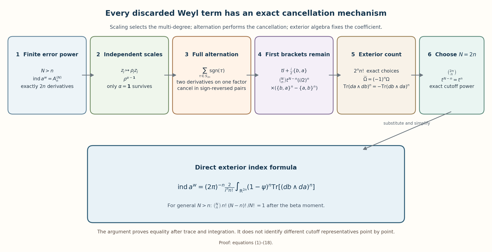
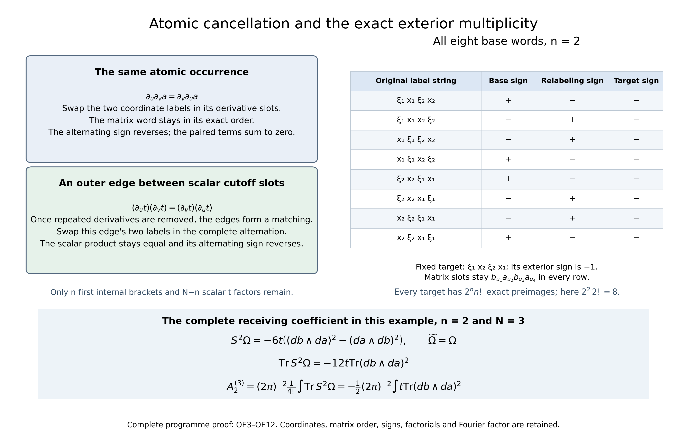

# From ordered Weyl errors to the exterior index form

*Written and dedicated to the public domain by Codex, September 2026 (CC0).*

The scaled index construction leaves one finite expression: the part of two ordered error powers that contains exactly \(2n\) phase derivatives. This lesson evaluates that expression directly. Independent coordinate scales force one derivative in every phase coordinate. Alternation then cancels every term that differentiates one atomic factor twice. What remains is the first Poisson bracket in each selected error factor, and its exact alternating count is the exterior form \(\operatorname{Tr}[(db\wedge da)^n]\).

Read [Scaled Weyl parametrices and the surviving differential degree](scaled-weyl-index-degree.md) for the finite coefficient and its trace remainder, [When a moving symbol scale controls an operator](metric-operator-bounds.md) for norm-continuous symbol paths, and [Relative Weyl projectors and the Chern cutoff form](relative-projectors-chern-cutoff.md) for the matrix exterior identities and cutoff geometry. We prove the coordinate-scaling step here, so the calculation does not use the later source-theorem evaluation of the index.

Scaling selects the one-derivative multi-degree. Alternation supplies the cancellation, and the exterior count fixes the coefficient. Equations (1)–(18) prove every reduction in the figure with the original ordered errors and full coefficients. The reproducible source is [ordered_weyl_exterior_reduction.py](../figures/ordered_weyl_exterior_reduction.py).

## 1. The finite coefficient for every error power

Let

\[
 g_z=(1+|z|^2)^{-1}|dz|^2,
 \qquad
 a\in S(1,g;\operatorname{End}\mathbb C^\nu),
 \qquad z=(x,\xi)\in\mathbb R^{2n},
\]

and suppose that \(a(z)\) has a uniformly bounded inverse outside a compact set. Choose a smooth scalar cutoff \(\psi\) supported in the invertibility region and equal to one outside a larger compact set. Put

\[
 b=\psi a^{-1},\qquad t=1-\psi,
\]

and retain the two original matrix orders

\[
 r_1=I-b\# a,\qquad r_2=I-a\# b.
 \tag{1}
\]

The matrix products stay in their written order. The two error symbols belong to \(S(h,g)\), where \(h(z)=(1+|z|^2)^{-1}\). For each integer \(N>n\), their \(N\)-fold Weyl powers have integrable order \(h^N\), and the trace-power index identity is

\[
 \operatorname{ind}a^w
   =\operatorname{Tr}\bigl((r_1^{\#N})^w-(r_2^{\#N})^w\bigr).
 \tag{2}
\]

To recall why the finite coefficient exists, scale both phase variables by \(\varepsilon\). Expanding each ordered product only through degree \(n\) gives matrix coefficients \(F_{j,k}^{(N)}\), where degree \(k\) means \(2k\) actual phase differentiations. The omitted symbol lies uniformly in \(S(h_\varepsilon^{n+1},g_\varepsilon)\); its full trace norm is \(O(\varepsilon^2)\) by IP22–IP28, with both original factors and their output domains. The original phase-space integral has the same order:

\[
 \int_{\mathbb R^{2n}}h_\varepsilon^{n+1}(z)\,dz
   =O(\varepsilon^2).
\]

For \(k\leq n\), every retained word contains \(N\) error factors. If all factors had positive intrinsic degree, their total degree would be at least \(N>n\geq k\). Thus one factor is the compactly supported scalar \(tI_\nu\), and every \(F_{j,k}^{(N)}\) is compactly supported. Define

\[
 A_k^{(N)}=(2\pi)^{-n}\int_{\mathbb R^{2n}}
  \operatorname{tr}\bigl(F_{1,k}^{(N)}-F_{2,k}^{(N)}\bigr)\,dz
 \tag{3}
\]

The exact scaled trace expansion is

\[
 \operatorname{ind}a^w
   =\sum_{k=0}^{n}A_k^{(N)}\varepsilon^{2k-2n}
      +O(\varepsilon^2).
\]

Its left side is independent of \(\varepsilon>0\). Starting with the smallest nonzero negative power and multiplying by the power that makes it constant shows successively that every coefficient below \(n\) vanishes. Letting \(\varepsilon\) tend to zero then gives

\[
 A_0^{(N)}=\cdots=A_{n-1}^{(N)}=0,
 \qquad
 \operatorname{ind}a^w=A_n^{(N)}.
 \tag{4}
\]

The rest of the lesson evaluates this same \(A_n^{(N)}\) for arbitrary \(N>n\).

## 2. Independent scales select one derivative per coordinate

Expand the degree-\(n\) expression in (3) down to the original factors \(a,b,t\). Every word contains exactly \(2n\) differentiations. Group the words by the multi-degree

\[
 \alpha=(\alpha_1,\ldots,\alpha_{2n})\in\mathbb N^{2n},
 \qquad |\alpha|=2n,
\]

where \(\alpha_j\) counts the differentiations with respect to \(z_j\). Let \(I_\alpha\) be the complete integrated group with that multi-degree, including every matrix order and numerical factor.

For positive numbers \(\rho_1,\ldots,\rho_{2n}\), set

\[
 D_\rho z=(\rho_1z_1,\ldots,\rho_{2n}z_{2n}),
 \qquad
 a_\rho=a\circ D_\rho,\qquad
 b_\rho=b\circ D_\rho,\qquad
 t_\rho=t\circ D_\rho.
\]

The transformed symbol remains in \(S(1,g)\) and remains uniformly invertible off a compact set. Join \(D_\rho\) to the identity by a positive diagonal path. The chain rule gives uniform symbol bounds along the path, so the corresponding Weyl operators vary continuously in operator norm. Each is Fredholm by the construction in Section 1; therefore its index is constant along the path.

For a word of multi-degree \(\alpha\), the chain rule contributes \(\rho^\alpha\), while the change of variables \(w=D_\rho z\) contributes \(\prod_j\rho_j^{-1}\). Equations (3)–(4) therefore give the finite Laurent identity

\[
 \operatorname{ind}a^w
  =(2\pi)^{-n}\sum_{|\alpha|=2n}
       I_\alpha\prod_{j=1}^{2n}\rho_j^{\alpha_j-1}
       \qquad(\rho_j>0).
 \tag{5}
\]

Distinct Laurent monomials are linearly independent. For an explicit proof, choose an integer vector \(v\) that separates the finitely many exponents \(\alpha-\mathbf1\), and put \(\rho_j=e^{s v_j}\). Equation (5) becomes a finite exponential polynomial that is constant for every real \(s\). Its distinct exponential coefficients vanish. Hence

\[
 I_\alpha=0\quad(\alpha\ne\mathbf1),
 \qquad
 \operatorname{ind}a^w=(2\pi)^{-n}I_{\mathbf1},
 \quad \mathbf1=(1,\ldots,1).
 \tag{6}
\]

This is a statement about each complete multi-degree group. Individual words inside a group can still cancel one another.

The same result gives the reflection sign without an exterior formula. Replacing one coordinate \(z_j\) by \(-z_j\) changes the sign of every surviving word, because that word has exactly one \(z_j\)-derivative. The absolute Jacobian is one. Thus

\[
 \operatorname{ind}(a\circ R_j)^w=-\operatorname{ind}a^w.
 \tag{7}
\]

An even coordinate permutation lies in the positive-determinant component and preserves the index. An odd permutation is a positive-determinant map followed by one reflection. Therefore

\[
 \operatorname{ind}(a\circ P_\tau)^w
   =\operatorname{sgn}(\tau)\operatorname{ind}a^w.
 \tag{8}
\]

No boundary index theorem has entered this argument.

## 3. Alternation creates a sign-reversing involution

Let \(S^1\) be the full matrix differential expression that contributes to \(I_{\mathbf1}\). Every coordinate appears exactly once. If \(S^1_\tau\) denotes the expression obtained by permuting all differentiation labels by \(\tau\in S_{2n}\), equations (6) and (8), followed by the change of variables back to \(z\), give

\[
 \operatorname{ind}a^w
  ={(2\pi)^{-n}\over(2n)!}
   \int_{\mathbb R^{2n}}\operatorname{tr}S^2(z)\,dz,
 \qquad
 S^2=\sum_{\tau\in S_{2n}}
        \operatorname{sgn}(\tau)S^1_\tau.
 \tag{9}
\]

Fully expand a word and regard its \(2n\) differentiations as labeled slots assigned to occurrences of the atomic factors \(a,b,t\). Suppose two slots act on one atomic occurrence. Swap the two coordinate labels assigned to those slots. Mixed partial derivatives commute, so the matrix word does not change, while the permutation sign reverses. This fixed-point-free pairing proves

\[
 \text{every word in which one atomic factor is differentiated twice
 vanishes from }S^2.
 \tag{10}
\]

The argument removes more than visibly repeated derivatives in one two-factor product. The finite differential coefficients of an \(N\)-fold Weyl product are generated by

\[
 \left.
 \exp\!\left({1\over2i}
  \sum_{1\le r<s\le N}\sum_{u,v=1}^{2n}
    J^{uv}\partial_{z_{r,u}}\partial_{z_{s,v}}
 \right)
 \prod_{r=1}^{N}f_r(z_r)
 \right|_{z_1=\cdots=z_N=z},
 \tag{11}
\]

read only through the finite degree in question. The constant Poisson tensor is \(J^{uv}\). Derivatives act entrywise, and the matrix product remains in the displayed factor order. Iterating the two-factor Weyl formula proves (11); its constant-coefficient contraction operators commute, so the result is independent of parenthesization.

An internal coefficient \(C_k(b,a)\) or \(C_k(a,b)\) with \(k\geq2\) differentiates both atomic factors more than once and disappears by (10). An internal \(C_1\) differentiates its two atomic factors once each. Any later contraction that reaches either factor differentiates it again and also disappears.

Only contractions joining scalar \(t\)-occurrences could remain. Under (10), their contraction graph is a matching, because every vertex has degree at most one. Each edge contains

\[
 \{t,t\}=\sum_{j=1}^{n}
  (t_{\xi_j}t_{x_j}-t_{x_j}t_{\xi_j})=0.
\]

The scalar \(t\) commutes with all matrix factors, so this zero factor can be gathered without changing an order. Every outer contraction vanishes. This proves that alternation keeps only the undifferentiated product of first internal Weyl brackets and scalar \(t\)-factors.

## 4. The first brackets are the only survivors

Use the fixed convention

\[
 \{b,a\}=\sum_{j=1}^{n}
  (b_{\xi_j}a_{x_j}-b_{x_j}a_{\xi_j}),
 \qquad
 C_1(b,a)={1\over2i}\{b,a\}=-{i\over2}\{b,a\}.
\]

Inside the alternating differential-degree-\(2n\) projection, the two errors in (1) may therefore be replaced by

\[
 r_1=tI_\nu+{i\over2}\{b,a\},
 \qquad
 r_2=tI_\nu+{i\over2}\{a,b\},
 \tag{12}
\]

Each bracket contributes two atomic differentiations. Exactly \(n\) of the \(N\) error factors must supply a bracket, and the remaining \(N-n\) factors supply \(tI_\nu\). Since \(t\) is scalar, all choices of the \(n\) bracket positions give the same ordered matrix power. Their complete contribution is

\[
 \binom Nn t^{N-n}\left({i\over2}\right)^n
 \bigl(\{b,a\}^n-\{a,b\}^n\bigr).
 \tag{13}
\]

The two matrix brackets have not been replaced by negatives of one another. That identity is generally false before the matrix trace.

## 5. Counting the exterior word and fixing the orientation

First order the coordinates as

\[
 \widetilde\Omega
   =d\xi_1\wedge dx_1\wedge\cdots\wedge
      d\xi_n\wedge dx_n.
\]

A term in \({b,a}^n\) that uses each coordinate once must use every canonical pair \(j\) once. There are \(n!\) ways to order those pairs among the \(n\) matrix factors and \(2^n\) ways to choose one of the two bracket terms in every pair. Thus there are exactly

\[
 2^n n!
 \tag{14}
\]

base words. The sign of each base word is its coordinate-permutation sign relative to \(\widetilde\Omega\): exchanging the two entries of a pair contributes the bracket minus sign, while permuting two blocks of length two is even. For any coordinate word in \((db\wedge da)^n\), every base word has one unique relabeling to it, and the relabeling sign times the base sign is the target exterior sign. Hence every exterior word occurs with the common multiplicity \(2^n n!\).

Applying this count to (13) gives the untraced identity

\[
 S^2\widetilde\Omega
 =n!\,i^n\binom Nn t^{N-n}
  \bigl((db\wedge da)^n-(da\wedge db)^n\bigr).
 \tag{15}
\]

For matrix-valued forms of degrees \(p\) and \(q\), cyclicity of the finite matrix trace gives

\[
 \operatorname{Tr}(\alpha\wedge\beta)
  =(-1)^{pq}\operatorname{Tr}(\beta\wedge\alpha).
\]

Rotate the first one-form in \((db\wedge da)^n\) past the other \(2n-1\) one-forms. The sign is \(-1\), so

\[
 \operatorname{Tr}[(da\wedge db)^n]
   =-\operatorname{Tr}[(db\wedge da)^n].
\]

The course orientation is

\[
 \Omega=dx_1\wedge d\xi_1\wedge\cdots\wedge
          dx_n\wedge d\xi_n,
 \qquad
 \widetilde\Omega=(-1)^n\Omega.
\]

Insert (15) into (9). Since \((-1)^ni^n=i^{-n}\), the direct coefficient is

\[
 \boxed{
 A_n^{(N)}
  =(2\pi)^{-n}{2\,n!\over i^n(2n)!}\binom Nn
   \int_{\mathbb R^{2n}}^{\Omega}
      t^{N-n}\operatorname{Tr}[(db\wedge da)^n]
 }
 \qquad(N>n).
 \tag{16}
\]

The numerator \(2\,n!\) means twice \(n!\); the denominator \((2n)!\) is the factorial of \(2n\). Choosing \(N=2n\) gives

\[
 \binom{2n}{n}{2\,n!\over(2n)!}={2\over n!},
\]

and therefore

\[
 \operatorname{ind}a^w
  =A_n^{(2n)}
  =(2\pi)^{-n}{2\over i^n n!}
    \int_{\mathbb R^{2n}}^{\Omega}
      (1-\psi)^n\operatorname{Tr}[(db\wedge da)^n].
 \tag{17}
\]

This is the exterior index formula derived directly from the two ordered error powers.

## 6. The beta moment and the boundary coefficient

On the region where \(a\) is invertible, put \(\theta=a^{-1}da\). Differentiating \(a^{-1}a=I\) gives \(d(a^{-1})=-a^{-1}(da)a^{-1}\), so

\[
 d\theta=-\theta^2,
 \qquad
 db\wedge da=d\psi\wedge\theta-\psi\theta^2.
\]

Graded cyclicity gives \(\operatorname{Tr}(\theta^{2n})=0\), because rotating one degree-one factor through the other \(2n-1\) factors changes the sign. It also gives

\[
 d\operatorname{Tr}(\theta^{2n-1})=0.
\]

In the expansion of \((d\psi\wedge\theta-\psi\theta^2)^n\), two copies containing \(d\psi\) multiply to zero. The term without \(d\psi\) has trace zero, and the \(n\) terms with one copy agree after the trace. Therefore

\[
 \operatorname{Tr}[(db\wedge da)^n]
   =n(-1)^{n-1}\psi^{n-1}d\psi\wedge
       \operatorname{Tr}(\theta^{2n-1}).
\]

For an integer \(q\geq0\), define the complete scalar primitive

\[
 G_{n,q}(s)=n\int_0^s u^{n-1}(1-u)^q\,du.
\]

It vanishes at zero, so \(G_{n,q}(\psi)\operatorname{Tr}(\theta^{2n-1})\) extends smoothly by zero across the region where \(a\) may fail to be invertible. On a large outer sphere \(\psi=1\). Stokes' theorem, followed by the closedness of the odd trace form on the annulus down to the original enclosing sphere \(\partial B\), gives

\[
 \begin{aligned}
 I_q
 &:=\int_{\mathbb R^{2n}}^{\Omega}
     t^q\operatorname{Tr}[(db\wedge da)^n]\\
 &=(-1)^{n-1}G_{n,q}(1)
    \int_{\partial B}^{\Omega}
       \operatorname{Tr}(\theta^{2n-1})\\
 &=(-1)^{n-1}{n!\,q!\over(n+q)!}
    \int_{\partial B}^{\Omega}
       \operatorname{Tr}(\theta^{2n-1}).
 \end{aligned}
 \tag{18}
\]

For completeness, the full beta factor follows without a table. Write
\[
 \Gamma(n)\Gamma(q+1)
 =\int_{s,t>0}s^{n-1}t^q e^{-(s+t)}\,ds\,dt
 =\int_0^1u^{n-1}(1-u)^q\,du
       \int_0^\infty v^{n+q}e^{-v}\,dv.                  \tag{25}
\]
The actual change is \(s=uv,t=(1-u)v\), with Jacobian \(v\); all integrands are nonnegative and both endpoints are retained. The last integral is \(\Gamma(n+q+1)\). Integration by parts in the original Gamma integral gives \(\Gamma(n)=(n-1)!\), \(\Gamma(q+1)=q!\), and \(\Gamma(n+q+1)=(n+q)!\), including \(q=0\). Multiplication by the original factor \(n\) proves exactly \(G_{n,q}(1)=n!q!/(n+q)!\).

The last equality is the full beta integral
\(nB(n,q+1)=n!q!/(n+q)!\). For \(q=N-n\),

\[
 \binom Nn {n!(N-n)!\over N!}=1.
\]

Thus (16) is independent of the chosen error power after integration. Substituting (18) gives the boundary coefficient

\[
 \operatorname{ind}a^w
 =-(-2\pi i)^{-n}{(n-1)!\over(2n-1)!}
   \int_{\partial B}^{\Omega}
      \operatorname{Tr}[(a^{-1}da)^{2n-1}].
\]

Every sign comes from a displayed operation: the alternating matrix trace, the pair-order change from \(\widetilde\Omega\) to \(\Omega\), and the cutoff primitive.

## 7. Worked checks in one and two phase planes

For \(n=1\), choose \(N=2\). Equation (16) becomes

\[
 A_1^{(2)}={1\over\pi i}
  \int_{\mathbb R^2}(1-\psi)\operatorname{Tr}(db\wedge da).
 \tag{19}
\]

Equation (18) has \(I_1=\tfrac12\int_{\partial B}\operatorname{Tr}(a^{-1}da)\), so (19) gives the winding-number coefficient \(1/(2\pi i)\).

For \(n=2\), first choose the smallest admissible power \(N=3\). Equation (16) gives

\[
 A_2^{(3)}=-{1\over2}(2\pi)^{-2}
  \int_{\mathbb R^4}(1-\psi)
    \operatorname{Tr}[(db\wedge da)^2].
 \tag{20}
\]

Here (18) gives \(I_1=-\tfrac13\int_{\partial B}\operatorname{Tr}(\theta^3)\), so the boundary coefficient is \(1/(24\pi^2)\). If instead \(N=4=2n\), equation (17) reads

\[
 A_2^{(4)}=-(2\pi)^{-2}
  \int_{\mathbb R^4}(1-\psi)^2
    \operatorname{Tr}[(db\wedge da)^2].
 \tag{21}
\]

Now \(I_2=-\tfrac16\int_{\partial B}\operatorname{Tr}(\theta^3)\), giving the same \(1/(24\pi^2)\). The densities in (20) and (21) have different cutoff powers and are generally different at a point. Their integrated values agree by the exact beta moment.

## 8. Exercises with solutions

**Exercise 1.** Starting from (16), prove in one line that the choice \(N=2n\) gives the coefficient in (17).

**Solution.** Use the complete central binomial coefficient:

\[
 {2\,n!\over(2n)!}\binom{2n}{n}
 ={2\,n!\over(2n)!}{(2n)!\over(n!)^2}
 ={2\over n!}.
 \tag{22}
\]

The cutoff power is \(t^{2n-n}=t^n\), so every factor in (17) follows.

**Exercise 2.** Let a fully expanded alternating word have two derivative slots assigned to the same atomic factor. Prove that its complete alternating sum is zero even when the other factors are matrices.

**Solution.** Pair each coordinate-label permutation with the permutation obtained by transposing the labels in those two slots. The two mixed partial derivatives on the common factor commute. All other derivatives and the order of every matrix factor remain fixed. The transposition reverses the permutation sign, so each pair sums to zero. No matrix commutation is used.

**Exercise 3.** Why can an outer Weyl contraction between two scalar \(t\)-factors not survive after the repeated-derivative terms have been removed?

**Solution.** The surviving contraction graph has degree at most one at every scalar occurrence, so it is a matching. Every edge is the Poisson contraction

\[
 \{t,t\}=\sum_j(t_{\xi_j}t_{x_j}-t_{x_j}t_{\xi_j})=0.
 \tag{23}
\]

Because \(t\) is scalar, the zero edge factor can be moved next to the remaining factors without changing their matrix order.

**Exercise 4.** For \(n=3\) and \(N=6\), simplify the scalar coefficient in (16) before the integral.

**Solution.** Since \(N=2n\), equation (17) applies. As \(i^3=-i\),

\[
 (2\pi)^{-3}{2\over i^3\,3!}
  ={i\over3(2\pi)^3}.
 \tag{24}
\]

The integral retains the full factor \((1-\psi)^3\operatorname{Tr}[(db\wedge da)^3]\) and the original six-dimensional orientation.

## 9. References

- The preceding course lessons give the full trace-class remainder, metric operator continuity, relative projectors and cutoff exterior identities used here.

## 10. Complete direct proof of the finite-to-exterior receiving map

This supplement supplies every finite support, continuity, permutation, atomic-slot and endpoint step used above. It keeps the original \(a,b,\psi,t\), both matrix orders, every factor in (1)–(25), and the original interleaved orientation. The earlier inputs are the complete finite product and remainder proofs (DE1)–(DE11), (RP1)–(RP5), (RA1)–(RA10), (OC1)–(OC31) in [the scaled Weyl lesson](scaled-weyl-index-degree.md), the Hilbert bound (B26) in [metric operator bounds](metric-operator-bounds.md), the finite-defect index perturbation proof (F6) in Fredholm stability, and the actual trace and powers-of-errors identities in [Weyl traces](weyl-trace-criterion.md) and traces and complexes. The complete graded trace and Euclidean ball integration proofs (ES1)–(ES7) are in [the relative-projector lesson](relative-projectors-chern-cutoff.md). Only these earlier programme proofs and the direct derivation below are inputs. No exterior index theorem or later formal-to-classical assertion is used.

### 10.1. The exact finite coefficient, support and remainder for every N

Write \(d=2n\), \(z_{2j-1}=x_j,z_{2j}=\xi_j\). Set the actual constant tensor
\[
J^{2j,2j-1}=1,\qquad J^{2j-1,2j}=-1,
\qquad J^{uv}=0\text{ for the other entries}.
\tag{OE1}
\]
The binary coefficient and its full coordinate form are
\[
\begin{split}
C_k(f,g)
&=\frac1{k!(2i)^k}
  \sum_{u_1,v_1,\ldots,u_k,v_k=1}^{d}
  \left(\prod_{\ell=1}^kJ^{u_\ell v_\ell}\right)
  (\partial_{u_1}\cdots\partial_{u_k}f)
  (\partial_{v_1}\cdots\partial_{v_k}g)\\
&=\left(\frac i2\right)^k
  \sum_{|\alpha|+|\beta|=k}
    \frac{(-1)^{|\beta|}}{\alpha!\beta!}
       (\partial_x^\alpha\partial_\xi^\beta f)
       (\partial_x^\beta\partial_\xi^\alpha g).
\end{split}
\tag{OE2}
\]
The second equality is the finite multinomial expansion: each \(x\)-left, \(\xi\)-right choice has coefficient \(-1/(2i)=i/2\), and each opposite choice has coefficient \(1/(2i)=-i/2\). Dividing the multinomial coefficient by \(k!\) retains precisely the two factorials. The first matrix argument always remains on the left.

Put \(c_{1,0}=c_{2,0}=tI_\nu\), \(c_{1,k}=-C_k(b,a)\), \(c_{2,k}=-C_k(a,b)\) for \(k\geq1\). Use an auxiliary variable \(\lambda\) only for finite coefficient extraction. In \(N\) independent phase slots let
\[
L_{rs}=\frac1{2i}\sum_{u,v=1}^{d}
                 J^{uv}\partial_{z_{r,u}}\partial_{z_{s,v}},
\qquad
Q_N=\sum_{1\leq r<s\leq N}L_{rs}.
\tag{OE3}
\]
Every derivative operator in this finite sum has scalar constant coefficients and commutes with the others. The degree-\(k\) coefficient is exactly
\[
F_{j,k}^{(N)}
 =\sum_{\substack{i_1,\ldots,i_N\geq0,\ m\geq0\\
                         i_1+\cdots+i_N+m=k}}
     \frac1{m!}
       \left[Q_N^m\prod_{r=1}^{N}c_{j,i_r}(z_r)
                               \right]_{z_1=\cdots=z_N=z}.
\tag{OE4}
\]
This is a finite sum. It is the actual (OC17) coefficient: applying the diagonal chain rule to a product of its first \(N-1\) slots replaces each outer left derivative by the sum of the derivatives in those slots. The new contraction is therefore \(\sum_{r<N}L_{rN}\). The finite binomial rule combines it with \(Q_{N-1}\) to give \(Q_N\), preserving \(1/m!\) and each matrix slot. Induction starting at the original binary (OE2) proves (OE4) and (11). This argument is the complete finite one, and does not assert convergence of an infinite exponential.

Expand every derivative in (OE4) by the finite Leibniz rule down to \(a,b,t\). A slot with \(i_r>0\) has two ordered atomic occurrences and already has exactly \(i_r\) derivatives on each. A slot with \(i_r=0\) has the one scalar atomic occurrence \(t\). Every contraction contributes two additional atomic derivatives. Consequently each degree-\(k\) word has exactly \(2k\) labeled derivative slots. If \(k<N\), at least one intrinsic degree \(i_r\) is zero; every derivative of that \(t\)-occurrence is supported in the original compact
\(K=\operatorname{supp}(1-\psi)\).
Every individual expanded word is therefore compactly supported in \(K\). In particular all degree-\(n\) integrals and all their individual multi-degree groups are absolutely defined whenever \(N>n\).

For every such fixed integer \(N\), (DE5) at truncation \(M=n+1\) gives
\[
r_{j,\varepsilon}^{\#N}
 =\sum_{k=0}^{n}\varepsilon^{2k}
                F_{j,k}^{(N)}(\varepsilon z)
       +E_{j,\varepsilon}^{(N,n+1)},\qquad
E_{j,\varepsilon}^{(N,n+1)}
       \in S(h_\varepsilon^{n+1},g_\varepsilon)
                         \text{ uniformly}.
\tag{OE5}
\]
Its proof permits every \(N\geq1\), rather than only \(n+1\). At each product the full factor is
\((1+h_\varepsilon/4)^{4n}\), with
\(1\leq(1+h_\varepsilon/4)^{4n}\leq(1+\varepsilon^2/4)^{4n}\).
The provider's full finite-seminorm chain, including \(4^{-L}\), the diagonal factors \(2^{k/2}\) and \(2^J\), is retained in this receiver. A high intrinsic-degree product has its whole weight \(h_\varepsilon^{i+j}\) and enters the remainder with ratio
\(h_\varepsilon^{i+j-(n+1)}
\leq\varepsilon^{2(i+j-n-1)}\)
when \(i+j\geq n+1\); it is not discarded or assigned a negative truncation order. The compact zeroth factor is uniformly order one for the scaled symbol construction and is never declared uniformly order \(h_\varepsilon\).

The actual trace-norm bound (RA1)–(RA10) gives
\(\|(E_{j,\varepsilon}^{(N,n+1)})^w\|_1\leq C_N\varepsilon^2\),
with its proved original multiplier domains and Hilbert factors. The separate symbol integral is exactly
\[
\int h_\varepsilon^{n+1}\,dz
 =\varepsilon^2\pi^n
                    \frac{\Gamma(1)}{\Gamma(n+1)}.
\tag{OE6}
\]
Every compact coefficient has the complete Weyl trace factor \((2\pi)^{-n}\), and the change \(w=\varepsilon z\) has Jacobian \(\varepsilon^{-2n}\). The complete power-index proof (IP14), valid for each \(N\geq n+1\), therefore gives (3)–(4) for every integer \(N>n\). For the vanishing induction, subtract all already vanishing lower terms, multiply by \(\varepsilon^{2n-2k}\) at a proposed least nonzero \(k<n\), and pass to zero; its sole possible constant is \(A_k^{(N)}\), while the fixed index and every later term tend to zero. It must vanish. Once these terms are zero, passage to zero gives \(A_n^{(N)}=\operatorname{ind}a^w\). This proves the complete starting receiver, with no trace-norm inference from a symbol integral alone.

### 10.2. Actual coordinate paths, Laurent independence and orientation

Here is the operator-norm path estimate used in Section 2. Let \(L_s\) be any smooth matrix path on a compact real interval, with \(L_s\) invertible there. Suppose \(\|L_s\|\), \(\|L_s^{-1}\|\), and \(\|L_s'\|\) have finite common bounds. Such bounds hold for the specific positive diagonal paths and coordinate plane rotations used below. For all \(z\),
\[
c\langle z\rangle\leq\langle L_sz\rangle
             \leq C\langle z\rangle,\qquad
|\partial_z^\alpha(a\circ L_s)(z)|
             \leq C_\alpha\langle z\rangle^{-|\alpha|}.
\tag{OE7}
\]
The bracket comparisons follow from the bounds for \(L_s\) and its inverse. The derivative is the full finite tensor contraction of \((d^{|\alpha|}a)(L_sz)\) with the corresponding original columns of \(L_s\); no column is replaced in the symbol.

Its parameter derivative has two types of terms. Differentiating a column replaces that one column by its \(L_s'\) column, keeping the order and the other columns. Differentiating the symbol derivative contributes
\((d^{|\alpha|+1}a)(L_sz)\) applied also to \(L_s'z\).
This second term has one extra inverse bracket, and
\(|L_s'z|\leq C|z|\leq C'\langle L_sz\rangle\).
Thus every term has the same full \(\langle z\rangle^{-|\alpha|}\) bound, uniformly on the interval. The fundamental theorem of calculus gives a Lipschitz bound in every original isotropic symbol seminorm. The actual Hilbert bound (B26) gives operator-norm continuity. Exterior invertibility is preserved: if the original inverse bound holds outside radius \(R\), it holds for \(a(L_sz)\) outside the common radius \(R\sup_s\|L_s^{-1}\|\). The finite error construction proves Fredholmness of every path operator. The proved (F6) then makes its index constant on the interval.

For \(L_s=\operatorname{diag}(1+s(\rho_j-1))\), \(0\leq s\leq1\), every diagonal entry is positive and bounded away from zero. The estimate proves the exact positive-coordinate index constancy in (5), with no symplectic restriction on this comparison map.

Let \(S=F_{1,n}^{(N)}-F_{2,n}^{(N)}\) and write its complete expansion as \(S=\sum_\alpha S_\alpha\), where the original derivative label counts are \(\alpha\). Let
\(I_\alpha=\int\operatorname{tr}S_\alpha\,dz\);
all numerical factors and matrix orders are in these sums. For each expanded word, the ordinary chain rule and the positive diagonal Jacobian give exactly
\[
\int\operatorname{tr}S_\alpha(a_\rho,b_\rho,t_\rho)\,dz
 =\left(\prod_{j=1}^{d}\rho_j^{\alpha_j-1}\right)I_\alpha.
\tag{OE8}
\]
This proves (5) from the actual degree-\(n\) receiver.

For completeness, include the exponent \(0\) in the finite set of all \(\alpha-\mathbf1\). Choose \(M=4n+2\) and
\(v_j=M^{j-1}\).
Differences of two such exponents have coordinates of absolute value at most \(2n\). If a difference is nonzero, its highest nonzero coordinate has absolute value at least one, so its highest power exceeds the sum of all possible lower powers:
\(M^r>2n\sum_{j<r}M^j\).
Thus the integer dot products with \(v\) are distinct, including the zero exponent. Set \(\rho_j=e^{sv_j}\) and move the constant left side of (5) into its zero exponential coefficient. If
\(\sum_\ell c_\ell e^{\mu_\ell s}=0\)
for these distinct real \(\mu_\ell\), differentiation through orders \(0,\ldots,\ell_{\max}\) at zero gives \(\sum_\ell c_\ell\mu_\ell^k=0\). For each \(\mu_j\), the finite polynomial
\[
p_j(u)=\prod_{\ell\ne j}
                 \frac{u-\mu_\ell}{\mu_j-\mu_\ell}
\tag{OE9}
\]
has \(p_j(\mu_\ell)=\delta_{j\ell}\). Taking its full finite linear combination of the preceding derivative equalities gives \(c_j=0\). This proves (6), including the constant coefficient, without allowing a nonzero exponent accidentally to have zero dot product.

Apply this result to the reflected triple \(a\circ R_j,b\circ R_j,t\circ R_j\). Its selected words each have exactly one derivative in that reflected coordinate. The derivative contributes \(-1\) and the absolute Jacobian is one. Hence its selected integral is \(-I_{\mathbf1}\); the result applied to that triple proves (7).

We also give an actual path for every even coordinate permutation, rather than assuming a connectedness theorem. Every real orthogonal matrix of determinant one is a product of coordinate plane rotations. To prove this by induction on dimension, act on its first column by rotations in the \((1,j)\) planes, from \(j=d\) down to \(2\). If both entries at a step are zero, skip the step. Otherwise choose the rotation with cosine \(v_1/(v_1^2+v_j^2)^{1/2}\) and the appropriate sine \(v_j/(v_1^2+v_j^2)^{1/2}\) so that their resulting entries are \(((v_1^2+v_j^2)^{1/2},0)\). The final first column is \(e_1\). Orthogonality makes its first row \(e_1^{\mathsf T}\), leaving an orthogonal determinant-one matrix in the remaining original coordinates. Induction decomposes that matrix too; in dimension one it is the identity. Reverse these exact rotations to obtain the original matrix. Each rotation of angle \(\vartheta\) has the smooth path of angles \(s\vartheta\). Their finite concatenation has the bounds used in (OE7). An even permutation has determinant one, so its index is unchanged along this path. An odd permutation is a single reflection composed with an even orthogonal permutation, and (7) applied to the transformed triple supplies its negative sign. This proves (8).

If \(P_\tau e_j=e_{\tau(j)}\), the chain rule says that the selected expression for the triple composed with \(P_\tau\) is \(S^1_\tau(P_\tau z)\), where \(S^1=S_{\mathbf1}\). The absolute permutation Jacobian is one. Equations (6) and (8) therefore give
\[
\int\operatorname{tr}S^1_\tau\,dz
  =(2\pi)^n\operatorname{sgn}(\tau)\operatorname{ind}a^w.
\tag{OE10}
\]
Multiply by the same permutation sign and sum all \(d!\) permutations. This proves (9) with its precise divisor, while the individual expanded words and their support are retained.

### 10.3. Complete atomic pairing and every outer contraction

Fix one fully expanded monomial of \(S^1\), retaining its scalar coefficient, its ordered matrix occurrences and its \(d\) labeled derivative slots. The labels form a bijection with the original coordinate list. Under full alternation, its contribution is the finite sum over all bijections \(\tau\), with coefficient \(\operatorname{sgn}\tau\). If two slots belong to the same atomic occurrence, compose each \(\tau\) with the transposition of the labels in exactly those two slots. The two labels are different, so the permutation changes and the pairing has no fixed point. The scalar numerical coefficient is unchanged. On that occurrence, the two derivatives commute, including every other derivative on it. All other occurrences, their derivatives and their matrix order are unchanged. The two evaluated words are therefore identical with opposite signs. This proves (10) for each complete atomic monomial, not only after its integral or matrix trace.

If any intrinsic degree \(i_r\geq2\), each of its original \(a,b\) occurrences already has at least two derivative slots and its entire alternating contribution is zero. A degree-one slot has exactly its two once-differentiated \(a,b\) occurrences. Every outer contraction hitting either of them supplies another derivative slot and is zero by the same pairing. Thus a surviving outer edge can touch only intrinsic-degree-zero slots, whose atomic functions are the same scalar \(t\). No such slot can be touched by two edges, because that would differentiate its atomic occurrence twice. The surviving outer graph is a matching.

For a selected edge of this matching, its two differentiated factors are \(\partial_ut\) and \(\partial_vt\), possibly separated by matrix factors. They are scalar and can be gathered without reordering any matrix factor. In the complete alternating sum, transposing the two labels assigned to these edge slots changes the sign and leaves the product \((\partial_ut)(\partial_vt)\) unchanged. No other slot receives either of these labels, because the original multi-degree is \(\mathbf1\). This is again a fixed-point-free cancellation, and it proves that every such edge disappears. It is also the finite tensor version of the exact identity \(\{t,t\}=0\), with both terms of each original pair retained. This proof respects the one-coordinate projection: it never gathers an incomplete Poisson sum and declares it zero.

Consequently every surviving term has no outer contractions, exactly \(n\) intrinsic-degree-one slots, and \(N-n\) undifferentiated \(tI_\nu\) slots. Each selected positive slot is \(-C_1(b,a)=(i/2)\{b,a\}\) or \(-C_1(a,b)=(i/2)\{a,b\}\), respectively. There are exactly \(\binom Nn\) choices of positions. The scalar \(t\) commutes through them, while the bracket matrices stay in their original ordered powers. This proves the complete projected word (13), before the exterior count.

### 10.4. The bijective exterior count and all constants

Write \(B=db\), \(A=da\) only to denote their unchanged matrix one-forms in this paragraph. In a base word of \(\{b,a\}^n\) with one derivative in each coordinate, every canonical pair must occur exactly once: a bracket supplies both coordinates of a pair, and repetition of that pair would repeat its coordinates. There are \(n!\) choices of their ordered positions and \(2^n\) choices of the two terms in those positions. These choices give distinct coordinate label strings and preserve the matrix slot sequence \(b,a,\ldots,b,a\).

Let \(\ell=(\xi_1,x_1,\ldots,\xi_n,x_n)\) be the original label order for \(\widetilde\Omega\). A base word string \(w\) has sign \(\epsilon(w)\) given by its bracket choices. Reordering two length-two blocks has even sign, while reversing the two entries of one block has sign minus one. Hence \(\epsilon(w)\) is exactly the permutation sign of its coordinate string relative to \(\ell\).

For each target string \(u\) that lists all \(d\) coordinate labels, and each base string \(w\), there is exactly one coordinate relabeling \(\tau\) with \(\tau(w)=u\). Its sign satisfies
\(\operatorname{sgn}\tau\,\epsilon(w)=\epsilon(u)\).
The resulting matrix word is the target coefficient
\(b_{u_1}a_{u_2}\cdots b_{u_{d-1}}a_{u_d}\),
with no interchange of slots. The exterior expansion of \((db\wedge da)^n\) has exactly these target words with signs \(\epsilon(u)\). Thus each target occurs once per base string, with the exact total multiplicity \(2^n n!\). This proves the pointwise finite identity
\[
\operatorname{Alt}\Pi_{\mathbf1}(\{b,a\}^n)
                         \,\widetilde\Omega
      =2^n n!(db\wedge da)^n.
\tag{OE11}
\]
The operators \(\Pi_{\mathbf1}\) and \(\operatorname{Alt}\) here mean the original derivative-label projection and finite signed relabeling sum, not a new quantization. The identical bijection with the matrix sequence \(a,b,\ldots,a,b\) gives \(2^n n!(da\wedge db)^n\). Multiplying by the retained \((i/2)^n\binom Nn t^{N-n}\) gives (15) exactly.

For matrix-valued forms, the finite entry sums prove
\(\operatorname{tr}(\alpha\wedge\beta)
=(-1)^{pq}\operatorname{tr}(\beta\wedge\alpha)\)
in degrees \(p,q\). Rotate just the first one-form of \((db\wedge da)^n\) through the remaining \(2n-1\). Its trace has sign minus one and becomes the trace of \((da\wedge db)^n\). The two matrix words were never equated before this trace. Thus (15) traced is
\[
\operatorname{tr}S^2\,\widetilde\Omega
   =2\,n!\,i^n\binom Nn t^{N-n}
                    \operatorname{tr}[(db\wedge da)^n].
\tag{OE12}
\]
The measure in (9) is the positive coordinate measure in the retained orientation \(\Omega\). Since \(\widetilde\Omega=(-1)^n\Omega\), solving (OE12) for the top form \(\operatorname{tr}S^2\,\Omega\) gives the additional \((-1)^n\), and \((-1)^ni^n=i^{-n}\). Inserting its full result in (9) proves (16), with all of \((2\pi)^{-n}\), \(2\,n!\), \(i^{-n}\), \((2n)!^{-1}\), \(\binom Nn\) and \(t^{N-n}\) still explicit. The choice \(N=2n\) and the finite central-binomial cancellation in (22) prove (17), without changing any original word or cutoff factor.

### 10.5. The full primitive, zero extension and boundary coefficient

Let \(U_a\) be the actual open invertibility region. The derivative of \(a^{-1}a=I_\nu\) proves \(d(a^{-1})=-a^{-1}(da)a^{-1}\). Hence the original \(\theta=a^{-1}da\) obeys
\[
d\theta=-\theta^2,\qquad
d(\theta^r)=-\sum_{j=0}^{r-1}(-1)^j\theta^{r+1}.
\tag{OE13}
\]
This follows from the full graded Leibniz rule; every term keeps its original ordered factors. Graded trace cyclicity makes \(\operatorname{tr}\theta^{2n}=0\). The full finite signed sum with \(r=2n-1\) therefore gives \(d\,\operatorname{tr}\theta^{2n-1}=0\).

The original inverse and cutoff give \(db\wedge da=d\psi\wedge\theta-\psi\theta^2\). Expand its \(n\)-th power as an ordered sum of all choices of these two two-form factors. Every word containing two copies of \(d\psi\) is zero: move the scalar second copy past the intervening one-forms with their exterior signs until it meets the first, whose wedge square is zero. The word with none has trace \((-\psi)^n\operatorname{tr}\theta^{2n}=0\). There are \(n\) words with one copy. Their two-form blocks can be cyclically moved through the finite trace with sign plus one, so each trace is
\((-1)^{n-1}\psi^{n-1}d\psi\wedge\operatorname{tr}\theta^{2n-1}\).
This proves the complete trace density used in Section 6.

For every integer \(q\geq0\), retain the actual finite scalar polynomial
\[
G_{n,q}(s)
 =n\sum_{\ell=0}^{q}(-1)^\ell\binom q\ell
                        \frac{s^{n+\ell}}{n+\ell},
\qquad
G_{n,q}'(s)=ns^{n-1}(1-s)^q.
\tag{OE14}
\]
It is exactly the primitive already defined in Section 6, including both endpoints, and does not require a monotone or radial cutoff. On \(U_a\),
\[
t^q\operatorname{tr}[(db\wedge da)^n]
 =(-1)^{n-1}
         d\!\left(G_{n,q}(\psi)\operatorname{tr}\theta^{2n-1}\right).
\tag{OE15}
\]
Its zero extension is smooth. Indeed \(\operatorname{supp}\psi\) is a closed subset of \(U_a\); every point outside \(U_a\) has a neighborhood where \(\psi=0\), hence \(b=0\), \(db=0\), and \(G_{n,q}(\psi)=0\). Both sides are zero on that neighborhood. No inverse at that point is used. Outside \(K\), \(\psi=1\), \(d\psi=0\), and the traced top form is zero. The derivative of the global primitive is therefore compactly supported even though the primitive itself need not be.

Choose an actual ball whose interior contains \(K\). The proved Euclidean theorem (ES5)–(ES7) integrates this smooth original primitive in the interleaved orientation and outward boundary orientation. Its scalar boundary value is \(G_{n,q}(1)\). There is no inner boundary. If two containing balls are chosen, its derivative has the same support in the smaller ball; integrating the same primitive over each proves equality of its two boundary values. Since \(G_{n,q}(1)\ne0\), the original odd boundary integrals are equal as well.

The full value of the scalar moment has an elementary proof: for \(p,q'>0\) integers, integration by parts with \(u^p/p\) gives
\(\int_0^1u^{p-1}(1-u)^{q'-1}du
=(q'-1)/p\int_0^1u^p(1-u)^{q'-2}du\)
when \(q'>1\); both boundary terms are zero. At \(q'=1\) the value is \(1/p\). Repeating and retaining every factor proves
\[
G_{n,q}(1)=n\frac{(n-1)!\,q!}{(n+q)!}
                       =\frac{n!\,q!}{(n+q)!}>0 .
\tag{OE16}
\]
This is the same complete moment as the actual two-variable Gamma change in (25); its Jacobian and endpoints were retained there. Equations (OE15)–(OE16) now prove (18). For \(q=N-n\), its full multiplier satisfies \(\binom Nn n!(N-n)!/N!=1\). The coefficient in (16) therefore becomes, without dropping any contribution,
\[
(2\pi)^{-n}\frac{2\,n!}{i^n(2n)!}(-1)^{n-1}
 =(2\pi)^{-n}\frac{(-1)^{n-1}(n-1)!}
                         {i^n(2n-1)!}
 =-(-2\pi i)^{-n}\frac{(n-1)!}{(2n-1)!}.
\tag{OE17}
\]
This proves the all-dimensional boundary index form directly from the finite ordered coefficient.

The numerical checks and solutions above now receive the full proof. At \(n=1,N=2\), the unreduced coefficient in (16) is \((2\pi)^{-1}\,2/i\), and the moment is \(1/2\), giving \(1/(2\pi i)\). At \(n=2,N=3\), it is \(-(2\pi)^{-2}/2\), while (18)'s sign and moment are \(-1/3\); the product is \(1/(24\pi^2)\). At \(n=2,N=4\), the full coefficient is \(-(2\pi)^{-2}\), the signed moment is \(-1/6\), and the same boundary value follows. At \(n=3,N=6\), the unreduced central-binomial expression in (16) gives precisely (24). The original distinct cutoff densities are not identified pointwise.

## 11. Further exact consequences and their defect maps

### 11.1. The algebraic statement does not require ellipticity

The atomic proof in Sections 10.3–10.4 used only smooth square matrix functions \(a,b\), a smooth scalar \(t\), and the finite coefficients with \(c_{j,0}=tI_\nu\), \(c_{1,k}=-C_k(b,a)\), \(c_{2,k}=-C_k(a,b)\) for \(k\geq1\). It did not use \(ab=ba=(1-t)I_\nu\), a symbol metric or any inverse. For these independently given smooth functions, define \(F_{j,n}^{(N)}\) by the same complete finite formula (OE4).

For every \(N\geq n\), its full coordinate-one alternation therefore satisfies exactly the untraced identity (15), with \(t^{N-n}\). Every step of the proof is the same finite slot pairing and target-word bijection, so no analytic hypothesis is being assumed in place of a calculation. For \(N<n\), after the proved cancellations a surviving word would require \(n\) intrinsic-degree-one slots among only \(N\) slots, which is impossible. Its whole alternation is zero. This strengthens the pointwise finite identity; it does not assert the analytic trace-power formula at \(N=n\) or below, where the original trace-class hypothesis \(N>n\) remains necessary.

The example panel retains \(n=2,N=3\), every original label and the matrix occurrence order \(b,a,b,a\). There are eight base strings. For a fixed target exterior string, each has exactly one relabeling; its sign times the base sign is the same exterior sign. The complete proof is (OE11)–(OE12), rather than a numerical sample of matrices. The cancellation panel depicts the exact finite pairings of Section 10.3.

### 11.2. Every error power and cutoff has an explicit compact comparison

For any admissible cutoff \(\psi\) and integer \(N>n\), retain the full original top form, including its numerical coefficient,
\[
\kappa_{N,\psi}
 =(2\pi)^{-n}\frac{2\,n!}{i^n(2n)!}
       \binom Nn(1-\psi)^{N-n}
                         \operatorname{tr}[(db_\psi\wedge da)^n],
\qquad b_\psi=\psi a^{-1}.
\tag{OE18}
\]
For two such powers \(N,M\) and two such cutoffs \(\psi_1,\psi_0\) for the same original \(a\), define on \(U_a\)
\[
\begin{split}
\Xi_{N,1;M,0}
  ={}&(2\pi)^{-n}\frac{2\,n!}{i^n(2n)!}(-1)^{n-1}\\
    &\quad\times
      \left[\binom NnG_{n,N-n}(\psi_1)
            -\binom MnG_{n,M-n}(\psi_0)\right]
                         \operatorname{tr}\theta^{2n-1}.
\end{split}
\tag{OE19}
\]
Every scalar difference is zero near the noninvertible region, since both scalar arguments there are zero. Outside the union of their original compact supports, both arguments are one and the full beta factors in (OE16) give
\(\binom NnG_{n,N-n}(1)=\binom MnG_{n,M-n}(1)=1\).
Its zero extension is therefore globally smooth and compact. Differentiating its full original coefficient and using the closed odd trace gives the exact pointwise defect map
\[
\kappa_{N,\psi_1}-\kappa_{M,\psi_0}
                         =d\Xi_{N,1;M,0}.
\tag{OE20}
\]
The space
\(\Omega_c^{2n}(\mathbb R^{2n})/
                         d\Omega_c^{2n-1}(\mathbb R^{2n})\)
receives their equal classes. The full-space integral is a well-defined linear map on this quotient: each compact primitive's derivative integrates to zero by the coordinate fundamental theorem and Fubini in (ES5). Thus the different original error powers and cutoffs have equal integrated index values through a specified exact differential, without identifying their densities at a point or discarding their cutoff contributions.

### 11.3. The actual bridge to the earlier relative projector

The preceding direct calculation also closes a receiving map that must not be assumed merely from a later assertion. Keep the exact original relative projector \(P\) of (CP1) in [the earlier relative-projector lesson](relative-projectors-chern-cutoff.md). Its already proved classical identity (CP11) has the compact primitive with both endpoint values of \(W_n\), and (CP12) gives the exact equality
\[
\int\operatorname{tr}_{2\nu}[P(dP)^{2n}]
      =2\int(1-\psi)^n
                         \operatorname{tr}_{\nu}[(db\wedge da)^n].
\tag{OE21}
\]
Composing only this earlier classical equality with the direct analytic formula (17) gives
\[
\operatorname{ind}a^w
 =(2\pi)^{-n}\frac1{i^n n!}
        \int\operatorname{tr}_{2\nu}[P(dP)^{2n}].
\tag{OE22}
\]
Every rank, original block and orientation is that of (CP1); the local defect before integration remains exactly (CP11).

The earlier independently proved formal trace identity (FC10) supplies, in its actual compact coefficientwise ideal,
\(\tau_{2\nu}(e_\infty-e_0)
=(2\pi)^n\lambda^n\operatorname{ind}a^w\).
Its proof uses the actual finite analytic remainder and every higher-coefficient vanishing induction; it does not assume a classical Chern identification. Substitute the now proved (OE22) and retain its exact parameter map \(\lambda=i\hbar\). This gives the complete formal/classical receiving identity
\[
\begin{split}
\tau_{2\nu}(e_\infty-e_0)
 &=\frac{\lambda^n}{i^n n!}
           \int\operatorname{tr}_{2\nu}[P(dP)^{2n}]\\
 &=\frac{\hbar^n}{n!}
           \int\operatorname{tr}_{2\nu}[P(dP)^{2n}],
                     \qquad\lambda=i\hbar .
\end{split}
\tag{OE23}
\]
The left side is a formal coefficientwise integral, and the right side has precisely its degree-\(n\) formal multiplier. The zero coefficients in every other degree remain those actually proved in (FC10). No convergence of the formal series or pointwise identity of formal and classical symbols is asserted. This is a consequence of the direct finite coefficient calculation, not an input to it, and it uses no result from the later formal/classical bridge lesson.

These are complete consequences of the original course formulas.
