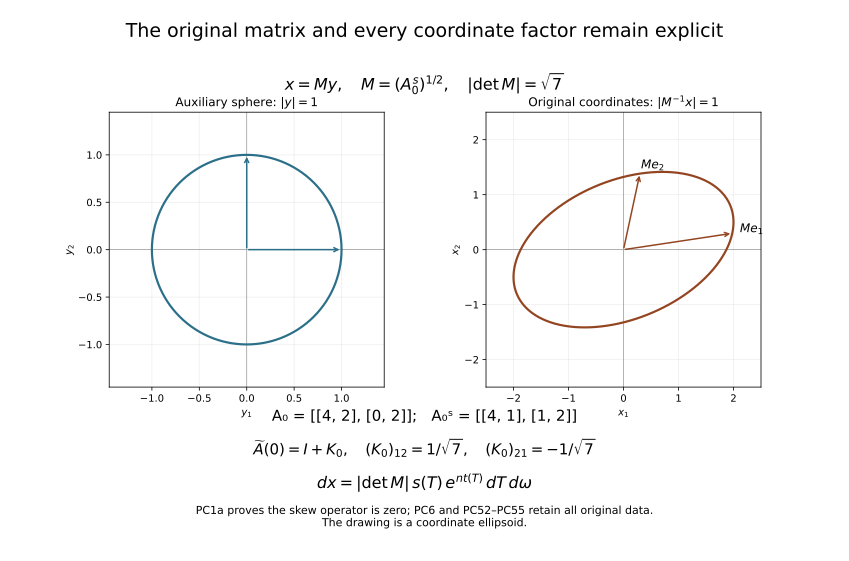
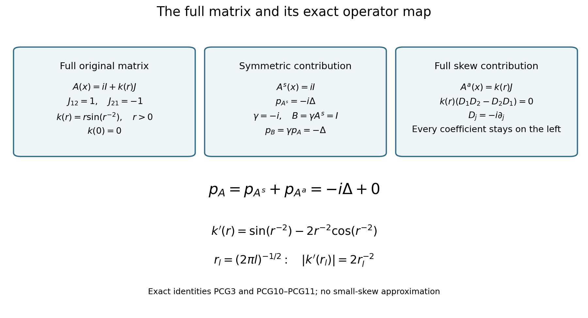

# Detecting a solution from infinite-order silence at one point

An elliptic equation can convert exceptionally small values into a rigid conclusion. The mechanism in this lesson is a weighted estimate that sees all derivatives through order two. Its weight grows toward one point, while its slight curvature defeats the characteristic frequencies of a purely logarithmic weight. This permits complex principal coefficients away from that point and a coefficient derivative that grows as the point is approached.

We first control the puncture, then construct the estimate on a cylinder. The coercive estimate for a pair of operators is proved before the commutator calculation. This separates the two jobs: ellipticity recovers the second derivatives, and the curved weight supplies the positive angular term. The final limiting argument uses both estimates in a specified order.

Our Fourier convention is \(D_j=-i\partial_{x_j}\). All norms below are \(L^2\) norms unless a subscript says otherwise. Coefficients and solutions may be complex. We retain the full original coefficient matrix, including its skew part. The exact cancellation of its skew contribution is proved below; the original operator is never redefined by discarding that data.

The proof uses the following results and entry facts with their stated hypotheses.

* **Annular elliptic control.** Sections 6, 8 and 9 of [Local inverses and distance-weighted elliptic estimates](local-elliptic-coefficients.md) supply the continuous-coefficient interior distance estimate, its local Lipschitz weak-solution extension, and its annular consequence for \(m=p=2\). The constants in the distance estimate use a fixed ellipticity constant and a common modulus of continuity. They do not require a uniform bound for coefficient derivatives on all punctured annuli.
* **Derivative transfer.** Section 4 of [Curved weights and the directions in which support can end](support-continuation.md) supplies the first-derivative exchange inequality for a Lipschitz multiplier. The transferred terms have strictly smaller *total* derivative order and maximum derivative order no greater than the original maximum. No strict decrease of that maximum is assumed. We give the cylinder adaptation and the precise weighted counting below.
* **Support propagation.** Sections 7–8 of [Curved weights and the directions in which support can end](support-continuation.md) imply the following local-to-global statement in dimension at least two. A continuous elliptic complex quadratic form on a connected domain, real at one point, has no exceptional support-normal directions. Where its coefficients are locally Lipschitz, a solution in \(H^1_{\mathrm{loc}}\) satisfying \(|pu|\leq C_K(|u|+|Du|)\) on compact sets cannot have a nonempty proper support with an interior boundary. Equivalently, a nonempty open zero set propagates throughout such a coefficient domain. The geometric assertion uses reality only at the one point, not at each boundary point of the support.
* **Calculus and geometry tools.** Finite-dimensional real spectral decomposition and matrix square roots, distributional derivatives, weak products with Lipschitz coefficients, smooth partitions of unity in charts, change of variables for Lebesgue measure, density of smooth functions in local Sobolev spaces, and integration by parts are used. The local elliptic estimate on the sphere is the chartwise application of Section 6 of [Local inverses and distance-weighted elliptic estimates](local-elliptic-coefficients.md). These are the entry facts used in the calculations below.

## 1. The coefficient scale and the meaning of the equation

Let \(X\subset\mathbb R^n\) be connected and open, with \(0\in X\), and set
\[
p(x,D)=\sum_{j,k=1}^n a_{jk}(x)D_jD_k.
\tag{PC1}
\]
Assume that \(a_{jk}\) are continuous on \(X\), locally Lipschitz on \(X\setminus\{0\}\), and that the principal polynomial is elliptic:
\[
\sum a_{jk}(x)\xi_j\xi_k\ne0
\quad(x\in X,\ 0\ne\xi\in\mathbb R^n).
\tag{PC2}
\]
Assume also that \(a_{jk}(0)\) are real and that, for some \(\delta>0\),
\[
|\nabla a_{jk}(x)|\leq C|x|^{\delta-1}
\quad\text{a.e. near }0,\ x\ne0.
\tag{PC3}
\]
The same bound may be imposed on all of \(X\setminus\{0\}\); only its local form is needed to prove vanishing near zero. Away from zero the conclusion will use local bounds on compact sets.

The solution assumptions are
\[
u\in H^1_{\mathrm{loc}}(X),\qquad
|pu|\leq C\bigl(|x|^{\delta-2}|u|
                  +|x|^{\delta-1}|Du|\bigr)
\quad\text{a.e. on }X\setminus\{0\},
\tag{PC4}
\]
and
\[
\int_{|x|<r}|u(x)|^2\,dx=O(r^N)
\quad\text{as }r\downarrow0,\quad\text{for every }N>0.
\tag{PC5}
\]
In (PC4), the equation on a punctured compact set is interpreted initially as a distribution: \(aD_jv=D_j(av)-(D_ja)v\) for \(v\in L^2\) and Lipschitz \(a\). The inequality says that \(pu\) has a locally \(L^2\) representative there. It does not assume second derivatives of \(u\) at the outset. The sum over individual first derivatives and the Euclidean norm \(|Du|\) differ only by fixed finite-dimensional constants.

The full original real matrix at zero is denoted by \(A_0=(a_{jk}(0))\). Write \(A_0^s=(A_0+A_0^T)/2\) and \(A_0^a=(A_0-A_0^T)/2\). The symmetric real quadratic form is definite: on the connected real unit sphere it has one sign when \(n\geq2\), and in dimension one this is immediate. Select its actual sign \(\sigma\in\{-1,1\}\), set \(G_0=\sigma A_0^s\), and let \(M=G_0^{1/2}\) be the real positive-definite matrix square root. None of these objects replaces \(A(x)\) or \(p(x,D)\).

For any matrix of scalar coefficients, its original skew contribution is exactly
\[
 \sum_{j,k}a_{jk}^a(x)D_jD_k
 =\sum_{j<k}\frac{a_{jk}(x)-a_{kj}(x)}2
                   (D_jD_k-D_kD_j)=0.                 \tag{PC1a}
\]
No derivative strikes a coefficient in this identity, since every coefficient is on the left. Thus the full matrix remains recorded even where its skew part contributes the zero differential operator.

Let \(Y=M^{-1}X\). The pullback \(u\mapsto v=u\circ M\) sends \(H^k_{\mathrm{loc}}(X)\) onto \(H^k_{\mathrm{loc}}(Y)\) for \(k=0,1,2\): the constant linear chain rule gives every derivative as a finite sum with the displayed matrix entries, and change of variables gives the exact Jacobian below. The inverse is composition with \(M^{-1}\), with the inverse entries and Jacobian. We use this auxiliary coordinate comparison with its complete receiving map:
\[
 \begin{split}
 x&=My,\qquad v(y)=u(My),\qquad D_yv=M^T(D_xu)(My),\\
 \widetilde A(y)&=\sigma M^{-1}A(My)M^{-T},\qquad
 \widetilde p(y,D_y)=\sum_{j,k}\widetilde a_{jk}(y)D_{y_j}D_{y_k},\\
 (\widetilde p v)(y)&=\sigma(pu)(My),\qquad
 \widetilde A(0)=I+K_0,\qquad
 K_0=\sigma M^{-1}A_0^aM^{-T},\quad K_0^T=-K_0.
 \end{split}                                                   \tag{PC6}
\]
The second-derivative chain rule proves the operator equality with every matrix entry in its written order; (PC1a) proves the exact zero contribution of \(K_0\). The original coefficient field, domain \(X\), operator \(p\), solution \(u\), sign \(\sigma\), and matrix \(M\) will be retained when returning the estimate to the original coordinates.

Here are the coefficient and singular-weight comparisons without deleting their factors. If \(m_-|y|\leq|My|\leq m_+|y|\), with the actual smallest and largest singular values of \(M\), then for every real \(q\)
\[
 \min(m_-^q,m_+^q)|y|^q\leq|My|^q
       \leq\max(m_-^q,m_+^q)|y|^q.                    \tag{PC6a}
\]
The transformed weak coefficient derivatives have the exact entries
\[
 \partial_{y_l}\widetilde a_{jk}(y)
 =\sigma\sum_{r,s,h}(M^{-1})_{jr}(M^{-1})_{ks}M_{hl}
                              (\partial_{x_h}a_{rs})(My).
                                                               \tag{PC6b}
\]
Equations (PC3), (PC6a), and this finite sum retain the exponent \(\delta-1\). The original lower-order assumption is transported as
\[
 |\widetilde p v|\leq C\bigl(|My|^{\delta-2}|v|
        +|My|^{\delta-1}|M^{-T}D_yv|\bigr).             \tag{PC6c}
\]
Every original power and matrix factor is present. The full vanishing integral is
\[
 \int_{|y|<r}|v(y)|^2dy
 =|\det M|^{-1}\int_{|M^{-1}x|<r}|u(x)|^2dx
 \leq|\det M|^{-1}\int_{|x|<m_+r}|u(x)|^2dx.          \tag{PC6d}
\]
This proves each exponent in (PC5) in the auxiliary coordinates, rather than replacing the original balls or measures by an unstated equivalent one.

Continuity at zero and (PC3) imply the actual original bound
\[
 |a_{jk}(x)-a_{jk}(0)|\leq C_\delta|x|^\delta,
 \qquad
 |\widetilde a_{jk}(y)-\delta_{jk}-(K_0)_{jk}|
                                  \leq C_{\delta,M}|y|^\delta.
 \tag{PC7}
\]
For the first bound, apply the fundamental theorem on radial segments \([s,r]\omega\). Fubini's theorem supplies the weak gradient bound on almost every ray. Integrate \(C\rho^{\delta-1}\), let \(s\downarrow0\), and use continuity to include every ray. The exponent \(\delta>0\) makes the integral finite. The second bound follows by substituting the first into the complete matrix formula (PC6) and then using (PC6a).

## 2. Annular control removes the apparent singularity

**Lemma.** Under (PC2)–(PC5), every derivative of \(u\) of order at most two satisfies
\[
\int_{r<|x|<2r}|D^\alpha u|^2\,dx=O(r^N)
\quad(|\alpha|\leq2, N>0).
\tag{PC8}
\]
Moreover \(u\in H^2_{\mathrm{loc}}(X)\). Near zero, every derivative through order two is square integrable after multiplication by any fixed negative power of \(|x|\).

**Proof.** On a compact punctured annulus the coefficients are Lipschitz, \(u\in H^1\), and (PC4) makes \(pu\in L^2\). Section 8 of [Local inverses and distance-weighted elliptic estimates](local-elliptic-coefficients.md) gives \(H^2\) regularity on smaller annuli. On a fixed small coefficient neighborhood, the continuous coefficients have a common modulus of continuity and uniform ellipticity. Its distance-weighted estimate consequently has one constant for every open annulus contained in that neighborhood, even though the local Lipschitz constants used to establish regularity may grow as the annulus approaches zero.

For \(r<1\), (PC4) implies
\[
|pu|\leq C\bigl(|x|^{-2}|u|+|x|^{-1}|Du|\bigr).
\tag{PC9}
\]
Here we used \(|x|^\delta\leq1\), so no stronger inequality has been silently substituted for an assumption. Apply Section 9 of [Local inverses and distance-weighted elliptic estimates](local-elliptic-coefficients.md) with \(m=p=2\). For each \(N\), (PC5) supplies its input bound on every annulus, and its conclusion is
\[
\int_{r<|x|<2r}|r^{|\alpha|}D^\alpha u|^2\,dx=O(r^N).
\tag{PC10}
\]
Use exponent \(N+2|\alpha|\) in (PC10) to obtain (PC8).

For clarity, the uniformity behind that application can also be read directly from the distance estimate. On \(A_r=\{r<|x|<2r\}\), put \(d=\operatorname{dist}(x,A_r^c)\), \(U=\|u\|_{A_r}\), and \(S=U+\|dDu\|_{A_r}\). Since \(d\leq|x|\), (PC9) gives \(\|d^2pu\|\leq CS\). The order-one distance estimate gives \(S\leq C S^{1/2}U^{1/2}\), hence \(S\leq C^2U\). The order-two estimate then gives \(\|d^2D^2u\|\leq CU\). On a middle subannulus \(d\asymp r\); a fixed finite cover by such middle subannuli proves (PC10) on the full annulus. All constants are independent of \(r\).

Summing (PC8) over dyadic annuli proves square integrability of the punctured derivatives near zero. It also proves integrability of \(|x|^{-M}D^\alpha u\) for every fixed \(M\): choose \(N>2M\) and sum the resulting geometric series. To identify these as derivatives across the puncture, take a smooth radial cutoff \(\chi_r\), zero on \(|x|\leq r\) and one on \(|x|\geq2r\), with \(|D^j\chi_r|\leq C_jr^{-j}\). On a fixed ball,
\[
D^2(\chi_ru)=\chi_rD^2u
       +2\operatorname{sym}(D\chi_r\otimes Du)+(D^2\chi_r)u.
\tag{PC11}
\]
The last two terms tend to zero in \(L^2\), by (PC8) with arbitrarily large \(N\). The first tends in \(L^2\) to the punctured second derivative extended over a null set. The same argument applies at orders zero and one. Thus \(\chi_ru\to u\) in \(H^2\), proving the assertion. In particular no point-supported distribution is left in the derivative: distributional convergence identifies the same limit. This is stronger than simply declaring the puncture removable because it has measure zero. \(\square\)

## 3. Geometry of the cylindrical derivatives

For the moment let \(n\geq2\). Write
\[
y=e^t\omega,\qquad x=e^tM\omega,\qquad
t\in\mathbb R,\quad\omega\in S^{n-1},\qquad
Z(t,\omega)=u(e^tM\omega)=v(e^t\omega).
\tag{PC12}
\]
Let \(\Omega_j\) be the tangential vector field obtained by projecting the constant vector \(e_j\) onto the tangent plane of the sphere. For a smooth extension \(F\) of a function on the sphere,
\[
\Omega_jF=\sum_k(\delta_{jk}-\omega_j\omega_k)\partial_kF,
\qquad
\partial_{y_j}=e^{-t}(\omega_j\partial_t+\Omega_j),\qquad
\partial_{x_h}=e^{-t}\sum_j(M^{-1})_{jh}
                                      (\omega_j\partial_t+\Omega_j).
\tag{PC13}
\]
The formula is independent of the extension because the projected vector is tangent. Direct differentiation gives
\[
\sum_j\omega_j\Omega_j=0,\qquad
\Omega_j\omega_k=\delta_{jk}-\omega_j\omega_k,\qquad
\sum_j\Omega_j\omega_j=n-1.
\tag{PC14}
\]
The divergence on the sphere of \(\Omega_j=\nabla_S\omega_j\) is \(-(n-1)\omega_j\). One way to verify this is to take the trace of the derivative of \(e_j-\omega_j\omega\) in an orthonormal tangent frame: each of the \(n-1\) tangent directions contributes \(-\omega_j\). Thus, relative to surface measure,
\[
\Omega_j^*=-\Omega_j+(n-1)\omega_j.
\tag{PC15}
\]
In particular the individual fields are not skew adjoint. Their sum of squares is nevertheless the self-adjoint Laplace–Beltrami operator:
\[
\Delta_S=\sum_j\Omega_j^2,\qquad
-\langle\Delta_Sv,v\rangle=\sum_j\|\Omega_jv\|^2.
\tag{PC16}
\]
Indeed (PC14) cancels the additional term in \(\sum_j\Omega_j^*\Omega_j\), giving \(-\sum_j\Omega_j^2\). Polar differentiation of (PC13) twice gives
\[
\sigma(pu)(e^tM\omega)
 =-e^{-2t}\sum_{j,k}\widetilde a_{jk}(e^t\omega)
 (\omega_j\partial_t-\omega_j+\Omega_j)
 (\omega_k\partial_t+\Omega_k)Z.
\tag{PC17}
\]
There is no derivative of \(a_{jk}\) in this identity because (PC1) is in nondivergence form. On using (PC14), its frozen expression is
\[
\begin{split}
 &\sum_{j,k}(\delta_{jk}+(K_0)_{jk})
       (\omega_j\partial_t-\omega_j+\Omega_j)
       (\omega_k\partial_t+\Omega_k)\\
 &=\sum_j(\omega_j\partial_t-\omega_j+\Omega_j)
       (\omega_j\partial_t+\Omega_j)
 =\partial_t^2+(n-2)\partial_t+\Delta_S.
 \end{split}
\tag{PC18}
\]

The coefficient errors relative to the complete frozen matrix \(I+K_0\) in (PC17), and their first derivatives in \(t\) and along the sphere, are \(O(e^{\delta t})\). For the derivatives, apply the chain rule to \(\widetilde a(e^t\omega)\): a cylindrical derivative contributes one factor \(e^t\), which cancels the \(|x|^{-1}\) in (PC3). The estimate for the undifferentiated error is (PC7). The skew term in (PC18) is zero because the complete ordered polar products represent the commuting derivatives \(e^{2t}\partial_{y_j}\partial_{y_k}\); contracting them with \(K_0\) gives exactly (PC1a). All statements about coefficient derivatives hold weakly and almost everywhere.

Multiplying (PC4) by \(e^{2t}\) now gives
\[
\begin{split}
 |\mathcal P Z|&\leq C e^{\delta t}
 \bigl(|M\omega|^{\delta-2}|Z|
 +|M\omega|^{\delta-1}|M^{-T}(\omega\partial_tZ+\Omega Z)|\bigr)\\
 &\leq C_M e^{\delta t}
       (|Z|+|\partial_tZ|+\sum_j|\Omega_jZ|),
 \end{split}
\tag{PC19}
\]
where \(\mathcal P\) is the expression without the prefactor in (PC17). The exact original Cartesian gradient is \(-ie^{-t}M^{-T}(\omega\partial_tZ+\Omega Z)\). Its norm is bounded by the displayed cylindrical derivatives with the fixed matrix factors retained above. Conversely \(\partial_tZ=\omega\cdot(M^Te^t\nabla_xu)\) and \(\Omega Z=(I-\omega\omega^T)M^Te^t\nabla_xu\), by (PC14). These give both comparison maps.

All cylinder norms below use \(dt\,d\omega\), not Euclidean measure. The exact original measure is \(dx=|\det M|e^{nt}dt\,d\omega\), essential when using (PC8). For \(k\leq2\), every cylindrical derivative of order \(k\) is a bounded linear combination, with its fixed matrix factors, of \(e^{jt}D_x^ju(e^tM\omega)\), \(j\leq k\). The ellipsoidal annulus has \(m_-e^t\leq|x|\leq m_+e^t\); finitely many original radial annuli cover each such slab, so (PC8) applies with every exponent. Consequently (PC8) implies that each such derivative, multiplied by \(e^{-Mt}\), belongs to \(L^2(dt\,d\omega)\) on a negative half cylinder, for every fixed real \(M\). This follows by dividing into slabs corresponding to dyadic radial annuli and choosing the exponent \(N\) in (PC8) larger than the finite measure and weight losses.

## 4. A small curvature in the logarithmic variable

Fix
\[
0<\varepsilon<\delta,\qquad
t=T+e^{\varepsilon T},\qquad
s(T)=1+\varepsilon e^{\varepsilon T},\qquad
b(T)=s(T)^2.
\tag{PC20}
\]
This is an increasing smooth change of variables on the cylinder because \(dt/dT=s>0\). For \(T<-2\) one has \(T<t<T+1<T/2\). In particular its first derivatives and their inverses are uniformly bounded on a sufficiently negative half cylinder, and \(e^{at}\asymp e^{aT}\) there for each fixed real \(a\). It need not be smooth as a change of the original Cartesian variable at zero, and no such assertion is used.

Put \(U(T,\omega)=Z(t(T),\omega)\). Multiplying \(\mathcal P\) by \(s^2\) gives the operator
\[
Q=\partial_T^2+c(T)\partial_T+b(T)\Delta_S+R,
\qquad
c(T)=(n-2)s(T)-\frac{\varepsilon^2e^{\varepsilon T}}{s(T)},
\tag{PC21}
\]
where
\[
R=\sum_{j+|\alpha|\leq2}r_{\alpha j}(T,\omega)
                  \partial_T^j\Omega^\alpha,
\qquad
|r_{\alpha j}|+|\partial_Tr_{\alpha j}|+
       \sum_l|\Omega_lr_{\alpha j}|\leq C e^{\delta T}.
\tag{PC22}
\]
Here \(\Omega^\alpha\) denotes a fixed word of length \(|\alpha|\) in the fields. We may include every word of length at most two; using a chosen ordering instead changes only bounded lower-order terms, because the commutators of smooth sphere fields are smooth first-order fields.

To verify (PC21), use \(\partial_t=s^{-1}\partial_T\), hence
\(s^2\partial_t^2=\partial_T^2-(s'/s)\partial_T\), and apply (PC18). Terms coming from coefficient errors have bounded smooth factors \(s,s^{-1},s'\), sphere coordinates and their derivatives; their first cylindrical derivatives retain \(O(e^{\delta T})\) by the chain rule. This proves (PC22) without any second derivative of a principal coefficient. The scalar functions \(b,c\) are smooth, with
\[
b'=2\varepsilon^2e^{\varepsilon T}s,\qquad
c-(n-2)=O(e^{\varepsilon T}),\qquad c'=O(e^{\varepsilon T}).
\tag{PC23}
\]
The transformed equation satisfies
\[
|QU|\leq C e^{\delta T}
 (|U|+|\partial_TU|+\sum_j|\Omega_jU|).
\tag{PC24}
\]
The factor \(s^2\) and the first-derivative coordinate conversion are bounded; these facts justify the same exponent \(\delta\).

## 5. A coercive pair estimate that retains order two

For \(\tau\geq1\) and a smooth compactly supported cylinder function \(V\), define
\[
Q_\tau=e^{-\tau T}Qe^{\tau T}.
\tag{PC25}
\]
Thus each \(\partial_T\) in (PC21)–(PC22) is replaced by \(\partial_T+\tau\). Define \(Q_\tau^-\) by expanding this expression with all coefficients to the left, replacing \(\partial_T\) and each \(\Omega_j\) by their negatives, and replacing every coefficient \(r_{\alpha j}\) by its complex conjugate. The real coefficients \(b,c\) are unchanged. Word order is preserved. In particular its unperturbed part is
\[
( -\partial_T+\tau)^2+c(T)(-\partial_T+\tau)+b(T)\Delta_S.
\tag{PC26}
\]
This definition is algebraic. It is not the formal adjoint of \(Q_\tau\): adjoints differentiate coefficients, and (PC15) adds terms of order zero to reversed angular fields.

Write \(\mathscr D^kV\) for the finite array of all \(\partial_T^j\Omega^\alpha V\) with \(j+|\alpha|=k\). Set
\[
E_\tau(V)=\sum_{k=0}^2\tau^{4-2k}
     \|e^{\varepsilon T/2}\mathscr D^kV\|^2.
\tag{PC27}
\]
There are \(T_1<0\), \(\tau_1\geq1\), and \(C\), depending on the coefficient bounds and \(\varepsilon\), such that
\[
E_\tau(V)\leq C\int
 \bigl(|Q_\tau V|^2+|Q_\tau^-V|^2
                  +\tau^2\sum_j|\Omega_jV|^2\bigr)e^{\varepsilon T}
 \,dT\,d\omega
\tag{PC28}
\]
for support in \(T<T_1\) and \(\tau\geq\tau_1\).

**Proof of the frozen estimate.** First remove the weight and replace \(Q_\tau,Q_\tau^-\) by
\(P_\pm=(\partial_T\pm\tau)^2+\Delta_S\). Let
\(A=\partial_T^2+\tau^2+\Delta_S\), and abbreviate
\[
F=\|P_+V\|^2+\|P_-V\|^2
                 +\tau^2\sum_j\|\Omega_jV\|^2.
\]
The opposite cross terms cancel, so
\[
F=2\|AV\|^2+8\tau^2\|\partial_TV\|^2
                  +\tau^2\sum_j\|\Omega_jV\|^2.
\tag{PC29}
\]
Pairing \(AV\) with \(V\) and using (PC16) yields
\[
\tau^2\|V\|^2
=\operatorname{Re}\langle AV,V\rangle
 +\|\partial_TV\|^2+\sum_j\|\Omega_jV\|^2.
\]
Multiply by \(\tau^2\), and bound the first term by
\(\tfrac12\tau^4\|V\|^2+\tfrac12\|AV\|^2\). Equation (PC29) then proves \(\tau^4\|V\|^2\leq CF\). It already controls all weighted first derivatives. A second integration by parts gives the exact identity
\[
\begin{split}
\|AV\|^2={}&\|\partial_T^2V\|^2+\tau^4\|V\|^2
 +\|\Delta_SV\|^2+2\sum_j\|\Omega_j\partial_TV\|^2\\
 &-2\tau^2\left(\|\partial_TV\|^2
                         +\sum_j\|\Omega_jV\|^2\right).
\end{split}
\tag{PC30}
\]
Every negative term in this identity is already bounded by \(CF\). Thus \(F\) controls \(\partial_T^2V\), \(\Delta_SV\), and the mixed derivatives.

Finally,
\[
\sum_{j,k}\|\Omega_j\Omega_kv\|_{S^{n-1}}^2
\leq C\left(\|\Delta_Sv\|^2+\sum_j\|\Omega_jv\|^2+\|v\|^2\right).
\tag{PC31}
\]
To see its exact prerequisite content, cover the compact sphere by finitely many coordinate patches with smaller patches still covering it. In each patch \(\Delta_S\) has a smooth uniformly positive principal matrix. Apply the order-two local elliptic estimate to a cutoff times \(v\); the commutator with the cutoff has order one. All \(\Omega_j\Omega_k\) are smooth combinations of coordinate derivatives through order two. Summing the finitely many estimates proves (PC31). Integration in \(T\) now gives the frozen version of (PC28), controlling every derivative in (PC27), including those of order two with coefficient one.

**Restoring the weight and the coefficients.** Put \(W=e^{\varepsilon T/2}V\). A derivative of \(V\) becomes \((\partial_T-\varepsilon/2)W\), while angular fields commute with the weight. The arrays in (PC27) and their unweighted versions for \(W\) are uniformly equivalent for \(\tau\geq1\), by the binomial formula in both directions. Conjugating either operator by this weight produces the frozen \(P_\pm\), plus second-order terms whose coefficients are bounded by
\(C(e^{\varepsilon T_1}+e^{\delta T_1})\), and lower-order terms. A first-order term has norm bounded by \(C\tau^{-1}\) times the square root of the frozen energy; the same is true for a zeroth-order term whose coefficient is \(O(\tau)\). The shifts by \(\varepsilon/2\), and the term \(c(\partial_T+\tau)\), have exactly these forms. Terms from \(R\), including \(\tau^2rW\), are bounded by \(Ce^{\delta T_1}\) times that energy's square root. The same counting holds for the algebraic minus operator.

Apply the frozen estimate to \(W\) and use the triangle inequality in the finite product of the three norms on its right. Choose \(T_1\) sufficiently negative to make the second-order perturbation norm less than one quarter of the coercivity constant. Next choose \(\tau_1\) large enough for the lower-order norm to be less than another quarter. Move both to the left. This proves (PC28), without differentiating any coefficient of \(R\). \(\square\)

## 6. Reversal produces angular positivity with first derivatives only

Define the lower weighted energy
\[
S_\tau(V)=\tau^{-1}E_\tau(V)
=\sum_{k=0}^2\tau^{3-2k}
              \|e^{\varepsilon T/2}\mathscr D^kV\|^2,
\tag{PC32}
\]
and an error quantity
\[
\mathcal R_\tau(V)=\sum_{k=0}^2\tau^{3-2k}
 \int |\mathscr D^kV|^2
                 (e^{\delta T}+\tau^{-1}e^{\varepsilon T})\,dT\,d\omega.
\tag{PC33}
\]
For sufficiently negative \(T_1\) and sufficiently large \(\tau\),
\[
\|Q_\tau^-V\|^2
 +4\varepsilon^2\tau\sum_j\|e^{\varepsilon T/2}\Omega_jV\|^2
\leq\|Q_\tau V\|^2+C\mathcal R_\tau(V).
\tag{PC34}
\]

**The unperturbed identity.** Write
\[
A_\tau=\partial_T^2+\tau^2+c\tau+b\Delta_S,
\qquad B_\tau=(2\tau+c)\partial_T.
\]
The two unperturbed operators are \(A_\tau+B_\tau\) and \(A_\tau-B_\tau\). Their squared norm difference is \(4\operatorname{Re}\langle A_\tau V,B_\tau V\rangle\). Direct integration by parts in \(T\), and (PC16) for the angular term, give
\[
\begin{split}
4\operatorname{Re}\langle A_\tau V,B_\tau V\rangle
={}&-2\int c'|\partial_TV|^2
 -2\int (3\tau^2+2c\tau)c'|V|^2\\
 &+2\sum_j\int h(T)|\Omega_jV|^2,
\qquad h=(b(2\tau+c))'.
\end{split}
\tag{PC35}
\]
For example the scalar product \((\tau^2+c\tau)(2\tau+c)\) has derivative \((3\tau^2+2c\tau)c'\); this accounts for both coefficients in the second term. No derivatives of \(c\) beyond the first occur. From (PC23),
\[
h=2\varepsilon^2e^{\varepsilon T}s(2\tau+c)+bc'
\geq2\varepsilon^2\tau e^{\varepsilon T}
\tag{PC36}
\]
after choosing \(\tau\) large. The possible negative contribution \(bc'\) is bounded by \(Ce^{\varepsilon T}\), while the leading term is \(4\varepsilon^2\tau e^{\varepsilon T}s\). The first two terms of (PC35) are bounded in absolute value by
\[
C\int e^{\varepsilon T}
               (|\partial_TV|^2+\tau^2|V|^2),
\tag{PC37}
\]
which is contained in the \(\tau^{-1}e^{\varepsilon T}\) part of (PC33).

**Why the perturbation loses only one derivative.** Expand the squared norms after adding \(R\) and its algebraic reversal. Each term involving at least one coefficient of \(R\) has a coefficient \(a\) satisfying
\(|a|+|da|\leq Ce^{\delta T}\). Products of two such coefficients obey the same bound on a negative half cylinder. In a fixed sphere chart, expansion of the angular words gives coordinate derivatives of order at most two. Reversing a word and taking its true adjoint differ by smooth lower-order terms, by (PC15) and the product rule. Multiplication by those smooth chart coefficients, densities, and cutoffs retains the bound \(Ce^{\delta T}\).

The terms of highest total order in the difference have the form
\[
\tau^q\int a\left(
 \partial^\alpha V\,\overline{\partial^\beta V}
 -(-1)^{|\alpha|+|\beta|}
 \partial^\beta V\,\overline{\partial^\alpha V}\right),
\quad q+|\alpha|+|\beta|\leq4,\quad |\alpha|,|\beta|\leq2.
\tag{PC38}
\]
Here \(\partial\) includes \(T\) and local angular derivatives. To check the pairing, conjugate the entire reversed squared norm, which is real. This reverses the two differentiated factors and conjugates its leading coefficient, giving exactly the coefficient and parity displayed in (PC38). All defects in this conversion are of lower total order and already have a small coefficient.

Apply the derivative-transfer identity with a Lipschitz multiplier. In elementary terms, transfer one derivative from one factor by integration by parts, compare the same transfer in the other term, and retain the term in which that derivative hits \(a\). Repeat the exchange of indices to put the two highest-order products into the same form. At most \(|\alpha|+|\beta|\) such exchanges are needed. The terms retained at each exchange contain only one derivative of \(a\); that retained term is estimated at once and is not integrated by parts again. Thus the result is bounded by a finite sum
\[
C\tau^q\int e^{\delta T}
                 |\mathscr D^aV|\,|\mathscr D^bV|,
\qquad q+a+b\leq3,\qquad a,b\leq2.
\tag{PC39}
\]
The same conclusion holds for lower-order chart and adjoint defects. One can implement this argument with a fixed finite sphere partition and a bounded-overlap partition into unit intervals in \(T\). On each interval the Lipschitz bounds are \(Ce^{\delta T}\) up to a common fixed factor; derivatives of the partitions produce only lower-order terms. Summing yields (PC39) with one constant on the whole half cylinder. Smooth approximation of Lipschitz coefficients proves the integration identities with weak first derivatives, with the same bounds.

The derivative-transfer contract does **not** say that each retained derivative order is strictly less than two when the two original orders were two. It says only \(a,b\leq2\) and \(a+b\leq3-q\), which is all that is needed. Indeed, because \(\tau\geq1\),
\[
\tau^q|\mathscr D^aV|\,|\mathscr D^bV|
\leq\frac12\left(
 \tau^{3-2a}|\mathscr D^aV|^2
 +\tau^{3-2b}|\mathscr D^bV|^2\right)
\quad(q+a+b\leq3).
\tag{PC40}
\]
For the most delicate remaining pair \((a,b)=(2,1)\), the two factors have weights \(\tau^{-1/2}\) and \(\tau^{1/2}\), so their product has weight one. There is no need to discard the second derivative. Equations (PC39)–(PC40) bound the perturbation by the \(e^{\delta T}\) part of (PC33). Together with (PC35)–(PC37), this proves (PC34). \(\square\)

## 7. The full Carleman estimate and the order of choices

**Theorem.** For the operator (PC21)–(PC22), there exist \(T_0<0\), \(\tau_0\geq1\), and \(C\) such that, for every \(\tau\geq\tau_0\) and every \(W\in C_c^\infty(( -\infty,T_0)\times S^{n-1})\),
\[
\sum_{k=0}^2\tau^{3-2k}
 \int |\mathscr D^kW|^2e^{-(2\tau-\varepsilon)T}\,dT\,d\omega
\leq C\int|QW|^2e^{-2\tau T}\,dT\,d\omega.
\tag{PC41}
\]
The order-two terms carry the factor \(\tau^{-1}\); none is omitted.

**Proof.** Work first with \(V=e^{-\tau T}W\). On \(T<T_0\),
\[
\mathcal R_\tau(V)
\leq\left(e^{(\delta-\varepsilon)T_0}+\tau^{-1}\right)S_\tau(V).
\tag{PC42}
\]
Let \(A_S=\sum_j\|e^{\varepsilon T/2}\Omega_jV\|^2\) and \(F=\|Q_\tau V\|^2\). Since \(e^{\varepsilon T}\leq1\), (PC28) gives
\(E_\tau\leq C(F+\|Q_\tau^-V\|^2+\tau^2A_S)\).
From (PC34), both \(\|Q_\tau^-V\|^2\) and \(4\varepsilon^2\tau A_S\) are at most \(F+C\mathcal R_\tau\). Therefore
\[
S_\tau(V)\leq C_\varepsilon F
 +C_\varepsilon\left(e^{(\delta-\varepsilon)T_0}
                                  +\tau^{-1}\right)S_\tau(V).
\tag{PC43}
\]
The constant \(C_\varepsilon\) can depend on the fixed positive \(\varepsilon\), including inverse powers of it. Choose that \(\varepsilon\) first, with \(0<\varepsilon<\delta\). Choose \(T_0\leq T_1\) next so that \(C_\varepsilon e^{(\delta-\varepsilon)T_0}\leq1/4\). Finally increase \(\tau_0\) until \(C_\varepsilon/\tau_0\leq1/4\), and until the preceding pair and reversal estimates hold. Absorb these two terms to obtain
\[
S_\tau(V)\leq2C_\varepsilon\|Q_\tau V\|^2.
\tag{PC44}
\]
The two finite arrays
\(\tau^{(3-2k)/2}e^{-\tau T}\mathscr D^kW\) and
\(\tau^{(3-2k)/2}\mathscr D^kV\), \(0\leq k\leq2\), have uniformly equivalent norms. This follows by expanding \((\partial_T+\tau)^j\) and by reversing that expansion with \(\partial_T-\tau\); each additional factor \(\tau\) is exactly paid for by lowering the derivative order by one. Angular derivatives commute with the exponential. Their weighted versions with \(e^{\varepsilon T/2}\) are therefore equivalent as well. Since \(Q_\tau V=e^{-\tau T}QW\), (PC44) proves (PC41). \(\square\)

**The full estimate for the original operator and coordinates.** Let
\(r_A(x)=|M^{-1}x|\), \(\omega_A(x)=M^{-1}x/r_A(x)\), and let \(T_A(x)\) be the unique real solution of
\(\log r_A(x)=T_A(x)+e^{\varepsilon T_A(x)}\). Its uniqueness and smoothness away from zero follow from the positive derivative \(s\) in (PC20). Set \(r_0=\exp(T_0+e^{\varepsilon T_0})\). The actual original coordinate fields are
\[
 \mathcal L_0=s(T_A)\sum_hx_h\partial_{x_h},\qquad
 \mathcal L_j=r_A\sum_hM_{hj}\partial_{x_h}
                    -(\omega_A)_j\sum_hx_h\partial_{x_h}.
 \tag{PC52}
\]
For \(W(T,\omega)=w(e^{t(T)}M\omega)\), the chain rule gives
\(\partial_TW=(\mathcal L_0w)(x)\) and
\(\Omega_jW=(\mathcal L_jw)(x)\). Let \(\mathcal C^kw\) be the exact same finite array of ordered words as \(\mathscr D^k\), using these fields. Iterating those two equalities retains every derivative that strikes a field coefficient.

The original operator and measure identities are
\[
 QW=-\sigma s(T_A)^2r_A^2(p(x,D_x)w)(x),\qquad
 dx=|\det M|s(T) e^{nt(T)}dT\,d\omega.
 \tag{PC53}
\]
The first follows from the complete expression (PC17), multiplied by \(s^2\); the second follows from the constant linear Jacobian and the radial Jacobian, then \(dt=s\,dT\). Substituting both identities, without deleting a common measure factor, into (PC41) proves for every original test function compactly supported in \(0<r_A<r_0\)
\[
 \begin{split}
 &\sum_{k=0}^2\tau^{3-2k}\int_{0<r_A<r_0}
 |\mathcal C^kw(x)|^2
 \frac{e^{-(2\tau-\varepsilon)T_A(x)}}
      {|\det M|s(T_A(x))r_A(x)^n}\,dx\\
 &\quad\leq C\int_{0<r_A<r_0}|p(x,D_x)w(x)|^2
 \frac{s(T_A(x))^4r_A(x)^4e^{-2\tau T_A(x)}}
      {|\det M|s(T_A(x))r_A(x)^n}\,dx.
 \end{split}                                                   \tag{PC54}
\]
The original \(p\), its full matrix, all singular powers, Jacobian, sign comparison and every derivative through order two have thus received the estimate. To check explicitly that the field array does not lose a Cartesian derivative, put
\(\mathcal V_j=(\omega_A)_js(T_A)^{-1}\mathcal L_0+\mathcal L_j\). Then
\[
 \partial_{x_h}=r_A^{-1}\sum_j(M^{-1})_{jh}\mathcal V_j,
 \qquad
 \partial_{x_h}\partial_{x_l}
 =r_A^{-1}\sum_j(M^{-1})_{jh}\mathcal V_j
       \left(r_A^{-1}\sum_k(M^{-1})_{kl}\mathcal V_k\right).
 \tag{PC55}
\]
The second is an ordered differential-operator identity: the left \(\mathcal V_j\) acts on the entire bracket, including \(r_A^{-1}\), \(\omega_A\), and \(s^{-1}\) in the right field. It retains their full lower-order contributions. Formula (PC13) proves it directly; conversely (PC52) gives the complete original-to-field maps. On a negative half cylinder all derivatives of \(s\) through the required order are bounded, and the sphere factors and fixed matrices are bounded. Both directions therefore control the full order-two arrays with their displayed radial powers. No Cartesian derivative or original coefficient has been suppressed.

The example uses the full original matrix \(A_0=\begin{pmatrix}4&2\\0&2\end{pmatrix}\), whose symmetric part has determinant seven. The plotted ellipsoid is the original coordinate surface \(|M^{-1}x|=1\), with \(M=(A_0^s)^{1/2}\), rather than a frequency surface. The full transformed skew matrix is \(K_0=\begin{pmatrix}0&1/\sqrt7\\-1/\sqrt7&0\end{pmatrix}\); its entries remain visible while (PC1a) proves its zero operator contribution. Equations (PC6) and (PC52)–(PC55) supply the exact maps and measure.

The argument shows why continuity of coefficients alone would be insufficient for this proof. The perturbation in (PC39) must decay faster than the positive weight \(e^{\varepsilon T}\), after one coefficient derivative. This is the role of \(\delta>\varepsilon\). It is a statement about this estimate's assumptions, not a claim that every weaker coefficient class has already been classified.

## 8. Passing from test functions to an infinitely flat solution

**Lemma.** Suppose \(U\in H^2_{\mathrm{loc}}\) on a negative half cylinder satisfies (PC24), and every derivative through order two times \(e^{-MT}\) is square integrable there for every fixed \(M>0\). Then \(U=0\) on a smaller negative half cylinder.

**Proof.** Choose \(T_0\) as in Section 7, and choose a smooth function \(\psi\) that is one for \(T\leq T_0-2\), zero for \(T\geq T_0-1\), and supported in \(T<T_0\). Put \(W=\psi U\). All its derivatives through order two have the stated weighted integrability. For \(R\) large choose \(\theta_R\), zero for \(T\leq-R-1\) and one for \(T\geq-R\), with derivatives through order two uniformly bounded. Then \(W_R=\theta_RW\) has compact cylindrical support.

Fix \(\tau\) before sending \(R\) to infinity. The terms in
\[
Q(\theta_RW)=\theta_RQW+[Q,\theta_R]W
\tag{PC45}
\]
are legitimate \(L^2\) functions. The commutator has order at most one in \(W\); the coefficient derivatives do not enter because \(Q\) is written with its coefficients on the left. Its support is \(-R-1<T<-R\), and its coefficients are bounded independently of \(R\). The weighted integrability assumption makes its \(e^{-\tau T}L^2\) norm tend to zero. The same argument shows convergence of the weighted derivative arrays on the left of (PC41).

For fixed \(R\), approximate \(W_R\) in \(H^2\) by smooth compactly supported cylinder functions using finitely many sphere charts and a partition of unity. Its support can be kept inside \(T<T_0\). On this fixed compact set the weight is bounded above and below, and the coefficients of \(Q\) are bounded. Thus \(Q:H^2\to L^2\) is continuous there, and (PC41) passes to \(W_R\). Now send \(R\to\infty\), at the fixed \(\tau\), to get (PC41) for \(W\). This order of limits avoids claiming a cutoff error small uniformly in \(\tau\).

By (PC24) and the product rule, with \(I=[T_0-2,T_0-1]\),
\[
\begin{split}
\int|QW|^2e^{-2\tau T}
\leq{}&C\int e^{-(2\tau-2\delta)T}
       (|W|^2+|\partial_TW|^2+\sum_j|\Omega_jW|^2)\\
 &+C_Ue^{-2\tau(T_0-2)}.
\end{split}
\tag{PC46}
\]
To check this estimate where \(\psi\) varies, replace \(\psi\partial_TU\) by \(\partial_TW-\psi'U\). All extra terms are supported in the fixed interval \(I\) and have a finite unweighted \(L^2\) norm depending on \(U\) and \(\psi\). Since \(T\geq T_0-2\) on \(I\), their weight is bounded by the last exponential in (PC46). No division by a possibly small \(\psi\) is used.

Since \(\varepsilon<\delta\), the factor \(e^{(2\delta-\varepsilon)T}\) is bounded on \(T<T_0\). The first integral on the right of (PC46) is therefore absorbed into the order-zero and order-one terms of (PC41) when \(\tau\) is sufficiently large: their coefficients are \(\tau^3\) and \(\tau\), respectively. It follows that
\[
\tau^3\int |W|^2e^{-(2\tau-\varepsilon)T}
\leq C_Ue^{-2\tau(T_0-2)}.
\tag{PC47}
\]
Fix \(a<T_0-2\). On \(T\leq a\), the weight on the left is at least \(e^{-(2\tau-\varepsilon)a}\) for \(2\tau>\varepsilon\), so
\[
\int_{T\leq a}|U|^2
\leq C_U\tau^{-3}e^{-\varepsilon a}
                e^{-2\tau(T_0-2-a)}.
\tag{PC48}
\]
Here \(W=U\) on that region. Let \(\tau\to\infty\). The positive gap \(T_0-2-a\) forces the integral to vanish. As \(a\) increases to \(T_0-2\), this proves \(U=0\) for \(T<T_0-2\). \(\square\)

## 9. Strong continuation with reality at a single point

**Theorem.** Under (PC1)–(PC5), \(u=0\) throughout \(X\). Coefficients may be complex at every point of \(X\setminus\{0\}\). No finite vanishing exponent is substituted for the condition that (PC5) holds for every exponent.

**Proof for \(n\geq2\).** Use the complete coordinate comparison (PC6), retaining the original matrix, its skew part and the sign. Section 2 gives the original annular derivative bounds and \(H^2\) regularity across zero. Section 3 transfers those bounds to arbitrary exponential weights on the cylinder. The change (PC20) preserves them and gives (PC24). Section 8 therefore proves that \(u\) vanishes in a neighborhood of zero.

It remains to justify the global conclusion despite the possible lack of Lipschitz regularity at zero. Since a whole neighborhood of zero is now a zero set, every possible boundary point of the support lies in \(X\setminus\{0\}\). At such a point the coefficients are locally Lipschitz and \(|x|^{\delta-2},|x|^{\delta-1}\) are locally bounded. Thus (PC4) has the locally bounded lower-order form required by the support-propagation result in Sections 7–8 of [Curved weights and the directions in which support can end](support-continuation.md). The continuous elliptic principal form has no exceptional support-normal direction anywhere in \(X\), because it is real at zero. This geometric fact uses the full connected coefficient domain, even when a chosen neighborhood of a support boundary does not itself contain zero.

For completeness, a nonempty proper closed support in a connected domain has an interior supporting ball at some boundary point whenever its complement contains a point. Join a zero-set point to a support point by a compact path in the domain, take the first contact region, and choose a nearby zero-set point whose distance to the support is positive and smaller than its distance to the domain boundary. The distance is attained locally on the closed support. The ball with that distance as radius is disjoint from the support and touches it, producing a nonzero exterior normal. The support-normal conclusion excludes this possibility. Hence the support is empty and \(u=0\) on \(X\).

**Dimension one.** The cylinder proof above also has a one-dimensional interpretation, but a direct argument is shorter and avoids a sphere convention. Divide (PC4) by the nonvanishing coefficient. On each side of zero put \(t=\log|x|\) and \(Z(t)=u(\pm e^t)\). The annular argument of Section 2 remains valid in dimension one. The equation becomes
\[
|Z''-Z'|\leq Ce^{\delta t}(|Z|+|Z'|).
\tag{PC49}
\]
Thus \(Y=(Z,Z')\) is locally absolutely continuous and obeys \(|Y'|\leq C_0|Y|\) for all sufficiently negative \(t\). The cylinder derivative bounds give \(\int_{-k-1}^{-k}|Y|^2=O(e^{-Nk})\) for every \(N\). Choose \(t_k\in[-k-1,-k]\) with \(|Y(t_k)|^2\) at most that integral. Gronwall's inequality, which here follows by integrating the inequality for \(|Y|\) after multiplication by \(e^{-C_0t}\), gives
\(|Y(t)|\leq e^{C_0(t-t_k)}|Y(t_k)|\) for fixed negative \(t>t_k\). Choose \(N>2C_0\) and let \(k\to\infty\); this forces \(Y(t)=0\). Both sides vanish near zero. Away from zero the same first-order inequality has a locally bounded constant, so ordinary interval continuation gives vanishing on the connected interval \(X\). This covers \(n=1\) without an unstated dimensional restriction. \(\square\)

### 9.1. A fixed complex phase and a free skew part

The preceding theorem has a useful consequence with weaker coefficient assumptions. The full original matrix need not be real at zero, and its skew part need not satisfy the radial derivative bound. The exact nondivergence operator remains the one being studied.

**Corollary.** Keep the connected open set \(X\), the original full matrix \(A=(a_{jk})\), the operator \(p_A=\sum a_{jk}D_jD_k\), and the solution \(u\) of (PC1), (PC2), (PC4) and (PC5). Assume that \(A\) is continuous on \(X\) and locally Lipschitz on \(X\setminus\{0\}\). Write
\[
 A^s=\frac{A+A^T}{2},\qquad A^a=\frac{A-A^T}{2}.
 \tag{PCG1}
\]
Suppose there is a fixed \(\gamma\in\mathbb C\setminus\{0\}\) for which \(G_0=\gamma A^s(0)\) is real positive definite. Instead of (PC3) for every entry of \(A\), assume only
\[
 |\nabla a^s_{jk}(x)|\leq C_s|x|^{\delta-1}
 \quad\text{a.e. near }0,\qquad\delta>0.
 \tag{PCG2}
\]
Retain the original lower-order constant \(C_u\) in (PC4). Then \(u=0\) throughout \(X\), in every dimension \(n\geq1\). No quantitative bound of the form (PCG2) is required for \(A^a\). Its continuity and local Lipschitz regularity off zero remain assumptions on the full matrix.

**Proof of the operator map at weak regularity.** On a relatively compact punctured neighborhood, each coefficient is locally Lipschitz. Multiplication by such a coefficient maps compactly supported \(H^1\) test functions into \(H^1\): the weak product rule is \(\nabla(a\phi)=a\nabla\phi+(\nabla a)\phi\), whose two terms have finite \(L^2\) norms bounded by the local coefficient and derivative bounds. Duality therefore defines its product with an \(H^{-1}\) distribution. This agrees with the weak product specified after (PC5): for \(v\in L^2\), \(aD_jv=D_j(av)-(D_ja)v\).

Since \(u\in H^1_{\mathrm{loc}}\), its second derivatives belong locally to \(H^{-1}\). Distributional derivatives commute: their evaluations on a smooth test function are the evaluations of \(u\) on the same commuting second derivatives of that test function. Pairing the two off-diagonal terms with the same Lipschitz coefficient consequently gives the exact identity
\[
 \begin{split}
 p_Au&=p_{A^s}u+\sum_{j<k}a^a_{jk}
                       (D_jD_k-D_kD_j)u=p_{A^s}u,\\
 B&=\gamma A^s,\qquad p_Bu=\gamma p_Au.
 \end{split}                                                    \tag{PCG3}
\]
The equality holds on every punctured compact neighborhood and hence on \(X\setminus\{0\}\). Coefficients occupy their original positions to the left of both derivatives. No divergence term or second derivative of a coefficient has been omitted. We do not need to define a product of the possibly unbounded coefficient derivative with a distribution at zero.

The auxiliary symmetric matrix \(B\) is continuous on \(X\), locally Lipschitz off zero, and real positive definite at zero. For each original real nonzero covector,
\[
 \xi^TB(x)\xi=\gamma\xi^TA(x)\xi\ne0,\qquad
 |\nabla b_{jk}|\leq|\gamma|C_s|x|^{\delta-1},
\]
because \(\xi^TA^a\xi=0\). Its equation is the exact receiving inequality
\[
 |p_Bu|=|\gamma|\,|p_Au|
 \leq|\gamma|C_u\bigl(|x|^{\delta-2}|u|
                     +|x|^{\delta-1}|Du|\bigr).
 \tag{PCG4}
\]
Every hypothesis of Section 9 now holds for \(B\), with the same original \(X,u,\delta\) and every ball integral in (PC5). That theorem gives \(u=0\) on \(X\). In dimension one this uses its explicit interval proof. In higher dimensions it uses its cylinder proof and support propagation on the full connected domain. The displayed identities prove the complete map that returns the conclusion to the original operator. \(\square\)

**The estimate in the original coordinates.** For \(n\geq2\), retain the actual \(M=G_0^{1/2}\), put \(Y=M^{-1}X\), and set \(v(y)=u(My)\). The full transformed coefficient field, including the skew part, is
\[
 \begin{split}
 \widehat A(y)&=\gamma M^{-1}A(My)M^{-T},\\
 \widehat A^s(y)&=\gamma M^{-1}A^s(My)M^{-T},\\
 \widehat A^a(y)&=\gamma M^{-1}A^a(My)M^{-T},\\
 \widehat A(0)&=I+K_0,\qquad
 K_0=\gamma M^{-1}A^a(0)M^{-T},\quad K_0^T=-K_0,\\
 \widehat p\,v&=\gamma(p_Au)\circ M.
 \end{split}                                                    \tag{PCG5}
\]
The skew matrix \(K_0\) may be complex. Every variable skew contribution also contracts to zero against the commuting second derivatives, by (PCG3), after the full constant-matrix chain rule. Thus the cylinder estimate is applied to the symmetric field \(\widehat A^s\), while (PCG5) records the exact full original operator map. Its symmetric coefficient derivative is the finite sum
\[
 \partial_{y_l}\widehat a^s_{jk}(y)
 =\gamma\sum_{r,q,h}(M^{-1})_{jr}(M^{-1})_{kq}M_{hl}
                         (\partial_{x_h}a^s_{rq})(My).
 \tag{PCG6}
\]
The singular-value comparisons in (PC6a) bound every term with its original exponent \(\delta-1\). The lower-order inequality and flatness integrals retain all factors:
\[
 \begin{split}
 |\widehat p\,v|&\leq|\gamma|C_u
       \bigl(|My|^{\delta-2}|v|
       +|My|^{\delta-1}|M^{-T}D_yv|\bigr),\\
 \int_{|y|<r}|v|^2dy
 &=|\det M|^{-1}\int_{|M^{-1}x|<r}|u|^2dx
 \leq|\det M|^{-1}\int_{|x|<m_+r}|u|^2dx.
 \end{split}                                                    \tag{PCG7}
\]
Here \(m_+\) is the actual largest singular value of \(M\). Use precisely the fields \(\mathcal L_j\), ordered arrays \(\mathcal C^k\), radius \(r_A\), direction \(\omega_A\), variable \(T_A\), and function \(s\) of (PC20) and (PC52)–(PC55), with this \(M\). They retain all differentiated field coefficients through order two. For \(W(T,\omega)=w(e^{t(T)}M\omega)\), the exact identities are now
\[
 QW=-\gamma s(T_A)^2r_A^2p_Aw,\qquad
 dx=|\det M|s(T)r_A^n\,dT\,d\omega.
 \tag{PCG8}
\]
Substituting them into (PC41) proves
\[
 \begin{split}
 &\sum_{k=0}^2\tau^{3-2k}\int_{0<r_A<r_0}
 |\mathcal C^kw|^2
 \frac{e^{-(2\tau-\varepsilon)T_A}}
 {|\det M|s(T_A)r_A^n}\,dx\\
 &\quad\leq C\int_{0<r_A<r_0}|p_Aw|^2
 \frac{|\gamma|^2s(T_A)^4r_A^4e^{-2\tau T_A}}
 {|\det M|s(T_A)r_A^n}\,dx.
 \end{split}                                                    \tag{PCG9}
\]
This holds for the same compactly supported original test functions and sufficiently large \(\tau\). The constants and selected radius can depend on the actual \(\gamma,M\) and symmetric coefficient bounds. The explicit factor \(|\gamma|^2\), both measure factors, every radial power and the order-two term remain. The complete original skew data contribute the zero operator by (PCG3); they are not bounded as a small cylindrical perturbation. Formula (PC55), with this actual \(M\), still supplies both full Cartesian derivative maps.

**An oscillating skew coefficient excluded by the older hypotheses.** In dimension two, retain
\[
 A(x)=iI+k(|x|)J,\qquad
 J=\begin{pmatrix}0&1\\-1&0\end{pmatrix},\qquad
 k(0)=0,\quad k(r)=r\sin(r^{-2})\quad(r>0).
 \tag{PCG10}
\]
This full field is continuous at zero and smooth off zero. Its symmetric part is \(iI\), so \(\gamma=-i\) gives \(G_0=I\). Its real-covector symbol is exactly \(i|\xi|^2\), hence elliptic. The skew derivative is
\[
 k'(r)=\sin(r^{-2})-2r^{-2}\cos(r^{-2}),\qquad
 p_A=-i\Delta+k(r)(D_1D_2-D_2D_1)=-i\Delta.
 \tag{PCG11}
\]
At \(r_l=(2\pi l)^{-1/2}\), \(|k'(r_l)|=2r_l^{-2}\). For every \(\delta>0\), its ratio to \(r_l^{\delta-1}\) is \(2r_l^{-1-\delta}\), which tends to infinity. Thus no radial derivative bound (PC3) with a positive exponent holds for the full matrix. The corollary still applies to every solution satisfying the original differential inequality and infinite-order vanishing for this exact operator.

The diagram records (PCG3), (PCG10) and (PCG11), including the sign of \(-i\Delta\) and the fixed factor \(\gamma=-i\). It depicts exact operator identities, rather than an approximation that removes a rapidly varying coefficient. This is a consequence of the complete arguments in Sections 1–9. The freely accessible Regbaoui comparison is identified in the references. Their exact original-author TeX comparison for this stronger formulation remains separate; no historical novelty is claimed. The preceding source formulation, examples and six solutions remain identifiable and valid.

### 9.2. Reading infinite-order vanishing for a smooth function

This editorial consequence gives an exact interpretation of (PC5) when the original function is smooth. The theorem above still starts with \(u\in H^1_{\mathrm{loc}}\); it does not acquire a smoothness assumption from this interpretation. We use the complete Taylor formula (OC24) in Section13.6 of [Metric and topological foundations](metric-foundation-bridges.md).

**Corollary.** Let \(u:B_{r_*}(0)\to\mathbb C\) be smooth, with \(r_*>0\), in any dimension \(n\geq1\). Then (PC5) holds if and only if \(\partial^\alpha u(0)=0\) for every multiindex \(\alpha\), including order zero. If instead \(m\geq0\) is the smallest order of a nonzero derivative, retain the entire polynomial
\[
 P_m(y)=\sum_{|\alpha|=m}\frac{\partial^\alpha u(0)}{\alpha!}y^\alpha,
 \qquad c_m=\int_{B_1(0)}|P_m(y)|^2\,dy>0.       \tag{PCJ1}
\]
For \(0<r<r_*\), put
\[
 R_m(r,y)=(m+1)\sum_{|\alpha|=m+1}\frac{y^\alpha}{\alpha!}
   \int_0^1(1-\theta)^m\partial^\alpha u(\theta r y)\,d\theta.
                                                        \tag{PCJ2}
\]
The original ball integral has the exact identity
\[
 \begin{split}
 \int_{B_r(0)}|u(x)|^2\,dx
 =r^{n+2m}\bigg(&c_m
   +2r\operatorname{Re}\int_{B_1(0)}P_m(y)\overline{R_m(r,y)}\,dy\\
   &+r^2\int_{B_1(0)}|R_m(r,y)|^2\,dy\bigg).
 \end{split}                                             \tag{PCJ3}
\]
In particular, this integral is \(O(r^N)\) precisely for \(0<N\leq n+2m\). No finite order \(m\) satisfies the quantifier for every \(N>0\) in (PC5).

**Proof.** Apply (OC24) at the original point \(0\), with segment \(0+[0,1]ry\), through degree \(m\). All lower-order derivatives vanish by the definition of \(m\). Every degree-\(m\) term remains in (PCJ1), and its full integral remainder is (PCJ2). Thus \(u(ry)=r^mP_m(y)+r^{m+1}R_m(r,y)\). Squaring this equality and changing \(x=ry\), with Jacobian \(r^n\), gives (PCJ3), including both cross terms through their real part and the full remainder square.

The polynomial \(P_m\) is nonzero: its derivative \(\partial^\alpha P_m(0)\) equals the chosen nonzero \(\partial^\alpha u(0)\). If its integral square were zero, continuity would force \(P_m\) to vanish on the entire open unit ball, contradicting that derivative. Hence \(c_m>0\).

Choose \(0<\rho<r_*\). Every derivative in (PCJ2) is bounded on the compact original ball \(\overline{B_\rho(0)}\). For \(r<\rho\) and \(y\in B_1(0)\), its full bound is
\[
 |R_m(r,y)|\leq
 (m+1)\sum_{|\alpha|=m+1}\frac{|y^\alpha|}{\alpha!}
   \int_0^1(1-\theta)^m
       \sup_{|x|\leq\rho}|\partial^\alpha u(x)|\,d\theta
 \leq\sum_{|\alpha|=m+1}\frac{\sup_{|x|\leq\rho}|\partial^\alpha u(x)|}{\alpha!}.
                                                        \tag{PCJ4}
\]
Here the last step uses \(|y^\alpha|\leq1\) and the exact integral \(\int_0^1(1-\theta)^m d\theta=1/(m+1)\). Cauchy--Schwarz bounds the absolute value of the cross integral by \(c_m^{1/2}\|R_m(r,\cdot)\|_{L^2(B_1)}\). Equation (PCJ4) bounds that norm and its square uniformly in \(r<\rho\). The whole bracket in (PCJ3) therefore tends to \(c_m\) and lies between \(c_m/2\) and \(3c_m/2\) for sufficiently small \(r\). These two bounds prove the stated range of \(N\): the quotient by \(r^N\) is bounded when \(N\leq n+2m\), and tends to infinity when \(N>n+2m\).

It remains to cover the case with every derivative zero, without assuming analyticity. For each integer \(L\geq1\), (OC24) through degree \(L-1\) gives the exact formula
\[
 u(x)=L\sum_{|\alpha|=L}\frac{x^\alpha}{\alpha!}
       \int_0^1(1-\theta)^{L-1}\partial^\alpha u(\theta x)\,d\theta.
                                                        \tag{PCJ5}
\]
All lower terms are zero by the hypothesis. Retaining this full remainder and using its compact derivative bounds as in (PCJ4) proves \(|u(x)|\leq C_L|x|^L\) for \(|x|<\rho\). Consequently
\[
 \int_{B_r(0)}|u(x)|^2\,dx
       \leq C_L^2|B_1(0)|r^{n+2L},\qquad0<r<\rho.        \tag{PCJ6}
\]
For each original \(N>0\), select \(L\) with \(n+2L\geq N\) and then restrict also to \(r<1\). This proves (PC5), with a constant allowed to depend on \(N\). Conversely, if some derivative is nonzero, there is a smallest such order in the nonnegative integers, and (PCJ3) contradicts (PC5) for every \(N>n+2m\). This proves both implications. \(\square\)

The harmonic-polynomial example in Section10 uses \(n\geq2\), as its coordinates \(x_1,x_2\) require. In dimension one the original nonzero solution \(u(x)=x\) of \(D_x^2u=0\) gives the corresponding finite-order example: \(\int_{-r}^r|x|^2dx=2r^3/3\). It satisfies (PC4) for every \(\delta>0\) and fails (PC5) for \(N>3\). These examples keep the distinction between a finite order and every order in all dimensions of the theorem.

## 10. Examples, exercises and full solutions

**Example: a principal coefficient with a singular derivative.** Fix \(0<\delta<1\), let \(B\) be a real symmetric matrix, and on a ball take
\[
A(x)=I+i|x|^\delta B.
\tag{PC50}
\]
For real \(\xi\), \(\operatorname{Re}(\xi^TA(x)\xi)=|\xi|^2\), so the form is elliptic. It is continuous and real at zero, locally Lipschitz away from zero, and \(|DA|\leq C|x|^{\delta-1}\). Its derivative is generally unbounded at zero. The theorem applies to the full differential inequality (PC4) for this operator. Requiring real coefficients throughout the ball, or Lipschitz coefficients across zero, would exclude this example and weaken the result.

**Example: complex coefficients that are not a scalar multiple of the Laplacian.** In three dimensions take \(B=\operatorname{diag}(1,-2,3)\) in (PC50). The three principal coefficients have different imaginary parts, while their real parts are all one. The ellipticity check is still exactly the real-part calculation above. No reduction of this operator to a scalar multiple of a real operator has been used in the theorem.

**Example: a finite order of vanishing is compatible with a nonzero solution.** For \(m\geq1\), the harmonic polynomial \(h_m(x)=\operatorname{Re}(x_1+ix_2)^m\), extended independently of the other coordinates, solves \(-\Delta h_m=0\). Scaling gives \(\int_{B_r}|h_m|^2=c_mr^{2m+n}\), with \(c_m>0\). It satisfies (PC4) for every \(\delta>0\), but it satisfies (PC5) only up to finite orders. This explains the quantifier in the theorem without appealing to an analytic expansion of an arbitrary solution.

**Problem 1: the full original-coordinate comparison preserves the singular powers.** Let \(x=My\), with \(M\) a real invertible matrix. Verify explicitly that (PC3)–(PC5) retain their form and retain the full transformed matrix, including its skew contribution and the actual sign.

**Solution.** Equations (PC6a)–(PC6d) are the full comparison: for either sign of \(\delta-1\), use the maximum of the two actual singular-value powers, apply the complete coefficient derivative sum (PC6b), and retain \(M^{-T}\) in the lower-order inequality. The vanishing integral carries the exact factor \(|\det M|^{-1}\). For the original real matrix use \(M=(\sigma A_0^s)^{1/2}\). The complete transformed matrix is \(I+K_0\), with \(K_0=\sigma M^{-1}A_0^aM^{-T}\); (PC1a) proves its skew contribution is zero without discarding those entries. Formula (PC54) then gives the resulting estimate for the original operator, coordinates and measure, with all its factors. Equations (PC52)–(PC55) exhibit both derivative maps through order two.

**Problem 2: test the angular adjoint on coordinate functions.** Compute \(\Omega_j\omega_k\), \(\Delta_S\omega_k\), and \(\sum_j\|\Omega_j\omega_k\|^2\). Explain why replacing every \(\Omega_j^*\) by \(-\Omega_j\) before summing is invalid.

**Solution.** Equation (PC14) gives \(\Omega_j\omega_k=\delta_{jk}-\omega_j\omega_k\). Summing a second derivative,
\(\Delta_S\omega_k=-\sum_j(\Omega_j\omega_j)\omega_k-\sum_j\omega_j\Omega_j\omega_k=-(n-1)\omega_k\).
Thus the energy identity gives \(\sum_j\|\Omega_j\omega_k\|^2=(n-1)\|\omega_k\|^2\). On the other hand the constant test function has \(\Omega_j1=0\), while \(\Omega_j^*1=(n-1)\omega_j\ne0\). The individual adjoint formula must therefore include its multiplication term. Its cancellation in (PC16) occurs only after summing with \(\sum\omega_j\Omega_j=0\).

**Problem 3: locate the highest-order perturbation term.** Suppose a derivative transfer leaves \(\int e^{\delta T}|\partial_T^2V|\,|\Omega_1V|\). Bound it by (PC33), and explain why a claim that both remaining factors have order at most one is unnecessary.

**Solution.** Write the integrand as the product of \(\tau^{-1/2}e^{\delta T/2}|\partial_T^2V|\) and \(\tau^{1/2}e^{\delta T/2}|\Omega_1V|\). The inequality \(2ab\leq a^2+b^2\) gives half the sum of the order-two term with coefficient \(\tau^{-1}\) and the order-one term with coefficient \(\tau\). Both are present in (PC33). The total derivative order is three; keeping the maximum order equal to two is harmless and is required by the valid transfer lemma in general.

**Problem 4: why an exactly logarithmic weight has resonances.** For the frozen cylinder operator \(\partial_t^2+(n-2)\partial_t+\Delta_S\), let \(Y_l\) be a spherical harmonic of degree \(l\), so \(\Delta_SY_l=-l(l+n-2)Y_l\). Determine its homogeneous radial solutions, and identify the obstruction to a uniform estimate with a purely linear exponential weight for every large real \(\tau\).

**Solution.** Substitution of \(e^{\lambda t}Y_l\) gives \(\lambda^2+(n-2)\lambda-l(l+n-2)=(\lambda-l)(\lambda+l+n-2)\). The two radial powers are \(\lambda=l\) and \(\lambda=-l-n+2\), with the usual repeated-root linear factor in \(t\) if these coincide. After conjugation by \(e^{\tau t}\), the first solution has constant radial factor when \(\tau=l\). More concretely, take \(V_l(t,\omega)=\eta(t)Y_l(\omega)\), where \(\eta\) is a fixed nonzero smooth compactly supported function and \(\|Y_l\|=1\). At \(\tau=l\), the conjugated operator gives \((\eta''+(2l+n-2)\eta')Y_l\), with squared norm \(O(l^2)\). The zeroth-order term of an estimate like (PC44) with fixed positive weight \(e^{\varepsilon t}\) is \(l^3\int e^{\varepsilon t}|\eta|^2\), so no constant independent of \(l\) can bound it by that residual. In (PC20), the derivative of \(b(T)\) creates the strictly positive term (PC36), which controls this angular obstruction. This exercise invokes spherical harmonics only for the illustrative model; the proof of the main theorem used no spherical harmonic expansion.

**Problem 5: check the limits in the cutoff argument.** Assume \(\int_{T<-R}|\mathscr D^jU|^2e^{-2MT}\to0\) for every fixed \(M>0\), \(j\leq2\). Show that the lower cutoff can be removed for fixed \(\tau\), and explain why \(M\) need not be chosen uniformly for all \(\tau\).

**Solution.** On \(-R-1<T<-R\), the commutator (PC45) is bounded by \(C(|U|+|\mathscr D^1U|)\); derivatives of the cutoff are uniformly bounded. Choose \(M=\tau+1\). For negative \(T\), \(e^{-2\tau T}\leq e^{-2MT}\), so the squared residual norm is bounded by a tail integral that tends to zero. The left derivative arrays are treated the same way, including the terms with one or two derivatives on the cutoff. This proves the estimate for the uncut function at each \(\tau\). Only after that passage is complete does (PC48) let \(\tau\) tend to infinity. The hypothesis supplies every fixed \(M\), exactly as needed; an unjustified uniform statement is unnecessary.

**Problem 6: an infinitely flat function that the inequality excludes.** For \(\beta>0\), put \(f(x)=\exp(-|x|^{-\beta})\) for \(x\ne0\) and \(f(0)=0\). Verify infinite-order vanishing, and show that \(f\) cannot satisfy (PC4) with \(p=-\Delta\) and any \(\delta>0\).

**Solution.** For every \(L>0\), \(r^{-L}e^{-r^{-\beta}}\to0\), because with \(s=r^{-\beta}\) this is \(s^{L/\beta}e^{-s}\to0\). This gives (PC5) and smoothness with all derivatives zero at the origin. Direct radial differentiation gives
\[
\frac{\Delta f}{f}
=\beta^2r^{-2\beta-2}+\beta(n-\beta-2)r^{-\beta-2},
\qquad \frac{|Df|}{f}=\beta r^{-\beta-1}.
\tag{PC51}
\]
The leading left side in (PC4), after division by \(f\), is comparable to \(r^{-2\beta-2}\). Its two proposed upper bounds have orders \(r^{\delta-2}\) and \(r^{\delta-\beta-2}\). Their ratios to the leading term tend to zero, since \(2\beta+\delta>0\) and \(\beta+\delta>0\). Thus (PC4) fails on all sufficiently small radii. Infinite flatness alone does not violate the theorem; the differential inequality supplies the missing restriction.

## References

In the transfer calculation, the strict improvement of the maximum derivative order applies to unequal input orders. We use the general non-strict maximum bound, which also covers equal input orders.

Rachid Regbaoui's [*Strong unique continuation for second order elliptic differential operators*, seminar version1996–1997](https://www.numdam.org/item/SEDP_1996-1997____A3_0/), Theorem1.1 and Remark1.2(c), is a close mathematical comparison. It allows the same point-only reality and the same off-point derivative scale, and treats a critical singular lower-order inequality with a small gradient constant. Our lower-order condition fits that qualitative statement locally because \(Cr^\delta\) becomes as small as needed. Its logarithmic-square phase differs from (PC20); a qualitative implication does not supply the specific all-derivative estimate (PC41).  A smallness calculation in its printed page8 requires care: the displayed coefficient \(1/2-d-2(1+d)C_2^2\) is positive near \(d=0\) only when \(C_2<1/2\). Using weighted Young's inequality instead of the symmetric two-term bound repairs that particular absorption for the stated larger threshold; the subcritical condition here permits arbitrary radius reduction and needs no sharp critical constant.

Herbert Koch and Daniel Tataru's [*Carleman estimates and unique continuation for second order elliptic equations with nonsmooth coefficients*, author file dated26December2007](https://math.berkeley.edu/~tataru/papers/esucp3.pdf), Theorems1–2, provides another method based on critical function spaces and adapted weights. Its real positive-definite principal metric is a substantial restriction relative to the complex principal coefficients allowed here. Ching-Lung Lin, Gen Nakamura and Jenn-Nan Wang's [*Quantitative uniqueness for second order elliptic operators with strongly singular coefficients*, arXiv:0802.1983v1](https://arxiv.org/abs/0802.1983v1), Theorems1.1–1.3, retains complex coefficients away from the origin but assumes Lipschitz regularity across the origin. Its three-sphere and doubling results therefore cannot simply replace our \(0<\delta<1\) coefficient case. 

### Further questions

One research route is to track the constants in (PC41) through a pair of finite inner and outer cutoffs, before taking the infinite-flatness limit. The resulting question is quantitative: which three-region or doubling inequalities survive the full complex coefficient scale? The cited quantitative paper supplies established results for its stated Lipschitz class; extension to another class requires a separate theorem and proof. A second route is to replace the decaying gradient coefficient in (PC24) by a critical nondecaying one. The absorption in (PC46) then fails on an entire negative half cylinder, pinpointing the estimate that must change; Regbaoui's critical-weight argument is an appropriate comparison. A third route is to examine which information in (PC3) is actually used by the cylinder transfer step, with a specified modulus in place of \(r^\delta\). Any proposed generalization must recover both the coefficient error and its first cylindrical derivative, and must provide a curvature weight that dominates them. These are directions for further work, not claims that the corresponding generalizations have been established in this lesson.
